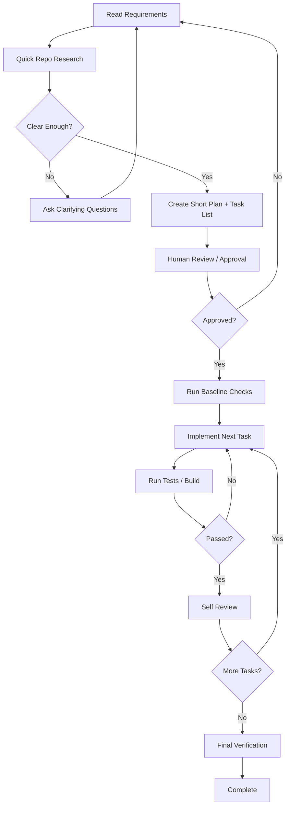

# Agent Harness Guide

This file is a short operating guide for coding agents in this repository.

## Start Here
- If `REMOTE_BUILD=1`, export `REMOTE_BUILD_IMAGE` first.
- Run `HARNESS_INSTALL_NPM_DEPS=1 ./scripts/harness/setup.sh` on clean checkout
- Run `npm run ci`
- Run `./scripts/harness/start.sh` (foreground dev mode)

## Expected PR Workflow
1. Run `npm run ci`.
2. Fix any failing checks.
3. Complete the agent self-review checklist: `docs/development/agent-review.md`.
4. Open a PR using `.github/pull_request_template.md`.
5. Confirm docs are updated when behavior changes.

## Documentation Table of Contents
- [Architecture Summary](ARCHITECTURE.md)
- [Docs Home](docs/index.md)
- [Development Setup](docs/development/setup.md)
- [Development Commands](docs/development/commands.md)
- [Human-Gated Flow](docs/development/human-gated-taskwise-delivery-flow.md)
- [Testing](docs/development/testing.md)
- [Debugging](docs/development/debugging.md)
- [Agent Self-Review](docs/development/agent-review.md)
- [PR Workflow](docs/development/pr-workflow.md)
- [Architecture Docs](docs/architecture/index.md)
- [Product Docs](docs/product/index.md)
- [Quality Docs](docs/quality/scorecard.md)
- [Golden Principles](docs/quality/golden-principles.md)

## Execution Plans
- Small tasks can use inline plans in the task conversation.
- Non-trivial tasks must use the Non-Trivial Task Flow below.
- Complex tasks must create an execution plan using `docs/exec-plans/template.md`.
- Plans must be updated during work as steps complete or scope changes.
- Completed plans move from `docs/exec-plans/active/` to `docs/exec-plans/completed/`.
- Complex task plans must include the required `Human-Gated Flow Evidence` checklist from the template.
- Flow reference: `docs/development/human-gated-taskwise-delivery-flow.md`.

## Non-Trivial Task Flow
Use this flow for any task that requires repository changes beyond a tiny, obvious edit, touches multiple files, changes behavior, affects tests or build output, or has ambiguous requirements.

## Operating Rules
- Prefer `npm run ci` for the required lint/test gate.
- Treat non-zero exit codes as failures.
- Do not assume behavior that is not documented in this repository.
- Mark missing evidence as `TODO` instead of guessing.

## Remote Build Runner
Use `http://host.docker.internal:38127` and call `POST /run` with:
- `image`
- `workdir`
- `cmd` (non-empty string array, for example `["sh","-lc","echo ok"]`)

For `workdir`, prefer `TASK_WORKSPACE_PATH`.

Runner mount support:
- `dockerSocketContainerPath`: `/var/run/docker.sock` (available for mounting Docker into the runner container)

Remote harness mode:
- Set `REMOTE_BUILD=1` to force remaining harness scripts to run in Remote Build Runner.
- Set `REMOTE_BUILD_IMAGE` to the container image used by the runner request.
- Optional: set `REMOTE_BUILD_RUNNER_URL` (defaults to `http://host.docker.internal:38127`).
- Harness scripts auto-route to `POST /run` before local execution when remote mode is enabled.
- Set `REMOTE_BUILD=0` (or unset it) to run harness scripts locally.
- Use a remote image that has: `bash`, `node`, `npm`, `python3`, `docker`, and Docker Compose.

<!-- OPENWIKI:START -->

## OpenWiki

This repository uses OpenWiki for recurring code documentation. Start with `openwiki/quickstart.md`, then follow its links to architecture, workflows, domain concepts, operations, integrations, testing guidance, and source maps.

The scheduled OpenWiki GitHub Actions workflow refreshes the repository wiki. Do not hand-edit generated OpenWiki pages unless explicitly asked; prefer updating source code/docs and letting OpenWiki regenerate.

<!-- OPENWIKI:END -->
