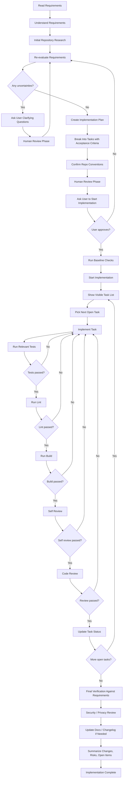

# Human-Gated Taskwise Delivery Flow

This flow is the required delivery path for agent-driven implementation work in this repository.

## Required Evidence In Execution Plans
Complex tasks must record this evidence in the execution plan:
- `Requirements Read`
- `Requirements Understood`
- `Repository Research Complete`
- `Uncertainties Logged`
- `Human Review Completed`
- `User Approval To Start`
- `Baseline Checks Run`
- `Visible Task List Updated`
- `Task-Level Tests/Lint/Build`
- `Self Review Complete`
- `Code Review Complete`
- `Final Verification Complete`
- `Security/Privacy Review Complete`
- `Docs/Changelog Updated`

Use `docs/exec-plans/template.md` and keep the evidence checklist current while implementing.
