# User Flows

## Login (Current Harness Coverage)
1. Open `/login`.
2. Enter admin email and password.
3. Click **Sign in**.
4. User is redirected to their first allowed page.

Notes:
- Default first-boot admin values come from `.env` / `.env.example`.
- This flow is validated by Playwright in `apps/web/e2e/auth.smoke.spec.ts`.

## TODO
- Task flows are documented below.
- TODO: Document repository connect/sync flow.
- TODO: Document settings and credentials flow.

## Task Flows (New + Existing)

```mermaid
flowchart TD
  subgraph A[New Task Flow]
    A1[User opens Create Task]
    A2[Fill config: source, repo, title, prompt, provider, mode]
    A3{Optional: Magic Prompt?}
    A4[POST /tasks/prompt-magic]
    A5[Prompt returned + textarea/title updated]
    A6[Submit create form]
    A7{Source type}
    A8[Blank/Snippet/Sequence -> POST /tasks]
    A9[Issue -> POST /imports/issue]
    A10[PR -> POST /imports/pull-request]
    A11[Task row created in store]
    A12{Start mode}
    A13[run_now -> enqueue action via Scheduler]
    A14[prepare_workspace -> clone/checkout only]
    A15[idle -> no immediate execution]
    A16[Task Detail opens]
    A17[If preparing: spinner notice shown]
  end

  A1 --> A2 --> A3
  A3 -- Yes --> A4 --> A5 --> A6
  A3 -- No --> A6
  A6 --> A7
  A7 --> A8 --> A11
  A7 --> A9 --> A11
  A7 --> A10 --> A11
  A11 --> A12
  A12 --> A13 --> A16
  A12 --> A14 --> A16
  A12 --> A15 --> A16
  A14 --> A17

  subgraph B[Existing Build Flow]
    B1[Open existing task]
    B2[Click Build or send Build message]
    B3[Scheduler triggerAction build]
    B4{Can run now? active/queued/archived/pending checkpoint/terminal active}
    B5[Set queued status + enqueue]
    B6[Worker dequeues]
    B7[Status -> building]
    B8[Spawner ensures workspace clone/checkout]
    B9[Run provider build execution]
    B10[Stream logs + runs/messages]
    B11{Changes produced?}
    B12[Create pending checkpoint/change proposal]
    B13[Wait for Apply/Reject/Revert]
    B14[Continue or stop depending on sequence mode]
    B15[Status -> done/failed/cancelled]
  end

  B1 --> B2 --> B3 --> B4
  B4 -- No --> B15
  B4 -- Yes --> B5 --> B6 --> B7 --> B8 --> B9 --> B10 --> B11
  B11 -- Yes --> B12 --> B13 --> B14 --> B15
  B11 -- No --> B15

  subgraph C[Existing Ask Flow]
    C1[Open existing task]
    C2[Click Ask or send Ask message]
    C3[Scheduler triggerAction ask]
    C4{Parallel ask allowed while already building or asking}
    C5[Run ask immediately if capacity]
    C6[Else queue ask]
    C7[Status -> asking]
    C8[Spawner ensures workspace/context]
    C9[Run provider ask execution]
    C10[Stream logs + assistant response]
    C11[Status -> answered/failed/cancelled]
  end

  C1 --> C2 --> C3 --> C4
  C4 -- Yes --> C5 --> C7
  C4 -- No --> C6 --> C7
  C7 --> C8 --> C9 --> C10 --> C11
```

## Code Flow (Implementation Path)

```mermaid
flowchart TD
  subgraph N[New Task - Code Path]
    N1[web: task-create-page.tsx submit]
    N2[web: buildTaskDefinitionInput]
    N3[web: createTaskFromDefinition]
    N4{sourceType}
    N5[web api: POST /tasks]
    N6[web api: POST /imports/issue]
    N7[web api: POST /imports/pull-request]
    N8[server route: routes/tasks.ts or routes/imports.ts]
    N9[server: taskStore.createTask]
    N10[server: applyTaskStartMode]
    N11{startMode}
    N12[scheduler.triggerAction]
    N13[spawner.prepareWorkspace]
    N14[task persisted + events published]
  end

  N1 --> N2 --> N3 --> N4
  N4 -- blank/snippet/sequence --> N5 --> N8
  N4 -- issue --> N6 --> N8
  N4 -- pull_request --> N7 --> N8
  N8 --> N9 --> N10 --> N11
  N11 -- run_now --> N12 --> N14
  N11 -- prepare_workspace --> N13 --> N14
  N11 -- idle --> N14

  subgraph B[Existing Build - Code Path]
    B1[web: task-detail build action]
    B2[web api: POST /tasks/:id/actions action=build]
    B3[server route: routes/tasks.ts]
    B4[scheduler triggerAction build]
    B5[taskStore.markQueuedForAction]
    B6[taskQueueStore.replaceTask]
    B7[scheduler.drainQueue dequeue]
    B8[scheduler.executeTask]
    B9[spawner.run build provider]
    B10[taskStore.createRun/updateRun/appendLog]
    B11{pending checkpoint?}
    B12[taskStore upsert pending change proposal]
    B13[route handlers apply/reject/revert checkpoint]
    B14[task terminal status update + event publish]
  end

  B1 --> B2 --> B3 --> B4 --> B5 --> B6 --> B7 --> B8 --> B9 --> B10 --> B11
  B11 -- Yes --> B12 --> B13 --> B14
  B11 -- No --> B14

  subgraph A[Existing Ask - Code Path]
    A1[web: task-detail ask action]
    A2[web api: POST /tasks/:id/actions action=ask]
    A3[server route: routes/tasks.ts]
    A4[scheduler triggerAction ask]
    A5{parallel ask allowed}
    A6[scheduler.executeTask direct]
    A7[queue via taskQueueStore]
    A8[scheduler.executeTask from queue]
    A9[spawner.run ask provider]
    A10[taskStore.createRun/updateRun/appendLog]
    A11[task status answered/failed/cancelled + events]
  end

  A1 --> A2 --> A3 --> A4 --> A5
  A5 -- Yes --> A6 --> A9
  A5 -- No --> A7 --> A8 --> A9
  A9 --> A10 --> A11
```

