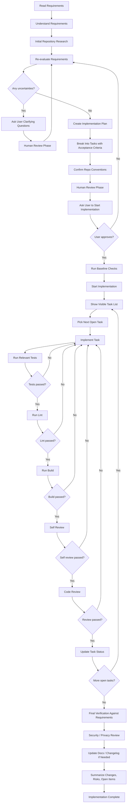
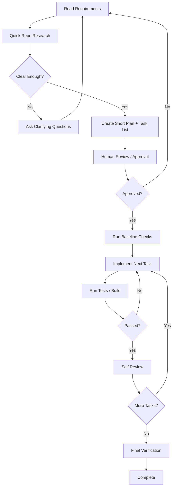
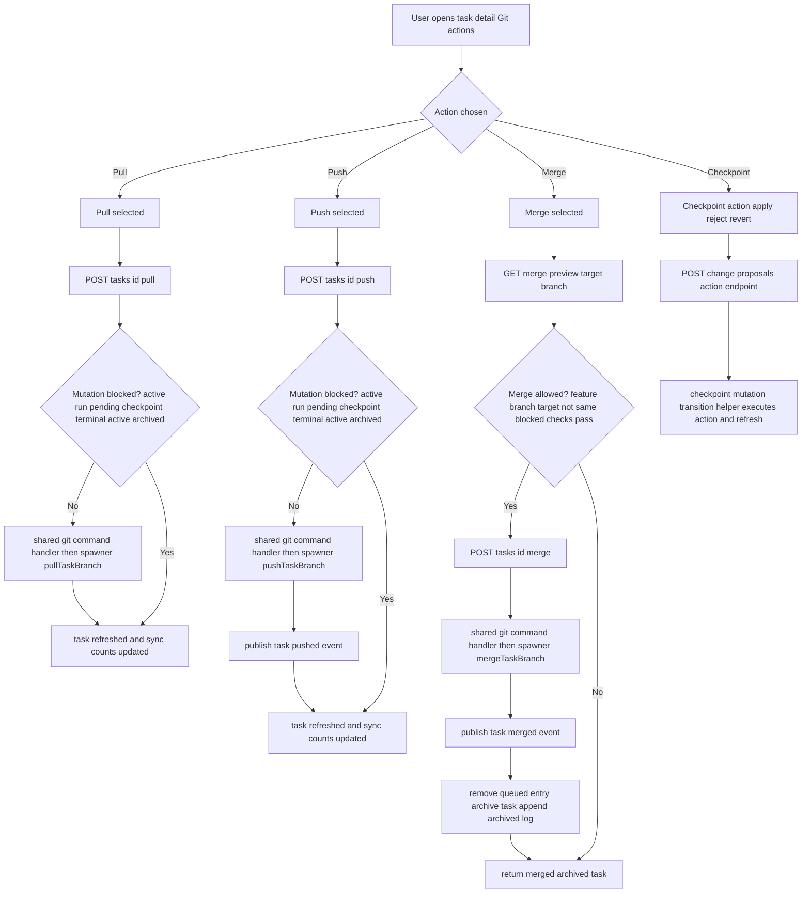

This file is a merged representation of the entire codebase, combined into a single document by Repomix.

# File Summary

## Purpose
This file contains a packed representation of the entire repository's contents.
It is designed to be easily consumable by AI systems for analysis, code review,
or other automated processes.

## File Format
The content is organized as follows:
1. This summary section
2. Repository information
3. Directory structure
4. Repository files (if enabled)
5. Multiple file entries, each consisting of:
  a. A header with the file path (## File: path/to/file)
  b. The full contents of the file in a code block

## Usage Guidelines
- This file should be treated as read-only. Any changes should be made to the
  original repository files, not this packed version.
- When processing this file, use the file path to distinguish
  between different files in the repository.
- Be aware that this file may contain sensitive information. Handle it with
  the same level of security as you would the original repository.

## Notes
- Some files may have been excluded based on .gitignore rules and Repomix's configuration
- Binary files are not included in this packed representation. Please refer to the Repository Structure section for a complete list of file paths, including binary files
- Files matching patterns in .gitignore are excluded
- Files matching default ignore patterns are excluded
- Files are sorted by Git change count (files with more changes are at the bottom)

# Directory Structure
```
.github/
  workflows/
    harness-check.yml
  pull_request_template.md
agent-runtime/
  Dockerfile
  run-task.sh
agent-runtime-claude/
  Dockerfile
  run-task.mjs
agent-runtime-codex/
  Dockerfile
  run-task.mjs
apps/
  server/
    src/
      config/
        env.ts
      db/
        backfill-redis-to-postgres.ts
        migrate.ts
        migrations.ts
      lib/
        agent-event-parser.test.ts
        agent-event-parser.ts
        auth.ts
        branch.ts
        docker-socket-access.test.ts
        docker-socket-access.ts
        events.ts
        git-env.test.ts
        git-env.ts
        git-locks.test.ts
        git-locks.ts
        git-paths.test.ts
        git-paths.ts
        git-runtime-mounts.test.ts
        git-runtime-mounts.ts
        github-status-sync.ts
        http-error.ts
        managed-git-hooks.test.ts
        managed-git-hooks.ts
        mcp-config.test.ts
        mcp-config.ts
        postflight-config.test.ts
        postflight-config.ts
        postgres.ts
        provider-config.test.ts
        provider-config.ts
        redis.ts
        repository-runtime-env.ts
        safe-workspace-file.test.ts
        safe-workspace-file.ts
        task-capability-access.ts
        task-commit-subject.test.ts
        task-commit-subject.ts
        task-git-identity.test.ts
        task-git-identity.ts
        task-intelligence.ts
        task-interactive-terminal-git-env.ts
        task-interactive-terminal-start-script.ts
        task-interactive-terminal.test.ts
        task-interactive-terminal.ts
        task-mutation-guards.test.ts
        task-mutation-guards.ts
        task-ownership.ts
        task-prompt-attachments.ts
        task-provider-state.test.ts
        task-provider-state.ts
        task-start-orchestrator.test.ts
        task-start-orchestrator.ts
        task-status.test.ts
        task-status.ts
      providers/
        runtime-definitions.ts
      routes/
        auth.ts
        github-webhooks.test.ts
        github-webhooks.ts
        imports.ts
        repositories.ts
        roles.ts
        settings.ts
        snippets.ts
        tasks.ts
        users.ts
      services/
        app-stores.ts
        create-postgres-stores.ts
        credential-store.ts
        github-import-service.ts
        github-outbound-queue-store.ts
        github-outbound-service.test.ts
        github-outbound-service.ts
        github-status-sync-service.test.ts
        github-status-sync-service.ts
        openai-diff-assist-service.ts
        openai-task-prompt-magic-service.ts
        repo-sync-manager.test.ts
        repo-sync-manager.ts
        repository-env-file-store.ts
        repository-store.ts
        role-store.ts
        scheduler.test.ts
        scheduler.ts
        session-store.ts
        settings-store.ts
        snippet-store.ts
        spawner.ts
        spawner.workspace-provisioning.test.ts
        task-queue-store.ts
        task-store.test.ts
        task-store.ts
        user-store.ts
        webhook-delivery-service.test.ts
        webhook-delivery-service.ts
        webhook-delivery-store.ts
      types/
        fastify.d.ts
      index.ts
    Dockerfile
    package.json
    tsconfig.json
  web/
    app/
      login/
        page.tsx
      presets/
        page.tsx
      repositories/
        [id]/
          edit/
            page.tsx
        new/
          page.tsx
        page.tsx
      settings/
        page.tsx
      snippets/
        [id]/
          edit/
            page.tsx
        new/
          page.tsx
        page.tsx
      tasks/
        [id]/
          interactive/
            page.tsx
          page.tsx
        board/
          page.tsx
        new/
          page.tsx
        page.tsx
      users/
        page.tsx
      globals.css
      layout.tsx
      page.tsx
    components/
      app-footer-note.tsx
      app-logo.tsx
      app-right-panel-context.tsx
      app-shell.tsx
      app-sidebar.tsx
      auth-provider.tsx
      checkpoint-file-editor-modal.tsx
      login-page.tsx
      notes-markdown-editor.tsx
      repositories-page.tsx
      repository-editor-page.tsx
      response-policy-fields.tsx
      settings-page.tsx
      snippet-editor-page.tsx
      snippets-page.tsx
      task-binary-diff-card.tsx
      task-browser-notifications.tsx
      task-create-modal.tsx
      task-create-page.tsx
      task-definition-fields.tsx
      task-detail-page.tsx
      task-diff-openai-panel.tsx
      task-files-tab.tsx
      task-interactive-terminal-view.tsx
      task-prompt-attachments-input.tsx
      task-terminal-transcript-view.tsx
      tasks-kanban-board-page.tsx
      tasks-page.tsx
      theme-provider.tsx
      users-page.tsx
      workspace-file-preview-modal.tsx
    e2e/
      auth.smoke.spec.ts
    public/
      logo.svg
    src/
      api/
        client.ts
      auth/
        access.ts
      hooks/
        useProviderModels.ts
        useRepositories.ts
        useSettings.ts
        useSnippets.ts
        useSocket.ts
        useTask.ts
        useTaskChangeProposals.ts
        useTaskMessages.ts
        useTaskRuns.ts
        useTasks.ts
      lib/
        public-url.ts
      theme/
        antd-theme.ts
        code-highlighting.ts
      utils/
        analytics.ts
        diff.test.ts
        diff.ts
        seen-tasks.ts
        snippets.test.ts
        snippets.ts
        task-definition-submit.ts
        task-history.test.ts
        task-history.ts
        task-lifecycle-view-model.test.ts
        task-lifecycle-view-model.ts
        task-prompt-attachments.ts
        workspace-file-links.test.ts
        workspace-file-links.ts
    Dockerfile
    logo.svg
    next-env.d.ts
    next.config.mjs
    package.json
    tsconfig.json
deploy/
  nginx.conf
docs/
  architecture/
    boundaries.md
    domains.md
    index.md
  development/
    agent-review.md
    commands.md
    debugging.md
    human-gated-taskwise-delivery-flow.md
    pr-workflow.md
    setup.md
    testing.md
  exec-plans/
    active/
      .gitkeep
      2026-06-01-scheduler-for-planned-tasks.md
    completed/
      .gitkeep
      2026-05-24-clone-workspaces.md
      2026-05-25-single-task-workspace.md
      2026-05-27-task-flow-unification.md
      2026-06-01-env-file-upload-vars-secrets.md
      2026-06-01-repository-environment-secrets.md
    template.md
  product/
    index.md
    terminology.md
    user-flows.md
  quality/
    golden-principles.md
    known-issues.md
    scorecard.md
    tech-debt.md
  github-sync-ownership-model.md
  index.md
examples/
  github-automations.comment-triggers.json
packages/
  shared-types/
    src/
      index.ts
    package.json
    tsconfig.json
scripts/
  harness/
    lib/
      remote-build.sh
    boundary-check.mjs
    check-docs.sh
    check-human-gated-flow.sh
    check.sh
    doctor.sh
    logs.sh
    pr-ready.sh
    setup.sh
    start.sh
    test.sh
tools/
  codex-web-terminal/
    git-terminal-bin/
      diff3
      git
      nvim
      vi
      vim
    public/
      client.mjs
      index.html
    .dockerignore
    .gitignore
    docker-compose.yml
    Dockerfile.claude
    Dockerfile.codex
    Dockerfile.git
    Dockerfile.proxy
    git-terminal-shell.sh
    package.json
    README.md
    server.mjs
.dockerignore
.env.example
.gitignore
.repomixignore
AGENTS.md
agentswarm.sh
ARCHITECTURE.md
docker-compose.yml
package.json
playwright.config.ts
README.md
repomix.config.json
tsconfig.base.json
```

# Files

## File: agent-runtime/Dockerfile
````
FROM node:20-alpine

RUN apk add --no-cache git bash openssh-client ripgrep curl

WORKDIR /runtime
COPY run-task.sh /usr/local/bin/run-task.sh
RUN chmod +x /usr/local/bin/run-task.sh

ENTRYPOINT ["/usr/local/bin/run-task.sh"]
````

## File: apps/server/src/db/migrate.ts
````typescript
import { env } from "../config/env.js";
import { createPostgresPool, runPostgresMigrations } from "../lib/postgres.js";

const main = async (): Promise<void> => {
  const pool = createPostgresPool(env.DATABASE_URL);
  try {
    await runPostgresMigrations(pool);
  } finally {
    await pool.end();
  }
};

void main().catch((error) => {
  console.error(error);
  process.exit(1);
});
````

## File: apps/server/src/lib/branch.ts
````typescript
const sanitizeBranchPrefix = (branchPrefix: string): string => {
  const cleaned = branchPrefix
    .toLowerCase()
    .trim()
    .replace(/[^a-z0-9/_-]+/g, "-")
    .replace(/\/+/g, "/")
    .replace(/^\/+|\/+$/g, "");

  return cleaned || "agentswarm";
};

export const makeBranchName = (title: string, taskId: string, branchPrefix: string): string => {
  const slug = title
    .toLowerCase()
    .trim()
    .replace(/[^a-z0-9]+/g, "-")
    .replace(/^-+|-+$/g, "")
    .slice(0, 40);

  const suffix = taskId.slice(0, 8);
  const safeSlug = slug.length > 0 ? slug : "task";
  return `${sanitizeBranchPrefix(branchPrefix)}/${safeSlug}-${suffix}`;
};
````

## File: apps/server/src/lib/events.ts
````typescript
import type Redis from "ioredis";
import type { RealtimeEvent } from "@agentswarm/shared-types";

export class EventBus {
  constructor(
    private readonly publisher: Redis,
    private readonly channel: string
  ) {}

  async publish(event: RealtimeEvent): Promise<void> {
    await this.publisher.publish(this.channel, JSON.stringify(event));
  }
}
````

## File: apps/server/src/lib/git-env.test.ts
````typescript
import assert from "node:assert/strict";
import { execFile as execFileCallback } from "node:child_process";
import { mkdtemp, rm } from "node:fs/promises";
import { tmpdir } from "node:os";
import path from "node:path";
import { describe, it } from "node:test";
import { promisify } from "node:util";
import { buildGitProcessEnv } from "./git-env.js";

const execFile = promisify(execFileCallback);

async function git(args: string[], cwd: string, env?: NodeJS.ProcessEnv): Promise<string> {
  const result = await execFile("git", args, {
    cwd,
    env: env ? { ...process.env, ...env } : process.env
  });
  return result.stdout;
}

describe("buildGitProcessEnv", () => {
  it("sets author and committer identity when provided", async () => {
    const env = await buildGitProcessEnv({
      workspacePath: "/tmp/workspace",
      gitIdentity: {
        name: "Ada Lovelace",
        email: "ada@example.com"
      }
    });

    assert.equal(env.GIT_AUTHOR_NAME, "Ada Lovelace");
    assert.equal(env.GIT_AUTHOR_EMAIL, "ada@example.com");
    assert.equal(env.GIT_COMMITTER_NAME, "Ada Lovelace");
    assert.equal(env.GIT_COMMITTER_EMAIL, "ada@example.com");
  });

  it("allows squash merges in a worktree without relying on global git config", async () => {
    const root = await mkdtemp(path.join(tmpdir(), "agentswarm-git-env-"));
    const originPath = path.join(root, "origin.git");
    const seedPath = path.join(root, "seed");
    const managedPath = path.join(root, "managed");
    const worktreePath = path.join(root, "merge-worktree");

    try {
      await git(["init", "--bare", originPath], root);
      await git(["clone", originPath, seedPath], root);

      await git(["checkout", "-b", "main"], seedPath);
      await git(["config", "user.name", "Repo Seeder"], seedPath);
      await git(["config", "user.email", "seed@example.com"], seedPath);
      await git(["config", "commit.gpgsign", "false"], seedPath);
      await git(["config", "tag.gpgsign", "false"], seedPath);
      await git(["config", "init.defaultBranch", "main"], seedPath);

      await git(["-c", "user.name=Repo Seeder", "-c", "user.email=seed@example.com", "commit", "--allow-empty", "-m", "base"], seedPath);
      await git(["push", "-u", "origin", "main"], seedPath);

      await git(["checkout", "-b", "feature"], seedPath);
      await git(["-c", "user.name=Repo Seeder", "-c", "user.email=seed@example.com", "commit", "--allow-empty", "-m", "feature"], seedPath);
      await git(["push", "-u", "origin", "feature"], seedPath);

      await git(["checkout", "main"], seedPath);
      await git(["-c", "user.name=Repo Seeder", "-c", "user.email=seed@example.com", "commit", "--allow-empty", "-m", "main"], seedPath);
      await git(["push", "origin", "main"], seedPath);

      await git(["clone", originPath, managedPath], root);
      await git(["fetch", "origin", "main", "feature"], managedPath);
      await git(["worktree", "add", "-b", "merge-branch", worktreePath, "origin/main"], managedPath);

      const gitEnv = await buildGitProcessEnv({
        workspacePath: worktreePath,
        gitIdentity: {
          name: "Task Owner",
          email: "owner@example.com"
        }
      });

      await git(["-C", worktreePath, "merge", "--squash", "--no-commit", "origin/feature"], root, gitEnv);
    } finally {
      await rm(root, { recursive: true, force: true });
    }
  });
});
````

## File: apps/server/src/lib/git-env.ts
````typescript
import { chmod, writeFile } from "node:fs/promises";

let gitAskPassPath: string | null = null;

export interface GitProcessIdentity {
  name: string;
  email: string;
}

export async function ensureGitAskPassScript(): Promise<string> {
  if (gitAskPassPath) {
    return gitAskPassPath;
  }

  const askPassPath = "/tmp/agentswarm-git-askpass.sh";
  await writeFile(
    askPassPath,
    `#!/usr/bin/env sh
case "$1" in
  *sername*) echo "\${GIT_USERNAME:-x-access-token}" ;;
  *assword*) echo "\${GIT_TOKEN:-}" ;;
  *) echo "" ;;
esac
`,
    "utf8"
  );
  await chmod(askPassPath, 0o700);
  gitAskPassPath = askPassPath;
  return askPassPath;
}

export async function buildGitProcessEnv(options: {
  workspacePath?: string | null;
  githubToken?: string | null;
  gitUsername?: string | null;
  gitIdentity?: GitProcessIdentity | null;
}): Promise<NodeJS.ProcessEnv> {
  const gitEnv: NodeJS.ProcessEnv = {
    GIT_OPTIONAL_LOCKS: "0"
  };
  const githubToken = options.githubToken?.trim() ? options.githubToken.trim() : options.githubToken ?? null;
  const gitUsername = options.gitUsername?.trim() ? options.gitUsername.trim() : "x-access-token";

  if (githubToken) {
    gitEnv.GIT_TERMINAL_PROMPT = "0";
    gitEnv.GIT_ASKPASS = await ensureGitAskPassScript();
    gitEnv.GIT_USERNAME = gitUsername;
    gitEnv.GIT_TOKEN = githubToken;
  }

  const gitIdentity = options.gitIdentity ?? null;
  const identityName = gitIdentity?.name.trim() ?? "";
  const identityEmail = gitIdentity?.email.trim() ?? "";
  if (identityName && identityEmail) {
    gitEnv.GIT_AUTHOR_NAME = identityName;
    gitEnv.GIT_AUTHOR_EMAIL = identityEmail;
    gitEnv.GIT_COMMITTER_NAME = identityName;
    gitEnv.GIT_COMMITTER_EMAIL = identityEmail;
  }

  const workspacePath = options.workspacePath?.trim();
  if (workspacePath) {
    gitEnv.GIT_CONFIG_COUNT = "1";
    gitEnv.GIT_CONFIG_KEY_0 = "safe.directory";
    gitEnv.GIT_CONFIG_VALUE_0 = workspacePath;
  }

  return gitEnv;
}
````

## File: apps/server/src/lib/git-locks.test.ts
````typescript
import assert from "node:assert/strict";
import { describe, it } from "node:test";
import { extractGitLockPathFromErrorMessage, isPathInside, resolveGitTargetLockKey } from "./git-locks.js";

describe("extractGitLockPathFromErrorMessage", () => {
  it("returns the lock path from a git unable-to-create error", () => {
    const message =
      "fatal: Unable to create '/task-workspaces/task-1/.git/index.lock': File exists.\nAnother git process seems to be running.";
    assert.equal(extractGitLockPathFromErrorMessage(message), "/task-workspaces/task-1/.git/index.lock");
  });

  it("returns null when the message does not include a lock path", () => {
    assert.equal(extractGitLockPathFromErrorMessage("fatal: not a git repository"), null);
  });
});

describe("resolveGitTargetLockKey", () => {
  it("uses the -C repository path", () => {
    assert.equal(resolveGitTargetLockKey(["-C", "/task-workspaces/task-1", "status"]), "/task-workspaces/task-1");
  });

  it("uses the --git-dir repository path", () => {
    assert.equal(
      resolveGitTargetLockKey(["--git-dir", "/repo-cache/example.git", "show", "main:README.md"]),
      "/repo-cache/example.git"
    );
  });

  it("uses the destination path for clone", () => {
    assert.equal(
      resolveGitTargetLockKey(["clone", "--no-local", "/repo-cache/example.git", "/task-workspaces/task-1"]),
      "/task-workspaces/task-1"
    );
  });

  it("returns null for git commands without a local target", () => {
    assert.equal(resolveGitTargetLockKey(["ls-remote", "--heads", "https://github.com/openai/openai-node.git"]), null);
  });
});

describe("isPathInside", () => {
  it("accepts paths within the root", () => {
    assert.equal(isPathInside("/task-workspaces", "/task-workspaces/task-1/.git/index.lock"), true);
  });

  it("rejects paths outside the root", () => {
    assert.equal(isPathInside("/task-workspaces", "/tmp/index.lock"), false);
  });
});
````

## File: apps/server/src/lib/git-locks.ts
````typescript
import path from "node:path";

const gitLockPatterns = [
  /unable to create '([^']+\.lock)'/i,
  /could not lock(?: [^']+)? '([^']+\.lock)'/i
];

export const extractGitLockPathFromErrorMessage = (message: string): string | null => {
  for (const pattern of gitLockPatterns) {
    const match = message.match(pattern);
    if (match?.[1]) {
      return path.normalize(match[1]);
    }
  }

  return null;
};

const normalizeAbsoluteArg = (value: string | undefined): string | null =>
  typeof value === "string" && path.isAbsolute(value) ? path.normalize(value) : null;

export const resolveGitTargetLockKey = (args: string[]): string | null => {
  for (let index = 0; index < args.length - 1; index += 1) {
    if (args[index] === "-C" || args[index] === "--git-dir") {
      const resolved = normalizeAbsoluteArg(args[index + 1]);
      if (resolved) {
        return resolved;
      }
    }
  }

  if (args[0] === "clone") {
    return normalizeAbsoluteArg(args[args.length - 1]);
  }

  return null;
};

export const isPathInside = (root: string, candidate: string): boolean => {
  const normalizedRoot = path.normalize(root);
  const normalizedCandidate = path.normalize(candidate);
  const relative = path.relative(normalizedRoot, normalizedCandidate);
  return relative === "" || (!relative.startsWith(`..${path.sep}`) && relative !== ".." && !path.isAbsolute(relative));
};
````

## File: apps/server/src/lib/git-paths.test.ts
````typescript
import assert from "node:assert/strict";
import { mkdtemp, mkdir, rm, writeFile } from "node:fs/promises";
import { tmpdir } from "node:os";
import path from "node:path";
import { describe, it } from "node:test";
import { resolveGitPaths } from "./git-paths.js";

describe("resolveGitPaths", () => {
  it("returns a standard git directory unchanged", async () => {
    const root = await mkdtemp(path.join(tmpdir(), "agentswarm-git-paths-"));
    const gitDir = path.join(root, ".git");

    try {
      await mkdir(gitDir, { recursive: true });
      const resolved = await resolveGitPaths(gitDir);
      assert.deepEqual(resolved, {
        gitDir,
        commonDir: gitDir,
        usesLinkedWorktree: false
      });
    } finally {
      await rm(root, { recursive: true, force: true });
    }
  });

  it("resolves linked worktree .git files to the shared common dir", async () => {
    const root = await mkdtemp(path.join(tmpdir(), "agentswarm-git-paths-"));
    const workspacePath = path.join(root, "workspace");
    const commonDir = path.join(root, "repo", ".git");
    const worktreeGitDir = path.join(commonDir, "worktrees", "task-1");
    const dotGitPath = path.join(workspacePath, ".git");

    try {
      await mkdir(workspacePath, { recursive: true });
      await mkdir(worktreeGitDir, { recursive: true });
      await writeFile(path.join(worktreeGitDir, "commondir"), "../..", "utf8");
      await writeFile(dotGitPath, `gitdir: ../repo/.git/worktrees/task-1\n`, "utf8");

      const resolved = await resolveGitPaths(dotGitPath);
      assert.deepEqual(resolved, {
        gitDir: worktreeGitDir,
        commonDir,
        usesLinkedWorktree: true
      });
    } finally {
      await rm(root, { recursive: true, force: true });
    }
  });
});
````

## File: apps/server/src/lib/git-paths.ts
````typescript
import { lstat, readFile } from "node:fs/promises";
import path from "node:path";

export interface GitPaths {
  gitDir: string;
  commonDir: string;
  usesLinkedWorktree: boolean;
}

async function resolveCommonDir(gitDir: string): Promise<string> {
  const raw = await readFile(path.join(gitDir, "commondir"), "utf8").catch(() => "");
  return raw.trim() ? path.resolve(gitDir, raw.trim()) : gitDir;
}

export async function resolveGitPaths(gitPath: string): Promise<GitPaths> {
  const stat = await lstat(gitPath);

  if (stat.isDirectory()) {
    const commonDir = await resolveCommonDir(gitPath);
    return {
      gitDir: gitPath,
      commonDir,
      usesLinkedWorktree: commonDir !== gitPath
    };
  }

  if (!stat.isFile()) {
    throw new Error(`Unsupported git path: ${gitPath}`);
  }

  const raw = await readFile(gitPath, "utf8");
  const match = raw.match(/^gitdir:\s*(.+)$/im);
  if (!match?.[1]) {
    throw new Error(`Unsupported .git file: ${gitPath}`);
  }

  const gitDir = path.resolve(path.dirname(gitPath), match[1].trim());
  const commonDir = await resolveCommonDir(gitDir);
  return {
    gitDir,
    commonDir,
    usesLinkedWorktree: true
  };
}
````

## File: apps/server/src/lib/git-runtime-mounts.test.ts
````typescript
import assert from "node:assert/strict";
import { describe, it } from "node:test";
import { resolveGitRuntimeMountsForPaths } from "./git-runtime-mounts.js";

describe("resolveGitRuntimeMountsForPaths", () => {
  it("does not add mounts for regular clone workspaces", () => {
    const mounts = resolveGitRuntimeMountsForPaths({
      gitDir: "/task-workspaces/task-1/.git",
      commonDir: "/task-workspaces/task-1/.git",
      usesLinkedWorktree: false
    });

    assert.deepEqual(mounts, []);
  });

  it("mounts the shared repo cache for linked worktrees", () => {
    const mounts = resolveGitRuntimeMountsForPaths({
      gitDir: "/repo-cache/repos/example/.git/worktrees/task-1",
      commonDir: "/repo-cache/repos/example/.git",
      usesLinkedWorktree: true
    });

    assert.deepEqual(mounts, ["-v", "agentswarm_repo_cache:/repo-cache:rw"]);
  });

  it("skips extra mounts when linked worktree metadata lives outside the repo cache root", () => {
    const mounts = resolveGitRuntimeMountsForPaths({
      gitDir: "/tmp/git/worktrees/task-1",
      commonDir: "/tmp/git",
      usesLinkedWorktree: true
    });

    assert.deepEqual(mounts, []);
  });
});
````

## File: apps/server/src/lib/git-runtime-mounts.ts
````typescript
import path from "node:path";
import { env } from "../config/env.js";
import { isPathInside } from "./git-locks.js";
import type { GitPaths } from "./git-paths.js";
import { resolveGitPaths } from "./git-paths.js";

export function resolveGitRuntimeMountsForPaths(
  gitPaths: GitPaths,
  options: {
    repoCacheRoot?: string;
    repoCacheVolume?: string;
  } = {}
): string[] {
  const repoCacheRoot = options.repoCacheRoot?.trim() || env.REPO_CACHE_ROOT;
  const repoCacheVolume = options.repoCacheVolume?.trim() || env.REPO_CACHE_VOLUME;
  if (!gitPaths.usesLinkedWorktree || !repoCacheRoot || !repoCacheVolume) {
    return [];
  }

  const needsRepoCacheMount =
    isPathInside(repoCacheRoot, gitPaths.gitDir) || isPathInside(repoCacheRoot, gitPaths.commonDir);
  if (!needsRepoCacheMount) {
    return [];
  }

  return ["-v", `${repoCacheVolume}:${repoCacheRoot}:rw`];
}

export async function resolveWorkspaceGitRuntimeMounts(workspacePath: string): Promise<string[]> {
  const gitPaths = await resolveGitPaths(path.join(workspacePath, ".git")).catch(() => null);
  return gitPaths ? resolveGitRuntimeMountsForPaths(gitPaths) : [];
}
````

## File: apps/server/src/lib/http-error.ts
````typescript
import type { FastifyReply } from "fastify";

export class HttpError extends Error {
  constructor(
    public readonly statusCode: number,
    message: string
  ) {
    super(message);
    this.name = "HttpError";
  }
}

export const isHttpError = (error: unknown): error is HttpError => error instanceof HttpError;

export const sendHttpError = (reply: FastifyReply, error: unknown): FastifyReply | null => {
  if (!isHttpError(error)) {
    return null;
  }

  return reply.status(error.statusCode).send({ message: error.message });
};
````

## File: apps/server/src/lib/managed-git-hooks.test.ts
````typescript
import assert from "node:assert/strict";
import { mkdtemp, mkdir, readFile, rm, stat, writeFile } from "node:fs/promises";
import { tmpdir } from "node:os";
import path from "node:path";
import { describe, it } from "node:test";
import { installManagedGitHooks, MANAGED_GIT_HOOKS } from "./managed-git-hooks.js";

describe("installManagedGitHooks", () => {
  it("writes blocking git hooks with execute permissions", async () => {
    const root = await mkdtemp(path.join(tmpdir(), "agentswarm-managed-hooks-"));
    const gitDir = path.join(root, ".git");

    try {
      await mkdir(gitDir, { recursive: true });
      await installManagedGitHooks(gitDir);

      for (const [hookName, content] of Object.entries(MANAGED_GIT_HOOKS)) {
        const hookPath = path.join(gitDir, "hooks", hookName);
        assert.equal(await readFile(hookPath, "utf8"), content);
        assert.equal((await stat(hookPath)).mode & 0o777, 0o755);
      }
    } finally {
      await rm(root, { recursive: true, force: true });
    }
  });

  it("installs hooks into the shared common dir for linked worktrees", async () => {
    const root = await mkdtemp(path.join(tmpdir(), "agentswarm-managed-hooks-"));
    const workspacePath = path.join(root, "workspace");
    const commonDir = path.join(root, "repo", ".git");
    const worktreeGitDir = path.join(commonDir, "worktrees", "task-1");
    const dotGitPath = path.join(workspacePath, ".git");

    try {
      await mkdir(workspacePath, { recursive: true });
      await mkdir(worktreeGitDir, { recursive: true });
      await writeFile(path.join(worktreeGitDir, "commondir"), "../..", "utf8");
      await writeFile(dotGitPath, "gitdir: ../repo/.git/worktrees/task-1\n", "utf8");

      await installManagedGitHooks(dotGitPath);

      for (const [hookName, content] of Object.entries(MANAGED_GIT_HOOKS)) {
        const hookPath = path.join(commonDir, "hooks", hookName);
        assert.equal(await readFile(hookPath, "utf8"), content);
        assert.equal((await stat(hookPath)).mode & 0o777, 0o755);
      }
    } finally {
      await rm(root, { recursive: true, force: true });
    }
  });
});
````

## File: apps/server/src/lib/managed-git-hooks.ts
````typescript
import { chmod, mkdir, writeFile } from "node:fs/promises";
import path from "node:path";
import { resolveGitPaths } from "./git-paths.js";

export const MANAGED_GIT_HOOKS = {
  "pre-commit": "#!/bin/sh\n# AgentSwarm: only the spawner may create commits.\nexit 1\n",
  "pre-push": "#!/bin/sh\n# AgentSwarm: only the spawner may push.\nexit 1\n"
} as const;

export async function installManagedGitHooks(gitPath: string): Promise<void> {
  const { commonDir } = await resolveGitPaths(gitPath);
  const hooksDir = path.join(commonDir, "hooks");
  await mkdir(hooksDir, { recursive: true });

  for (const [hookName, content] of Object.entries(MANAGED_GIT_HOOKS)) {
    const hookPath = path.join(hooksDir, hookName);
    await writeFile(hookPath, content, "utf8");
    await chmod(hookPath, 0o755);
  }
}
````

## File: apps/server/src/lib/mcp-config.test.ts
````typescript
import assert from "node:assert/strict";
import { describe, it } from "node:test";

import {
  collectMissingMcpServerBearerTokenEnvVars,
  collectMcpServerEnvEntries,
  serializeClaudeMcpConfig,
  serializeCodexMcpConfig
} from "./mcp-config.js";

describe("serializeCodexMcpConfig", () => {
  it("serializes enabled http and stdio servers", () => {
    const config = serializeCodexMcpConfig([
      {
        name: "memory",
        enabled: true,
        transport: "stdio",
        command: "npx",
        args: ["-y", "mcp-memory"]
      },
      {
        name: "remote",
        enabled: true,
        transport: "http",
        url: "https://example.com/mcp",
        bearerTokenEnvVar: "MCP_TOKEN"
      },
      {
        name: "disabled",
        enabled: false,
        transport: "stdio",
        command: "ignored"
      }
    ]);

    assert.match(config, /\[mcp_servers\.memory\]/);
    assert.match(config, /command = "npx"/);
    assert.match(config, /args = \["-y", "mcp-memory"\]/);
    assert.match(config, /\[mcp_servers\.remote\]/);
    assert.match(config, /url = "https:\/\/example\.com\/mcp"/);
    assert.match(config, /bearer_token_env_var = "MCP_TOKEN"/);
    assert.doesNotMatch(config, /disabled/);
  });
});

describe("serializeClaudeMcpConfig", () => {
  it("serializes enabled servers into Claude mcpServers", () => {
    const config = serializeClaudeMcpConfig([
      {
        name: "memory",
        enabled: true,
        transport: "stdio",
        command: "npx",
        args: ["-y", "mcp-memory"]
      },
      {
        name: "remote",
        enabled: true,
        transport: "http",
        url: "https://example.com/mcp",
        bearerTokenEnvVar: "MCP_TOKEN"
      }
    ]);

    assert.equal(
      config,
      JSON.stringify(
        {
          mcpServers: {
            memory: {
              type: "stdio",
              command: "npx",
              args: ["-y", "mcp-memory"],
              env: {}
            },
            remote: {
              type: "http",
              url: "https://example.com/mcp",
              headers: {
                Authorization: "Bearer ${MCP_TOKEN}"
              }
            }
          }
        },
        null,
        2
      )
    );
  });
});

describe("collectMcpServerEnvEntries", () => {
  it("collects bearer token env vars for enabled servers only", () => {
    const envEntries = collectMcpServerEnvEntries(
      [
        {
          name: "memory",
          enabled: true,
          transport: "http",
          url: "https://example.com/mcp",
          bearerTokenEnvVar: "MCP_TOKEN"
        },
        {
          name: "disabled",
          enabled: false,
          transport: "http",
          url: "https://example.com/disabled",
          bearerTokenEnvVar: "DISABLED_TOKEN"
        },
        {
          name: "stdio",
          enabled: true,
          transport: "stdio",
          command: "npx"
        }
      ],
      {
        MCP_TOKEN: "secret",
        DISABLED_TOKEN: "nope"
      }
    );

    assert.deepEqual(envEntries, [["MCP_TOKEN", "secret"]]);
  });

  it("ignores invalid bearer token env var names", () => {
    const envEntries = collectMcpServerEnvEntries(
      [
        {
          name: "remote",
          enabled: true,
          transport: "http",
          url: "https://example.com/mcp",
          bearerTokenEnvVar: "invalid-token-name"
        }
      ],
      {
        "invalid-token-name": "secret"
      }
    );

    assert.deepEqual(envEntries, []);
  });
});

describe("collectMissingMcpServerBearerTokenEnvVars", () => {
  it("returns missing runtime env vars for enabled servers", () => {
    const missing = collectMissingMcpServerBearerTokenEnvVars(
      [
        {
          name: "remote-a",
          enabled: true,
          transport: "http",
          url: "https://example.com/a",
          bearerTokenEnvVar: "TOKEN_A"
        },
        {
          name: "remote-b",
          enabled: true,
          transport: "http",
          url: "https://example.com/b",
          bearerTokenEnvVar: "TOKEN_B"
        },
        {
          name: "disabled",
          enabled: false,
          transport: "http",
          url: "https://example.com/disabled",
          bearerTokenEnvVar: "TOKEN_DISABLED"
        }
      ],
      {
        TOKEN_A: "present"
      }
    );

    assert.deepEqual(missing, ["TOKEN_B"]);
  });
});
````

## File: apps/server/src/lib/mcp-config.ts
````typescript
import type { McpServerConfig } from "@agentswarm/shared-types";

const tomlString = (value: string): string => JSON.stringify(value);
const ENV_VAR_NAME_PATTERN = /^[A-Za-z_][A-Za-z0-9_]*$/;

const enabledMcpServers = (servers: McpServerConfig[]): McpServerConfig[] => servers.filter((server) => server.enabled);

const validEnvVarName = (value: string): string | null => {
  const trimmed = value.trim();
  if (!trimmed || !ENV_VAR_NAME_PATTERN.test(trimmed)) {
    return null;
  }
  return trimmed;
};

export function serializeCodexMcpConfig(servers: McpServerConfig[]): string {
  const enabledServers = enabledMcpServers(servers);
  if (enabledServers.length === 0) {
    return "";
  }

  const lines: string[] = [];
  for (const server of enabledServers) {
    if (server.transport === "http") {
      if (!server.url) {
        continue;
      }
      lines.push(`[mcp_servers.${server.name}]`);
      lines.push(`url = ${tomlString(server.url)}`);
      if (server.bearerTokenEnvVar) {
        lines.push(`bearer_token_env_var = ${tomlString(server.bearerTokenEnvVar)}`);
      }
    } else {
      if (!server.command) {
        continue;
      }
      lines.push(`[mcp_servers.${server.name}]`);
      lines.push(`command = ${tomlString(server.command)}`);
      if ((server.args ?? []).length > 0) {
        lines.push(`args = [${(server.args ?? []).map(tomlString).join(", ")}]`);
      }
    }
    lines.push("");
  }

  return `${lines.join("\n").trim()}\n`;
}

export function serializeClaudeMcpConfig(servers: McpServerConfig[]): string {
  const mcpServers: Record<string, Record<string, unknown>> = {};

  for (const server of enabledMcpServers(servers)) {
    if (server.transport === "http") {
      if (!server.url) {
        continue;
      }

      mcpServers[server.name] = {
        type: "http",
        url: server.url,
        ...(server.bearerTokenEnvVar
          ? {
              headers: {
                Authorization: `Bearer \${${server.bearerTokenEnvVar}}`
              }
            }
          : {})
      };
      continue;
    }

    if (!server.command) {
      continue;
    }

    mcpServers[server.name] = {
      type: "stdio",
      command: server.command,
      args: server.args ?? [],
      env: {}
    };
  }

  return JSON.stringify({ mcpServers }, null, 2);
}

export function collectMcpServerEnvEntries(
  servers: McpServerConfig[],
  runtimeEnv: NodeJS.ProcessEnv = process.env
): Array<[string, string]> {
  const envEntries: Array<[string, string]> = [];

  for (const server of enabledMcpServers(servers)) {
    const envVarName = server.bearerTokenEnvVar ? validEnvVarName(server.bearerTokenEnvVar) : null;
    if (!envVarName) {
      continue;
    }

    const value = runtimeEnv[envVarName];
    if (typeof value === "string" && value.length > 0) {
      envEntries.push([envVarName, value]);
    }
  }

  return envEntries;
}

export function collectMissingMcpServerBearerTokenEnvVars(
  servers: McpServerConfig[],
  runtimeEnv: NodeJS.ProcessEnv = process.env
): string[] {
  const missing = new Set<string>();

  for (const server of enabledMcpServers(servers)) {
    const envVarName = server.bearerTokenEnvVar ? validEnvVarName(server.bearerTokenEnvVar) : null;
    if (!envVarName) {
      continue;
    }

    const value = runtimeEnv[envVarName];
    if (typeof value !== "string" || value.length === 0) {
      missing.add(envVarName);
    }
  }

  return [...missing];
}
````

## File: apps/server/src/lib/postflight-config.test.ts
````typescript
import test from "node:test";
import assert from "node:assert/strict";
import { parsePostflightConfig, postflightAppliesToTask } from "./postflight-config.js";

test("parsePostflightConfig parses the agreed v1 schema and defaults timeout", () => {
  const config = parsePostflightConfig(`
version: 1
enabled: true

when:
  task_types: ["build"]
  providers: ["codex", "claude"]

runner:
  image: "mcr.microsoft.com/playwright:v1.52.0-jammy"

steps:
  - run: "npm ci"
  - run: "npx playwright test tests/mobile-screenshots.spec.ts --project=mobile-web --update-snapshots"

on_failure: "fail_task"
`);

  assert.equal(config.version, 1);
  assert.equal(config.enabled, true);
  assert.deepEqual(config.when.task_types, ["build"]);
  assert.deepEqual(config.when.providers, ["codex", "claude"]);
  assert.equal(config.runner.image, "mcr.microsoft.com/playwright:v1.52.0-jammy");
  assert.equal(config.runner.timeout_seconds, 1800);
  assert.deepEqual(config.steps.map((step) => step.run), [
    "npm ci",
    "npx playwright test tests/mobile-screenshots.spec.ts --project=mobile-web --update-snapshots"
  ]);
  assert.equal(config.on_failure, "fail_task");
});

test("parsePostflightConfig supports comments and step lists", () => {
  const config = parsePostflightConfig(`
# build screenshots after the agent run
version: 1
enabled: true
runner:
  image: "node:20-bookworm" # inline comment
  timeout_seconds: 900
steps:
  - run: "npm ci"
  - run: "npm test"
on_failure: ignore
`);

  assert.equal(config.runner.image, "node:20-bookworm");
  assert.equal(config.runner.timeout_seconds, 900);
  assert.equal(config.on_failure, "ignore");
});

test("postflightAppliesToTask respects filters", () => {
  const config = parsePostflightConfig(`
version: 1
enabled: true
when:
  task_types: ["build"]
  providers: ["codex"]
runner:
  image: "node:20-bookworm"
steps:
  - run: "npm ci"
on_failure: fail_task
`);

  assert.equal(postflightAppliesToTask(config, { taskType: "build", provider: "codex" }), true);
  assert.equal(postflightAppliesToTask(config, { taskType: "ask", provider: "codex" }), false);
  assert.equal(postflightAppliesToTask(config, { taskType: "build", provider: "claude" }), false);
});

test("parsePostflightConfig rejects invalid top-level shape", () => {
  assert.throws(
    () =>
      parsePostflightConfig(`
version: 2
runner:
  image: "node:20-bookworm"
steps:
  - run: "npm ci"
on_failure: fail_task
`),
    /Invalid literal value|Expected/
  );
});
````

## File: apps/server/src/lib/postflight-config.ts
````typescript
import type { AgentProvider, Task } from "@agentswarm/shared-types";
import { z } from "zod";

type ParsedYamlValue = string | number | boolean | ParsedYamlObject | ParsedYamlValue[];

interface ParsedYamlObject {
  [key: string]: ParsedYamlValue;
}

interface ParsedYamlLine {
  indent: number;
  content: string;
  lineNumber: number;
}

const postflightTaskTypeSchema = z.enum(["build", "ask"]);
const postflightProviderSchema = z.enum(["codex", "claude"]);

const postflightConfigSchema = z.object({
  version: z.literal(1),
  enabled: z.boolean().default(true),
  when: z
    .object({
      task_types: z.array(postflightTaskTypeSchema).optional(),
      providers: z.array(postflightProviderSchema).optional()
    })
    .default({}),
  runner: z.object({
    image: z.string().trim().min(1),
    timeout_seconds: z.coerce.number().int().positive().default(1800)
  }),
  steps: z.array(z.object({ run: z.string().trim().min(1) })).min(1),
  on_failure: z.enum(["fail_task", "ignore"]).default("fail_task")
});

export type PostflightConfig = z.infer<typeof postflightConfigSchema>;

function stripInlineComment(line: string): string {
  let quote: "'" | '"' | null = null;
  let escaped = false;

  for (let index = 0; index < line.length; index += 1) {
    const char = line[index]!;
    if (escaped) {
      escaped = false;
      continue;
    }

    if (char === "\\") {
      escaped = true;
      continue;
    }

    if (quote) {
      if (char === quote) {
        quote = null;
      }
      continue;
    }

    if (char === "'" || char === '"') {
      quote = char;
      continue;
    }

    if (char === "#" && (index === 0 || /\s/.test(line[index - 1] ?? ""))) {
      return line.slice(0, index).trimEnd();
    }
  }

  return line.trimEnd();
}

function tokenizeYaml(raw: string): ParsedYamlLine[] {
  return raw
    .replace(/\r\n/g, "\n")
    .split("\n")
    .flatMap((line, index) => {
      if (line.includes("\t")) {
        throw new Error(`Tabs are not supported in postflight.yml (line ${index + 1}).`);
      }

      const withoutComments = stripInlineComment(line);
      if (withoutComments.trim().length === 0) {
        return [];
      }

      const indent = withoutComments.match(/^ */)?.[0].length ?? 0;
      if (indent % 2 !== 0) {
        throw new Error(`Indentation must use multiples of 2 spaces (line ${index + 1}).`);
      }

      return [
        {
          indent,
          content: withoutComments.trim(),
          lineNumber: index + 1
        }
      ];
    });
}

function splitKeyValue(content: string, lineNumber: number): { key: string; value: string } {
  const separatorIndex = content.indexOf(":");
  if (separatorIndex <= 0) {
    throw new Error(`Expected a key/value entry on line ${lineNumber}.`);
  }

  return {
    key: content.slice(0, separatorIndex).trim(),
    value: content.slice(separatorIndex + 1).trim()
  };
}

function parseQuotedString(value: string, lineNumber: number): string {
  if (value.length < 2) {
    throw new Error(`Invalid quoted string on line ${lineNumber}.`);
  }

  if (value.startsWith('"') && value.endsWith('"')) {
    try {
      return JSON.parse(value) as string;
    } catch {
      throw new Error(`Invalid double-quoted string on line ${lineNumber}.`);
    }
  }

  if (value.startsWith("'") && value.endsWith("'")) {
    return value.slice(1, -1).replace(/\\'/g, "'").replace(/\\\\/g, "\\");
  }

  throw new Error(`Invalid quoted string on line ${lineNumber}.`);
}

function parseInlineArray(value: string, lineNumber: number): ParsedYamlValue[] {
  const trimmed = value.trim();
  if (!trimmed.startsWith("[") || !trimmed.endsWith("]")) {
    throw new Error(`Invalid inline array on line ${lineNumber}.`);
  }

  const body = trimmed.slice(1, -1).trim();
  if (!body) {
    return [];
  }

  const items: string[] = [];
  let current = "";
  let quote: "'" | '"' | null = null;
  let escaped = false;

  for (let index = 0; index < body.length; index += 1) {
    const char = body[index]!;
    if (escaped) {
      current += char;
      escaped = false;
      continue;
    }

    if (char === "\\") {
      current += char;
      escaped = true;
      continue;
    }

    if (quote) {
      current += char;
      if (char === quote) {
        quote = null;
      }
      continue;
    }

    if (char === "'" || char === '"') {
      current += char;
      quote = char;
      continue;
    }

    if (char === ",") {
      items.push(current.trim());
      current = "";
      continue;
    }

    current += char;
  }

  if (quote) {
    throw new Error(`Unterminated string in inline array on line ${lineNumber}.`);
  }

  if (current.trim()) {
    items.push(current.trim());
  }

  return items.map((item) => parseYamlScalar(item, lineNumber));
}

function parseYamlScalar(value: string, lineNumber: number): ParsedYamlValue {
  const trimmed = value.trim();
  if (trimmed.startsWith("[") && trimmed.endsWith("]")) {
    return parseInlineArray(trimmed, lineNumber);
  }

  if (
    (trimmed.startsWith('"') && trimmed.endsWith('"')) ||
    (trimmed.startsWith("'") && trimmed.endsWith("'"))
  ) {
    return parseQuotedString(trimmed, lineNumber);
  }

  if (trimmed === "true") {
    return true;
  }

  if (trimmed === "false") {
    return false;
  }

  if (/^-?\d+$/.test(trimmed)) {
    return Number.parseInt(trimmed, 10);
  }

  return trimmed;
}

function parseYamlList(
  lines: ParsedYamlLine[],
  startIndex: number,
  indent: number
): { value: ParsedYamlValue[]; nextIndex: number } {
  const items: ParsedYamlValue[] = [];
  let index = startIndex;

  while (index < lines.length) {
    const line = lines[index]!;
    if (line.indent < indent) {
      break;
    }
    if (line.indent !== indent || !line.content.startsWith("- ")) {
      throw new Error(`Expected a list item on line ${line.lineNumber}.`);
    }

    const itemContent = line.content.slice(2).trim();
    if (!itemContent) {
      throw new Error(`Empty list items are not supported in postflight.yml (line ${line.lineNumber}).`);
    }

    if (itemContent.includes(":")) {
      const { key, value } = splitKeyValue(itemContent, line.lineNumber);
      const item: ParsedYamlObject = {
        [key]: value ? parseYamlScalar(value, line.lineNumber) : ""
      };
      index += 1;

      if (index < lines.length && lines[index]!.indent > indent) {
        const nestedIndent = lines[index]!.indent;
        if (lines[index]!.content.startsWith("- ")) {
          throw new Error(`Nested lists inside list items are not supported (line ${lines[index]!.lineNumber}).`);
        }
        const nested = parseYamlMap(lines, index, nestedIndent);
        Object.assign(item, nested.value);
        index = nested.nextIndex;
      }

      items.push(item);
      continue;
    }

    items.push(parseYamlScalar(itemContent, line.lineNumber));
    index += 1;
  }

  return { value: items, nextIndex: index };
}

function parseYamlMap(
  lines: ParsedYamlLine[],
  startIndex: number,
  indent: number
): { value: ParsedYamlObject; nextIndex: number } {
  const value: ParsedYamlObject = {};
  let index = startIndex;

  while (index < lines.length) {
    const line = lines[index]!;
    if (line.indent < indent) {
      break;
    }
    if (line.indent !== indent) {
      throw new Error(`Unexpected indentation on line ${line.lineNumber}.`);
    }
    if (line.content.startsWith("- ")) {
      throw new Error(`Unexpected list item on line ${line.lineNumber}.`);
    }

    const entry = splitKeyValue(line.content, line.lineNumber);
    if (entry.value) {
      value[entry.key] = parseYamlScalar(entry.value, line.lineNumber);
      index += 1;
      continue;
    }

    index += 1;
    if (index >= lines.length || lines[index]!.indent <= indent) {
      throw new Error(`Expected nested content for "${entry.key}" on line ${line.lineNumber}.`);
    }

    const nestedIndent = lines[index]!.indent;
    if (lines[index]!.content.startsWith("- ")) {
      const nested = parseYamlList(lines, index, nestedIndent);
      value[entry.key] = nested.value;
      index = nested.nextIndex;
      continue;
    }

    const nested = parseYamlMap(lines, index, nestedIndent);
    value[entry.key] = nested.value;
    index = nested.nextIndex;
  }

  return { value, nextIndex: index };
}

function parseLimitedYaml(raw: string): ParsedYamlObject {
  const lines = tokenizeYaml(raw);
  if (lines.length === 0) {
    throw new Error("postflight.yml is empty.");
  }
  if (lines[0]!.indent !== 0) {
    throw new Error("Top-level keys in postflight.yml must start at column 1.");
  }

  const parsed = parseYamlMap(lines, 0, 0);
  if (parsed.nextIndex !== lines.length) {
    const next = lines[parsed.nextIndex]!;
    throw new Error(`Could not parse postflight.yml near line ${next.lineNumber}.`);
  }

  return parsed.value;
}

export function parsePostflightConfig(raw: string): PostflightConfig {
  const parsed = parseLimitedYaml(raw);
  return postflightConfigSchema.parse(parsed);
}

export function postflightAppliesToTask(
  config: PostflightConfig,
  input: Pick<Task, "taskType" | "provider"> | { taskType: Task["taskType"]; provider: AgentProvider }
): boolean {
  if (!config.enabled) {
    return false;
  }

  const matchesTaskType =
    !config.when.task_types || config.when.task_types.length === 0 || config.when.task_types.includes(input.taskType);
  const matchesProvider =
    !config.when.providers || config.when.providers.length === 0 || config.when.providers.includes(input.provider);

  return matchesTaskType && matchesProvider;
}
````

## File: apps/server/src/lib/postgres.ts
````typescript
import { Pool, type PoolClient } from "pg";
import { POSTGRES_MIGRATIONS } from "../db/migrations.js";

export type PostgresQueryable = Pick<Pool, "query"> | Pick<PoolClient, "query">;

export const createPostgresPool = (connectionString: string): Pool =>
  new Pool({
    connectionString,
    max: 10
  });

export const parseJsonColumn = <T>(value: unknown): T => {
  if (typeof value === "string") {
    return JSON.parse(value) as T;
  }

  return value as T;
};

export const withPostgresTransaction = async <T>(
  pool: Pool,
  callback: (client: PoolClient) => Promise<T>
): Promise<T> => {
  const client = await pool.connect();
  try {
    await client.query("BEGIN");
    const result = await callback(client);
    await client.query("COMMIT");
    return result;
  } catch (error) {
    await client.query("ROLLBACK");
    throw error;
  } finally {
    client.release();
  }
};

export const runPostgresMigrations = async (pool: Pool): Promise<void> => {
  await pool.query(`
    CREATE TABLE IF NOT EXISTS schema_migrations (
      id text PRIMARY KEY,
      applied_at timestamptz NOT NULL DEFAULT now()
    )
  `);

  for (const migration of POSTGRES_MIGRATIONS) {
    const existing = await pool.query<{ id: string }>(
      "SELECT id FROM schema_migrations WHERE id = $1",
      [migration.id]
    );
    if (existing.rowCount) {
      continue;
    }

    await withPostgresTransaction(pool, async (client) => {
      await client.query(migration.sql);
      await client.query("INSERT INTO schema_migrations (id) VALUES ($1)", [migration.id]);
    });
  }
};
````

## File: apps/server/src/lib/provider-config.test.ts
````typescript
import assert from "node:assert/strict";
import { describe, it } from "node:test";
import {
  claudeModelSupportsThinkingBudget,
  claudeThinkingBudgetTokensForProfile,
  codexReasoningEffortForProfile
} from "./provider-config.js";

describe("codexReasoningEffortForProfile", () => {
  it("maps max to high for Codex", () => {
    assert.equal(codexReasoningEffortForProfile("max"), "high");
  });
});

describe("claudeModelSupportsThinkingBudget", () => {
  it("accepts Sonnet and Opus 4 families", () => {
    assert.equal(claudeModelSupportsThinkingBudget("claude-sonnet-4-5"), true);
    assert.equal(claudeModelSupportsThinkingBudget("claude-opus-4-5"), true);
    assert.equal(claudeModelSupportsThinkingBudget("claude-3-7-sonnet"), true);
  });

  it("rejects models without extended thinking support", () => {
    assert.equal(claudeModelSupportsThinkingBudget("claude-haiku-3-5"), false);
    assert.equal(claudeModelSupportsThinkingBudget(""), false);
    assert.equal(claudeModelSupportsThinkingBudget(null), false);
  });
});

describe("claudeThinkingBudgetTokensForProfile", () => {
  it("maps effort profiles to thinking budgets", () => {
    assert.equal(claudeThinkingBudgetTokensForProfile("low"), 1024);
    assert.equal(claudeThinkingBudgetTokensForProfile("medium"), 4096);
    assert.equal(claudeThinkingBudgetTokensForProfile("high"), 16384);
    assert.equal(claudeThinkingBudgetTokensForProfile("max"), undefined);
  });
});
````

## File: apps/server/src/lib/provider-config.ts
````typescript
import type { AgentProvider, ProviderProfile, TaskReasoningEffort } from "@agentswarm/shared-types";

export const DEFAULT_PROVIDER: AgentProvider = "codex";
export const DEFAULT_PROVIDER_PROFILE: ProviderProfile = "high";

export const normalizeProvider = (value: string | undefined | null): AgentProvider =>
  value === "claude" ? "claude" : "codex";

export const normalizeProviderProfile = (
  profile: ProviderProfile | string | undefined | null,
  legacyReasoningEffort?: TaskReasoningEffort | null
): ProviderProfile => {
  if (profile === "low" || profile === "medium" || profile === "high" || profile === "max") {
    return profile;
  }

  // Map old custom profile names to native values
  switch (profile) {
    case "quick":
      return "low";
    case "balanced":
      return "medium";
    case "deep":
    case "super_deep":
    case "unlimited":
      return "high";
  }

  // Map legacy reasoningEffort field to native values
  switch (legacyReasoningEffort) {
    case "minimal":
    case "low":
      return "low";
    case "medium":
      return "medium";
    case "high":
    case "xhigh":
      return "high";
    default:
      return DEFAULT_PROVIDER_PROFILE;
  }
};

export const normalizeModelOverride = (
  modelOverride: string | undefined | null,
  legacyModel?: string | null
): string | null => {
  const normalized = modelOverride?.trim() || legacyModel?.trim() || "";
  return normalized || null;
};

export const defaultModelForProvider = (provider: AgentProvider, profile: ProviderProfile): string | null => {
  if (provider === "claude") {
    return profile === "low" || profile === "medium" ? "claude-sonnet-4-5" : "claude-opus-4-5";
  }

  return "gpt-5.4";
};

/** Codex CLI accepts "low", "medium", "high" natively; "max" is not supported — fall back to "high". */
export const codexReasoningEffortForProfile = (profile: ProviderProfile): string =>
  profile === "max" ? "high" : profile;

export const claudeModelSupportsThinkingBudget = (model: string | null | undefined): boolean => {
  const normalized = model?.trim().toLowerCase() ?? "";
  if (!normalized) {
    return false;
  }

  return (
    normalized === "claude-opus-4" ||
    normalized.startsWith("claude-opus-4-") ||
    normalized === "claude-sonnet-4" ||
    normalized.startsWith("claude-sonnet-4-") ||
    normalized === "claude-3-7-sonnet" ||
    normalized.startsWith("claude-3-7-sonnet-") ||
    normalized === "claude-sonnet-3-7" ||
    normalized.startsWith("claude-sonnet-3-7-")
  );
};

/** Claude Code exposes reasoning via thinking budgets; "max" means leave the budget unset. */
export const claudeThinkingBudgetTokensForProfile = (profile: ProviderProfile): number | undefined =>
  ({
    low: 1024,
    medium: 4096,
    high: 16384,
    max: undefined
  })[profile];
````

## File: apps/server/src/lib/redis.ts
````typescript
import Redis from "ioredis";

export interface RedisClients {
  command: Redis;
  pub: Redis;
  sub: Redis;
}

export const createRedisClients = (redisUrl: string): RedisClients => {
  const command = new Redis(redisUrl, { maxRetriesPerRequest: null });
  const pub = new Redis(redisUrl, { maxRetriesPerRequest: null });
  const sub = new Redis(redisUrl, { maxRetriesPerRequest: null });

  return { command, pub, sub };
};
````

## File: apps/server/src/lib/safe-workspace-file.test.ts
````typescript
import { strict as assert } from "node:assert";
import { after, describe, test } from "node:test";
import { mkdtempSync, mkdirSync, realpathSync, rmSync, symlinkSync, writeFileSync } from "node:fs";
import { tmpdir } from "node:os";
import path from "node:path";
import { normalizeSafeWorkspaceRelativePath, resolveSafeWorkspaceFilePath } from "./safe-workspace-file.js";

describe("resolveSafeWorkspaceFilePath", () => {
  const base = mkdtempSync(path.join(tmpdir(), "agentswarm-ws-"));

  after(() => {
    rmSync(base, { recursive: true, force: true });
  });

  test("resolves a normal relative path", () => {
    const ws = path.join(base, "task1");
    const filePath = path.join(ws, "src", "foo.ts");
    mkdirSync(path.dirname(filePath), { recursive: true });
    writeFileSync(filePath, "");
    const got = resolveSafeWorkspaceFilePath(ws, "src/foo.ts");
    assert.equal(got, realpathSync.native(filePath));
  });

  test("rejects empty path", () => {
    const ws = path.join(base, "e");
    mkdirSync(ws, { recursive: true });
    assert.equal(resolveSafeWorkspaceFilePath(ws, ""), null);
    assert.equal(resolveSafeWorkspaceFilePath(ws, "   "), null);
  });

  test("normalizes separators while rejecting traversal", () => {
    assert.equal(normalizeSafeWorkspaceRelativePath("dir\\\\file.png"), "dir/file.png");
    assert.equal(normalizeSafeWorkspaceRelativePath("../escape"), null);
    assert.equal(normalizeSafeWorkspaceRelativePath("bad:name.png"), null);
  });

  test("rejects absolute user path", () => {
    const ws = path.join(base, "abs");
    mkdirSync(ws, { recursive: true });
    assert.equal(resolveSafeWorkspaceFilePath(ws, "/etc/passwd"), null);
  });

  test("rejects parent traversal in segments", () => {
    const ws = path.join(base, "dot");
    mkdirSync(ws, { recursive: true });
    assert.equal(resolveSafeWorkspaceFilePath(ws, "../escape"), null);
    assert.equal(resolveSafeWorkspaceFilePath(ws, "a/../../escape"), null);
  });

  test("rejects symlink that escapes workspace", () => {
    const ws = path.join(base, "symws");
    const outside = path.join(base, "outside");
    mkdirSync(ws, { recursive: true });
    mkdirSync(outside, { recursive: true });
    writeFileSync(path.join(outside, "secret.txt"), "x");
    symlinkSync(outside, path.join(ws, "linkout"));
    assert.equal(resolveSafeWorkspaceFilePath(ws, "linkout/secret.txt"), null);
  });
});
````

## File: apps/server/src/lib/safe-workspace-file.ts
````typescript
import { existsSync, realpathSync } from "node:fs";
import { mkdir, readFile, writeFile } from "node:fs/promises";
import path from "node:path";

export function normalizeSafeWorkspaceRelativePath(userRelativePath: string): string | null {
  const trimmed = userRelativePath.trim();
  if (!trimmed) {
    return null;
  }

  if (path.isAbsolute(trimmed) || trimmed.includes("\0") || trimmed.includes(":")) {
    return null;
  }

  const normalized = trimmed.replace(/\\/g, "/");
  const parts = normalized.split("/").filter((p) => p.length > 0);
  if (parts.length === 0 || parts.some((p) => p === "..")) {
    return null;
  }

  return parts.join("/");
}

/**
 * Resolves a repo-relative file path inside a task workspace root.
 * Rejects absolute paths, `..` segments, and paths that escape the workspace (including via symlinks).
 */
export function resolveSafeWorkspaceFilePath(workspaceRoot: string, userRelativePath: string): string | null {
  const normalizedRelativePath = normalizeSafeWorkspaceRelativePath(userRelativePath);
  if (!normalizedRelativePath) {
    return null;
  }

  let workspaceReal: string;
  try {
    workspaceReal = realpathSync.native(path.resolve(workspaceRoot));
  } catch {
    return null;
  }

  const candidate = path.resolve(workspaceReal, ...normalizedRelativePath.split("/"));

  let probe = candidate;
  for (;;) {
    if (existsSync(probe)) {
      try {
        const rp = realpathSync.native(probe);
        const rel = path.relative(workspaceReal, rp);
        if (rel.startsWith("..") || path.isAbsolute(rel)) {
          return null;
        }
        return candidate;
      } catch {
        return null;
      }
    }
    const parent = path.dirname(probe);
    if (parent === probe) {
      break;
    }
    probe = parent;
  }

  const rel = path.relative(workspaceReal, candidate);
  if (rel.startsWith("..") || path.isAbsolute(rel)) {
    return null;
  }
  return candidate;
}

export async function readSafeWorkspaceFileBuffer(workspaceRoot: string, userRelativePath: string): Promise<Buffer | null> {
  const full = resolveSafeWorkspaceFilePath(workspaceRoot, userRelativePath);
  if (!full) {
    return null;
  }

  try {
    return await readFile(full);
  } catch {
    return null;
  }
}

export async function readSafeWorkspaceFile(workspaceRoot: string, userRelativePath: string): Promise<string | null> {
  const buffer = await readSafeWorkspaceFileBuffer(workspaceRoot, userRelativePath);
  return buffer ? buffer.toString("utf8") : null;
}

export async function writeSafeWorkspaceFile(
  workspaceRoot: string,
  userRelativePath: string,
  content: string
): Promise<{ path: string } | null> {
  const full = resolveSafeWorkspaceFilePath(workspaceRoot, userRelativePath);
  if (!full) {
    return null;
  }

  await mkdir(path.dirname(full), { recursive: true });
  await writeFile(full, content, "utf8");
  return { path: full };
}
````

## File: apps/server/src/lib/task-commit-subject.test.ts
````typescript
import assert from "node:assert/strict";
import { describe, it } from "node:test";
import { buildTaskCommitSubject, formatCommitSubject } from "./task-commit-subject.js";

describe("formatCommitSubject", () => {
  it("normalizes whitespace and truncates long subjects", () => {
    assert.equal(
      formatCommitSubject("  fix(server):   this is a very long commit subject that keeps going past the seventy two character limit  "),
      "fix(server): this is a very long commit subject that keeps going past..."
    );
  });
});

describe("buildTaskCommitSubject", () => {
  it("uses the task title as the primary commit subject", () => {
    assert.equal(
      buildTaskCommitSubject("Fix commit messages for push previews", [
        "apps/server/src/services/spawner.ts",
        "apps/server/src/lib/task-commit-subject.ts"
      ]),
      "fix(server): fix commit messages for push previews"
    );
  });

  it("reorders conversational titles when possible", () => {
    assert.equal(
      buildTaskCommitSubject("For git commits use users email and users name", [
        "apps/server/src/services/spawner.ts",
        "apps/server/src/index.ts"
      ]),
      "chore(server): use user email and user name for git commits"
    );
  });

  it("falls back to a scope-aware file summary for generic titles", () => {
    assert.equal(
      buildTaskCommitSubject("Do it", [
        "apps/server/src/services/spawner.ts",
        "apps/server/src/index.ts",
        "apps/server/src/lib/task-provider-state.ts"
      ]),
      "chore(server): update server files"
    );
  });

  it("uses repo scope when files span unrelated areas", () => {
    assert.equal(
      buildTaskCommitSubject("Improve release docs and deploy config", [
        "README.md",
        "deploy/nginx.conf"
      ]),
      "chore(repo): improve release docs and deploy config"
    );
  });
});
````

## File: apps/server/src/lib/task-commit-subject.ts
````typescript
import path from "node:path";

const MAX_COMMIT_SUBJECT_LENGTH = 72;
const conventionalPrefixPattern = /^(feat|fix|docs|refactor|test|chore)(\([^)]+\))?!?:\s*/i;
const genericTitlePattern = /^(do it|task|changes|update|fix|work|follow up|follow-up|cleanup|refactor|docs?|tests?)$/i;
const questionLikePattern = /^(what|why|how|when|where|who|is|are|do|does|did|can|could|would|should|whats|what's)\b/i;

type CommitType = "fix" | "feat" | "refactor" | "docs" | "test" | "chore";

function lowercaseFirstCharacter(value: string): string {
  if (value.length === 0) {
    return value;
  }
  return `${value.slice(0, 1).toLowerCase()}${value.slice(1)}`;
}

function normalizePathSeparators(filePath: string): string {
  return filePath.replace(/\\/g, "/").trim();
}

function detectScopeForPath(filePath: string): string {
  const normalized = normalizePathSeparators(filePath);

  if (/^apps\/server\//.test(normalized)) return "server";
  if (/^apps\/web\//.test(normalized)) return "web";
  if (/^packages\/shared-types\//.test(normalized)) return "shared-types";
  if (/^agent-runtime-claude\//.test(normalized)) return "claude-runtime";
  if (/^agent-runtime-codex\//.test(normalized)) return "codex-runtime";
  if (/^agent-runtime\//.test(normalized)) return "runtime";
  if (/^tools\/codex-web-terminal\//.test(normalized)) return "interactive";
  if (/^deploy\//.test(normalized) || /^docker-compose\.ya?ml$/i.test(normalized)) return "infra";

  return "repo";
}

function inferCommitScope(files: string[]): string {
  const counts = new Map<string, number>();

  for (const file of files) {
    const scope = detectScopeForPath(file);
    counts.set(scope, (counts.get(scope) ?? 0) + 1);
  }

  if (counts.size === 0) {
    return "repo";
  }

  const sorted = [...counts.entries()].sort((left, right) => right[1] - left[1] || left[0].localeCompare(right[0]));
  const [winnerScope, winnerCount] = sorted[0]!;
  if (counts.size === 1 || winnerCount > files.length / 2) {
    return winnerScope;
  }

  return "repo";
}

function inferCommitType(taskTitle: string, files: string[]): CommitType {
  const title = taskTitle.toLowerCase();
  if (/\bfix\b|\bbug\b|\bregress|\berror\b|\bfail(?:ed|ing|s)?\b|\bwarning\b|\bmissing\b|\bbroken\b|\bpermission\b|\bdenied\b/.test(title)) {
    return "fix";
  }

  const loweredFiles = files.map((file) => normalizePathSeparators(file).toLowerCase());
  if (loweredFiles.length > 0 && loweredFiles.every((file) => file.endsWith(".md") || file.includes("/docs/"))) return "docs";
  if (loweredFiles.length > 0 && loweredFiles.every((file) => file.includes(".test.") || file.includes(".spec.") || file.includes("/test/"))) return "test";
  if (/\brefactor\b|\bcleanup\b/.test(title)) return "refactor";
  if (/\badd\b|\bimplement\b|\bfeature\b|\binteractive\b|\bsupport\b|\benable\b|\ballow\b|\bintroduce\b/.test(title)) return "feat";
  return "chore";
}

function summarizeChangedPaths(files: string[], scope: string): string {
  const unique = [...new Set(files.map((file) => normalizePathSeparators(file)).filter(Boolean))];
  if (unique.length === 0) {
    return scope === "repo" ? "update workspace" : `update ${scope}`;
  }
  if (unique.length === 1) {
    return `update ${path.basename(unique[0])}`;
  }
  if (unique.length === 2) {
    return `update ${path.basename(unique[0])} and ${path.basename(unique[1])}`;
  }
  return scope === "repo" ? `update ${unique.length} files` : `update ${scope} files`;
}

function normalizeTitleIntent(taskTitle: string): string | null {
  let cleaned = taskTitle.replace(/[\r\n\t]+/g, " ").replace(/\s+/g, " ").trim();
  cleaned = cleaned.replace(conventionalPrefixPattern, "");
  cleaned = cleaned.replace(/^\[[^\]]+\]\s*/, "");
  cleaned = cleaned.replace(/^#+\s*/, "");
  cleaned = cleaned.replace(/^please\s+/i, "");
  cleaned = cleaned.replace(/^(can|could|would)\s+you\s+/i, "");
  cleaned = cleaned.replace(/^(we need to|need to|i need to|let's|lets)\s+/i, "");
  cleaned = cleaned.replace(/^make sure\s+/i, "");
  cleaned = cleaned.replace(/\busers\s+(email|name)\b/gi, "user $1");

  const reordered = cleaned.match(
    /^for\s+(.+?)\s+(add|allow|avoid|block|create|disable|enable|fix|improve|persist|prevent|remove|rename|restore|support|update|use)\s+(.+)$/i
  );
  if (reordered) {
    cleaned = `${reordered[2]} ${reordered[3]} for ${reordered[1]}`;
  }

  cleaned = cleaned.replace(/[.?!:;,\s]+$/, "").trim();
  if (!cleaned || cleaned.length < 8 || questionLikePattern.test(cleaned) || genericTitlePattern.test(cleaned)) {
    return null;
  }

  return lowercaseFirstCharacter(cleaned);
}

export function formatCommitSubject(input: string): string {
  const cleaned = input.replace(/[\r\n\t]+/g, " ").replace(/\s+/g, " ").trim();
  return cleaned.length > MAX_COMMIT_SUBJECT_LENGTH ? `${cleaned.slice(0, MAX_COMMIT_SUBJECT_LENGTH - 3).trimEnd()}...` : cleaned;
}

export function buildTaskCommitSubject(taskTitle: string, files: string[]): string {
  const scope = inferCommitScope(files);
  const type = inferCommitType(taskTitle, files);
  const intent = normalizeTitleIntent(taskTitle);
  const summary = intent ?? summarizeChangedPaths(files, scope);
  return formatCommitSubject(`${type}(${scope}): ${summary}`);
}
````

## File: apps/server/src/lib/task-intelligence.ts
````typescript
import type { TaskComplexity } from "@agentswarm/shared-types";

const pathPattern = /\b(?:[A-Za-z0-9_.-]+\/)+[A-Za-z0-9_.-]+\b/g;
const complexityKeywords = /(refactor|migrate|architecture|redis|docker|socket|websocket|backend|frontend|database|queue|worker|concurrency|stream|realtime|multi[- ]step|full stack|end[- ]to[- ]end)/i;
const trivialKeywords = /(readme|copy|rename|wording|typo|text only|single file|small change|minor)/i;

const normalizeWhitespace = (value: string): string => value.replace(/\r\n?/g, "\n").trim();

const collectBulletLines = (text: string, maxItems: number): string[] =>
  normalizeWhitespace(text)
    .split("\n")
    .map((line) => line.trim())
    .filter(Boolean)
    .slice(0, maxItems);

export function classifyTaskComplexity(title: string, prompt: string): TaskComplexity {
  const normalized = `${title}\n${prompt}`.trim();
  const length = normalized.length;
  const bulletCount = collectBulletLines(prompt, 50).length;
  const pathMatches = normalized.match(pathPattern)?.length ?? 0;
  const areaMentions = [
    /frontend/i.test(normalized),
    /backend/i.test(normalized),
    /database|redis|sql/i.test(normalized),
    /docker|deploy|infra/i.test(normalized),
    /test|lint|build/i.test(normalized)
  ].filter(Boolean).length;

  let score = 0;

  if (length > 700) {
    score += 3;
  } else if (length > 320) {
    score += 1;
  }

  if (bulletCount >= 8) {
    score += 2;
  } else if (bulletCount >= 4) {
    score += 1;
  }

  if (pathMatches >= 3) {
    score += 2;
  } else if (pathMatches >= 1) {
    score += 1;
  }

  if (areaMentions >= 3) {
    score += 2;
  } else if (areaMentions >= 2) {
    score += 1;
  }

  if (complexityKeywords.test(normalized)) {
    score += 2;
  }

  if (trivialKeywords.test(normalized) && length < 260) {
    score -= 2;
  }

  if (score <= 0) {
    return "trivial";
  }

  if (score >= 5) {
    return "complex";
  }

  return "normal";
}

export function buildExecutionSummaryFromPrompt(title: string, prompt: string): string {
  const lines = collectBulletLines(prompt, 8);
  const pathMatches = Array.from(new Set(prompt.match(pathPattern) ?? [])).slice(0, 6);

  const sections = [
    `# Execution Summary`,
    ``,
    `## Goal`,
    `- ${title.trim()}`,
    ``,
    `## Prompt`,
    ...(lines.length > 0 ? lines.map((line) => `- ${line.replace(/^[-*]\s*/, "")}`) : ["- No additional prompt details provided."])
  ];

  if (pathMatches.length > 0) {
    sections.push("", "## Candidate Files", ...pathMatches.map((item) => `- ${item}`));
  }

  return sections.join("\n").trim();
}
````

## File: apps/server/src/lib/task-ownership.ts
````typescript
import type { AuthSessionUser, Task } from "@agentswarm/shared-types";
import { SYSTEM_ADMIN_ROLE_ID } from "../services/role-store.js";

type AdminCheckUser = Pick<AuthSessionUser, "roles"> | null | undefined;
type TaskAccessUser = Pick<AuthSessionUser, "id" | "roles"> | null | undefined;
type RepositoryAccessUser = Pick<AuthSessionUser, "roles" | "repositoryIds"> | null | undefined;
type TaskOwnerRecord = Pick<Task, "ownerUserId">;

export const isAdminUser = (user: AdminCheckUser): boolean =>
  Boolean(user?.roles.some((role) => role.id === SYSTEM_ADMIN_ROLE_ID));

export const canUserAccessRepository = (user: RepositoryAccessUser, repositoryId: string): boolean => {
  if (!user) {
    return false;
  }

  if (isAdminUser(user)) {
    return true;
  }

  return (user.repositoryIds ?? []).includes(repositoryId);
};

export const canUserAccessTask = (user: TaskAccessUser, task: TaskOwnerRecord): boolean => {
  if (!user) {
    return false;
  }

  if (isAdminUser(user)) {
    return true;
  }

  return Boolean(task.ownerUserId && task.ownerUserId === user.id);
};
````

## File: apps/server/src/lib/task-prompt-attachments.ts
````typescript
import { mkdir, readFile, writeFile } from "node:fs/promises";
import path from "node:path";
import { nanoid } from "nanoid";
import {
  TASK_PROMPT_ATTACHMENT_MAX_COUNT,
  TASK_PROMPT_ATTACHMENT_MAX_SIZE_BYTES,
  TASK_PROMPT_ATTACHMENT_TOTAL_MAX_BYTES,
  type CreateTaskPromptAttachmentInput,
  type TaskPromptAttachment
} from "@agentswarm/shared-types";
import { env } from "../config/env.js";

const ATTACHMENT_ROOT_DIRNAME = ".prompt-attachments";
const ALLOWED_IMAGE_MIME_TYPES = new Set([
  "image/apng",
  "image/avif",
  "image/bmp",
  "image/gif",
  "image/jpeg",
  "image/png",
  "image/svg+xml",
  "image/tiff",
  "image/webp",
  "image/x-icon"
]);

const normalizeBase64 = (value: string): string => value.replace(/\s+/g, "");

const decodeBase64 = (value: string): Buffer => {
  const normalized = normalizeBase64(value);
  if (normalized.length === 0 || normalized.length % 4 === 1 || !/^[A-Za-z0-9+/=]+$/.test(normalized)) {
    throw new Error("Attachment data is not valid base64.");
  }
  return Buffer.from(normalized, "base64");
};

const sanitizeAttachmentName = (value: string, mimeType: string): string => {
  const trimmed = value.trim();
  const originalExtension = path.extname(trimmed);
  const fallbackExtension = mimeType === "image/svg+xml" ? ".svg" : mimeType === "image/jpeg" ? ".jpg" : mimeType === "image/png" ? ".png" : "";
  const extension = (originalExtension || fallbackExtension).slice(0, 12).replace(/[^a-z0-9.]/gi, "").toLowerCase();
  const baseName = path
    .basename(trimmed, originalExtension)
    .replace(/[^a-z0-9._-]+/gi, "-")
    .replace(/-+/g, "-")
    .replace(/^-+|-+$/g, "")
    .slice(0, 80);

  return `${baseName || "image"}${extension}`;
};

export const normalizeTaskPromptAttachment = (value: unknown): TaskPromptAttachment | null => {
  if (!value || typeof value !== "object") {
    return null;
  }

  const attachment = value as Partial<TaskPromptAttachment>;
  if (
    typeof attachment.id !== "string" ||
    attachment.id.trim().length === 0 ||
    typeof attachment.name !== "string" ||
    attachment.name.trim().length === 0 ||
    typeof attachment.mimeType !== "string" ||
    !ALLOWED_IMAGE_MIME_TYPES.has(attachment.mimeType) ||
    typeof attachment.sizeBytes !== "number" ||
    !Number.isFinite(attachment.sizeBytes) ||
    attachment.sizeBytes <= 0 ||
    attachment.sizeBytes > TASK_PROMPT_ATTACHMENT_MAX_SIZE_BYTES ||
    typeof attachment.relativePath !== "string" ||
    attachment.relativePath.trim().length === 0
  ) {
    return null;
  }

  const relativePath = attachment.relativePath
    .replace(/\\/g, "/")
    .replace(/^\/+/, "")
    .replace(/\/+/g, "/");
  if (
    relativePath.length === 0 ||
    relativePath.includes("../") ||
    relativePath.startsWith("..") ||
    relativePath.includes("/..")
  ) {
    return null;
  }

  return {
    id: attachment.id,
    name: attachment.name.trim(),
    mimeType: attachment.mimeType,
    sizeBytes: attachment.sizeBytes,
    relativePath
  };
};

export const resolveTaskPromptAttachmentRoot = (taskId: string): string =>
  path.join(env.TASK_WORKSPACE_ROOT, ATTACHMENT_ROOT_DIRNAME, taskId);

export const resolveTaskPromptAttachmentServerPath = (taskId: string, relativePath: string): string | null => {
  const rootPath = resolveTaskPromptAttachmentRoot(taskId);
  const normalizedRelativePath = relativePath
    .replace(/\\/g, "/")
    .replace(/^\/+/, "")
    .replace(/\/+/g, "/");
  if (
    normalizedRelativePath.length === 0 ||
    normalizedRelativePath.includes("../") ||
    normalizedRelativePath.startsWith("..") ||
    normalizedRelativePath.includes("/..")
  ) {
    return null;
  }

  const fullPath = path.resolve(rootPath, normalizedRelativePath);
  return fullPath === rootPath || fullPath.startsWith(`${rootPath}${path.sep}`) ? fullPath : null;
};

export async function persistTaskPromptAttachments(
  taskId: string,
  uploads: CreateTaskPromptAttachmentInput[] | undefined
): Promise<TaskPromptAttachment[]> {
  const attachments = uploads ?? [];
  if (attachments.length === 0) {
    return [];
  }
  if (attachments.length > TASK_PROMPT_ATTACHMENT_MAX_COUNT) {
    throw new Error(`You can attach up to ${TASK_PROMPT_ATTACHMENT_MAX_COUNT} images per prompt.`);
  }

  const rootPath = resolveTaskPromptAttachmentRoot(taskId);
  await mkdir(rootPath, { recursive: true });

  let totalBytes = 0;
  const persisted: TaskPromptAttachment[] = [];
  for (const upload of attachments) {
    const name = String(upload.name ?? "").trim();
    const mimeType = String(upload.mimeType ?? "").trim().toLowerCase();
    if (!name) {
      throw new Error("Each attachment needs a file name.");
    }
    if (!ALLOWED_IMAGE_MIME_TYPES.has(mimeType)) {
      throw new Error(`Unsupported image type for ${name}.`);
    }

    const bytes = decodeBase64(String(upload.dataBase64 ?? ""));
    if (bytes.length === 0) {
      throw new Error(`Attachment ${name} is empty.`);
    }
    if (bytes.length > TASK_PROMPT_ATTACHMENT_MAX_SIZE_BYTES) {
      throw new Error(`Attachment ${name} is larger than ${Math.round(TASK_PROMPT_ATTACHMENT_MAX_SIZE_BYTES / (1024 * 1024))} MB.`);
    }

    totalBytes += bytes.length;
    if (totalBytes > TASK_PROMPT_ATTACHMENT_TOTAL_MAX_BYTES) {
      throw new Error(`Attached images must stay under ${Math.round(TASK_PROMPT_ATTACHMENT_TOTAL_MAX_BYTES / (1024 * 1024))} MB total.`);
    }

    const attachmentId = nanoid();
    const safeName = sanitizeAttachmentName(name, mimeType);
    const relativePath = `${attachmentId}-${safeName}`;
    const fullPath = resolveTaskPromptAttachmentServerPath(taskId, relativePath);
    if (!fullPath) {
      throw new Error(`Attachment path for ${name} is invalid.`);
    }

    await writeFile(fullPath, bytes);
    persisted.push({
      id: attachmentId,
      name: safeName,
      mimeType,
      sizeBytes: bytes.length,
      relativePath
    });
  }

  return persisted;
}

export async function readTaskPromptAttachmentBuffer(taskId: string, attachment: TaskPromptAttachment): Promise<Buffer> {
  const fullPath = resolveTaskPromptAttachmentServerPath(taskId, attachment.relativePath);
  if (!fullPath) {
    throw new Error("Attachment path is invalid.");
  }
  return readFile(fullPath);
}
````

## File: apps/server/src/lib/task-provider-state.test.ts
````typescript
import assert from "node:assert/strict";
import { describe, it } from "node:test";
import { resolveTaskProviderStatePaths, resolveTaskStateRootPaths } from "./task-provider-state.js";

describe("task-provider-state", () => {
  it("builds task-scoped provider state paths", () => {
    const paths = resolveTaskProviderStatePaths("task 123", "codex");
    assert.equal(paths.serverPath, "/task-workspaces/.task-state/task-123/.codex");
    assert.equal(paths.hostPath, "/tmp/agentswarm-task-workspaces/.task-state/task-123/.codex");
    assert.equal(paths.legacyServerPath, "/task-workspaces/.interactive-homes/codex/task-123");
    assert.equal(paths.configServerPath, null);
    assert.equal(paths.configHostPath, null);
  });

  it("builds Claude sidecar config paths", () => {
    const paths = resolveTaskProviderStatePaths("task 123", "claude");
    assert.equal(paths.serverPath, "/task-workspaces/.task-state/task-123/.claude");
    assert.equal(paths.hostPath, "/tmp/agentswarm-task-workspaces/.task-state/task-123/.claude");
    assert.equal(paths.legacyServerPath, "/task-workspaces/.interactive-homes/claude/task-123");
    assert.equal(paths.configServerPath, "/task-workspaces/.task-state/task-123/.claude.json");
    assert.equal(paths.configHostPath, "/tmp/agentswarm-task-workspaces/.task-state/task-123/.claude.json");
  });

  it("builds the task state root path", () => {
    const paths = resolveTaskStateRootPaths("task/abc");
    assert.equal(paths.serverPath, "/task-workspaces/.task-state/task-abc");
    assert.equal(paths.hostPath, "/tmp/agentswarm-task-workspaces/.task-state/task-abc");
  });
});
````

## File: apps/server/src/lib/task-provider-state.ts
````typescript
import { access, chmod, chown, constants, copyFile, mkdir, readdir, rename, writeFile } from "node:fs/promises";
import path from "node:path";
import type { AgentProvider } from "@agentswarm/shared-types";
import { env } from "../config/env.js";

const TASK_PROVIDER_STATE_ROOT = ".task-state";
const LEGACY_INTERACTIVE_STATE_ROOT = ".interactive-homes";

function sanitizeTaskStateSegment(value: string): string {
  const normalized = value.trim().replace(/[^a-zA-Z0-9._-]+/g, "-");
  return normalized.length > 0 ? normalized : "unknown-task";
}

function providerStateDirName(provider: AgentProvider): string {
  return provider === "claude" ? ".claude" : ".codex";
}

async function pathExists(targetPath: string): Promise<boolean> {
  try {
    await access(targetPath, constants.F_OK);
    return true;
  } catch {
    return false;
  }
}

async function findLatestClaudeConfigBackup(claudeStateDir: string): Promise<string | null> {
  const backupDir = path.join(claudeStateDir, "backups");
  if (!(await pathExists(backupDir))) {
    return null;
  }

  const entries = await readdir(backupDir).catch(() => []);
  const backups = entries
    .filter((entry) => entry.startsWith(".claude.json.backup."))
    .sort((left, right) => {
      const leftStamp = Number.parseInt(left.slice(".claude.json.backup.".length), 10);
      const rightStamp = Number.parseInt(right.slice(".claude.json.backup.".length), 10);
      return rightStamp - leftStamp;
    });

  return backups[0] ? path.join(backupDir, backups[0]) : null;
}

export function resolveTaskProviderStatePaths(taskId: string, provider: AgentProvider): {
  serverPath: string;
  hostPath: string;
  legacyServerPath: string;
  legacyHostPath: string;
  configServerPath: string | null;
  configHostPath: string | null;
} {
  const taskSegment = sanitizeTaskStateSegment(taskId);
  const relativePath = path.join(TASK_PROVIDER_STATE_ROOT, taskSegment, providerStateDirName(provider));
  const legacyRelativePath = path.join(LEGACY_INTERACTIVE_STATE_ROOT, provider, taskSegment);
  const stateRootRelativePath = path.join(TASK_PROVIDER_STATE_ROOT, taskSegment);
  const hasSidecarConfig = provider === "claude";

  return {
    serverPath: path.join(env.TASK_WORKSPACE_ROOT, relativePath),
    hostPath: path.join(env.TASK_WORKSPACE_HOST_ROOT, relativePath),
    legacyServerPath: path.join(env.TASK_WORKSPACE_ROOT, legacyRelativePath),
    legacyHostPath: path.join(env.TASK_WORKSPACE_HOST_ROOT, legacyRelativePath),
    configServerPath: hasSidecarConfig ? path.join(env.TASK_WORKSPACE_ROOT, stateRootRelativePath, ".claude.json") : null,
    configHostPath: hasSidecarConfig ? path.join(env.TASK_WORKSPACE_HOST_ROOT, stateRootRelativePath, ".claude.json") : null
  };
}

export function resolveTaskStateRootPaths(taskId: string): { serverPath: string; hostPath: string } {
  const taskSegment = sanitizeTaskStateSegment(taskId);
  const relativePath = path.join(TASK_PROVIDER_STATE_ROOT, taskSegment);
  return {
    serverPath: path.join(env.TASK_WORKSPACE_ROOT, relativePath),
    hostPath: path.join(env.TASK_WORKSPACE_HOST_ROOT, relativePath)
  };
}

export async function ensureTaskProviderStatePaths(
  taskId: string,
  provider: AgentProvider,
  ownership?: { uid: number; gid: number }
): Promise<ReturnType<typeof resolveTaskProviderStatePaths>> {
  const paths = resolveTaskProviderStatePaths(taskId, provider);

  await mkdir(path.dirname(paths.serverPath), { recursive: true });

  if (!(await pathExists(paths.serverPath)) && (await pathExists(paths.legacyServerPath))) {
    await rename(paths.legacyServerPath, paths.serverPath).catch(() => undefined);
  }

  await mkdir(paths.serverPath, { recursive: true });

  if (provider === "claude" && paths.configServerPath) {
    if (!(await pathExists(paths.configServerPath))) {
      const backupPath = await findLatestClaudeConfigBackup(paths.serverPath);
      if (backupPath) {
        await copyFile(backupPath, paths.configServerPath).catch(() => undefined);
      }
    }

    if (!(await pathExists(paths.configServerPath))) {
      await writeFile(paths.configServerPath, "{}\n", "utf8");
    }
  }

  if (ownership) {
    try {
      await chown(paths.serverPath, ownership.uid, ownership.gid);
      await chmod(paths.serverPath, 0o700);
      if (paths.configServerPath) {
        await chown(paths.configServerPath, ownership.uid, ownership.gid).catch(() => undefined);
        await chmod(paths.configServerPath, 0o600).catch(() => undefined);
      }
    } catch {
      await chmod(paths.serverPath, 0o777).catch(() => undefined);
      if (paths.configServerPath) {
        await chmod(paths.configServerPath, 0o666).catch(() => undefined);
      }
    }
  }

  return paths;
}
````

## File: apps/server/src/providers/runtime-definitions.ts
````typescript
import path from "node:path";
import { fileURLToPath } from "node:url";
import type { AgentProvider, McpServerConfig, ProviderProfile } from "@agentswarm/shared-types";
import {
  claudeModelSupportsThinkingBudget,
  claudeThinkingBudgetTokensForProfile,
  codexReasoningEffortForProfile,
  defaultModelForProvider
} from "../lib/provider-config.js";
import { serializeClaudeMcpConfig, serializeCodexMcpConfig } from "../lib/mcp-config.js";
import type { RuntimeCredentials } from "../services/credential-store.js";
const repoRoot = path.resolve(path.dirname(fileURLToPath(import.meta.url)), "../../../../");

export interface ProviderRuntimeDefinition {
  provider: AgentProvider;
  image: string;
  context: string;
  configFileName: string;
  getMissingCredentialMessage(credentials: RuntimeCredentials): string | null;
  getRuntimeEnv(credentials: RuntimeCredentials & { openaiBaseUrl: string | null }): Record<string, string | undefined>;
  getProviderConfig(servers: McpServerConfig[]): string;
  getResolvedModel(modelOverride: string | null, profile: ProviderProfile): string | null;
  getResolvedProfileSettings(
    profile: ProviderProfile,
    resolvedModel: string | null
  ): { reasoningEffort?: string; thinkingBudgetTokens?: number | undefined };
}

export const providerRuntimeDefinitions: Record<AgentProvider, ProviderRuntimeDefinition> = {
  codex: {
    provider: "codex",
    image: "agentswarm-agent-runtime-codex:latest",
    context: path.join(repoRoot, "agent-runtime-codex"),
    configFileName: "codex-config.toml",
    getMissingCredentialMessage: (credentials) =>
      credentials.openaiApiKey || credentials.codexAuthJson ? null : "OpenAI API key or Codex auth.json is not configured.",
    getRuntimeEnv: (credentials) => ({
      OPENAI_API_KEY: credentials.openaiApiKey ?? undefined,
      CODEX_AUTH_JSON_B64: credentials.codexAuthJson
        ? Buffer.from(credentials.codexAuthJson, "utf8").toString("base64")
        : undefined,
      OPENAI_BASE_URL: credentials.openaiBaseUrl ?? undefined
    }),
    getProviderConfig: serializeCodexMcpConfig,
    getResolvedModel: (modelOverride, profile) => modelOverride ?? defaultModelForProvider("codex", profile),
    getResolvedProfileSettings: (profile) => ({
      reasoningEffort: codexReasoningEffortForProfile(profile)
    })
  },
  claude: {
    provider: "claude",
    image: "agentswarm-agent-runtime-claude:latest",
    context: path.join(repoRoot, "agent-runtime-claude"),
    configFileName: "claude-mcp.json",
    getMissingCredentialMessage: (credentials) =>
      credentials.anthropicApiKey ? null : "Anthropic API key is not configured in Settings.",
    getRuntimeEnv: (credentials) => ({
      ANTHROPIC_API_KEY: credentials.anthropicApiKey ?? undefined
    }),
    getProviderConfig: serializeClaudeMcpConfig,
    getResolvedModel: (modelOverride, profile) => modelOverride ?? defaultModelForProvider("claude", profile),
    getResolvedProfileSettings: (profile, resolvedModel) => ({
      thinkingBudgetTokens: claudeModelSupportsThinkingBudget(resolvedModel)
        ? claudeThinkingBudgetTokensForProfile(profile)
        : undefined
    })
  }
};

export const getProviderRuntimeDefinition = (provider: AgentProvider): ProviderRuntimeDefinition =>
  providerRuntimeDefinitions[provider];
````

## File: apps/server/src/routes/github-webhooks.test.ts
````typescript
import assert from "node:assert/strict";
import { describe, it } from "node:test";
import {
  buildGitHubEventDedupeKey,
  hasSupportedGitHubAction,
  isDuplicateGitHubEvent,
  isSupportedGitHubEvent,
  isValidGitHubEventPayload
} from "./github-webhooks.js";

describe("github webhook event coverage", () => {
  it("supports required event types", () => {
    assert.equal(isSupportedGitHubEvent("issues"), true);
    assert.equal(isSupportedGitHubEvent("pull_request"), true);
    assert.equal(isSupportedGitHubEvent("issue_comment"), true);
    assert.equal(isSupportedGitHubEvent("pull_request_review_comment"), true);
    assert.equal(isSupportedGitHubEvent("reaction"), true);
    assert.equal(isSupportedGitHubEvent("push"), false);
  });

  it("accepts allowed actions and rejects unsupported ones", () => {
    assert.equal(hasSupportedGitHubAction("issues", "opened"), true);
    assert.equal(hasSupportedGitHubAction("pull_request", "synchronize"), true);
    assert.equal(hasSupportedGitHubAction("issue_comment", "created"), true);
    assert.equal(hasSupportedGitHubAction("pull_request_review_comment", "edited"), true);
    assert.equal(hasSupportedGitHubAction("reaction", "deleted"), true);
    assert.equal(hasSupportedGitHubAction("issues", "transferred"), false);
  });

  it("validates minimum payload shape for supported events", () => {
    assert.equal(isValidGitHubEventPayload("issues", { action: "opened", issue: { number: 1 } }), true);
    assert.equal(isValidGitHubEventPayload("pull_request", { action: "opened", pull_request: { number: 2 } }), true);
    assert.equal(isValidGitHubEventPayload("issue_comment", { action: "created", issue: { number: 1 }, comment: { id: 99 } }), true);
    assert.equal(
      isValidGitHubEventPayload("pull_request_review_comment", {
        action: "created",
        pull_request: { number: 2 },
        comment: { id: 300 }
      }),
      true
    );
    assert.equal(isValidGitHubEventPayload("reaction", { action: "created", content: "+1" }), true);

    assert.equal(isValidGitHubEventPayload("issues", { action: "opened" }), false);
    assert.equal(isValidGitHubEventPayload("pull_request", { action: "opened" }), false);
    assert.equal(isValidGitHubEventPayload("issue_comment", { action: "created", issue: { number: 1 } }), false);
    assert.equal(
      isValidGitHubEventPayload("pull_request_review_comment", { action: "created", pull_request: { number: 2 } }),
      false
    );
    assert.equal(isValidGitHubEventPayload("reaction", { action: "created" }), false);
  });

  it("builds event-level dedupe keys and suppresses duplicates", () => {
    const payload = { action: "opened", issue: { number: 17 } } as Record<string, unknown>;
    const key = buildGitHubEventDedupeKey("repo-1", "issues", "opened", payload, null);
    assert.equal(key, "issues:repo-1:opened:17");

    const deliveryPayload = { action: "opened", issue: { number: 17 } } as Record<string, unknown>;
    assert.equal(isDuplicateGitHubEvent("repo-2", "issues", "opened", deliveryPayload, "delivery-1"), false);
    assert.equal(isDuplicateGitHubEvent("repo-2", "issues", "opened", deliveryPayload, "delivery-1"), true);

    const reviewPayload = { action: "created", pull_request: { number: 5 }, comment: { id: 808 } } as Record<string, unknown>;
    const reviewKey = buildGitHubEventDedupeKey("repo-9", "pull_request_review_comment", "created", reviewPayload, null);
    assert.equal(reviewKey, "pull_request_review_comment:repo-9:created:808");
  });
});
````

## File: apps/server/src/routes/roles.ts
````typescript
import { z } from "zod";
import type { FastifyInstance } from "fastify";
import type { PermissionScope } from "@agentswarm/shared-types";
import type { AuthService } from "../lib/auth.js";
import { sendHttpError } from "../lib/http-error.js";
import type { RoleStore } from "../services/role-store.js";
import type { SessionStore } from "../services/session-store.js";
import type { UserStore } from "../services/user-store.js";

const permissionScopeSchema = z.custom<PermissionScope>((value) => typeof value === "string" && value.trim().length > 0, {
  message: "Invalid permission scope"
});

const createRoleSchema = z.object({
  name: z.string().trim().min(1),
  description: z.string().optional(),
  scopes: z.array(permissionScopeSchema).min(1),
  allowedProviders: z.array(z.enum(["codex", "claude"])).optional(),
  allowedModels: z.array(z.string().trim().min(1)).optional(),
  allowedEfforts: z.array(z.enum(["low", "medium", "high", "max"])).optional()
});

const updateRoleSchema = z.object({
  name: z.string().trim().min(1).optional(),
  description: z.string().optional(),
  scopes: z.array(permissionScopeSchema).min(1).optional(),
  allowedProviders: z.array(z.enum(["codex", "claude"])).optional(),
  allowedModels: z.array(z.string().trim().min(1)).optional(),
  allowedEfforts: z.array(z.enum(["low", "medium", "high", "max"])).optional()
});

export const registerRoleRoutes = (
  app: FastifyInstance,
  deps: {
    auth: AuthService;
    roleStore: RoleStore;
    userStore: UserStore;
    sessionStore: SessionStore;
  }
): void => {
  app.get("/roles", { preHandler: deps.auth.requireAllScopes(["settings:read"]) }, async () => deps.roleStore.listRoles());

  app.get<{ Params: { id: string } }>(
    "/roles/:id",
    { preHandler: deps.auth.requireAllScopes(["settings:read"]) },
    async (request, reply) => {
      const role = await deps.roleStore.getRole(request.params.id);
      if (!role) {
        return reply.status(404).send({ message: "Role not found" });
      }

      return role;
    }
  );

  app.post(
    "/roles",
    { preHandler: deps.auth.requireAllScopes(["settings:edit"]) },
    async (request, reply) => {
      const parsed = createRoleSchema.safeParse(request.body);
      if (!parsed.success) {
        return reply.status(400).send({ message: parsed.error.message });
      }

      try {
        const role = await deps.roleStore.createRole(parsed.data);
        return reply.status(201).send(role);
      } catch (error) {
        const sent = sendHttpError(reply, error);
        if (sent) {
          return sent;
        }

        throw error;
      }
    }
  );

  app.patch<{ Params: { id: string } }>(
    "/roles/:id",
    { preHandler: deps.auth.requireAllScopes(["settings:edit"]) },
    async (request, reply) => {
      const parsed = updateRoleSchema.safeParse(request.body);
      if (!parsed.success) {
        return reply.status(400).send({ message: parsed.error.message });
      }

      const current = await deps.roleStore.getRole(request.params.id);
      if (!current) {
        return reply.status(404).send({ message: "Role not found" });
      }

      if (current.isSystem) {
        return reply.status(403).send({ message: "System roles are immutable" });
      }

      try {
        const role = await deps.roleStore.updateRole(request.params.id, parsed.data);
        if (!role) {
          return reply.status(404).send({ message: "Role not found" });
        }

        const affectedUserIds = await deps.userStore.listUserIdsByRoleId(role.id);
        await Promise.all(affectedUserIds.map((userId) => deps.sessionStore.deleteSessionsForUser(userId)));

        return reply.send(role);
      } catch (error) {
        const sent = sendHttpError(reply, error);
        if (sent) {
          return sent;
        }

        throw error;
      }
    }
  );

  app.delete<{ Params: { id: string } }>(
    "/roles/:id",
    { preHandler: deps.auth.requireAllScopes(["settings:edit"]) },
    async (request, reply) => {
      const current = await deps.roleStore.getRole(request.params.id);
      if (!current) {
        return reply.status(404).send({ message: "Role not found" });
      }

      if (current.isSystem) {
        return reply.status(403).send({ message: "System roles cannot be deleted" });
      }

      if (await deps.userStore.hasUsersWithRole(request.params.id)) {
        return reply.status(409).send({ message: "Role is still assigned to one or more users" });
      }

      try {
        await deps.roleStore.deleteRole(request.params.id);
        return reply.status(204).send();
      } catch (error) {
        const sent = sendHttpError(reply, error);
        if (sent) {
          return sent;
        }

        throw error;
      }
    }
  );
};
````

## File: apps/server/src/services/credential-store.ts
````typescript
import { createCipheriv, createDecipheriv, randomBytes } from "node:crypto";
import { chmod, mkdir, readFile, writeFile } from "node:fs/promises";
import path from "node:path";
import type Redis from "ioredis";
import type { Pool } from "pg";
import type { UpdateCredentialSettingsInput } from "@agentswarm/shared-types";
import { env } from "../config/env.js";

const CREDENTIALS_KEY = "agentswarm:credential_settings";
const nowIso = (): string => new Date().toISOString();

interface StoredCredentials {
  githubToken: string | null;
  openaiApiKey: string | null;
  anthropicApiKey: string | null;
  codexAuthJsonByUserId: Record<string, string>;
}

interface EncryptedPayload {
  version: 1;
  iv: string;
  tag: string;
  ciphertext: string;
}

export interface RuntimeCredentials {
  githubToken: string | null;
  openaiApiKey: string | null;
  anthropicApiKey: string | null;
  codexAuthJson?: string | null;
}

export interface CredentialStatus {
  githubTokenConfigured: boolean;
  openaiApiKeyConfigured: boolean;
  anthropicApiKeyConfigured: boolean;
}

export interface CredentialStore {
  getCredentials(): Promise<RuntimeCredentials>;
  getCredentialStatus(): Promise<CredentialStatus>;
  updateCredentials(input: UpdateCredentialSettingsInput): Promise<CredentialStatus>;
  getCodexAuthJsonForUser(userId: string): Promise<string | null>;
  setCodexAuthJsonForUser(userId: string, codexAuthJson: string | null): Promise<void>;
  hasCodexAuthJsonForUser(userId: string): Promise<boolean>;
}

export class RedisCredentialStore implements CredentialStore {
  private keyPromise: Promise<Buffer> | null = null;

  constructor(private readonly redis: Redis) {}

  private async getEncryptionKey(): Promise<Buffer> {
    if (this.keyPromise) {
      return this.keyPromise;
    }

    this.keyPromise = (async () => {
      await mkdir(path.dirname(env.SECRET_KEY_PATH), { recursive: true });

      try {
        const existing = (await readFile(env.SECRET_KEY_PATH, "utf8")).trim();
        const key = Buffer.from(existing, "base64");
        if (key.length === 32) {
          return key;
        }
      } catch {
        // Fall through and create a new key.
      }

      const key = randomBytes(32);
      await writeFile(env.SECRET_KEY_PATH, key.toString("base64"), { encoding: "utf8", mode: 0o600 });
      await chmod(env.SECRET_KEY_PATH, 0o600);
      return key;
    })();

    return this.keyPromise;
  }

  private async encrypt(value: string): Promise<string> {
    const key = await this.getEncryptionKey();
    const iv = randomBytes(12);
    const cipher = createCipheriv("aes-256-gcm", key, iv);
    const ciphertext = Buffer.concat([cipher.update(value, "utf8"), cipher.final()]);
    const payload: EncryptedPayload = {
      version: 1,
      iv: iv.toString("base64"),
      tag: cipher.getAuthTag().toString("base64"),
      ciphertext: ciphertext.toString("base64")
    };
    return JSON.stringify(payload);
  }

  private async decrypt(value: string): Promise<string> {
    const key = await this.getEncryptionKey();
    const payload = JSON.parse(value) as EncryptedPayload;
    const decipher = createDecipheriv("aes-256-gcm", key, Buffer.from(payload.iv, "base64"));
    decipher.setAuthTag(Buffer.from(payload.tag, "base64"));
    const plaintext = Buffer.concat([
      decipher.update(Buffer.from(payload.ciphertext, "base64")),
      decipher.final()
    ]);
    return plaintext.toString("utf8");
  }

  private normalizeCodexAuthJsonByUserId(value: Record<string, unknown> | undefined): Record<string, string> {
    const next: Record<string, string> = {};
    for (const [key, raw] of Object.entries(value ?? {})) {
      const userId = key.trim();
      const authJson = typeof raw === "string" ? raw.trim() : "";
      if (!userId || !authJson) {
        continue;
      }
      next[userId] = authJson;
    }
    return next;
  }

  private async readStoredCredentials(): Promise<StoredCredentials> {
    const raw = await this.redis.get(CREDENTIALS_KEY);
    if (!raw) {
      return {
        githubToken: null,
        openaiApiKey: null,
        anthropicApiKey: null,
        codexAuthJsonByUserId: {}
      };
    }

    try {
      const decrypted = await this.decrypt(raw);
      const parsed = JSON.parse(decrypted) as Partial<StoredCredentials> & {
        codexAuthJsonByUserId?: Record<string, unknown>;
      };
      return {
        githubToken: parsed.githubToken?.trim() || null,
        openaiApiKey: parsed.openaiApiKey?.trim() || null,
        anthropicApiKey: parsed.anthropicApiKey?.trim() || null,
        codexAuthJsonByUserId: this.normalizeCodexAuthJsonByUserId(parsed.codexAuthJsonByUserId)
      };
    } catch {
      return {
        githubToken: null,
        openaiApiKey: null,
        anthropicApiKey: null,
        codexAuthJsonByUserId: {}
      };
    }
  }

  private async writeStoredCredentials(next: StoredCredentials): Promise<void> {
    if (!next.githubToken && !next.openaiApiKey && !next.anthropicApiKey && Object.keys(next.codexAuthJsonByUserId).length === 0) {
      await this.redis.del(CREDENTIALS_KEY);
      return;
    }

    const encrypted = await this.encrypt(JSON.stringify(next));
    await this.redis.set(CREDENTIALS_KEY, encrypted);
  }

  async getCredentials(): Promise<RuntimeCredentials> {
    const current = await this.readStoredCredentials();
    return {
      githubToken: current.githubToken,
      openaiApiKey: current.openaiApiKey,
      anthropicApiKey: current.anthropicApiKey,
      codexAuthJson: null
    };
  }

  async getCredentialStatus(): Promise<CredentialStatus> {
    const credentials = await this.getCredentials();
    return {
      githubTokenConfigured: Boolean(credentials.githubToken),
      openaiApiKeyConfigured: Boolean(credentials.openaiApiKey),
      anthropicApiKeyConfigured: Boolean(credentials.anthropicApiKey)
    };
  }

  async updateCredentials(input: UpdateCredentialSettingsInput): Promise<CredentialStatus> {
    const current = await this.readStoredCredentials();
    const next: StoredCredentials = {
      githubToken: input.clearGithubToken
        ? null
        : input.githubToken?.trim()
          ? input.githubToken.trim()
          : current.githubToken,
      openaiApiKey: input.clearOpenAiApiKey
        ? null
        : input.openaiApiKey?.trim()
          ? input.openaiApiKey.trim()
          : current.openaiApiKey,
      anthropicApiKey: input.clearAnthropicApiKey
        ? null
        : input.anthropicApiKey?.trim()
          ? input.anthropicApiKey.trim()
          : current.anthropicApiKey,
      codexAuthJsonByUserId: current.codexAuthJsonByUserId
    };
    await this.writeStoredCredentials(next);

    return this.getCredentialStatus();
  }

  async getCodexAuthJsonForUser(userId: string): Promise<string | null> {
    const key = userId.trim();
    if (!key) {
      return null;
    }
    const current = await this.readStoredCredentials();
    return current.codexAuthJsonByUserId[key]?.trim() || null;
  }

  async setCodexAuthJsonForUser(userId: string, codexAuthJson: string | null): Promise<void> {
    const key = userId.trim();
    if (!key) {
      return;
    }
    const current = await this.readStoredCredentials();
    const nextByUserId = { ...current.codexAuthJsonByUserId };
    const normalized = codexAuthJson?.trim() || null;
    if (normalized) {
      nextByUserId[key] = normalized;
    } else {
      delete nextByUserId[key];
    }
    await this.writeStoredCredentials({
      ...current,
      codexAuthJsonByUserId: nextByUserId
    });
  }

  async hasCodexAuthJsonForUser(userId: string): Promise<boolean> {
    return Boolean(await this.getCodexAuthJsonForUser(userId));
  }
}

export class PostgresCredentialStore implements CredentialStore {
  private keyPromise: Promise<Buffer> | null = null;

  constructor(private readonly pool: Pool) {}

  private async getEncryptionKey(): Promise<Buffer> {
    if (this.keyPromise) {
      return this.keyPromise;
    }

    this.keyPromise = (async () => {
      await mkdir(path.dirname(env.SECRET_KEY_PATH), { recursive: true });

      try {
        const existing = (await readFile(env.SECRET_KEY_PATH, "utf8")).trim();
        const key = Buffer.from(existing, "base64");
        if (key.length === 32) {
          return key;
        }
      } catch {
        // Fall through and create a new key.
      }

      const key = randomBytes(32);
      await writeFile(env.SECRET_KEY_PATH, key.toString("base64"), { encoding: "utf8", mode: 0o600 });
      await chmod(env.SECRET_KEY_PATH, 0o600);
      return key;
    })();

    return this.keyPromise;
  }

  private async encrypt(value: string): Promise<string> {
    const key = await this.getEncryptionKey();
    const iv = randomBytes(12);
    const cipher = createCipheriv("aes-256-gcm", key, iv);
    const ciphertext = Buffer.concat([cipher.update(value, "utf8"), cipher.final()]);
    const payload: EncryptedPayload = {
      version: 1,
      iv: iv.toString("base64"),
      tag: cipher.getAuthTag().toString("base64"),
      ciphertext: ciphertext.toString("base64")
    };
    return JSON.stringify(payload);
  }

  private async decrypt(value: string): Promise<string> {
    const key = await this.getEncryptionKey();
    const payload = JSON.parse(value) as EncryptedPayload;
    const decipher = createDecipheriv("aes-256-gcm", key, Buffer.from(payload.iv, "base64"));
    decipher.setAuthTag(Buffer.from(payload.tag, "base64"));
    const plaintext = Buffer.concat([
      decipher.update(Buffer.from(payload.ciphertext, "base64")),
      decipher.final()
    ]);
    return plaintext.toString("utf8");
  }

  private normalizeCodexAuthJsonByUserId(value: Record<string, unknown> | undefined): Record<string, string> {
    const next: Record<string, string> = {};
    for (const [key, raw] of Object.entries(value ?? {})) {
      const userId = key.trim();
      const authJson = typeof raw === "string" ? raw.trim() : "";
      if (!userId || !authJson) {
        continue;
      }
      next[userId] = authJson;
    }
    return next;
  }

  private async readStoredCredentials(): Promise<StoredCredentials> {
    const result = await this.pool.query<{ payload_encrypted: string }>(
      "SELECT payload_encrypted FROM credentials WHERE singleton_id = 1"
    );

    const row = result.rows[0];
    if (!row) {
      return {
        githubToken: null,
        openaiApiKey: null,
        anthropicApiKey: null,
        codexAuthJsonByUserId: {}
      };
    }

    try {
      const decrypted = await this.decrypt(row.payload_encrypted);
      const parsed = JSON.parse(decrypted) as Partial<StoredCredentials> & {
        codexAuthJsonByUserId?: Record<string, unknown>;
      };
      return {
        githubToken: parsed.githubToken?.trim() || null,
        openaiApiKey: parsed.openaiApiKey?.trim() || null,
        anthropicApiKey: parsed.anthropicApiKey?.trim() || null,
        codexAuthJsonByUserId: this.normalizeCodexAuthJsonByUserId(parsed.codexAuthJsonByUserId)
      };
    } catch {
      return {
        githubToken: null,
        openaiApiKey: null,
        anthropicApiKey: null,
        codexAuthJsonByUserId: {}
      };
    }
  }

  private async writeStoredCredentials(next: StoredCredentials): Promise<void> {
    if (!next.githubToken && !next.openaiApiKey && !next.anthropicApiKey && Object.keys(next.codexAuthJsonByUserId).length === 0) {
      await this.pool.query("DELETE FROM credentials WHERE singleton_id = 1");
      return;
    }

    const encrypted = await this.encrypt(JSON.stringify(next));
    await this.pool.query(
      `
          INSERT INTO credentials (
            singleton_id,
            payload_encrypted,
            updated_at
          )
          VALUES (1, $1, $2)
          ON CONFLICT (singleton_id) DO UPDATE
          SET
            payload_encrypted = EXCLUDED.payload_encrypted,
            updated_at = EXCLUDED.updated_at
        `,
      [encrypted, nowIso()]
    );
  }

  async getCredentials(): Promise<RuntimeCredentials> {
    const current = await this.readStoredCredentials();
    return {
      githubToken: current.githubToken,
      openaiApiKey: current.openaiApiKey,
      anthropicApiKey: current.anthropicApiKey,
      codexAuthJson: null
    };
  }

  async getCredentialStatus(): Promise<CredentialStatus> {
    const credentials = await this.getCredentials();
    return {
      githubTokenConfigured: Boolean(credentials.githubToken),
      openaiApiKeyConfigured: Boolean(credentials.openaiApiKey),
      anthropicApiKeyConfigured: Boolean(credentials.anthropicApiKey)
    };
  }

  async updateCredentials(input: UpdateCredentialSettingsInput): Promise<CredentialStatus> {
    const current = await this.readStoredCredentials();
    const next: StoredCredentials = {
      githubToken: input.clearGithubToken
        ? null
        : input.githubToken?.trim()
          ? input.githubToken.trim()
          : current.githubToken,
      openaiApiKey: input.clearOpenAiApiKey
        ? null
        : input.openaiApiKey?.trim()
          ? input.openaiApiKey.trim()
          : current.openaiApiKey,
      anthropicApiKey: input.clearAnthropicApiKey
        ? null
        : input.anthropicApiKey?.trim()
          ? input.anthropicApiKey.trim()
          : current.anthropicApiKey,
      codexAuthJsonByUserId: current.codexAuthJsonByUserId
    };
    await this.writeStoredCredentials(next);

    return this.getCredentialStatus();
  }

  async getCodexAuthJsonForUser(userId: string): Promise<string | null> {
    const key = userId.trim();
    if (!key) {
      return null;
    }
    const current = await this.readStoredCredentials();
    return current.codexAuthJsonByUserId[key]?.trim() || null;
  }

  async setCodexAuthJsonForUser(userId: string, codexAuthJson: string | null): Promise<void> {
    const key = userId.trim();
    if (!key) {
      return;
    }
    const current = await this.readStoredCredentials();
    const nextByUserId = { ...current.codexAuthJsonByUserId };
    const normalized = codexAuthJson?.trim() || null;
    if (normalized) {
      nextByUserId[key] = normalized;
    } else {
      delete nextByUserId[key];
    }
    await this.writeStoredCredentials({
      ...current,
      codexAuthJsonByUserId: nextByUserId
    });
  }

  async hasCodexAuthJsonForUser(userId: string): Promise<boolean> {
    return Boolean(await this.getCodexAuthJsonForUser(userId));
  }
}
````

## File: apps/server/src/services/github-outbound-queue-store.ts
````typescript
import { randomUUID } from "node:crypto";
import type Redis from "ioredis";

const OUTBOUND_QUEUE_KEY = "agentswarm:github_outbound_queue";
const OUTBOUND_JOB_KEY_PREFIX = "agentswarm:github_outbound:";
const OUTBOUND_IDEMPOTENCY_KEY_PREFIX = "agentswarm:github_outbound_idempotency:";
const OUTBOUND_DEAD_LETTER_KEY = "agentswarm:github_outbound_dead_letter";
const OUTBOUND_RATE_GUARD_KEY_PREFIX = "agentswarm:github_outbound_rate_guard:";
const IDEMPOTENCY_TTL_SECONDS = 7 * 24 * 60 * 60;

export type GitHubOutboundJobType = "summary_comment" | "label_update";

export interface GitHubSummaryCommentPayload {
  issueNumber: number;
  body: string;
}

export interface GitHubLabelUpdatePayload {
  issueNumber: number;
  add: string[];
  remove: string[];
}

export interface GitHubOutboundJob {
  id: string;
  repositoryId: string;
  type: GitHubOutboundJobType;
  payload: GitHubSummaryCommentPayload | GitHubLabelUpdatePayload;
  idempotencyKey: string;
  attempt: number;
  createdAt: string;
}

export interface GitHubOutboundDeadLetter {
  job: GitHubOutboundJob;
  failedAt: string;
  reason: string;
}

export interface GitHubOutboundQueueStore {
  enqueueJob(job: Omit<GitHubOutboundJob, "id" | "attempt" | "createdAt">): Promise<boolean>;
  listDueJobIds(now: number, limit: number): Promise<string[]>;
  getJob(jobId: string): Promise<GitHubOutboundJob | null>;
  deleteJob(jobId: string): Promise<void>;
  schedule(job: GitHubOutboundJob, delayMs: number, incrementAttempt: boolean): Promise<void>;
  moveToDeadLetter(job: GitHubOutboundJob, reason: string): Promise<void>;
  getRepoNotBefore(repositoryId: string): Promise<number | null>;
  setRepoNotBefore(repositoryId: string, timestampMs: number): Promise<void>;
}

const nowIso = (): string => new Date().toISOString();

export class RedisGitHubOutboundQueueStore implements GitHubOutboundQueueStore {
  constructor(private readonly redis: Redis) {}

  private jobKey(jobId: string): string {
    return `${OUTBOUND_JOB_KEY_PREFIX}${jobId}`;
  }

  private idempotencyKey(key: string): string {
    return `${OUTBOUND_IDEMPOTENCY_KEY_PREFIX}${key}`;
  }

  private rateGuardKey(repositoryId: string): string {
    return `${OUTBOUND_RATE_GUARD_KEY_PREFIX}${repositoryId}`;
  }

  async enqueueJob(job: Omit<GitHubOutboundJob, "id" | "attempt" | "createdAt">): Promise<boolean> {
    const idemKey = this.idempotencyKey(job.idempotencyKey);
    const existing = await this.redis.get(idemKey);
    if (existing) {
      return false;
    }

    const queued: GitHubOutboundJob = {
      id: randomUUID(),
      repositoryId: job.repositoryId,
      type: job.type,
      payload: job.payload,
      idempotencyKey: job.idempotencyKey,
      attempt: 1,
      createdAt: nowIso()
    };

    await this.redis
      .multi()
      .set(idemKey, "queued", "EX", IDEMPOTENCY_TTL_SECONDS)
      .set(this.jobKey(queued.id), JSON.stringify(queued))
      .zadd(OUTBOUND_QUEUE_KEY, Date.now(), queued.id)
      .exec();

    return true;
  }

  async listDueJobIds(now: number, limit: number): Promise<string[]> {
    return this.redis.zrangebyscore(OUTBOUND_QUEUE_KEY, 0, now, "LIMIT", 0, limit);
  }

  async getJob(jobId: string): Promise<GitHubOutboundJob | null> {
    const raw = await this.redis.get(this.jobKey(jobId));
    if (!raw) {
      return null;
    }

    try {
      const parsed = JSON.parse(raw) as GitHubOutboundJob;
      if (
        typeof parsed.id === "string" &&
        typeof parsed.repositoryId === "string" &&
        (parsed.type === "summary_comment" || parsed.type === "label_update") &&
        typeof parsed.idempotencyKey === "string" &&
        typeof parsed.attempt === "number" &&
        parsed.payload &&
        typeof parsed.payload === "object"
      ) {
        return parsed;
      }
    } catch {
      // Ignore invalid payloads.
    }

    return null;
  }

  async deleteJob(jobId: string): Promise<void> {
    await this.redis.multi().zrem(OUTBOUND_QUEUE_KEY, jobId).del(this.jobKey(jobId)).exec();
  }

  async schedule(job: GitHubOutboundJob, delayMs: number, incrementAttempt: boolean): Promise<void> {
    const next: GitHubOutboundJob = {
      ...job,
      attempt: incrementAttempt ? job.attempt + 1 : job.attempt
    };

    await this.redis
      .multi()
      .set(this.jobKey(job.id), JSON.stringify(next))
      .zadd(OUTBOUND_QUEUE_KEY, Date.now() + Math.max(1_000, delayMs), job.id)
      .exec();
  }

  async moveToDeadLetter(job: GitHubOutboundJob, reason: string): Promise<void> {
    const payload: GitHubOutboundDeadLetter = {
      job,
      failedAt: nowIso(),
      reason
    };

    await this.redis
      .multi()
      .zrem(OUTBOUND_QUEUE_KEY, job.id)
      .del(this.jobKey(job.id))
      .lpush(OUTBOUND_DEAD_LETTER_KEY, JSON.stringify(payload))
      .ltrim(OUTBOUND_DEAD_LETTER_KEY, 0, 499)
      .exec();
  }

  async getRepoNotBefore(repositoryId: string): Promise<number | null> {
    const raw = await this.redis.get(this.rateGuardKey(repositoryId));
    if (!raw) {
      return null;
    }
    const parsed = Number(raw);
    return Number.isFinite(parsed) ? parsed : null;
  }

  async setRepoNotBefore(repositoryId: string, timestampMs: number): Promise<void> {
    const ttlSeconds = Math.max(30, Math.ceil((timestampMs - Date.now()) / 1000) + 30);
    await this.redis.set(this.rateGuardKey(repositoryId), String(timestampMs), "EX", ttlSeconds);
  }
}
````

## File: apps/server/src/services/github-outbound-service.test.ts
````typescript
import assert from "node:assert/strict";
import { afterEach, describe, it } from "node:test";
import type { Repository } from "@agentswarm/shared-types";
import type { GitHubOutboundJob, GitHubOutboundQueueStore } from "./github-outbound-queue-store.js";
import { GitHubOutboundService } from "./github-outbound-service.js";

class InMemoryQueueStore implements GitHubOutboundQueueStore {
  jobs = new Map<string, GitHubOutboundJob>();
  due = new Set<string>();
  deadLetters: Array<{ id: string; reason: string }> = [];
  idempotency = new Set<string>();
  repoNotBefore = new Map<string, number>();

  async enqueueJob(job: Omit<GitHubOutboundJob, "id" | "attempt" | "createdAt">): Promise<boolean> {
    if (this.idempotency.has(job.idempotencyKey)) {
      return false;
    }
    this.idempotency.add(job.idempotencyKey);
    const queued: GitHubOutboundJob = {
      ...job,
      id: `${job.idempotencyKey}:${Math.random()}`,
      attempt: 1,
      createdAt: new Date().toISOString()
    };
    this.jobs.set(queued.id, queued);
    this.due.add(queued.id);
    return true;
  }

  async listDueJobIds(_now: number, limit: number): Promise<string[]> {
    return [...this.due].slice(0, limit);
  }

  async getJob(jobId: string): Promise<GitHubOutboundJob | null> {
    return this.jobs.get(jobId) ?? null;
  }

  async deleteJob(jobId: string): Promise<void> {
    this.jobs.delete(jobId);
    this.due.delete(jobId);
  }

  async schedule(job: GitHubOutboundJob, _delayMs: number, incrementAttempt: boolean): Promise<void> {
    this.jobs.set(job.id, {
      ...job,
      attempt: incrementAttempt ? job.attempt + 1 : job.attempt
    });
    this.due.add(job.id);
  }

  async moveToDeadLetter(job: GitHubOutboundJob, reason: string): Promise<void> {
    this.deadLetters.push({ id: job.id, reason });
    this.jobs.delete(job.id);
    this.due.delete(job.id);
  }

  async getRepoNotBefore(repositoryId: string): Promise<number | null> {
    return this.repoNotBefore.get(repositoryId) ?? null;
  }

  async setRepoNotBefore(repositoryId: string, timestampMs: number): Promise<void> {
    this.repoNotBefore.set(repositoryId, timestampMs);
  }
}

const repo = (): Repository => ({
  id: "repo-1",
  name: "Repo",
  url: "https://github.com/example/repo.git",
  defaultBranch: "main",
  envVars: [],
  webhookUrl: null,
  webhookEnabled: false,
  webhookSecretConfigured: false,
  webhookLastAttemptAt: null,
  webhookLastStatus: null,
  webhookLastError: null,
  createdAt: "2026-01-01T00:00:00.000Z",
  updatedAt: "2026-01-01T00:00:00.000Z"
});

describe("GitHubOutboundService", () => {
  const originalFetch = globalThis.fetch;

  afterEach(() => {
    globalThis.fetch = originalFetch;
  });

  it("deduplicates by idempotency key", async () => {
    const queue = new InMemoryQueueStore();
    const service = new GitHubOutboundService(
      queue,
      { getRepository: async () => repo() } as never,
      { getRuntimeCredentials: async () => ({ githubToken: "token" }) } as never
    );

    const first = await service.enqueueSummaryComment({
      repositoryId: "repo-1",
      issueNumber: 20,
      body: "Summary",
      idempotencyKey: "same-key"
    });
    const second = await service.enqueueSummaryComment({
      repositoryId: "repo-1",
      issueNumber: 20,
      body: "Summary",
      idempotencyKey: "same-key"
    });

    assert.equal(first, true);
    assert.equal(second, false);
  });

  it("retries failed jobs and dead-letters after max attempts", async () => {
    const queue = new InMemoryQueueStore();
    const service = new GitHubOutboundService(
      queue,
      { getRepository: async () => repo() } as never,
      { getRuntimeCredentials: async () => ({ githubToken: "token" }) } as never
    );

    await service.enqueueSummaryComment({
      repositoryId: "repo-1",
      issueNumber: 20,
      body: "Summary",
      idempotencyKey: "retry-key"
    });

    globalThis.fetch = (async () => new Response("nope", { status: 500 })) as typeof fetch;

    for (let index = 0; index < 4; index += 1) {
      await (service as unknown as { processDueJobs: () => Promise<void> }).processDueJobs();
    }

    assert.equal(queue.jobs.size, 0);
    assert.equal(queue.deadLetters.length, 1);
    assert.match(queue.deadLetters[0]?.reason ?? "", /GitHub API error 500/i);
  });

  it("rate-guards by repository to avoid burst spam", async () => {
    const queue = new InMemoryQueueStore();
    const service = new GitHubOutboundService(
      queue,
      { getRepository: async () => repo() } as never,
      { getRuntimeCredentials: async () => ({ githubToken: "token" }) } as never
    );

    await service.enqueueSummaryComment({
      repositoryId: "repo-1",
      issueNumber: 20,
      body: "one",
      idempotencyKey: "k1"
    });
    await service.enqueueSummaryComment({
      repositoryId: "repo-1",
      issueNumber: 20,
      body: "two",
      idempotencyKey: "k2"
    });

    let callCount = 0;
    globalThis.fetch = (async () => {
      callCount += 1;
      return new Response("ok", { status: 201 });
    }) as typeof fetch;

    await (service as unknown as { processDueJobs: () => Promise<void> }).processDueJobs();
    assert.equal(callCount, 1);

    await (service as unknown as { processDueJobs: () => Promise<void> }).processDueJobs();
    assert.equal(callCount, 1);

    queue.repoNotBefore.set("repo-1", Date.now() - 1);
    await (service as unknown as { processDueJobs: () => Promise<void> }).processDueJobs();
    assert.equal(callCount, 2);
  });
});
````

## File: apps/server/src/services/github-outbound-service.ts
````typescript
import type { Repository } from "@agentswarm/shared-types";
import type { RepositoryStore } from "./repository-store.js";
import type { SettingsStore } from "./settings-store.js";
import type {
  GitHubLabelUpdatePayload,
  GitHubOutboundJob,
  GitHubOutboundQueueStore,
  GitHubSummaryCommentPayload
} from "./github-outbound-queue-store.js";

const GITHUB_API_URL = "https://api.github.com";
const PROCESS_INTERVAL_MS = 1_000;
const BATCH_SIZE = 25;
const MAX_ATTEMPTS = 4;
const RETRY_DELAYS_MS = [10_000, 60_000, 300_000];
const PER_REPO_MIN_SPACING_MS = 2_500;

const parseGitHubRepository = (repoUrl: string): { owner: string; repo: string } => {
  const httpsMatch = repoUrl.match(/^https?:\/\/github\.com\/([^/]+)\/([^/]+?)(?:\.git)?\/?$/i);
  if (httpsMatch) {
    return { owner: httpsMatch[1]!, repo: httpsMatch[2]! };
  }

  const sshMatch = repoUrl.match(/^git@github\.com:([^/]+)\/([^/]+?)(?:\.git)?$/i);
  if (sshMatch) {
    return { owner: sshMatch[1]!, repo: sshMatch[2]! };
  }

  throw new Error("Repository URL is not a github.com repository.");
};

const normalizeLabelList = (labels: string[]): string[] =>
  Array.from(new Set(labels.map((entry) => entry.trim()).filter((entry) => entry.length > 0)));

const isSummaryCommentPayload = (payload: GitHubOutboundJob["payload"]): payload is GitHubSummaryCommentPayload =>
  typeof (payload as GitHubSummaryCommentPayload).issueNumber === "number" && typeof (payload as GitHubSummaryCommentPayload).body === "string";

const isLabelUpdatePayload = (payload: GitHubOutboundJob["payload"]): payload is GitHubLabelUpdatePayload =>
  typeof (payload as GitHubLabelUpdatePayload).issueNumber === "number" &&
  Array.isArray((payload as GitHubLabelUpdatePayload).add) &&
  Array.isArray((payload as GitHubLabelUpdatePayload).remove);

export class GitHubOutboundService {
  private interval: NodeJS.Timeout | null = null;
  private draining = false;

  constructor(
    private readonly queueStore: GitHubOutboundQueueStore,
    private readonly repositoryStore: RepositoryStore,
    private readonly settingsStore: SettingsStore
  ) {}

  async enqueueSummaryComment(input: {
    repositoryId: string;
    issueNumber: number;
    body: string;
    idempotencyKey: string;
  }): Promise<boolean> {
    return this.queueStore.enqueueJob({
      repositoryId: input.repositoryId,
      type: "summary_comment",
      payload: {
        issueNumber: input.issueNumber,
        body: input.body
      },
      idempotencyKey: input.idempotencyKey
    });
  }

  async enqueueLabelUpdate(input: {
    repositoryId: string;
    issueNumber: number;
    add?: string[];
    remove?: string[];
    idempotencyKey: string;
  }): Promise<boolean> {
    return this.queueStore.enqueueJob({
      repositoryId: input.repositoryId,
      type: "label_update",
      payload: {
        issueNumber: input.issueNumber,
        add: normalizeLabelList(input.add ?? []),
        remove: normalizeLabelList(input.remove ?? [])
      },
      idempotencyKey: input.idempotencyKey
    });
  }

  start(): void {
    if (this.interval) {
      return;
    }
    this.interval = setInterval(() => {
      void this.processDueJobs();
    }, PROCESS_INTERVAL_MS);
  }

  stop(): void {
    if (!this.interval) {
      return;
    }
    clearInterval(this.interval);
    this.interval = null;
  }

  private async getGitHubToken(): Promise<string> {
    const creds = await this.settingsStore.getRuntimeCredentials();
    if (!creds.githubToken) {
      throw new Error("GitHub token is not configured.");
    }
    return creds.githubToken;
  }

  private async fetchRepositoryOrThrow(repositoryId: string): Promise<Repository> {
    const repository = await this.repositoryStore.getRepository(repositoryId);
    if (!repository) {
      throw new Error("Repository not found.");
    }
    return repository;
  }

  private async callGitHubApi(path: string, init: RequestInit): Promise<Response> {
    const token = await this.getGitHubToken();
    const response = await fetch(`${GITHUB_API_URL}${path}`, {
      ...init,
      headers: {
        Accept: "application/vnd.github+json",
        Authorization: `Bearer ${token}`,
        "User-Agent": "AgentSwarm",
        "X-GitHub-Api-Version": "2022-11-28",
        ...(init.headers ?? {})
      }
    });

    if (!response.ok) {
      const text = await response.text();
      throw new Error(`GitHub API error ${response.status}: ${text || response.statusText}`);
    }

    return response;
  }

  private async postSummaryComment(repository: Repository, payload: GitHubSummaryCommentPayload): Promise<void> {
    const { owner, repo } = parseGitHubRepository(repository.url);
    const body = payload.body.trim();
    if (!body) {
      throw new Error("Summary comment body is empty.");
    }

    await this.callGitHubApi(`/repos/${owner}/${repo}/issues/${payload.issueNumber}/comments`, {
      method: "POST",
      headers: { "Content-Type": "application/json" },
      body: JSON.stringify({ body })
    });
  }

  private async updateLabels(repository: Repository, payload: GitHubLabelUpdatePayload): Promise<void> {
    const { owner, repo } = parseGitHubRepository(repository.url);
    const issuePath = `/repos/${owner}/${repo}/issues/${payload.issueNumber}`;

    const issueResponse = await this.callGitHubApi(issuePath, { method: "GET" });
    const issueData = (await issueResponse.json()) as { labels?: Array<{ name?: string }> };
    const existing = new Set((issueData.labels ?? []).map((label) => (label.name ?? "").trim()).filter(Boolean));

    for (const label of payload.remove) {
      existing.delete(label);
    }
    for (const label of payload.add) {
      existing.add(label);
    }

    await this.callGitHubApi(issuePath, {
      method: "PATCH",
      headers: { "Content-Type": "application/json" },
      body: JSON.stringify({ labels: [...existing] })
    });
  }

  private async deliver(job: GitHubOutboundJob): Promise<void> {
    const repository = await this.fetchRepositoryOrThrow(job.repositoryId);

    if (job.type === "summary_comment") {
      if (!isSummaryCommentPayload(job.payload)) {
        throw new Error("Invalid summary_comment payload.");
      }
      await this.postSummaryComment(repository, job.payload);
      return;
    }

    if (job.type === "label_update") {
      if (!isLabelUpdatePayload(job.payload)) {
        throw new Error("Invalid label_update payload.");
      }
      await this.updateLabels(repository, {
        issueNumber: job.payload.issueNumber,
        add: normalizeLabelList(job.payload.add),
        remove: normalizeLabelList(job.payload.remove)
      });
      return;
    }

    throw new Error("Unsupported outbound job type.");
  }

  private async processDueJobs(): Promise<void> {
    if (this.draining) {
      return;
    }

    this.draining = true;
    try {
      const dueIds = await this.queueStore.listDueJobIds(Date.now(), BATCH_SIZE);
      if (dueIds.length === 0) {
        return;
      }

      for (const jobId of dueIds) {
        const job = await this.queueStore.getJob(jobId);
        if (!job) {
          await this.queueStore.deleteJob(jobId);
          continue;
        }

        const repoNotBefore = await this.queueStore.getRepoNotBefore(job.repositoryId);
        const now = Date.now();
        if (repoNotBefore !== null && repoNotBefore > now) {
          await this.queueStore.schedule(job, repoNotBefore - now, false);
          continue;
        }

        try {
          await this.deliver(job);
          await this.queueStore.deleteJob(job.id);
          await this.queueStore.setRepoNotBefore(job.repositoryId, Date.now() + PER_REPO_MIN_SPACING_MS);
        } catch (error) {
          const reason = error instanceof Error ? error.message : "GitHub outbound delivery failed.";
          if (job.attempt >= MAX_ATTEMPTS) {
            await this.queueStore.moveToDeadLetter(job, reason);
            continue;
          }

          const retryDelay = RETRY_DELAYS_MS[Math.max(0, job.attempt - 1)] ?? RETRY_DELAYS_MS[RETRY_DELAYS_MS.length - 1]!;
          await this.queueStore.schedule(job, retryDelay, true);
        }
      }
    } finally {
      this.draining = false;
    }
  }
}
````

## File: apps/server/src/services/openai-diff-assist-service.ts
````typescript
import { access } from "node:fs/promises";
import path from "node:path";
import type { OpenAiDiffAssistResult, ProviderProfile } from "@agentswarm/shared-types";
import { env } from "../config/env.js";
import { codexReasoningEffortForProfile } from "../lib/provider-config.js";
import { readSafeWorkspaceFile } from "../lib/safe-workspace-file.js";

const MAX_SNIPPET = 48_000;
const MAX_USER_PROMPT = 16_000;
const MAX_FILE_IN_PROMPT = 120_000;

function openAiChatBase(openaiBaseUrl: string | null): string {
  return (openaiBaseUrl?.replace(/\/$/, "") ?? "https://api.openai.com") + "/v1";
}

export function normalizeDiffFilePath(filePath: string): string {
  let p = filePath.trim().replace(/\\/g, "/");
  if (p.startsWith("a/") || p.startsWith("b/")) {
    p = p.slice(2);
  }
  return p.replace(/^\/+/, "");
}

function extractCompletionText(data: unknown): string {
  const d = data as {
    choices?: Array<{ message?: { content?: unknown } }>;
  };
  const content = d.choices?.[0]?.message?.content;
  if (typeof content === "string") {
    return content;
  }
  if (Array.isArray(content)) {
    return content
      .map((part) => {
        if (typeof part === "object" && part !== null && "text" in part) {
          return String((part as { text: string }).text);
        }
        return "";
      })
      .join("");
  }
  return "";
}

async function postChatCompletions(
  base: string,
  apiKey: string,
  body: Record<string, unknown>
): Promise<{ ok: true; data: unknown } | { ok: false; status: number; message: string }> {
  const res = await fetch(`${base}/chat/completions`, {
    method: "POST",
    headers: {
      Authorization: `Bearer ${apiKey}`,
      "Content-Type": "application/json"
    },
    body: JSON.stringify(body)
  });
  const raw = await res.text();
  if (!res.ok) {
    return { ok: false, status: res.status, message: raw.slice(0, 2000) };
  }
  try {
    return { ok: true, data: JSON.parse(raw) as unknown };
  } catch {
    return { ok: false, status: 502, message: "Invalid JSON from OpenAI" };
  }
}

async function chatReadWithRetries(
  base: string,
  apiKey: string,
  model: string,
  messages: Array<{ role: string; content: string }>,
  reasoningEffort: string
): Promise<unknown> {
  let lastError = "OpenAI request failed";
  for (const useReasoning of [true, false]) {
    const body: Record<string, unknown> = { model, messages };
    if (useReasoning) {
      body.reasoning_effort = reasoningEffort;
    }
    const result = await postChatCompletions(base, apiKey, body);
    if (result.ok) {
      return result.data;
    }
    lastError = result.message;
    if (result.status !== 400) {
      break;
    }
  }
  throw Object.assign(new Error(lastError), { status: 502 });
}

export async function executeOpenAiDiffAssist(input: {
  taskId: string;
  model: string;
  providerProfile: ProviderProfile;
  userPrompt: string;
  filePath: string;
  selectedSnippet: string;
  openaiApiKey: string;
  openaiBaseUrl: string | null;
}): Promise<OpenAiDiffAssistResult> {
  const relativePath = normalizeDiffFilePath(input.filePath);
  if (!relativePath) {
    throw Object.assign(new Error("Invalid file path."), { status: 400 });
  }

  const workspaceRoot = path.join(env.TASK_WORKSPACE_ROOT, input.taskId);
  try {
    await access(workspaceRoot);
  } catch {
    throw Object.assign(new Error("No local workspace for this task."), { status: 409 });
  }

  const reasoningEffort = codexReasoningEffortForProfile(input.providerProfile);
  const base = openAiChatBase(input.openaiBaseUrl);
  const currentFile = await readSafeWorkspaceFile(workspaceRoot, relativePath);
  const snippet = input.selectedSnippet.slice(0, MAX_SNIPPET);
  const userPrompt = input.userPrompt.trim().slice(0, MAX_USER_PROMPT);

  const contextParts = [
    `File path (repository-relative): ${relativePath}`,
    "",
    "Selected diff lines (unified diff excerpt):",
    "```",
    snippet,
    "```",
    "",
    currentFile !== null
      ? "Current file contents in the task workspace:\n```\n" + currentFile.slice(0, MAX_FILE_IN_PROMPT) + "\n```"
      : "(File is not present in the workspace yet, or could not be read.)",
    "",
    "User request:",
    userPrompt
  ];

  const userContent = contextParts.join("\n");
  const messages: Array<{ role: string; content: string }> = [
    {
      role: "system",
      content:
        "You are a careful code assistant. Answer using the provided context. Be concise and accurate."
    },
    { role: "user", content: userContent }
  ];

  const data = await chatReadWithRetries(base, input.openaiApiKey, input.model, messages, reasoningEffort);

  return { text: extractCompletionText(data) };
}
````

## File: apps/server/src/services/repo-sync-manager.test.ts
````typescript
import assert from "node:assert/strict";
import { describe, it } from "node:test";
import { RepoSyncManager } from "./repo-sync-manager.js";

describe("RepoSyncManager", () => {
  it("uses cold fetch ttl for first run decision", () => {
    let now = 0;
    const manager = new RepoSyncManager({ jitterPercent: 0 }, () => now);

    const decision = manager.decide("/repo-cache/repos/example", "run");
    assert.equal(decision.shouldFetch, true);
    assert.equal(decision.fetchMaxAgeMs, 60 * 60 * 1000);
  });

  it("enforces status fetch floor and write-path strict freshness", () => {
    let now = 0;
    const manager = new RepoSyncManager({ jitterPercent: 0 }, () => now);
    const repoPath = "/repo-cache/repos/example";

    manager.markFetched(repoPath);

    now = 4 * 60 * 1000;
    const statusBeforeFloor = manager.decide(repoPath, "status");
    assert.equal(statusBeforeFloor.shouldFetch, false);
    assert.equal(statusBeforeFloor.fetchMaxAgeMs, 5 * 60 * 1000);

    now = 5 * 60 * 1000;
    const statusAtFloor = manager.decide(repoPath, "status");
    assert.equal(statusAtFloor.shouldFetch, true);

    manager.markFetched(repoPath);

    now += 119 * 1000;
    const pushFreshEnough = manager.decide(repoPath, "push");
    assert.equal(pushFreshEnough.shouldFetch, false);
    assert.equal(pushFreshEnough.fetchMaxAgeMs, 2 * 60 * 1000);

    now += 1_000;
    const pushStale = manager.decide(repoPath, "push");
    assert.equal(pushStale.shouldFetch, true);
  });

  it("applies prune ttl independently", () => {
    let now = 0;
    const manager = new RepoSyncManager({ jitterPercent: 0 }, () => now);
    const repoPath = "/repo-cache/repos/example";

    const firstDecision = manager.decide(repoPath, "status");
    assert.equal(firstDecision.shouldPrune, true);

    manager.markPruned(repoPath);

    now = 5 * 60 * 60 * 1000;
    const beforePruneTtl = manager.decide(repoPath, "status");
    assert.equal(beforePruneTtl.shouldPrune, false);

    now = 6 * 60 * 60 * 1000;
    const atPruneTtl = manager.decide(repoPath, "status");
    assert.equal(atPruneTtl.shouldPrune, true);
  });
});
````

## File: apps/server/src/services/session-store.ts
````typescript
import { randomBytes } from "node:crypto";
import type Redis from "ioredis";

const SESSION_KEY_PREFIX = "agentswarm:session:";
const USER_SESSION_IDS_KEY_PREFIX = "agentswarm:user_session_ids:";

export interface SessionRecord {
  token: string;
  userId: string;
  expiresAt: string;
  createdAt: string;
}

const nowIso = (): string => new Date().toISOString();

export interface SessionStore {
  createSession(userId: string): Promise<SessionRecord>;
  getSession(token: string): Promise<SessionRecord | null>;
  deleteSession(token: string): Promise<void>;
  deleteSessionsForUser(userId: string): Promise<void>;
}

export class RedisSessionStore implements SessionStore {
  private readonly ttlSeconds: number;

  constructor(
    private readonly redis: Redis,
    ttlDays: number
  ) {
    this.ttlSeconds = Math.max(1, Math.round(ttlDays * 24 * 60 * 60));
  }

  private sessionKey(token: string): string {
    return `${SESSION_KEY_PREFIX}${token}`;
  }

  private userSessionIdsKey(userId: string): string {
    return `${USER_SESSION_IDS_KEY_PREFIX}${userId}`;
  }

  async createSession(userId: string): Promise<SessionRecord> {
    const createdAt = nowIso();
    const expiresAt = new Date(Date.now() + this.ttlSeconds * 1000).toISOString();
    const record: SessionRecord = {
      token: randomBytes(32).toString("hex"),
      userId,
      expiresAt,
      createdAt
    };

    await this.redis
      .multi()
      .set(this.sessionKey(record.token), JSON.stringify(record), "EX", this.ttlSeconds)
      .sadd(this.userSessionIdsKey(userId), record.token)
      .expire(this.userSessionIdsKey(userId), this.ttlSeconds)
      .exec();

    return record;
  }

  async getSession(token: string): Promise<SessionRecord | null> {
    const raw = await this.redis.get(this.sessionKey(token));
    if (!raw) {
      return null;
    }

    return JSON.parse(raw) as SessionRecord;
  }

  async deleteSession(token: string): Promise<void> {
    const current = await this.getSession(token);
    if (!current) {
      await this.redis.del(this.sessionKey(token));
      return;
    }

    await this.redis
      .multi()
      .del(this.sessionKey(token))
      .srem(this.userSessionIdsKey(current.userId), token)
      .exec();
  }

  async deleteSessionsForUser(userId: string): Promise<void> {
    const tokens = await this.redis.smembers(this.userSessionIdsKey(userId));
    const pipeline = this.redis.multi().del(this.userSessionIdsKey(userId));

    for (const token of tokens) {
      pipeline.del(this.sessionKey(token));
    }

    await pipeline.exec();
  }
}
````

## File: apps/server/src/services/snippet-store.ts
````typescript
import { nanoid } from "nanoid";
import type Redis from "ioredis";
import type { Pool } from "pg";
import type { CreateSnippetInput, Snippet, SnippetVariable, UpdateSnippetInput } from "@agentswarm/shared-types";
import { EventBus } from "../lib/events.js";

const SNIPPET_KEY_PREFIX = "agentswarm:snippet:";
const SNIPPET_IDS_KEY = "agentswarm:snippet_ids";
const SNIPPET_VARIABLE_NAME_PATTERN = /^[A-Za-z_][A-Za-z0-9_]*$/;
const SNIPPET_VARIABLE_MAX_COUNT = 100;
const SNIPPET_VARIABLE_NAME_MAX_LENGTH = 128;
const SNIPPET_VARIABLE_TEXT_MAX_LENGTH = 200;
const SNIPPET_VARIABLE_DEFAULT_VALUE_MAX_LENGTH = 2000;
const NEWLINE_PATTERN = /\r?\n/u;

const nowIso = (): string => new Date().toISOString();
const normalizeSnippetVariables = (value: unknown): SnippetVariable[] => {
  if (!Array.isArray(value)) {
    return [];
  }

  const variables: SnippetVariable[] = [];
  const seen = new Set<string>();
  for (const entry of value) {
    if (!entry || typeof entry !== "object") {
      continue;
    }

    const record = entry as Record<string, unknown>;
    const name = typeof record.name === "string" ? record.name.trim() : "";
    if (!name || name.length > SNIPPET_VARIABLE_NAME_MAX_LENGTH || !SNIPPET_VARIABLE_NAME_PATTERN.test(name) || seen.has(name)) {
      continue;
    }

    const type = record.type === "multiline" ? "multiline" : "text";
    const title = typeof record.title === "string" ? record.title.trim() : "";
    const description = typeof record.description === "string" ? record.description.trim() : "";
    const defaultValue = typeof record.defaultValue === "string" ? record.defaultValue : "";
    const normalizedDefaultValue = type === "text" ? (defaultValue.split(NEWLINE_PATTERN)[0] ?? "") : defaultValue;
    variables.push({
      name,
      type,
      title: title.slice(0, SNIPPET_VARIABLE_TEXT_MAX_LENGTH),
      description: description.slice(0, SNIPPET_VARIABLE_TEXT_MAX_LENGTH),
      defaultValue: normalizedDefaultValue.slice(0, SNIPPET_VARIABLE_DEFAULT_VALUE_MAX_LENGTH)
    });
    seen.add(name);
    if (variables.length >= SNIPPET_VARIABLE_MAX_COUNT) {
      break;
    }
  }

  return variables;
};

export interface SnippetStore {
  createSnippet(input: CreateSnippetInput): Promise<Snippet>;
  listSnippets(): Promise<Snippet[]>;
  getSnippet(snippetId: string): Promise<Snippet | null>;
  updateSnippet(snippetId: string, input: UpdateSnippetInput): Promise<Snippet | null>;
  deleteSnippet(snippetId: string): Promise<boolean>;
}

export class RedisSnippetStore implements SnippetStore {
  constructor(
    private readonly redis: Redis,
    private readonly eventBus: EventBus
  ) {}

  private snippetKey(snippetId: string): string {
    return `${SNIPPET_KEY_PREFIX}${snippetId}`;
  }

  private buildSnippet(
    input: CreateSnippetInput | UpdateSnippetInput,
    current?: Pick<Snippet, "id" | "createdAt">
  ): Snippet {
    const timestamp = nowIso();
    return {
      id: current?.id ?? nanoid(),
      name: input.name.trim(),
      content: input.content.trim(),
      variables: normalizeSnippetVariables(input.variables),
      createdAt: current?.createdAt ?? timestamp,
      updatedAt: timestamp
    };
  }

  async createSnippet(input: CreateSnippetInput): Promise<Snippet> {
    const snippet = this.buildSnippet(input);
    await this.redis
      .multi()
      .set(this.snippetKey(snippet.id), JSON.stringify(snippet))
      .sadd(SNIPPET_IDS_KEY, snippet.id)
      .exec();
    await this.eventBus.publish({ type: "snippet:created", payload: snippet });
    return snippet;
  }

  async listSnippets(): Promise<Snippet[]> {
    const ids = await this.redis.smembers(SNIPPET_IDS_KEY);
    if (ids.length === 0) {
      return [];
    }

    const pipeline = this.redis.pipeline();
    for (const id of ids) {
      pipeline.get(this.snippetKey(id));
    }

    const result = await pipeline.exec();
    const snippets: Snippet[] = [];
    for (const row of result ?? []) {
      const raw = row[1];
      if (typeof raw === "string") {
        const parsed = JSON.parse(raw) as Snippet;
        snippets.push({ ...parsed, variables: normalizeSnippetVariables(parsed.variables) });
      }
    }

    return snippets.sort((left, right) => right.updatedAt.localeCompare(left.updatedAt));
  }

  async getSnippet(snippetId: string): Promise<Snippet | null> {
    const raw = await this.redis.get(this.snippetKey(snippetId));
    if (!raw) {
      return null;
    }

    const parsed = JSON.parse(raw) as Snippet;
    return { ...parsed, variables: normalizeSnippetVariables(parsed.variables) };
  }

  async updateSnippet(snippetId: string, input: UpdateSnippetInput): Promise<Snippet | null> {
    const current = await this.getSnippet(snippetId);
    if (!current) {
      return null;
    }

    const next = this.buildSnippet(input, current);
    await this.redis.set(this.snippetKey(snippetId), JSON.stringify(next));
    await this.eventBus.publish({ type: "snippet:updated", payload: next });
    return next;
  }

  async deleteSnippet(snippetId: string): Promise<boolean> {
    const exists = await this.redis.exists(this.snippetKey(snippetId));
    if (!exists) {
      return false;
    }

    await this.redis.multi().del(this.snippetKey(snippetId)).srem(SNIPPET_IDS_KEY, snippetId).exec();
    await this.eventBus.publish({ type: "snippet:deleted", payload: { id: snippetId } });
    return true;
  }
}

export class PostgresSnippetStore implements SnippetStore {
  constructor(
    private readonly pool: Pool,
    private readonly eventBus: EventBus
  ) {}

  private buildSnippet(
    input: CreateSnippetInput | UpdateSnippetInput,
    current?: Pick<Snippet, "id" | "createdAt">
  ): Snippet {
    const timestamp = nowIso();
    return {
      id: current?.id ?? nanoid(),
      name: input.name.trim(),
      content: input.content.trim(),
      variables: normalizeSnippetVariables(input.variables),
      createdAt: current?.createdAt ?? timestamp,
      updatedAt: timestamp
    };
  }

  async createSnippet(input: CreateSnippetInput): Promise<Snippet> {
    const snippet = this.buildSnippet(input);
    await this.pool.query(
      `
        INSERT INTO snippets (id, name, content, created_at, updated_at, variables)
        VALUES ($1, $2, $3, $4, $5, $6::jsonb)
      `,
      [snippet.id, snippet.name, snippet.content, snippet.createdAt, snippet.updatedAt, JSON.stringify(snippet.variables)]
    );
    await this.eventBus.publish({ type: "snippet:created", payload: snippet });
    return snippet;
  }

  async listSnippets(): Promise<Snippet[]> {
    const result = await this.pool.query(
      "SELECT id, name, content, variables, created_at, updated_at FROM snippets ORDER BY updated_at DESC"
    );
    return result.rows.map((row) => ({
      id: String(row.id),
      name: String(row.name),
      content: String(row.content),
      variables: normalizeSnippetVariables(row.variables),
      createdAt: String(row.created_at),
      updatedAt: String(row.updated_at)
    }));
  }

  async getSnippet(snippetId: string): Promise<Snippet | null> {
    const result = await this.pool.query(
      "SELECT id, name, content, variables, created_at, updated_at FROM snippets WHERE id = $1",
      [snippetId]
    );
    const row = result.rows[0];
    return row
      ? {
          id: String(row.id),
          name: String(row.name),
          content: String(row.content),
          variables: normalizeSnippetVariables(row.variables),
          createdAt: String(row.created_at),
          updatedAt: String(row.updated_at)
        }
      : null;
  }

  async updateSnippet(snippetId: string, input: UpdateSnippetInput): Promise<Snippet | null> {
    const current = await this.getSnippet(snippetId);
    if (!current) {
      return null;
    }

    const next = this.buildSnippet(input, current);
    await this.pool.query(
      `
        UPDATE snippets
        SET name = $2, content = $3, updated_at = $4, variables = $5::jsonb
        WHERE id = $1
      `,
      [snippetId, next.name, next.content, next.updatedAt, JSON.stringify(next.variables)]
    );
    await this.eventBus.publish({ type: "snippet:updated", payload: next });
    return next;
  }

  async deleteSnippet(snippetId: string): Promise<boolean> {
    const result = await this.pool.query("DELETE FROM snippets WHERE id = $1", [snippetId]);
    if (result.rowCount === 0) {
      return false;
    }

    await this.eventBus.publish({ type: "snippet:deleted", payload: { id: snippetId } });
    return true;
  }
}
````

## File: apps/server/src/services/task-queue-store.ts
````typescript
import type Redis from "ioredis";
import type { TaskAction, TaskExecutionInput, TaskPromptAttachment } from "@agentswarm/shared-types";
import { normalizeTaskPromptAttachment } from "../lib/task-prompt-attachments.js";

const TASK_QUEUE_KEY = "agentswarm:queue";

export type QueueReason = "manual" | "auto";

const normalizeQueueEntryInput = (input: unknown): TaskExecutionInput | undefined => {
  if (typeof input === "string") {
    return {
      content: input
    };
  }

  if (!input || typeof input !== "object") {
    return undefined;
  }

  const value = input as Partial<TaskExecutionInput> & { attachments?: unknown };
  if (typeof value.content !== "string") {
    return undefined;
  }

  const attachments = Array.isArray(value.attachments)
    ? value.attachments.map(normalizeTaskPromptAttachment).filter((attachment): attachment is TaskPromptAttachment => attachment !== null)
    : [];

  return {
    content: value.content,
    ...(attachments.length > 0 ? { attachments } : {})
  };
};

export interface QueueEntry {
  taskId: string;
  reason: QueueReason;
  action: TaskAction;
  input?: TaskExecutionInput;
}

export interface TaskQueueStore {
  replaceTask(entry: QueueEntry): Promise<void>;
  dequeueTask(): Promise<QueueEntry | null>;
  removeTask(taskId: string): Promise<void>;
}

export class RedisTaskQueueStore implements TaskQueueStore {
  constructor(private readonly redis: Redis) {}

  private async rewriteQueue(rawEntries: string[]): Promise<void> {
    const pipeline = this.redis.multi().del(TASK_QUEUE_KEY);
    if (rawEntries.length > 0) {
      pipeline.rpush(TASK_QUEUE_KEY, ...rawEntries);
    }
    await pipeline.exec();
  }

  async removeTask(taskId: string): Promise<void> {
    const rawEntries = await this.redis.lrange(TASK_QUEUE_KEY, 0, -1);
    const filteredEntries = rawEntries.filter((raw) => {
      try {
        const entry = JSON.parse(raw) as QueueEntry;
        return entry.taskId !== taskId;
      } catch {
        return true;
      }
    });

    await this.rewriteQueue(filteredEntries);
  }

  async replaceTask(entry: QueueEntry): Promise<void> {
    const rawEntries = await this.redis.lrange(TASK_QUEUE_KEY, 0, -1);
    const filteredEntries = rawEntries.filter((raw) => {
      try {
        const queuedEntry = JSON.parse(raw) as QueueEntry;
        return queuedEntry.taskId !== entry.taskId;
      } catch {
        return true;
      }
    });

    filteredEntries.push(
      JSON.stringify({
        ...entry,
        input: normalizeQueueEntryInput(entry.input)
      } satisfies QueueEntry)
    );
    await this.rewriteQueue(filteredEntries);
  }

  async dequeueTask(): Promise<QueueEntry | null> {
    const raw = await this.redis.lpop(TASK_QUEUE_KEY);
    if (!raw) {
      return null;
    }

    try {
      const parsed = JSON.parse(raw) as QueueEntry;
      if (
        typeof parsed.taskId === "string" &&
        (parsed.reason === "manual" || parsed.reason === "auto") &&
        (parsed.action === "build" || parsed.action === "ask")
      ) {
        return {
          ...parsed,
          input: normalizeQueueEntryInput(parsed.input)
        };
      }
      return null;
    } catch {
      return null;
    }
  }
}
````

## File: apps/server/src/services/webhook-delivery-service.ts
````typescript
import { createHmac } from "node:crypto";
import type { RealtimeEvent, Repository, Task } from "@agentswarm/shared-types";
import type { RepositoryStore } from "./repository-store.js";
import type { WebhookDeliveryStore, WebhookEventType, WebhookJob } from "./webhook-delivery-store.js";

const WEBHOOK_PROCESS_INTERVAL_MS = 1_000;
const WEBHOOK_TIMEOUT_MS = 10_000;
const WEBHOOK_RETRY_DELAYS_MS = [60_000, 300_000, 900_000];
const WEBHOOK_BATCH_SIZE = 20;

interface WebhookEnvelope {
  deliveryId: string;
  eventType: WebhookEventType;
  sentAt: string;
  repository: {
    id: string;
    name: string;
    url: string;
    defaultBranch: string;
  };
  payload: Record<string, unknown>;
}

const nowIso = (): string => new Date().toISOString();

export class WebhookDeliveryService {
  private interval: NodeJS.Timeout | null = null;
  private draining = false;

  constructor(
    private readonly webhookDeliveryStore: WebhookDeliveryStore,
    private readonly repositoryStore: RepositoryStore
  ) {}

  private selectTaskPayload(task: Task): Record<string, unknown> {
    return {
      id: task.id,
      repoId: task.repoId,
      title: task.title,
      taskType: task.taskType,
      status: task.status,
      branchName: task.branchName,
      baseBranch: task.baseBranch,
      createdAt: task.createdAt,
      updatedAt: task.updatedAt,
      finishedAt: task.finishedAt
    };
  }

  async handleRealtimeEvent(event: RealtimeEvent): Promise<void> {
    if (event.type === "task:created") {
      await this.webhookDeliveryStore.enqueueJob({
        repositoryId: event.payload.repoId,
        eventType: "created",
        payload: { task: this.selectTaskPayload(event.payload) }
      });
      await this.webhookDeliveryStore.setLastTaskStatus(event.payload.id, event.payload.status);
      return;
    }

    if (event.type === "task:updated") {
      const lastStatus = await this.webhookDeliveryStore.getLastTaskStatus(event.payload.id);
      if (lastStatus !== event.payload.status) {
        await this.webhookDeliveryStore.enqueueJob({
          repositoryId: event.payload.repoId,
          eventType: "updated",
          payload: {
            previousStatus: lastStatus,
            currentStatus: event.payload.status,
            task: this.selectTaskPayload(event.payload)
          }
        });
      }
      await this.webhookDeliveryStore.setLastTaskStatus(event.payload.id, event.payload.status);
      return;
    }

    if (event.type === "task:deleted") {
      await this.webhookDeliveryStore.enqueueJob({
        repositoryId: event.payload.repoId,
        eventType: "deleted",
        payload: {
          taskId: event.payload.id,
          repoId: event.payload.repoId
        }
      });
      await this.webhookDeliveryStore.clearLastTaskStatus(event.payload.id);
      return;
    }

    if (event.type === "task:pushed") {
      await this.webhookDeliveryStore.enqueueJob({
        repositoryId: event.payload.repoId,
        eventType: "pushed",
        payload: {
          taskId: event.payload.taskId,
          repoId: event.payload.repoId,
          branchName: event.payload.branchName,
          commitMessage: event.payload.commitMessage,
          triggeredAt: event.payload.triggeredAt
        }
      });
      return;
    }

    if (event.type === "task:merged") {
      await this.webhookDeliveryStore.enqueueJob({
        repositoryId: event.payload.repoId,
        eventType: "merged",
        payload: {
          taskId: event.payload.taskId,
          repoId: event.payload.repoId,
          sourceBranch: event.payload.sourceBranch,
          targetBranch: event.payload.targetBranch,
          commitMessage: event.payload.commitMessage,
          triggeredAt: event.payload.triggeredAt
        }
      });
    }
  }

  start(): void {
    if (this.interval) {
      return;
    }
    this.interval = setInterval(() => {
      void this.processDueJobs();
    }, WEBHOOK_PROCESS_INTERVAL_MS);
  }

  stop(): void {
    if (!this.interval) {
      return;
    }
    clearInterval(this.interval);
    this.interval = null;
  }

  private buildEnvelope(job: WebhookJob, repository: Repository, sentAt: string): WebhookEnvelope {
    return {
      deliveryId: job.id,
      eventType: job.eventType,
      sentAt,
      repository: {
        id: repository.id,
        name: repository.name,
        url: repository.url,
        defaultBranch: repository.defaultBranch
      },
      payload: job.payload
    };
  }

  private async deliver(job: WebhookJob): Promise<void> {
    const target = await this.repositoryStore.getRepositoryWebhookTarget(job.repositoryId);
    if (!target) {
      return;
    }

    const sentAt = nowIso();
    const envelope = this.buildEnvelope(job, target.repository, sentAt);
    const body = JSON.stringify(envelope);
    const timestamp = String(Math.floor(Date.now() / 1000));
    const signature = createHmac("sha256", target.webhookSecret)
      .update(`${timestamp}.${body}`)
      .digest("hex");

    const response = await fetch(target.webhookUrl, {
      method: "POST",
      headers: {
        "content-type": "application/json",
        "x-agentswarm-event": job.eventType,
        "x-agentswarm-delivery-id": job.id,
        "x-agentswarm-timestamp": timestamp,
        "x-agentswarm-signature": `sha256=${signature}`
      },
      body,
      signal: AbortSignal.timeout(WEBHOOK_TIMEOUT_MS)
    });

    if (!response.ok) {
      throw new Error(`Webhook responded with HTTP ${response.status}`);
    }

    await this.repositoryStore.recordWebhookDeliveryResult(job.repositoryId, {
      status: "success",
      attemptedAt: sentAt
    });
  }

  private async processDueJobs(): Promise<void> {
    if (this.draining) {
      return;
    }
    this.draining = true;
    try {
      const dueIds = await this.webhookDeliveryStore.listDueJobIds(Date.now(), WEBHOOK_BATCH_SIZE);
      if (dueIds.length === 0) {
        return;
      }

      for (const deliveryId of dueIds) {
        const job = await this.webhookDeliveryStore.getJob(deliveryId);
        if (!job) {
          await this.webhookDeliveryStore.deleteJob(deliveryId);
          continue;
        }

        try {
          await this.deliver(job);
          await this.webhookDeliveryStore.deleteJob(deliveryId);
        } catch (error) {
          const detail = error instanceof Error ? error.message : "Webhook delivery failed.";
          await this.repositoryStore.recordWebhookDeliveryResult(job.repositoryId, {
            status: "failed",
            attemptedAt: nowIso(),
            errorMessage: detail
          });

          const retryDelay = WEBHOOK_RETRY_DELAYS_MS[job.attempt - 1];
          if (retryDelay === undefined) {
            await this.webhookDeliveryStore.deleteJob(deliveryId);
            continue;
          }

          await this.webhookDeliveryStore.scheduleRetry(job, retryDelay);
        }
      }
    } finally {
      this.draining = false;
    }
  }
}
````

## File: apps/server/src/services/webhook-delivery-store.ts
````typescript
import { randomUUID } from "node:crypto";
import type Redis from "ioredis";

const WEBHOOK_QUEUE_KEY = "agentswarm:webhook_delivery_queue";
const WEBHOOK_JOB_KEY_PREFIX = "agentswarm:webhook_delivery:";
const WEBHOOK_LAST_TASK_STATUS_KEY_PREFIX = "agentswarm:webhook_task_status:";

export type WebhookEventType = "created" | "updated" | "deleted" | "pushed" | "merged";

export interface WebhookJob {
  id: string;
  repositoryId: string;
  eventType: WebhookEventType;
  payload: Record<string, unknown>;
  attempt: number;
}

export interface WebhookDeliveryStore {
  enqueueJob(job: Omit<WebhookJob, "id" | "attempt">): Promise<void>;
  getLastTaskStatus(taskId: string): Promise<string | null>;
  setLastTaskStatus(taskId: string, status: string): Promise<void>;
  clearLastTaskStatus(taskId: string): Promise<void>;
  listDueJobIds(now: number, limit: number): Promise<string[]>;
  getJob(deliveryId: string): Promise<WebhookJob | null>;
  deleteJob(deliveryId: string): Promise<void>;
  scheduleRetry(job: WebhookJob, delayMs: number): Promise<void>;
}

export class RedisWebhookDeliveryStore implements WebhookDeliveryStore {
  constructor(private readonly redis: Redis) {}

  private statusKey(taskId: string): string {
    return `${WEBHOOK_LAST_TASK_STATUS_KEY_PREFIX}${taskId}`;
  }

  private jobKey(deliveryId: string): string {
    return `${WEBHOOK_JOB_KEY_PREFIX}${deliveryId}`;
  }

  async enqueueJob(job: Omit<WebhookJob, "id" | "attempt">): Promise<void> {
    const queued: WebhookJob = {
      id: randomUUID(),
      repositoryId: job.repositoryId,
      eventType: job.eventType,
      payload: job.payload,
      attempt: 1
    };
    await this.redis.multi().set(this.jobKey(queued.id), JSON.stringify(queued)).zadd(WEBHOOK_QUEUE_KEY, Date.now(), queued.id).exec();
  }

  async getLastTaskStatus(taskId: string): Promise<string | null> {
    return this.redis.get(this.statusKey(taskId));
  }

  async setLastTaskStatus(taskId: string, status: string): Promise<void> {
    await this.redis.set(this.statusKey(taskId), status);
  }

  async clearLastTaskStatus(taskId: string): Promise<void> {
    await this.redis.del(this.statusKey(taskId));
  }

  async listDueJobIds(now: number, limit: number): Promise<string[]> {
    return this.redis.zrangebyscore(WEBHOOK_QUEUE_KEY, 0, now, "LIMIT", 0, limit);
  }

  async getJob(deliveryId: string): Promise<WebhookJob | null> {
    const raw = await this.redis.get(this.jobKey(deliveryId));
    if (!raw) {
      return null;
    }

    try {
      const job = JSON.parse(raw) as WebhookJob;
      if (
        typeof job.id === "string" &&
        typeof job.repositoryId === "string" &&
        (job.eventType === "created" ||
          job.eventType === "updated" ||
          job.eventType === "deleted" ||
          job.eventType === "pushed" ||
          job.eventType === "merged") &&
        typeof job.attempt === "number" &&
        job.payload &&
        typeof job.payload === "object"
      ) {
        return job;
      }
    } catch {
      // Ignore invalid payloads.
    }

    return null;
  }

  async deleteJob(deliveryId: string): Promise<void> {
    await this.redis.multi().zrem(WEBHOOK_QUEUE_KEY, deliveryId).del(this.jobKey(deliveryId)).exec();
  }

  async scheduleRetry(job: WebhookJob, delayMs: number): Promise<void> {
    const next: WebhookJob = {
      ...job,
      attempt: job.attempt + 1
    };
    await this.redis
      .multi()
      .set(this.jobKey(job.id), JSON.stringify(next))
      .zadd(WEBHOOK_QUEUE_KEY, Date.now() + delayMs, job.id)
      .exec();
  }
}
````

## File: apps/server/src/types/fastify.d.ts
````typescript
import "fastify";
import type { RequestAuthContext } from "../lib/auth.js";

declare module "fastify" {
  interface FastifyRequest {
    auth: RequestAuthContext | null;
  }
}
````

## File: apps/server/Dockerfile
````
FROM node:20-alpine

RUN apk add --no-cache docker-cli git bash vim python3 make g++

WORKDIR /workspace
COPY package.json package-lock.json ./
COPY apps/server/package.json apps/server/package.json
COPY apps/web/package.json apps/web/package.json
COPY packages/shared-types/package.json packages/shared-types/package.json
RUN npm ci

COPY . .

ENV NODE_ENV=production

EXPOSE 4000
CMD ["npm", "run", "start", "-w", "@agentswarm/server"]
````

## File: apps/server/tsconfig.json
````json
{
  "extends": "../../tsconfig.base.json",
  "compilerOptions": {
    "outDir": "dist",
    "rootDir": "src",
    "types": ["node"]
  },
  "include": ["src"]
}
````

## File: apps/web/app/login/page.tsx
````typescript
import { LoginPage } from "../../components/login-page";

export default function LoginRoute() {
  return <LoginPage />;
}
````

## File: apps/web/app/presets/page.tsx
````typescript
import { redirect } from "next/navigation";

export default function PresetsRoute() {
  redirect("/snippets");
}
````

## File: apps/web/app/repositories/page.tsx
````typescript
import { RepositoriesPage } from "../../components/repositories-page";

export default function RepositoriesRoute() {
  return <RepositoriesPage />;
}
````

## File: apps/web/app/settings/page.tsx
````typescript
import { SettingsPage } from "../../components/settings-page";

export default function SettingsRoute() {
  return <SettingsPage />;
}
````

## File: apps/web/app/snippets/page.tsx
````typescript
import { SnippetsPage } from "../../components/snippets-page";

export default function SnippetsRoute() {
  return <SnippetsPage />;
}
````

## File: apps/web/app/tasks/[id]/page.tsx
````typescript
import { TaskDetailPage } from "../../../components/task-detail-page";

export default function TaskDetailRoute({ params }: { params: { id: string } }) {
  return <TaskDetailPage taskId={params.id} />;
}
````

## File: apps/web/app/tasks/new/page.tsx
````typescript
import { TaskCreatePage } from "../../../components/task-create-page";

export default function NewTaskRoute() {
  return <TaskCreatePage />;
}
````

## File: apps/web/app/tasks/page.tsx
````typescript
import { Suspense } from "react";
import { TasksPage } from "../../components/tasks-page";

export default function TasksRoute() {
  return (
    <Suspense fallback={null}>
      <TasksPage />
    </Suspense>
  );
}
````

## File: apps/web/app/users/page.tsx
````typescript
import { UsersPage } from "../../components/users-page";

export default function UsersRoute() {
  return <UsersPage />;
}
````

## File: apps/web/app/layout.tsx
````typescript
import type { Metadata } from "next";
import { AntdRegistry } from "@ant-design/nextjs-registry";
import { AppShell } from "../components/app-shell";
import { AuthProvider } from "../components/auth-provider";
import { ThemeProvider } from "../components/theme-provider";
import "./globals.css";
import "react-diff-view/style/index.css";

export const metadata: Metadata = {
  title: "AgentSwarm",
  description: "Build, ask, and manage autonomous coding tasks"
};

export default function RootLayout({ children }: Readonly<{ children: React.ReactNode }>) {
  return (
    <html lang="en">
      <body>
        <AntdRegistry>
          <ThemeProvider>
            <AuthProvider>
              <AppShell>{children}</AppShell>
            </AuthProvider>
          </ThemeProvider>
        </AntdRegistry>
      </body>
    </html>
  );
}
````

## File: apps/web/app/page.tsx
````typescript
"use client";

import { useEffect } from "react";
import { useRouter } from "next/navigation";
import { Result, Spin } from "antd";
import { resolveDefaultPath } from "../src/auth/access";
import { useAuth } from "../components/auth-provider";

export default function HomePage() {
  const router = useRouter();
  const { loading, session } = useAuth();

  useEffect(() => {
    if (loading) {
      return;
    }

    if (!session) {
      router.replace("/login");
      return;
    }

    const nextPath = resolveDefaultPath(session.user.scopes);
    if (nextPath) {
      router.replace(nextPath);
    }
  }, [loading, router, session]);

  if (loading || !session) {
    return <Spin fullscreen tip="Loading session" />;
  }

  const nextPath = resolveDefaultPath(session.user.scopes);
  if (!nextPath) {
    return <Result status="403" title="No Accessible Pages" subTitle="This account is authenticated but has not been granted any screen access." />;
  }

  return <Spin fullscreen tip="Redirecting" />;
}
````

## File: apps/web/components/app-footer-note.tsx
````typescript
"use client";

import { Typography, theme as antTheme } from "antd";

export function AppFooterNote() {
  const { token } = antTheme.useToken();

  return (
    <Typography.Text
      style={{
        display: "block",
        textAlign: "center",
        color: token.colorTextTertiary,
        fontSize: 12,
        letterSpacing: 0.2
      }}
    >
      Vibe-coded with love in Austria ❤️🇦🇹
    </Typography.Text>
  );
}
````

## File: apps/web/components/app-logo.tsx
````typescript
"use client";

import type { CSSProperties } from "react";
import { useThemeMode } from "./theme-provider";

export function AppLogo({
  width,
  height,
  style
}: {
  width: number | string;
  height: number | string;
  style?: CSSProperties;
}) {
  const { isDarkTheme } = useThemeMode();

  return (
    
  );
}
````

## File: apps/web/components/app-right-panel-context.tsx
````typescript
"use client";

import { createContext, useContext, type ReactNode } from "react";

export interface AppRightPanelConfig {
  title?: ReactNode;
  extra?: ReactNode;
  content?: ReactNode;
}

interface AppRightPanelContextValue {
  setRightPanel: (next: AppRightPanelConfig | null) => void;
}

const AppRightPanelContext = createContext<AppRightPanelContextValue | null>(null);

export function AppRightPanelProvider({
  value,
  children
}: {
  value: AppRightPanelContextValue;
  children: ReactNode;
}) {
  return <AppRightPanelContext.Provider value={value}>{children}</AppRightPanelContext.Provider>;
}

export function useAppRightPanel(): AppRightPanelContextValue {
  const context = useContext(AppRightPanelContext);
  if (context) {
    return context;
  }

  return {
    setRightPanel: () => {
      // No shell context (e.g. tests or public routes); ignore panel updates.
    }
  };
}
````

## File: apps/web/components/auth-provider.tsx
````typescript
"use client";

import { createContext, useContext, useEffect, useState } from "react";
import type { AuthSession, LoginInput, PermissionScope } from "@agentswarm/shared-types";
import { ApiError, api } from "../src/api/client";

interface AuthContextValue {
  session: AuthSession | null;
  loading: boolean;
  refreshSession: () => Promise<AuthSession | null>;
  setSessionUser: (patch: Partial<AuthSession["user"]>) => void;
  login: (input: LoginInput) => Promise<AuthSession>;
  logout: () => Promise<void>;
  can: (scope: PermissionScope) => boolean;
  canAll: (scopes: PermissionScope[]) => boolean;
}

const AuthContext = createContext<AuthContextValue | null>(null);

export function AuthProvider({ children }: { children: React.ReactNode }) {
  const [session, setSession] = useState<AuthSession | null>(null);
  const [loading, setLoading] = useState(true);

  const refreshSession = async (): Promise<AuthSession | null> => {
    setLoading(true);
    try {
      const nextSession = await api.getSession();
      setSession(nextSession);
      return nextSession;
    } catch (error) {
      if (error instanceof ApiError && error.status === 401) {
        setSession(null);
        return null;
      }

      throw error;
    } finally {
      setLoading(false);
    }
  };

  useEffect(() => {
    void refreshSession().catch(() => {
      setSession(null);
      setLoading(false);
    });
  }, []);

  const scopeSet = new Set(session?.user.scopes ?? []);

  return (
    <AuthContext.Provider
      value={{
        session,
        loading,
        refreshSession,
        setSessionUser: (patch) => {
          setSession((current) => (current ? { ...current, user: { ...current.user, ...patch } } : current));
        },
        login: async (input) => {
          const nextSession = await api.login(input);
          setSession(nextSession);
          return nextSession;
        },
        logout: async () => {
          try {
            await api.logout();
          } finally {
            setSession(null);
          }
        },
        can: (scope) => scopeSet.has(scope),
        canAll: (scopes) => scopes.every((scope) => scopeSet.has(scope))
      }}
    >
      {children}
    </AuthContext.Provider>
  );
}

export const useAuth = (): AuthContextValue => {
  const context = useContext(AuthContext);
  if (!context) {
    throw new Error("useAuth must be used within an AuthProvider");
  }

  return context;
};
````

## File: apps/web/components/checkpoint-file-editor-modal.tsx
````typescript
"use client";

import dynamic from "next/dynamic";
import { useEffect, useMemo, useRef, useState } from "react";
import { Alert, Button, Flex, Modal, Select, Space, Spin, Tag, Typography, message } from "antd";
import type { TaskWorkspaceFilePreview } from "@agentswarm/shared-types";
import { api } from "../src/api/client";
import { isDarkAppTheme } from "../src/theme/antd-theme";
import { useThemeMode } from "./theme-provider";
import { detectCodeLanguage, getCodeLanguageLabel } from "./workspace-file-preview-modal";

type NewlineStyle = "lf" | "crlf";

interface EditableFileState {
  loading: boolean;
  loaded: boolean;
  saving: boolean;
  preview: TaskWorkspaceFilePreview | null;
  originalContent: string;
  draftContent: string;
  newlineStyle: NewlineStyle;
  error: string | null;
}

export interface CheckpointFileEditorModalProps {
  open: boolean;
  taskId: string | null;
  filePaths: string[];
  initialFilePath?: string | null;
  onCancel: () => void;
  onSaved?: () => void;
}

const MonacoEditor = dynamic(
  () => import("@monaco-editor/react").then((mod) => mod.Editor),
  { ssr: false }
);

function normalizeEditorContent(value: string): string {
  return value.replace(/\r\n?/g, "\n");
}

function detectNewlineStyle(value: string): NewlineStyle {
  return value.includes("\r\n") ? "crlf" : "lf";
}

function serializeEditorContent(value: string, newlineStyle: NewlineStyle): string {
  return newlineStyle === "crlf" ? value.replace(/\r?\n/g, "\r\n") : value.replace(/\r\n?/g, "\n");
}

function makeEmptyFileState(): EditableFileState {
  return {
    loading: false,
    loaded: false,
    saving: false,
    preview: null,
    originalContent: "",
    draftContent: "",
    newlineStyle: "lf",
    error: null
  };
}

function toMonacoLanguage(language: string): string {
  switch (language) {
    case "ts":
      return "typescript";
    case "tsx":
      return "typescript";
    case "js":
      return "javascript";
    case "jsx":
      return "javascript";
    case "py":
      return "python";
    case "rb":
      return "ruby";
    case "kt":
      return "kotlin";
    case "rs":
      return "rust";
    case "yml":
      return "yaml";
    case "bash":
      return "shell";
    case "sh":
      return "shell";
    case "md":
      return "markdown";
    case "text":
      return "plaintext";
    default:
      return language;
  }
}

export function CheckpointFileEditorModal({
  open,
  taskId,
  filePaths,
  initialFilePath,
  onCancel,
  onSaved
}: CheckpointFileEditorModalProps) {
  const { mode } = useThemeMode();
  const darkTheme = isDarkAppTheme(mode);
  const [messageApi, contextHolder] = message.useMessage();
  const [selectedFilePath, setSelectedFilePath] = useState("");
  const [files, setFiles] = useState<Record<string, EditableFileState>>({});
  const sessionIdRef = useRef(0);

  const filePathsKey = useMemo(() => filePaths.join("\n"), [filePaths]);

  useEffect(() => {
    if (!open || !taskId || filePaths.length === 0) {
      setSelectedFilePath("");
      setFiles({});
      return;
    }

    sessionIdRef.current += 1;
    setSelectedFilePath(initialFilePath && filePaths.includes(initialFilePath) ? initialFilePath : (filePaths[0] ?? ""));
    setFiles({});
  }, [filePathsKey, initialFilePath, open, taskId]);

  const selectedFile = selectedFilePath ? (files[selectedFilePath] ?? makeEmptyFileState()) : makeEmptyFileState();
  const selectedPreview = selectedFile.preview;
  const selectedIsText = selectedPreview?.kind === "text";
  const selectedDraft = selectedFile.draftContent;
  const selectedDirty = selectedIsText && selectedFile.draftContent !== selectedFile.originalContent;
  const selectedFileLoading = selectedFile.loading;
  const selectedFileLoaded = selectedFile.loaded;
  const dirtyCount = useMemo(
    () =>
      Object.values(files).filter(
        (entry) => entry.preview?.kind === "text" && entry.loaded && entry.draftContent !== entry.originalContent
      ).length,
    [files]
  );
  const hasDirtyFiles = dirtyCount > 0;

  useEffect(() => {
    if (!open || !taskId || !selectedFilePath) {
      return;
    }

    if (selectedFileLoading || selectedFileLoaded) {
      return;
    }

    const sessionId = sessionIdRef.current;
    setFiles((current) => ({
      ...current,
      [selectedFilePath]: {
        ...(current[selectedFilePath] ?? makeEmptyFileState()),
        loading: true,
        error: null
      }
    }));

    void api
      .getTaskWorkspaceFile(taskId, selectedFilePath)
      .then((preview) => {
        if (sessionIdRef.current !== sessionId) {
          return;
        }

        const newlineStyle = detectNewlineStyle(preview.content);
        const normalizedContent = normalizeEditorContent(preview.content);
        setFiles((current) => ({
          ...current,
          [selectedFilePath]: {
            loading: false,
            loaded: true,
            saving: false,
            preview,
            originalContent: normalizedContent,
            draftContent: normalizedContent,
            newlineStyle,
            error: null
          }
        }));
      })
      .catch((error) => {
        if (sessionIdRef.current !== sessionId) {
          return;
        }

        setFiles((current) => ({
          ...current,
          [selectedFilePath]: {
            ...(current[selectedFilePath] ?? makeEmptyFileState()),
            loading: false,
            loaded: true,
            saving: false,
            preview: null,
            error: error instanceof Error ? error.message : "Could not open workspace file."
          }
        }));
      });
  }, [open, selectedFileLoaded, selectedFileLoading, selectedFilePath, taskId]);

  useEffect(() => {
    if (!open) {
      return;
    }

    const onKeyDown = (event: KeyboardEvent) => {
      if (!(event.metaKey || event.ctrlKey) || event.key.toLowerCase() !== "s") {
        return;
      }
      event.preventDefault();
      if (!selectedDirty || selectedFile.saving) {
        return;
      }
      void handleSaveSelectedFile();
    };

    window.addEventListener("keydown", onKeyDown);
    return () => {
      window.removeEventListener("keydown", onKeyDown);
    };
  }, [open, selectedDirty, selectedFile.saving]);

  const handleSaveSelectedFile = async (): Promise<void> => {
    if (!taskId || !selectedFilePath || !selectedIsText || !selectedDirty || selectedFile.saving) {
      return;
    }

    setFiles((current) => ({
      ...current,
      [selectedFilePath]: {
        ...(current[selectedFilePath] ?? makeEmptyFileState()),
        saving: true,
        error: null
      }
    }));

    try {
      const persistedContent = serializeEditorContent(selectedDraft, selectedFile.newlineStyle);
      const preview = await api.updateTaskWorkspaceFile(taskId, {
        path: selectedFilePath,
        content: persistedContent
      });
      const normalizedContent = normalizeEditorContent(preview.content);

      setFiles((current) => ({
        ...current,
        [selectedFilePath]: {
          loading: false,
          loaded: true,
          saving: false,
          preview,
          originalContent: normalizedContent,
          draftContent: normalizedContent,
          newlineStyle: detectNewlineStyle(preview.content),
          error: null
        }
      }));
      messageApi.success(`${selectedFilePath} saved`);
      onSaved?.();
      onCancel();
    } catch (error) {
      const message = error instanceof Error ? error.message : "Could not save workspace file.";
      setFiles((current) => ({
        ...current,
        [selectedFilePath]: {
          ...(current[selectedFilePath] ?? makeEmptyFileState()),
          saving: false,
          error: message
        }
      }));
      messageApi.error(message);
    }
  };

  const requestCancel = () => {
    if (!hasDirtyFiles) {
      onCancel();
      return;
    }

    Modal.confirm({
      title: "Discard unsaved file edits?",
      content: "Unsaved changes in this checkpoint editor will be lost.",
      okText: "Discard changes",
      okButtonProps: { danger: true },
      cancelText: "Keep editing",
      onOk: onCancel
    });
  };

  const selectedLanguage = detectCodeLanguage(selectedFilePath || "");
  const selectedLanguageLabel = getCodeLanguageLabel(selectedLanguage);
  const showFileSelector = filePaths.length > 1;
  const selectOptions = filePaths.map((filePath) => {
    const state = files[filePath];
    const dirty = state?.preview?.kind === "text" && state.loaded && state.draftContent !== state.originalContent;
    return {
      label: dirty ? `${filePath} • unsaved` : filePath,
      value: filePath
    };
  });

  return (
    <>
      {contextHolder}
      <Modal
        open={open}
        width={960}
        destroyOnClose
        title={
          <Space wrap size={8}>
            <Typography.Text strong>{showFileSelector ? "Edit Checkpoint Files" : "Edit Checkpoint File"}</Typography.Text>
            {selectedFilePath ? <Typography.Text code>{selectedFilePath}</Typography.Text> : null}
            {selectedFilePath ? <Tag>{selectedLanguageLabel}</Tag> : null}
            {dirtyCount > 0 ? <Tag color="gold">{dirtyCount} unsaved</Tag> : null}
          </Space>
        }
        onCancel={requestCancel}
        footer={[
          <Button
            key="save"
            type="primary"
            onClick={() => void handleSaveSelectedFile()}
            disabled={!selectedDirty || !selectedIsText}
            loading={selectedFile.saving}
          >
            Save
          </Button>
        ]}
        styles={{ body: { paddingTop: 12 } }}
      >
        <Flex vertical gap={12}>
          {showFileSelector ? (
            <Flex gap={12} wrap="wrap" align="center">
              <Typography.Text strong>File</Typography.Text>
              <Select
                style={{ minWidth: 360, flex: "1 1 360px" }}
                value={selectedFilePath || undefined}
                options={selectOptions}
                onChange={setSelectedFilePath}
              />
              <Typography.Text type="secondary">
                {filePaths.length} changed file{filePaths.length === 1 ? "" : "s"}
              </Typography.Text>
            </Flex>
          ) : null}

          {!selectedFilePath ? (
            <Alert type="warning" showIcon message="No checkpoint file is available to edit." />
          ) : selectedFile.loading ? (
            <div style={{ paddingBlock: 48, textAlign: "center" }}>
              <Spin size="large" />
            </div>
          ) : selectedFile.error ? (
            <Alert type="error" showIcon message="Could not open workspace file" description={selectedFile.error} />
          ) : !selectedPreview ? (
            <Alert type="warning" showIcon message="File preview is unavailable." />
          ) : selectedPreview.kind !== "text" ? (
            <Alert
              type="info"
              showIcon
              message="Only text files can be edited in this modal"
              description={
                selectedPreview.kind === "image"
                  ? "This checkpoint file is an image. Use the existing image preview instead."
                  : "This checkpoint file is binary or metadata-only and does not support text editing here."
              }
            />
          ) : (
            <MonacoEditor
              key={selectedFilePath}
              height="56vh"
              theme={darkTheme ? "vs-dark" : "vs"}
              language={toMonacoLanguage(selectedLanguage)}
              value={selectedDraft}
              onChange={(value) => {
                const nextValue = value ?? "";
                setFiles((current) => ({
                  ...current,
                  [selectedFilePath]: {
                    ...(current[selectedFilePath] ?? makeEmptyFileState()),
                    preview: current[selectedFilePath]?.preview ?? selectedPreview,
                    loaded: true,
                    draftContent: nextValue,
                    originalContent: current[selectedFilePath]?.originalContent ?? "",
                    newlineStyle: current[selectedFilePath]?.newlineStyle ?? "lf",
                    error: null,
                    saving: current[selectedFilePath]?.saving ?? false,
                    loading: false
                  }
                }));
              }}
              options={{
                automaticLayout: true,
                minimap: { enabled: false },
                scrollBeyondLastLine: false,
                fontSize: 13,
                wordWrap: "off"
              }}
            />
          )}
        </Flex>
      </Modal>
    </>
  );
}
````

## File: apps/web/components/response-policy-fields.tsx
````typescript
"use client";

import { Form, Input, Select, Typography } from "antd";

interface ResponsePolicyFieldsProps {
  onChange?: () => void;
}

export function ResponsePolicyFields({ onChange }: ResponsePolicyFieldsProps) {
  return (
    <>
      <Typography.Text type="secondary">
        Control how the agent explains things, uses jargon, and formats answers.
      </Typography.Text>
      <Form.Item name="audience" label="Audience">
        <Select
          allowClear
          placeholder="Neutral"
          options={[
            { label: "Technical", value: "technical" },
            { label: "Non-technical", value: "non_technical" },
            { label: "Mixed", value: "mixed" }
          ]}
          onChange={() => onChange?.()}
        />
      </Form.Item>
      <Form.Item name="explanationDepth" label="Explanation Depth">
        <Select
          allowClear
          placeholder="Default"
          options={[
            { label: "One Line", value: "one_line" },
            { label: "Brief", value: "brief" },
            { label: "Standard", value: "standard" },
            { label: "Detailed", value: "detailed" },
            { label: "Deep Dive", value: "deep_dive" }
          ]}
          onChange={() => onChange?.()}
        />
      </Form.Item>
      <Form.Item name="jargonLevel" label="Jargon Level">
        <Select
          allowClear
          placeholder="Default"
          options={[
            { label: "Avoid", value: "avoid" },
            { label: "Balanced", value: "balanced" },
            { label: "Expert", value: "expert" }
          ]}
          onChange={() => onChange?.()}
        />
      </Form.Item>
      <Form.Item name="codePreference" label="Code Preference">
        <Select
          allowClear
          placeholder="Default"
          options={[
            { label: "Only When Needed", value: "only_when_needed" },
            { label: "Prefer Examples", value: "prefer_examples" },
            { label: "Avoid Code", value: "avoid_code" }
          ]}
          onChange={() => onChange?.()}
        />
      </Form.Item>
      <Form.Item name="clarifyBehavior" label="Clarify Behavior">
        <Select
          allowClear
          placeholder="Default"
          options={[
            { label: "Ask When Ambiguous", value: "ask_when_ambiguous" },
            { label: "Make Reasonable Assumptions", value: "make_reasonable_assumptions" }
          ]}
          onChange={() => onChange?.()}
        />
      </Form.Item>
      <Form.Item name="formattingStyle" label="Formatting Style">
        <Select
          allowClear
          placeholder="Default"
          options={[
            { label: "Direct", value: "direct" },
            { label: "Teaching", value: "teaching" },
            { label: "Executive", value: "executive" },
            { label: "Step by Step", value: "step_by_step" },
            { label: "Checklist", value: "checklist" },
            { label: "Q&A", value: "qa" },
            { label: "Problem/Solution", value: "problem_solution" }
          ]}
          onChange={() => onChange?.()}
        />
      </Form.Item>
      <Form.Item name="extraInstructions" label="Extra Instructions">
        <Input.TextArea
          rows={3}
          maxLength={2000}
          placeholder="Optional additional response instructions."
          onChange={() => onChange?.()}
        />
      </Form.Item>
    </>
  );
}
````

## File: apps/web/components/task-binary-diff-card.tsx
````typescript
"use client";

import { useEffect, useState } from "react";
import { Card, Collapse, Flex, Spin, Typography } from "antd";
import type { FileData } from "react-diff-view";
import { api, type TaskWorkspaceFilePreview } from "../src/api/client";
import { isDarkAppTheme } from "../src/theme/antd-theme";
import { isImageDiffPath } from "../src/utils/diff";
import { useThemeMode } from "./theme-provider";

export interface TaskDiffPreviewRefs {
  before: string | null;
  after: string | null;
  useWorkspaceAfter?: boolean;
}

interface ImagePreviewState {
  loading: boolean;
  preview: TaskWorkspaceFilePreview | null;
  error: string | null;
}

function getPreviewErrorMessage(preview: TaskWorkspaceFilePreview): string {
  return preview.kind === "binary" ? "This file cannot be rendered as an image." : "Image preview is unavailable.";
}

function isNullRevision(revision: string | null | undefined): boolean {
  return typeof revision === "string" && /^0+$/.test(revision);
}

function getDiffFilePath(file: Pick<FileData, "newPath" | "oldPath">): string {
  return file.newPath || file.oldPath || "";
}

function getDiffFileLabel(file: Pick<FileData, "newPath" | "oldPath">): string {
  return getDiffFilePath(file) || "Changed file";
}

function useTaskImagePreview(
  taskId: string,
  filePath: string,
  ref: string | null,
  fallbackRef?: string | null
): ImagePreviewState {
  const shouldLoad = Boolean(taskId && filePath);
  const [state, setState] = useState<ImagePreviewState>({
    loading: shouldLoad,
    preview: null,
    error: null
  });

  useEffect(() => {
    if (!shouldLoad) {
      setState({ loading: false, preview: null, error: null });
      return;
    }

    let cancelled = false;
    setState({ loading: true, preview: null, error: null });

    const hasFallback = fallbackRef !== undefined && fallbackRef !== ref;
    const loadPreview = async (previewRef: string | null): Promise<ImagePreviewState> => {
      try {
        const preview = await api.getTaskWorkspaceFile(taskId, filePath, previewRef ? { ref: previewRef } : undefined);

        if (preview.kind !== "image" || preview.encoding !== "base64") {
          return {
            loading: false,
            preview: null,
            error: getPreviewErrorMessage(preview)
          };
        }

        return { loading: false, preview, error: null };
      } catch (error: unknown) {
        return {
          loading: false,
          preview: null,
          error: error instanceof Error ? error.message : "Failed to load image preview."
        };
      }
    };

    void loadPreview(ref)
      .then(async (result) => {
        if (cancelled) {
          return;
        }

        if (result.preview || !hasFallback) {
          setState(result);
          return;
        }

        const fallbackResult = await loadPreview(fallbackRef ?? null);
        if (cancelled) {
          return;
        }

        setState(
          fallbackResult.preview
            ? fallbackResult
            : {
                loading: false,
                preview: null,
                error: fallbackResult.error ?? result.error ?? "Failed to load image preview."
              }
        );
      });

    return () => {
      cancelled = true;
    };
  }, [fallbackRef, filePath, ref, shouldLoad, taskId]);

  return state;
}

function isAddedBinaryDiff(file: Pick<FileData, "oldRevision">): boolean {
  return isNullRevision(file.oldRevision);
}

function isDeletedBinaryDiff(file: Pick<FileData, "newRevision">): boolean {
  return isNullRevision(file.newRevision);
}

function ImagePreviewPane({
  title,
  state
}: {
  title?: string | null;
  state: ImagePreviewState;
}) {
  const { mode } = useThemeMode();
  const darkTheme = isDarkAppTheme(mode);
  const surfaceBackground = darkTheme ? "rgba(255, 255, 255, 0.03)" : "#f6f8f6";
  const borderColor = darkTheme ? "rgba(255, 255, 255, 0.08)" : "#d9e2db";
  const imageSrc = state.preview?.mimeType ? `data:${state.preview.mimeType};base64,${state.preview.content}` : null;
  const [fullSizeHref, setFullSizeHref] = useState<string | null>(null);

  useEffect(() => {
    const preview = state.preview;
    if (!preview?.mimeType) {
      setFullSizeHref(null);
      return;
    }

    const binary = atob(preview.content);
    const bytes = new Uint8Array(binary.length);
    for (let index = 0; index < binary.length; index += 1) {
      bytes[index] = binary.charCodeAt(index);
    }

    const url = URL.createObjectURL(new Blob([bytes], { type: preview.mimeType }));
    setFullSizeHref(url);

    return () => {
      URL.revokeObjectURL(url);
    };
  }, [state.preview]);

  return (
    <div style={{ flex: "1 1 280px", minWidth: 0 }}>
      {title ? (
        <Typography.Text type="secondary" style={{ display: "block", marginBottom: 8 }}>
          {title}
        </Typography.Text>
      ) : null}
      <div
        style={{
          minHeight: 180,
          border: `1px solid ${borderColor}`,
          borderRadius: 10,
          background: surfaceBackground,
          display: "flex",
          alignItems: "center",
          justifyContent: "center",
          padding: 12
        }}
      >
        {state.loading ? (
          <Spin size="small" />
        ) : imageSrc && fullSizeHref ? (
          <a
            href={fullSizeHref}
            target="_blank"
            rel="noreferrer"
            aria-label="Open image full size in a new tab"
            style={{ display: "inline-flex", maxWidth: "100%", maxHeight: 320 }}
          >
            
          </a>
        ) : imageSrc ? (
          
        ) : (
          <Typography.Text type="secondary" style={{ textAlign: "center" }}>
            {state.error ?? "Preview unavailable."}
          </Typography.Text>
        )}
      </div>
    </div>
  );
}

export function TaskBinaryDiffCard({
  file,
  collapseFiles,
  taskId,
  previewRefs,
  previewUnavailableMessage,
  framed = true
}: {
  file: FileData;
  collapseFiles: boolean;
  taskId: string;
  previewRefs: TaskDiffPreviewRefs | null;
  previewUnavailableMessage?: string;
  framed?: boolean;
}) {
  const fileLabel = getDiffFileLabel(file);
  const filePath = getDiffFilePath(file);
  const isImage = isImageDiffPath(filePath);
  const isAdded = isAddedBinaryDiff(file);
  const isDeleted = isDeletedBinaryDiff(file);
  const showBefore = Boolean(previewRefs?.before) && !isAdded;
  const showAfter = (Boolean(previewRefs?.after) || previewRefs?.useWorkspaceAfter === true) && !isDeleted;
  const afterPreviewRef = previewRefs?.useWorkspaceAfter ? null : (previewRefs?.after ?? null);
  const afterFallbackRef = previewRefs?.useWorkspaceAfter ? (previewRefs?.after ?? undefined) : undefined;
  const beforePreview = useTaskImagePreview(taskId, showBefore ? file.oldPath || filePath : "", showBefore ? previewRefs?.before ?? null : null);
  const afterPreview = useTaskImagePreview(
    taskId,
    showAfter ? file.newPath || filePath : "",
    showAfter ? afterPreviewRef : null,
    showAfter ? afterFallbackRef : undefined
  );
  const showBeforePane = showBefore;
  const showAfterPane = showAfter;
  const showComparisonTitles = showBeforePane && showAfterPane;

  const content = isImage ? (
    previewRefs ? (
      <Flex gap={12} wrap="wrap">
        {showBeforePane ? <ImagePreviewPane title={showComparisonTitles ? "Before" : null} state={beforePreview} /> : null}
        {showAfterPane ? <ImagePreviewPane title={showComparisonTitles ? "After" : null} state={afterPreview} /> : null}
        {!showBeforePane && !showAfterPane ? (
          <Typography.Text type="secondary">
            This image change does not have a previewable before/after image.
          </Typography.Text>
        ) : null}
      </Flex>
    ) : (
      <Typography.Text type="secondary">
        {previewUnavailableMessage ?? "Image preview is unavailable for this diff."}
      </Typography.Text>
    )
  ) : (
    <Typography.Text type="secondary">
      No line-based diff is available for this file. Git reported a binary or metadata-only change.
    </Typography.Text>
  );

  if (collapseFiles) {
    return (
      <Collapse
        size="small"
        defaultActiveKey={[]}
        items={[
          {
            key: "file",
            label: fileLabel,
            children: content
          }
        ]}
      />
    );
  }

  if (!framed) {
    return content;
  }

  return (
    <Card size="small" title={fileLabel}>
      {content}
    </Card>
  );
}
````

## File: apps/web/components/task-browser-notifications.tsx
````typescript
"use client";

import { useEffect, useMemo, useRef, useState } from "react";
import { BellOutlined } from "@ant-design/icons";
import { Button } from "antd";
import type { Task, TaskRun } from "@agentswarm/shared-types";
import { usePathname, useRouter } from "next/navigation";
import { useAuth } from "./auth-provider";
import { api } from "../src/api/client";
import { useSocket } from "../src/hooks/useSocket";

interface TaskDeletedPayload {
  id: string;
}

type BrowserNotificationPermission = NotificationPermission | "unsupported";

function getNotificationPermission(): BrowserNotificationPermission {
  if (typeof window === "undefined" || typeof Notification === "undefined") {
    return "unsupported";
  }

  return Notification.permission;
}

function getOpenTaskIdFromPathname(pathname: string): string | null {
  const match = /^\/tasks\/([^/]+)(?:\/interactive)?$/.exec(pathname);
  return match?.[1] ? decodeURIComponent(match[1]) : null;
}

function buildTaskNotificationBody(task: Task | null, taskId: string): string {
  if (!task) {
    return `Task ${taskId}`;
  }

  return task.repoName?.trim() ? `${task.title}\n${task.repoName}` : task.title;
}

function getRunNotificationTitle(run: TaskRun): string {
  const actionLabel = run.action === "ask" ? "Ask" : "Build";

  if (run.status === "failed") {
    return `${actionLabel} Failed`;
  }

  if (run.status === "cancelled") {
    return `${actionLabel} Cancelled`;
  }

  return `${actionLabel} Completed`;
}

export function TaskBrowserNotifications() {
  const router = useRouter();
  const pathname = usePathname();
  const socket = useSocket();
  const { can, session } = useAuth();
  const [permission, setPermission] = useState<BrowserNotificationPermission>(getNotificationPermission);
  const canReadTasks = can("task:read");
  const canListTasks = can("task:list");
  const openTaskId = useMemo(() => getOpenTaskIdFromPathname(pathname), [pathname]);
  const knownTasksRef = useRef(new Map<string, Task>());
  const knownRunsRef = useRef(new Map<string, Pick<TaskRun, "taskId" | "status" | "finishedAt">>());

  useEffect(() => {
    setPermission(getNotificationPermission());
  }, [session?.user.id]);

  useEffect(() => {
    if (!session || !canReadTasks) {
      knownTasksRef.current = new Map();
      knownRunsRef.current = new Map();
      return;
    }

    let cancelled = false;

    const seedKnownTasks = async () => {
      try {
        if (openTaskId) {
          const task = await api.getTask(openTaskId);
          if (cancelled) {
            return;
          }

          knownTasksRef.current = new Map([[task.id, task]]);
          return;
        }

        knownTasksRef.current = new Map();
      } catch {
        if (!cancelled) {
          knownTasksRef.current = new Map();
        }
      }
    };

    void seedKnownTasks();

    return () => {
      cancelled = true;
    };
  }, [session?.user.id, canReadTasks, openTaskId]);

  const openNotificationTarget = (href: string) => {
    if (typeof window !== "undefined") {
      window.focus();
    }
    router.push(href);
  };

  const showNotification = (title: string, body: string, href: string, tag: string) => {
    if (permission !== "granted" || typeof Notification === "undefined") {
      return;
    }

    try {
      const notification = new Notification(title, {
        body,
        tag,
        icon: "/logo.svg"
      });
      notification.onclick = () => {
        notification.close();
        openNotificationTarget(href);
      };
    } catch {
      // Ignore browser notification errors; the app keeps working without them.
    }
  };

  useEffect(() => {
    if (!socket || !session || !canReadTasks) {
      return;
    }

    const onTaskCreated = (task: Task) => {
      knownTasksRef.current.set(task.id, task);
    };

    const onTaskUpdated = (task: Task) => {
      knownTasksRef.current.set(task.id, task);
    };

    const onTaskDeleted = (payload: TaskDeletedPayload) => {
      knownTasksRef.current.delete(payload.id);
    };

    const onTaskRunUpdated = (run: TaskRun) => {
      const previous = knownRunsRef.current.get(run.id);
      knownRunsRef.current.set(run.id, {
        taskId: run.taskId,
        status: run.status,
        finishedAt: run.finishedAt
      });

      if (run.action !== "build" && run.action !== "ask") {
        return;
      }

      if (!run.finishedAt || run.status === "running") {
        return;
      }

      if (openTaskId === run.taskId) {
        return;
      }

      if (previous?.status === run.status && previous?.finishedAt === run.finishedAt) {
        return;
      }

      void (async () => {
        let task = knownTasksRef.current.get(run.taskId) ?? null;
        if (!task && canReadTasks) {
          task = await api.getTask(run.taskId).catch(() => null);
          if (task) {
            knownTasksRef.current.set(task.id, task);
          }
        }

        showNotification(
          getRunNotificationTitle(run),
          buildTaskNotificationBody(task, run.taskId),
          `/tasks/${run.taskId}`,
          `task-run-${run.id}`
        );
      })();
    };

    socket.on("task:created", onTaskCreated);
    socket.on("task:updated", onTaskUpdated);
    socket.on("task:deleted", onTaskDeleted);
    socket.on("task:run_updated", onTaskRunUpdated);

    return () => {
      socket.off("task:created", onTaskCreated);
      socket.off("task:updated", onTaskUpdated);
      socket.off("task:deleted", onTaskDeleted);
      socket.off("task:run_updated", onTaskRunUpdated);
    };
  }, [socket, session, canReadTasks, permission, openTaskId, router]);

  if (permission !== "default" || !canReadTasks) {
    return null;
  }

  return (
    <Button
      icon={<BellOutlined />}
      onClick={async () => {
        if (typeof Notification === "undefined") {
          setPermission("unsupported");
          return;
        }

        const nextPermission = await Notification.requestPermission();
        setPermission(nextPermission);
      }}
    >
      Enable Notifications
    </Button>
  );
}
````

## File: apps/web/components/task-diff-openai-panel.tsx
````typescript
"use client";

import { useCallback, useEffect, useRef, useState, type ReactNode } from "react";
import {
  getDefaultModelForProvider,
  getEffortOptionsForProvider,
  type ProviderProfile,
  type TaskLiveDiff
} from "@agentswarm/shared-types";
import { Alert, Button, Card, Collapse, Flex, Input, Modal, Select, Space, Spin, Typography, message } from "antd";
import { Diff, Hunk, getChangeKey, type ChangeData, type FileData } from "react-diff-view";
import ReactMarkdown from "react-markdown";
import remarkGfm from "remark-gfm";
import { api } from "../src/api/client";
import { useProviderModels } from "../src/hooks/useProviderModels";
import { normalizeDiffForRendering, parseRenderableDiff } from "../src/utils/diff";
import { TaskBinaryDiffCard, type TaskDiffPreviewRefs } from "./task-binary-diff-card";

function buildSnippetFromSelection(file: FileData, selectedKeys: string[]): string {
  const selected = new Set(selectedKeys);
  const lines: string[] = [];
  for (const hunk of file.hunks) {
    for (const change of hunk.changes) {
      const key = getChangeKey(change);
      if (selected.has(key)) {
        const prefix = change.type === "insert" ? "+" : change.type === "delete" ? "-" : " ";
        lines.push(prefix + (change.content ?? ""));
      }
    }
  }
  return lines.join("\n");
}

function buildSnippetFromFile(file: FileData): string {
  const lines: string[] = [];
  for (const hunk of file.hunks) {
    for (const change of hunk.changes) {
      const prefix = change.type === "insert" ? "+" : change.type === "delete" ? "-" : " ";
      lines.push(prefix + (change.content ?? ""));
    }
  }
  return lines.join("\n");
}

/** Keeps selection across live-diff polling when the underlying change keys are unchanged. */
function usePersistentChangeSelect(file: FileData, selectionResetToken: string) {
  const [selected, setSelected] = useState<string[]>([]);
  const lastValidSigRef = useRef("");
  const lastResetTokenRef = useRef(selectionResetToken);

  const toggleSelection = useCallback((args: { change: ChangeData | null }) => {
    if (!args.change) {
      return;
    }
    const key = getChangeKey(args.change);
    setSelected((prev) => (prev.includes(key) ? prev.filter((k) => k !== key) : [...prev, key]));
  }, []);

  useEffect(() => {
    const valid = new Set<string>();
    for (const h of file.hunks) {
      for (const c of h.changes) {
        valid.add(getChangeKey(c));
      }
    }
    const sig = [...valid].sort().join("|");

    if (selectionResetToken !== lastResetTokenRef.current) {
      lastResetTokenRef.current = selectionResetToken;
      lastValidSigRef.current = sig;
      setSelected([]);
      return;
    }

    if (sig === lastValidSigRef.current) {
      return;
    }
    lastValidSigRef.current = sig;
    setSelected((prev) => prev.filter((k) => valid.has(k)));
  }, [file, selectionResetToken]);

  return [selected, toggleSelection] as const;
}

function getDiffFilePath(file: Pick<FileData, "newPath" | "oldPath">): string {
  return file.newPath || file.oldPath || "";
}

function getDiffFileLabel(file: Pick<FileData, "newPath" | "oldPath">): string {
  return getDiffFilePath(file) || "Changed file";
}

function DiffFileOpenAiCard({
  file,
  collapseFiles,
  workspaceReady,
  selectionResetToken,
  onOpenConfig
}: {
  file: FileData;
  collapseFiles: boolean;
  workspaceReady: boolean;
  selectionResetToken: string;
  onOpenConfig: (filePath: string, snippet: string) => void;
}) {
  const [selectedChanges, toggleSelection] = usePersistentChangeSelect(file, selectionResetToken);
  const filePath = getDiffFilePath(file);
  const fileLabel = getDiffFileLabel(file);

  const openConfig = (e: React.MouseEvent) => {
    e.stopPropagation();
    const snippet =
      selectedChanges.length > 0 ? buildSnippetFromSelection(file, selectedChanges) : buildSnippetFromFile(file);
    onOpenConfig(filePath, snippet);
  };

  const diffEl = (
    <Diff
      viewType="unified"
      diffType={file.type}
      hunks={file.hunks}
      selectedChanges={selectedChanges}
      gutterEvents={{ onClick: toggleSelection }}
      codeEvents={{ onClick: toggleSelection }}
    >
      {(hunks) => hunks.map((hunk) => <Hunk key={hunk.content} hunk={hunk} />)}
    </Diff>
  );

  const actions = (
    <Space wrap size="small" onClick={(e) => e.stopPropagation()}>
      <Button
        size="small"
        type="primary"
        disabled={!workspaceReady}
        onClick={openConfig}
      >
        Ask
      </Button>
    </Space>
  );

  if (collapseFiles) {
    return (
      <Collapse
        size="small"
        defaultActiveKey={[]}
        items={[
          {
            key: "file",
            label: (
              <Flex align="center" justify="space-between" gap={12} wrap="wrap">
                <Typography.Text style={{ wordBreak: "break-all" }}>{fileLabel}</Typography.Text>
                {actions}
              </Flex>
            ),
            children: diffEl
          }
        ]}
      />
    );
  }

  return (
    <Card
      size="small"
      title={
        <Flex align="center" justify="space-between" gap={12} wrap="wrap">
          <Typography.Text style={{ wordBreak: "break-all" }}>{fileLabel}</Typography.Text>
          {actions}
        </Flex>
      }
    >
      {diffEl}
    </Card>
  );
}


export interface TaskDiffOpenAiPanelProps {
  diffText: string;
  emptyMessage: string;
  collapseFiles: boolean;
  taskId: string;
  liveDiff: TaskLiveDiff | null;
  previewRefs: TaskDiffPreviewRefs | null;
  /** Clears line selection when this value changes (e.g. compare vs working toggle). */
  selectionResetToken: string;
}

export function TaskDiffOpenAiPanel({
  diffText,
  emptyMessage,
  collapseFiles,
  taskId,
  liveDiff,
  previewRefs,
  selectionResetToken
}: TaskDiffOpenAiPanelProps): ReactNode {
  const [openAiModel, setOpenAiModel] = useState<string>("gpt-5.4");
  const [openAiEffort, setOpenAiEffort] = useState<ProviderProfile>("high");
  const [instruction, setInstruction] = useState("");
  const { models: codexModels, loading: codexModelsLoading } = useProviderModels("codex");

  const [configOpen, setConfigOpen] = useState(false);
  const [pendingFilePath, setPendingFilePath] = useState("");
  const [pendingSnippet, setPendingSnippet] = useState("");

  const [resultOpen, setResultOpen] = useState(false);
  const [resultLoading, setResultLoading] = useState(false);
  const [resultMarkdown, setResultMarkdown] = useState("");

  useEffect(() => {
    let cancelled = false;
    void api
      .getSettings()
      .then((s) => {
        if (!cancelled) {
          setOpenAiModel(s.codexDefaultModel || getDefaultModelForProvider("codex") || "gpt-5.4");
          setOpenAiEffort(s.codexDefaultEffort);
        }
      })
      .catch(() => undefined);
    return () => {
      cancelled = true;
    };
  }, []);

  const workspaceReady = liveDiff?.live === true;

  const openConfigModal = useCallback((filePath: string, snippet: string) => {
    setPendingFilePath(filePath);
    setPendingSnippet(snippet);
    setConfigOpen(true);
  }, []);

  const runAssist = useCallback(async () => {
    setConfigOpen(false);
    setResultOpen(true);
    setResultLoading(true);
    setResultMarkdown("");
    try {
      const res = await api.openAiDiffAssist(taskId, {
        model: openAiModel,
        providerProfile: openAiEffort,
        userPrompt: instruction,
        filePath: pendingFilePath,
        selectedSnippet: pendingSnippet
      });
      setResultMarkdown(res.text.trim() || "_Empty response._");
    } catch (err: unknown) {
      const msg = err instanceof Error ? err.message : "Request failed";
      message.error(msg);
      setResultOpen(false);
    } finally {
      setResultLoading(false);
    }
  }, [
    taskId,
    openAiModel,
    openAiEffort,
    instruction,
    pendingFilePath,
    pendingSnippet
  ]);

  if (!diffText.trim()) {
    return (
      <Card size="small">
        <Typography.Paragraph
          style={{ marginBottom: 0, whiteSpace: "pre-wrap", fontFamily: "\"SFMono-Regular\", Consolas, monospace" }}
        >
          {emptyMessage}
        </Typography.Paragraph>
      </Card>
    );
  }

  let files: FileData[];
  try {
    files = parseRenderableDiff(diffText);
    if (files.length === 0) {
      throw new Error("No diff files parsed");
    }
  } catch {
    return (
      <Card size="small">
        <Typography.Paragraph
          style={{ marginBottom: 0, whiteSpace: "pre-wrap", fontFamily: "\"SFMono-Regular\", Consolas, monospace" }}
        >
          {normalizeDiffForRendering(diffText) || diffText}
        </Typography.Paragraph>
      </Card>
    );
  }

  return (
    <>
      {!workspaceReady ? (
        <Alert
          type="info"
          showIcon
          style={{ marginBottom: 12 }}
          message="OpenAI on diff needs a live workspace"
          description="Wait until the task workspace is available, then ask about selected lines or the whole file."
        />
      ) : null}

      <Space direction="vertical" size={12} style={{ width: "100%" }}>
        {files.map((file) => (
          file.hunks.length > 0 ? (
            <DiffFileOpenAiCard
              key={`${file.oldRevision}-${file.newRevision}-${file.oldPath}-${file.newPath}`}
              file={file}
              collapseFiles={collapseFiles}
              workspaceReady={workspaceReady}
              selectionResetToken={selectionResetToken}
              onOpenConfig={openConfigModal}
            />
          ) : (
            <TaskBinaryDiffCard
              key={`${file.oldRevision}-${file.newRevision}-${file.oldPath}-${file.newPath}`}
              file={file}
              collapseFiles={collapseFiles}
              taskId={taskId}
              previewRefs={previewRefs}
              previewUnavailableMessage="Image previews are available when a live workspace diff is open."
            />
          )
        ))}
      </Space>

      <Modal
        title="OpenAI (diff selection)"
        open={configOpen}
        onCancel={() => setConfigOpen(false)}
        onOk={() => void runAssist()}
        okText="Ask"
        okButtonProps={{ disabled: !workspaceReady }}
        width={560}
        destroyOnClose={false}
      >
        <Typography.Paragraph type="secondary" style={{ marginBottom: 12 }}>
          {pendingSnippet.trim().length > 0
            ? "Sends the selected diff lines or file diff context together with the current workspace file to the model. Nothing is written to disk."
            : "Asks about the current workspace file. Nothing is written to disk."}
        </Typography.Paragraph>
        <Typography.Text type="secondary" style={{ display: "block", marginBottom: 4 }}>
          File
        </Typography.Text>
        <Typography.Paragraph copyable style={{ marginBottom: 12, wordBreak: "break-all" }}>
          {pendingFilePath || "—"}
        </Typography.Paragraph>
        <Flex gap={16} wrap="wrap" style={{ marginBottom: 12 }}>
          <div style={{ minWidth: 160, flex: "1 1 180px" }}>
            <Typography.Text type="secondary" style={{ display: "block", marginBottom: 6 }}>
              Model
            </Typography.Text>
            <Select
              value={openAiModel}
              options={codexModels}
              loading={codexModelsLoading}
              showSearch
              optionFilterProp="label"
              onChange={(v) => setOpenAiModel(v)}
              style={{ width: "100%" }}
            />
          </div>
          <div style={{ minWidth: 140, flex: "0 1 160px" }}>
            <Typography.Text type="secondary" style={{ display: "block", marginBottom: 6 }}>
              Effort
            </Typography.Text>
            <Select
              value={openAiEffort}
              options={getEffortOptionsForProvider("codex")}
              onChange={(v) => setOpenAiEffort(v)}
              style={{ width: "100%" }}
            />
          </div>
        </Flex>
        <Typography.Text type="secondary" style={{ display: "block", marginBottom: 6 }}>
          Instruction (optional)
        </Typography.Text>
        <Input.TextArea
          value={instruction}
          onChange={(e) => setInstruction(e.target.value)}
          rows={3}
          placeholder="What should the model do with the selected lines?"
        />
      </Modal>

      <Modal
        title="OpenAI result"
        open={resultOpen}
        onCancel={() => setResultOpen(false)}
        footer={[
          <Button key="close" type="primary" onClick={() => setResultOpen(false)}>
            Close
          </Button>
        ]}
        width={720}
        destroyOnClose
      >
        {resultLoading ? (
          <Flex justify="center" style={{ padding: 32 }}>
            <Spin />
          </Flex>
        ) : (
          <div className="task-diff-openai-result">
            <ReactMarkdown remarkPlugins={[remarkGfm]}>{resultMarkdown}</ReactMarkdown>
          </div>
        )}
      </Modal>
    </>
  );
}
````

## File: apps/web/components/task-interactive-terminal-view.tsx
````typescript
"use client";

import { useEffect, useRef } from "react";
import { FitAddon } from "@xterm/addon-fit";
import { Terminal } from "@xterm/xterm";
import { getTaskTerminalSessionLabel, getTaskTerminalSessionSentenceLabel, type TaskTerminalSessionMode } from "@agentswarm/shared-types";
import "@xterm/xterm/css/xterm.css";

import { api } from "../src/api/client";
import { buildWebSocketUrl } from "../src/lib/public-url";

const FONT_SIZE_STORAGE_KEY = "agentswarm-interactive-terminal-font-size";
const FONT_MIN = 10;
const FONT_MAX = 28;

/** Default xterm font size (px) when no session zoom is stored. */
export const DEFAULT_INTERACTIVE_TERMINAL_FONT_SIZE = 14;

function readStoredFontSize(fallback: number): number {
  if (typeof sessionStorage === "undefined") {
    return fallback;
  }
  try {
    const raw = sessionStorage.getItem(FONT_SIZE_STORAGE_KEY);
    if (!raw) {
      return fallback;
    }
    const n = Number.parseInt(raw, 10);
    if (!Number.isFinite(n)) {
      return fallback;
    }
    return Math.min(FONT_MAX, Math.max(FONT_MIN, n));
  } catch {
    return fallback;
  }
}

export interface TaskInteractiveTerminalViewProps {
  taskId: string;
  mode?: TaskTerminalSessionMode;
  /** Initial / reset font size (px) before any session zoom. Default 14. */
  defaultFontSize?: number;
  disconnectHint?: string;
  onConnected?: () => void;
  onDisconnected?: (event: { code: number; reason: string; opened: boolean }) => void;
}

/**
 * One browser tab/window == one WebSocket == one live terminal session attached to the task workspace.
 */
export function TaskInteractiveTerminalView({
  taskId,
  mode = "interactive",
  defaultFontSize = DEFAULT_INTERACTIVE_TERMINAL_FONT_SIZE,
  disconnectHint = "Open the terminal again to start a new session.",
  onConnected,
  onDisconnected
}: TaskInteractiveTerminalViewProps) {
  const containerRef = useRef<HTMLDivElement>(null);
  const onConnectedRef = useRef(onConnected);
  const onDisconnectedRef = useRef(onDisconnected);

  onConnectedRef.current = onConnected;
  onDisconnectedRef.current = onDisconnected;

  useEffect(() => {
    const el = containerRef.current;
    if (!el) {
      return;
    }

    const baseFont = Math.min(FONT_MAX, Math.max(FONT_MIN, Math.round(defaultFontSize)));
    const initialFont = readStoredFontSize(baseFont);

    const term = new Terminal({
      cursorBlink: true,
      fontSize: initialFont,
      fontFamily: 'Menlo, Monaco, "Courier New", monospace',
      theme: {
        background: "#1e1e1e",
        foreground: "#d4d4d4"
      }
    });
    const fitAddon = new FitAddon();
    term.loadAddon(fitAddon);
    term.open(el);
    term.writeln("\x1b[90mConnecting…\x1b[0m");

    const terminalSentenceLabel = getTaskTerminalSessionSentenceLabel(mode);
    const wsUrl = buildWebSocketUrl(
      `/tasks/${encodeURIComponent(taskId)}/interactive-terminal${mode === "git" ? "?mode=git" : ""}`
    );
    const ws = new WebSocket(wsUrl);
    ws.binaryType = "arraybuffer";
    let wsOpened = false;
    let connectFailureHandled = false;

    const sendResize = (): void => {
      try {
        fitAddon.fit();
      } catch {
        /* container may have zero size briefly */
      }
      if (ws.readyState === WebSocket.OPEN && term.cols > 0 && term.rows > 0) {
        ws.send(JSON.stringify({ type: "resize", cols: term.cols, rows: term.rows }));
      }
    };

    const scheduleLayout = (): void => {
      requestAnimationFrame(() => {
        requestAnimationFrame(sendResize);
      });
    };

    const applyFontSize = (next: number): void => {
      const clamped = Math.min(FONT_MAX, Math.max(FONT_MIN, Math.round(next)));
      term.options.fontSize = clamped;
      try {
        sessionStorage.setItem(FONT_SIZE_STORAGE_KEY, String(clamped));
      } catch {
        /* private mode / quota */
      }
      scheduleLayout();
    };

    term.attachCustomKeyEventHandler((e: KeyboardEvent) => {
      if (!e.ctrlKey && !e.metaKey) {
        return true;
      }
      if (e.altKey) {
        return true;
      }

      if (e.code === "Minus" || e.code === "NumpadSubtract") {
        applyFontSize((term.options.fontSize ?? baseFont) - 1);
        return false;
      }
      if (e.code === "Equal" || e.code === "NumpadAdd") {
        applyFontSize((term.options.fontSize ?? baseFont) + 1);
        return false;
      }
      if (e.code === "Digit0") {
        term.options.fontSize = baseFont;
        try {
          sessionStorage.removeItem(FONT_SIZE_STORAGE_KEY);
        } catch {
          /* ignore */
        }
        scheduleLayout();
        return false;
      }

      return true;
    });

    const onOpen = (): void => {
      wsOpened = true;
      term.reset();
      sendResize();
      scheduleLayout();
      term.focus();
      onConnectedRef.current?.();
    };

    const onMessage = (ev: MessageEvent): void => {
      if (ev.data instanceof ArrayBuffer) {
        term.write(new TextDecoder().decode(ev.data));
        return;
      }
      if (typeof ev.data === "string") {
        try {
          const msg = JSON.parse(ev.data) as { type?: string; message?: string };
          if (msg.type === "error") {
            term.writeln(`\r\n\x1b[31m${msg.message ?? "Error"}\x1b[0m`);
          }
        } catch {
          /* ignore */
        }
      }
    };

    const onWsError = (): void => {
      if (wsOpened || connectFailureHandled) {
        return;
      }
      connectFailureHandled = true;
      void api
        .getTaskInteractiveTerminalStatus(taskId, { mode })
        .then((status) => {
          const message = status.reason?.trim() || `${getTaskTerminalSessionLabel(mode)} connection failed.`;
          term.writeln(`\r\n\x1b[31m${message}\x1b[0m`);
        })
        .catch((error) => {
          const message =
            error instanceof Error && error.message.trim()
              ? error.message
              : `WebSocket error while starting the ${terminalSentenceLabel.toLowerCase()} session.`;
          term.writeln(`\r\n\x1b[31m${message}\x1b[0m`);
        });
    };

    const onWsClose = (event: CloseEvent): void => {
      if (!wsOpened && connectFailureHandled) {
        return;
      }
      const details = event.reason?.trim() || (event.code > 0 ? `code ${event.code}` : "");
      term.writeln(`\r\n\x1b[33m[disconnected${details ? `: ${details}` : ""}]\x1b[0m`);
      if (event.code !== 1000) {
        term.writeln(`\r\n\x1b[90m${disconnectHint}\x1b[0m`);
      }
      onDisconnectedRef.current?.({
        code: event.code,
        reason: event.reason?.trim() ?? "",
        opened: wsOpened
      });
    };

    const endBrowserSession = (): void => {
      if (ws.readyState === WebSocket.OPEN || ws.readyState === WebSocket.CONNECTING) {
        ws.close(1000, "page closed");
      }
    };

    ws.addEventListener("open", onOpen);
    ws.addEventListener("message", onMessage);
    ws.addEventListener("error", onWsError);
    ws.addEventListener("close", onWsClose);

    const onData = (data: string): void => {
      if (ws.readyState === WebSocket.OPEN) {
        ws.send(new TextEncoder().encode(data));
      }
    };
    term.onData(onData);

    const ro = new ResizeObserver(scheduleLayout);
    ro.observe(el);
    window.addEventListener("pagehide", endBrowserSession);
    window.addEventListener("beforeunload", endBrowserSession);

    return () => {
      ro.disconnect();
      window.removeEventListener("pagehide", endBrowserSession);
      window.removeEventListener("beforeunload", endBrowserSession);
      ws.removeEventListener("open", onOpen);
      ws.removeEventListener("message", onMessage);
      ws.removeEventListener("error", onWsError);
      ws.removeEventListener("close", onWsClose);
      try {
        ws.close(1000, "unmount");
      } catch {
        /* ignore */
      }
      term.dispose();
    };
  }, [taskId, mode, defaultFontSize, disconnectHint]);

  return (
    <div
      ref={containerRef}
      style={{
        height: "100%",
        width: "100%",
        minHeight: 0
      }}
    />
  );
}
````

## File: apps/web/components/task-prompt-attachments-input.tsx
````typescript
"use client";

import { useEffect, useMemo, useRef, type ChangeEvent, type ReactNode } from "react";
import { TASK_PROMPT_ATTACHMENT_MAX_COUNT } from "@agentswarm/shared-types";
import { Button, Card, Flex, Typography } from "antd";
import { formatAttachmentSize, type SelectedTaskPromptImageFile } from "../src/utils/task-prompt-attachments";

interface TaskPromptAttachmentsInputProps {
  files: SelectedTaskPromptImageFile[];
  onChange: (nextFiles: SelectedTaskPromptImageFile[]) => void;
  onError: (message: string) => void;
  disabled?: boolean;
  description?: ReactNode;
  layout?: "default" | "toolbar";
}

interface PreviewItem {
  id: string;
  name: string;
  sizeBytes: number;
  url: string;
}

export function TaskPromptAttachmentsInput({
  files,
  onChange,
  onError,
  disabled = false,
  description,
  layout = "default"
}: TaskPromptAttachmentsInputProps) {
  const inputRef = useRef<HTMLInputElement | null>(null);
  const previews = useMemo<PreviewItem[]>(
    () =>
      files.map(({ id, file }) => ({
        id,
        name: file.name,
        sizeBytes: file.size,
        url: URL.createObjectURL(file)
      })),
    [files]
  );

  useEffect(
    () => () => {
      for (const preview of previews) {
        URL.revokeObjectURL(preview.url);
      }
    },
    [previews]
  );

  const openPicker = () => {
    if (disabled) {
      return;
    }
    inputRef.current?.click();
  };

  const handleFileChange = (event: ChangeEvent<HTMLInputElement>) => {
    const selectedFiles = Array.from(event.target.files ?? []);
    event.currentTarget.value = "";
    if (selectedFiles.length === 0) {
      return;
    }

    const nonImages = selectedFiles.filter((file) => !file.type.startsWith("image/"));
    if (nonImages.length > 0) {
      onError("Only image files can be attached.");
      return;
    }

    const nextFiles = [
      ...files,
      ...selectedFiles.map((file) => ({
        id: typeof crypto !== "undefined" && typeof crypto.randomUUID === "function" ? crypto.randomUUID() : `${file.name}-${file.size}-${file.lastModified}`,
        file
      }))
    ];

    if (nextFiles.length > TASK_PROMPT_ATTACHMENT_MAX_COUNT) {
      onError(`You can attach up to ${TASK_PROMPT_ATTACHMENT_MAX_COUNT} images per prompt.`);
      onChange(nextFiles.slice(0, TASK_PROMPT_ATTACHMENT_MAX_COUNT));
      return;
    }

    onChange(nextFiles);
  };

  return (
    <Flex vertical gap={10}>
      <input
        ref={inputRef}
        type="file"
        accept="image/*"
        multiple
        onChange={handleFileChange}
        style={{ display: "none" }}
      />
      {layout === "toolbar" ? (
        <Flex justify="flex-start" align="center" gap={12} wrap="wrap">
          <Flex gap={8} wrap align="center">
            <Button onClick={openPicker} disabled={disabled}>
              Attach Images
            </Button>
            {files.length > 0 ? (
              <Button onClick={() => onChange([])}>
                Clear
              </Button>
            ) : null}
            <Typography.Text type="secondary" style={{ fontSize: 12 }}>
              {files.length}/{TASK_PROMPT_ATTACHMENT_MAX_COUNT} selected
            </Typography.Text>
          </Flex>
        </Flex>
      ) : (
        <Flex justify="space-between" align="center" gap={12} wrap="wrap">
          <Flex vertical gap={2}>
            <Typography.Text strong>Images</Typography.Text>
            <Typography.Text type="secondary" style={{ fontSize: 12 }}>
              {files.length}/{TASK_PROMPT_ATTACHMENT_MAX_COUNT} selected
            </Typography.Text>
          </Flex>
          <Flex gap={8} wrap align="center">
            {files.length > 0 ? (
              <Button onClick={() => onChange([])}>
                Clear
              </Button>
            ) : null}
            <Button onClick={openPicker} disabled={disabled}>
              Attach Images
            </Button>
          </Flex>
        </Flex>
      )}
      {description ? (
        <Typography.Text type="secondary" style={{ fontSize: 12 }}>
          {description}
        </Typography.Text>
      ) : null}
      {previews.length > 0 ? (
        <Flex gap={12} wrap>
          {previews.map((preview) => (
            <Card
              key={preview.id}
              size="small"
              bodyStyle={{ padding: 10 }}
              style={{ width: 180 }}
              actions={[
                <Button
                  key="remove"
                  type="text"
                  size="small"
                  onClick={() => onChange(files.filter((file) => file.id !== preview.id))}
                >
                  Remove
                </Button>
              ]}
            >
              <Flex vertical gap={8}>
                
                <div>
                  <Typography.Text strong ellipsis={{ tooltip: preview.name }} style={{ display: "block" }}>
                    {preview.name}
                  </Typography.Text>
                  <Typography.Text type="secondary" style={{ fontSize: 12 }}>
                    {formatAttachmentSize(preview.sizeBytes)}
                  </Typography.Text>
                </div>
              </Flex>
            </Card>
          ))}
        </Flex>
      ) : null}
    </Flex>
  );
}
````

## File: apps/web/components/task-terminal-transcript-view.tsx
````typescript
"use client";

import { useEffect, useRef } from "react";
import { FitAddon } from "@xterm/addon-fit";
import { Terminal } from "@xterm/xterm";
import "@xterm/xterm/css/xterm.css";

export interface TaskTerminalTranscriptViewProps {
  content: string;
  height?: number;
}

export function TaskTerminalTranscriptView({
  content,
  height = 280
}: TaskTerminalTranscriptViewProps) {
  const containerRef = useRef<HTMLDivElement>(null);
  const terminalRef = useRef<Terminal | null>(null);
  const fitAddonRef = useRef<FitAddon | null>(null);

  useEffect(() => {
    const element = containerRef.current;
    if (!element) {
      return;
    }

    const terminal = new Terminal({
      disableStdin: true,
      cursorBlink: false,
      fontSize: 12,
      fontFamily: 'Menlo, Monaco, "Courier New", monospace',
      scrollback: 10_000,
      theme: {
        background: "#0b0f14",
        foreground: "#d8e1ee"
      }
    });
    const fitAddon = new FitAddon();
    terminal.loadAddon(fitAddon);
    terminal.open(element);

    terminalRef.current = terminal;
    fitAddonRef.current = fitAddon;

    const resizeObserver = new ResizeObserver(() => {
      try {
        fitAddon.fit();
      } catch {
        /* ignore temporary zero-sized layouts */
      }
    });
    resizeObserver.observe(element);

    return () => {
      resizeObserver.disconnect();
      terminal.dispose();
      terminalRef.current = null;
      fitAddonRef.current = null;
    };
  }, []);

  useEffect(() => {
    const terminal = terminalRef.current;
    const fitAddon = fitAddonRef.current;
    if (!terminal || !fitAddon) {
      return;
    }

    terminal.reset();
    terminal.options.disableStdin = true;
    try {
      fitAddon.fit();
    } catch {
      /* ignore temporary zero-sized layouts */
    }
    terminal.write(content, () => {
      terminal.scrollToBottom();
      try {
        fitAddon.fit();
      } catch {
        /* ignore temporary zero-sized layouts */
      }
    });
  }, [content]);

  return (
    <div
      ref={containerRef}
      style={{
        width: "100%",
        height,
        minHeight: height,
        borderRadius: 8,
        overflow: "hidden",
        background: "#0b0f14"
      }}
    />
  );
}
````

## File: apps/web/components/theme-provider.tsx
````typescript
"use client";

import { createContext, useContext, useEffect, useMemo, useState } from "react";
import { ConfigProvider } from "antd";
import { getAppAntdTheme, isDarkAppTheme, type AppThemeMode } from "../src/theme/antd-theme";

const THEME_STORAGE_KEY = "agentswarm-theme-mode";

interface ThemeModeContextValue {
  mode: AppThemeMode;
  setMode: (mode: AppThemeMode) => void;
  isDarkTheme: boolean;
}

const ThemeModeContext = createContext<ThemeModeContextValue | null>(null);

function resolveInitialThemeMode(): AppThemeMode {
  if (typeof window === "undefined") {
    return "light";
  }

  const storedMode = window.localStorage.getItem(THEME_STORAGE_KEY);
  if (
    storedMode === "light" ||
    storedMode === "dark" ||
    storedMode === "cyber" ||
    storedMode === "forge" ||
    storedMode === "forge-light" ||
    storedMode === "github" ||
    storedMode === "github-light" ||
    storedMode === "nord" ||
    storedMode === "solarized-light" ||
    storedMode === "gruvbox-dark" ||
    storedMode === "high-contrast" ||
    storedMode === "tokyo-night" ||
    storedMode === "solarized-dark" ||
    storedMode === "paper"
  ) {
    return storedMode;
  }

  return window.matchMedia("(prefers-color-scheme: dark)").matches ? "dark" : "light";
}

export function ThemeProvider({ children }: { children: React.ReactNode }) {
  const [mode, setMode] = useState<AppThemeMode>("light");

  useEffect(() => {
    setMode(resolveInitialThemeMode());
  }, []);

  useEffect(() => {
    if (typeof window === "undefined") {
      return;
    }

    window.localStorage.setItem(THEME_STORAGE_KEY, mode);
    document.documentElement.dataset.theme = mode;
  }, [mode]);

  const contextValue = useMemo<ThemeModeContextValue>(
    () => ({
      mode,
      setMode,
      isDarkTheme: isDarkAppTheme(mode)
    }),
    [mode]
  );

  return (
    <ThemeModeContext.Provider value={contextValue}>
      <ConfigProvider theme={getAppAntdTheme(mode)}>{children}</ConfigProvider>
    </ThemeModeContext.Provider>
  );
}

export function useThemeMode(): ThemeModeContextValue {
  const context = useContext(ThemeModeContext);
  if (!context) {
    throw new Error("useThemeMode must be used within ThemeProvider");
  }

  return context;
}
````

## File: apps/web/components/workspace-file-preview-modal.tsx
````typescript
"use client";

import { useEffect, useMemo, useRef, type CSSProperties, type ReactNode } from "react";
import { Alert, Modal, Space, Spin, Tag, Typography, theme as antTheme } from "antd";
import { isDarkAppTheme } from "../src/theme/antd-theme";
import { getCodeTokenStyles } from "../src/theme/code-highlighting";
import { useThemeMode } from "./theme-provider";
export type { WorkspaceFileLinkTarget } from "../src/utils/workspace-file-links";
export { parseWorkspaceFileLink } from "../src/utils/workspace-file-links";

export interface WorkspaceFilePreviewModalProps {
  open: boolean;
  loading: boolean;
  filePath: string;
  kind: "text" | "image" | "binary";
  mimeType: string | null;
  encoding: "utf8" | "base64";
  content: string;
  sizeBytes: number;
  line: number | null;
  error: string | null;
  onCancel: () => void;
}

type HighlightTokenKind = "plain" | "comment" | "keyword" | "number" | "string";

interface HighlightToken {
  kind: HighlightTokenKind;
  text: string;
}

interface LanguageConfig {
  label: string;
  lineCommentPrefixes: string[];
  stringDelimiters: string[];
  keywords: Set<string>;
}

const defaultLanguageConfig: LanguageConfig = {
  label: "Text",
  lineCommentPrefixes: [],
  stringDelimiters: ['"', "'"],
  keywords: new Set<string>()
};

const typeScriptKeywords = [
  "as",
  "async",
  "await",
  "break",
  "case",
  "catch",
  "class",
  "const",
  "continue",
  "default",
  "delete",
  "else",
  "export",
  "extends",
  "false",
  "finally",
  "for",
  "function",
  "if",
  "import",
  "in",
  "instanceof",
  "interface",
  "let",
  "new",
  "null",
  "return",
  "switch",
  "throw",
  "true",
  "try",
  "type",
  "typeof",
  "undefined",
  "var",
  "while",
  "yield"
] as const;

const javaScriptKeywords = [
  "async",
  "await",
  "break",
  "case",
  "catch",
  "class",
  "const",
  "continue",
  "default",
  "delete",
  "else",
  "export",
  "extends",
  "false",
  "finally",
  "for",
  "function",
  "if",
  "import",
  "in",
  "instanceof",
  "let",
  "new",
  "null",
  "return",
  "switch",
  "throw",
  "true",
  "try",
  "typeof",
  "undefined",
  "var",
  "while",
  "yield"
] as const;

const languageConfigs: Record<string, LanguageConfig> = {
  swift: {
    label: "Swift",
    lineCommentPrefixes: ["//"],
    stringDelimiters: ['"', "'"],
    keywords: new Set([
      "actor",
      "any",
      "as",
      "async",
      "associatedtype",
      "await",
      "break",
      "case",
      "catch",
      "class",
      "continue",
      "default",
      "defer",
      "deinit",
      "do",
      "else",
      "enum",
      "extension",
      "false",
      "fileprivate",
      "for",
      "func",
      "guard",
      "if",
      "import",
      "in",
      "init",
      "internal",
      "is",
      "let",
      "nil",
      "open",
      "private",
      "protocol",
      "public",
      "repeat",
      "return",
      "self",
      "some",
      "static",
      "struct",
      "subscript",
      "super",
      "switch",
      "throw",
      "throws",
      "true",
      "try",
      "typealias",
      "var",
      "where",
      "while"
    ])
  },
  ts: {
    label: "TypeScript",
    lineCommentPrefixes: ["//"],
    stringDelimiters: ['"', "'", "`"],
    keywords: new Set(typeScriptKeywords)
  },
  tsx: {
    label: "TSX",
    lineCommentPrefixes: ["//"],
    stringDelimiters: ['"', "'", "`"],
    keywords: new Set(typeScriptKeywords)
  },
  js: {
    label: "JavaScript",
    lineCommentPrefixes: ["//"],
    stringDelimiters: ['"', "'", "`"],
    keywords: new Set(javaScriptKeywords)
  },
  jsx: {
    label: "JSX",
    lineCommentPrefixes: ["//"],
    stringDelimiters: ['"', "'", "`"],
    keywords: new Set(javaScriptKeywords)
  },
  json: {
    label: "JSON",
    lineCommentPrefixes: [],
    stringDelimiters: ['"'],
    keywords: new Set(["false", "null", "true"])
  },
  py: {
    label: "Python",
    lineCommentPrefixes: ["#"],
    stringDelimiters: ['"', "'"],
    keywords: new Set([
      "and",
      "as",
      "async",
      "await",
      "break",
      "class",
      "continue",
      "def",
      "elif",
      "else",
      "False",
      "finally",
      "for",
      "from",
      "if",
      "import",
      "in",
      "is",
      "lambda",
      "None",
      "not",
      "or",
      "pass",
      "raise",
      "return",
      "True",
      "try",
      "while",
      "with",
      "yield"
    ])
  },
  rb: {
    label: "Ruby",
    lineCommentPrefixes: ["#"],
    stringDelimiters: ['"', "'"],
    keywords: new Set([
      "begin",
      "break",
      "case",
      "class",
      "def",
      "do",
      "else",
      "elsif",
      "end",
      "ensure",
      "false",
      "for",
      "if",
      "in",
      "module",
      "next",
      "nil",
      "redo",
      "rescue",
      "retry",
      "return",
      "self",
      "super",
      "then",
      "true",
      "unless",
      "until",
      "when",
      "while",
      "yield"
    ])
  },
  java: {
    label: "Java",
    lineCommentPrefixes: ["//"],
    stringDelimiters: ['"', "'"],
    keywords: new Set([
      "abstract",
      "boolean",
      "break",
      "case",
      "catch",
      "class",
      "continue",
      "default",
      "do",
      "else",
      "enum",
      "extends",
      "false",
      "final",
      "finally",
      "for",
      "if",
      "implements",
      "import",
      "instanceof",
      "interface",
      "new",
      "null",
      "package",
      "private",
      "protected",
      "public",
      "return",
      "static",
      "super",
      "switch",
      "this",
      "throw",
      "throws",
      "true",
      "try",
      "void",
      "while"
    ])
  },
  kt: {
    label: "Kotlin",
    lineCommentPrefixes: ["//"],
    stringDelimiters: ['"', "'"],
    keywords: new Set([
      "as",
      "break",
      "class",
      "companion",
      "continue",
      "data",
      "do",
      "else",
      "false",
      "for",
      "fun",
      "if",
      "in",
      "interface",
      "is",
      "null",
      "object",
      "override",
      "package",
      "private",
      "protected",
      "public",
      "return",
      "sealed",
      "super",
      "suspend",
      "this",
      "throw",
      "true",
      "try",
      "typealias",
      "val",
      "var",
      "when",
      "while"
    ])
  },
  go: {
    label: "Go",
    lineCommentPrefixes: ["//"],
    stringDelimiters: ['"', "'", "`"],
    keywords: new Set([
      "break",
      "case",
      "chan",
      "const",
      "continue",
      "default",
      "defer",
      "else",
      "fallthrough",
      "false",
      "for",
      "func",
      "go",
      "if",
      "import",
      "interface",
      "map",
      "package",
      "range",
      "return",
      "select",
      "struct",
      "switch",
      "true",
      "type",
      "var"
    ])
  },
  rs: {
    label: "Rust",
    lineCommentPrefixes: ["//"],
    stringDelimiters: ['"', "'"],
    keywords: new Set([
      "as",
      "async",
      "await",
      "break",
      "const",
      "continue",
      "crate",
      "else",
      "enum",
      "extern",
      "false",
      "fn",
      "for",
      "if",
      "impl",
      "in",
      "let",
      "loop",
      "match",
      "mod",
      "move",
      "mut",
      "pub",
      "ref",
      "return",
      "self",
      "static",
      "struct",
      "super",
      "trait",
      "true",
      "type",
      "unsafe",
      "use",
      "where",
      "while"
    ])
  },
  css: {
    label: "CSS",
    lineCommentPrefixes: [],
    stringDelimiters: ['"', "'"],
    keywords: new Set(["@import", "@media", "@supports", "important"])
  },
  scss: {
    label: "SCSS",
    lineCommentPrefixes: ["//"],
    stringDelimiters: ['"', "'"],
    keywords: new Set(["@if", "@else", "@each", "@for", "@include", "@mixin", "@use", "@forward"])
  },
  html: {
    label: "HTML",
    lineCommentPrefixes: ["<!--"],
    stringDelimiters: ['"', "'"],
    keywords: new Set(["doctype"])
  },
  xml: {
    label: "XML",
    lineCommentPrefixes: ["<!--"],
    stringDelimiters: ['"', "'"],
    keywords: new Set<string>()
  },
  yml: {
    label: "YAML",
    lineCommentPrefixes: ["#"],
    stringDelimiters: ['"', "'"],
    keywords: new Set(["false", "no", "null", "off", "on", "true", "yes"])
  },
  yaml: {
    label: "YAML",
    lineCommentPrefixes: ["#"],
    stringDelimiters: ['"', "'"],
    keywords: new Set(["false", "no", "null", "off", "on", "true", "yes"])
  },
  sh: {
    label: "Shell",
    lineCommentPrefixes: ["#"],
    stringDelimiters: ['"', "'", "`"],
    keywords: new Set([
      "case",
      "do",
      "done",
      "elif",
      "else",
      "esac",
      "export",
      "fi",
      "for",
      "function",
      "if",
      "in",
      "local",
      "readonly",
      "return",
      "then",
      "until",
      "while"
    ])
  },
  bash: {
    label: "Shell",
    lineCommentPrefixes: ["#"],
    stringDelimiters: ['"', "'", "`"],
    keywords: new Set([
      "case",
      "do",
      "done",
      "elif",
      "else",
      "esac",
      "export",
      "fi",
      "for",
      "function",
      "if",
      "in",
      "local",
      "readonly",
      "return",
      "then",
      "until",
      "while"
    ])
  },
  md: {
    label: "Markdown",
    lineCommentPrefixes: [],
    stringDelimiters: ['"', "'"],
    keywords: new Set<string>()
  }
};

const languageByExtension: Array<[string, string]> = [
  [".tsx", "tsx"],
  [".ts", "ts"],
  [".jsx", "jsx"],
  [".js", "js"],
  [".swift", "swift"],
  [".json", "json"],
  [".py", "py"],
  [".rb", "rb"],
  [".java", "java"],
  [".kt", "kt"],
  [".go", "go"],
  [".rs", "rs"],
  [".scss", "scss"],
  [".css", "css"],
  [".html", "html"],
  [".xml", "xml"],
  [".yaml", "yaml"],
  [".yml", "yml"],
  [".bash", "bash"],
  [".sh", "sh"],
  [".md", "md"]
];

export function detectCodeLanguage(filePath: string): string {
  const normalized = filePath.trim().toLowerCase();
  for (const [extension, language] of languageByExtension) {
    if (normalized.endsWith(extension)) {
      return language;
    }
  }
  return "text";
}

export function getCodeLanguageLabel(language: string): string {
  return (languageConfigs[language] ?? defaultLanguageConfig).label;
}

function isIdentifierStart(char: string): boolean {
  return /[A-Za-z_$@]/.test(char);
}

function isIdentifierPart(char: string): boolean {
  return /[A-Za-z0-9_$@]/.test(char);
}

function isNumberStart(line: string, index: number): boolean {
  const char = line[index];
  if (!char || !/[0-9]/.test(char)) {
    return false;
  }

  const previous = index > 0 ? line[index - 1] : "";
  return !previous || !/[A-Za-z0-9_]/.test(previous);
}

function parseStringToken(line: string, start: number, delimiter: string): { text: string; end: number } {
  let end = start + 1;

  while (end < line.length) {
    const current = line[end];
    if (current === "\\") {
      end += 2;
      continue;
    }
    if (current === delimiter) {
      end += 1;
      break;
    }
    end += 1;
  }

  return {
    text: line.slice(start, Math.min(end, line.length)),
    end: Math.min(end, line.length)
  };
}

function compactHighlightTokens(tokens: HighlightToken[]): HighlightToken[] {
  if (tokens.length === 0) {
    return tokens;
  }

  const compacted: HighlightToken[] = [tokens[0]!];
  for (let index = 1; index < tokens.length; index += 1) {
    const previous = compacted[compacted.length - 1]!;
    const current = tokens[index]!;
    if (previous.kind === current.kind) {
      previous.text += current.text;
      continue;
    }
    compacted.push(current);
  }
  return compacted;
}

function tokenizeLine(line: string, language: string): HighlightToken[] {
  const config = languageConfigs[language] ?? defaultLanguageConfig;
  const tokens: HighlightToken[] = [];
  let index = 0;

  while (index < line.length) {
    const commentPrefix = config.lineCommentPrefixes.find((prefix) => line.startsWith(prefix, index));
    if (commentPrefix) {
      tokens.push({ kind: "comment", text: line.slice(index) });
      break;
    }

    const char = line[index]!;

    if (config.stringDelimiters.includes(char)) {
      const stringToken = parseStringToken(line, index, char);
      tokens.push({ kind: "string", text: stringToken.text });
      index = stringToken.end;
      continue;
    }

    if (isNumberStart(line, index)) {
      let end = index + 1;
      while (end < line.length && /[0-9A-Fa-f_xob.]/.test(line[end]!)) {
        end += 1;
      }
      tokens.push({ kind: "number", text: line.slice(index, end) });
      index = end;
      continue;
    }

    if (isIdentifierStart(char)) {
      let end = index + 1;
      while (end < line.length && isIdentifierPart(line[end]!)) {
        end += 1;
      }

      const text = line.slice(index, end);
      tokens.push({ kind: config.keywords.has(text) ? "keyword" : "plain", text });
      index = end;
      continue;
    }

    tokens.push({ kind: "plain", text: char });
    index += 1;
  }

  return compactHighlightTokens(tokens);
}

export function renderHighlightedLine(
  line: string,
  language: string,
  tokenStyles: Record<HighlightTokenKind, CSSProperties>
): ReactNode {
  const tokens = tokenizeLine(line, language);
  if (tokens.length === 0) {
    return " ";
  }

  return tokens.map((token, index) => (
    <span key={`${token.kind}-${index}`} style={tokenStyles[token.kind]}>
      {token.text}
    </span>
  ));
}

export function WorkspaceFilePreviewModal({
  open,
  loading,
  filePath,
  kind,
  mimeType,
  encoding,
  content,
  sizeBytes,
  line,
  error,
  onCancel
}: WorkspaceFilePreviewModalProps) {
  const { token } = antTheme.useToken();
  const { mode } = useThemeMode();
  const darkTheme = isDarkAppTheme(mode);
  const tokenStyles = useMemo(() => getCodeTokenStyles(token), [token]);
  const language = useMemo(() => detectCodeLanguage(filePath), [filePath]);
  const languageLabel = getCodeLanguageLabel(language);
  const lines = useMemo(() => (kind === "text" && content.length > 0 ? content.split(/\r?\n/) : [""]), [content, kind]);
  const imageSrc = useMemo(() => {
    if (kind !== "image" || encoding !== "base64" || !mimeType || !content) {
      return null;
    }
    return `data:${mimeType};base64,${content}`;
  }, [content, encoding, kind, mimeType]);
  const contentRef = useRef<HTMLDivElement | null>(null);

  useEffect(() => {
    if (!open || kind !== "text" || !line || !contentRef.current) {
      return;
    }

    const target = contentRef.current.querySelector<HTMLElement>(`[data-line="${line}"]`);
    target?.scrollIntoView({ block: "center" });
  }, [content, kind, line, open]);

  const gutterWidth = Math.max(56, String(lines.length || 1).length * 10 + 24);
  const surfaceBorder = darkTheme ? "rgba(255, 255, 255, 0.08)" : "#d9e2db";
  const surfaceBackground = darkTheme ? "rgba(255, 255, 255, 0.03)" : "#f6f8f6";
  const gutterBorder = darkTheme ? "rgba(255, 255, 255, 0.08)" : "#e5ebe7";
  const gutterBackground = darkTheme ? "rgba(255, 255, 255, 0.04)" : "rgba(0, 0, 0, 0.02)";
  const alternateRowBackground = darkTheme ? "rgba(255, 255, 255, 0.02)" : "rgba(0, 0, 0, 0.015)";

  return (
    <Modal
      open={open}
      title={
        <Space wrap size={8}>
          <Typography.Text code>{filePath || "Workspace file"}</Typography.Text>
          <Tag>{kind === "text" ? languageLabel : kind === "image" ? mimeType ?? "Image" : "Binary"}</Tag>
          {kind === "text" && line ? <Tag color="blue">Line {line}</Tag> : null}
        </Space>
      }
      width={1100}
      footer={null}
      destroyOnClose
      onCancel={onCancel}
      styles={{ body: { paddingTop: 12 } }}
    >
      {loading ? (
        <div style={{ paddingBlock: 40, textAlign: "center" }}>
          <Spin size="large" />
        </div>
      ) : error ? (
        <Alert type="error" showIcon message="Could not open workspace file" description={error} />
      ) : kind === "image" ? (
        <div
          style={{
            maxHeight: "70vh",
            overflow: "auto",
            border: `1px solid ${surfaceBorder}`,
            borderRadius: 10,
            background: surfaceBackground,
            padding: 16,
            textAlign: "center"
          }}
        >
          {imageSrc ? (
            
          ) : (
            <Alert type="warning" showIcon message="Image preview unavailable" />
          )}
        </div>
      ) : kind === "binary" ? (
        <Alert
          type="info"
          showIcon
          message="Binary file preview is not available"
          description={sizeBytes > 0 ? `${filePath || "File"} is ${sizeBytes.toLocaleString()} bytes.` : undefined}
        />
      ) : (
        <div
          ref={contentRef}
          style={{
            maxHeight: "70vh",
            overflow: "auto",
            border: `1px solid ${surfaceBorder}`,
            borderRadius: 10,
            background: surfaceBackground
          }}
        >
          <div
            style={{
              minWidth: "100%",
              fontFamily: "SFMono-Regular, Consolas, 'Liberation Mono', Menlo, monospace",
              fontSize: 13,
              lineHeight: 1.65
            }}
          >
            {lines.map((lineText, index) => {
              const lineNumber = index + 1;
              const selected = lineNumber === line;
              return (
                <div
                  key={`${lineNumber}-${lineText.length}`}
                  data-line={lineNumber}
                  style={{
                    display: "grid",
                    gridTemplateColumns: `${gutterWidth}px minmax(0, 1fr)`,
                    alignItems: "stretch",
                    background: selected ? "rgba(22, 119, 255, 0.08)" : lineNumber % 2 === 0 ? alternateRowBackground : "transparent",
                    borderInlineStart: selected ? "3px solid #1677ff" : "3px solid transparent"
                  }}
                >
                  <div
                    style={{
                      padding: "0 12px 0 8px",
                      textAlign: "right",
                      userSelect: "none",
                      color: selected ? "#1677ff" : "#8c8c8c",
                      borderRight: `1px solid ${gutterBorder}`,
                      background: selected ? "rgba(22, 119, 255, 0.06)" : gutterBackground
                    }}
                  >
                    {lineNumber}
                  </div>
                  <pre
                    style={{
                      margin: 0,
                      padding: "0 16px",
                      whiteSpace: "pre",
                      overflow: "visible"
                    }}
                  >
                    {renderHighlightedLine(lineText, language, tokenStyles)}
                  </pre>
                </div>
              );
            })}
          </div>
        </div>
      )}
    </Modal>
  );
}
````

## File: apps/web/public/logo.svg
````xml
<svg width="404" height="577" viewBox="0 0 404 577" fill="none" xmlns="http://www.w3.org/2000/svg">
<path d="M203.45 577C196.902 573.011 194.426 566.984 192.442 560.197C182.307 525.533 174.241 490.333 165.013 455.436C163.894 451.206 161.962 449.032 157.747 447.862C143.635 443.945 129.62 439.68 115.579 435.509C113.093 434.771 111.046 434.538 108.762 436.6C96.7533 447.441 85.7761 459.325 74.1142 470.513C72.1771 472.371 72.2997 474.673 72.2985 477.007C72.2913 490.673 72.3517 504.339 72.2465 518.003C72.1691 528.069 67.1109 534.517 58.781 535.598C52.4164 536.424 47.7629 533.7 44.451 528.519C38.4951 519.203 34.6743 508.855 30.4197 498.73C24.9365 485.681 19.605 472.569 14.1906 459.491C11.2421 452.369 12.3573 447.234 18.0882 441.983C28.7687 432.196 39.461 422.423 50.5661 412.262C47.4151 409.833 44.1495 408.702 41.0102 407.383C24.7932 400.569 17.9941 390.174 18.0101 372.514C18.0511 327.352 18.0039 282.189 18.031 237.027C18.0422 218.347 22.7154 211.696 40.1105 205.339C89.2185 187.392 139.719 175.011 191.427 167.43C193.453 167.133 195.808 167.493 198.135 164.885C185.011 158.94 178.479 148.806 179.391 134.556C179.882 126.881 183.372 120.576 189.482 115.766C201.197 106.543 220.09 107.998 229.425 119.178C235.811 126.826 237.723 135.778 235.221 145.451C232.766 154.941 226.194 160.965 217.466 164.684C218.463 167.627 220.682 167.158 222.278 167.367C273.489 174.067 323.186 186.954 371.902 203.86C375.202 205.005 378.45 206.331 381.638 207.761C391.985 212.404 397.244 220.648 397.276 231.797C397.413 280.126 397.387 328.456 397.301 376.785C397.277 390.517 390.518 400.107 378.206 405.885C374.153 407.786 370.025 409.526 365.019 411.744C376.715 423.532 388.524 434.154 400.722 444.817C407.5 450.743 401.751 460.442 400.753 462.768C393.767 479.047 387.071 494.641 380.272 510.189C377.274 517.044 374.634 524.144 369.886 530.043C362.579 539.122 349.904 537.469 345.018 526.907C343.39 523.388 342.768 519.648 342.792 515.745C342.872 502.586 342.822 489.427 342.88 476.269C342.892 473.689 342.576 471.418 340.559 469.46C329.325 458.558 318.158 447.587 307.006 436.6C305.294 434.913 303.637 434.453 301.203 435.183C286.225 439.673 271.21 444.042 256.167 448.307C253.119 449.171 251.672 450.661 250.84 453.879C241.548 489.784 232.931 525.866 222.423 561.454C220.518 567.904 218.284 573.693 212 577C209.3 577 206.6 577 203.45 577ZM261.7 426.145C263.463 425.653 265.229 425.173 266.987 424.666C300.899 414.888 334.42 404.049 366.699 389.57C374.241 386.187 377.095 381.167 377.011 373.294C376.809 354.482 376.951 335.666 376.886 316.852C376.88 315.318 377.548 313.516 375.787 312.108C366.389 315.795 357.008 319.6 347.537 323.169C307.305 338.333 265.931 349.548 223.927 358.508C219.581 359.435 217.93 361.174 217.976 365.777C218.191 387.42 218.039 409.066 218.063 430.71C218.065 432.327 217.684 434.052 219.022 435.982C233.204 434.293 246.959 429.848 261.7 426.145ZM344.316 223.746C347.511 222.559 350.707 221.373 354.346 220.021C351.643 217.65 348.977 217.16 346.49 216.358C319.239 207.573 291.577 200.325 263.518 194.648C250.487 192.012 237.38 189.738 224.279 187.462C218.069 186.383 217.388 187.037 217.349 192.873C217.306 199.202 217.368 205.532 217.324 211.862C217.282 217.892 213.663 221.953 208.208 222.201C202.521 222.459 198.112 218.412 197.894 212.367C197.702 207.044 197.876 201.708 197.883 196.378C197.897 186.193 197.907 186.274 187.847 187.887C152.985 193.477 118.706 201.617 84.812 211.424C76.9198 213.707 69.1532 216.425 61.0965 219.017C62.4737 221.032 64.1135 221.008 65.4668 221.512C81.5425 227.501 97.9895 232.34 114.423 237.211C142.349 245.489 170.437 253.167 198.963 259.121C202.971 259.957 206.959 261.04 211.277 260.178C256.226 251.206 300.123 238.413 344.316 223.746ZM218.059 298.501C218.059 311.9 218.059 325.299 218.059 339.106C220.631 338.769 222.284 338.677 223.88 338.326C250.2 332.538 276.264 325.792 301.963 317.651C325.765 310.11 349.431 302.24 372.033 291.474C375.651 289.751 377.165 287.534 377.099 283.412C376.857 268.265 376.982 253.112 376.921 237.962C376.916 236.558 377.408 234.913 375.565 233.748C373.83 234.337 371.939 234.921 370.09 235.616C346.563 244.449 322.693 252.259 298.546 259.189C273.296 266.435 247.879 273.057 222.136 278.355C219.243 278.951 217.88 280.424 217.999 283.517C218.178 288.172 218.058 292.839 218.059 298.501ZM156.216 365.653C133.234 392.339 94.2949 389.137 77.0215 359.124C71.7854 350.026 70.1261 340.146 70.7582 329.781C70.8638 328.049 71.6363 326.182 69.2011 325.116C59.1893 320.73 49.2275 316.23 39.4359 311.857C37.9751 313.048 38.3104 314.306 38.3092 315.407C38.2872 335.062 38.2925 354.717 38.332 374.372C38.3346 375.687 38.6232 377.007 38.8362 378.315C40.095 386.047 46.5289 388.143 52.4519 390.798C90.3977 407.809 129.958 420.057 170.104 430.54C178.897 432.836 187.848 434.532 196.358 436.423C197.885 435.15 197.65 433.913 197.651 432.786C197.666 409.965 197.606 387.145 197.713 364.325C197.729 360.956 196.274 359.612 193.227 358.933C185.438 357.2 177.609 355.555 169.961 353.313C165.385 351.972 162.96 352.88 161.337 357.461C160.362 360.213 158.26 362.565 156.216 365.653ZM140.193 265.455C106.017 256.352 72.4335 245.345 38.93 233.077C38.6071 234.727 38.3179 235.519 38.3169 236.311C38.2963 252.638 38.3656 268.966 38.2651 285.292C38.2455 288.476 40.175 289.612 42.5315 290.69C53.1286 295.542 63.7679 300.305 74.2793 305.336C77.9747 307.105 80.0859 306.266 82.6738 303.152C96.9758 285.944 125.075 282.036 143.54 294.6C154.703 302.196 162.513 312.144 164.59 325.975C164.926 328.216 164.732 331.21 167.926 332.125C177.485 334.862 187.056 337.546 196.686 339.143C198.061 337.487 197.642 335.925 197.644 334.478C197.669 318.151 197.507 301.821 197.735 285.497C197.798 280.99 196.278 279.077 191.878 278.063C174.864 274.143 157.936 269.85 140.193 265.455ZM192.15 480.526C197.037 499.488 201.925 518.45 206.812 537.411C207.261 537.413 207.709 537.415 208.157 537.417C215.872 510.244 222.559 482.805 229.82 454.181C214.529 459.238 200.335 458.755 185.38 454.243C187.797 463.665 189.859 471.704 192.15 480.526ZM140.897 318.677C133.952 310.03 125.221 305.314 113.938 307.44C102.509 309.593 94.6555 316.283 91.6332 327.68C88.486 339.548 91.8805 349.95 101.149 357.697C110.437 365.461 120.981 366.004 131.933 360.615C143.798 354.777 152.472 336.128 140.897 318.677ZM85.5458 425.599C83.2141 424.717 80.6991 424.145 78.5881 422.892C73.89 420.103 70.4801 421.545 66.7744 425.021C56.9554 434.23 46.8334 443.116 36.8423 452.142C35.4949 453.359 33.9874 454.461 34.9265 456.747C40.3376 469.918 45.6922 483.112 51.066 496.298C53.2734 487.763 52.7461 479.321 52.362 470.962C52.1249 465.802 53.6248 462.156 57.2995 458.657C66.9311 449.484 76.3102 440.045 85.6841 430.606C86.8609 429.422 90.1497 427.848 85.5458 425.599ZM333.545 424.181C331.305 425.044 328.793 425.357 327.056 426.981C337.541 437.638 347.728 448.143 358.106 458.456C361.641 461.97 363.44 465.801 363.306 470.856C363.075 479.57 363.242 488.295 363.242 497.016C369.304 484.932 374.028 472.533 379.441 460.442C381.422 456.019 380.469 453.652 377.142 450.743C368.25 442.964 359.292 435.206 351.029 426.783C345.73 421.381 340.76 419.594 333.545 424.181ZM204.034 129.477C199.965 131.45 197.302 134.368 198.089 139.212C198.938 144.441 204.159 147.708 209.688 146.672C214.31 145.806 218.116 140.712 217.236 136.567C216.038 130.918 210.983 127.97 204.034 129.477Z" fill="black"/>
<path d="M148.426 29.3243C169.608 17.3316 192.077 11.9032 215.924 13.8455C242.014 15.9705 265.661 24.4496 284.444 43.6853C285.945 45.2223 287.431 46.8619 288.524 48.6924C291.397 53.5016 290.527 58.7281 286.598 61.7079C282.513 64.8064 277.272 64.5969 273.393 60.7416C269.969 57.3389 266.743 53.7737 262.857 50.8393C229.968 26.0044 180.216 27.2016 148.64 53.7048C146.487 55.5122 144.617 57.6743 142.719 59.7659C138.538 64.3738 132.756 65.2921 128.453 61.9475C124.047 58.5236 123.316 52.0172 127.204 47.1798C133.006 39.9612 140.413 34.5427 148.426 29.3243Z" fill="black"/>
<path d="M232.97 48.8045C244.469 52.4949 254.189 58.4405 262.798 66.2727C265.668 68.8839 268.256 71.5982 268.403 75.871C268.537 79.7885 267.869 83.1793 264.003 85.1381C260.198 87.0652 256.504 86.6744 253.2 84.1856C250.957 82.4964 249.084 80.3213 247.007 78.4061C225.536 58.6111 187.536 59.3185 166.858 79.8877C165.678 81.0614 164.553 82.3017 163.289 83.3766C158.864 87.138 153.521 87.2983 149.689 83.8577C146.025 80.5682 145.528 74.798 148.986 70.2525C152.633 65.4589 157.192 61.46 162.278 58.2789C184.241 44.5408 207.703 41.2492 232.97 48.8045Z" fill="black"/>
<path d="M215.802 76.7796C226.791 78.7236 236.268 82.7926 244.032 90.4306C247.652 93.9915 248.417 98.2123 246.901 102.809C245.71 106.418 242.52 107.668 239.059 108.057C235.691 108.435 232.988 106.867 230.471 104.757C215.559 92.2563 199.029 92.3531 184.563 104.971C179.592 109.307 173.14 109.254 169.411 104.846C165.84 100.625 166.707 94.6498 171.509 90.2257C183.98 78.7358 198.868 75.1166 215.802 76.7796Z" fill="black"/>
<path d="M126.749 320.917C134.703 326.739 136.985 334.784 133.299 343.045C130.28 349.812 122.246 353.934 115.214 352.369C108.123 350.792 103.854 346.255 102.158 339.411C100.556 332.946 102.001 327.189 107.323 322.761C113.232 317.846 119.629 317.427 126.749 320.917Z" fill="black"/>
</svg>
````

## File: apps/web/src/hooks/useProviderModels.ts
````typescript
"use client";

import { useEffect, useState } from "react";
import type { AgentProvider, ProviderModelOption } from "@agentswarm/shared-types";
import { getModelsForProvider } from "@agentswarm/shared-types";
import { api } from "../api/client";

interface UseProviderModelsResult {
  models: ProviderModelOption[];
  loading: boolean;
  fromApi: boolean;
}

export function useProviderModels(provider: AgentProvider): UseProviderModelsResult {
  const [state, setState] = useState<{
    provider: AgentProvider;
    models: ProviderModelOption[];
    loading: boolean;
    fromApi: boolean;
  }>({
    provider,
    models: getModelsForProvider(provider),
    loading: true,
    fromApi: false
  });

  useEffect(() => {
    let active = true;
    setState({
      provider,
      models: getModelsForProvider(provider),
      loading: true,
      fromApi: false
    });

    void api.listModels(provider).then((response) => {
      if (!active) return;
      setState({
        provider,
        models: response.models.length > 0 ? response.models : getModelsForProvider(provider),
        loading: false,
        fromApi: response.source === "api"
      });
    }).catch(() => {
      if (!active) return;
      setState({
        provider,
        models: getModelsForProvider(provider),
        loading: false,
        fromApi: false
      });
    });

    return () => {
      active = false;
    };
  }, [provider]);

  if (state.provider !== provider) {
    return { models: getModelsForProvider(provider), loading: true, fromApi: false };
  }

  return { models: state.models, loading: state.loading, fromApi: state.fromApi };
}
````

## File: apps/web/src/hooks/useRepositories.ts
````typescript
"use client";

import { useEffect, useState } from "react";
import type { Repository } from "@agentswarm/shared-types";
import { api } from "../api/client";
import { useSocket } from "./useSocket";

const sortRepositories = (items: Repository[]): Repository[] => [...items].sort((a, b) => a.name.localeCompare(b.name));

export const useRepositories = () => {
  const socket = useSocket();
  const [repositories, setRepositories] = useState<Repository[]>([]);
  const [loading, setLoading] = useState(true);

  useEffect(() => {
    let active = true;
    void api.listRepositories().then((items) => {
      if (!active) {
        return;
      }
      setRepositories(sortRepositories(items));
      setLoading(false);
    });

    return () => {
      active = false;
    };
  }, []);

  useEffect(() => {
    if (!socket) {
      return;
    }

    const onRepositoryUpsert = (repository: Repository) => {
      setRepositories((current) => {
        const next = [...current];
        const index = next.findIndex((item) => item.id === repository.id);
        if (index >= 0) {
          next[index] = repository;
        } else {
          next.push(repository);
        }
        return sortRepositories(next);
      });
    };

    const onRepositoryDelete = (payload: { id: string }) => {
      setRepositories((current) => current.filter((item) => item.id !== payload.id));
    };

    socket.on("repository:created", onRepositoryUpsert);
    socket.on("repository:updated", onRepositoryUpsert);
    socket.on("repository:deleted", onRepositoryDelete);

    return () => {
      socket.off("repository:created", onRepositoryUpsert);
      socket.off("repository:updated", onRepositoryUpsert);
      socket.off("repository:deleted", onRepositoryDelete);
    };
  }, [socket]);

  return { repositories, setRepositories, loading };
};
````

## File: apps/web/src/hooks/useSettings.ts
````typescript
"use client";

import { useEffect, useState } from "react";
import type { SystemSettings } from "@agentswarm/shared-types";
import { api } from "../api/client";
import { useSocket } from "./useSocket";

export const useSettings = () => {
  const socket = useSocket();
  const [settings, setSettings] = useState<SystemSettings | null>(null);
  const [loading, setLoading] = useState(true);

  useEffect(() => {
    let active = true;
    void api.getSettings().then((value) => {
      if (!active) {
        return;
      }
      setSettings(value);
      setLoading(false);
    });

    return () => {
      active = false;
    };
  }, []);

  useEffect(() => {
    if (!socket) {
      return;
    }

    const onSettingsUpdate = (value: SystemSettings) => {
      setSettings(value);
    };

    socket.on("settings:updated", onSettingsUpdate);
    return () => {
      socket.off("settings:updated", onSettingsUpdate);
    };
  }, [socket]);

  return { settings, setSettings, loading };
};
````

## File: apps/web/src/hooks/useSnippets.ts
````typescript
"use client";

import { useEffect, useState } from "react";
import type { Snippet } from "@agentswarm/shared-types";
import { api } from "../api/client";
import { useSocket } from "./useSocket";

const sortSnippets = (items: Snippet[]): Snippet[] => [...items].sort((left, right) => right.updatedAt.localeCompare(left.updatedAt));

export const useSnippets = (enabled = true) => {
  const socket = useSocket();
  const [snippets, setSnippets] = useState<Snippet[]>([]);
  const [loading, setLoading] = useState(enabled);

  useEffect(() => {
    if (!enabled) {
      setSnippets([]);
      setLoading(false);
      return;
    }

    let active = true;
    setLoading(true);

    void api
      .listSnippets()
      .then((items) => {
        if (!active) {
          return;
        }

        setSnippets(sortSnippets(items));
        setLoading(false);
      })
      .catch(() => {
        if (!active) {
          return;
        }

        setSnippets([]);
        setLoading(false);
      });

    return () => {
      active = false;
    };
  }, [enabled]);

  useEffect(() => {
    if (!enabled || !socket) {
      return;
    }

    const onSnippetUpsert = (snippet: Snippet) => {
      setSnippets((current) => {
        const next = [...current];
        const index = next.findIndex((item) => item.id === snippet.id);
        if (index >= 0) {
          next[index] = snippet;
        } else {
          next.push(snippet);
        }
        return sortSnippets(next);
      });
    };

    const onSnippetDelete = (payload: { id: string }) => {
      setSnippets((current) => current.filter((item) => item.id !== payload.id));
    };

    socket.on("snippet:created", onSnippetUpsert);
    socket.on("snippet:updated", onSnippetUpsert);
    socket.on("snippet:deleted", onSnippetDelete);

    return () => {
      socket.off("snippet:created", onSnippetUpsert);
      socket.off("snippet:updated", onSnippetUpsert);
      socket.off("snippet:deleted", onSnippetDelete);
    };
  }, [enabled, socket]);

  return { snippets, setSnippets, loading };
};
````

## File: apps/web/src/hooks/useSocket.ts
````typescript
"use client";

import { useEffect, useState } from "react";
import { io, type Socket } from "socket.io-client";
import { getSocketPath, getSocketUrl } from "../lib/public-url";
import { useAuth } from "../../components/auth-provider";

let sharedSocket: Socket | null = null;
let sharedSocketSessionKey: string | null = null;

function closeSharedSocket(): void {
  if (!sharedSocket) {
    sharedSocketSessionKey = null;
    return;
  }

  sharedSocket.close();
  sharedSocket = null;
  sharedSocketSessionKey = null;
}

function ensureSharedSocket(sessionKey: string): Socket {
  if (sharedSocket && sharedSocketSessionKey === sessionKey) {
    return sharedSocket;
  }

  closeSharedSocket();

  sharedSocket = io(getSocketUrl() ?? window.location.origin, {
    path: getSocketPath(),
    transports: ["websocket"],
    withCredentials: true
  });
  sharedSocketSessionKey = sessionKey;
  return sharedSocket;
}

export const useSocket = (): Socket | null => {
  const { session } = useAuth();
  const [socket, setSocket] = useState<Socket | null>(null);
  const sessionKey = session ? `${session.user.id}:${session.expiresAt}` : null;

  useEffect(() => {
    if (!sessionKey) {
      closeSharedSocket();
      setSocket(null);
      return;
    }

    const nextSocket = ensureSharedSocket(sessionKey);
    setSocket(nextSocket);

    return () => {
      setSocket((current) => (current === nextSocket ? null : current));
    };
  }, [sessionKey]);

  return socket;
};
````

## File: apps/web/src/hooks/useTask.ts
````typescript
"use client";

import { useCallback, useEffect, useRef, useState } from "react";
import type { Task } from "@agentswarm/shared-types";
import { api } from "../api/client";
import { markTaskSeen } from "../utils/seen-tasks";
import { useSocket } from "./useSocket";

interface TaskLogPayload {
  taskId: string;
  line: string;
}

interface TaskDeletedPayload {
  id: string;
}

const MAX_LOG_LINES = 400;

function mergeTaskPreservingBranchSyncCounts(current: Task | null, next: Task): Task {
  if (!current || current.id !== next.id) {
    return next;
  }

  return {
    ...current,
    ...next,
    logs: next.logs.length > 0 ? next.logs : current.logs,
    pullCount: next.pullCount ?? current.pullCount,
    pushCount: next.pushCount ?? current.pushCount
  };
}

export const useTask = (taskId: string) => {
  const socket = useSocket();
  const [task, setTask] = useState<Task | null>(null);
  const [loading, setLoading] = useState(true);
  const activeTaskIdRef = useRef(taskId);

  useEffect(() => {
    activeTaskIdRef.current = taskId;
  }, [taskId]);

  const refetch = useCallback(
    async ({ showLoading = false }: { showLoading?: boolean } = {}): Promise<Task | null> => {
      if (showLoading) {
        setLoading(true);
      }

      try {
        const item = await api.getTask(taskId);
        if (activeTaskIdRef.current !== taskId) {
          return null;
        }

        setTask((current) => mergeTaskPreservingBranchSyncCounts(current, item));
        setLoading(false);
        return item;
      } catch {
        if (activeTaskIdRef.current !== taskId) {
          return null;
        }

        setTask(null);
        setLoading(false);
        return null;
      }
    },
    [taskId]
  );

  useEffect(() => {
    void refetch({ showLoading: true });
  }, [refetch]);

  useEffect(() => {
    if (!task) {
      return;
    }

    markTaskSeen(task);
  }, [task]);

  useEffect(() => {
    if (!socket) {
      return;
    }

    const onConnect = () => {
      void refetch();
    };

    const onTaskUpdate = (nextTask: Task) => {
      if (nextTask.id !== taskId) {
        return;
      }

      setTask((current) =>
        mergeTaskPreservingBranchSyncCounts(current, nextTask)
      );

      void refetch();
    };

    const onTaskLog = (payload: TaskLogPayload) => {
      if (payload.taskId !== taskId) {
        return;
      }

      setTask((current) =>
        current
          ? {
              ...current,
              logs: [...current.logs, payload.line].slice(-MAX_LOG_LINES)
            }
          : current
      );
    };

    const onTaskDelete = (payload: TaskDeletedPayload) => {
      if (payload.id !== taskId) {
        return;
      }

      setTask(null);
    };

    socket.on("connect", onConnect);
    socket.on("task:updated", onTaskUpdate);
    socket.on("task:log", onTaskLog);
    socket.on("task:deleted", onTaskDelete);

    return () => {
      socket.off("connect", onConnect);
      socket.off("task:updated", onTaskUpdate);
      socket.off("task:log", onTaskLog);
      socket.off("task:deleted", onTaskDelete);
    };
  }, [refetch, socket, taskId]);

  return { task, setTask, loading, refetch };
};
````

## File: apps/web/src/hooks/useTaskChangeProposals.ts
````typescript
"use client";

import type { TaskChangeProposal } from "@agentswarm/shared-types";
import { useCallback, useEffect, useState } from "react";
import { api } from "../api/client";
import { useSocket } from "./useSocket";

interface TaskDeletedPayload {
  id: string;
}

const HISTORY_PAGE_SIZE = 25;
const sortProposals = (items: TaskChangeProposal[]): TaskChangeProposal[] => [...items].sort((a, b) => a.createdAt.localeCompare(b.createdAt));

const mergeProposals = (base: TaskChangeProposal[], incoming: TaskChangeProposal[]): TaskChangeProposal[] => {
  const merged = new Map<string, TaskChangeProposal>();
  for (const proposal of base) {
    merged.set(proposal.id, proposal);
  }
  for (const proposal of incoming) {
    merged.set(proposal.id, proposal);
  }
  return sortProposals([...merged.values()]);
};

export const useTaskChangeProposals = (taskId: string) => {
  const socket = useSocket();
  const [proposals, setProposals] = useState<TaskChangeProposal[]>([]);
  const [loading, setLoading] = useState(true);
  const [loadingMore, setLoadingMore] = useState(false);
  const [hasMore, setHasMore] = useState(false);

  const refetch = useCallback(async ({ showLoading = false }: { showLoading?: boolean } = {}): Promise<TaskChangeProposal[]> => {
    if (showLoading) {
      setLoading(true);
    }

    try {
      const page = await api.listTaskChangeProposals(taskId, { limit: HISTORY_PAGE_SIZE });
      setProposals(sortProposals(page.items));
      setHasMore(page.hasMore);
      setLoading(false);
      return page.items;
    } catch {
      setProposals([]);
      setHasMore(false);
      setLoading(false);
      return [];
    }
  }, [taskId]);

  useEffect(() => {
    void refetch({ showLoading: true });
  }, [refetch]);

  const loadMore = useCallback(async (): Promise<TaskChangeProposal[]> => {
    if (loadingMore || !hasMore) {
      return [];
    }

    const oldest = proposals[0] ?? null;
    if (!oldest) {
      return [];
    }

    setLoadingMore(true);
    try {
      const page = await api.listTaskChangeProposals(taskId, {
        limit: HISTORY_PAGE_SIZE,
        before: oldest.createdAt,
        beforeId: oldest.id
      });
      setProposals((current) => mergeProposals(current, page.items));
      setHasMore(page.hasMore);
      return page.items;
    } catch {
      return [];
    } finally {
      setLoadingMore(false);
    }
  }, [hasMore, loadingMore, proposals, taskId]);

  useEffect(() => {
    if (!socket) {
      return;
    }

    const onConnect = () => {
      refetch();
    };

    const onProposal = (payload: TaskChangeProposal) => {
      if (payload.taskId !== taskId) {
        return;
      }
      setProposals((current) => mergeProposals(current, [payload]));
    };

    const onTaskDelete = (payload: TaskDeletedPayload) => {
      if (payload.id !== taskId) {
        return;
      }
      setProposals([]);
      setHasMore(false);
    };

    socket.on("connect", onConnect);
    socket.on("task:change_proposal", onProposal);
    socket.on("task:deleted", onTaskDelete);

    return () => {
      socket.off("connect", onConnect);
      socket.off("task:change_proposal", onProposal);
      socket.off("task:deleted", onTaskDelete);
    };
  }, [refetch, socket, taskId]);

  return { proposals, loading, loadingMore, hasMore, refetch, loadMore };
};
````

## File: apps/web/src/hooks/useTaskMessages.ts
````typescript
"use client";

import { useCallback, useEffect, useState } from "react";
import type { TaskMessage } from "@agentswarm/shared-types";
import { api } from "../api/client";
import { useSocket } from "./useSocket";

interface TaskDeletedPayload {
  id: string;
}

const HISTORY_PAGE_SIZE = 25;

const sortMessages = (items: TaskMessage[]): TaskMessage[] => [...items].sort((a, b) => a.createdAt.localeCompare(b.createdAt));

const mergeMessages = (base: TaskMessage[], incoming: TaskMessage[]): TaskMessage[] => {
  const merged = new Map<string, TaskMessage>();
  for (const item of base) {
    merged.set(item.id, item);
  }
  for (const item of incoming) {
    merged.set(item.id, item);
  }
  return sortMessages([...merged.values()]);
};

export const useTaskMessages = (taskId: string) => {
  const socket = useSocket();
  const [messages, setMessages] = useState<TaskMessage[]>([]);
  const [loading, setLoading] = useState(true);
  const [loadingMore, setLoadingMore] = useState(false);
  const [hasMore, setHasMore] = useState(false);

  const refetch = useCallback(
    async ({ showLoading = false }: { showLoading?: boolean } = {}): Promise<TaskMessage[]> => {
      if (showLoading) {
        setLoading(true);
      }

      try {
        const page = await api.listTaskMessages(taskId, { limit: HISTORY_PAGE_SIZE });
        setMessages(sortMessages(page.items));
        setHasMore(page.hasMore);
        setLoading(false);
        return page.items;
      } catch {
        setMessages([]);
        setHasMore(false);
        setLoading(false);
        return [];
      }
    },
    [taskId]
  );

  const loadMore = useCallback(async (): Promise<TaskMessage[]> => {
    if (loadingMore || !hasMore) {
      return [];
    }

    const oldest = messages[0] ?? null;
    if (!oldest) {
      return [];
    }

    setLoadingMore(true);
    try {
      const page = await api.listTaskMessages(taskId, {
        limit: HISTORY_PAGE_SIZE,
        before: oldest.createdAt,
        beforeId: oldest.id
      });
      setMessages((current) => mergeMessages(current, page.items));
      setHasMore(page.hasMore);
      return page.items;
    } catch {
      return [];
    } finally {
      setLoadingMore(false);
    }
  }, [hasMore, loadingMore, messages, taskId]);

  useEffect(() => {
    void refetch({ showLoading: true });
  }, [refetch]);

  useEffect(() => {
    if (!socket) {
      return;
    }

    const onConnect = () => {
      void refetch();
    };

    const onTaskMessage = (message: TaskMessage) => {
      if (message.taskId !== taskId) {
        return;
      }

      setMessages((current) => mergeMessages(current, [message]));
    };

    const onTaskMessageUpdated = (message: TaskMessage) => {
      if (message.taskId !== taskId) {
        return;
      }

      setMessages((current) => mergeMessages(current, [message]));
    };

    const onTaskDelete = (payload: TaskDeletedPayload) => {
      if (payload.id !== taskId) {
        return;
      }

      setMessages([]);
      setHasMore(false);
    };

    socket.on("connect", onConnect);
    socket.on("task:message", onTaskMessage);
    socket.on("task:message_updated", onTaskMessageUpdated);
    socket.on("task:deleted", onTaskDelete);

    return () => {
      socket.off("connect", onConnect);
      socket.off("task:message", onTaskMessage);
      socket.off("task:message_updated", onTaskMessageUpdated);
      socket.off("task:deleted", onTaskDelete);
    };
  }, [refetch, socket, taskId]);

  return { messages, setMessages, loading, loadingMore, hasMore, refetch, loadMore };
};
````

## File: apps/web/src/hooks/useTaskRuns.ts
````typescript
"use client";

import { useCallback, useEffect, useState } from "react";
import type { TaskRun } from "@agentswarm/shared-types";
import { api } from "../api/client";
import { useSocket } from "./useSocket";

interface TaskLogPayload {
  taskId: string;
  runId?: string | null;
  line: string;
}

interface TaskDeletedPayload {
  id: string;
}

const MAX_LOG_LINES = 400;
const HISTORY_PAGE_SIZE = 25;
const sortRuns = (items: TaskRun[]): TaskRun[] => [...items].sort((a, b) => a.startedAt.localeCompare(b.startedAt));

const mergeRuns = (base: TaskRun[], incoming: TaskRun[]): TaskRun[] => {
  const merged = new Map<string, TaskRun>();
  for (const run of base) {
    merged.set(run.id, run);
  }
  for (const run of incoming) {
    const existing = merged.get(run.id);
    merged.set(run.id, existing ? { ...existing, ...run, logs: run.logs.length > 0 ? run.logs : existing.logs } : run);
  }
  return sortRuns([...merged.values()]);
};

export const useTaskRuns = (taskId: string) => {
  const socket = useSocket();
  const [runs, setRuns] = useState<TaskRun[]>([]);
  const [loading, setLoading] = useState(true);
  const [loadingMore, setLoadingMore] = useState(false);
  const [hasMore, setHasMore] = useState(false);

  const refetch = useCallback(
    async ({ showLoading = false }: { showLoading?: boolean } = {}): Promise<TaskRun[]> => {
      if (showLoading) {
        setLoading(true);
      }

      try {
        const page = await api.listTaskRuns(taskId, { limit: HISTORY_PAGE_SIZE });
        setRuns(sortRuns(page.items));
        setHasMore(page.hasMore);
        setLoading(false);
        return page.items;
      } catch {
        setRuns([]);
        setHasMore(false);
        setLoading(false);
        return [];
      }
    },
    [taskId]
  );

  const loadMore = useCallback(async (): Promise<TaskRun[]> => {
    if (loadingMore || !hasMore) {
      return [];
    }

    const oldest = runs[0] ?? null;
    if (!oldest) {
      return [];
    }

    setLoadingMore(true);
    try {
      const page = await api.listTaskRuns(taskId, {
        limit: HISTORY_PAGE_SIZE,
        before: oldest.startedAt,
        beforeId: oldest.id
      });
      setRuns((current) => mergeRuns(current, page.items));
      setHasMore(page.hasMore);
      return page.items;
    } catch {
      return [];
    } finally {
      setLoadingMore(false);
    }
  }, [hasMore, loadingMore, runs, taskId]);

  useEffect(() => {
    void refetch({ showLoading: true });
  }, [refetch]);

  useEffect(() => {
    if (!socket) {
      return;
    }

    const onConnect = () => {
      void refetch();
    };

    const onTaskRunUpdate = (run: TaskRun) => {
      if (run.taskId !== taskId) {
        return;
      }

      setRuns((current) => mergeRuns(current, [run]));
    };

    const onTaskLog = (payload: TaskLogPayload) => {
      if (payload.taskId !== taskId || !payload.runId) {
        return;
      }

      setRuns((current) =>
        current.map((run) =>
          run.id === payload.runId
            ? {
                ...run,
                logs: [...run.logs, payload.line].slice(-MAX_LOG_LINES)
              }
            : run
        )
      );
    };

    const onTaskDelete = (payload: TaskDeletedPayload) => {
      if (payload.id !== taskId) {
        return;
      }

      setRuns([]);
      setHasMore(false);
    };

    socket.on("connect", onConnect);
    socket.on("task:run_updated", onTaskRunUpdate);
    socket.on("task:log", onTaskLog);
    socket.on("task:deleted", onTaskDelete);

    return () => {
      socket.off("connect", onConnect);
      socket.off("task:run_updated", onTaskRunUpdate);
      socket.off("task:log", onTaskLog);
      socket.off("task:deleted", onTaskDelete);
    };
  }, [refetch, socket, taskId]);

  return { runs, loading, loadingMore, hasMore, refetch, loadMore };
};
````

## File: apps/web/src/lib/public-url.ts
````typescript
const LOCAL_HOSTNAMES = new Set(["localhost", "127.0.0.1", "::1", "[::1]"]);
const LOCAL_API_PORT = 4000;
const PROXY_API_PREFIX = "/api";

interface UrlTarget {
  origin: string | null;
  basePath: string;
}

const trimTrailingSlash = (value: string): string => value.replace(/\/+$/, "");

const normalizeBasePath = (value: string): string => {
  const trimmed = trimTrailingSlash(value.trim());
  if (!trimmed || trimmed === "/") {
    return "";
  }
  return trimmed.startsWith("/") ? trimmed : `/${trimmed}`;
};

const normalizePath = (value: string): string => {
  if (!value) {
    return "";
  }
  return value.startsWith("/") ? value : `/${value}`;
};

const isLocalHostname = (hostname: string): boolean =>
  LOCAL_HOSTNAMES.has(hostname) || hostname.endsWith(".localhost");

const getBrowserOrigin = (): string | null =>
  typeof window === "undefined" ? null : trimTrailingSlash(window.location.origin);

const parseConfiguredTarget = (value: string | undefined): UrlTarget | null => {
  const trimmed = value?.trim();
  if (!trimmed) {
    return null;
  }

  if (/^https?:\/\//i.test(trimmed)) {
    const url = new URL(trimmed);
    return {
      origin: trimTrailingSlash(url.origin),
      basePath: normalizeBasePath(url.pathname)
    };
  }

  if (trimmed.startsWith("/")) {
    return {
      origin: getBrowserOrigin(),
      basePath: normalizeBasePath(trimmed)
    };
  }

  return {
    origin: trimTrailingSlash(trimmed),
    basePath: ""
  };
};

const inferDefaultTarget = (): UrlTarget => {
  if (typeof window === "undefined") {
    return {
      origin: "http://localhost:4000",
      basePath: ""
    };
  }

  const { hostname, protocol } = window.location;
  if (process.env.NODE_ENV === "development" && isLocalHostname(hostname)) {
    return {
      origin: trimTrailingSlash(`${protocol}//${hostname}:${LOCAL_API_PORT}`),
      basePath: ""
    };
  }

  return {
    origin: getBrowserOrigin(),
    basePath: PROXY_API_PREFIX
  };
};

const resolveUrlTarget = (value: string | undefined): UrlTarget => parseConfiguredTarget(value) ?? inferDefaultTarget();

const buildUrl = (target: UrlTarget, path = ""): string => {
  const normalizedPath = normalizePath(path);
  const base = `${target.basePath}${normalizedPath}`;
  return target.origin ? `${trimTrailingSlash(target.origin)}${base}` : base;
};

const getApiTarget = (): UrlTarget => resolveUrlTarget(process.env.NEXT_PUBLIC_API_URL);

const getSocketTarget = (): UrlTarget =>
  resolveUrlTarget(process.env.NEXT_PUBLIC_SOCKET_URL ?? process.env.NEXT_PUBLIC_API_URL);

export const getApiBaseUrl = (): string => buildUrl(getApiTarget());

export const buildApiUrl = (path: string): string => buildUrl(getApiTarget(), path);

export const getSocketUrl = (): string | null => getSocketTarget().origin ?? getBrowserOrigin();

export const getSocketPath = (): string => {
  const { basePath } = getSocketTarget();
  return `${basePath || ""}/socket.io`;
};

export const buildWebSocketUrl = (path: string): string => {
  const target = getApiTarget();
  const origin = target.origin ?? getBrowserOrigin();
  if (!origin) {
    throw new Error("Unable to resolve WebSocket origin");
  }

  return buildUrl(
    {
      ...target,
      origin: origin.replace(/^http/i, "ws")
    },
    path
  );
};
````

## File: apps/web/src/theme/antd-theme.ts
````typescript
import { theme as antTheme, type ThemeConfig } from "antd";

export type AppThemeMode =
  | "light"
  | "dark"
  | "cyber"
  | "forge"
  | "forge-light"
  | "github"
  | "github-light"
  | "nord"
  | "solarized-light"
  | "gruvbox-dark"
  | "high-contrast"
  | "tokyo-night"
  | "solarized-dark"
  | "paper";

const sharedComponents: ThemeConfig["components"] = {
  Button: {
    fontWeight: 600,
    defaultShadow: "none",
    primaryShadow: "none",
    dangerShadow: "none"
  },
  Card: {
    bodyPadding: 16,
    headerPadding: 16
  },
  Timeline: {
    dotBorderWidth: 2
  }
};

export const lightAntdTheme: ThemeConfig = {
  algorithm: antTheme.defaultAlgorithm,
  token: {
    colorPrimary: "#1C8057",
    colorSuccess: "#3A8F63",
    colorWarning: "#E6B85C",
    colorError: "#C95C5C",
    colorInfo: "#6B8FA3",
    colorTextBase: "#444E39",
    colorBgBase: "#FBFDFC",
    colorPrimaryBg: "#ECF2EC",
    colorPrimaryBgHover: "#D1E4D6",
    colorPrimaryBorder: "#B6C5BA",
    colorPrimaryBorderHover: "#1C8057",
    colorPrimaryHover: "#166746",
    colorPrimaryActive: "#0F4F35",
    colorPrimaryText: "#1C8057",
    colorPrimaryTextHover: "#166746",
    colorPrimaryTextActive: "#0F4F35",
    colorSuccessBg: "#E8F3EA",
    colorSuccessBgHover: "#D1E4D6",
    colorSuccessBorder: "#B6C5BA",
    colorSuccessBorderHover: "#3A8F63",
    colorSuccessHover: "#2D7A4F",
    colorSuccessActive: "#1F6340",
    colorSuccessText: "#3A8F63",
    colorSuccessTextHover: "#2D7A4F",
    colorSuccessTextActive: "#1F6340",
    colorWarningBg: "#F9F3E6",
    colorWarningBgHover: "#F2E6C7",
    colorWarningBorder: "#E6D1A3",
    colorWarningBorderHover: "#E6B85C",
    colorWarningHover: "#D4A853",
    colorWarningActive: "#C2964A",
    colorWarningText: "#E6B85C",
    colorWarningTextHover: "#D4A853",
    colorWarningTextActive: "#C2964A",
    colorErrorBg: "#F7E6E6",
    colorErrorBgHover: "#ECD1D1",
    colorErrorBorder: "#E0B8B8",
    colorErrorBorderHover: "#C95C5C",
    colorErrorHover: "#B85353",
    colorErrorActive: "#A14747",
    colorErrorText: "#C95C5C",
    colorErrorTextHover: "#B85353",
    colorErrorTextActive: "#A14747",
    colorInfoBg: "#E8EDF0",
    colorInfoBgHover: "#D1DEE5",
    colorInfoBorder: "#B6C5BA",
    colorInfoBorderHover: "#6B8FA3",
    colorInfoHover: "#5A7D92",
    colorInfoActive: "#4B6B7E",
    colorInfoText: "#6B8FA3",
    colorInfoTextHover: "#5A7D92",
    colorInfoTextActive: "#4B6B7E",
    colorText: "#5A675D",
    colorTextSecondary: "#889C85",
    colorTextTertiary: "#A8B8A5",
    colorTextQuaternary: "#C9D4CC",
    colorTextDisabled: "#C9D4CC",
    colorTextPlaceholder: "#889C85",
    colorBgContainer: "#FFFFFF",
    colorBgElevated: "#FFFFFF",
    colorBgLayout: "#F4F8F5",
    colorBgSpotlight: "rgba(68, 78, 57, 0.85)",
    colorBgMask: "rgba(68, 78, 57, 0.45)",
    colorBorder: "#D1DED3",
    colorBorderSecondary: "#E8ECE9",
    borderRadius: 10,
    borderRadiusXS: 2,
    borderRadiusSM: 6,
    borderRadiusLG: 12,
    padding: 16,
    paddingSM: 12,
    paddingLG: 20,
    margin: 16,
    marginSM: 12,
    marginLG: 20,
    boxShadow: "none",
    boxShadowSecondary: "0 2px 8px 0 rgba(28, 39, 32, 0.08)"
  },
  components: {
    ...sharedComponents,
    Button: {
      ...sharedComponents?.Button,
      defaultBg: "#FFFFFF",
      defaultColor: "#5A675D",
      defaultBorderColor: "#D1DED3",
      defaultHoverBg: "#FFFFFF",
      defaultHoverColor: "#166746",
      defaultHoverBorderColor: "#1C8057",
      defaultActiveBg: "#FFFFFF",
      defaultActiveColor: "#0F4F35",
      defaultActiveBorderColor: "#0F4F35"
    },
    Card: {
      ...sharedComponents?.Card,
      headerBg: "#FFFFFF",
      extraColor: "#889C85"
    },
    Input: {
      hoverBorderColor: "#1C8057",
      activeBorderColor: "#1C8057",
      activeShadow: "0 0 0 1px rgba(28, 128, 87, 0.20)",
      hoverBg: "#FFFFFF",
      activeBg: "#FFFFFF"
    },
    Tag: {
      defaultBg: "#ECF2EC",
      defaultColor: "#1C8057"
    },
    Timeline: {
      ...sharedComponents?.Timeline,
      dotBg: "#1C8057",
      tailColor: "#D1DED3"
    },
    Progress: {
      defaultColor: "#1C8057",
      remainingColor: "#E8ECE9"
    }
  }
};

export const darkAntdTheme: ThemeConfig = {
  algorithm: antTheme.darkAlgorithm,
  token: {
    colorPrimary: "#67C496",
    colorSuccess: "#6AC28F",
    colorWarning: "#E1B458",
    colorError: "#D46C6C",
    colorInfo: "#89AEC3",
    colorTextBase: "#E2ECE3",
    colorBgBase: "#101613",
    colorPrimaryBg: "#163A29",
    colorPrimaryBgHover: "#1C4A34",
    colorPrimaryBorder: "#27543E",
    colorPrimaryBorderHover: "#67C496",
    colorPrimaryHover: "#7AD1A5",
    colorPrimaryActive: "#4CA87A",
    colorPrimaryText: "#8BE0AE",
    colorPrimaryTextHover: "#A0E7BF",
    colorPrimaryTextActive: "#67C496",
    colorSuccessBg: "#153523",
    colorSuccessBgHover: "#1B442E",
    colorSuccessBorder: "#27543E",
    colorSuccessBorderHover: "#6AC28F",
    colorSuccessHover: "#82D3A5",
    colorSuccessActive: "#58AF7E",
    colorSuccessText: "#8BE0AE",
    colorSuccessTextHover: "#A0E7BF",
    colorSuccessTextActive: "#67C496",
    colorWarningBg: "#352B17",
    colorWarningBgHover: "#45371D",
    colorWarningBorder: "#5B4823",
    colorWarningBorderHover: "#E1B458",
    colorWarningHover: "#ECC46F",
    colorWarningActive: "#C89A3F",
    colorWarningText: "#F0C97B",
    colorWarningTextHover: "#F5D591",
    colorWarningTextActive: "#E1B458",
    colorErrorBg: "#3A1F1F",
    colorErrorBgHover: "#482626",
    colorErrorBorder: "#613131",
    colorErrorBorderHover: "#D46C6C",
    colorErrorHover: "#DF8383",
    colorErrorActive: "#BE5D5D",
    colorErrorText: "#E79999",
    colorErrorTextHover: "#F0AEAE",
    colorErrorTextActive: "#D46C6C",
    colorInfoBg: "#162730",
    colorInfoBgHover: "#1C3340",
    colorInfoBorder: "#244353",
    colorInfoBorderHover: "#89AEC3",
    colorInfoHover: "#9ABDD0",
    colorInfoActive: "#7095AA",
    colorInfoText: "#A7C6D7",
    colorInfoTextHover: "#BAD6E4",
    colorInfoTextActive: "#89AEC3",
    colorText: "#D8E2D9",
    colorTextSecondary: "#9AAFA0",
    colorTextTertiary: "#7E9486",
    colorTextQuaternary: "#61786A",
    colorTextDisabled: "#61786A",
    colorTextPlaceholder: "#8AA092",
    colorBgContainer: "#171F1B",
    colorBgElevated: "#1B2520",
    colorBgLayout: "#0E1411",
    colorBgSpotlight: "rgba(13, 20, 17, 0.92)",
    colorBgMask: "rgba(0, 0, 0, 0.55)",
    colorBorder: "#2A3931",
    colorBorderSecondary: "#213028",
    borderRadius: 10,
    borderRadiusXS: 2,
    borderRadiusSM: 6,
    borderRadiusLG: 12,
    padding: 16,
    paddingSM: 12,
    paddingLG: 20,
    margin: 16,
    marginSM: 12,
    marginLG: 20,
    boxShadow: "none",
    boxShadowSecondary: "0 8px 24px rgba(0, 0, 0, 0.28)"
  },
  components: {
    ...sharedComponents,
    Button: {
      ...sharedComponents?.Button,
      defaultBg: "#171F1B",
      defaultColor: "#D8E2D9",
      defaultBorderColor: "#2A3931",
      defaultHoverBg: "#1D2722",
      defaultHoverColor: "#8BE0AE",
      defaultHoverBorderColor: "#67C496",
      defaultActiveBg: "#141C18",
      defaultActiveColor: "#67C496",
      defaultActiveBorderColor: "#4CA87A"
    },
    Card: {
      ...sharedComponents?.Card,
      headerBg: "#171F1B",
      extraColor: "#9AAFA0"
    },
    Input: {
      hoverBorderColor: "#67C496",
      activeBorderColor: "#67C496",
      activeShadow: "0 0 0 1px rgba(103, 196, 150, 0.24)",
      hoverBg: "#101613",
      activeBg: "#101613"
    },
    Tag: {
      defaultBg: "#173424",
      defaultColor: "#8BE0AE"
    },
    Timeline: {
      ...sharedComponents?.Timeline,
      dotBg: "#67C496",
      tailColor: "#2A3931"
    },
    Progress: {
      defaultColor: "#67C496",
      remainingColor: "#2A3931"
    }
  }
};

export const cyberAntdTheme: ThemeConfig = {
  algorithm: antTheme.darkAlgorithm,
  token: {
    colorPrimary: "#9d4edd",
    colorSuccess: "#72efdd",
    colorWarning: "#ffd60a",
    colorError: "#ff006e",
    colorInfo: "#9d4edd",
    colorTextBase: "#c8b6ff",
    colorBgBase: "#1e1e2e",
    colorPrimaryBg: "#312244",
    colorPrimaryBgHover: "#3d2f5a",
    colorPrimaryBorder: "#5a189a",
    colorPrimaryBorderHover: "#7b2cbf",
    colorPrimaryHover: "#7b2cbf",
    colorPrimaryActive: "#5a189a",
    colorPrimaryText: "#c77dff",
    colorPrimaryTextHover: "#e0aaff",
    colorPrimaryTextActive: "#9d4edd",
    colorText: "rgba(200, 182, 255, 0.9)",
    colorTextSecondary: "rgba(200, 182, 255, 0.7)",
    colorTextTertiary: "rgba(200, 182, 255, 0.5)",
    colorTextQuaternary: "rgba(200, 182, 255, 0.3)",
    colorTextDisabled: "rgba(200, 182, 255, 0.3)",
    colorTextPlaceholder: "rgba(200, 182, 255, 0.45)",
    colorBgContainer: "#1e1e2e",
    colorBgElevated: "#2a2a3a",
    colorBgLayout: "#181825",
    colorBgMask: "rgba(29, 30, 46, 0.7)",
    colorBorder: "#3d2f5a",
    colorBorderSecondary: "#312244",
    borderRadius: 12,
    borderRadiusXS: 4,
    borderRadiusSM: 8,
    borderRadiusLG: 16,
    padding: 16,
    paddingSM: 12,
    paddingLG: 24,
    margin: 16,
    marginSM: 12,
    marginLG: 24,
    boxShadow: "none",
    boxShadowSecondary: "none"
  },
  components: {
    ...sharedComponents,
    Button: {
      ...sharedComponents?.Button,
      defaultBg: "#1e1e2e",
      defaultColor: "rgba(200, 182, 255, 0.9)",
      defaultBorderColor: "#3d2f5a",
      defaultHoverBg: "#2a2a3a",
      defaultHoverColor: "#e0aaff",
      defaultHoverBorderColor: "#7b2cbf",
      defaultActiveBg: "#1e1e2e",
      defaultActiveColor: "#9d4edd",
      defaultActiveBorderColor: "#5a189a"
    },
    Card: {
      ...sharedComponents?.Card,
      headerBg: "#1e1e2e",
      extraColor: "rgba(200, 182, 255, 0.7)"
    },
    Input: {
      hoverBorderColor: "#7b2cbf",
      activeBorderColor: "#9d4edd",
      activeShadow: "none",
      hoverBg: "#1e1e2e",
      activeBg: "#1e1e2e"
    },
    Tag: {
      defaultBg: "#312244",
      defaultColor: "#c77dff"
    },
    Timeline: {
      ...sharedComponents?.Timeline,
      dotBg: "#9d4edd",
      tailColor: "#3d2f5a"
    },
    Progress: {
      defaultColor: "#9d4edd",
      remainingColor: "#3d2f5a"
    }
  }
};

export const forgeAntdTheme: ThemeConfig = {
  algorithm: antTheme.darkAlgorithm,
  token: {
    colorPrimary: "#ff6b35",
    colorSuccess: "#00c2a9",
    colorWarning: "#ffa726",
    colorError: "#ff5252",
    colorInfo: "#5e72eb",
    colorTextBase: "#c9d1d9",
    colorBgBase: "#0d1117",
    colorPrimaryBg: "#ff6b3520",
    colorPrimaryBgHover: "#ff6b3530",
    colorPrimaryBorder: "#ff6b3550",
    colorPrimaryBorderHover: "#ff6b3570",
    colorPrimaryHover: "#ff8257",
    colorPrimaryActive: "#e55929",
    colorPrimaryText: "#ff6b35",
    colorPrimaryTextHover: "#ff8257",
    colorPrimaryTextActive: "#e55929",
    colorInfoBg: "#5e72eb20",
    colorInfoBgHover: "#5e72eb30",
    colorInfoBorder: "#5e72eb50",
    colorInfoBorderHover: "#5e72eb70",
    colorInfoHover: "#7c8ff0",
    colorInfoActive: "#4c5fd6",
    colorInfoText: "#5e72eb",
    colorInfoTextHover: "#7c8ff0",
    colorInfoTextActive: "#4c5fd6",
    colorText: "rgba(201, 209, 217, 0.88)",
    colorTextSecondary: "rgba(201, 209, 217, 0.65)",
    colorTextTertiary: "rgba(201, 209, 217, 0.45)",
    colorTextQuaternary: "rgba(201, 209, 217, 0.25)",
    colorTextDisabled: "rgba(201, 209, 217, 0.25)",
    colorTextPlaceholder: "rgba(201, 209, 217, 0.42)",
    colorBgContainer: "#161b22",
    colorBgElevated: "#21262d",
    colorBgLayout: "#0d1117",
    colorBgSpotlight: "rgba(201, 209, 217, 0.85)",
    colorBgMask: "rgba(0, 0, 0, 0.6)",
    colorBorder: "#30363d",
    colorBorderSecondary: "#21262d",
    borderRadius: 6,
    borderRadiusXS: 2,
    borderRadiusSM: 4,
    borderRadiusLG: 8,
    padding: 16,
    paddingSM: 12,
    paddingLG: 20,
    margin: 16,
    marginSM: 12,
    marginLG: 20,
    boxShadow: "0 2px 8px 0 rgba(0, 0, 0, 0.4)",
    boxShadowSecondary: "0 4px 12px 0 rgba(0, 0, 0, 0.5)"
  },
  components: {
    ...sharedComponents,
    Button: {
      ...sharedComponents?.Button,
      defaultBg: "#161b22",
      defaultColor: "rgba(201, 209, 217, 0.88)",
      defaultBorderColor: "#30363d",
      defaultHoverBg: "#21262d",
      defaultHoverColor: "#ff8257",
      defaultHoverBorderColor: "#ff6b3570",
      defaultActiveBg: "#161b22",
      defaultActiveColor: "#e55929",
      defaultActiveBorderColor: "#e55929"
    },
    Card: {
      ...sharedComponents?.Card,
      headerBg: "#161b22",
      extraColor: "rgba(201, 209, 217, 0.65)"
    },
    Input: {
      hoverBorderColor: "#ff6b3570",
      activeBorderColor: "#ff6b35",
      activeShadow: "0 0 0 1px rgba(255, 107, 53, 0.24)",
      hoverBg: "#0d1117",
      activeBg: "#0d1117"
    },
    Tag: {
      defaultBg: "#ff6b3520",
      defaultColor: "#ff6b35"
    },
    Timeline: {
      ...sharedComponents?.Timeline,
      dotBg: "#ff6b35",
      tailColor: "#30363d"
    },
    Progress: {
      defaultColor: "#ff6b35",
      remainingColor: "#30363d"
    }
  }
};

export const forgeLightAntdTheme: ThemeConfig = {
  algorithm: antTheme.defaultAlgorithm,
  token: {
    colorPrimary: "#ff6b35",
    colorSuccess: "#0f9d85",
    colorWarning: "#d97706",
    colorError: "#dc2626",
    colorInfo: "#4f6df5",
    colorTextBase: "#332821",
    colorBgBase: "#fff8f3",
    colorPrimaryBg: "#fff0e8",
    colorPrimaryBgHover: "#ffe1d4",
    colorPrimaryBorder: "#ffc0a5",
    colorPrimaryBorderHover: "#ff946b",
    colorPrimaryHover: "#f97341",
    colorPrimaryActive: "#e55b2a",
    colorPrimaryText: "#d95a2c",
    colorPrimaryTextHover: "#f97341",
    colorPrimaryTextActive: "#b94820",
    colorSuccessBg: "#e7f7f3",
    colorSuccessBgHover: "#ccefe7",
    colorSuccessBorder: "#93d8c8",
    colorSuccessBorderHover: "#0f9d85",
    colorSuccessHover: "#14b39a",
    colorSuccessActive: "#0b7c69",
    colorSuccessText: "#0f9d85",
    colorSuccessTextHover: "#14b39a",
    colorSuccessTextActive: "#0b7c69",
    colorWarningBg: "#fff4db",
    colorWarningBgHover: "#ffe7b0",
    colorWarningBorder: "#f6c978",
    colorWarningBorderHover: "#d97706",
    colorWarningHover: "#ea8b17",
    colorWarningActive: "#b95f05",
    colorWarningText: "#b96b00",
    colorWarningTextHover: "#d97706",
    colorWarningTextActive: "#9a5600",
    colorErrorBg: "#fff0ef",
    colorErrorBgHover: "#ffd9d6",
    colorErrorBorder: "#ffb0aa",
    colorErrorBorderHover: "#dc2626",
    colorErrorHover: "#ef4444",
    colorErrorActive: "#b91c1c",
    colorErrorText: "#dc2626",
    colorErrorTextHover: "#ef4444",
    colorErrorTextActive: "#b91c1c",
    colorInfoBg: "#eef1ff",
    colorInfoBgHover: "#dfe4ff",
    colorInfoBorder: "#c0cbff",
    colorInfoBorderHover: "#4f6df5",
    colorInfoHover: "#6f86ff",
    colorInfoActive: "#3e57d0",
    colorInfoText: "#4f6df5",
    colorInfoTextHover: "#6f86ff",
    colorInfoTextActive: "#3e57d0",
    colorText: "rgba(51, 40, 33, 0.92)",
    colorTextSecondary: "rgba(51, 40, 33, 0.68)",
    colorTextTertiary: "rgba(51, 40, 33, 0.5)",
    colorTextQuaternary: "rgba(51, 40, 33, 0.34)",
    colorTextDisabled: "rgba(51, 40, 33, 0.34)",
    colorTextPlaceholder: "rgba(51, 40, 33, 0.46)",
    colorBgContainer: "#ffffff",
    colorBgElevated: "#fffaf6",
    colorBgLayout: "#fff3eb",
    colorBgSpotlight: "rgba(51, 40, 33, 0.86)",
    colorBgMask: "rgba(91, 60, 45, 0.22)",
    colorBorder: "#e7d8cd",
    colorBorderSecondary: "#f2e8e1",
    borderRadius: 6,
    borderRadiusXS: 2,
    borderRadiusSM: 4,
    borderRadiusLG: 8,
    padding: 16,
    paddingSM: 12,
    paddingLG: 20,
    margin: 16,
    marginSM: 12,
    marginLG: 20,
    boxShadow: "0 2px 8px 0 rgba(120, 73, 45, 0.10)",
    boxShadowSecondary: "0 8px 24px 0 rgba(120, 73, 45, 0.16)"
  },
  components: {
    ...sharedComponents,
    Button: {
      ...sharedComponents?.Button,
      defaultBg: "#ffffff",
      defaultColor: "rgba(51, 40, 33, 0.92)",
      defaultBorderColor: "#e7d8cd",
      defaultHoverBg: "#fff8f3",
      defaultHoverColor: "#f97341",
      defaultHoverBorderColor: "#ff946b",
      defaultActiveBg: "#ffffff",
      defaultActiveColor: "#d95a2c",
      defaultActiveBorderColor: "#d95a2c"
    },
    Card: {
      ...sharedComponents?.Card,
      headerBg: "#ffffff",
      extraColor: "rgba(51, 40, 33, 0.68)"
    },
    Input: {
      hoverBorderColor: "#ff946b",
      activeBorderColor: "#ff6b35",
      activeShadow: "0 0 0 1px rgba(255, 107, 53, 0.22)",
      hoverBg: "#ffffff",
      activeBg: "#ffffff"
    },
    Tag: {
      defaultBg: "#fff0e8",
      defaultColor: "#d95a2c"
    },
    Timeline: {
      ...sharedComponents?.Timeline,
      dotBg: "#ff6b35",
      tailColor: "#e7d8cd"
    },
    Progress: {
      defaultColor: "#ff6b35",
      remainingColor: "#f2e8e1"
    }
  }
};

export const githubAntdTheme: ThemeConfig = {
  algorithm: antTheme.darkAlgorithm,
  token: {
    colorPrimary: "#1f6feb",
    colorSuccess: "#238636",
    colorWarning: "#f85149",
    colorError: "#f85149",
    colorInfo: "#1f6feb",
    colorTextBase: "#c9d1d9",
    colorBgBase: "#0d1117",
    colorPrimaryBg: "#21262d",
    colorPrimaryBgHover: "#30363d",
    colorPrimaryBorder: "#1f6feb",
    colorPrimaryBorderHover: "#388bfd",
    colorPrimaryHover: "#388bfd",
    colorPrimaryActive: "#1f6feb",
    colorPrimaryText: "#58a6ff",
    colorPrimaryTextHover: "#79c0ff",
    colorPrimaryTextActive: "#a5d6ff",
    colorSuccessBg: "#21262d",
    colorSuccessBgHover: "#30363d",
    colorSuccessBorder: "#238636",
    colorSuccessBorderHover: "#2ea043",
    colorSuccessHover: "#2ea043",
    colorSuccessActive: "#238636",
    colorSuccessText: "#3fb950",
    colorSuccessTextHover: "#56d364",
    colorSuccessTextActive: "#7ee787",
    colorWarningBg: "#21262d",
    colorWarningBgHover: "#30363d",
    colorWarningBorder: "#f85149",
    colorWarningBorderHover: "#ff7b72",
    colorWarningHover: "#ff7b72",
    colorWarningActive: "#f85149",
    colorWarningText: "#ff7b72",
    colorWarningTextHover: "#ffa198",
    colorWarningTextActive: "#ffc1ba",
    colorErrorBg: "#21262d",
    colorErrorBgHover: "#30363d",
    colorErrorBorder: "#f85149",
    colorErrorBorderHover: "#ff7b72",
    colorErrorHover: "#ff7b72",
    colorErrorActive: "#f85149",
    colorErrorText: "#ff7b72",
    colorErrorTextHover: "#ffa198",
    colorErrorTextActive: "#ffc1ba",
    colorInfoBg: "#21262d",
    colorInfoBgHover: "#30363d",
    colorInfoBorder: "#1f6feb",
    colorInfoBorderHover: "#388bfd",
    colorInfoHover: "#388bfd",
    colorInfoActive: "#1f6feb",
    colorInfoText: "#58a6ff",
    colorInfoTextHover: "#79c0ff",
    colorInfoTextActive: "#a5d6ff",
    colorText: "#c9d1d9",
    colorTextSecondary: "#8b949e",
    colorTextTertiary: "#6e7681",
    colorTextQuaternary: "#484f58",
    colorTextDisabled: "#484f58",
    colorTextPlaceholder: "#6e7681",
    colorBgContainer: "#161b22",
    colorBgElevated: "#21262d",
    colorBgLayout: "#0d1117",
    colorBgSpotlight: "#21262d",
    colorBgMask: "rgba(13, 17, 23, 0.6)",
    colorBorder: "#30363d",
    colorBorderSecondary: "#21262d",
    borderRadius: 6,
    borderRadiusXS: 2,
    borderRadiusSM: 4,
    borderRadiusLG: 8,
    padding: 16,
    paddingSM: 12,
    paddingLG: 24,
    margin: 16,
    marginSM: 12,
    marginLG: 24,
    boxShadow: "0 0 0 1px #30363d",
    boxShadowSecondary: "0 8px 24px rgba(1, 4, 9, 0.48)"
  },
  components: {
    ...sharedComponents,
    Button: {
      ...sharedComponents?.Button,
      defaultBg: "#161b22",
      defaultColor: "#c9d1d9",
      defaultBorderColor: "#30363d",
      defaultHoverBg: "#21262d",
      defaultHoverColor: "#79c0ff",
      defaultHoverBorderColor: "#388bfd",
      defaultActiveBg: "#161b22",
      defaultActiveColor: "#58a6ff",
      defaultActiveBorderColor: "#1f6feb"
    },
    Card: {
      ...sharedComponents?.Card,
      headerBg: "#161b22",
      extraColor: "#8b949e"
    },
    Input: {
      hoverBorderColor: "#388bfd",
      activeBorderColor: "#1f6feb",
      activeShadow: "0 0 0 1px rgba(31, 111, 235, 0.28)",
      hoverBg: "#0d1117",
      activeBg: "#0d1117"
    },
    Tag: {
      defaultBg: "#21262d",
      defaultColor: "#58a6ff"
    },
    Timeline: {
      ...sharedComponents?.Timeline,
      dotBg: "#1f6feb",
      tailColor: "#30363d"
    },
    Progress: {
      defaultColor: "#1f6feb",
      remainingColor: "#30363d"
    }
  }
};

export const githubLightAntdTheme: ThemeConfig = {
  algorithm: antTheme.defaultAlgorithm,
  token: {
    colorPrimary: "#0969da",
    colorSuccess: "#1a7f37",
    colorWarning: "#bf8700",
    colorError: "#cf222e",
    colorInfo: "#0969da",
    colorTextBase: "#1f2328",
    colorBgBase: "#ffffff",
    colorPrimaryBg: "#ddf4ff",
    colorPrimaryBgHover: "#b6e3ff",
    colorPrimaryBorder: "#80ccff",
    colorPrimaryBorderHover: "#54aeff",
    colorPrimaryHover: "#218bff",
    colorPrimaryActive: "#0969da",
    colorPrimaryText: "#0969da",
    colorPrimaryTextHover: "#218bff",
    colorPrimaryTextActive: "#0550ae",
    colorSuccessBg: "#dafbe1",
    colorSuccessBgHover: "#aceebb",
    colorSuccessBorder: "#4ac26b",
    colorSuccessBorderHover: "#2da44e",
    colorSuccessHover: "#2da44e",
    colorSuccessActive: "#1a7f37",
    colorSuccessText: "#1a7f37",
    colorSuccessTextHover: "#2da44e",
    colorSuccessTextActive: "#116329",
    colorWarningBg: "#fff8c5",
    colorWarningBgHover: "#fae17d",
    colorWarningBorder: "#d4a72c",
    colorWarningBorderHover: "#bf8700",
    colorWarningHover: "#9a6700",
    colorWarningActive: "#7d4e00",
    colorWarningText: "#9a6700",
    colorWarningTextHover: "#bf8700",
    colorWarningTextActive: "#7d4e00",
    colorErrorBg: "#ffebe9",
    colorErrorBgHover: "#ffcecb",
    colorErrorBorder: "#ff8182",
    colorErrorBorderHover: "#cf222e",
    colorErrorHover: "#cf222e",
    colorErrorActive: "#a40e26",
    colorErrorText: "#cf222e",
    colorErrorTextHover: "#a40e26",
    colorErrorTextActive: "#82071e",
    colorInfoBg: "#ddf4ff",
    colorInfoBgHover: "#b6e3ff",
    colorInfoBorder: "#80ccff",
    colorInfoBorderHover: "#54aeff",
    colorInfoHover: "#218bff",
    colorInfoActive: "#0969da",
    colorInfoText: "#0969da",
    colorInfoTextHover: "#218bff",
    colorInfoTextActive: "#0550ae",
    colorText: "#1f2328",
    colorTextSecondary: "#57606a",
    colorTextTertiary: "#6e7781",
    colorTextQuaternary: "#8c959f",
    colorTextDisabled: "#8c959f",
    colorTextPlaceholder: "#6e7781",
    colorBgContainer: "#ffffff",
    colorBgElevated: "#ffffff",
    colorBgLayout: "#f6f8fa",
    colorBgSpotlight: "rgba(31, 35, 40, 0.85)",
    colorBgMask: "rgba(140, 149, 159, 0.2)",
    colorBorder: "#d0d7de",
    colorBorderSecondary: "#eaeef2",
    borderRadius: 6,
    borderRadiusXS: 2,
    borderRadiusSM: 4,
    borderRadiusLG: 8,
    padding: 16,
    paddingSM: 12,
    paddingLG: 24,
    margin: 16,
    marginSM: 12,
    marginLG: 24,
    boxShadow: "0 1px 3px rgba(31, 35, 40, 0.12)",
    boxShadowSecondary: "0 8px 24px rgba(140, 149, 159, 0.2)"
  },
  components: {
    ...sharedComponents,
    Button: {
      ...sharedComponents?.Button,
      defaultBg: "#ffffff",
      defaultColor: "#1f2328",
      defaultBorderColor: "#d0d7de",
      defaultHoverBg: "#f6f8fa",
      defaultHoverColor: "#0969da",
      defaultHoverBorderColor: "#0969da",
      defaultActiveBg: "#ffffff",
      defaultActiveColor: "#0550ae",
      defaultActiveBorderColor: "#0550ae"
    },
    Card: {
      ...sharedComponents?.Card,
      headerBg: "#ffffff",
      extraColor: "#57606a"
    },
    Input: {
      hoverBorderColor: "#0969da",
      activeBorderColor: "#0969da",
      activeShadow: "0 0 0 1px rgba(9, 105, 218, 0.3)",
      hoverBg: "#ffffff",
      activeBg: "#ffffff"
    },
    Tag: {
      defaultBg: "#ddf4ff",
      defaultColor: "#0969da"
    },
    Timeline: {
      ...sharedComponents?.Timeline,
      dotBg: "#0969da",
      tailColor: "#d0d7de"
    },
    Progress: {
      defaultColor: "#0969da",
      remainingColor: "#eaeef2"
    }
  }
};

export const nordAntdTheme: ThemeConfig = {
  algorithm: antTheme.darkAlgorithm,
  token: {
    colorPrimary: "#88c0d0",
    colorSuccess: "#a3be8c",
    colorWarning: "#ebcb8b",
    colorError: "#bf616a",
    colorInfo: "#81a1c1",
    colorTextBase: "#eceff4",
    colorBgBase: "#2e3440",
    colorPrimaryBg: "#3b4252",
    colorPrimaryBgHover: "#434c5e",
    colorPrimaryBorder: "#5e81ac",
    colorPrimaryBorderHover: "#88c0d0",
    colorPrimaryHover: "#8fbcbb",
    colorPrimaryActive: "#5e81ac",
    colorPrimaryText: "#88c0d0",
    colorPrimaryTextHover: "#a3d5e0",
    colorPrimaryTextActive: "#5e81ac",
    colorSuccessBg: "#38423b",
    colorSuccessBgHover: "#425046",
    colorSuccessBorder: "#6d8a63",
    colorSuccessBorderHover: "#a3be8c",
    colorSuccessHover: "#b4cb9c",
    colorSuccessActive: "#7d9d72",
    colorSuccessText: "#a3be8c",
    colorSuccessTextHover: "#bdd3a9",
    colorSuccessTextActive: "#7d9d72",
    colorWarningBg: "#463f34",
    colorWarningBgHover: "#524a3d",
    colorWarningBorder: "#b79c67",
    colorWarningBorderHover: "#ebcb8b",
    colorWarningHover: "#f0d49f",
    colorWarningActive: "#c6aa72",
    colorWarningText: "#ebcb8b",
    colorWarningTextHover: "#f1d6a2",
    colorWarningTextActive: "#c6aa72",
    colorErrorBg: "#46363b",
    colorErrorBgHover: "#544046",
    colorErrorBorder: "#9f5e67",
    colorErrorBorderHover: "#bf616a",
    colorErrorHover: "#cf7b84",
    colorErrorActive: "#a14c55",
    colorErrorText: "#d08770",
    colorErrorTextHover: "#dea08d",
    colorErrorTextActive: "#bf616a",
    colorInfoBg: "#34414e",
    colorInfoBgHover: "#3b4a58",
    colorInfoBorder: "#5e81ac",
    colorInfoBorderHover: "#81a1c1",
    colorInfoHover: "#96b4d0",
    colorInfoActive: "#5e81ac",
    colorInfoText: "#81a1c1",
    colorInfoTextHover: "#9fb9d4",
    colorInfoTextActive: "#5e81ac",
    colorText: "#e5e9f0",
    colorTextSecondary: "#c2cad6",
    colorTextTertiary: "#aab4c1",
    colorTextQuaternary: "#8691a1",
    colorTextDisabled: "#8691a1",
    colorTextPlaceholder: "#9ea8b6",
    colorBgContainer: "#3b4252",
    colorBgElevated: "#434c5e",
    colorBgLayout: "#2b303b",
    colorBgSpotlight: "rgba(236, 239, 244, 0.9)",
    colorBgMask: "rgba(33, 38, 48, 0.65)",
    colorBorder: "#4c566a",
    colorBorderSecondary: "#434c5e",
    borderRadius: 10,
    borderRadiusXS: 2,
    borderRadiusSM: 6,
    borderRadiusLG: 12,
    padding: 16,
    paddingSM: 12,
    paddingLG: 24,
    margin: 16,
    marginSM: 12,
    marginLG: 24,
    boxShadow: "0 1px 0 rgba(236, 239, 244, 0.04)",
    boxShadowSecondary: "0 18px 40px rgba(28, 32, 40, 0.38)"
  },
  components: {
    ...sharedComponents,
    Button: {
      ...sharedComponents?.Button,
      defaultBg: "#3b4252",
      defaultColor: "#e5e9f0",
      defaultBorderColor: "#4c566a",
      defaultHoverBg: "#434c5e",
      defaultHoverColor: "#88c0d0",
      defaultHoverBorderColor: "#88c0d0",
      defaultActiveBg: "#3b4252",
      defaultActiveColor: "#81a1c1",
      defaultActiveBorderColor: "#5e81ac"
    },
    Card: {
      ...sharedComponents?.Card,
      headerBg: "#3b4252",
      extraColor: "#c2cad6"
    },
    Input: {
      hoverBorderColor: "#88c0d0",
      activeBorderColor: "#81a1c1",
      activeShadow: "0 0 0 1px rgba(136, 192, 208, 0.28)",
      hoverBg: "#2e3440",
      activeBg: "#2e3440"
    },
    Tag: {
      defaultBg: "#34414e",
      defaultColor: "#88c0d0"
    },
    Timeline: {
      ...sharedComponents?.Timeline,
      dotBg: "#88c0d0",
      tailColor: "#4c566a"
    },
    Progress: {
      defaultColor: "#88c0d0",
      remainingColor: "#4c566a"
    }
  }
};

export const solarizedLightAntdTheme: ThemeConfig = {
  algorithm: antTheme.defaultAlgorithm,
  token: {
    colorPrimary: "#268bd2",
    colorSuccess: "#859900",
    colorWarning: "#b58900",
    colorError: "#dc322f",
    colorInfo: "#2aa198",
    colorTextBase: "#586e75",
    colorBgBase: "#fdf6e3",
    colorPrimaryBg: "#eef6f7",
    colorPrimaryBgHover: "#dbeff4",
    colorPrimaryBorder: "#9fc5d5",
    colorPrimaryBorderHover: "#268bd2",
    colorPrimaryHover: "#1f7cc1",
    colorPrimaryActive: "#1869a5",
    colorPrimaryText: "#268bd2",
    colorPrimaryTextHover: "#1f7cc1",
    colorPrimaryTextActive: "#1869a5",
    colorSuccessBg: "#f2f6d8",
    colorSuccessBgHover: "#e8efc0",
    colorSuccessBorder: "#b6c26f",
    colorSuccessBorderHover: "#859900",
    colorSuccessHover: "#738600",
    colorSuccessActive: "#637400",
    colorSuccessText: "#859900",
    colorSuccessTextHover: "#738600",
    colorSuccessTextActive: "#637400",
    colorWarningBg: "#faf1d2",
    colorWarningBgHover: "#f2e4b4",
    colorWarningBorder: "#d0b25b",
    colorWarningBorderHover: "#b58900",
    colorWarningHover: "#9b7600",
    colorWarningActive: "#816100",
    colorWarningText: "#b58900",
    colorWarningTextHover: "#9b7600",
    colorWarningTextActive: "#816100",
    colorErrorBg: "#fce6df",
    colorErrorBgHover: "#f7d4ca",
    colorErrorBorder: "#e78f87",
    colorErrorBorderHover: "#dc322f",
    colorErrorHover: "#c72c2a",
    colorErrorActive: "#aa2422",
    colorErrorText: "#dc322f",
    colorErrorTextHover: "#c72c2a",
    colorErrorTextActive: "#aa2422",
    colorInfoBg: "#e3f4f1",
    colorInfoBgHover: "#d1eeea",
    colorInfoBorder: "#7ec4bd",
    colorInfoBorderHover: "#2aa198",
    colorInfoHover: "#228a82",
    colorInfoActive: "#1c746d",
    colorInfoText: "#2aa198",
    colorInfoTextHover: "#228a82",
    colorInfoTextActive: "#1c746d",
    colorText: "#586e75",
    colorTextSecondary: "#6b7f86",
    colorTextTertiary: "#839496",
    colorTextQuaternary: "#93a1a1",
    colorTextDisabled: "#93a1a1",
    colorTextPlaceholder: "#839496",
    colorBgContainer: "#fdf6e3",
    colorBgElevated: "#fff9e9",
    colorBgLayout: "#f4edd8",
    colorBgSpotlight: "rgba(88, 110, 117, 0.84)",
    colorBgMask: "rgba(147, 161, 161, 0.24)",
    colorBorder: "#d7ceb5",
    colorBorderSecondary: "#e8dec4",
    borderRadius: 8,
    borderRadiusXS: 2,
    borderRadiusSM: 4,
    borderRadiusLG: 10,
    padding: 16,
    paddingSM: 12,
    paddingLG: 24,
    margin: 16,
    marginSM: 12,
    marginLG: 24,
    boxShadow: "0 1px 2px rgba(88, 110, 117, 0.12)",
    boxShadowSecondary: "0 18px 40px rgba(131, 148, 150, 0.16)"
  },
  components: {
    ...sharedComponents,
    Button: {
      ...sharedComponents?.Button,
      defaultBg: "#fff9e9",
      defaultColor: "#586e75",
      defaultBorderColor: "#d7ceb5",
      defaultHoverBg: "#f4edd8",
      defaultHoverColor: "#268bd2",
      defaultHoverBorderColor: "#268bd2",
      defaultActiveBg: "#fff9e9",
      defaultActiveColor: "#1869a5",
      defaultActiveBorderColor: "#1869a5"
    },
    Card: {
      ...sharedComponents?.Card,
      headerBg: "#fff9e9",
      extraColor: "#6b7f86"
    },
    Input: {
      hoverBorderColor: "#268bd2",
      activeBorderColor: "#268bd2",
      activeShadow: "0 0 0 1px rgba(38, 139, 210, 0.22)",
      hoverBg: "#fffdf6",
      activeBg: "#fffdf6"
    },
    Tag: {
      defaultBg: "#eef6f7",
      defaultColor: "#268bd2"
    },
    Timeline: {
      ...sharedComponents?.Timeline,
      dotBg: "#268bd2",
      tailColor: "#d7ceb5"
    },
    Progress: {
      defaultColor: "#268bd2",
      remainingColor: "#e8dec4"
    }
  }
};

export const gruvboxDarkAntdTheme: ThemeConfig = {
  algorithm: antTheme.darkAlgorithm,
  token: {
    colorPrimary: "#d79921",
    colorSuccess: "#98971a",
    colorWarning: "#fabd2f",
    colorError: "#fb4934",
    colorInfo: "#83a598",
    colorTextBase: "#ebdbb2",
    colorBgBase: "#282828",
    colorPrimaryBg: "#3c3836",
    colorPrimaryBgHover: "#504945",
    colorPrimaryBorder: "#7c6f64",
    colorPrimaryBorderHover: "#d79921",
    colorPrimaryHover: "#e0a83a",
    colorPrimaryActive: "#b57614",
    colorPrimaryText: "#d79921",
    colorPrimaryTextHover: "#e6b450",
    colorPrimaryTextActive: "#b57614",
    colorSuccessBg: "#30361d",
    colorSuccessBgHover: "#394223",
    colorSuccessBorder: "#656d31",
    colorSuccessBorderHover: "#98971a",
    colorSuccessHover: "#b0b02b",
    colorSuccessActive: "#7f7f16",
    colorSuccessText: "#b8bb26",
    colorSuccessTextHover: "#cccf39",
    colorSuccessTextActive: "#98971a",
    colorWarningBg: "#41351c",
    colorWarningBgHover: "#4d3f22",
    colorWarningBorder: "#a06d24",
    colorWarningBorderHover: "#fabd2f",
    colorWarningHover: "#ffd166",
    colorWarningActive: "#cc8f1f",
    colorWarningText: "#fabd2f",
    colorWarningTextHover: "#ffd166",
    colorWarningTextActive: "#cc8f1f",
    colorErrorBg: "#442726",
    colorErrorBgHover: "#55302d",
    colorErrorBorder: "#9d4a3f",
    colorErrorBorderHover: "#fb4934",
    colorErrorHover: "#ff6b57",
    colorErrorActive: "#cc3a29",
    colorErrorText: "#fb4934",
    colorErrorTextHover: "#ff7d6d",
    colorErrorTextActive: "#cc3a29",
    colorInfoBg: "#293634",
    colorInfoBgHover: "#304240",
    colorInfoBorder: "#5f7f77",
    colorInfoBorderHover: "#83a598",
    colorInfoHover: "#9eb9af",
    colorInfoActive: "#66857b",
    colorInfoText: "#83a598",
    colorInfoTextHover: "#a4c0b6",
    colorInfoTextActive: "#66857b",
    colorText: "#ebdbb2",
    colorTextSecondary: "#d5c4a1",
    colorTextTertiary: "#bdae93",
    colorTextQuaternary: "#928374",
    colorTextDisabled: "#928374",
    colorTextPlaceholder: "#a89984",
    colorBgContainer: "#32302f",
    colorBgElevated: "#3c3836",
    colorBgLayout: "#1d2021",
    colorBgSpotlight: "rgba(235, 219, 178, 0.88)",
    colorBgMask: "rgba(0, 0, 0, 0.58)",
    colorBorder: "#504945",
    colorBorderSecondary: "#3c3836",
    borderRadius: 8,
    borderRadiusXS: 2,
    borderRadiusSM: 4,
    borderRadiusLG: 10,
    padding: 16,
    paddingSM: 12,
    paddingLG: 24,
    margin: 16,
    marginSM: 12,
    marginLG: 24,
    boxShadow: "0 1px 0 rgba(235, 219, 178, 0.05)",
    boxShadowSecondary: "0 16px 36px rgba(0, 0, 0, 0.38)"
  },
  components: {
    ...sharedComponents,
    Button: {
      ...sharedComponents?.Button,
      defaultBg: "#32302f",
      defaultColor: "#ebdbb2",
      defaultBorderColor: "#504945",
      defaultHoverBg: "#3c3836",
      defaultHoverColor: "#fabd2f",
      defaultHoverBorderColor: "#d79921",
      defaultActiveBg: "#32302f",
      defaultActiveColor: "#d79921",
      defaultActiveBorderColor: "#b57614"
    },
    Card: {
      ...sharedComponents?.Card,
      headerBg: "#32302f",
      extraColor: "#bdae93"
    },
    Input: {
      hoverBorderColor: "#d79921",
      activeBorderColor: "#d79921",
      activeShadow: "0 0 0 1px rgba(215, 153, 33, 0.24)",
      hoverBg: "#282828",
      activeBg: "#282828"
    },
    Tag: {
      defaultBg: "#41351c",
      defaultColor: "#fabd2f"
    },
    Timeline: {
      ...sharedComponents?.Timeline,
      dotBg: "#d79921",
      tailColor: "#504945"
    },
    Progress: {
      defaultColor: "#d79921",
      remainingColor: "#504945"
    }
  }
};

export const highContrastAntdTheme: ThemeConfig = {
  algorithm: antTheme.darkAlgorithm,
  token: {
    colorPrimary: "#4da3ff",
    colorSuccess: "#00d26a",
    colorWarning: "#ffd400",
    colorError: "#ff5c5c",
    colorInfo: "#4da3ff",
    colorTextBase: "#ffffff",
    colorBgBase: "#000000",
    colorPrimaryBg: "#00152a",
    colorPrimaryBgHover: "#002145",
    colorPrimaryBorder: "#4da3ff",
    colorPrimaryBorderHover: "#7abbff",
    colorPrimaryHover: "#7abbff",
    colorPrimaryActive: "#2c8cff",
    colorPrimaryText: "#7abbff",
    colorPrimaryTextHover: "#a6d3ff",
    colorPrimaryTextActive: "#4da3ff",
    colorSuccessBg: "#001d0d",
    colorSuccessBgHover: "#003018",
    colorSuccessBorder: "#00d26a",
    colorSuccessBorderHover: "#43f090",
    colorSuccessHover: "#43f090",
    colorSuccessActive: "#00b85d",
    colorSuccessText: "#43f090",
    colorSuccessTextHover: "#7df9b5",
    colorSuccessTextActive: "#00d26a",
    colorWarningBg: "#241f00",
    colorWarningBgHover: "#383000",
    colorWarningBorder: "#ffd400",
    colorWarningBorderHover: "#ffe14d",
    colorWarningHover: "#ffe14d",
    colorWarningActive: "#e0b800",
    colorWarningText: "#ffe14d",
    colorWarningTextHover: "#ffeb80",
    colorWarningTextActive: "#ffd400",
    colorErrorBg: "#2a0000",
    colorErrorBgHover: "#420000",
    colorErrorBorder: "#ff5c5c",
    colorErrorBorderHover: "#ff8a8a",
    colorErrorHover: "#ff8a8a",
    colorErrorActive: "#e04747",
    colorErrorText: "#ff8a8a",
    colorErrorTextHover: "#ffb0b0",
    colorErrorTextActive: "#ff5c5c",
    colorInfoBg: "#00152a",
    colorInfoBgHover: "#002145",
    colorInfoBorder: "#4da3ff",
    colorInfoBorderHover: "#7abbff",
    colorInfoHover: "#7abbff",
    colorInfoActive: "#2c8cff",
    colorInfoText: "#7abbff",
    colorInfoTextHover: "#a6d3ff",
    colorInfoTextActive: "#4da3ff",
    colorText: "#ffffff",
    colorTextSecondary: "#d9d9d9",
    colorTextTertiary: "#bfbfbf",
    colorTextQuaternary: "#8c8c8c",
    colorTextDisabled: "#8c8c8c",
    colorTextPlaceholder: "#bfbfbf",
    colorBgContainer: "#0f0f0f",
    colorBgElevated: "#171717",
    colorBgLayout: "#000000",
    colorBgSpotlight: "rgba(255, 255, 255, 0.96)",
    colorBgMask: "rgba(0, 0, 0, 0.82)",
    colorBorder: "#8c8c8c",
    colorBorderSecondary: "#4d4d4d",
    borderRadius: 4,
    borderRadiusXS: 2,
    borderRadiusSM: 4,
    borderRadiusLG: 6,
    padding: 16,
    paddingSM: 12,
    paddingLG: 24,
    margin: 16,
    marginSM: 12,
    marginLG: 24,
    boxShadow: "none",
    boxShadowSecondary: "none"
  },
  components: {
    ...sharedComponents,
    Button: {
      ...sharedComponents?.Button,
      defaultBg: "#0f0f0f",
      defaultColor: "#ffffff",
      defaultBorderColor: "#8c8c8c",
      defaultHoverBg: "#171717",
      defaultHoverColor: "#a6d3ff",
      defaultHoverBorderColor: "#7abbff",
      defaultActiveBg: "#0f0f0f",
      defaultActiveColor: "#7abbff",
      defaultActiveBorderColor: "#4da3ff"
    },
    Card: {
      ...sharedComponents?.Card,
      headerBg: "#0f0f0f",
      extraColor: "#d9d9d9"
    },
    Input: {
      hoverBorderColor: "#7abbff",
      activeBorderColor: "#4da3ff",
      activeShadow: "0 0 0 2px rgba(77, 163, 255, 0.36)",
      hoverBg: "#000000",
      activeBg: "#000000"
    },
    Tag: {
      defaultBg: "#00152a",
      defaultColor: "#a6d3ff"
    },
    Timeline: {
      ...sharedComponents?.Timeline,
      dotBg: "#4da3ff",
      tailColor: "#8c8c8c"
    },
    Progress: {
      defaultColor: "#4da3ff",
      remainingColor: "#4d4d4d"
    }
  }
};

export const tokyoNightAntdTheme: ThemeConfig = {
  algorithm: antTheme.darkAlgorithm,
  token: {
    colorPrimary: "#7aa2f7",
    colorSuccess: "#9ece6a",
    colorWarning: "#e0af68",
    colorError: "#f7768e",
    colorInfo: "#7dcfff",
    colorTextBase: "#c0caf5",
    colorBgBase: "#1a1b26",
    colorPrimaryBg: "#24283b",
    colorPrimaryBgHover: "#2f354f",
    colorPrimaryBorder: "#3b4261",
    colorPrimaryBorderHover: "#7aa2f7",
    colorPrimaryHover: "#93b7ff",
    colorPrimaryActive: "#5f86e8",
    colorPrimaryText: "#7aa2f7",
    colorPrimaryTextHover: "#a3c2ff",
    colorPrimaryTextActive: "#5f86e8",
    colorSuccessBg: "#223126",
    colorSuccessBgHover: "#2b3d2f",
    colorSuccessBorder: "#4f7250",
    colorSuccessBorderHover: "#9ece6a",
    colorSuccessHover: "#b2de7f",
    colorSuccessActive: "#7fad4e",
    colorSuccessText: "#9ece6a",
    colorSuccessTextHover: "#b9e585",
    colorSuccessTextActive: "#7fad4e",
    colorWarningBg: "#352d22",
    colorWarningBgHover: "#43372a",
    colorWarningBorder: "#8d7043",
    colorWarningBorderHover: "#e0af68",
    colorWarningHover: "#ecc082",
    colorWarningActive: "#c2914c",
    colorWarningText: "#e0af68",
    colorWarningTextHover: "#f0ca8f",
    colorWarningTextActive: "#c2914c",
    colorErrorBg: "#3b2532",
    colorErrorBgHover: "#4a2e3e",
    colorErrorBorder: "#8e4c67",
    colorErrorBorderHover: "#f7768e",
    colorErrorHover: "#ff8fa4",
    colorErrorActive: "#d25d74",
    colorErrorText: "#f7768e",
    colorErrorTextHover: "#ff9fb0",
    colorErrorTextActive: "#d25d74",
    colorInfoBg: "#223447",
    colorInfoBgHover: "#2b4056",
    colorInfoBorder: "#4e6b85",
    colorInfoBorderHover: "#7dcfff",
    colorInfoHover: "#98d8ff",
    colorInfoActive: "#60b3e0",
    colorInfoText: "#7dcfff",
    colorInfoTextHover: "#a9e4ff",
    colorInfoTextActive: "#60b3e0",
    colorText: "#c0caf5",
    colorTextSecondary: "#a9b1d6",
    colorTextTertiary: "#787c99",
    colorTextQuaternary: "#565f89",
    colorTextDisabled: "#565f89",
    colorTextPlaceholder: "#787c99",
    colorBgContainer: "#1f2335",
    colorBgElevated: "#24283b",
    colorBgLayout: "#16161e",
    colorBgSpotlight: "rgba(192, 202, 245, 0.9)",
    colorBgMask: "rgba(15, 17, 26, 0.72)",
    colorBorder: "#3b4261",
    colorBorderSecondary: "#2f354f",
    borderRadius: 10,
    borderRadiusXS: 2,
    borderRadiusSM: 6,
    borderRadiusLG: 12,
    padding: 16,
    paddingSM: 12,
    paddingLG: 24,
    margin: 16,
    marginSM: 12,
    marginLG: 24,
    boxShadow: "0 1px 0 rgba(192, 202, 245, 0.04)",
    boxShadowSecondary: "0 20px 44px rgba(12, 14, 24, 0.42)"
  },
  components: {
    ...sharedComponents,
    Button: {
      ...sharedComponents?.Button,
      defaultBg: "#1f2335",
      defaultColor: "#c0caf5",
      defaultBorderColor: "#3b4261",
      defaultHoverBg: "#24283b",
      defaultHoverColor: "#93b7ff",
      defaultHoverBorderColor: "#7aa2f7",
      defaultActiveBg: "#1f2335",
      defaultActiveColor: "#7aa2f7",
      defaultActiveBorderColor: "#5f86e8"
    },
    Card: {
      ...sharedComponents?.Card,
      headerBg: "#1f2335",
      extraColor: "#a9b1d6"
    },
    Input: {
      hoverBorderColor: "#7aa2f7",
      activeBorderColor: "#7aa2f7",
      activeShadow: "0 0 0 1px rgba(122, 162, 247, 0.26)",
      hoverBg: "#1a1b26",
      activeBg: "#1a1b26"
    },
    Tag: {
      defaultBg: "#223447",
      defaultColor: "#7dcfff"
    },
    Timeline: {
      ...sharedComponents?.Timeline,
      dotBg: "#7aa2f7",
      tailColor: "#3b4261"
    },
    Progress: {
      defaultColor: "#7aa2f7",
      remainingColor: "#3b4261"
    }
  }
};

export const solarizedDarkAntdTheme: ThemeConfig = {
  algorithm: antTheme.darkAlgorithm,
  token: {
    colorPrimary: "#268bd2",
    colorSuccess: "#859900",
    colorWarning: "#b58900",
    colorError: "#dc322f",
    colorInfo: "#2aa198",
    colorTextBase: "#93a1a1",
    colorBgBase: "#002b36",
    colorPrimaryBg: "#073642",
    colorPrimaryBgHover: "#0d4655",
    colorPrimaryBorder: "#2d5662",
    colorPrimaryBorderHover: "#268bd2",
    colorPrimaryHover: "#3ea2eb",
    colorPrimaryActive: "#1f73b0",
    colorPrimaryText: "#268bd2",
    colorPrimaryTextHover: "#4ab0f4",
    colorPrimaryTextActive: "#1f73b0",
    colorSuccessBg: "#1b3314",
    colorSuccessBgHover: "#25421a",
    colorSuccessBorder: "#4c611b",
    colorSuccessBorderHover: "#859900",
    colorSuccessHover: "#9aaf14",
    colorSuccessActive: "#6d7d00",
    colorSuccessText: "#859900",
    colorSuccessTextHover: "#9db312",
    colorSuccessTextActive: "#6d7d00",
    colorWarningBg: "#3a2d09",
    colorWarningBgHover: "#4a3a0d",
    colorWarningBorder: "#7d5f12",
    colorWarningBorderHover: "#b58900",
    colorWarningHover: "#c89a17",
    colorWarningActive: "#967100",
    colorWarningText: "#b58900",
    colorWarningTextHover: "#cc9c12",
    colorWarningTextActive: "#967100",
    colorErrorBg: "#3b1712",
    colorErrorBgHover: "#4c1d16",
    colorErrorBorder: "#8f3a2e",
    colorErrorBorderHover: "#dc322f",
    colorErrorHover: "#f14d49",
    colorErrorActive: "#b82b28",
    colorErrorText: "#dc322f",
    colorErrorTextHover: "#ef5753",
    colorErrorTextActive: "#b82b28",
    colorInfoBg: "#093b39",
    colorInfoBgHover: "#0d4a47",
    colorInfoBorder: "#216f6a",
    colorInfoBorderHover: "#2aa198",
    colorInfoHover: "#39bbb1",
    colorInfoActive: "#1f837c",
    colorInfoText: "#2aa198",
    colorInfoTextHover: "#42c8bf",
    colorInfoTextActive: "#1f837c",
    colorText: "#93a1a1",
    colorTextSecondary: "#839496",
    colorTextTertiary: "#657b83",
    colorTextQuaternary: "#586e75",
    colorTextDisabled: "#586e75",
    colorTextPlaceholder: "#657b83",
    colorBgContainer: "#073642",
    colorBgElevated: "#0b3b47",
    colorBgLayout: "#001f27",
    colorBgSpotlight: "rgba(147, 161, 161, 0.88)",
    colorBgMask: "rgba(0, 20, 26, 0.72)",
    colorBorder: "#2d5662",
    colorBorderSecondary: "#18424f",
    borderRadius: 8,
    borderRadiusXS: 2,
    borderRadiusSM: 4,
    borderRadiusLG: 10,
    padding: 16,
    paddingSM: 12,
    paddingLG: 24,
    margin: 16,
    marginSM: 12,
    marginLG: 24,
    boxShadow: "0 1px 0 rgba(147, 161, 161, 0.04)",
    boxShadowSecondary: "0 18px 42px rgba(0, 10, 14, 0.42)"
  },
  components: {
    ...sharedComponents,
    Button: {
      ...sharedComponents?.Button,
      defaultBg: "#073642",
      defaultColor: "#93a1a1",
      defaultBorderColor: "#2d5662",
      defaultHoverBg: "#0b3b47",
      defaultHoverColor: "#4ab0f4",
      defaultHoverBorderColor: "#268bd2",
      defaultActiveBg: "#073642",
      defaultActiveColor: "#268bd2",
      defaultActiveBorderColor: "#1f73b0"
    },
    Card: {
      ...sharedComponents?.Card,
      headerBg: "#073642",
      extraColor: "#839496"
    },
    Input: {
      hoverBorderColor: "#268bd2",
      activeBorderColor: "#268bd2",
      activeShadow: "0 0 0 1px rgba(38, 139, 210, 0.24)",
      hoverBg: "#002b36",
      activeBg: "#002b36"
    },
    Tag: {
      defaultBg: "#093b39",
      defaultColor: "#2aa198"
    },
    Timeline: {
      ...sharedComponents?.Timeline,
      dotBg: "#268bd2",
      tailColor: "#2d5662"
    },
    Progress: {
      defaultColor: "#268bd2",
      remainingColor: "#2d5662"
    }
  }
};

export const paperAntdTheme: ThemeConfig = {
  algorithm: antTheme.defaultAlgorithm,
  token: {
    colorPrimary: "#467c8a",
    colorSuccess: "#6f8f4e",
    colorWarning: "#c28b3c",
    colorError: "#b55d5d",
    colorInfo: "#5f7aa3",
    colorTextBase: "#4b463c",
    colorBgBase: "#f7f1e3",
    colorPrimaryBg: "#e8f0ee",
    colorPrimaryBgHover: "#d8e6e2",
    colorPrimaryBorder: "#b7c8c5",
    colorPrimaryBorderHover: "#467c8a",
    colorPrimaryHover: "#356875",
    colorPrimaryActive: "#2b5661",
    colorPrimaryText: "#467c8a",
    colorPrimaryTextHover: "#356875",
    colorPrimaryTextActive: "#2b5661",
    colorSuccessBg: "#edf2e3",
    colorSuccessBgHover: "#e0e8d2",
    colorSuccessBorder: "#b8c5a0",
    colorSuccessBorderHover: "#6f8f4e",
    colorSuccessHover: "#5f7b42",
    colorSuccessActive: "#506937",
    colorSuccessText: "#6f8f4e",
    colorSuccessTextHover: "#5f7b42",
    colorSuccessTextActive: "#506937",
    colorWarningBg: "#f6ead7",
    colorWarningBgHover: "#efddc0",
    colorWarningBorder: "#d9bc8b",
    colorWarningBorderHover: "#c28b3c",
    colorWarningHover: "#ad7930",
    colorWarningActive: "#926628",
    colorWarningText: "#c28b3c",
    colorWarningTextHover: "#ad7930",
    colorWarningTextActive: "#926628",
    colorErrorBg: "#f5e3e1",
    colorErrorBgHover: "#edd1ce",
    colorErrorBorder: "#d2acab",
    colorErrorBorderHover: "#b55d5d",
    colorErrorHover: "#9d4f4f",
    colorErrorActive: "#864242",
    colorErrorText: "#b55d5d",
    colorErrorTextHover: "#9d4f4f",
    colorErrorTextActive: "#864242",
    colorInfoBg: "#e8ecf4",
    colorInfoBgHover: "#d8dfec",
    colorInfoBorder: "#bbc6da",
    colorInfoBorderHover: "#5f7aa3",
    colorInfoHover: "#4f678a",
    colorInfoActive: "#445873",
    colorInfoText: "#5f7aa3",
    colorInfoTextHover: "#4f678a",
    colorInfoTextActive: "#445873",
    colorText: "#4b463c",
    colorTextSecondary: "#6a665c",
    colorTextTertiary: "#8b877d",
    colorTextQuaternary: "#aaa59c",
    colorTextDisabled: "#aaa59c",
    colorTextPlaceholder: "#8b877d",
    colorBgContainer: "#fffaf0",
    colorBgElevated: "#fffdf7",
    colorBgLayout: "#efe8d5",
    colorBgSpotlight: "rgba(75, 70, 60, 0.84)",
    colorBgMask: "rgba(75, 70, 60, 0.2)",
    colorBorder: "#d8cdb6",
    colorBorderSecondary: "#ebe2d0",
    borderRadius: 10,
    borderRadiusXS: 2,
    borderRadiusSM: 6,
    borderRadiusLG: 12,
    padding: 16,
    paddingSM: 12,
    paddingLG: 24,
    margin: 16,
    marginSM: 12,
    marginLG: 24,
    boxShadow: "0 1px 3px rgba(75, 70, 60, 0.08)",
    boxShadowSecondary: "0 18px 40px rgba(139, 135, 125, 0.14)"
  },
  components: {
    ...sharedComponents,
    Button: {
      ...sharedComponents?.Button,
      defaultBg: "#fffaf0",
      defaultColor: "#4b463c",
      defaultBorderColor: "#d8cdb6",
      defaultHoverBg: "#fffdf7",
      defaultHoverColor: "#356875",
      defaultHoverBorderColor: "#467c8a",
      defaultActiveBg: "#fffaf0",
      defaultActiveColor: "#2b5661",
      defaultActiveBorderColor: "#2b5661"
    },
    Card: {
      ...sharedComponents?.Card,
      headerBg: "#fffaf0",
      extraColor: "#6a665c"
    },
    Input: {
      hoverBorderColor: "#467c8a",
      activeBorderColor: "#467c8a",
      activeShadow: "0 0 0 1px rgba(70, 124, 138, 0.2)",
      hoverBg: "#fffdf7",
      activeBg: "#fffdf7"
    },
    Tag: {
      defaultBg: "#e8f0ee",
      defaultColor: "#467c8a"
    },
    Timeline: {
      ...sharedComponents?.Timeline,
      dotBg: "#467c8a",
      tailColor: "#d8cdb6"
    },
    Progress: {
      defaultColor: "#467c8a",
      remainingColor: "#ebe2d0"
    }
  }
};

export const appThemeOptions: Array<{ label: string; value: AppThemeMode }> = [
  { label: "Light", value: "light" },
  { label: "Dark", value: "dark" },
  { label: "Cyber Neon", value: "cyber" },
  { label: "Forge", value: "forge" },
  { label: "Forge Light", value: "forge-light" },
  { label: "GitHub Dark", value: "github" },
  { label: "GitHub Light", value: "github-light" },
  { label: "Nord", value: "nord" },
  { label: "Solarized Light", value: "solarized-light" },
  { label: "Gruvbox Dark", value: "gruvbox-dark" },
  { label: "High Contrast", value: "high-contrast" },
  { label: "Tokyo Night", value: "tokyo-night" },
  { label: "Solarized Dark", value: "solarized-dark" },
  { label: "Paper", value: "paper" }
];

export const isDarkAppTheme = (mode: AppThemeMode): boolean =>
  mode === "dark" ||
  mode === "cyber" ||
  mode === "forge" ||
  mode === "github" ||
  mode === "nord" ||
  mode === "gruvbox-dark" ||
  mode === "high-contrast" ||
  mode === "tokyo-night" ||
  mode === "solarized-dark";

export const getAppAntdTheme = (mode: AppThemeMode): ThemeConfig => {
  switch (mode) {
    case "dark":
      return darkAntdTheme;
    case "cyber":
      return cyberAntdTheme;
    case "forge":
      return forgeAntdTheme;
    case "forge-light":
      return forgeLightAntdTheme;
    case "github":
      return githubAntdTheme;
    case "github-light":
      return githubLightAntdTheme;
    case "nord":
      return nordAntdTheme;
    case "solarized-light":
      return solarizedLightAntdTheme;
    case "gruvbox-dark":
      return gruvboxDarkAntdTheme;
    case "high-contrast":
      return highContrastAntdTheme;
    case "tokyo-night":
      return tokyoNightAntdTheme;
    case "solarized-dark":
      return solarizedDarkAntdTheme;
    case "paper":
      return paperAntdTheme;
    default:
      return lightAntdTheme;
  }
};
````

## File: apps/web/src/theme/code-highlighting.ts
````typescript
import type { CSSProperties } from "react";
import type { PrismTheme } from "prism-react-renderer";
import { themes } from "prism-react-renderer";
import type { GlobalToken } from "antd/es/theme/interface";
import { isDarkAppTheme, type AppThemeMode } from "./antd-theme";

type HighlightTokenKind = "plain" | "comment" | "keyword" | "number" | "string";

type TokenStyleMap = Record<HighlightTokenKind, CSSProperties>;

function createPrismThemeFromToken(baseTheme: PrismTheme, token: GlobalToken, darkMode: boolean): PrismTheme {
  const keywordColor = darkMode ? token.colorPrimaryText : token.colorPrimary;
  const stringColor = darkMode ? token.colorSuccessText : token.colorSuccess;
  const commentColor = token.colorTextTertiary;
  const numberColor = darkMode ? token.colorWarningText : token.colorWarning;

  return {
    ...baseTheme,
    plain: {
      ...(baseTheme.plain ?? {}),
      color: token.colorText,
      backgroundColor: token.colorBgContainer
    },
    styles: [
      ...(baseTheme.styles ?? []),
      { types: ["comment", "prolog", "doctype", "cdata"], style: { color: commentColor, fontStyle: "italic" } },
      { types: ["keyword", "selector", "inserted"], style: { color: keywordColor, fontWeight: "600" } },
      { types: ["string", "char", "attr-value"], style: { color: stringColor } },
      { types: ["number", "boolean", "constant"], style: { color: numberColor } }
    ]
  };
}

export function getPrismTheme(mode: AppThemeMode, token: GlobalToken): PrismTheme {
  const darkMode = isDarkAppTheme(mode);
  const baseTheme = darkMode ? themes.vsDark : themes.github;
  return createPrismThemeFromToken(baseTheme, token, darkMode);
}

export function getCodeTokenStyles(token: GlobalToken): TokenStyleMap {
  return {
    plain: { color: token.colorText },
    comment: { color: token.colorTextTertiary, fontStyle: "italic" },
    keyword: { color: token.colorPrimaryText, fontWeight: 600 },
    number: { color: token.colorWarningText },
    string: { color: token.colorSuccessText }
  };
}
````

## File: apps/web/src/utils/analytics.ts
````typescript
"use client";

export const trackEvent = (name: string, properties?: Record<string, unknown>): void => {
  if (typeof window === "undefined") {
    return;
  }

  window.dispatchEvent(
    new CustomEvent("agentswarm:analytics", {
      detail: {
        name,
        properties: properties ?? {},
        timestamp: new Date().toISOString()
      }
    })
  );
};
````

## File: apps/web/src/utils/diff.test.ts
````typescript
import assert from "node:assert/strict";
import test from "node:test";
import { isImageDiffPath, parseRenderableDiff } from "./diff";

test("parseRenderableDiff keeps binary image files without hunks", () => {
  const diff = [
    "diff --git a/public/hero.png b/public/hero.png",
    "index 1111111..2222222 100644",
    "Binary files a/public/hero.png and b/public/hero.png differ"
  ].join("\n");

  const files = parseRenderableDiff(diff);

  assert.equal(files.length, 1);
  assert.equal(files[0]?.newPath, "public/hero.png");
  assert.equal(files[0]?.type, "modify");
  assert.equal(files[0]?.hunks.length, 0);
});

test("parseRenderableDiff preserves zero revisions for binary image adds and deletes", () => {
  const added = [
    "diff --git a/public/new.png b/public/new.png",
    "new file mode 100644",
    "index 0000000..1111111",
    "Binary files /dev/null and b/public/new.png differ"
  ].join("\n");
  const deleted = [
    "diff --git a/public/deleted.png b/public/deleted.png",
    "deleted file mode 100644",
    "index 1111111..0000000",
    "Binary files a/public/deleted.png and /dev/null differ"
  ].join("\n");

  const [addedFile] = parseRenderableDiff(added);
  const [deletedFile] = parseRenderableDiff(deleted);

  assert.equal(addedFile?.oldRevision, "0000000");
  assert.equal(addedFile?.newRevision, "1111111");
  assert.equal(deletedFile?.oldRevision, "1111111");
  assert.equal(deletedFile?.newRevision, "0000000");
});

test("isImageDiffPath matches common image extensions", () => {
  assert.equal(isImageDiffPath("assets/preview.webp"), true);
  assert.equal(isImageDiffPath("src/app.tsx"), false);
});
````

## File: apps/web/src/utils/diff.ts
````typescript
import { parseDiff, type FileData } from "react-diff-view";

const FILE_HEADER_PATTERN = /^diff --git a\/(.+?) b\/(.+)$/;
const FULL_HUNK_HEADER_PATTERN = /^@@\s*-(\d+)(?:,(\d+))?\s+\+(\d+)(?:,(\d+))?\s*@@(.*)$/;
const IMAGE_FILE_EXTENSION_PATTERN = /\.(apng|avif|bmp|gif|ico|jpe?g|png|svg|tiff?|webp)$/i;

function isDiffBodyStart(line: string): boolean {
  if (line.startsWith("@@")) {
    return true;
  }

  // Treat actual file markers as metadata, not body lines.
  if (line.startsWith("--- ") || line.startsWith("+++ ")) {
    return false;
  }

  return /^[ +\\-]/.test(line);
}

function normalizeLineEndings(value: string): string {
  return value.replace(/\r\n?/g, "\n").trim();
}

function countHunkLines(lines: string[]): { oldCount: number; newCount: number } {
  let oldCount = 0;
  let newCount = 0;

  for (const line of lines) {
    if (line.startsWith("+")) {
      newCount += 1;
      continue;
    }

    if (line.startsWith("-")) {
      oldCount += 1;
      continue;
    }

    if (line.startsWith(" ")) {
      oldCount += 1;
      newCount += 1;
    }
  }

  return { oldCount, newCount };
}

function normalizeHunks(lines: string[]): string[] {
  const normalized: string[] = [];
  let index = 0;
  let currentOldLine = 1;
  let currentNewLine = 1;

  while (index < lines.length) {
    const currentLine = lines[index];

    if (currentLine.startsWith("@@")) {
      const header = currentLine;
      index += 1;

      const body: string[] = [];
      while (index < lines.length && !lines[index].startsWith("@@")) {
        body.push(lines[index]);
        index += 1;
      }

      const explicitHeaderMatch = header.match(FULL_HUNK_HEADER_PATTERN);
      if (explicitHeaderMatch) {
        const oldStart = Number.parseInt(explicitHeaderMatch[1], 10);
        const oldCount = Number.parseInt(explicitHeaderMatch[2] ?? "1", 10);
        const newStart = Number.parseInt(explicitHeaderMatch[3], 10);
        const newCount = Number.parseInt(explicitHeaderMatch[4] ?? "1", 10);

        normalized.push(header, ...body);
        currentOldLine = oldStart + oldCount;
        currentNewLine = newStart + newCount;
        continue;
      }

      const { oldCount, newCount } = countHunkLines(body);
      const suffix = header.replace(/^@@\s*/, "").trim();
      normalized.push(
        `@@ -${currentOldLine},${Math.max(oldCount, 1)} +${currentNewLine},${Math.max(newCount, 1)} @@${suffix ? ` ${suffix}` : ""}`,
        ...body
      );
      currentOldLine += oldCount;
      currentNewLine += newCount;
      continue;
    }

    if (/^[ +\\-]/.test(currentLine)) {
      const body: string[] = [];
      while (index < lines.length && !lines[index].startsWith("@@")) {
        body.push(lines[index]);
        index += 1;
      }

      const { oldCount, newCount } = countHunkLines(body);
      normalized.push(`@@ -${currentOldLine},${Math.max(oldCount, 1)} +${currentNewLine},${Math.max(newCount, 1)} @@`, ...body);
      currentOldLine += oldCount;
      currentNewLine += newCount;
      continue;
    }

    normalized.push(currentLine);
    index += 1;
  }

  return normalized;
}

function normalizeFileBlock(block: string): string {
  const lines = block.split("\n");
  const fileHeaderMatch = lines[0]?.match(FILE_HEADER_PATTERN);

  if (!fileHeaderMatch) {
    return block;
  }

  const [, oldPath, newPath] = fileHeaderMatch;
  const metadataLines: string[] = [];
  const diffLines: string[] = [];
  let hasOldPathMarker = false;
  let hasNewPathMarker = false;
  let readingDiffBody = false;

  for (const line of lines.slice(1)) {
    if (!readingDiffBody && isDiffBodyStart(line)) {
      readingDiffBody = true;
    }

    if (readingDiffBody) {
      diffLines.push(line);
      continue;
    }

    if (line.startsWith("--- ")) {
      hasOldPathMarker = true;
    } else if (line.startsWith("+++ ")) {
      hasNewPathMarker = true;
    }

    metadataLines.push(line);
  }

  return [
    lines[0],
    ...metadataLines,
    ...(hasOldPathMarker ? [] : [`--- a/${oldPath}`]),
    ...(hasNewPathMarker ? [] : [`+++ b/${newPath}`]),
    ...normalizeHunks(diffLines)
  ].join("\n");
}

export function normalizeDiffForRendering(diffText: string): string {
  const normalized = normalizeLineEndings(diffText);

  if (!normalized) {
    return "";
  }

  const lines = normalized.split("\n");
  const blocks: string[][] = [];
  let currentBlock: string[] = [];

  for (const line of lines) {
    if (line.startsWith("diff --git ") && currentBlock.length > 0) {
      blocks.push(currentBlock);
      currentBlock = [line];
      continue;
    }

    currentBlock.push(line);
  }

  if (currentBlock.length > 0) {
    blocks.push(currentBlock);
  }

  return blocks.map((block) => normalizeFileBlock(block.join("\n"))).join("\n");
}

export function parseRenderableDiff(diffText: string): FileData[] {
  const normalized = normalizeDiffForRendering(diffText);

  if (!normalized) {
    return [];
  }

  return parseDiff(normalized);
}

export function isImageDiffPath(filePath: string): boolean {
  return IMAGE_FILE_EXTENSION_PATTERN.test(filePath.trim());
}
````

## File: apps/web/src/utils/snippets.test.ts
````typescript
import assert from "node:assert/strict";
import { describe, it } from "node:test";
import { applySnippetVariables, insertSnippetContent } from "./snippets";

describe("insertSnippetContent", () => {
  it("returns the snippet when the current value is empty", () => {
    assert.equal(insertSnippetContent("", "  Follow the existing style guide.  "), "Follow the existing style guide.");
  });

  it("appends the snippet with a blank line separator", () => {
    assert.equal(
      insertSnippetContent("Implement the API endpoint.", "Add request validation."),
      "Implement the API endpoint.\n\nAdd request validation."
    );
  });

  it("keeps the current value when the snippet is blank", () => {
    assert.equal(insertSnippetContent("Existing prompt", "   "), "Existing prompt");
  });
});

describe("applySnippetVariables", () => {
  it("replaces placeholders for defined variables", () => {
    assert.equal(
      applySnippetVariables("Hello {{name}} from {{team}}", [
        { name: "name", type: "text", title: "", description: "", defaultValue: "" },
        { name: "team", type: "text", title: "", description: "", defaultValue: "" }
      ], { name: "Ada", team: "Core" }),
      "Hello Ada from Core"
    );
  });

  it("keeps placeholders for undefined variables", () => {
    assert.equal(
      applySnippetVariables("{{known}} / {{unknown}}", [{ name: "known", type: "text", title: "", description: "", defaultValue: "" }], { known: "ok" }),
      "ok / {{unknown}}"
    );
  });

  it("uses default values when no explicit value is provided", () => {
    assert.equal(
      applySnippetVariables("Hello {{name}}", [{ name: "name", type: "text", title: "", description: "", defaultValue: "there" }], {}),
      "Hello there"
    );
  });

  it("forces text variables to single-line values", () => {
    assert.equal(
      applySnippetVariables("{{name}}", [{ name: "name", type: "text", title: "", description: "", defaultValue: "Line1\nLine2" }], {}),
      "Line1"
    );
    assert.equal(
      applySnippetVariables("{{name}}", [{ name: "name", type: "text", title: "", description: "", defaultValue: "" }], { name: "A\nB" }),
      "A"
    );
  });

  it("keeps multiline values for multiline variables", () => {
    assert.equal(
      applySnippetVariables("{{details}}", [{ name: "details", type: "multiline", title: "", description: "", defaultValue: "A\nB" }], {}),
      "A\nB"
    );
  });
});
````

## File: apps/web/src/utils/snippets.ts
````typescript
import type { SnippetVariable } from "@agentswarm/shared-types";

const SNIPPET_PLACEHOLDER_PATTERN = /\{\{\s*([A-Za-z_][A-Za-z0-9_]*)\s*\}\}/g;

export const insertSnippetContent = (current: string | null | undefined, snippet: string | null | undefined): string => {
  const snippetText = snippet?.trim() ?? "";
  if (!snippetText) {
    return current ?? "";
  }

  const currentText = current ?? "";
  if (currentText.trim().length === 0) {
    return snippetText;
  }

  return `${currentText.trimEnd()}\n\n${snippetText}`;
};

export const applySnippetVariables = (
  content: string | null | undefined,
  variables: SnippetVariable[] | null | undefined,
  values: Record<string, string>
): string => {
  const snippetText = content ?? "";
  const variablesByName = new Map((variables ?? []).map((entry) => [entry.name, entry]));
  return snippetText.replace(SNIPPET_PLACEHOLDER_PATTERN, (_match, name: string) => {
    const variable = variablesByName.get(name);
    if (!variable) {
      return `{{${name}}}`;
    }
    const value = values[name];
    const selected = typeof value === "string" && value.length > 0 ? value : variable.defaultValue ?? "";
    if (variable.type === "text") {
      return selected.split(/\r?\n/u)[0] ?? "";
    }
    return selected;
  });
};
````

## File: apps/web/Dockerfile
````
FROM node:20-alpine

RUN apk add --no-cache python3 make g++

ENV NEXT_TELEMETRY_DISABLED=1
ENV NODE_OPTIONS=--max-old-space-size=1024
ARG NEXT_PUBLIC_API_URL
ARG NEXT_PUBLIC_SOCKET_URL

WORKDIR /workspace
COPY package.json package-lock.json ./
COPY apps/server/package.json apps/server/package.json
COPY apps/web/package.json apps/web/package.json
COPY packages/shared-types/package.json packages/shared-types/package.json
RUN npm ci

COPY . .

ENV NODE_ENV=production
ENV NEXT_PUBLIC_API_URL=$NEXT_PUBLIC_API_URL
ENV NEXT_PUBLIC_SOCKET_URL=$NEXT_PUBLIC_SOCKET_URL

RUN npm run build -w @agentswarm/shared-types
RUN npm run build -w @agentswarm/web

EXPOSE 3217
CMD ["npm", "run", "start", "-w", "@agentswarm/web"]
````

## File: apps/web/logo.svg
````xml
<svg width="404" height="577" viewBox="0 0 404 577" fill="none" xmlns="http://www.w3.org/2000/svg">
<path d="M203.45 577C196.902 573.011 194.426 566.984 192.442 560.197C182.307 525.533 174.241 490.333 165.013 455.436C163.894 451.206 161.962 449.032 157.747 447.862C143.635 443.945 129.62 439.68 115.579 435.509C113.093 434.771 111.046 434.538 108.762 436.6C96.7533 447.441 85.7761 459.325 74.1142 470.513C72.1771 472.371 72.2997 474.673 72.2985 477.007C72.2913 490.673 72.3517 504.339 72.2465 518.003C72.1691 528.069 67.1109 534.517 58.781 535.598C52.4164 536.424 47.7629 533.7 44.451 528.519C38.4951 519.203 34.6743 508.855 30.4197 498.73C24.9365 485.681 19.605 472.569 14.1906 459.491C11.2421 452.369 12.3573 447.234 18.0882 441.983C28.7687 432.196 39.461 422.423 50.5661 412.262C47.4151 409.833 44.1495 408.702 41.0102 407.383C24.7932 400.569 17.9941 390.174 18.0101 372.514C18.0511 327.352 18.0039 282.189 18.031 237.027C18.0422 218.347 22.7154 211.696 40.1105 205.339C89.2185 187.392 139.719 175.011 191.427 167.43C193.453 167.133 195.808 167.493 198.135 164.885C185.011 158.94 178.479 148.806 179.391 134.556C179.882 126.881 183.372 120.576 189.482 115.766C201.197 106.543 220.09 107.998 229.425 119.178C235.811 126.826 237.723 135.778 235.221 145.451C232.766 154.941 226.194 160.965 217.466 164.684C218.463 167.627 220.682 167.158 222.278 167.367C273.489 174.067 323.186 186.954 371.902 203.86C375.202 205.005 378.45 206.331 381.638 207.761C391.985 212.404 397.244 220.648 397.276 231.797C397.413 280.126 397.387 328.456 397.301 376.785C397.277 390.517 390.518 400.107 378.206 405.885C374.153 407.786 370.025 409.526 365.019 411.744C376.715 423.532 388.524 434.154 400.722 444.817C407.5 450.743 401.751 460.442 400.753 462.768C393.767 479.047 387.071 494.641 380.272 510.189C377.274 517.044 374.634 524.144 369.886 530.043C362.579 539.122 349.904 537.469 345.018 526.907C343.39 523.388 342.768 519.648 342.792 515.745C342.872 502.586 342.822 489.427 342.88 476.269C342.892 473.689 342.576 471.418 340.559 469.46C329.325 458.558 318.158 447.587 307.006 436.6C305.294 434.913 303.637 434.453 301.203 435.183C286.225 439.673 271.21 444.042 256.167 448.307C253.119 449.171 251.672 450.661 250.84 453.879C241.548 489.784 232.931 525.866 222.423 561.454C220.518 567.904 218.284 573.693 212 577C209.3 577 206.6 577 203.45 577ZM261.7 426.145C263.463 425.653 265.229 425.173 266.987 424.666C300.899 414.888 334.42 404.049 366.699 389.57C374.241 386.187 377.095 381.167 377.011 373.294C376.809 354.482 376.951 335.666 376.886 316.852C376.88 315.318 377.548 313.516 375.787 312.108C366.389 315.795 357.008 319.6 347.537 323.169C307.305 338.333 265.931 349.548 223.927 358.508C219.581 359.435 217.93 361.174 217.976 365.777C218.191 387.42 218.039 409.066 218.063 430.71C218.065 432.327 217.684 434.052 219.022 435.982C233.204 434.293 246.959 429.848 261.7 426.145ZM344.316 223.746C347.511 222.559 350.707 221.373 354.346 220.021C351.643 217.65 348.977 217.16 346.49 216.358C319.239 207.573 291.577 200.325 263.518 194.648C250.487 192.012 237.38 189.738 224.279 187.462C218.069 186.383 217.388 187.037 217.349 192.873C217.306 199.202 217.368 205.532 217.324 211.862C217.282 217.892 213.663 221.953 208.208 222.201C202.521 222.459 198.112 218.412 197.894 212.367C197.702 207.044 197.876 201.708 197.883 196.378C197.897 186.193 197.907 186.274 187.847 187.887C152.985 193.477 118.706 201.617 84.812 211.424C76.9198 213.707 69.1532 216.425 61.0965 219.017C62.4737 221.032 64.1135 221.008 65.4668 221.512C81.5425 227.501 97.9895 232.34 114.423 237.211C142.349 245.489 170.437 253.167 198.963 259.121C202.971 259.957 206.959 261.04 211.277 260.178C256.226 251.206 300.123 238.413 344.316 223.746ZM218.059 298.501C218.059 311.9 218.059 325.299 218.059 339.106C220.631 338.769 222.284 338.677 223.88 338.326C250.2 332.538 276.264 325.792 301.963 317.651C325.765 310.11 349.431 302.24 372.033 291.474C375.651 289.751 377.165 287.534 377.099 283.412C376.857 268.265 376.982 253.112 376.921 237.962C376.916 236.558 377.408 234.913 375.565 233.748C373.83 234.337 371.939 234.921 370.09 235.616C346.563 244.449 322.693 252.259 298.546 259.189C273.296 266.435 247.879 273.057 222.136 278.355C219.243 278.951 217.88 280.424 217.999 283.517C218.178 288.172 218.058 292.839 218.059 298.501ZM156.216 365.653C133.234 392.339 94.2949 389.137 77.0215 359.124C71.7854 350.026 70.1261 340.146 70.7582 329.781C70.8638 328.049 71.6363 326.182 69.2011 325.116C59.1893 320.73 49.2275 316.23 39.4359 311.857C37.9751 313.048 38.3104 314.306 38.3092 315.407C38.2872 335.062 38.2925 354.717 38.332 374.372C38.3346 375.687 38.6232 377.007 38.8362 378.315C40.095 386.047 46.5289 388.143 52.4519 390.798C90.3977 407.809 129.958 420.057 170.104 430.54C178.897 432.836 187.848 434.532 196.358 436.423C197.885 435.15 197.65 433.913 197.651 432.786C197.666 409.965 197.606 387.145 197.713 364.325C197.729 360.956 196.274 359.612 193.227 358.933C185.438 357.2 177.609 355.555 169.961 353.313C165.385 351.972 162.96 352.88 161.337 357.461C160.362 360.213 158.26 362.565 156.216 365.653ZM140.193 265.455C106.017 256.352 72.4335 245.345 38.93 233.077C38.6071 234.727 38.3179 235.519 38.3169 236.311C38.2963 252.638 38.3656 268.966 38.2651 285.292C38.2455 288.476 40.175 289.612 42.5315 290.69C53.1286 295.542 63.7679 300.305 74.2793 305.336C77.9747 307.105 80.0859 306.266 82.6738 303.152C96.9758 285.944 125.075 282.036 143.54 294.6C154.703 302.196 162.513 312.144 164.59 325.975C164.926 328.216 164.732 331.21 167.926 332.125C177.485 334.862 187.056 337.546 196.686 339.143C198.061 337.487 197.642 335.925 197.644 334.478C197.669 318.151 197.507 301.821 197.735 285.497C197.798 280.99 196.278 279.077 191.878 278.063C174.864 274.143 157.936 269.85 140.193 265.455ZM192.15 480.526C197.037 499.488 201.925 518.45 206.812 537.411C207.261 537.413 207.709 537.415 208.157 537.417C215.872 510.244 222.559 482.805 229.82 454.181C214.529 459.238 200.335 458.755 185.38 454.243C187.797 463.665 189.859 471.704 192.15 480.526ZM140.897 318.677C133.952 310.03 125.221 305.314 113.938 307.44C102.509 309.593 94.6555 316.283 91.6332 327.68C88.486 339.548 91.8805 349.95 101.149 357.697C110.437 365.461 120.981 366.004 131.933 360.615C143.798 354.777 152.472 336.128 140.897 318.677ZM85.5458 425.599C83.2141 424.717 80.6991 424.145 78.5881 422.892C73.89 420.103 70.4801 421.545 66.7744 425.021C56.9554 434.23 46.8334 443.116 36.8423 452.142C35.4949 453.359 33.9874 454.461 34.9265 456.747C40.3376 469.918 45.6922 483.112 51.066 496.298C53.2734 487.763 52.7461 479.321 52.362 470.962C52.1249 465.802 53.6248 462.156 57.2995 458.657C66.9311 449.484 76.3102 440.045 85.6841 430.606C86.8609 429.422 90.1497 427.848 85.5458 425.599ZM333.545 424.181C331.305 425.044 328.793 425.357 327.056 426.981C337.541 437.638 347.728 448.143 358.106 458.456C361.641 461.97 363.44 465.801 363.306 470.856C363.075 479.57 363.242 488.295 363.242 497.016C369.304 484.932 374.028 472.533 379.441 460.442C381.422 456.019 380.469 453.652 377.142 450.743C368.25 442.964 359.292 435.206 351.029 426.783C345.73 421.381 340.76 419.594 333.545 424.181ZM204.034 129.477C199.965 131.45 197.302 134.368 198.089 139.212C198.938 144.441 204.159 147.708 209.688 146.672C214.31 145.806 218.116 140.712 217.236 136.567C216.038 130.918 210.983 127.97 204.034 129.477Z" fill="black"/>
<path d="M148.426 29.3243C169.608 17.3316 192.077 11.9032 215.924 13.8455C242.014 15.9705 265.661 24.4496 284.444 43.6853C285.945 45.2223 287.431 46.8619 288.524 48.6924C291.397 53.5016 290.527 58.7281 286.598 61.7079C282.513 64.8064 277.272 64.5969 273.393 60.7416C269.969 57.3389 266.743 53.7737 262.857 50.8393C229.968 26.0044 180.216 27.2016 148.64 53.7048C146.487 55.5122 144.617 57.6743 142.719 59.7659C138.538 64.3738 132.756 65.2921 128.453 61.9475C124.047 58.5236 123.316 52.0172 127.204 47.1798C133.006 39.9612 140.413 34.5427 148.426 29.3243Z" fill="black"/>
<path d="M232.97 48.8045C244.469 52.4949 254.189 58.4405 262.798 66.2727C265.668 68.8839 268.256 71.5982 268.403 75.871C268.537 79.7885 267.869 83.1793 264.003 85.1381C260.198 87.0652 256.504 86.6744 253.2 84.1856C250.957 82.4964 249.084 80.3213 247.007 78.4061C225.536 58.6111 187.536 59.3185 166.858 79.8877C165.678 81.0614 164.553 82.3017 163.289 83.3766C158.864 87.138 153.521 87.2983 149.689 83.8577C146.025 80.5682 145.528 74.798 148.986 70.2525C152.633 65.4589 157.192 61.46 162.278 58.2789C184.241 44.5408 207.703 41.2492 232.97 48.8045Z" fill="black"/>
<path d="M215.802 76.7796C226.791 78.7236 236.268 82.7926 244.032 90.4306C247.652 93.9915 248.417 98.2123 246.901 102.809C245.71 106.418 242.52 107.668 239.059 108.057C235.691 108.435 232.988 106.867 230.471 104.757C215.559 92.2563 199.029 92.3531 184.563 104.971C179.592 109.307 173.14 109.254 169.411 104.846C165.84 100.625 166.707 94.6498 171.509 90.2257C183.98 78.7358 198.868 75.1166 215.802 76.7796Z" fill="black"/>
<path d="M126.749 320.917C134.703 326.739 136.985 334.784 133.299 343.045C130.28 349.812 122.246 353.934 115.214 352.369C108.123 350.792 103.854 346.255 102.158 339.411C100.556 332.946 102.001 327.189 107.323 322.761C113.232 317.846 119.629 317.427 126.749 320.917Z" fill="black"/>
</svg>
````

## File: apps/web/next-env.d.ts
````typescript
/// <reference types="next" />
/// <reference types="next/image-types/global" />

// NOTE: This file should not be edited
// see https://nextjs.org/docs/app/building-your-application/configuring/typescript for more information.
````

## File: apps/web/next.config.mjs
````javascript
/** @type {import('next').NextConfig} */
const nextConfig = {
  experimental: {
    typedRoutes: false
  },
  transpilePackages: ["@agentswarm/shared-types"]
};

export default nextConfig;
````

## File: apps/web/tsconfig.json
````json
{
  "extends": "../../tsconfig.base.json",
  "compilerOptions": {
    "jsx": "preserve",
    "lib": ["dom", "dom.iterable", "es2022"],
    "allowJs": false,
    "incremental": true,
    "isolatedModules": true,
    "module": "esnext",
    "moduleResolution": "bundler",
    "noEmit": true,
    "plugins": [
      {
        "name": "next"
      }
    ],
    "types": ["node"]
  },
  "include": ["next-env.d.ts", "**/*.ts", "**/*.tsx", ".next/types/**/*.ts"],
  "exclude": ["node_modules"]
}
````

## File: deploy/nginx.conf
````ini
map $http_upgrade $connection_upgrade {
  default upgrade;
  '' close;
}

server {
  listen 3217;
  server_name _;

  client_max_body_size 25m;

  proxy_set_header Host $host;
  proxy_set_header X-Real-IP $remote_addr;
  proxy_set_header X-Forwarded-For $proxy_add_x_forwarded_for;
  proxy_set_header X-Forwarded-Proto $scheme;

  location /api/ {
    rewrite ^/api/(.*)$ /$1 break;
    proxy_pass http://server:4000;
    proxy_http_version 1.1;
    proxy_set_header Upgrade $http_upgrade;
    proxy_set_header Connection $connection_upgrade;
    proxy_read_timeout 3600s;
    proxy_send_timeout 3600s;
  }

  location / {
    proxy_pass http://web:3217;
    proxy_http_version 1.1;
    proxy_set_header Upgrade $http_upgrade;
    proxy_set_header Connection $connection_upgrade;
    proxy_read_timeout 300s;
  }
}
````

## File: docs/github-sync-ownership-model.md
````markdown
# GitHub Sync Ownership Model (MVP)

## Goal
Make GitHub sync behavior predictable by defining exactly which system is authoritative for each field and how conflicts are resolved.

## Models Compared

### 1) `github_authoritative`
- GitHub is the source of truth for synced fields.
- Internal edits to synced fields are treated as temporary and will be overwritten by incoming GitHub events.

Pros:
- Matches what users already expect from GitHub.
- Lower risk of drift for issue state/metadata.

Cons:
- Internal edits may appear to "disappear" unless clearly marked as local-only.
- Requires good webhook reliability.

### 2) `internal_authoritative`
- Internal task system is the source of truth for synced fields.
- GitHub changes are informational and do not automatically override internal state.

Pros:
- Full control inside the product.
- Works even when GitHub data is delayed.

Cons:
- High drift risk from GitHub.
- Harder to explain for GitHub-first teams.

### 3) `hybrid_sync`
- Ownership differs by field (some GitHub-owned, some internal-owned).
- Bidirectional updates are allowed only for explicitly shared fields.

Pros:
- Flexible and practical for mixed workflows.
- Preserves internal workflow while staying aligned with GitHub metadata.

Cons:
- More rules to explain.
- Needs clear UI audit trail.

## Recommended MVP Default
Use `hybrid_sync` as default, with strict per-field ownership.

Reason:
- It minimizes user surprise in day-to-day use.
- It avoids forcing all behavior into a single system.
- It supports current webhook/import flows and allows gradual expansion.

## Source-of-Truth Mapping (MVP)

| Field | Source of Truth | Direction | Notes |
|---|---|---|---|
| GitHub issue/PR number, URL | GitHub | GitHub -> internal | Immutable link fields after task creation. |
| Title (imported task title) | Internal | Internal -> GitHub (optional later) | Internal title can diverge; show "custom title" badge if changed. |
| Status/state | Internal (execution), GitHub (issue/PR lifecycle) | Bidirectional with mapping rules | Internal run status and GitHub open/closed are related but not identical. |
| Labels | GitHub (for GitHub-prefixed labels), Internal (for internal-prefixed labels) | Bidirectional by namespace | Reserve `gh:*` for GitHub mirror, `as:*` for internal-only labels. |
| Comments | Dual ownership by origin | Bidirectional append-only | Never edit/delete remote comments during MVP sync. |
| Assignee | Internal | Internal -> GitHub (optional later) | Keep assignment stable for internal permission model. |
| Description/body snapshot | GitHub at import time | GitHub -> internal (manual refresh only) | Treated as imported context, not live-synced text. |

## Conflict Resolution Rules

### Status
- Maintain a mapping table:
  - GitHub `open` -> internal `open` (or keep current running state if actively executing).
  - GitHub `closed` -> internal `done` only if task is not running.
- If internal task is running and GitHub closes issue/PR:
  - Keep internal state unchanged.
  - Add sync alert: `GitHub closed while task running`.
  - Ask user to resolve with explicit action (`stop`, `complete`, or `reopen on GitHub`).

### Labels
- Namespace labels:
  - `gh:*` labels are GitHub-owned mirrors and are overwritten by latest GitHub payload.
  - `as:*` labels are internal-owned and never overwritten by GitHub.
- If same semantic label exists in both systems without prefix:
  - Convert during sync to `gh:<name>` to prevent future ambiguity.

### Comments
- Append-only sync for MVP:
  - GitHub comments import as external entries with source metadata.
  - Internal comments sync out only when user marks them as "publish to GitHub".
- Never mutate existing comment content across systems in MVP.
- On duplicate detection (same source id), keep first and skip duplicates.

## Fallback When Systems Disagree

1. Detect disagreement by field (`status`, `labels`, `comments`) and record timestamp/source.
2. Apply deterministic winner based on mapping table above.
3. Store a sync event log entry with:
   - field
   - local value
   - remote value
   - winning value
   - rule used
4. Surface a plain-language UI notice:
   - Example: `GitHub label set won for gh:* labels at 2026-05-21 14:00 UTC.`
5. If no rule safely applies, do not auto-merge:
   - mark as `needs_manual_resolution`
   - keep both values visible
   - provide one-click user choice

## UX Transparency Requirements
- Every sync-driven overwrite must show:
  - what changed
  - which system won
  - why (rule name)
  - when it happened (UTC timestamp)
- Users should always be able to filter history by `sync events`.
- Avoid hidden automatic edits; all automatic conflict outcomes must be auditable.

## Task-to-GitHub Status Mapping (Issue #22)

### Scope
- This mapping controls when internal task status changes create GitHub updates (labels and comments).
- Goal: useful progress signals with low noise.

### Repo-Level Switch
- Add optional repository setting: `sync_status_enabled` (default: `false`).
- If `sync_status_enabled=false`:
  - no automatic status label updates are sent to GitHub
  - no automatic status comments are sent to GitHub
  - manual user comments can still be posted when explicitly requested
- If `sync_status_enabled=true`:
  - apply the milestone-only policy below

### GitHub Labels Used for Status
- Use exactly one active label from:
  - `as:queued`
  - `as:in-progress`
  - `as:blocked`
  - `as:done`
- On change, remove the previous `as:*` status label and apply the new one.

### Milestone-Only Posting Policy
- Post only on meaningful milestones:
  - work started
  - blocked waiting on input/dependency
  - unblocked and resumed
  - completed
  - failed/cancelled with clear outcome
- Do not post for routine churn:
  - retries
  - step-level progress
  - short-lived state flips
  - background sync-only adjustments

### Internal Status -> GitHub Action Mapping

| Internal Transition | Update GitHub Label | Post GitHub Comment | Comment Template (short) |
|---|---|---|---|
| `queued -> in_progress` | `as:in-progress` | Yes | `Work started.` |
| `in_progress -> blocked` | `as:blocked` | Yes | `Work blocked: <reason>.` |
| `blocked -> in_progress` | `as:in-progress` | Yes | `Work resumed after unblock.` |
| `in_progress -> done` | `as:done` | Yes | `Work completed.` |
| `in_progress -> failed` | keep `as:in-progress` or set `as:blocked` (team choice) | Yes | `Work stopped: <failure summary>.` |
| `in_progress -> cancelled` | keep current or set `as:queued` (team choice) | Yes | `Work cancelled.` |
| `queued -> cancelled` | `as:queued` (unchanged) | No | n/a |
| `queued -> queued` | none | No | n/a |
| `in_progress -> in_progress` | none | No | n/a |
| `blocked -> blocked` | none | No | n/a |
| `done -> done` | none | No | n/a |

### Transitions That Must Not Post Updates
- Any transition where source and destination are the same.
- Automatic retry state changes that return to the same milestone stage.
- Internal-only housekeeping transitions (for example: scheduler rebalance, worker handoff).
- Bulk backfill/import reconciliation updates.
- Any status change while `sync_status_enabled=false`.

### Sample Timeline: Issue Flow
1. Issue imported -> task created as `queued` (no comment posted).
2. Agent begins work -> set `as:in-progress`; post `Work started.`
3. Missing requirement found -> set `as:blocked`; post `Work blocked: waiting for acceptance criteria.`
4. User provides answer -> set `as:in-progress`; post `Work resumed after unblock.`
5. Work completes -> set `as:done`; post `Work completed.`

### Sample Timeline: PR Flow
1. PR imported -> task `queued` (no comment posted).
2. Agent starts edits -> `as:in-progress`; post `Work started.`
3. CI failure blocks merge -> `as:blocked`; post `Work blocked: CI failing on test suite.`
4. Fix applied and CI passes -> `as:in-progress`; post `Work resumed after unblock.`
5. PR ready/merged -> `as:done`; post `Work completed.`
````

## File: packages/shared-types/package.json
````json
{
  "name": "@agentswarm/shared-types",
  "version": "0.1.0",
  "private": true,
  "type": "module",
  "exports": {
    ".": "./src/index.ts"
  },
  "scripts": {
    "build": "tsc -p tsconfig.json"
  }
}
````

## File: packages/shared-types/tsconfig.json
````json
{
  "extends": "../../tsconfig.base.json",
  "compilerOptions": {
    "outDir": "dist",
    "declaration": true,
    "declarationMap": true,
    "emitDeclarationOnly": false
  },
  "include": ["src"]
}
````

## File: tools/codex-web-terminal/git-terminal-bin/diff3
````
#!/bin/sh
set -eu

exec /usr/bin/diff3 "$@"
````

## File: tools/codex-web-terminal/git-terminal-bin/git
````
#!/bin/sh
set -eu

exec /usr/bin/git "$@"
````

## File: tools/codex-web-terminal/git-terminal-bin/nvim
````
#!/bin/sh
set -eu

exec /usr/bin/nvim -Z "$@"
````

## File: tools/codex-web-terminal/git-terminal-bin/vi
````
#!/bin/sh
set -eu

if command -v rvim >/dev/null 2>&1; then
  exec rvim "$@"
fi

exec /usr/bin/vim -Z "$@"
````

## File: tools/codex-web-terminal/git-terminal-bin/vim
````
#!/bin/sh
set -eu

if command -v rvim >/dev/null 2>&1; then
  exec rvim "$@"
fi

exec /usr/bin/vim -Z "$@"
````

## File: tools/codex-web-terminal/public/client.mjs
````javascript
import { Terminal } from "/assets/xterm/lib/xterm.mjs";
import { FitAddon } from "/assets/addon-fit/lib/addon-fit.mjs";

const protocol = location.protocol === "https:" ? "wss:" : "ws:";
const wsUrl = `${protocol}//${location.host}/ws`;

const term = new Terminal({
  cursorBlink: true,
  fontFamily: 'Menlo, Monaco, "Courier New", monospace',
  theme: {
    background: "#1e1e1e",
    foreground: "#cccccc",
  },
});
const fitAddon = new FitAddon();
term.loadAddon(fitAddon);

const container = document.getElementById("terminal");
term.open(container);
term.writeln("\x1b[90mConnecting to session…\x1b[0m");

function sendResize(ws) {
  try {
    fitAddon.fit();
  } catch {
    /* fit() can throw if the container is hidden or too small */
  }
  if (ws.readyState === WebSocket.OPEN && term.cols > 0 && term.rows > 0) {
    ws.send(JSON.stringify({ type: "resize", cols: term.cols, rows: term.rows }));
  }
}

function scheduleLayout(ws) {
  requestAnimationFrame(() => {
    requestAnimationFrame(() => {
      sendResize(ws);
    });
  });
}

const ws = new WebSocket(wsUrl);
ws.binaryType = "arraybuffer";

ws.addEventListener("open", () => {
  term.reset();
  scheduleLayout(ws);
  term.focus();
});

ws.addEventListener("message", (ev) => {
  if (ev.data instanceof ArrayBuffer) {
    term.write(new TextDecoder().decode(ev.data));
    return;
  }
  if (typeof ev.data === "string") {
    try {
      const msg = JSON.parse(ev.data);
      if (msg.type === "error") {
        term.writeln(`\r\n\x1b[31m${msg.message}\x1b[0m`);
      }
    } catch {
      /* ignore */
    }
  }
});

term.onData((data) => {
  if (ws.readyState === WebSocket.OPEN) {
    ws.send(new TextEncoder().encode(data));
  }
});

ws.addEventListener("error", () => {
  term.writeln("\r\n\x1b[31mWebSocket error (is the server running?)\x1b[0m");
});

ws.addEventListener("close", () => {
  term.writeln("\r\n\x1b[33m[connection closed]\x1b[0m");
});

const ro = new ResizeObserver(() => {
  scheduleLayout(ws);
});
ro.observe(container);

window.addEventListener("load", () => {
  scheduleLayout(ws);
});

/** Close the WebSocket when the tab or window goes away so the server tears down `docker run`. */
function endBrowserSession() {
  if (ws.readyState === WebSocket.OPEN || ws.readyState === WebSocket.CONNECTING) {
    ws.close(1000, "page closed");
  }
}
window.addEventListener("pagehide", endBrowserSession);
window.addEventListener("beforeunload", endBrowserSession);
````

## File: tools/codex-web-terminal/public/index.html
````html
<!DOCTYPE html>
<html lang="en">
  <head>
    <meta charset="utf-8" />
    <meta name="viewport" content="width=device-width, initial-scale=1" />
    <title>Codex web terminal</title>
    <link rel="stylesheet" href="/assets/xterm/css/xterm.css" />
    <style>
      html,
      body {
        height: 100%;
        margin: 0;
        background: #1e1e1e;
      }
      #app {
        box-sizing: border-box;
        display: flex;
        flex-direction: column;
        height: 100%;
        min-height: 0;
        padding: 8px;
      }
      #terminal {
        flex: 1 1 auto;
        min-height: 0;
        min-width: 0;
        width: 100%;
      }
    </style>
  </head>
  <body>
    <div id="app">
      <div id="terminal"></div>
    </div>
    <script type="module" src="/client.mjs"></script>
  </body>
</html>
````

## File: tools/codex-web-terminal/.dockerignore
````
node_modules
npm-debug.log
README.md
````

## File: tools/codex-web-terminal/.gitignore
````
node_modules/
````

## File: tools/codex-web-terminal/docker-compose.yml
````yaml
services:
  proxy:
    build:
      context: .
      dockerfile: Dockerfile.proxy
    image: codex-web-terminal-proxy:latest
    ports:
      - "127.0.0.1:8765:8765"
    volumes:
      - /var/run/docker.sock:/var/run/docker.sock
    environment:
      OPENAI_API_KEY: ${OPENAI_API_KEY}
      OPENAI_BASE_URL: ${OPENAI_BASE_URL:-}
      CODEX_IMAGE: ${CODEX_IMAGE:-local/codex-interactive:latest}
      CODEX_MODEL: ${CODEX_MODEL:-}
      CODEX_TRUST_WORKSPACE: ${CODEX_TRUST_WORKSPACE:-}
````

## File: tools/codex-web-terminal/Dockerfile.git
````
FROM alpine:latest

RUN apk add --no-cache bash git vim neovim diffutils ca-certificates

COPY git-terminal-shell.sh /usr/local/bin/git-terminal-shell
COPY git-terminal-bin/ /usr/local/git-terminal-bin/

RUN chmod 755 /usr/local/bin/git-terminal-shell /usr/local/git-terminal-bin/*

WORKDIR /workspace

CMD ["sh"]
````

## File: tools/codex-web-terminal/Dockerfile.proxy
````
# Docker CLI binary only (connects to host daemon via mounted /var/run/docker.sock).
FROM docker:27-cli AS dockercli

FROM node:20-bookworm-slim

RUN apt-get update \
  && apt-get install -y --no-install-recommends python3 make g++ \
  && rm -rf /var/lib/apt/lists/*

COPY --from=dockercli /usr/local/bin/docker /usr/local/bin/docker

WORKDIR /app

COPY package.json package-lock.json ./
RUN npm ci --omit=dev

COPY server.mjs ./
COPY public ./public/

ENV NODE_ENV=production
EXPOSE 8765

CMD ["node", "server.mjs"]
````

## File: tools/codex-web-terminal/git-terminal-shell.sh
````bash
#!/bin/sh
set -eu

workspace="${TASK_INTERACTIVE_WORKSPACE:-/workspace}"

if [ ! -d "$workspace" ]; then
  echo "Workspace not found: $workspace" >&2
  exit 1
fi

export GIT_TERMINAL_WORKSPACE="$workspace"
export PATH="/usr/local/git-terminal-bin"
export ENV=
export HISTFILE=/dev/null

cd "$workspace"

exec /bin/bash --noprofile --norc --restricted -i
````

## File: tools/codex-web-terminal/package.json
````json
{
  "name": "codex-web-terminal",
  "private": true,
  "version": "0.1.0",
  "type": "module",
  "scripts": {
    "start": "node server.mjs"
  },
  "dependencies": {
    "@xterm/addon-fit": "^0.11.0",
    "@xterm/xterm": "^6.0.0",
    "express": "^4.21.2",
    "node-pty": "^1.0.0",
    "ws": "^8.18.0"
  }
}
````

## File: tools/codex-web-terminal/README.md
````markdown
# Codex web terminal (PoC)

Interactive **OpenAI Codex CLI** in the browser: **xterm.js** talks to a **WebSocket** server that runs **`docker` + `node-pty`**, which starts a **fresh Codex container per browser session** (`docker run -it --rm … codex`).

This is a local experiment only: **no authentication**, and mounting the Docker socket grants the proxy effectively **root on the host**.

## Prerequisites

- Docker (Desktop on macOS is fine)
- An OpenAI API key in **`OPENAI_API_KEY`**

## Build images (order matters)

Build the restricted **Git terminal** image first if you want AgentSwarm's browser Git terminal to run inside a minimal Alpine container with `git`, `vim`, and `diff3`:

```bash
cd tools/codex-web-terminal
docker build -f Dockerfile.git -t local/git-terminal:latest .
```

Build the **Codex runtime** image on the Docker host (the name must match `CODEX_IMAGE`, default `local/codex-interactive:latest`):

```bash
cd tools/codex-web-terminal
docker build -f Dockerfile.codex -t local/codex-interactive:latest .
```

The **proxy** image is built by Compose (or manually):

```bash
docker build -f Dockerfile.proxy -t codex-web-terminal-proxy:latest .
```

## Run with Docker Compose

Set the API key and start the proxy (listens on **localhost** only):

```bash
export OPENAI_API_KEY="sk-..."
docker compose up --build
```

Open **http://127.0.0.1:8765**. Each page load opens a WebSocket; the server spawns a new Codex container for that session.

### Ending a session (Docker cleanup)

- **Close the tab or navigate away** — the page closes the WebSocket; the proxy **SIGTERM**s the `docker` PTY and runs **`docker rm -f`** on that session’s named container so the inner container does not stick around if the client vanished abruptly.
- **Quit Codex** inside the terminal (exit its UI / shell) — when the process inside the container exits, the PTY ends, the server closes the WebSocket, and **`docker run --rm`** removes the container as usual.

Optional: `CODEX_IMAGE=my-registry/codex:tag` to use another image.

The proxy runs **`codex login --with-api-key`** inside the Codex container before starting the interactive UI so Codex does not prompt for ChatGPT vs API key. Credentials are written to **`~/.codex/auth.json`** in that ephemeral container (`cli_auth_credentials_store=file`). Optional: pass **`OPENAI_BASE_URL`** from the host/Compose if you use a proxy or Azure endpoint.

Before login, the proxy drops a **`~/.codex/config.toml`** (base64-decoded in the container) that:

- Puts **`model`**, **`sandbox_mode`**, and **`approval_policy`** at the **top of the file** (TOML assigns keys to the most recent `[section]`; previously `model` sat under `[tui]` by mistake and was ignored).
- Marks **`/workspace`** as **`trust_level = "trusted"`** (override path with **`CODEX_TRUST_WORKSPACE`** if your image uses another `WORKDIR`).
- Sets **`sandbox_mode = "danger-full-access"`** and **`approval_policy = "never"`** because this PoC relies on the Docker container as the isolation boundary instead of nested `bubblewrap`.
- Sets **`model`** from **`CODEX_MODEL`** (default **`gpt-5.4`**), **`[notice]`** migration/rate-limit nudges off, **`tui.show_tooltips = false`**, and **`[tui.model_availability_nux]`** for the active model slug.

The interactive CLI is started as **`codex --dangerously-bypass-approvals-and-sandbox -C "$CODEX_TRUST_WORKSPACE"`** so Codex does not switch back to `workspace-write` and invoke nested sandboxing inside the Docker container.

## Run on the host (without Compose)

Useful for debugging the Node app without the sidecar:

```bash
npm install
export OPENAI_API_KEY="sk-..."
export CODEX_IMAGE="local/codex-interactive:latest"
npm start
```

Requires a working `docker` CLI on the host and the Codex image built as above.

## Protocol (WebSocket)

- **Binary** messages: raw terminal bytes (browser → stdin, server → stdout).
- **Text** messages: JSON control. Supported: `{"type":"resize","cols":number,"rows":number}`.
- **Text** from server on fatal setup errors: `{"type":"error","message":"..."}`.

## Troubleshooting

- **Blank/black terminal in the browser**: the UI loads **xterm** from this package’s `node_modules` (`/assets/xterm/...`). Run **`npm install`** in `tools/codex-web-terminal/` on the host, and if you use Compose **rebuild the proxy** (`docker compose build --no-cache` or `docker compose up --build`) so the image includes `@xterm/xterm` and `@xterm/addon-fit`. Check the browser devtools Network tab: `/assets/xterm/lib/xterm.mjs` and `/assets/xterm/css/xterm.css` should return **200**.
- **`node-pty` / `node-gyp` in Docker**: the proxy Dockerfile installs Python and build tools so `node-pty` can compile on first `npm ci`. For a smaller image you could switch to a multi-stage build later.
- **`OPENAI_API_KEY is not set`**: export it for Compose or `docker compose` will pass an empty value.
- **Apple Silicon / mixed arch**: if a base image lacks `linux/arm64`, set `DOCKER_DEFAULT_PLATFORM` or use `docker build --platform` when building the Codex image.
- **No colors / odd TTY**: the proxy sets `TERM=xterm-256color` on the inner container.
````

## File: tools/codex-web-terminal/server.mjs
````javascript
import { spawn as spawnChild } from "node:child_process";
import { randomUUID } from "node:crypto";
import http from "node:http";
import path from "node:path";
import { fileURLToPath } from "node:url";

import express from "express";
import pty from "node-pty";
import { WebSocket, WebSocketServer } from "ws";

/**
 * WebSocket wire format:
 * - Binary: PTY I/O (UTF-8 bytes).
 * - Text JSON from client: `{ "type": "resize", "cols", "rows" }`.
 * - Text JSON from server: `{ "type": "error", "message" }` before close.
 *
 * Each session uses a unique `docker run --name` so on WebSocket close we can `docker rm -f`
 * if the client dies abruptly and the inner container would otherwise linger.
 */

const __dirname = path.dirname(fileURLToPath(import.meta.url));

const PORT = Number(process.env.PORT ?? 8765);
const CODEX_IMAGE = process.env.CODEX_IMAGE ?? "local/codex-interactive:latest";
const OPENAI_API_KEY = process.env.OPENAI_API_KEY ?? "";
const OPENAI_BASE_URL = process.env.OPENAI_BASE_URL ?? "";
const CODEX_MODEL = process.env.CODEX_MODEL?.trim() || "gpt-5.4";
/** Must match the Codex image working directory (see Dockerfile.codex `WORKDIR`, default `/workspace`). */
const CODEX_TRUST_WORKSPACE = process.env.CODEX_TRUST_WORKSPACE?.trim() || "/workspace";

function buildCodexUserConfigToml(workspacePath, model) {
  const pathSafe = workspacePath.replace(/"/g, "");
  const modelSafe = model.replace(/\\/g, "\\\\").replace(/"/g, '\\"');
  const modelTomlKey = model.replace(/\\/g, "\\\\").replace(/"/g, '\\"');
  // TOML: keys after a `[table]` belong to that table until the next header. Put root keys first
  // so `model` is not parsed as `tui.model` (which Codex ignores).
  return `model = "${modelSafe}"
sandbox_mode = "danger-full-access"
approval_policy = "never"

[projects."${pathSafe}"]
trust_level = "trusted"

[notice]
hide_rate_limit_model_nudge = true
hide_gpt5_1_migration_prompt = true
"hide_gpt-5.1-codex-max_migration_prompt" = true

[tui]
show_tooltips = false

[tui.model_availability_nux]
"${modelTomlKey}" = 1
`;
}

const CODEX_USER_CONFIG_B64 = Buffer.from(
  buildCodexUserConfigToml(CODEX_TRUST_WORKSPACE, CODEX_MODEL),
  "utf8",
).toString("base64");

/**
 * Headless-friendly: write user config (trust cwd, default model, suppress model nudges), then
 * `codex login --with-api-key`, then interactive Codex.
 */
const CODEX_START_SCRIPT = [
  "mkdir -p ~/.codex",
  `printf '%s' '${CODEX_USER_CONFIG_B64}' | base64 -d > ~/.codex/config.toml`,
  'printf %s "$OPENAI_API_KEY" | codex login --with-api-key -c cli_auth_credentials_store=file',
  'exec codex --dangerously-bypass-approvals-and-sandbox -C "$CODEX_TRUST_WORKSPACE" -c cli_auth_credentials_store=file -c forced_login_method=api',
].join(" && ");

const app = express();

// Serve xterm assets from npm so the browser does not depend on third-party CDNs (avoids blank UI when CDN/ESM fails).
app.use(
  "/assets/xterm",
  express.static(path.join(__dirname, "node_modules/@xterm/xterm")),
);
app.use(
  "/assets/addon-fit",
  express.static(path.join(__dirname, "node_modules/@xterm/addon-fit")),
);

app.use(express.static(path.join(__dirname, "public")));

const server = http.createServer(app);

/** Binary frames carry raw terminal bytes. Text frames carry JSON control (resize only). */
const wss = new WebSocketServer({ server, path: "/ws" });

function forceRemoveDockerSession(containerName) {
  const child = spawnChild("docker", ["rm", "-f", containerName], {
    stdio: "ignore",
    detached: true,
  });
  child.unref();
}

wss.on("connection", (ws) => {
  if (!OPENAI_API_KEY) {
    ws.send(
      JSON.stringify({
        type: "error",
        message: "OPENAI_API_KEY is not set on the proxy (set env before starting).",
      }),
    );
    ws.close();
    return;
  }

  const dockerEnv = [
    "-e",
    `OPENAI_API_KEY=${OPENAI_API_KEY}`,
    "-e",
    "TERM=xterm-256color",
    "-e",
    "HOME=/root",
    "-e",
    `CODEX_TRUST_WORKSPACE=${CODEX_TRUST_WORKSPACE}`,
  ];
  if (OPENAI_BASE_URL) {
    dockerEnv.push("-e", `OPENAI_BASE_URL=${OPENAI_BASE_URL}`);
  }

  const sessionContainerName = `codexwt-${randomUUID().replace(/-/g, "").slice(0, 26)}`;

  const args = [
    "run",
    "-i",
    "-t",
    "--rm",
    "--name",
    sessionContainerName,
    ...dockerEnv,
    CODEX_IMAGE,
    "sh",
    "-lc",
    CODEX_START_SCRIPT,
  ];

  let child;
  try {
    child = pty.spawn("docker", args, {
      name: "xterm-256color",
      cols: 80,
      rows: 24,
      cwd: process.env.HOME || "/",
      env: { ...process.env, TERM: "xterm-256color" },
    });
  } catch (err) {
    ws.send(
      JSON.stringify({
        type: "error",
        message: err instanceof Error ? err.message : String(err),
      }),
    );
    ws.close();
    return;
  }

  child.onData((data) => {
    if (ws.readyState === WebSocket.OPEN) {
      ws.send(Buffer.from(data, "utf8"), { binary: true });
    }
  });

  child.onExit(() => {
    try {
      ws.close();
    } catch {
      /* ignore */
    }
  });

  ws.on("message", (data, isBinary) => {
    if (isBinary) {
      child.write(Buffer.from(data).toString("utf8"));
      return;
    }
    try {
      const msg = JSON.parse(data.toString());
      if (msg.type === "resize" && Number.isFinite(msg.cols) && Number.isFinite(msg.rows)) {
        child.resize(
          Math.max(2, Math.min(512, Math.floor(msg.cols))),
          Math.max(1, Math.min(256, Math.floor(msg.rows))),
        );
      }
    } catch {
      /* ignore non-JSON */
    }
  });

  let cleanedUp = false;
  const cleanupSession = () => {
    if (cleanedUp) {
      return;
    }
    cleanedUp = true;
    try {
      child.kill("SIGTERM");
    } catch {
      /* ignore */
    }
    forceRemoveDockerSession(sessionContainerName);
  };

  ws.on("close", cleanupSession);
  ws.on("error", cleanupSession);
});

server.listen(PORT, "0.0.0.0", () => {
  console.log(`codex-web-terminal listening on http://0.0.0.0:${PORT}`);
});
````

## File: .dockerignore
````
node_modules
.git
npm-debug.log*
dist
.vite
apps/web/.next
apps/server/dist
local-plans
task-workspaces
````

## File: tsconfig.base.json
````json
{
  "compilerOptions": {
    "target": "ES2022",
    "module": "ESNext",
    "moduleResolution": "Bundler",
    "strict": true,
    "esModuleInterop": true,
    "skipLibCheck": true,
    "forceConsistentCasingInFileNames": true,
    "resolveJsonModule": true
  }
}
````

## File: .github/workflows/harness-check.yml
````yaml
name: Harness CI Parity

on:
  pull_request:
  push:
    branches:
      - main

jobs:
  harness:
    runs-on: ubuntu-latest

    steps:
      - name: Checkout
        uses: actions/checkout@v4

      - name: Setup Node
        uses: actions/setup-node@v4
        with:
          node-version: '22'
          cache: npm

      - name: Install dependencies
        run: npm ci

      - name: Harness doctor (if Docker is available)
        shell: bash
        run: |
          if command -v docker >/dev/null 2>&1 && docker info >/dev/null 2>&1; then
            ./scripts/harness/doctor.sh
          else
            echo "Skipping ./scripts/harness/doctor.sh because Docker is unavailable on this runner."
          fi

      - name: Harness check
        run: ./scripts/harness/check.sh

      - name: Harness test
        run: ./scripts/harness/test.sh

      - name: PR-ready redundancy note
        run: |
          echo "Skipping ./scripts/harness/pr-ready.sh in CI."
          echo "Reason: this workflow already runs doctor/check/test, and pr-ready would repeat the same expensive steps."
````

## File: .github/pull_request_template.md
````markdown
## Summary
- What changed?
- Why was this needed?

## Acceptance Criteria
- [ ] The change meets the requested behavior.
- [ ] Edge cases were considered.
- [ ] No unrelated behavior changed.

## Testing Performed
- [ ] `./scripts/harness/pr-ready.sh`
- [ ] Additional manual checks (describe below)

Manual checks:
- 

## Agent Self-Review
- [ ] Completed `docs/development/agent-review.md`
- [ ] Any failed checklist item is explained below

Self-review notes:
- 

## Screenshots / Video (if UI changed)
- Attach screenshots or short video.
- If no UI change, write: `No UI changes`.

## Risk Assessment
- Risk level: Low / Medium / High
- Main risk:
- User impact if something goes wrong:

## Rollback Plan
- How to revert safely:
- Data impact:

## Docs Updated
- [ ] Docs updated
- [ ] Not needed (explain)

Notes:
- 

## Follow-up Work
- [ ] None
- [ ] Follow-up tasks needed (list below)

Follow-up items:
-
````

## File: agent-runtime/run-task.sh
````bash
#!/usr/bin/env bash
set -euo pipefail

if [[ -z "${REPO_URL:-}" ]]; then
  echo "REPO_URL is required"
  exit 1
fi

BASE_BRANCH="${BASE_BRANCH:-develop}"
REPO_DEFAULT_BRANCH="${REPO_DEFAULT_BRANCH:-$BASE_BRANCH}"
BRANCH_NAME="${BRANCH_NAME:-agentswarm/task}"
TASK_TITLE="${TASK_TITLE:-AgentSwarm task}"
TASK_PLAN_PATH="${TASK_PLAN_PATH:-local-plans/plan.md}"
TASK_BRANCH_STRATEGY="${TASK_BRANCH_STRATEGY:-feature_branch}"
TASK_PROMPT_FILE="${TASK_PROMPT_FILE:-}"
TASK_PLAN_MARKDOWN_FILE="${TASK_PLAN_MARKDOWN_FILE:-}"
TASK_EXECUTION_SUMMARY_FILE="${TASK_EXECUTION_SUMMARY_FILE:-}"
TASK_REPO_PROFILE_FILE="${TASK_REPO_PROFILE_FILE:-}"
TASK_ITERATION_INPUT_FILE="${TASK_ITERATION_INPUT_FILE:-}"
TASK_AGENT_RULES_FILE="${TASK_AGENT_RULES_FILE:-}"
CODEX_CONFIG_FILE="${CODEX_CONFIG_FILE:-}"
REPO_CACHE_PATH="${REPO_CACHE_PATH:-}"
TASK_MODEL="${TASK_MODEL:-}"
TASK_REASONING_EFFORT="${TASK_REASONING_EFFORT:-}"
EXECUTION_ACTION="${EXECUTION_ACTION:-build}"
GIT_USER_NAME="${GIT_USER_NAME:-AgentSwarm Bot}"
GIT_USER_EMAIL="${GIT_USER_EMAIL:-agentswarm@local.dev}"
GIT_USERNAME="${GIT_USERNAME:-x-access-token}"
GIT_TOKEN="${GIT_TOKEN:-}"
OPENAI_API_KEY="${OPENAI_API_KEY:-}"
OPENAI_BASE_URL="${OPENAI_BASE_URL:-}"

read_context_file() {
  local file_path="${1:-}"
  if [[ -z "$file_path" || ! -f "$file_path" ]]; then
    return 0
  fi

  cat "$file_path"
}

TASK_PROMPT="$(read_context_file "$TASK_PROMPT_FILE")"
TASK_PLAN_MARKDOWN="$(read_context_file "$TASK_PLAN_MARKDOWN_FILE")"
TASK_EXECUTION_SUMMARY="$(read_context_file "$TASK_EXECUTION_SUMMARY_FILE")"
TASK_REPO_PROFILE="$(read_context_file "$TASK_REPO_PROFILE_FILE")"
TASK_ITERATION_INPUT="$(read_context_file "$TASK_ITERATION_INPUT_FILE")"
TASK_AGENT_RULES="$(read_context_file "$TASK_AGENT_RULES_FILE")"
CODEX_CONFIG_CONTENT="$(read_context_file "$CODEX_CONFIG_FILE")"

if [[ -z "$TASK_PROMPT" ]]; then
  echo "TASK_PROMPT is required"
  exit 1
fi

export HOME=/root
export GIT_OPTIONAL_LOCKS=0
mkdir -p "${HOME}/.codex"
if [[ -n "$CODEX_CONFIG_CONTENT" ]]; then
  printf '%s\n' "$CODEX_CONFIG_CONTENT" > "${HOME}/.codex/config.toml"
  echo "[runtime] wrote Codex config with MCP server definitions"
fi
WORK_DIR="/tmp/work"
REPO_DIR="${WORK_DIR}/repo"

mkdir -p "$WORK_DIR"
rm -rf "$REPO_DIR"

if [[ -n "$GIT_TOKEN" ]]; then
  export GIT_TERMINAL_PROMPT=0
  export GIT_USERNAME
  export GIT_TOKEN
  cat > /tmp/git-askpass.sh <<'ASKPASS'
#!/usr/bin/env sh
case "$1" in
  *sername*) echo "$GIT_USERNAME" ;;
  *assword*) echo "$GIT_TOKEN" ;;
  *) echo "" ;;
esac
ASKPASS
  chmod +x /tmp/git-askpass.sh
  export GIT_ASKPASS=/tmp/git-askpass.sh
  echo "[runtime] git token authentication enabled via GIT_ASKPASS"
fi

if [[ -n "$OPENAI_API_KEY" ]]; then
  export OPENAI_API_KEY
fi
if [[ -n "$OPENAI_BASE_URL" ]]; then
  export OPENAI_BASE_URL
fi

if [[ -n "$REPO_CACHE_PATH" && -d "$REPO_CACHE_PATH" ]]; then
  echo "[runtime] cloning repository from local mirror cache: $REPO_CACHE_PATH"
  git clone "$REPO_CACHE_PATH" "$REPO_DIR"
  cd "$REPO_DIR"
  git remote set-url origin "$REPO_URL"
else
  echo "[runtime] cloning repository: $REPO_URL"
  git clone "$REPO_URL" "$REPO_DIR"
  cd "$REPO_DIR"
fi

echo "[runtime] checking out branch: $BASE_BRANCH"
git fetch origin "$BASE_BRANCH" || true
git checkout "$BASE_BRANCH" || git checkout -b "$BASE_BRANCH"
START_REF="$(git rev-parse HEAD)"

if [[ "$EXECUTION_ACTION" == "review" && "$REPO_DEFAULT_BRANCH" != "$BASE_BRANCH" ]]; then
  echo "[runtime] fetching default branch for review comparison: $REPO_DEFAULT_BRANCH"
  git fetch origin "$REPO_DEFAULT_BRANCH" || true
fi

if [[ "$EXECUTION_ACTION" == "build" ]]; then
  if [[ "$TASK_BRANCH_STRATEGY" == "work_on_branch" ]]; then
    BRANCH_NAME="$BASE_BRANCH"
    echo "[runtime] work_on_branch enabled; building directly on $BASE_BRANCH"
  else
    echo "[runtime] preparing feature branch: $BRANCH_NAME"
    if git ls-remote --exit-code --heads origin "$BRANCH_NAME" >/dev/null 2>&1; then
      git fetch origin "$BRANCH_NAME"
      git checkout -B "$BRANCH_NAME" "origin/$BRANCH_NAME"
    else
      git checkout -B "$BRANCH_NAME"
    fi
  fi
elif [[ "$EXECUTION_ACTION" == "review" ]]; then
  echo "[runtime] review mode active; comparing $BASE_BRANCH against default branch $REPO_DEFAULT_BRANCH without modifying or pushing a branch"
else
  echo "[runtime] non-mutating mode active; staying on branch $BASE_BRANCH without creating or pushing a feature branch"
fi

if ! command -v codex >/dev/null 2>&1; then
  echo "[runtime] codex not found, attempting npm install -g @openai/codex"
  npm install -g @openai/codex || true
fi

if ! command -v codex >/dev/null 2>&1; then
  echo "[runtime] codex CLI is required but unavailable"
  exit 1
fi

if ! command -v rg >/dev/null 2>&1; then
  echo "[runtime] ripgrep (rg) is required but unavailable"
  exit 1
fi

echo "[runtime] rg available: $(rg --version | head -n 1)"

if [[ -z "${OPENAI_API_KEY:-}" ]]; then
  echo "[runtime] OPENAI_API_KEY is missing. Configure it in AgentSwarm Settings before running this task."
  exit 1
fi

echo "[runtime] authenticating codex with OPENAI_API_KEY"
printf '%s' "$OPENAI_API_KEY" | codex login --with-api-key

GLOBAL_RULES_PROMPT=""
if [[ -n "$TASK_AGENT_RULES" ]]; then
  GLOBAL_RULES_PROMPT=$(cat <<PROMPT

Global Agent Rules:
$TASK_AGENT_RULES

These rules apply to every action unless they directly conflict with the explicit task instructions.
PROMPT
)
fi

ACTION_PROMPT=""
case "$EXECUTION_ACTION" in
  plan)
    ACTION_PROMPT=$(cat <<PROMPT
$TASK_PROMPT

Repository profile:
$TASK_REPO_PROFILE
$GLOBAL_RULES_PROMPT

Important:
- Only read files; do not modify them.
- Answer with markdown.
PROMPT
)
    ;;
  build)
    ACTION_PROMPT=$(cat <<PROMPT
$TASK_PROMPT

Repository profile:
$TASK_REPO_PROFILE

Execution summary:
$TASK_EXECUTION_SUMMARY
$GLOBAL_RULES_PROMPT

Important:
- Edit files in the working tree to apply the requested changes.
- Do not run git commit or git push.
- Return a short markdown summary of what you changed and how you validated it.
PROMPT
)
    ;;
  iterate)
    ACTION_PROMPT=$(cat <<PROMPT
You are revising an implementation plan for the repository at $(pwd).

Task title:
$TASK_TITLE

Requirements:
$TASK_REQUIREMENTS

Repository profile:
$TASK_REPO_PROFILE

Current plan markdown:
${TASK_PLAN_MARKDOWN:-"(no plan has been generated yet; use the execution summary below as the current draft)"}

Current execution summary:
$TASK_EXECUTION_SUMMARY

Iteration request:
$TASK_ITERATION_INPUT
$GLOBAL_RULES_PROMPT

Revise the plan to incorporate the iteration request, then stop.
Return only the complete updated markdown plan.
Keep the same plan structure and sections as the initial planning step.
Do not modify files.
Do not create commits.
Do not push any branch.
PROMPT
)
    ;;
  review)
    ACTION_PROMPT=$(cat <<PROMPT
You are reviewing the implementation on branch $BASE_BRANCH in the repository at $(pwd).

Compare it against the repository default branch:
$REPO_DEFAULT_BRANCH

Requirements:
$TASK_REQUIREMENTS

Repository profile:
$TASK_REPO_PROFILE
$GLOBAL_RULES_PROMPT

Inspect the branch diff against $REPO_DEFAULT_BRANCH and the relevant changed files, then return a markdown review with sections:
- Verdict
- Summary
- Findings
- Recommended Changes
- Validation

Important:
- Return only markdown.
- In "Verdict", output exactly one of: approved, changes_requested.
- If the implementation is acceptable, say approved and keep findings concise.
- If changes are needed, explain the concrete issues and how to fix them.
- Do not modify files.
- Do not create commits.
- Do not push any branch.
PROMPT
)
    ;;
  ask)
    ACTION_PROMPT=$(cat <<PROMPT
You are answering a repository question for the branch $BASE_BRANCH at $(pwd).

Task title:
$TASK_TITLE

Question:
$TASK_REQUIREMENTS

Repository profile:
$TASK_REPO_PROFILE
$GLOBAL_RULES_PROMPT

Answer the question in markdown only.
If code snippets help, use fenced code blocks.
Do not modify files.
Do not create commits.
Do not push any branch.
PROMPT
)
    ;;
  *)
    echo "[runtime] unsupported EXECUTION_ACTION: $EXECUTION_ACTION"
    exit 1
    ;;
esac

LAST_MESSAGE_FILE="/tmp/codex-last-message.txt"
rm -f "$LAST_MESSAGE_FILE"

CODEX_ARGS=(
  exec
  --dangerously-bypass-approvals-and-sandbox
  -C "$REPO_DIR"
  --color never
  --output-last-message "$LAST_MESSAGE_FILE"
)

if [[ -n "$TASK_MODEL" ]]; then
  CODEX_ARGS+=(-m "$TASK_MODEL")
fi

if [[ -n "$TASK_REASONING_EFFORT" ]]; then
  CODEX_ARGS+=(-c "model_reasoning_effort=\"$TASK_REASONING_EFFORT\"")
fi

echo "[runtime] running codex exec action=$EXECUTION_ACTION model=${TASK_MODEL:-default} effort=${TASK_REASONING_EFFORT:-default}"
set +e
codex "${CODEX_ARGS[@]}" "$ACTION_PROMPT"
CODEX_EXIT=$?
set -e

if [[ -f "$LAST_MESSAGE_FILE" ]]; then
  echo "[runtime] codex final message begin"
  cat "$LAST_MESSAGE_FILE"
  echo "[runtime] codex final message end"
fi

if [[ "$CODEX_EXIT" -ne 0 ]]; then
  echo "[runtime] codex exited with code $CODEX_EXIT"
  exit "$CODEX_EXIT"
fi

git config user.name "$GIT_USER_NAME"
git config user.email "$GIT_USER_EMAIL"

if [[ "$EXECUTION_ACTION" == "review" ]]; then
  echo "[runtime] branch diff begin"
  git diff "origin/$REPO_DEFAULT_BRANCH...HEAD" || true
  echo "[runtime] branch diff end"
fi

if [[ "$EXECUTION_ACTION" == "plan" || "$EXECUTION_ACTION" == "iterate" || "$EXECUTION_ACTION" == "review" || "$EXECUTION_ACTION" == "ask" ]]; then
  if [[ ! -f "$LAST_MESSAGE_FILE" ]]; then
    echo "[runtime] missing markdown output"
    exit 21
  fi

  if [[ "$EXECUTION_ACTION" == "plan" || "$EXECUTION_ACTION" == "iterate" ]]; then
    echo "[runtime] plan markdown generated; local storage handled by AgentSwarm server at $TASK_PLAN_PATH"
  else
    echo "[runtime] result markdown generated"
  fi
  echo "[runtime] completed"
  exit 0
fi

git add -A

if git diff --cached --quiet; then
  echo "[runtime] no changes detected after codex; completing without commit"
  if [[ -f "$LAST_MESSAGE_FILE" ]]; then
    echo "[runtime] result markdown generated"
  fi
  echo "[runtime] completed"
  exit 0
fi

git commit -m "feat(agentswarm): ${TASK_TITLE}"

echo "[runtime] branch diff begin"
git diff "$START_REF..HEAD" || true
echo "[runtime] branch diff end"

echo "[runtime] pushing branch $BRANCH_NAME"
set +e
git push -u origin "$BRANCH_NAME"
PUSH_EXIT=$?
set -e

if [[ "$PUSH_EXIT" -ne 0 ]]; then
  echo "[runtime] initial push failed; attempting fetch+rebase retry"
  git fetch origin "$BRANCH_NAME" || true
  if git rev-parse --verify "origin/$BRANCH_NAME" >/dev/null 2>&1; then
    set +e
    git rebase "origin/$BRANCH_NAME"
    REBASE_EXIT=$?
    set -e
    if [[ "$REBASE_EXIT" -ne 0 ]]; then
      echo "[runtime] rebase failed; aborting rebase"
      git rebase --abort || true
      exit 22
    fi
  fi

  git push -u origin "$BRANCH_NAME"
fi

echo "[runtime] completed"
````

## File: agent-runtime-claude/Dockerfile
````
FROM node:20-alpine

ENV CLAUDE_INSTALL_ROOT=/runtime/home \
  PATH=/runtime/home/.local/bin:$PATH \
  USE_BUILTIN_RIPGREP=0 \
  DISABLE_AUTOUPDATER=1 \
  HOME=/runtime/home

RUN apk add --no-cache git bash openssh-client ripgrep curl docker-cli libgcc libstdc++ su-exec \
  && addgroup -S agent \
  && adduser -S -G agent -h /home/agent agent \
  && mkdir -p "$CLAUDE_INSTALL_ROOT" /home/agent /runtime \
  && curl -fsSL https://claude.ai/install.sh | bash \
  && test -x "$CLAUDE_INSTALL_ROOT/.local/bin/claude" \
  && "$CLAUDE_INSTALL_ROOT/.local/bin/claude" --version >/dev/null \
  && chown -R agent:agent /home/agent /runtime \
  && chmod -R a+rX "$CLAUDE_INSTALL_ROOT"

WORKDIR /runtime
COPY run-task.mjs /usr/local/bin/run-task.mjs

ENTRYPOINT ["node", "/usr/local/bin/run-task.mjs"]
````

## File: agent-runtime-codex/Dockerfile
````
FROM node:20-alpine

RUN apk add --no-cache git bash openssh-client ripgrep curl docker-cli \
  && npm install -g @openai/codex

WORKDIR /runtime
COPY run-task.mjs /usr/local/bin/run-task.mjs

ENTRYPOINT ["node", "/usr/local/bin/run-task.mjs"]
````

## File: apps/server/src/lib/agent-event-parser.test.ts
````typescript
import assert from "node:assert/strict";
import { describe, it } from "node:test";
import { parseAgentJsonlEvents } from "./agent-event-parser.js";

describe("parseAgentJsonlEvents", () => {
  it("normalizes Codex command, file, message, and usage events", () => {
    const raw = [
      { type: "thread.started", thread_id: "thread-1" },
      { type: "turn.started" },
      { type: "item.started", item: { id: "item_1", type: "command_execution", command: "npm test", aggregated_output: "", exit_code: null, status: "in_progress" } },
      { type: "item.completed", item: { id: "item_1", type: "command_execution", command: "npm test", aggregated_output: "ok", exit_code: 0, status: "completed" } },
      { type: "item.completed", item: { id: "item_2", type: "file_change", changes: [{ path: "src/app.ts", kind: "update" }], status: "completed" } },
      { type: "item.completed", item: { id: "item_3", type: "agent_message", text: "Done" } },
      { type: "turn.completed", usage: { input_tokens: 1, output_tokens: 2 } }
    ].map((event) => JSON.stringify(event)).join("\n");

    const events = parseAgentJsonlEvents("codex", raw);

    assert.equal(events.some((event) => event.kind === "tool.started" && event.detail === "npm test"), true);
    assert.equal(events.some((event) => event.kind === "tool.completed" && event.message === "ok"), true);
    assert.equal(events.some((event) => event.kind === "file.changed" && event.filePath === "src/app.ts"), true);
    assert.equal(events.some((event) => event.kind === "assistant.message" && event.message === "Done"), true);
    assert.equal(events.some((event) => event.kind === "usage.reported"), true);
  });

  it("normalizes Claude tool results and final result events", () => {
    const raw = [
      { type: "system", subtype: "init", session_id: "session-1", model: "claude-sonnet" },
      { type: "assistant", session_id: "session-1", message: { id: "msg_1", content: [{ type: "tool_use", id: "tool_1", name: "Write", input: { file_path: "test.txt" } }] } },
      { type: "user", session_id: "session-1", message: { content: [{ type: "tool_result", tool_use_id: "tool_1", content: "File created" }] }, tool_use_result: { type: "create" } },
      { type: "stream_event", session_id: "session-1", event: { type: "content_block_delta", delta: { type: "text_delta", text: "Done" } } },
      { type: "result", subtype: "success", is_error: false, session_id: "session-1", result: "Done", usage: { input_tokens: 1 }, total_cost_usd: 0.01, terminal_reason: "completed" }
    ].map((event) => JSON.stringify(event)).join("\n");

    const events = parseAgentJsonlEvents("claude", raw);

    assert.equal(events.some((event) => event.kind === "run.started" && event.sessionId === "session-1"), true);
    assert.equal(events.some((event) => event.kind === "tool.started" && event.toolName === "Write"), true);
    assert.equal(events.some((event) => event.kind === "tool.completed" && event.toolCallId === "tool_1"), true);
    assert.equal(events.some((event) => event.kind === "assistant.message.delta" && event.message === "Done"), true);
    assert.equal(events.some((event) => event.kind === "run.completed" && event.message === "Done"), true);
    assert.equal(events.some((event) => event.kind === "usage.reported" && event.metrics?.total_cost_usd === 0.01), true);
  });
});
````

## File: apps/server/src/lib/agent-event-parser.ts
````typescript
import type { AgentProvider, NormalizedAgentEvent } from "@agentswarm/shared-types";

type JsonObject = Record<string, unknown>;

const isRecord = (value: unknown): value is JsonObject => Boolean(value) && typeof value === "object" && !Array.isArray(value);

const asString = (value: unknown): string | undefined => (typeof value === "string" ? value : undefined);
const asNumber = (value: unknown): number | undefined => (typeof value === "number" && Number.isFinite(value) ? value : undefined);
const asRecord = (value: unknown): JsonObject | undefined => (isRecord(value) ? value : undefined);

const truncate = (value: string | undefined, maxLength = 800): string | undefined => {
  if (!value) {
    return undefined;
  }
  return value.length > maxLength ? `${value.slice(0, maxLength - 3)}...` : value;
};

const eventId = (provider: AgentProvider, index: number, suffix: string): string => `${provider}-${index}-${suffix}`;

const push = (
  events: NormalizedAgentEvent[],
  provider: AgentProvider,
  rawEventIndex: number,
  suffix: string,
  event: Omit<NormalizedAgentEvent, "id" | "provider" | "rawEventIndex">
): void => {
  events.push({
    id: eventId(provider, rawEventIndex, suffix),
    provider,
    rawEventIndex,
    ...event
  });
};

export function parseAgentJsonlEvents(provider: AgentProvider, rawJsonl: string): NormalizedAgentEvent[] {
  const events: NormalizedAgentEvent[] = [];
  const lines = rawJsonl.split(/\r?\n/u).filter((line) => line.trim().length > 0);

  lines.forEach((line, index) => {
    let raw: unknown;
    try {
      raw = JSON.parse(line);
    } catch (error) {
      push(events, provider, index, "invalid-json", {
        kind: "unknown",
        title: "Invalid JSON event",
        detail: error instanceof Error ? error.message : "Could not parse JSONL line."
      });
      return;
    }

    if (!isRecord(raw)) {
      push(events, provider, index, "unknown-shape", {
        kind: "unknown",
        title: "Unknown event",
        detail: "Event is not a JSON object."
      });
      return;
    }

    if (provider === "codex") {
      parseCodexEvent(raw, index, events);
    } else {
      parseClaudeEvent(raw, index, events);
    }
  });

  return events;
}

function parseCodexEvent(raw: JsonObject, index: number, events: NormalizedAgentEvent[]): void {
  const type = asString(raw.type);
  if (type === "thread.started") {
    const threadId = asString(raw.thread_id);
    push(events, "codex", index, "thread-started", {
      kind: "run.started",
      title: "Codex thread started",
      sessionId: threadId
    });
    return;
  }
  if (type === "turn.started") {
    push(events, "codex", index, "turn-started", {
      kind: "turn.started",
      title: "Turn started"
    });
    return;
  }
  if (type === "turn.completed") {
    const usage = asRecord(raw.usage);
    push(events, "codex", index, "turn-completed", {
      kind: "turn.completed",
      title: "Turn completed",
      usage
    });
    if (usage) {
      push(events, "codex", index, "usage", {
        kind: "usage.reported",
        title: "Usage reported",
        usage
      });
    }
    return;
  }
  if (type === "item.started" || type === "item.completed") {
    parseCodexItem(raw, index, events);
    return;
  }

  push(events, "codex", index, "unknown", {
    kind: "unknown",
    title: type ? `Unknown Codex event: ${type}` : "Unknown Codex event"
  });
}

function parseCodexItem(raw: JsonObject, index: number, events: NormalizedAgentEvent[]): void {
  const wrapperType = asString(raw.type);
  const item = asRecord(raw.item);
  const itemType = asString(item?.type);
  const itemId = asString(item?.id);
  const status = asString(item?.status);
  const isCompleted = wrapperType === "item.completed";

  if (itemType === "agent_message" && isCompleted) {
    push(events, "codex", index, itemId ?? "agent-message", {
      kind: "assistant.message",
      title: "Assistant message",
      message: asString(item?.text),
      messageId: itemId
    });
    return;
  }

  if (itemType === "command_execution") {
    const command = asString(item?.command);
    const exitCode = asNumber(item?.exit_code);
    const output = truncate(asString(item?.aggregated_output));
    const kind = !isCompleted ? "tool.started" : exitCode === 0 ? "tool.completed" : "tool.failed";
    push(events, "codex", index, itemId ?? "command", {
      kind,
      title: !isCompleted ? "Command started" : exitCode === 0 ? "Command completed" : "Command failed",
      detail: command,
      message: isCompleted ? output : undefined,
      status: status ?? (!isCompleted ? "in_progress" : undefined),
      toolCallId: itemId,
      toolName: "command_execution",
      exitCode: exitCode ?? null
    });
    return;
  }

  if (itemType === "file_change" && isCompleted) {
    const changes = Array.isArray(item?.changes) ? item.changes : [];
    changes.forEach((change, changeIndex) => {
      const record = asRecord(change);
      const filePath = asString(record?.path);
      const fileChangeKind = asString(record?.kind);
      push(events, "codex", index, `${itemId ?? "file-change"}-${changeIndex}`, {
        kind: "file.changed",
        title: fileChangeKind ? `File ${fileChangeKind}` : "File changed",
        detail: filePath,
        status,
        toolCallId: itemId,
        filePath,
        fileChangeKind
      });
    });
    return;
  }

  push(events, "codex", index, itemId ?? "unknown-item", {
    kind: "unknown",
    title: itemType ? `Unknown Codex item: ${itemType}` : "Unknown Codex item",
    status,
    toolCallId: itemId
  });
}

function parseClaudeEvent(raw: JsonObject, index: number, events: NormalizedAgentEvent[]): void {
  const type = asString(raw.type);
  const sessionId = asString(raw.session_id);

  if (type === "system") {
    parseClaudeSystemEvent(raw, index, events, sessionId);
    return;
  }
  if (type === "stream_event") {
    parseClaudeStreamEvent(raw, index, events, sessionId);
    return;
  }
  if (type === "assistant") {
    parseClaudeAssistantEvent(raw, index, events, sessionId);
    return;
  }
  if (type === "user") {
    parseClaudeUserEvent(raw, index, events, sessionId);
    return;
  }
  if (type === "result") {
    parseClaudeResultEvent(raw, index, events, sessionId);
    return;
  }

  push(events, "claude", index, "unknown", {
    kind: "unknown",
    title: type ? `Unknown Claude event: ${type}` : "Unknown Claude event",
    sessionId
  });
}

function parseClaudeSystemEvent(raw: JsonObject, index: number, events: NormalizedAgentEvent[], sessionId?: string): void {
  const subtype = asString(raw.subtype);
  if (subtype === "init") {
    push(events, "claude", index, "init", {
      kind: "run.started",
      title: "Claude session started",
      detail: asString(raw.model),
      sessionId
    });
    return;
  }
  if (subtype === "status") {
    const status = asString(raw.status);
    push(events, "claude", index, "status", {
      kind: "run.status",
      title: status ? `Claude status: ${status}` : "Claude status",
      status,
      sessionId
    });
    return;
  }
  if (subtype === "task_started") {
    push(events, "claude", index, asString(raw.task_id) ?? "task-started", {
      kind: "subtask.started",
      title: asString(raw.description) ?? "Subtask started",
      status: asString(raw.status),
      sessionId,
      toolCallId: asString(raw.tool_use_id),
      toolName: asString(raw.task_type)
    });
    return;
  }
  if (subtype === "task_progress") {
    push(events, "claude", index, asString(raw.task_id) ?? "task-progress", {
      kind: "subtask.progress",
      title: asString(raw.description) ?? "Subtask progress",
      detail: asString(raw.last_tool_name),
      sessionId,
      toolCallId: asString(raw.tool_use_id),
      usage: asRecord(raw.usage)
    });
    return;
  }
  if (subtype === "task_notification") {
    const status = asString(raw.status);
    push(events, "claude", index, asString(raw.task_id) ?? "task-notification", {
      kind: "subtask.completed",
      title: asString(raw.summary) ?? "Subtask completed",
      status,
      sessionId,
      toolCallId: asString(raw.tool_use_id),
      usage: asRecord(raw.usage)
    });
    return;
  }
  push(events, "claude", index, "unknown-system", {
    kind: "unknown",
    title: subtype ? `Unknown Claude system event: ${subtype}` : "Unknown Claude system event",
    sessionId
  });
}

function parseClaudeStreamEvent(raw: JsonObject, index: number, events: NormalizedAgentEvent[], sessionId?: string): void {
  const event = asRecord(raw.event);
  const streamType = asString(event?.type);
  if (streamType === "message_start") {
    const message = asRecord(event?.message);
    push(events, "claude", index, "message-start", {
      kind: "assistant.message",
      title: "Assistant message started",
      sessionId,
      messageId: asString(message?.id),
      usage: asRecord(message?.usage)
    });
    return;
  }
  if (streamType === "content_block_delta") {
    const delta = asRecord(event?.delta);
    if (asString(delta?.type) === "text_delta") {
      push(events, "claude", index, "text-delta", {
        kind: "assistant.message.delta",
        title: "Assistant message delta",
        message: asString(delta?.text),
        sessionId
      });
    }
    return;
  }
  if (streamType === "message_delta") {
    const delta = asRecord(event?.delta);
    const usage = asRecord(event?.usage);
    push(events, "claude", index, "message-delta", {
      kind: "assistant.message",
      title: "Assistant message completed",
      status: asString(delta?.stop_reason),
      sessionId,
      usage
    });
    if (usage) {
      push(events, "claude", index, "usage", {
        kind: "usage.reported",
        title: "Usage reported",
        status: asString(delta?.stop_reason),
        sessionId,
        usage
      });
    }
  }
}

function parseClaudeAssistantEvent(raw: JsonObject, index: number, events: NormalizedAgentEvent[], sessionId?: string): void {
  const message = asRecord(raw.message);
  const messageId = asString(message?.id);
  const content = Array.isArray(message?.content) ? message.content : [];

  content.forEach((block, blockIndex) => {
    const record = asRecord(block);
    if (!record) {
      return;
    }
    const type = asString(record?.type);
    if (type === "text") {
      push(events, "claude", index, `text-${blockIndex}`, {
        kind: "assistant.message",
        title: "Assistant message",
        message: asString(record?.text),
        sessionId,
        messageId,
        usage: asRecord(message?.usage)
      });
    } else if (type === "tool_use") {
      const toolName = asString(record?.name);
      push(events, "claude", index, asString(record?.id) ?? `tool-${blockIndex}`, {
        kind: "tool.started",
        title: toolName ? `${toolName} started` : "Tool started",
        detail: truncate(JSON.stringify(record.input ?? {})),
        sessionId,
        messageId,
        toolCallId: asString(record?.id),
        parentToolCallId: asString(raw.parent_tool_use_id) ?? null,
        toolName
      });
    }
  });
}

function parseClaudeUserEvent(raw: JsonObject, index: number, events: NormalizedAgentEvent[], sessionId?: string): void {
  const message = asRecord(raw.message);
  const content = Array.isArray(message?.content) ? message.content : [];
  content.forEach((block, blockIndex) => {
    const record = asRecord(block);
    if (!record) {
      return;
    }
    if (asString(record?.type) !== "tool_result") {
      return;
    }
    const result = raw.tool_use_result;
    const isFailed =
      typeof result === "string"
        ? result.toLowerCase().startsWith("error:")
        : isRecord(result) && result.interrupted === true;
    push(events, "claude", index, asString(record?.tool_use_id) ?? `tool-result-${blockIndex}`, {
      kind: isFailed ? "tool.failed" : "tool.completed",
      title: isFailed ? "Tool failed" : "Tool completed",
      message: truncate(typeof record.content === "string" ? record.content : JSON.stringify(record.content ?? "")),
      sessionId,
      toolCallId: asString(record?.tool_use_id),
      parentToolCallId: asString(raw.parent_tool_use_id) ?? null,
      status: isFailed ? "failed" : "completed"
    });
  });
}

function parseClaudeResultEvent(raw: JsonObject, index: number, events: NormalizedAgentEvent[], sessionId?: string): void {
  const isError = raw.is_error === true || asString(raw.subtype) !== "success";
  const usage = asRecord(raw.usage);
  const metrics: Record<string, unknown> = {};
  for (const key of ["duration_ms", "duration_api_ms", "ttft_ms", "num_turns", "total_cost_usd", "terminal_reason", "stop_reason"]) {
    if (raw[key] !== undefined) {
      metrics[key] = raw[key];
    }
  }

  push(events, "claude", index, "result", {
    kind: isError ? "run.failed" : "run.completed",
    title: isError ? "Claude run failed" : "Claude run completed",
    message: asString(raw.result),
    status: asString(raw.subtype),
    sessionId,
    usage,
    metrics
  });
  if (usage) {
    push(events, "claude", index, "result-usage", {
      kind: "usage.reported",
      title: "Final usage reported",
      status: asString(raw.subtype),
      sessionId,
      usage,
      metrics
    });
  }
}
````

## File: apps/server/src/lib/docker-socket-access.test.ts
````typescript
import assert from "node:assert/strict";
import { describe, it } from "node:test";
import { evaluateDockerSocketAccessPolicy, resolveDockerSocketEnvEntries, resolveDockerSocketMountArgs } from "./docker-socket-access.js";

describe("evaluateDockerSocketAccessPolicy", () => {
  it("stays disabled by default when the feature flag is off", () => {
    const policy = evaluateDockerSocketAccessPolicy({
      enabled: false,
      appEnvironment: "local",
      hostPath: "/var/run/docker.sock",
      containerPath: "/var/run/docker.sock"
    });

    assert.equal(policy.enabled, false);
    assert.equal(policy.deniedReason, "feature_disabled");
  });

  it("allows access when enabled and no environment allow-list is configured", () => {
    const policy = evaluateDockerSocketAccessPolicy({
      enabled: true,
      appEnvironment: "staging",
      hostPath: "/var/run/docker.sock",
      containerPath: "/var/run/docker.sock"
    });

    assert.equal(policy.enabled, true);
    assert.equal(policy.deniedReason, null);
  });

  it("does not require an approved environment allow-list", () => {
    const policy = evaluateDockerSocketAccessPolicy({
      enabled: true,
      appEnvironment: "development",
      hostPath: "/var/run/docker.sock",
      containerPath: "/var/run/docker.sock"
    });

    assert.equal(policy.enabled, true);
    assert.equal(policy.deniedReason, null);
  });

  it("blocks access when socket paths are invalid", () => {
    const policy = evaluateDockerSocketAccessPolicy({
      enabled: true,
      appEnvironment: "local",
      hostPath: " ",
      containerPath: "/var/run/docker.sock"
    });

    assert.equal(policy.enabled, false);
    assert.equal(policy.deniedReason, "invalid_socket_path");
  });
});

describe("docker socket mount/env helpers", () => {
  it("returns mount and DOCKER_HOST when policy is enabled", () => {
    const policy = evaluateDockerSocketAccessPolicy({
      enabled: true,
      appEnvironment: "local",
      hostPath: "/var/run/docker.sock",
      containerPath: "/socket/docker.sock"
    });

    assert.deepEqual(resolveDockerSocketMountArgs(policy), ["-v", "/var/run/docker.sock:/socket/docker.sock:rw"]);
    assert.deepEqual(resolveDockerSocketEnvEntries(policy), [["DOCKER_HOST", "unix:///socket/docker.sock"]]);
  });

  it("returns no mount/env entries when policy is disabled", () => {
    const policy = evaluateDockerSocketAccessPolicy({
      enabled: false,
      appEnvironment: "local",
      hostPath: "/var/run/docker.sock",
      containerPath: "/var/run/docker.sock"
    });

    assert.deepEqual(resolveDockerSocketMountArgs(policy), []);
    assert.deepEqual(resolveDockerSocketEnvEntries(policy), []);
  });
});
````

## File: apps/server/src/lib/docker-socket-access.ts
````typescript
import type { AgentProvider } from "@agentswarm/shared-types";
import { env } from "../config/env.js";

export type DockerSocketAccessDeniedReason = "feature_disabled" | "invalid_socket_path";

export interface DockerSocketAccessPolicy {
  enabled: boolean;
  deniedReason: DockerSocketAccessDeniedReason | null;
  appEnvironment: string;
  hostPath: string;
  containerPath: string;
}

interface DockerSocketAccessInput {
  enabled: boolean;
  appEnvironment: string;
  hostPath: string;
  containerPath: string;
}

const normalizeEnvironment = (value: string): string => value.trim().toLowerCase();

export function evaluateDockerSocketAccessPolicy(input: DockerSocketAccessInput): DockerSocketAccessPolicy {
  const appEnvironment = normalizeEnvironment(input.appEnvironment) || "local";
  const hostPath = input.hostPath.trim();
  const containerPath = input.containerPath.trim();

  if (!input.enabled) {
    return {
      enabled: false,
      deniedReason: "feature_disabled",
      appEnvironment,
      hostPath,
      containerPath
    };
  }

  if (!hostPath || !containerPath) {
    return {
      enabled: false,
      deniedReason: "invalid_socket_path",
      appEnvironment,
      hostPath,
      containerPath
    };
  }

  return {
    enabled: true,
    deniedReason: null,
    appEnvironment,
    hostPath,
    containerPath
  };
}

export function resolveDockerSocketAccessPolicy(provider: AgentProvider): DockerSocketAccessPolicy {
  const containerPath =
    provider === "claude" ? env.DOCKER_SOCKET_CONTAINER_PATH_CLAUDE : env.DOCKER_SOCKET_CONTAINER_PATH_CODEX;
  return evaluateDockerSocketAccessPolicy({
    enabled: env.DOCKER_SOCKET_ACCESS_ENABLED,
    appEnvironment: env.APP_ENVIRONMENT,
    hostPath: env.DOCKER_SOCKET_HOST_PATH,
    containerPath
  });
}

export function resolveDockerSocketMountArgs(policy: DockerSocketAccessPolicy): string[] {
  return policy.enabled ? ["-v", `${policy.hostPath}:${policy.containerPath}:rw`] : [];
}

export function resolveDockerSocketEnvEntries(policy: DockerSocketAccessPolicy): Array<[string, string]> {
  return policy.enabled ? [["DOCKER_HOST", `unix://${policy.containerPath}`]] : [];
}

const emittedDockerSocketEnabledProviders = new Set<AgentProvider>();

export function emitDockerSocketEnabledEventOnce(input: { provider: AgentProvider; policy?: DockerSocketAccessPolicy }): void {
  const policy = input.policy ?? resolveDockerSocketAccessPolicy(input.provider);
  if (!policy.enabled || emittedDockerSocketEnabledProviders.has(input.provider)) {
    return;
  }
  emittedDockerSocketEnabledProviders.add(input.provider);
  console.info(
    JSON.stringify({
      level: "warn",
      event: "docker_socket_enabled",
      provider: input.provider,
      app_environment: policy.appEnvironment,
      docker_socket_container_path: policy.containerPath
    })
  );
}

export function emitNestedContainerSpawnedEvent(input: {
  source: "task_runtime" | "interactive_terminal";
  taskId: string;
  provider: AgentProvider;
  policy?: DockerSocketAccessPolicy;
}): void {
  const policy = input.policy ?? resolveDockerSocketAccessPolicy(input.provider);
  if (!policy.enabled) {
    return;
  }
  console.info(
    JSON.stringify({
      level: "info",
      event: "nested_container_spawned",
      source: input.source,
      task_id: input.taskId,
      provider: input.provider,
      app_environment: policy.appEnvironment
    })
  );
}
````

## File: apps/server/src/lib/github-status-sync.ts
````typescript
const SYNC_NOTE_REGEX = /<!--\s*agentswarm:github_sync_status_enabled=(true|false)\s*-->/gi;

const toSyncMarker = (enabled: boolean): string => `<!-- agentswarm:github_sync_status_enabled=${enabled ? "true" : "false"} -->`;

export const withGitHubStatusSyncMarker = (notes: string | null | undefined, enabled: boolean): string => {
  const base = typeof notes === "string" ? notes.replace(SYNC_NOTE_REGEX, "").trim() : "";
  const marker = toSyncMarker(enabled);
  if (!base) {
    return marker;
  }
  return `${base}\n${marker}`;
};

export const getGitHubStatusSyncFromNotes = (notes: string | null | undefined): boolean | null => {
  if (typeof notes !== "string" || notes.trim().length === 0) {
    return null;
  }

  let match: RegExpExecArray | null = null;
  let parsed: boolean | null = null;
  const pattern = new RegExp(SYNC_NOTE_REGEX);
  while ((match = pattern.exec(notes)) !== null) {
    parsed = match[1] === "true";
  }
  return parsed;
};
````

## File: apps/server/src/lib/repository-runtime-env.ts
````typescript
import { chmod, mkdir, writeFile } from "node:fs/promises";
import path from "node:path";
import type { RepositoryRuntimeEnvEntry } from "../services/repository-store.js";
import { RepositoryEnvFileStore } from "../services/repository-env-file-store.js";

const FILE_NAME_SAFE_PATTERN = /[^A-Za-z0-9._-]+/g;

const sanitizeFileName = (value: string): string => {
  const normalized = value.trim().replace(FILE_NAME_SAFE_PATTERN, "-").replace(/-+/g, "-").replace(/^\.+/, "");
  return normalized.length > 0 ? normalized.slice(0, 120) : "env-file.bin";
};

export const materializeRepositoryRuntimeEnvEntries = async (options: {
  destinationDir: string;
  entries: RepositoryRuntimeEnvEntry[];
  fileStore: RepositoryEnvFileStore;
}): Promise<Array<[string, string]>> => {
  await mkdir(options.destinationDir, { recursive: true, mode: 0o700 });
  await chmod(options.destinationDir, 0o700).catch(() => undefined);

  const envEntries: Array<[string, string]> = [];
  for (let index = 0; index < options.entries.length; index += 1) {
    const entry = options.entries[index]!;
    if (entry.type === "text") {
      envEntries.push([entry.key, entry.value]);
      continue;
    }

    const content = await options.fileStore.readFile(entry.fileId);
    if (!content) {
      throw new Error(`File-backed value for ${entry.key} is unavailable. Upload the file again in repository settings.`);
    }

    const fileName = sanitizeFileName(entry.fileName);
    const filePath = path.join(options.destinationDir, `${String(index + 1).padStart(3, "0")}-${fileName}`);
    await writeFile(filePath, content, { mode: 0o600 });
    await chmod(filePath, 0o600).catch(() => undefined);
    envEntries.push([entry.key, filePath]);
  }

  return envEntries;
};
````

## File: apps/server/src/lib/task-capability-access.ts
````typescript
import type { FastifyReply, FastifyRequest } from "fastify";
import {
  getRequiredTaskCapabilityScopes,
  getTaskCapabilityScopeForTaskAction,
  type AgentProvider,
  type PermissionScope,
  type ProviderProfile,
  type TaskAction,
  type TaskReasoningEffort,
  type TaskType
} from "@agentswarm/shared-types";
import {
  defaultModelForProvider,
  normalizeModelOverride,
  normalizeProvider,
  normalizeProviderProfile
} from "./provider-config.js";

const requireScopes = (
  request: FastifyRequest,
  reply: FastifyReply,
  scopes: PermissionScope[],
  message: string
): boolean => {
  const auth = request.auth;
  if (!auth) {
    void reply.status(401).send({ message: "Authentication required" });
    return false;
  }

  const missingScopes = scopes.filter((scope) => !auth.scopes.has(scope));
  if (missingScopes.length > 0) {
    void reply.status(403).send({ message });
    return false;
  }

  return true;
};

export const requireTaskCapabilityAccess = (
  request: FastifyRequest,
  reply: FastifyReply,
  input: { taskType?: TaskType }
): boolean =>
  requireScopes(
    request,
    reply,
    getRequiredTaskCapabilityScopes(input),
    input.taskType === "ask" ? "Ask access is not permitted for this role." : "Build access is not permitted for this role."
  );

export const requireTaskActionCapabilityAccess = (
  request: FastifyRequest,
  reply: FastifyReply,
  action: TaskAction
): boolean =>
  requireScopes(
    request,
    reply,
    [getTaskCapabilityScopeForTaskAction(action)],
    action === "ask" ? "Ask access is not permitted for this role." : "Build access is not permitted for this role."
  );

export const requireInteractiveTerminalAccess = (request: FastifyRequest, reply: FastifyReply): boolean =>
  requireScopes(
    request,
    reply,
    ["task:interactive"],
    "Interactive terminal access is not permitted for this role."
  );

export const requireTaskExecutionConfigAccess = (
  request: FastifyRequest,
  reply: FastifyReply,
  input: {
    provider?: AgentProvider | string | null;
    providerProfile?: ProviderProfile | string | null;
    modelOverride?: string | null;
    model?: string | null;
    reasoningEffort?: TaskReasoningEffort | null;
  }
): boolean => {
  const auth = request.auth;
  if (!auth) {
    void reply.status(401).send({ message: "Authentication required" });
    return false;
  }

  const provider = normalizeProvider(input.provider);
  const effort = normalizeProviderProfile(input.providerProfile, input.reasoningEffort);
  const model = normalizeModelOverride(input.modelOverride, input.model) ?? defaultModelForProvider(provider, effort) ?? "";

  const allowedProviders = auth.user.allowedProviders ?? [];
  if (allowedProviders.length > 0 && !allowedProviders.includes(provider)) {
    void reply.status(403).send({ message: `Provider "${provider}" is not permitted for this role.` });
    return false;
  }

  const allowedModels = auth.user.allowedModels ?? [];
  if (allowedModels.length > 0 && !allowedModels.includes(model)) {
    void reply.status(403).send({ message: `Model "${model}" is not permitted for this role.` });
    return false;
  }

  const allowedEfforts = auth.user.allowedEfforts ?? [];
  if (allowedEfforts.length > 0 && !allowedEfforts.includes(effort)) {
    void reply.status(403).send({ message: `Effort "${effort}" is not permitted for this role.` });
    return false;
  }

  return true;
};
````

## File: apps/server/src/lib/task-git-identity.test.ts
````typescript
import assert from "node:assert/strict";
import { describe, it } from "node:test";
import { resolveTaskGitCommitIdentity } from "./task-git-identity.js";

const fallback = { name: "AgentSwarm Bot", email: "agentswarm@local.dev" };

describe("resolveTaskGitCommitIdentity", () => {
  it("uses the task owner's name and email when available", async () => {
    const identity = await resolveTaskGitCommitIdentity(
      { ownerUserId: "user-1" },
      {
        getUser: async (userId) =>
          userId === "user-1"
            ? { name: "Ada Lovelace", email: "ada@example.com", gitAuthorName: null, gitAuthorEmail: null }
            : null
      },
      fallback
    );

    assert.deepEqual(identity, { name: "Ada Lovelace", email: "ada@example.com" });
  });

  it("prefers the task owner's configured git author identity", async () => {
    const identity = await resolveTaskGitCommitIdentity(
      { ownerUserId: "user-1" },
      {
        getUser: async (userId) =>
          userId === "user-1"
            ? {
                name: "Ada Lovelace",
                email: "ada@example.com",
                gitAuthorName: "Countess Lovelace",
                gitAuthorEmail: "commits@example.dev"
              }
            : null
      },
      fallback
    );

    assert.deepEqual(identity, { name: "Countess Lovelace", email: "commits@example.dev" });
  });

  it("falls back when the task has no owner", async () => {
    const identity = await resolveTaskGitCommitIdentity(
      { ownerUserId: null },
      { getUser: async () => ({ name: "Ignored", email: "ignored@example.com", gitAuthorName: null, gitAuthorEmail: null }) },
      fallback
    );

    assert.deepEqual(identity, fallback);
  });

  it("falls back when the owner record no longer exists", async () => {
    const identity = await resolveTaskGitCommitIdentity(
      { ownerUserId: "missing-user" },
      { getUser: async () => null },
      fallback
    );

    assert.deepEqual(identity, fallback);
  });
});
````

## File: apps/server/src/lib/task-git-identity.ts
````typescript
import type { Task, User } from "@agentswarm/shared-types";

export interface GitCommitIdentity {
  name: string;
  email: string;
}

type UserLookup = {
  getUser(userId: string): Promise<Pick<User, "name" | "email" | "gitAuthorName" | "gitAuthorEmail"> | null>;
};

export async function resolveTaskGitCommitIdentity(
  task: Pick<Task, "ownerUserId">,
  userLookup: UserLookup,
  fallback: GitCommitIdentity
): Promise<GitCommitIdentity> {
  if (!task.ownerUserId) {
    return fallback;
  }

  const user = await userLookup.getUser(task.ownerUserId);
  if (!user) {
    return fallback;
  }

  const name = (user.gitAuthorName?.trim() || user.name.trim());
  const email = (user.gitAuthorEmail?.trim() || user.email.trim());
  if (!name || !email) {
    return fallback;
  }

  return { name, email };
}
````

## File: apps/server/src/lib/task-interactive-terminal-start-script.ts
````typescript
export function buildGitTerminalStartScript(): string {
  return [
    'cd "$TASK_INTERACTIVE_WORKSPACE"',
    'printf "\\033[90mTerminal ready in %s. The shell is restricted to this workspace and only exposes git, nvim, vim, vi, and diff3.\\033[0m\\n" "$PWD"',
    [
      'if [ -n "${GIT_TOKEN:-}" ]; then',
      "  printf '%s\\n' '#!/bin/sh' 'case \"$1\" in' '  *sername*) echo \"${GIT_USERNAME:-x-access-token}\" ;;' '  *assword*) echo \"${GIT_TOKEN:-}\" ;;' '  *) echo \"\" ;;' 'esac' > /tmp/agentswarm-git-askpass.sh",
      "  chmod 700 /tmp/agentswarm-git-askpass.sh",
      '  export GIT_TERMINAL_PROMPT=0 GIT_ASKPASS=/tmp/agentswarm-git-askpass.sh',
      "fi"
    ].join("\n"),
    "exec git-terminal-shell"
  ].join(" && ");
}
````

## File: apps/server/src/lib/task-mutation-guards.test.ts
````typescript
import assert from "node:assert/strict";
import { describe, it } from "node:test";
import { getMutationBlocked, getMutationBlockedReason } from "./task-mutation-guards.js";

const createStore = (input: { hasPending: boolean; hasSession: boolean }) =>
  ({
    hasPendingChangeProposal: async () => input.hasPending,
    getActiveInteractiveSession: async () =>
      input.hasSession
        ? {
            sessionId: "s",
            checkpointRef: "abc",
            startedAt: "x",
            untrackedPathsAtCheckpoint: []
          }
        : null
  }) as const;

describe("getMutationBlocked", () => {
  it("returns null when no pending proposal and no interactive session", async () => {
    assert.equal(await getMutationBlocked(createStore({ hasPending: false, hasSession: false }) as never, "t1"), null);
  });

  it("returns pending checkpoint code when pending proposal exists", async () => {
    assert.deepEqual(await getMutationBlocked(createStore({ hasPending: true, hasSession: false }) as never, "t1"), {
      code: "pending_checkpoint",
      message: "Apply or reject the pending checkpoint before continuing."
    });
  });

  it("returns active terminal code when interactive session is active", async () => {
    assert.deepEqual(await getMutationBlocked(createStore({ hasPending: false, hasSession: true }) as never, "t1"), {
      code: "active_terminal_session",
      message: "Close the terminal session before continuing."
    });
  });

  it("prefers pending checkpoint when both blockers exist", async () => {
    assert.deepEqual(await getMutationBlocked(createStore({ hasPending: true, hasSession: true }) as never, "t1"), {
      code: "pending_checkpoint",
      message: "Apply or reject the pending checkpoint before continuing."
    });
  });
});

describe("getMutationBlockedReason", () => {
  it("returns null when no pending proposal and no interactive session", async () => {
    assert.equal(await getMutationBlockedReason(createStore({ hasPending: false, hasSession: false }) as never, "t1"), null);
  });

  it("returns message when pending proposal exists", async () => {
    const msg = await getMutationBlockedReason(createStore({ hasPending: true, hasSession: false }) as never, "t1");
    assert.ok(msg && msg.includes("pending"));
  });

  it("returns message when interactive session is active", async () => {
    const msg = await getMutationBlockedReason(createStore({ hasPending: false, hasSession: true }) as never, "t1");
    assert.ok(msg && msg.includes("terminal"));
  });

  it("prefers pending proposal over interactive session", async () => {
    const msg = await getMutationBlockedReason(createStore({ hasPending: true, hasSession: true }) as never, "t1");
    assert.ok(msg && msg.includes("checkpoint"));
  });
});
````

## File: apps/server/src/lib/task-mutation-guards.ts
````typescript
import type { TaskStore } from "../services/task-store.js";

export type TaskMutationBlockedReasonCode = "pending_checkpoint" | "active_terminal_session";

export interface TaskMutationBlockedReason {
  code: TaskMutationBlockedReasonCode;
  message: string;
}

const PENDING_CHECKPOINT_BLOCK: TaskMutationBlockedReason = {
  code: "pending_checkpoint",
  message: "Apply or reject the pending checkpoint before continuing."
};

const ACTIVE_TERMINAL_SESSION_BLOCK: TaskMutationBlockedReason = {
  code: "active_terminal_session",
  message: "Close the terminal session before continuing."
};

export async function getMutationBlocked(taskStore: TaskStore, taskId: string): Promise<TaskMutationBlockedReason | null> {
  if (await taskStore.hasPendingChangeProposal(taskId)) {
    return PENDING_CHECKPOINT_BLOCK;
  }
  if (await taskStore.getActiveInteractiveSession(taskId)) {
    return ACTIVE_TERMINAL_SESSION_BLOCK;
  }
  return null;
}

export async function getMutationBlockedReason(taskStore: TaskStore, taskId: string): Promise<string | null> {
  return (await getMutationBlocked(taskStore, taskId))?.message ?? null;
}
````

## File: apps/server/src/routes/auth.ts
````typescript
import { z } from "zod";
import type { FastifyInstance } from "fastify";
import type { AuthService } from "../lib/auth.js";
import type { CredentialStore } from "../services/credential-store.js";
import type { SessionStore } from "../services/session-store.js";
import type { UserStore } from "../services/user-store.js";

const loginSchema = z.object({
  email: z.string().trim().email(),
  password: z.string().min(1)
});

const responsePreferenceSchema = z
  .object({
    audience: z.enum(["technical", "non_technical", "mixed"]).optional(),
    explanationDepth: z.enum(["one_line", "brief", "standard", "detailed", "deep_dive"]).optional(),
    jargonLevel: z.enum(["avoid", "balanced", "expert"]).optional(),
    codePreference: z.enum(["only_when_needed", "prefer_examples", "avoid_code"]).optional(),
    clarifyBehavior: z.enum(["ask_when_ambiguous", "make_reasonable_assumptions"]).optional(),
    formattingStyle: z.enum(["direct", "teaching", "executive", "step_by_step", "checklist", "qa", "problem_solution"]).optional(),
    extraInstructions: z.string().trim().max(2000).optional()
  });

const updateProfileSchema = z.object({
  name: z.string().trim().min(1).optional(),
  gitAuthorName: z.string().trim().max(120).nullable().optional(),
  gitAuthorEmail: z.string().trim().email().nullable().optional(),
  codexAuthJson: z.string().min(1).optional(),
  clearCodexAuthJson: z.boolean().optional(),
  agentResponsePreference: responsePreferenceSchema.optional()
});

export const registerAuthRoutes = (
  app: FastifyInstance,
  deps: {
    auth: AuthService;
    userStore: UserStore;
    sessionStore: SessionStore;
    credentialStore: CredentialStore;
  }
): void => {
  app.post("/auth/login", async (request, reply) => {
    const parsed = loginSchema.safeParse(request.body);
    if (!parsed.success) {
      return reply.status(400).send({ message: parsed.error.message });
    }

    const user = await deps.userStore.authenticate(parsed.data.email, parsed.data.password);
    if (!user) {
      return reply.status(401).send({ message: "Invalid email or password" });
    }

    const session = await deps.sessionStore.createSession(user.id);
    deps.auth.setSessionCookie(reply, session.token, session.expiresAt);
    return reply.send(await deps.auth.buildSessionResponse(user.id, session.expiresAt));
  });

  app.post("/auth/logout", async (request, reply) => {
    await deps.auth.clearSessionFromRequest(request);
    deps.auth.clearSessionCookie(reply);
    return reply.status(204).send();
  });

  app.get("/auth/session", { preHandler: deps.auth.requireAuth() }, async (request) => request.auth!.session);

  app.get("/auth/profile", { preHandler: deps.auth.requireAuth() }, async (request) => {
    const authUser = request.auth!.user;
    return {
      name: authUser.name,
      email: authUser.email,
      gitAuthorName: authUser.gitAuthorName,
      gitAuthorEmail: authUser.gitAuthorEmail,
      agentResponsePreference: authUser.agentResponsePreference,
      codexAuthJsonConfigured: await deps.credentialStore.hasCodexAuthJsonForUser(authUser.id)
    };
  });

  app.patch("/auth/profile", { preHandler: deps.auth.requireAuth() }, async (request, reply) => {
    const parsed = updateProfileSchema.safeParse(request.body);
    if (!parsed.success) {
      return reply.status(400).send({ message: parsed.error.message });
    }

    const userId = request.auth!.user.id;
    if (
      parsed.data.name !== undefined ||
      parsed.data.gitAuthorName !== undefined ||
      parsed.data.gitAuthorEmail !== undefined ||
      parsed.data.agentResponsePreference !== undefined
    ) {
      const updated = await deps.userStore.updateUser(userId, {
        ...(parsed.data.name !== undefined ? { name: parsed.data.name } : {}),
        ...(parsed.data.gitAuthorName !== undefined ? { gitAuthorName: parsed.data.gitAuthorName } : {}),
        ...(parsed.data.gitAuthorEmail !== undefined ? { gitAuthorEmail: parsed.data.gitAuthorEmail } : {}),
        ...(parsed.data.agentResponsePreference !== undefined ? { agentResponsePreference: parsed.data.agentResponsePreference } : {})
      });
      if (!updated) {
        return reply.status(404).send({ message: "User not found" });
      }
    }

    if (parsed.data.codexAuthJson !== undefined || parsed.data.clearCodexAuthJson) {
      if (parsed.data.clearCodexAuthJson) {
        await deps.credentialStore.setCodexAuthJsonForUser(userId, null);
      } else {
        const raw = parsed.data.codexAuthJson ?? "";
        try {
          const parsedJson = JSON.parse(raw) as unknown;
          if (!parsedJson || typeof parsedJson !== "object" || Array.isArray(parsedJson)) {
            return reply.status(400).send({ message: "Codex auth.json must be a JSON object" });
          }
        } catch {
          return reply.status(400).send({ message: "Codex auth.json must be valid JSON" });
        }
        await deps.credentialStore.setCodexAuthJsonForUser(userId, raw);
      }
    }

    const refreshedUser = await deps.userStore.getAuthSessionUser(userId);
    if (!refreshedUser) {
      return reply.status(404).send({ message: "User not found" });
    }

    return reply.send({
      name: refreshedUser.name,
      email: refreshedUser.email,
      gitAuthorName: refreshedUser.gitAuthorName,
      gitAuthorEmail: refreshedUser.gitAuthorEmail,
      agentResponsePreference: refreshedUser.agentResponsePreference,
      codexAuthJsonConfigured: await deps.credentialStore.hasCodexAuthJsonForUser(userId)
    });
  });
};
````

## File: apps/server/src/routes/snippets.ts
````typescript
import type { FastifyInstance } from "fastify";
import { z } from "zod";
import type { AuthService } from "../lib/auth.js";
import type { SnippetStore } from "../services/snippet-store.js";

const snippetSchema = z.object({
  name: z.string().trim().min(1).max(120),
  content: z.string().trim().min(1).max(20000),
  variables: z
    .array(
      z
        .object({
          name: z.string().trim().regex(/^[A-Za-z_][A-Za-z0-9_]*$/).max(128),
          type: z.enum(["text", "multiline"]),
          title: z.string().trim().max(200).default(""),
          description: z.string().trim().max(200).default(""),
          defaultValue: z.string().max(2000).default("")
        })
        .superRefine((value, ctx) => {
          if (value.type === "text" && /[\r\n]/.test(value.defaultValue)) {
            ctx.addIssue({
              code: z.ZodIssueCode.custom,
              path: ["defaultValue"],
              message: "Default value for text variables must be a single line."
            });
          }
        })
    )
    .max(100)
    .optional()
});

export const registerSnippetRoutes = (
  app: FastifyInstance,
  deps: {
    snippetStore: SnippetStore;
    auth: AuthService;
  }
): void => {
  app.get("/snippets", { preHandler: deps.auth.requireAllScopes(["snippet:list"]) }, async () => deps.snippetStore.listSnippets());

  app.get<{ Params: { id: string } }>("/snippets/:id", { preHandler: deps.auth.requireAllScopes(["snippet:read"]) }, async (request, reply) => {
    const snippet = await deps.snippetStore.getSnippet(request.params.id);
    if (!snippet) {
      return reply.status(404).send({ message: "Snippet not found" });
    }

    return reply.send(snippet);
  });

  app.post("/snippets", { preHandler: deps.auth.requireAllScopes(["snippet:create"]) }, async (request, reply) => {
    const parsed = snippetSchema.safeParse(request.body);
    if (!parsed.success) {
      return reply.status(400).send({ message: parsed.error.message });
    }

    const snippet = await deps.snippetStore.createSnippet(parsed.data);
    return reply.status(201).send(snippet);
  });

  app.post<{ Params: { id: string } }>("/snippets/:id/duplicate", { preHandler: deps.auth.requireAllScopes(["snippet:create"]) }, async (request, reply) => {
    const source = await deps.snippetStore.getSnippet(request.params.id);
    if (!source) {
      return reply.status(404).send({ message: "Snippet not found" });
    }

    const duplicated = await deps.snippetStore.createSnippet({
      name: `Copy of ${source.name}`,
      content: source.content,
      variables: source.variables
    });
    return reply.status(201).send(duplicated);
  });

  app.patch<{ Params: { id: string } }>("/snippets/:id", { preHandler: deps.auth.requireAllScopes(["snippet:edit"]) }, async (request, reply) => {
    const parsed = snippetSchema.safeParse(request.body);
    if (!parsed.success) {
      return reply.status(400).send({ message: parsed.error.message });
    }

    const snippet = await deps.snippetStore.updateSnippet(request.params.id, parsed.data);
    if (!snippet) {
      return reply.status(404).send({ message: "Snippet not found" });
    }

    return reply.send(snippet);
  });

  app.delete<{ Params: { id: string } }>("/snippets/:id", { preHandler: deps.auth.requireAllScopes(["snippet:delete"]) }, async (request, reply) => {
    const deleted = await deps.snippetStore.deleteSnippet(request.params.id);
    if (!deleted) {
      return reply.status(404).send({ message: "Snippet not found" });
    }

    return reply.status(204).send();
  });
};
````

## File: apps/server/src/routes/users.ts
````typescript
import { z } from "zod";
import type { FastifyInstance } from "fastify";
import type { AuthService } from "../lib/auth.js";
import { sendHttpError } from "../lib/http-error.js";
import type { RoleStore } from "../services/role-store.js";
import type { SessionStore } from "../services/session-store.js";
import type { UserStore } from "../services/user-store.js";

const responsePreferenceSchema = z
  .object({
    audience: z.enum(["technical", "non_technical", "mixed"]).optional(),
    explanationDepth: z.enum(["one_line", "brief", "standard", "detailed", "deep_dive"]).optional(),
    jargonLevel: z.enum(["avoid", "balanced", "expert"]).optional(),
    codePreference: z.enum(["only_when_needed", "prefer_examples", "avoid_code"]).optional(),
    clarifyBehavior: z.enum(["ask_when_ambiguous", "make_reasonable_assumptions"]).optional(),
    formattingStyle: z.enum(["direct", "teaching", "executive", "step_by_step", "checklist", "qa", "problem_solution"]).optional(),
    extraInstructions: z.string().trim().max(2000).optional()
  });

const createUserSchema = z.object({
  name: z.string().trim().min(1),
  email: z.string().trim().email(),
  gitAuthorName: z.string().trim().max(120).nullable().optional(),
  gitAuthorEmail: z.string().trim().email().nullable().optional(),
  password: z.string().min(1),
  active: z.boolean().optional(),
  roleIds: z.array(z.string().trim().min(1)).optional(),
  repositoryIds: z.array(z.string().trim().min(1)).optional(),
  agentResponsePreference: responsePreferenceSchema.optional()
});

const updateUserSchema = z.object({
  name: z.string().trim().min(1).optional(),
  email: z.string().trim().email().optional(),
  gitAuthorName: z.string().trim().max(120).nullable().optional(),
  gitAuthorEmail: z.string().trim().email().nullable().optional(),
  password: z.string().min(1).optional(),
  active: z.boolean().optional(),
  roleIds: z.array(z.string().trim().min(1)).optional(),
  repositoryIds: z.array(z.string().trim().min(1)).optional(),
  agentResponsePreference: responsePreferenceSchema.optional()
});

export const registerUserRoutes = (
  app: FastifyInstance,
  deps: {
    auth: AuthService;
    userStore: UserStore;
    roleStore: RoleStore;
    sessionStore: SessionStore;
  }
): void => {
  app.get("/users", { preHandler: deps.auth.requireAllScopes(["user:list"]) }, async () => deps.userStore.listUsers());

  app.get<{ Params: { id: string } }>(
    "/users/:id",
    { preHandler: deps.auth.requireAllScopes(["user:read"]) },
    async (request, reply) => {
      const user = await deps.userStore.getUser(request.params.id);
      if (!user) {
        return reply.status(404).send({ message: "User not found" });
      }

      return user;
    }
  );

  app.post(
    "/users",
    { preHandler: deps.auth.requireAllScopes(["user:create"]) },
    async (request, reply) => {
      const parsed = createUserSchema.safeParse(request.body);
      if (!parsed.success) {
        return reply.status(400).send({ message: parsed.error.message });
      }

      if (
        (parsed.data.roleIds !== undefined || parsed.data.repositoryIds !== undefined) &&
        !request.auth!.scopes.has("settings:edit")
      ) {
        return reply.status(403).send({ message: "Role or repository assignment requires settings:edit" });
      }

      try {
        const user = await deps.userStore.createUser(parsed.data);
        return reply.status(201).send(user);
      } catch (error) {
        const sent = sendHttpError(reply, error);
        if (sent) {
          return sent;
        }

        throw error;
      }
    }
  );

  app.patch<{ Params: { id: string } }>(
    "/users/:id",
    { preHandler: deps.auth.requireAllScopes(["user:edit"]) },
    async (request, reply) => {
      const parsed = updateUserSchema.safeParse(request.body);
      if (!parsed.success) {
        return reply.status(400).send({ message: parsed.error.message });
      }

      if (
        (parsed.data.roleIds !== undefined || parsed.data.repositoryIds !== undefined) &&
        !request.auth!.scopes.has("settings:edit")
      ) {
        return reply.status(403).send({ message: "Role or repository assignment requires settings:edit" });
      }

      if (parsed.data.active === false && request.params.id === request.auth!.user.id) {
        return reply.status(409).send({ message: "You cannot disable your own account" });
      }

      try {
        const user = await deps.userStore.updateUser(request.params.id, parsed.data);
        if (!user) {
          return reply.status(404).send({ message: "User not found" });
        }

        if (
          parsed.data.active === false ||
          parsed.data.roleIds !== undefined ||
          parsed.data.repositoryIds !== undefined ||
          parsed.data.agentResponsePreference !== undefined
        ) {
          await deps.sessionStore.deleteSessionsForUser(user.id);
        }

        return reply.send(user);
      } catch (error) {
        const sent = sendHttpError(reply, error);
        if (sent) {
          return sent;
        }

        throw error;
      }
    }
  );

  app.delete<{ Params: { id: string } }>(
    "/users/:id",
    { preHandler: deps.auth.requireAllScopes(["user:delete"]) },
    async (request, reply) => {
      if (request.params.id === request.auth!.user.id) {
        return reply.status(409).send({ message: "You cannot delete your own account" });
      }

      try {
        const deleted = await deps.userStore.deleteUser(request.params.id);
        if (!deleted) {
          return reply.status(404).send({ message: "User not found" });
        }

        await deps.sessionStore.deleteSessionsForUser(request.params.id);
        return reply.status(204).send();
      } catch (error) {
        const sent = sendHttpError(reply, error);
        if (sent) {
          return sent;
        }

        throw error;
      }
    }
  );
};
````

## File: apps/server/src/services/github-status-sync-service.ts
````typescript
import type { RealtimeEvent, Task, TaskStatus } from "@agentswarm/shared-types";
import type { RepositoryStore } from "./repository-store.js";
import type { GitHubOutboundService } from "./github-outbound-service.js";
import { getGitHubStatusSyncFromNotes } from "../lib/github-status-sync.js";

const STATUS_LABELS = ["as:queued", "as:in-progress", "as:blocked", "as:done"] as const;
type StatusLabel = (typeof STATUS_LABELS)[number];

type Milestone =
  | { label: "as:in-progress"; comment: "Work started." }
  | { label: "as:done"; comment: string }
  | { label: "as:blocked"; comment: `Work stopped: ${string}.` };

const findGitHubIssueNumber = (task: Task): number | null => {
  const firstLine = task.prompt.split("\n")[0]?.trim() ?? "";
  const issueMatch = firstLine.match(/GitHub issue #(\d+)/i);
  if (issueMatch) {
    return Number(issueMatch[1]);
  }
  const prMatch = firstLine.match(/pull request #(\d+)/i);
  if (prMatch) {
    return Number(prMatch[1]);
  }
  return null;
};

const isQueuedStatus = (status: TaskStatus): boolean => status === "build_queued" || status === "ask_queued";
const isInProgressStatus = (status: TaskStatus): boolean => status === "preparing_workspace" || status === "building" || status === "asking";
const isDoneStatus = (status: TaskStatus): boolean =>
  status === "done" || status === "completed" || status === "answered" || status === "accepted";

const toMilestone = (task: Task): Milestone | null => {
  if (isInProgressStatus(task.status)) {
    return { label: "as:in-progress", comment: "Work started." };
  }
  if (isDoneStatus(task.status)) {
    const summary = task.resultMarkdown?.trim() ?? "";
    return { label: "as:done", comment: summary.length > 0 ? summary : "Work completed." };
  }
  if (task.status === "failed") {
    return { label: "as:blocked", comment: "Work stopped: task failed." };
  }
  if (task.status === "cancelled") {
    return { label: "as:blocked", comment: "Work stopped: task cancelled." };
  }
  return null;
};

const statusRank = (status: TaskStatus): number => {
  if (isQueuedStatus(status)) {
    return 1;
  }
  if (isInProgressStatus(status)) {
    return 2;
  }
  if (isDoneStatus(status)) {
    return 3;
  }
  if (status === "failed" || status === "cancelled") {
    return 4;
  }
  return 0;
};

export class GitHubStatusSyncService {
  private readonly lastStatusByTaskId = new Map<string, TaskStatus>();

  constructor(
    private readonly repositoryStore: RepositoryStore,
    private readonly githubOutboundService: GitHubOutboundService,
    private readonly now: () => string = () => new Date().toISOString()
  ) {}

  async handleRealtimeEvent(event: RealtimeEvent): Promise<void> {
    if (event.type === "task:created") {
      this.lastStatusByTaskId.set(event.payload.id, event.payload.status);
      return;
    }

    if (event.type !== "task:updated") {
      return;
    }

    const task = event.payload;
    const previousStatus = this.lastStatusByTaskId.get(task.id) ?? null;
    this.lastStatusByTaskId.set(task.id, task.status);
    if (!GitHubStatusSyncService.isMeaningfulStatusTransition(previousStatus, task.status)) {
      return;
    }

    const issueNumber = findGitHubIssueNumber(task);
    if (!issueNumber) {
      return;
    }

    const repository = await this.repositoryStore.getRepository(task.repoId);
    if (!repository) {
      return;
    }

    const noteOverride = getGitHubStatusSyncFromNotes(task.notes);
    const syncEnabled = noteOverride ?? (repository.syncStatusEnabled === true);
    if (!syncEnabled) {
      return;
    }

    const milestone = toMilestone(task);
    if (!milestone) {
      return;
    }

    const idPrefix = `${task.id}:${task.status}:${this.now().slice(0, 10)}`;
    await this.githubOutboundService.enqueueLabelUpdate({
      repositoryId: task.repoId,
      issueNumber,
      add: [milestone.label],
      remove: STATUS_LABELS.filter((entry) => entry !== milestone.label),
      idempotencyKey: `status-label:${idPrefix}`
    });
    await this.githubOutboundService.enqueueSummaryComment({
      repositoryId: task.repoId,
      issueNumber,
      body: milestone.comment,
      idempotencyKey: `status-comment:${idPrefix}`
    });
  }

  static isMeaningfulStatusTransition(previousStatus: TaskStatus | null, nextStatus: TaskStatus): boolean {
    if (!previousStatus || previousStatus === nextStatus) {
      return false;
    }
    return statusRank(previousStatus) !== statusRank(nextStatus);
  }
}
````

## File: apps/server/src/services/repo-sync-manager.ts
````typescript
export type RepoSyncOperation =
  | "run"
  | "ask"
  | "workspace_prepare"
  | "status"
  | "push"
  | "pull"
  | "merge"
  | "delete_remote_branch"
  | "merge_preview";

interface RepoSyncState {
  lastAccessAt: number | null;
  lastFetchAt: number | null;
  lastPruneAt: number | null;
}

export interface RepoSyncDecision {
  shouldFetch: boolean;
  shouldPrune: boolean;
  fetchMaxAgeMs: number;
  pruneMaxAgeMs: number;
}

export interface RepoSyncManagerOptions {
  hotWindowMs: number;
  warmWindowMs: number;
  hotFetchTtlMs: number;
  warmFetchTtlMs: number;
  coldFetchTtlMs: number;
  statusFetchFloorMs: number;
  writeFetchMaxAgeMs: number;
  pruneTtlMs: number;
  jitterPercent: number;
}

const DEFAULT_OPTIONS: RepoSyncManagerOptions = {
  hotWindowMs: 10 * 60 * 1000,
  warmWindowMs: 2 * 60 * 60 * 1000,
  hotFetchTtlMs: 2 * 60 * 1000,
  warmFetchTtlMs: 15 * 60 * 1000,
  coldFetchTtlMs: 60 * 60 * 1000,
  statusFetchFloorMs: 5 * 60 * 1000,
  writeFetchMaxAgeMs: 2 * 60 * 1000,
  pruneTtlMs: 6 * 60 * 60 * 1000,
  jitterPercent: 0.15
};

const writeOperations = new Set<RepoSyncOperation>(["push", "pull", "merge", "delete_remote_branch", "merge_preview"]);

const hashString = (value: string): number => {
  let hash = 2166136261;
  for (let index = 0; index < value.length; index += 1) {
    hash ^= value.charCodeAt(index);
    hash = Math.imul(hash, 16777619);
  }
  return hash >>> 0;
};

export class RepoSyncManager {
  private readonly stateByRepoPath = new Map<string, RepoSyncState>();
  private readonly options: RepoSyncManagerOptions;

  constructor(
    options: Partial<RepoSyncManagerOptions> = {},
    private readonly now: () => number = () => Date.now()
  ) {
    this.options = { ...DEFAULT_OPTIONS, ...options };
  }

  decide(repoPath: string, operation: RepoSyncOperation): RepoSyncDecision {
    const state = this.getOrCreateState(repoPath);
    const now = this.now();

    const fetchMaxAgeMs = this.resolveFetchMaxAgeMs(repoPath, operation, state, now);
    const pruneMaxAgeMs = this.applyJitterMs(repoPath, this.options.pruneTtlMs);

    const shouldFetch = state.lastFetchAt === null || now - state.lastFetchAt >= fetchMaxAgeMs;
    const shouldPrune = state.lastPruneAt === null || now - state.lastPruneAt >= pruneMaxAgeMs;

    state.lastAccessAt = now;

    return {
      shouldFetch,
      shouldPrune,
      fetchMaxAgeMs,
      pruneMaxAgeMs
    };
  }

  markFetched(repoPath: string): void {
    const state = this.getOrCreateState(repoPath);
    const now = this.now();
    state.lastFetchAt = now;
    state.lastAccessAt = now;
  }

  markPruned(repoPath: string): void {
    const state = this.getOrCreateState(repoPath);
    const now = this.now();
    state.lastPruneAt = now;
    state.lastAccessAt = now;
  }

  clear(repoPath: string): void {
    this.stateByRepoPath.delete(repoPath);
  }

  getState(repoPath: string): Readonly<RepoSyncState> {
    const state = this.getOrCreateState(repoPath);
    return {
      lastAccessAt: state.lastAccessAt,
      lastFetchAt: state.lastFetchAt,
      lastPruneAt: state.lastPruneAt
    };
  }

  private getOrCreateState(repoPath: string): RepoSyncState {
    const existing = this.stateByRepoPath.get(repoPath);
    if (existing) {
      return existing;
    }

    const created: RepoSyncState = {
      lastAccessAt: null,
      lastFetchAt: null,
      lastPruneAt: null
    };
    this.stateByRepoPath.set(repoPath, created);
    return created;
  }

  private resolveFetchMaxAgeMs(repoPath: string, operation: RepoSyncOperation, state: RepoSyncState, now: number): number {
    if (writeOperations.has(operation)) {
      return this.options.writeFetchMaxAgeMs;
    }

    const idleDurationMs = state.lastAccessAt === null ? Number.POSITIVE_INFINITY : Math.max(0, now - state.lastAccessAt);

    const baseTtlMs =
      idleDurationMs <= this.options.hotWindowMs
        ? this.options.hotFetchTtlMs
        : idleDurationMs <= this.options.warmWindowMs
          ? this.options.warmFetchTtlMs
          : this.options.coldFetchTtlMs;

    const jitteredTtlMs = this.applyJitterMs(repoPath, baseTtlMs);
    if (operation === "status") {
      return Math.max(jitteredTtlMs, this.options.statusFetchFloorMs);
    }

    return jitteredTtlMs;
  }

  private applyJitterMs(repoPath: string, baseMs: number): number {
    const jitterPercent = Math.max(0, Math.min(0.49, this.options.jitterPercent));
    if (jitterPercent === 0) {
      return baseMs;
    }

    const normalized = hashString(repoPath) / 0xffffffff;
    const factor = 1 - jitterPercent + normalized * (2 * jitterPercent);
    return Math.max(1_000, Math.round(baseMs * factor));
  }
}
````

## File: apps/server/src/services/repository-env-file-store.ts
````typescript
import { createCipheriv, createDecipheriv, randomBytes } from "node:crypto";
import { chmod, mkdir, readFile, rename, rm, writeFile } from "node:fs/promises";
import path from "node:path";
import { nanoid } from "nanoid";
import { env } from "../config/env.js";

interface EncryptedPayload {
  version: 1;
  iv: string;
  tag: string;
  ciphertext: string;
}

const FILE_ID_PATTERN = /^[A-Za-z0-9_-]{8,64}$/;

export class RepositoryEnvFileStore {
  private static keyPromise: Promise<Buffer> | null = null;

  private async getEncryptionKey(): Promise<Buffer> {
    if (RepositoryEnvFileStore.keyPromise) {
      return RepositoryEnvFileStore.keyPromise;
    }

    RepositoryEnvFileStore.keyPromise = (async () => {
      await mkdir(path.dirname(env.SECRET_KEY_PATH), { recursive: true });

      try {
        const existing = (await readFile(env.SECRET_KEY_PATH, "utf8")).trim();
        const key = Buffer.from(existing, "base64");
        if (key.length === 32) {
          return key;
        }
      } catch {
        // Fall through and create a new key.
      }

      const key = randomBytes(32);
      await writeFile(env.SECRET_KEY_PATH, key.toString("base64"), { encoding: "utf8", mode: 0o600 });
      await chmod(env.SECRET_KEY_PATH, 0o600);
      return key;
    })();

    return RepositoryEnvFileStore.keyPromise;
  }

  private async encrypt(value: Buffer): Promise<string> {
    const key = await this.getEncryptionKey();
    const iv = randomBytes(12);
    const cipher = createCipheriv("aes-256-gcm", key, iv);
    const ciphertext = Buffer.concat([cipher.update(value), cipher.final()]);
    const payload: EncryptedPayload = {
      version: 1,
      iv: iv.toString("base64"),
      tag: cipher.getAuthTag().toString("base64"),
      ciphertext: ciphertext.toString("base64")
    };
    return JSON.stringify(payload);
  }

  private async decrypt(value: string): Promise<Buffer> {
    const key = await this.getEncryptionKey();
    const payload = JSON.parse(value) as EncryptedPayload;
    const decipher = createDecipheriv("aes-256-gcm", key, Buffer.from(payload.iv, "base64"));
    decipher.setAuthTag(Buffer.from(payload.tag, "base64"));
    return Buffer.concat([
      decipher.update(Buffer.from(payload.ciphertext, "base64")),
      decipher.final()
    ]);
  }

  private resolveFilePath(fileId: string): string {
    if (!FILE_ID_PATTERN.test(fileId)) {
      throw new Error("Invalid repository env file identifier.");
    }
    return path.join(env.REPOSITORY_ENV_FILE_STORE_ROOT, `${fileId}.json`);
  }

  async saveFile(content: Buffer): Promise<{ fileId: string; sizeBytes: number }> {
    const fileId = nanoid();
    const encrypted = await this.encrypt(content);
    await mkdir(env.REPOSITORY_ENV_FILE_STORE_ROOT, { recursive: true, mode: 0o700 });
    await chmod(env.REPOSITORY_ENV_FILE_STORE_ROOT, 0o700).catch(() => undefined);

    const finalPath = this.resolveFilePath(fileId);
    const tempPath = `${finalPath}.tmp-${nanoid(6)}`;
    await writeFile(tempPath, encrypted, { encoding: "utf8", mode: 0o600 });
    await chmod(tempPath, 0o600).catch(() => undefined);
    await rename(tempPath, finalPath);
    await chmod(finalPath, 0o600).catch(() => undefined);

    return { fileId, sizeBytes: content.byteLength };
  }

  async readFile(fileId: string): Promise<Buffer | null> {
    try {
      const raw = await readFile(this.resolveFilePath(fileId), "utf8");
      return this.decrypt(raw);
    } catch {
      return null;
    }
  }

  async deleteFile(fileId: string): Promise<void> {
    try {
      await rm(this.resolveFilePath(fileId), { force: true });
    } catch {
      // Ignore.
    }
  }
}
````

## File: apps/server/src/services/role-store.ts
````typescript
import { nanoid } from "nanoid";
import type Redis from "ioredis";
import type { Pool } from "pg";
import {
  ALL_PERMISSION_SCOPES,
  type AgentProvider,
  type CreateRoleInput,
  type PermissionScope,
  type ProviderProfile,
  type Role,
  type UpdateRoleInput
} from "@agentswarm/shared-types";
import { HttpError } from "../lib/http-error.js";
import { parseJsonColumn, type PostgresQueryable } from "../lib/postgres.js";

const ROLE_KEY_PREFIX = "agentswarm:role:";
const ROLE_IDS_KEY = "agentswarm:role_ids";
const ROLE_NAME_KEY_PREFIX = "agentswarm:role_name:";

export const SYSTEM_ADMIN_ROLE_ID = "admin";
const SYSTEM_ADMIN_ROLE_NAME = "Admin";
const SYSTEM_ADMIN_ROLE_DESCRIPTION = "Built-in superuser role with every available permission.";
const ROLE_SCOPE_VERSION = 5;

const nowIso = (): string => new Date().toISOString();
const scopeOrder = new Map(ALL_PERMISSION_SCOPES.map((scope, index) => [scope, index]));
const deprecatedPermissionScopes = new Set(["sequence:list", "sequence:create", "sequence:read", "sequence:edit", "sequence:delete"]);

const normalizeRoleName = (value: string | undefined): string => (value ?? "").trim().replace(/\s+/g, " ");
const normalizeRoleNameKey = (value: string | undefined): string => normalizeRoleName(value).toLowerCase();

const normalizeRoleDescription = (value: string | undefined): string => (value ?? "").trim();
const providerOrder: AgentProvider[] = ["codex", "claude"];
const effortOrder: ProviderProfile[] = ["low", "medium", "high", "max"];

const normalizeAllowedProviders = (providers: AgentProvider[] | string[] | undefined): AgentProvider[] => {
  const unique = Array.from(new Set((providers ?? []).map((provider) => String(provider).trim()).filter(Boolean)));
  const invalid = unique.find((provider) => !providerOrder.includes(provider as AgentProvider));
  if (invalid) {
    throw new HttpError(400, `Unknown provider: ${invalid}`);
  }
  return unique
    .map((provider) => provider as AgentProvider)
    .sort((left, right) => providerOrder.indexOf(left) - providerOrder.indexOf(right));
};

const normalizeAllowedEfforts = (efforts: ProviderProfile[] | string[] | undefined): ProviderProfile[] => {
  const unique = Array.from(new Set((efforts ?? []).map((effort) => String(effort).trim()).filter(Boolean)));
  const invalid = unique.find((effort) => !effortOrder.includes(effort as ProviderProfile));
  if (invalid) {
    throw new HttpError(400, `Unknown effort: ${invalid}`);
  }
  return unique
    .map((effort) => effort as ProviderProfile)
    .sort((left, right) => effortOrder.indexOf(left) - effortOrder.indexOf(right));
};

const normalizeAllowedModels = (models: string[] | undefined): string[] =>
  Array.from(new Set((models ?? []).map((model) => model.trim()).filter(Boolean))).sort((left, right) => left.localeCompare(right));

const expandLegacyTaskModeScopes = (scopes: string[]): string[] => {
  const expanded = new Set(scopes);
  if (expanded.has("task:create") || expanded.has("task:edit")) {
    expanded.add("task:build");
    expanded.add("task:ask");
    expanded.add("task:interactive");
  }
  return Array.from(expanded);
};

const normalizeScopes = (
  scopes: PermissionScope[] | string[] | undefined,
  options?: { legacyTaskModes?: boolean }
): PermissionScope[] => {
  const uniqueScopesRaw = Array.from(
    new Set(
      (scopes ?? [])
        .map((scope) => String(scope).trim())
        .filter(Boolean)
    )
  );
  const expandedScopes = options?.legacyTaskModes ? expandLegacyTaskModeScopes(uniqueScopesRaw) : uniqueScopesRaw;
  const uniqueScopes = options?.legacyTaskModes ? expandedScopes.filter((scope) => !deprecatedPermissionScopes.has(scope)) : expandedScopes;
  if (uniqueScopes.length === 0) {
    if (options?.legacyTaskModes && uniqueScopesRaw.some((scope) => deprecatedPermissionScopes.has(scope))) {
      return [];
    }
    throw new HttpError(400, "At least one permission scope is required");
  }

  const invalidScope = uniqueScopes.find((scope) => !scopeOrder.has(scope as PermissionScope));
  if (invalidScope) {
    throw new HttpError(400, `Unknown permission scope: ${invalidScope}`);
  }

  return uniqueScopes
    .map((scope) => scope as PermissionScope)
    .sort((left, right) => (scopeOrder.get(left) ?? 0) - (scopeOrder.get(right) ?? 0));
};

export interface RoleStore {
  ensureDefaultAdminRole(): Promise<Role>;
  listRoles(): Promise<Role[]>;
  getRole(roleId: string): Promise<Role | null>;
  getRolesByIds(roleIds: string[]): Promise<Role[]>;
  createRole(input: CreateRoleInput): Promise<Role>;
  updateRole(roleId: string, input: UpdateRoleInput): Promise<Role | null>;
  deleteRole(roleId: string): Promise<boolean>;
}

export class RedisRoleStore implements RoleStore {
  constructor(private readonly redis: Redis) {}

  private roleKey(roleId: string): string {
    return `${ROLE_KEY_PREFIX}${roleId}`;
  }

  private roleNameKey(roleName: string): string {
    return `${ROLE_NAME_KEY_PREFIX}${normalizeRoleNameKey(roleName)}`;
  }

  private normalizeRole(role: Role): Role {
    const legacyRole = role as Role & {
      allowedProviders?: AgentProvider[] | string[];
      allowedModels?: string[];
      allowedEfforts?: ProviderProfile[] | string[];
    };
    return {
      ...role,
      name: normalizeRoleName(role.name),
      description: normalizeRoleDescription(role.description),
      scopes: normalizeScopes(role.scopes, { legacyTaskModes: role.scopeVersion !== ROLE_SCOPE_VERSION }),
      allowedProviders: normalizeAllowedProviders(legacyRole.allowedProviders),
      allowedModels: normalizeAllowedModels(legacyRole.allowedModels),
      allowedEfforts: normalizeAllowedEfforts(legacyRole.allowedEfforts),
      scopeVersion: ROLE_SCOPE_VERSION
    };
  }

  private async getStoredRole(roleId: string): Promise<Role | null> {
    const raw = await this.redis.get(this.roleKey(roleId));
    if (!raw) {
      return null;
    }

    return this.normalizeRole(JSON.parse(raw) as Role);
  }

  private async assertUniqueRoleName(roleName: string, currentRoleId?: string): Promise<void> {
    const existingRoleId = await this.redis.get(this.roleNameKey(roleName));
    if (existingRoleId && existingRoleId !== currentRoleId) {
      throw new HttpError(409, "A role with that name already exists");
    }
  }

  async ensureDefaultAdminRole(): Promise<Role> {
    const timestamp = nowIso();
    const current = await this.getStoredRole(SYSTEM_ADMIN_ROLE_ID);
    const adminRole: Role = {
      id: SYSTEM_ADMIN_ROLE_ID,
      name: SYSTEM_ADMIN_ROLE_NAME,
      description: SYSTEM_ADMIN_ROLE_DESCRIPTION,
      scopes: [...ALL_PERMISSION_SCOPES],
      allowedProviders: [],
      allowedModels: [],
      allowedEfforts: [],
      scopeVersion: ROLE_SCOPE_VERSION,
      isSystem: true,
      createdAt: current?.createdAt ?? timestamp,
      updatedAt: current?.updatedAt ?? timestamp
    };

    if (
      current &&
      current.name === adminRole.name &&
      current.description === adminRole.description &&
      current.isSystem &&
      JSON.stringify(current.scopes) === JSON.stringify(adminRole.scopes)
    ) {
      await this.redis.set(this.roleNameKey(adminRole.name), adminRole.id);
      return current;
    }

    const nextRole: Role = {
      ...adminRole,
      updatedAt: timestamp
    };

    const previousName = current?.name;
    const pipeline = this.redis
      .multi()
      .set(this.roleKey(nextRole.id), JSON.stringify(nextRole))
      .sadd(ROLE_IDS_KEY, nextRole.id)
      .set(this.roleNameKey(nextRole.name), nextRole.id);

    if (previousName && normalizeRoleNameKey(previousName) !== normalizeRoleNameKey(nextRole.name)) {
      pipeline.del(this.roleNameKey(previousName));
    }

    await pipeline.exec();
    return nextRole;
  }

  async listRoles(): Promise<Role[]> {
    const roleIds = await this.redis.smembers(ROLE_IDS_KEY);
    if (roleIds.length === 0) {
      return [];
    }

    const pipeline = this.redis.pipeline();
    for (const roleId of roleIds) {
      pipeline.get(this.roleKey(roleId));
    }

    const result = await pipeline.exec();
    const roles: Role[] = [];
    for (const row of result ?? []) {
      const raw = row[1];
      if (typeof raw === "string") {
        roles.push(this.normalizeRole(JSON.parse(raw) as Role));
      }
    }

    return roles.sort((left, right) => {
      if (left.isSystem !== right.isSystem) {
        return left.isSystem ? -1 : 1;
      }

      return left.name.localeCompare(right.name);
    });
  }

  async getRole(roleId: string): Promise<Role | null> {
    return this.getStoredRole(roleId);
  }

  async getRolesByIds(roleIds: string[]): Promise<Role[]> {
    const uniqueRoleIds = Array.from(new Set(roleIds.map((roleId) => roleId.trim()).filter(Boolean)));
    if (uniqueRoleIds.length === 0) {
      return [];
    }

    const pipeline = this.redis.pipeline();
    for (const roleId of uniqueRoleIds) {
      pipeline.get(this.roleKey(roleId));
    }

    const result = await pipeline.exec();
    const rolesById = new Map<string, Role>();
    for (const row of result ?? []) {
      const raw = row[1];
      if (typeof raw === "string") {
        const role = this.normalizeRole(JSON.parse(raw) as Role);
        rolesById.set(role.id, role);
      }
    }

    return uniqueRoleIds.flatMap((roleId) => {
      const role = rolesById.get(roleId);
      return role ? [role] : [];
    });
  }

  async createRole(input: CreateRoleInput): Promise<Role> {
    const name = normalizeRoleName(input.name);
    if (!name) {
      throw new HttpError(400, "Role name is required");
    }

    await this.assertUniqueRoleName(name);
    const timestamp = nowIso();
    const role: Role = {
      id: nanoid(),
      name,
      description: normalizeRoleDescription(input.description),
      scopes: normalizeScopes(input.scopes),
      allowedProviders: normalizeAllowedProviders(input.allowedProviders),
      allowedModels: normalizeAllowedModels(input.allowedModels),
      allowedEfforts: normalizeAllowedEfforts(input.allowedEfforts),
      scopeVersion: ROLE_SCOPE_VERSION,
      isSystem: false,
      createdAt: timestamp,
      updatedAt: timestamp
    };

    await this.redis
      .multi()
      .set(this.roleKey(role.id), JSON.stringify(role))
      .sadd(ROLE_IDS_KEY, role.id)
      .set(this.roleNameKey(role.name), role.id)
      .exec();

    return role;
  }

  async updateRole(roleId: string, input: UpdateRoleInput): Promise<Role | null> {
    const current = await this.getStoredRole(roleId);
    if (!current) {
      return null;
    }

    if (current.isSystem) {
      throw new HttpError(403, "System roles are immutable");
    }

    const nextName = input.name === undefined ? current.name : normalizeRoleName(input.name);
    if (!nextName) {
      throw new HttpError(400, "Role name is required");
    }

    await this.assertUniqueRoleName(nextName, current.id);
    const next: Role = {
      ...current,
      name: nextName,
      description: input.description === undefined ? current.description : normalizeRoleDescription(input.description),
      scopes: input.scopes === undefined ? current.scopes : normalizeScopes(input.scopes),
      allowedProviders:
        input.allowedProviders === undefined ? current.allowedProviders : normalizeAllowedProviders(input.allowedProviders),
      allowedModels: input.allowedModels === undefined ? current.allowedModels : normalizeAllowedModels(input.allowedModels),
      allowedEfforts: input.allowedEfforts === undefined ? current.allowedEfforts : normalizeAllowedEfforts(input.allowedEfforts),
      scopeVersion: ROLE_SCOPE_VERSION,
      updatedAt: nowIso()
    };

    const pipeline = this.redis
      .multi()
      .set(this.roleKey(roleId), JSON.stringify(next))
      .set(this.roleNameKey(next.name), next.id);

    if (normalizeRoleNameKey(current.name) !== normalizeRoleNameKey(next.name)) {
      pipeline.del(this.roleNameKey(current.name));
    }

    await pipeline.exec();
    return next;
  }

  async deleteRole(roleId: string): Promise<boolean> {
    const current = await this.getStoredRole(roleId);
    if (!current) {
      return false;
    }

    if (current.isSystem) {
      throw new HttpError(403, "System roles cannot be deleted");
    }

    await this.redis
      .multi()
      .del(this.roleKey(roleId))
      .srem(ROLE_IDS_KEY, roleId)
      .del(this.roleNameKey(current.name))
      .exec();

    return true;
  }
}

export class PostgresRoleStore implements RoleStore {
  constructor(private readonly pool: Pool) {}

  private mapRoleRow(row: Record<string, unknown>): Role {
    return this.normalizeRole({
      id: String(row.id),
      name: String(row.name),
      description: String(row.description ?? ""),
      scopes: parseJsonColumn<PermissionScope[]>(row.scopes),
      allowedProviders: parseJsonColumn<AgentProvider[]>(row.allowed_providers),
      allowedModels: parseJsonColumn<string[]>(row.allowed_models),
      allowedEfforts: parseJsonColumn<ProviderProfile[]>(row.allowed_efforts),
      scopeVersion: Number(row.scope_version),
      isSystem: row.is_system === true,
      createdAt: String(row.created_at),
      updatedAt: String(row.updated_at)
    });
  }

  private normalizeRole(role: Role): Role {
    const legacyRole = role as Role & {
      allowedProviders?: AgentProvider[] | string[];
      allowedModels?: string[];
      allowedEfforts?: ProviderProfile[] | string[];
    };
    return {
      ...role,
      name: normalizeRoleName(role.name),
      description: normalizeRoleDescription(role.description),
      scopes: normalizeScopes(role.scopes, { legacyTaskModes: role.scopeVersion !== ROLE_SCOPE_VERSION }),
      allowedProviders: normalizeAllowedProviders(legacyRole.allowedProviders),
      allowedModels: normalizeAllowedModels(legacyRole.allowedModels),
      allowedEfforts: normalizeAllowedEfforts(legacyRole.allowedEfforts),
      scopeVersion: ROLE_SCOPE_VERSION
    };
  }

  private async getStoredRole(roleId: string, db: PostgresQueryable = this.pool): Promise<Role | null> {
    const result = await db.query("SELECT * FROM roles WHERE id = $1", [roleId]);
    const row = result.rows[0];
    return row ? this.mapRoleRow(row) : null;
  }

  private async assertUniqueRoleName(
    roleName: string,
    currentRoleId?: string,
    db: PostgresQueryable = this.pool
  ): Promise<void> {
    const result = await db.query<{ id: string }>("SELECT id FROM roles WHERE name_key = $1", [normalizeRoleNameKey(roleName)]);
    const existingRoleId = result.rows[0]?.id ?? null;
    if (existingRoleId && existingRoleId !== currentRoleId) {
      throw new HttpError(409, "A role with that name already exists");
    }
  }

  private async upsertRole(role: Role, db: PostgresQueryable = this.pool): Promise<void> {
    await db.query(
      `
        INSERT INTO roles (
          id,
          name,
          name_key,
          description,
          scopes,
          allowed_providers,
          allowed_models,
          allowed_efforts,
          scope_version,
          is_system,
          created_at,
          updated_at
        )
        VALUES ($1, $2, $3, $4, $5::jsonb, $6::jsonb, $7::jsonb, $8::jsonb, $9, $10, $11, $12)
        ON CONFLICT (id) DO UPDATE
        SET
          name = EXCLUDED.name,
          name_key = EXCLUDED.name_key,
          description = EXCLUDED.description,
          scopes = EXCLUDED.scopes,
          allowed_providers = EXCLUDED.allowed_providers,
          allowed_models = EXCLUDED.allowed_models,
          allowed_efforts = EXCLUDED.allowed_efforts,
          scope_version = EXCLUDED.scope_version,
          is_system = EXCLUDED.is_system,
          created_at = EXCLUDED.created_at,
          updated_at = EXCLUDED.updated_at
      `,
      [
        role.id,
        role.name,
        normalizeRoleNameKey(role.name),
        role.description,
        JSON.stringify(role.scopes),
        JSON.stringify(role.allowedProviders),
        JSON.stringify(role.allowedModels),
        JSON.stringify(role.allowedEfforts),
        role.scopeVersion ?? ROLE_SCOPE_VERSION,
        role.isSystem,
        role.createdAt,
        role.updatedAt
      ]
    );
  }

  async ensureDefaultAdminRole(): Promise<Role> {
    const timestamp = nowIso();
    const current = await this.getStoredRole(SYSTEM_ADMIN_ROLE_ID);
    const adminRole: Role = {
      id: SYSTEM_ADMIN_ROLE_ID,
      name: SYSTEM_ADMIN_ROLE_NAME,
      description: SYSTEM_ADMIN_ROLE_DESCRIPTION,
      scopes: [...ALL_PERMISSION_SCOPES],
      allowedProviders: [],
      allowedModels: [],
      allowedEfforts: [],
      scopeVersion: ROLE_SCOPE_VERSION,
      isSystem: true,
      createdAt: current?.createdAt ?? timestamp,
      updatedAt: current?.updatedAt ?? timestamp
    };

    if (
      current &&
      current.name === adminRole.name &&
      current.description === adminRole.description &&
      current.isSystem &&
      JSON.stringify(current.scopes) === JSON.stringify(adminRole.scopes) &&
      JSON.stringify(current.allowedProviders) === JSON.stringify(adminRole.allowedProviders) &&
      JSON.stringify(current.allowedModels) === JSON.stringify(adminRole.allowedModels) &&
      JSON.stringify(current.allowedEfforts) === JSON.stringify(adminRole.allowedEfforts) &&
      current.scopeVersion === adminRole.scopeVersion
    ) {
      return current;
    }

    const nextRole: Role = {
      ...adminRole,
      updatedAt: timestamp
    };

    await this.upsertRole(nextRole);
    return nextRole;
  }

  async listRoles(): Promise<Role[]> {
    const result = await this.pool.query("SELECT * FROM roles ORDER BY is_system DESC, name ASC");
    return result.rows.map((row) => this.mapRoleRow(row));
  }

  async getRole(roleId: string): Promise<Role | null> {
    return this.getStoredRole(roleId);
  }

  async getRolesByIds(roleIds: string[]): Promise<Role[]> {
    const uniqueRoleIds = Array.from(new Set(roleIds.map((roleId) => roleId.trim()).filter(Boolean)));
    if (uniqueRoleIds.length === 0) {
      return [];
    }

    const result = await this.pool.query("SELECT * FROM roles WHERE id = ANY($1::text[])", [uniqueRoleIds]);
    const rolesById = new Map<string, Role>();
    for (const row of result.rows) {
      const role = this.mapRoleRow(row);
      rolesById.set(role.id, role);
    }

    return uniqueRoleIds.flatMap((roleId) => {
      const role = rolesById.get(roleId);
      return role ? [role] : [];
    });
  }

  async createRole(input: CreateRoleInput): Promise<Role> {
    const name = normalizeRoleName(input.name);
    if (!name) {
      throw new HttpError(400, "Role name is required");
    }

    await this.assertUniqueRoleName(name);
    const timestamp = nowIso();
    const role: Role = {
      id: nanoid(),
      name,
      description: normalizeRoleDescription(input.description),
      scopes: normalizeScopes(input.scopes),
      allowedProviders: normalizeAllowedProviders(input.allowedProviders),
      allowedModels: normalizeAllowedModels(input.allowedModels),
      allowedEfforts: normalizeAllowedEfforts(input.allowedEfforts),
      scopeVersion: ROLE_SCOPE_VERSION,
      isSystem: false,
      createdAt: timestamp,
      updatedAt: timestamp
    };

    await this.upsertRole(role);
    return role;
  }

  async updateRole(roleId: string, input: UpdateRoleInput): Promise<Role | null> {
    const current = await this.getStoredRole(roleId);
    if (!current) {
      return null;
    }

    if (current.isSystem) {
      throw new HttpError(403, "System roles are immutable");
    }

    const nextName = input.name === undefined ? current.name : normalizeRoleName(input.name);
    if (!nextName) {
      throw new HttpError(400, "Role name is required");
    }

    await this.assertUniqueRoleName(nextName, current.id);
    const next: Role = {
      ...current,
      name: nextName,
      description: input.description === undefined ? current.description : normalizeRoleDescription(input.description),
      scopes: input.scopes === undefined ? current.scopes : normalizeScopes(input.scopes),
      allowedProviders:
        input.allowedProviders === undefined ? current.allowedProviders : normalizeAllowedProviders(input.allowedProviders),
      allowedModels: input.allowedModels === undefined ? current.allowedModels : normalizeAllowedModels(input.allowedModels),
      allowedEfforts: input.allowedEfforts === undefined ? current.allowedEfforts : normalizeAllowedEfforts(input.allowedEfforts),
      scopeVersion: ROLE_SCOPE_VERSION,
      updatedAt: nowIso()
    };

    await this.upsertRole(next);
    return next;
  }

  async deleteRole(roleId: string): Promise<boolean> {
    const current = await this.getStoredRole(roleId);
    if (!current) {
      return false;
    }

    if (current.isSystem) {
      throw new HttpError(403, "System roles cannot be deleted");
    }

    await this.pool.query("DELETE FROM roles WHERE id = $1", [roleId]);
    return true;
  }
}
````

## File: apps/server/src/services/scheduler.test.ts
````typescript
import assert from "node:assert/strict";
import { describe, it } from "node:test";
import { SchedulerService } from "./scheduler.js";

describe("SchedulerService.triggerAction", () => {
  it("allows open tasks to queue a new action with execution input", async () => {
    let markedQueued = false;
    let queuedEntry: unknown = null;
    let patchedTask: unknown = null;
    const taskStore = {
      getTask: async () => ({
        id: "task-1",
        status: "open"
      }),
      hasPendingChangeProposal: async () => false,
      getActiveInteractiveSession: async () => null,
      markQueuedForAction: async () => {
        markedQueued = true;
      },
      patchTask: async (_taskId: string, patch: unknown) => {
        patchedTask = patch;
        return null;
      }
    };
    const taskQueueStore = {
      replaceTask: async (entry: unknown) => {
        queuedEntry = entry;
      },
      dequeueTask: async () => null,
      removeTask: async () => undefined
    };
    const settingsStore = {
      getSettings: async () => ({
        maxAgents: 0
      })
    };

    const scheduler = new SchedulerService(taskStore as never, taskQueueStore as never, settingsStore as never, {} as never);
    const accepted = await scheduler.triggerAction("task-1", "build", {
      content: "next step"
    });

    assert.equal(accepted, true);
    assert.equal(markedQueued, true);
    assert.deepEqual(queuedEntry, {
      taskId: "task-1",
      reason: "manual",
      action: "build",
      input: {
        content: "next step"
      }
    });
    assert.deepEqual(patchedTask, { enqueued: true });
  });

  it("keeps pending checkpoints blocking new runs in the status-only phase", async () => {
    const taskStore = {
      getTask: async () => ({
        id: "task-2",
        status: "awaiting_review"
      }),
      hasPendingChangeProposal: async () => true,
      getActiveInteractiveSession: async () => null
    };
    const settingsStore = {
      getSettings: async () => ({
        maxAgents: 0
      })
    };
    const taskQueueStore = {
      replaceTask: async () => undefined,
      dequeueTask: async () => null,
      removeTask: async () => undefined
    };

    const scheduler = new SchedulerService(taskStore as never, taskQueueStore as never, settingsStore as never, {} as never);
    const accepted = await scheduler.triggerAction("task-2", "build", "continue");

    assert.equal(accepted, false);
  });

  it("marks stale running runs as failed on bootstrap", async () => {
    const updatedRuns: Array<{ runId: string; patch: unknown }> = [];
    const updatedStatuses: Array<{ taskId: string; status: string; extra: unknown }> = [];
    const appendedLogs: Array<{ taskId: string; line: string }> = [];

    const taskStore = {
      listTasks: async () => [
        {
          id: "task-3",
          status: "open",
          executionStatus: "running",
          executionAction: "build",
          lastAction: "build"
        }
      ],
      listRuns: async () => [
        {
          id: "run-1",
          taskId: "task-3",
          action: "build",
          status: "running"
        }
      ],
      updateRun: async (runId: string, patch: unknown) => {
        updatedRuns.push({ runId, patch });
        return null;
      },
      setExecutionState: async (taskId: string, status: string, extra: unknown) => {
        updatedStatuses.push({ taskId, status, extra });
        return null;
      },
      appendLog: async (taskId: string, line: string) => {
        appendedLogs.push({ taskId, line });
      }
    };
    const taskQueueStore = {
      dequeueTask: async () => null,
      removeTask: async () => undefined
    };
    const settingsStore = {
      getSettings: async () => ({
        maxAgents: 0
      })
    };

    const scheduler = new SchedulerService(taskStore as never, taskQueueStore as never, settingsStore as never, {} as never);
    await scheduler.bootstrap();
    scheduler.stop();

    assert.equal(updatedRuns.length, 1);
    assert.equal(updatedRuns[0]?.runId, "run-1");
    assert.equal(updatedStatuses.length, 1);
    assert.deepEqual(updatedStatuses[0]?.taskId, "task-3");
    assert.equal(updatedStatuses[0]?.status, "failed");
    assert.equal(appendedLogs.length, 1);
    assert.match(appendedLogs[0]?.line ?? "", /recovered interrupted task after restart/i);
  });
});
````

## File: apps/server/src/services/user-store.ts
````typescript
import { randomBytes, scrypt as scryptCallback, timingSafeEqual } from "node:crypto";
import { promisify } from "node:util";
import { nanoid } from "nanoid";
import type Redis from "ioredis";
import type { Pool } from "pg";
import {
  ALL_PERMISSION_SCOPES,
  type AgentProvider,
  type AgentResponsePreference,
  type AudienceType,
  type AuthSessionUser,
  type CreateUserInput,
  type PermissionScope,
  type ProviderProfile,
  type Role,
  type User,
  type UserRoleRef,
  type UpdateUserInput
} from "@agentswarm/shared-types";
import { HttpError } from "../lib/http-error.js";
import { type PostgresQueryable, withPostgresTransaction } from "../lib/postgres.js";
import type { RepositoryStore } from "./repository-store.js";
import { SYSTEM_ADMIN_ROLE_ID, type RoleStore } from "./role-store.js";

const USER_KEY_PREFIX = "agentswarm:user:";
const USER_IDS_KEY = "agentswarm:user_ids";
const USER_EMAIL_KEY_PREFIX = "agentswarm:user_email:";
const BOOTSTRAP_ADMIN_MARKER_KEY = "agentswarm:bootstrap_admin_user_id";

const scrypt = promisify(scryptCallback);
const nowIso = (): string => new Date().toISOString();
const scopeOrder = new Map(ALL_PERMISSION_SCOPES.map((scope, index) => [scope, index]));

export interface BootstrapAdminInput {
  name: string;
  email: string;
  password: string;
}

export interface StoredUserRecord {
  id: string;
  name: string;
  email: string;
  gitAuthorName: string | null;
  gitAuthorEmail: string | null;
  active: boolean;
  agentResponsePreference: AgentResponsePreference;
  roleIds: string[];
  repositoryIds: string[];
  passwordHash: string;
  passwordSalt: string;
  lastLoginAt: string | null;
  createdAt: string;
  updatedAt: string;
}

const normalizeUserName = (value: string | undefined): string => (value ?? "").trim().replace(/\s+/g, " ");
const normalizeUserEmail = (value: string | undefined): string => (value ?? "").trim().toLowerCase();
const normalizeOptionalGitAuthorName = (value: string | null | undefined): string | null => {
  const normalized = (value ?? "").trim().replace(/\s+/g, " ");
  return normalized || null;
};
const normalizeOptionalGitAuthorEmail = (value: string | null | undefined): string | null => {
  const normalized = (value ?? "").trim().toLowerCase();
  return normalized || null;
};
const DEFAULT_AGENT_RESPONSE_PREFERENCE: AgentResponsePreference = {};
const RESPONSE_AUDIENCES = new Set<AudienceType>(["technical", "non_technical", "mixed"]);
const RESPONSE_EXPLANATION_DEPTH = new Set(["one_line", "brief", "standard", "detailed", "deep_dive"]);
const RESPONSE_JARGON_LEVEL = new Set(["avoid", "balanced", "expert"]);
const RESPONSE_CODE_PREFERENCE = new Set(["only_when_needed", "prefer_examples", "avoid_code"]);
const RESPONSE_CLARIFY_BEHAVIOR = new Set(["ask_when_ambiguous", "make_reasonable_assumptions"]);
const RESPONSE_FORMATTING_STYLE = new Set(["direct", "teaching", "executive", "step_by_step", "checklist", "qa", "problem_solution"]);

const normalizeAgentResponsePreference = (
  value: Partial<AgentResponsePreference> | AgentResponsePreference | null | undefined,
  fallback: AgentResponsePreference = DEFAULT_AGENT_RESPONSE_PREFERENCE
): AgentResponsePreference => ({
  audience:
    (() => {
      const nextAudience = value?.audience ?? fallback.audience;
      if (typeof nextAudience === "string" && RESPONSE_AUDIENCES.has(nextAudience as AudienceType)) {
        return nextAudience as AudienceType;
      }
      const legacyStyle = (value as { style?: string } | undefined)?.style ?? (fallback as { style?: string } | undefined)?.style;
      if (legacyStyle === "technical" || legacyStyle === "non_technical") {
        return legacyStyle;
      }
      return undefined;
    })(),
  explanationDepth:
    typeof (value?.explanationDepth ?? fallback.explanationDepth) === "string" &&
    RESPONSE_EXPLANATION_DEPTH.has((value?.explanationDepth ?? fallback.explanationDepth) as string)
      ? (value?.explanationDepth ?? fallback.explanationDepth)
      : undefined,
  jargonLevel:
    typeof (value?.jargonLevel ?? fallback.jargonLevel) === "string" &&
    RESPONSE_JARGON_LEVEL.has((value?.jargonLevel ?? fallback.jargonLevel) as string)
      ? (value?.jargonLevel ?? fallback.jargonLevel)
      : undefined,
  codePreference:
    typeof (value?.codePreference ?? fallback.codePreference) === "string" &&
    RESPONSE_CODE_PREFERENCE.has((value?.codePreference ?? fallback.codePreference) as string)
      ? (value?.codePreference ?? fallback.codePreference)
      : undefined,
  clarifyBehavior:
    typeof (value?.clarifyBehavior ?? fallback.clarifyBehavior) === "string" &&
    RESPONSE_CLARIFY_BEHAVIOR.has((value?.clarifyBehavior ?? fallback.clarifyBehavior) as string)
      ? (value?.clarifyBehavior ?? fallback.clarifyBehavior)
      : undefined,
  formattingStyle:
    typeof (value?.formattingStyle ?? fallback.formattingStyle) === "string" &&
    RESPONSE_FORMATTING_STYLE.has((value?.formattingStyle ?? fallback.formattingStyle) as string)
      ? (value?.formattingStyle ?? fallback.formattingStyle)
      : undefined,
  extraInstructions: (value?.extraInstructions ?? fallback.extraInstructions)?.trim() || undefined
});

const sortScopes = (scopes: PermissionScope[]): PermissionScope[] =>
  Array.from(new Set(scopes)).sort((left, right) => (scopeOrder.get(left) ?? 0) - (scopeOrder.get(right) ?? 0));

const mergeRoleAllowlist = <T extends string>(roles: Role[], selector: (role: Role) => T[]): T[] => {
  if (roles.every((role) => selector(role).length === 0)) {
    return [];
  }
  return Array.from(new Set(roles.flatMap((role) => selector(role)))).sort((left, right) => left.localeCompare(right));
};

const hashPassword = async (
  password: string
): Promise<Pick<StoredUserRecord, "passwordHash" | "passwordSalt">> => {
  const passwordSalt = randomBytes(16).toString("hex");
  const passwordHash = (await scrypt(password, passwordSalt, 64)) as Buffer;
  return {
    passwordHash: passwordHash.toString("hex"),
    passwordSalt
  };
};

const verifyPassword = async (
  password: string,
  passwordSalt: string,
  passwordHash: string
): Promise<boolean> => {
  const providedHash = (await scrypt(password, passwordSalt, 64)) as Buffer;
  const storedHash = Buffer.from(passwordHash, "hex");
  if (providedHash.byteLength !== storedHash.byteLength) {
    return false;
  }

  return timingSafeEqual(storedHash, providedHash);
};

export interface UserStore {
  ensureDefaultAdminUser(input: BootstrapAdminInput): Promise<User>;
  listUsers(): Promise<User[]>;
  getUser(userId: string): Promise<User | null>;
  getAuthSessionUser(userId: string): Promise<AuthSessionUser | null>;
  authenticate(email: string, password: string): Promise<User | null>;
  createUser(input: CreateUserInput): Promise<User>;
  updateUser(userId: string, input: UpdateUserInput): Promise<User | null>;
  deleteUser(userId: string): Promise<boolean>;
  hasUsersWithRole(roleId: string): Promise<boolean>;
  listUserIdsByRoleId(roleId: string): Promise<string[]>;
}

export class RedisUserStore implements UserStore {
  constructor(
    private readonly redis: Redis,
    private readonly roleStore: RoleStore,
    private readonly repositoryStore: RepositoryStore
  ) {}

  private userKey(userId: string): string {
    return `${USER_KEY_PREFIX}${userId}`;
  }

  private userEmailKey(email: string): string {
    return `${USER_EMAIL_KEY_PREFIX}${normalizeUserEmail(email)}`;
  }

  private normalizeStoredUser(user: StoredUserRecord): StoredUserRecord {
    return {
      ...user,
      name: normalizeUserName(user.name),
      email: normalizeUserEmail(user.email),
      gitAuthorName: normalizeOptionalGitAuthorName(user.gitAuthorName),
      gitAuthorEmail: normalizeOptionalGitAuthorEmail(user.gitAuthorEmail),
      active: user.active !== false,
      agentResponsePreference: normalizeAgentResponsePreference(user.agentResponsePreference),
      roleIds: Array.from(new Set((user.roleIds ?? []).map((roleId) => roleId.trim()).filter(Boolean))),
      repositoryIds: Array.from(new Set((user.repositoryIds ?? []).map((repositoryId) => repositoryId.trim()).filter(Boolean))),
      lastLoginAt: user.lastLoginAt ?? null
    };
  }

  private async getStoredUser(userId: string): Promise<StoredUserRecord | null> {
    const raw = await this.redis.get(this.userKey(userId));
    if (!raw) {
      return null;
    }

    return this.normalizeStoredUser(JSON.parse(raw) as StoredUserRecord);
  }

  private async getStoredUsers(userIds: string[]): Promise<StoredUserRecord[]> {
    if (userIds.length === 0) {
      return [];
    }

    const pipeline = this.redis.pipeline();
    for (const userId of userIds) {
      pipeline.get(this.userKey(userId));
    }

    const result = await pipeline.exec();
    const users: StoredUserRecord[] = [];
    for (const row of result ?? []) {
      const raw = row[1];
      if (typeof raw === "string") {
        users.push(this.normalizeStoredUser(JSON.parse(raw) as StoredUserRecord));
      }
    }

    return users;
  }

  private async normalizeRoleIds(roleIds: string[] | undefined): Promise<string[]> {
    const uniqueRoleIds = Array.from(new Set((roleIds ?? []).map((roleId) => roleId.trim()).filter(Boolean)));
    if (uniqueRoleIds.length === 0) {
      return [];
    }

    const roles = await this.roleStore.getRolesByIds(uniqueRoleIds);
    if (roles.length !== uniqueRoleIds.length) {
      const missingRoleId = uniqueRoleIds.find((roleId) => !roles.some((role) => role.id === roleId));
      throw new HttpError(400, `Unknown role: ${missingRoleId ?? "unknown"}`);
    }

    return uniqueRoleIds;
  }

  private async normalizeRepositoryIds(repositoryIds: string[] | undefined): Promise<string[]> {
    const uniqueRepositoryIds = Array.from(new Set((repositoryIds ?? []).map((repositoryId) => repositoryId.trim()).filter(Boolean)));
    if (uniqueRepositoryIds.length === 0) {
      return [];
    }

    const repositories = await Promise.all(uniqueRepositoryIds.map((repositoryId) => this.repositoryStore.getRepository(repositoryId)));
    const missingRepositoryId = uniqueRepositoryIds.find((repositoryId, index) => !repositories[index]);
    if (missingRepositoryId) {
      throw new HttpError(400, `Unknown repository: ${missingRepositoryId}`);
    }

    return uniqueRepositoryIds;
  }

  private buildRoleRefs(roles: Role[]): UserRoleRef[] {
    return roles.map((role) => ({
      id: role.id,
      name: role.name,
      isSystem: role.isSystem
    }));
  }

  private async sanitizeUser(user: StoredUserRecord): Promise<User> {
    const roles = await this.roleStore.getRolesByIds(user.roleIds);
    return {
      id: user.id,
      name: user.name,
      email: user.email,
      gitAuthorName: user.gitAuthorName,
      gitAuthorEmail: user.gitAuthorEmail,
      active: user.active,
      agentResponsePreference: user.agentResponsePreference,
      roles: this.buildRoleRefs(roles),
      repositoryIds: user.repositoryIds,
      lastLoginAt: user.lastLoginAt,
      createdAt: user.createdAt,
      updatedAt: user.updatedAt
    };
  }

  private async countOtherActiveAdmins(excludedUserId: string): Promise<number> {
    const userIds = await this.redis.smembers(USER_IDS_KEY);
    const users = await this.getStoredUsers(userIds);
    return users.filter(
      (user) =>
        user.id !== excludedUserId &&
        user.active &&
        user.roleIds.includes(SYSTEM_ADMIN_ROLE_ID)
    ).length;
  }

  private async assertAdminUserStillExists(
    current: StoredUserRecord,
    nextRoleIds: string[],
    nextActive: boolean
  ): Promise<void> {
    if (
      current.active &&
      current.roleIds.includes(SYSTEM_ADMIN_ROLE_ID) &&
      (!nextActive || !nextRoleIds.includes(SYSTEM_ADMIN_ROLE_ID))
    ) {
      const otherActiveAdmins = await this.countOtherActiveAdmins(current.id);
      if (otherActiveAdmins === 0) {
        throw new HttpError(409, "At least one active admin user is required");
      }
    }
  }

  private async persistUser(nextUser: StoredUserRecord, previousUser?: StoredUserRecord): Promise<void> {
    const pipeline = this.redis
      .multi()
      .set(this.userKey(nextUser.id), JSON.stringify(nextUser))
      .sadd(USER_IDS_KEY, nextUser.id)
      .set(this.userEmailKey(nextUser.email), nextUser.id);

    if (previousUser && previousUser.email !== nextUser.email) {
      pipeline.del(this.userEmailKey(previousUser.email));
    }

    await pipeline.exec();
  }

  private async setBootstrapAdminRoleIfMissing(user: StoredUserRecord): Promise<StoredUserRecord> {
    if (user.roleIds.includes(SYSTEM_ADMIN_ROLE_ID)) {
      return user;
    }

    const next: StoredUserRecord = {
      ...user,
      roleIds: [...user.roleIds, SYSTEM_ADMIN_ROLE_ID],
      updatedAt: nowIso()
    };
    await this.persistUser(next, user);
    return next;
  }

  async ensureDefaultAdminUser(input: BootstrapAdminInput): Promise<User> {
    const markerUserId = await this.redis.get(BOOTSTRAP_ADMIN_MARKER_KEY);
    if (markerUserId) {
      const markedUser = await this.getStoredUser(markerUserId);
      if (markedUser) {
        const repairedUser = await this.setBootstrapAdminRoleIfMissing(markedUser);
        return this.sanitizeUser(repairedUser);
      }
    }

    const existingUserId = await this.redis.get(this.userEmailKey(input.email));
    if (existingUserId) {
      const existingUser = await this.getStoredUser(existingUserId);
      if (existingUser) {
        const repairedUser = await this.setBootstrapAdminRoleIfMissing(existingUser);
        await this.redis.set(BOOTSTRAP_ADMIN_MARKER_KEY, repairedUser.id);
        return this.sanitizeUser(repairedUser);
      }
    }

    const createdUser = await this.createUser({
      name: input.name,
      email: input.email,
      password: input.password,
      active: true,
      roleIds: [SYSTEM_ADMIN_ROLE_ID]
    });
    await this.redis.set(BOOTSTRAP_ADMIN_MARKER_KEY, createdUser.id);
    return createdUser;
  }

  async listUsers(): Promise<User[]> {
    const userIds = await this.redis.smembers(USER_IDS_KEY);
    const users = await this.getStoredUsers(userIds);
    const sanitizedUsers = await Promise.all(users.map((user) => this.sanitizeUser(user)));
    return sanitizedUsers.sort((left, right) => {
      const nameCompare = left.name.localeCompare(right.name);
      if (nameCompare !== 0) {
        return nameCompare;
      }

      return left.email.localeCompare(right.email);
    });
  }

  async getUser(userId: string): Promise<User | null> {
    const user = await this.getStoredUser(userId);
    if (!user) {
      return null;
    }

    return this.sanitizeUser(user);
  }

  async getAuthSessionUser(userId: string): Promise<AuthSessionUser | null> {
    const user = await this.getStoredUser(userId);
    if (!user || !user.active) {
      return null;
    }

    const roles = await this.roleStore.getRolesByIds(user.roleIds);
    const scopes = sortScopes(roles.flatMap((role) => role.scopes));
    const allowedProviders = mergeRoleAllowlist<AgentProvider>(roles, (role) => role.allowedProviders);
    const allowedModels = mergeRoleAllowlist<string>(roles, (role) => role.allowedModels);
    const allowedEfforts = mergeRoleAllowlist<ProviderProfile>(roles, (role) => role.allowedEfforts);
    return {
      ...(await this.sanitizeUser(user)),
      scopes,
      allowedProviders,
      allowedModels,
      allowedEfforts,
      agentResponsePreference: user.agentResponsePreference
    };
  }

  async authenticate(email: string, password: string): Promise<User | null> {
    const normalizedEmail = normalizeUserEmail(email);
    if (!normalizedEmail || !password) {
      return null;
    }

    const userId = await this.redis.get(this.userEmailKey(normalizedEmail));
    if (!userId) {
      return null;
    }

    const user = await this.getStoredUser(userId);
    if (!user || !user.active) {
      return null;
    }

    const validPassword = await verifyPassword(password, user.passwordSalt, user.passwordHash);
    if (!validPassword) {
      return null;
    }

    const next: StoredUserRecord = {
      ...user,
      lastLoginAt: nowIso(),
      updatedAt: nowIso()
    };
    await this.persistUser(next, user);
    return this.sanitizeUser(next);
  }

  async createUser(input: CreateUserInput): Promise<User> {
    const name = normalizeUserName(input.name);
    const email = normalizeUserEmail(input.email);
    const gitAuthorName = normalizeOptionalGitAuthorName(input.gitAuthorName);
    const gitAuthorEmail = normalizeOptionalGitAuthorEmail(input.gitAuthorEmail);
    const password = input.password.trim();

    if (!name) {
      throw new HttpError(400, "User name is required");
    }

    if (!email) {
      throw new HttpError(400, "User email is required");
    }

    if (!password) {
      throw new HttpError(400, "Password is required");
    }

    const existingUserId = await this.redis.get(this.userEmailKey(email));
    if (existingUserId) {
      throw new HttpError(409, "A user with that email already exists");
    }

    const [roleIds, repositoryIds] = await Promise.all([
      this.normalizeRoleIds(input.roleIds),
      this.normalizeRepositoryIds(input.repositoryIds)
    ]);
    const timestamp = nowIso();
    const passwordState = await hashPassword(password);
    const user: StoredUserRecord = {
      id: nanoid(),
      name,
      email,
      gitAuthorName,
      gitAuthorEmail,
      active: input.active !== false,
      agentResponsePreference: normalizeAgentResponsePreference(input.agentResponsePreference),
      roleIds,
      repositoryIds,
      passwordHash: passwordState.passwordHash,
      passwordSalt: passwordState.passwordSalt,
      lastLoginAt: null,
      createdAt: timestamp,
      updatedAt: timestamp
    };

    await this.persistUser(user);
    return this.sanitizeUser(user);
  }

  async updateUser(userId: string, input: UpdateUserInput): Promise<User | null> {
    const current = await this.getStoredUser(userId);
    if (!current) {
      return null;
    }

    const nextName = input.name === undefined ? current.name : normalizeUserName(input.name);
    const nextEmail = input.email === undefined ? current.email : normalizeUserEmail(input.email);
    const nextGitAuthorName =
      input.gitAuthorName === undefined ? current.gitAuthorName : normalizeOptionalGitAuthorName(input.gitAuthorName);
    const nextGitAuthorEmail =
      input.gitAuthorEmail === undefined ? current.gitAuthorEmail : normalizeOptionalGitAuthorEmail(input.gitAuthorEmail);
    if (!nextName) {
      throw new HttpError(400, "User name is required");
    }

    if (!nextEmail) {
      throw new HttpError(400, "User email is required");
    }

    if (nextEmail !== current.email) {
      const existingUserId = await this.redis.get(this.userEmailKey(nextEmail));
      if (existingUserId && existingUserId !== userId) {
        throw new HttpError(409, "A user with that email already exists");
      }
    }

    const [nextRoleIds, nextRepositoryIds] = await Promise.all([
      input.roleIds === undefined ? Promise.resolve(current.roleIds) : this.normalizeRoleIds(input.roleIds),
      input.repositoryIds === undefined ? Promise.resolve(current.repositoryIds) : this.normalizeRepositoryIds(input.repositoryIds)
    ]);
    const nextActive = input.active ?? current.active;
    await this.assertAdminUserStillExists(current, nextRoleIds, nextActive);

    let passwordHash = current.passwordHash;
    let passwordSalt = current.passwordSalt;
    if (input.password !== undefined) {
      const nextPassword = input.password.trim();
      if (!nextPassword) {
        throw new HttpError(400, "Password is required");
      }

      const passwordState = await hashPassword(nextPassword);
      passwordHash = passwordState.passwordHash;
      passwordSalt = passwordState.passwordSalt;
    }

    const next: StoredUserRecord = {
      ...current,
      name: nextName,
      email: nextEmail,
      gitAuthorName: nextGitAuthorName,
      gitAuthorEmail: nextGitAuthorEmail,
      active: nextActive,
      agentResponsePreference:
        input.agentResponsePreference === undefined
          ? current.agentResponsePreference
          : normalizeAgentResponsePreference(input.agentResponsePreference, current.agentResponsePreference),
      roleIds: nextRoleIds,
      repositoryIds: nextRepositoryIds,
      passwordHash,
      passwordSalt,
      updatedAt: nowIso()
    };

    await this.persistUser(next, current);
    return this.sanitizeUser(next);
  }

  async deleteUser(userId: string): Promise<boolean> {
    const current = await this.getStoredUser(userId);
    if (!current) {
      return false;
    }

    if (current.active && current.roleIds.includes(SYSTEM_ADMIN_ROLE_ID)) {
      const otherActiveAdmins = await this.countOtherActiveAdmins(current.id);
      if (otherActiveAdmins === 0) {
        throw new HttpError(409, "At least one active admin user is required");
      }
    }

    await this.redis
      .multi()
      .del(this.userKey(userId))
      .srem(USER_IDS_KEY, userId)
      .del(this.userEmailKey(current.email))
      .exec();

    return true;
  }

  async hasUsersWithRole(roleId: string): Promise<boolean> {
    const userIds = await this.redis.smembers(USER_IDS_KEY);
    const users = await this.getStoredUsers(userIds);
    return users.some((user) => user.roleIds.includes(roleId));
  }

  async listUserIdsByRoleId(roleId: string): Promise<string[]> {
    const userIds = await this.redis.smembers(USER_IDS_KEY);
    const users = await this.getStoredUsers(userIds);
    return users.filter((user) => user.roleIds.includes(roleId)).map((user) => user.id);
  }
}

export class PostgresUserStore implements UserStore {
  constructor(
    private readonly pool: Pool,
    private readonly roleStore: RoleStore,
    private readonly repositoryStore: RepositoryStore
  ) {}

  private mapUserRow(row: Record<string, unknown>, roleIds: string[], repositoryIds: string[]): StoredUserRecord {
    return this.normalizeStoredUser({
      id: String(row.id),
      name: String(row.name ?? ""),
      email: String(row.email ?? ""),
      gitAuthorName: typeof row.git_author_name === "string" ? row.git_author_name : null,
      gitAuthorEmail: typeof row.git_author_email === "string" ? row.git_author_email : null,
      active: row.active !== false,
      agentResponsePreference: normalizeAgentResponsePreference(
        row.agent_response_preference && typeof row.agent_response_preference === "object"
          ? (row.agent_response_preference as Partial<AgentResponsePreference>)
          : undefined
      ),
      roleIds,
      repositoryIds,
      passwordHash: String(row.password_hash ?? ""),
      passwordSalt: String(row.password_salt ?? ""),
      lastLoginAt: typeof row.last_login_at === "string" ? row.last_login_at : null,
      createdAt: String(row.created_at),
      updatedAt: String(row.updated_at)
    });
  }

  private normalizeStoredUser(user: StoredUserRecord): StoredUserRecord {
    return {
      ...user,
      name: normalizeUserName(user.name),
      email: normalizeUserEmail(user.email),
      gitAuthorName: normalizeOptionalGitAuthorName(user.gitAuthorName),
      gitAuthorEmail: normalizeOptionalGitAuthorEmail(user.gitAuthorEmail),
      active: user.active !== false,
      agentResponsePreference: normalizeAgentResponsePreference(user.agentResponsePreference),
      roleIds: Array.from(new Set((user.roleIds ?? []).map((roleId) => roleId.trim()).filter(Boolean))),
      repositoryIds: Array.from(new Set((user.repositoryIds ?? []).map((repositoryId) => repositoryId.trim()).filter(Boolean))),
      lastLoginAt: user.lastLoginAt ?? null
    };
  }

  private async getRoleIdsForUsers(
    userIds: string[],
    db: PostgresQueryable = this.pool
  ): Promise<Map<string, string[]>> {
    if (userIds.length === 0) {
      return new Map();
    }

    const result = await db.query<{ user_id: string; role_id: string }>(
      "SELECT user_id, role_id FROM user_roles WHERE user_id = ANY($1::text[]) ORDER BY role_id ASC",
      [userIds]
    );
    const roleIdsByUser = new Map<string, string[]>();
    for (const row of result.rows) {
      const roleIds = roleIdsByUser.get(row.user_id) ?? [];
      roleIds.push(row.role_id);
      roleIdsByUser.set(row.user_id, roleIds);
    }
    return roleIdsByUser;
  }

  private async getRepositoryIdsForUsers(
    userIds: string[],
    db: PostgresQueryable = this.pool
  ): Promise<Map<string, string[]>> {
    if (userIds.length === 0) {
      return new Map();
    }

    const result = await db.query<{ user_id: string; repository_id: string }>(
      "SELECT user_id, repository_id FROM user_repositories WHERE user_id = ANY($1::text[]) ORDER BY repository_id ASC",
      [userIds]
    );
    const repositoryIdsByUser = new Map<string, string[]>();
    for (const row of result.rows) {
      const repositoryIds = repositoryIdsByUser.get(row.user_id) ?? [];
      repositoryIds.push(row.repository_id);
      repositoryIdsByUser.set(row.user_id, repositoryIds);
    }
    return repositoryIdsByUser;
  }

  private async getStoredUsers(userIds: string[], db: PostgresQueryable = this.pool): Promise<StoredUserRecord[]> {
    if (userIds.length === 0) {
      return [];
    }

    const result = await db.query("SELECT * FROM users WHERE id = ANY($1::text[])", [userIds]);
    const roleIdsByUser = await this.getRoleIdsForUsers(userIds, db);
    const repositoryIdsByUser = await this.getRepositoryIdsForUsers(userIds, db);
    const usersById = new Map<string, StoredUserRecord>();
    for (const row of result.rows) {
      const userId = String(row.id);
      usersById.set(userId, this.mapUserRow(row, roleIdsByUser.get(userId) ?? [], repositoryIdsByUser.get(userId) ?? []));
    }

    return userIds.flatMap((userId) => {
      const user = usersById.get(userId);
      return user ? [user] : [];
    });
  }

  private async getStoredUser(userId: string, db: PostgresQueryable = this.pool): Promise<StoredUserRecord | null> {
    const users = await this.getStoredUsers([userId], db);
    return users[0] ?? null;
  }

  private async normalizeRoleIds(roleIds: string[] | undefined): Promise<string[]> {
    const uniqueRoleIds = Array.from(new Set((roleIds ?? []).map((roleId) => roleId.trim()).filter(Boolean)));
    if (uniqueRoleIds.length === 0) {
      return [];
    }

    const roles = await this.roleStore.getRolesByIds(uniqueRoleIds);
    if (roles.length !== uniqueRoleIds.length) {
      const missingRoleId = uniqueRoleIds.find((roleId) => !roles.some((role) => role.id === roleId));
      throw new HttpError(400, `Unknown role: ${missingRoleId ?? "unknown"}`);
    }

    return uniqueRoleIds;
  }

  private async normalizeRepositoryIds(repositoryIds: string[] | undefined): Promise<string[]> {
    const uniqueRepositoryIds = Array.from(new Set((repositoryIds ?? []).map((repositoryId) => repositoryId.trim()).filter(Boolean)));
    if (uniqueRepositoryIds.length === 0) {
      return [];
    }

    const repositories = await Promise.all(uniqueRepositoryIds.map((repositoryId) => this.repositoryStore.getRepository(repositoryId)));
    const missingRepositoryId = uniqueRepositoryIds.find((repositoryId, index) => !repositories[index]);
    if (missingRepositoryId) {
      throw new HttpError(400, `Unknown repository: ${missingRepositoryId}`);
    }

    return uniqueRepositoryIds;
  }

  private buildRoleRefs(roles: Role[]): UserRoleRef[] {
    return roles.map((role) => ({
      id: role.id,
      name: role.name,
      isSystem: role.isSystem
    }));
  }

  private async sanitizeUser(user: StoredUserRecord): Promise<User> {
    const roles = await this.roleStore.getRolesByIds(user.roleIds);
    return {
      id: user.id,
      name: user.name,
      email: user.email,
      gitAuthorName: user.gitAuthorName,
      gitAuthorEmail: user.gitAuthorEmail,
      active: user.active,
      agentResponsePreference: user.agentResponsePreference,
      roles: this.buildRoleRefs(roles),
      repositoryIds: user.repositoryIds,
      lastLoginAt: user.lastLoginAt,
      createdAt: user.createdAt,
      updatedAt: user.updatedAt
    };
  }

  private async countOtherActiveAdmins(excludedUserId: string): Promise<number> {
    const result = await this.pool.query<{ count: string }>(
      `
        SELECT COUNT(*)::text AS count
        FROM users
        INNER JOIN user_roles ON user_roles.user_id = users.id
        WHERE users.id <> $1
          AND users.active = TRUE
          AND user_roles.role_id = $2
      `,
      [excludedUserId, SYSTEM_ADMIN_ROLE_ID]
    );
    return Number(result.rows[0]?.count ?? 0);
  }

  private async assertAdminUserStillExists(
    current: StoredUserRecord,
    nextRoleIds: string[],
    nextActive: boolean
  ): Promise<void> {
    if (
      current.active &&
      current.roleIds.includes(SYSTEM_ADMIN_ROLE_ID) &&
      (!nextActive || !nextRoleIds.includes(SYSTEM_ADMIN_ROLE_ID))
    ) {
      const otherActiveAdmins = await this.countOtherActiveAdmins(current.id);
      if (otherActiveAdmins === 0) {
        throw new HttpError(409, "At least one active admin user is required");
      }
    }
  }

  private async persistUser(
    nextUser: StoredUserRecord,
    previousUser?: StoredUserRecord,
    db: PostgresQueryable = this.pool
  ): Promise<void> {
    await db.query(
      `
        INSERT INTO users (
          id,
          name,
          email,
          git_author_name,
          git_author_email,
          active,
          agent_response_preference,
          password_hash,
          password_salt,
          last_login_at,
          created_at,
          updated_at
        )
        VALUES ($1, $2, $3, $4, $5, $6, $7::jsonb, $8, $9, $10, $11, $12)
        ON CONFLICT (id) DO UPDATE
        SET
          name = EXCLUDED.name,
          email = EXCLUDED.email,
          git_author_name = EXCLUDED.git_author_name,
          git_author_email = EXCLUDED.git_author_email,
          active = EXCLUDED.active,
          agent_response_preference = EXCLUDED.agent_response_preference,
          password_hash = EXCLUDED.password_hash,
          password_salt = EXCLUDED.password_salt,
          last_login_at = EXCLUDED.last_login_at,
          created_at = EXCLUDED.created_at,
          updated_at = EXCLUDED.updated_at
      `,
      [
        nextUser.id,
        nextUser.name,
        nextUser.email,
        nextUser.gitAuthorName,
        nextUser.gitAuthorEmail,
        nextUser.active,
        JSON.stringify(nextUser.agentResponsePreference),
        nextUser.passwordHash,
        nextUser.passwordSalt,
        nextUser.lastLoginAt,
        nextUser.createdAt,
        nextUser.updatedAt
      ]
    );
    await db.query("DELETE FROM user_roles WHERE user_id = $1", [nextUser.id]);
    await db.query("DELETE FROM user_repositories WHERE user_id = $1", [nextUser.id]);
    if (nextUser.roleIds.length > 0) {
      await db.query(
        `
          INSERT INTO user_roles (user_id, role_id)
          SELECT $1, role_id
          FROM unnest($2::text[]) AS role_id
          ON CONFLICT DO NOTHING
        `,
        [nextUser.id, nextUser.roleIds]
      );
    }
    if (nextUser.repositoryIds.length > 0) {
      await db.query(
        `
          INSERT INTO user_repositories (user_id, repository_id)
          SELECT $1, repository_id
          FROM unnest($2::text[]) AS repository_id
          ON CONFLICT DO NOTHING
        `,
        [nextUser.id, nextUser.repositoryIds]
      );
    }
  }

  private async setBootstrapAdminRoleIfMissing(user: StoredUserRecord): Promise<StoredUserRecord> {
    if (user.roleIds.includes(SYSTEM_ADMIN_ROLE_ID)) {
      return user;
    }

    const next: StoredUserRecord = {
      ...user,
      roleIds: [...user.roleIds, SYSTEM_ADMIN_ROLE_ID],
      updatedAt: nowIso()
    };
    await withPostgresTransaction(this.pool, async (client) => {
      await this.persistUser(next, user, client);
    });
    return next;
  }

  async ensureDefaultAdminUser(input: BootstrapAdminInput): Promise<User> {
    const markerResult = await this.pool.query<{ value: string }>(
      "SELECT value FROM app_metadata WHERE key = $1",
      [BOOTSTRAP_ADMIN_MARKER_KEY]
    );
    const markerUserId = markerResult.rows[0]?.value ?? null;
    if (markerUserId) {
      const markedUser = await this.getStoredUser(markerUserId);
      if (markedUser) {
        const repairedUser = await this.setBootstrapAdminRoleIfMissing(markedUser);
        return this.sanitizeUser(repairedUser);
      }
    }

    const normalizedEmail = normalizeUserEmail(input.email);
    const existingUserResult = await this.pool.query<{ id: string }>("SELECT id FROM users WHERE email = $1", [normalizedEmail]);
    const existingUserId = existingUserResult.rows[0]?.id ?? null;
    if (existingUserId) {
      const existingUser = await this.getStoredUser(existingUserId);
      if (existingUser) {
        const repairedUser = await this.setBootstrapAdminRoleIfMissing(existingUser);
        await this.pool.query(
          `
            INSERT INTO app_metadata (key, value, updated_at)
            VALUES ($1, $2, $3)
            ON CONFLICT (key) DO UPDATE
            SET value = EXCLUDED.value, updated_at = EXCLUDED.updated_at
          `,
          [BOOTSTRAP_ADMIN_MARKER_KEY, repairedUser.id, nowIso()]
        );
        return this.sanitizeUser(repairedUser);
      }
    }

    const createdUser = await this.createUser({
      name: input.name,
      email: input.email,
      password: input.password,
      active: true,
      roleIds: [SYSTEM_ADMIN_ROLE_ID]
    });
    await this.pool.query(
      `
        INSERT INTO app_metadata (key, value, updated_at)
        VALUES ($1, $2, $3)
        ON CONFLICT (key) DO UPDATE
        SET value = EXCLUDED.value, updated_at = EXCLUDED.updated_at
      `,
      [BOOTSTRAP_ADMIN_MARKER_KEY, createdUser.id, nowIso()]
    );
    return createdUser;
  }

  async listUsers(): Promise<User[]> {
    const result = await this.pool.query<{ id: string }>("SELECT id FROM users ORDER BY name ASC, email ASC");
    const users = await this.getStoredUsers(result.rows.map((row) => row.id));
    const sanitizedUsers = await Promise.all(users.map((user) => this.sanitizeUser(user)));
    return sanitizedUsers.sort((left, right) => {
      const nameCompare = left.name.localeCompare(right.name);
      if (nameCompare !== 0) {
        return nameCompare;
      }

      return left.email.localeCompare(right.email);
    });
  }

  async getUser(userId: string): Promise<User | null> {
    const user = await this.getStoredUser(userId);
    if (!user) {
      return null;
    }

    return this.sanitizeUser(user);
  }

  async getAuthSessionUser(userId: string): Promise<AuthSessionUser | null> {
    const user = await this.getStoredUser(userId);
    if (!user || !user.active) {
      return null;
    }

    const roles = await this.roleStore.getRolesByIds(user.roleIds);
    const scopes = sortScopes(roles.flatMap((role) => role.scopes));
    const allowedProviders = mergeRoleAllowlist<AgentProvider>(roles, (role) => role.allowedProviders);
    const allowedModels = mergeRoleAllowlist<string>(roles, (role) => role.allowedModels);
    const allowedEfforts = mergeRoleAllowlist<ProviderProfile>(roles, (role) => role.allowedEfforts);
    return {
      ...(await this.sanitizeUser(user)),
      scopes,
      allowedProviders,
      allowedModels,
      allowedEfforts,
      agentResponsePreference: user.agentResponsePreference
    };
  }

  async authenticate(email: string, password: string): Promise<User | null> {
    const normalizedEmail = normalizeUserEmail(email);
    if (!normalizedEmail || !password) {
      return null;
    }

    const result = await this.pool.query<{ id: string }>("SELECT id FROM users WHERE email = $1", [normalizedEmail]);
    const userId = result.rows[0]?.id ?? null;
    if (!userId) {
      return null;
    }

    const user = await this.getStoredUser(userId);
    if (!user || !user.active) {
      return null;
    }

    const validPassword = await verifyPassword(password, user.passwordSalt, user.passwordHash);
    if (!validPassword) {
      return null;
    }

    const next: StoredUserRecord = {
      ...user,
      lastLoginAt: nowIso(),
      updatedAt: nowIso()
    };
    await withPostgresTransaction(this.pool, async (client) => {
      await this.persistUser(next, user, client);
    });
    return this.sanitizeUser(next);
  }

  async createUser(input: CreateUserInput): Promise<User> {
    const name = normalizeUserName(input.name);
    const email = normalizeUserEmail(input.email);
    const gitAuthorName = normalizeOptionalGitAuthorName(input.gitAuthorName);
    const gitAuthorEmail = normalizeOptionalGitAuthorEmail(input.gitAuthorEmail);
    const password = input.password.trim();

    if (!name) {
      throw new HttpError(400, "User name is required");
    }

    if (!email) {
      throw new HttpError(400, "User email is required");
    }

    if (!password) {
      throw new HttpError(400, "Password is required");
    }

    const existingUserResult = await this.pool.query<{ id: string }>("SELECT id FROM users WHERE email = $1", [email]);
    if (existingUserResult.rowCount) {
      throw new HttpError(409, "A user with that email already exists");
    }

    const [roleIds, repositoryIds] = await Promise.all([
      this.normalizeRoleIds(input.roleIds),
      this.normalizeRepositoryIds(input.repositoryIds)
    ]);
    const timestamp = nowIso();
    const passwordState = await hashPassword(password);
    const user: StoredUserRecord = {
      id: nanoid(),
      name,
      email,
      gitAuthorName,
      gitAuthorEmail,
      active: input.active !== false,
      agentResponsePreference: normalizeAgentResponsePreference(input.agentResponsePreference),
      roleIds,
      repositoryIds,
      passwordHash: passwordState.passwordHash,
      passwordSalt: passwordState.passwordSalt,
      lastLoginAt: null,
      createdAt: timestamp,
      updatedAt: timestamp
    };

    await withPostgresTransaction(this.pool, async (client) => {
      await this.persistUser(user, undefined, client);
    });
    return this.sanitizeUser(user);
  }

  async updateUser(userId: string, input: UpdateUserInput): Promise<User | null> {
    const current = await this.getStoredUser(userId);
    if (!current) {
      return null;
    }

    const nextName = input.name === undefined ? current.name : normalizeUserName(input.name);
    const nextEmail = input.email === undefined ? current.email : normalizeUserEmail(input.email);
    const nextGitAuthorName =
      input.gitAuthorName === undefined ? current.gitAuthorName : normalizeOptionalGitAuthorName(input.gitAuthorName);
    const nextGitAuthorEmail =
      input.gitAuthorEmail === undefined ? current.gitAuthorEmail : normalizeOptionalGitAuthorEmail(input.gitAuthorEmail);
    if (!nextName) {
      throw new HttpError(400, "User name is required");
    }

    if (!nextEmail) {
      throw new HttpError(400, "User email is required");
    }

    if (nextEmail !== current.email) {
      const existingUserResult = await this.pool.query<{ id: string }>("SELECT id FROM users WHERE email = $1", [nextEmail]);
      const existingUserId = existingUserResult.rows[0]?.id ?? null;
      if (existingUserId && existingUserId !== userId) {
        throw new HttpError(409, "A user with that email already exists");
      }
    }

    const [nextRoleIds, nextRepositoryIds] = await Promise.all([
      input.roleIds === undefined ? Promise.resolve(current.roleIds) : this.normalizeRoleIds(input.roleIds),
      input.repositoryIds === undefined ? Promise.resolve(current.repositoryIds) : this.normalizeRepositoryIds(input.repositoryIds)
    ]);
    const nextActive = input.active ?? current.active;
    await this.assertAdminUserStillExists(current, nextRoleIds, nextActive);

    let passwordHash = current.passwordHash;
    let passwordSalt = current.passwordSalt;
    if (input.password !== undefined) {
      const nextPassword = input.password.trim();
      if (!nextPassword) {
        throw new HttpError(400, "Password is required");
      }

      const passwordState = await hashPassword(nextPassword);
      passwordHash = passwordState.passwordHash;
      passwordSalt = passwordState.passwordSalt;
    }

    const next: StoredUserRecord = {
      ...current,
      name: nextName,
      email: nextEmail,
      gitAuthorName: nextGitAuthorName,
      gitAuthorEmail: nextGitAuthorEmail,
      active: nextActive,
      agentResponsePreference:
        input.agentResponsePreference === undefined
          ? current.agentResponsePreference
          : normalizeAgentResponsePreference(input.agentResponsePreference, current.agentResponsePreference),
      roleIds: nextRoleIds,
      repositoryIds: nextRepositoryIds,
      passwordHash,
      passwordSalt,
      updatedAt: nowIso()
    };

    await withPostgresTransaction(this.pool, async (client) => {
      await this.persistUser(next, current, client);
    });
    return this.sanitizeUser(next);
  }

  async deleteUser(userId: string): Promise<boolean> {
    const current = await this.getStoredUser(userId);
    if (!current) {
      return false;
    }

    if (current.active && current.roleIds.includes(SYSTEM_ADMIN_ROLE_ID)) {
      const otherActiveAdmins = await this.countOtherActiveAdmins(current.id);
      if (otherActiveAdmins === 0) {
        throw new HttpError(409, "At least one active admin user is required");
      }
    }

    await this.pool.query("DELETE FROM users WHERE id = $1", [userId]);
    return true;
  }

  async hasUsersWithRole(roleId: string): Promise<boolean> {
    const result = await this.pool.query<{ exists: boolean }>(
      "SELECT EXISTS(SELECT 1 FROM user_roles WHERE role_id = $1) AS exists",
      [roleId]
    );
    return result.rows[0]?.exists === true;
  }

  async listUserIdsByRoleId(roleId: string): Promise<string[]> {
    const result = await this.pool.query<{ user_id: string }>(
      "SELECT user_id FROM user_roles WHERE role_id = $1 ORDER BY user_id ASC",
      [roleId]
    );
    return result.rows.map((row) => row.user_id);
  }
}
````

## File: apps/web/app/repositories/[id]/edit/page.tsx
````typescript
import { RepositoryEditorPage } from "../../../../components/repository-editor-page";

export default function EditRepositoryRoute({ params }: { params: { id: string } }) {
  return <RepositoryEditorPage mode="edit" repositoryId={params.id} />;
}
````

## File: apps/web/app/repositories/new/page.tsx
````typescript
import { RepositoryEditorPage } from "../../../components/repository-editor-page";

export default function NewRepositoryRoute() {
  return <RepositoryEditorPage mode="create" />;
}
````

## File: apps/web/app/snippets/[id]/edit/page.tsx
````typescript
import { SnippetEditorPage } from "../../../../components/snippet-editor-page";

export default function EditSnippetRoute({ params }: { params: { id: string } }) {
  return <SnippetEditorPage mode="edit" snippetId={params.id} />;
}
````

## File: apps/web/app/snippets/new/page.tsx
````typescript
import { SnippetEditorPage } from "../../../components/snippet-editor-page";

export default function NewSnippetRoute() {
  return <SnippetEditorPage mode="create" />;
}
````

## File: apps/web/app/tasks/[id]/interactive/page.tsx
````typescript
"use client";

import Link from "next/link";
import { useParams, useSearchParams } from "next/navigation";
import {
  getAgentProviderLabel,
  getDefaultModelForProvider,
  getProviderProfileLabel,
  getTaskTerminalSessionLabel,
  type TaskTerminalSessionMode
} from "@agentswarm/shared-types";
import { Flex, Typography, theme as antTheme } from "antd";
import { TaskInteractiveTerminalView } from "../../../../components/task-interactive-terminal-view";
import { useTask } from "../../../../src/hooks/useTask";

export default function TaskInteractiveRoutePage() {
  const params = useParams();
  const searchParams = useSearchParams();
  const taskId = typeof params.id === "string" ? params.id : "";
  const mode: TaskTerminalSessionMode = searchParams.get("mode") === "git" ? "git" : "interactive";
  const { token } = antTheme.useToken();
  const { task } = useTask(taskId);

  if (!taskId) {
    return null;
  }

  const providerLabel = task ? getAgentProviderLabel(task.provider) : "Interactive Terminal";
  const modelLabel = task ? task.modelOverride ?? getDefaultModelForProvider(task.provider) : null;
  const effortLabel = task ? getProviderProfileLabel(task.providerProfile) : null;
  const terminalLabel = getTaskTerminalSessionLabel(mode);

  return (
    <Flex vertical style={{ height: "100%", minHeight: 0, overflow: "hidden" }}>
      <Flex
        align="center"
        justify="space-between"
        style={{
          flexShrink: 0,
          padding: "8px 12px",
          borderBottom: `1px solid ${token.colorBorderSecondary}`,
          background: token.colorBgContainer,
          gap: 12
        }}
      >
        <Flex vertical gap={0} style={{ minWidth: 0 }}>
          <Typography.Text strong style={{ color: token.colorText }}>
            {mode === "git"
              ? task
                ? `Terminal · ${task.branchName ?? task.repoDefaultBranch} in task workspace`
                : terminalLabel
              : task
                ? `Interactive · ${providerLabel} in task workspace`
                : terminalLabel}
          </Typography.Text>
          <Typography.Text type="secondary" style={{ fontSize: 12 }}>
            {mode === "interactive" && task && modelLabel && effortLabel
              ? `Model: ${modelLabel} · Effort: ${effortLabel} · Terminal font: Ctrl/⌘ + +/− (numpad works); Ctrl/⌘ + 0 resets.`
              : mode === "git"
                ? "Workspace shell for manual git commands. Terminal font: Ctrl/⌘ + +/− (numpad works); Ctrl/⌘ + 0 resets."
                : "Terminal font: Ctrl/⌘ + +/− (numpad works); Ctrl/⌘ + 0 resets."}
          </Typography.Text>
        </Flex>
        <Link href={`/tasks/${taskId}`} style={{ color: token.colorLink, flexShrink: 0 }}>
          ← Back to task
        </Link>
      </Flex>
      <div style={{ flex: 1, minHeight: 0, padding: 8, background: "#1e1e1e" }}>
        <TaskInteractiveTerminalView taskId={taskId} mode={mode} />
      </div>
    </Flex>
  );
}
````

## File: apps/web/app/tasks/board/page.tsx
````typescript
import { Suspense } from "react";
import { TasksKanbanBoardPage } from "../../../components/tasks-kanban-board-page";

export default function TasksBoardRoute() {
  return (
    <Suspense fallback={null}>
      <TasksKanbanBoardPage />
    </Suspense>
  );
}
````

## File: apps/web/components/app-sidebar.tsx
````typescript
"use client";

import { useEffect, useMemo, useState, type KeyboardEvent } from "react";
import {
  App,
  Button,
  Empty,
  Flex,
  Input,
  Spin,
  Typography,
  theme as antTheme
} from "antd";
import { PushpinFilled, PushpinOutlined, SearchOutlined } from "@ant-design/icons";
import {
  getTaskExecutionStatusLabel,
  getTaskTerminalSessionLabel,
  isTaskWorking,
  type Task
} from "@agentswarm/shared-types";
import dayjs from "dayjs";
import { api } from "../src/api/client";
import { useTasks } from "../src/hooks/useTasks";
import {
  getSeenTaskVersions,
  isTaskSeen,
  markTaskSeen,
  migrateSeenTaskVersions,
  subscribeToSeenTasks,
  type SeenTaskVersions
} from "../src/utils/seen-tasks";
import { useAuth } from "./auth-provider";
import { TaskCreateModal } from "./task-create-modal";

interface AppSidebarProps {
  pathname: string;
  onNavigate: (path: string) => void;
}

function isLiveTask(task: Task): boolean {
  return isTaskWorking(task);
}

function getTaskStatusText(task: Task): string {
  if (task.activeInteractiveSession) {
    return `${getTaskTerminalSessionLabel(task.activeTerminalSessionMode === "git" ? "git" : "interactive")} Running`;
  }

  return getTaskExecutionStatusLabel(task.executionStatus);
}

function getStatusAccentColor(task: Task, token: ReturnType<typeof antTheme.useToken>["token"]): string {
  if (isLiveTask(task)) {
    return token.colorPrimary;
  }

  if (task.executionStatus === "failed") {
    return token.colorError;
  }

  if (task.executionStatus === "cancelled") {
    return token.colorWarning;
  }

  if (task.executionStatus === "idle") {
    return token.colorSuccess;
  }

  return token.colorTextSecondary;
}

function getTaskAttentionMarker(task: Task, seenTaskVersions: SeenTaskVersions): { color: string; label: string } | null {
  if (task.hasPendingCheckpoint) {
    return { color: "#FA8C16", label: "Pending checkpoint" };
  }

  if (!isTaskSeen(task, seenTaskVersions)) {
    return { color: "#1C8057", label: "Unseen task" };
  }

  return null;
}

function getSelectedTaskId(pathname: string): string | null {
  const match = pathname.match(/^\/tasks\/([^/]+)(?:\/.*)?$/);
  if (!match) {
    return null;
  }

  return match[1] === "new" ? null : match[1];
}

function TaskSection({
  title,
  tasks,
  selectedTaskId,
  canEditTask,
  pinningTaskId,
  seenTaskVersions,
  onOpenTask,
  onTogglePin
}: {
  title: string;
  tasks: Task[];
  selectedTaskId: string | null;
  canEditTask: boolean;
  pinningTaskId: string | null;
  seenTaskVersions: SeenTaskVersions;
  onOpenTask: (task: Task) => void;
  onTogglePin: (task: Task) => void;
}) {
  const { token } = antTheme.useToken();

  if (tasks.length === 0) {
    return null;
  }

  const onKeyDown = (event: KeyboardEvent<HTMLDivElement>, task: Task) => {
    if (event.key !== "Enter" && event.key !== " ") {
      return;
    }

    event.preventDefault();
    onOpenTask(task);
  };

  return (
    <Flex vertical gap={8}>
      <Typography.Text
        strong
        style={{
          fontSize: 12,
          letterSpacing: "0.04em",
          textTransform: "uppercase",
          color: token.colorTextTertiary
        }}
      >
        {title}
      </Typography.Text>
      <Flex vertical gap={8}>
        {tasks.map((task) => {
          const selected = task.id === selectedTaskId;
          const statusAccentColor = getStatusAccentColor(task, token);
          const attentionMarker = getTaskAttentionMarker(task, seenTaskVersions);
          const showIndicator = isLiveTask(task) || attentionMarker !== null;

          return (
            <div
              key={task.id}
              role="button"
              tabIndex={0}
              onClick={() => onOpenTask(task)}
              onKeyDown={(event) => onKeyDown(event, task)}
              style={{
                padding: "10px 12px",
                borderRadius: token.borderRadiusLG,
                border: `1px solid ${selected ? token.colorPrimaryBorder : token.colorBorderSecondary}`,
                background: selected ? token.colorPrimaryBg : token.colorBgContainer,
                cursor: "pointer",
                transition: "border-color 0.2s ease, background-color 0.2s ease"
              }}
            >
              <Flex vertical gap={2} style={{ minWidth: 0 }}>
                <Flex align="start" justify="space-between" gap={6}>
                  <Flex align="center" gap={6} style={{ minWidth: 0, flex: 1 }}>
                    {showIndicator ? (
                      <span
                        style={{
                          width: 10,
                          height: 10,
                          display: "inline-flex",
                          alignItems: "center",
                          justifyContent: "center",
                          flex: "0 0 auto"
                        }}
                      >
                        {isLiveTask(task) ? (
                          <Spin size="small" />
                        ) : attentionMarker ? (
                          <span
                            aria-label={attentionMarker.label}
                            title={attentionMarker.label}
                            style={{
                              width: 8,
                              height: 8,
                              borderRadius: "50%",
                              background: attentionMarker.color,
                              display: "inline-block"
                            }}
                          />
                        ) : null}
                      </span>
                    ) : null}
                    <Typography.Text strong ellipsis={{ tooltip: task.title }} style={{ display: "block", lineHeight: 1.25, minWidth: 0 }}>
                      {task.title}
                    </Typography.Text>
                  </Flex>
                  {canEditTask ? (
                    <Button
                      type="text"
                      size="small"
                      aria-label={task.pinned ? "Unpin task" : "Pin task"}
                      icon={task.pinned ? <PushpinFilled style={{ color: token.colorPrimary }} /> : <PushpinOutlined />}
                      loading={pinningTaskId === task.id}
                      style={{ marginInlineEnd: -8 }}
                      onClick={(event) => {
                        event.stopPropagation();
                        onTogglePin(task);
                      }}
                    />
                  ) : null}
                </Flex>
                <Typography.Text
                  type="secondary"
                  ellipsis={{ tooltip: task.repoName }}
                  style={{ fontSize: 12, display: "block", lineHeight: 1.2 }}
                >
                  {task.repoName}
                </Typography.Text>
                <Flex justify="space-between" align="center" gap={8} wrap={false}>
                  <Typography.Text
                    ellipsis={{ tooltip: getTaskStatusText(task) }}
                    style={{ fontSize: 12, color: statusAccentColor, flex: 1, minWidth: 0, lineHeight: 1.2 }}
                  >
                    {getTaskStatusText(task)}
                  </Typography.Text>
                  <Typography.Text type="secondary" style={{ fontSize: 11, whiteSpace: "nowrap", lineHeight: 1.2 }}>
                    {dayjs(task.updatedAt).format("MMM D, HH:mm")}
                  </Typography.Text>
                </Flex>
              </Flex>
            </div>
          );
        })}
      </Flex>
    </Flex>
  );
}

export function AppSidebar({ pathname, onNavigate }: AppSidebarProps) {
  const { token } = antTheme.useToken();
  const { message } = App.useApp();
  const { can } = useAuth();
  const canListTasks = can("task:list");
  const canEditTask = can("task:edit");
  const canCreateTask = can("task:create") && (can("task:build") || can("task:ask") || can("task:interactive"));
  const { tasks, setTasks, loading } = useTasks({ enabled: canListTasks, view: "active" });
  const [query, setQuery] = useState("");
  const [pinningTaskId, setPinningTaskId] = useState<string | null>(null);
  const [taskCreateModalOpen, setTaskCreateModalOpen] = useState(false);
  const [seenTaskVersions, setSeenTaskVersions] = useState<SeenTaskVersions>({});
  const selectedTaskId = getSelectedTaskId(pathname);

  useEffect(() => {
    if (!canListTasks) {
      setSeenTaskVersions({});
      return;
    }

    const syncSeenTaskVersions = () => {
      setSeenTaskVersions(getSeenTaskVersions());
    };

    syncSeenTaskVersions();
    return subscribeToSeenTasks(syncSeenTaskVersions);
  }, [canListTasks]);

  useEffect(() => {
    const migratedSeenTaskVersions = migrateSeenTaskVersions(seenTaskVersions, tasks);
    if (migratedSeenTaskVersions) {
      setSeenTaskVersions(migratedSeenTaskVersions);
    }
  }, [seenTaskVersions, tasks]);

  const visibleTasks = useMemo(() => {
    const trimmedQuery = query.trim().toLowerCase();
    return tasks
      .filter((task) => task.status !== "archived")
      .filter((task) => (trimmedQuery ? task.title.toLowerCase().includes(trimmedQuery) : true))
      .sort((a, b) => b.updatedAt.localeCompare(a.updatedAt));
  }, [query, tasks]);

  const pinnedTasks = useMemo(() => visibleTasks.filter((task) => task.pinned), [visibleTasks]);
  const runningTasks = useMemo(
    () => visibleTasks.filter((task) => !task.pinned && isLiveTask(task)),
    [visibleTasks]
  );
  const recentTasks = useMemo(
    () => visibleTasks.filter((task) => !task.pinned && !isLiveTask(task)),
    [visibleTasks]
  );

  const handleOpenTask = (task: Task) => {
    markTaskSeen(task);
    setSeenTaskVersions((current) => {
      if (current[task.id] === task.updatedAt) {
        return current;
      }

      return {
        ...current,
        [task.id]: task.updatedAt
      };
    });
    onNavigate(`/tasks/${task.id}`);
  };

  const handleTogglePin = async (task: Task) => {
    if (!canEditTask) {
      return;
    }

    setPinningTaskId(task.id);
    try {
      const updatedTask = await api.updateTaskPin(task.id, { pinned: !task.pinned });
      setTasks((current) =>
        current
          .map((item) =>
            item.id === task.id
              ? {
                  ...item,
                  ...updatedTask,
                  logs: updatedTask.logs.length > 0 ? updatedTask.logs : item.logs
                }
              : item
          )
          .sort((a, b) => {
            if (a.pinned !== b.pinned) {
              return a.pinned ? -1 : 1;
            }

            return b.createdAt.localeCompare(a.createdAt);
          })
      );
      message.success(updatedTask.pinned ? "Task pinned" : "Task unpinned");
    } catch (error) {
      message.error(error instanceof Error ? error.message : "Failed to update task pin");
    } finally {
      setPinningTaskId(null);
    }
  };

  return (
    <div
      style={{
        height: "100%",
        display: "flex",
        flexDirection: "column",
        background: token.colorBgContainer
      }}
    >
      {canListTasks ? (
        <div style={{ display: "flex", flexDirection: "column", minHeight: 0, flex: 1 }}>
          <div style={{ padding: 16, borderBottom: `1px solid ${token.colorBorderSecondary}` }}>
            <Flex vertical gap={12}>
              <Input
                allowClear
                value={query}
                onChange={(event) => setQuery(event.target.value)}
                placeholder="Filter by task name"
                prefix={<SearchOutlined />}
              />
              {canCreateTask ? (
                <Button type="primary" block onClick={() => setTaskCreateModalOpen(true)}>
                  New Task
                </Button>
              ) : null}
            </Flex>
          </div>
          <div style={{ minHeight: 0, overflowY: "auto", padding: 16 }}>
            {loading ? (
              <Flex align="center" justify="center" style={{ minHeight: 160 }}>
                <Spin tip="Loading tasks" />
              </Flex>
            ) : visibleTasks.length === 0 ? (
              <Empty
                image={Empty.PRESENTED_IMAGE_SIMPLE}
                description={query.trim() ? "No matching tasks" : "No tasks to show"}
                style={{ marginTop: 32 }}
              />
            ) : (
              <Flex vertical gap={16}>
                <TaskSection
                  title="Pinned"
                  tasks={pinnedTasks}
                  selectedTaskId={selectedTaskId}
                  canEditTask={canEditTask}
                  pinningTaskId={pinningTaskId}
                  seenTaskVersions={seenTaskVersions}
                  onOpenTask={handleOpenTask}
                  onTogglePin={handleTogglePin}
                />
                <TaskSection
                  title="Running"
                  tasks={runningTasks}
                  selectedTaskId={selectedTaskId}
                  canEditTask={canEditTask}
                  pinningTaskId={pinningTaskId}
                  seenTaskVersions={seenTaskVersions}
                  onOpenTask={handleOpenTask}
                  onTogglePin={handleTogglePin}
                />
                <TaskSection
                  title="Recent"
                  tasks={recentTasks}
                  selectedTaskId={selectedTaskId}
                  canEditTask={canEditTask}
                  pinningTaskId={pinningTaskId}
                  seenTaskVersions={seenTaskVersions}
                  onOpenTask={handleOpenTask}
                  onTogglePin={handleTogglePin}
                />
              </Flex>
            )}
          </div>
        </div>
      ) : null}
      <TaskCreateModal
        open={taskCreateModalOpen}
        onClose={() => setTaskCreateModalOpen(false)}
        onCreated={(task) => {
          setTasks((current) => [task, ...current.filter((item) => item.id !== task.id)]);
        }}
      />
    </div>
  );
}
````

## File: apps/web/components/login-page.tsx
````typescript
"use client";

import { useEffect, useState } from "react";
import { useRouter } from "next/navigation";
import { Alert, App, Button, Card, Flex, Form, Input, Typography } from "antd";
import type { LoginInput } from "@agentswarm/shared-types";
import { ApiError } from "../src/api/client";
import { resolveDefaultPath } from "../src/auth/access";
import { isDarkAppTheme } from "../src/theme/antd-theme";
import { AppFooterNote } from "./app-footer-note";
import { AppLogo } from "./app-logo";
import { useAuth } from "./auth-provider";
import { useThemeMode } from "./theme-provider";

export function LoginPage() {
  const router = useRouter();
  const { message } = App.useApp();
  const { loading, login, session } = useAuth();
  const { mode } = useThemeMode();
  const [form] = Form.useForm<LoginInput>();
  const [submitting, setSubmitting] = useState(false);
  const [errorMessage, setErrorMessage] = useState<string | null>(null);

  useEffect(() => {
    if (loading || !session) {
      return;
    }

    router.replace(resolveDefaultPath(session.user.scopes) ?? "/");
  }, [loading, router, session]);

  return (
    <Flex
      vertical
      justify="space-between"
      style={{
        minHeight: "100vh",
        padding: 24,
        background:
          mode === "cyber"
            ? "radial-gradient(circle at top, rgba(0, 240, 255, 0.16) 0%, rgba(0, 240, 255, 0) 28%), linear-gradient(180deg, #050814 0%, #0a0a1a 56%, #101733 100%)"
            : mode === "nord"
              ? "radial-gradient(circle at top, rgba(136, 192, 208, 0.14) 0%, rgba(136, 192, 208, 0) 30%), linear-gradient(180deg, #242933 0%, #2b303b 56%, #313846 100%)"
              : mode === "solarized-light"
                ? "radial-gradient(circle at top, rgba(38, 139, 210, 0.08) 0%, rgba(38, 139, 210, 0) 28%), linear-gradient(180deg, #fdf6e3 0%, #f4edd8 58%, #ece3cb 100%)"
                : mode === "gruvbox-dark"
                  ? "radial-gradient(circle at top, rgba(215, 153, 33, 0.16) 0%, rgba(215, 153, 33, 0) 30%), linear-gradient(180deg, #1d2021 0%, #282828 56%, #32302f 100%)"
                  : mode === "high-contrast"
                    ? "radial-gradient(circle at top, rgba(77, 163, 255, 0.18) 0%, rgba(77, 163, 255, 0) 30%), linear-gradient(180deg, #000000 0%, #050505 56%, #0f0f0f 100%)"
                    : mode === "tokyo-night"
                      ? "radial-gradient(circle at top, rgba(122, 162, 247, 0.16) 0%, rgba(122, 162, 247, 0) 30%), linear-gradient(180deg, #141521 0%, #16161e 54%, #1f2335 100%)"
                      : mode === "solarized-dark"
                        ? "radial-gradient(circle at top, rgba(38, 139, 210, 0.14) 0%, rgba(38, 139, 210, 0) 30%), linear-gradient(180deg, #001820 0%, #001f27 54%, #073642 100%)"
                        : mode === "paper"
                          ? "radial-gradient(circle at top, rgba(70, 124, 138, 0.08) 0%, rgba(70, 124, 138, 0) 28%), linear-gradient(180deg, #fffaf0 0%, #f7f1e3 56%, #efe8d5 100%)"
                          : mode === "forge"
                            ? "radial-gradient(circle at top, rgba(255, 107, 53, 0.16) 0%, rgba(255, 107, 53, 0) 28%), linear-gradient(180deg, #0b0f14 0%, #0d1117 56%, #141b25 100%)"
                            : mode === "forge-light"
                              ? "radial-gradient(circle at top, rgba(255, 107, 53, 0.12) 0%, rgba(255, 107, 53, 0) 30%), linear-gradient(180deg, #fffaf6 0%, #fff3eb 56%, #f7e7dc 100%)"
                            : mode === "github"
                              ? "radial-gradient(circle at top, rgba(31, 111, 235, 0.14) 0%, rgba(31, 111, 235, 0) 28%), linear-gradient(180deg, #0b0f14 0%, #0d1117 56%, #161b22 100%)"
                              : mode === "github-light"
                                ? "radial-gradient(circle at top, rgba(9, 105, 218, 0.1) 0%, rgba(9, 105, 218, 0) 30%), linear-gradient(180deg, #ffffff 0%, #f6f8fa 56%, #eef2f6 100%)"
                                : isDarkAppTheme(mode)
                                  ? "linear-gradient(180deg, #0f1613 0%, #19231e 100%)"
                                  : "linear-gradient(180deg, #f6f7fb 0%, #e8edf5 100%)"
      }}
    >
      <Flex
        flex={1}
        align="center"
        justify="center"
        style={{
          minHeight: 0
        }}
      >
        <Card
          bordered={false}
          style={{
            width: "100%",
            maxWidth: 440,
            boxShadow:
              mode === "cyber"
                ? "none"
                : mode === "nord"
                  ? "0 24px 60px rgba(36, 41, 51, 0.38)"
                  : mode === "solarized-light"
                    ? "0 24px 60px rgba(131, 148, 150, 0.18)"
                    : mode === "gruvbox-dark"
                      ? "0 24px 60px rgba(0, 0, 0, 0.42)"
                      : mode === "high-contrast"
                        ? "0 0 0 1px rgba(255, 255, 255, 0.28)"
                        : mode === "tokyo-night"
                          ? "0 24px 60px rgba(8, 10, 18, 0.44)"
                          : mode === "solarized-dark"
                            ? "0 24px 60px rgba(0, 10, 14, 0.42)"
                            : mode === "paper"
                              ? "0 24px 60px rgba(139, 135, 125, 0.16)"
                              : mode === "forge"
                                ? "0 24px 60px rgba(0, 0, 0, 0.5)"
                                : mode === "forge-light"
                                  ? "0 24px 60px rgba(120, 73, 45, 0.18)"
                                : mode === "github"
                                  ? "0 24px 60px rgba(1, 4, 9, 0.48)"
                                  : mode === "github-light"
                                    ? "0 24px 60px rgba(140, 149, 159, 0.2)"
                                    : isDarkAppTheme(mode)
                                      ? "0 24px 60px rgba(0, 0, 0, 0.38)"
                                      : "0 24px 60px rgba(15, 23, 42, 0.12)"
          }}
        >
          <Flex vertical gap={8} style={{ marginBottom: 24 }}>
            <Flex align="center" gap={12} style={{ marginBottom: 8 }}>
              <AppLogo width={22} height={32} />
              <Typography.Title level={3} style={{ margin: 0 }}>
                AgentSwarm
              </Typography.Title>
            </Flex>
            <Typography.Title level={2} style={{ margin: 0 }}>
              Sign in
            </Typography.Title>
            <Typography.Text type="secondary">
              Use the seeded admin account on first boot, then rotate the password and create real users and roles.
            </Typography.Text>
          </Flex>

          {errorMessage ? (
            <Alert
              type="error"
              showIcon
              message={errorMessage}
              style={{ marginBottom: 16 }}
            />
          ) : null}

          <Form
            form={form}
            layout="vertical"
            data-testid="login-form"
            onFinish={async (values) => {
              setSubmitting(true);
              setErrorMessage(null);
              try {
                const nextSession = await login(values);
                message.success(`Signed in as ${nextSession.user.email}`);
                router.replace(resolveDefaultPath(nextSession.user.scopes) ?? "/");
              } catch (error) {
                setErrorMessage(error instanceof ApiError ? error.message : "Failed to sign in");
              } finally {
                setSubmitting(false);
              }
            }}
          >
            <Form.Item
              name="email"
              label="Email"
              rules={[{ required: true, message: "Enter your email address" }]}
            >
              <Input
                autoComplete="username"
                placeholder="admin@localhost"
                size="large"
                data-testid="login-email-input"
              />
            </Form.Item>
            <Form.Item
              name="password"
              label="Password"
              rules={[{ required: true, message: "Enter your password" }]}
            >
              <Input.Password
                autoComplete="current-password"
                placeholder="Password"
                size="large"
                data-testid="login-password-input"
              />
            </Form.Item>
            <Button
              type="primary"
              htmlType="submit"
              loading={submitting || loading}
              block
              size="large"
              data-testid="login-submit-button"
            >
              Sign in
            </Button>
          </Form>
        </Card>
      </Flex>
      <div style={{ paddingTop: 16 }}>
        <AppFooterNote />
      </div>
    </Flex>
  );
}
````

## File: apps/web/components/notes-markdown-editor.tsx
````typescript
"use client";

import {
  BoldItalicUnderlineToggles,
  CreateLink,
  ListsToggle,
  MDXEditor,
  headingsPlugin,
  linkDialogPlugin,
  linkPlugin,
  listsPlugin,
  markdownShortcutPlugin,
  quotePlugin,
  thematicBreakPlugin,
  toolbarPlugin
} from "@mdxeditor/editor";

interface NotesMarkdownEditorProps {
  value: string;
  onChange: (value: string) => void;
  disabled?: boolean;
}

const notesEditorPlugins = [
  headingsPlugin(),
  quotePlugin(),
  listsPlugin(),
  thematicBreakPlugin(),
  linkPlugin(),
  linkDialogPlugin(),
  markdownShortcutPlugin(),
  toolbarPlugin({
    toolbarContents: () => (
      <>
        <BoldItalicUnderlineToggles />
        <ListsToggle />
        <CreateLink />
      </>
    )
  })
];

export function NotesMarkdownEditor({ value, onChange, disabled = false }: NotesMarkdownEditorProps) {
  return (
    <div style={disabled ? { pointerEvents: "none", opacity: 0.64 } : undefined}>
      <MDXEditor
        markdown={value}
        onChange={onChange}
        className="task-notes-mdx-editor"
        contentEditableClassName="task-notes-mdx-editor-content"
        plugins={notesEditorPlugins}
      />
    </div>
  );
}
````

## File: apps/web/components/task-files-tab.tsx
````typescript
"use client";

import dynamic from "next/dynamic";
import { LoadingOutlined, ReloadOutlined } from "@ant-design/icons";
import type { TaskWorkspaceFilePreview, TaskWorkspaceFileTreeEntryKind } from "@agentswarm/shared-types";
import { Alert, AutoComplete, Button, Empty, Flex, Input, Space, Spin, Tag, Tree, Typography } from "antd";
import type { DataNode } from "antd/es/tree";
import { useCallback, useEffect, useMemo, useRef, useState } from "react";
import { api } from "../src/api/client";
import { isDarkAppTheme } from "../src/theme/antd-theme";
import type { WorkspaceFileLinkTarget } from "../src/utils/workspace-file-links";
import { useThemeMode } from "./theme-provider";
import { detectCodeLanguage, getCodeLanguageLabel } from "./workspace-file-preview-modal";

const MonacoEditor = dynamic(
  () => import("@monaco-editor/react").then((mod) => mod.Editor),
  { ssr: false }
);

interface TaskFilesTabProps {
  taskId: string;
  active: boolean;
  openTarget?: WorkspaceFileLinkTarget | null;
  onOpenTargetHandled?: () => void;
}

interface MutableTreeNode {
  key: string;
  name: string;
  kind: TaskWorkspaceFileTreeEntryKind;
  children: Map<string, MutableTreeNode>;
}

function normalizeDirectoryPrefix(value?: string | null): string {
  return (value ?? "").trim().replace(/^\/+|\/+$/g, "");
}

function toMonacoLanguage(language: string): string {
  switch (language) {
    case "ts":
    case "tsx":
      return "typescript";
    case "js":
    case "jsx":
      return "javascript";
    case "py":
      return "python";
    case "rb":
      return "ruby";
    case "kt":
      return "kotlin";
    case "rs":
      return "rust";
    case "yml":
    case "yaml":
      return "yaml";
    case "bash":
    case "sh":
      return "shell";
    case "md":
      return "markdown";
    case "text":
      return "plaintext";
    default:
      return language;
  }
}

function formatBytes(bytes: number): string {
  if (bytes < 1024) {
    return `${bytes} B`;
  }
  if (bytes < 1024 * 1024) {
    return `${(bytes / 1024).toFixed(1)} KB`;
  }
  return `${(bytes / (1024 * 1024)).toFixed(1)} MB`;
}

function getParentDirectories(filePath: string): string[] {
  const normalized = normalizeDirectoryPrefix(filePath);
  if (!normalized) {
    return [""];
  }

  const segments = normalized.split("/");
  const directories = [""];
  for (let index = 0; index < Math.max(0, segments.length - 1); index += 1) {
    directories.push(segments.slice(0, index + 1).join("/"));
  }
  return directories;
}

function toTreeData(nodes: Map<string, MutableTreeNode>, loadingDirectories: Set<string>): DataNode[] {
  return Array.from(nodes.values())
    .sort((left, right) => {
      if (left.kind !== right.kind) {
        return left.kind === "directory" ? -1 : 1;
      }
      return left.name.localeCompare(right.name, undefined, { sensitivity: "base" });
    })
    .map((node) => ({
      key: node.key,
      title:
        node.kind === "directory" && loadingDirectories.has(node.key) ? (
          <Space size={6}>
            <span>{node.name}</span>
            <LoadingOutlined />
          </Space>
        ) : (
          node.name
        ),
      isLeaf: node.kind === "file",
      children: node.kind === "directory" ? toTreeData(node.children, loadingDirectories) : undefined
    }));
}

function buildTreeData(
  entryKindsByPath: Record<string, TaskWorkspaceFileTreeEntryKind>,
  query: string,
  loadingDirectories: Set<string>
): DataNode[] {
  const normalizedQuery = query.trim().toLowerCase();
  const visiblePaths = new Set<string>();

  const entries = Object.entries(entryKindsByPath).map(([path, kind]) => ({ path, kind }));

  if (normalizedQuery.length > 0) {
    for (const entry of entries) {
      if (entry.kind !== "file" || !entry.path.toLowerCase().includes(normalizedQuery)) {
        continue;
      }
      const segments = entry.path.split("/");
      for (let index = 0; index < segments.length; index += 1) {
        visiblePaths.add(segments.slice(0, index + 1).join("/"));
      }
    }
  }

  const root = new Map<string, MutableTreeNode>();
  const orderedEntries = [...entries].sort((left, right) => left.path.localeCompare(right.path, undefined, { sensitivity: "base" }));

  for (const entry of orderedEntries) {
    if (normalizedQuery.length > 0 && !visiblePaths.has(entry.path)) {
      continue;
    }

    const segments = entry.path.split("/");
    let currentLevel = root;
    for (let index = 0; index < segments.length; index += 1) {
      const name = segments[index] ?? "";
      const key = segments.slice(0, index + 1).join("/");
      const isLeaf = index === segments.length - 1;
      const kind: TaskWorkspaceFileTreeEntryKind = isLeaf ? entry.kind : "directory";
      const existing = currentLevel.get(name);

      if (!existing) {
        const created: MutableTreeNode = {
          key,
          name,
          kind,
          children: new Map()
        };
        currentLevel.set(name, created);
        currentLevel = created.children;
        continue;
      }

      currentLevel = existing.children;
    }
  }

  return toTreeData(root, loadingDirectories);
}

export function TaskFilesTab({ taskId, active, openTarget, onOpenTargetHandled }: TaskFilesTabProps) {
  const { mode } = useThemeMode();
  const darkTheme = isDarkAppTheme(mode);
  const editorRef = useRef<{
    revealLineInCenter: (lineNumber: number) => void;
    setPosition: (position: { lineNumber: number; column: number }) => void;
  } | null>(null);
  const searchRequestIdRef = useRef(0);

  const loadedDirectoriesRef = useRef<Set<string>>(new Set());
  const loadingDirectoriesRef = useRef<Set<string>>(new Set());

  const [treeEntryKindsByPath, setTreeEntryKindsByPath] = useState<Record<string, TaskWorkspaceFileTreeEntryKind>>({});
  const [loadedDirectories, setLoadedDirectories] = useState<Set<string>>(new Set());
  const [loadingDirectories, setLoadingDirectories] = useState<Set<string>>(new Set());
  const [treeError, setTreeError] = useState<string | null>(null);
  const [truncationNotice, setTruncationNotice] = useState<string | null>(null);
  const [treeRootLoading, setTreeRootLoading] = useState(false);

  const [selectedFilePath, setSelectedFilePath] = useState("");
  const [selectedLine, setSelectedLine] = useState<number | null>(null);
  const [searchText, setSearchText] = useState("");
  const [fileSearchOptions, setFileSearchOptions] = useState<Array<{ value: string; label: string }>>([]);
  const [searchLoading, setSearchLoading] = useState(false);
  const [searchTruncated, setSearchTruncated] = useState(false);
  const [expandedDirectoryKeys, setExpandedDirectoryKeys] = useState<string[]>([]);
  const [refreshKey, setRefreshKey] = useState(0);

  const [fileState, setFileState] = useState<{
    loading: boolean;
    preview: TaskWorkspaceFilePreview | null;
    error: string | null;
  }>({
    loading: false,
    preview: null,
    error: null
  });

  const resetTreeState = useCallback(() => {
    loadedDirectoriesRef.current = new Set();
    loadingDirectoriesRef.current = new Set();
    setTreeEntryKindsByPath({});
    setLoadedDirectories(new Set());
    setLoadingDirectories(new Set());
    setTreeError(null);
    setTreeRootLoading(false);
    setTruncationNotice(null);
    setExpandedDirectoryKeys([]);
  }, []);


  const loadDirectory = useCallback(
    async (prefix?: string | null): Promise<void> => {
      const normalizedPrefix = normalizeDirectoryPrefix(prefix);

      if (loadedDirectoriesRef.current.has(normalizedPrefix) || loadingDirectoriesRef.current.has(normalizedPrefix)) {
        return;
      }

      loadingDirectoriesRef.current.add(normalizedPrefix);
      setLoadingDirectories(new Set(loadingDirectoriesRef.current));
      if (normalizedPrefix === "") {
        setTreeRootLoading(true);
      }

      try {
        const result = await api.getTaskWorkspaceFiles(taskId, {
          prefix: normalizedPrefix || null,
          limit: 1000
        });

        setTreeEntryKindsByPath((current) => {
          const next = { ...current };
          for (const entry of result.entries) {
            next[entry.path] = entry.kind;
          }
          return next;
        });

        loadedDirectoriesRef.current.add(normalizedPrefix);
        setLoadedDirectories(new Set(loadedDirectoriesRef.current));

        if (result.truncated) {
          setTruncationNotice(`Directory ${result.prefix ?? "/"} was truncated to the first ${result.totalCount.toLocaleString()} items.`);
        }
      } catch (error) {
        setTreeError(error instanceof Error ? error.message : "Could not load workspace files.");
      } finally {
        loadingDirectoriesRef.current.delete(normalizedPrefix);
        setLoadingDirectories(new Set(loadingDirectoriesRef.current));
        if (normalizedPrefix === "") {
          setTreeRootLoading(false);
        }
      }
    },
    [taskId]
  );

  useEffect(() => {
    setSelectedFilePath("");
    setSelectedLine(null);
    searchRequestIdRef.current += 1;
    setSearchText("");
    setFileSearchOptions([]);
    setSearchLoading(false);
    setSearchTruncated(false);
    setFileState({
      loading: false,
      preview: null,
      error: null
    });
    resetTreeState();
  }, [taskId, resetTreeState]);

  useEffect(() => {
    if (!openTarget || openTarget.taskId !== taskId) {
      return;
    }

    setSelectedFilePath(openTarget.filePath);
    setSelectedLine(openTarget.line);
    onOpenTargetHandled?.();
  }, [onOpenTargetHandled, openTarget, taskId]);

  useEffect(() => {
    if (!active) {
      return;
    }
    void loadDirectory("");
  }, [active, loadDirectory, refreshKey]);

  useEffect(() => {
    const query = searchText.trim();
    if (query.length === 0) {
      searchRequestIdRef.current += 1;
      setFileSearchOptions([]);
      setSearchLoading(false);
      setSearchTruncated(false);
      return;
    }

    const requestId = searchRequestIdRef.current + 1;
    searchRequestIdRef.current = requestId;
    setSearchLoading(true);

    const timer = window.setTimeout(() => {
      void api
        .searchTaskWorkspaceFiles(taskId, {
          query,
          limit: 80
        })
        .then((result) => {
          if (searchRequestIdRef.current !== requestId) {
            return;
          }
          setFileSearchOptions(result.results.map((path) => ({ value: path, label: path })));
          setSearchTruncated(result.truncated);
        })
        .catch(() => {
          if (searchRequestIdRef.current !== requestId) {
            return;
          }
          setFileSearchOptions([]);
          setSearchTruncated(false);
        })
        .finally(() => {
          if (searchRequestIdRef.current !== requestId) {
            return;
          }
          setSearchLoading(false);
        });
    }, 180);

    return () => {
      window.clearTimeout(timer);
    };
  }, [searchText, taskId]);

  useEffect(() => {
    if (!active || !selectedFilePath) {
      return;
    }

    const parents = getParentDirectories(selectedFilePath);
    void (async () => {
      for (const directory of parents) {
        await loadDirectory(directory);
      }
      setExpandedDirectoryKeys((current) => {
        const merged = new Set(current);
        for (const parent of parents) {
          if (parent) {
            merged.add(parent);
          }
        }
        return Array.from(merged);
      });
    })();
  }, [active, loadDirectory, selectedFilePath]);

  useEffect(() => {
    if (!selectedFilePath) {
      setFileState({
        loading: false,
        preview: null,
        error: null
      });
      return;
    }

    let cancelled = false;
    setFileState((current) => ({
      ...current,
      loading: true,
      error: null
    }));

    void api
      .getTaskWorkspaceFile(taskId, selectedFilePath)
      .then((preview) => {
        if (cancelled) {
          return;
        }
        setFileState({
          loading: false,
          preview,
          error: null
        });
      })
      .catch((error) => {
        if (cancelled) {
          return;
        }
        setFileState({
          loading: false,
          preview: null,
          error: error instanceof Error ? error.message : "Could not open workspace file."
        });
      });

    return () => {
      cancelled = true;
    };
  }, [selectedFilePath, taskId]);

  useEffect(() => {
    if (!selectedLine || !fileState.preview || fileState.preview.kind !== "text") {
      return;
    }
    editorRef.current?.revealLineInCenter(selectedLine);
    editorRef.current?.setPosition({ lineNumber: selectedLine, column: 1 });
  }, [fileState.preview, selectedLine]);

  useEffect(() => {
    const filePaths = Object.entries(treeEntryKindsByPath)
      .filter(([, kind]) => kind === "file")
      .map(([path]) => path)
      .sort((left, right) => left.localeCompare(right, undefined, { sensitivity: "base" }));

    setSelectedFilePath((current) => {
      if (current && treeEntryKindsByPath[current] === "file") {
        return current;
      }
      return current || filePaths[0] || "";
    });
  }, [treeEntryKindsByPath]);

  const selectedLanguage = detectCodeLanguage(selectedFilePath || "");
  const treeData = useMemo(() => buildTreeData(treeEntryKindsByPath, "", loadingDirectories), [loadingDirectories, treeEntryKindsByPath]);

  const openSelectedOrFirstSearchMatch = useCallback(() => {
    const selectedValue = searchText.trim();
    const exactMatch = selectedValue && fileSearchOptions.some((option) => option.value === selectedValue) ? selectedValue : null;
    const firstMatch = fileSearchOptions[0]?.value ?? null;
    const nextPath = exactMatch ?? firstMatch;
    if (!nextPath) {
      return;
    }

    setSelectedFilePath(nextPath);
    setSelectedLine(null);
    setSearchText("");
    setFileSearchOptions([]);
    setSearchTruncated(false);
  }, [fileSearchOptions, searchText]);

  const rootLoaded = loadedDirectories.has("");
  const filesTabHeight = "71vh";

  return (
    <div style={{ width: "100%", height: filesTabHeight, maxHeight: filesTabHeight, minHeight: 0 }}>
      <Flex
        gap={12}
        style={{ width: "100%", height: "100%", maxHeight: "100%", minHeight: 0, alignItems: "stretch" }}
      >
        <Flex
          vertical
          gap={10}
          style={{
            width: 360,
            minWidth: 280,
            height: "100%",
            minHeight: 0,
            border: "1px solid rgba(128, 128, 128, 0.22)",
            borderRadius: 8,
            padding: 12,
            boxSizing: "border-box"
          }}
        >
          <Flex justify="space-between" align="center" gap={8}>
            <Typography.Text strong>Workspace Files</Typography.Text>
            <Button size="small" icon={<ReloadOutlined />} onClick={() => setRefreshKey((current) => current + 1)}>
              Refresh
            </Button>
          </Flex>

          <AutoComplete
            style={{ width: "100%" }}
            value={searchText}
            options={fileSearchOptions}
            onSearch={setSearchText}
            onChange={setSearchText}
            notFoundContent={searchLoading ? <Spin size="small" /> : null}
            onSelect={(value) => {
              const path = String(value);
              setSelectedFilePath(path);
              setSelectedLine(null);
              setSearchText("");
              setFileSearchOptions([]);
              setSearchTruncated(false);
            }}
          >
            <Input placeholder="Search file path" allowClear onPressEnter={openSelectedOrFirstSearchMatch} />
          </AutoComplete>
          {searchTruncated ? (
            <Typography.Text type="secondary">Search results truncated. Keep typing to narrow matches.</Typography.Text>
          ) : null}

          {truncationNotice ? <Alert type="info" showIcon message={truncationNotice} /> : null}

          <div style={{ flex: 1, minHeight: 0, overflow: "auto" }}>
            {treeError ? (
              <Alert type="error" showIcon message="Could not load files" description={treeError} />
            ) : treeRootLoading && !rootLoaded ? (
              <Flex justify="center" style={{ paddingTop: 32 }}>
                <Spin />
              </Flex>
            ) : rootLoaded && treeData.length === 0 ? (
              <Empty image={Empty.PRESENTED_IMAGE_SIMPLE} description="No files found" />
            ) : (
              <Tree
                blockNode
                showLine
                expandedKeys={expandedDirectoryKeys}
                selectedKeys={selectedFilePath ? [selectedFilePath] : []}
                treeData={treeData}
                onExpand={(keys, info) => {
                  const nextExpanded = (keys as Array<string | number>).map((key) => String(key));
                  setExpandedDirectoryKeys(nextExpanded);
                  if (info.expanded && !info.node.isLeaf) {
                    void loadDirectory(String(info.node.key));
                  }
                }}
                onSelect={(keys, info) => {
                  const key = String(keys[0] ?? "");
                  if (!key) {
                    return;
                  }
                  if (!info.node.isLeaf) {
                    setExpandedDirectoryKeys((current) => {
                      if (current.includes(key)) {
                        return current.filter((item) => item !== key);
                      }
                      return [...current, key];
                    });
                    void loadDirectory(key);
                    return;
                  }
                  setSelectedFilePath(key);
                  setSelectedLine(null);
                }}
              />
            )}
          </div>
        </Flex>

        <Flex
          vertical
          gap={10}
          style={{
            flex: 1,
            minWidth: 0,
            height: "100%",
            minHeight: 0,
            border: "1px solid rgba(128, 128, 128, 0.22)",
            borderRadius: 8,
            padding: 12,
            boxSizing: "border-box"
          }}
        >
          <Space wrap size={8}>
            <Typography.Text strong>{selectedFilePath || "Select a file"}</Typography.Text>
            {selectedFilePath ? <Tag>{getCodeLanguageLabel(selectedLanguage)}</Tag> : null}
            {fileState.preview ? <Tag>{formatBytes(fileState.preview.sizeBytes)}</Tag> : null}
            {selectedLine ? <Tag color="blue">Line {selectedLine}</Tag> : null}
          </Space>

          <div style={{ flex: 1, minHeight: 0 }}>
            {!selectedFilePath ? (
              <Empty image={Empty.PRESENTED_IMAGE_SIMPLE} description="Choose a file from the tree to view it." />
            ) : fileState.loading ? (
              <Flex justify="center" align="center" style={{ height: "100%" }}>
                <Spin />
              </Flex>
            ) : fileState.error ? (
              <Alert type="error" showIcon message="Could not load file" description={fileState.error} />
            ) : !fileState.preview ? (
              <Alert type="warning" showIcon message="File preview unavailable." />
            ) : fileState.preview.kind !== "text" ? (
              <Alert
                type="info"
                showIcon
                message="Only text files are shown in this editor"
                description={
                  fileState.preview.kind === "image"
                    ? "This file is an image. Use task history links if you need image preview."
                    : "This file is binary. Text preview is not available."
                }
              />
            ) : (
              <MonacoEditor
                key={`workspace:${fileState.preview.path}`}
                path={fileState.preview.path}
                height="100%"
                theme={darkTheme ? "vs-dark" : "vs"}
                language={toMonacoLanguage(selectedLanguage)}
                value={fileState.preview.content}
                onMount={(editor) => {
                  editorRef.current = editor;
                }}
                options={{
                  readOnly: true,
                  automaticLayout: true,
                  minimap: { enabled: false },
                  scrollBeyondLastLine: false,
                  fontSize: 13,
                  wordWrap: "off"
                }}
              />
            )}
          </div>
        </Flex>
      </Flex>
    </div>
  );
}
````

## File: apps/web/components/users-page.tsx
````typescript
"use client";

import { useEffect, useState } from "react";
import type {
  AgentClarifyBehavior,
  AgentCodePreference,
  AgentExplanationDepth,
  AgentFormattingStyle,
  AgentJargonLevel,
  AudienceType,
  Repository,
  ResponsePreferencePreset,
  Role,
  User
} from "@agentswarm/shared-types";
import {
  App,
  Button,
  Card,
  Divider,
  Flex,
  Form,
  Input,
  Modal,
  Popconfirm,
  Select,
  Space,
  Switch,
  Table,
  Tag,
  Tooltip,
  Typography
} from "antd";
import dayjs from "dayjs";
import { api } from "../src/api/client";
import { useAuth } from "./auth-provider";
import { ResponsePolicyFields } from "./response-policy-fields";

interface UserFormValues {
  name: string;
  email: string;
  gitAuthorName?: string;
  gitAuthorEmail?: string;
  password?: string;
  active: boolean;
  audience?: AudienceType;
  explanationDepth?: AgentExplanationDepth;
  jargonLevel?: AgentJargonLevel;
  codePreference?: AgentCodePreference;
  clarifyBehavior?: AgentClarifyBehavior;
  formattingStyle?: AgentFormattingStyle;
  extraInstructions?: string;
  responsePreferencePresetId?: string;
  roleIds: string[];
  repositoryIds: string[];
}

const SYSTEM_ADMIN_ROLE_ID = "admin";

export function UsersPage() {
  const { message } = App.useApp();
  const { can, session } = useAuth();
  const [form] = Form.useForm<UserFormValues>();
  const [users, setUsers] = useState<User[]>([]);
  const [roles, setRoles] = useState<Role[]>([]);
  const [repositories, setRepositories] = useState<Repository[]>([]);
  const [responsePreferencePresets, setResponsePreferencePresets] = useState<ResponsePreferencePreset[]>([]);
  const [loading, setLoading] = useState(true);
  const [submitting, setSubmitting] = useState(false);
  const [modalOpen, setModalOpen] = useState(false);
  const [editingUser, setEditingUser] = useState<User | null>(null);

  const canCreateUsers = can("user:create");
  const canEditUsers = can("user:edit");
  const canDeleteUsers = can("user:delete");
  const canReadRoles = can("settings:read");
  const canReadSettings = can("settings:read");
  const canEditRoles = can("settings:edit");
  const canReadRepositories = can("repo:list");
  const formatLabel = (value: string): string => value.replace(/_/g, " ");

  const loadUsers = async () => {
    setLoading(true);
    try {
      const [nextUsers, nextRoles, nextRepositories, nextSettings] = await Promise.all([
        api.listUsers(),
        canReadRoles ? api.listRoles().catch(() => []) : Promise.resolve([]),
        canEditRoles && canReadRepositories ? api.listRepositories().catch(() => []) : Promise.resolve([]),
        canReadSettings ? api.getSettings().catch(() => null) : Promise.resolve(null)
      ]);
      setUsers(nextUsers);
      setRoles(nextRoles);
      setRepositories(nextRepositories);
      setResponsePreferencePresets(nextSettings?.responsePreferencePresets ?? []);
    } finally {
      setLoading(false);
    }
  };

  useEffect(() => {
    void loadUsers();
  }, [canEditRoles, canReadRepositories, canReadRoles, canReadSettings]);

  const openCreateModal = () => {
    setEditingUser(null);
    form.setFieldsValue({
      name: "",
      email: "",
      gitAuthorName: "",
      gitAuthorEmail: "",
      password: "",
      active: true,
      audience: undefined,
      explanationDepth: undefined,
      jargonLevel: undefined,
      codePreference: undefined,
      clarifyBehavior: undefined,
      formattingStyle: undefined,
      extraInstructions: "",
      responsePreferencePresetId: undefined,
      roleIds: [],
      repositoryIds: []
    });
    setModalOpen(true);
  };

  const openEditModal = (user: User) => {
    setEditingUser(user);
    form.setFieldsValue({
      name: user.name,
      email: user.email,
      gitAuthorName: user.gitAuthorName ?? "",
      gitAuthorEmail: user.gitAuthorEmail ?? "",
      password: "",
      active: user.active,
      audience: user.agentResponsePreference.audience,
      explanationDepth: user.agentResponsePreference.explanationDepth,
      jargonLevel: user.agentResponsePreference.jargonLevel,
      codePreference: user.agentResponsePreference.codePreference,
      clarifyBehavior: user.agentResponsePreference.clarifyBehavior,
      formattingStyle: user.agentResponsePreference.formattingStyle,
      extraInstructions: user.agentResponsePreference.extraInstructions ?? "",
      responsePreferencePresetId:
        responsePreferencePresets.find(
          (preset) =>
            preset.preference.audience === user.agentResponsePreference.audience &&
            preset.preference.explanationDepth === user.agentResponsePreference.explanationDepth &&
            preset.preference.jargonLevel === user.agentResponsePreference.jargonLevel &&
            preset.preference.codePreference === user.agentResponsePreference.codePreference &&
            preset.preference.clarifyBehavior === user.agentResponsePreference.clarifyBehavior &&
            preset.preference.formattingStyle === user.agentResponsePreference.formattingStyle &&
            (preset.preference.extraInstructions ?? "") === (user.agentResponsePreference.extraInstructions ?? "")
        )?.id,
      roleIds: user.roles.map((role) => role.id),
      repositoryIds: user.repositoryIds ?? []
    });
    setModalOpen(true);
  };

  const currentUserId = session?.user.id ?? null;
  const selectedRoleIds = Form.useWatch("roleIds", form) ?? [];
  const adminRoleSelected = selectedRoleIds.includes(SYSTEM_ADMIN_ROLE_ID);

  return (
    <>
      <Space direction="vertical" size={16} style={{ width: "100%" }}>
        <Flex align="center" justify="space-between" gap={16} wrap="wrap">
          <Flex vertical gap={0}>
            <Typography.Title level={2} style={{ margin: 0 }}>
              Users
            </Typography.Title>
            <Typography.Text type="secondary">
              Manage application access, activation state, and role assignments.
            </Typography.Text>
          </Flex>
          {canCreateUsers ? (
            <Button type="primary" onClick={openCreateModal}>
              Add User
            </Button>
          ) : null}
        </Flex>

        <Card bordered={false}>
          <Table<User>
            rowKey="id"
            loading={loading}
            dataSource={users}
            pagination={{ pageSize: 10 }}
            columns={[
              { title: "Name", dataIndex: "name" },
              { title: "Email", dataIndex: "email" },
              {
                title: "Status",
                dataIndex: "active",
                render: (active: boolean) => <Tag color={active ? "green" : "default"}>{active ? "Active" : "Disabled"}</Tag>
              },
              {
                title: "Roles",
                render: (_, user) => {
                  const roleNameById = new Map(roles.map((role) => [role.id, role.name]));
                  if (user.roles.length === 0) {
                    return <Typography.Text type="secondary">No roles</Typography.Text>;
                  }

                  return (
                    <Space size={[4, 4]} wrap>
                      {user.roles.map((role) => (
                        <Tag key={role.id}>{roleNameById.get(role.id) ?? role.name}</Tag>
                      ))}
                    </Space>
                  );
                }
              },
              {
                title: "Response Style",
                render: (_, user) => {
                  if (!user.agentResponsePreference.audience) {
                    return <Typography.Text type="secondary">Neutral</Typography.Text>;
                  }

                  return <Tag>{formatLabel(user.agentResponsePreference.audience)}</Tag>;
                }
              },
              {
                title: "Last Login",
                dataIndex: "lastLoginAt",
                render: (value: string | null) =>
                  value ? dayjs(value).format("YYYY-MM-DD HH:mm") : <Typography.Text type="secondary">Never</Typography.Text>
              },
              {
                title: "Actions",
                render: (_, user) => {
                  const isSelf = user.id === currentUserId;
                  return (
                    <Space>
                      {canEditUsers ? (
                        <Button onClick={() => openEditModal(user)}>Edit</Button>
                      ) : null}
                      {canDeleteUsers ? (
                        <Tooltip title={isSelf ? "You cannot delete your own account" : undefined}>
                          <Popconfirm
                            title="Delete user?"
                            description={`Delete ${user.email}?`}
                            disabled={isSelf}
                            onConfirm={async () => {
                              try {
                                await api.deleteUser(user.id);
                                message.success("User deleted");
                                await loadUsers();
                              } catch (error) {
                                message.error(error instanceof Error ? error.message : "Failed to delete user");
                              }
                            }}
                          >
                            <Button danger disabled={isSelf}>
                              Delete
                            </Button>
                          </Popconfirm>
                        </Tooltip>
                      ) : null}
                    </Space>
                  );
                }
              }
            ]}
          />
        </Card>
      </Space>

      <Modal
        open={modalOpen}
        title={editingUser ? "Edit User" : "Add User"}
        footer={null}
        onCancel={() => setModalOpen(false)}
        destroyOnHidden
      >
        <Form
          form={form}
          layout="vertical"
          onFinish={async (values) => {
            setSubmitting(true);
            try {
              if (editingUser) {
                await api.updateUser(editingUser.id, {
                  name: values.name,
                  email: values.email,
                  gitAuthorName: values.gitAuthorName?.trim() || null,
                  gitAuthorEmail: values.gitAuthorEmail?.trim() || null,
                  password: values.password?.trim() || undefined,
                  active: values.active,
                  agentResponsePreference: {
                    audience: values.audience,
                    explanationDepth: values.explanationDepth,
                    jargonLevel: values.jargonLevel,
                    codePreference: values.codePreference,
                    clarifyBehavior: values.clarifyBehavior,
                    formattingStyle: values.formattingStyle,
                    extraInstructions: values.extraInstructions?.trim() || undefined
                  },
                  roleIds: canEditRoles ? values.roleIds : undefined,
                  repositoryIds: canEditRoles ? values.repositoryIds : undefined
                });
                message.success("User updated");
              } else {
                await api.createUser({
                  name: values.name,
                  email: values.email,
                  gitAuthorName: values.gitAuthorName?.trim() || null,
                  gitAuthorEmail: values.gitAuthorEmail?.trim() || null,
                  password: values.password?.trim() || "",
                  active: values.active,
                  agentResponsePreference: {
                    audience: values.audience,
                    explanationDepth: values.explanationDepth,
                    jargonLevel: values.jargonLevel,
                    codePreference: values.codePreference,
                    clarifyBehavior: values.clarifyBehavior,
                    formattingStyle: values.formattingStyle,
                    extraInstructions: values.extraInstructions?.trim() || undefined
                  },
                  roleIds: canEditRoles ? values.roleIds : undefined,
                  repositoryIds: canEditRoles ? values.repositoryIds : undefined
                });
                message.success("User created");
              }

              setModalOpen(false);
              await loadUsers();
            } catch (error) {
              message.error(error instanceof Error ? error.message : "Failed to save user");
            } finally {
              setSubmitting(false);
            }
          }}
        >
          <Form.Item name="name" label="Name" rules={[{ required: true, message: "Enter a user name" }]}>
            <Input />
          </Form.Item>
          <Form.Item name="email" label="Email" rules={[{ required: true, message: "Enter an email address" }]}>
            <Input />
          </Form.Item>
          <Divider orientation="left" plain>
            Git Commit Identity
          </Divider>
          <Form.Item
            name="gitAuthorName"
            label="Git Author Name"
            extra="Leave blank to use the user's profile name."
          >
            <Input placeholder="Profile name" />
          </Form.Item>
          <Form.Item
            name="gitAuthorEmail"
            label="Git Author Email"
            rules={[{ type: "email", message: "Enter a valid email address" }]}
            extra="Leave blank to use the user's profile email."
          >
            <Input placeholder="Profile email" />
          </Form.Item>
          <Form.Item
            name="password"
            label={editingUser ? "Password" : "Password"}
            rules={editingUser ? [] : [{ required: true, message: "Enter a password" }]}
            extra={editingUser ? "Leave blank to keep the current password." : undefined}
          >
            <Input.Password />
          </Form.Item>
          <Form.Item
            name="active"
            label="Active"
            valuePropName="checked"
            extra={editingUser?.id === currentUserId ? "Your own account cannot be disabled." : undefined}
          >
            <Switch disabled={editingUser?.id === currentUserId} />
          </Form.Item>
          <Form.Item
            name="responsePreferencePresetId"
            label="Response Preference Preset"
            extra="Optional shortcut for applying a saved response preference."
          >
            <Select
              allowClear
              placeholder="Select a preset"
              options={responsePreferencePresets.map((preset) => ({
                label: preset.name,
                value: preset.id
              }))}
              onChange={(value) => {
                const preset = responsePreferencePresets.find((entry) => entry.id === value);
                if (!preset) {
                  return;
                }
                form.setFieldsValue({
                  audience: preset.preference.audience,
                  explanationDepth: preset.preference.explanationDepth,
                  jargonLevel: preset.preference.jargonLevel,
                  codePreference: preset.preference.codePreference,
                  clarifyBehavior: preset.preference.clarifyBehavior,
                  formattingStyle: preset.preference.formattingStyle,
                  extraInstructions: preset.preference.extraInstructions ?? ""
                });
              }}
            />
          </Form.Item>
          <Divider orientation="left" plain>
            Response Format Preferences
          </Divider>
          <Card size="small">
            <ResponsePolicyFields onChange={() => form.setFieldValue("responsePreferencePresetId", undefined)} />
          </Card>
          {canEditRoles ? (
            <Form.Item name="roleIds" label="Roles">
              <Select
                mode="multiple"
                options={roles.map((role) => ({
                  label: role.name,
                  value: role.id
                }))}
              />
            </Form.Item>
          ) : null}
          {canEditRoles ? (
            <Form.Item
              name="repositoryIds"
              label="Repositories"
              extra={adminRoleSelected ? "All repositories (via Admin role)." : "Choose repositories this user can access."}
            >
              <Select
                mode="multiple"
                disabled={adminRoleSelected}
                placeholder={adminRoleSelected ? "All repositories (via Admin role)" : "Select repositories"}
                options={repositories.map((repository) => ({
                  label: repository.name,
                  value: repository.id
                }))}
              />
            </Form.Item>
          ) : null}
          <Button type="primary" htmlType="submit" loading={submitting} block>
            {editingUser ? "Save Changes" : "Create User"}
          </Button>
        </Form>
      </Modal>
    </>
  );
}
````

## File: apps/web/src/utils/seen-tasks.ts
````typescript
import { isActiveTaskStatus, isQueuedTaskStatus, type Task } from "@agentswarm/shared-types";

const SEEN_TASKS_STORAGE_KEY = "agentswarm.seen-task-ids";
const SEEN_TASKS_UPDATED_EVENT = "agentswarm:seen-task-ids-updated";
const LEGACY_SEEN_TASK_VERSION = "__legacy__";

export type SeenTaskVersions = Record<string, string>;

const persistSeenTaskVersions = (seenTaskVersions: SeenTaskVersions): void => {
  if (typeof window === "undefined") {
    return;
  }

  try {
    window.localStorage.setItem(SEEN_TASKS_STORAGE_KEY, JSON.stringify(seenTaskVersions));
    window.dispatchEvent(new CustomEvent(SEEN_TASKS_UPDATED_EVENT));
  } catch {
    // Ignore storage write failures and keep the rest of the UI responsive.
  }
};

const readSeenTaskVersions = (): SeenTaskVersions => {
  if (typeof window === "undefined") {
    return {};
  }

  try {
    const raw = window.localStorage.getItem(SEEN_TASKS_STORAGE_KEY);
    if (!raw) {
      return {};
    }

    const parsed = JSON.parse(raw) as unknown;
    if (Array.isArray(parsed)) {
      return parsed.reduce<SeenTaskVersions>((seenTasks, item) => {
        if (typeof item === "string" && item) {
          seenTasks[item] = LEGACY_SEEN_TASK_VERSION;
        }

        return seenTasks;
      }, {});
    }

    if (!parsed || typeof parsed !== "object") {
      return {};
    }

    return Object.entries(parsed).reduce<SeenTaskVersions>((seenTasks, [taskId, version]) => {
      if (taskId && typeof version === "string" && version) {
        seenTasks[taskId] = version;
      }

      return seenTasks;
    }, {});
  } catch {
    return {};
  }
};

export const getSeenTaskVersions = (): SeenTaskVersions => readSeenTaskVersions();

export const isTaskSeen = (task: Pick<Task, "id" | "status" | "updatedAt"> & { executionStatus?: Task["executionStatus"] }, seenTaskVersions: SeenTaskVersions): boolean => {
  const version = seenTaskVersions[task.id];
  if (!version) {
    return false;
  }

  if (version === LEGACY_SEEN_TASK_VERSION) {
    return true;
  }

  if (task.executionStatus === "queued" || task.executionStatus === "preparing" || task.executionStatus === "running" || isQueuedTaskStatus(task.status) || isActiveTaskStatus(task.status)) {
    return true;
  }

  return version === task.updatedAt;
};

export const migrateSeenTaskVersions = (
  seenTaskVersions: SeenTaskVersions,
  tasks: Array<Pick<Task, "id" | "updatedAt">>
): SeenTaskVersions | null => {
  let changed = false;
  const nextSeenTaskVersions = { ...seenTaskVersions };

  for (const task of tasks) {
    if (nextSeenTaskVersions[task.id] !== LEGACY_SEEN_TASK_VERSION) {
      continue;
    }

    nextSeenTaskVersions[task.id] = task.updatedAt;
    changed = true;
  }

  if (!changed) {
    return null;
  }

  persistSeenTaskVersions(nextSeenTaskVersions);
  return nextSeenTaskVersions;
};

export const markTaskSeen = (task: Pick<Task, "id" | "updatedAt">): void => {
  if (typeof window === "undefined" || !task.id) {
    return;
  }

  const seenTaskVersions = getSeenTaskVersions();
  if (seenTaskVersions[task.id] === task.updatedAt) {
    return;
  }

  seenTaskVersions[task.id] = task.updatedAt;
  persistSeenTaskVersions(seenTaskVersions);
};

export const subscribeToSeenTasks = (onChange: () => void): (() => void) => {
  if (typeof window === "undefined") {
    return () => undefined;
  }

  const handleSeenTaskIdsUpdated: EventListener = () => {
    onChange();
  };
  const handleStorage = (event: StorageEvent) => {
    if (event.key !== null && event.key !== SEEN_TASKS_STORAGE_KEY) {
      return;
    }

    onChange();
  };

  window.addEventListener(SEEN_TASKS_UPDATED_EVENT, handleSeenTaskIdsUpdated);
  window.addEventListener("storage", handleStorage);

  return () => {
    window.removeEventListener(SEEN_TASKS_UPDATED_EVENT, handleSeenTaskIdsUpdated);
    window.removeEventListener("storage", handleStorage);
  };
};
````

## File: apps/web/src/utils/task-prompt-attachments.ts
````typescript
import type { CreateTaskPromptAttachmentInput } from "@agentswarm/shared-types";

export interface SelectedTaskPromptImageFile {
  id: string;
  file: File;
}

const readFileAsDataUrl = (file: File): Promise<string> =>
  new Promise((resolve, reject) => {
    const reader = new FileReader();
    reader.onload = () => {
      if (typeof reader.result === "string") {
        resolve(reader.result);
        return;
      }
      reject(new Error(`Could not read ${file.name}.`));
    };
    reader.onerror = () => reject(reader.error ?? new Error(`Could not read ${file.name}.`));
    reader.readAsDataURL(file);
  });

export const encodeTaskPromptImageFiles = async (
  files: SelectedTaskPromptImageFile[]
): Promise<CreateTaskPromptAttachmentInput[]> =>
  Promise.all(
    files.map(async ({ file }) => {
      const dataUrl = await readFileAsDataUrl(file);
      const commaIndex = dataUrl.indexOf(",");
      if (commaIndex === -1) {
        throw new Error(`Could not encode ${file.name}.`);
      }

      return {
        name: file.name,
        mimeType: file.type || "application/octet-stream",
        dataBase64: dataUrl.slice(commaIndex + 1)
      };
    })
  );

export const taskPromptAttachmentInputsToSelectedFiles = (
  attachments: CreateTaskPromptAttachmentInput[] | null | undefined
): SelectedTaskPromptImageFile[] =>
  (attachments ?? []).map((attachment, index) => {
    const binary = atob(attachment.dataBase64);
    const bytes = new Uint8Array(binary.length);
    for (let byteIndex = 0; byteIndex < binary.length; byteIndex += 1) {
      bytes[byteIndex] = binary.charCodeAt(byteIndex);
    }
    const file = new File([bytes], attachment.name, { type: attachment.mimeType });
    return {
      id: typeof crypto !== "undefined" && typeof crypto.randomUUID === "function" ? crypto.randomUUID() : `${attachment.name}-${index}`,
      file
    };
  });

export const formatAttachmentSize = (sizeBytes: number): string => {
  if (sizeBytes < 1024) {
    return `${sizeBytes} B`;
  }
  if (sizeBytes < 1024 * 1024) {
    return `${(sizeBytes / 1024).toFixed(1)} KB`;
  }
  return `${(sizeBytes / (1024 * 1024)).toFixed(1)} MB`;
};
````

## File: apps/web/src/utils/workspace-file-links.test.ts
````typescript
import assert from "node:assert/strict";
import test from "node:test";
import { parseWorkspaceFileLink } from "./workspace-file-links";

test("parseWorkspaceFileLink parses standard workspace links", () => {
  assert.deepEqual(parseWorkspaceFileLink("/task-workspaces/task-123/src/app.tsx#L42"), {
    taskId: "task-123",
    filePath: "src/app.tsx",
    line: 42
  });
});

test("parseWorkspaceFileLink normalizes ask-run workspace links to task workspace links", () => {
  assert.deepEqual(parseWorkspaceFileLink("/task-workspaces/.ask-runs/task-123/run-456/apps/web/page.tsx#L7"), {
    taskId: "task-123",
    filePath: "apps/web/page.tsx",
    line: 7
  });
});

test("parseWorkspaceFileLink strips :line suffixes from workspace paths", () => {
  assert.deepEqual(parseWorkspaceFileLink("/task-workspaces/.ask-runs/task-123/run-456/apps/server/src/routes/tasks.ts:363"), {
    taskId: "task-123",
    filePath: "apps/server/src/routes/tasks.ts",
    line: 363
  });
});

test("parseWorkspaceFileLink prefers #L line anchors over :line suffixes", () => {
  assert.deepEqual(parseWorkspaceFileLink("/task-workspaces/task-123/src/app.tsx:8#L12"), {
    taskId: "task-123",
    filePath: "src/app.tsx",
    line: 12
  });
});
````

## File: apps/web/src/utils/workspace-file-links.ts
````typescript
export interface WorkspaceFileLinkTarget {
  taskId: string;
  filePath: string;
  line: number | null;
}

const askWorkspaceFileLinkPathRe = /^\/task-workspaces\/\.ask-runs\/([^/]+)\/([^/]+)\/(.+)$/;
const workspaceFileLinkPathRe = /^\/task-workspaces\/([^/]+)\/(.+)$/;

function parseLineFromHash(hash: string): number | null {
  const match = /^#L(\d+)(?:[-:].*)?$/.exec(hash);
  return match ? Number.parseInt(match[1] ?? "", 10) : null;
}

function splitLineSuffix(rawFilePath: string): { filePath: string; line: number | null } {
  const match = /^(.*?):(\d+)(?::\d+)?$/.exec(rawFilePath);
  if (!match) {
    return { filePath: rawFilePath, line: null };
  }

  return {
    filePath: match[1] ?? rawFilePath,
    line: Number.parseInt(match[2] ?? "", 10)
  };
}

export function parseWorkspaceFileLink(href?: string): WorkspaceFileLinkTarget | null {
  if (!href?.trim()) {
    return null;
  }

  try {
    const url = new URL(href, typeof window !== "undefined" ? window.location.origin : "http://localhost");
    const askMatch = askWorkspaceFileLinkPathRe.exec(url.pathname);
    if (askMatch) {
      const parsedPath = splitLineSuffix(decodeURIComponent(askMatch[3] ?? ""));
      return {
        taskId: askMatch[1] ?? "",
        filePath: parsedPath.filePath,
        line: parseLineFromHash(url.hash) ?? parsedPath.line
      };
    }

    const match = workspaceFileLinkPathRe.exec(url.pathname);
    if (!match) {
      return null;
    }

    const parsedPath = splitLineSuffix(decodeURIComponent(match[2] ?? ""));
    return {
      taskId: match[1] ?? "",
      filePath: parsedPath.filePath,
      line: parseLineFromHash(url.hash) ?? parsedPath.line
    };
  } catch {
    return null;
  }
}
````

## File: docs/architecture/boundaries.md
````markdown
# Boundaries

This repository uses lightweight, mechanical boundary checks through:
- `scripts/harness/boundary-check.mjs`
- `scripts/harness/check.sh`

## Why boundaries matter
- The web app and server run in different environments.
- Shared types should stay stable and reusable.
- Clear boundaries reduce accidental coupling and make agent changes safer.

## Enforced rules

### Rule 1: Web must not import server code
- Forbidden: any file under `apps/web` importing from `apps/server`.
- Reason: browser code cannot depend on backend internals.
- Fix: move shared logic to `packages/shared-types` or call server APIs.

### Rule 2: Server must not import web code
- Forbidden: any file under `apps/server` importing from `apps/web`.
- Reason: backend services should not depend on UI implementation.
- Fix: move shared contracts to `packages/shared-types` or keep logic in server modules.

### Rule 3: `packages/shared-types` must not import from apps
- Forbidden: any file under `packages/shared-types` importing from `apps/*`.
- Reason: shared contracts should stay dependency-free across app layers.
- Fix: remove app-specific logic from shared-types.

### Rule 4: Apps must use package import for shared types
- Forbidden: files under `apps/web` or `apps/server` importing shared-types by filesystem path.
- Required: import shared types from `@agentswarm/shared-types`.
- Reason: package imports enforce a stable public boundary.
- Fix: replace relative path import with package import.

### Rule 5: No deep imports from shared-types package
- Forbidden: `@agentswarm/shared-types/...` deep paths.
- Required: import from `@agentswarm/shared-types` root export only.
- Reason: deep imports bypass public package boundaries.
- Fix: use root package export.

## Violation output contract
Every boundary violation error prints:
1. what rule was broken
2. why the rule exists
3. how to fix it
4. which doc to read (`docs/architecture/boundaries.md`)

## Commands
- Run only boundary checks: `node ./scripts/harness/boundary-check.mjs`
- Run full local checks (includes boundaries): `./scripts/harness/check.sh`

## CI
- Boundary checks run in CI via `.github/workflows/harness-check.yml`.
````

## File: docs/architecture/domains.md
````markdown
# Domains

This section lists major code domains visible in the repository.

## UI Domain
- Path: `apps/web`
- Purpose: pages, UI components, API client, realtime client hooks.

## API and Orchestration Domain
- Path: `apps/server`
- Purpose: authentication, task routes, scheduling, spawning agent runtime work, repository and settings flows.

## Shared Contract Domain
- Path: `packages/shared-types`
- Purpose: shared types between UI and server.

## Runtime Domain
- Paths:
  - `agent-runtime-codex`
  - `agent-runtime-claude`
  - `tools/codex-web-terminal`
- Purpose: execute provider tools inside containers and support interactive terminal sessions.

## Deployment Domain
- Paths:
  - `docker-compose.yml`
  - `deploy/nginx.conf`
  - `agentswarm.sh`
- Purpose: local stack orchestration and service routing.

## TODO
- TODO: Add an explicit data lifecycle map (task creation -> queue -> run -> checkpoint) with links to exact server modules.
````

## File: docs/architecture/index.md
````markdown
# Architecture Docs

## Core Pages
- [Domains](domains.md)
- [Boundaries](boundaries.md)
- [Top-level architecture](../../ARCHITECTURE.md)
- [GitHub sync ownership model](../github-sync-ownership-model.md)

## Quick Summary
- Frontend (`apps/web`) calls backend APIs.
- Backend (`apps/server`) orchestrates tasks and runtime containers.
- Shared types (`packages/shared-types`) define shared data contracts.
````

## File: docs/development/agent-review.md
````markdown
# Agent Self-Review Checklist

Use this checklist before finalizing any non-trivial change.

## 1) Acceptance Criteria
- [ ] Confirm the implemented change matches the requested acceptance criteria.
- [ ] Confirm no required behavior was skipped.

## 2) Test Coverage
- [ ] Confirm tests cover the changed behavior.
- [ ] Confirm at least one failure path or edge case is covered when relevant.
- [ ] If tests were not added, explain why.

## 3) Documentation Updates
- [ ] Confirm docs were updated for any behavior, command, or workflow change.
- [ ] If docs were not updated, confirm no user-facing or operator-facing behavior changed.

## 4) Architecture Boundaries
- [ ] Confirm web/server/shared boundaries are respected.
- [ ] Confirm no forbidden imports or layering violations were introduced.

## 5) Errors and Logs
- [ ] Confirm errors are understandable to humans (clear message and context).
- [ ] Confirm logs are useful for debugging (especially startup/failure paths).

## 6) Security and Privacy
- [ ] Confirm no new secret exposure risk was introduced.
- [ ] Confirm auth/access controls are unchanged or intentionally updated.
- [ ] Confirm sensitive data is not logged unnecessarily.

## 7) Simpler Alternatives
- [ ] Confirm the chosen solution is no more complex than needed.
- [ ] Confirm at least one simpler alternative was considered.

## 8) Maintainability
- [ ] Confirm generated/edited code is readable and consistent with repository patterns.
- [ ] Confirm naming, structure, and comments are maintainable for future agents.

## Review Note Template
Use this short note in PRs or task summaries:
- Acceptance criteria: pass/fail + reason
- Tests: what was run and coverage notes
- Docs: what was updated
- Boundaries: pass/fail
- Errors/logs: pass/fail
- Security/privacy: pass/fail
- Simpler alternative considered: yes/no
- Maintainability: pass/fail
````

## File: docs/development/debugging.md
````markdown
# Debugging

## Quick Triage
1. Run `./scripts/harness/doctor.sh`.
2. Run `./scripts/harness/setup.sh`.
3. Run `./scripts/harness/start.sh`.
4. Check health: `curl -fsS http://localhost:3217/api/health`.
5. Tail logs: `./scripts/harness/logs.sh server`.

## Log Commands
- All services, follow: `./scripts/harness/logs.sh`
- Server only, follow: `./scripts/harness/logs.sh server`
- Snapshot only (no follow): `FOLLOW=0 ./scripts/harness/logs.sh server`
- More history: `TAIL_LINES=500 ./scripts/harness/logs.sh server`

## What To Look For In Logs
Server logs are structured JSON. Useful fields:
- `time`, `level`, `msg`
- `service` (should be `agentswarm-server`)
- `requestId` (correlates request start/end/error)
- `operationId` (when `x-operation-id` header is sent)
- `method`, `url`, `statusCode`, `durationMs`

Important lifecycle messages:
- `Server configuration loaded`
- `Running Postgres migrations` / `Postgres migrations completed`
- `Server started`
- `request.started`, `request.completed`, `request.failed`
- `Unhandled exception`, `Unhandled promise rejection`
- `startup.bootstrap_failed`

## Request / Operation IDs
- Send `x-request-id` to provide your own request ID.
- Send `x-operation-id` for higher-level flow tracing.
- The server echoes `x-request-id` in responses.

## Common Failure Modes

### Docker is not running
Symptoms:
- doctor/setup/logs fails with Docker daemon errors.
- `start.sh` fails with `docker is required but not installed`.

Fix:
- Start Docker Desktop or Docker service.
- Re-run `./scripts/harness/doctor.sh`.
- For Remote Build Runner, ensure Docker is mounted into the runner container using `dockerSocketContainerPath=/var/run/docker.sock` and that the Docker CLI is available.

### Port already in use
Symptoms:
- `start.sh` never reaches healthy state.
- Browser cannot open `http://localhost:3217/login`.
- Setup/start fails with bind errors for `6379` or `5432`.

Fix:
- Change `PUBLIC_PORT` in `.env`.
- If Redis/Postgres ports conflict, change `REDIS_HOST_PORT` and `POSTGRES_HOST_PORT` in `.env`.
- Re-run `./scripts/harness/start.sh`.

### Environment file missing or incomplete
Symptoms:
- setup fails creating `.env`.
- app boots with wrong defaults.

Fix:
- Ensure `.env.example` exists.
- Recreate `.env` from `.env.example`.

### Dependency install fails (`npm ci`)
Symptoms:
- `npm ci` fails with `node-gyp` / `Could not find any Python installation to use`.

Fix:
- Install `python3` and retry `npm ci`.
- Then rerun harness checks/tests.

### Local data is stale or inconsistent
Symptoms:
- old users/settings/tasks remain.
- unexpected state after branch switches.

Fix:

```bash
HARNESS_DB_RESET=1 ./scripts/harness/setup.sh
```

### Containers started but health is failing
Symptoms:
- `start.sh` times out waiting on `/api/health`.

Fix:

```bash
./scripts/harness/logs.sh server
./scripts/harness/logs.sh proxy
```

- Confirm required services exist and are up: `server`, `web`, `proxy`, `redis`, `postgres`.

### Login fails with expected default admin
Symptoms:
- Cannot sign in with values from `.env.example`.

Fix:
- Default admin is created only on first boot.
- If local data already exists, reset and bootstrap again:

```bash
HARNESS_DB_RESET=1 ./scripts/harness/setup.sh
```

## Health and Service Checks
- App login URL: `http://localhost:<PUBLIC_PORT>/login`
- API health URL: `http://localhost:<PUBLIC_PORT>/api/health`

Useful commands:

```bash
./scripts/harness/doctor.sh
./scripts/harness/setup.sh
./scripts/harness/start.sh
./scripts/harness/logs.sh server
docker compose ps
```

## External Services and Secrets
- Provider credentials (GitHub/OpenAI/Anthropic) are set in the app Settings UI.
- TODO: Document any additional external dependencies required for production-like flows.
````

## File: docs/development/human-gated-taskwise-delivery-flow.md
````markdown
# Human-Gated Taskwise Delivery Flow

This flow is the required delivery path for agent-driven implementation work in this repository.



## Required Evidence In Execution Plans
Complex tasks must record this evidence in the execution plan:
- `Requirements Read`
- `Requirements Understood`
- `Repository Research Complete`
- `Uncertainties Logged`
- `Human Review Completed`
- `User Approval To Start`
- `Baseline Checks Run`
- `Visible Task List Updated`
- `Task-Level Tests/Lint/Build`
- `Self Review Complete`
- `Code Review Complete`
- `Final Verification Complete`
- `Security/Privacy Review Complete`
- `Docs/Changelog Updated`

Use `docs/exec-plans/template.md` and keep the evidence checklist current while implementing.
````

## File: docs/development/testing.md
````markdown
# Testing

## Canonical Test Command
- `./scripts/harness/test.sh`

This is the single recommended test entry point for agents and local development.

## Test Levels
The harness separates tests into:
- Unit: focused logic tests in `apps/server/src/lib` and `apps/web/src/utils`.
- Integration: server/service tests that touch more app behavior.
- E2E (browser): Playwright tests in `apps/web/e2e`.

## Scope Selection
- All tests: `./scripts/harness/test.sh`
- Unit only: `TEST_SCOPE=unit ./scripts/harness/test.sh`
- Integration only: `TEST_SCOPE=integration ./scripts/harness/test.sh`
- Browser E2E only: `TEST_SCOPE=e2e ./scripts/harness/test.sh`

## UI Test Harness (Playwright)
Added files:
- `playwright.config.ts`
- `apps/web/e2e/auth.smoke.spec.ts`

Current UI coverage:
- Smoke test: main route (`/`) redirects signed-out users to login.
- Smoke test: login page loads and core inputs are visible.
- Happy-path test: seeded admin signs in and lands on an app page.

Stable selectors used:
- form labels: `Email`, `Password`
- `data-testid="login-submit-button"`

## UI Test Prerequisites
`test.sh` handles most setup automatically for E2E:
1. Checks app health at `/api/health`.
2. Starts the app stack via `./scripts/harness/start.sh` if needed.
3. Installs Chromium headless shell for Playwright unless skipped.
4. In remote mode on musl-based runners, auto-runs Playwright in a container fallback (`mcr.microsoft.com/playwright:v1.60.0-noble` by default).

Useful environment options:
- `AGENTSWARM_UI_BASE_URL` (default: `http://localhost:3217`)
- `AGENTSWARM_E2E_EMAIL` (default: `admin@agentswarm.local`)
- `AGENTSWARM_E2E_PASSWORD` (default: `admin123!`)
- `PLAYWRIGHT_CAPTURE_VIDEO=1` to keep video on failures
- `PLAYWRIGHT_SKIP_INSTALL=1` to skip browser install step
- `PLAYWRIGHT_DOCKER_IMAGE` to override the Playwright fallback container image in remote mode

## Failure Artifacts
On Playwright failures:
- Screenshots are captured automatically.
- Trace files are kept automatically.
- Videos are kept only when `PLAYWRIGHT_CAPTURE_VIDEO=1`.

Artifact locations:
- `test-results/playwright/`
- `playwright-report/`

## Deterministic Behavior
The harness sets stable defaults for repeatable runs:
- `CI=1`
- `NODE_ENV=test`
- `TZ=UTC`
- `LANG=C`, `LC_ALL=C`
- `NO_COLOR=1`, `FORCE_COLOR=0`
- `AGENTSWARM_TEST_SEED`

## Troubleshooting
- If E2E cannot boot app: run `./scripts/harness/start.sh` directly and inspect logs.
- If credentials fail: reset local data and use seeded defaults.
- If Playwright launch fails in remote mode: ensure Docker is available in the remote runner image (fallback uses Docker).
- If Playwright browser missing locally: run `npx playwright install chromium --only-shell`.

See also: `docs/development/debugging.md`.
````

## File: docs/exec-plans/active/.gitkeep
````

````

## File: docs/exec-plans/active/2026-06-01-scheduler-for-planned-tasks.md
````markdown
## Title
- Scheduler for Planned Tasks

## Goal
- Add a calendar-based scheduler so users can create, view, edit, and manually start planned tasks without automatic execution.

## Non-goals
- Automatic task start when scheduled time arrives.
- Changes to existing permission model beyond applying existing task visibility/access rules.
- Replacing current task detail UX for non-scheduled tasks.

## Current State
- Tasks support run states (queued, active, open, archived, etc.) but no explicit planned/scheduled status.
- Task creation supports immediate or workspace-prep starts; no scheduler-specific datetimes.
- Navigation does not include a Scheduler destination.
- No calendar UI exists in the web app.

## Acceptance Criteria
- Main navigation includes `Scheduler`.
- Scheduler page shows calendar with `Month`, `Week`, and `Day` views; default view is `Week`.
- Scheduler creation uses existing task creation fields plus scheduler-only `start datetime` and `end datetime`.
- Datetime fields appear only in scheduler creation flow.
- Scheduled tasks appear in correct calendar time slots.
- Scheduled tasks can be edited while still scheduled and not started.
- If task already started (or no longer scheduled), scheduler edit redirects to task detail.
- Scheduler edit includes `Run task now` to manually start task.
- Scheduler visibility respects existing ownership/permissions.
- Backend defines fields/status for scheduled vs started tasks.

## Affected Files
- `packages/shared-types/src/index.ts`
- `apps/server/src/routes/tasks.ts`
- `apps/server/src/services/task-store.ts`
- `apps/server/src/lib/task-status.ts`
- `apps/server/src/lib/task-status.test.ts`
- `apps/web/src/api/client.ts`
- `apps/web/src/auth/access.ts`
- `apps/web/components/app-shell.tsx`
- `apps/web/components/task-definition-fields.tsx`
- `apps/web/components/task-create-modal.tsx`
- `apps/web/components/task-create-page.tsx`
- `apps/web/components/scheduler-page.tsx` (new)
- `apps/web/components/scheduler-task-edit-page.tsx` (new)
- `apps/web/app/scheduler/page.tsx` (new)
- `apps/web/app/scheduler/tasks/[id]/page.tsx` (new)

## Step-by-Step Plan
1. Add shared task scheduling model (`scheduled` status and datetime fields) and normalize status handling.
2. Extend task create/list/edit/run API behavior for scheduled lifecycle and manual run-now.
3. Add scheduler navigation route and web API helpers.
4. Build scheduler calendar UI (Month/Week/Day) with default Week and scheduled task rendering.
5. Reuse task creation form in scheduler mode with scheduler-only datetime fields.
6. Add scheduled-task edit page with Run now and redirect guard.
7. Add/adjust tests and run targeted checks.

## Human-Gated Flow Evidence
- Requirements Read: Yes
- Requirements Understood: Yes
- Repository Research Complete: Yes
- Uncertainties Logged: Yes (noted environment constraints: missing `python3`, no Docker Compose)
- Human Review Completed: TODO
- User Approval To Start: Implicit from task request
- Baseline Checks Run: `REMOTE_BUILD=0 ./scripts/harness/doctor.sh` (blocked: python3 missing)
- Visible Task List Updated: Yes (execution plan + progress log)
- Task-Level Tests/Lint/Build: Yes (`harness/check.sh`, `harness/test.sh` with `TEST_SCOPE=unit` and `TEST_SCOPE=integration`, plus workspace lint/test)
- Self Review Complete: In progress
- Code Review Complete: TODO
- Final Verification Complete: In progress
- Security/Privacy Review Complete: TODO
- Docs/Changelog Updated: TODO

## Validation Commands
- `./scripts/harness/test.sh`
- `./scripts/harness/check.sh`
- `npm --workspace @agentswarm/server test -- task-status.test.ts`
- `npm --workspace @agentswarm/web test -- task-lifecycle-view-model.test.ts`

## Risks
- Introducing new status can break existing status assumptions in UI and services.
- Scheduled creation may conflict with current start-mode behavior.
- Calendar rendering quality may regress on small screens if layout is not constrained.

## Rollback Plan
- Revert scheduler route/UI files.
- Revert shared type and task-store status changes.
- Revert task routes for schedule fields/endpoints.
- Confirm existing tasks lifecycle tests pass after rollback.

## Progress Log
- 2026-06-01 12:05 UTC: Reviewed task model/routes/UI; identified integration points for scheduled status, scheduler page, and scheduler-only creation fields.
- 2026-06-01 12:07 UTC: Created execution plan and queued implementation steps.
- 2026-06-01 12:34 UTC: Added backend scheduling model (`scheduled` status, `scheduledStartAt`, `scheduledEndAt`) and schedule-specific task APIs (`PATCH /tasks/:id/schedule`, `POST /tasks/:id/schedule/run-now`).
- 2026-06-01 12:47 UTC: Added scheduler navigation route and new pages (`/scheduler`, `/scheduler/tasks/:id`) with Month/Week/Day calendar UI and scheduled-task edit/run-now flow.
- 2026-06-01 12:55 UTC: Ran lint/build checks; full `harness/check.sh` passed locally with `REMOTE_BUILD=0`.
- 2026-06-01 13:01 UTC: Ran `harness/test.sh` for `unit` and `integration`; both passed. Full `all` scope blocked at e2e boot due missing Docker Compose in environment.

## Decisions
- 2026-06-01: Use explicit `scheduled` task status plus `scheduledStartAt`/`scheduledEndAt` fields for planner visibility and editability checks.
- 2026-06-01: Build scheduler UI without adding external calendar dependencies; implement Month/Week/Day using existing UI stack.

## Completion Notes
- Implemented scheduler end-to-end for planned tasks with manual run semantics.
- Full e2e phase (`TEST_SCOPE=all`) could not run in this container because Docker Compose is unavailable.
````

## File: docs/exec-plans/completed/.gitkeep
````

````

## File: docs/exec-plans/completed/2026-05-24-clone-workspaces.md
````markdown
# Execution Plan

## Title
- Replace worktree-based task setup with per-task clone workspaces

## Goal
- Provision every task workspace and ask-run workspace from a dedicated clone, with rollback-controlled rollout and clear operational telemetry/errors.

## Non-goals
- Rewriting unrelated git merge/push logic that already works.
- Changing user-visible branch strategy behavior.
- Removing existing repo cache fetch strategy.

## Current State
- Workspace prep in `SpawnerService` still uses `git worktree add` for build and ask paths.
- Workspace metadata may report `worktree` depending on `.git` layout.
- No explicit workspace-provisioning mode switch in system settings.
- Workspace setup failures are surfaced as generic errors.

## Acceptance Criteria
- Task workspace prepare and ask-run prepare use dedicated clone workspaces.
- Branch behavior remains the same for `work_on_branch` and generated feature branches.
- Workspace metadata is standardized to clone values (`workspace_kind: clone`) including manual postflight context.
- Backend rollout control exists via `workspace_provisioning_mode` (`clone_only`/`hybrid`).
- Ask-run history/file-link behavior remains intact after completion.
- Clone strategy defined in code: fetch depth, base ref selection, fallback when branch ref missing.
- Actionable failure reasons for clone/auth/network/branch errors.
- Analytics events emitted for started/succeeded/failed with workspace kind/task type/failure reason.
- Automated tests cover clone-mode prepare/cleanup/checkout/ask-run/postflight paths.

## Affected Files
- `apps/server/src/services/spawner.ts`
- `apps/server/src/services/settings-store.ts`
- `apps/server/src/routes/settings.ts`
- `apps/server/src/db/migrations.ts`
- `apps/server/src/db/backfill-redis-to-postgres.ts`
- `packages/shared-types/src/index.ts`
- `apps/server/src/services/spawner.workspace-provisioning.test.ts`
- `apps/server/package.json`

## Step-by-Step Plan
1. Add settings/type support for workspace provisioning mode.
2. Implement clone-first provisioning helpers and route both prepare flows through them.
3. Add workspace-prepare analytics and failure classification.
4. Standardize workspace metadata kind and manual postflight values.
5. Update/add automated tests and run validation commands.
6. Move this plan file to `docs/exec-plans/completed/` when done.

## Validation Commands
- `npm --prefix apps/server run lint`
- `npm --prefix apps/server test`
- `npm --prefix apps/web run lint`
- `npm --prefix apps/web test`
- `REMOTE_BUILD=0 ./scripts/harness/doctor.sh` (failed: `docker` missing in environment)

## Risks
- Hybrid fallback still relies on legacy worktree methods; this should be temporary and can hide clone regressions if overused.
- Full-history fetch strategy is safer but may be slower on very large repos.

## Rollback Plan
- Set `workspace_provisioning_mode` to `hybrid` to allow compatibility fallback while diagnosing clone issues.
- Revert spawner clone-only changes if regressions are confirmed.

## Progress Log
- 2026-05-24 07:45 UTC: Created plan and scoped affected server/shared files.
- 2026-05-24 07:56 UTC: Added `workspaceProvisioningMode` to shared types, settings routes, settings persistence, migrations, and Redis->Postgres backfill.
- 2026-05-24 08:11 UTC: Reworked workspace/ask workspace prep to clone model; added clone strategy helpers, actionable setup failure messages, and analytics event emission.
- 2026-05-24 08:18 UTC: Added clone-mode spawner tests (prepare, hybrid fallback, ask clone, cleanup, manual postflight metadata) and wired them into server test script.
- 2026-05-24 08:22 UTC: Ran server/web lint and tests successfully.

## Decisions
- 2026-05-24: Keep managed repo cache fetch strategy; only replace workspace materialization method.
- 2026-05-24: Implement rollout as settings-driven (`workspaceProvisioningMode`) with clone default and optional hybrid fallback.
- 2026-05-24: Keep clone fetch depth unlimited for correctness and predictable branch/diff behavior.

## Completion Notes
- Completed all issue requirements within server/shared scope, including rollout control, clone-mode workspace prep, failure classification, analytics events, and tests.
- Harness scripts could not fully run in this environment because Docker is unavailable.
````

## File: docs/exec-plans/completed/2026-05-25-single-task-workspace.md
````markdown
# Execution Plan

## Title
- Remove separate ask-run workspaces

## Goal
- Make every task use exactly one workspace: the task workspace. Ask mode should reuse that workspace and remain read-only through runtime enforcement only.

## Non-goals
- Changing build-task write behavior.
- Reworking merge/push/pull flows beyond the workspace path changes needed for ask mode.
- Redesigning task history outside the workspace-link behavior affected by `.ask-runs`.

## Current State
- Ask runs create and use a separate workspace under `.ask-runs/<taskId>/<runId>`.
- Backend file listing, search, and preview can target either the task workspace or an ask-run workspace via `executionId`.
- The web files tab and file-preview flows expose the separate execution workspace concept.

## Acceptance Criteria
- Ask runs reuse the task workspace and do not create `.ask-runs` workspace folders.
- Ask mode remains read-only by Docker mount/runtime behavior.
- Backend workspace file APIs always resolve to the task workspace.
- UI file links and file browsing no longer present separate ask-run workspace context.
- Cleanup no longer removes `.ask-runs` folders because they are no longer created for task execution.
- Tests reflect one-workspace-per-task behavior.

## Affected Files
- `apps/server/src/services/spawner.ts`
- `apps/server/src/routes/tasks.ts`
- `apps/web/src/api/client.ts`
- `apps/web/src/utils/workspace-file-links.ts`
- `apps/web/src/utils/workspace-file-links.test.ts`
- `apps/web/components/task-files-tab.tsx`
- `apps/web/components/task-detail-page.tsx`
- `apps/server/src/services/spawner.workspace-provisioning.test.ts`

## Step-by-Step Plan
1. Remove ask-workspace pathing and ask-run provisioning from backend runtime flow.
2. Simplify workspace file APIs and frontend link parsing to a single task workspace.
3. Update tests and run focused validation if dependencies are available.

## Validation Commands
- `npm --prefix apps/server test`
- `npm --prefix apps/web test`

## Risks
- Older message/file links that point to `.ask-runs` paths may no longer map to a preserved snapshot.
- If any hidden code path still depends on `executionId`, it may fail after API simplification.

## Rollback Plan
- Restore ask-workspace path resolution and `executionId`-based workspace selection in server and web code.

## Progress Log
- 2026-05-25 04:29 UTC: Created plan after tracing ask-workspace provisioning, API routing, and frontend file-link usage.
- 2026-05-25 04:41 UTC: Removed separate ask-run workspace resolution from backend task execution and workspace file APIs.
- 2026-05-25 04:46 UTC: Simplified web file-link parsing and files tab behavior to always use the task workspace.
- 2026-05-25 04:48 UTC: Updated workspace provisioning tests for ask-mode reuse of the task workspace.
- 2026-05-25 04:49 UTC: Attempted `npm --prefix apps/server test`, but local dev dependencies are missing in this environment (`tsx` not installed), so automated validation could not run.

## Decisions
- 2026-05-25: Treat "prevent writes" as the only ask-mode requirement; preserve read-only mounts but remove separate ask-run workspaces.

## Completion Notes
- Ask runs now reuse the task workspace instead of creating a second workspace under `.ask-runs`.
- Workspace file list/search/preview paths now always resolve against the task workspace.
- Old `.ask-runs/...` links are still parsed, but they now open the current task workspace path rather than a per-run snapshot.
- Automated validation still needs to run in an environment with installed Node dependencies.
````

## File: docs/exec-plans/completed/2026-06-01-repository-environment-secrets.md
````markdown
# Execution Plan

## Title
- Repository Environment Secrets (Write-Only)

## Goal
- Add repository environment secrets that can be created, updated, deleted, and listed without ever exposing secret values through API/UI responses.

## Non-goals
- Adding a new repository environment model (for example dev/staging/prod objects).
- Encrypting stored repository secrets at rest (not currently implemented for repository env vars either).
- Changing existing webhook secret behavior.

## Current State
- Repositories support `envVars` with plaintext values in API responses and UI.
- Task runtimes inject repository env vars into containers.
- No repository environment secret model exists yet.

## Acceptance Criteria
- Repository APIs support managing `envSecrets` alongside `envVars`.
- Secret values are accepted on create/update but never returned by list/get API responses.
- UI provides a familiar env management flow with masked existing state and clear “set” indication.
- Editing supports keeping existing secrets, replacing them, and deleting them.
- Runtime injection includes repository environment secrets for task and interactive terminal execution.
- Authorization continues to be enforced server-side by existing repository scopes and access checks.

## Affected Files
- `packages/shared-types/src/index.ts`
- `apps/server/src/routes/repositories.ts`
- `apps/server/src/services/repository-store.ts`
- `apps/server/src/db/migrations.ts`
- `apps/server/src/db/backfill-redis-to-postgres.ts`
- `apps/server/src/services/spawner.ts`
- `apps/server/src/lib/task-interactive-terminal.ts`
- `apps/server/src/lib/task-interactive-terminal-git-env.ts`
- `apps/server/src/lib/task-interactive-terminal.test.ts`
- `apps/web/components/repository-editor-page.tsx`
- `apps/web/components/repositories-page.tsx`

## Step-by-Step Plan
1. Extend shared repository types for environment secret input/output with write-only semantics.
2. Add backend schema validation, store normalization, persistence, and response redaction for repository env secrets.
3. Add runtime retrieval/injection path so task and interactive runs receive secret values.
4. Update repository UI to manage secrets with masked existing states and explicit configured indicators.
5. Add/adjust tests and run targeted validations.
6. Final self-review, then move this plan to `completed/`.

## Human-Gated Flow Evidence
- Requirements Read: YES
- Requirements Understood: YES
- Repository Research Complete: YES
- Uncertainties Logged: YES (environment scope model not present; implemented aligned with current repository-level env-var model)
- Human Review Completed: TODO (awaiting maintainer review)
- User Approval To Start: YES (issue request)
- Baseline Checks Run: PARTIAL (`doctor.sh` blocked in this environment: Docker Compose missing)
- Visible Task List Updated: YES (this execution plan)
- Task-Level Tests/Lint/Build: YES (`check.sh` passed; `npm run test -w @agentswarm/server` and `npm run test -w @agentswarm/web` passed)
- Self Review Complete: YES
- Code Review Complete: TODO (awaiting maintainer review)
- Final Verification Complete: PARTIAL (`harness/test.sh` reached e2e boot and failed due missing Docker Compose)
- Security/Privacy Review Complete: YES (API responses redact secret values; runtime-only secret access path)
- Docs/Changelog Updated: YES (execution plan and product terminology/flow notes updated)

## Validation Commands
- `npm run lint -w @agentswarm/shared-types`
- `npm run lint -w @agentswarm/server`
- `npm run lint -w @agentswarm/web`
- `npm run test -w @agentswarm/server`
- `npm run test -w @agentswarm/web`

## Risks
- Secret value handling regressions in update semantics (keep vs replace vs delete).
- Accidental exposure through API response mapping or UI default values.
- Runtime secret injection missed in one execution path.

## Rollback Plan
- Revert schema/type changes and migrations for env secrets.
- Revert store/runtime/UI changes.
- Confirm repository API/UI behavior returns to env-var-only flow.

## Progress Log
- 2026-06-01 07:39 UTC: Created execution plan after repository/env-var architecture review.
- 2026-06-01 08:17 UTC: Implemented shared types, repository route/store support, runtime secret injection, UI masked secret management, and migration/backfill updates.
- 2026-06-01 08:28 UTC: Validation complete for lint/build and unit/integration tests; harness e2e blocked by missing Docker Compose in this environment.

## Decisions
- 2026-06-01: Keep scope aligned to current repository-level env model; no new environment object added.

## Completion Notes
- Added repository `envSecrets` end-to-end with write-only semantics.
- `GET /repositories` and `GET /repositories/:id` now return secret key + configured state only (no values).
- Repository create/update supports secret add/replace/keep/delete patterns using value-optional updates.
- Task runtime and interactive terminal now inject repository env vars plus env secrets.
- UI includes an Environment Secrets section with masked placeholders and “Secret set” indicators.
- Postgres migration/backfill now supports `env_secrets`.
````

## File: docs/product/index.md
````markdown
# Product Docs

## Overview
AgentSwarm is a web app for managing AI coding tasks against real repositories.

## Key References
- Product overview and setup: `README.md`
- Terminology: [terminology.md](terminology.md)
- User flows: [user-flows.md](user-flows.md)
- GitHub sync policy: `docs/github-sync-ownership-model.md`

## TODO
- TODO: Expand user-flow docs with screenshots for key journeys.
````

## File: docs/quality/golden-principles.md
````markdown
# Golden Principles For Agents

These rules are based on recurring patterns already used in this repository.

## 1) Preserve architectural layering
- Rule: Keep web, server, and shared-types separated by the documented boundaries.
- Rationale: Cross-layer imports create fragile coupling and break deploy/runtime assumptions.
- Good behavior: In `apps/web`, call server APIs or use `@agentswarm/shared-types` instead of importing from `apps/server`.
- Bad behavior: Importing `apps/server/*` directly into `apps/web/*`.
- Mechanically enforced: Yes (`scripts/harness/boundary-check.mjs`, run by `scripts/harness/check.sh` and CI).

## 2) Prefer existing shared contracts and utilities
- Rule: Reuse `@agentswarm/shared-types` and existing helper modules before creating new ad-hoc copies.
- Rationale: Shared contracts keep server and web behavior aligned and reduce drift.
- Good behavior: Import `Task`, enums, and shared limits from `@agentswarm/shared-types` in routes/components.
- Bad behavior: Duplicating task status enums or payload shapes in individual files.
- Mechanically enforced: Partly (shared-types import boundaries are enforced; utility reuse choice is not).

## 3) Validate data at boundaries
- Rule: Validate incoming request data and external payloads at entry points.
- Rationale: Boundary validation prevents unsafe state and unclear runtime failures.
- Good behavior: Route schemas using `zod` + `safeParse` (for example in `apps/server/src/routes/tasks.ts`, `repositories.ts`, `settings.ts`).
- Bad behavior: Reading `request.body` fields directly without validation.
- Mechanically enforced: No direct global rule; enforced by convention and code review.

## 4) Avoid guessed external API shapes
- Rule: Do not assume external providers always return expected fields.
- Rationale: External responses change; defensive handling prevents outages.
- Good behavior: Handle API failures with fallback behavior (for example model fallback in `apps/server/src/routes/settings.ts`).
- Bad behavior: Relying on one unvalidated response shape and crashing when fields differ.
- Mechanically enforced: No.

## 5) Use canonical harness commands
- Rule: Use `scripts/harness/*` as the default workflow for setup, checks, tests, startup, and logs.
- Rationale: Harness commands standardize behavior across local runs and agents.
- Good behavior: Run `./scripts/harness/doctor.sh`, `check.sh`, `test.sh`, and `pr-ready.sh` before PR.
- Bad behavior: Running ad-hoc subsets only and skipping required checks.
- Mechanically enforced: Partly (`pr-ready.sh` and CI enforce subsets; full usage is policy-driven).

## 6) Add tests for bug fixes and behavior changes
- Rule: Every bug fix or meaningful behavior change should include or update tests.
- Rationale: Regression protection is especially important for agent-driven edits.
- Good behavior: Add/update unit/integration tests in `apps/server/src/**` or `apps/web/src/**`, and E2E when user flow is affected.
- Bad behavior: Fixing logic without any test coverage update.
- Mechanically enforced: No (recommended policy; not currently mandatory per change).

## 7) Update docs when behavior changes
- Rule: Keep development, debugging, and quality docs aligned with runtime behavior.
- Rationale: Agent effectiveness depends on accurate operational docs.
- Good behavior: Update `docs/development/*`, `AGENTS.md`, and quality docs when scripts or workflows change.
- Bad behavior: Changing commands or flows without updating docs.
- Mechanically enforced: No (policy + PR template expectation).

## 8) Keep files within agreed size limits
- Rule: Avoid growing files beyond agreed limits; split when they become hard to reason about.
- Rationale: Smaller modules improve maintainability and reduce agent error rates.
- Good behavior: Extract focused helpers when a route/component becomes too large.
- Bad behavior: Continuously appending logic to already very large files.
- Mechanically enforced: No.
- Current agreed limit: TODO (not yet defined in repository policy).

## 9) Keep runtime behavior observable
- Rule: Ensure startup, request flow, and failures remain visible in logs.
- Rationale: Local debugging depends on clear, correlated logs.
- Good behavior: Use structured server logs with `requestId` and optional `operationId`, and inspect via `./scripts/harness/logs.sh`.
- Bad behavior: Silent failures or unstructured prints that cannot be correlated.
- Mechanically enforced: Partly (logging patterns exist in `apps/server/src/index.ts`; consistency elsewhere is policy-driven).
````

## File: docs/quality/known-issues.md
````markdown
# Known Issues

## Confirmed from Repository
- CI currently runs `./scripts/harness/check.sh` but not the full local `pr-ready.sh` sequence.

## Operational Risk Notes
- Incorrect workspace host path configuration can break task workspace behavior.
- Provider credentials must be configured in app settings, not only environment files.

## TODO
- TODO: Add issue IDs/links once tracked in repository issue system.
````

## File: docs/quality/scorecard.md
````markdown
# Quality Scorecard

This scorecard is based on evidence currently visible in the repository.

Scale:
- `1` = weak / largely missing
- `3` = partial / usable
- `5` = strong / consistently enforced
- `unknown` = not enough direct evidence in this repo

## Domain Scores

| Domain or package | Test coverage | Documentation | Architecture compliance | Reliability | Observability | Security | Agent legibility |
|---|---:|---:|---:|---:|---:|---:|---:|
| `apps/server` | 4 | 3 | 4 | 4 | 4 | 4 | 4 |
| `apps/web` | 3 | 3 | 4 | 3 | 2 | 3 | 4 |
| `packages/shared-types` | 1 | 2 | 4 | 3 | unknown | 3 | 3 |
| Runtime (`agent-runtime*`, `tools/codex-web-terminal`) | 1 | 2 | 3 | 2 | 1 | unknown | 2 |
| Deployment (`docker-compose.yml`, `deploy/`, `agentswarm.sh`) | 2 | 3 | 4 | 4 | 3 | 2 | 4 |
| Harness + CI (`scripts/harness`, `.github/workflows`) | 3 | 4 | 5 | 4 | 4 | 3 | 5 |

## Evidence Notes

### `apps/server`
- 22 test files across `lib`, `services`, and `routes`.
- Structured startup/request/error logs with request IDs in `apps/server/src/index.ts`.
- Auth + scope checks in `apps/server/src/lib/auth.ts` and `apps/server/src/routes/*`.

### `apps/web`
- 4 utility tests plus 1 Playwright browser spec in `apps/web/e2e/auth.smoke.spec.ts`.
- Architecture boundary checks prevent web/server cross-imports.
- Limited client-side observability evidence (mostly server-side logs today).

### `packages/shared-types`
- Single shared contract file (`packages/shared-types/src/index.ts`) and no tests found.
- Boundary rules explicitly protect package isolation.
- Observability is `unknown` because this is a type package, not a runtime service.

### Runtime domain
- Runtime scripts and Dockerfiles are present, but no runtime test files were found.
- Limited runtime-specific docs outside `tools/codex-web-terminal/README.md`.
- Security is `unknown` due to limited direct hardening evidence in repo docs/tests.

### Deployment domain
- Local orchestration is documented and scripted (`docker-compose.yml`, `agentswarm.sh`, harness setup/start/doctor).
- Reliability is improved by health checks and doctor checks.
- Security remains low for production use because current repo evidence is mainly local/dev setup.

### Harness + CI
- Strong legibility and workflow guidance in `AGENTS.md` and `docs/development/*`.
- Boundary checks are mechanically enforced (`scripts/harness/boundary-check.mjs`).
- CI currently runs `./scripts/harness/check.sh` in `.github/workflows/harness-check.yml`.

## Summary of Top Gaps
1. Shared contracts have no direct tests.
2. Runtime domain has minimal test/observability/security evidence.
3. Web test depth is still light for core user journeys.
4. CI does not yet run full PR readiness (`pr-ready.sh` / full harness test scope).
````

## File: examples/github-automations.comment-triggers.json
````json
[
  {
    "id": "ai-issue-opened",
    "name": "AI issue -> build task",
    "enabled": true,
    "trigger": "issue_opened",
    "labelFilter": {
      "labelsAny": ["ai"],
      "labelsNone": ["wip"]
    },
    "task": {
      "assigneeEmail": "dev@company.com",
      "taskType": "build",
      "provider": "codex",
      "providerProfile": "high",
      "modelOverride": "gpt-5.4",
      "codexCredentialSource": "profile"
    }
  },
  {
    "id": "ai-comment-triggers-on-issues",
    "name": "Issue comments can intentionally trigger automation",
    "enabled": true,
    "trigger": "issue_opened",
    "automationEnabled": true,
    "allowedTriggers": ["emoji_reaction", "slash_command", "bot_mention"],
    "allowedReactions": ["🤖", "eyes"],
    "allowedCommands": ["/agent run"],
    "allowedActorLogins": ["repo-admin", "maintainer-1"],
    "labelFilter": {
      "labelsAny": ["ai"],
      "labelsNone": ["wip"]
    },
    "task": {
      "assigneeEmail": "dev@company.com",
      "taskType": "build",
      "includeComments": true,
      "provider": "codex",
      "providerProfile": "high"
    }
  },
  {
    "id": "ai-comment-triggers-on-prs",
    "name": "PR comments can intentionally trigger automation",
    "enabled": true,
    "trigger": "pull_request_opened",
    "automationEnabled": true,
    "allowedTriggers": ["emoji_reaction", "slash_command", "bot_mention"],
    "allowedReactions": ["🤖", "rocket"],
    "allowedCommands": ["/agent run"],
    "allowedActorLogins": ["repo-admin", "maintainer-1"],
    "task": {
      "assigneeEmail": "dev@company.com",
      "provider": "codex",
      "providerProfile": "high"
    }
  }
]
````

## File: scripts/harness/lib/remote-build.sh
````bash
#!/usr/bin/env bash
set -euo pipefail

is_remote_build_enabled() {
  [[ "${REMOTE_BUILD:-0}" == "1" ]]
}

build_remote_command() {
  local script_path="$1"
  shift || true

  local -a passthrough_vars=(
    HARNESS_INSTALL_NPM_DEPS
    HARNESS_DB_RESET
    TEST_SCOPE
    DOC_STALE_DAYS
    FOLLOW
    TAIL_LINES
    AGENTSWARM_UI_BASE_URL
    AGENTSWARM_E2E_EMAIL
    AGENTSWARM_E2E_PASSWORD
    PLAYWRIGHT_CAPTURE_VIDEO
    PLAYWRIGHT_SKIP_INSTALL
    CI
    NODE_ENV
    TZ
    LANG
    LC_ALL
    NO_COLOR
    FORCE_COLOR
    AGENTSWARM_TEST_SEED
    PUBLIC_PORT
    REDIS_HOST_PORT
    POSTGRES_HOST_PORT
    TASK_WORKSPACE_PATH
    TASK_WORKSPACE_HOST_ROOT
    LOCAL_PLANS_HOST_ROOT
    NGINX_CONF_HOST_PATH
  )

  local -a cmd_parts=("env" "HARNESS_REMOTE_EXECUTING=1")
  local var_name=""
  for var_name in "${passthrough_vars[@]}"; do
    if [[ -n "${!var_name:-}" ]]; then
      cmd_parts+=("${var_name}=${!var_name}")
    fi
  done

  cmd_parts+=("bash" "$script_path")
  if [[ "$#" -gt 0 ]]; then
    cmd_parts+=("$@")
  fi

  local remote_cmd=""
  printf -v remote_cmd '%q ' "${cmd_parts[@]}"
  echo "${remote_cmd% }"
}

ensure_remote_build_execution() {
  local repo_root="$1"
  local script_path="$2"
  shift 2

  if [[ "${HARNESS_REMOTE_EXECUTING:-0}" == "1" ]]; then
    return 0
  fi
  if ! is_remote_build_enabled; then
    return 0
  fi

  if ! command -v curl >/dev/null 2>&1; then
    echo "[harness:remote] error: curl is required when REMOTE_BUILD=1" >&2
    exit 1
  fi
  if ! command -v node >/dev/null 2>&1; then
    echo "[harness:remote] error: node is required when REMOTE_BUILD=1" >&2
    exit 1
  fi

  local endpoint="${REMOTE_BUILD_RUNNER_URL:-http://host.docker.internal:38127}"
  local image="${REMOTE_BUILD_IMAGE:-}"
  local docker_socket_container_path="${REMOTE_BUILD_DOCKER_SOCKET_CONTAINER_PATH:-/var/run/docker.sock}"
  local workdir="${TASK_WORKSPACE_PATH:-$repo_root}"
  if [[ -z "$image" ]]; then
    echo "[harness:remote] error: REMOTE_BUILD_IMAGE is required when REMOTE_BUILD=1" >&2
    echo "[harness:remote] fix: export REMOTE_BUILD_IMAGE=<runner-image>" >&2
    echo "[harness:remote] or run locally with: REMOTE_BUILD=0 <harness-command>" >&2
    exit 1
  fi

  local remote_cmd=""
  if [[ "$script_path" == "./scripts/harness/setup.sh" || "$script_path" == "./scripts/harness/start.sh" ]]; then
    local remote_task_workspace_host_root="${TASK_WORKSPACE_HOST_ROOT:-$workdir/task-workspaces}"
    local remote_local_plans_host_root="${LOCAL_PLANS_HOST_ROOT:-$workdir/local-plans}"
    local remote_nginx_conf_host_path="${NGINX_CONF_HOST_PATH:-$workdir/deploy/nginx.conf}"
    remote_cmd="$(TASK_WORKSPACE_HOST_ROOT="$remote_task_workspace_host_root" LOCAL_PLANS_HOST_ROOT="$remote_local_plans_host_root" NGINX_CONF_HOST_PATH="$remote_nginx_conf_host_path" build_remote_command "$script_path" "$@")"
  else
    remote_cmd="$(build_remote_command "$script_path" "$@")"
  fi
  echo "[harness:remote] REMOTE_BUILD=1; routing to Remote Build Runner"
  echo "[harness:remote] endpoint: ${endpoint}/run"
  echo "[harness:remote] image: $image"
  echo "[harness:remote] workdir: $workdir"

  local payload=""
  payload="$(IMAGE="$image" WORKDIR="$workdir" CMD_STRING="$remote_cmd" DOCKER_SOCKET_CONTAINER_PATH="$docker_socket_container_path" node -e 'const payload = { image: process.env.IMAGE, workdir: process.env.WORKDIR, cmd: ["sh", "-lc", process.env.CMD_STRING], dockerSocketContainerPath: process.env.DOCKER_SOCKET_CONTAINER_PATH || "/var/run/docker.sock" }; process.stdout.write(JSON.stringify(payload));')"

  local response=""
  response="$(curl -fsS -X POST "${endpoint%/}/run" -H "content-type: application/json" --data "$payload")"
  if [[ -n "$response" ]]; then
    printf '%s\n' "$response"
  fi

  local remote_exit_code=""
  remote_exit_code="$(printf '%s' "$response" | node -e 'let data = ""; process.stdin.on("data", (chunk) => { data += chunk; }); process.stdin.on("end", () => { try { const body = JSON.parse(data); if (typeof body.exitCode === "number") { process.stdout.write(String(body.exitCode)); return; } if (typeof body.code === "number") { process.stdout.write(String(body.code)); return; } if (body.result && typeof body.result.exitCode === "number") { process.stdout.write(String(body.result.exitCode)); return; } } catch {} const match = data.match(/\\[exit\\]\\s+code=(\\d+)/); if (match) { process.stdout.write(match[1]); } });')"

  if [[ -n "$remote_exit_code" && "$remote_exit_code" != "0" ]]; then
    echo "[harness:remote] remote command failed with exit code: $remote_exit_code" >&2
    exit "$remote_exit_code"
  fi

  exit 0
}
````

## File: scripts/harness/boundary-check.mjs
````javascript
#!/usr/bin/env node

import { promises as fs } from "node:fs";
import path from "node:path";
import process from "node:process";
import { fileURLToPath } from "node:url";

const scriptDir = path.dirname(fileURLToPath(import.meta.url));
const repoRoot = path.resolve(scriptDir, "../..");
process.chdir(repoRoot);
const DOC_PATH = "docs/architecture/boundaries.md";

const sourceRoots = [
  path.join(repoRoot, "apps"),
  path.join(repoRoot, "packages")
];

const allowedExtensions = new Set([".ts", ".tsx", ".js", ".mjs", ".cjs"]);

const importPatterns = [
  /import\s+(?:type\s+)?(?:[^"']+?\s+from\s+)?["']([^"']+)["']/g,
  /export\s+[^"']*?\s+from\s+["']([^"']+)["']/g,
  /require\(\s*["']([^"']+)["']\s*\)/g,
  /import\(\s*["']([^"']+)["']\s*\)/g
];

const toPosix = (value) => value.split(path.sep).join("/");

const isInside = (candidate, root) => {
  const rel = path.relative(root, candidate);
  return rel === "" || (!rel.startsWith("..") && !path.isAbsolute(rel));
};

const classifyFile = (filePath) => {
  const normalized = toPosix(filePath);
  if (normalized.includes("/apps/web/")) {
    return "web";
  }
  if (normalized.includes("/apps/server/")) {
    return "server";
  }
  if (normalized.includes("/packages/shared-types/")) {
    return "shared-types";
  }
  if (normalized.includes("/apps/")) {
    return "app-other";
  }
  if (normalized.includes("/packages/")) {
    return "package-other";
  }
  return "other";
};

const createViolation = ({ filePath, specifier, rule, why, fix }) => ({
  filePath,
  specifier,
  rule,
  why,
  fix,
  doc: DOC_PATH
});

const shouldScanFile = (filePath) => {
  const ext = path.extname(filePath);
  if (!allowedExtensions.has(ext)) {
    return false;
  }

  const normalized = toPosix(filePath);
  return !normalized.includes("/node_modules/") && !normalized.includes("/.next/") && !normalized.includes("/dist/");
};

const walkFiles = async (dirPath) => {
  const entries = await fs.readdir(dirPath, { withFileTypes: true });
  const files = [];

  for (const entry of entries) {
    const fullPath = path.join(dirPath, entry.name);
    if (entry.isDirectory()) {
      files.push(...(await walkFiles(fullPath)));
      continue;
    }
    if (entry.isFile() && shouldScanFile(fullPath)) {
      files.push(fullPath);
    }
  }

  return files;
};

const collectSpecifiers = (content) => {
  const specifiers = [];
  for (const pattern of importPatterns) {
    pattern.lastIndex = 0;
    let match;
    while ((match = pattern.exec(content)) !== null) {
      if (match[1]) {
        specifiers.push(match[1]);
      }
    }
  }
  return specifiers;
};

const analyzeImport = ({ filePath, fileKind, specifier }) => {
  const violations = [];

  if (specifier.startsWith("@agentswarm/shared-types/")) {
    violations.push(
      createViolation({
        filePath,
        specifier,
        rule: "Do not deep-import from @agentswarm/shared-types.",
        why: "Deep imports bypass the package boundary and can break when internals change.",
        fix: "Import from @agentswarm/shared-types root export instead."
      })
    );
    return violations;
  }

  const isRelative = specifier.startsWith(".") || specifier.startsWith("/");
  if (!isRelative) {
    return violations;
  }

  const resolvedPath = path.resolve(path.dirname(filePath), specifier);

  const pointsToWeb = isInside(resolvedPath, path.join(repoRoot, "apps", "web"));
  const pointsToServer = isInside(resolvedPath, path.join(repoRoot, "apps", "server"));
  const pointsToSharedTypes = isInside(resolvedPath, path.join(repoRoot, "packages", "shared-types"));
  const pointsToApps = isInside(resolvedPath, path.join(repoRoot, "apps"));

  if (fileKind === "web" && pointsToServer) {
    violations.push(
      createViolation({
        filePath,
        specifier,
        rule: "Web code must not import server code.",
        why: "The browser app and backend runtime are separate deploy units.",
        fix: "Move shared logic into packages/shared-types or call server APIs instead."
      })
    );
  }

  if (fileKind === "server" && pointsToWeb) {
    violations.push(
      createViolation({
        filePath,
        specifier,
        rule: "Server code must not import web code.",
        why: "Backend services must stay independent from UI implementation details.",
        fix: "Move shared data contracts to packages/shared-types or keep logic in server modules."
      })
    );
  }

  if (fileKind === "shared-types" && pointsToApps) {
    violations.push(
      createViolation({
        filePath,
        specifier,
        rule: "packages/shared-types must not import from apps.",
        why: "Shared contracts should be dependency-free and usable by both app layers.",
        fix: "Keep shared-types self-contained and move app-specific logic out of this package."
      })
    );
  }

  if ((fileKind === "web" || fileKind === "server") && pointsToSharedTypes && specifier.startsWith(".")) {
    violations.push(
      createViolation({
        filePath,
        specifier,
        rule: "Apps must import shared-types via package name, not filesystem paths.",
        why: "Package imports preserve clear boundaries and stable public exports.",
        fix: "Replace relative path import with @agentswarm/shared-types."
      })
    );
  }

  return violations;
};

const main = async () => {
  const allFiles = [];
  for (const root of sourceRoots) {
    try {
      allFiles.push(...(await walkFiles(root)));
    } catch {
      // Ignore missing roots.
    }
  }

  const violations = [];

  for (const filePath of allFiles) {
    const fileKind = classifyFile(filePath);
    const content = await fs.readFile(filePath, "utf8");
    const specifiers = collectSpecifiers(content);
    for (const specifier of specifiers) {
      violations.push(...analyzeImport({ filePath, fileKind, specifier }));
    }
  }

  if (violations.length === 0) {
    console.log("[boundary-check] OK: no boundary violations found.");
    return;
  }

  console.error(`[boundary-check] Found ${violations.length} boundary violation(s).`);
  for (const [index, violation] of violations.entries()) {
    const relFile = toPosix(path.relative(repoRoot, violation.filePath));
    console.error(`\nViolation ${index + 1}: ${relFile} -> ${violation.specifier}`);
    console.error(`1. Rule broken: ${violation.rule}`);
    console.error(`2. Why this rule exists: ${violation.why}`);
    console.error(`3. How to fix: ${violation.fix}`);
    console.error(`4. Read this doc: ${violation.doc}`);
  }

  process.exit(1);
};

await main();
````

## File: scripts/harness/check-docs.sh
````bash
#!/usr/bin/env bash
set -euo pipefail

SCRIPT_DIR="$(cd "$(dirname "${BASH_SOURCE[0]}")" && pwd)"
REPO_ROOT="$(cd "${SCRIPT_DIR}/../.." && pwd)"

source "${SCRIPT_DIR}/lib/remote-build.sh"
ensure_remote_build_execution "$REPO_ROOT" "./scripts/harness/check-docs.sh" "$@"

cd "$REPO_ROOT"

DOC_STALE_DAYS="${DOC_STALE_DAYS:-180}"

DOC_FILES=()
for fixed in README.md AGENTS.md ARCHITECTURE.md .github/pull_request_template.md; do
  if [[ -f "$fixed" ]]; then
    DOC_FILES+=("$fixed")
  fi
done

while IFS= read -r file; do
  DOC_FILES+=("$file")
done < <(find docs -type f -name '*.md' | sort)

if [[ "${#DOC_FILES[@]}" -eq 0 ]]; then
  echo "[harness:check-docs] warning: no documentation files found"
  exit 0
fi

echo "[harness:check-docs] repo root: $REPO_ROOT"
echo "[harness:check-docs] scanning ${#DOC_FILES[@]} markdown files"
echo "[harness:check-docs] stale threshold: ${DOC_STALE_DAYS} days"

node - "$REPO_ROOT" "$DOC_STALE_DAYS" "${DOC_FILES[@]}" <<'NODE'
const fs = require("node:fs");
const path = require("node:path");

const repoRoot = process.argv[2];
const staleDays = Number(process.argv[3]);
const files = process.argv.slice(4);

const now = new Date();
const oneDayMs = 24 * 60 * 60 * 1000;
const staleThresholdMs = Number.isFinite(staleDays) && staleDays > 0 ? staleDays * oneDayMs : 180 * oneDayMs;

const skippedSchemes = ["http://", "https://", "mailto:", "tel:", "data:", "javascript:"];

const brokenLinks = [];
const staleReviewed = [];
const invalidReviewed = [];
const todoCounts = [];

const existsAsFileOrDir = (targetPath) => {
  try {
    fs.accessSync(targetPath, fs.constants.F_OK);
    return true;
  } catch {
    return false;
  }
};

const resolveCandidate = (docFile, target) => {
  if (target.startsWith("/")) {
    return path.join(repoRoot, target.replace(/^\/+/, ""));
  }
  return path.resolve(path.dirname(docFile), target);
};

for (const relFile of files) {
  const absFile = path.join(repoRoot, relFile);
  let content = "";
  try {
    content = fs.readFileSync(absFile, "utf8");
  } catch {
    continue;
  }

  const todoMatches = content.match(/\b(TODO|FIXME)\b/g);
  todoCounts.push({ file: relFile, count: todoMatches ? todoMatches.length : 0 });

  const reviewRegex = /(?:^|\n)\s*(?:last\s*reviewed|last\s*review|reviewed\s*on|last_reviewed)\s*[:|-]\s*(\d{4}-\d{2}-\d{2})/gi;
  let reviewMatch;
  while ((reviewMatch = reviewRegex.exec(content)) !== null) {
    const rawDate = reviewMatch[1];
    const reviewedAt = new Date(`${rawDate}T00:00:00Z`);
    if (Number.isNaN(reviewedAt.getTime())) {
      invalidReviewed.push({ file: relFile, value: rawDate });
      continue;
    }
    const ageMs = now.getTime() - reviewedAt.getTime();
    if (ageMs > staleThresholdMs) {
      staleReviewed.push({ file: relFile, value: rawDate, ageDays: Math.floor(ageMs / oneDayMs) });
    }
  }

  const markdownLinkRegex = /\[[^\]]*\]\(([^)]+)\)/g;
  let linkMatch;
  while ((linkMatch = markdownLinkRegex.exec(content)) !== null) {
    const rawHref = (linkMatch[1] || "").trim();
    if (!rawHref) continue;

    let href = rawHref;
    if (href.startsWith("<") && href.endsWith(">")) {
      href = href.slice(1, -1).trim();
    }
    if (!href) continue;

    if (skippedSchemes.some((prefix) => href.toLowerCase().startsWith(prefix))) {
      continue;
    }

    if (href.startsWith("#")) {
      continue;
    }

    href = href.split(/\s+/)[0];
    const [targetPath] = href.split("#");

    if (!targetPath || targetPath.startsWith("#")) {
      continue;
    }

    const resolved = resolveCandidate(absFile, targetPath);

    if (existsAsFileOrDir(resolved)) {
      continue;
    }

    // If extension omitted, allow markdown fallback.
    if (!path.extname(resolved)) {
      if (existsAsFileOrDir(`${resolved}.md`)) {
        continue;
      }
      if (existsAsFileOrDir(path.join(resolved, "index.md"))) {
        continue;
      }
    }

    brokenLinks.push({
      file: relFile,
      href: rawHref,
      resolved: path.relative(repoRoot, resolved) || "."
    });
  }
}

const totalTodo = todoCounts.reduce((sum, item) => sum + item.count, 0);
const filesWithTodo = todoCounts.filter((item) => item.count > 0).sort((a, b) => b.count - a.count);

console.log("[harness:check-docs] summary");
console.log(`[harness:check-docs] - broken internal links: ${brokenLinks.length}`);
console.log(`[harness:check-docs] - TODO/FIXME total: ${totalTodo}`);
console.log(`[harness:check-docs] - files with TODO/FIXME: ${filesWithTodo.length}`);
console.log(`[harness:check-docs] - stale 'last reviewed' entries: ${staleReviewed.length}`);
console.log(`[harness:check-docs] - invalid 'last reviewed' entries: ${invalidReviewed.length}`);

if (filesWithTodo.length > 0) {
  console.log("[harness:check-docs] top TODO/FIXME files:");
  for (const item of filesWithTodo.slice(0, 10)) {
    console.log(`[harness:check-docs]   ${item.file}: ${item.count}`);
  }
}

if (staleReviewed.length > 0) {
  console.log("[harness:check-docs] warnings: stale review metadata detected");
  for (const item of staleReviewed.slice(0, 20)) {
    console.log(`[harness:check-docs]   ${item.file}: ${item.value} (${item.ageDays} days old)`);
  }
}

if (invalidReviewed.length > 0) {
  console.log("[harness:check-docs] warnings: invalid review metadata detected");
  for (const item of invalidReviewed.slice(0, 20)) {
    console.log(`[harness:check-docs]   ${item.file}: ${item.value}`);
  }
}

if (brokenLinks.length > 0) {
  console.error("[harness:check-docs] error: broken internal links found");
  for (const item of brokenLinks.slice(0, 100)) {
    console.error(`[harness:check-docs]   ${item.file}: ${item.href} -> ${item.resolved}`);
  }
  process.exit(1);
}

console.log("[harness:check-docs] docs check passed (no broken internal links)");
NODE
````

## File: scripts/harness/check-human-gated-flow.sh
````bash
#!/usr/bin/env bash
set -euo pipefail

SCRIPT_DIR="$(cd "$(dirname "${BASH_SOURCE[0]}")" && pwd)"
REPO_ROOT="$(cd "${SCRIPT_DIR}/../.." && pwd)"

cd "$REPO_ROOT"

echo "[harness:human-gated] repo root: $REPO_ROOT"

shopt -s nullglob
plan_candidates=(docs/exec-plans/active/*.md)
plans=()
for candidate in "${plan_candidates[@]}"; do
  if [[ "$(basename "$candidate")" == ".gitkeep" ]]; then
    continue
  fi
  plans+=("$candidate")
done

if [[ ${#plans[@]} -eq 0 ]]; then
  if [[ "${HARNESS_REQUIRE_ACTIVE_EXEC_PLAN:-0}" == "1" ]]; then
    echo "[harness:human-gated] error: no active execution plans found" >&2
    echo "[harness:human-gated] fix: create an active plan from docs/exec-plans/template.md" >&2
    exit 1
  fi
  echo "[harness:human-gated] no active execution plans found; skipping check (set HARNESS_REQUIRE_ACTIVE_EXEC_PLAN=1 to enforce)"
  exit 0
fi

required_labels=(
  "Requirements Read:"
  "Requirements Understood:"
  "Repository Research Complete:"
  "Uncertainties Logged:"
  "Human Review Completed:"
  "User Approval To Start:"
  "Baseline Checks Run:"
  "Visible Task List Updated:"
  "Task-Level Tests/Lint/Build:"
  "Self Review Complete:"
  "Code Review Complete:"
  "Final Verification Complete:"
  "Security/Privacy Review Complete:"
  "Docs/Changelog Updated:"
)

failure=0
for plan in "${plans[@]}"; do
  echo "[harness:human-gated] checking: $plan"
  if ! rg -q "^## Human-Gated Flow Evidence" "$plan"; then
    echo "[harness:human-gated] error: missing section '## Human-Gated Flow Evidence' in $plan" >&2
    failure=1
    continue
  fi
  for label in "${required_labels[@]}"; do
    if ! rg -q "^- ${label}" "$plan"; then
      echo "[harness:human-gated] error: missing checklist item '- ${label}' in $plan" >&2
      failure=1
    fi
  done
done

if [[ "$failure" -ne 0 ]]; then
  echo "[harness:human-gated] fix: use docs/exec-plans/template.md and include all required flow evidence items." >&2
  exit 1
fi

echo "[harness:human-gated] check passed"
````

## File: scripts/harness/logs.sh
````bash
#!/usr/bin/env bash
set -euo pipefail

SCRIPT_DIR="$(cd "$(dirname "${BASH_SOURCE[0]}")" && pwd)"
REPO_ROOT="$(cd "${SCRIPT_DIR}/../.." && pwd)"

source "${SCRIPT_DIR}/lib/remote-build.sh"
ensure_remote_build_execution "$REPO_ROOT" "./scripts/harness/logs.sh" "$@"

cd "$REPO_ROOT"

usage() {
  cat <<'USAGE'
Usage:
  ./scripts/harness/logs.sh [service]

Examples:
  ./scripts/harness/logs.sh
  ./scripts/harness/logs.sh server
  TAIL_LINES=500 ./scripts/harness/logs.sh server
  FOLLOW=0 ./scripts/harness/logs.sh proxy

Options via env:
  TAIL_LINES   Number of historical lines to show first (default: 200)
  FOLLOW       1 to follow logs, 0 to print and exit (default: 1)
USAGE
}

if [[ "${1:-}" == "-h" || "${1:-}" == "--help" ]]; then
  usage
  exit 0
fi

SERVICE="${1:-}"
TAIL_LINES="${TAIL_LINES:-200}"
FOLLOW="${FOLLOW:-1}"

if ! command -v docker >/dev/null 2>&1; then
  echo "[harness:logs] error: docker is required" >&2
  exit 1
fi

if docker compose version >/dev/null 2>&1; then
  COMPOSE=(docker compose)
elif command -v docker-compose >/dev/null 2>&1; then
  COMPOSE=(docker-compose)
else
  echo "[harness:logs] error: Docker Compose is required" >&2
  exit 1
fi

if ! docker info >/dev/null 2>&1; then
  echo "[harness:logs] error: Docker daemon is not reachable" >&2
  exit 1
fi

ARGS=(logs --timestamps --tail "$TAIL_LINES")
if [[ "$FOLLOW" == "1" ]]; then
  ARGS+=(-f)
fi
if [[ -n "$SERVICE" ]]; then
  ARGS+=("$SERVICE")
fi

echo "[harness:logs] repo root: $REPO_ROOT"
echo "[harness:logs] compose: ${COMPOSE[*]}"
if [[ -n "$SERVICE" ]]; then
  echo "[harness:logs] service: $SERVICE"
else
  echo "[harness:logs] service: all"
fi
echo "[harness:logs] tail lines: $TAIL_LINES"
if [[ "$FOLLOW" == "1" ]]; then
  echo "[harness:logs] mode: follow"
else
  echo "[harness:logs] mode: snapshot"
fi

"${COMPOSE[@]}" "${ARGS[@]}"
````

## File: scripts/harness/setup.sh
````bash
#!/usr/bin/env bash
set -euo pipefail

SCRIPT_DIR="$(cd "$(dirname "${BASH_SOURCE[0]}")" && pwd)"
REPO_ROOT="$(cd "${SCRIPT_DIR}/../.." && pwd)"

source "${SCRIPT_DIR}/lib/remote-build.sh"
ensure_remote_build_execution "$REPO_ROOT" "./scripts/harness/setup.sh" "$@"

cd "$REPO_ROOT"

log() {
  echo "[harness:setup] $1"
}

require_cmd() {
  local cmd="$1"
  if ! command -v "$cmd" >/dev/null 2>&1; then
    echo "[harness:setup] error: required command not found: $cmd" >&2
    exit 1
  fi
}

compose() {
  if docker compose version >/dev/null 2>&1; then
    docker compose "$@"
  else
    docker-compose "$@"
  fi
}

log "repo root: $REPO_ROOT"

if [[ ! -f .env ]]; then
  if [[ ! -f .env.example ]]; then
    echo "[harness:setup] error: .env.example not found; cannot create .env template" >&2
    exit 1
  fi
  cp .env.example .env
  log "created .env from .env.example"
else
  log ".env already exists"
fi

mkdir -p local-plans task-workspaces
log "ensured local runtime directories exist (local-plans, task-workspaces)"

if [[ "${HARNESS_INSTALL_NPM_DEPS:-0}" == "1" ]]; then
  require_cmd npm
  require_cmd python3
  log "installing Node dependencies with npm ci --include=dev"
  npm ci --include=dev
else
  log "skipping npm ci (set HARNESS_INSTALL_NPM_DEPS=1 to enable)"
fi

require_cmd docker
if ! docker compose version >/dev/null 2>&1 && ! command -v docker-compose >/dev/null 2>&1; then
  echo "[harness:setup] error: Docker Compose is required" >&2
  exit 1
fi
if ! docker info >/dev/null 2>&1; then
  echo "[harness:setup] error: Docker daemon is not reachable. Start Docker and retry." >&2
  exit 1
fi

if [[ "${HARNESS_DB_RESET:-0}" == "1" ]]; then
  log "reset requested: stopping stack and removing local DB/cache volumes"
  compose down -v --remove-orphans
  log "local DB/cache reset complete"
fi

log "running first-time stack initialization (build + start)"
./agentswarm.sh init

log "setup complete"
log "admin seed is created on first boot from .env defaults (DEFAULT_ADMIN_*)"
log "next: run ./scripts/harness/start.sh to verify health"
````

## File: scripts/harness/start.sh
````bash
#!/usr/bin/env bash
set -euo pipefail

SCRIPT_DIR="$(cd "$(dirname "${BASH_SOURCE[0]}")" && pwd)"
REPO_ROOT="$(cd "${SCRIPT_DIR}/../.." && pwd)"

source "${SCRIPT_DIR}/lib/remote-build.sh"
ensure_remote_build_execution "$REPO_ROOT" "./scripts/harness/start.sh" "$@"

cd "$REPO_ROOT"

log() {
  echo "[harness:start] $1"
}

http_check() {
  local url="$1"
  if command -v curl >/dev/null 2>&1; then
    curl -fsS "$url" >/dev/null
    return $?
  fi
  if command -v wget >/dev/null 2>&1; then
    wget -q -O /dev/null "$url"
    return $?
  fi
  if command -v node >/dev/null 2>&1; then
    node -e 'fetch(process.argv[1]).then((r) => process.exit(r.ok ? 0 : 1)).catch(() => process.exit(1))' "$url"
    return $?
  fi
  return 1
}

compose_logs_hint() {
  if docker compose version >/dev/null 2>&1; then
    echo "docker compose logs --tail=200"
  else
    echo "docker-compose logs --tail=200"
  fi
}

if [[ -n "${PUBLIC_PORT:-}" ]]; then
  PUBLIC_PORT="${PUBLIC_PORT}"
elif [[ -f .env ]]; then
  parsed_port="$(awk -F= '/^PUBLIC_PORT=/{print $2; exit}' .env | tr -d '[:space:]')"
  if [[ -n "${parsed_port:-}" ]]; then
    PUBLIC_PORT="$parsed_port"
  else
    PUBLIC_PORT="3217"
  fi
else
  PUBLIC_PORT="3217"
fi

HEALTH_HOST="localhost"
if [[ "${HARNESS_REMOTE_EXECUTING:-0}" == "1" ]]; then
  HEALTH_HOST="${HARNESS_HEALTH_HOST:-host.docker.internal}"
fi

HEALTH_URL="http://${HEALTH_HOST}:${PUBLIC_PORT}/api/health"
APP_URL="http://localhost:${PUBLIC_PORT}/login"

log "repo root: $REPO_ROOT"

if [[ "${HARNESS_REMOTE_EXECUTING:-0}" == "1" && -n "${TASK_WORKSPACE_PATH:-}" ]]; then
  export TASK_WORKSPACE_HOST_ROOT="${TASK_WORKSPACE_HOST_ROOT:-${TASK_WORKSPACE_PATH%/}/task-workspaces}"
  export LOCAL_PLANS_HOST_ROOT="${LOCAL_PLANS_HOST_ROOT:-${TASK_WORKSPACE_PATH%/}/local-plans}"
  export NGINX_CONF_HOST_PATH="${NGINX_CONF_HOST_PATH:-${TASK_WORKSPACE_PATH%/}/deploy/nginx.conf}"
fi

if ! command -v docker >/dev/null 2>&1; then
  echo "[harness:start] error: docker is required but not installed." >&2
  echo "[harness:start] fix: install Docker and re-run ./scripts/harness/doctor.sh" >&2
  exit 1
fi
if ! docker info >/dev/null 2>&1; then
  echo "[harness:start] error: Docker daemon is not reachable." >&2
  echo "[harness:start] fix: start Docker and re-run ./scripts/harness/doctor.sh" >&2
  exit 1
fi

log "starting stack"
./agentswarm.sh start

log "waiting for health endpoint: $HEALTH_URL"
for attempt in $(seq 1 60); do
  if http_check "$HEALTH_URL"; then
    log "health check passed"
    log "app URL: $APP_URL"
    exit 0
  fi
  sleep 2
  if (( attempt % 10 == 0 )); then
    log "still waiting for health (attempt $attempt/60)"
  fi
done

echo "[harness:start] error: app did not become healthy in time" >&2
echo "[harness:start] check logs with: $(compose_logs_hint)" >&2
echo "[harness:start] troubleshooting doc: docs/development/debugging.md" >&2
exit 1
````

## File: tools/codex-web-terminal/Dockerfile.claude
````
FROM node:20-alpine

ENV CLAUDE_INSTALL_ROOT=/home/claude \
  PATH=/home/claude/.local/bin:$PATH \
  USE_BUILTIN_RIPGREP=0 \
  DISABLE_AUTOUPDATER=1 \
  HOME=/home/claude

RUN addgroup claude \
  && adduser -D -G claude -h /home/claude claude \
  && apk add --no-cache git bash vim openssh-client ripgrep curl docker-cli libgcc libstdc++ \
  && mkdir -p "$CLAUDE_INSTALL_ROOT" /workspace \
  && curl -fsSL https://claude.ai/install.sh | bash \
  && test -x "$CLAUDE_INSTALL_ROOT/.local/bin/claude" \
  && "$CLAUDE_INSTALL_ROOT/.local/bin/claude" --version >/dev/null \
  && chown -R claude:claude /home/claude /workspace \
  && chmod -R a+rX "$CLAUDE_INSTALL_ROOT"

WORKDIR /workspace
USER claude

# Interactive image: the AgentSwarm server spawns `docker run ... <image> sh -lc <startScript>`.
CMD ["bash"]
````

## File: tools/codex-web-terminal/Dockerfile.codex
````
FROM node:20-alpine

RUN apk add --no-cache git bash vim openssh-client ripgrep curl docker-cli bubblewrap \
  && npm install -g @openai/codex

WORKDIR /workspace

# Interactive image: the proxy spawns `docker run ... <image> codex` (see server.mjs).
CMD ["bash"]
````

## File: .gitignore
````
node_modules/
.next/
dist/
coverage/
.vite/
.turbo/
playwright-report/
test-results/
*.tsbuildinfo

.env
.env.*
!.env.example
*.local

*.log
npm-debug.log*
yarn-debug.log*
yarn-error.log*
pnpm-debug.log*

.DS_Store
.idea/
.vscode/

local-plans/
task-workspaces/
````

## File: .repomixignore
````
# Add patterns to ignore here, one per line
# Example:
# *.log
# tmp/
````

## File: agentswarm.sh
````bash
#!/usr/bin/env bash
set -euo pipefail

ROOT_DIR="$(cd "$(dirname "${BASH_SOURCE[0]}")" && pwd)"
SCRIPT_NAME="$(basename "$0")"
DEFAULT_PUBLIC_PORT="3217"

print_usage() {
  cat <<EOF
Usage: ./${SCRIPT_NAME} <start|stop|rebuild|init|help>

Commands:
  start    Start the AgentSwarm compose stack in the background.
  stop     Stop the AgentSwarm compose stack.
  rebuild  Rebuild compose, automated runtime, and interactive runtime images, then restart.
  init     Alias for rebuild.
  help     Show this help text.
EOF
}

load_env_file() {
  local env_file="$ROOT_DIR/.env"
  if [[ ! -f "$env_file" ]]; then
    return 0
  fi
  while IFS= read -r line || [[ -n "$line" ]]; do
    if [[ "$line" =~ ^[[:space:]]*# ]] || [[ "$line" =~ ^[[:space:]]*$ ]]; then
      continue
    fi

    if [[ "$line" =~ ^[[:space:]]*([A-Za-z_][A-Za-z0-9_]*)[[:space:]]*=(.*)$ ]]; then
      local key="${BASH_REMATCH[1]}"
      local value="${BASH_REMATCH[2]}"

      # Trim leading/trailing whitespace in value while preserving internal spaces.
      value="${value#"${value%%[![:space:]]*}"}"
      value="${value%"${value##*[![:space:]]}"}"

      # Keep explicitly provided environment overrides (for CI/remote harness).
      if [[ -z "${!key+x}" ]]; then
        export "${key}=${value}"
      fi
    fi
  done < "$env_file"
}

require_docker() {
  if ! command -v docker >/dev/null 2>&1; then
    echo "docker is required but not installed." >&2
    exit 1
  fi
}

detect_compose() {
  if docker compose version >/dev/null 2>&1; then
    COMPOSE_CMD=(docker compose)
    return 0
  fi

  if command -v docker-compose >/dev/null 2>&1; then
    COMPOSE_CMD=(docker-compose)
    return 0
  fi

  echo "Docker Compose is required but neither 'docker compose' nor 'docker-compose' is available." >&2
  exit 1
}

compose() {
  "${COMPOSE_CMD[@]}" "$@"
}

print_access_hint() {
  local public_port="${PUBLIC_PORT:-$DEFAULT_PUBLIC_PORT}"
  echo "AgentSwarm should be reachable at http://localhost:${public_port}/login"
}

warn_if_missing_interactive_images() {
  local image
  for image in "$GIT_TERMINAL_IMAGE" "$CODEX_INTERACTIVE_IMAGE" "$CLAUDE_INTERACTIVE_IMAGE"; do
    if ! docker image inspect "$image" >/dev/null 2>&1; then
      echo "warning: interactive image '$image' is not built." >&2
    fi
  done
}

warn_if_missing_runtime_images() {
  local image
  for image in "$CODEX_RUNTIME_IMAGE" "$CLAUDE_RUNTIME_IMAGE"; do
    if ! docker image inspect "$image" >/dev/null 2>&1; then
      echo "warning: automated runtime image '$image' is not built." >&2
    fi
  done
}

build_runtime_images() {
  echo "Building automated Codex runtime image: $CODEX_RUNTIME_IMAGE"
  docker build \
    --pull \
    --no-cache \
    -f "$ROOT_DIR/agent-runtime-codex/Dockerfile" \
    -t "$CODEX_RUNTIME_IMAGE" \
    "$ROOT_DIR/agent-runtime-codex"

  echo "Building automated Claude runtime image: $CLAUDE_RUNTIME_IMAGE"
  docker build \
    --pull \
    --no-cache \
    -f "$ROOT_DIR/agent-runtime-claude/Dockerfile" \
    -t "$CLAUDE_RUNTIME_IMAGE" \
    "$ROOT_DIR/agent-runtime-claude"
}

build_interactive_images() {
  echo "Building restricted Git terminal image: $GIT_TERMINAL_IMAGE"
  docker build \
    --pull \
    --no-cache \
    -f "$ROOT_DIR/tools/codex-web-terminal/Dockerfile.git" \
    -t "$GIT_TERMINAL_IMAGE" \
    "$ROOT_DIR/tools/codex-web-terminal"

  echo "Building interactive Codex image: $CODEX_INTERACTIVE_IMAGE"
  docker build \
    --pull \
    --no-cache \
    -f "$ROOT_DIR/tools/codex-web-terminal/Dockerfile.codex" \
    -t "$CODEX_INTERACTIVE_IMAGE" \
    "$ROOT_DIR/tools/codex-web-terminal"

  echo "Building interactive Claude image: $CLAUDE_INTERACTIVE_IMAGE"
  docker build \
    --pull \
    --no-cache \
    -f "$ROOT_DIR/tools/codex-web-terminal/Dockerfile.claude" \
    -t "$CLAUDE_INTERACTIVE_IMAGE" \
    "$ROOT_DIR/tools/codex-web-terminal"
}

start_stack() {
  echo "Starting AgentSwarm services"
  compose up -d
  warn_if_missing_runtime_images
  warn_if_missing_interactive_images
  print_access_hint
}

stop_stack() {
  echo "Stopping AgentSwarm services"
  compose down
}

rebuild_stack() {
  build_runtime_images
  build_interactive_images
  echo "Rebuilding AgentSwarm compose images"
  compose build --pull --no-cache
  echo "Restarting AgentSwarm services"
  compose up -d --force-recreate
  print_access_hint
}

main() {
  local command="${1:-help}"

  case "$command" in
    help|-h|--help)
      print_usage
      ;;
    start|stop|rebuild|init)
      load_env_file
      require_docker
      detect_compose
      cd "$ROOT_DIR"
      CODEX_RUNTIME_IMAGE="${CODEX_RUNTIME_IMAGE:-agentswarm-agent-runtime-codex:latest}"
      CLAUDE_RUNTIME_IMAGE="${CLAUDE_RUNTIME_IMAGE:-agentswarm-agent-runtime-claude:latest}"
      GIT_TERMINAL_IMAGE="${GIT_TERMINAL_IMAGE:-local/git-terminal:latest}"
      CODEX_INTERACTIVE_IMAGE="${CODEX_INTERACTIVE_IMAGE:-local/codex-interactive:latest}"
      CLAUDE_INTERACTIVE_IMAGE="${CLAUDE_INTERACTIVE_IMAGE:-local/claude-interactive:latest}"

      case "$command" in
        start)
          start_stack
          ;;
        stop)
          stop_stack
          ;;
        rebuild|init)
          rebuild_stack
          ;;
      esac
      ;;
    *)
      echo "Unknown command: $command" >&2
      print_usage >&2
      exit 1
      ;;
  esac
}

main "$@"
````

## File: ARCHITECTURE.md
````markdown
# Architecture Overview

This repository is a TypeScript monorepo for AgentSwarm.

## Main Parts
- `apps/server`: backend API and task orchestration service.
- `apps/web`: frontend web app.
- `packages/shared-types`: shared data types used by server and web.
- `agent-runtime-*`: container runtimes used to execute agent tasks.
- `deploy/nginx.conf`: reverse proxy for web + API.

## Runtime Shape
- Docker Compose runs Redis, Postgres, server, web, and nginx proxy.
- The server starts task runs and launches provider runtime containers.
- The web app calls backend APIs and receives real-time updates.

## Evidence
- Root docs: `README.md`
- Compose: `docker-compose.yml`
- Server entrypoint: `apps/server/src/index.ts`
- Web layout entrypoint: `apps/web/app/layout.tsx`

## More Detail
- [Architecture docs index](docs/architecture/index.md)
````

## File: package.json
````json
{
  "name": "agentswarm",
  "private": true,
  "version": "0.1.0",
  "workspaces": [
    "apps/*",
    "packages/*"
  ],
  "scripts": {
    "dev": "concurrently \"npm run dev -w @agentswarm/server\" \"npm run dev -w @agentswarm/web\"",
    "dev:server": "npm run dev -w @agentswarm/server",
    "dev:web": "npm run dev -w @agentswarm/web",
    "test": "./scripts/harness/test.sh",
    "typecheck": "npm run lint",
    "build": "npm run build -w @agentswarm/shared-types && npm run build -w @agentswarm/server && npm run build -w @agentswarm/web",
    "lint": "npm run lint -w @agentswarm/server && npm run lint -w @agentswarm/web"
  },
  "devDependencies": {
    "@playwright/test": "^1.60.0",
    "concurrently": "^9.0.1",
    "typescript": "^5.6.3"
  }
}
````

## File: playwright.config.ts
````typescript
import { defineConfig, devices } from "@playwright/test";

const captureVideo = process.env.PLAYWRIGHT_CAPTURE_VIDEO === "1";
const baseURL = process.env.AGENTSWARM_UI_BASE_URL ?? `http://localhost:${process.env.PUBLIC_PORT ?? "3217"}`;

export default defineConfig({
  testDir: "apps/web/e2e",
  timeout: 60_000,
  expect: {
    timeout: 10_000
  },
  fullyParallel: false,
  retries: process.env.CI ? 1 : 0,
  reporter: [
    ["list"],
    ["html", { open: "never", outputFolder: "playwright-report" }]
  ],
  use: {
    baseURL,
    trace: "retain-on-failure",
    screenshot: "only-on-failure",
    video: captureVideo ? "retain-on-failure" : "off",
    viewport: { width: 1280, height: 720 }
  },
  outputDir: "test-results/playwright",
  projects: [
    {
      name: "chromium",
      use: { ...devices["Desktop Chrome"] }
    }
  ]
});
````

## File: repomix.config.json
````json
{
  "$schema": "https://repomix.com/schemas/latest/schema.json",
  "input": {
    "maxFileSize": 52428800
  },
  "output": {
    "filePath": "docs/repomix.md",
    "style": "markdown",
    "parsableStyle": false,
    "fileSummary": true,
    "directoryStructure": true,
    "files": true,
    "removeComments": false,
    "removeEmptyLines": false,
    "compress": false,
    "topFilesLength": 5,
    "showLineNumbers": false,
    "truncateBase64": false,
    "copyToClipboard": false,
    "includeFullDirectoryStructure": false,
    "tokenCountTree": false,
    "git": {
      "sortByChanges": true,
      "sortByChangesMaxCommits": 100,
      "includeDiffs": false,
      "includeLogs": false,
      "includeLogsCount": 50
    }
  },
  "include": [],
  "ignore": {
    "useGitignore": true,
    "useDotIgnore": true,
    "useDefaultPatterns": true,
    "customPatterns": []
  },
  "security": {
    "enableSecurityCheck": true
  },
  "tokenCount": {
    "encoding": "o200k_base"
  }
}
````

## File: agent-runtime-claude/run-task.mjs
````javascript
import { createWriteStream } from "node:fs";
import { access, constants, mkdir, readFile, stat, symlink, writeFile } from "node:fs/promises";
import { spawn } from "node:child_process";
import path from "node:path";

const manifestPath = process.env.TASK_MANIFEST_FILE;
const providerConfigPath = process.env.PROVIDER_CONFIG_FILE;
const anthropicApiKey = process.env.ANTHROPIC_API_KEY ?? "";

if (!manifestPath) {
  console.error("TASK_MANIFEST_FILE is required");
  process.exit(1);
}
if (!providerConfigPath) {
  console.error("PROVIDER_CONFIG_FILE is required");
  process.exit(1);
}
if (!anthropicApiKey) {
  console.error("ANTHROPIC_API_KEY is required");
  process.exit(1);
}

const manifest = JSON.parse(await readFile(manifestPath, "utf8"));
await mkdir(path.dirname(manifest.resultJsonPath), { recursive: true });
const rawEventsJsonlPath = typeof manifest.rawEventsJsonlPath === "string" && manifest.rawEventsJsonlPath.trim()
  ? manifest.rawEventsJsonlPath.trim()
  : path.join(path.dirname(manifest.resultJsonPath), "raw-events.jsonl");
await mkdir(path.dirname(rawEventsJsonlPath), { recursive: true });
process.env.ANTHROPIC_API_KEY = anthropicApiKey;
process.env.GIT_OPTIONAL_LOCKS = "0";
const configuredStatePath = process.env.TASK_PROVIDER_STATE_PATH?.trim();
const configuredHomeDir = process.env.TASK_PROVIDER_HOME?.trim();
const SESSION_ID_PATTERN = /^[0-9a-f]{8}-[0-9a-f]{4}-[0-9a-f]{4}-[0-9a-f]{4}-[0-9a-f]{12}$/i;

const isSessionId = (value) => typeof value === "string" && SESSION_ID_PATTERN.test(value.trim());

const readPersistedSessionId = async (sessionIdPath) => {
  const raw = await readFile(sessionIdPath, "utf8").catch(() => "");
  const candidate = raw.trim();
  return isSessionId(candidate) ? candidate : null;
};

const writePersistedSessionId = async (sessionIdPath, sessionId) => {
  if (!isSessionId(sessionId)) {
    return;
  }

  await writeFile(sessionIdPath, `${sessionId.trim()}\n`, "utf8");
};

const runCommand = (command, args, options = {}) =>
  new Promise((resolve, reject) => {
    const proc = spawn(command, args, { stdio: ["ignore", "pipe", "pipe"], ...options });
    let stderr = "";

    proc.stdout.on("data", (chunk) => process.stdout.write(chunk));
    proc.stderr.on("data", (chunk) => {
      stderr += chunk.toString();
      process.stderr.write(chunk);
    });
    proc.on("error", reject);
    proc.on("close", (code) => {
      if (code === 0) {
        resolve();
        return;
      }

      reject(new Error(stderr || `${command} exited with code ${code ?? "unknown"}`));
    });
  });

const isExecutable = async (candidate) => {
  try {
    await access(candidate, constants.X_OK);
    return true;
  } catch {
    return false;
  }
};

const resolveClaudeBinary = async (runtimeHome) => {
  const homeBinary = path.join(runtimeHome, ".local", "bin", "claude");
  if (await isExecutable(homeBinary)) {
    return homeBinary;
  }

  const legacyBinary = "/opt/claude-code/.local/bin/claude";
  if (await isExecutable(legacyBinary)) {
    await mkdir(path.dirname(homeBinary), { recursive: true });
    await symlink(legacyBinary, homeBinary).catch(() => undefined);
    if (await isExecutable(homeBinary)) {
      return homeBinary;
    }
    return legacyBinary;
  }

  return homeBinary;
};

const buildResponsePreferencePreamble = () => {
  const preference = manifest.agentResponsePreference;
  if (!preference || typeof preference !== "object") {
    return "";
  }

  const lines = ["Response style:"];
  if (preference.audience === "technical") {
    lines.push("- Audience: technical.");
  } else if (preference.audience === "non_technical") {
    lines.push("- Audience: non-technical.");
  } else if (preference.audience === "mixed") {
    lines.push("- Audience: mixed.");
  }

  if (preference.explanationDepth) {
    lines.push(`- Explanation depth: ${preference.explanationDepth}.`);
  }
  if (preference.jargonLevel) {
    lines.push(`- Jargon level: ${preference.jargonLevel}.`);
  }
  if (preference.codePreference) {
    lines.push(`- Code preference: ${preference.codePreference}.`);
  }
  if (preference.clarifyBehavior) {
    lines.push(`- Clarification behavior: ${preference.clarifyBehavior}.`);
  }
  if (preference.formattingStyle) {
    lines.push(`- Formatting style: ${preference.formattingStyle}.`);
  }
  if (typeof preference.extraInstructions === "string" && preference.extraInstructions.trim()) {
    lines.push(`- Extra instructions: ${preference.extraInstructions.trim()}`);
  }

  if (lines.length === 1) {
    return "";
  }

  return lines.join("\n");
};

const buildPrompt = () => {
  const rawContent = typeof manifest.content === "string" && manifest.content.trim().length > 0
    ? manifest.content.trim()
    : (typeof manifest.prompt === "string" ? manifest.prompt.trim() : "");
  const attachments = Array.isArray(manifest.attachments)
    ? manifest.attachments.filter(
        (attachment) =>
          attachment &&
          typeof attachment === "object" &&
          typeof attachment.name === "string" &&
          typeof attachment.absolutePath === "string" &&
          attachment.name.trim().length > 0 &&
          attachment.absolutePath.trim().length > 0
      )
    : [];

  if (rawContent.length === 0) {
    throw new Error("Task prompt is empty");
  }

  const promptSections = [];
  if (attachments.length > 0) {
    promptSections.push(
      "Reference Images:",
      ...attachments.map((attachment) => `- ${attachment.absolutePath.trim()} (${attachment.name.trim()})`),
      ""
    );
  }
  const responsePreferencePreamble = buildResponsePreferencePreamble();
  if (responsePreferencePreamble) {
    promptSections.push(responsePreferencePreamble, "");
  }
  promptSections.push("Current user request:", "", rawContent);
  return promptSections.join("\n");
};

const mcpTools = providerConfigPath
  ? Object.keys((JSON.parse(await readFile(providerConfigPath, "utf8").catch(() => "{}"))?.mcpServers ?? {})).map((name) => `mcp__${name}`)
  : [];
const isAsk = manifest.action === "ask";
const allowedTools = (isAsk
  ? ["Read", "LS", "Grep", "Glob", "TodoWrite", "Task", ...mcpTools]
  : ["Bash", "Read", "Edit", "Write", "MultiEdit", "LS", "Grep", "Glob", "TodoWrite", "Task", ...mcpTools]
).join(",");

const args = [
  "-p",
  buildPrompt(),
  "--output-format",
  "stream-json",
  "--include-partial-messages",
  "--verbose",
  "--allowedTools",
  allowedTools,
  "--mcp-config",
  providerConfigPath
];
if (isAsk) {
  args.push("--permission-mode", "plan");
} else {
  args.push("--dangerously-skip-permissions");
}
if (manifest.resolvedModel) {
  args.push("--model", manifest.resolvedModel);
}

const workspaceStats = await stat(manifest.workspacePath);
const runtimeIdentity = workspaceStats.uid > 0 && workspaceStats.gid > 0 ? `${workspaceStats.uid}:${workspaceStats.gid}` : "agent:agent";
const runtimeHome = configuredHomeDir && configuredHomeDir.length > 0
  ? configuredHomeDir
  : path.join("/runtime", `claude-home-${runtimeIdentity.replace(/[:/]/g, "-")}`);
const providerStatePath = configuredStatePath && configuredStatePath.length > 0
  ? configuredStatePath
  : path.join(runtimeHome, ".claude");
await mkdir(runtimeHome, { recursive: true });
await mkdir(providerStatePath, { recursive: true });
const sessionIdFilePath = path.join(providerStatePath, "agentswarm-session-id.txt");
const persistedSessionId = await readPersistedSessionId(sessionIdFilePath);
if (persistedSessionId) {
  args.push("--resume", persistedSessionId);
}
const claudeBinary = await resolveClaudeBinary(runtimeHome);

console.log(
  `[runtime] running claude action=${manifest.action} model=${manifest.resolvedModel ?? "default"} profile=${manifest.providerProfile}${isAsk ? " (read-only tools)" : ""} session=${persistedSessionId ?? "new"}`
);
console.log(`[runtime] claude thinking_budget_tokens=${manifest.resolvedThinkingBudgetTokens ?? "default"}`);
await runCommand("chown", ["-R", runtimeIdentity, runtimeHome, path.dirname(manifest.resultJsonPath)]);
console.log(`[runtime] prepared claude runtime user=${runtimeIdentity}`);

let finalMarkdown = "";
let resultSubtype = null;
let resultDetails = null;
let resolvedSessionId = persistedSessionId;
const assistantLines = [];
const toolBlocks = new Map();
let sawPartialAssistantText = false;
let partialTextBuffer = "";
const proc = spawn("su-exec", [runtimeIdentity, claudeBinary, ...args], {
  env: {
    ...process.env,
    ...(typeof manifest.resolvedThinkingBudgetTokens === "number"
      ? { MAX_THINKING_TOKENS: String(manifest.resolvedThinkingBudgetTokens) }
      : {}),
    HOME: runtimeHome,
    GIT_CONFIG_COUNT: "1",
    GIT_CONFIG_KEY_0: "safe.directory",
    GIT_CONFIG_VALUE_0: manifest.workspacePath
  },
  cwd: manifest.workspacePath,
  stdio: ["ignore", "pipe", "pipe"]
});
let stdoutBuffer = "";
const rawEventsStream = createWriteStream(rawEventsJsonlPath, { flags: "a" });

const truncateForLog = (value, maxLength = 320) => {
  if (typeof value !== "string") {
    return "";
  }

  return value.length > maxLength ? `${value.slice(0, maxLength)}…` : value;
};

const flushPartialTextBuffer = () => {
  const line = partialTextBuffer.trim();
  if (line) {
    console.log(`[claude] ${line}`);
  }
  partialTextBuffer = "";
};

const appendPartialText = (text) => {
  if (!text) {
    return;
  }

  sawPartialAssistantText = true;
  partialTextBuffer += text;

  while (partialTextBuffer.includes("\n")) {
    const newlineIndex = partialTextBuffer.indexOf("\n");
    const line = partialTextBuffer.slice(0, newlineIndex).trim();
    if (line) {
      console.log(`[claude] ${line}`);
    }
    partialTextBuffer = partialTextBuffer.slice(newlineIndex + 1);
  }
};

const emitAssistantText = (message) => {
  const blocks = Array.isArray(message?.content) ? message.content : [];
  for (const block of blocks) {
    if (block?.type === "text" && typeof block.text === "string" && block.text.trim()) {
      assistantLines.push(block.text.trim());
      if (!sawPartialAssistantText) {
        console.log(`[claude] ${block.text.trim()}`);
      }
    }
  }
};

const extractResultMarkdown = (value) => {
  if (typeof value === "string" && value.trim()) {
    return value.trim();
  }

  if (Array.isArray(value)) {
    const text = value
      .flatMap((entry) => {
        if (typeof entry === "string") {
          return [entry];
        }

        if (entry && typeof entry === "object" && typeof entry.text === "string") {
          return [entry.text];
        }

        return [];
      })
      .join("\n\n")
      .trim();
    return text || "";
  }

  if (value && typeof value === "object") {
    if (typeof value.text === "string" && value.text.trim()) {
      return value.text.trim();
    }

    if (Array.isArray(value.content)) {
      return extractResultMarkdown(value.content);
    }

    if (typeof value.result === "string" && value.result.trim()) {
      return value.result.trim();
    }
  }

  return "";
};

const describeResultEvent = (event) => {
  if (!event || typeof event !== "object") {
    return "";
  }

  const candidates = [
    typeof event.error === "string" ? event.error : "",
    typeof event.message === "string" ? event.message : "",
    typeof event.result === "string" ? event.result : "",
    typeof event.details === "string" ? event.details : ""
  ].filter((value) => value.trim().length > 0);

  if (candidates.length > 0) {
    return candidates[0].trim();
  }

  return "";
};

const buildResultError = () => {
  if (!resultSubtype || resultSubtype === "success") {
    return null;
  }

  if (resultSubtype.includes("max_turns")) {
    return new Error(
      `Claude hit a turn limit before producing a final answer.${resultDetails ? ` ${resultDetails}` : ""} AgentSwarm did not set --max-turns for this run.`
    );
  }

  return new Error(
    `Claude finished without a successful result (subtype=${resultSubtype}).${resultDetails ? ` ${resultDetails}` : ""}`
  );
};

const handleRawStreamEvent = (rawEvent) => {
  if (!rawEvent || typeof rawEvent !== "object") {
    return;
  }

  switch (rawEvent.type) {
    case "message_start": {
      const id = rawEvent.message?.id ?? "unknown";
      console.log(`[runtime] claude message_start id=${id}`);
      return;
    }
    case "content_block_start": {
      const block = rawEvent.content_block ?? {};
      const index = rawEvent.index ?? "unknown";
      if (block.type === "tool_use" || block.type === "server_tool_use") {
        toolBlocks.set(index, { name: block.name ?? "tool", input: "" });
        console.log(`[runtime] claude tool start name=${block.name ?? "tool"} index=${index}`);
      } else if (block.type === "text") {
        console.log(`[runtime] claude text block start index=${index}`);
      } else if (typeof block.type === "string") {
        console.log(`[runtime] claude block start type=${block.type} index=${index}`);
      }
      return;
    }
    case "content_block_delta": {
      const delta = rawEvent.delta ?? {};
      const index = rawEvent.index;
      if (delta.type === "text_delta" && typeof delta.text === "string") {
        appendPartialText(delta.text);
        return;
      }

      if (delta.type === "input_json_delta" && typeof delta.partial_json === "string") {
        const current = toolBlocks.get(index) ?? { name: "tool", input: "" };
        current.input += delta.partial_json;
        toolBlocks.set(index, current);
      }
      return;
    }
    case "content_block_stop": {
      flushPartialTextBuffer();
      const current = toolBlocks.get(rawEvent.index);
      if (current) {
        const preview = truncateForLog(current.input.replace(/\s+/g, " ").trim());
        console.log(
          preview
            ? `[runtime] claude tool input name=${current.name} payload=${preview}`
            : `[runtime] claude tool end name=${current.name}`
        );
        toolBlocks.delete(rawEvent.index);
      }
      return;
    }
    case "message_delta": {
      flushPartialTextBuffer();
      const stopReason = rawEvent.delta?.stop_reason ?? rawEvent.stop_reason ?? "streaming";
      console.log(`[runtime] claude message_delta stop_reason=${stopReason}`);
      return;
    }
    case "message_stop": {
      flushPartialTextBuffer();
      console.log("[runtime] claude message_stop");
      return;
    }
    default: {
      if (typeof rawEvent.type === "string") {
        console.log(`[runtime] claude stream event type=${rawEvent.type}`);
      }
    }
  }
};

proc.stdout.on("data", (chunk) => {
  rawEventsStream.write(chunk);
  stdoutBuffer += chunk.toString();
  const lines = stdoutBuffer.split("\n");
  stdoutBuffer = lines.pop() ?? "";

  for (const line of lines) {
    if (!line.trim()) {
      continue;
    }

    try {
      const event = JSON.parse(line);
      const sessionIdCandidate = [event.session_id, event.sessionId, event.event?.session_id, event.event?.sessionId]
        .find((value) => isSessionId(value));
      if (sessionIdCandidate) {
        resolvedSessionId = sessionIdCandidate.trim();
      }

      if (event.type === "system" && event.subtype === "init") {
        console.log(
          `[runtime] claude init model=${event.model} permissionMode=${event.permissionMode} session_id=${resolvedSessionId ?? "unknown"}`
        );
      } else if (event.type === "stream_event" && event.event) {
        handleRawStreamEvent(event.event);
      } else if (event.type === "assistant") {
        emitAssistantText(event.message);
      } else if (event.type === "result") {
        flushPartialTextBuffer();
        resultSubtype = typeof event.subtype === "string" ? event.subtype : null;
        resultDetails = describeResultEvent(event);
        finalMarkdown = extractResultMarkdown(event.result);
        console.log(
          `[runtime] claude result subtype=${resultSubtype ?? "unknown"}${resultDetails ? ` detail=${truncateForLog(resultDetails)}` : ""}`
        );
      } else {
        console.log(`[runtime] claude event type=${event.type ?? "unknown"}`);
      }
    } catch {
      console.log(`[runtime] ${line}`);
    }
  }
});
proc.stderr.on("data", (chunk) => process.stderr.write(chunk));
let claudeProcessError = null;
await new Promise((resolve, reject) => {
  proc.on("error", reject);
  proc.on("close", (code) => (code === 0 ? resolve() : reject(new Error(`claude exited with code ${code ?? "unknown"}`))));
}).catch((error) => {
  claudeProcessError = error;
});
await new Promise((resolve, reject) => {
  rawEventsStream.end(() => resolve());
  rawEventsStream.on("error", reject);
});
if (claudeProcessError) {
  throw claudeProcessError;
}
flushPartialTextBuffer();

const resultError = buildResultError();
if (resultError) {
  throw resultError;
}

if (!finalMarkdown) {
  finalMarkdown = assistantLines.join("\n\n").trim();
}
if (!finalMarkdown) {
  throw new Error("Claude completed without producing final markdown output.");
}

if (resolvedSessionId) {
  await writePersistedSessionId(sessionIdFilePath, resolvedSessionId);
  console.log(`[runtime] claude session_id=${resolvedSessionId}`);
}

await writeFile(manifest.resultMarkdownPath, `${finalMarkdown}\n`, "utf8");
await writeFile(
  manifest.resultJsonPath,
  JSON.stringify(
    {
      taskType: manifest.taskType,
      status: "success",
      summaryMarkdown: finalMarkdown,
      changedFiles: [],
      metadata: {
        provider: manifest.provider,
        action: manifest.action,
        ...(resolvedSessionId ? { sessionId: resolvedSessionId } : {})
      }
    },
    null,
    2
  ),
  "utf8"
);

console.log("[runtime] completed");
````

## File: apps/server/src/lib/task-interactive-terminal-git-env.ts
````typescript
import type { GitCommitIdentity } from "./task-git-identity.js";

export function buildInteractiveWorkspaceGitEnvEntries(
  workspacePath: string,
  configEntries: Array<[string, string]> = []
): Array<[string, string]> {
  const gitConfigEntries: Array<[string, string]> = [["safe.directory", workspacePath], ...configEntries];
  const envEntries: Array<[string, string]> = [["GIT_CONFIG_COUNT", String(gitConfigEntries.length)]];

  gitConfigEntries.forEach(([key, value], index) => {
    envEntries.push([`GIT_CONFIG_KEY_${index}`, key], [`GIT_CONFIG_VALUE_${index}`, value]);
  });

  return envEntries;
}

export function buildGitTerminalEnvEntries(options: {
  workspacePath: string;
  githubToken?: string | null;
  gitUsername?: string | null;
  gitIdentity?: GitCommitIdentity | null;
}): Array<[string, string]> {
  const identityName = options.gitIdentity?.name.trim() ?? "";
  const identityEmail = options.gitIdentity?.email.trim() ?? "";
  const envEntries: Array<[string, string]> = [
    ["TERM", "xterm-256color"],
    ["HOME", "/root"],
    ["TASK_INTERACTIVE_WORKSPACE", options.workspacePath],
    ["GIT_OPTIONAL_LOCKS", "0"],
    ...buildInteractiveWorkspaceGitEnvEntries(
      options.workspacePath,
      identityName && identityEmail
        ? [
            ["user.name", identityName],
            ["user.email", identityEmail]
          ]
        : []
    )
  ];

  if (identityName && identityEmail) {
    envEntries.push(
      ["GIT_AUTHOR_NAME", identityName],
      ["GIT_AUTHOR_EMAIL", identityEmail],
      ["GIT_COMMITTER_NAME", identityName],
      ["GIT_COMMITTER_EMAIL", identityEmail]
    );
  }

  if (options.githubToken?.trim()) {
    envEntries.push(["GIT_TOKEN", options.githubToken.trim()]);
    envEntries.push(["GIT_USERNAME", options.gitUsername?.trim() || "x-access-token"]);
  }

  return envEntries;
}

export function buildGitTerminalDockerEnvEntries(options: {
  runtimeEnvEntries: Array<[string, string]>;
  repositoryEnvEntries?: Array<[string, string]> | null;
}): Array<[string, string]> {
  return [
    ...options.runtimeEnvEntries,
    ...(options.repositoryEnvEntries ?? [])
  ];
}
````

## File: apps/server/src/routes/settings.ts
````typescript
import { z } from "zod";
import type { FastifyInstance } from "fastify";
import type { AgentProvider } from "@agentswarm/shared-types";
import { CODEX_MODELS, CLAUDE_MODELS } from "@agentswarm/shared-types";
import type { AuthService } from "../lib/auth.js";
import type { SchedulerService } from "../services/scheduler.js";
import type { SettingsStore } from "../services/settings-store.js";

interface ProviderModelEntry {
  label: string;
  value: string;
}

async function fetchOpenAiModels(apiKey: string, baseUrl: string | null): Promise<ProviderModelEntry[]> {
  const base = (baseUrl?.replace(/\/$/, "") ?? "https://api.openai.com") + "/v1";
  const response = await fetch(`${base}/models`, {
    headers: { Authorization: `Bearer ${apiKey}` }
  });

  if (!response.ok) {
    throw new Error(`OpenAI models API returned ${response.status}`);
  }

  const data = await response.json() as { data: Array<{ id: string }> };
  return data.data
    .map((m) => ({ label: m.id, value: m.id }))
    .sort((a, b) => a.value.localeCompare(b.value));
}

async function fetchAnthropicModels(apiKey: string): Promise<ProviderModelEntry[]> {
  const response = await fetch("https://api.anthropic.com/v1/models", {
    headers: {
      "x-api-key": apiKey,
      "anthropic-version": "2023-06-01"
    }
  });

  if (!response.ok) {
    throw new Error(`Anthropic models API returned ${response.status}`);
  }

  const data = await response.json() as { data: Array<{ id: string; display_name: string }> };
  return data.data
    .map((m) => ({ label: m.display_name || m.id, value: m.id }))
    .sort((a, b) => a.value.localeCompare(b.value));
}

const mcpServerSchema = z.discriminatedUnion("transport", [
  z.object({
    name: z.string().trim().min(1).max(120),
    enabled: z.boolean(),
    transport: z.literal("stdio"),
    command: z.string().trim().min(1).max(300),
    args: z.array(z.string().trim().min(1).max(300)).max(40).optional()
  }),
  z.object({
    name: z.string().trim().min(1).max(120),
    enabled: z.boolean(),
    transport: z.literal("http"),
    url: z.string().trim().url(),
    bearerTokenEnvVar: z
      .string()
      .trim()
      .min(1)
      .max(120)
      .regex(/^[A-Za-z_][A-Za-z0-9_]*$/, "Bearer token env var must be a valid environment variable name")
      .nullable()
      .optional()
  })
]);

const providerProfileEnum = z.enum(["low", "medium", "high", "max"]);
const responsePreferenceSchema = z
  .object({
    audience: z.enum(["technical", "non_technical", "mixed"]).optional(),
    explanationDepth: z.enum(["one_line", "brief", "standard", "detailed", "deep_dive"]).optional(),
    jargonLevel: z.enum(["avoid", "balanced", "expert"]).optional(),
    codePreference: z.enum(["only_when_needed", "prefer_examples", "avoid_code"]).optional(),
    clarifyBehavior: z.enum(["ask_when_ambiguous", "make_reasonable_assumptions"]).optional(),
    formattingStyle: z.enum(["direct", "teaching", "executive", "step_by_step", "checklist", "qa", "problem_solution"]).optional(),
    extraInstructions: z.string().trim().max(2000).optional()
  });
const responsePreferencePresetSchema = z.object({
  id: z.string().trim().min(1).max(120).optional(),
  name: z.string().trim().min(1).max(120),
  description: z.string().trim().max(500).optional(),
  preference: responsePreferenceSchema
});

const updateSettingsSchema = z.object({
  defaultProvider: z.enum(["codex", "claude"]).optional(),
  maxAgents: z.coerce.number().int().min(1).max(20).optional(),
  branchPrefix: z.string().trim().min(1).max(80).optional(),
  workspaceProvisioningMode: z.enum(["clone_only", "hybrid"]).optional(),
  gitUsername: z.string().trim().min(1).max(120).optional(),
  mcpServers: z.array(mcpServerSchema).max(25).optional(),
  openaiBaseUrl: z.string().trim().url().nullable().optional(),
  taskPromptMagicModel: z.string().trim().min(1).max(120).optional(),
  taskPromptMagicTemplate: z.string().trim().min(1).max(12_000).optional(),
  codexDefaultModel: z.string().trim().min(1).max(120).optional(),
  codexDefaultEffort: providerProfileEnum.optional(),
  claudeDefaultModel: z.string().trim().min(1).max(120).optional(),
  claudeDefaultEffort: providerProfileEnum.optional(),
  responsePreferencePresets: z.array(responsePreferencePresetSchema).max(50).optional()
});

const updateCredentialsSchema = z.object({
  githubToken: z.string().trim().min(1).optional(),
  openaiApiKey: z.string().trim().min(1).optional(),
  anthropicApiKey: z.string().trim().min(1).optional(),
  clearGithubToken: z.boolean().optional(),
  clearOpenAiApiKey: z.boolean().optional(),
  clearAnthropicApiKey: z.boolean().optional()
});

const updateUserNotesSchema = z.object({
  notes: z.string().max(200_000)
});

export const registerSettingsRoutes = (
  app: FastifyInstance,
  deps: {
    settingsStore: SettingsStore;
    scheduler: SchedulerService;
    auth: AuthService;
  }
): void => {
  app.get("/settings", { preHandler: deps.auth.requireAllScopes(["settings:read"]) }, async () => deps.settingsStore.getSettings());

  app.get("/settings/models", { preHandler: deps.auth.requireAllScopes(["settings:read"]) }, async (request, reply) => {
    const providerParam = (request.query as Record<string, string>).provider as AgentProvider | undefined;
    const provider = providerParam === "claude" ? "claude" : "codex";

    const credentials = await deps.settingsStore.getRuntimeCredentials();
    const settings = await deps.settingsStore.getSettings();
    const fallback = provider === "claude" ? [...CLAUDE_MODELS] : [...CODEX_MODELS];

    try {
      if (provider === "claude") {
        if (!credentials.anthropicApiKey) {
          return reply.send({ models: fallback, source: "static" });
        }
        const models = await fetchAnthropicModels(credentials.anthropicApiKey);
        return reply.send({ models, source: "api" });
      }

      if (!credentials.openaiApiKey) {
        return reply.send({ models: fallback, source: "static" });
      }
      const models = await fetchOpenAiModels(credentials.openaiApiKey, settings.openaiBaseUrl);
      return reply.send({ models, source: "api" });
    } catch {
      return reply.send({ models: fallback, source: "static" });
    }
  });

  app.patch("/settings", { preHandler: deps.auth.requireAllScopes(["settings:edit"]) }, async (request, reply) => {
    const parsed = updateSettingsSchema.safeParse(request.body);
    if (!parsed.success) {
      return reply.status(400).send({ message: parsed.error.message });
    }

    const settings = await deps.settingsStore.updateSettings(parsed.data);
    await deps.scheduler.onSettingsChanged();
    return reply.send(settings);
  });

  app.patch("/settings/credentials", { preHandler: deps.auth.requireAllScopes(["settings:edit"]) }, async (request, reply) => {
    const parsed = updateCredentialsSchema.safeParse(request.body);
    if (!parsed.success) {
      return reply.status(400).send({ message: parsed.error.message });
    }

    const settings = await deps.settingsStore.updateCredentials(parsed.data);
    return reply.send(settings);
  });

  app.get("/settings/notes", { preHandler: deps.auth.requireAllScopes(["task:read"]) }, async (request) =>
    deps.settingsStore.getUserNotes(request.auth!.user.id)
  );

  app.patch("/settings/notes", { preHandler: deps.auth.requireAllScopes(["task:edit"]) }, async (request, reply) => {
    const parsed = updateUserNotesSchema.safeParse(request.body);
    if (!parsed.success) {
      return reply.status(400).send({ message: parsed.error.message });
    }

    const next = await deps.settingsStore.updateUserNotes(request.auth!.user.id, parsed.data.notes);
    return reply.send(next);
  });
};
````

## File: apps/server/src/services/github-import-service.ts
````typescript
import type {
  CreateTaskFromIssueInput,
  CreateTaskFromPullRequestInput,
  CreateTaskInput,
  GitHubBranchReference,
  GitHubIssueReference,
  GitHubPullRequestReference,
  Repository
} from "@agentswarm/shared-types";
import type { SettingsStore } from "./settings-store.js";

const GITHUB_API_URL = "https://api.github.com";
const GITHUB_GRAPHQL_URL = "https://api.github.com/graphql";

interface GitHubUser {
  login: string;
}

interface GitHubIssue {
  number: number;
  title: string;
  body: string | null;
  html_url: string;
  labels?: Array<{ name: string }>;
  pull_request?: Record<string, unknown>;
}

interface GitHubIssueComment {
  body: string;
  html_url: string;
  user: GitHubUser | null;
  created_at: string;
}

interface GitHubPullRequest {
  number: number;
  title: string;
  body: string | null;
  html_url: string;
  head: { ref: string };
  base: { ref: string };
}

interface GitHubBranch {
  name: string;
}

interface ReviewThreadCommentNode {
  body: string;
  url: string;
  createdAt: string;
  diffHunk: string | null;
  author: GitHubUser | null;
}

interface ReviewThreadNode {
  isResolved: boolean;
  isOutdated: boolean;
  path: string | null;
  line: number | null;
  originalLine: number | null;
  comments: {
    nodes: ReviewThreadCommentNode[];
  };
}

interface PullRequestReviewThreadsResponse {
  data?: {
    repository?: {
      pullRequest?: {
        reviewThreads?: {
          nodes: ReviewThreadNode[];
        };
      };
    };
  };
  errors?: Array<{ message: string }>;
}

export class GitHubImportError extends Error {
  constructor(
    message: string,
    readonly statusCode = 400
  ) {
    super(message);
    this.name = "GitHubImportError";
  }
}

const truncate = (value: string, maxLength: number): string =>
  value.length > maxLength ? `${value.slice(0, Math.max(0, maxLength - 3))}...` : value;

const cleanMarkdownBlock = (value: string | null | undefined, maxLength = 3000): string | null => {
  const normalized = (value ?? "").trim();
  if (!normalized) {
    return null;
  }

  return truncate(normalized, maxLength);
};

const parseGitHubRepository = (repoUrl: string): { owner: string; repo: string } => {
  const httpsMatch = repoUrl.match(/^https?:\/\/github\.com\/([^/]+)\/([^/]+?)(?:\.git)?\/?$/i);
  if (httpsMatch) {
    return { owner: httpsMatch[1], repo: httpsMatch[2] };
  }

  const sshMatch = repoUrl.match(/^git@github\.com:([^/]+)\/([^/]+?)(?:\.git)?$/i);
  if (sshMatch) {
    return { owner: sshMatch[1], repo: sshMatch[2] };
  }

  throw new GitHubImportError("Repository import currently supports github.com repositories only.");
};

export class GitHubImportService {
  constructor(private readonly settingsStore: SettingsStore) {}

  private async getGitHubToken(): Promise<string> {
    const credentials = await this.settingsStore.getRuntimeCredentials();
    if (!credentials.githubToken) {
      throw new GitHubImportError("GitHub token is not configured in Settings.", 409);
    }

    return credentials.githubToken;
  }

  private async fetchGitHubJson<T>(path: string): Promise<T> {
    const token = await this.getGitHubToken();
    const response = await fetch(`${GITHUB_API_URL}${path}`, {
      headers: {
        Accept: "application/vnd.github+json",
        Authorization: `Bearer ${token}`,
        "User-Agent": "AgentSwarm",
        "X-GitHub-Api-Version": "2022-11-28"
      }
    });

    if (!response.ok) {
      const text = await response.text();
      throw new GitHubImportError(`GitHub API request failed (${response.status}): ${text || response.statusText}`, response.status);
    }

    return response.json() as Promise<T>;
  }

  private async fetchGitHubGraphQL<T>(query: string, variables: Record<string, unknown>): Promise<T> {
    const token = await this.getGitHubToken();
    const response = await fetch(GITHUB_GRAPHQL_URL, {
      method: "POST",
      headers: {
        "Content-Type": "application/json",
        Authorization: `Bearer ${token}`,
        "User-Agent": "AgentSwarm"
      },
      body: JSON.stringify({ query, variables })
    });

    if (!response.ok) {
      const text = await response.text();
      throw new GitHubImportError(`GitHub GraphQL request failed (${response.status}): ${text || response.statusText}`, response.status);
    }

    return response.json() as Promise<T>;
  }

  async listOpenIssues(repository: Repository): Promise<GitHubIssueReference[]> {
    const { owner, repo } = parseGitHubRepository(repository.url);
    const issues = await this.fetchGitHubJson<GitHubIssue[]>(`/repos/${owner}/${repo}/issues?state=open&sort=updated&direction=desc&per_page=50`);

    return issues
      .filter((issue) => !issue.pull_request)
      .map((issue) => ({
        number: issue.number,
        title: issue.title,
        url: issue.html_url
      }));
  }

  async listOpenPullRequests(repository: Repository): Promise<GitHubPullRequestReference[]> {
    const { owner, repo } = parseGitHubRepository(repository.url);
    const pullRequests = await this.fetchGitHubJson<GitHubPullRequest[]>(`/repos/${owner}/${repo}/pulls?state=open&sort=updated&direction=desc&per_page=50`);

    return pullRequests.map((pullRequest) => ({
      number: pullRequest.number,
      title: pullRequest.title,
      url: pullRequest.html_url,
      headBranch: pullRequest.head.ref,
      baseBranch: pullRequest.base.ref
    }));
  }

  async listBranches(repository: Repository): Promise<GitHubBranchReference[]> {
    const { owner, repo } = parseGitHubRepository(repository.url);
    const branches = await this.fetchGitHubJson<GitHubBranch[]>(`/repos/${owner}/${repo}/branches?per_page=100`);

    return branches.map((branch) => ({
      name: branch.name,
      isDefault: branch.name === repository.defaultBranch
    }));
  }

  async buildTaskInputFromIssue(repository: Repository, input: CreateTaskFromIssueInput): Promise<CreateTaskInput> {
    const { owner, repo } = parseGitHubRepository(repository.url);
    const issue = await this.fetchGitHubJson<GitHubIssue>(`/repos/${owner}/${repo}/issues/${input.issueNumber}`);

    if (issue.pull_request) {
      throw new GitHubImportError("That number belongs to a pull request. Use the PR import path instead.");
    }

    const comments = input.includeComments
      ? await this.fetchGitHubJson<GitHubIssueComment[]>(`/repos/${owner}/${repo}/issues/${input.issueNumber}/comments?per_page=50`)
      : [];

    const commentBlocks = comments
      .map((comment) => {
        const body = cleanMarkdownBlock(comment.body, 1800);
        if (!body) {
          return null;
        }

        return [`### @${comment.user?.login ?? "unknown"} (${comment.created_at})`, body, `Source: ${comment.html_url}`].join("\n");
      })
      .filter((value): value is string => Boolean(value));

    const issueBody = cleanMarkdownBlock(issue.body, 6000);
    const labels = (issue.labels ?? []).map((label) => label.name).filter(Boolean);
    const taskType = input.taskType ?? "build";
    const title = input.title?.trim() || `Issue #${issue.number}: ${issue.title}`;
    const prompt = [
      `Imported from GitHub issue #${issue.number}: ${issue.title}`,
      `Issue URL: ${issue.html_url}`,
      labels.length > 0 ? `Labels: ${labels.join(", ")}` : null,
      issueBody ? `## Issue Body\n${issueBody}` : null,
      commentBlocks.length > 0 ? `## Issue Comments\n\n${commentBlocks.join("\n\n")}` : null
    ]
      .filter((value): value is string => Boolean(value))
      .join("\n\n");

    return {
      title,
      repoId: repository.id,
      prompt,
      notes: input.notes?.trim() ?? "",
      deadline: input.deadline ?? null,
      taskType,
      provider: input.provider,
      providerProfile: input.providerProfile,
      modelOverride: input.modelOverride,
      codexCredentialSource: input.codexCredentialSource,
      baseBranch: input.baseBranch?.trim() || repository.defaultBranch,
      branchStrategy: taskType === "build" ? input.branchStrategy ?? "feature_branch" : "feature_branch",
      model: input.model,
      reasoningEffort: input.reasoningEffort
    };
  }

  async buildTaskInputFromPullRequest(repository: Repository, input: CreateTaskFromPullRequestInput): Promise<CreateTaskInput> {
    const { owner, repo } = parseGitHubRepository(repository.url);
    const pullRequest = await this.fetchGitHubJson<GitHubPullRequest>(`/repos/${owner}/${repo}/pulls/${input.pullRequestNumber}`);

    const response = await this.fetchGitHubGraphQL<PullRequestReviewThreadsResponse>(
      `
        query PullRequestReviewThreads($owner: String!, $repo: String!, $number: Int!) {
          repository(owner: $owner, name: $repo) {
            pullRequest(number: $number) {
              reviewThreads(first: 100) {
                nodes {
                  isResolved
                  isOutdated
                  path
                  line
                  originalLine
                  comments(first: 20) {
                    nodes {
                      body
                      url
                      createdAt
                      diffHunk
                      author {
                        login
                      }
                    }
                  }
                }
              }
            }
          }
        }
      `,
      { owner, repo, number: input.pullRequestNumber }
    );

    if (response.errors?.length) {
      throw new GitHubImportError(response.errors.map((error) => error.message).join("; "));
    }

    const threads = response.data?.repository?.pullRequest?.reviewThreads?.nodes ?? [];
    const unresolvedThreads = threads.filter((thread) => !thread.isResolved && !thread.isOutdated);

    if (unresolvedThreads.length === 0) {
      throw new GitHubImportError("No unresolved pull request review threads found.", 409);
    }

    const threadBlocks = unresolvedThreads
      .map((thread, index) => {
        const location = [thread.path ?? "(unknown path)", thread.line ?? thread.originalLine ?? "unknown line"].join(":");
        const commentBlocks = thread.comments.nodes
          .map((comment) => {
            const body = cleanMarkdownBlock(comment.body, 1800);
            if (!body) {
              return null;
            }

            const parts = [`- @${comment.author?.login ?? "unknown"} (${comment.createdAt})`, `  ${body.replace(/\n/g, "\n  ")}`, `  Source: ${comment.url}`];

            const diffHunk = cleanMarkdownBlock(comment.diffHunk, 1200);
            if (diffHunk) {
              parts.push("", "  ```diff", `  ${diffHunk.replace(/\n/g, "\n  ")}`, "  ```");
            }

            return parts.join("\n");
          })
          .filter((value): value is string => Boolean(value));

        return [`### Thread ${index + 1} (${location})`, ...commentBlocks].join("\n");
      })
      .join("\n\n");

    const pullRequestBody = cleanMarkdownBlock(pullRequest.body, 4000);
    const title = input.title?.trim() || `PR #${pullRequest.number}: ${pullRequest.title}`;
    const prompt = [
      `Implement the unresolved review feedback from GitHub pull request #${pullRequest.number}: ${pullRequest.title}.`,
      `PR URL: ${pullRequest.html_url}`,
      `Default branch: ${pullRequest.base.ref}`,
      `PR branch: ${pullRequest.head.ref}`,
      pullRequestBody ? `## Pull Request Description\n${pullRequestBody}` : null,
      `## Unresolved Review Threads\n\n${threadBlocks}`
    ]
      .filter((value): value is string => Boolean(value))
      .join("\n\n");

    return {
      title,
      repoId: repository.id,
      prompt,
      notes: input.notes?.trim() ?? "",
      deadline: input.deadline ?? null,
      taskType: "build",
      provider: input.provider,
      providerProfile: input.providerProfile,
      modelOverride: input.modelOverride,
      codexCredentialSource: input.codexCredentialSource,
      baseBranch: pullRequest.head.ref,
      branchStrategy: "work_on_branch",
      model: input.model,
      reasoningEffort: input.reasoningEffort
    };
  }
}
````

## File: apps/server/src/services/openai-task-prompt-magic-service.ts
````typescript
import type { TaskPromptMagicResult } from "@agentswarm/shared-types";

const MAX_USER_PROMPT = 16_000;
const DEFAULT_MODEL = "gpt-5.4-mini";
const FALLBACK_TEMPLATE = `You are an expert prompt editor for software engineering tasks.
Rewrite the user request into a clear, execution-ready task prompt for an autonomous coding agent.

Requirements:
- Preserve intent and constraints.
- Make it specific and actionable.
- Include acceptance criteria when implied.
- Avoid changing requested scope.
- Return plain text only, no markdown fences.

User request:
{{user_request}}
`;

function openAiChatBase(openaiBaseUrl: string | null): string {
  return (openaiBaseUrl?.replace(/\/$/, "") ?? "https://api.openai.com") + "/v1";
}

function extractCompletionText(data: unknown): string {
  const payload = data as { choices?: Array<{ message?: { content?: unknown } }> };
  const content = payload.choices?.[0]?.message?.content;
  if (typeof content === "string") {
    return content.trim();
  }
  if (Array.isArray(content)) {
    return content
      .map((part) => {
        if (typeof part === "object" && part !== null && "text" in part) {
          return String((part as { text: string }).text);
        }
        return "";
      })
      .join("")
      .trim();
  }
  return "";
}

async function postChatCompletions(
  base: string,
  apiKey: string,
  body: Record<string, unknown>
): Promise<{ ok: true; data: unknown } | { ok: false; status: number; message: string }> {
  const response = await fetch(`${base}/chat/completions`, {
    method: "POST",
    headers: {
      Authorization: `Bearer ${apiKey}`,
      "Content-Type": "application/json"
    },
    body: JSON.stringify(body)
  });

  const raw = await response.text();
  if (!response.ok) {
    return { ok: false, status: response.status, message: raw.slice(0, 2000) };
  }

  try {
    return { ok: true, data: JSON.parse(raw) as unknown };
  } catch {
    return { ok: false, status: 502, message: "Invalid JSON from OpenAI" };
  }
}

export async function executeTaskPromptMagic(input: {
  prompt: string;
  model?: string;
  template?: string;
  openaiApiKey: string;
  openaiBaseUrl: string | null;
}): Promise<TaskPromptMagicResult> {
  const userPrompt = input.prompt.trim().slice(0, MAX_USER_PROMPT);
  if (!userPrompt) {
    throw Object.assign(new Error("Prompt is required."), { status: 400 });
  }

  const selectedModel = input.model?.trim() || DEFAULT_MODEL;
  const selectedTemplate = input.template?.trim() || FALLBACK_TEMPLATE;
  const systemPrompt = selectedTemplate.replaceAll("{{user_request}}", userPrompt);
  const base = openAiChatBase(input.openaiBaseUrl);

  const response = await postChatCompletions(base, input.openaiApiKey, {
    model: selectedModel,
    messages: [
      { role: "system", content: systemPrompt },
      { role: "user", content: userPrompt }
    ]
  });

  if (!response.ok) {
    throw Object.assign(new Error(response.message || "OpenAI request failed"), { status: 502 });
  }

  const generatedPrompt = extractCompletionText(response.data);
  if (!generatedPrompt) {
    throw Object.assign(new Error("Magic prompt generation returned empty output."), { status: 502 });
  }

  return { prompt: generatedPrompt };
}
````

## File: apps/server/src/services/scheduler.ts
````typescript
import { type Task, type TaskAction, type TaskExecutionInput } from "@agentswarm/shared-types";
import type { TaskStore } from "./task-store.js";
import type { QueueEntry, TaskQueueStore } from "./task-queue-store.js";
import type { SettingsStore } from "./settings-store.js";
import { CancelledTaskError, SpawnerService } from "./spawner.js";

const normalizeExecutionInput = (input?: TaskExecutionInput | string): TaskExecutionInput | undefined =>
  typeof input === "string"
    ? {
        content: input
      }
    : input;

const isExecutionQueued = (task: Pick<Task, "executionStatus">): boolean => task.executionStatus === "queued";
const isExecutionActive = (task: Pick<Task, "executionStatus">): boolean =>
  task.executionStatus === "preparing" || task.executionStatus === "running";
const isExecutionBusy = (task: Pick<Task, "executionStatus">): boolean => isExecutionQueued(task) || isExecutionActive(task);

export class SchedulerService {
  private activeExecutionCount = 0;
  private interval: NodeJS.Timeout | null = null;
  private draining = false;

  constructor(
    private readonly taskStore: TaskStore,
    private readonly taskQueueStore: TaskQueueStore,
    private readonly settingsStore: SettingsStore,
    private readonly spawner: SpawnerService
  ) {}

  async bootstrap(): Promise<void> {
    await this.recoverInterruptedExecutions();
    this.interval = setInterval(() => {
      void this.drainQueue();
    }, 1000);
    await this.drainQueue();
  }

  stop(): void {
    if (this.interval) {
      clearInterval(this.interval);
      this.interval = null;
    }
  }

  async onTaskCreated(taskId: string): Promise<void> {
    // Queue mode has been removed; new tasks are enqueued explicitly via triggerAction.
    await this.drainQueue();
  }

  async onSettingsChanged(): Promise<void> {
    await this.drainQueue();
  }

  async hasExecutionCapacity(): Promise<boolean> {
    const settings = await this.settingsStore.getSettings();
    return this.activeExecutionCount < settings.maxAgents;
  }

  async triggerAction(taskId: string, action: TaskAction, input?: TaskExecutionInput | string): Promise<boolean> {
    const task = await this.taskStore.getTask(taskId);
    if (!task) {
      return false;
    }

    const allowParallelAsk = action === "ask" && task.executionStatus === "running" && (task.executionAction === "build" || task.executionAction === "ask");
    if ((!allowParallelAsk && isExecutionBusy(task)) || task.status === "archived" || task.status === "draft") {
      return false;
    }

    if (await this.taskStore.hasPendingChangeProposal(taskId)) {
      return false;
    }

    if (await this.taskStore.getActiveInteractiveSession(taskId)) {
      return false;
    }

    if (allowParallelAsk) {
      const settings = await this.settingsStore.getSettings();
      if (this.activeExecutionCount >= settings.maxAgents) {
        return false;
      }

      this.activeExecutionCount += 1;
      void this.executeTask({ taskId, reason: "manual", action, input: normalizeExecutionInput(input) }, false);
      return true;
    }

    await this.taskStore.markQueuedForAction(taskId, action);
    await this.taskQueueStore.replaceTask({
      taskId,
      reason: "manual",
      action,
      input: normalizeExecutionInput(input)
    });
    await this.taskStore.patchTask(taskId, {
      enqueued: true
    });
    await this.drainQueue();

    return true;
  }

  async triggerPostflight(taskId: string): Promise<boolean> {
    const task = await this.taskStore.getTask(taskId);
    if (!task || task.taskType !== "build") {
      return false;
    }

    if (isExecutionBusy(task) || task.status === "archived" || task.status === "draft") {
      return false;
    }

    if (await this.taskStore.hasPendingChangeProposal(taskId)) {
      return false;
    }

    if (await this.taskStore.getActiveInteractiveSession(taskId)) {
      return false;
    }

    const settings = await this.settingsStore.getSettings();
    if (this.activeExecutionCount >= settings.maxAgents) {
      return false;
    }

    this.activeExecutionCount += 1;
    void this.executePostflight(taskId);
    return true;
  }

  async cancelTask(taskId: string): Promise<boolean> {
    const task = await this.taskStore.getTask(taskId);
    if (!task) {
      return false;
    }

    if (!isExecutionBusy(task)) {
      return false;
    }

    const finishedAt = new Date().toISOString();

    await this.taskStore.setExecutionState(taskId, "cancelled", {
      finishedAt,
      enqueued: false,
      errorMessage: "Cancelled by user"
    });
    await this.taskQueueStore.removeTask(taskId);

    if (isExecutionQueued(task)) {
      await this.taskStore.appendLog(taskId, "Scheduler: queued task cancelled by user.");
      await this.drainQueue();
      return true;
    }

    await this.taskStore.appendLog(taskId, "Scheduler: cancellation requested by user.");
    await this.spawner.cancelTask(taskId);
    return true;
  }

  private async recoverInterruptedExecutions(): Promise<void> {
    const tasks = await this.taskStore.listTasks({ ownerUserId: null, view: "all" });
    const finishedAt = new Date().toISOString();
    const recoveryMessage = "Server restarted before the previous run completed.";

    for (const task of tasks) {
      const runs = await this.taskStore.listRuns(task.id);
      const staleRuns = runs.filter((run) => run.status === "running");
      const shouldRecoverTask = staleRuns.length > 0 || isExecutionActive(task);

      if (!shouldRecoverTask) {
        continue;
      }

      for (const run of staleRuns) {
        await this.taskStore.updateRun(run.id, {
          status: "failed",
          finishedAt,
          errorMessage: recoveryMessage,
          summary: null
        });
      }

      await this.taskStore.setExecutionState(task.id, "failed", {
        finishedAt,
        enqueued: false,
        errorMessage: recoveryMessage,
        lastAction: staleRuns.at(-1)?.action ?? task.lastAction
      });
      await this.taskStore.appendLog(task.id, `Scheduler: recovered interrupted task after restart. ${recoveryMessage}`);
    }
  }

  private async drainQueue(): Promise<void> {
    if (this.draining) {
      return;
    }
    this.draining = true;

    try {
      const settings = await this.settingsStore.getSettings();
      while (this.activeExecutionCount < settings.maxAgents) {
        const queueEntry = await this.taskQueueStore.dequeueTask();
        if (!queueEntry) {
          break;
        }

        const task = await this.taskStore.getTask(queueEntry.taskId);
        if (!task) {
          continue;
        }

        if (!isExecutionQueued(task)) {
          continue;
        }

        await this.taskStore.patchTask(task.id, {
          enqueued: false,
          lastAction: queueEntry.action
        });
        this.activeExecutionCount += 1;

        void this.executeTask(queueEntry, true);
      }
    } finally {
      this.draining = false;
    }
  }

  private async executeTask(queueEntry: QueueEntry, requireQueuedStatus: boolean): Promise<void> {
    const taskId = queueEntry.taskId;
    try {
      const task = await this.taskStore.getTask(taskId);
      if (!task) {
        return;
      }

      if (requireQueuedStatus && !isExecutionQueued(task)) {
        if (task.status === "archived") {
          await this.taskStore.appendLog(taskId, "Scheduler: archived task skipped before execution.");
        }
        return;
      }

      await this.spawner.runTask(task, queueEntry.action, queueEntry.input);
    } catch (error) {
      const task = await this.taskStore.getTask(taskId);
      if (error instanceof CancelledTaskError || task?.executionStatus === "cancelled") {
        await this.taskStore.appendLog(taskId, "Spawner: task cancelled by user.");
      } else {
        const message = error instanceof Error ? error.message : "Unknown runtime error";
        await this.taskStore.appendLog(taskId, `Spawner: task failed - ${message}`);
      }
    } finally {
      this.activeExecutionCount = Math.max(0, this.activeExecutionCount - 1);
      await this.drainQueue();
    }
  }

  private async executePostflight(taskId: string): Promise<void> {
    try {
      const task = await this.taskStore.getTask(taskId);
      if (!task || task.status === "archived") {
        return;
      }

      await this.spawner.runTaskPostflight(task);
    } catch (error) {
      const task = await this.taskStore.getTask(taskId);
      if (error instanceof CancelledTaskError || task?.executionStatus === "cancelled") {
        await this.taskStore.appendLog(taskId, "Spawner: task cancelled by user.");
      } else {
        const message = error instanceof Error ? error.message : "Unknown runtime error";
        await this.taskStore.appendLog(taskId, `Spawner: task failed - ${message}`);
      }
    } finally {
      this.activeExecutionCount = Math.max(0, this.activeExecutionCount - 1);
      await this.drainQueue();
    }
  }
}
````

## File: apps/web/components/repositories-page.tsx
````typescript
"use client";

import { useEffect } from "react";
import { useRouter, useSearchParams } from "next/navigation";
import type { Repository } from "@agentswarm/shared-types";
import { Button, Card, Flex, Popconfirm, Space, Table, Typography, message } from "antd";
import { api } from "../src/api/client";
import { useRepositories } from "../src/hooks/useRepositories";
import { useAuth } from "./auth-provider";

export function RepositoriesPage() {
  const router = useRouter();
  const searchParams = useSearchParams();
  const { repositories, loading } = useRepositories();
  const { can } = useAuth();
  const [messageApi, contextHolder] = message.useMessage();
  const canCreateRepository = can("repo:create");
  const canEditRepository = can("repo:edit");
  const canDeleteRepository = can("repo:delete");

  useEffect(() => {
    const savedState = searchParams.get("saved");
    if (!savedState) {
      return;
    }
    if (savedState === "created") {
      messageApi.success("Repository created");
    } else if (savedState === "updated") {
      messageApi.success("Repository updated");
    }
    router.replace("/repositories");
  }, [messageApi, router, searchParams]);

  return (
    <>
      {contextHolder}
      <Space direction="vertical" size={16} style={{ width: "100%" }}>
        <Flex align="center" justify="space-between" gap={16} wrap="wrap">
          <Flex vertical gap={0}>
            <Typography.Title level={2} style={{ margin: 0 }}>
              Repositories
            </Typography.Title>
            <Typography.Text type="secondary">Manage reusable repository definitions for task creation.</Typography.Text>
          </Flex>
          {canCreateRepository ? (
            <Button type="primary" onClick={() => router.push("/repositories/new?from=list")}>
              Add Repository
            </Button>
          ) : null}
        </Flex>

        <Card bordered={false}>
          <Table<Repository>
            rowKey="id"
            loading={loading}
            dataSource={repositories}
            columns={[
              { title: "Name", dataIndex: "name" },
              { title: "URL", dataIndex: "url" },
              { title: "Default Branch", dataIndex: "defaultBranch" },
              {
                title: "Env Vars",
                render: (_, repository) => <Typography.Text>{(repository.envVars ?? []).length}</Typography.Text>
              },
              {
                title: "Secrets",
                render: (_, repository) => <Typography.Text>{(repository.envSecrets ?? []).length}</Typography.Text>
              },
              {
                title: "Webhook",
                render: (_, repository) => {
                  if (!repository.webhookEnabled || !repository.webhookUrl) {
                    return <Typography.Text type="secondary">Disabled</Typography.Text>;
                  }

                  const lastState =
                    repository.webhookLastStatus === "success"
                      ? "Last delivery: success"
                      : repository.webhookLastStatus === "failed"
                        ? `Last delivery failed${repository.webhookLastError ? ` (${repository.webhookLastError})` : ""}`
                        : "No deliveries yet";
                  return (
                    <Flex vertical gap={0}>
                      <Typography.Text>{repository.webhookUrl}</Typography.Text>
                      <Typography.Text type={repository.webhookLastStatus === "failed" ? "danger" : "secondary"}>
                        {lastState}
                      </Typography.Text>
                    </Flex>
                  );
                }
              },
              {
                title: "Automations",
                render: (_, repository) => <Typography.Text>{repository.githubAutomations?.length ?? 0}</Typography.Text>
              },
              {
                title: "Actions",
                render: (_, repository) => (
                  <Space>
                    {canEditRepository ? (
                      <Button onClick={() => router.push(`/repositories/${repository.id}/edit?from=list`)}>Edit</Button>
                    ) : null}
                    {canDeleteRepository ? (
                      <Popconfirm
                        title="Delete repository?"
                        description="Tasks keep their stored snapshot, but this repository will be removed from quick selection."
                        onConfirm={async () => {
                          try {
                            await api.deleteRepository(repository.id);
                            messageApi.success("Repository deleted");
                          } catch (error) {
                            messageApi.error(error instanceof Error ? error.message : "Failed to delete repository");
                          }
                        }}
                      >
                        <Button danger>Delete</Button>
                      </Popconfirm>
                    ) : null}
                  </Space>
                )
              }
            ]}
          />
        </Card>
      </Space>
    </>
  );
}
````

## File: apps/web/components/snippet-editor-page.tsx
````typescript
"use client";

import { useEffect, useMemo, useState } from "react";
import { useRouter, useSearchParams } from "next/navigation";
import type { Snippet } from "@agentswarm/shared-types";
import { ArrowDownOutlined, ArrowUpOutlined, CopyOutlined, MinusCircleOutlined, PlusOutlined } from "@ant-design/icons";
import { Button, Card, Flex, Form, Input, Result, Select, Space, Spin, Typography, message } from "antd";
import { ApiError, api } from "../src/api/client";
import { trackEvent } from "../src/utils/analytics";
import { useAuth } from "./auth-provider";

interface SnippetEditorPageProps {
  mode: "create" | "edit";
  snippetId?: string;
}

interface SnippetFormValues {
  name: string;
  content: string;
  variables: Array<{
    name: string;
    type: "text" | "multiline";
    title: string;
    description: string;
    defaultValue: string;
  }>;
}

const emptyValues = (): SnippetFormValues => ({
  name: "",
  content: "",
  variables: []
});

const normalizeValues = (values?: Partial<SnippetFormValues> | null): SnippetFormValues => ({
  name: typeof values?.name === "string" ? values.name : "",
  content: typeof values?.content === "string" ? values.content : "",
  variables: (values?.variables ?? []).map((entry) => ({
    name: typeof entry?.name === "string" ? entry.name : "",
    type: entry?.type === "multiline" ? "multiline" : "text",
    title: typeof entry?.title === "string" ? entry.title : "",
    description: typeof entry?.description === "string" ? entry.description : "",
    defaultValue: typeof entry?.defaultValue === "string" ? entry.defaultValue : ""
  }))
});

const snapshotValues = (values?: Partial<SnippetFormValues> | null): string => JSON.stringify(normalizeValues(values));

export function SnippetEditorPage({ mode, snippetId }: SnippetEditorPageProps) {
  const router = useRouter();
  const { can } = useAuth();
  const canDuplicateSnippet = can("snippet:create");
  const searchParams = useSearchParams();
  const entryPoint = searchParams.get("from") === "list" ? "list" : "direct_url";
  const [form] = Form.useForm<SnippetFormValues>();
  const [messageApi, contextHolder] = message.useMessage();
  const [submitting, setSubmitting] = useState(false);
  const [loading, setLoading] = useState(mode === "edit");
  const [notFound, setNotFound] = useState(false);
  const [loadError, setLoadError] = useState<string | null>(null);
  const [editingSnippet, setEditingSnippet] = useState<Snippet | null>(null);
  const [duplicating, setDuplicating] = useState(false);
  const [initialSnapshot, setInitialSnapshot] = useState("");
  const watchedValues = Form.useWatch([], form) as SnippetFormValues | undefined;
  const currentSnippetName = Form.useWatch("name", form) ?? "";
  const currentSnippetContent = Form.useWatch("content", form) ?? "";

  const hasUnsavedChanges = useMemo(() => {
    if (!initialSnapshot) {
      return false;
    }
    return snapshotValues(watchedValues) !== initialSnapshot;
  }, [initialSnapshot, watchedValues]);

  useEffect(() => {
    trackEvent("snippet_editor_opened", { mode, entry_point: entryPoint });
  }, [entryPoint, mode]);

  useEffect(() => {
    if (mode !== "create") {
      return;
    }
    const initial = emptyValues();
    form.setFieldsValue(initial);
    setInitialSnapshot(snapshotValues(initial));
    setLoading(false);
  }, [form, mode]);

  useEffect(() => {
    if (mode !== "edit" || !snippetId) {
      return;
    }

    let active = true;
    setLoading(true);
    setNotFound(false);
    setLoadError(null);

    void api
      .getSnippet(snippetId)
      .then((snippet) => {
        if (!active) {
          return;
        }
        setEditingSnippet(snippet);
        const initial = normalizeValues(snippet);
        form.setFieldsValue(initial);
        setInitialSnapshot(snapshotValues(initial));
      })
      .catch((error: unknown) => {
        if (!active) {
          return;
        }
        if (error instanceof ApiError && error.status === 404) {
          setNotFound(true);
          return;
        }
        setLoadError(error instanceof Error ? error.message : "Failed to load snippet");
      })
      .finally(() => {
        if (active) {
          setLoading(false);
        }
      });

    return () => {
      active = false;
    };
  }, [form, mode, snippetId]);

  useEffect(() => {
    if (!hasUnsavedChanges || typeof window === "undefined") {
      return;
    }

    const onBeforeUnload = (event: BeforeUnloadEvent) => {
      event.preventDefault();
      event.returnValue = "";
    };

    window.addEventListener("beforeunload", onBeforeUnload);
    return () => {
      window.removeEventListener("beforeunload", onBeforeUnload);
    };
  }, [hasUnsavedChanges]);

  const confirmLeave = (): boolean => {
    if (!hasUnsavedChanges || typeof window === "undefined") {
      return true;
    }
    return window.confirm("Discard unsaved changes?");
  };

  const goBack = () => {
    if (!confirmLeave()) {
      return;
    }
    router.push("/snippets");
  };

  const copySnippetToClipboard = async (content: string, label: string) => {
    if (typeof navigator === "undefined" || !navigator.clipboard?.writeText) {
      messageApi.error("Clipboard access is unavailable in this browser.");
      return;
    }

    try {
      await navigator.clipboard.writeText(content);
      messageApi.success(`${label} copied`);
    } catch (error) {
      messageApi.error(error instanceof Error ? error.message : "Failed to copy snippet");
    }
  };

  const handleDuplicateSnippet = async () => {
    if (mode !== "edit" || !editingSnippet || !canDuplicateSnippet) {
      return;
    }
    setDuplicating(true);
    try {
      const duplicated = await api.duplicateSnippet(editingSnippet.id);
      trackEvent("snippet_duplicated", {
        source: "editor",
        snippet_id: editingSnippet.id,
        duplicated_snippet_id: duplicated.id
      });
      messageApi.success("Snippet duplicated");
      router.push(`/snippets/${duplicated.id}/edit?from=duplicate`);
    } catch (error) {
      messageApi.error(error instanceof Error ? error.message : "Failed to duplicate snippet");
    } finally {
      setDuplicating(false);
    }
  };

  if (loading) {
    return (
      <Flex align="center" justify="center" style={{ minHeight: 320 }}>
        <Spin />
      </Flex>
    );
  }

  if (mode === "edit" && (notFound || !snippetId)) {
    return (
      <Result
        status="404"
        title="Snippet not found"
        subTitle="The snippet may have been deleted or you may not have access to it."
        extra={<Button onClick={() => router.push("/snippets")}>Back to Snippets</Button>}
      />
    );
  }

  if (mode === "edit" && loadError) {
    return (
      <Result
        status="error"
        title="Snippet unavailable"
        subTitle={loadError}
        extra={<Button onClick={() => router.push("/snippets")}>Back to Snippets</Button>}
      />
    );
  }

  const title = mode === "edit" ? "Edit Snippet" : "Add Snippet";

  return (
    <>
      {contextHolder}
      <Form
        form={form}
        layout="vertical"
        onFinish={async (values) => {
          setSubmitting(true);
          try {
            const payload = normalizeValues(values);
            if (mode === "edit" && editingSnippet) {
              await api.updateSnippet(editingSnippet.id, payload);
            } else {
              await api.createSnippet(payload);
            }
            trackEvent("snippet_saved", { mode, entry_point: entryPoint });
            router.push(`/snippets?saved=${mode === "edit" ? "updated" : "created"}`);
          } catch (error) {
            trackEvent("snippet_save_failed", { mode, entry_point: entryPoint });
            messageApi.error(error instanceof Error ? error.message : "Failed to save snippet");
          } finally {
            setSubmitting(false);
          }
        }}
      >
        <Flex vertical gap={16}>
          <Flex align="center" justify="space-between" gap={16} wrap="wrap">
            <Flex vertical gap={0}>
              <Typography.Title level={2} style={{ margin: 0 }}>
                {title}
              </Typography.Title>
              <Typography.Text type="secondary">
                Store reusable text blocks and insert them into task prompts and follow-up messages.
              </Typography.Text>
            </Flex>
            <Space wrap>
              <Button
                icon={<CopyOutlined />}
                onClick={() => void copySnippetToClipboard(currentSnippetContent, currentSnippetName.trim() || "Snippet")}
                disabled={!currentSnippetContent.trim()}
              >
                Copy
              </Button>
              {mode === "edit" && canDuplicateSnippet ? (
                <Button onClick={() => void handleDuplicateSnippet()} loading={duplicating}>
                  Duplicate
                </Button>
              ) : null}
              <Button onClick={goBack}>Cancel</Button>
              <Button type="primary" htmlType="submit" loading={submitting}>
                {mode === "edit" ? "Save" : "Create"}
              </Button>
            </Space>
          </Flex>

          <Card bordered={false}>
            <Form.Item name="name" label="Name" rules={[{ required: true, message: "Enter a snippet name" }]}>
              <Input placeholder="Repository context reminder" />
            </Form.Item>
            <Form.Item name="content" label="Content" rules={[{ required: true, message: "Enter snippet content" }]}>
              <Input.TextArea rows={10} placeholder="Text that should be inserted into prompt fields." />
            </Form.Item>
            <Form.List
              name="variables"
              rules={[
                {
                  validator: async (_, value: SnippetFormValues["variables"]) => {
                    const seen = new Set<string>();
                    for (const entry of value ?? []) {
                      const name = typeof entry?.name === "string" ? entry.name.trim() : "";
                      if (!name) {
                        continue;
                      }
                      if (!/^[A-Za-z_][A-Za-z0-9_]*$/.test(name)) {
                        throw new Error(`Invalid variable name: ${name}`);
                      }
                      if (seen.has(name)) {
                        throw new Error(`Duplicate variable name: ${name}`);
                      }
                      seen.add(name);
                    }
                  }
                }
              ]}
            >
              {(fields, { add, remove, move }, { errors }) => (
                <Flex vertical gap={8} style={{ marginBottom: 16 }}>
                  <Flex justify="space-between" align="center">
                    <Typography.Text strong>Variables</Typography.Text>
                    <Button
                      size="small"
                      icon={<PlusOutlined />}
                      onClick={() => add({ name: "", type: "text", title: "", description: "", defaultValue: "" })}
                    >
                      Add Variable
                    </Button>
                  </Flex>
                  {fields.map((field, index) => (
                    <Card key={field.key} size="small">
                      <Flex justify="space-between" align="center" style={{ marginBottom: 8 }}>
                        <Typography.Text strong>{`Variable ${index + 1}`}</Typography.Text>
                        <Space size={4}>
                          <Button
                            icon={<ArrowUpOutlined />}
                            disabled={index === 0}
                            onClick={() => {
                              const variables = (form.getFieldValue("variables") as SnippetFormValues["variables"] | undefined) ?? [];
                              const variableName = variables[index]?.name ?? "";
                              move(index, index - 1);
                              trackEvent("snippet_variable_reordered", {
                                variable_name: variableName,
                                from_index: index,
                                to_index: index - 1,
                                editor_mode: mode
                              });
                            }}
                          />
                          <Button
                            icon={<ArrowDownOutlined />}
                            disabled={index === fields.length - 1}
                            onClick={() => {
                              const variables = (form.getFieldValue("variables") as SnippetFormValues["variables"] | undefined) ?? [];
                              const variableName = variables[index]?.name ?? "";
                              move(index, index + 1);
                              trackEvent("snippet_variable_reordered", {
                                variable_name: variableName,
                                from_index: index,
                                to_index: index + 1,
                                editor_mode: mode
                              });
                            }}
                          />
                          <Button type="text" danger icon={<MinusCircleOutlined />} onClick={() => remove(field.name)} />
                        </Space>
                      </Flex>
                      <Flex gap={8} align="flex-start">
                        <Form.Item
                          name={[field.name, "name"]}
                          style={{ marginBottom: 8, flex: 1 }}
                          rules={[{ required: true, message: "Name is required" }]}
                        >
                          <Input placeholder="name (used as {{name}})" />
                        </Form.Item>
                        <Form.Item name={[field.name, "type"]} style={{ marginBottom: 8, width: 140 }} initialValue="text">
                          <Select
                            options={[
                              { label: "Text", value: "text" },
                              { label: "Multiline", value: "multiline" }
                            ]}
                          />
                        </Form.Item>
                      </Flex>
                      <Form.Item name={[field.name, "title"]} style={{ marginBottom: 8 }}>
                        <Input placeholder="Title (shown in insert form)" />
                      </Form.Item>
                      <Form.Item name={[field.name, "description"]} style={{ marginBottom: 0 }}>
                        <Input placeholder="Description (helper text in insert form)" />
                      </Form.Item>
                      <Form.Item
                        noStyle
                        shouldUpdate={(prev, next) => {
                          const prevType = prev?.variables?.[field.name]?.type;
                          const nextType = next?.variables?.[field.name]?.type;
                          return prevType !== nextType;
                        }}
                      >
                        {({ getFieldValue }) => {
                          const variableType = getFieldValue(["variables", field.name, "type"]) as "text" | "multiline" | undefined;
                          return (
                            <Form.Item name={[field.name, "defaultValue"]} style={{ marginBottom: 0, marginTop: 8 }}>
                              {variableType === "multiline" ? (
                                <Input.TextArea rows={2} placeholder="Default value (pre-filled when inserting)" />
                              ) : (
                                <Input placeholder="Default value (single line)" />
                              )}
                            </Form.Item>
                          );
                        }}
                      </Form.Item>
                    </Card>
                  ))}
                  {errors.length > 0 ? <Typography.Text type="danger">{errors.join(", ")}</Typography.Text> : null}
                </Flex>
              )}
            </Form.List>
          </Card>
        </Flex>
      </Form>
    </>
  );
}
````

## File: apps/web/src/hooks/useTasks.ts
````typescript
"use client";

import { useEffect, useState } from "react";
import type { Task } from "@agentswarm/shared-types";
import { api } from "../api/client";
import { useSocket } from "./useSocket";

const sortTasks = (items: Task[]): Task[] =>
  [...items].sort((a, b) => {
    if (a.pinned !== b.pinned) {
      return a.pinned ? -1 : 1;
    }
    return b.createdAt.localeCompare(a.createdAt);
  });
interface TaskDeletedPayload {
  id: string;
}

function matchesTaskView(task: Task, view: "all" | "active" | "archived"): boolean {
  if (view === "active") {
    return task.status !== "archived";
  }
  if (view === "archived") {
    return task.status === "archived";
  }
  return true;
}

export const useTasks = ({
  enabled = true,
  view = "all",
  limit
}: {
  enabled?: boolean;
  view?: "all" | "active" | "archived";
  limit?: number;
} = {}) => {
  const socket = useSocket();
  const [tasks, setTasks] = useState<Task[]>([]);
  const [loading, setLoading] = useState(enabled);

  useEffect(() => {
    if (!enabled) {
      setTasks([]);
      setLoading(false);
      return;
    }

    let active = true;
    setLoading(true);

    void api
      .listTasks({ view, limit })
      .then((items) => {
        if (!active) {
          return;
        }

        setTasks(sortTasks(items));
        setLoading(false);
      })
      .catch(() => {
        if (!active) {
          return;
        }

        setLoading(false);
      });

    return () => {
      active = false;
    };
  }, [enabled, limit, view]);

  useEffect(() => {
    if (!enabled || !socket) {
      return;
    }

    const onTaskUpdate = (task: Task) => {
      setTasks((current) => {
        const next = current.filter((item) => item.id !== task.id);
        if (matchesTaskView(task, view)) {
          next.unshift({ ...task, logs: [] });
        }
        const sorted = sortTasks(next);
        if (limit != null && Number.isFinite(limit)) {
          return sorted.slice(0, Math.max(0, limit));
        }
        return sorted;
      });
    };

    const onTaskDelete = (payload: TaskDeletedPayload) => {
      setTasks((current) => current.filter((task) => task.id !== payload.id));
    };

    socket.on("task:created", onTaskUpdate);
    socket.on("task:updated", onTaskUpdate);
    socket.on("task:deleted", onTaskDelete);

    return () => {
      socket.off("task:created", onTaskUpdate);
      socket.off("task:updated", onTaskUpdate);
      socket.off("task:deleted", onTaskDelete);
    };
  }, [enabled, limit, socket, view]);

  return { tasks, setTasks, loading };
};
````

## File: docs/development/commands.md
````markdown
# Development Commands

## Canonical Agent Harness Commands
- `./scripts/harness/doctor.sh`: verify tools and script availability.
- `./scripts/harness/setup.sh`: initialize Docker stack and local runtime folders.
- `HARNESS_INSTALL_NPM_DEPS=1 ./scripts/harness/setup.sh`: also install npm dependencies for check/test/pr-ready.
- `./scripts/harness/check-docs.sh`: scan docs for broken internal links, TODO/FIXME counts, and stale review metadata warnings.
- `./scripts/harness/check-human-gated-flow.sh`: verify active execution plans contain required human-gated flow evidence.
- `./scripts/harness/check.sh`: run docs checks + human-gated flow checks + boundary checks + lint + build.
- `node ./scripts/harness/boundary-check.mjs`: run architecture boundary checks only.
- `./scripts/harness/test.sh`: run server + web tests.
- `./scripts/harness/pr-ready.sh`: run pull request readiness verification.
- `./scripts/harness/start.sh`: start dev processes (foreground).

## Remote Build Mode
- Set `REMOTE_BUILD=1` to force harness scripts to execute in the Remote Build Runner.
- Required with remote mode: `REMOTE_BUILD_IMAGE`.
- Optional override: `REMOTE_BUILD_RUNNER_URL` (default: `http://host.docker.internal:38127`).
- Remote runs use `TASK_WORKSPACE_PATH` when present for the runner `workdir`.
- Remote mode auto-derives `TASK_WORKSPACE_HOST_ROOT`, `LOCAL_PLANS_HOST_ROOT`, and `NGINX_CONF_HOST_PATH` from the remote workdir unless explicitly set.
- Set `REMOTE_BUILD=0` (or unset it) to run harness scripts locally.
- Runner API note: `/run` expects `cmd` as a non-empty string array, not a single string.
- Remote runner image should include: `bash`, `node`, `npm`, `python3`, `docker`, and Docker Compose.
- For remote browser E2E: if the runner is musl-based, harness auto-falls back to `PLAYWRIGHT_DOCKER_IMAGE` (default `mcr.microsoft.com/playwright:v1.60.0-noble`).
- If host ports are occupied, override: `PUBLIC_PORT`, `REDIS_HOST_PORT`, `POSTGRES_HOST_PORT`.

## Root Package Manager Commands
- `npm run dev`: runs server and web dev processes together.
- `npm run dev:server`: runs backend only.
- `npm run dev:web`: runs frontend only.
- `npm run test`: canonical harness test run (`./scripts/harness/test.sh`).
- `npm run typecheck`: alias to repository type checks (`npm run lint`).
- `npm run build`: builds shared-types, server, and web.
- `npm run lint`: TypeScript no-emit checks for server and web.

Notes:
- `setup.sh` only installs npm dependencies when `HARNESS_INSTALL_NPM_DEPS=1` is set.
- On clean checkout, install dependencies before running `check.sh`, `test.sh`, or `pr-ready.sh`.
- `pr-ready.sh` forces dependency installation automatically when `node_modules` is missing.
- Harness setup installs dependencies with `npm ci --include=dev`.
- `npm ci` requires `python3` in this repo because `node-pty` may need local native build steps.
- `check.sh` and `pr-ready.sh` enforce human-gated flow evidence for active execution plans.
- Set `HARNESS_REQUIRE_ACTIVE_EXEC_PLAN=1` to fail when no active execution plan exists.

## Workspace Commands
- Server (`@agentswarm/server`):
  - `npm run -w @agentswarm/server dev`
  - `npm run -w @agentswarm/server start`
  - `npm run -w @agentswarm/server build`
  - `npm run -w @agentswarm/server lint`
  - `npm run -w @agentswarm/server test`
  - `npm run -w @agentswarm/server db:migrate`
  - `npm run -w @agentswarm/server db:backfill:redis-to-postgres`
- Web (`@agentswarm/web`):
  - `npm run -w @agentswarm/web dev`
  - `npm run -w @agentswarm/web start`
  - `npm run -w @agentswarm/web build`
  - `npm run -w @agentswarm/web lint`
  - `npm run -w @agentswarm/web test`
- Shared types (`@agentswarm/shared-types`):
  - `npm run -w @agentswarm/shared-types build`

## Existing Docker Control Commands
- `./agentswarm.sh init`
- `./agentswarm.sh start`
- `./agentswarm.sh rebuild`
- `./agentswarm.sh stop`

## CI / Local Parity Notes
- CI workflow: `.github/workflows/harness-check.yml`.
- CI runs:
  - `./scripts/harness/doctor.sh` when Docker is available on the runner.
  - `./scripts/harness/check.sh`.
  - `./scripts/harness/test.sh`.
- CI does **not** run `./scripts/harness/pr-ready.sh` because that would duplicate expensive checks already covered by doctor/check/test.
- Local pre-PR flow remains:
  - `./scripts/harness/pr-ready.sh`

## TODO
- TODO: Add a canonical root format-check command (`format:check` or `fmt:check`) if/when a formatter is adopted.
````

## File: docs/development/pr-workflow.md
````markdown
# PR Workflow

This page describes the expected pull request readiness flow for this repository.

## Recommended Sequence
1. Run `./scripts/harness/doctor.sh`.
2. Run `./scripts/harness/setup.sh` if dependencies changed.
3. Run `./scripts/harness/pr-ready.sh`.
4. If checks pass, open a pull request and complete the PR template.

Note:
- `pr-ready.sh` auto-runs setup when dependencies are missing and forces npm dependency installation.

## What `pr-ready.sh` checks
- Human-gated flow evidence in active execution plans.
  - optional strict mode: set `HARNESS_REQUIRE_ACTIVE_EXEC_PLAN=1` to fail if there is no active plan.
- Format check:
  - runs `format:check` or `fmt:check` if defined at root
  - skips by default when no format-check script exists
  - can be enforced by setting `HARNESS_REQUIRE_FORMAT_CHECK=1`
- Boundary checks.
- Lint checks.
- Type checks.
- Tests (server and web).
- Build.
- Repo-specific check: Docker Compose config validation when Docker is available.

## Current limitation
- This repository does not currently define a root format-check command.
- Result: format-check step is skipped unless a format-check script is added.

## TODO
- TODO: Add a canonical root format-check script (for example `format:check`) and wire it into the harness.
````

## File: docs/development/setup.md
````markdown
# Development Setup

## Goal
Bring a clean checkout to a running app with one predictable flow.

## Prerequisites
- Docker with Docker Compose.
- Bash shell.
- Optional for Docker-only startup: Node 20+ and npm.
- Required for local check/test/pr-ready flows: Node 20+ and npm.
- Required when installing dependencies locally: `python3` (needed by `node-gyp` for native modules such as `node-pty`).

## Remote Build Environment
If your environment sets `REMOTE_BUILD=1`, harness scripts execute in Remote Build Runner.

Before running harness commands in that mode:
- Set `REMOTE_BUILD_IMAGE`.
- Optional: set `REMOTE_BUILD_RUNNER_URL` if not using the default endpoint.
- Ensure the remote image includes: `bash`, `node`, `npm`, `python3`, `docker`, and Docker Compose.

To run commands locally instead, set `REMOTE_BUILD=0`.
If host ports are already in use, set `PUBLIC_PORT`, `REDIS_HOST_PORT`, and `POSTGRES_HOST_PORT`.

## 1) Setup Command (Clean Checkout)
Run from repository root:

```bash
HARNESS_INSTALL_NPM_DEPS=1 ./scripts/harness/setup.sh
```

What it does:
- Creates `.env` from `.env.example` if missing.
- Ensures runtime folders exist (`local-plans`, `task-workspaces`).
- Runs `./agentswarm.sh init` (builds and starts required containers).
- Installs npm dependencies (because `HARNESS_INSTALL_NPM_DEPS=1` is set above).

If you only need Docker services and do not plan to run local checks/tests:

```bash
./scripts/harness/setup.sh
```

Optional flags:
- Reset local DB/cache volumes first:

```bash
HARNESS_DB_RESET=1 ./scripts/harness/setup.sh
```

- Also install npm dependencies:

```bash
HARNESS_INSTALL_NPM_DEPS=1 ./scripts/harness/setup.sh
```

If you plan to run `./scripts/harness/check.sh`, `./scripts/harness/test.sh`, or `./scripts/harness/pr-ready.sh`, install dependencies first.

## 2) Environment Template
Use `.env.example` as the template.

If `.env` is missing, setup creates it automatically.

Important values in template:
- `PUBLIC_PORT` (default `3217`)
- `REDIS_HOST_PORT` (default `6379`)
- `POSTGRES_HOST_PORT` (default `5432`)
- `TASK_WORKSPACE_HOST_ROOT` (optional absolute host path override)
- `LOCAL_PLANS_HOST_ROOT` (optional absolute host path override)
- `NGINX_CONF_HOST_PATH` (optional absolute host path override)
- `DEFAULT_ADMIN_EMAIL`
- `DEFAULT_ADMIN_PASSWORD`
- `DATABASE_URL`

## 3) Local Database Setup / Reset
Default Docker flow starts Redis and Postgres from `docker-compose.yml`.

Reset data when needed:

```bash
HARNESS_DB_RESET=1 ./scripts/harness/setup.sh
```

This removes local Docker volumes for the stack and recreates services.

## 4) Seed Data
On first boot, the server creates the admin user using:
- `DEFAULT_ADMIN_EMAIL`
- `DEFAULT_ADMIN_PASSWORD`

Defaults are in `.env.example`.

No separate seed command is required for this default admin bootstrap.

## 5) Start Command
Start the app and wait for health:

```bash
./scripts/harness/start.sh
```

## 6) Health Check
`start.sh` automatically waits for:

- `http://localhost:<PUBLIC_PORT>/api/health`

Manual check example:

```bash
curl -fsS http://localhost:3217/api/health
```

## External Credentials
GitHub/OpenAI/Anthropic credentials are configured in the app Settings UI, not in `.env`.

## TODO
- TODO: Document a fully verified host-only (non-Docker) local startup path end-to-end.
- TODO: Document any required external service accounts for production-like runs.
````

## File: docs/exec-plans/completed/2026-05-27-task-flow-unification.md
````markdown
# Execution Plan

## Title
- Task Flow Unification: Start Lifecycle, Mutation Guards, and Git/Checkpoint Actions

## Goal
- Unify task execution behavior across new-task creation, existing build/ask actions, and Git/checkpoint mutations so behavior is consistent, predictable, and easier to debug.

## Non-goals
- No UI redesign beyond behavior consistency and message parity.
- No provider/model behavior changes (Codex/Claude execution internals stay unchanged).
- No large schema rewrite of historical task records in this phase.

## Current State
- Task start logic is split across `createTask`, legacy start-mode handling, scheduler triggers, imports, and webhook entry points.
- Git mutation checks (pull/push/merge/checkpoint actions) are repeated across multiple handlers with similar-but-not-identical conditions.
- Sequence checkpoint resume is implemented as follow-up logic after mutation routes rather than first-class transition handling.
- Task detail behavior has required multiple point-fixes to maintain parity between creation-time execution states.

## Acceptance Criteria
- One shared start orchestration API is used by task create/import/webhook and explicit action triggers.
- One shared mutation guard policy is used by pull/push/merge/checkpoint endpoints and returns stable reason codes.
- Checkpoint resolution and sequence resume run through one explicit transition path.
- Git operation command handling is centralized with consistent response shape and logging.
- Task detail renders from a consistent lifecycle view-model without mode-specific drift.
- Regression tests cover new task, existing build, existing ask, and Git/checkpoint transitions.

## Affected Files
- Legacy task-start helper code, since removed
- `apps/server/src/routes/tasks.ts`
- `apps/server/src/routes/imports.ts`
- `apps/server/src/routes/github-webhooks.ts`
- `apps/server/src/lib/task-mutation-guards.ts`
- `apps/server/src/services/scheduler.ts`
- `apps/server/src/services/task-store.ts`
- `apps/server/src/services/sequence-execution-service.ts`
- `apps/web/components/task-detail-page.tsx`
- `apps/web/src/api/client.ts`
- `apps/server/src/services/*.test.ts`
- `apps/web/components/*.test.*` (as needed)
- `docs/product/user-flows.md`

## Step-by-Step Plan
1. Baseline and Test Inventory
- Enumerate all task-entry paths (create/import/webhook/manual actions).
- Add/expand failing-first tests for inconsistencies in start and mutation behavior.

2. Start Orchestrator Extraction
- Introduce a single server-side orchestrator for task start intents.
- Refactor `/tasks`, `/imports/*`, and webhook-triggered task starts to call the orchestrator.
- Preserve current external API contracts.

3. Shared Mutation Guard Policy
- Define one guard API returning machine-readable reason codes plus user-facing messages.
- Replace ad-hoc pull/push/merge/checkpoint condition checks with shared guard calls.

4. Checkpoint + Sequence Transition Unification
- Consolidate checkpoint resolution and auto-apply sequence resume into one transition function.
- Ensure apply/reject/revert all use the same continuation contract.

5. Git Command Unification
- Add an internal shared command handler for pull/push/merge operations.
- Normalize operation logging, retries, and response payload assembly.

6. Lifecycle View-Model Unification (Web)
- Drive task detail sections from one lifecycle model mapping (`status`, `enqueued`, blockers).
- Remove duplicated conditional rendering paths that diverge by mode.

7. Hardening and Regression Pass
- Run full harness checks/tests.
- Validate key scenarios: new task creation, existing build, existing ask, checkpoint blocked, post-checkpoint resume, pull/push/merge guard outcomes.

## Step 1 Inventory Snapshot
- New task create route:
`POST /tasks` in `apps/server/src/routes/tasks.ts` (creates task, starts execution, optionally initializes sequence execution).
- Existing task manual action route:
`POST /tasks/:id/actions` in `apps/server/src/routes/tasks.ts` (manual build/ask triggers through scheduler).
- Import routes:
`POST /imports/issue` and `POST /imports/pull-request` in `apps/server/src/routes/imports.ts` (create task from GitHub import, then start execution).
- Webhook routes:
`POST /github/webhooks/:repositoryId` in `apps/server/src/routes/github-webhooks.ts` (issues/PR/comment/reaction paths that create tasks and start execution).
- Git mutation routes:
`POST /tasks/:id/push`, `POST /tasks/:id/pull`, `POST /tasks/:id/merge` in `apps/server/src/routes/tasks.ts`.
- Checkpoint mutation routes:
`POST /tasks/:id/change-proposals/:proposalId/apply|revert|revert-file|reject` in `apps/server/src/routes/tasks.ts`.

## Validation Commands
- `./scripts/harness/check.sh`
- `./scripts/harness/test.sh`
- `npm run lint -w @agentswarm/server`
- `npm run lint -w @agentswarm/web`
- Targeted tests for scheduler/task-store/routes/sequence execution.

## Risks
- Behavior drift during refactor of route handlers.
- Hidden coupling between scheduler queue semantics and UI assumptions.
- Sequence auto-apply regressions if checkpoint transitions are not fully covered by tests.

## Rollback Plan
- Keep refactor split into small commits by phase.
- If regressions appear, rollback phase commits in reverse order while preserving test additions.
- Feature-flag orchestrator/guard usage if partial rollout is required.

## Progress Log
- 2026-05-27 19:20 UTC: Plan created; no implementation changes started yet.
- 2026-05-27 17:47 UTC: Step 1 started. Added baseline coverage for the previous start-mode helper behavior.
- 2026-05-27 17:48 UTC: Captured task-entry inventory snapshot for create/import/webhook/manual actions and git/checkpoint mutation endpoints.
- 2026-05-27 17:53 UTC: Started Step 3 incrementally by introducing shared mutation guard reason codes in `apps/server/src/lib/task-mutation-guards.ts` and wiring `/tasks` mutation/action endpoints to return `{ message, reasonCode }` for blocked mutations.
- 2026-05-27 17:54 UTC: Added guard coverage in `apps/server/src/lib/task-mutation-guards.test.ts` for blocker code priority (`pending_checkpoint` over `active_terminal_session`).
- 2026-05-27 17:56 UTC: `npm run test -w @agentswarm/server` completed with one existing environment-sensitive failure in `spawner.workspace-provisioning.test.ts` (ask workspace path assertion), unrelated to changed files.
- 2026-05-27 18:02 UTC: Step 2 started. Added shared start orchestrator in `apps/server/src/lib/task-start-orchestrator.ts` and baseline tests in `apps/server/src/lib/task-start-orchestrator.test.ts`.
- 2026-05-27 18:03 UTC: Refactored task start entry points to use orchestrator: `POST /tasks`, import routes, and webhook-created task starts.
- 2026-05-27 18:04 UTC: `npm run lint -w @agentswarm/server` and targeted orchestrator/start/guard tests passed; full server test run still has the same existing `spawner.workspace-provisioning.test.ts` environment-sensitive failure.
- 2026-05-27 18:08 UTC: Began Step 4 consolidation by introducing a shared checkpoint transition helper in `apps/server/src/routes/tasks.ts` so apply/reject/revert/revert-file now all follow one continuation path (resume-check + refreshed response).
- 2026-05-27 18:09 UTC: Re-ran server lint and full server tests; lint passed and full test run still only fails at the same known environment-sensitive `spawner.workspace-provisioning.test.ts` assertion.
- 2026-05-27 18:17 UTC: Completed Step 5 by adding shared Git mutation handling helpers in `apps/server/src/routes/tasks.ts` (`ensureGitMutationAllowed`, `runGitCommand`) and applying them to pull/push/merge routes with consistent error responses.
- 2026-05-27 18:19 UTC: Completed Step 6 by introducing lifecycle mapping utility `apps/web/src/utils/task-lifecycle-view-model.ts` and updating `apps/web/components/task-detail-page.tsx` to consume one lifecycle view-model.
- 2026-05-27 18:21 UTC: Added lifecycle utility coverage in `apps/web/src/utils/task-lifecycle-view-model.test.ts` and included it in `apps/web/package.json` test command.
- 2026-05-27 18:24 UTC: Extended shared start orchestration coverage for explicit task action triggers via `orchestrateTaskActionStart` in `apps/server/src/lib/task-start-orchestrator.ts`, applied in `/tasks/:id/actions`.
- 2026-05-27 18:25 UTC: Added `orchestrateTaskActionStart` tests in `apps/server/src/lib/task-start-orchestrator.test.ts`.
- 2026-05-27 18:27 UTC: Fixed `spawner.workspace-provisioning.test.ts` host-path assertion setup to match current workspace host path resolution and restored full server test pass.
- 2026-05-27 18:29 UTC: Hardening run complete: `./scripts/harness/check.sh` passed; `TEST_SCOPE=integration ./scripts/harness/test.sh` passed; `npm run test -w @agentswarm/server` passed; `npm run test -w @agentswarm/web` passed.

## Decisions
- 2026-05-27: Use incremental refactor with contract-preserving route APIs first, then internal consolidation.
- 2026-05-27: Introduce stable internal guard reason codes now, while preserving existing `message` field in route responses for backward compatibility.
- 2026-05-27: Route-level Git mutation handling should use shared helpers for guarding and operation error mapping to keep responses uniform.
- 2026-05-27: Task detail lifecycle UI state should come from a dedicated utility to avoid mode-specific rendering drift.

## Completion Notes
- Completed.
- Acceptance criteria met:
- Shared start orchestration is used across task create/import/webhook paths and explicit task action triggers.
- Shared mutation guard policy with reason codes is applied across pull/push/merge/checkpoint mutation endpoints.
- Checkpoint mutation continuation (resume + refresh) is unified through one helper path.
- Git operation route handling is centralized for guard/error/response consistency.
- Task detail lifecycle rendering now uses one lifecycle view-model mapping.
- Regression coverage expanded with new server/web tests; all local server/web test suites passed.
- Environment note:
- `./scripts/harness/test.sh` with full scope (`TEST_SCOPE=all`) still requires Docker for app boot in this environment, so integration scope was used for harness regression validation.
````

## File: docs/exec-plans/completed/2026-06-01-env-file-upload-vars-secrets.md
````markdown
# Execution Plan

## Title
- Text/File Support for Repository Environment Variables and Secrets

## Goal
- Let repository environment variables and secrets be either text values or uploaded files, with secure storage and runtime mounting for both Codex and Claude.

## Non-goals
- Parsing uploaded files into structured config objects.
- Changing non-repository secret systems (for example webhook secret handling).

## Current State
- Repository editor supported plain text values and converted uploaded files into inline text/Base64.
- Runtime injected repository env values directly as strings.
- No secure persistent file-backed path existed for repository env values.

## Acceptance Criteria
- Users can choose `Text` or `File` for env vars and env secrets.
- File uploads are stored securely and never returned in plaintext from API/UI.
- Runtime mounts generated files for both Codex and Claude and sets env var values to mounted file paths.
- Manual text behavior remains unchanged.
- Missing/invalid files fail with clear errors.
- Backend enforces constraints and permissions (scope checks already in repository routes).

## Affected Files
- `packages/shared-types/src/index.ts`
- `apps/server/src/config/env.ts`
- `apps/server/src/services/repository-env-file-store.ts`
- `apps/server/src/lib/repository-runtime-env.ts`
- `apps/server/src/services/repository-store.ts`
- `apps/server/src/routes/repositories.ts`
- `apps/server/src/services/spawner.ts`
- `apps/server/src/lib/task-interactive-terminal.ts`
- `apps/server/src/lib/task-interactive-terminal-git-env.ts`
- `apps/server/src/lib/task-interactive-terminal.test.ts`
- `apps/web/components/repository-editor-page.tsx`

## Step-by-Step Plan
1. Add shared model types for text/file env entries.
2. Add secure encrypted file store for repository env files.
3. Update repository persistence and API normalization for text/file entries.
4. Update runtime spawning and interactive terminals to materialize/mount file entries.
5. Update repository editor UI with Text/File selector and upload flow.
6. Run lint/build/test/harness verification.

## Human-Gated Flow Evidence
- Requirements Read: YES
- Requirements Understood: YES
- Repository Research Complete: YES
- Uncertainties Logged: YES (selected encrypted-at-rest file storage with runtime materialization)
- Human Review Completed: NO (pending maintainer review)
- User Approval To Start: YES (issue request)
- Baseline Checks Run: YES (`REMOTE_BUILD=0 ./scripts/harness/check.sh`)
- Visible Task List Updated: YES
- Task-Level Tests/Lint/Build: YES (`npm run build -w @agentswarm/server`, `npm run build -w @agentswarm/web`, package tests, harness check)
- Self Review Complete: YES
- Code Review Complete: NO (pending maintainer review)
- Final Verification Complete: YES (repository check pipeline completed successfully)
- Security/Privacy Review Complete: YES (file contents encrypted at rest and never surfaced in API/UI)
- Docs/Changelog Updated: YES (execution plan documentation updated)

## Validation Commands
- `npm run lint -w @agentswarm/server`
- `npm run test -w @agentswarm/server`
- `npm run build -w @agentswarm/server`
- `npm run lint -w @agentswarm/web`
- `npm run test -w @agentswarm/web`
- `npm run build -w @agentswarm/web`
- `REMOTE_BUILD=0 ./scripts/harness/check.sh`
- `REMOTE_BUILD=0 ./scripts/harness/test.sh` (fails in this environment because Docker Compose is unavailable)

## Risks
- Orphaned encrypted files if write failures are not cleaned up.
- Runtime failure if stored file reference is missing on disk.

## Rollback Plan
- Revert shared type changes for env entries.
- Remove repository env file store/materialization and use text-only env injection.
- Re-run lint/build/tests to confirm fallback state.

## Progress Log
- 2026-06-01 09:00 UTC: Created execution plan.
- 2026-06-01 10:10 UTC: Implemented secure repository env file store and updated repository persistence model.
- 2026-06-01 10:40 UTC: Implemented runtime materialization for task runs and interactive terminals.
- 2026-06-01 11:05 UTC: Updated repository editor with Text/File controls and file upload states.
- 2026-06-01 11:30 UTC: Completed lint/build/tests and harness checks.

## Decisions
- 2026-06-01: File-backed env entries are encrypted at rest using the existing server key and materialized only at runtime.
- 2026-06-01: File upload limit set to 256 KiB; text limit remains 8192 characters.

## Completion Notes
- Added full text/file model support for repository env vars and env secrets.
- Added secure encrypted-at-rest file persistence for uploaded values.
- Runtime now mounts generated files and sets env variables to those mounted paths.
- Interactive terminal modes now use the same file-backed behavior.
- UI now supports type selection, file upload, “file set” states, and clear error messaging.
````

## File: docs/exec-plans/template.md
````markdown
# Execution Plan Template

## Title
- TODO

## Goal
- TODO

## Non-goals
- TODO

## Current State
- TODO

## Acceptance Criteria
- TODO

## Affected Files
- TODO

## Step-by-Step Plan
1. TODO
2. TODO
3. TODO

## Human-Gated Flow Evidence
- Requirements Read: TODO
- Requirements Understood: TODO
- Repository Research Complete: TODO
- Uncertainties Logged: TODO
- Human Review Completed: TODO
- User Approval To Start: TODO
- Baseline Checks Run: TODO
- Visible Task List Updated: TODO
- Task-Level Tests/Lint/Build: TODO
- Self Review Complete: TODO
- Code Review Complete: TODO
- Final Verification Complete: TODO
- Security/Privacy Review Complete: TODO
- Docs/Changelog Updated: TODO

## Validation Commands
- TODO

## Risks
- TODO

## Rollback Plan
- TODO

## Progress Log
- YYYY-MM-DD HH:MM UTC: TODO

## Decisions
- YYYY-MM-DD: TODO

## Completion Notes
- TODO
````

## File: docs/quality/tech-debt.md
````markdown
# Tech Debt Register

Top gaps are prioritized from `docs/quality/scorecard.md`.

## 1) Shared Types Have No Direct Tests
- Impact: contract regressions can break both server and web at once.
- Evidence: `packages/shared-types/src/index.ts` has no `*.test.*` files.
- Suggested fix: add a small contract test suite (shape/enum compatibility checks) and run it from harness test flow.

## 2) Runtime Domain Has Very Low Verification
- Impact: agent runtime failures are harder to detect before real task execution.
- Evidence: no runtime tests found under `agent-runtime*` or `tools/codex-web-terminal`.
- Suggested fix: add smoke checks for runtime startup + command execution, and include them in PR readiness.

## 3) Web Coverage Is Shallow For Core Flows
- Impact: high-risk UI flows can regress even when utility tests pass.
- Evidence: current browser coverage is one file (`apps/web/e2e/auth.smoke.spec.ts`) with login-focused checks.
- Suggested fix: add e2e happy-path tests for task creation, task detail load, and repository flow.

## 4) CI Does Not Run Full PR-Readiness Sequence
- Impact: merges can pass CI without running tests/build parity used locally in `pr-ready.sh`.
- Evidence: `.github/workflows/harness-check.yml` runs `./scripts/harness/check.sh` only.
- Suggested fix: add a CI job for `./scripts/harness/pr-ready.sh` (or equivalent staged subset including tests).

## 5) Documentation Drift Exists In Quality Docs
- Impact: agents and maintainers can follow outdated guidance.
- Evidence: `docs/quality/known-issues.md` still states no CI workflow exists.
- Suggested fix: align `known-issues.md` with current repository state and keep it updated with each harness change.

## 6) Legacy Task Status Is Overloaded
- Impact: Kanban planning and task lifecycle UI have to interpret a single `status` field that mixes workflow state, execution state, and legacy result state.
- Evidence: tasks now expose `workflowStatus`, `executionStatus`, `executionAction`, and `reviewReason`, but `status` remains for compatibility.
- Suggested fix: migrate callers to the new fields, backfill persisted tasks if needed, then remove legacy `completed`/`answered`/`accepted` values and eventually retire overloaded `status`.

## TODO
- TODO: assign owner and target date for each item.
- TODO: track status (`open`, `in progress`, `done`) for each item.
````

## File: docs/index.md
````markdown
# Documentation Index

## Getting Started
- [Development setup](development/setup.md)
- [Development commands](development/commands.md)
- [Human-gated taskwise delivery flow](development/human-gated-taskwise-delivery-flow.md)
- [Testing](development/testing.md)
- [Debugging](development/debugging.md)

## Architecture
- [Architecture index](architecture/index.md)
- [Domains](architecture/domains.md)
- [Boundaries](architecture/boundaries.md)
- [GitHub sync ownership model](github-sync-ownership-model.md)

## Product
- [Product index](product/index.md)
- [Terminology](product/terminology.md)

## Quality
- [Scorecard](quality/scorecard.md)
- [Known issues](quality/known-issues.md)
- [Tech debt](quality/tech-debt.md)

## Execution Plans
- Active plans: `docs/exec-plans/active/`
- Completed plans: `docs/exec-plans/completed/`
````

## File: scripts/harness/check.sh
````bash
#!/usr/bin/env bash
set -euo pipefail

SCRIPT_DIR="$(cd "$(dirname "${BASH_SOURCE[0]}")" && pwd)"
REPO_ROOT="$(cd "${SCRIPT_DIR}/../.." && pwd)"

source "${SCRIPT_DIR}/lib/remote-build.sh"
ensure_remote_build_execution "$REPO_ROOT" "./scripts/harness/check.sh" "$@"

cd "$REPO_ROOT"

echo "[harness:check] repo root: $REPO_ROOT"
echo "[harness:check] running docs checks"
./scripts/harness/check-docs.sh

echo "[harness:check] running human-gated flow checks"
./scripts/harness/check-human-gated-flow.sh

echo "[harness:check] running boundary checks"
node ./scripts/harness/boundary-check.mjs

echo "[harness:check] running lint"
npm run lint

echo "[harness:check] running build"
npm run build

echo "[harness:check] done"
````

## File: scripts/harness/doctor.sh
````bash
#!/usr/bin/env bash
set -euo pipefail

SCRIPT_DIR="$(cd "$(dirname "${BASH_SOURCE[0]}")" && pwd)"
REPO_ROOT="$(cd "${SCRIPT_DIR}/../.." && pwd)"

source "${SCRIPT_DIR}/lib/remote-build.sh"
ensure_remote_build_execution "$REPO_ROOT" "./scripts/harness/doctor.sh" "$@"

cd "$REPO_ROOT"

log() {
  echo "[harness:doctor] $1"
}

require_cmd() {
  local cmd="$1"
  if ! command -v "$cmd" >/dev/null 2>&1; then
    echo "[harness:doctor] error: required command not found: $cmd" >&2
    exit 1
  fi
}

log "repo root: $REPO_ROOT"

require_cmd bash
require_cmd docker
require_cmd node
require_cmd npm

if [[ ! -d node_modules ]]; then
  require_cmd python3
fi

if ! docker compose version >/dev/null 2>&1 && ! command -v docker-compose >/dev/null 2>&1; then
  echo "[harness:doctor] error: Docker Compose is required" >&2
  exit 1
fi
if ! docker info >/dev/null 2>&1; then
  echo "[harness:doctor] error: Docker daemon is not reachable. Start Docker and retry." >&2
  exit 1
fi

if [[ ! -f package.json || ! -f package-lock.json ]]; then
  echo "[harness:doctor] error: package.json and package-lock.json are required at repo root" >&2
  exit 1
fi

if [[ ! -f .env && ! -f .env.example ]]; then
  echo "[harness:doctor] error: no environment template found (.env or .env.example)" >&2
  exit 1
fi

if [[ -f .env.example ]]; then
  for required_key in DEFAULT_ADMIN_EMAIL DEFAULT_ADMIN_PASSWORD PUBLIC_PORT DATABASE_URL; do
    if ! grep -q "^${required_key}=" .env.example; then
      echo "[harness:doctor] error: .env.example is missing required key: ${required_key}" >&2
      exit 1
    fi
  done
fi

if [[ ! -x ./agentswarm.sh ]]; then
  echo "[harness:doctor] error: ./agentswarm.sh is missing or not executable" >&2
  exit 1
fi

for script in ./scripts/harness/setup.sh ./scripts/harness/start.sh ./scripts/harness/check.sh ./scripts/harness/check-docs.sh ./scripts/harness/test.sh ./scripts/harness/pr-ready.sh ./scripts/harness/logs.sh; do
  if [[ ! -x "$script" ]]; then
    echo "[harness:doctor] error: harness script missing or not executable: $script" >&2
    exit 1
  fi
done

log "node version: $(node -v)"
log "npm version: $(npm -v)"
if command -v python3 >/dev/null 2>&1; then
  log "python3 version: $(python3 --version 2>/dev/null || echo unknown)"
fi

log "validating Docker Compose configuration"
if docker compose version >/dev/null 2>&1; then
  docker compose config >/dev/null
else
  docker-compose config >/dev/null
fi

log "validating npm workspace scripts"
npm run >/dev/null
npm run -w @agentswarm/server >/dev/null
npm run -w @agentswarm/web >/dev/null

log "doctor checks passed"
log "next: run ./scripts/harness/setup.sh"
````

## File: scripts/harness/pr-ready.sh
````bash
#!/usr/bin/env bash
set -euo pipefail

SCRIPT_DIR="$(cd "$(dirname "${BASH_SOURCE[0]}")" && pwd)"
REPO_ROOT="$(cd "${SCRIPT_DIR}/../.." && pwd)"

source "${SCRIPT_DIR}/lib/remote-build.sh"
ensure_remote_build_execution "$REPO_ROOT" "./scripts/harness/pr-ready.sh" "$@"

cd "$REPO_ROOT"

step() {
  echo "[harness:pr-ready] $1"
}

run() {
  step "running: $*"
  "$@"
}

has_root_script() {
  local script_name="$1"
  node -e '
const fs = require("fs");
const name = process.argv[1];
const pkg = JSON.parse(fs.readFileSync("package.json", "utf8"));
process.exit(pkg && pkg.scripts && Object.prototype.hasOwnProperty.call(pkg.scripts, name) ? 0 : 1);
' "$script_name"
}

step "repo root: $REPO_ROOT"

if [[ ! -d node_modules ]]; then
  step "dependencies missing (node_modules not found); running setup first"
  run env HARNESS_INSTALL_NPM_DEPS=1 ./scripts/harness/setup.sh
fi

step "1/9 doctor"
run ./scripts/harness/doctor.sh

step "2/9 format check"
format_check_required="${HARNESS_REQUIRE_FORMAT_CHECK:-0}"
if has_root_script "format:check"; then
  run npm run format:check
elif has_root_script "fmt:check"; then
  run npm run fmt:check
elif [[ "$format_check_required" == "1" ]]; then
  echo "[harness:pr-ready] error: HARNESS_REQUIRE_FORMAT_CHECK=1 but no root format-check script is defined." >&2
  echo "[harness:pr-ready] fix: add package.json script 'format:check' (or 'fmt:check') and retry." >&2
  exit 1
else
  step "no root format-check script found; skipping (set HARNESS_REQUIRE_FORMAT_CHECK=1 to enforce)"
fi

step "3/9 human-gated flow checks"
run ./scripts/harness/check-human-gated-flow.sh

step "4/9 boundary checks"
run node ./scripts/harness/boundary-check.mjs

step "5/9 lint"
run npm run lint

step "6/9 typecheck"
# In this repo, lint commands are TypeScript no-emit checks.
run npm run -w @agentswarm/server lint
run npm run -w @agentswarm/web lint

step "7/9 tests"
run ./scripts/harness/test.sh

step "8/9 build"
run npm run build

step "9/9 repo-specific checks"
# Validate Compose config when Docker is available.
if command -v docker >/dev/null 2>&1 && docker compose version >/dev/null 2>&1; then
  run docker compose config >/dev/null
  step "docker compose config is valid"
else
  step "docker compose not available; skipped compose config validation"
fi

step "PR readiness checks passed"
````

## File: scripts/harness/test.sh
````bash
#!/usr/bin/env bash
set -euo pipefail

SCRIPT_DIR="$(cd "$(dirname "${BASH_SOURCE[0]}")" && pwd)"
REPO_ROOT="$(cd "${SCRIPT_DIR}/../.." && pwd)"

source "${SCRIPT_DIR}/lib/remote-build.sh"
ensure_remote_build_execution "$REPO_ROOT" "./scripts/harness/test.sh" "$@"

cd "$REPO_ROOT"

TEST_SCOPE="${TEST_SCOPE:-all}"

case "$TEST_SCOPE" in
  all|unit|integration|e2e)
    ;;
  *)
    echo "[harness:test] error: invalid TEST_SCOPE='$TEST_SCOPE' (use: all|unit|integration|e2e)" >&2
    exit 2
    ;;
esac

# Deterministic runtime defaults for CI and local agents.
export CI="${CI:-1}"
export NODE_ENV="${NODE_ENV:-test}"
export TZ="${TZ:-UTC}"
export LANG="${LANG:-C}"
export LC_ALL="${LC_ALL:-C}"
export NO_COLOR="${NO_COLOR:-1}"
export FORCE_COLOR="${FORCE_COLOR:-0}"
export AGENTSWARM_TEST_SEED="${AGENTSWARM_TEST_SEED:-20260523}"

if ! node -e 'require.resolve("tsx/package.json")' >/dev/null 2>&1; then
  echo "[harness:test] error: required test dependency 'tsx' is not installed" >&2
  echo "[harness:test] fix: run npm ci (or HARNESS_INSTALL_NPM_DEPS=1 ./scripts/harness/setup.sh)" >&2
  exit 1
fi

FIXTURE_ROOT="${REPO_ROOT}/.tmp/harness-tests"
rm -rf "$FIXTURE_ROOT"
mkdir -p "$FIXTURE_ROOT"
export AGENTSWARM_TEST_FIXTURE_ROOT="$FIXTURE_ROOT"

CURRENT_PHASE="initializing"
CURRENT_CMD=""

on_error() {
  local exit_code=$?
  echo "[harness:test]"
  echo "[harness:test] failed during phase: ${CURRENT_PHASE}" >&2
  if [[ -n "$CURRENT_CMD" ]]; then
    echo "[harness:test] command: ${CURRENT_CMD}" >&2
    echo "[harness:test] rerun: ${CURRENT_CMD}" >&2
  fi
  echo "[harness:test] tips:" >&2
  echo "[harness:test] - run only one scope: TEST_SCOPE=unit ./scripts/harness/test.sh" >&2
  echo "[harness:test] - read docs: docs/development/testing.md" >&2
  exit "$exit_code"
}

trap on_error ERR

run_phase() {
  local phase="$1"
  shift
  CURRENT_PHASE="$phase"
  CURRENT_CMD="$*"
  echo "[harness:test]"
  echo "[harness:test] phase: $phase"
  echo "[harness:test] running: $*"
  "$@"
  echo "[harness:test] phase passed: $phase"
}

http_check() {
  local url="$1"
  if command -v curl >/dev/null 2>&1; then
    curl -fsS "$url" >/dev/null
    return $?
  fi
  if command -v wget >/dev/null 2>&1; then
    wget -q -O /dev/null "$url"
    return $?
  fi
  if command -v node >/dev/null 2>&1; then
    node -e 'fetch(process.argv[1]).then((r) => process.exit(r.ok ? 0 : 1)).catch(() => process.exit(1))' "$url"
    return $?
  fi
  return 1
}

resolve_public_port() {
  if [[ -n "${PUBLIC_PORT:-}" ]]; then
    echo "$PUBLIC_PORT"
    return
  fi

  if [[ -f .env ]]; then
    local from_env
    from_env="$(awk -F= '/^PUBLIC_PORT=/{print $2; exit}' .env | tr -d '[:space:]')"
    if [[ -n "$from_env" ]]; then
      echo "$from_env"
      return
    fi
  fi

  echo "3217"
}

ensure_ui_for_playwright() {
  local ui_base_url="$1"
  local health_url="${ui_base_url%/}/api/health"

  if http_check "$health_url"; then
    echo "[harness:test] e2e app health check already passing: $health_url"
    return
  fi

  echo "[harness:test] e2e app not healthy yet; starting stack"
  run_phase "e2e:boot-app" ./scripts/harness/start.sh

  if ! http_check "$health_url"; then
    echo "[harness:test] error: e2e app health endpoint is not reachable: $health_url" >&2
    exit 1
  fi

  echo "[harness:test] e2e app health check passed: $health_url"
}

all_tests=()
unit_tests=()
integration_tests=()
e2e_tests=()

while IFS= read -r test_file; do
  all_tests+=("$test_file")

  case "$test_file" in
    apps/server/src/lib/*.test.ts|apps/web/src/utils/*.test.ts)
      unit_tests+=("$test_file")
      ;;
    */e2e/*|*.e2e.test.ts|*.e2e.test.tsx|*.e2e.test.js|*.e2e.test.mjs|*.e2e.spec.ts|*.e2e.spec.tsx|*.e2e.spec.js|*.e2e.spec.mjs)
      e2e_tests+=("$test_file")
      ;;
    apps/server/src/services/*.test.ts|apps/server/src/routes/*.test.ts)
      integration_tests+=("$test_file")
      ;;
    *)
      # Conservative default: treat unknown test locations as integration-level.
      integration_tests+=("$test_file")
      ;;
  esac
done < <(
  find apps \
    \( -path '*/node_modules/*' -o -path '*/dist/*' -o -path '*/build/*' -o -path '*/.next/*' \) -prune -o \
    -type f \( -name '*.test.ts' -o -name '*.test.tsx' -o -name '*.test.js' -o -name '*.test.mjs' \) -print |
    sort
)

run_node_tests() {
  local group_name="$1"
  shift

  if [[ "$#" -eq 0 ]]; then
    echo "[harness:test]"
    echo "[harness:test] phase: ${group_name}"
    echo "[harness:test] no tests found for this group, skipping"
    return
  fi

  run_phase "$group_name" node --import tsx --test "$@"
}

run_playwright_e2e() {
  if [[ ! -f playwright.config.ts ]]; then
    echo "[harness:test]"
    echo "[harness:test] phase: e2e:playwright"
    echo "[harness:test] playwright config not found, skipping"
    return
  fi

  if ! find apps/web/e2e -type f -name '*.spec.ts' | grep -q .; then
    echo "[harness:test]"
    echo "[harness:test] phase: e2e:playwright"
    echo "[harness:test] no Playwright spec files found, skipping"
    return
  fi

  if ! node -e 'require.resolve("@playwright/test/package.json")' >/dev/null 2>&1; then
    echo "[harness:test] error: @playwright/test is not installed in node_modules" >&2
    echo "[harness:test] run npm ci (or HARNESS_INSTALL_NPM_DEPS=1 ./scripts/harness/setup.sh) and retry" >&2
    exit 1
  fi

  local public_port
  public_port="$(resolve_public_port)"
  local default_ui_host="localhost"
  if [[ "${HARNESS_REMOTE_EXECUTING:-0}" == "1" ]]; then
    default_ui_host="host.docker.internal"
  fi
  local ui_base_url="${AGENTSWARM_UI_BASE_URL:-http://${default_ui_host}:${public_port}}"

  ensure_ui_for_playwright "$ui_base_url"

  local remote_runner_is_musl=0
  if [[ "${HARNESS_REMOTE_EXECUTING:-0}" == "1" ]] && command -v ldd >/dev/null 2>&1; then
    if ldd --version 2>&1 | grep -qi "musl"; then
      remote_runner_is_musl=1
    fi
  fi

  if [[ "$remote_runner_is_musl" == "1" ]] && command -v docker >/dev/null 2>&1; then
    local musl_playwright_docker_image="${PLAYWRIGHT_DOCKER_IMAGE:-mcr.microsoft.com/playwright:v1.60.0-noble}"
    local musl_docker_workspace_mount="$REPO_ROOT"
    if [[ -n "${TASK_WORKSPACE_PATH:-}" ]]; then
      musl_docker_workspace_mount="$TASK_WORKSPACE_PATH"
    fi
    echo "[harness:test] remote runner uses musl libc; running Playwright in containerized fallback"
    run_phase \
      "e2e:playwright:docker" \
      docker run --rm \
        -w /workspace \
        -v "$musl_docker_workspace_mount:/workspace" \
        -e AGENTSWARM_UI_BASE_URL="$ui_base_url" \
        -e CI="${CI:-1}" \
        -e NO_COLOR="${NO_COLOR:-1}" \
        -e FORCE_COLOR="${FORCE_COLOR:-0}" \
        -e PLAYWRIGHT_CAPTURE_VIDEO="${PLAYWRIGHT_CAPTURE_VIDEO:-0}" \
        "$musl_playwright_docker_image" \
        sh -lc "npx playwright test --config playwright.config.ts"
    return
  fi

  if [[ "${PLAYWRIGHT_SKIP_INSTALL:-0}" != "1" ]]; then
    if command -v apt-get >/dev/null 2>&1; then
      run_phase "e2e:playwright-install" npx playwright install --with-deps chromium --only-shell
    else
      echo "[harness:test] apt-get not found; installing Playwright browser without OS package install"
      run_phase "e2e:playwright-install" npx playwright install chromium --only-shell
    fi
  else
    echo "[harness:test] skipping browser install (PLAYWRIGHT_SKIP_INSTALL=1)"
  fi

  if env AGENTSWARM_UI_BASE_URL="$ui_base_url" node -e 'const { chromium } = require("@playwright/test"); chromium.launch({ headless: true }).then((browser) => browser.close()).then(() => process.exit(0)).catch(() => process.exit(1));'; then
    run_phase "e2e:playwright" env AGENTSWARM_UI_BASE_URL="$ui_base_url" npx playwright test --config playwright.config.ts
    return
  fi

  if [[ "${HARNESS_REMOTE_EXECUTING:-0}" == "1" ]] && command -v docker >/dev/null 2>&1; then
    local playwright_docker_image="${PLAYWRIGHT_DOCKER_IMAGE:-mcr.microsoft.com/playwright:v1.60.0-noble}"
    local docker_workspace_mount="$REPO_ROOT"
    if [[ -n "${TASK_WORKSPACE_PATH:-}" ]]; then
      docker_workspace_mount="$TASK_WORKSPACE_PATH"
    fi
    echo "[harness:test] local Playwright launch probe failed in remote runner; falling back to containerized Playwright"
    run_phase \
      "e2e:playwright:docker" \
      docker run --rm \
        -w /workspace \
        -v "$docker_workspace_mount:/workspace" \
        -e AGENTSWARM_UI_BASE_URL="$ui_base_url" \
        -e CI="${CI:-1}" \
        -e NO_COLOR="${NO_COLOR:-1}" \
        -e FORCE_COLOR="${FORCE_COLOR:-0}" \
        -e PLAYWRIGHT_CAPTURE_VIDEO="${PLAYWRIGHT_CAPTURE_VIDEO:-0}" \
        "$playwright_docker_image" \
        sh -lc "npx playwright test --config playwright.config.ts"
    return
  fi

  echo "[harness:test] error: Playwright browser launch probe failed" >&2
  echo "[harness:test] fix: use a glibc-based runtime (or set PLAYWRIGHT_DOCKER_IMAGE and run in remote mode)" >&2
  exit 1
}

echo "[harness:test] repo root: $REPO_ROOT"
echo "[harness:test] scope: $TEST_SCOPE"
echo "[harness:test] deterministic seed: $AGENTSWARM_TEST_SEED"
echo "[harness:test] fixture root: $AGENTSWARM_TEST_FIXTURE_ROOT"
echo "[harness:test] discovered tests: total=${#all_tests[@]}, unit=${#unit_tests[@]}, integration=${#integration_tests[@]}, e2e=${#e2e_tests[@]}"

case "$TEST_SCOPE" in
  all)
    if [[ "${#unit_tests[@]}" -eq 0 ]]; then run_node_tests "unit"; else run_node_tests "unit" "${unit_tests[@]}"; fi
    if [[ "${#integration_tests[@]}" -eq 0 ]]; then run_node_tests "integration"; else run_node_tests "integration" "${integration_tests[@]}"; fi
    if [[ "${#e2e_tests[@]}" -eq 0 ]]; then run_node_tests "e2e:node"; else run_node_tests "e2e:node" "${e2e_tests[@]}"; fi
    run_playwright_e2e
    ;;
  unit)
    if [[ "${#unit_tests[@]}" -eq 0 ]]; then run_node_tests "unit"; else run_node_tests "unit" "${unit_tests[@]}"; fi
    ;;
  integration)
    if [[ "${#integration_tests[@]}" -eq 0 ]]; then run_node_tests "integration"; else run_node_tests "integration" "${integration_tests[@]}"; fi
    ;;
  e2e)
    if [[ "${#e2e_tests[@]}" -eq 0 ]]; then run_node_tests "e2e:node"; else run_node_tests "e2e:node" "${e2e_tests[@]}"; fi
    run_playwright_e2e
    ;;
esac

echo "[harness:test]"
echo "[harness:test] all requested test phases passed"
````

## File: apps/server/src/lib/auth.ts
````typescript
import type { IncomingHttpHeaders } from "node:http";
import type { FastifyReply, FastifyRequest } from "fastify";
import type { AuthSession, PermissionScope, RealtimeEvent } from "@agentswarm/shared-types";
import type { Server as SocketIOServer, Socket } from "socket.io";
import type { CredentialStore } from "../services/credential-store.js";
import type { SessionStore } from "../services/session-store.js";
import type { TaskStore } from "../services/task-store.js";
import type { UserStore } from "../services/user-store.js";
import { canUserAccessRepository, canUserAccessTask } from "./task-ownership.js";

const realtimeScopesByEventType: Record<RealtimeEvent["type"], PermissionScope[]> = {
  "task:created": ["task:list", "task:read"],
  "task:updated": ["task:list", "task:read"],
  "task:deleted": ["task:list", "task:read"],
  "task:log": ["task:read"],
  "task:message": ["task:read"],
  "task:message_updated": ["task:read"],
  "task:run_updated": ["task:read"],
  "task:git_operation": ["task:read"],
  "task:change_proposal": ["task:read"],
  "task:pushed": [],
  "task:merged": [],
  "snippet:created": ["snippet:list"],
  "snippet:updated": ["snippet:list"],
  "snippet:deleted": ["snippet:list"],
  "repository:created": ["repo:list"],
  "repository:updated": ["repo:list"],
  "repository:deleted": ["repo:list"],
  "settings:updated": ["settings:read"]
};

const parseCookieHeader = (cookieHeader: string | undefined): Record<string, string> => {
  if (!cookieHeader) {
    return {};
  }

  return cookieHeader.split(";").reduce<Record<string, string>>((cookies, chunk) => {
    const [namePart, ...valueParts] = chunk.split("=");
    const name = namePart?.trim();
    if (!name) {
      return cookies;
    }

    cookies[name] = decodeURIComponent(valueParts.join("=").trim());
    return cookies;
  }, {});
};

const scopeRoom = (scope: PermissionScope): string => `scope:${scope}`;

export interface RequestAuthContext {
  user: AuthSession["user"];
  scopes: Set<PermissionScope>;
  sessionToken: string;
  expiresAt: string;
  session: AuthSession;
}

export interface AuthService {
  requireAuth: () => AuthPreHandler;
  requireAllScopes: (scopes: PermissionScope[]) => AuthPreHandler;
  /** Cookie-based auth for raw Node HTTP upgrades (e.g. interactive terminal WebSocket). */
  authenticateCookieHeader: (headers: IncomingHttpHeaders) => Promise<RequestAuthContext | null>;
  setSessionCookie: (reply: FastifyReply, token: string, expiresAt: string) => void;
  clearSessionCookie: (reply: FastifyReply) => void;
  clearSessionFromRequest: (request: FastifyRequest) => Promise<void>;
  buildSessionResponse: (userId: string, expiresAt: string) => Promise<AuthSession>;
  authorizeSocket: () => (
    socket: Socket,
    next: (error?: Error) => void
  ) => void | Promise<void>;
  onSocketConnection: (socket: Socket) => void;
  emitScopedRealtimeEvent: (io: SocketIOServer, event: RealtimeEvent) => Promise<void>;
}

type AuthPreHandler = (request: FastifyRequest, reply: FastifyReply) => Promise<unknown>;

export const createAuthService = ({
  cookieName,
  sessionStore,
  userStore,
  taskStore,
  credentialStore
}: {
  cookieName: string;
  sessionStore: SessionStore;
  userStore: UserStore;
  taskStore: TaskStore;
  credentialStore: CredentialStore;
}): AuthService => {
  const getRequestToken = (request: FastifyRequest): string | null => {
    const token = request.cookies?.[cookieName];
    return token?.trim() ? token.trim() : null;
  };

  const buildAuthContext = async (token: string | null): Promise<RequestAuthContext | null> => {
    if (!token) {
      return null;
    }

    const session = await sessionStore.getSession(token);
    if (!session) {
      return null;
    }

    const user = await userStore.getAuthSessionUser(session.userId);
    if (!user) {
      await sessionStore.deleteSession(token);
      return null;
    }
    const codexAuthJsonConfigured = await credentialStore.hasCodexAuthJsonForUser(user.id);
    const sessionUser = {
      ...user,
      codexAuthJsonConfigured
    };

    return {
      user: sessionUser,
      scopes: new Set(sessionUser.scopes),
      sessionToken: token,
      expiresAt: session.expiresAt,
      session: {
        user: sessionUser,
        expiresAt: session.expiresAt
      }
    };
  };

  const loadRequestAuth = async (
    request: FastifyRequest,
    reply: FastifyReply
  ): Promise<RequestAuthContext | null> => {
    const token = getRequestToken(request);
    const auth = await buildAuthContext(token);
    if (token && !auth) {
      reply.clearCookie(cookieName, {
        httpOnly: true,
        sameSite: "lax",
        path: "/"
      });
    }

    request.auth = auth;
    return auth;
  };

  const requireAuth =
    (): AuthPreHandler =>
    async (request, reply) => {
      const auth = await loadRequestAuth(request, reply);
      if (!auth) {
        return reply.status(401).send({ message: "Authentication required" });
      }
    };

  const requireAllScopes =
    (requiredScopes: PermissionScope[]): AuthPreHandler =>
    async (request, reply) => {
      const auth = await loadRequestAuth(request, reply);
      if (!auth) {
        return reply.status(401).send({ message: "Authentication required" });
      }

      const missingScopes = requiredScopes.filter((scope) => !auth.scopes.has(scope));
      if (missingScopes.length > 0) {
        return reply.status(403).send({ message: "Forbidden" });
      }
    };

  const hasAllScopes = (grantedScopes: Set<PermissionScope>, requiredScopes: PermissionScope[]): boolean =>
    requiredScopes.every((scope) => grantedScopes.has(scope));

  const resolveTaskOwnerUserId = async (event: RealtimeEvent): Promise<string | null> => {
    switch (event.type) {
      case "task:created":
      case "task:updated":
        return event.payload.ownerUserId ?? null;
      case "task:deleted":
        return event.payload.ownerUserId ?? null;
      case "task:log": {
        const task = await taskStore.getTaskMetadata(event.payload.taskId);
        return task?.ownerUserId ?? null;
      }
      case "task:message":
      case "task:message_updated": {
        const task = await taskStore.getTaskMetadata(event.payload.taskId);
        return task?.ownerUserId ?? null;
      }
      case "task:run_updated": {
        const task = await taskStore.getTaskMetadata(event.payload.taskId);
        return task?.ownerUserId ?? null;
      }
      case "task:git_operation": {
        const task = await taskStore.getTaskMetadata(event.payload.taskId);
        return task?.ownerUserId ?? null;
      }
      case "task:change_proposal": {
        const task = await taskStore.getTaskMetadata(event.payload.taskId);
        return task?.ownerUserId ?? null;
      }
      default:
        return null;
    }
  };

  const resolveRepositoryId = (event: RealtimeEvent): string | null => {
    switch (event.type) {
      case "repository:created":
      case "repository:updated":
      case "repository:deleted":
        return typeof event.payload.id === "string" ? event.payload.id : null;
      default:
        return null;
    }
  };

  const getSocketSessionToken = (socket: Socket): string | null => {
    if (typeof socket.data.sessionToken === "string" && socket.data.sessionToken.trim().length > 0) {
      return socket.data.sessionToken.trim();
    }

    const auth = socket.data.auth as RequestAuthContext | undefined;
    if (typeof auth?.sessionToken === "string" && auth.sessionToken.trim().length > 0) {
      return auth.sessionToken.trim();
    }

    return null;
  };

  const revalidateSocketAuth = async (
    socket: Socket,
    authCache: Map<string, Promise<RequestAuthContext | null>>
  ): Promise<RequestAuthContext | null> => {
    const sessionToken = getSocketSessionToken(socket);
    if (!sessionToken) {
      socket.disconnect(true);
      return null;
    }

    let authPromise = authCache.get(sessionToken);
    if (!authPromise) {
      authPromise = buildAuthContext(sessionToken);
      authCache.set(sessionToken, authPromise);
    }

    const auth = await authPromise;
    if (!auth) {
      socket.disconnect(true);
      return null;
    }

    socket.data.sessionToken = sessionToken;
    socket.data.auth = auth;
    return auth;
  };

  return {
    requireAuth,
    requireAllScopes,
    async authenticateCookieHeader(headers) {
      const raw = headers.cookie;
      const cookieHeader = Array.isArray(raw) ? raw.join("; ") : raw;
      const cookies = parseCookieHeader(cookieHeader);
      const token = cookies[cookieName]?.trim() ? cookies[cookieName].trim() : null;
      return buildAuthContext(token);
    },
    setSessionCookie(reply, token, expiresAt) {
      reply.setCookie(cookieName, token, {
        httpOnly: true,
        sameSite: "lax",
        path: "/",
        expires: new Date(expiresAt)
      });
    },
    clearSessionCookie(reply) {
      reply.clearCookie(cookieName, {
        httpOnly: true,
        sameSite: "lax",
        path: "/"
      });
    },
    async clearSessionFromRequest(request) {
      const token = request.auth?.sessionToken ?? getRequestToken(request);
      if (!token) {
        request.auth = null;
        return;
      }

      await sessionStore.deleteSession(token);
      request.auth = null;
    },
    async buildSessionResponse(userId, expiresAt) {
      const user = await userStore.getAuthSessionUser(userId);
      if (!user) {
        throw new Error("Active session user not found");
      }
      const codexAuthJsonConfigured = await credentialStore.hasCodexAuthJsonForUser(user.id);

      return {
        user: {
          ...user,
          codexAuthJsonConfigured
        },
        expiresAt
      };
    },
    authorizeSocket() {
      return async (socket, next) => {
        try {
          const token = parseCookieHeader(socket.handshake.headers.cookie)[cookieName] ?? null;
          const auth = await buildAuthContext(token);
          if (!auth) {
            return next(new Error("Unauthorized"));
          }

          socket.data.sessionToken = auth.sessionToken;
          socket.data.auth = auth;
          return next();
        } catch (error) {
          return next(error instanceof Error ? error : new Error("Unauthorized"));
        }
      };
    },
    onSocketConnection(socket) {
      const auth = socket.data.auth as RequestAuthContext | undefined;
      if (!auth) {
        socket.disconnect(true);
        return;
      }

      for (const scope of auth.scopes) {
        socket.join(scopeRoom(scope));
      }
    },
    async emitScopedRealtimeEvent(io, event) {
      const requiredScopes = realtimeScopesByEventType[event.type] ?? [];
      if (requiredScopes.length === 0) {
        return;
      }

      const taskOwnerUserId = event.type.startsWith("task:") ? await resolveTaskOwnerUserId(event) : null;
      const repositoryId = event.type.startsWith("repository:") ? resolveRepositoryId(event) : null;
      if (event.type.startsWith("repository:") && !repositoryId) {
        return;
      }

      const authCache = new Map<string, Promise<RequestAuthContext | null>>();
      for (const socket of io.sockets.sockets.values()) {
        const auth = await revalidateSocketAuth(socket, authCache);
        if (!auth || !hasAllScopes(auth.scopes, requiredScopes)) {
          continue;
        }

        if (event.type.startsWith("task:") && !canUserAccessTask(auth.user, { ownerUserId: taskOwnerUserId })) {
          continue;
        }

        if (repositoryId && !canUserAccessRepository(auth.user, repositoryId)) {
          continue;
        }

        socket.emit(event.type, event.payload);
      }
    }
  };
};
````

## File: apps/server/src/lib/task-interactive-terminal.test.ts
````typescript
import assert from "node:assert/strict";
import { readFileSync } from "node:fs";
import path from "node:path";
import { spawnSync } from "node:child_process";
import { describe, it } from "node:test";
import { fileURLToPath } from "node:url";

import { buildGitTerminalDockerEnvEntries, buildGitTerminalEnvEntries } from "./task-interactive-terminal-git-env.js";
import { buildGitTerminalStartScript } from "./task-interactive-terminal-start-script.js";

const repoRoot = path.resolve(path.dirname(fileURLToPath(import.meta.url)), "../../../../");
const gitTerminalShellPath = path.join(repoRoot, "tools/codex-web-terminal/git-terminal-shell.sh");
const gitTerminalDockerfilePath = path.join(repoRoot, "tools/codex-web-terminal/Dockerfile.git");

describe("buildGitTerminalStartScript", () => {
  it("generates shell syntax that parses under sh", () => {
    const script = buildGitTerminalStartScript();
    const result = spawnSync("sh", ["-n", "-c", script], { encoding: "utf8" });

    assert.equal(result.status, 0, result.stderr || "expected sh -n to accept git terminal start script");
    assert.match(script, /\n\s+printf '%s\\n'/);
    assert.doesNotMatch(script, /then;\s/);
    assert.match(script, /exec git-terminal-shell$/);
  });

  it("ships the git terminal wrapper with a restricted bash shell", () => {
    const shellScript = readFileSync(gitTerminalShellPath, "utf8");
    const dockerfile = readFileSync(gitTerminalDockerfilePath, "utf8");
    const result = spawnSync("sh", ["-n", gitTerminalShellPath], { encoding: "utf8" });

    assert.equal(result.status, 0, result.stderr || "expected sh -n to accept git terminal shell wrapper");
    assert.match(shellScript, /exec \/bin\/bash --noprofile --norc --restricted -i/);
    assert.match(dockerfile, /\bapk add --no-cache bash git vim( neovim)? diffutils ca-certificates\b/);
  });
});

describe("buildGitTerminalEnvEntries", () => {
  it("injects git identity as transient config for interactive commits", () => {
    const env = Object.fromEntries(
      buildGitTerminalEnvEntries({
        workspacePath: "/workspace",
        gitIdentity: {
          name: "Ada Lovelace",
          email: "ada@example.com"
        }
      })
    );

    assert.equal(env.GIT_CONFIG_COUNT, "3");
    assert.equal(env.GIT_CONFIG_KEY_0, "safe.directory");
    assert.equal(env.GIT_CONFIG_VALUE_0, "/workspace");
    assert.equal(env.GIT_CONFIG_KEY_1, "user.name");
    assert.equal(env.GIT_CONFIG_VALUE_1, "Ada Lovelace");
    assert.equal(env.GIT_CONFIG_KEY_2, "user.email");
    assert.equal(env.GIT_CONFIG_VALUE_2, "ada@example.com");
    assert.equal(env.GIT_AUTHOR_NAME, "Ada Lovelace");
    assert.equal(env.GIT_AUTHOR_EMAIL, "ada@example.com");
    assert.equal(env.GIT_COMMITTER_NAME, "Ada Lovelace");
    assert.equal(env.GIT_COMMITTER_EMAIL, "ada@example.com");
  });

  it("keeps token auth and safe.directory when identity is unavailable", () => {
    const env = Object.fromEntries(
      buildGitTerminalEnvEntries({
        workspacePath: "/workspace",
        githubToken: "secret-token",
        gitUsername: "octocat"
      })
    );

    assert.equal(env.GIT_CONFIG_COUNT, "1");
    assert.equal(env.GIT_CONFIG_KEY_0, "safe.directory");
    assert.equal(env.GIT_CONFIG_VALUE_0, "/workspace");
    assert.equal(env.GIT_TOKEN, "secret-token");
    assert.equal(env.GIT_USERNAME, "octocat");
    assert.equal(env.GIT_AUTHOR_NAME, undefined);
    assert.equal(env.GIT_AUTHOR_EMAIL, undefined);
    assert.equal(env.GIT_COMMITTER_NAME, undefined);
    assert.equal(env.GIT_COMMITTER_EMAIL, undefined);
  });
});

describe("buildGitTerminalDockerEnvEntries", () => {
  it("appends repository runtime env entries to git terminal runtime env entries", () => {
    const envEntries = buildGitTerminalDockerEnvEntries({
      runtimeEnvEntries: [
        ["TERM", "xterm-256color"],
        ["TASK_INTERACTIVE_WORKSPACE", "/workspace"]
      ],
      repositoryEnvEntries: [
        ["FOO", "bar"],
        ["EMPTY_OK", ""],
        ["API_TOKEN", "token-123"]
      ]
    });

    assert.deepEqual(envEntries, [
      ["TERM", "xterm-256color"],
      ["TASK_INTERACTIVE_WORKSPACE", "/workspace"],
      ["FOO", "bar"],
      ["EMPTY_OK", ""],
      ["API_TOKEN", "token-123"]
    ]);
  });
});
````

## File: apps/server/src/lib/task-status.ts
````typescript
import { type TaskAction, type TaskStatus } from "@agentswarm/shared-types";

export const resolveTaskReadyStatus = (hasPendingCheckpoint: boolean): TaskStatus =>
  hasPendingCheckpoint ? "awaiting_review" : "open";

export const reconcileTaskStatusWithPendingCheckpoint = (
  status: TaskStatus,
  hasPendingCheckpoint: boolean
): TaskStatus => {
  if (status === "draft" || status === "scheduled" || status === "archived") {
    return status;
  }

  if (
    status === "build_queued" ||
    status === "preparing_workspace" ||
    status === "building" ||
    status === "ask_queued" ||
    status === "asking" ||
    status === "completed" ||
    status === "answered" ||
    status === "accepted" ||
    status === "cancelled" ||
    status === "failed" ||
    (!hasPendingCheckpoint && status === "awaiting_review")
  ) {
    return "open";
  }

  return status;
};

export const normalizeTaskLifecycleStatus = (
  status: string,
  _fallbackAction: TaskAction,
  hasPendingCheckpoint: boolean
): TaskStatus => {
  if (
    status === "scheduled" ||
    status === "draft" ||
    status === "build_queued" ||
    status === "preparing_workspace" ||
    status === "building" ||
    status === "ask_queued" ||
    status === "asking" ||
    status === "open" ||
    status === "in_progress" ||
    status === "in_review" ||
    status === "awaiting_review" ||
    status === "done" ||
    status === "completed" ||
    status === "answered" ||
    status === "accepted" ||
    status === "archived" ||
    status === "cancelled" ||
    status === "failed"
  ) {
    return reconcileTaskStatusWithPendingCheckpoint(status as TaskStatus, hasPendingCheckpoint);
  }

  if (status === "queued" || status.endsWith("_queued")) {
    return resolveTaskReadyStatus(hasPendingCheckpoint);
  }

  if (status === "spawning" || status === "running" || status.endsWith("ing")) {
    return resolveTaskReadyStatus(hasPendingCheckpoint);
  }

  if (status === "succeeded" || status.endsWith("ed")) {
    return resolveTaskReadyStatus(hasPendingCheckpoint);
  }

  if (!status.includes("_")) {
    return resolveTaskReadyStatus(hasPendingCheckpoint);
  }

  return resolveTaskReadyStatus(hasPendingCheckpoint);
};
````

## File: apps/web/e2e/auth.smoke.spec.ts
````typescript
import { expect, test } from "@playwright/test";

const loginEmail = process.env.AGENTSWARM_E2E_EMAIL ?? "admin@agentswarm.local";
const loginPassword = process.env.AGENTSWARM_E2E_PASSWORD ?? "admin123!";

test("smoke: login route renders", async ({ page }) => {
  await page.goto("/login");

  await expect(page.getByRole("heading", { name: "Sign in" })).toBeVisible();
  await expect(page.getByLabel("Email")).toBeVisible();
  await expect(page.getByLabel("Password")).toBeVisible();
  await expect(page.getByRole("button", { name: "Sign in" })).toBeVisible();
});

test("smoke: main route redirects to login when signed out", async ({ page }) => {
  await page.goto("/");

  await expect(page).toHaveURL(/\/login$/, { timeout: 20_000 });
  await expect(page.getByRole("heading", { name: "Sign in" })).toBeVisible();
});

test("happy path: seeded admin can sign in", async ({ page }) => {
  await page.goto("/login");

  await page.getByLabel("Email").fill(loginEmail);
  await page.getByLabel("Password").fill(loginPassword);
  await page.getByTestId("login-submit-button").click();

  await expect(page).toHaveURL(/\/(tasks|snippets|repositories|settings|users)(\/.*)?$/, { timeout: 20_000 });
  await expect(page.getByRole("button", { name: "Logout" })).toBeVisible();
});
````

## File: docs/product/terminology.md
````markdown
# Terminology

The terms below come from current repository docs and code.

- Task: a unit of work created from scratch or imported from GitHub.
- Task draft: a saved task definition that can be edited before it becomes a runnable task.
- Task board: the Kanban view that shows task drafts alongside active task workflow states.
- Provider: the agent engine used for a task (`codex` or `claude`).
- Task workspace: the filesystem area where task changes are made.
- Ask task: read-focused task mode for question/answer style outputs.
- Build task: change-producing task mode for implementation work.
- Checkpoint / change proposal: a reviewable pending change snapshot.
- Postflight: optional automation that runs after a successful build task.
- Repository automations: rule-based creation of tasks from GitHub events.
- Repository environment variable: non-sensitive key/value configuration passed into repository task runtimes.
- Repository environment secret: write-only sensitive value stored per repository and exposed only as “configured” in UI/API reads.

## TODO
- TODO: Confirm final user-facing wording for “checkpoint” vs “change proposal” in product UI copy.
````

## File: AGENTS.md
````markdown
# Agent Harness Guide

This file is a short operating guide for coding agents in this repository.

## Start Here
- If `REMOTE_BUILD=1`, export `REMOTE_BUILD_IMAGE` first.
- Run `./scripts/harness/doctor.sh`
- Run `HARNESS_INSTALL_NPM_DEPS=1 ./scripts/harness/setup.sh` on clean checkout
- Run `./scripts/harness/check-human-gated-flow.sh`
- Run `./scripts/harness/check.sh`
- Run `./scripts/harness/test.sh` (canonical test command)
- Run `./scripts/harness/start.sh` (foreground dev mode)

## Expected PR Workflow
1. Run `./scripts/harness/pr-ready.sh`.
2. Fix any failing checks.
3. Complete the agent self-review checklist: `docs/development/agent-review.md`.
4. Open a PR using `.github/pull_request_template.md`.
5. Confirm docs are updated when behavior changes.

Note:
- `pr-ready.sh` includes architecture boundary checks.
- `test.sh` supports `TEST_SCOPE=unit|integration|e2e|all`.

## Documentation Table of Contents
- [Architecture Summary](ARCHITECTURE.md)
- [Docs Home](docs/index.md)
- [Development Setup](docs/development/setup.md)
- [Development Commands](docs/development/commands.md)
- [Human-Gated Flow](docs/development/human-gated-taskwise-delivery-flow.md)
- [Testing](docs/development/testing.md)
- [Debugging](docs/development/debugging.md)
- [Agent Self-Review](docs/development/agent-review.md)
- [PR Workflow](docs/development/pr-workflow.md)
- [Architecture Docs](docs/architecture/index.md)
- [Product Docs](docs/product/index.md)
- [Quality Docs](docs/quality/scorecard.md)
- [Golden Principles](docs/quality/golden-principles.md)

## Execution Plans
- Small tasks can use inline plans in the task conversation.
- Non-trivial tasks must use the Non-Trivial Task Flow below.
- Complex tasks must create an execution plan using `docs/exec-plans/template.md`.
- Plans must be updated during work as steps complete or scope changes.
- Completed plans move from `docs/exec-plans/active/` to `docs/exec-plans/completed/`.
- Complex task plans must include the required `Human-Gated Flow Evidence` checklist from the template.
- Flow reference: `docs/development/human-gated-taskwise-delivery-flow.md`.

## Non-Trivial Task Flow
Use this flow for any task that requires repository changes beyond a tiny, obvious edit, touches multiple files, changes behavior, affects tests or build output, or has ambiguous requirements.



## Operating Rules
- Prefer harness scripts in `scripts/harness/`.
- Treat non-zero exit codes as failures.
- Do not assume behavior that is not documented in this repository.
- Mark missing evidence as `TODO` instead of guessing.
- Before starting work, inspect `docs/repomix.md` for the current repository context bundle.
- After any agent run that changes code or repository files, execute `npx repomix --style markdown --output docs/repomix.md` to refresh the repository context bundle.
- Keep `docs/repomix.md` as the canonical Repomix output referenced by agents.

## Remote Build Runner
Use `http://host.docker.internal:38127` and call `POST /run` with:
- `image`
- `workdir`
- `cmd` (non-empty string array, for example `["sh","-lc","echo ok"]`)

For `workdir`, prefer `TASK_WORKSPACE_PATH`.

Runner mount support:
- `dockerSocketContainerPath`: `/var/run/docker.sock` (available for mounting Docker into the runner container)

Harness remote mode:
- Set `REMOTE_BUILD=1` to force harness scripts to run in Remote Build Runner.
- Set `REMOTE_BUILD_IMAGE` to the container image used by the runner request.
- Optional: set `REMOTE_BUILD_RUNNER_URL` (defaults to `http://host.docker.internal:38127`).
- Harness scripts auto-route to `POST /run` before local execution when remote mode is enabled.
- Set `REMOTE_BUILD=0` (or unset it) to run harness scripts locally.
- Use a remote image that has: `bash`, `node`, `npm`, `python3`, `docker`, and Docker Compose.
- `test.sh` auto-falls back to `PLAYWRIGHT_DOCKER_IMAGE` (default `mcr.microsoft.com/playwright:v1.60.0-noble`) for browser E2E when the remote runner cannot launch Playwright locally.

## Sync Policy Reference
- GitHub sync ownership and conflict policy: [docs/github-sync-ownership-model.md](docs/github-sync-ownership-model.md)
````

## File: apps/server/src/lib/task-start-orchestrator.ts
````typescript
import { isActiveTaskStatus, type Task, type TaskAction, type TaskExecutionInput } from "@agentswarm/shared-types";
import type { SchedulerService } from "../services/scheduler.js";
import type { SpawnerService } from "../services/spawner.js";
import type { TaskStore } from "../services/task-store.js";
import { getMutationBlocked, type TaskMutationBlockedReasonCode } from "./task-mutation-guards.js";

export interface TaskStartOrchestratorDeps {
  taskStore: TaskStore;
  scheduler: SchedulerService;
  spawner: SpawnerService;
}

export interface OrchestrateTaskStartOptions {
  task: Task;
  input?: TaskExecutionInput;
  fallbackMessage: string;
}

export type OrchestratedTaskStartResult =
  | { ok: true; task: Task }
  | { ok: false; message: string; statusCode: 409 | 500 };

export interface OrchestrateTaskActionOptions {
  task: Task;
  action: TaskAction;
  input?: TaskExecutionInput;
  allowParallelAsk?: boolean;
  busyMessage?: string;
  capacityMessage?: string;
  triggerRejectedMessage?: string;
}

export type OrchestratedTaskActionResult =
  | { ok: true }
  | { ok: false; statusCode: 409; message: string; reasonCode?: TaskMutationBlockedReasonCode };

const toErrorMessage = (error: unknown, fallbackMessage: string): string => {
  if (error instanceof Error) {
    const message = error.message.trim();
    return message.length > 0 ? message : fallbackMessage;
  }
  return fallbackMessage;
};

export const getTriggerActionForNewTask = (task: Pick<Task, "taskType">): TaskAction => {
  if (task.taskType === "ask") {
    return "ask";
  }
  return "build";
};

export async function orchestrateTaskStart(
  deps: TaskStartOrchestratorDeps,
  options: OrchestrateTaskStartOptions
): Promise<OrchestratedTaskStartResult> {
  try {
    await deps.spawner.prepareTaskWorkspaceOnly(options.task);
    const accepted = await deps.scheduler.triggerAction(
      options.task.id,
      getTriggerActionForNewTask(options.task),
      options.input
    );
    if (!accepted) {
      throw new Error("Task execution could not be started");
    }
    return { ok: true, task: (await deps.taskStore.getTask(options.task.id)) ?? options.task };
  } catch (error) {
    const message = toErrorMessage(error, options.fallbackMessage);
    return {
      ok: false,
      message,
      statusCode: 409
    };
  }
}

export async function orchestrateTaskActionStart(
  deps: Pick<TaskStartOrchestratorDeps, "taskStore" | "scheduler">,
  options: OrchestrateTaskActionOptions
): Promise<OrchestratedTaskActionResult> {
  const blocked = await getMutationBlocked(deps.taskStore, options.task.id);
  if (blocked) {
    return {
      ok: false,
      statusCode: 409,
      message: blocked.message,
      reasonCode: blocked.code
    };
  }

  if (
    ((options.task.executionStatus === "queued" || options.task.executionStatus === "preparing" || options.task.executionStatus === "running") ||
      isActiveTaskStatus(options.task.status)) &&
    options.allowParallelAsk !== true
  ) {
    return {
      ok: false,
      statusCode: 409,
      message: options.busyMessage ?? "Task is already running"
    };
  }

  if (options.allowParallelAsk === true && !(await deps.scheduler.hasExecutionCapacity())) {
    return {
      ok: false,
      statusCode: 409,
      message: options.capacityMessage ?? "No agent capacity is available for a parallel ask right now."
    };
  }

  const accepted = await deps.scheduler.triggerAction(options.task.id, options.action, options.input);
  if (!accepted) {
    return {
      ok: false,
      statusCode: 409,
      message: options.triggerRejectedMessage ?? options.busyMessage ?? "Task is already running"
    };
  }

  return { ok: true };
}
````

## File: apps/server/src/lib/task-status.test.ts
````typescript
import assert from "node:assert/strict";
import { describe, it } from "node:test";
import {
  normalizeTaskLifecycleStatus,
  reconcileTaskStatusWithPendingCheckpoint,
  resolveTaskReadyStatus
} from "./task-status.js";

describe("resolveTaskReadyStatus", () => {
  it("returns open when no checkpoint is pending", () => {
    assert.equal(resolveTaskReadyStatus(false), "open");
  });

  it("returns awaiting_review when a checkpoint is pending", () => {
    assert.equal(resolveTaskReadyStatus(true), "awaiting_review");
  });
});

describe("normalizeTaskLifecycleStatus", () => {
  it("maps legacy successful statuses into the new ready states", () => {
    assert.equal(normalizeTaskLifecycleStatus("completed", "build", true), "open");
    assert.equal(normalizeTaskLifecycleStatus("answered", "ask", false), "open");
    assert.equal(normalizeTaskLifecycleStatus("accepted", "build", false), "open");
  });

  it("preserves explicit done state", () => {
    assert.equal(normalizeTaskLifecycleStatus("done", "build", false), "done");
  });

  it("preserves explicit in_review state", () => {
    assert.equal(normalizeTaskLifecycleStatus("in_review", "build", false), "in_review");
  });

  it("maps queued and active execution statuses back to open Kanban state", () => {
    assert.equal(normalizeTaskLifecycleStatus("scheduled", "build", false), "scheduled");
    assert.equal(normalizeTaskLifecycleStatus("build_queued", "build", false), "open");
    assert.equal(normalizeTaskLifecycleStatus("asking", "ask", false), "open");
  });

  it("preserves draft state", () => {
    assert.equal(normalizeTaskLifecycleStatus("draft", "build", false), "draft");
  });
});

describe("reconcileTaskStatusWithPendingCheckpoint", () => {
  it("does not move Kanban state when a checkpoint is pending", () => {
    assert.equal(reconcileTaskStatusWithPendingCheckpoint("failed", true), "open");
    assert.equal(reconcileTaskStatusWithPendingCheckpoint("open", true), "open");
    assert.equal(reconcileTaskStatusWithPendingCheckpoint("in_review", true), "in_review");
  });

  it("returns legacy-ready states to open when no checkpoint is pending", () => {
    assert.equal(reconcileTaskStatusWithPendingCheckpoint("accepted", false), "open");
  });

  it("preserves explicit in_review and done states when no checkpoint is pending", () => {
    assert.equal(reconcileTaskStatusWithPendingCheckpoint("in_review", false), "in_review");
    assert.equal(reconcileTaskStatusWithPendingCheckpoint("done", false), "done");
  });

  it("returns awaiting_review to open when no checkpoint is pending", () => {
    assert.equal(reconcileTaskStatusWithPendingCheckpoint("awaiting_review", false), "open");
  });

  it("keeps archived tasks unchanged", () => {
    assert.equal(reconcileTaskStatusWithPendingCheckpoint("archived", true), "archived");
  });

  it("keeps scheduled tasks unchanged", () => {
    assert.equal(reconcileTaskStatusWithPendingCheckpoint("scheduled", true), "scheduled");
  });

  it("keeps draft tasks unchanged", () => {
    assert.equal(reconcileTaskStatusWithPendingCheckpoint("draft", true), "draft");
  });
});
````

## File: apps/server/src/routes/github-webhooks.ts
````typescript
import type { FastifyInstance } from "fastify";
import { SYSTEM_ADMIN_ROLE_ID } from "../services/role-store.js";
import type { GitHubImportService } from "../services/github-import-service.js";
import type { RepositoryStore } from "../services/repository-store.js";
import type { SchedulerService } from "../services/scheduler.js";
import type { SnippetStore } from "../services/snippet-store.js";
import type { SpawnerService } from "../services/spawner.js";
import type { TaskStore } from "../services/task-store.js";
import type { UserStore } from "../services/user-store.js";
import { withGitHubStatusSyncMarker } from "../lib/github-status-sync.js";
import { orchestrateTaskStart } from "../lib/task-start-orchestrator.js";

const GITHUB_DEDUPE_TTL_MS = 15 * 60 * 1_000;
const githubEventDedupeCache = new Map<string, number>();

interface GitHubIssueLikePayload {
  action?: string;
  issue?: { number?: number; labels?: Array<{ name?: string }> };
}

interface GitHubPullRequestLikePayload {
  action?: string;
  pull_request?: { number?: number; labels?: Array<{ name?: string }> };
}

interface GitHubIssueCommentPayload {
  action?: string;
  issue?: { number?: number; labels?: Array<{ name?: string }>; pull_request?: Record<string, unknown> };
  comment?: { id?: number; body?: string };
  sender?: { login?: string; type?: string };
}

interface GitHubReactionPayload {
  action?: string;
  reaction?: { id?: number | null };
  content?: string;
  issue?: { number?: number; labels?: Array<{ name?: string }>; pull_request?: Record<string, unknown> };
  comment?: { id?: number; body?: string };
  sender?: { login?: string; type?: string };
}

interface GitHubPullRequestReviewCommentPayload {
  action?: string;
  pull_request?: { number?: number; labels?: Array<{ name?: string }> };
  comment?: { id?: number; body?: string };
  sender?: { login?: string; type?: string };
}

const ALLOWED_ACTIONS_BY_EVENT: Record<string, Set<string>> = {
  issues: new Set(["opened", "edited", "closed", "reopened", "labeled", "unlabeled", "assigned", "unassigned"]),
  pull_request: new Set(["opened", "edited", "closed", "reopened", "synchronize", "labeled", "unlabeled", "ready_for_review", "converted_to_draft"]),
  issue_comment: new Set(["created", "edited", "deleted"]),
  pull_request_review_comment: new Set(["created", "edited", "deleted"]),
  reaction: new Set(["created", "deleted"])
};

const normalizeLabels = (labels: Array<{ name?: string }> | undefined): Set<string> =>
  new Set((labels ?? []).map((entry) => (entry.name ?? "").trim().toLowerCase()).filter(Boolean));

const matchesLabels = (
  labels: Set<string>,
  filter: { labelsAny?: string[]; labelsAll?: string[]; labelsNone?: string[] } | undefined
): boolean => {
  if (!filter) {
    return true;
  }
  const any = (filter.labelsAny ?? []).map((entry) => entry.trim().toLowerCase()).filter(Boolean);
  const all = (filter.labelsAll ?? []).map((entry) => entry.trim().toLowerCase()).filter(Boolean);
  const none = (filter.labelsNone ?? []).map((entry) => entry.trim().toLowerCase()).filter(Boolean);
  if (any.length > 0 && !any.some((entry) => labels.has(entry))) {
    return false;
  }
  if (all.length > 0 && !all.every((entry) => labels.has(entry))) {
    return false;
  }
  if (none.length > 0 && none.some((entry) => labels.has(entry))) {
    return false;
  }
  return true;
};

type CommentTriggerType = "emoji_reaction" | "slash_command" | "bot_mention";

const BOT_MENTION_TOKEN = "@agent";
const DEFAULT_ALLOWED_TRIGGERS: CommentTriggerType[] = ["emoji_reaction", "slash_command", "bot_mention"];
const DEFAULT_ALLOWED_REACTIONS = ["🤖", "robot"];
const DEFAULT_ALLOWED_COMMANDS = ["/agent run"];

const normalizeLowercaseList = (value: string[] | undefined): string[] =>
  Array.from(new Set((value ?? []).map((entry) => entry.trim().toLowerCase()).filter(Boolean)));

const detectCommentTriggerType = (
  eventType: string,
  payload: GitHubIssueCommentPayload | GitHubPullRequestReviewCommentPayload | GitHubReactionPayload
): { triggerType: CommentTriggerType | null; command: string | null } => {
  if (eventType === "reaction") {
    return { triggerType: "emoji_reaction", command: null };
  }

  const body = String(payload.comment?.body ?? "");
  const lowered = body.toLowerCase();
  if (lowered.includes(BOT_MENTION_TOKEN)) {
    return { triggerType: "bot_mention", command: null };
  }
  const command = body
    .split(/\r?\n/)
    .map((line) => line.trim())
    .find((line) => line.startsWith("/"));
  if (command) {
    return { triggerType: "slash_command", command };
  }
  return { triggerType: null, command: null };
};

const canActorTrigger = (payload: { sender?: { login?: string; type?: string } }, allowedActorLogins: string[]): boolean => {
  const actorType = String(payload.sender?.type ?? "").trim().toLowerCase();
  const actorLogin = String(payload.sender?.login ?? "").trim().toLowerCase();
  if (!actorLogin) {
    return false;
  }
  // Guardrail against bot/self loops.
  if (actorType === "bot" || actorLogin.endsWith("[bot]")) {
    return false;
  }
  if (allowedActorLogins.length === 0) {
    return true;
  }
  return allowedActorLogins.includes(actorLogin);
};

const resolveOwnerUserId = async (userStore: UserStore): Promise<string | null> => {
  const users = await userStore.listUsers();
  const admin = users.find((user) => user.roles.some((role) => role.id === SYSTEM_ADMIN_ROLE_ID));
  return admin?.id ?? users[0]?.id ?? null;
};

const resolveAssigneeUserId = async (userStore: UserStore, assigneeEmail: string | undefined): Promise<string | null> => {
  const normalized = assigneeEmail?.trim().toLowerCase();
  if (!normalized) {
    return null;
  }
  const users = await userStore.listUsers();
  const match = users.find((user) => user.email.trim().toLowerCase() === normalized);
  return match?.id ?? null;
};

export const isSupportedGitHubEvent = (eventType: string): boolean => Boolean(ALLOWED_ACTIONS_BY_EVENT[eventType]);

export const hasSupportedGitHubAction = (eventType: string, action: string): boolean => {
  const allowed = ALLOWED_ACTIONS_BY_EVENT[eventType];
  return Boolean(allowed?.has(action));
};

export const isValidGitHubEventPayload = (eventType: string, payload: Record<string, unknown>): boolean => {
  if (eventType === "issues") {
    const typed = payload as GitHubIssueLikePayload;
    return Number.isInteger(typed.issue?.number);
  }
  if (eventType === "pull_request") {
    const typed = payload as GitHubPullRequestLikePayload;
    return Number.isInteger(typed.pull_request?.number);
  }
  if (eventType === "issue_comment") {
    const typed = payload as GitHubIssueCommentPayload;
    return Number.isInteger(typed.issue?.number) && Number.isInteger(typed.comment?.id);
  }
  if (eventType === "pull_request_review_comment") {
    const typed = payload as GitHubPullRequestReviewCommentPayload;
    return Number.isInteger(typed.pull_request?.number) && Number.isInteger(typed.comment?.id);
  }
  if (eventType === "reaction") {
    const typed = payload as GitHubReactionPayload;
    if (!typed.action) {
      return false;
    }
    if (typed.action === "created") {
      return typeof typed.content === "string" && typed.content.trim().length > 0;
    }
    return true;
  }
  return false;
};

const cleanupExpiredGitHubDedupeEntries = (nowMs: number): void => {
  for (const [key, expiry] of githubEventDedupeCache) {
    if (expiry <= nowMs) {
      githubEventDedupeCache.delete(key);
    }
  }
};

export const buildGitHubEventDedupeKey = (
  repositoryId: string,
  eventType: string,
  action: string,
  payload: Record<string, unknown>,
  deliveryId: string | null
): string => {
  if (deliveryId) {
    return `delivery:${repositoryId}:${deliveryId}`;
  }
  if (eventType === "issues") {
    const typed = payload as GitHubIssueLikePayload;
    return `issues:${repositoryId}:${action}:${typed.issue?.number ?? "unknown"}`;
  }
  if (eventType === "pull_request") {
    const typed = payload as GitHubPullRequestLikePayload;
    return `pull_request:${repositoryId}:${action}:${typed.pull_request?.number ?? "unknown"}`;
  }
  if (eventType === "issue_comment") {
    const typed = payload as GitHubIssueCommentPayload;
    return `issue_comment:${repositoryId}:${action}:${typed.comment?.id ?? "unknown"}`;
  }
  if (eventType === "pull_request_review_comment") {
    const typed = payload as GitHubPullRequestReviewCommentPayload;
    return `pull_request_review_comment:${repositoryId}:${action}:${typed.comment?.id ?? "unknown"}`;
  }
  if (eventType === "reaction") {
    const typed = payload as GitHubReactionPayload;
    return `reaction:${repositoryId}:${action}:${typed.reaction?.id ?? typed.content ?? "unknown"}`;
  }
  return `unknown:${repositoryId}:${eventType}:${action}`;
};

export const isDuplicateGitHubEvent = (
  repositoryId: string,
  eventType: string,
  action: string,
  payload: Record<string, unknown>,
  deliveryId: string | null
): boolean => {
  const nowMs = Date.now();
  cleanupExpiredGitHubDedupeEntries(nowMs);
  const dedupeKey = buildGitHubEventDedupeKey(repositoryId, eventType, action, payload, deliveryId);
  const existingExpiry = githubEventDedupeCache.get(dedupeKey);
  if (existingExpiry && existingExpiry > nowMs) {
    return true;
  }
  githubEventDedupeCache.set(dedupeKey, nowMs + GITHUB_DEDUPE_TTL_MS);
  return false;
};

export const registerGitHubWebhookRoutes = (
  app: FastifyInstance,
  deps: {
    repositoryStore: RepositoryStore;
    githubImportService: GitHubImportService;
    taskStore: TaskStore;
    userStore: UserStore;
    scheduler: SchedulerService;
    spawner: SpawnerService;
    snippetStore: SnippetStore;
  }
): void => {
  app.post<{ Params: { repositoryId: string } }>("/webhooks/github/:repositoryId", async (request, reply) => {
    const repository = await deps.repositoryStore.getRepository(request.params.repositoryId);
    if (!repository) {
      return reply.status(404).send({ message: "Repository not found" });
    }

    const body = (request.body ?? {}) as Record<string, unknown>;

    const githubEventHeader = request.headers["x-github-event"];
    const githubEvent = (Array.isArray(githubEventHeader) ? githubEventHeader[0] : githubEventHeader) ?? "";
    const deliveryHeader = request.headers["x-github-delivery"];
    const githubDeliveryId = ((Array.isArray(deliveryHeader) ? deliveryHeader[0] : deliveryHeader) ?? "").trim() || null;
    const action = typeof body.action === "string" ? body.action : "";

    if (!isSupportedGitHubEvent(githubEvent)) {
      return reply.status(202).send({ accepted: true, matched: 0, created: 0 });
    }
    if (!action || !hasSupportedGitHubAction(githubEvent, action)) {
      return reply.status(202).send({ accepted: true, matched: 0, created: 0 });
    }
    if (!isValidGitHubEventPayload(githubEvent, body)) {
      return reply.status(202).send({ accepted: true, matched: 0, created: 0 });
    }
    if (isDuplicateGitHubEvent(repository.id, githubEvent, action, body, githubDeliveryId)) {
      return reply.status(202).send({ accepted: true, matched: 0, created: 0 });
    }

    const rules = repository.githubAutomations ?? [];
    if (rules.length === 0) {
      return reply.status(202).send({ accepted: true, matched: 0, created: 0 });
    }

    const fallbackOwnerUserId = await resolveOwnerUserId(deps.userStore);
    if (!fallbackOwnerUserId) {
      return reply.status(409).send({ message: "No users are available to own webhook-created tasks." });
    }

    let matched = 0;
    let created = 0;

    if (githubEvent === "issues") {
      const payload = body as GitHubIssueLikePayload;
      if (payload.action !== "opened" || !payload.issue?.number) {
        return reply.status(202).send({ accepted: true, matched: 0, created: 0 });
      }
      const labels = normalizeLabels(payload.issue.labels);
      for (const rule of rules) {
        if (!rule.enabled || rule.trigger !== "issue_opened" || !matchesLabels(labels, rule.labelFilter)) {
          continue;
        }
        matched += 1;
        const issueInput = await deps.githubImportService.buildTaskInputFromIssue(repository, {
          repoId: repository.id,
          issueNumber: payload.issue.number,
          includeComments: rule.task.includeComments ?? false,
          notes: rule.task.notes,
          taskType: rule.task.taskType ?? "build",
          title: rule.task.titleTemplate,
          provider: rule.task.provider,
          providerProfile: rule.task.providerProfile,
          modelOverride: rule.task.modelOverride ?? undefined,
          codexCredentialSource: rule.task.codexCredentialSource,
          baseBranch: rule.task.baseBranch,
          branchStrategy: rule.task.branchStrategy
        });
        if (rule.task.snippetId) {
          const snippet = await deps.snippetStore.getSnippet(rule.task.snippetId);
          if (snippet) {
            issueInput.notes = [snippet.content, issueInput.notes ?? ""].filter((entry) => entry.trim().length > 0).join("\n\n");
          }
        }
        issueInput.notes = withGitHubStatusSyncMarker(issueInput.notes, rule.syncStatusEnabled === true);
        const ownerUserId = (await resolveAssigneeUserId(deps.userStore, rule.task.assigneeEmail)) ?? fallbackOwnerUserId;
        const task = await deps.taskStore.createTask(issueInput, repository, ownerUserId);
        const startResult = await orchestrateTaskStart(
          {
            taskStore: deps.taskStore,
            scheduler: deps.scheduler,
            spawner: deps.spawner
          },
          {
            task,
            fallbackMessage: "Webhook-created task execution could not be started"
          }
        );
        if (!startResult.ok) {
          throw new Error(startResult.message);
        }
        created += 1;
      }
      return reply.status(202).send({ accepted: true, matched, created });
    }

    if (githubEvent === "pull_request") {
      const payload = body as GitHubPullRequestLikePayload;
      if (payload.action !== "opened" || !payload.pull_request?.number) {
        return reply.status(202).send({ accepted: true, matched: 0, created: 0 });
      }
      const labels = normalizeLabels(payload.pull_request.labels);
      for (const rule of rules) {
        if (!rule.enabled || rule.trigger !== "pull_request_opened" || !matchesLabels(labels, rule.labelFilter)) {
          continue;
        }
        matched += 1;
        const prInput = await deps.githubImportService.buildTaskInputFromPullRequest(repository, {
          repoId: repository.id,
          pullRequestNumber: payload.pull_request.number,
          notes: rule.task.notes,
          title: rule.task.titleTemplate,
          provider: rule.task.provider,
          providerProfile: rule.task.providerProfile,
          modelOverride: rule.task.modelOverride ?? undefined,
          codexCredentialSource: rule.task.codexCredentialSource
        });
        if (rule.task.snippetId) {
          const snippet = await deps.snippetStore.getSnippet(rule.task.snippetId);
          if (snippet) {
            prInput.notes = [snippet.content, prInput.notes ?? ""].filter((entry) => entry.trim().length > 0).join("\n\n");
          }
        }
        prInput.notes = withGitHubStatusSyncMarker(prInput.notes, rule.syncStatusEnabled === true);
        const ownerUserId = (await resolveAssigneeUserId(deps.userStore, rule.task.assigneeEmail)) ?? fallbackOwnerUserId;
        const task = await deps.taskStore.createTask(prInput, repository, ownerUserId);
        const startResult = await orchestrateTaskStart(
          {
            taskStore: deps.taskStore,
            scheduler: deps.scheduler,
            spawner: deps.spawner
          },
          {
            task,
            fallbackMessage: "Webhook-created task execution could not be started"
          }
        );
        if (!startResult.ok) {
          throw new Error(startResult.message);
        }
        created += 1;
      }
      return reply.status(202).send({ accepted: true, matched, created });
    }

    if (githubEvent === "issue_comment" || githubEvent === "pull_request_review_comment" || githubEvent === "reaction") {
      const payload = body as GitHubIssueCommentPayload | GitHubPullRequestReviewCommentPayload | GitHubReactionPayload;
      if (payload.action !== "created") {
        return reply.status(202).send({ accepted: true, matched: 0, created: 0 });
      }

      const { triggerType, command } = detectCommentTriggerType(githubEvent, payload);
      if (!triggerType) {
        return reply.status(202).send({ accepted: true, matched: 0, created: 0 });
      }
      const reactionContent =
        githubEvent === "reaction" ? String((payload as GitHubReactionPayload).content ?? "").trim().toLowerCase() : null;

      const issueNumber =
        githubEvent === "pull_request_review_comment"
          ? (payload as GitHubPullRequestReviewCommentPayload).pull_request?.number
          : (payload as GitHubIssueCommentPayload | GitHubReactionPayload).issue?.number;
      if (!issueNumber) {
        return reply.status(202).send({ accepted: true, matched: 0, created: 0 });
      }

      const isPullRequestConversation =
        githubEvent === "pull_request_review_comment" ||
        Boolean((payload as GitHubIssueCommentPayload | GitHubReactionPayload).issue?.pull_request);
      const labels = normalizeLabels(
        isPullRequestConversation
          ? githubEvent === "pull_request_review_comment"
            ? (payload as GitHubPullRequestReviewCommentPayload).pull_request?.labels
            : undefined
          : (payload as GitHubIssueCommentPayload | GitHubReactionPayload).issue?.labels
      );
      const actorLogin = String(payload.sender?.login ?? "unknown");
      const actorTimestamp = new Date().toISOString();

      for (const rule of rules) {
        if (!rule.enabled || rule.automationEnabled !== true) {
          continue;
        }
        if (rule.trigger !== (isPullRequestConversation ? "pull_request_opened" : "issue_opened")) {
          continue;
        }
        if (!matchesLabels(labels, rule.labelFilter)) {
          continue;
        }

        const allowedTriggers = (rule.allowedTriggers?.length ? rule.allowedTriggers : DEFAULT_ALLOWED_TRIGGERS).map((entry) => entry.trim());
        if (!allowedTriggers.includes(triggerType)) {
          continue;
        }
        if (triggerType === "slash_command") {
          const allowedCommands = (rule.allowedCommands?.length ? rule.allowedCommands : DEFAULT_ALLOWED_COMMANDS).map((entry) => entry.trim().toLowerCase());
          if (!command || !allowedCommands.includes(command.trim().toLowerCase())) {
            continue;
          }
        }
        if (triggerType === "emoji_reaction") {
          const allowedReactions = (rule.allowedReactions?.length ? rule.allowedReactions : DEFAULT_ALLOWED_REACTIONS).map((entry) =>
            entry.trim().toLowerCase()
          );
          if (!reactionContent || !allowedReactions.includes(reactionContent)) {
            continue;
          }
        }
        const allowedActorLogins = normalizeLowercaseList(rule.allowedActorLogins);
        if (!canActorTrigger(payload, allowedActorLogins)) {
          continue;
        }

        matched += 1;
        const auditLine = `[GitHub Trigger Audit] actor=@${actorLogin} at=${actorTimestamp} trigger=${triggerType}${command ? ` command=${command}` : ""}`;
        if (isPullRequestConversation) {
          const prInput = await deps.githubImportService.buildTaskInputFromPullRequest(repository, {
            repoId: repository.id,
            pullRequestNumber: issueNumber,
            notes: [auditLine, rule.task.notes ?? ""].filter((entry) => entry.trim().length > 0).join("\n"),
            title: rule.task.titleTemplate,
            provider: rule.task.provider,
            providerProfile: rule.task.providerProfile,
            modelOverride: rule.task.modelOverride ?? undefined,
            codexCredentialSource: rule.task.codexCredentialSource
          });
          if (rule.task.snippetId) {
            const snippet = await deps.snippetStore.getSnippet(rule.task.snippetId);
            if (snippet) {
              prInput.notes = [snippet.content, prInput.notes ?? ""].filter((entry) => entry.trim().length > 0).join("\n\n");
            }
          }
          prInput.notes = withGitHubStatusSyncMarker(prInput.notes, rule.syncStatusEnabled === true);
          const ownerUserId = (await resolveAssigneeUserId(deps.userStore, rule.task.assigneeEmail)) ?? fallbackOwnerUserId;
          const task = await deps.taskStore.createTask(prInput, repository, ownerUserId);
          const startResult = await orchestrateTaskStart(
            {
              taskStore: deps.taskStore,
              scheduler: deps.scheduler,
              spawner: deps.spawner
          },
          {
            task,
            fallbackMessage: "Webhook-created task execution could not be started"
          }
          );
          if (!startResult.ok) {
            throw new Error(startResult.message);
          }
          created += 1;
        } else {
          const issueInput = await deps.githubImportService.buildTaskInputFromIssue(repository, {
            repoId: repository.id,
            issueNumber,
            includeComments: rule.task.includeComments ?? true,
            notes: [auditLine, rule.task.notes ?? ""].filter((entry) => entry.trim().length > 0).join("\n"),
            taskType: rule.task.taskType ?? "build",
            title: rule.task.titleTemplate,
            provider: rule.task.provider,
            providerProfile: rule.task.providerProfile,
            modelOverride: rule.task.modelOverride ?? undefined,
            codexCredentialSource: rule.task.codexCredentialSource,
            baseBranch: rule.task.baseBranch,
            branchStrategy: rule.task.branchStrategy
          });
          if (rule.task.snippetId) {
            const snippet = await deps.snippetStore.getSnippet(rule.task.snippetId);
            if (snippet) {
              issueInput.notes = [snippet.content, issueInput.notes ?? ""].filter((entry) => entry.trim().length > 0).join("\n\n");
            }
          }
          issueInput.notes = withGitHubStatusSyncMarker(issueInput.notes, rule.syncStatusEnabled === true);
          const ownerUserId = (await resolveAssigneeUserId(deps.userStore, rule.task.assigneeEmail)) ?? fallbackOwnerUserId;
          const task = await deps.taskStore.createTask(issueInput, repository, ownerUserId);
          const startResult = await orchestrateTaskStart(
            {
              taskStore: deps.taskStore,
              scheduler: deps.scheduler,
              spawner: deps.spawner
            },
            {
              task,
              fallbackMessage: "Webhook-created task execution could not be started"
            }
          );
          if (!startResult.ok) {
            throw new Error(startResult.message);
          }
          created += 1;
        }
      }

      return reply.status(202).send({ accepted: true, matched, created });
    }

    return reply.status(202).send({ accepted: true, matched: 0, created: 0 });
  });
};
````

## File: apps/server/src/services/repository-store.ts
````typescript
import { nanoid } from "nanoid";
import type Redis from "ioredis";
import type { Pool } from "pg";
import type {
  CreateRepositoryInput,
  GitHubAutomationRule,
  Repository,
  RepositoryEnvVarInput,
  RepositoryEnvSecret,
  RepositoryEnvSecretInput,
  UpdateRepositoryInput
} from "@agentswarm/shared-types";
import { EventBus } from "../lib/events.js";
import { HttpError } from "../lib/http-error.js";
import { RepositoryEnvFileStore } from "./repository-env-file-store.js";

const REPO_KEY_PREFIX = "agentswarm:repo:";
const REPO_IDS_KEY = "agentswarm:repo_ids";
const USER_KEY_PREFIX = "agentswarm:user:";
const USER_IDS_KEY = "agentswarm:user_ids";
const REPOSITORY_ENV_VAR_KEY_PATTERN = /^[A-Za-z_][A-Za-z0-9_]*$/;
const REPOSITORY_ENV_VAR_MAX_COUNT = 250;
const REPOSITORY_ENV_VAR_KEY_MAX_LENGTH = 128;
const REPOSITORY_ENV_VAR_VALUE_MAX_LENGTH = 8192;
const REPOSITORY_ENV_FILE_NAME_MAX_LENGTH = 255;
const REPOSITORY_ENV_FILE_MAX_BYTES = 256 * 1024;
const REPOSITORY_ENV_FILE_ID_PATTERN = /^[A-Za-z0-9_-]{8,64}$/;
const REPOSITORY_ENV_SECRET_KEY_PATTERN = REPOSITORY_ENV_VAR_KEY_PATTERN;
const REPOSITORY_ENV_SECRET_MAX_COUNT = REPOSITORY_ENV_VAR_MAX_COUNT;
const REPOSITORY_ENV_SECRET_KEY_MAX_LENGTH = REPOSITORY_ENV_VAR_KEY_MAX_LENGTH;
const REPOSITORY_ENV_SECRET_VALUE_MAX_LENGTH = REPOSITORY_ENV_VAR_VALUE_MAX_LENGTH;

const nowIso = (): string => new Date().toISOString();
export type RepositoryRuntimeEnvEntry =
  | {
      key: string;
      type: "text";
      value: string;
    }
  | {
      key: string;
      type: "file";
      fileId: string;
      fileName: string;
    };

interface StoredRepositoryEnvTextValue {
  key: string;
  type: "text";
  value: string;
}

interface StoredRepositoryEnvFileValue {
  key: string;
  type: "file";
  fileId: string;
  fileName: string;
  sizeBytes: number;
}

type StoredRepositoryEnvValue = StoredRepositoryEnvTextValue | StoredRepositoryEnvFileValue;

type StoredRepository = Omit<Repository, "webhookSecretConfigured" | "githubWebhookSecretConfigured" | "envVars" | "envSecrets"> & {
  envVars: StoredRepositoryEnvValue[];
  envSecrets: StoredRepositoryEnvValue[];
  webhookSecret: string | null;
  githubWebhookSecret: string | null;
  webhookSecretConfigured?: boolean;
  githubWebhookSecretConfigured?: boolean;
} & Record<string, unknown>;

const normalizeRepositoryEnvFileName = (value: unknown): string | null => {
  if (typeof value !== "string") {
    return null;
  }
  const normalized = value.trim().replace(/[\\/\x00]/g, "_");
  if (normalized.length === 0 || normalized.length > REPOSITORY_ENV_FILE_NAME_MAX_LENGTH) {
    return null;
  }
  return normalized;
};

const decodeRepositoryEnvFileContent = (key: string, contentBase64: string): Buffer => {
  const normalized = contentBase64.trim().replace(/\s+/g, "");
  if (!normalized) {
    throw new HttpError(400, `File content is required for ${key}.`);
  }
  if (!/^[A-Za-z0-9+/]+={0,2}$/.test(normalized) || normalized.length % 4 !== 0) {
    throw new HttpError(400, `File content for ${key} is not valid Base64.`);
  }

  const decoded = Buffer.from(normalized, "base64");
  if (decoded.byteLength === 0) {
    throw new HttpError(400, `File content is required for ${key}.`);
  }
  if (decoded.byteLength > REPOSITORY_ENV_FILE_MAX_BYTES) {
    throw new HttpError(400, `File content for ${key} exceeds ${REPOSITORY_ENV_FILE_MAX_BYTES} bytes.`);
  }
  return decoded;
};

const normalizeStoredRepositoryEnvValues = (
  value: unknown,
  options: { secret: boolean }
): StoredRepositoryEnvValue[] => {
  if (!Array.isArray(value)) {
    return [];
  }

  const entries: StoredRepositoryEnvValue[] = [];
  const seen = new Set<string>();
  for (const rawEntry of value) {
    if (!rawEntry || typeof rawEntry !== "object") {
      continue;
    }

    const entry = rawEntry as Record<string, unknown>;
    const rawKey = entry.key;
    const key = typeof rawKey === "string" ? rawKey.trim() : "";
    if (
      !key ||
      key.length > REPOSITORY_ENV_VAR_KEY_MAX_LENGTH ||
      !REPOSITORY_ENV_VAR_KEY_PATTERN.test(key) ||
      seen.has(key)
    ) {
      continue;
    }

    const type = entry.type === "file" ? "file" : "text";
    if (type === "file") {
      const fileId = typeof entry.fileId === "string" ? entry.fileId.trim() : "";
      if (!REPOSITORY_ENV_FILE_ID_PATTERN.test(fileId)) {
        continue;
      }
      const fileName = normalizeRepositoryEnvFileName(entry.fileName) ?? `${key}.bin`;
      const sizeBytes =
        typeof entry.sizeBytes === "number" && Number.isFinite(entry.sizeBytes) && entry.sizeBytes > 0
          ? Math.floor(entry.sizeBytes)
          : 0;
      entries.push({
        key,
        type: "file",
        fileId,
        fileName,
        sizeBytes
      });
      seen.add(key);
      if (entries.length >= REPOSITORY_ENV_VAR_MAX_COUNT) {
        break;
      }
      continue;
    }

    const normalizedValue = typeof entry.value === "string" ? entry.value : String(entry.value ?? "");
    if (normalizedValue.length > REPOSITORY_ENV_VAR_VALUE_MAX_LENGTH) {
      continue;
    }
    if (options.secret && normalizedValue.length === 0) {
      continue;
    }

    entries.push({ key, type: "text", value: normalizedValue });
    seen.add(key);
    if (entries.length >= REPOSITORY_ENV_VAR_MAX_COUNT) {
      break;
    }
  }

  return entries;
};

const toRepositoryEnvVars = (value: StoredRepositoryEnvValue[]): Repository["envVars"] =>
  value.map((entry) =>
    entry.type === "file"
      ? {
          key: entry.key,
          type: "file",
          configured: true,
          fileName: entry.fileName
        }
      : {
          key: entry.key,
          type: "text",
          value: entry.value
        }
  );

const toConfiguredRepositoryEnvSecrets = (value: StoredRepositoryEnvValue[]): RepositoryEnvSecret[] =>
  value.map((entry) => ({
    key: entry.key,
    configured: true,
    type: entry.type,
    ...(entry.type === "file" ? { fileName: entry.fileName } : {})
  }));

type NormalizedRepositoryEnvVarInput =
  | {
      key: string;
      type: "text";
      value: string;
    }
  | {
      key: string;
      type: "file";
      fileName?: string;
      fileContentBase64?: string;
    };

type NormalizedRepositoryEnvSecretInput =
  | {
      key: string;
      type: "text";
      value?: string;
    }
  | {
      key: string;
      type: "file";
      fileName?: string;
      fileContentBase64?: string;
    };

const normalizeRepositoryEnvVarInputs = (value: unknown): NormalizedRepositoryEnvVarInput[] => {
  if (!Array.isArray(value)) {
    return [];
  }

  const envVars: NormalizedRepositoryEnvVarInput[] = [];
  const seen = new Set<string>();
  for (const rawEntry of value) {
    if (!rawEntry || typeof rawEntry !== "object") {
      continue;
    }

    const entry = rawEntry as Record<string, unknown>;
    const rawKey = entry.key;
    const key = typeof rawKey === "string" ? rawKey.trim() : "";
    if (
      !key ||
      key.length > REPOSITORY_ENV_VAR_KEY_MAX_LENGTH ||
      !REPOSITORY_ENV_VAR_KEY_PATTERN.test(key) ||
      seen.has(key)
    ) {
      continue;
    }

    const type = entry.type === "file" ? "file" : "text";
    if (type === "file") {
      envVars.push({
        key,
        type: "file",
        ...(normalizeRepositoryEnvFileName(entry.fileName) ? { fileName: normalizeRepositoryEnvFileName(entry.fileName)! } : {}),
        ...(typeof entry.fileContentBase64 === "string" && entry.fileContentBase64.trim().length > 0
          ? { fileContentBase64: entry.fileContentBase64.trim() }
          : {})
      });
    } else {
      const normalizedValue = typeof entry.value === "string" ? entry.value : String(entry.value ?? "");
      if (normalizedValue.length > REPOSITORY_ENV_VAR_VALUE_MAX_LENGTH) {
        continue;
      }
      envVars.push({ key, type: "text", value: normalizedValue });
    }

    seen.add(key);
    if (envVars.length >= REPOSITORY_ENV_VAR_MAX_COUNT) {
      break;
    }
  }
  return envVars;
};

const normalizeRepositoryEnvSecretInputs = (value: unknown): NormalizedRepositoryEnvSecretInput[] => {
  if (!Array.isArray(value)) {
    return [];
  }

  const secrets: NormalizedRepositoryEnvSecretInput[] = [];
  const seen = new Set<string>();
  for (const rawEntry of value) {
    if (!rawEntry || typeof rawEntry !== "object") {
      continue;
    }

    const entry = rawEntry as Record<string, unknown>;
    const rawKey = entry.key;
    const key = typeof rawKey === "string" ? rawKey.trim() : "";
    if (
      !key ||
      key.length > REPOSITORY_ENV_SECRET_KEY_MAX_LENGTH ||
      !REPOSITORY_ENV_SECRET_KEY_PATTERN.test(key) ||
      seen.has(key)
    ) {
      continue;
    }

    const type = entry.type === "file" ? "file" : "text";
    if (type === "file") {
      secrets.push({
        key,
        type: "file",
        ...(normalizeRepositoryEnvFileName(entry.fileName) ? { fileName: normalizeRepositoryEnvFileName(entry.fileName)! } : {}),
        ...(typeof entry.fileContentBase64 === "string" && entry.fileContentBase64.trim().length > 0
          ? { fileContentBase64: entry.fileContentBase64.trim() }
          : {})
      });
    } else {
      const normalizedValue =
        typeof entry.value === "string" && entry.value.length <= REPOSITORY_ENV_SECRET_VALUE_MAX_LENGTH
          ? entry.value
          : undefined;
      secrets.push({
        key,
        type: "text",
        ...(normalizedValue !== undefined ? { value: normalizedValue } : {})
      });
    }

    seen.add(key);
    if (secrets.length >= REPOSITORY_ENV_SECRET_MAX_COUNT) {
      break;
    }
  }

  return secrets;
};

interface RepositoryEnvResolutionResult {
  entries: StoredRepositoryEnvValue[];
  staleFileIds: string[];
  createdFileIds: string[];
}

const resolveNextRepositoryEnvVars = async (
  fileStore: RepositoryEnvFileStore,
  current: StoredRepositoryEnvValue[],
  input: RepositoryEnvVarInput[] | undefined
): Promise<RepositoryEnvResolutionResult> => {
  if (input === undefined) {
    return { entries: current, staleFileIds: [], createdFileIds: [] };
  }

  const normalizedInput = normalizeRepositoryEnvVarInputs(input);
  const currentByKey = new Map(current.map((entry) => [entry.key, entry] as const));
  const next: StoredRepositoryEnvValue[] = [];
  const staleFileIds = new Set<string>();
  const createdFileIds: string[] = [];

  for (const envVar of normalizedInput) {
    const existing = currentByKey.get(envVar.key);
    if (envVar.type === "text") {
      if (existing?.type === "file") {
        staleFileIds.add(existing.fileId);
      }
      next.push({ key: envVar.key, type: "text", value: envVar.value });
      continue;
    }

    if (typeof envVar.fileContentBase64 === "string" && envVar.fileContentBase64.length > 0) {
      const content = decodeRepositoryEnvFileContent(envVar.key, envVar.fileContentBase64);
      const saved = await fileStore.saveFile(content);
      createdFileIds.push(saved.fileId);
      if (existing?.type === "file") {
        staleFileIds.add(existing.fileId);
      }
      next.push({
        key: envVar.key,
        type: "file",
        fileId: saved.fileId,
        fileName: envVar.fileName ?? (existing?.type === "file" ? existing.fileName : `${envVar.key}.bin`),
        sizeBytes: saved.sizeBytes
      });
      continue;
    }

    if (existing?.type === "file") {
      next.push({
        ...existing,
        fileName: envVar.fileName ?? existing.fileName
      });
      continue;
    }

    throw new HttpError(400, `File value is required for ${envVar.key}.`);
  }

  const nextKeys = new Set(next.map((entry) => entry.key));
  for (const existing of current) {
    if (existing.type === "file" && !nextKeys.has(existing.key)) {
      staleFileIds.add(existing.fileId);
    }
  }

  return {
    entries: next,
    staleFileIds: Array.from(staleFileIds),
    createdFileIds
  };
};

const resolveNextRepositoryEnvSecrets = async (
  fileStore: RepositoryEnvFileStore,
  current: StoredRepositoryEnvValue[],
  input: RepositoryEnvSecretInput[] | undefined
): Promise<RepositoryEnvResolutionResult> => {
  if (input === undefined) {
    return { entries: current, staleFileIds: [], createdFileIds: [] };
  }

  const normalizedInput = normalizeRepositoryEnvSecretInputs(input);
  const currentByKey = new Map(current.map((entry) => [entry.key, entry] as const));
  const next: StoredRepositoryEnvValue[] = [];
  const staleFileIds = new Set<string>();
  const createdFileIds: string[] = [];

  for (const secret of normalizedInput) {
    const existing = currentByKey.get(secret.key);

    if (secret.type === "text") {
      if (typeof secret.value === "string" && secret.value.length > 0) {
        if (existing?.type === "file") {
          staleFileIds.add(existing.fileId);
        }
        next.push({ key: secret.key, type: "text", value: secret.value });
        continue;
      }

      if (existing?.type === "text") {
        next.push(existing);
        continue;
      }

      throw new HttpError(400, `Secret value is required for ${secret.key}.`);
    }

    if (typeof secret.fileContentBase64 === "string" && secret.fileContentBase64.length > 0) {
      const content = decodeRepositoryEnvFileContent(secret.key, secret.fileContentBase64);
      const saved = await fileStore.saveFile(content);
      createdFileIds.push(saved.fileId);
      if (existing?.type === "file") {
        staleFileIds.add(existing.fileId);
      }
      next.push({
        key: secret.key,
        type: "file",
        fileId: saved.fileId,
        fileName: secret.fileName ?? (existing?.type === "file" ? existing.fileName : `${secret.key}.bin`),
        sizeBytes: saved.sizeBytes
      });
      continue;
    }

    if (existing?.type === "file") {
      next.push({
        ...existing,
        fileName: secret.fileName ?? existing.fileName
      });
      continue;
    }

    throw new HttpError(400, `Secret value is required for ${secret.key}.`);
  }

  const nextKeys = new Set(next.map((entry) => entry.key));
  for (const existing of current) {
    if (existing.type === "file" && !nextKeys.has(existing.key)) {
      staleFileIds.add(existing.fileId);
    }
  }

  return {
    entries: next,
    staleFileIds: Array.from(staleFileIds),
    createdFileIds
  };
};

const toRuntimeRepositoryEnvEntries = (
  envVars: StoredRepositoryEnvValue[],
  envSecrets: StoredRepositoryEnvValue[]
): RepositoryRuntimeEnvEntry[] =>
  [...envVars, ...envSecrets].map((entry) =>
    entry.type === "file"
      ? {
          key: entry.key,
          type: "file",
          fileId: entry.fileId,
          fileName: entry.fileName
        }
      : {
          key: entry.key,
          type: "text",
          value: entry.value
        }
  );

const deleteRepositoryEnvFiles = async (fileStore: RepositoryEnvFileStore, fileIds: string[]): Promise<void> => {
  const unique = Array.from(new Set(fileIds.filter((entry) => REPOSITORY_ENV_FILE_ID_PATTERN.test(entry))));
  await Promise.all(unique.map((fileId) => fileStore.deleteFile(fileId)));
};

const collectRepositoryEnvFileIds = (entries: StoredRepositoryEnvValue[]): string[] =>
  entries.filter((entry): entry is StoredRepositoryEnvFileValue => entry.type === "file").map((entry) => entry.fileId);

const normalizeRepositoryEnvVars = (value: unknown): StoredRepositoryEnvValue[] =>
  normalizeStoredRepositoryEnvValues(value, { secret: false });

const normalizeRepositoryEnvSecretValues = (value: unknown): StoredRepositoryEnvValue[] =>
  normalizeStoredRepositoryEnvValues(value, { secret: true });

const normalizeLabels = (value: unknown): string[] => {
  if (!Array.isArray(value)) {
    return [];
  }
  const labels = value
    .filter((entry): entry is string => typeof entry === "string")
    .map((entry) => entry.trim().toLowerCase())
    .filter(Boolean);
  return Array.from(new Set(labels));
};

const normalizeStringList = (value: unknown, options?: { lowercase?: boolean }): string[] => {
  if (!Array.isArray(value)) {
    return [];
  }
  const entries = value
    .filter((entry): entry is string => typeof entry === "string")
    .map((entry) => entry.trim())
    .filter(Boolean)
    .map((entry) => (options?.lowercase ? entry.toLowerCase() : entry));
  return Array.from(new Set(entries));
};

const normalizeGitHubAutomations = (value: unknown): GitHubAutomationRule[] => {
  if (!Array.isArray(value)) {
    return [];
  }
  const now = nowIso();
  const rules: GitHubAutomationRule[] = [];
  const seenIds = new Set<string>();
  for (const entry of value) {
    if (!entry || typeof entry !== "object") {
      continue;
    }
    const record = entry as Record<string, unknown>;
    const id = typeof record.id === "string" ? record.id.trim() : "";
    if (!id || seenIds.has(id)) {
      continue;
    }
    const trigger = record.trigger === "pull_request_opened" ? "pull_request_opened" : "issue_opened";
    const taskRaw = (record.task && typeof record.task === "object") ? (record.task as Record<string, unknown>) : {};
    const labelFilterRaw =
      (record.labelFilter && typeof record.labelFilter === "object") ? (record.labelFilter as Record<string, unknown>) : {};
    rules.push({
      id,
      name: typeof record.name === "string" && record.name.trim() ? record.name.trim() : id,
      enabled: record.enabled !== false,
      trigger,
      syncStatusEnabled: record.syncStatusEnabled === true,
      automationEnabled: record.automationEnabled === true,
      allowedTriggers: normalizeStringList(record.allowedTriggers).filter((entry): entry is "emoji_reaction" | "slash_command" | "bot_mention" =>
        entry === "emoji_reaction" || entry === "slash_command" || entry === "bot_mention"
      ),
      allowedReactions: normalizeStringList(record.allowedReactions),
      allowedCommands: normalizeStringList(record.allowedCommands),
      allowedActorLogins: normalizeStringList(record.allowedActorLogins, { lowercase: true }),
      labelFilter: {
        labelsAny: normalizeLabels(labelFilterRaw.labelsAny),
        labelsAll: normalizeLabels(labelFilterRaw.labelsAll),
        labelsNone: normalizeLabels(labelFilterRaw.labelsNone)
      },
      task: {
        assigneeEmail: typeof taskRaw.assigneeEmail === "string" && taskRaw.assigneeEmail.trim() ? taskRaw.assigneeEmail.trim().toLowerCase() : undefined,
        codexCredentialSource:
          taskRaw.codexCredentialSource === "profile" || taskRaw.codexCredentialSource === "global" || taskRaw.codexCredentialSource === "auto"
            ? taskRaw.codexCredentialSource
            : undefined,
        taskType: taskRaw.taskType === "ask" ? "ask" : "build",
        includeComments: taskRaw.includeComments === true,
        titleTemplate: typeof taskRaw.titleTemplate === "string" ? taskRaw.titleTemplate.trim() : undefined,
        notes: typeof taskRaw.notes === "string" ? taskRaw.notes : undefined,
        provider: taskRaw.provider === "claude" ? "claude" : taskRaw.provider === "codex" ? "codex" : undefined,
        providerProfile:
          taskRaw.providerProfile === "low" ||
          taskRaw.providerProfile === "medium" ||
          taskRaw.providerProfile === "high" ||
          taskRaw.providerProfile === "max"
            ? taskRaw.providerProfile
            : undefined,
        modelOverride: typeof taskRaw.modelOverride === "string" && taskRaw.modelOverride.trim() ? taskRaw.modelOverride.trim() : undefined,
        baseBranch: typeof taskRaw.baseBranch === "string" && taskRaw.baseBranch.trim() ? taskRaw.baseBranch.trim() : undefined,
        branchStrategy:
          taskRaw.branchStrategy === "work_on_branch" || taskRaw.branchStrategy === "feature_branch"
            ? taskRaw.branchStrategy
            : undefined,
        snippetId: typeof taskRaw.snippetId === "string" && taskRaw.snippetId.trim() ? taskRaw.snippetId.trim() : undefined
      },
      createdAt: typeof record.createdAt === "string" ? record.createdAt : now,
      updatedAt: typeof record.updatedAt === "string" ? record.updatedAt : now
    });
    seenIds.add(id);
  }
  return rules;
};

export interface RepositoryWebhookTarget {
  repository: Repository;
  webhookUrl: string;
  webhookSecret: string;
}

export interface RepositoryStore {
  createRepository(input: CreateRepositoryInput): Promise<Repository>;
  listRepositories(): Promise<Repository[]>;
  getRepository(repositoryId: string): Promise<Repository | null>;
  getRepositoryRuntimeEnvEntries(repositoryId: string): Promise<RepositoryRuntimeEnvEntry[]>;
  updateRepository(repositoryId: string, input: UpdateRepositoryInput): Promise<Repository | null>;
  getRepositoryGitHubWebhookSecret(repositoryId: string): Promise<string | null>;
  getRepositoryWebhookTarget(repositoryId: string): Promise<RepositoryWebhookTarget | null>;
  recordWebhookDeliveryResult(
    repositoryId: string,
    input: { status: "success" | "failed"; attemptedAt: string; errorMessage?: string | null }
  ): Promise<Repository | null>;
  deleteRepository(repositoryId: string): Promise<boolean>;
}

export class RedisRepositoryStore implements RepositoryStore {
  constructor(
    private readonly redis: Redis,
    private readonly eventBus: EventBus,
    private readonly repositoryEnvFileStore: RepositoryEnvFileStore = new RepositoryEnvFileStore()
  ) {}

  private repoKey(repoId: string): string {
    return `${REPO_KEY_PREFIX}${repoId}`;
  }

  private userKey(userId: string): string {
    return `${USER_KEY_PREFIX}${userId}`;
  }

  private normalizeUserRepositoryIds(value: unknown): string[] {
    if (!Array.isArray(value)) {
      return [];
    }

    return Array.from(
      new Set(
        value
          .filter((entry): entry is string => typeof entry === "string")
          .map((entry) => entry.trim())
          .filter(Boolean)
      )
    );
  }

  private async buildRepositoryRemovalUserUpdates(repositoryId: string): Promise<Array<{ userKey: string; userPayload: string }>> {
    const userIds = await this.redis.smembers(USER_IDS_KEY);
    if (userIds.length === 0) {
      return [];
    }

    const lookupPipeline = this.redis.pipeline();
    for (const userId of userIds) {
      lookupPipeline.get(this.userKey(userId));
    }
    const lookupResults = await lookupPipeline.exec();

    const updates: Array<{ userKey: string; userPayload: string }> = [];
    for (let index = 0; index < userIds.length; index += 1) {
      const raw = lookupResults?.[index]?.[1];
      if (typeof raw !== "string") {
        continue;
      }

      let parsedUser: Record<string, unknown>;
      try {
        parsedUser = JSON.parse(raw) as Record<string, unknown>;
      } catch {
        continue;
      }

      const repositoryIds = this.normalizeUserRepositoryIds(parsedUser.repositoryIds);
      if (!repositoryIds.includes(repositoryId)) {
        continue;
      }

      const nextRepositoryIds = repositoryIds.filter((entry) => entry !== repositoryId);
      updates.push({
        userKey: this.userKey(userIds[index]!),
        userPayload: JSON.stringify({
          ...parsedUser,
          repositoryIds: nextRepositoryIds,
          updatedAt: nowIso()
        })
      });
    }

    return updates;
  }

  private normalizeWebhookUrl(url: string | null | undefined): string | null {
    const normalized = (url ?? "").trim();
    return normalized.length > 0 ? normalized : null;
  }

  private normalizeWebhookSecret(secret: string | null | undefined): string | null {
    const normalized = (secret ?? "").trim();
    return normalized.length > 0 ? normalized : null;
  }

  private normalizeGitHubWebhookSecret(secret: string | null | undefined): string | null {
    const normalized = (secret ?? "").trim();
    return normalized.length > 0 ? normalized : null;
  }

  private assertValidWebhookConfiguration(input: { webhookEnabled: boolean; webhookUrl: string | null; webhookSecret: string | null }): void {
    if (!input.webhookEnabled) {
      return;
    }

    if (!input.webhookUrl) {
      throw new HttpError(400, "Webhook URL is required when webhooks are enabled.");
    }

    if (!input.webhookSecret) {
      throw new HttpError(400, "Webhook secret is required when webhooks are enabled.");
    }
  }

  private normalizeStoredRepository(repository: StoredRepository): StoredRepository {
    const webhookSecret = this.normalizeWebhookSecret(repository.webhookSecret);
    const githubWebhookSecret = this.normalizeGitHubWebhookSecret(repository.githubWebhookSecret);
    const webhookUrl = this.normalizeWebhookUrl(repository.webhookUrl as string | null | undefined);
    const webhookEnabled = repository.webhookEnabled === true;
    const envVars = normalizeRepositoryEnvVars(repository.envVars);
    const envSecrets = normalizeRepositoryEnvSecretValues(repository.envSecrets);
    const githubAutomations = normalizeGitHubAutomations(repository.githubAutomations);
    return {
      ...repository,
      name: String(repository.name ?? "").trim(),
      url: String(repository.url ?? "").trim(),
      defaultBranch: String(repository.defaultBranch ?? "").trim() || "develop",
      syncStatusEnabled: repository.syncStatusEnabled === true,
      envVars,
      envSecrets,
      webhookUrl,
      webhookEnabled,
      webhookSecret,
      githubWebhookSecret,
      githubAutomations,
      webhookLastAttemptAt: typeof repository.webhookLastAttemptAt === "string" ? repository.webhookLastAttemptAt : null,
      webhookLastStatus: repository.webhookLastStatus === "success" || repository.webhookLastStatus === "failed" ? repository.webhookLastStatus : null,
      webhookLastError: typeof repository.webhookLastError === "string" && repository.webhookLastError.trim().length > 0
        ? repository.webhookLastError.trim()
        : null
    };
  }

  private normalizeRepository(repository: StoredRepository): Repository {
    const normalized = this.normalizeStoredRepository(repository);
    return {
      id: normalized.id,
      name: normalized.name,
      url: normalized.url,
      defaultBranch: normalized.defaultBranch,
      syncStatusEnabled: normalized.syncStatusEnabled === true,
      envVars: toRepositoryEnvVars(normalized.envVars),
      envSecrets: toConfiguredRepositoryEnvSecrets(normalized.envSecrets),
      webhookUrl: normalized.webhookUrl,
      webhookEnabled: normalized.webhookEnabled,
      webhookSecretConfigured: Boolean(normalized.webhookSecret),
      githubWebhookSecretConfigured: Boolean(normalized.githubWebhookSecret),
      githubAutomations: normalizeGitHubAutomations(normalized.githubAutomations),
      webhookLastAttemptAt: normalized.webhookLastAttemptAt ?? null,
      webhookLastStatus: normalized.webhookLastStatus ?? null,
      webhookLastError: normalized.webhookLastError ?? null,
      createdAt: normalized.createdAt,
      updatedAt: normalized.updatedAt
    };
  }

  private async getStoredRepository(repositoryId: string): Promise<StoredRepository | null> {
    const raw = await this.redis.get(this.repoKey(repositoryId));
    if (!raw) {
      return null;
    }

    return this.normalizeStoredRepository(JSON.parse(raw) as StoredRepository);
  }

  async createRepository(input: CreateRepositoryInput): Promise<Repository> {
    const timestamp = nowIso();
    const webhookUrl = this.normalizeWebhookUrl(input.webhookUrl);
    const webhookSecret = this.normalizeWebhookSecret(input.webhookSecret);
    const githubWebhookSecret = this.normalizeGitHubWebhookSecret(input.githubWebhookSecret);
    const webhookEnabled = input.webhookEnabled === true;
    const resolvedEnvVars = await resolveNextRepositoryEnvVars(this.repositoryEnvFileStore, [], input.envVars);
    const resolvedEnvSecrets = await resolveNextRepositoryEnvSecrets(this.repositoryEnvFileStore, [], input.envSecrets);
    const githubAutomations = normalizeGitHubAutomations(input.githubAutomations);
    this.assertValidWebhookConfiguration({
      webhookEnabled,
      webhookUrl,
      webhookSecret
    });

    const stored: StoredRepository = {
      id: nanoid(),
      name: input.name.trim(),
      url: input.url.trim(),
      defaultBranch: input.defaultBranch?.trim() || "develop",
      syncStatusEnabled: input.syncStatusEnabled === true,
      envVars: resolvedEnvVars.entries,
      envSecrets: resolvedEnvSecrets.entries,
      webhookUrl,
      webhookEnabled,
      webhookSecret,
      githubWebhookSecret,
      githubAutomations,
      webhookLastAttemptAt: null,
      webhookLastStatus: null,
      webhookLastError: null,
      createdAt: timestamp,
      updatedAt: timestamp
    };
    const repository = this.normalizeRepository(stored);
    const createdFileIds = [...resolvedEnvVars.createdFileIds, ...resolvedEnvSecrets.createdFileIds];
    const staleFileIds = [...resolvedEnvVars.staleFileIds, ...resolvedEnvSecrets.staleFileIds];

    try {
      await this.redis
        .multi()
        .set(this.repoKey(repository.id), JSON.stringify(stored))
        .sadd(REPO_IDS_KEY, repository.id)
        .exec();
      await this.eventBus.publish({ type: "repository:created", payload: repository });
    } catch (error) {
      await deleteRepositoryEnvFiles(this.repositoryEnvFileStore, createdFileIds);
      throw error;
    }

    await deleteRepositoryEnvFiles(this.repositoryEnvFileStore, staleFileIds);
    return repository;
  }

  async listRepositories(): Promise<Repository[]> {
    const ids = await this.redis.smembers(REPO_IDS_KEY);
    if (ids.length === 0) {
      return [];
    }

    const pipeline = this.redis.pipeline();
    for (const id of ids) {
      pipeline.get(this.repoKey(id));
    }

    const result = await pipeline.exec();
    const repositories: Repository[] = [];
    for (const row of result ?? []) {
      const raw = row[1];
      if (typeof raw === "string") {
        repositories.push(this.normalizeRepository(JSON.parse(raw) as StoredRepository));
      }
    }

    return repositories.sort((a, b) => a.name.localeCompare(b.name));
  }

  async getRepository(repositoryId: string): Promise<Repository | null> {
    const stored = await this.getStoredRepository(repositoryId);
    if (!stored) {
      return null;
    }

    return this.normalizeRepository(stored);
  }

  async getRepositoryRuntimeEnvEntries(repositoryId: string): Promise<RepositoryRuntimeEnvEntry[]> {
    const stored = await this.getStoredRepository(repositoryId);
    if (!stored) {
      return [];
    }

    return toRuntimeRepositoryEnvEntries(stored.envVars, stored.envSecrets);
  }

  async getRepositoryGitHubWebhookSecret(repositoryId: string): Promise<string | null> {
    const stored = await this.getStoredRepository(repositoryId);
    return stored?.githubWebhookSecret ?? null;
  }

  async updateRepository(repositoryId: string, input: UpdateRepositoryInput): Promise<Repository | null> {
    const current = await this.getStoredRepository(repositoryId);
    if (!current) {
      return null;
    }

    const nextWebhookSecret =
      input.clearWebhookSecret === true
        ? null
        : input.webhookSecret !== undefined
          ? this.normalizeWebhookSecret(input.webhookSecret)
          : current.webhookSecret;
    const nextGitHubWebhookSecret =
      input.clearGithubWebhookSecret === true
        ? null
        : input.githubWebhookSecret !== undefined
          ? this.normalizeGitHubWebhookSecret(input.githubWebhookSecret)
          : current.githubWebhookSecret;
    const nextWebhookUrl =
      input.webhookUrl !== undefined ? this.normalizeWebhookUrl(input.webhookUrl) : current.webhookUrl;
    const nextWebhookEnabled =
      input.webhookEnabled !== undefined ? input.webhookEnabled === true : current.webhookEnabled;
    const resolvedEnvVars = await resolveNextRepositoryEnvVars(this.repositoryEnvFileStore, current.envVars, input.envVars);
    const resolvedEnvSecrets = await resolveNextRepositoryEnvSecrets(
      this.repositoryEnvFileStore,
      current.envSecrets,
      input.envSecrets
    );
    const nextGitHubAutomations =
      input.githubAutomations !== undefined ? normalizeGitHubAutomations(input.githubAutomations) : normalizeGitHubAutomations(current.githubAutomations);

    this.assertValidWebhookConfiguration({
      webhookEnabled: nextWebhookEnabled,
      webhookUrl: nextWebhookUrl,
      webhookSecret: nextWebhookSecret
    });

    const nextStored: StoredRepository = {
      ...current,
      name: input.name?.trim() || current.name,
      url: input.url?.trim() || current.url,
      defaultBranch: input.defaultBranch?.trim() || current.defaultBranch,
      syncStatusEnabled: input.syncStatusEnabled !== undefined ? input.syncStatusEnabled === true : current.syncStatusEnabled === true,
      envVars: resolvedEnvVars.entries,
      envSecrets: resolvedEnvSecrets.entries,
      webhookUrl: nextWebhookUrl,
      webhookEnabled: nextWebhookEnabled,
      webhookSecret: nextWebhookSecret,
      githubWebhookSecret: nextGitHubWebhookSecret,
      githubAutomations: nextGitHubAutomations,
      updatedAt: nowIso()
    };
    const next = this.normalizeRepository(nextStored);
    const createdFileIds = [...resolvedEnvVars.createdFileIds, ...resolvedEnvSecrets.createdFileIds];
    const staleFileIds = [...resolvedEnvVars.staleFileIds, ...resolvedEnvSecrets.staleFileIds];

    try {
      await this.redis.set(this.repoKey(repositoryId), JSON.stringify(nextStored));
      await this.eventBus.publish({ type: "repository:updated", payload: next });
    } catch (error) {
      await deleteRepositoryEnvFiles(this.repositoryEnvFileStore, createdFileIds);
      throw error;
    }

    await deleteRepositoryEnvFiles(this.repositoryEnvFileStore, staleFileIds);
    return next;
  }

  async getRepositoryWebhookTarget(repositoryId: string): Promise<RepositoryWebhookTarget | null> {
    const stored = await this.getStoredRepository(repositoryId);
    if (!stored) {
      return null;
    }

    if (!stored.webhookEnabled || !stored.webhookUrl || !stored.webhookSecret) {
      return null;
    }

    return {
      repository: this.normalizeRepository(stored),
      webhookUrl: stored.webhookUrl,
      webhookSecret: stored.webhookSecret
    };
  }

  async recordWebhookDeliveryResult(
    repositoryId: string,
    input: { status: "success" | "failed"; attemptedAt: string; errorMessage?: string | null }
  ): Promise<Repository | null> {
    const stored = await this.getStoredRepository(repositoryId);
    if (!stored) {
      return null;
    }

    const nextStored: StoredRepository = {
      ...stored,
      webhookLastAttemptAt: input.attemptedAt,
      webhookLastStatus: input.status,
      webhookLastError: input.status === "failed" ? input.errorMessage?.trim() || "Webhook delivery failed." : null,
      updatedAt: nowIso()
    };
    const next = this.normalizeRepository(nextStored);

    await this.redis.set(this.repoKey(repositoryId), JSON.stringify(nextStored));
    await this.eventBus.publish({ type: "repository:updated", payload: next });
    return next;
  }

  async deleteRepository(repositoryId: string): Promise<boolean> {
    const stored = await this.getStoredRepository(repositoryId);
    if (!stored) {
      return false;
    }

    const userUpdates = await this.buildRepositoryRemovalUserUpdates(repositoryId);
    const transaction = this.redis.multi();
    for (const userUpdate of userUpdates) {
      transaction.set(userUpdate.userKey, userUpdate.userPayload);
    }
    await transaction.del(this.repoKey(repositoryId)).srem(REPO_IDS_KEY, repositoryId).exec();
    await deleteRepositoryEnvFiles(
      this.repositoryEnvFileStore,
      [...collectRepositoryEnvFileIds(stored.envVars), ...collectRepositoryEnvFileIds(stored.envSecrets)]
    );
    await this.eventBus.publish({ type: "repository:deleted", payload: { id: repositoryId } });
    return true;
  }
}

export class PostgresRepositoryStore implements RepositoryStore {
  constructor(
    private readonly pool: Pool,
    private readonly eventBus: EventBus,
    private readonly repositoryEnvFileStore: RepositoryEnvFileStore = new RepositoryEnvFileStore()
  ) {}

  private normalizeWebhookUrl(url: string | null | undefined): string | null {
    const normalized = (url ?? "").trim();
    return normalized.length > 0 ? normalized : null;
  }

  private normalizeWebhookSecret(secret: string | null | undefined): string | null {
    const normalized = (secret ?? "").trim();
    return normalized.length > 0 ? normalized : null;
  }

  private normalizeGitHubWebhookSecret(secret: string | null | undefined): string | null {
    const normalized = (secret ?? "").trim();
    return normalized.length > 0 ? normalized : null;
  }

  private assertValidWebhookConfiguration(input: { webhookEnabled: boolean; webhookUrl: string | null; webhookSecret: string | null }): void {
    if (!input.webhookEnabled) {
      return;
    }

    if (!input.webhookUrl) {
      throw new HttpError(400, "Webhook URL is required when webhooks are enabled.");
    }

    if (!input.webhookSecret) {
      throw new HttpError(400, "Webhook secret is required when webhooks are enabled.");
    }
  }

  private mapRepositoryRow(row: Record<string, unknown>): Repository {
    const envSecrets = normalizeRepositoryEnvSecretValues(row.env_secrets);
    const envVars = normalizeRepositoryEnvVars(row.env_vars);
    return {
      id: String(row.id),
      name: String(row.name ?? "").trim(),
      url: String(row.url ?? "").trim(),
      defaultBranch: String(row.default_branch ?? "").trim() || "develop",
      syncStatusEnabled: row.sync_status_enabled === true,
      envVars: toRepositoryEnvVars(envVars),
      envSecrets: toConfiguredRepositoryEnvSecrets(envSecrets),
      webhookUrl: typeof row.webhook_url === "string" && row.webhook_url.trim().length > 0 ? row.webhook_url.trim() : null,
      webhookEnabled: row.webhook_enabled === true,
      webhookSecretConfigured: typeof row.webhook_secret === "string" && row.webhook_secret.trim().length > 0,
      githubWebhookSecretConfigured:
        typeof row.github_webhook_secret === "string" && row.github_webhook_secret.trim().length > 0,
      githubAutomations: normalizeGitHubAutomations(row.github_automations),
      webhookLastAttemptAt: typeof row.webhook_last_attempt_at === "string" ? row.webhook_last_attempt_at : null,
      webhookLastStatus:
        row.webhook_last_status === "success" || row.webhook_last_status === "failed" ? row.webhook_last_status : null,
      webhookLastError:
        typeof row.webhook_last_error === "string" && row.webhook_last_error.trim().length > 0 ? row.webhook_last_error.trim() : null,
      createdAt: String(row.created_at),
      updatedAt: String(row.updated_at)
    };
  }

  private async getStoredRepositoryRow(repositoryId: string): Promise<Record<string, unknown> | null> {
    const result = await this.pool.query("SELECT * FROM repositories WHERE id = $1", [repositoryId]);
    return result.rows[0] ?? null;
  }

  async createRepository(input: CreateRepositoryInput): Promise<Repository> {
    const timestamp = nowIso();
    const webhookUrl = this.normalizeWebhookUrl(input.webhookUrl);
    const webhookSecret = this.normalizeWebhookSecret(input.webhookSecret);
    const githubWebhookSecret = this.normalizeGitHubWebhookSecret(input.githubWebhookSecret);
    const webhookEnabled = input.webhookEnabled === true;
    const resolvedEnvVars = await resolveNextRepositoryEnvVars(this.repositoryEnvFileStore, [], input.envVars);
    const resolvedEnvSecrets = await resolveNextRepositoryEnvSecrets(this.repositoryEnvFileStore, [], input.envSecrets);
    const githubAutomations = normalizeGitHubAutomations(input.githubAutomations);
    this.assertValidWebhookConfiguration({
      webhookEnabled,
      webhookUrl,
      webhookSecret
    });

    const repository = {
      id: nanoid(),
      name: input.name.trim(),
      url: input.url.trim(),
      defaultBranch: input.defaultBranch?.trim() || "develop",
      syncStatusEnabled: input.syncStatusEnabled === true,
      envVars: toRepositoryEnvVars(resolvedEnvVars.entries),
      envSecrets: toConfiguredRepositoryEnvSecrets(resolvedEnvSecrets.entries),
      webhookUrl,
      webhookEnabled,
      webhookSecretConfigured: Boolean(webhookSecret),
      githubWebhookSecretConfigured: Boolean(githubWebhookSecret),
      githubAutomations,
      webhookLastAttemptAt: null,
      webhookLastStatus: null,
      webhookLastError: null,
      createdAt: timestamp,
      updatedAt: timestamp
    } satisfies Repository;

    const createdFileIds = [...resolvedEnvVars.createdFileIds, ...resolvedEnvSecrets.createdFileIds];
    const staleFileIds = [...resolvedEnvVars.staleFileIds, ...resolvedEnvSecrets.staleFileIds];

    try {
      await this.pool.query(
        `
          INSERT INTO repositories (
            id,
            name,
            url,
            default_branch,
            sync_status_enabled,
            env_vars,
            env_secrets,
            webhook_url,
            webhook_enabled,
            webhook_secret,
            github_webhook_secret,
            github_automations,
            webhook_last_attempt_at,
            webhook_last_status,
            webhook_last_error,
            created_at,
            updated_at
          )
          VALUES ($1, $2, $3, $4, $5, $6::jsonb, $7::jsonb, $8, $9, $10, $11, $12::jsonb, $13, $14, $15, $16, $17)
        `,
        [
          repository.id,
          repository.name,
          repository.url,
          repository.defaultBranch,
          repository.syncStatusEnabled === true,
          JSON.stringify(resolvedEnvVars.entries),
          JSON.stringify(resolvedEnvSecrets.entries),
          repository.webhookUrl,
          repository.webhookEnabled,
          webhookSecret,
          githubWebhookSecret,
          JSON.stringify(repository.githubAutomations ?? []),
          repository.webhookLastAttemptAt,
          repository.webhookLastStatus,
          repository.webhookLastError,
          repository.createdAt,
          repository.updatedAt
        ]
      );
      await this.eventBus.publish({ type: "repository:created", payload: repository });
    } catch (error) {
      await deleteRepositoryEnvFiles(this.repositoryEnvFileStore, createdFileIds);
      throw error;
    }

    await deleteRepositoryEnvFiles(this.repositoryEnvFileStore, staleFileIds);
    return repository;
  }

  async listRepositories(): Promise<Repository[]> {
    const result = await this.pool.query("SELECT * FROM repositories ORDER BY name ASC");
    return result.rows.map((row) => this.mapRepositoryRow(row));
  }

  async getRepository(repositoryId: string): Promise<Repository | null> {
    const row = await this.getStoredRepositoryRow(repositoryId);
    return row ? this.mapRepositoryRow(row) : null;
  }

  async getRepositoryRuntimeEnvEntries(repositoryId: string): Promise<RepositoryRuntimeEnvEntry[]> {
    const row = await this.getStoredRepositoryRow(repositoryId);
    if (!row) {
      return [];
    }
    return toRuntimeRepositoryEnvEntries(
      normalizeRepositoryEnvVars(row.env_vars),
      normalizeRepositoryEnvSecretValues(row.env_secrets)
    );
  }

  async getRepositoryGitHubWebhookSecret(repositoryId: string): Promise<string | null> {
    const row = await this.getStoredRepositoryRow(repositoryId);
    if (!row) {
      return null;
    }
    const value = row.github_webhook_secret;
    return typeof value === "string" && value.trim().length > 0 ? value.trim() : null;
  }

  async updateRepository(repositoryId: string, input: UpdateRepositoryInput): Promise<Repository | null> {
    const currentRow = await this.getStoredRepositoryRow(repositoryId);
    if (!currentRow) {
      return null;
    }

    const current = this.mapRepositoryRow(currentRow);
    const currentWebhookSecret =
      typeof currentRow.webhook_secret === "string" && currentRow.webhook_secret.trim().length > 0 ? currentRow.webhook_secret.trim() : null;
    const currentGitHubWebhookSecret =
      typeof currentRow.github_webhook_secret === "string" && currentRow.github_webhook_secret.trim().length > 0
        ? currentRow.github_webhook_secret.trim()
        : null;
    const currentEnvVars = normalizeRepositoryEnvVars(currentRow.env_vars);
    const currentEnvSecrets = normalizeRepositoryEnvSecretValues(currentRow.env_secrets);
    const nextWebhookSecret =
      input.clearWebhookSecret === true
        ? null
        : input.webhookSecret !== undefined
          ? this.normalizeWebhookSecret(input.webhookSecret)
          : currentWebhookSecret;
    const nextGitHubWebhookSecret =
      input.clearGithubWebhookSecret === true
        ? null
        : input.githubWebhookSecret !== undefined
          ? this.normalizeGitHubWebhookSecret(input.githubWebhookSecret)
          : currentGitHubWebhookSecret;
    const nextWebhookUrl =
      input.webhookUrl !== undefined ? this.normalizeWebhookUrl(input.webhookUrl) : current.webhookUrl;
    const nextWebhookEnabled =
      input.webhookEnabled !== undefined ? input.webhookEnabled === true : current.webhookEnabled;
    const resolvedEnvVars = await resolveNextRepositoryEnvVars(this.repositoryEnvFileStore, currentEnvVars, input.envVars);
    const resolvedEnvSecrets = await resolveNextRepositoryEnvSecrets(
      this.repositoryEnvFileStore,
      currentEnvSecrets,
      input.envSecrets
    );
    const nextGitHubAutomations =
      input.githubAutomations !== undefined ? normalizeGitHubAutomations(input.githubAutomations) : normalizeGitHubAutomations(current.githubAutomations);

    this.assertValidWebhookConfiguration({
      webhookEnabled: nextWebhookEnabled,
      webhookUrl: nextWebhookUrl,
      webhookSecret: nextWebhookSecret
    });

    const next: Repository = {
      ...current,
      name: input.name?.trim() || current.name,
      url: input.url?.trim() || current.url,
      defaultBranch: input.defaultBranch?.trim() || current.defaultBranch,
      syncStatusEnabled: input.syncStatusEnabled !== undefined ? input.syncStatusEnabled === true : current.syncStatusEnabled === true,
      envVars: toRepositoryEnvVars(resolvedEnvVars.entries),
      envSecrets: toConfiguredRepositoryEnvSecrets(resolvedEnvSecrets.entries),
      webhookUrl: nextWebhookUrl,
      webhookEnabled: nextWebhookEnabled,
      webhookSecretConfigured: Boolean(nextWebhookSecret),
      githubWebhookSecretConfigured: Boolean(nextGitHubWebhookSecret),
      githubAutomations: nextGitHubAutomations,
      updatedAt: nowIso()
    };

    const createdFileIds = [...resolvedEnvVars.createdFileIds, ...resolvedEnvSecrets.createdFileIds];
    const staleFileIds = [...resolvedEnvVars.staleFileIds, ...resolvedEnvSecrets.staleFileIds];

    try {
      await this.pool.query(
        `
          UPDATE repositories
          SET
            name = $2,
            url = $3,
            default_branch = $4,
            sync_status_enabled = $5,
            env_vars = $6::jsonb,
            env_secrets = $7::jsonb,
            webhook_url = $8,
            webhook_enabled = $9,
            webhook_secret = $10,
            github_webhook_secret = $11,
            github_automations = $12::jsonb,
            webhook_last_attempt_at = $13,
            webhook_last_status = $14,
            webhook_last_error = $15,
            created_at = $16,
            updated_at = $17
          WHERE id = $1
        `,
        [
          repositoryId,
          next.name,
          next.url,
          next.defaultBranch,
          next.syncStatusEnabled === true,
          JSON.stringify(resolvedEnvVars.entries),
          JSON.stringify(resolvedEnvSecrets.entries),
          next.webhookUrl,
          next.webhookEnabled,
          nextWebhookSecret,
          nextGitHubWebhookSecret,
          JSON.stringify(next.githubAutomations ?? []),
          next.webhookLastAttemptAt,
          next.webhookLastStatus,
          next.webhookLastError,
          next.createdAt,
          next.updatedAt
        ]
      );
      await this.eventBus.publish({ type: "repository:updated", payload: next });
    } catch (error) {
      await deleteRepositoryEnvFiles(this.repositoryEnvFileStore, createdFileIds);
      throw error;
    }

    await deleteRepositoryEnvFiles(this.repositoryEnvFileStore, staleFileIds);
    return next;
  }

  async getRepositoryWebhookTarget(repositoryId: string): Promise<RepositoryWebhookTarget | null> {
    const row = await this.getStoredRepositoryRow(repositoryId);
    if (!row) {
      return null;
    }

    const repository = this.mapRepositoryRow(row);
    const webhookSecret =
      typeof row.webhook_secret === "string" && row.webhook_secret.trim().length > 0 ? row.webhook_secret.trim() : null;

    if (!repository.webhookEnabled || !repository.webhookUrl || !webhookSecret) {
      return null;
    }

    return {
      repository,
      webhookUrl: repository.webhookUrl,
      webhookSecret
    };
  }

  async recordWebhookDeliveryResult(
    repositoryId: string,
    input: { status: "success" | "failed"; attemptedAt: string; errorMessage?: string | null }
  ): Promise<Repository | null> {
    const row = await this.getStoredRepositoryRow(repositoryId);
    if (!row) {
      return null;
    }

    const current = this.mapRepositoryRow(row);
    const webhookSecret =
      typeof row.webhook_secret === "string" && row.webhook_secret.trim().length > 0 ? row.webhook_secret.trim() : null;
    const githubWebhookSecret =
      typeof row.github_webhook_secret === "string" && row.github_webhook_secret.trim().length > 0
        ? row.github_webhook_secret.trim()
        : null;
    const envVars = normalizeRepositoryEnvVars(row.env_vars);
    const envSecrets = normalizeRepositoryEnvSecretValues(row.env_secrets);
    const next: Repository = {
      ...current,
      webhookLastAttemptAt: input.attemptedAt,
      webhookLastStatus: input.status,
      webhookLastError: input.status === "failed" ? input.errorMessage?.trim() || "Webhook delivery failed." : null,
      updatedAt: nowIso()
    };

    await this.pool.query(
      `
        UPDATE repositories
        SET
          name = $2,
          url = $3,
          default_branch = $4,
          sync_status_enabled = $5,
          env_vars = $6::jsonb,
          env_secrets = $7::jsonb,
          webhook_url = $8,
          webhook_enabled = $9,
          webhook_secret = $10,
          github_webhook_secret = $11,
          github_automations = $12::jsonb,
          webhook_last_attempt_at = $13,
          webhook_last_status = $14,
          webhook_last_error = $15,
          created_at = $16,
          updated_at = $17
        WHERE id = $1
      `,
      [
        repositoryId,
        next.name,
        next.url,
        next.defaultBranch,
        next.syncStatusEnabled === true,
        JSON.stringify(envVars),
        JSON.stringify(envSecrets),
        next.webhookUrl,
        next.webhookEnabled,
        webhookSecret,
        githubWebhookSecret,
        JSON.stringify(next.githubAutomations ?? []),
        next.webhookLastAttemptAt,
        next.webhookLastStatus,
        next.webhookLastError,
        next.createdAt,
        next.updatedAt
      ]
    );
    await this.eventBus.publish({ type: "repository:updated", payload: next });
    return next;
  }

  async deleteRepository(repositoryId: string): Promise<boolean> {
    const row = await this.getStoredRepositoryRow(repositoryId);
    if (!row) {
      return false;
    }

    const result = await this.pool.query("DELETE FROM repositories WHERE id = $1", [repositoryId]);
    if (result.rowCount === 0) {
      return false;
    }
    await deleteRepositoryEnvFiles(
      this.repositoryEnvFileStore,
      [
        ...collectRepositoryEnvFileIds(normalizeRepositoryEnvVars(row.env_vars)),
        ...collectRepositoryEnvFileIds(normalizeRepositoryEnvSecretValues(row.env_secrets))
      ]
    );
    await this.eventBus.publish({ type: "repository:deleted", payload: { id: repositoryId } });
    return true;
  }
}
````

## File: apps/server/src/services/webhook-delivery-service.test.ts
````typescript
import assert from "node:assert/strict";
import { afterEach, describe, it } from "node:test";
import type { RealtimeEvent, Repository, Task } from "@agentswarm/shared-types";
import { RedisWebhookDeliveryStore } from "./webhook-delivery-store.js";
import { WebhookDeliveryService } from "./webhook-delivery-service.js";

class FakeRedis {
  private readonly kv = new Map<string, string>();
  private readonly zsets = new Map<string, Map<string, number>>();

  private getZset(key: string): Map<string, number> {
    let current = this.zsets.get(key);
    if (!current) {
      current = new Map<string, number>();
      this.zsets.set(key, current);
    }
    return current;
  }

  async set(key: string, value: string): Promise<"OK"> {
    this.kv.set(key, value);
    return "OK";
  }

  async get(key: string): Promise<string | null> {
    return this.kv.get(key) ?? null;
  }

  async del(...keys: string[]): Promise<number> {
    let deleted = 0;
    for (const key of keys) {
      if (this.kv.delete(key)) {
        deleted += 1;
      }
    }
    return deleted;
  }

  async zadd(key: string, score: number, member: string): Promise<number> {
    this.getZset(key).set(member, score);
    return 1;
  }

  async zrem(key: string, member: string): Promise<number> {
    const zset = this.getZset(key);
    const existed = zset.delete(member);
    return existed ? 1 : 0;
  }

  async zrangebyscore(
    key: string,
    min: number,
    max: number,
    _limitKeyword?: string,
    offset?: number,
    count?: number
  ): Promise<string[]> {
    const parsedOffset = Number.isFinite(offset) ? Number(offset) : 0;
    const parsedCount = Number.isFinite(count) ? Number(count) : Number.MAX_SAFE_INTEGER;
    return [...this.getZset(key).entries()]
      .filter(([, score]) => score >= min && score <= max)
      .sort((a, b) => a[1] - b[1])
      .slice(parsedOffset, parsedOffset + parsedCount)
      .map(([member]) => member);
  }

  multi(): {
    set: (key: string, value: string) => unknown;
    zadd: (key: string, score: number, member: string) => unknown;
    zrem: (key: string, member: string) => unknown;
    del: (...keys: string[]) => unknown;
    exec: () => Promise<unknown[]>;
  } {
    const operations: Array<() => void> = [];
    const chain = {
      set: (key: string, value: string) => {
        operations.push(() => {
          this.kv.set(key, value);
        });
        return chain;
      },
      zadd: (key: string, score: number, member: string) => {
        operations.push(() => {
          this.getZset(key).set(member, score);
        });
        return chain;
      },
      zrem: (key: string, member: string) => {
        operations.push(() => {
          this.getZset(key).delete(member);
        });
        return chain;
      },
      del: (...keys: string[]) => {
        operations.push(() => {
          for (const key of keys) {
            this.kv.delete(key);
          }
        });
        return chain;
      },
      exec: async () => {
        for (const operation of operations) {
          operation();
        }
        return [] as unknown[];
      }
    };
    return chain;
  }
}

const baseTask = (): Task => ({
  id: "task-1",
  title: "Example task",
  deadline: null,
  pinned: false,
  hasPendingCheckpoint: false,
  ownerUserId: "user-1",
  repoId: "repo-1",
  repoName: "Repo",
  repoUrl: "https://github.com/example/repo.git",
  repoDefaultBranch: "main",
  taskType: "build",
  provider: "codex",
  providerProfile: "medium",
  modelOverride: null,
  baseBranch: "main",
  branchStrategy: "feature_branch",
  complexity: "normal",
  branchName: "agentswarm/task-1",
  workspaceBaseRef: null,
  prompt: "Do it",
  resultMarkdown: null,
  executionSummary: "Do it",
  branchDiff: null,
  lastAction: "build",
  status: "build_queued",
  workflowStatus: "ready",
  executionStatus: "queued",
  executionAction: "build",
  reviewReason: null,
  logs: [],
  enqueued: false,
  createdAt: "2026-01-01T00:00:00.000Z",
  updatedAt: "2026-01-01T00:00:00.000Z",
  startedAt: null,
  finishedAt: null,
  errorMessage: null
});

const baseRepository = (): Repository => ({
  id: "repo-1",
  name: "Repo",
  url: "https://github.com/example/repo.git",
  defaultBranch: "main",
  envVars: [],
  webhookUrl: "https://example.com/webhook",
  webhookEnabled: true,
  webhookSecretConfigured: true,
  webhookLastAttemptAt: null,
  webhookLastStatus: null,
  webhookLastError: null,
  createdAt: "2026-01-01T00:00:00.000Z",
  updatedAt: "2026-01-01T00:00:00.000Z"
});

describe("WebhookDeliveryService", () => {
  const originalFetch = globalThis.fetch;

  afterEach(() => {
    globalThis.fetch = originalFetch;
  });

  it("delivers created events and records successful delivery", async () => {
    const redis = new FakeRedis();
    const deliveryResults: Array<{ status: "success" | "failed"; attemptedAt: string; errorMessage?: string | null }> = [];
    const repositoryStore = {
      getRepositoryWebhookTarget: async () => ({
        repository: baseRepository(),
        webhookUrl: "https://example.com/webhook",
        webhookSecret: "super-secret"
      }),
      recordWebhookDeliveryResult: async (
        _repoId: string,
        input: { status: "success" | "failed"; attemptedAt: string; errorMessage?: string | null }
      ) => {
        deliveryResults.push(input);
        return baseRepository();
      }
    };
    const fetchCalls: Array<{ url: string; init: RequestInit | undefined }> = [];
    globalThis.fetch = (async (url: string | URL, init?: RequestInit) => {
      fetchCalls.push({ url: String(url), init });
      return new Response("ok", { status: 200 });
    }) as typeof fetch;

    const store = new RedisWebhookDeliveryStore(redis as never);
    const event: RealtimeEvent = { type: "task:created", payload: baseTask() };
    const service = new WebhookDeliveryService(store, repositoryStore as never);
    await service.handleRealtimeEvent(event);
    await (service as unknown as { processDueJobs: () => Promise<void> }).processDueJobs();

    assert.equal(fetchCalls.length, 1);
    assert.equal(fetchCalls[0]?.url, "https://example.com/webhook");
    const headers = fetchCalls[0]?.init?.headers as Record<string, string>;
    assert.equal(headers["x-agentswarm-event"], "created");
    assert.equal(typeof headers["x-agentswarm-signature"], "string");
    assert.equal(deliveryResults.length, 1);
    assert.equal(deliveryResults[0]?.status, "success");
  });

  it("queues updated events only when status changes", async () => {
    const redis = new FakeRedis();
    const repositoryStore = {
      getRepositoryWebhookTarget: async () => null,
      recordWebhookDeliveryResult: async () => null
    };
    const store = new RedisWebhookDeliveryStore(redis as never);
    const service = new WebhookDeliveryService(store, repositoryStore as never);
    const task = baseTask();

    await service.handleRealtimeEvent({ type: "task:created", payload: task });
    await service.handleRealtimeEvent({ type: "task:updated", payload: { ...task, updatedAt: "2026-01-01T00:01:00.000Z" } });
    await service.handleRealtimeEvent({
      type: "task:updated",
      payload: {
        ...task,
        status: "building",
        updatedAt: "2026-01-01T00:02:00.000Z"
      }
    });

    const queued = await redis.zrangebyscore("agentswarm:webhook_delivery_queue", 0, Number.MAX_SAFE_INTEGER);
    assert.equal(queued.length, 2);
  });
});
````

## File: apps/web/components/settings-page.tsx
````typescript
"use client";

import { useEffect, useState } from "react";
import type {
  AgentProvider,
  AgentClarifyBehavior,
  AgentCodePreference,
  AgentExplanationDepth,
  AgentFormattingStyle,
  AgentJargonLevel,
  AudienceType,
  McpServerTransport,
  PermissionScope,
  ProviderProfile,
  ResponsePreferencePreset,
  Role,
  SystemSettings
} from "@agentswarm/shared-types";
import {
  PERMISSION_SCOPE_GROUPS,
  getAgentProviderLabel,
  getEffortOptionsForProvider,
  getModelsForProvider
} from "@agentswarm/shared-types";
import { DeleteOutlined, LockOutlined, PlusOutlined } from "@ant-design/icons";
import {
  Alert,
  App,
  Button,
  Card,
  Checkbox,
  Divider,
  Flex,
  Form,
  Input,
  InputNumber,
  Modal,
  Popconfirm,
  Select,
  Space,
  Switch,
  Table,
  Tag,
  Tooltip,
  Typography
} from "antd";
import { api } from "../src/api/client";
import { useSettings } from "../src/hooks/useSettings";
import { useProviderModels } from "../src/hooks/useProviderModels";
import { useAuth } from "./auth-provider";

interface McpServerFormItem {
  name: string;
  enabled: boolean;
  transport: McpServerTransport;
  command?: string;
  argsText?: string;
  url?: string;
  bearerTokenEnvVar?: string;
}

interface GeneralSettingsForm {
  defaultProvider: AgentProvider;
  maxAgents: number;
  branchPrefix: string;
  gitUsername: string;
  openaiBaseUrl: string;
  taskPromptMagicModel: string;
  taskPromptMagicTemplate: string;
  mcpServers: McpServerFormItem[];
  codexDefaultModel: string;
  codexDefaultEffort: ProviderProfile;
  claudeDefaultModel: string;
  claudeDefaultEffort: ProviderProfile;
}

interface CredentialForm {
  githubToken?: string;
  openaiApiKey?: string;
  anthropicApiKey?: string;
}

interface RoleFormValues {
  name: string;
  description: string;
  scopes: PermissionScope[];
  allowedProviders: AgentProvider[];
  allowedModels: string[];
  allowedEfforts: ProviderProfile[];
}

interface ResponsePreferencePresetFormValues {
  name: string;
  description: string;
  audience?: AudienceType;
  explanationDepth?: AgentExplanationDepth;
  jargonLevel?: AgentJargonLevel;
  codePreference?: AgentCodePreference;
  clarifyBehavior?: AgentClarifyBehavior;
  formattingStyle?: AgentFormattingStyle;
  extraInstructions?: string;
}

type ClearCredentialTarget = "github" | "openai" | "anthropic";

const transportOptions: Array<{ label: string; value: McpServerTransport }> = [
  { label: "stdio", value: "stdio" },
  { label: "http", value: "http" }
];

const providerOptions: Array<{ label: string; value: AgentProvider }> = [
  { label: getAgentProviderLabel("codex"), value: "codex" },
  { label: getAgentProviderLabel("claude"), value: "claude" }
];

const summarizeAllowlist = (label: string, values: string[]): string => `${label}: ${values.length === 0 ? "All" : values.join(", ")}`;
const toSentenceValue = (value: string): string => value.replace(/_/g, " ");
const summarizeResponsePreference = (preset: ResponsePreferencePreset): string => {
  const parts: string[] = [];
  if (preset.preference.audience) {
    parts.push(`Audience: ${toSentenceValue(preset.preference.audience)}`);
  }
  if (preset.preference.explanationDepth) {
    parts.push(`Depth: ${toSentenceValue(preset.preference.explanationDepth)}`);
  }
  if (preset.preference.jargonLevel) {
    parts.push(`Jargon: ${toSentenceValue(preset.preference.jargonLevel)}`);
  }
  return parts.length > 0 ? parts.join(" | ") : "Neutral";
};

const toFormValues = (settings: SystemSettings): GeneralSettingsForm => ({
  defaultProvider: settings.defaultProvider,
  maxAgents: settings.maxAgents,
  branchPrefix: settings.branchPrefix,
  gitUsername: settings.gitUsername,
  openaiBaseUrl: settings.openaiBaseUrl ?? "",
  taskPromptMagicModel: settings.taskPromptMagicModel,
  taskPromptMagicTemplate: settings.taskPromptMagicTemplate,
  mcpServers: settings.mcpServers.map((server) => ({
    name: server.name,
    enabled: server.enabled,
    transport: server.transport,
    command: server.command ?? "",
    argsText: (server.args ?? []).join("\n"),
    url: server.url ?? "",
    bearerTokenEnvVar: server.bearerTokenEnvVar ?? ""
  })),
  codexDefaultModel: settings.codexDefaultModel,
  codexDefaultEffort: settings.codexDefaultEffort,
  claudeDefaultModel: settings.claudeDefaultModel,
  claudeDefaultEffort: settings.claudeDefaultEffort
});

export function SettingsPage() {
  const { message } = App.useApp();
  const { can } = useAuth();
  const { loading, setSettings, settings } = useSettings();
  const [generalForm] = Form.useForm<GeneralSettingsForm>();
  const [credentialForm] = Form.useForm<CredentialForm>();
  const [roleForm] = Form.useForm<RoleFormValues>();
  const [responsePreferencePresetForm] = Form.useForm<ResponsePreferencePresetFormValues>();
  const [roles, setRoles] = useState<Role[]>([]);
  const [rolesLoading, setRolesLoading] = useState(true);
  const [savingGeneral, setSavingGeneral] = useState(false);
  const [savingCredentials, setSavingCredentials] = useState(false);
  const [savingRole, setSavingRole] = useState(false);
  const [savingResponsePreferencePreset, setSavingResponsePreferencePreset] = useState(false);
  const [roleModalOpen, setRoleModalOpen] = useState(false);
  const [editingRole, setEditingRole] = useState<Role | null>(null);
  const [responsePreferencePresetModalOpen, setResponsePreferencePresetModalOpen] = useState(false);
  const [editingResponsePreferencePreset, setEditingResponsePreferencePreset] = useState<ResponsePreferencePreset | null>(null);
  const canEditSettings = can("settings:edit");
  const { models: codexModels, loading: codexModelsLoading } = useProviderModels("codex");
  const { models: claudeModels, loading: claudeModelsLoading } = useProviderModels("claude");
  const allModelOptions = Array.from(
    new Map(
      [...codexModels, ...claudeModels, ...getModelsForProvider("codex"), ...getModelsForProvider("claude")].map((option) => [option.value, option])
    ).values()
  ).sort((left, right) => left.label.localeCompare(right.label));
  const allEffortOptions = Array.from(
    new Map(
      [...getEffortOptionsForProvider("codex"), ...getEffortOptionsForProvider("claude")].map((option) => [option.value, option])
    ).values()
  );
  const responsePreferencePresets = settings?.responsePreferencePresets ?? [];

  const loadRoles = async () => {
    setRolesLoading(true);
    try {
      setRoles(await api.listRoles());
    } finally {
      setRolesLoading(false);
    }
  };

  useEffect(() => {
    if (!settings) {
      return;
    }

    generalForm.setFieldsValue(toFormValues(settings));
  }, [generalForm, settings]);

  useEffect(() => {
    void loadRoles();
  }, []);

  const handleClearCredential = async (target: ClearCredentialTarget): Promise<void> => {
    setSavingCredentials(true);
    try {
      if (target === "github") {
        const nextSettings = await api.updateCredentials({ clearGithubToken: true });
        setSettings(nextSettings);
        credentialForm.resetFields(["githubToken"]);
        message.success("GitHub token cleared");
        return;
      }

      if (target === "openai") {
        const nextSettings = await api.updateCredentials({ clearOpenAiApiKey: true });
        setSettings(nextSettings);
        credentialForm.resetFields(["openaiApiKey"]);
        message.success("OpenAI API key cleared");
        return;
      }

      const nextSettings = await api.updateCredentials({ clearAnthropicApiKey: true });
      setSettings(nextSettings);
      credentialForm.resetFields(["anthropicApiKey"]);
      message.success("Anthropic API key cleared");
    } catch (error) {
      if (target === "github") {
        message.error(error instanceof Error ? error.message : "Failed to clear GitHub token");
        return;
      }

      if (target === "openai") {
        message.error(error instanceof Error ? error.message : "Failed to clear OpenAI API key");
        return;
      }

      message.error(error instanceof Error ? error.message : "Failed to clear Anthropic API key");
    } finally {
      setSavingCredentials(false);
    }
  };

  return (
    <>
      <Space direction="vertical" size={16} style={{ width: "100%" }}>
        <Flex vertical gap={0}>
          <Typography.Title level={2} style={{ margin: 0 }}>
            Settings
          </Typography.Title>
          <Typography.Text type="secondary">
            Concurrency, runtime defaults, provider credentials, and role-based access control.
          </Typography.Text>
        </Flex>

        {!canEditSettings ? (
          <Alert
            type="info"
            showIcon
            message="Read-only access"
            description="This account can view system configuration and roles, but it cannot change them."
          />
        ) : null}

        <Form
          form={generalForm}
          layout="vertical"
          disabled={!canEditSettings}
          onFinish={async (values) => {
            setSavingGeneral(true);
            try {
              const nextSettings = await api.updateSettings({
                defaultProvider: values.defaultProvider,
                maxAgents: values.maxAgents,
                branchPrefix: values.branchPrefix,
                gitUsername: values.gitUsername,
                openaiBaseUrl: values.openaiBaseUrl?.trim() ? values.openaiBaseUrl.trim() : null,
                taskPromptMagicModel: values.taskPromptMagicModel,
                taskPromptMagicTemplate: values.taskPromptMagicTemplate,
                codexDefaultModel: values.codexDefaultModel,
                codexDefaultEffort: values.codexDefaultEffort,
                claudeDefaultModel: values.claudeDefaultModel,
                claudeDefaultEffort: values.claudeDefaultEffort,
                mcpServers: (values.mcpServers ?? []).map((server) =>
                  server.transport === "http"
                    ? {
                        name: server.name,
                        enabled: server.enabled,
                        transport: "http" as const,
                        url: server.url?.trim() || "",
                        bearerTokenEnvVar: server.bearerTokenEnvVar?.trim() || null
                      }
                    : {
                        name: server.name,
                        enabled: server.enabled,
                        transport: "stdio" as const,
                        command: server.command?.trim() || "",
                        args:
                          server.argsText
                            ?.split("\n")
                            .map((item) => item.trim())
                            .filter(Boolean) ?? []
                      }
                )
              });
              setSettings(nextSettings);
              message.success("Settings saved");
            } catch (error) {
              message.error(error instanceof Error ? error.message : "Failed to save settings");
            } finally {
              setSavingGeneral(false);
            }
          }}
        >
          <Space direction="vertical" size={16} style={{ width: "100%" }}>
            <Card bordered={false} loading={loading} title="Runtime Controls">
              <Flex vertical gap={16} style={{ width: "100%" }}>
                <Form.Item name="defaultProvider" label="Default Provider" rules={[{ required: true }]}>
                  <Select options={providerOptions} />
                </Form.Item>
                <Form.Item
                  name="maxAgents"
                  label="Concurrent Agents"
                  extra="Hard limit on how many agents can run in parallel."
                  rules={[{ required: true }]}
                >
                  <InputNumber min={1} max={20} style={{ width: "100%" }} />
                </Form.Item>
              </Flex>
            </Card>

            <Card bordered={false} loading={loading} title="Provider Defaults">
              <Flex vertical gap={24} style={{ width: "100%" }}>
                <div>
                  <Typography.Text strong>OpenAI Gateway</Typography.Text>
                  <Flex vertical gap={12} style={{ width: "100%", marginTop: 8 }}>
                    <Form.Item
                      name="openaiBaseUrl"
                      label="Base URL Override"
                      extra="Set when pointing to a proxy or self-hosted gateway."
                      style={{ marginBottom: 0 }}
                    >
                      <Input placeholder="https://api.openai.com/v1" />
                    </Form.Item>
                    <Form.Item
                      name="taskPromptMagicModel"
                      label="Task Prompt Magic Model"
                      extra="Model used by the Magic Prompt helper in task creation."
                      style={{ marginBottom: 0 }}
                    >
                      <Input placeholder="gpt-5.4-mini" />
                    </Form.Item>
                    <Form.Item
                      name="taskPromptMagicTemplate"
                      label="Task Prompt Magic Template"
                      extra="Use {{user_request}} as placeholder for the user's current text."
                      style={{ marginBottom: 0 }}
                    >
                      <Input.TextArea autoSize={{ minRows: 6, maxRows: 16 }} placeholder="Template with {{user_request}} placeholder" />
                    </Form.Item>
                  </Flex>
                </div>

                <div>
                  <Typography.Text strong>Codex (OpenAI)</Typography.Text>
                  <Flex vertical gap={12} style={{ width: "100%", marginTop: 8 }}>
                    <Form.Item name="codexDefaultModel" label="Default Model" style={{ marginBottom: 0 }}>
                      <Select options={codexModels} loading={codexModelsLoading} showSearch optionFilterProp="label" />
                    </Form.Item>
                    <Form.Item name="codexDefaultEffort" label="Default Effort" style={{ marginBottom: 0 }}>
                      <Select options={getEffortOptionsForProvider("codex")} />
                    </Form.Item>
                  </Flex>
                </div>

                <div>
                  <Typography.Text strong>Claude Code (Anthropic)</Typography.Text>
                  <Alert
                    type="warning"
                    showIcon
                    style={{ marginTop: 8 }}
                    message="Experimental"
                    description="Claude Code in AgentSwarm is experimental; behavior and defaults may change."
                  />
                  <Flex vertical gap={12} style={{ width: "100%", marginTop: 8 }}>
                    <Form.Item name="claudeDefaultModel" label="Default Model" style={{ marginBottom: 0 }}>
                      <Select options={claudeModels} loading={claudeModelsLoading} showSearch optionFilterProp="label" />
                    </Form.Item>
                    <Form.Item name="claudeDefaultEffort" label="Default Effort" style={{ marginBottom: 0 }}>
                      <Select options={getEffortOptionsForProvider("claude")} />
                    </Form.Item>
                  </Flex>
                </div>
              </Flex>
            </Card>

            <Card bordered={false} loading={loading} title="Git & Branching">
              <Flex vertical gap={16} style={{ width: "100%" }}>
                <Form.Item name="branchPrefix" label="Feature Branch Prefix" rules={[{ required: true, whitespace: true }]}>
                  <Input placeholder="agentswarm" />
                </Form.Item>
                <Form.Item
                  name="gitUsername"
                  label="Git Username"
                  extra="Used for authenticated pushes from the runtime."
                  rules={[{ required: true, whitespace: true }]}
                >
                  <Input placeholder="x-access-token" />
                </Form.Item>
              </Flex>
            </Card>

            <Card bordered={false} loading={loading} title="MCP Servers">
              <Form.List name="mcpServers">
                {(fields, { add, remove }) => (
                  <Space direction="vertical" size={16} style={{ width: "100%" }}>
                    {fields.map((field) => (
                      <Card
                        key={field.key}
                        size="small"
                        title={`Server ${field.name + 1}`}
                        extra={
                          <Button
                            danger
                            type="text"
                            icon={<DeleteOutlined />}
                            disabled={!canEditSettings}
                            onClick={() => remove(field.name)}
                          >
                            Remove
                          </Button>
                        }
                      >
                        <Space direction="vertical" size={12} style={{ width: "100%" }}>
                          <Form.Item name={[field.name, "name"]} label="Name" rules={[{ required: true, whitespace: true }]}>
                            <Input placeholder="memory" />
                          </Form.Item>
                          <Form.Item name={[field.name, "enabled"]} label="Enabled" valuePropName="checked">
                            <Switch />
                          </Form.Item>
                          <Form.Item name={[field.name, "transport"]} label="Transport" rules={[{ required: true }]}>
                            <Select options={transportOptions} />
                          </Form.Item>
                          <Form.Item noStyle shouldUpdate>
                            {() => {
                              const transport = generalForm.getFieldValue(["mcpServers", field.name, "transport"]) ?? "stdio";
                              return transport === "http" ? (
                                <>
                                  <Form.Item name={[field.name, "url"]} label="URL" rules={[{ required: true, whitespace: true }]}>
                                    <Input placeholder="https://example.com/mcp" />
                                  </Form.Item>
                                  <Form.Item
                                    name={[field.name, "bearerTokenEnvVar"]}
                                    label="Bearer Token Env Var"
                                    extra="Environment variable name available to the server process (for example MCP_TOKEN)."
                                    rules={[
                                      {
                                        validator: (_rule, value?: string) => {
                                          if (!value || value.trim().length === 0) {
                                            return Promise.resolve();
                                          }

                                          return /^[A-Za-z_][A-Za-z0-9_]*$/.test(value.trim())
                                            ? Promise.resolve()
                                            : Promise.reject(
                                                new Error("Use a valid environment variable name (letters, numbers, underscore).")
                                              );
                                        }
                                      }
                                    ]}
                                  >
                                    <Input placeholder="MY_MCP_TOKEN" />
                                  </Form.Item>
                                </>
                              ) : (
                                <>
                                  <Form.Item name={[field.name, "command"]} label="Command" rules={[{ required: true, whitespace: true }]}>
                                    <Input placeholder="docker" />
                                  </Form.Item>
                                  <Form.Item name={[field.name, "argsText"]} label="Arguments">
                                    <Input.TextArea rows={6} placeholder={"run\n-i\n--rm\nmcp/memory"} />
                                  </Form.Item>
                                </>
                              );
                            }}
                          </Form.Item>
                        </Space>
                      </Card>
                    ))}

                    <Button
                      type="dashed"
                      icon={<PlusOutlined />}
                      disabled={!canEditSettings}
                      onClick={() =>
                        add({
                          name: "",
                          enabled: true,
                          transport: "stdio",
                          command: "",
                          argsText: ""
                        })
                      }
                    >
                      Add MCP Server
                    </Button>
                  </Space>
                )}
              </Form.List>
            </Card>
          </Space>

          <Flex justify="flex-start" style={{ marginTop: 16 }}>
            <Button type="primary" htmlType="submit" loading={savingGeneral} disabled={!canEditSettings}>
              Save Settings
            </Button>
          </Flex>
        </Form>

        <Divider />

        <Card
          bordered={false}
          loading={loading}
          title="Credentials"
          extra={
            settings ? (
              <Space>
                <Tag color={settings.githubTokenConfigured ? "green" : "default"}>
                  GitHub Token {settings.githubTokenConfigured ? "Configured" : "Missing"}
                </Tag>
                <Tag color={settings.openaiApiKeyConfigured ? "green" : "default"}>
                  OpenAI API Key {settings.openaiApiKeyConfigured ? "Configured" : "Missing"}
                </Tag>
                <Tag color={settings.anthropicApiKeyConfigured ? "green" : "default"}>
                  Anthropic API Key (Claude, experimental) {settings.anthropicApiKeyConfigured ? "Configured" : "Missing"}
                </Tag>
              </Space>
            ) : null
          }
        >
          <Alert
            type="info"
            showIcon
            style={{ marginBottom: 16 }}
            message="Credentials are write-only"
            description="Tokens are encrypted on the server and never returned by the API."
          />
          <Form
            form={credentialForm}
            layout="vertical"
            disabled={!canEditSettings}
            onFinish={async (values) => {
              setSavingCredentials(true);
              try {
                const nextSettings = await api.updateCredentials({
                  githubToken: values.githubToken?.trim() || undefined,
                  openaiApiKey: values.openaiApiKey?.trim() || undefined,
                  anthropicApiKey: values.anthropicApiKey?.trim() || undefined
                });
                credentialForm.resetFields();
                setSettings(nextSettings);
                message.success("Credentials updated");
              } catch (error) {
                message.error(error instanceof Error ? error.message : "Failed to update credentials");
              } finally {
                setSavingCredentials(false);
              }
            }}
          >
            <Form.Item name="githubToken" label="GitHub Token">
              <Input.Password placeholder={settings?.githubTokenConfigured ? "Configured. Enter a new token to replace it." : "github_pat_..."} />
            </Form.Item>
            <Form.Item name="openaiApiKey" label="OpenAI API Key">
              <Input.Password placeholder={settings?.openaiApiKeyConfigured ? "Configured. Enter a new key to replace it." : "sk-..."} />
            </Form.Item>
            <Form.Item
              name="anthropicApiKey"
              label="Anthropic API Key"
              extra="Used for Claude Code (experimental) runs only."
            >
              <Input.Password placeholder={settings?.anthropicApiKeyConfigured ? "Configured. Enter a new key to replace it." : "sk-ant-..."} />
            </Form.Item>
            <Space wrap>
              <Button type="primary" htmlType="submit" loading={savingCredentials} disabled={!canEditSettings}>
                Save Credentials
              </Button>
              <Popconfirm
                title="Clear GitHub token?"
                description="This removes the stored GitHub token from settings."
                okText="Clear"
                cancelText="Cancel"
                okButtonProps={{ danger: true, loading: savingCredentials }}
                placement="top"
                disabled={!canEditSettings}
                onConfirm={() => handleClearCredential("github")}
              >
                <Button danger loading={savingCredentials} disabled={!canEditSettings}>
                  Clear GitHub Token
                </Button>
              </Popconfirm>
              <Popconfirm
                title="Clear OpenAI API key?"
                description="This removes the stored OpenAI API key from settings."
                okText="Clear"
                cancelText="Cancel"
                okButtonProps={{ danger: true, loading: savingCredentials }}
                placement="top"
                disabled={!canEditSettings}
                onConfirm={() => handleClearCredential("openai")}
              >
                <Button danger loading={savingCredentials} disabled={!canEditSettings}>
                  Clear OpenAI API Key
                </Button>
              </Popconfirm>
              <Popconfirm
                title="Clear Anthropic API key?"
                description="This removes the stored Anthropic API key from settings."
                okText="Clear"
                cancelText="Cancel"
                okButtonProps={{ danger: true, loading: savingCredentials }}
                placement="top"
                disabled={!canEditSettings}
                onConfirm={() => handleClearCredential("anthropic")}
              >
                <Button danger loading={savingCredentials} disabled={!canEditSettings}>
                  Clear Anthropic API Key
                </Button>
              </Popconfirm>
            </Space>
          </Form>
        </Card>

        <Card
          bordered={false}
          loading={rolesLoading}
          title="Roles"
          extra={
            <Button
              type="primary"
              disabled={!canEditSettings}
              onClick={() => {
                setEditingRole(null);
                roleForm.setFieldsValue({
                  name: "",
                  description: "",
                  scopes: [],
                  allowedProviders: [],
                  allowedModels: [],
                  allowedEfforts: []
                });
                setRoleModalOpen(true);
              }}
            >
              Add Role
            </Button>
          }
        >
          <Table<Role>
            rowKey="id"
            pagination={false}
            dataSource={roles}
            columns={[
              {
                title: "Name",
                dataIndex: "name",
                render: (value: string, role) => (
                  <Space>
                    <Typography.Text strong>{value}</Typography.Text>
                    {role.isSystem ? <Tag icon={<LockOutlined />}>System</Tag> : null}
                  </Space>
                )
              },
              {
                title: "Description",
                dataIndex: "description",
                render: (value: string) => value || <Typography.Text type="secondary">None</Typography.Text>
              },
              {
                title: "Scopes",
                render: (_, role) => (
                  <Space size={[4, 4]} wrap>
                    {role.scopes.map((scope) => (
                      <Tag key={scope}>{scope}</Tag>
                    ))}
                  </Space>
                )
              },
              {
                title: "Allowlists",
                render: (_, role) => (
                  <Space direction="vertical" size={4}>
                    <Typography.Text type="secondary">{summarizeAllowlist("Providers", role.allowedProviders)}</Typography.Text>
                    <Typography.Text type="secondary">{summarizeAllowlist("Models", role.allowedModels)}</Typography.Text>
                    <Typography.Text type="secondary">{summarizeAllowlist("Efforts", role.allowedEfforts)}</Typography.Text>
                  </Space>
                )
              },
              {
                title: "Actions",
                render: (_, role) => (
                  <Space>
                    <Button
                      disabled={!canEditSettings || role.isSystem}
                      onClick={() => {
                        setEditingRole(role);
                        roleForm.setFieldsValue({
                          name: role.name,
                          description: role.description,
                          scopes: role.scopes,
                          allowedProviders: role.allowedProviders,
                          allowedModels: role.allowedModels,
                          allowedEfforts: role.allowedEfforts
                        });
                        setRoleModalOpen(true);
                      }}
                    >
                      Edit
                    </Button>
                    <Button
                      danger
                      disabled={!canEditSettings || role.isSystem}
                      onClick={async () => {
                        try {
                          await api.deleteRole(role.id);
                          message.success("Role deleted");
                          await loadRoles();
                        } catch (error) {
                          message.error(error instanceof Error ? error.message : "Failed to delete role");
                        }
                      }}
                    >
                      Delete
                    </Button>
                  </Space>
                )
              }
            ]}
          />
        </Card>

        <Card
          bordered={false}
          loading={loading}
          title="Response Preferences"
          extra={
            <Button
              type="primary"
              disabled={!canEditSettings}
              onClick={() => {
                setEditingResponsePreferencePreset(null);
                responsePreferencePresetForm.setFieldsValue({
                  name: "",
                  description: "",
                  audience: undefined,
                  explanationDepth: undefined,
                  jargonLevel: undefined,
                  codePreference: undefined,
                  clarifyBehavior: undefined,
                  formattingStyle: undefined,
                  extraInstructions: ""
                });
                setResponsePreferencePresetModalOpen(true);
              }}
            >
              Add Response Preference
            </Button>
          }
        >
          <Table<ResponsePreferencePreset>
            rowKey="id"
            pagination={false}
            dataSource={responsePreferencePresets}
            columns={[
              {
                title: "Name",
                dataIndex: "name",
                render: (value: string, preset) => (
                  <Space>
                    <Typography.Text strong>{value}</Typography.Text>
                    {preset.isSystem ? <Tag icon={<LockOutlined />}>System</Tag> : null}
                  </Space>
                )
              },
              {
                title: "Description",
                dataIndex: "description",
                render: (value: string) => value || <Typography.Text type="secondary">None</Typography.Text>
              },
              {
                title: "Policy",
                render: (_, preset) => summarizeResponsePreference(preset)
              },
              {
                title: "Actions",
                render: (_, preset) => (
                  <Space>
                    <Button
                      disabled={!canEditSettings || preset.isSystem}
                      onClick={() => {
                        setEditingResponsePreferencePreset(preset);
                        responsePreferencePresetForm.setFieldsValue({
                          name: preset.name,
                          description: preset.description,
                          audience: preset.preference.audience,
                          explanationDepth: preset.preference.explanationDepth,
                          jargonLevel: preset.preference.jargonLevel,
                          codePreference: preset.preference.codePreference,
                          clarifyBehavior: preset.preference.clarifyBehavior,
                          formattingStyle: preset.preference.formattingStyle,
                          extraInstructions: preset.preference.extraInstructions ?? ""
                        });
                        setResponsePreferencePresetModalOpen(true);
                      }}
                    >
                      Edit
                    </Button>
                    <Popconfirm
                      title="Delete response preference?"
                      description={`Delete ${preset.name}?`}
                      disabled={!canEditSettings || preset.isSystem}
                      onConfirm={async () => {
                        if (!settings) {
                          return;
                        }
                        try {
                          const nextSettings = await api.updateSettings({
                            responsePreferencePresets: responsePreferencePresets.filter((entry) => entry.id !== preset.id)
                          });
                          setSettings(nextSettings);
                          message.success("Response preference deleted");
                        } catch (error) {
                          message.error(error instanceof Error ? error.message : "Failed to delete response preference");
                        }
                      }}
                    >
                      <Button
                        danger
                        disabled={!canEditSettings || preset.isSystem}
                      >
                        Delete
                      </Button>
                    </Popconfirm>
                  </Space>
                )
              }
            ]}
          />
        </Card>
      </Space>

      <Modal
        open={roleModalOpen}
        title={editingRole ? `Edit Role: ${editingRole.name}` : "Add Role"}
        footer={null}
        onCancel={() => setRoleModalOpen(false)}
        destroyOnHidden
      >
        <Form
          form={roleForm}
          layout="vertical"
          onFinish={async (values) => {
            setSavingRole(true);
            try {
              if (editingRole) {
                await api.updateRole(editingRole.id, values);
                message.success("Role updated");
              } else {
                await api.createRole(values);
                message.success("Role created");
              }

              setRoleModalOpen(false);
              await loadRoles();
            } catch (error) {
              message.error(error instanceof Error ? error.message : "Failed to save role");
            } finally {
              setSavingRole(false);
            }
          }}
        >
          <Form.Item name="name" label="Name" rules={[{ required: true, message: "Enter a role name" }]}>
            <Input disabled={!canEditSettings || editingRole?.isSystem} />
          </Form.Item>
          <Form.Item name="description" label="Description">
            <Input.TextArea rows={3} disabled={!canEditSettings || editingRole?.isSystem} />
          </Form.Item>
          <Form.Item name="scopes" hidden rules={[{ required: true, message: "Select at least one scope" }]}>
            <Select mode="multiple" options={[]} />
          </Form.Item>
          <Form.Item noStyle shouldUpdate>
            {() => {
              const selectedScopes = (roleForm.getFieldValue("scopes") ?? []) as PermissionScope[];
              return (
                <Space direction="vertical" size={12} style={{ width: "100%" }}>
                  {PERMISSION_SCOPE_GROUPS.map((group) => (
                    <Card key={group.label} size="small" title={group.label}>
                      <Checkbox.Group
                        style={{ width: "100%" }}
                        disabled={!canEditSettings || editingRole?.isSystem}
                        value={group.scopes.filter((scope) => selectedScopes.includes(scope))}
                        options={group.scopes.map((scope) => ({
                          label: scope,
                          value: scope
                        }))}
                        onChange={(checkedValues) => {
                          const currentScopes = (roleForm.getFieldValue("scopes") ?? []) as PermissionScope[];
                          const groupScopeSet = new Set(group.scopes);
                          const otherScopes = currentScopes.filter((scope) => !groupScopeSet.has(scope));
                          roleForm.setFieldValue("scopes", [...otherScopes, ...(checkedValues as PermissionScope[])]);
                        }}
                      />
                    </Card>
                  ))}
                </Space>
              );
            }}
          </Form.Item>
          <Form.Item
            name="allowedProviders"
            label="Allowed Providers"
            extra="Leave empty to allow all providers."
          >
            <Select
              mode="multiple"
              options={providerOptions}
              disabled={!canEditSettings || editingRole?.isSystem}
            />
          </Form.Item>
          <Form.Item
            name="allowedModels"
            label="Allowed Models"
            extra="Leave empty to allow all models."
          >
            <Select
              mode="multiple"
              options={allModelOptions}
              loading={codexModelsLoading || claudeModelsLoading}
              optionFilterProp="label"
              showSearch
              disabled={!canEditSettings || editingRole?.isSystem}
            />
          </Form.Item>
          <Form.Item
            name="allowedEfforts"
            label="Allowed Efforts"
            extra="Leave empty to allow all efforts."
          >
            <Select
              mode="multiple"
              options={allEffortOptions}
              disabled={!canEditSettings || editingRole?.isSystem}
            />
          </Form.Item>
          <Button
            type="primary"
            htmlType="submit"
            loading={savingRole}
            disabled={!canEditSettings || editingRole?.isSystem}
            block
            style={{ marginTop: 16 }}
          >
            {editingRole ? "Save Role" : "Create Role"}
          </Button>
        </Form>
      </Modal>

      <Modal
        open={responsePreferencePresetModalOpen}
        title={editingResponsePreferencePreset ? `Edit Response Preference: ${editingResponsePreferencePreset.name}` : "Add Response Preference"}
        footer={null}
        onCancel={() => setResponsePreferencePresetModalOpen(false)}
        destroyOnHidden
      >
        <Form
          form={responsePreferencePresetForm}
          layout="vertical"
          onFinish={async (values) => {
            if (!settings) {
              return;
            }

            setSavingResponsePreferencePreset(true);
            try {
              const nextPresets = editingResponsePreferencePreset
                ? responsePreferencePresets.map((preset) =>
                    preset.id === editingResponsePreferencePreset.id
                      ? {
                          ...preset,
                          name: values.name,
                          description: values.description,
                          preference: {
                            audience: values.audience,
                            explanationDepth: values.explanationDepth,
                            jargonLevel: values.jargonLevel,
                            codePreference: values.codePreference,
                            clarifyBehavior: values.clarifyBehavior,
                            formattingStyle: values.formattingStyle,
                            extraInstructions: values.extraInstructions?.trim() || undefined
                          }
                        }
                      : preset
                  )
                : [
                    ...responsePreferencePresets,
                    {
                      name: values.name,
                      description: values.description,
                      preference: {
                        audience: values.audience,
                        explanationDepth: values.explanationDepth,
                        jargonLevel: values.jargonLevel,
                        codePreference: values.codePreference,
                        clarifyBehavior: values.clarifyBehavior,
                        formattingStyle: values.formattingStyle,
                        extraInstructions: values.extraInstructions?.trim() || undefined
                      }
                    }
                  ];

              const nextSettings = await api.updateSettings({
                responsePreferencePresets: nextPresets
              });
              setSettings(nextSettings);
              setResponsePreferencePresetModalOpen(false);
              message.success(editingResponsePreferencePreset ? "Response preference updated" : "Response preference created");
            } catch (error) {
              message.error(error instanceof Error ? error.message : "Failed to save response preference");
            } finally {
              setSavingResponsePreferencePreset(false);
            }
          }}
        >
          <Form.Item name="name" label="Name" rules={[{ required: true, message: "Enter a name" }]}>
            <Input disabled={!canEditSettings || editingResponsePreferencePreset?.isSystem} />
          </Form.Item>
          <Form.Item name="description" label="Description">
            <Input.TextArea rows={3} disabled={!canEditSettings || editingResponsePreferencePreset?.isSystem} />
          </Form.Item>
          <Form.Item name="audience" label="Audience">
            <Select
              disabled={!canEditSettings || editingResponsePreferencePreset?.isSystem}
              allowClear
              placeholder="Use neutral"
              options={[
                { label: "Technical", value: "technical" },
                { label: "Non-technical", value: "non_technical" },
                { label: "Mixed", value: "mixed" }
              ]}
            />
          </Form.Item>
          <Form.Item name="explanationDepth" label="Explanation Depth">
            <Select
              disabled={!canEditSettings || editingResponsePreferencePreset?.isSystem}
              allowClear
              placeholder="Use default depth"
              options={[
                { label: "Brief", value: "brief" },
                { label: "Standard", value: "standard" },
                { label: "Detailed", value: "detailed" }
              ]}
            />
          </Form.Item>
          <Form.Item name="jargonLevel" label="Jargon Level">
            <Select
              disabled={!canEditSettings || editingResponsePreferencePreset?.isSystem}
              allowClear
              placeholder="Use default jargon level"
              options={[
                { label: "Avoid", value: "avoid" },
                { label: "Balanced", value: "balanced" },
                { label: "Expert", value: "expert" }
              ]}
            />
          </Form.Item>
          <Form.Item name="codePreference" label="Code Preference">
            <Select
              disabled={!canEditSettings || editingResponsePreferencePreset?.isSystem}
              allowClear
              placeholder="Use default code preference"
              options={[
                { label: "Only When Needed", value: "only_when_needed" },
                { label: "Prefer Examples", value: "prefer_examples" },
                { label: "Avoid Code", value: "avoid_code" }
              ]}
            />
          </Form.Item>
          <Form.Item name="clarifyBehavior" label="Clarify Behavior">
            <Select
              disabled={!canEditSettings || editingResponsePreferencePreset?.isSystem}
              allowClear
              placeholder="Use default clarify behavior"
              options={[
                { label: "Ask When Ambiguous", value: "ask_when_ambiguous" },
                { label: "Make Reasonable Assumptions", value: "make_reasonable_assumptions" }
              ]}
            />
          </Form.Item>
          <Form.Item name="formattingStyle" label="Formatting Style">
            <Select
              disabled={!canEditSettings || editingResponsePreferencePreset?.isSystem}
              allowClear
              placeholder="Use default formatting style"
              options={[
                { label: "Direct", value: "direct" },
                { label: "Teaching", value: "teaching" },
                { label: "Executive", value: "executive" }
              ]}
            />
          </Form.Item>
          <Form.Item name="extraInstructions" label="Extra Instructions">
            <Input.TextArea
              rows={4}
              maxLength={2000}
              disabled={!canEditSettings || editingResponsePreferencePreset?.isSystem}
              placeholder="Optional additional response instructions."
            />
          </Form.Item>
          <Button
            type="primary"
            htmlType="submit"
            loading={savingResponsePreferencePreset}
            disabled={!canEditSettings || editingResponsePreferencePreset?.isSystem}
            block
            style={{ marginTop: 16 }}
          >
            {editingResponsePreferencePreset ? "Save Response Preference" : "Create Response Preference"}
          </Button>
        </Form>
      </Modal>
    </>
  );
}
````

## File: apps/web/components/snippets-page.tsx
````typescript
"use client";

import { useEffect, useState } from "react";
import { useRouter, useSearchParams } from "next/navigation";
import dayjs from "dayjs";
import type { Snippet } from "@agentswarm/shared-types";
import { CopyOutlined } from "@ant-design/icons";
import { Button, Card, Flex, Popconfirm, Space, Table, Typography, message } from "antd";
import { api } from "../src/api/client";
import { useSnippets } from "../src/hooks/useSnippets";
import { useAuth } from "./auth-provider";
import { trackEvent } from "../src/utils/analytics";

const summarizeSnippet = (value: string): string => {
  const normalized = value.replace(/\s+/g, " ").trim();
  if (!normalized) {
    return "Empty";
  }
  return normalized.length > 140 ? `${normalized.slice(0, 140)}...` : normalized;
};

export function SnippetsPage() {
  const router = useRouter();
  const searchParams = useSearchParams();
  const { snippets, loading } = useSnippets();
  const { can } = useAuth();
  const [deletingId, setDeletingId] = useState<string | null>(null);
  const [messageApi, contextHolder] = message.useMessage();
  const canCreateSnippet = can("snippet:create");
  const canEditSnippet = can("snippet:edit");
  const canDeleteSnippet = can("snippet:delete");
  const canDuplicateSnippet = can("snippet:create");
  const [duplicatingId, setDuplicatingId] = useState<string | null>(null);

  useEffect(() => {
    const savedState = searchParams.get("saved");
    if (!savedState) {
      return;
    }
    if (savedState === "created") {
      messageApi.success("Snippet created");
    } else if (savedState === "updated") {
      messageApi.success("Snippet updated");
    }
    router.replace("/snippets");
  }, [messageApi, router, searchParams]);

  const copySnippetToClipboard = async (content: string, label: string) => {
    if (typeof navigator === "undefined" || !navigator.clipboard?.writeText) {
      messageApi.error("Clipboard access is unavailable in this browser.");
      return;
    }

    try {
      await navigator.clipboard.writeText(content);
      messageApi.success(`${label} copied`);
    } catch (error) {
      messageApi.error(error instanceof Error ? error.message : "Failed to copy snippet");
    }
  };

  return (
    <>
      {contextHolder}
      <Space direction="vertical" size={16} style={{ width: "100%" }}>
        <Flex align="center" justify="space-between" gap={16} wrap="wrap">
          <Flex vertical gap={0}>
            <Typography.Title level={2} style={{ margin: 0 }}>
              Snippets
            </Typography.Title>
            <Typography.Text type="secondary">
              Store reusable text blocks and insert them into task prompts and follow-up messages.
            </Typography.Text>
          </Flex>
          {canCreateSnippet ? (
            <Button type="primary" onClick={() => router.push("/snippets/new?from=list")}>
              Add Snippet
            </Button>
          ) : null}
        </Flex>

        <Card bordered={false}>
          <Table<Snippet>
            rowKey="id"
            loading={loading}
            dataSource={snippets}
            pagination={{ pageSize: 10 }}
            columns={[
              {
                title: "Name",
                dataIndex: "name"
              },
              {
                title: "Preview",
                dataIndex: "content",
                render: (value: string) => summarizeSnippet(value)
              },
              {
                title: "Updated At",
                dataIndex: "updatedAt",
                sorter: (left, right) => left.updatedAt.localeCompare(right.updatedAt),
                defaultSortOrder: "descend",
                render: (value: string) => dayjs(value).format("YYYY-MM-DD HH:mm")
              },
              {
                title: "Actions",
                key: "actions",
                width: 280,
                render: (_value, snippet) => (
                  <Space size={8} wrap={false} style={{ whiteSpace: "nowrap" }}>
                    <Button size="small" icon={<CopyOutlined />} onClick={() => void copySnippetToClipboard(snippet.content, snippet.name)}>
                      Copy
                    </Button>
                    {canEditSnippet ? (
                      <Button size="small" onClick={() => router.push(`/snippets/${snippet.id}/edit?from=list`)}>
                        Edit
                      </Button>
                    ) : null}
                    {canDuplicateSnippet ? (
                      <Button
                        size="small"
                        loading={duplicatingId === snippet.id}
                        onClick={async () => {
                          setDuplicatingId(snippet.id);
                          try {
                            const duplicated = await api.duplicateSnippet(snippet.id);
                            trackEvent("snippet_duplicated", { source: "list", snippet_id: snippet.id, duplicated_snippet_id: duplicated.id });
                            messageApi.success("Snippet duplicated");
                            router.push(`/snippets/${duplicated.id}/edit?from=duplicate`);
                          } catch (error) {
                            messageApi.error(error instanceof Error ? error.message : "Failed to duplicate snippet");
                          } finally {
                            setDuplicatingId(null);
                          }
                        }}
                      >
                        Duplicate
                      </Button>
                    ) : null}
                    {canDeleteSnippet ? (
                      <Popconfirm
                        title="Delete snippet?"
                        description={`Delete "${snippet.name}"?`}
                        okText="Delete"
                        okButtonProps={{ danger: true, loading: deletingId === snippet.id }}
                        onConfirm={async () => {
                          setDeletingId(snippet.id);
                          try {
                            await api.deleteSnippet(snippet.id);
                            messageApi.success("Snippet deleted");
                          } catch (error) {
                            messageApi.error(error instanceof Error ? error.message : "Failed to delete snippet");
                          } finally {
                            setDeletingId(null);
                          }
                        }}
                      >
                        <Button danger size="small">
                          Delete
                        </Button>
                      </Popconfirm>
                    ) : null}
                  </Space>
                )
              }
            ]}
          />
        </Card>
      </Space>
    </>
  );
}
````

## File: apps/web/components/task-create-page.tsx
````typescript
"use client";

import { useState } from "react";
import { useRouter } from "next/navigation";
import type { TaskType } from "@agentswarm/shared-types";
import { Button, Flex, Form, Space, Typography, message } from "antd";
import { createTaskFromDefinition, startMessageForDefinition } from "../src/utils/task-definition-submit";
import { trackEvent } from "../src/utils/analytics";
import { encodeTaskPromptImageFiles, type SelectedTaskPromptImageFile } from "../src/utils/task-prompt-attachments";
import { useAuth } from "./auth-provider";
import {
  TaskDefinitionFields,
  type TaskDefinitionFormValues,
  buildTaskDefinitionInput,
  getTaskDefinitionInitialValues
} from "./task-definition-fields";

export function TaskCreatePage() {
  const router = useRouter();
  const { can } = useAuth();
  const [form] = Form.useForm<TaskDefinitionFormValues>();
  const [submitting, setSubmitting] = useState(false);
  const [savingDraft, setSavingDraft] = useState(false);
  const [messageApi, contextHolder] = message.useMessage();
  const selectedTaskType = (Form.useWatch("taskType", form) as TaskType | undefined) ?? "build";
  const [promptImageFiles, setPromptImageFiles] = useState<SelectedTaskPromptImageFile[]>([]);
  const canCreateAnyTaskMode = can("task:build") || can("task:ask");

  const pageTitle = selectedTaskType === "ask" ? "New Ask Task" : "New Build Task";

  const handleSubmit = async (values: TaskDefinitionFormValues) => {
    setSubmitting(true);
    try {
      const encodedAttachments = await encodeTaskPromptImageFiles(promptImageFiles);
      const definition = buildTaskDefinitionInput(values, encodedAttachments);
      trackEvent("task_create_submitted", { task_type: definition.taskType });
      const task = await createTaskFromDefinition(definition);

      messageApi.success(startMessageForDefinition(definition));
      setPromptImageFiles([]);
      router.push(`/tasks/${task.id}`);
    } catch (error) {
      messageApi.error(error instanceof Error ? error.message : "Failed to create task");
    } finally {
      setSubmitting(false);
    }
  };

  const handleSaveDraft = async () => {
    const values = form.getFieldsValue(true) as TaskDefinitionFormValues;
    setSavingDraft(true);
    try {
      const encodedAttachments = await encodeTaskPromptImageFiles(promptImageFiles);
      const definition = buildTaskDefinitionInput(values, encodedAttachments);
      const draft = await createTaskFromDefinition(definition, { draft: true });
      messageApi.success("Draft saved");
      router.push(`/tasks/${draft.id}`);
    } catch (error) {
      messageApi.error(error instanceof Error ? error.message : "Failed to save draft");
    } finally {
      setSavingDraft(false);
    }
  };

  return (
    <>
      {contextHolder}
      <Form
        form={form}
        layout="vertical"
        initialValues={getTaskDefinitionInitialValues()}
        onFinish={handleSubmit}
      >
        <Flex vertical gap={16}>
          <Flex align="center" justify="space-between" gap={16} wrap="wrap">
            <Flex vertical gap={0}>
              <Typography.Title level={2} style={{ margin: 0 }}>
                {pageTitle}
              </Typography.Title>
              <Typography.Text type="secondary">
                Configure the task on the left and write the prompt on the right.
              </Typography.Text>
            </Flex>
            <Space>
              <Button onClick={() => router.push("/tasks")}>Cancel</Button>
              <Button loading={savingDraft} onClick={() => void handleSaveDraft()}>
                Save Draft
              </Button>
              <Button type="primary" htmlType="submit" loading={submitting} disabled={!canCreateAnyTaskMode}>
                Create Task
              </Button>
            </Space>
          </Flex>

          <TaskDefinitionFields form={form} promptImageFiles={promptImageFiles} onPromptImageFilesChange={setPromptImageFiles} />
        </Flex>
      </Form>
    </>
  );
}
````

## File: apps/web/package.json
````json
{
  "name": "@agentswarm/web",
  "version": "0.1.0",
  "private": true,
  "scripts": {
    "dev": "next dev -H 0.0.0.0 -p 3217",
    "build": "next build",
    "start": "next start -H 0.0.0.0 -p 3217",
    "lint": "tsc --noEmit",
    "test": "node --import tsx --test src/utils/task-history.test.ts src/utils/snippets.test.ts src/utils/diff.test.ts src/utils/workspace-file-links.test.ts src/utils/task-lifecycle-view-model.test.ts"
  },
  "dependencies": {
    "@agentswarm/shared-types": "*",
    "@ant-design/icons": "^6.0.0",
    "@ant-design/nextjs-registry": "^1.0.2",
    "@dnd-kit/core": "^6.3.1",
    "@dnd-kit/sortable": "^10.0.0",
    "@dnd-kit/utilities": "^3.2.2",
    "@mdxeditor/editor": "^3.55.0",
    "@monaco-editor/react": "^4.7.0",
    "@xterm/addon-fit": "^0.11.0",
    "@xterm/xterm": "^6.0.0",
    "antd": "^5.24.3",
    "dayjs": "^1.11.13",
    "mermaid": "^11.12.0",
    "monaco-editor": "^0.55.1",
    "next": "^14.2.25",
    "prism-react-renderer": "^2.4.1",
    "react": "^18.3.1",
    "react-diff-view": "^3.3.2",
    "react-dom": "^18.3.1",
    "react-markdown": "^10.1.0",
    "remark-gfm": "^4.0.1",
    "socket.io-client": "^4.8.1"
  },
  "devDependencies": {
    "@types/node": "^22.8.6",
    "@types/react": "^18.3.12",
    "@types/react-dom": "^18.3.1",
    "typescript": "^5.6.3"
  }
}
````

## File: agent-runtime-codex/run-task.mjs
````javascript
import { createWriteStream } from "node:fs";
import { mkdir, readdir, readFile, stat, writeFile } from "node:fs/promises";
import { spawn } from "node:child_process";
import path from "node:path";

const manifestPath = process.env.TASK_MANIFEST_FILE;
const providerConfigPath = process.env.PROVIDER_CONFIG_FILE;
const openAiApiKey = process.env.OPENAI_API_KEY ?? "";
const openAiBaseUrl = process.env.OPENAI_BASE_URL ?? "";
const codexAuthJsonB64 = process.env.CODEX_AUTH_JSON_B64 ?? "";
const codexAuthJson = codexAuthJsonB64.trim()
  ? Buffer.from(codexAuthJsonB64, "base64").toString("utf8").trim()
  : "";

if (!manifestPath) {
  console.error("TASK_MANIFEST_FILE is required");
  process.exit(1);
}
if (!providerConfigPath) {
  console.error("PROVIDER_CONFIG_FILE is required");
  process.exit(1);
}
if (!openAiApiKey && !codexAuthJson) {
  console.error("OPENAI_API_KEY or CODEX_AUTH_JSON_B64 is required");
  process.exit(1);
}

const manifest = JSON.parse(await readFile(manifestPath, "utf8"));
const providerConfig = await readFile(providerConfigPath, "utf8").catch(() => "");
const configuredStatePath = process.env.TASK_PROVIDER_STATE_PATH?.trim();
const configuredHomeDir = process.env.TASK_PROVIDER_HOME?.trim();
const codexDir = configuredStatePath && configuredStatePath.length > 0 ? configuredStatePath : path.join("/root", ".codex");
const homeDir = configuredHomeDir && configuredHomeDir.length > 0 ? configuredHomeDir : path.dirname(codexDir);
const lastMessageFile = path.join(path.dirname(manifest.resultJsonPath), "codex-last-message.txt");
const sessionIdFile = path.join(codexDir, "agentswarm-session-id.txt");
const rawEventsJsonlPath = typeof manifest.rawEventsJsonlPath === "string" && manifest.rawEventsJsonlPath.trim()
  ? manifest.rawEventsJsonlPath.trim()
  : path.join(path.dirname(manifest.resultJsonPath), "raw-events.jsonl");

const SESSION_ID_PATTERN = /^[0-9a-f]{8}-[0-9a-f]{4}-[0-9a-f]{4}-[0-9a-f]{4}-[0-9a-f]{12}$/i;

const isSessionId = (value) => typeof value === "string" && SESSION_ID_PATTERN.test(value.trim());

const readPersistedSessionId = async () => {
  const raw = await readFile(sessionIdFile, "utf8").catch(() => "");
  const candidate = raw.trim();
  return isSessionId(candidate) ? candidate : null;
};

const writePersistedSessionId = async (sessionId) => {
  if (!isSessionId(sessionId)) {
    return;
  }

  await writeFile(sessionIdFile, `${sessionId.trim()}\n`, "utf8");
};

const listRolloutFiles = async (sessionsRoot) => {
  const pending = [sessionsRoot];
  const files = [];

  while (pending.length > 0) {
    const currentDir = pending.pop();
    if (!currentDir) {
      continue;
    }

    const entries = await readdir(currentDir, { withFileTypes: true }).catch(() => []);
    for (const entry of entries) {
      const fullPath = path.join(currentDir, entry.name);
      if (entry.isDirectory()) {
        pending.push(fullPath);
        continue;
      }

      if (entry.isFile() && entry.name.startsWith("rollout-") && entry.name.endsWith(".jsonl")) {
        files.push(fullPath);
      }
    }
  }

  return files;
};

const sessionIdFromRolloutFileName = (rolloutPath) => {
  const match = path.basename(rolloutPath).match(/([0-9a-f]{8}-[0-9a-f]{4}-[0-9a-f]{4}-[0-9a-f]{4}-[0-9a-f]{12})\.jsonl$/i);
  return match?.[1] ?? null;
};

const inferSessionIdFromRolloutFiles = async () => {
  const sessionsRoot = path.join(codexDir, "sessions");
  const rolloutFiles = await listRolloutFiles(sessionsRoot);
  if (rolloutFiles.length === 0) {
    return null;
  }

  const withMtime = await Promise.all(
    rolloutFiles.map(async (rolloutPath) => ({
      rolloutPath,
      mtimeMs: (await stat(rolloutPath).catch(() => null))?.mtimeMs ?? 0
    }))
  );
  withMtime.sort((left, right) => right.mtimeMs - left.mtimeMs);

  for (const { rolloutPath } of withMtime) {
    const candidate = sessionIdFromRolloutFileName(rolloutPath);
    if (isSessionId(candidate)) {
      return candidate;
    }
  }

  return null;
};

const extractSessionIdFromJsonEvent = (event) => {
  if (!event || typeof event !== "object") {
    return null;
  }

  const directFields = [event.session_id, event.sessionId, event.thread_id, event.threadId];
  for (const value of directFields) {
    if (isSessionId(value)) {
      return value.trim();
    }
  }

  if (event.type === "session_meta" && event.payload && typeof event.payload === "object" && isSessionId(event.payload.id)) {
    return event.payload.id.trim();
  }

  return null;
};

const extractSessionIdFromOutputLine = (line) => {
  if (!line || !line.trim().startsWith("{")) {
    return null;
  }

  try {
    return extractSessionIdFromJsonEvent(JSON.parse(line));
  } catch {
    return null;
  }
};

await mkdir(homeDir, { recursive: true });
await mkdir(codexDir, { recursive: true });
await mkdir(path.dirname(manifest.resultJsonPath), { recursive: true });
await mkdir(path.dirname(rawEventsJsonlPath), { recursive: true });
await writeFile(path.join(codexDir, "config.toml"), providerConfig, "utf8");
if (codexAuthJson) {
  await writeFile(path.join(codexDir, "auth.json"), codexAuthJson, "utf8");
}
console.log("[runtime] wrote Codex config");

if (openAiBaseUrl) {
  process.env.OPENAI_BASE_URL = openAiBaseUrl;
}
if (openAiApiKey) {
  process.env.OPENAI_API_KEY = openAiApiKey;
}
process.env.GIT_OPTIONAL_LOCKS = "0";
process.env.HOME = homeDir;

const buildResponsePreferencePreamble = () => {
  const preference = manifest.agentResponsePreference;
  if (!preference || typeof preference !== "object") {
    return "";
  }

  const lines = ["Response style:"];
  if (preference.audience === "technical") {
    lines.push("- Audience: technical.");
  } else if (preference.audience === "non_technical") {
    lines.push("- Audience: non-technical.");
  } else if (preference.audience === "mixed") {
    lines.push("- Audience: mixed.");
  }

  if (preference.explanationDepth) {
    lines.push(`- Explanation depth: ${preference.explanationDepth}.`);
  }
  if (preference.jargonLevel) {
    lines.push(`- Jargon level: ${preference.jargonLevel}.`);
  }
  if (preference.codePreference) {
    lines.push(`- Code preference: ${preference.codePreference}.`);
  }
  if (preference.clarifyBehavior) {
    lines.push(`- Clarification behavior: ${preference.clarifyBehavior}.`);
  }
  if (preference.formattingStyle) {
    lines.push(`- Formatting style: ${preference.formattingStyle}.`);
  }
  if (typeof preference.extraInstructions === "string" && preference.extraInstructions.trim()) {
    lines.push(`- Extra instructions: ${preference.extraInstructions.trim()}`);
  }

  if (lines.length === 1) {
    return "";
  }

  return lines.join("\n");
};

const buildPrompt = () => {
  const rawContent = typeof manifest.content === "string" && manifest.content.trim().length > 0
    ? manifest.content.trim()
    : (typeof manifest.prompt === "string" ? manifest.prompt.trim() : "");
  const attachments = Array.isArray(manifest.attachments)
    ? manifest.attachments.filter(
        (attachment) =>
          attachment &&
          typeof attachment === "object" &&
          typeof attachment.name === "string" &&
          typeof attachment.absolutePath === "string" &&
          attachment.name.trim().length > 0 &&
          attachment.absolutePath.trim().length > 0
      )
    : [];

  if (rawContent.length === 0) {
    throw new Error("Task prompt is empty");
  }

  const promptSections = [];
  if (attachments.length > 0) {
    promptSections.push(
      "Reference Images:",
      ...attachments.map((attachment) => `- ${attachment.absolutePath.trim()} (${attachment.name.trim()})`),
      ""
    );
  }
  const responsePreferencePreamble = buildResponsePreferencePreamble();
  if (responsePreferencePreamble) {
    promptSections.push(responsePreferencePreamble, "");
  }
  promptSections.push("Current user request:", "", rawContent);
  return promptSections.join("\n");
};

if (!codexAuthJson) {
  await new Promise((resolve, reject) => {
    const proc = spawn("codex", ["login", "--with-api-key"], {
      env: process.env,
      cwd: manifest.workspacePath,
      stdio: ["pipe", "pipe", "pipe"]
    });
    proc.stdin.write(openAiApiKey);
    proc.stdin.end();
    proc.stdout.on("data", (chunk) => process.stdout.write(chunk));
    proc.stderr.on("data", (chunk) => process.stderr.write(chunk));
    proc.on("error", reject);
    proc.on("close", (code) => {
      if (code === 0) {
        resolve();
        return;
      }

      reject(new Error(`codex login exited with ${code ?? "unknown"}`));
    });
  });
}

const prompt = buildPrompt();
const isAsk = manifest.action === "ask";
const persistedSessionId = await readPersistedSessionId();
let resolvedSessionId = persistedSessionId;

console.log(
  `[runtime] running codex action=${manifest.action} model=${manifest.resolvedModel ?? "default"} profile=${manifest.providerProfile}${isAsk ? " (read-only instruction)" : ""} session=${persistedSessionId ?? "new"}`
);
const args = [
  "exec",
  "-C",
  manifest.workspacePath,
  "-c",
  "cli_auth_credentials_store=file",
  "--color",
  "never",
  "--json",
  "--output-last-message",
  lastMessageFile
];
// Ask-mode immutability is enforced by mounting the workspace as read-only in the spawner.
// Avoid Codex sandbox flags here because nested bubblewrap can fail on hosts without user namespaces.
args.push("--dangerously-bypass-approvals-and-sandbox");
if (manifest.resolvedModel) {
  args.push("-m", manifest.resolvedModel);
}
if (manifest.resolvedReasoningEffort) {
  args.push("-c", `model_reasoning_effort=\"${manifest.resolvedReasoningEffort}\"`);
}
if (persistedSessionId) {
  args.push("resume", persistedSessionId);
}
for (const attachment of Array.isArray(manifest.attachments) ? manifest.attachments : []) {
  if (typeof attachment?.absolutePath === "string" && attachment.absolutePath.trim().length > 0) {
    args.push("--image", attachment.absolutePath.trim());
  }
}
if (persistedSessionId) {
  args.push(prompt);
} else {
  args.push("--", prompt);
}

const execProc = spawn("codex", args, { env: process.env, cwd: manifest.workspacePath, stdio: ["ignore", "pipe", "pipe"] });
let stdoutBuffer = "";
let stderrBuffer = "";
const rawEventsStream = createWriteStream(rawEventsJsonlPath, { flags: "a" });

execProc.stdout.on("data", (chunk) => {
  rawEventsStream.write(chunk);
  const text = chunk.toString();
  stdoutBuffer += text;
  const lines = stdoutBuffer.split("\n");
  stdoutBuffer = lines.pop() ?? "";
  for (const line of lines) {
    const candidate = extractSessionIdFromOutputLine(line);
    if (candidate) {
      resolvedSessionId = candidate;
    }
  }
  process.stdout.write(chunk);
});
execProc.stderr.on("data", (chunk) => {
  stderrBuffer += chunk.toString();
  process.stderr.write(chunk);
});
let codexProcessError = null;
await new Promise((resolve, reject) => {
  execProc.on("error", reject);
  execProc.on("close", (code) => {
    const trailingSessionId = extractSessionIdFromOutputLine(stdoutBuffer);
    if (trailingSessionId) {
      resolvedSessionId = trailingSessionId;
    }

    if (code === 0) {
      resolve();
      return;
    }

    const stderrTail = stderrBuffer.trim();
    reject(new Error(`codex exited with code ${code ?? "unknown"}${stderrTail ? `: ${stderrTail}` : ""}`));
  });
}).catch((error) => {
  codexProcessError = error;
});
await new Promise((resolve, reject) => {
  rawEventsStream.end(() => resolve());
  rawEventsStream.on("error", reject);
});
if (codexProcessError) {
  throw codexProcessError;
}

if (!resolvedSessionId) {
  resolvedSessionId = await inferSessionIdFromRolloutFiles();
}
if (resolvedSessionId) {
  await writePersistedSessionId(resolvedSessionId);
  console.log(`[runtime] codex session_id=${resolvedSessionId}`);
}

const summaryMarkdown = (await readFile(lastMessageFile, "utf8").catch(() => "")).trim();
if (!summaryMarkdown) {
  throw new Error("codex returned empty summary markdown");
}

await writeFile(manifest.resultMarkdownPath, `${summaryMarkdown}\n`, "utf8");
await writeFile(
  manifest.resultJsonPath,
  JSON.stringify(
    {
      taskType: manifest.taskType,
      status: "success",
      summaryMarkdown,
      changedFiles: [],
      metadata: {
        provider: manifest.provider,
        action: manifest.action,
        ...(resolvedSessionId ? { sessionId: resolvedSessionId } : {})
      }
    },
    null,
    2
  ),
  "utf8"
);

console.log("[runtime] completed");
````

## File: apps/server/src/db/backfill-redis-to-postgres.ts
````typescript
import type Redis from "ioredis";
import { env } from "../config/env.js";
import { createPostgresPool, runPostgresMigrations, withPostgresTransaction } from "../lib/postgres.js";
import { createRedisClients } from "../lib/redis.js";

const ROLE_KEY_PREFIX = "agentswarm:role:";
const ROLE_IDS_KEY = "agentswarm:role_ids";

const USER_KEY_PREFIX = "agentswarm:user:";
const USER_IDS_KEY = "agentswarm:user_ids";
const BOOTSTRAP_ADMIN_MARKER_KEY = "agentswarm:bootstrap_admin_user_id";

const REPO_KEY_PREFIX = "agentswarm:repo:";
const REPO_IDS_KEY = "agentswarm:repo_ids";

const SNIPPET_KEY_PREFIX = "agentswarm:snippet:";
const SNIPPET_IDS_KEY = "agentswarm:snippet_ids";

const SETTINGS_KEY = "agentswarm:settings";
const CREDENTIALS_KEY = "agentswarm:credential_settings";

const TASK_KEY_PREFIX = "agentswarm:task:";
const TASK_LOG_KEY_PREFIX = "agentswarm:task_logs:";
const TASK_MESSAGE_KEY_PREFIX = "agentswarm:task_messages:";
const TASK_RUN_KEY_PREFIX = "agentswarm:task_run:";
const TASK_RUN_LOG_KEY_PREFIX = "agentswarm:task_run_logs:";
const TASK_RUN_IDS_KEY_PREFIX = "agentswarm:task_run_ids:";
const TASK_CHANGE_PROPOSAL_KEY_PREFIX = "agentswarm:task_change_proposal:";
const TASK_CHANGE_PROPOSAL_IDS_KEY_PREFIX = "agentswarm:task_change_proposal_ids:";
const TASK_ACTIVE_INTERACTIVE_SESSION_KEY_PREFIX = "agentswarm:task_active_interactive_session:";
const TASK_INTERACTIVE_TERMINAL_TRANSCRIPT_KEY_PREFIX = "agentswarm:task_interactive_terminal_transcript:";
const TASK_IDS_KEY = "agentswarm:task_ids";

type JsonRecord = Record<string, unknown>;

interface RoleRecord extends JsonRecord {
  id: string;
  name: string;
  description?: string;
  scopes?: unknown[];
  allowedProviders?: unknown[];
  allowedModels?: unknown[];
  allowedEfforts?: unknown[];
  scopeVersion?: number;
  isSystem?: boolean;
  createdAt: string;
  updatedAt: string;
}

interface UserRecord extends JsonRecord {
  id: string;
  name: string;
  email: string;
  active?: boolean;
  roleIds?: string[];
  repositoryIds?: string[];
  passwordHash: string;
  passwordSalt: string;
  lastLoginAt?: string | null;
  createdAt: string;
  updatedAt: string;
}

interface RepositoryRecord extends JsonRecord {
  id: string;
  name: string;
  url: string;
  defaultBranch?: string;
  envVars?: unknown[];
  envSecrets?: unknown[];
  webhookUrl?: string | null;
  webhookEnabled?: boolean;
  webhookSecret?: string | null;
  webhookLastAttemptAt?: string | null;
  webhookLastStatus?: string | null;
  webhookLastError?: string | null;
  createdAt: string;
  updatedAt: string;
}

interface SnippetRecord extends JsonRecord {
  id: string;
  name: string;
  content: string;
  variables?: unknown[];
  createdAt: string;
  updatedAt: string;
}

interface SettingsRecord extends JsonRecord {
  defaultProvider?: string;
  maxAgents?: number;
  branchPrefix?: string;
  gitUsername?: string;
  mcpServers?: unknown[];
  openaiBaseUrl?: string | null;
  codexDefaultModel?: string;
  codexDefaultEffort?: string;
  claudeDefaultModel?: string;
  claudeDefaultEffort?: string;
}

interface TaskRecord extends JsonRecord {
  id: string;
  ownerUserId?: string | null;
  status?: string;
  pinned?: boolean;
  createdAt: string;
}

const nowIso = (): string => new Date().toISOString();

const parseJson = <T>(raw: string | null): T | null => {
  if (!raw) {
    return null;
  }

  try {
    return JSON.parse(raw) as T;
  } catch {
    return null;
  }
};

const getJson = async <T>(redis: Redis, key: string): Promise<T | null> => parseJson<T>(await redis.get(key));

const trimString = (value: unknown): string | null => {
  if (typeof value !== "string") {
    return null;
  }

  const normalized = value.trim();
  return normalized.length > 0 ? normalized : null;
};

const repositoryEnvVarArray = (
  value: unknown
): Array<{ key: string; type: "text"; value: string } | { key: string; type: "file"; fileId: string; fileName: string; sizeBytes: number }> => {
  if (!Array.isArray(value)) {
    return [];
  }

  const normalized: Array<{ key: string; type: "text"; value: string } | { key: string; type: "file"; fileId: string; fileName: string; sizeBytes: number }> = [];
  const seen = new Set<string>();
  for (const entry of value) {
    if (!entry || typeof entry !== "object") {
      continue;
    }
    const rawKey = (entry as Record<string, unknown>).key;
    const key = typeof rawKey === "string" ? rawKey.trim() : "";
    if (!key || !/^[A-Za-z_][A-Za-z0-9_]*$/.test(key) || seen.has(key)) {
      continue;
    }
    const type = (entry as Record<string, unknown>).type === "file" ? "file" : "text";
    if (type === "file") {
      const fileId = trimString((entry as Record<string, unknown>).fileId);
      if (!fileId) {
        continue;
      }
      const fileName = trimString((entry as Record<string, unknown>).fileName) ?? `${key}.bin`;
      const sizeBytesRaw = (entry as Record<string, unknown>).sizeBytes;
      const sizeBytes = typeof sizeBytesRaw === "number" && Number.isFinite(sizeBytesRaw) && sizeBytesRaw > 0 ? Math.floor(sizeBytesRaw) : 0;
      normalized.push({ key, type: "file", fileId, fileName, sizeBytes });
      seen.add(key);
      continue;
    }
    const rawValue = (entry as Record<string, unknown>).value;
    const normalizedValue = typeof rawValue === "string" ? rawValue : String(rawValue ?? "");
    normalized.push({ key, type: "text", value: normalizedValue });
    seen.add(key);
  }
  return normalized;
};

const repositoryEnvSecretArray = (
  value: unknown
): Array<{ key: string; type: "text"; value: string } | { key: string; type: "file"; fileId: string; fileName: string; sizeBytes: number }> => {
  if (!Array.isArray(value)) {
    return [];
  }

  const normalized: Array<{ key: string; type: "text"; value: string } | { key: string; type: "file"; fileId: string; fileName: string; sizeBytes: number }> = [];
  const seen = new Set<string>();
  for (const entry of value) {
    if (!entry || typeof entry !== "object") {
      continue;
    }
    const rawKey = (entry as Record<string, unknown>).key;
    const key = typeof rawKey === "string" ? rawKey.trim() : "";
    if (!key || !/^[A-Za-z_][A-Za-z0-9_]*$/.test(key) || seen.has(key)) {
      continue;
    }
    const type = (entry as Record<string, unknown>).type === "file" ? "file" : "text";
    if (type === "file") {
      const fileId = trimString((entry as Record<string, unknown>).fileId);
      if (!fileId) {
        continue;
      }
      const fileName = trimString((entry as Record<string, unknown>).fileName) ?? `${key}.bin`;
      const sizeBytesRaw = (entry as Record<string, unknown>).sizeBytes;
      const sizeBytes = typeof sizeBytesRaw === "number" && Number.isFinite(sizeBytesRaw) && sizeBytesRaw > 0 ? Math.floor(sizeBytesRaw) : 0;
      normalized.push({ key, type: "file", fileId, fileName, sizeBytes });
      seen.add(key);
      continue;
    }
    const rawValue = (entry as Record<string, unknown>).value;
    const normalizedValue = typeof rawValue === "string" ? rawValue : String(rawValue ?? "");
    if (!normalizedValue) {
      continue;
    }
    normalized.push({ key, type: "text", value: normalizedValue });
    seen.add(key);
  }
  return normalized;
};

const stringArray = (value: unknown): string[] =>
  Array.isArray(value)
    ? Array.from(
        new Set(
          value
            .filter((entry): entry is string => typeof entry === "string")
            .map((entry) => entry.trim())
            .filter(Boolean)
        )
      )
    : [];

const loadRoles = async (redis: Redis): Promise<RoleRecord[]> => {
  const roleIds = await redis.smembers(ROLE_IDS_KEY);
  const roles: RoleRecord[] = [];
  for (const roleId of roleIds) {
    const role = await getJson<RoleRecord>(redis, `${ROLE_KEY_PREFIX}${roleId}`);
    if (role?.id) {
      roles.push(role);
    }
  }
  return roles;
};

const loadUsers = async (redis: Redis): Promise<UserRecord[]> => {
  const userIds = await redis.smembers(USER_IDS_KEY);
  const users: UserRecord[] = [];
  for (const userId of userIds) {
    const user = await getJson<UserRecord>(redis, `${USER_KEY_PREFIX}${userId}`);
    if (user?.id) {
      users.push(user);
    }
  }
  return users;
};

const loadRepositories = async (redis: Redis): Promise<RepositoryRecord[]> => {
  const repositoryIds = await redis.smembers(REPO_IDS_KEY);
  const repositories: RepositoryRecord[] = [];
  for (const repositoryId of repositoryIds) {
    const repository = await getJson<RepositoryRecord>(redis, `${REPO_KEY_PREFIX}${repositoryId}`);
    if (repository?.id) {
      repositories.push(repository);
    }
  }
  return repositories;
};

const loadSnippets = async (redis: Redis): Promise<SnippetRecord[]> => {
  const snippetIds = await redis.smembers(SNIPPET_IDS_KEY);
  const snippets: SnippetRecord[] = [];
  for (const snippetId of snippetIds) {
    const snippet = await getJson<SnippetRecord>(redis, `${SNIPPET_KEY_PREFIX}${snippetId}`);
    if (snippet?.id) {
      snippets.push(snippet);
    }
  }
  return snippets;
};

interface TaskSnapshot {
  task: TaskRecord;
  logs: string[];
  messages: JsonRecord[];
  runs: Array<{ run: JsonRecord; logs: string[] }>;
  proposals: JsonRecord[];
  activeInteractiveSession: JsonRecord | null;
  transcripts: JsonRecord[];
}

const loadTaskSnapshots = async (redis: Redis): Promise<TaskSnapshot[]> => {
  const taskIds = await redis.smembers(TASK_IDS_KEY);
  const snapshots: TaskSnapshot[] = [];

  for (const taskId of taskIds) {
    const task = await getJson<TaskRecord>(redis, `${TASK_KEY_PREFIX}${taskId}`);
    if (!task?.id) {
      continue;
    }

    const [logs, rawMessages, runIds, proposalIds, activeInteractiveSession] = await Promise.all([
      redis.lrange(`${TASK_LOG_KEY_PREFIX}${taskId}`, 0, -1),
      redis.lrange(`${TASK_MESSAGE_KEY_PREFIX}${taskId}`, 0, -1),
      redis.lrange(`${TASK_RUN_IDS_KEY_PREFIX}${taskId}`, 0, -1),
      redis.lrange(`${TASK_CHANGE_PROPOSAL_IDS_KEY_PREFIX}${taskId}`, 0, -1),
      getJson<JsonRecord>(redis, `${TASK_ACTIVE_INTERACTIVE_SESSION_KEY_PREFIX}${taskId}`)
    ]);

    const messages = rawMessages
      .map((raw) => parseJson<JsonRecord>(raw))
      .filter((message): message is JsonRecord => message !== null);

    const runs: Array<{ run: JsonRecord; logs: string[] }> = [];
    for (const runId of runIds) {
      const run = await getJson<JsonRecord>(redis, `${TASK_RUN_KEY_PREFIX}${runId}`);
      if (!run) {
        continue;
      }

      const runLogs = await redis.lrange(`${TASK_RUN_LOG_KEY_PREFIX}${runId}`, 0, -1);
      runs.push({ run, logs: runLogs });
    }

    const proposals: JsonRecord[] = [];
    for (const proposalId of proposalIds) {
      const proposal = await getJson<JsonRecord>(redis, `${TASK_CHANGE_PROPOSAL_KEY_PREFIX}${proposalId}`);
      if (proposal) {
        proposals.push(proposal);
      }
    }

    const transcriptsBySessionId = new Map<string, JsonRecord>();
    for (const message of messages) {
      const sessionId = trimString(message.sessionId);
      if (!sessionId) {
        continue;
      }

      const transcript = await getJson<JsonRecord>(redis, `${TASK_INTERACTIVE_TERMINAL_TRANSCRIPT_KEY_PREFIX}${sessionId}`);
      if (transcript) {
        transcriptsBySessionId.set(sessionId, transcript);
      }
    }

    snapshots.push({
      task,
      logs,
      messages,
      runs,
      proposals,
      activeInteractiveSession,
      transcripts: Array.from(transcriptsBySessionId.values())
    });
  }

  return snapshots;
};

const main = async (): Promise<void> => {
  const redisClients = createRedisClients(env.REDIS_URL);
  const postgresPool = createPostgresPool(env.DATABASE_URL);

  try {
    await runPostgresMigrations(postgresPool);

    const redis = redisClients.command;
    const [roles, users, repositories, snippets, settings, credentialsRaw, taskSnapshots, bootstrapAdminUserId] = await Promise.all([
      loadRoles(redis),
      loadUsers(redis),
      loadRepositories(redis),
      loadSnippets(redis),
      getJson<SettingsRecord>(redis, SETTINGS_KEY),
      redis.get(CREDENTIALS_KEY),
      loadTaskSnapshots(redis),
      redis.get(BOOTSTRAP_ADMIN_MARKER_KEY)
    ]);
    const repositoryIds = new Set(repositories.map((repository) => repository.id));
    let skippedUserRepositoryAssignments = 0;

    await withPostgresTransaction(postgresPool, async (client) => {
      await client.query(`
        TRUNCATE TABLE
          task_run_logs,
          task_messages,
          task_logs,
          task_change_proposals,
          task_active_interactive_sessions,
          task_interactive_terminal_transcripts,
          task_runs,
          tasks,
          user_repositories,
          user_roles,
          users,
          roles,
          repositories,
          snippets,
          system_settings,
          credentials,
          app_metadata
        RESTART IDENTITY CASCADE
      `);

      if (bootstrapAdminUserId) {
        await client.query(
          "INSERT INTO app_metadata (key, value, updated_at) VALUES ($1, $2, $3)",
          [BOOTSTRAP_ADMIN_MARKER_KEY, bootstrapAdminUserId, nowIso()]
        );
      }

      for (const role of roles) {
        await client.query(
          `
            INSERT INTO roles (
              id,
              name,
              name_key,
              description,
              scopes,
              allowed_providers,
              allowed_models,
              allowed_efforts,
              scope_version,
              is_system,
              created_at,
              updated_at
            )
            VALUES ($1, $2, $3, $4, $5::jsonb, $6::jsonb, $7::jsonb, $8::jsonb, $9, $10, $11, $12)
          `,
          [
            role.id,
            String(role.name ?? "").trim(),
            String(role.name ?? "").trim().toLowerCase(),
            String(role.description ?? "").trim(),
            JSON.stringify(Array.isArray(role.scopes) ? role.scopes : []),
            JSON.stringify(Array.isArray(role.allowedProviders) ? role.allowedProviders : []),
            JSON.stringify(Array.isArray(role.allowedModels) ? role.allowedModels : []),
            JSON.stringify(Array.isArray(role.allowedEfforts) ? role.allowedEfforts : []),
            typeof role.scopeVersion === "number" ? role.scopeVersion : 0,
            role.isSystem === true,
            role.createdAt,
            role.updatedAt
          ]
        );
      }

      for (const user of users) {
        await client.query(
          `
            INSERT INTO users (
              id,
              name,
              email,
              git_author_name,
              git_author_email,
              active,
              agent_response_preference,
              password_hash,
              password_salt,
              last_login_at,
              created_at,
              updated_at
            )
            VALUES ($1, $2, $3, $4, $5, $6, $7::jsonb, $8, $9, $10, $11, $12)
          `,
          [
            user.id,
            String(user.name ?? "").trim(),
            String(user.email ?? "").trim().toLowerCase(),
            trimString((user as { gitAuthorName?: string }).gitAuthorName),
            trimString((user as { gitAuthorEmail?: string }).gitAuthorEmail)?.toLowerCase() ?? null,
            user.active !== false,
            JSON.stringify(
              user.agentResponsePreference &&
                typeof user.agentResponsePreference === "object"
                ? user.agentResponsePreference
                : { enabled: false, style: null }
            ),
            user.passwordHash,
            user.passwordSalt,
            user.lastLoginAt ?? null,
            user.createdAt,
            user.updatedAt
          ]
        );

        for (const roleId of stringArray(user.roleIds)) {
          await client.query("INSERT INTO user_roles (user_id, role_id) VALUES ($1, $2)", [user.id, roleId]);
        }
      }

      for (const repository of repositories) {
        await client.query(
          `
            INSERT INTO repositories (
              id,
              name,
              url,
              default_branch,
              env_vars,
              env_secrets,
              webhook_url,
              webhook_enabled,
              webhook_secret,
              webhook_last_attempt_at,
              webhook_last_status,
              webhook_last_error,
              created_at,
              updated_at
            )
            VALUES ($1, $2, $3, $4, $5::jsonb, $6::jsonb, $7, $8, $9, $10, $11, $12, $13, $14)
          `,
          [
            repository.id,
            String(repository.name ?? "").trim(),
            String(repository.url ?? "").trim(),
            trimString(repository.defaultBranch) ?? "develop",
            JSON.stringify(repositoryEnvVarArray(repository.envVars)),
            JSON.stringify(repositoryEnvSecretArray(repository.envSecrets)),
            trimString(repository.webhookUrl),
            repository.webhookEnabled === true,
            trimString(repository.webhookSecret),
            repository.webhookLastAttemptAt ?? null,
            trimString(repository.webhookLastStatus),
            trimString(repository.webhookLastError),
            repository.createdAt,
            repository.updatedAt
          ]
        );
      }

      for (const user of users) {
        for (const repositoryId of stringArray(user.repositoryIds)) {
          if (!repositoryIds.has(repositoryId)) {
            skippedUserRepositoryAssignments += 1;
            continue;
          }
          await client.query("INSERT INTO user_repositories (user_id, repository_id) VALUES ($1, $2)", [user.id, repositoryId]);
        }
      }

      for (const snippet of snippets) {
        await client.query(
          "INSERT INTO snippets (id, name, content, created_at, updated_at, variables) VALUES ($1, $2, $3, $4, $5, $6::jsonb)",
          [
            snippet.id,
            String(snippet.name ?? "").trim(),
            String(snippet.content ?? "").trim(),
            snippet.createdAt,
            snippet.updatedAt,
            JSON.stringify(Array.isArray(snippet.variables) ? snippet.variables : [])
          ]
        );
      }

      if (settings) {
        await client.query(
          `
            INSERT INTO system_settings (
              singleton_id,
              default_provider,
              max_agents,
              branch_prefix,
              workspace_provisioning_mode,
              git_username,
              mcp_servers,
              openai_base_url,
              task_prompt_magic_model,
              task_prompt_magic_template,
              codex_default_model,
              codex_default_effort,
              claude_default_model,
              claude_default_effort,
              response_preference_presets
            )
            VALUES (1, $1, $2, $3, $4, $5, $6::jsonb, $7, $8, $9, $10, $11, $12, $13::jsonb)
          `,
          [
            trimString(settings.defaultProvider) ?? "codex",
            typeof settings.maxAgents === "number" ? settings.maxAgents : 2,
            trimString(settings.branchPrefix) ?? "agentswarm",
            trimString((settings as { workspaceProvisioningMode?: string }).workspaceProvisioningMode) ?? "clone_only",
            trimString(settings.gitUsername) ?? "x-access-token",
            JSON.stringify(Array.isArray(settings.mcpServers) ? settings.mcpServers : []),
            trimString(settings.openaiBaseUrl),
            trimString((settings as { taskPromptMagicModel?: string }).taskPromptMagicModel) ?? "gpt-5.4-mini",
            trimString((settings as { taskPromptMagicTemplate?: string }).taskPromptMagicTemplate) ?? "",
            trimString(settings.codexDefaultModel) ?? "gpt-5.4",
            trimString(settings.codexDefaultEffort) ?? "high",
            trimString(settings.claudeDefaultModel) ?? "claude-sonnet-4-5",
            trimString(settings.claudeDefaultEffort) ?? "high",
            JSON.stringify(Array.isArray(settings.responsePreferencePresets) ? settings.responsePreferencePresets : [])
          ]
        );
      }

      if (credentialsRaw) {
        await client.query(
          "INSERT INTO credentials (singleton_id, payload_encrypted, updated_at) VALUES (1, $1, $2)",
          [credentialsRaw, nowIso()]
        );
      }

      for (const snapshot of taskSnapshots) {
        const { task, logs, messages, runs, proposals, activeInteractiveSession, transcripts } = snapshot;

        await client.query(
          `
            INSERT INTO tasks (id, owner_user_id, status, pinned, created_at, task_data)
            VALUES ($1, $2, $3, $4, $5, $6::jsonb)
          `,
          [
            task.id,
            trimString(task.ownerUserId),
            trimString(task.status) ?? "open",
            task.pinned === true,
            task.createdAt,
            JSON.stringify(task)
          ]
        );

        for (const line of logs) {
          await client.query("INSERT INTO task_logs (task_id, line) VALUES ($1, $2)", [task.id, line]);
        }

        for (const message of messages) {
          const messageId = trimString(message.id);
          const createdAt = trimString(message.createdAt);
          if (!messageId || !createdAt) {
            continue;
          }

          await client.query(
            `
              INSERT INTO task_messages (message_id, task_id, created_at, message_data)
              VALUES ($1, $2, $3, $4::jsonb)
            `,
            [messageId, task.id, createdAt, JSON.stringify(message)]
          );
        }

        for (const { run, logs: runLogs } of runs) {
          const runId = trimString(run.id);
          const startedAt = trimString(run.startedAt);
          if (!runId || !startedAt) {
            continue;
          }

          await client.query(
            "INSERT INTO task_runs (id, task_id, started_at, run_data) VALUES ($1, $2, $3, $4::jsonb)",
            [runId, task.id, startedAt, JSON.stringify(run)]
          );

          for (const line of runLogs) {
            await client.query("INSERT INTO task_run_logs (run_id, line) VALUES ($1, $2)", [runId, line]);
          }
        }

        for (const proposal of proposals) {
          const proposalId = trimString(proposal.id);
          const createdAt = trimString(proposal.createdAt);
          if (!proposalId || !createdAt) {
            continue;
          }

          await client.query(
            `
              INSERT INTO task_change_proposals (id, task_id, status, created_at, resolved_at, proposal_data)
              VALUES ($1, $2, $3, $4, $5, $6::jsonb)
            `,
            [
              proposalId,
              task.id,
              trimString(proposal.status) ?? "pending",
              createdAt,
              trimString(proposal.resolvedAt),
              JSON.stringify(proposal)
            ]
          );
        }

        if (activeInteractiveSession) {
          await client.query(
            "INSERT INTO task_active_interactive_sessions (task_id, session_data) VALUES ($1, $2::jsonb)",
            [task.id, JSON.stringify(activeInteractiveSession)]
          );
        }

        for (const transcript of transcripts) {
          const sessionId = trimString(transcript.sessionId);
          if (!sessionId) {
            continue;
          }

          await client.query(
            `
              INSERT INTO task_interactive_terminal_transcripts (session_id, task_id, transcript_data)
              VALUES ($1, $2, $3::jsonb)
              ON CONFLICT (session_id) DO UPDATE
              SET
                task_id = EXCLUDED.task_id,
                transcript_data = EXCLUDED.transcript_data
            `,
            [sessionId, task.id, JSON.stringify(transcript)]
          );
        }
      }
    });

    console.log(
      JSON.stringify(
        {
          ok: true,
          roles: roles.length,
          users: users.length,
          repositories: repositories.length,
          skippedUserRepositoryAssignments,
          snippets: snippets.length,
          tasks: taskSnapshots.length
        },
        null,
        2
      )
    );
  } finally {
    await Promise.all([
      postgresPool.end(),
      redisClients.command.quit(),
      redisClients.pub.quit(),
      redisClients.sub.quit()
    ]);
  }
};

void main().catch((error) => {
  console.error(error);
  process.exit(1);
});
````

## File: apps/server/src/lib/task-interactive-terminal.ts
````typescript
import { spawn as spawnChild } from "node:child_process";
import { randomUUID } from "node:crypto";
import { access, constants, rm } from "node:fs/promises";
import type { IncomingMessage, Server as HttpServer } from "node:http";
import path from "node:path";
import type { Duplex } from "node:stream";
import { URL } from "node:url";

import { WebSocket, WebSocketServer } from "ws";
import pty from "node-pty";

import {
  getTaskStatusLabel,
  getTaskTerminalSessionLabel,
  getTaskTerminalSessionSentenceLabel,
  isActiveTaskStatus,
  isQueuedTaskStatus,
  type Task,
  type TaskTerminalSessionMode
} from "@agentswarm/shared-types";

import { env } from "../config/env.js";
import type { AuthService } from "./auth.js";
import type { SettingsStore } from "../services/settings-store.js";
import type { SpawnerService } from "../services/spawner.js";
import type { TaskMetadata, TaskStore } from "../services/task-store.js";
import type { RepositoryStore } from "../services/repository-store.js";
import { canUserAccessTask } from "./task-ownership.js";
import { resolveWorkspaceGitRuntimeMounts } from "./git-runtime-mounts.js";
import { materializeRepositoryRuntimeEnvEntries } from "./repository-runtime-env.js";
import {
  claudeModelSupportsThinkingBudget,
  claudeThinkingBudgetTokensForProfile,
  codexReasoningEffortForProfile,
  defaultModelForProvider
} from "./provider-config.js";
import {
  collectMcpServerEnvEntries,
  collectMissingMcpServerBearerTokenEnvVars,
  serializeClaudeMcpConfig,
  serializeCodexMcpConfig
} from "./mcp-config.js";
import { ensureTaskProviderStatePaths } from "./task-provider-state.js";
import { buildGitTerminalStartScript } from "./task-interactive-terminal-start-script.js";
import { resolveTaskGitCommitIdentity, type GitCommitIdentity } from "./task-git-identity.js";
import {
  buildGitTerminalDockerEnvEntries,
  buildGitTerminalEnvEntries,
  buildInteractiveWorkspaceGitEnvEntries
} from "./task-interactive-terminal-git-env.js";
import {
  emitDockerSocketEnabledEventOnce,
  emitNestedContainerSpawnedEvent,
  resolveDockerSocketAccessPolicy,
  resolveDockerSocketEnvEntries,
  resolveDockerSocketMountArgs
} from "./docker-socket-access.js";
import type { UserStore } from "../services/user-store.js";
import { RepositoryEnvFileStore } from "../services/repository-env-file-store.js";

const WS_PATH_RE = /^\/tasks\/([^/]+)\/interactive-terminal$/;
const INTERACTIVE_WORKSPACE_PATH = "/workspace";
const INTERACTIVE_WS_PING_INTERVAL_MS = 25_000;
const INTERACTIVE_TRANSCRIPT_LIMIT = 2_000_000;
const INTERACTIVE_EXIT_WAIT_MS = 1_500;
const INTERACTIVE_TERMINAL_CLOSE_CODE = 1012;
const PROVIDER_SESSION_ID_FILE = "agentswarm-session-id.txt";
const repositoryEnvFileStore = new RepositoryEnvFileStore();

function normalizeTerminalSessionMode(value: string | null | undefined): TaskTerminalSessionMode {
  return value === "git" ? "git" : "interactive";
}

function buildCodexUserConfigToml(workspacePath: string, model: string, mcpConfig: string): string {
  const pathSafe = workspacePath.replace(/"/g, "");
  const modelSafe = model.replace(/\\/g, "\\\\").replace(/"/g, '\\"');
  const modelTomlKey = model.replace(/\\/g, "\\\\").replace(/"/g, '\\"');
  return `model = "${modelSafe}"
sandbox_mode = "danger-full-access"
approval_policy = "never"

[projects."${pathSafe}"]
trust_level = "trusted"

[notice]
hide_rate_limit_model_nudge = true
hide_gpt5_1_migration_prompt = true
"hide_gpt-5.1-codex-max_migration_prompt" = true

[tui]
show_tooltips = false

[tui.model_availability_nux]
"${modelTomlKey}" = 1

${mcpConfig}`;
}

function shellSingleQuote(value: string): string {
  return `'${value.replace(/'/g, `'\"'\"'`)}'`;
}

function buildCodexStartScript(
  configB64: string,
  model: string,
  reasoningEffort: string,
  preferAuthJson: boolean,
  missingMcpBearerEnvVars: string[]
): string {
  const codexArgs = [
    "--dangerously-bypass-approvals-and-sandbox",
    '-C "$TASK_INTERACTIVE_WORKSPACE"',
    "-m",
    shellSingleQuote(model),
    "-c cli_auth_credentials_store=file",
    ...(preferAuthJson ? [] : ["-c forced_login_method=api"]),
    "-c",
    shellSingleQuote(`model_reasoning_effort="${reasoningEffort}"`)
  ];

  const authBootstrap = preferAuthJson
    ? 'printf %s "$CODEX_AUTH_JSON_B64" | base64 -d > ~/.codex/auth.json'
    : 'printf %s "$OPENAI_API_KEY" | codex login --with-api-key -c cli_auth_credentials_store=file';

  return [
    ...(missingMcpBearerEnvVars.length > 0
      ? [
          `echo ${shellSingleQuote(
            `[agentswarm] warning: missing MCP bearer token env vars: ${missingMcpBearerEnvVars.join(", ")}`
          )} >&2`
        ]
      : []),
    "mkdir -p ~/.codex",
    `printf '%s' ${shellSingleQuote(configB64)} | base64 -d > ~/.codex/config.toml`,
    authBootstrap,
    `SESSION_FILE="$HOME/.codex/${PROVIDER_SESSION_ID_FILE}"`,
    'SESSION_ID=""',
    'if [ -f "$SESSION_FILE" ]; then IFS= read -r SESSION_ID < "$SESSION_FILE" || true; fi',
    `if [ -n "$SESSION_ID" ]; then exec codex resume ${codexArgs.join(" ")} "$SESSION_ID"; fi`,
    `exec codex ${codexArgs.join(" ")}`,
  ].join(" && ");
}

function buildClaudeSettingsJson(): string {
  return JSON.stringify({
    autoUpdaterStatus: "disabled",
    disableBypassPermissionsMode: "disable"
  });
}

function buildClaudeStartScript(
  model: string,
  settingsJson: string,
  mcpConfigB64: string,
  missingMcpBearerEnvVars: string[]
): string {
  const claudeArgs = [
    "--model",
    shellSingleQuote(model),
    "--settings",
    shellSingleQuote(settingsJson),
    "--mcp-config",
    '"$HOME/.claude/mcp-config.json"'
  ];

  return [
    ...(missingMcpBearerEnvVars.length > 0
      ? [
          `echo ${shellSingleQuote(
            `[agentswarm] warning: missing MCP bearer token env vars: ${missingMcpBearerEnvVars.join(", ")}`
          )} >&2`
        ]
      : []),
    'mkdir -p "$HOME/.claude" "$HOME/.local/bin"',
    'if [ ! -x "$HOME/.local/bin/claude" ] && [ -x "/opt/claude-code/.local/bin/claude" ]; then ln -sf "/opt/claude-code/.local/bin/claude" "$HOME/.local/bin/claude"; fi',
    'CLAUDE_BIN="$HOME/.local/bin/claude"',
    'if [ ! -x "$CLAUDE_BIN" ] && [ -x "/opt/claude-code/.local/bin/claude" ]; then CLAUDE_BIN="/opt/claude-code/.local/bin/claude"; fi',
    'if [ ! -x "$CLAUDE_BIN" ]; then CLAUDE_BIN="$(command -v claude 2>/dev/null || true)"; fi',
    'if [ -z "$CLAUDE_BIN" ] || [ ! -x "$CLAUDE_BIN" ]; then echo "Claude CLI not found in image." >&2; exit 127; fi',
    `printf '%s' ${shellSingleQuote(mcpConfigB64)} | base64 -d > "$HOME/.claude/mcp-config.json"`,
    'cd "$TASK_INTERACTIVE_WORKSPACE"',
    `SESSION_FILE="$HOME/.claude/${PROVIDER_SESSION_ID_FILE}"`,
    'SESSION_ID=""',
    'if [ -f "$SESSION_FILE" ]; then IFS= read -r SESSION_ID < "$SESSION_FILE" || true; fi',
    "sleep 1",
    `if [ -n "$SESSION_ID" ]; then exec "$CLAUDE_BIN" --resume "$SESSION_ID" ${claudeArgs.join(" ")}; fi`,
    `exec "$CLAUDE_BIN" ${claudeArgs.join(" ")}`
  ].join(" && ");
}

type InteractiveTerminalRuntimeConfig =
  | {
      ok: true;
      provider: Task["provider"];
      image: string;
      providerLabel: string;
      persistentState?: {
        containerPath: string;
        configContainerPath?: string;
        uid: number;
        gid: number;
      };
      envEntries: Array<[string, string]>;
      startScript: string;
    }
  | {
      ok: false;
      reason: string;
    };

type InteractiveRuntimeSettings = Awaited<ReturnType<SettingsStore["getSettings"]>>;
type InteractiveRuntimeCredentials = Awaited<ReturnType<SettingsStore["getRuntimeCredentials"]>>;

function resolveGitTerminalRuntimeConfig(
  credentials: InteractiveRuntimeCredentials,
  gitIdentity?: GitCommitIdentity | null
):
  | {
      ok: true;
      image: string;
      envEntries: Array<[string, string]>;
      startScript: string;
    }
  | {
      ok: false;
      reason: string;
    } {
  const image = env.GIT_TERMINAL_IMAGE?.trim();
  if (!image) {
    return { ok: false, reason: "Terminal is not configured (set GIT_TERMINAL_IMAGE on the server)." };
  }

  return {
    ok: true,
    image,
    envEntries: buildGitTerminalEnvEntries({
      workspacePath: INTERACTIVE_WORKSPACE_PATH,
      githubToken: credentials.githubToken,
      gitUsername: credentials.gitUsername,
      gitIdentity
    }),
    startScript: buildGitTerminalStartScript()
  };
}

function resolveInteractiveTerminalModel(task: Pick<TaskMetadata, "provider" | "providerProfile" | "modelOverride">): string {
  const configured = task.modelOverride?.trim();
  if (configured) {
    return configured;
  }

  return defaultModelForProvider(task.provider, task.providerProfile) ?? (task.provider === "claude" ? "claude-sonnet-4-5" : "gpt-5.4");
}

function resolveInteractiveTerminalRuntimeConfig(
  task: Pick<TaskMetadata, "provider" | "providerProfile" | "modelOverride">,
  settings: InteractiveRuntimeSettings,
  credentials: InteractiveRuntimeCredentials
): InteractiveTerminalRuntimeConfig {
  const model = resolveInteractiveTerminalModel(task);
  const missingMcpBearerEnvVars = collectMissingMcpServerBearerTokenEnvVars(settings.mcpServers);

  if (task.provider === "claude") {
    const image = env.CLAUDE_INTERACTIVE_IMAGE?.trim();
    if (!image) {
      return { ok: false, reason: "Interactive Claude Code is not configured (set CLAUDE_INTERACTIVE_IMAGE on the server)." };
    }
    if (!credentials.anthropicApiKey) {
      return { ok: false, reason: "Anthropic API key is not configured in Settings." };
    }

    const thinkingBudgetTokens = claudeModelSupportsThinkingBudget(model)
      ? claudeThinkingBudgetTokensForProfile(task.providerProfile)
      : undefined;

    return {
      ok: true,
      provider: "claude",
      image,
      providerLabel: "Claude Code",
      persistentState: {
        containerPath: "/home/claude/.claude",
        configContainerPath: "/home/claude/.claude.json",
        uid: 1000,
        gid: 1000
      },
      envEntries: [
        ["ANTHROPIC_API_KEY", credentials.anthropicApiKey],
        ["TERM", "xterm-256color"],
        ["HOME", "/home/claude"],
        ["TASK_INTERACTIVE_WORKSPACE", INTERACTIVE_WORKSPACE_PATH],
        ...(typeof thinkingBudgetTokens === "number" ? [["MAX_THINKING_TOKENS", String(thinkingBudgetTokens)] as [string, string]] : []),
        ...collectMcpServerEnvEntries(settings.mcpServers),
        ...buildInteractiveWorkspaceGitEnvEntries(INTERACTIVE_WORKSPACE_PATH)
      ],
      startScript: buildClaudeStartScript(
        model,
        buildClaudeSettingsJson(),
        Buffer.from(serializeClaudeMcpConfig(settings.mcpServers), "utf8").toString("base64"),
        missingMcpBearerEnvVars
      )
    };
  }

  const image = env.CODEX_INTERACTIVE_IMAGE?.trim();
  if (!image) {
    return { ok: false, reason: "Interactive Codex is not configured (set CODEX_INTERACTIVE_IMAGE on the server)." };
  }
  if (!credentials.openaiApiKey && !credentials.codexAuthJson) {
    return { ok: false, reason: "OpenAI API key or profile Codex auth.json is not configured." };
  }
  const useCodexAuthJson = Boolean(credentials.codexAuthJson);

  const envEntries: Array<[string, string]> = [
    ...(credentials.openaiApiKey ? [["OPENAI_API_KEY", credentials.openaiApiKey] as [string, string]] : []),
    ...(credentials.codexAuthJson
      ? [["CODEX_AUTH_JSON_B64", Buffer.from(credentials.codexAuthJson, "utf8").toString("base64")] as [string, string]]
      : []),
    ["TERM", "xterm-256color"],
    ["HOME", "/root"],
    ["TASK_INTERACTIVE_WORKSPACE", INTERACTIVE_WORKSPACE_PATH],
    ["CODEX_TRUST_WORKSPACE", INTERACTIVE_WORKSPACE_PATH],
    ...collectMcpServerEnvEntries(settings.mcpServers),
    ...buildInteractiveWorkspaceGitEnvEntries(INTERACTIVE_WORKSPACE_PATH)
  ];
  if (settings.openaiBaseUrl?.trim()) {
    envEntries.push(["OPENAI_BASE_URL", settings.openaiBaseUrl.trim()]);
  }

  return {
    ok: true,
    provider: "codex",
    image,
    providerLabel: "Codex",
    persistentState: {
      containerPath: "/root/.codex",
      uid: 0,
      gid: 0
    },
    envEntries,
    startScript: buildCodexStartScript(
      Buffer.from(
        buildCodexUserConfigToml(
          INTERACTIVE_WORKSPACE_PATH,
          model,
          serializeCodexMcpConfig(settings.mcpServers)
        ),
        "utf8"
      ).toString("base64"),
      model,
      codexReasoningEffortForProfile(task.providerProfile),
      useCodexAuthJson,
      missingMcpBearerEnvVars
    )
  };
}

function forceRemoveDockerSession(containerName: string): void {
  const child = spawnChild("docker", ["rm", "-f", containerName], {
    stdio: "ignore",
    detached: true,
  });
  child.unref();
}

function terminalImageBuildHint(mode: TaskTerminalSessionMode, provider: Task["provider"], image: string): string {
  const dockerfile =
    mode === "git" ? "Dockerfile.git" : provider === "claude" ? "Dockerfile.claude" : "Dockerfile.codex";
  return `docker build -f tools/codex-web-terminal/${dockerfile} -t ${image} tools/codex-web-terminal`;
}

async function dockerImageExists(image: string): Promise<boolean> {
  return new Promise((resolve) => {
    const child = spawnChild("docker", ["image", "inspect", image], {
      stdio: "ignore"
    });

    child.on("error", () => resolve(false));
    child.on("close", (code) => resolve(code === 0));
  });
}

function denySocket(socket: Duplex, status: number, body: string): void {
  const reason = status === 401 ? "Unauthorized" : status === 403 ? "Forbidden" : status === 404 ? "Not Found" : "Error";
  socket.write(
    `HTTP/1.1 ${status} ${reason}\r\nContent-Type: text/plain; charset=utf-8\r\nConnection: close\r\n\r\n${body}`,
  );
  socket.destroy();
}

export interface TaskInteractiveTerminalDeps {
  auth: AuthService;
  taskStore: TaskStore;
  settingsStore: SettingsStore;
  spawner: SpawnerService;
  userStore: Pick<UserStore, "getUser">;
  repositoryStore: Pick<RepositoryStore, "getRepositoryRuntimeEnvEntries">;
}

interface ActiveInteractiveTerminalController {
  sessionId: string;
  mode: TaskTerminalSessionMode;
  hasAttachedClient: () => boolean;
  attachClient: (ws: WebSocket) => boolean;
  terminate: (reason?: string) => Promise<void>;
}

const activeInteractiveTerminalControllers = new Map<string, ActiveInteractiveTerminalController>();

function getActiveInteractiveTerminalController(
  taskId: string,
  sessionId?: string | null
): ActiveInteractiveTerminalController | null {
  const active = activeInteractiveTerminalControllers.get(taskId);
  if (!active) {
    return null;
  }
  if (sessionId && active.sessionId !== sessionId) {
    return null;
  }
  return active;
}

function registerActiveInteractiveTerminalController(
  taskId: string,
  controller: ActiveInteractiveTerminalController
): void {
  activeInteractiveTerminalControllers.set(taskId, controller);
}

function unregisterActiveInteractiveTerminalController(taskId: string, sessionId: string): void {
  const active = activeInteractiveTerminalControllers.get(taskId);
  if (active?.sessionId === sessionId) {
    activeInteractiveTerminalControllers.delete(taskId);
  }
}

function sendInteractiveTerminalError(ws: WebSocket, message: string): void {
  if (ws.readyState !== WebSocket.OPEN) {
    return;
  }

  ws.send(JSON.stringify({ type: "error", message }), () => {
    try {
      ws.close(1011, "terminal failed");
    } catch {
      /* ignore */
    }
  });
}

export async function killTaskInteractiveTerminalSession(taskId: string): Promise<boolean> {
  const active = activeInteractiveTerminalControllers.get(taskId);
  if (!active) {
    return false;
  }

  await active.terminate();
  return true;
}

export type TaskInteractiveTerminalStatusPayload = {
  available: boolean;
  reason?: string;
  /** When true, a browser session is already connected; block duplicate terminals and task composer sends. */
  activeInteractiveSession?: boolean;
  /** Present when a terminal session is active for the task. */
  terminalMode?: TaskTerminalSessionMode;
};

export async function getTaskInteractiveTerminalStatus(
  taskStore: TaskStore,
  settingsStore: SettingsStore,
  taskId: string,
  mode: TaskTerminalSessionMode = "interactive",
  userId?: string | null
): Promise<TaskInteractiveTerminalStatusPayload> {
  const task = await taskStore.getTaskMetadata(taskId);
  if (!task) {
    return { available: false, reason: "Task not found." };
  }

  if (task.status === "archived") {
    return { available: false, reason: "Archived tasks are read-only." };
  }

  if (task.executionStatus === "queued" || task.executionStatus === "preparing" || task.executionStatus === "running") {
    return {
      available: false,
      reason: "Terminal unavailable while the task is queued or running. Finish or cancel that run first (one action at a time)."
    };
  }

  const activeInteractiveSession = await taskStore.getActiveInteractiveSession(taskId);
  if (activeInteractiveSession) {
    const controller = getActiveInteractiveTerminalController(taskId, activeInteractiveSession.sessionId);
    const activeModeLabel = getTaskTerminalSessionLabel(activeInteractiveSession.mode);
    if (!controller) {
      return {
        available: false,
        reason: `${activeModeLabel} session is active but unavailable from this server process. Use Kill Terminal to clear it.`,
        activeInteractiveSession: true,
        terminalMode: activeInteractiveSession.mode
      };
    }
    if (activeInteractiveSession.mode !== mode) {
      return {
        available: false,
        reason: `${activeModeLabel} session is already active for this task. Stop it before opening ${getTaskTerminalSessionLabel(mode)}.`,
        activeInteractiveSession: true,
        terminalMode: activeInteractiveSession.mode
      };
    }
    if (controller.hasAttachedClient()) {
      return {
        available: false,
        reason: `${activeModeLabel} session is already open in another window.`,
        activeInteractiveSession: true,
        terminalMode: activeInteractiveSession.mode
      };
    }
    return {
      available: false,
      reason: `The ${getTaskTerminalSessionSentenceLabel(mode)} session is shutting down.`,
      activeInteractiveSession: true,
      terminalMode: activeInteractiveSession.mode
    };
  }

  if (mode !== "git" && await taskStore.hasPendingChangeProposal(taskId)) {
    return { available: false, reason: "Apply or reject the pending checkpoint before opening a terminal." };
  }

  const workspaceOnServer = path.join(env.TASK_WORKSPACE_ROOT, taskId);
  try {
    await access(workspaceOnServer, constants.R_OK | constants.X_OK);
  } catch {
    return { available: false, reason: "No workspace folder on disk for this task yet." };
  }

  if (mode === "git") {
    const credentials = await settingsStore.getRuntimeCredentials(userId);
    const runtime = resolveGitTerminalRuntimeConfig(credentials);
    if (!runtime.ok) {
      return { available: false, reason: runtime.reason };
    }
    if (!(await dockerImageExists(runtime.image))) {
      return {
        available: false,
        reason: `Terminal image "${runtime.image}" is not available on the Docker host. Build it first: ${terminalImageBuildHint("git", task.provider, runtime.image)}`
      };
    }
    return { available: true };
  }

  const [settings, credentials] = await Promise.all([
    settingsStore.getSettings(),
    settingsStore.getRuntimeCredentials(userId)
  ]);
  const runtime = resolveInteractiveTerminalRuntimeConfig(task, settings, credentials);
  if (!runtime.ok) {
    return { available: false, reason: runtime.reason };
  }
  if (!(await dockerImageExists(runtime.image))) {
    return {
      available: false,
      reason: `Interactive ${runtime.providerLabel} image "${runtime.image}" is not available on the Docker host. Build it first: ${terminalImageBuildHint("interactive", task.provider, runtime.image)}`
    };
  }

  return { available: true };
}

/**
 * Handles WebSocket upgrades for `/tasks/:taskId/interactive-terminal`.
 * Prepended so Socket.io still receives `/socket.io/` upgrades.
 */
export function attachTaskInteractiveTerminalUpgrade(httpServer: HttpServer, deps: TaskInteractiveTerminalDeps): void {
  const wss = new WebSocketServer({ noServer: true });

  httpServer.prependListener("upgrade", (request: IncomingMessage, socket: Duplex, head: Buffer) => {
    const host = request.headers.host ?? "127.0.0.1";
    const requestUrl = new URL(request.url ?? "/", `http://${host}`);
    const pathOnly = requestUrl.pathname;
    const terminalMode = normalizeTerminalSessionMode(requestUrl.searchParams.get("mode"));
    const match = pathOnly.match(WS_PATH_RE);
    if (!match) {
      return;
    }

    const taskId = match[1];
    if (!taskId) {
      return;
    }

    void (async () => {
      const auth = await deps.auth.authenticateCookieHeader(request.headers);
      if (!auth) {
        denySocket(socket, 401, "Authentication required");
        return;
      }
      if (!auth.scopes.has("task:edit")) {
        denySocket(socket, 403, "task:edit scope required");
        return;
      }
      if (!auth.scopes.has("task:interactive")) {
        denySocket(socket, 403, "task:interactive scope required");
        return;
      }

      const task = await deps.taskStore.getTask(taskId);
      if (!task || !canUserAccessTask(auth.user, task)) {
        denySocket(socket, 404, "Task not found");
        return;
      }
      wss.handleUpgrade(request, socket, head, (ws) => {
        void initializeTaskInteractiveTerminalWebSocket(ws, task, deps, terminalMode, auth.user.id).catch(() => {
          sendInteractiveTerminalError(ws, `${getTaskTerminalSessionLabel(terminalMode)} initialization failed.`);
        });
      });
    })().catch(() => {
      try {
        denySocket(socket, 500, "Internal error");
      } catch {
        /* ignore */
      }
    });
  });
}

async function initializeTaskInteractiveTerminalWebSocket(
  ws: WebSocket,
  task: Task,
  deps: TaskInteractiveTerminalDeps,
  mode: TaskTerminalSessionMode,
  userId?: string | null
): Promise<void> {
  const taskId = task.id;
  const activeInteractiveSession = await deps.taskStore.getActiveInteractiveSession(taskId);
  if (activeInteractiveSession) {
    const controller = getActiveInteractiveTerminalController(taskId, activeInteractiveSession.sessionId);
    const activeModeLabel = getTaskTerminalSessionLabel(activeInteractiveSession.mode);
    if (!controller) {
      sendInteractiveTerminalError(
        ws,
        `${activeModeLabel} session is active but unavailable from this server process. Use Kill Terminal to clear it.`
      );
      return;
    }
    if (activeInteractiveSession.mode !== mode) {
      sendInteractiveTerminalError(
        ws,
        `${activeModeLabel} session is already active for this task. Stop it before opening ${getTaskTerminalSessionLabel(mode)}.`
      );
      return;
    }
    if (controller.hasAttachedClient()) {
      sendInteractiveTerminalError(ws, `${activeModeLabel} session is already open in another window.`);
      return;
    }
    if (!controller.attachClient(ws)) {
      sendInteractiveTerminalError(ws, `The ${getTaskTerminalSessionSentenceLabel(mode)} session is shutting down.`);
      return;
    }
    return;
  }

  const status = await getTaskInteractiveTerminalStatus(deps.taskStore, deps.settingsStore, taskId, mode, userId);
  if (!status.available) {
    sendInteractiveTerminalError(ws, status.reason ?? `${getTaskTerminalSessionLabel(mode)} is unavailable`);
    return;
  }

  let interactiveSessionId: string | null = null;
  let sessionRepositoryEnvDir: string | null = null;

  try {
    const started = await deps.spawner.beginInteractiveTerminalSession(taskId, mode);
    interactiveSessionId = started.sessionId;
    const workspaceOnServer = path.join(env.TASK_WORKSPACE_ROOT, taskId);
    const dockerBindSource = path.join(env.TASK_WORKSPACE_HOST_ROOT, taskId);
    const gitRuntimeMounts = await resolveWorkspaceGitRuntimeMounts(workspaceOnServer);
    if (mode === "git") {
      const [credentials, gitIdentity, repositoryRuntimeEnvEntries] = await Promise.all([
        deps.settingsStore.getRuntimeCredentials(userId),
        resolveTaskGitCommitIdentity(task, deps.userStore, {
          name: env.GIT_USER_NAME,
          email: env.GIT_USER_EMAIL
        }),
        deps.repositoryStore.getRepositoryRuntimeEnvEntries(task.repoId)
      ]);
      const runtime = resolveGitTerminalRuntimeConfig(credentials, gitIdentity);
      if (!runtime.ok) {
        throw new Error(runtime.reason);
      }

      const sessionName = `aswgit-${randomUUID().replace(/-/g, "").slice(0, 28)}`;
      const repositoryEnvDir = path.join(env.RUNTIME_PAYLOAD_ROOT, "interactive-env", taskId, interactiveSessionId);
      sessionRepositoryEnvDir = repositoryEnvDir;
      const repositoryRuntimeEnv = await materializeRepositoryRuntimeEnvEntries({
        destinationDir: repositoryEnvDir,
        entries: repositoryRuntimeEnvEntries,
        fileStore: repositoryEnvFileStore
      });
      const dockerEnv: string[] = [];
      for (const [name, value] of buildGitTerminalDockerEnvEntries({
        runtimeEnvEntries: runtime.envEntries,
        repositoryEnvEntries: repositoryRuntimeEnv
      })) {
        dockerEnv.push("-e", `${name}=${value}`);
      }
      dockerEnv.push("-e", `TASK_WORKSPACE_PATH=${dockerBindSource}`, "-e", `TASK_WORSPACE_PATH=${dockerBindSource}`);

      const dockerArgs = [
        "run",
        "-i",
        "-t",
        "--rm",
        "--name",
        sessionName,
        "-v",
        `${env.RUNTIME_PAYLOAD_VOLUME}:${env.RUNTIME_PAYLOAD_ROOT}:rw`,
        "-v",
        `${dockerBindSource}:/workspace:rw`,
        ...gitRuntimeMounts,
        ...dockerEnv,
        runtime.image,
        "sh",
        "-lc",
        runtime.startScript
      ];

      const child = pty.spawn("docker", dockerArgs, {
        name: "xterm-256color",
        cols: 80,
        rows: 24,
        cwd: process.env.HOME || "/",
        env: { ...process.env, TERM: "xterm-256color", AGENTSWARM_TERMINAL_MODE: mode }
      });

      wireTerminalWebSocket(ws, child, {
        taskId,
        sessionId: interactiveSessionId,
        spawner: deps.spawner,
        taskStore: deps.taskStore,
        mode,
        cleanup: async () => {
          forceRemoveDockerSession(sessionName);
          await rm(repositoryEnvDir, { recursive: true, force: true }).catch(() => undefined);
        }
      });
      return;
    }

    const [credentials, settings, repositoryRuntimeEnvEntries] = await Promise.all([
      deps.settingsStore.getRuntimeCredentials(userId),
      deps.settingsStore.getSettings(),
      deps.repositoryStore.getRepositoryRuntimeEnvEntries(task.repoId)
    ]);
    const runtime = resolveInteractiveTerminalRuntimeConfig(task, settings, credentials);
    if (!runtime.ok) {
      throw new Error(runtime.reason);
    }
    const dockerSocketPolicy = resolveDockerSocketAccessPolicy(runtime.provider);
    const dockerSocketMountArgs = resolveDockerSocketMountArgs(dockerSocketPolicy);
    if (dockerSocketPolicy.enabled) {
      emitDockerSocketEnabledEventOnce({ provider: runtime.provider, policy: dockerSocketPolicy });
    }

    const sessionName = `aswix-${randomUUID().replace(/-/g, "").slice(0, 28)}`;
    const repositoryEnvDir = path.join(env.RUNTIME_PAYLOAD_ROOT, "interactive-env", taskId, interactiveSessionId);
    sessionRepositoryEnvDir = repositoryEnvDir;
    const repositoryRuntimeEnv = await materializeRepositoryRuntimeEnvEntries({
      destinationDir: repositoryEnvDir,
      entries: repositoryRuntimeEnvEntries,
      fileStore: repositoryEnvFileStore
    });
    const statePaths = runtime.persistentState
      ? await ensureTaskProviderStatePaths(task.id, runtime.provider, {
          uid: runtime.persistentState.uid,
          gid: runtime.persistentState.gid
        })
      : null;
    const dockerEnv: string[] = [];
    for (const [name, value] of runtime.envEntries) {
      dockerEnv.push("-e", `${name}=${value}`);
    }
    for (const [name, value] of repositoryRuntimeEnv) {
      dockerEnv.push("-e", `${name}=${value}`);
    }
    for (const [name, value] of resolveDockerSocketEnvEntries(dockerSocketPolicy)) {
      dockerEnv.push("-e", `${name}=${value}`);
    }
    dockerEnv.push("-e", `TASK_WORKSPACE_PATH=${dockerBindSource}`, "-e", `TASK_WORSPACE_PATH=${dockerBindSource}`);

    const dockerArgs = [
      "run",
      "-i",
      "-t",
      "--rm",
      "--name",
      sessionName,
      "-v",
      `${env.RUNTIME_PAYLOAD_VOLUME}:${env.RUNTIME_PAYLOAD_ROOT}:rw`,
      "-v",
      `${dockerBindSource}:/workspace:rw`,
      ...dockerSocketMountArgs,
      ...gitRuntimeMounts,
      ...(statePaths && runtime.persistentState
        ? ["-v", `${statePaths.hostPath}:${runtime.persistentState.containerPath}:rw`]
        : []),
      ...(statePaths && runtime.persistentState?.configContainerPath && statePaths.configHostPath
        ? ["-v", `${statePaths.configHostPath}:${runtime.persistentState.configContainerPath}:rw`]
        : []),
      ...dockerEnv,
      runtime.image,
      "sh",
      "-lc",
      runtime.startScript,
    ];
    emitNestedContainerSpawnedEvent({
      source: "interactive_terminal",
      taskId,
      provider: runtime.provider,
      policy: dockerSocketPolicy
    });

    const child = pty.spawn("docker", dockerArgs, {
      name: "xterm-256color",
      cols: 80,
      rows: 24,
      cwd: process.env.HOME || "/",
      env: { ...process.env, TERM: "xterm-256color", AGENTSWARM_TERMINAL_MODE: mode },
    });

    wireTerminalWebSocket(ws, child, {
      taskId,
      sessionId: interactiveSessionId,
      spawner: deps.spawner,
      taskStore: deps.taskStore,
      mode,
      cleanup: async () => {
        forceRemoveDockerSession(sessionName);
        await rm(repositoryEnvDir, { recursive: true, force: true }).catch(() => undefined);
      }
    });
  } catch (error) {
    if (sessionRepositoryEnvDir) {
      await rm(sessionRepositoryEnvDir, { recursive: true, force: true }).catch(() => undefined);
    }
    if (interactiveSessionId) {
      await deps.spawner.endInteractiveTerminalSession(taskId, interactiveSessionId).catch(() => undefined);
    }
    const message = error instanceof Error ? error.message : `Could not start ${getTaskTerminalSessionSentenceLabel(mode)} session`;
    sendInteractiveTerminalError(ws, message);
  }
}

function wireTerminalWebSocket(
  ws: WebSocket,
  child: pty.IPty,
  proposalCtx: {
    taskId: string;
    sessionId: string;
    spawner: SpawnerService;
    taskStore: TaskStore;
    mode: TaskTerminalSessionMode;
    cleanup?: () => Promise<void> | void;
  }
): void {
  let sawTerminalOutput = false;
  let transcriptBuffer = "";
  let transcriptTruncated = false;
  let transcriptSaved = false;
  let currentWs: WebSocket | null = null;
  let currentWsCleanup: (() => void) | null = null;
  let cleanupPromise: Promise<void> | null = null;
  let resolveChildExit: (() => void) | null = null;
  const childExitPromise = new Promise<void>((resolve) => {
    resolveChildExit = resolve;
  });
  const terminalLabel = getTaskTerminalSessionLabel(proposalCtx.mode);
  const terminalSentenceLabel = getTaskTerminalSessionSentenceLabel(proposalCtx.mode);

  const logLifecycle = (message: string): void => {
    const taskMessage = `${terminalSentenceLabel} (${proposalCtx.sessionId}): ${message}`;
    console.info(`[interactive-terminal][${proposalCtx.taskId}][${proposalCtx.sessionId}] ${message}`);
    void proposalCtx.taskStore.appendLog(proposalCtx.taskId, taskMessage).catch(() => undefined);
  };

  const appendTranscriptChunk = (chunk: string): void => {
    if (transcriptTruncated || chunk.length === 0) {
      return;
    }

    const remaining = INTERACTIVE_TRANSCRIPT_LIMIT - transcriptBuffer.length;
    if (remaining <= 0) {
      transcriptTruncated = true;
      return;
    }

    if (chunk.length > remaining) {
      transcriptBuffer += chunk.slice(0, remaining);
      transcriptTruncated = true;
      return;
    }

    transcriptBuffer += chunk;
  };

  const persistTranscriptIfNeeded = async (): Promise<void> => {
    if (transcriptSaved || (!transcriptTruncated && transcriptBuffer.length === 0)) {
      return;
    }

    transcriptSaved = true;
    await proposalCtx.taskStore
      .saveInteractiveTerminalTranscript(proposalCtx.taskId, proposalCtx.sessionId, transcriptBuffer, transcriptTruncated)
      .catch(() => undefined);
  };

  const detachCurrentClient = (): WebSocket | null => {
    const activeWs = currentWs;
    currentWs = null;
    if (currentWsCleanup) {
      currentWsCleanup();
      currentWsCleanup = null;
    }
    return activeWs;
  };

  const cleanupSession = (reason = `${terminalLabel} session terminated.`): Promise<void> => {
    if (cleanupPromise) {
      return cleanupPromise;
    }

    cleanupPromise = (async () => {
      unregisterActiveInteractiveTerminalController(proposalCtx.taskId, proposalCtx.sessionId);
      const activeWs = detachCurrentClient();
      logLifecycle(reason);
      try {
        if (activeWs && (activeWs.readyState === WebSocket.OPEN || activeWs.readyState === WebSocket.CONNECTING)) {
          activeWs.close(INTERACTIVE_TERMINAL_CLOSE_CODE, "terminal session terminated");
        }
      } catch {
        /* ignore */
      }
      try {
        child.kill("SIGTERM");
      } catch {
        /* ignore */
      }
      await proposalCtx.cleanup?.();
      await Promise.race([
        childExitPromise,
        new Promise<void>((resolve) => setTimeout(resolve, INTERACTIVE_EXIT_WAIT_MS))
      ]);
      await persistTranscriptIfNeeded();
      await proposalCtx.spawner.endInteractiveTerminalSession(proposalCtx.taskId, proposalCtx.sessionId).catch(() => undefined);
    })();

    return cleanupPromise;
  };

  const controller: ActiveInteractiveTerminalController = {
    sessionId: proposalCtx.sessionId,
    mode: proposalCtx.mode,
    hasAttachedClient: () => currentWs !== null,
    attachClient: (nextWs) => {
      if (cleanupPromise || currentWs) {
        return false;
      }

      currentWs = nextWs;
      let awaitingPong = false;

      const onMessage = (data: WebSocket.RawData, isBinary: boolean) => {
        if (isBinary) {
          child.write(Buffer.from(data as Buffer).toString("utf8"));
          return;
        }
        try {
          const msg = JSON.parse(String(data)) as { type?: string; cols?: number; rows?: number };
          if (msg.type === "resize") {
            const cols = Number(msg.cols);
            const rows = Number(msg.rows);
            if (Number.isFinite(cols) && Number.isFinite(rows)) {
              child.resize(
                Math.max(2, Math.min(512, Math.floor(cols))),
                Math.max(1, Math.min(256, Math.floor(rows))),
              );
            }
          }
        } catch {
          /* ignore */
        }
      };

      const onClose = (code: number, reason: Buffer) => {
        detachCurrentClient();
        void cleanupSession(`Client disconnected (code ${code}${reason.length > 0 ? `, reason: ${JSON.stringify(reason.toString("utf8"))}` : ""}).`);
      };

      const onError = (error: Error) => {
        const message = error instanceof Error && error.message.trim() ? error.message.trim() : "unknown WebSocket error";
        detachCurrentClient();
        void cleanupSession(`WebSocket error: ${message}.`);
      };

      const onPong = () => {
        awaitingPong = false;
      };

      const heartbeatInterval = setInterval(() => {
        if (cleanupPromise || currentWs !== nextWs) {
          return;
        }
        if (awaitingPong) {
          detachCurrentClient();
          void cleanupSession("WebSocket ping timeout.");
          return;
        }
        awaitingPong = true;
        try {
          nextWs.ping();
        } catch (error) {
          const message = error instanceof Error && error.message.trim() ? error.message.trim() : "could not send ping";
          detachCurrentClient();
          void cleanupSession(`WebSocket ping failed: ${message}.`);
        }
      }, INTERACTIVE_WS_PING_INTERVAL_MS);

      currentWsCleanup = () => {
        clearInterval(heartbeatInterval);
        nextWs.off("message", onMessage);
        nextWs.off("close", onClose);
        nextWs.off("error", onError);
        nextWs.off("pong", onPong);
      };

      nextWs.on("message", onMessage);
      nextWs.on("close", onClose);
      nextWs.on("error", onError);
      nextWs.on("pong", onPong);

      return true;
    },
    terminate: (reason?: string) => cleanupSession(reason)
  };

  registerActiveInteractiveTerminalController(proposalCtx.taskId, controller);

  child.onData((data) => {
    sawTerminalOutput = true;
    appendTranscriptChunk(data);
    if (currentWs?.readyState === WebSocket.OPEN) {
      currentWs.send(Buffer.from(data, "utf8"), { binary: true });
    }
  });

  child.onExit((event) => {
    resolveChildExit?.();
    resolveChildExit = null;
    const exitSummary = `exit code ${event.exitCode}${event.signal ? `, signal ${event.signal}` : ""}`;
    if (!sawTerminalOutput) {
      if (currentWs?.readyState === WebSocket.OPEN) {
        try {
          currentWs.send(JSON.stringify({ type: "error", message: "Terminal process exited before it produced terminal output." }));
        } catch {
          /* ignore */
        }
      }
      void cleanupSession(`Terminal process exited before it produced terminal output (${exitSummary}).`);
      return;
    }
    void cleanupSession(`Terminal process exited (${exitSummary}).`);
  });

  if (!controller.attachClient(ws)) {
    void cleanupSession("Could not attach the initial terminal client.");
  }
}
````

## File: apps/server/src/services/app-stores.ts
````typescript
import type { CredentialStore } from "./credential-store.js";
import type { RepositoryStore } from "./repository-store.js";
import type { RoleStore } from "./role-store.js";
import type { SessionStore } from "./session-store.js";
import type { SettingsStore } from "./settings-store.js";
import type { SnippetStore } from "./snippet-store.js";
import type { TaskQueueStore } from "./task-queue-store.js";
import type { TaskStore } from "./task-store.js";
import type { UserStore } from "./user-store.js";
import type { WebhookDeliveryStore } from "./webhook-delivery-store.js";
import type { GitHubOutboundQueueStore } from "./github-outbound-queue-store.js";

export interface AppStores {
  taskStore: TaskStore;
  taskQueueStore: TaskQueueStore;
  githubOutboundQueueStore: GitHubOutboundQueueStore;
  webhookDeliveryStore: WebhookDeliveryStore;
  snippetStore: SnippetStore;
  repositoryStore: RepositoryStore;
  credentialStore: CredentialStore;
  roleStore: RoleStore;
  userStore: UserStore;
  sessionStore: SessionStore;
  settingsStore: SettingsStore;
}
````

## File: apps/server/src/services/create-postgres-stores.ts
````typescript
import type { Pool } from "pg";
import type { EventBus } from "../lib/events.js";
import type { RedisClients } from "../lib/redis.js";
import type { AppStores } from "./app-stores.js";
import { PostgresCredentialStore } from "./credential-store.js";
import { PostgresRepositoryStore } from "./repository-store.js";
import { PostgresRoleStore } from "./role-store.js";
import { RedisSessionStore } from "./session-store.js";
import { PostgresSettingsStore } from "./settings-store.js";
import { PostgresSnippetStore } from "./snippet-store.js";
import { RedisTaskQueueStore } from "./task-queue-store.js";
import { PostgresTaskStore } from "./task-store.js";
import { PostgresUserStore } from "./user-store.js";
import { RedisWebhookDeliveryStore } from "./webhook-delivery-store.js";
import { RedisGitHubOutboundQueueStore } from "./github-outbound-queue-store.js";

export const createPostgresStores = (
  pool: Pool,
  redisClients: RedisClients,
  eventBus: EventBus,
  sessionTtlDays: number
): AppStores => {
  const taskStore = new PostgresTaskStore(pool, eventBus);
  const taskQueueStore = new RedisTaskQueueStore(redisClients.command);
  const githubOutboundQueueStore = new RedisGitHubOutboundQueueStore(redisClients.command);
  const webhookDeliveryStore = new RedisWebhookDeliveryStore(redisClients.command);
  const snippetStore = new PostgresSnippetStore(pool, eventBus);
  const repositoryStore = new PostgresRepositoryStore(pool, eventBus);
  const credentialStore = new PostgresCredentialStore(pool);
  const roleStore = new PostgresRoleStore(pool);
  const userStore = new PostgresUserStore(pool, roleStore, repositoryStore);
  const sessionStore = new RedisSessionStore(redisClients.command, sessionTtlDays);
  const settingsStore = new PostgresSettingsStore(pool, eventBus, credentialStore);

  return {
    taskStore,
    taskQueueStore,
    githubOutboundQueueStore,
    webhookDeliveryStore,
    snippetStore,
    repositoryStore,
    credentialStore,
    roleStore,
    userStore,
    sessionStore,
    settingsStore
  };
};
````

## File: apps/server/src/services/github-status-sync-service.test.ts
````typescript
import assert from "node:assert/strict";
import { describe, it } from "node:test";
import type { RealtimeEvent, Repository, Task } from "@agentswarm/shared-types";
import type { RepositoryStore } from "./repository-store.js";
import { GitHubStatusSyncService } from "./github-status-sync-service.js";

class MockRepositoryStore implements Pick<RepositoryStore, "getRepository"> {
  constructor(private readonly repository: Repository | null) {}
  async getRepository(): Promise<Repository | null> {
    return this.repository;
  }
}

class MockGitHubOutboundService {
  comments: Array<{ repositoryId: string; issueNumber: number; body: string; idempotencyKey: string }> = [];
  labels: Array<{ repositoryId: string; issueNumber: number; add?: string[]; remove?: string[]; idempotencyKey: string }> = [];

  async enqueueSummaryComment(input: { repositoryId: string; issueNumber: number; body: string; idempotencyKey: string }): Promise<boolean> {
    this.comments.push(input);
    return true;
  }

  async enqueueLabelUpdate(input: {
    repositoryId: string;
    issueNumber: number;
    add?: string[];
    remove?: string[];
    idempotencyKey: string;
  }): Promise<boolean> {
    this.labels.push(input);
    return true;
  }
}

const buildTask = (status: Task["status"], overrides: Partial<Task> = {}): Task => ({
  id: "task-1",
  title: "Issue #22",
  deadline: null,
  pinned: false,
  hasPendingCheckpoint: false,
  activeInteractiveSession: false,
  activeTerminalSessionMode: null,
  ownerUserId: "user-1",
  creatorName: "Dev",
  repoId: "repo-1",
  repoName: "Repo",
  repoUrl: "https://github.com/acme/repo",
  repoDefaultBranch: "main",
  taskType: "build",
  provider: "codex",
  providerProfile: "medium",
  modelOverride: null,
  codexCredentialSource: "auto",
  baseBranch: "main",
  branchStrategy: "feature_branch",
  complexity: "normal",
  branchName: null,
  workspaceBaseRef: null,
  prompt: "Imported from GitHub issue #22: Test issue\n\nIssue URL: https://github.com/acme/repo/issues/22",
  notes: "",
  resultMarkdown: null,
  executionSummary: "",
  branchDiff: null,
  pullCount: 0,
  pushCount: 0,
  lastAction: "build",
  status,
  workflowStatus: "ready",
  executionStatus: "idle",
  executionAction: "build",
  reviewReason: null,
  logs: [],
  enqueued: false,
  createdAt: "2026-05-22T00:00:00.000Z",
  updatedAt: "2026-05-22T00:00:00.000Z",
  startedAt: null,
  finishedAt: null,
  errorMessage: null,
  ...overrides
});

describe("GitHubStatusSyncService", () => {
  it("posts milestone updates when sync_status_enabled is true", async () => {
    const repository: Repository = {
      id: "repo-1",
      name: "Repo",
      url: "https://github.com/acme/repo",
      defaultBranch: "main",
      syncStatusEnabled: true,
      envVars: [],
      webhookUrl: null,
      webhookEnabled: false,
      webhookSecretConfigured: false,
      webhookLastAttemptAt: null,
      webhookLastStatus: null,
      webhookLastError: null,
      createdAt: "2026-05-22T00:00:00.000Z",
      updatedAt: "2026-05-22T00:00:00.000Z"
    };
    const outbound = new MockGitHubOutboundService();
    const service = new GitHubStatusSyncService(new MockRepositoryStore(repository) as unknown as RepositoryStore, outbound as never, () =>
      "2026-05-22T12:00:00.000Z"
    );

    const createdEvent: RealtimeEvent = { type: "task:created", payload: buildTask("build_queued") };
    const startedEvent: RealtimeEvent = { type: "task:updated", payload: buildTask("building") };
    const doneEvent: RealtimeEvent = { type: "task:updated", payload: buildTask("done", { resultMarkdown: "## Final summary\nShipped." }) };

    await service.handleRealtimeEvent(createdEvent);
    await service.handleRealtimeEvent(startedEvent);
    await service.handleRealtimeEvent(doneEvent);

    assert.equal(outbound.labels.length, 2);
    assert.equal(outbound.comments.length, 2);
    assert.deepEqual(outbound.labels[0]?.add, ["as:in-progress"]);
    assert.deepEqual(outbound.labels[1]?.add, ["as:done"]);
    assert.equal(outbound.comments[0]?.body, "Work started.");
    assert.equal(outbound.comments[1]?.body, "## Final summary\nShipped.");
  });

  it("does not post when sync_status_enabled is false", async () => {
    const repository: Repository = {
      id: "repo-1",
      name: "Repo",
      url: "https://github.com/acme/repo",
      defaultBranch: "main",
      syncStatusEnabled: false,
      envVars: [],
      webhookUrl: null,
      webhookEnabled: false,
      webhookSecretConfigured: false,
      webhookLastAttemptAt: null,
      webhookLastStatus: null,
      webhookLastError: null,
      createdAt: "2026-05-22T00:00:00.000Z",
      updatedAt: "2026-05-22T00:00:00.000Z"
    };
    const outbound = new MockGitHubOutboundService();
    const service = new GitHubStatusSyncService(new MockRepositoryStore(repository) as unknown as RepositoryStore, outbound as never);

    await service.handleRealtimeEvent({ type: "task:created", payload: buildTask("build_queued") });
    await service.handleRealtimeEvent({ type: "task:updated", payload: buildTask("building") });

    assert.equal(outbound.labels.length, 0);
    assert.equal(outbound.comments.length, 0);
  });

  it("does not post when task notes explicitly disable sync", async () => {
    const repository: Repository = {
      id: "repo-1",
      name: "Repo",
      url: "https://github.com/acme/repo",
      defaultBranch: "main",
      syncStatusEnabled: true,
      envVars: [],
      webhookUrl: null,
      webhookEnabled: false,
      webhookSecretConfigured: false,
      webhookLastAttemptAt: null,
      webhookLastStatus: null,
      webhookLastError: null,
      createdAt: "2026-05-22T00:00:00.000Z",
      updatedAt: "2026-05-22T00:00:00.000Z"
    };
    const outbound = new MockGitHubOutboundService();
    const service = new GitHubStatusSyncService(new MockRepositoryStore(repository) as unknown as RepositoryStore, outbound as never);

    await service.handleRealtimeEvent({
      type: "task:created",
      payload: buildTask("build_queued", { notes: "<!-- agentswarm:github_sync_status_enabled=false -->" })
    });
    await service.handleRealtimeEvent({
      type: "task:updated",
      payload: buildTask("building", { notes: "<!-- agentswarm:github_sync_status_enabled=false -->" })
    });

    assert.equal(outbound.labels.length, 0);
    assert.equal(outbound.comments.length, 0);
  });
});
````

## File: apps/server/src/services/task-store.test.ts
````typescript
import assert from "node:assert/strict";
import { describe, it } from "node:test";
import type { CreateTaskInput, Repository } from "@agentswarm/shared-types";
import { RedisTaskStore } from "./task-store.js";

class FakeRedis {
  private readonly kv = new Map<string, string>();
  private readonly lists = new Map<string, string[]>();
  private readonly sets = new Map<string, Set<string>>();

  private getList(key: string): string[] {
    let current = this.lists.get(key);
    if (!current) {
      current = [];
      this.lists.set(key, current);
    }
    return current;
  }

  private getSet(key: string): Set<string> {
    let current = this.sets.get(key);
    if (!current) {
      current = new Set<string>();
      this.sets.set(key, current);
    }
    return current;
  }

  private normalizeIndex(length: number, index: number): number {
    return index < 0 ? Math.max(length + index, 0) : Math.min(index, length);
  }

  async set(key: string, value: string): Promise<"OK"> {
    this.kv.set(key, value);
    return "OK";
  }

  async get(key: string): Promise<string | null> {
    return this.kv.get(key) ?? null;
  }

  async lrange(key: string, start: number, stop: number): Promise<string[]> {
    const list = this.getList(key);
    const normalizedStart = this.normalizeIndex(list.length, start);
    const normalizedStop = stop < 0 ? list.length + stop : Math.min(stop, list.length - 1);
    if (normalizedStop < normalizedStart) {
      return [];
    }
    return list.slice(normalizedStart, normalizedStop + 1);
  }

  async rpush(key: string, ...values: string[]): Promise<number> {
    const list = this.getList(key);
    list.push(...values);
    return list.length;
  }

  async ltrim(key: string, start: number, stop: number): Promise<"OK"> {
    const list = this.getList(key);
    const normalizedStart = this.normalizeIndex(list.length, start);
    const normalizedStop = stop < 0 ? list.length + stop : Math.min(stop, list.length - 1);
    const next = normalizedStop < normalizedStart ? [] : list.slice(normalizedStart, normalizedStop + 1);
    this.lists.set(key, next);
    return "OK";
  }

  async sadd(key: string, ...members: string[]): Promise<number> {
    const set = this.getSet(key);
    let added = 0;
    for (const member of members) {
      if (!set.has(member)) {
        set.add(member);
        added += 1;
      }
    }
    return added;
  }

  async smembers(key: string): Promise<string[]> {
    return [...this.getSet(key)];
  }

  async del(...keys: string[]): Promise<number> {
    let deleted = 0;
    for (const key of keys) {
      deleted += Number(this.kv.delete(key));
      deleted += Number(this.lists.delete(key));
      deleted += Number(this.sets.delete(key));
    }
    return deleted;
  }

  multi(): {
    set: (key: string, value: string) => unknown;
    rpush: (key: string, ...values: string[]) => unknown;
    ltrim: (key: string, start: number, stop: number) => unknown;
    sadd: (key: string, ...members: string[]) => unknown;
    del: (...keys: string[]) => unknown;
    exec: () => Promise<unknown[]>;
  } {
    const operations: Array<() => void> = [];
    const chain = {
      set: (key: string, value: string) => {
        operations.push(() => {
          this.kv.set(key, value);
        });
        return chain;
      },
      rpush: (key: string, ...values: string[]) => {
        operations.push(() => {
          this.getList(key).push(...values);
        });
        return chain;
      },
      ltrim: (key: string, start: number, stop: number) => {
        operations.push(() => {
          const list = this.getList(key);
          const normalizedStart = this.normalizeIndex(list.length, start);
          const normalizedStop = stop < 0 ? list.length + stop : Math.min(stop, list.length - 1);
          this.lists.set(key, normalizedStop < normalizedStart ? [] : list.slice(normalizedStart, normalizedStop + 1));
        });
        return chain;
      },
      sadd: (key: string, ...members: string[]) => {
        operations.push(() => {
          const set = this.getSet(key);
          for (const member of members) {
            set.add(member);
          }
        });
        return chain;
      },
      del: (...keys: string[]) => {
        operations.push(() => {
          for (const key of keys) {
            this.kv.delete(key);
            this.lists.delete(key);
            this.sets.delete(key);
          }
        });
        return chain;
      },
      exec: async () => {
        for (const operation of operations) {
          operation();
        }
        return [] as unknown[];
      }
    };
    return chain;
  }

  pipeline() {
    return this.multi();
  }
}

const repository: Repository = {
  id: "repo-1",
  name: "Repo",
  url: "https://github.com/example/repo.git",
  defaultBranch: "main",
  envVars: [],
  webhookUrl: null,
  webhookEnabled: false,
  webhookSecretConfigured: false,
  webhookLastAttemptAt: null,
  webhookLastStatus: null,
  webhookLastError: null,
  createdAt: "2026-01-01T00:00:00.000Z",
  updatedAt: "2026-01-01T00:00:00.000Z"
};

const createTaskInput: CreateTaskInput = {
  title: "Persist context",
  repoId: repository.id,
  prompt: "Initial prompt",
  taskType: "build"
};

describe("TaskStore.appendMessage", () => {
  it("persists user messages", async () => {
    const redis = new FakeRedis();
    const publishedEvents: unknown[] = [];
    const taskStore = new RedisTaskStore(redis as never, {
      publish: async (event: unknown) => {
        publishedEvents.push(event);
      }
    } as never);
    const task = await taskStore.createTask(createTaskInput, repository, "user-1");
    await taskStore.appendMessage(task.id, {
      role: "user",
      action: "ask",
      content: "What changed?"
    });

    const messages = await taskStore.listMessages(task.id);
    assert.equal(messages.length, 2);
    assert.equal(messages[1]?.content, "What changed?");
    assert.equal(messages[1]?.action, "ask");
    assert.equal(publishedEvents.length, 3);
  });
});

describe("TaskStore.createTask", () => {
  it("creates new build tasks in the build queue", async () => {
    const redis = new FakeRedis();
    const taskStore = new RedisTaskStore(redis as never, {
      publish: async () => {}
    } as never);
    const task = await taskStore.createTask(createTaskInput, repository, "user-1");

    assert.equal(task.status, "open");
    assert.equal(task.executionStatus, "queued");
    assert.equal(task.executionAction, "build");
    assert.equal(task.startedAt, null);
    assert.equal(task.deadline, null);
  });

  it("creates draft tasks without queueing execution", async () => {
    const redis = new FakeRedis();
    const taskStore = new RedisTaskStore(redis as never, {
      publish: async () => {}
    } as never);
    const task = await taskStore.createTask({ ...createTaskInput, draft: true }, repository, "user-1");

    assert.equal(task.status, "draft");
    assert.equal(task.workflowStatus, "backlog");
    assert.equal(task.executionStatus, "idle");
    assert.equal(task.executionAction, null);
    assert.equal(task.startedAt, null);
    assert.equal(task.finishedAt, null);
    assert.deepEqual(await taskStore.listMessages(task.id), []);
  });

  it("normalizes task deadlines", async () => {
    const redis = new FakeRedis();
    const taskStore = new RedisTaskStore(redis as never, {
      publish: async () => {}
    } as never);
    const task = await taskStore.createTask(
      {
        ...createTaskInput,
        deadline: "2026-06-15T10:30:00+02:00"
      },
      repository,
      "user-1"
    );

    assert.equal(task.deadline, "2026-06-15T08:30:00.000Z");
  });
});
````

## File: apps/web/components/repository-editor-page.tsx
````typescript
"use client";

import { useEffect, useMemo, useState } from "react";
import { useRouter, useSearchParams } from "next/navigation";
import type {
  CreateRepositoryInput,
  GitHubAutomationRule,
  Repository,
  RepositoryEnvSecretInput,
  RepositoryEnvVarInput
} from "@agentswarm/shared-types";
import { Button, Card, Checkbox, Flex, Form, Input, Result, Select, Space, Spin, Switch, Typography, Upload, message } from "antd";
import { ApiError, api } from "../src/api/client";
import { buildApiUrl } from "../src/lib/public-url";
import { trackEvent } from "../src/utils/analytics";

interface RepositoryEditorPageProps {
  mode: "create" | "edit";
  repositoryId?: string;
}

type RepositoryFormValues = {
  name: string;
  url: string;
  defaultBranch: string;
  envVars: Array<{ key: string; type: "text" | "file"; value: string; fileName: string; fileContentBase64: string }>;
  envSecrets: Array<{ key: string; type: "text" | "file"; value: string; fileName: string; fileContentBase64: string }>;
  webhookEnabled: boolean;
  webhookUrl: string;
  webhookSecret: string;
  clearWebhookSecret: boolean;
  githubWebhookSecret: string;
  clearGithubWebhookSecret: boolean;
  githubAutomationsJson: string;
};

const emptyValues = (): RepositoryFormValues => ({
  name: "",
  url: "",
  defaultBranch: "develop",
  envVars: [],
  envSecrets: [],
  webhookEnabled: false,
  webhookUrl: "",
  webhookSecret: "",
  clearWebhookSecret: false,
  githubWebhookSecret: "",
  clearGithubWebhookSecret: false,
  githubAutomationsJson: "[]"
});

const normalizeValues = (values?: Partial<RepositoryFormValues> | null): RepositoryFormValues => ({
  name: typeof values?.name === "string" ? values.name : "",
  url: typeof values?.url === "string" ? values.url : "",
  defaultBranch: typeof values?.defaultBranch === "string" ? values.defaultBranch : "develop",
  envVars: (values?.envVars ?? []).map((entry) => ({
    key: typeof entry?.key === "string" ? entry.key : "",
    type: entry?.type === "file" ? "file" : "text",
    value: typeof entry?.value === "string" ? entry.value : "",
    fileName: typeof entry?.fileName === "string" ? entry.fileName : "",
    fileContentBase64: typeof entry?.fileContentBase64 === "string" ? entry.fileContentBase64 : ""
  })),
  envSecrets: (values?.envSecrets ?? []).map((entry) => ({
    key: typeof entry?.key === "string" ? entry.key : "",
    type: entry?.type === "file" ? "file" : "text",
    value: typeof entry?.value === "string" ? entry.value : "",
    fileName: typeof entry?.fileName === "string" ? entry.fileName : "",
    fileContentBase64: typeof entry?.fileContentBase64 === "string" ? entry.fileContentBase64 : ""
  })),
  webhookEnabled: values?.webhookEnabled === true,
  webhookUrl: typeof values?.webhookUrl === "string" ? values.webhookUrl : "",
  webhookSecret: typeof values?.webhookSecret === "string" ? values.webhookSecret : "",
  clearWebhookSecret: values?.clearWebhookSecret === true,
  githubWebhookSecret: typeof values?.githubWebhookSecret === "string" ? values.githubWebhookSecret : "",
  clearGithubWebhookSecret: values?.clearGithubWebhookSecret === true,
  githubAutomationsJson: typeof values?.githubAutomationsJson === "string" ? values.githubAutomationsJson : "[]"
});

const snapshotValues = (values?: Partial<RepositoryFormValues> | null): string => JSON.stringify(normalizeValues(values));
const REPOSITORY_ENV_VALUE_MAX_LENGTH = 8192;
const REPOSITORY_ENV_FILE_MAX_BYTES = 256 * 1024;
const ENV_VALUE_FILE_ACCEPT =
  ".txt,.env,.json,.yaml,.yml,.ini,.cfg,.conf,.properties,.xml,.pem,.crt,.cer,.key,.p12,.jks";

const bytesToBase64 = (bytes: Uint8Array): string => {
  let binary = "";
  const chunkSize = 0x8000;
  for (let offset = 0; offset < bytes.length; offset += chunkSize) {
    const chunk = bytes.subarray(offset, offset + chunkSize);
    binary += String.fromCharCode(...chunk);
  }
  return btoa(binary);
};

const readUploadedEnvValueFile = async (file: File): Promise<{ fileName: string; fileContentBase64: string; sizeBytes: number }> => {
  if (file.size <= 0) {
    throw new Error(`"${file.name}" is empty.`);
  }
  if (file.size > REPOSITORY_ENV_FILE_MAX_BYTES) {
    throw new Error(`"${file.name}" is too large. Keep files at ${REPOSITORY_ENV_FILE_MAX_BYTES} bytes or less.`);
  }

  let bytes: Uint8Array;
  try {
    bytes = new Uint8Array(await file.arrayBuffer());
  } catch {
    throw new Error(`"${file.name}" could not be read.`);
  }

  if (bytes.byteLength <= 0) {
    throw new Error(`"${file.name}" is empty.`);
  }

  return {
    fileName: file.name,
    fileContentBase64: bytesToBase64(bytes),
    sizeBytes: bytes.byteLength
  };
};

const isGitHubAutomationRule = (value: unknown): value is GitHubAutomationRule => {
  if (!value || typeof value !== "object") {
    return false;
  }
  const record = value as Record<string, unknown>;
  if (typeof record.id !== "string" || record.id.trim().length === 0) {
    return false;
  }
  if (typeof record.name !== "string" || record.name.trim().length === 0) {
    return false;
  }
  if (record.trigger !== "issue_opened" && record.trigger !== "pull_request_opened") {
    return false;
  }
  return typeof record.task === "object" && record.task !== null;
};

export function RepositoryEditorPage({ mode, repositoryId }: RepositoryEditorPageProps) {
  const router = useRouter();
  const searchParams = useSearchParams();
  const entryPoint = searchParams.get("from") === "list" ? "list" : "direct_url";
  const [form] = Form.useForm<RepositoryFormValues>();
  const [messageApi, contextHolder] = message.useMessage();
  const [submitting, setSubmitting] = useState(false);
  const [loading, setLoading] = useState(mode === "edit");
  const [notFound, setNotFound] = useState(false);
  const [loadError, setLoadError] = useState<string | null>(null);
  const [editingRepository, setEditingRepository] = useState<Repository | null>(null);
  const [initialSnapshot, setInitialSnapshot] = useState("");
  const watchedValues = Form.useWatch([], form) as RepositoryFormValues | undefined;
  const githubWebhookUrl = editingRepository ? buildApiUrl(`/webhooks/github/${encodeURIComponent(editingRepository.id)}`) : null;

  const hasUnsavedChanges = useMemo(() => {
    if (!initialSnapshot) {
      return false;
    }
    return snapshotValues(watchedValues) !== initialSnapshot;
  }, [initialSnapshot, watchedValues]);

  useEffect(() => {
    trackEvent("repository_editor_opened", { mode, entry_point: entryPoint });
  }, [entryPoint, mode]);

  useEffect(() => {
    if (mode !== "create") {
      return;
    }
    const initial = emptyValues();
    form.setFieldsValue(initial);
    setInitialSnapshot(snapshotValues(initial));
    setLoading(false);
  }, [form, mode]);

  useEffect(() => {
    if (mode !== "edit" || !repositoryId) {
      return;
    }

    let active = true;
    setLoading(true);
    setNotFound(false);
    setLoadError(null);

    void api
      .getRepository(repositoryId)
      .then((repository) => {
        if (!active) {
          return;
        }
        setEditingRepository(repository);
        const initial = normalizeValues({
          name: repository.name,
          url: repository.url,
          defaultBranch: repository.defaultBranch,
          envVars: (repository.envVars ?? []).map((entry) => ({
            key: entry.key,
            type: entry.type === "file" ? "file" : "text",
            value: entry.type === "file" ? "" : entry.value,
            fileName: entry.type === "file" ? (entry.fileName ?? "") : "",
            fileContentBase64: ""
          })),
          envSecrets: (repository.envSecrets ?? []).map((entry) => ({
            key: entry.key,
            type: entry.type === "file" ? "file" : "text",
            value: "",
            fileName: entry.type === "file" ? (entry.fileName ?? "") : "",
            fileContentBase64: ""
          })),
          webhookEnabled: repository.webhookEnabled,
          webhookUrl: repository.webhookUrl ?? "",
          webhookSecret: "",
          clearWebhookSecret: false,
          githubWebhookSecret: "",
          clearGithubWebhookSecret: false,
          githubAutomationsJson: JSON.stringify(repository.githubAutomations ?? [], null, 2)
        });
        form.setFieldsValue(initial);
        setInitialSnapshot(snapshotValues(initial));
      })
      .catch((error: unknown) => {
        if (!active) {
          return;
        }
        if (error instanceof ApiError && error.status === 404) {
          setNotFound(true);
          return;
        }
        setLoadError(error instanceof Error ? error.message : "Failed to load repository");
      })
      .finally(() => {
        if (active) {
          setLoading(false);
        }
      });

    return () => {
      active = false;
    };
  }, [form, mode, repositoryId]);

  useEffect(() => {
    if (!hasUnsavedChanges || typeof window === "undefined") {
      return;
    }

    const onBeforeUnload = (event: BeforeUnloadEvent) => {
      event.preventDefault();
      event.returnValue = "";
    };

    window.addEventListener("beforeunload", onBeforeUnload);
    return () => {
      window.removeEventListener("beforeunload", onBeforeUnload);
    };
  }, [hasUnsavedChanges]);

  const confirmLeave = (): boolean => {
    if (!hasUnsavedChanges || typeof window === "undefined") {
      return true;
    }
    return window.confirm("Discard unsaved changes?");
  };

  const goBack = () => {
    if (!confirmLeave()) {
      return;
    }
    router.push("/repositories");
  };

  const importFileValue = async (basePath: Array<string | number>, file: File, label: "variable" | "secret"): Promise<void> => {
    try {
      const parsed = await readUploadedEnvValueFile(file);
      form.setFieldValue([...basePath, "type"] as never, "file");
      form.setFieldValue([...basePath, "fileName"] as never, parsed.fileName);
      form.setFieldValue([...basePath, "fileContentBase64"] as never, parsed.fileContentBase64);
      form.setFieldValue([...basePath, "value"] as never, "");
      form.setFields([
        { name: [...basePath, "fileContentBase64"] as never, errors: [] },
        { name: [...basePath, "value"] as never, errors: [] }
      ]);
      messageApi.success(
        `${label === "variable" ? "Variable" : "Secret"} file "${parsed.fileName}" loaded (${parsed.sizeBytes} bytes).`
      );
    } catch (error) {
      messageApi.error(error instanceof Error ? error.message : `Could not import ${label} file.`);
    }
  };

  if (loading) {
    return (
      <Flex align="center" justify="center" style={{ minHeight: 320 }}>
        <Spin />
      </Flex>
    );
  }

  if (mode === "edit" && (notFound || !repositoryId)) {
    return (
      <Result
        status="404"
        title="Repository not found"
        subTitle="The repository may have been deleted or you may not have access to it."
        extra={<Button onClick={() => router.push("/repositories")}>Back to Repositories</Button>}
      />
    );
  }

  if (mode === "edit" && loadError) {
    return (
      <Result
        status="error"
        title="Repository unavailable"
        subTitle={loadError}
        extra={<Button onClick={() => router.push("/repositories")}>Back to Repositories</Button>}
      />
    );
  }

  const title = mode === "edit" ? "Edit Repository" : "Add Repository";

  return (
    <>
      {contextHolder}
      <Form
        form={form}
        layout="vertical"
        onFinish={async (values) => {
          setSubmitting(true);
          try {
            const normalized = normalizeValues(values);
            const envVars: RepositoryEnvVarInput[] = [];
            for (const entry of normalized.envVars) {
              const key = entry.key.trim();
              if (!key) {
                continue;
              }
              if (entry.type === "file") {
                const fileContentBase64 = entry.fileContentBase64.trim();
                const hasExistingFile = (editingRepository?.envVars ?? []).some(
                  (item) => item.key === key && item.type === "file" && item.configured === true
                );
                if (fileContentBase64.length > 0) {
                  envVars.push({
                    key,
                    type: "file",
                    ...(entry.fileName.trim().length > 0 ? { fileName: entry.fileName.trim() } : {}),
                    fileContentBase64
                  });
                } else if (hasExistingFile) {
                  envVars.push({ key, type: "file" });
                } else {
                  throw new Error(`Upload a file for variable "${key}".`);
                }
              } else {
                envVars.push({ key, type: "text", value: entry.value });
              }
            }
            const envSecrets: RepositoryEnvSecretInput[] = [];
            for (const entry of normalized.envSecrets) {
              const key = entry.key.trim();
              if (!key) {
                continue;
              }
              if (entry.type === "file") {
                const fileContentBase64 = entry.fileContentBase64.trim();
                const hasExistingFile = (editingRepository?.envSecrets ?? []).some(
                  (item) => item.key === key && item.type === "file" && item.configured === true
                );
                if (fileContentBase64.length > 0) {
                  envSecrets.push({
                    key,
                    type: "file",
                    ...(entry.fileName.trim().length > 0 ? { fileName: entry.fileName.trim() } : {}),
                    fileContentBase64
                  });
                } else if (hasExistingFile) {
                  envSecrets.push({ key, type: "file" });
                } else {
                  throw new Error(`Upload a file for secret "${key}".`);
                }
              } else {
                const hasExistingTextSecret = (editingRepository?.envSecrets ?? []).some(
                  (item) => item.key === key && (item.type ?? "text") === "text" && item.configured === true
                );
                if (entry.value.trim().length > 0) {
                  envSecrets.push({ key, type: "text", value: entry.value });
                } else if (hasExistingTextSecret) {
                  envSecrets.push({ key, type: "text" });
                } else {
                  throw new Error(`Value is required for secret "${key}".`);
                }
              }
            }
            let githubAutomations: GitHubAutomationRule[] = [];
            if (normalized.githubAutomationsJson.trim().length > 0) {
              const parsed = JSON.parse(normalized.githubAutomationsJson);
              if (!Array.isArray(parsed)) {
                throw new Error("GitHub automations must be a JSON array.");
              }
              if (!parsed.every(isGitHubAutomationRule)) {
                throw new Error("Each GitHub automation must include id, name, trigger, and task.");
              }
              githubAutomations = parsed;
            }
            const payload: CreateRepositoryInput = {
              name: normalized.name,
              url: normalized.url,
              defaultBranch: normalized.defaultBranch,
              envVars,
              envSecrets,
              webhookEnabled: normalized.webhookEnabled,
              webhookUrl: normalized.webhookUrl.trim().length > 0 ? normalized.webhookUrl.trim() : null,
              ...(normalized.webhookSecret.trim().length > 0 ? { webhookSecret: normalized.webhookSecret.trim() } : {}),
              ...(editingRepository && normalized.clearWebhookSecret ? { clearWebhookSecret: true } : {}),
              ...(normalized.githubWebhookSecret.trim().length > 0 ? { githubWebhookSecret: normalized.githubWebhookSecret.trim() } : {}),
              ...(editingRepository && normalized.clearGithubWebhookSecret ? { clearGithubWebhookSecret: true } : {}),
              githubAutomations
            };
            if (mode === "edit" && editingRepository) {
              await api.updateRepository(editingRepository.id, payload);
            } else {
              await api.createRepository(payload);
            }
            trackEvent("repository_saved", { mode, entry_point: entryPoint });
            router.push(`/repositories?saved=${mode === "edit" ? "updated" : "created"}`);
          } catch (error) {
            trackEvent("repository_save_failed", { mode, entry_point: entryPoint });
            messageApi.error(error instanceof Error ? error.message : "Failed to save repository");
          } finally {
            setSubmitting(false);
          }
        }}
      >
        <Flex vertical gap={16}>
          <Flex align="center" justify="space-between" gap={16} wrap="wrap">
            <Flex vertical gap={0}>
              <Typography.Title level={2} style={{ margin: 0 }}>
                {title}
              </Typography.Title>
              <Typography.Text type="secondary">Manage reusable repository definitions for task creation.</Typography.Text>
            </Flex>
            <Space wrap>
              <Button onClick={goBack}>Cancel</Button>
              <Button type="primary" htmlType="submit" loading={submitting}>
                {mode === "edit" ? "Save" : "Create"}
              </Button>
            </Space>
          </Flex>

          <Card bordered={false}>
            <Form.Item name="name" label="Name" rules={[{ required: true }]}>
              <Input />
            </Form.Item>
            <Form.Item name="url" label="URL" rules={[{ required: true }]}>
              <Input />
            </Form.Item>
            <Form.Item name="defaultBranch" label="Default Branch" rules={[{ required: true }]}>
              <Input />
            </Form.Item>
            <Form.List
              name="envVars"
              rules={[
                {
                  validator: async (_, value: RepositoryFormValues["envVars"]) => {
                    const seen = new Set<string>();
                    for (const entry of value ?? []) {
                      const key = typeof entry?.key === "string" ? entry.key.trim() : "";
                      if (!key) {
                        continue;
                      }
                      if (seen.has(key)) {
                        throw new Error(`Duplicate variable name: ${key}`);
                      }
                      seen.add(key);
                    }
                  }
                }
              ]}
            >
              {(fields, { add, remove }, { errors }) => (
                <Flex vertical gap={8} style={{ marginBottom: 16 }}>
                  <Typography.Text strong>Environment Variables</Typography.Text>
                  <Typography.Text type="secondary">
                    Applies to both Codex and Claude runs for this repository. Choose Text for normal values, or File to upload files up to{" "}
                    {REPOSITORY_ENV_FILE_MAX_BYTES} bytes.
                  </Typography.Text>
                  {fields.map((field) => {
                    const keyName = String(form.getFieldValue(["envVars", field.name, "key"]) ?? "").trim();
                    const entryType = form.getFieldValue(["envVars", field.name, "type"]) === "file" ? "file" : "text";
                    const hasUploadedFile =
                      String(form.getFieldValue(["envVars", field.name, "fileContentBase64"]) ?? "").trim().length > 0;
                    const existingFileConfigured = (editingRepository?.envVars ?? []).some(
                      (entry) => entry.key === keyName && entry.type === "file" && entry.configured === true
                    );
                    const fileStatus = hasUploadedFile
                      ? "File ready"
                      : existingFileConfigured
                        ? "File set"
                        : "No file uploaded";
                    return (
                      <Flex key={field.key} gap={8} align="flex-start" wrap="wrap">
                        <Form.Item
                          {...field}
                          name={[field.name, "key"]}
                          style={{ flex: 1, marginBottom: 0, minWidth: 220 }}
                          rules={[
                            { required: true, whitespace: true, message: "Name is required." },
                            { max: 128, message: "Name must be 128 characters or fewer." },
                            {
                              pattern: /^[A-Za-z_][A-Za-z0-9_]*$/,
                              message: "Name must match /^[A-Za-z_][A-Za-z0-9_]*$/."
                            }
                          ]}
                        >
                          <Input placeholder="NAME" autoComplete="off" />
                        </Form.Item>
                        <Form.Item
                          {...field}
                          name={[field.name, "type"]}
                          style={{ width: 120, marginBottom: 0 }}
                          initialValue="text"
                        >
                          <Select
                            options={[
                              { label: "Text", value: "text" },
                              { label: "File", value: "file" }
                            ]}
                          />
                        </Form.Item>
                        {entryType === "text" ? (
                          <Form.Item
                            {...field}
                            name={[field.name, "value"]}
                            style={{ flex: 2, marginBottom: 0, minWidth: 220 }}
                            rules={[{ max: 8192, message: "Value must be 8192 characters or fewer." }]}
                          >
                            <Input.TextArea autoSize={{ minRows: 1, maxRows: 4 }} placeholder="value" autoComplete="off" />
                          </Form.Item>
                        ) : (
                          <Flex vertical style={{ minWidth: 260 }}>
                            <Space wrap>
                              <Upload
                                accept={ENV_VALUE_FILE_ACCEPT}
                                showUploadList={false}
                                maxCount={1}
                                beforeUpload={(file) => {
                                  void importFileValue(["envVars", field.name], file, "variable");
                                  return false;
                                }}
                              >
                                <Button>Upload file</Button>
                              </Upload>
                              <Button
                                onClick={() => {
                                  form.setFieldValue(["envVars", field.name, "fileName"], "");
                                  form.setFieldValue(["envVars", field.name, "fileContentBase64"], "");
                                }}
                              >
                                Clear file
                              </Button>
                            </Space>
                            <Typography.Text type="secondary">{fileStatus}</Typography.Text>
                            <Form.Item {...field} name={[field.name, "fileName"]} style={{ display: "none", marginBottom: 0 }}>
                              <Input />
                            </Form.Item>
                            <Form.Item {...field} name={[field.name, "fileContentBase64"]} style={{ display: "none", marginBottom: 0 }}>
                              <Input />
                            </Form.Item>
                          </Flex>
                        )}
                        <Button danger onClick={() => remove(field.name)}>
                          Remove
                        </Button>
                      </Flex>
                    );
                  })}
                  <Button onClick={() => add({ key: "", type: "text", value: "", fileName: "", fileContentBase64: "" })}>Add variable</Button>
                  <Form.ErrorList errors={errors} />
                </Flex>
              )}
            </Form.List>
            <Form.List
              name="envSecrets"
              rules={[
                {
                  validator: async (_, value: RepositoryFormValues["envSecrets"]) => {
                    const seen = new Set<string>();
                    for (const entry of value ?? []) {
                      const key = typeof entry?.key === "string" ? entry.key.trim() : "";
                      if (!key) {
                        continue;
                      }
                      if (seen.has(key)) {
                        throw new Error(`Duplicate secret name: ${key}`);
                      }
                      seen.add(key);
                    }
                  }
                }
              ]}
            >
              {(fields, { add, remove }, { errors }) => (
                <Flex vertical gap={8} style={{ marginBottom: 16 }}>
                  <Typography.Text strong>Environment Secrets</Typography.Text>
                  <Typography.Text type="secondary">
                    Applies to both Codex and Claude runs for this repository. Secret values are write-only after save. Existing values are never shown.
                    Choose Text or File. Leave Text blank to keep an existing text secret, or keep File mode without a new upload to keep an existing file
                    secret.
                  </Typography.Text>
                  {fields.map((field) => {
                    const keyName = String(form.getFieldValue(["envSecrets", field.name, "key"]) ?? "").trim();
                    const entryType = form.getFieldValue(["envSecrets", field.name, "type"]) === "file" ? "file" : "text";
                    const configuredTextSecret = (editingRepository?.envSecrets ?? []).some(
                      (entry) => entry.key === keyName && entry.configured === true && (entry.type ?? "text") === "text"
                    );
                    const configuredFileSecret = (editingRepository?.envSecrets ?? []).some(
                      (entry) => entry.key === keyName && entry.configured === true && entry.type === "file"
                    );
                    const hasUploadedFile =
                      String(form.getFieldValue(["envSecrets", field.name, "fileContentBase64"]) ?? "").trim().length > 0;
                    return (
                      <Flex key={field.key} gap={8} align="flex-start" wrap="wrap">
                        <Form.Item
                          {...field}
                          name={[field.name, "key"]}
                          style={{ flex: 1, marginBottom: 0, minWidth: 220 }}
                          rules={[
                            { required: true, whitespace: true, message: "Name is required." },
                            { max: 128, message: "Name must be 128 characters or fewer." },
                            {
                              pattern: /^[A-Za-z_][A-Za-z0-9_]*$/,
                              message: "Name must match /^[A-Za-z_][A-Za-z0-9_]*$/."
                            }
                          ]}
                        >
                          <Input placeholder="SECRET_NAME" autoComplete="off" />
                        </Form.Item>
                        <Form.Item
                          {...field}
                          name={[field.name, "type"]}
                          style={{ width: 120, marginBottom: 0 }}
                          initialValue="text"
                        >
                          <Select
                            options={[
                              { label: "Text", value: "text" },
                              { label: "File", value: "file" }
                            ]}
                          />
                        </Form.Item>
                        {entryType === "text" ? (
                          <Form.Item
                            {...field}
                            name={[field.name, "value"]}
                            style={{ flex: 2, marginBottom: 0, minWidth: 220 }}
                            rules={[{ max: 8192, message: "Value must be 8192 characters or fewer." }]}
                          >
                            <Input.TextArea
                              autoSize={{ minRows: 1, maxRows: 4 }}
                              placeholder={configuredTextSecret ? "Secret is set. Enter a value to replace it." : "secret value"}
                              autoComplete="new-password"
                            />
                          </Form.Item>
                        ) : (
                          <Flex vertical style={{ minWidth: 260 }}>
                            <Space wrap>
                              <Upload
                                accept={ENV_VALUE_FILE_ACCEPT}
                                showUploadList={false}
                                maxCount={1}
                                beforeUpload={(file) => {
                                  void importFileValue(["envSecrets", field.name], file, "secret");
                                  return false;
                                }}
                              >
                                <Button>Upload file</Button>
                              </Upload>
                              <Button
                                onClick={() => {
                                  form.setFieldValue(["envSecrets", field.name, "fileName"], "");
                                  form.setFieldValue(["envSecrets", field.name, "fileContentBase64"], "");
                                }}
                              >
                                Clear file
                              </Button>
                            </Space>
                            <Typography.Text type="secondary">
                              {hasUploadedFile ? "File ready" : configuredFileSecret ? "File set" : "No file uploaded"}
                            </Typography.Text>
                            <Form.Item {...field} name={[field.name, "fileName"]} style={{ display: "none", marginBottom: 0 }}>
                              <Input />
                            </Form.Item>
                            <Form.Item {...field} name={[field.name, "fileContentBase64"]} style={{ display: "none", marginBottom: 0 }}>
                              <Input />
                            </Form.Item>
                          </Flex>
                        )}
                        <Button danger onClick={() => remove(field.name)}>
                          Remove
                        </Button>
                        {entryType === "text" && configuredTextSecret ? <Typography.Text type="secondary">Secret set</Typography.Text> : null}
                        {entryType === "file" && configuredFileSecret ? <Typography.Text type="secondary">Secret file set</Typography.Text> : null}
                      </Flex>
                    );
                  })}
                  <Button onClick={() => add({ key: "", type: "text", value: "", fileName: "", fileContentBase64: "" })}>Add secret</Button>
                  <Form.ErrorList errors={errors} />
                </Flex>
              )}
            </Form.List>
            <Form.Item name="webhookEnabled" label="Enable Webhooks" valuePropName="checked">
              <Switch />
            </Form.Item>
            <Form.Item
              name="webhookUrl"
              label="Webhook URL"
              dependencies={["webhookEnabled"]}
              rules={[
                ({ getFieldValue }) => ({
                  validator(_, value) {
                    if (!getFieldValue("webhookEnabled")) {
                      return Promise.resolve();
                    }
                    if (typeof value === "string" && value.trim().length > 0) {
                      try {
                        new URL(value.trim());
                        return Promise.resolve();
                      } catch {
                        return Promise.reject(new Error("Webhook URL must be a valid absolute URL."));
                      }
                    }
                    return Promise.reject(new Error("Webhook URL is required when webhooks are enabled."));
                  }
                })
              ]}
            >
              <Input placeholder="https://example.com/webhooks/agentswarm" />
            </Form.Item>
            <Form.Item
              name="webhookSecret"
              label={editingRepository?.webhookSecretConfigured ? "Webhook Secret (leave blank to keep existing)" : "Webhook Secret"}
              dependencies={["webhookEnabled", "clearWebhookSecret"]}
              rules={[
                ({ getFieldValue }) => ({
                  validator(_, value) {
                    if (!getFieldValue("webhookEnabled")) {
                      return Promise.resolve();
                    }
                    const normalized = typeof value === "string" ? value.trim() : "";
                    const clearSecret = getFieldValue("clearWebhookSecret") === true;
                    if (normalized.length > 0) {
                      return Promise.resolve();
                    }
                    if (editingRepository?.webhookSecretConfigured && !clearSecret) {
                      return Promise.resolve();
                    }
                    return Promise.reject(new Error("Webhook secret is required when webhooks are enabled."));
                  }
                })
              ]}
            >
              <Input.Password />
            </Form.Item>
            {editingRepository?.webhookSecretConfigured ? (
              <Form.Item name="clearWebhookSecret" valuePropName="checked">
                <Checkbox>Clear stored webhook secret</Checkbox>
              </Form.Item>
            ) : null}
            <Form.Item
              name="githubWebhookSecret"
              label={editingRepository?.githubWebhookSecretConfigured ? "GitHub Webhook Secret (leave blank to keep existing)" : "GitHub Webhook Secret"}
            >
              <Input.Password placeholder="Optional but recommended for signature verification" />
            </Form.Item>
            {editingRepository?.githubWebhookSecretConfigured ? (
              <Form.Item name="clearGithubWebhookSecret" valuePropName="checked">
                <Checkbox>Clear stored GitHub webhook secret</Checkbox>
              </Form.Item>
            ) : null}
            <Form.Item label="GitHub Webhook URL">
              {githubWebhookUrl ? (
                <Typography.Text code copyable>
                  {githubWebhookUrl}
                </Typography.Text>
              ) : (
                <Typography.Text type="secondary">
                  Save this repository first to generate its webhook URL.
                </Typography.Text>
              )}
            </Form.Item>
            <Form.Item
              name="githubAutomationsJson"
              label="GitHub Automations (JSON rules)"
              rules={[
                {
                  validator: async (_, value) => {
                    const text = typeof value === "string" ? value.trim() : "";
                    if (!text) {
                      return;
                    }
                    const parsed = JSON.parse(text);
                    if (!Array.isArray(parsed)) {
                      throw new Error("GitHub automations must be a JSON array.");
                    }
                  }
                }
              ]}
              extra='Example trigger with label filter: [{"id":"bug-opened","name":"Bug Issue","enabled":true,"trigger":"issue_opened","labelFilter":{"labelsAny":["bug"],"labelsNone":["wip"]},"task":{"taskType":"build"}}]'
            >
              <Input.TextArea rows={10} />
            </Form.Item>
          </Card>
        </Flex>
      </Form>
    </>
  );
}
````

## File: apps/web/components/tasks-page.tsx
````typescript
"use client";

import { useEffect, useMemo, useState } from "react";
import {
  getAgentProviderLabel,
  getTaskExecutionStatusLabel,
  getTaskTerminalSessionLabel,
  getTaskTypeLabel,
  isTaskWorking,
  type Task
} from "@agentswarm/shared-types";
import { Button, Card, Checkbox, DatePicker, Divider, Flex, Input, Modal, Select, Space, Spin, Table, Typography, message } from "antd";
import { PushpinFilled } from "@ant-design/icons";
import dayjs from "dayjs";
import { useRouter, useSearchParams } from "next/navigation";
import { api } from "../src/api/client";
import { useRepositories } from "../src/hooks/useRepositories";
import { useTasks } from "../src/hooks/useTasks";
import { getSeenTaskVersions, isTaskSeen, markTaskSeen, migrateSeenTaskVersions, subscribeToSeenTasks, type SeenTaskVersions } from "../src/utils/seen-tasks";
import { useAuth } from "./auth-provider";

function getWorkingIndicatorLabel(task: Task): string {
  if (task.activeInteractiveSession) {
    return `${getTaskTerminalSessionLabel(task.activeTerminalSessionMode === "git" ? "git" : "interactive")} is running`;
  }

  return task.executionStatus !== "idle" ? getTaskExecutionStatusLabel(task.executionStatus) : `${getTaskTypeLabel(task.taskType)} task is working`;
}

function isTaskExecutionBusy(task: Task): boolean {
  return task.executionStatus === "queued" || task.executionStatus === "preparing" || task.executionStatus === "running";
}

function canOfferRemoteBranchDeletion(task: Task): boolean {
  const branchName = task.branchName?.trim();
  return Boolean(
    task.branchStrategy === "feature_branch" &&
      branchName &&
      branchName !== task.repoDefaultBranch &&
      branchName !== task.baseBranch
  );
}

export function TasksPage() {
  const router = useRouter();
  const searchParams = useSearchParams();
  const { can } = useAuth();
  const archivedView = searchParams.get("view") === "archived";
  const { tasks, setTasks, loading } = useTasks({ view: archivedView ? "archived" : "active" });
  const { repositories } = useRepositories();
  const [seenTaskVersions, setSeenTaskVersions] = useState<SeenTaskVersions>({});
  const [titleFilter, setTitleFilter] = useState("");
  const [repoFilter, setRepoFilter] = useState<string | undefined>();
  const [createdAtFilter, setCreatedAtFilter] = useState<string | null>(null);
  const [deletingTaskId, setDeletingTaskId] = useState<string | null>(null);
  const [messageApi, contextHolder] = message.useMessage();
  const canCreateTask = can("task:create") && (can("task:build") || can("task:ask") || can("task:interactive"));
  const canEditTask = can("task:edit");
  const canDeleteTask = can("task:delete");
  useEffect(() => {
    const syncSeenTaskVersions = () => {
      setSeenTaskVersions(getSeenTaskVersions());
    };

    syncSeenTaskVersions();
    return subscribeToSeenTasks(syncSeenTaskVersions);
  }, []);

  useEffect(() => {
    const migratedSeenTaskVersions = migrateSeenTaskVersions(seenTaskVersions, tasks);
    if (migratedSeenTaskVersions) {
      setSeenTaskVersions(migratedSeenTaskVersions);
    }
  }, [seenTaskVersions, tasks]);

  const filteredTasks = useMemo(() => {
    return tasks.filter((task) => {
      if (titleFilter && !task.title.toLowerCase().includes(titleFilter.toLowerCase())) {
        return false;
      }
      if (repoFilter && task.repoId !== repoFilter) {
        return false;
      }
      if (createdAtFilter && !task.createdAt.startsWith(createdAtFilter)) {
        return false;
      }
      return true;
    });
  }, [archivedView, createdAtFilter, repoFilter, tasks, titleFilter]);

  const handleDeleteTask = async (task: Task, options?: { deleteRemoteBranch?: boolean }) => {
    setDeletingTaskId(task.id);
    try {
      await api.deleteTask(task.id, options);
      setTasks((current) => current.filter((item) => item.id !== task.id));
      messageApi.success(`Deleted task "${task.title}"`);
    } catch (error) {
      messageApi.error(error instanceof Error ? error.message : "Failed to delete task");
    } finally {
      setDeletingTaskId(null);
    }
  };

  const [archivingTaskId, setArchivingTaskId] = useState<string | null>(null);

  const handleArchiveTask = async (task: Task, options?: { deleteRemoteBranch?: boolean }) => {
    setArchivingTaskId(task.id);
    try {
      const updatedTask = await api.archiveTask(task.id, options);
      setTasks((current) =>
        current.map((item) =>
          item.id === task.id
            ? { ...item, ...updatedTask, logs: updatedTask.logs.length > 0 ? updatedTask.logs : item.logs }
            : item
        )
      );
      messageApi.success(`Archived "${task.title}"`);
    } catch (error) {
      messageApi.error(error instanceof Error ? error.message : "Failed to archive task");
    } finally {
      setArchivingTaskId(null);
    }
  };

  const confirmArchiveTask = (task: Task) => {
    let deleteRemoteBranch = false;
    const showBranchCleanup = canOfferRemoteBranchDeletion(task);

    Modal.confirm({
      title: "Archive task",
      content: (
        <Space direction="vertical" size={12}>
          <Typography.Text>{`Archive "${task.title}"?`}</Typography.Text>
          {showBranchCleanup ? (
            <Checkbox onChange={(event) => {
              deleteRemoteBranch = event.target.checked;
            }}>
              Delete remote branch <Typography.Text code>{task.branchName}</Typography.Text>
            </Checkbox>
          ) : null}
        </Space>
      ),
      okText: "Archive",
      onOk: () => handleArchiveTask(task, { deleteRemoteBranch })
    });
  };

  const confirmDeleteTask = (task: Task) => {
    let deleteRemoteBranch = false;
    const showBranchCleanup = canOfferRemoteBranchDeletion(task);

    Modal.confirm({
      title: "Delete task",
      content: (
        <Space direction="vertical" size={12}>
          <Typography.Text>{`Delete "${task.title}"?`}</Typography.Text>
          {showBranchCleanup ? (
            <Checkbox onChange={(event) => {
              deleteRemoteBranch = event.target.checked;
            }}>
              Delete remote branch <Typography.Text code>{task.branchName}</Typography.Text>
            </Checkbox>
          ) : null}
        </Space>
      ),
      okText: "Delete",
      okButtonProps: { danger: true },
      onOk: () => handleDeleteTask(task, { deleteRemoteBranch })
    });
  };

  return (
    <>
      {contextHolder}
      <Space direction="vertical" size={16} style={{ width: "100%" }}>
        <Flex align="center" justify="space-between" gap={16} wrap="wrap">
          <Flex vertical gap={0}>
            <Typography.Title level={2} style={{ margin: 0 }}>
              {archivedView ? "Archived Tasks" : "Tasks"}
            </Typography.Title>
            <Space size={8} wrap>
              <Typography.Text type="secondary">
                {archivedView
                  ? "Archived tasks are kept out of the active work queue. They stay read-only, but you can still delete them."
                  : "Track build and ask tasks across their execution lifecycle."}
              </Typography.Text>
              <Typography.Link onClick={() => router.push(archivedView ? "/tasks" : "/tasks?view=archived")}>
                {archivedView ? "Active Tasks" : "Archived"}
              </Typography.Link>
            </Space>
          </Flex>
          <Space>
            {canCreateTask ? (
              <Button type="primary" onClick={() => router.push("/tasks/new")}>
                New Task
              </Button>
            ) : null}
          </Space>
        </Flex>

        <Card bordered={false}>
          <Space size={12} wrap>
            <Input placeholder="Filter by title" value={titleFilter} onChange={(event) => setTitleFilter(event.target.value)} />
            <Select
              allowClear
              placeholder="Filter by repository"
              style={{ minWidth: 220 }}
              value={repoFilter}
              options={repositories.map((repository) => ({ label: repository.name, value: repository.id }))}
              onChange={(value) => setRepoFilter(value)}
            />
            <DatePicker
              style={{ minWidth: 220 }}
              placeholder="Filter by created date"
              onChange={(value) => setCreatedAtFilter(value ? value.format("YYYY-MM-DD") : null)}
            />
          </Space>
          <Divider />
          <Table<Task>
            rowKey="id"
            loading={loading}
            dataSource={filteredTasks}
            pagination={{ pageSize: 10 }}
            style={{ cursor: "pointer" }}
            onRow={(record) => ({
              onClick: () => {
                markTaskSeen(record);
                setSeenTaskVersions((current) => {
                  if (current[record.id] === record.updatedAt) {
                    return current;
                  }

                  return {
                    ...current,
                    [record.id]: record.updatedAt
                  };
                });
                router.push(`/tasks/${record.id}`);
              }
            })}
            columns={[
              {
                title: "Title",
                dataIndex: "title",
                render: (value: string, task) => {
                  const markerColor = task.hasPendingCheckpoint ? "#FA8C16" : !isTaskSeen(task, seenTaskVersions) ? "#1C8057" : null;
                  const markerLabel = task.hasPendingCheckpoint ? "Pending checkpoint" : "Unseen task";
                  const showWorkingIndicator = isTaskWorking(task);

                  return (
                    <Space size={8}>
                      {task.pinned ? <PushpinFilled style={{ color: "#1C8057" }} /> : null}
                      {showWorkingIndicator ? (
                        <span aria-label={getWorkingIndicatorLabel(task)} title={getWorkingIndicatorLabel(task)} style={{ display: "inline-flex" }}>
                          <Spin size="small" />
                        </span>
                      ) : null}
                      {markerColor ? (
                        <span
                          aria-label={markerLabel}
                          style={{
                            width: 8,
                            height: 8,
                            borderRadius: "50%",
                            backgroundColor: markerColor,
                            display: "inline-block",
                            flex: "0 0 auto"
                          }}
                        />
                      ) : null}
                      <span>{value}</span>
                    </Space>
                  );
                }
              },
              {
                title: "Repository",
                dataIndex: "repoName"
              },
              {
                title: "Type",
                dataIndex: "taskType",
                render: (value: Task["taskType"]) => getTaskTypeLabel(value)
              },
              {
                title: "Provider",
                dataIndex: "provider",
                render: (value: Task["provider"]) => getAgentProviderLabel(value)
              },
              {
                title: "Action",
                dataIndex: "lastAction",
                render: (value: Task["lastAction"]) => value ?? "draft"
              },
              {
                title: "Created At",
                dataIndex: "createdAt",
                sorter: (a, b) => a.createdAt.localeCompare(b.createdAt),
                render: (value: string) => dayjs(value).format("YYYY-MM-DD HH:mm")
              },
              {
                title: "Deadline",
                dataIndex: "deadline",
                sorter: (a, b) => (a.deadline ?? "").localeCompare(b.deadline ?? ""),
                render: (value: Task["deadline"]) => (value ? dayjs(value).format("YYYY-MM-DD HH:mm") : "None")
              },
              {
                title: "Actions",
                key: "actions",
                width: 170,
                render: (_value, task) => (
                  <Space onClick={(event) => event.stopPropagation()}>
                    {canEditTask && !archivedView ? (
                      <Button size="small" loading={archivingTaskId === task.id} disabled={isTaskExecutionBusy(task)} onClick={() => confirmArchiveTask(task)}>
                        Archive
                      </Button>
                    ) : null}
                    {canDeleteTask ? (
                      <Button danger size="small" loading={deletingTaskId === task.id} disabled={isTaskExecutionBusy(task)} onClick={() => confirmDeleteTask(task)}>
                        Delete
                      </Button>
                    ) : null}
                  </Space>
                )
              }
            ]}
          />
        </Card>
      </Space>
    </>
  );
}
````

## File: apps/web/src/utils/task-history.ts
````typescript
import {
  getTaskTerminalSessionEndMessage,
  getTaskTerminalSessionReviewMessage,
  getTaskTerminalSessionStartMessage,
  type TaskAction,
  type TaskChangeProposal,
  type TaskMessage,
  type TaskRun
} from "@agentswarm/shared-types";

type RawMessageHistoryEntry = {
  key: string;
  kind: "message";
  timestamp: string;
  message: TaskMessage;
};

type RawRunHistoryEntry = {
  key: string;
  kind: "run";
  timestamp: string;
  run: TaskRun;
};

type RawProposalHistoryEntry = {
  key: string;
  kind: "proposal";
  timestamp: string;
  proposal: TaskChangeProposal;
};

export type GroupedAutoRunHistoryEntry = {
  key: string;
  kind: "grouped_auto_run";
  timestamp: string;
  run: TaskRun;
  promptText: string;
  promptMessage: TaskMessage | null;
  summaryMessage: TaskMessage | null;
  proposal: TaskChangeProposal | null;
};

export type GroupedTerminalHistoryEntry = {
  key: string;
  kind: "grouped_terminal_session";
  timestamp: string;
  sessionId: string | null;
  startMessage: TaskMessage;
  endMessage: TaskMessage | null;
  proposal: TaskChangeProposal | null;
  active: boolean;
};

export type TaskHistoryEntry =
  | RawMessageHistoryEntry
  | RawRunHistoryEntry
  | RawProposalHistoryEntry
  | GroupedAutoRunHistoryEntry
  | GroupedTerminalHistoryEntry;

export const INTERACTIVE_TERMINAL_START_MESSAGE = getTaskTerminalSessionStartMessage("interactive");
export const INTERACTIVE_TERMINAL_END_REVIEW_MESSAGE = getTaskTerminalSessionReviewMessage("interactive");
export const INTERACTIVE_TERMINAL_END_PREFIX = getTaskTerminalSessionEndMessage("interactive").replace(/\.$/, "");
export const GIT_TERMINAL_START_MESSAGE = getTaskTerminalSessionStartMessage("git");
export const LEGACY_GIT_TERMINAL_START_MESSAGE = "Git terminal session started.";
export const GIT_TERMINAL_END_REVIEW_MESSAGE = getTaskTerminalSessionReviewMessage("git");
export const GIT_TERMINAL_END_PREFIX = getTaskTerminalSessionEndMessage("git").replace(/\.$/, "");

type AutoRunAction = Extract<TaskAction, "ask" | "build">;

function compareIso(leftTimestamp: string, rightTimestamp: string, leftKey: string, rightKey: string): number {
  if (leftTimestamp === rightTimestamp) {
    return leftKey.localeCompare(rightKey);
  }

  return leftTimestamp.localeCompare(rightTimestamp);
}

function isAutoRunAction(action: TaskRun["action"]): action is AutoRunAction {
  return action === "ask" || action === "build";
}

function isAutoPromptMessage(message: TaskMessage): message is TaskMessage & { role: "user"; action: AutoRunAction } {
  return message.role === "user" && (message.action === "ask" || message.action === "build");
}

function isAssistantSummaryMessage(message: TaskMessage): message is TaskMessage & { role: "assistant"; action: AutoRunAction } {
  return message.role === "assistant" && (message.action === "ask" || message.action === "build");
}

function isInteractiveTerminalStartMessage(message: TaskMessage): boolean {
  return (
    message.role === "system" &&
    (
      message.content === INTERACTIVE_TERMINAL_START_MESSAGE ||
      message.content === GIT_TERMINAL_START_MESSAGE ||
      message.content === LEGACY_GIT_TERMINAL_START_MESSAGE
    )
  );
}

function isInteractiveTerminalEndMessage(message: TaskMessage): boolean {
  return (
    message.role === "system" &&
    (message.content.startsWith(INTERACTIVE_TERMINAL_END_PREFIX) || message.content.startsWith(GIT_TERMINAL_END_PREFIX))
  );
}

export function buildTaskHistoryEntries(input: {
  messages: TaskMessage[];
  runs: TaskRun[];
  proposals: TaskChangeProposal[];
  interactiveTerminalRunning?: boolean;
}): TaskHistoryEntry[] {
  const sortedMessages = [...input.messages].sort((left, right) =>
    compareIso(left.createdAt, right.createdAt, left.id, right.id)
  );
  const sortedRuns = [...input.runs].sort((left, right) => compareIso(left.startedAt, right.startedAt, left.id, right.id));
  const sortedProposals = [...input.proposals].sort((left, right) =>
    compareIso(left.createdAt, right.createdAt, left.id, right.id)
  );

  const consumedMessageIds = new Set<string>();
  const consumedRunIds = new Set<string>();
  const consumedProposalIds = new Set<string>();
  const groupedAutoEntries: GroupedAutoRunHistoryEntry[] = [];
  const groupedTerminalEntries: GroupedTerminalHistoryEntry[] = [];

  const autoPromptCandidates = sortedMessages.filter(isAutoPromptMessage);
  const autoAssistantCandidates = sortedMessages.filter(isAssistantSummaryMessage);
  const promptQueues: Record<AutoRunAction, TaskMessage[]> = { ask: [], build: [] };
  let promptCursor = 0;

  const buildProposalByRunId = new Map<string, TaskChangeProposal>();
  for (const proposal of sortedProposals) {
    if (proposal.sourceType !== "build_run") {
      continue;
    }
    if (!buildProposalByRunId.has(proposal.sourceId)) {
      buildProposalByRunId.set(proposal.sourceId, proposal);
    }
  }
  for (const run of sortedRuns) {
    if (!isAutoRunAction(run.action)) {
      continue;
    }

    while (promptCursor < autoPromptCandidates.length && autoPromptCandidates[promptCursor]!.createdAt <= run.startedAt) {
      const candidate = autoPromptCandidates[promptCursor]!;
      if (!consumedMessageIds.has(candidate.id)) {
        promptQueues[candidate.action].push(candidate);
      }
      promptCursor += 1;
    }

    const promptMessage = promptQueues[run.action].shift() ?? null;
    if (promptMessage) {
      consumedMessageIds.add(promptMessage.id);
    }
    const promptText = promptMessage?.content ?? "No matched user prompt was found for this run.";

    let summaryMessage: TaskMessage | null = null;
    const normalizedRunSummary = run.summary?.trim() ?? "";
    if (normalizedRunSummary) {
      const summaryThreshold = run.finishedAt ?? run.startedAt;
      summaryMessage =
        autoAssistantCandidates.find(
          (message) =>
            !consumedMessageIds.has(message.id) &&
            message.action === run.action &&
            message.createdAt >= summaryThreshold &&
            message.content.trim() === normalizedRunSummary
        ) ?? null;

      if (summaryMessage) {
        consumedMessageIds.add(summaryMessage.id);
      }
    }

    const proposal = buildProposalByRunId.get(run.id) ?? null;
    if (proposal) {
      consumedProposalIds.add(proposal.id);
    }

    consumedRunIds.add(run.id);
    groupedAutoEntries.push({
      key: `grouped-auto-${run.id}`,
      kind: "grouped_auto_run",
      timestamp: run.startedAt,
      run,
      promptText,
      promptMessage,
      summaryMessage,
      proposal
    });
  }

  const terminalStartMessages = sortedMessages.filter(isInteractiveTerminalStartMessage);
  const terminalEndMessages = sortedMessages.filter(isInteractiveTerminalEndMessage);
  const interactiveProposals = sortedProposals.filter((proposal) => proposal.sourceType === "interactive_session");
  const lastTerminalStartMessageId = terminalStartMessages.at(-1)?.id ?? null;
  const interactiveProposalsBySessionId = new Map<string, TaskChangeProposal>();
  for (const proposal of interactiveProposals) {
    if (!interactiveProposalsBySessionId.has(proposal.sourceId)) {
      interactiveProposalsBySessionId.set(proposal.sourceId, proposal);
    }
  }
  let terminalEndCursor = 0;
  let interactiveProposalCursor = 0;

  for (const startMessage of terminalStartMessages) {
    if (consumedMessageIds.has(startMessage.id)) {
      continue;
    }

    while (
      terminalEndCursor < terminalEndMessages.length &&
      (consumedMessageIds.has(terminalEndMessages[terminalEndCursor]!.id) ||
        terminalEndMessages[terminalEndCursor]!.createdAt < startMessage.createdAt)
    ) {
      terminalEndCursor += 1;
    }

    const startSessionId = typeof startMessage.sessionId === "string" && startMessage.sessionId.trim().length > 0 ? startMessage.sessionId : null;
    let endMessage: TaskMessage | null = null;

    if (startSessionId) {
      endMessage =
        terminalEndMessages.find(
          (message) =>
            !consumedMessageIds.has(message.id) &&
            message.createdAt >= startMessage.createdAt &&
            message.sessionId === startSessionId
        ) ?? null;
    } else {
      endMessage = terminalEndCursor < terminalEndMessages.length ? terminalEndMessages[terminalEndCursor]! : null;
    }

    if (!endMessage) {
      if (input.interactiveTerminalRunning && startMessage.id === lastTerminalStartMessageId) {
        consumedMessageIds.add(startMessage.id);
        groupedTerminalEntries.push({
          key: `grouped-terminal-${startMessage.id}`,
          kind: "grouped_terminal_session",
          timestamp: startMessage.createdAt,
          sessionId: startSessionId,
          startMessage,
          endMessage: null,
          proposal: null,
          active: true
        });
      }
      continue;
    }

    terminalEndCursor += 1;
    consumedMessageIds.add(startMessage.id);
    consumedMessageIds.add(endMessage.id);

    const endSessionId = typeof endMessage.sessionId === "string" && endMessage.sessionId.trim().length > 0 ? endMessage.sessionId : null;
    let sessionId = startSessionId ?? endSessionId;
    let proposal: TaskChangeProposal | null = null;
    if (endMessage.content === INTERACTIVE_TERMINAL_END_REVIEW_MESSAGE || endMessage.content === GIT_TERMINAL_END_REVIEW_MESSAGE) {
      if (sessionId) {
        const matchedProposal = interactiveProposalsBySessionId.get(sessionId) ?? null;
        if (matchedProposal && !consumedProposalIds.has(matchedProposal.id)) {
          proposal = matchedProposal;
          consumedProposalIds.add(matchedProposal.id);
        }
      }

      if (!proposal) {
        while (
          interactiveProposalCursor < interactiveProposals.length &&
          (consumedProposalIds.has(interactiveProposals[interactiveProposalCursor]!.id) ||
            interactiveProposals[interactiveProposalCursor]!.createdAt < endMessage.createdAt)
        ) {
          interactiveProposalCursor += 1;
        }

        proposal = interactiveProposalCursor < interactiveProposals.length ? interactiveProposals[interactiveProposalCursor]! : null;
        if (proposal) {
          consumedProposalIds.add(proposal.id);
          interactiveProposalCursor += 1;
        }
      }
    }

    sessionId = sessionId ?? proposal?.sourceId ?? null;

    groupedTerminalEntries.push({
      key: `grouped-terminal-${startMessage.id}`,
      kind: "grouped_terminal_session",
      timestamp: startMessage.createdAt,
      sessionId,
      startMessage,
      endMessage,
      proposal,
      active: false
    });
  }

  const rawRuns = sortedRuns.filter((run) => !consumedRunIds.has(run.id));
  const rawRunSummaryKeys = new Set(
    rawRuns.filter((run) => run.summary?.trim()).map((run) => `${run.action}:${run.summary?.trim()}`)
  );

  const rawMessages = sortedMessages.filter((message) => {
    if (consumedMessageIds.has(message.id)) {
      return false;
    }

    if (message.role === "assistant" && message.action) {
      const trimmedContent = message.content.trim();
      if (trimmedContent && rawRunSummaryKeys.has(`${message.action}:${trimmedContent}`)) {
        return false;
      }
    }

    return true;
  });
  const rawProposals = sortedProposals.filter((proposal) => !consumedProposalIds.has(proposal.id));

  const entries = [
    ...groupedAutoEntries,
    ...groupedTerminalEntries,
    ...rawMessages.map(
      (message): RawMessageHistoryEntry => ({
        key: `message-${message.id}`,
        kind: "message",
        timestamp: message.createdAt,
        message
      })
    ),
    ...rawRuns.map(
      (run): RawRunHistoryEntry => ({
        key: `run-${run.id}`,
        kind: "run",
        timestamp: run.startedAt,
        run
      })
    ),
    ...rawProposals.map(
      (proposal): RawProposalHistoryEntry => ({
        key: `proposal-${proposal.id}`,
        kind: "proposal",
        timestamp: proposal.createdAt,
        proposal
      })
    )
  ];

  return entries.sort((left, right) => compareIso(left.timestamp, right.timestamp, left.key, right.key));
}
````

## File: apps/web/src/utils/task-lifecycle-view-model.ts
````typescript
import { isActiveTaskStatus, isQueuedTaskStatus, isTaskWorking, type Task } from "@agentswarm/shared-types";

export interface TaskLifecycleViewModel {
  isArchived: boolean;
  isQueued: boolean;
  isActive: boolean;
  hasTaskWorkingState: boolean;
  isPreparingWorkspace: boolean;
  checkpointDiffActionsBlockedReason: string | null;
  checkpointDiffActionsBlocked: boolean;
  resultStatusText: string;
}

export const buildTaskLifecycleViewModel = (task: Task | null | undefined): TaskLifecycleViewModel => {
  const taskType = task?.taskType ?? "build";
  const executionStatus = task?.executionStatus;
  const isArchived = task?.workflowStatus === "archived" || task?.status === "archived";
  const isQueued = executionStatus === "queued" || (task ? isQueuedTaskStatus(task.status) : false);
  const isActive = executionStatus === "preparing" || executionStatus === "running" || (task ? isActiveTaskStatus(task.status) : false);
  const hasTaskWorkingState = isActive || (task ? isTaskWorking(task) : false);
  const checkpointDiffActionsBlockedReason =
    executionStatus === "queued" || executionStatus === "preparing" || executionStatus === "running" || (task ? isQueuedTaskStatus(task.status) || isActiveTaskStatus(task.status) : false)
      ? "Checkpoint actions are unavailable while task execution is queued or running."
      : null;
  const checkpointDiffActionsBlocked = checkpointDiffActionsBlockedReason !== null;
  const isPreparingWorkspace = executionStatus === "preparing" || task?.status === "preparing_workspace";
  const resultStatusText =
    isPreparingWorkspace
      ? "Preparing workspace"
      : taskType === "build"
        ? isQueued
          ? "Build queued"
          : "Build in progress"
        : isQueued
          ? "Question queued"
          : "Answer in progress";

  return {
    isArchived,
    isQueued,
    isActive,
    hasTaskWorkingState,
    isPreparingWorkspace,
    checkpointDiffActionsBlockedReason,
    checkpointDiffActionsBlocked,
    resultStatusText
  };
};
````

## File: apps/server/src/lib/task-start-orchestrator.test.ts
````typescript
import assert from "node:assert/strict";
import { describe, it } from "node:test";
import type { Task } from "@agentswarm/shared-types";
import { getTriggerActionForNewTask, orchestrateTaskActionStart, orchestrateTaskStart } from "./task-start-orchestrator.js";

const createTask = (overrides: Partial<Task> = {}): Task =>
  ({
    id: "task-1",
    title: "Test task",
    deadline: null,
    pinned: false,
    hasPendingCheckpoint: false,
    activeInteractiveSession: false,
    activeTerminalSessionMode: null,
    ownerUserId: null,
    creatorName: null,
    repoId: "repo-1",
    repoName: "repo",
    repoUrl: "https://github.com/example/repo.git",
    repoDefaultBranch: "main",
    taskType: "build",
    provider: "codex",
    providerProfile: "high",
    modelOverride: null,
    codexCredentialSource: "auto",
    baseBranch: "main",
    branchStrategy: "feature_branch",
    complexity: "normal",
    branchName: "feature/task-1",
    workspaceBaseRef: null,
    prompt: "Do the work",
    notes: "",
    executionSummary: "",
    resultMarkdown: null,
    branchDiff: null,
    status: "open",
    workflowStatus: "ready",
    executionStatus: "idle",
    executionAction: "build",
    reviewReason: null,
    logs: [],
    createdAt: "2026-05-24T00:00:00.000Z",
    updatedAt: "2026-05-24T00:00:00.000Z",
    startedAt: null,
    finishedAt: null,
    errorMessage: null,
    lastAction: "build",
    enqueued: false,
    ...overrides
  }) satisfies Task as Task;

describe("orchestrateTaskStart", () => {
  it("prepares workspace and returns started task when start succeeds", async () => {
    const task = createTask();
    const prepared: string[] = [];
    const triggered: Array<{ taskId: string; action: string }> = [];
    const result = await orchestrateTaskStart(
      {
        taskStore: { getTask: async () => task } as never,
        scheduler: {
          triggerAction: async (taskId: string, action: string) => {
            triggered.push({ taskId, action });
            return true;
          }
        } as never,
        spawner: {
          prepareTaskWorkspaceOnly: async (input: Task) => {
            prepared.push(input.id);
            return task;
          }
        } as never
      },
      {
        task,
        fallbackMessage: "Task follow-up failed"
      }
    );

    assert.equal(result.ok, true);
    if (result.ok) {
      assert.equal(result.task.id, task.id);
    }
    assert.deepEqual(prepared, [task.id]);
    assert.deepEqual(triggered, [{ taskId: task.id, action: "build" }]);
  });

  it("returns 409 for start failures", async () => {
    const task = createTask();
    const result = await orchestrateTaskStart(
      {
        taskStore: { getTask: async () => task } as never,
        scheduler: { triggerAction: async () => false } as never,
        spawner: { prepareTaskWorkspaceOnly: async () => task } as never
      },
      {
        task,
        fallbackMessage: "Task follow-up failed"
      }
    );

    assert.equal(result.ok, false);
    if (!result.ok) {
      assert.equal(result.statusCode, 409);
      assert.match(result.message, /could not be started/i);
    }
  });

  it("maps new task action from task type", () => {
    assert.equal(getTriggerActionForNewTask(createTask({ taskType: "build" })), "build");
    assert.equal(getTriggerActionForNewTask(createTask({ taskType: "ask" })), "ask");
  });
});

describe("orchestrateTaskActionStart", () => {
  it("returns reason code when a pending checkpoint blocks mutation", async () => {
    const task = createTask();
    const result = await orchestrateTaskActionStart(
      {
        taskStore: {
          hasPendingChangeProposal: async () => true,
          getActiveInteractiveSession: async () => null
        } as never,
        scheduler: {} as never
      },
      {
        task,
        action: "build"
      }
    );

    assert.equal(result.ok, false);
    if (!result.ok) {
      assert.equal(result.statusCode, 409);
      assert.equal(result.reasonCode, "pending_checkpoint");
    }
  });

  it("returns busy message when task is already active", async () => {
    const task = createTask({ status: "building" });
    const result = await orchestrateTaskActionStart(
      {
        taskStore: {
          hasPendingChangeProposal: async () => false,
          getActiveInteractiveSession: async () => null
        } as never,
        scheduler: {} as never
      },
      {
        task,
        action: "build"
      }
    );

    assert.equal(result.ok, false);
    if (!result.ok) {
      assert.equal(result.message, "Task is already running");
    }
  });

  it("returns capacity message for parallel ask when no capacity is available", async () => {
    const task = createTask({ status: "building", taskType: "ask" });
    const result = await orchestrateTaskActionStart(
      {
        taskStore: {
          hasPendingChangeProposal: async () => false,
          getActiveInteractiveSession: async () => null
        } as never,
        scheduler: {
          hasExecutionCapacity: async () => false
        } as never
      },
      {
        task,
        action: "ask",
        allowParallelAsk: true
      }
    );

    assert.equal(result.ok, false);
    if (!result.ok) {
      assert.match(result.message, /capacity/i);
    }
  });

  it("returns trigger-rejected message when scheduler refuses to start", async () => {
    const task = createTask({ status: "open" });
    const result = await orchestrateTaskActionStart(
      {
        taskStore: {
          hasPendingChangeProposal: async () => false,
          getActiveInteractiveSession: async () => null
        } as never,
        scheduler: {
          triggerAction: async () => false
        } as never
      },
      {
        task,
        action: "build",
        triggerRejectedMessage: "Task execution could not be started"
      }
    );

    assert.equal(result.ok, false);
    if (!result.ok) {
      assert.equal(result.message, "Task execution could not be started");
    }
  });

  it("returns ok when scheduler accepts the action", async () => {
    const task = createTask({ status: "open" });
    const result = await orchestrateTaskActionStart(
      {
        taskStore: {
          hasPendingChangeProposal: async () => false,
          getActiveInteractiveSession: async () => null
        } as never,
        scheduler: {
          triggerAction: async () => true
        } as never
      },
      {
        task,
        action: "build"
      }
    );

    assert.deepEqual(result, { ok: true });
  });
});
````

## File: apps/server/src/routes/repositories.ts
````typescript
import { z } from "zod";
import type { FastifyInstance } from "fastify";
import type { CreateRepositoryInput, GitHubAutomationRule, UpdateRepositoryInput } from "@agentswarm/shared-types";
import type { AuthService } from "../lib/auth.js";
import { sendHttpError } from "../lib/http-error.js";
import { canUserAccessRepository } from "../lib/task-ownership.js";
import type { RepositoryStore } from "../services/repository-store.js";
import type { UserStore } from "../services/user-store.js";

const REPOSITORY_ENV_VAR_KEY_PATTERN = /^[A-Za-z_][A-Za-z0-9_]*$/;
const REPOSITORY_ENV_VAR_MAX_COUNT = 250;
const REPOSITORY_ENV_VAR_KEY_MAX_LENGTH = 128;
const REPOSITORY_ENV_VAR_VALUE_MAX_LENGTH = 8192;
const REPOSITORY_ENV_FILE_NAME_MAX_LENGTH = 255;
const REPOSITORY_ENV_FILE_CONTENT_MAX_LENGTH = 350_000;
const REPOSITORY_ENV_SECRET_KEY_PATTERN = REPOSITORY_ENV_VAR_KEY_PATTERN;
const REPOSITORY_ENV_SECRET_MAX_COUNT = REPOSITORY_ENV_VAR_MAX_COUNT;
const REPOSITORY_ENV_SECRET_KEY_MAX_LENGTH = REPOSITORY_ENV_VAR_KEY_MAX_LENGTH;
const REPOSITORY_ENV_SECRET_VALUE_MAX_LENGTH = REPOSITORY_ENV_VAR_VALUE_MAX_LENGTH;

const repositoryEnvKeySchema = z
  .string()
  .trim()
  .min(1)
  .max(REPOSITORY_ENV_VAR_KEY_MAX_LENGTH)
  .regex(REPOSITORY_ENV_VAR_KEY_PATTERN, "Names must match /^[A-Za-z_][A-Za-z0-9_]*$/.");

const repositoryEnvVarsSchema = z
  .array(
    z.union([
      z.object({
        key: repositoryEnvKeySchema,
        type: z.literal("text").optional(),
        value: z.string().max(REPOSITORY_ENV_VAR_VALUE_MAX_LENGTH)
      }),
      z.object({
        key: repositoryEnvKeySchema,
        type: z.literal("file"),
        fileName: z.string().trim().min(1).max(REPOSITORY_ENV_FILE_NAME_MAX_LENGTH).optional(),
        fileContentBase64: z.string().trim().min(1).max(REPOSITORY_ENV_FILE_CONTENT_MAX_LENGTH).optional()
      })
    ])
  )
  .max(REPOSITORY_ENV_VAR_MAX_COUNT)
  .superRefine((entries, ctx) => {
    const seen = new Set<string>();
    for (let index = 0; index < entries.length; index += 1) {
      const key = entries[index]?.key;
      if (!key) {
        continue;
      }
      if (seen.has(key)) {
        ctx.addIssue({
          code: z.ZodIssueCode.custom,
          path: [index, "key"],
          message: `Duplicate variable name: ${key}`
        });
      } else {
        seen.add(key);
      }
    }
  });

const repositoryEnvSecretsSchema = z
  .array(
    z.union([
      z.object({
        key: repositoryEnvKeySchema
          .max(REPOSITORY_ENV_SECRET_KEY_MAX_LENGTH)
          .regex(REPOSITORY_ENV_SECRET_KEY_PATTERN, "Secret names must match /^[A-Za-z_][A-Za-z0-9_]*$/."),
        type: z.literal("text").optional(),
        value: z.string().max(REPOSITORY_ENV_SECRET_VALUE_MAX_LENGTH).optional()
      }),
      z.object({
        key: repositoryEnvKeySchema
          .max(REPOSITORY_ENV_SECRET_KEY_MAX_LENGTH)
          .regex(REPOSITORY_ENV_SECRET_KEY_PATTERN, "Secret names must match /^[A-Za-z_][A-Za-z0-9_]*$/."),
        type: z.literal("file"),
        fileName: z.string().trim().min(1).max(REPOSITORY_ENV_FILE_NAME_MAX_LENGTH).optional(),
        fileContentBase64: z.string().trim().min(1).max(REPOSITORY_ENV_FILE_CONTENT_MAX_LENGTH).optional()
      })
    ])
  )
  .max(REPOSITORY_ENV_SECRET_MAX_COUNT)
  .superRefine((entries, ctx) => {
    const seen = new Set<string>();
    for (let index = 0; index < entries.length; index += 1) {
      const key = entries[index]?.key;
      if (!key) {
        continue;
      }
      if (seen.has(key)) {
        ctx.addIssue({
          code: z.ZodIssueCode.custom,
          path: [index, "key"],
          message: `Duplicate secret name: ${key}`
        });
      } else {
        seen.add(key);
      }
    }
  });

const createRepositorySchema = z.object({
  name: z.string().min(1),
  url: z.string().min(1),
  defaultBranch: z.string().min(1).optional(),
  syncStatusEnabled: z.boolean().optional(),
  envVars: repositoryEnvVarsSchema.optional(),
  envSecrets: repositoryEnvSecretsSchema.optional(),
  webhookUrl: z.string().trim().url().nullable().optional(),
  webhookEnabled: z.boolean().optional(),
  webhookSecret: z.string().trim().min(1).optional(),
  githubWebhookSecret: z.string().trim().min(1).optional(),
  githubAutomations: z
    .array(
      z.object({
        id: z.string().trim().min(1),
        name: z.string().trim().min(1).max(160),
        enabled: z.boolean().optional(),
        trigger: z.enum(["issue_opened", "pull_request_opened"]),
        syncStatusEnabled: z.boolean().optional(),
        automationEnabled: z.boolean().optional(),
        allowedTriggers: z.array(z.enum(["emoji_reaction", "slash_command", "bot_mention"])).optional(),
        allowedReactions: z.array(z.string().trim().min(1)).optional(),
        allowedCommands: z.array(z.string().trim().min(1)).optional(),
        allowedActorLogins: z.array(z.string().trim().min(1)).optional(),
        labelFilter: z
          .object({
            labelsAny: z.array(z.string().trim().min(1)).optional(),
            labelsAll: z.array(z.string().trim().min(1)).optional(),
            labelsNone: z.array(z.string().trim().min(1)).optional()
          })
          .optional(),
        task: z
          .object({
            assigneeEmail: z.string().trim().email().optional(),
            codexCredentialSource: z.enum(["auto", "profile", "global"]).optional(),
            taskType: z.enum(["build", "ask"]).optional(),
            includeComments: z.boolean().optional(),
            titleTemplate: z.string().optional(),
            notes: z.string().optional(),
            provider: z.enum(["codex", "claude"]).optional(),
            providerProfile: z.enum(["low", "medium", "high", "max"]).optional(),
            modelOverride: z.string().nullable().optional(),
            baseBranch: z.string().optional(),
            branchStrategy: z.enum(["feature_branch", "work_on_branch"]).optional(),
            snippetId: z.string().optional()
          })
          .strict()
      })
    )
    .optional()
});

const updateRepositorySchema = createRepositorySchema.partial().extend({
  clearWebhookSecret: z.boolean().optional(),
  clearGithubWebhookSecret: z.boolean().optional()
});

type ParsedRepositoryInput = z.infer<typeof createRepositorySchema>;
type ParsedRepositoryUpdateInput = z.infer<typeof updateRepositorySchema>;
type ParsedGitHubAutomationRule = NonNullable<ParsedRepositoryInput["githubAutomations"]>[number];

const nowIso = (): string => new Date().toISOString();

const toGitHubAutomationRule = (rule: ParsedGitHubAutomationRule, now: string): GitHubAutomationRule => ({
  id: rule.id,
  name: rule.name,
  enabled: rule.enabled ?? true,
  trigger: rule.trigger,
  syncStatusEnabled: rule.syncStatusEnabled,
  automationEnabled: rule.automationEnabled,
  allowedTriggers: rule.allowedTriggers,
  allowedReactions: rule.allowedReactions,
  allowedCommands: rule.allowedCommands,
  allowedActorLogins: rule.allowedActorLogins,
  labelFilter: rule.labelFilter,
  task: rule.task,
  createdAt: now,
  updatedAt: now
});

const normalizeGitHubAutomations = (
  rules: ParsedRepositoryInput["githubAutomations"] | ParsedRepositoryUpdateInput["githubAutomations"]
): GitHubAutomationRule[] | undefined => {
  if (!rules) {
    return undefined;
  }
  const now = nowIso();
  return rules.map((rule) => toGitHubAutomationRule(rule, now));
};

const toCreateRepositoryInput = (input: ParsedRepositoryInput): CreateRepositoryInput => ({
  ...input,
  githubAutomations: normalizeGitHubAutomations(input.githubAutomations)
});

const toUpdateRepositoryInput = (input: ParsedRepositoryUpdateInput): UpdateRepositoryInput => ({
  ...input,
  githubAutomations: normalizeGitHubAutomations(input.githubAutomations)
});

export const registerRepositoryRoutes = (
  app: FastifyInstance,
  deps: {
    repositoryStore: RepositoryStore;
    auth: AuthService;
    userStore: UserStore;
  }
): void => {
  app.get("/repositories", { preHandler: deps.auth.requireAllScopes(["repo:list"]) }, async (request) => {
    const repositories = await deps.repositoryStore.listRepositories();
    return repositories.filter((repository) => canUserAccessRepository(request.auth?.user, repository.id));
  });

  app.get<{ Params: { id: string } }>("/repositories/:id", { preHandler: deps.auth.requireAllScopes(["repo:read"]) }, async (request, reply) => {
    const repository = await deps.repositoryStore.getRepository(request.params.id);
    if (!repository || !canUserAccessRepository(request.auth?.user, request.params.id)) {
      return reply.status(404).send({ message: "Repository not found" });
    }

    return reply.send(repository);
  });

  app.post("/repositories", { preHandler: deps.auth.requireAllScopes(["repo:create"]) }, async (request, reply) => {
    const parsed = createRepositorySchema.safeParse(request.body);
    if (!parsed.success) {
      return reply.status(400).send({ message: parsed.error.message });
    }

    try {
      const createInput: CreateRepositoryInput = toCreateRepositoryInput(parsed.data);
      const repository = await deps.repositoryStore.createRepository(createInput);
      const authUser = request.auth?.user;
      if (authUser) {
        const creator = await deps.userStore.getUser(authUser.id);
        if (creator) {
          const resolvedRepositoryIds = await Promise.all(
            creator.repositoryIds.map(async (repositoryId) =>
              (await deps.repositoryStore.getRepository(repositoryId)) ? repositoryId : null
            )
          );
          const nextRepositoryIds = resolvedRepositoryIds.filter((repositoryId): repositoryId is string => Boolean(repositoryId));
          if (!nextRepositoryIds.includes(repository.id)) {
            nextRepositoryIds.push(repository.id);
          }
          await deps.userStore.updateUser(creator.id, {
            repositoryIds: nextRepositoryIds
          });
        }
      }
      return reply.status(201).send(repository);
    } catch (error) {
      const sent = sendHttpError(reply, error);
      if (sent) {
        return sent;
      }
      throw error;
    }
  });

  app.patch<{ Params: { id: string } }>("/repositories/:id", { preHandler: deps.auth.requireAllScopes(["repo:edit"]) }, async (request, reply) => {
    const parsed = updateRepositorySchema.safeParse(request.body);
    if (!parsed.success) {
      return reply.status(400).send({ message: parsed.error.message });
    }

    try {
      const current = await deps.repositoryStore.getRepository(request.params.id);
      if (!current || !canUserAccessRepository(request.auth?.user, request.params.id)) {
        return reply.status(404).send({ message: "Repository not found" });
      }

      const updateInput: UpdateRepositoryInput = toUpdateRepositoryInput(parsed.data);
      const updated = await deps.repositoryStore.updateRepository(request.params.id, updateInput);
      if (!updated) {
        return reply.status(404).send({ message: "Repository not found" });
      }

      return reply.send(updated);
    } catch (error) {
      const sent = sendHttpError(reply, error);
      if (sent) {
        return sent;
      }
      throw error;
    }
  });

  app.delete<{ Params: { id: string } }>("/repositories/:id", { preHandler: deps.auth.requireAllScopes(["repo:delete"]) }, async (request, reply) => {
    const current = await deps.repositoryStore.getRepository(request.params.id);
    if (!current || !canUserAccessRepository(request.auth?.user, request.params.id)) {
      return reply.status(404).send({ message: "Repository not found" });
    }

    const deleted = await deps.repositoryStore.deleteRepository(request.params.id);
    if (!deleted) {
      return reply.status(404).send({ message: "Repository not found" });
    }

    return reply.status(204).send();
  });
};
````

## File: apps/server/src/services/settings-store.ts
````typescript
import { randomUUID } from "node:crypto";
import type Redis from "ioredis";
import type { Pool } from "pg";
import type {
  AgentProvider,
  AgentResponsePreference,
  AudienceType,
  SystemDataStores,
  McpServerConfig,
  ProviderProfile,
  WorkspaceProvisioningMode,
  ResponsePreferencePreset,
  ResponsePreferencePresetInput,
  SystemSettings,
  UserNotes,
  UpdateCredentialSettingsInput,
  UpdateSettingsInput
} from "@agentswarm/shared-types";
import { EventBus } from "../lib/events.js";
import { normalizeProvider, DEFAULT_PROVIDER, normalizeProviderProfile } from "../lib/provider-config.js";
import { defaultModelForProvider } from "../lib/provider-config.js";
import type { CredentialStore, RuntimeCredentials } from "./credential-store.js";

const SETTINGS_KEY = "agentswarm:settings";
const USER_NOTES_KEY_PREFIX = "agentswarm:user-notes:";
const SYSTEM_RESPONSE_PREFERENCE_PRESET_ID = "neutral";

const DEFAULT_CODEX_EFFORT: ProviderProfile = "high";
const DEFAULT_CLAUDE_EFFORT: ProviderProfile = "high";
const DEFAULT_AGENT_RESPONSE_PREFERENCE: AgentResponsePreference = {};

const nowIso = (): string => new Date().toISOString();

const buildSystemResponsePreferencePreset = (): ResponsePreferencePreset => ({
  id: SYSTEM_RESPONSE_PREFERENCE_PRESET_ID,
  name: "Neutral",
  description: "No tailored response style. The agent responds normally.",
  preference: DEFAULT_AGENT_RESPONSE_PREFERENCE,
  isSystem: true,
  createdAt: "2026-05-07T00:00:00.000Z",
  updatedAt: "2026-05-07T00:00:00.000Z"
});

const buildSystemDataStores = (): SystemDataStores => ({
  taskStore: "postgres",
  snippetStore: "postgres",
  repositoryStore: "postgres",
  credentialStore: "postgres",
  roleStore: "postgres",
  userStore: "postgres",
  settingsStore: "postgres",
  taskQueueStore: "redis",
  webhookDeliveryStore: "redis",
  sessionStore: "redis",
  eventBus: "redis"
});

const defaultSettings: SystemSettings = {
  defaultProvider: DEFAULT_PROVIDER,
  maxAgents: 2,
  branchPrefix: "agentswarm",
  workspaceProvisioningMode: "clone_only",
  gitUsername: "x-access-token",
  mcpServers: [],
  openaiBaseUrl: null,
  taskPromptMagicModel: "gpt-5.4-mini",
  taskPromptMagicTemplate:
    "You are an expert prompt editor for software engineering tasks.\nRewrite the user request into a clear, execution-ready task prompt for an autonomous coding agent.\n\nRequirements:\n- Preserve intent and constraints.\n- Make it specific and actionable.\n- Include acceptance criteria when implied.\n- Avoid changing requested scope.\n- Return plain text only, no markdown fences.\n\nUser request:\n{{user_request}}\n",
  githubTokenConfigured: false,
  openaiApiKeyConfigured: false,
  anthropicApiKeyConfigured: false,
  codexDefaultModel: defaultModelForProvider("codex", DEFAULT_CODEX_EFFORT) ?? "gpt-5.4",
  codexDefaultEffort: DEFAULT_CODEX_EFFORT,
  claudeDefaultModel: defaultModelForProvider("claude", DEFAULT_CLAUDE_EFFORT) ?? "claude-sonnet-4-5",
  claudeDefaultEffort: DEFAULT_CLAUDE_EFFORT,
  responsePreferencePresets: [buildSystemResponsePreferencePreset()],
  dataStores: buildSystemDataStores()
};

const normalizeBranchPrefix = (value: string | undefined): string => {
  const cleaned = (value ?? "")
    .trim()
    .toLowerCase()
    .replace(/[^a-z0-9/_-]+/g, "-")
    .replace(/\/+/g, "/")
    .replace(/^\/+|\/+$/g, "");

  return cleaned || defaultSettings.branchPrefix;
};

const normalizeGitUsername = (value: string | undefined): string => {
  const cleaned = (value ?? "").trim();
  return cleaned || defaultSettings.gitUsername;
};

const normalizeDefaultProvider = (value: AgentProvider | string | undefined): AgentProvider =>
  normalizeProvider(value ?? defaultSettings.defaultProvider);

const normalizeWorkspaceProvisioningMode = (value: WorkspaceProvisioningMode | string | undefined): WorkspaceProvisioningMode =>
  value === "hybrid" ? "hybrid" : "clone_only";

const normalizeMcpServerName = (value: string | undefined): string =>
  (value ?? "")
    .trim()
    .toLowerCase()
    .replace(/[^a-z0-9._-]+/g, "-")
    .replace(/-+/g, "-")
    .replace(/^-+|-+$/g, "");

const normalizeMcpServerArgs = (value: string[] | undefined): string[] =>
  (value ?? []).map((item) => item.trim()).filter(Boolean);

const MCP_BEARER_TOKEN_ENV_VAR_PATTERN = /^[A-Za-z_][A-Za-z0-9_]*$/;

const normalizeMcpBearerTokenEnvVar = (value: string | null | undefined): string | null => {
  const trimmed = value?.trim() ?? "";
  if (!trimmed || !MCP_BEARER_TOKEN_ENV_VAR_PATTERN.test(trimmed)) {
    return null;
  }
  return trimmed;
};

const normalizeMcpServers = (value: McpServerConfig[] | undefined): McpServerConfig[] => {
  const normalized: McpServerConfig[] = [];
  const seenNames = new Set<string>();

  for (const server of value ?? []) {
    const name = normalizeMcpServerName(server.name);
    if (!name || seenNames.has(name)) {
      continue;
    }

    const transport = server.transport === "http" ? "http" : "stdio";
    const baseServer: McpServerConfig = {
      name,
      enabled: server.enabled !== false,
      transport
    };

    if (transport === "http") {
      const url = server.url?.trim() || null;
      if (!url) {
        continue;
      }

      normalized.push({
        ...baseServer,
        url,
        bearerTokenEnvVar: normalizeMcpBearerTokenEnvVar(server.bearerTokenEnvVar)
      });
    } else {
      const command = server.command?.trim() || null;
      if (!command) {
        continue;
      }

      normalized.push({
        ...baseServer,
        command,
        args: normalizeMcpServerArgs(server.args)
      });
    }

    seenNames.add(name);
  }

  return normalized;
};

const normalizeResponsePreferencePresetName = (value: string | undefined): string =>
  (value ?? "").trim().replace(/\s+/g, " ");

const normalizeResponsePreferencePresetDescription = (value: string | undefined): string => (value ?? "").trim();

const RESPONSE_AUDIENCES = new Set<AudienceType>(["technical", "non_technical", "mixed"]);
const RESPONSE_EXPLANATION_DEPTH = new Set(["one_line", "brief", "standard", "detailed", "deep_dive"]);
const RESPONSE_JARGON_LEVEL = new Set(["avoid", "balanced", "expert"]);
const RESPONSE_CODE_PREFERENCE = new Set(["only_when_needed", "prefer_examples", "avoid_code"]);
const RESPONSE_CLARIFY_BEHAVIOR = new Set(["ask_when_ambiguous", "make_reasonable_assumptions"]);
const RESPONSE_FORMATTING_STYLE = new Set(["direct", "teaching", "executive", "step_by_step", "checklist", "qa", "problem_solution"]);

const normalizeAgentResponsePreference = (
  value: Partial<AgentResponsePreference> | AgentResponsePreference | null | undefined
): AgentResponsePreference => ({
  audience: (() => {
    if (typeof value?.audience === "string" && RESPONSE_AUDIENCES.has(value.audience as AudienceType)) {
      return value.audience as AudienceType;
    }
    if ((value as { style?: string } | undefined)?.style === "technical" || (value as { style?: string } | undefined)?.style === "non_technical") {
      return (value as { style?: AudienceType }).style;
    }
    return undefined;
  })(),
  explanationDepth:
    typeof value?.explanationDepth === "string" && RESPONSE_EXPLANATION_DEPTH.has(value.explanationDepth)
      ? value.explanationDepth
      : undefined,
  jargonLevel:
    typeof value?.jargonLevel === "string" && RESPONSE_JARGON_LEVEL.has(value.jargonLevel)
      ? value.jargonLevel
      : undefined,
  codePreference:
    typeof value?.codePreference === "string" && RESPONSE_CODE_PREFERENCE.has(value.codePreference)
      ? value.codePreference
      : undefined,
  clarifyBehavior:
    typeof value?.clarifyBehavior === "string" && RESPONSE_CLARIFY_BEHAVIOR.has(value.clarifyBehavior)
      ? value.clarifyBehavior
      : undefined,
  formattingStyle:
    typeof value?.formattingStyle === "string" && RESPONSE_FORMATTING_STYLE.has(value.formattingStyle)
      ? value.formattingStyle
      : undefined,
  extraInstructions: value?.extraInstructions?.trim() || undefined
});

const normalizeResponsePreferencePresets = (
  value: ResponsePreferencePresetInput[] | ResponsePreferencePreset[] | undefined
): ResponsePreferencePreset[] => {
  const systemPreset = buildSystemResponsePreferencePreset();
  const presets: ResponsePreferencePreset[] = [];
  const seenIds = new Set<string>([systemPreset.id]);
  const seenNames = new Set<string>([systemPreset.name.toLowerCase()]);

  for (const rawPreset of value ?? []) {
    const presetId = typeof rawPreset.id === "string" && rawPreset.id.trim() ? rawPreset.id.trim() : randomUUID();
    if (presetId === systemPreset.id || seenIds.has(presetId)) {
      continue;
    }

    const name = normalizeResponsePreferencePresetName(rawPreset.name);
    const normalizedNameKey = name.toLowerCase();
    if (!name || seenNames.has(normalizedNameKey)) {
      continue;
    }

    presets.push({
      id: presetId,
      name,
      description: normalizeResponsePreferencePresetDescription(rawPreset.description),
      preference: normalizeAgentResponsePreference(rawPreset.preference),
      isSystem: false,
      createdAt: "createdAt" in rawPreset && typeof rawPreset.createdAt === "string" ? rawPreset.createdAt : nowIso(),
      updatedAt: nowIso()
    });
    seenIds.add(presetId);
    seenNames.add(normalizedNameKey);
  }

  return [systemPreset, ...presets].sort((left, right) => {
    if (left.isSystem !== right.isSystem) {
      return left.isSystem ? -1 : 1;
    }
    return left.name.localeCompare(right.name);
  });
};

export interface SettingsRuntimeCredentials extends RuntimeCredentials {
  gitUsername: string;
  openaiBaseUrl: string | null;
  defaultProvider: AgentProvider;
}

export interface SettingsStore {
  getSettings(): Promise<SystemSettings>;
  updateSettings(input: UpdateSettingsInput): Promise<SystemSettings>;
  updateCredentials(input: UpdateCredentialSettingsInput): Promise<SystemSettings>;
  getRuntimeCredentials(userId?: string | null): Promise<SettingsRuntimeCredentials>;
  getUserNotes(userId: string): Promise<UserNotes>;
  updateUserNotes(userId: string, notes: string): Promise<UserNotes>;
}

export class RedisSettingsStore implements SettingsStore {
  constructor(
    private readonly redis: Redis,
    private readonly eventBus: EventBus,
    private readonly credentialStore: CredentialStore
  ) {}

  private async publishSettings(settings: SystemSettings): Promise<void> {
    await this.eventBus.publish({ type: "settings:updated", payload: settings });
  }

  async getSettings(): Promise<SystemSettings> {
    const raw = await this.redis.get(SETTINGS_KEY);
    if (!raw) {
      const baseSettings = {
        defaultProvider: defaultSettings.defaultProvider,
        maxAgents: defaultSettings.maxAgents,
        branchPrefix: defaultSettings.branchPrefix,
        workspaceProvisioningMode: defaultSettings.workspaceProvisioningMode,
        gitUsername: defaultSettings.gitUsername,
        mcpServers: defaultSettings.mcpServers,
        openaiBaseUrl: defaultSettings.openaiBaseUrl,
        taskPromptMagicModel: defaultSettings.taskPromptMagicModel,
        taskPromptMagicTemplate: defaultSettings.taskPromptMagicTemplate,
        codexDefaultModel: defaultSettings.codexDefaultModel,
        codexDefaultEffort: defaultSettings.codexDefaultEffort,
        claudeDefaultModel: defaultSettings.claudeDefaultModel,
        claudeDefaultEffort: defaultSettings.claudeDefaultEffort,
        responsePreferencePresets: defaultSettings.responsePreferencePresets
      };
      await this.redis.set(SETTINGS_KEY, JSON.stringify(baseSettings));
    }

    const parsed = raw ? (JSON.parse(raw) as Partial<SystemSettings> & { agentRules?: string; autoModeEnabled?: boolean }) : {};
    const normalizedBase = {
      defaultProvider: normalizeDefaultProvider(parsed.defaultProvider),
      maxAgents: parsed.maxAgents ?? defaultSettings.maxAgents,
      branchPrefix: normalizeBranchPrefix(parsed.branchPrefix),
      workspaceProvisioningMode: normalizeWorkspaceProvisioningMode(parsed.workspaceProvisioningMode),
      gitUsername: normalizeGitUsername(parsed.gitUsername),
      mcpServers: normalizeMcpServers(parsed.mcpServers),
      openaiBaseUrl: parsed.openaiBaseUrl?.trim() || null,
      taskPromptMagicModel: parsed.taskPromptMagicModel?.trim() || defaultSettings.taskPromptMagicModel,
      taskPromptMagicTemplate: parsed.taskPromptMagicTemplate?.trim() || defaultSettings.taskPromptMagicTemplate,
      codexDefaultModel: parsed.codexDefaultModel?.trim() || defaultSettings.codexDefaultModel,
      codexDefaultEffort: normalizeProviderProfile(parsed.codexDefaultEffort) ?? defaultSettings.codexDefaultEffort,
      claudeDefaultModel: parsed.claudeDefaultModel?.trim() || defaultSettings.claudeDefaultModel,
      claudeDefaultEffort: normalizeProviderProfile(parsed.claudeDefaultEffort) ?? defaultSettings.claudeDefaultEffort,
      responsePreferencePresets: normalizeResponsePreferencePresets(parsed.responsePreferencePresets)
    };

    if (
      Object.prototype.hasOwnProperty.call(parsed, "autoModeEnabled") ||
      Object.prototype.hasOwnProperty.call(parsed, "agentRules") ||
      parsed.defaultProvider !== normalizedBase.defaultProvider ||
      parsed.maxAgents !== normalizedBase.maxAgents ||
      parsed.branchPrefix !== normalizedBase.branchPrefix ||
      parsed.workspaceProvisioningMode !== normalizedBase.workspaceProvisioningMode ||
      parsed.gitUsername !== normalizedBase.gitUsername ||
      JSON.stringify(parsed.mcpServers ?? []) !== JSON.stringify(normalizedBase.mcpServers) ||
      (parsed.openaiBaseUrl?.trim() || null) !== normalizedBase.openaiBaseUrl ||
      (parsed.taskPromptMagicModel?.trim() || defaultSettings.taskPromptMagicModel) !== normalizedBase.taskPromptMagicModel ||
      (parsed.taskPromptMagicTemplate?.trim() || defaultSettings.taskPromptMagicTemplate) !== normalizedBase.taskPromptMagicTemplate ||
      JSON.stringify(parsed.responsePreferencePresets ?? []) !== JSON.stringify(normalizedBase.responsePreferencePresets)
    ) {
      await this.redis.set(SETTINGS_KEY, JSON.stringify(normalizedBase));
    }

    const credentialStatus = await this.credentialStore.getCredentialStatus();
    return {
      ...normalizedBase,
      ...credentialStatus,
      dataStores: buildSystemDataStores()
    };
  }

  async updateSettings(input: UpdateSettingsInput): Promise<SystemSettings> {
    const current = await this.getSettings();
    const nextBase = {
      defaultProvider: normalizeDefaultProvider(input.defaultProvider ?? current.defaultProvider),
      maxAgents: input.maxAgents ?? current.maxAgents,
      branchPrefix: normalizeBranchPrefix(input.branchPrefix ?? current.branchPrefix),
      workspaceProvisioningMode: normalizeWorkspaceProvisioningMode(
        input.workspaceProvisioningMode ?? current.workspaceProvisioningMode
      ),
      gitUsername: normalizeGitUsername(input.gitUsername ?? current.gitUsername),
      mcpServers:
        input.mcpServers === undefined ? current.mcpServers : normalizeMcpServers(input.mcpServers),
      openaiBaseUrl:
        input.openaiBaseUrl === undefined
          ? current.openaiBaseUrl
          : input.openaiBaseUrl?.trim()
            ? input.openaiBaseUrl.trim()
            : null,
      taskPromptMagicModel: input.taskPromptMagicModel?.trim() || current.taskPromptMagicModel,
      taskPromptMagicTemplate: input.taskPromptMagicTemplate?.trim() || current.taskPromptMagicTemplate,
      codexDefaultModel: input.codexDefaultModel?.trim() || current.codexDefaultModel,
      codexDefaultEffort: normalizeProviderProfile(input.codexDefaultEffort) ?? current.codexDefaultEffort,
      claudeDefaultModel: input.claudeDefaultModel?.trim() || current.claudeDefaultModel,
      claudeDefaultEffort: normalizeProviderProfile(input.claudeDefaultEffort) ?? current.claudeDefaultEffort,
      responsePreferencePresets:
        input.responsePreferencePresets === undefined
          ? current.responsePreferencePresets
          : normalizeResponsePreferencePresets(input.responsePreferencePresets)
    };

    await this.redis.set(SETTINGS_KEY, JSON.stringify(nextBase));
    const next = await this.getSettings();
    await this.publishSettings(next);
    return next;
  }

  async updateCredentials(input: UpdateCredentialSettingsInput): Promise<SystemSettings> {
    await this.credentialStore.updateCredentials(input);
    const settings = await this.getSettings();
    await this.publishSettings(settings);
    return settings;
  }

  async getRuntimeCredentials(userId?: string | null): Promise<SettingsRuntimeCredentials> {
    const [credentials, settings] = await Promise.all([
      this.credentialStore.getCredentials(),
      this.getSettings()
    ]);
    const codexAuthJson = userId?.trim()
      ? await this.credentialStore.getCodexAuthJsonForUser(userId.trim())
      : null;

    return {
      ...credentials,
      codexAuthJson: codexAuthJson || null,
      gitUsername: settings.gitUsername,
      openaiBaseUrl: settings.openaiBaseUrl,
      defaultProvider: settings.defaultProvider
    };
  }

  async getUserNotes(userId: string): Promise<UserNotes> {
    const key = `${USER_NOTES_KEY_PREFIX}${userId}`;
    const raw = await this.redis.get(key);
    if (!raw) {
      const initial: UserNotes = { notes: "", updatedAt: nowIso() };
      await this.redis.set(key, JSON.stringify(initial));
      return initial;
    }

    const parsed = JSON.parse(raw) as Partial<UserNotes> | null;
    return {
      notes: typeof parsed?.notes === "string" ? parsed.notes : "",
      updatedAt: typeof parsed?.updatedAt === "string" && parsed.updatedAt.trim().length > 0 ? parsed.updatedAt : nowIso()
    };
  }

  async updateUserNotes(userId: string, notes: string): Promise<UserNotes> {
    const key = `${USER_NOTES_KEY_PREFIX}${userId}`;
    const next: UserNotes = {
      notes,
      updatedAt: nowIso()
    };
    await this.redis.set(key, JSON.stringify(next));
    return next;
  }
}

export class PostgresSettingsStore implements SettingsStore {
  constructor(
    private readonly pool: Pool,
    private readonly eventBus: EventBus,
    private readonly credentialStore: CredentialStore
  ) {}

  private async publishSettings(settings: SystemSettings): Promise<void> {
    await this.eventBus.publish({ type: "settings:updated", payload: settings });
  }

  private async ensureBaseSettingsRow(): Promise<void> {
    await this.pool.query(
      `
        INSERT INTO system_settings (
          singleton_id,
          default_provider,
          max_agents,
          branch_prefix,
          workspace_provisioning_mode,
          git_username,
          mcp_servers,
          openai_base_url,
          task_prompt_magic_model,
          task_prompt_magic_template,
          codex_default_model,
          codex_default_effort,
          claude_default_model,
          claude_default_effort,
          response_preference_presets
        )
        VALUES (1, $1, $2, $3, $4, $5, $6::jsonb, $7, $8, $9, $10, $11, $12, $13, $14::jsonb)
        ON CONFLICT (singleton_id) DO NOTHING
      `,
      [
        defaultSettings.defaultProvider,
        defaultSettings.maxAgents,
        defaultSettings.branchPrefix,
        defaultSettings.workspaceProvisioningMode,
        defaultSettings.gitUsername,
        JSON.stringify(defaultSettings.mcpServers),
        defaultSettings.openaiBaseUrl,
        defaultSettings.taskPromptMagicModel,
        defaultSettings.taskPromptMagicTemplate,
        defaultSettings.codexDefaultModel,
        defaultSettings.codexDefaultEffort,
        defaultSettings.claudeDefaultModel,
        defaultSettings.claudeDefaultEffort,
        JSON.stringify(defaultSettings.responsePreferencePresets)
      ]
    );
  }

  async getSettings(): Promise<SystemSettings> {
    await this.ensureBaseSettingsRow();
    const result = await this.pool.query(
      `
        SELECT
          default_provider,
          max_agents,
          branch_prefix,
          workspace_provisioning_mode,
          git_username,
          mcp_servers,
          openai_base_url,
          task_prompt_magic_model,
          task_prompt_magic_template,
          codex_default_model,
          codex_default_effort,
          claude_default_model,
          claude_default_effort,
          response_preference_presets
        FROM system_settings
        WHERE singleton_id = 1
      `
    );
    const row = result.rows[0];
    const normalizedBase = {
      defaultProvider: normalizeDefaultProvider(row?.default_provider),
      maxAgents: typeof row?.max_agents === "number" ? row.max_agents : defaultSettings.maxAgents,
      branchPrefix: normalizeBranchPrefix(typeof row?.branch_prefix === "string" ? row.branch_prefix : undefined),
      workspaceProvisioningMode: normalizeWorkspaceProvisioningMode(row?.workspace_provisioning_mode),
      gitUsername: normalizeGitUsername(typeof row?.git_username === "string" ? row.git_username : undefined),
      mcpServers: normalizeMcpServers(Array.isArray(row?.mcp_servers) ? (row.mcp_servers as McpServerConfig[]) : undefined),
      openaiBaseUrl: typeof row?.openai_base_url === "string" && row.openai_base_url.trim().length > 0 ? row.openai_base_url.trim() : null,
      taskPromptMagicModel:
        typeof row?.task_prompt_magic_model === "string" && row.task_prompt_magic_model.trim().length > 0
          ? row.task_prompt_magic_model.trim()
          : defaultSettings.taskPromptMagicModel,
      taskPromptMagicTemplate:
        typeof row?.task_prompt_magic_template === "string" && row.task_prompt_magic_template.trim().length > 0
          ? row.task_prompt_magic_template.trim()
          : defaultSettings.taskPromptMagicTemplate,
      codexDefaultModel:
        typeof row?.codex_default_model === "string" && row.codex_default_model.trim().length > 0
          ? row.codex_default_model.trim()
          : defaultSettings.codexDefaultModel,
      codexDefaultEffort: normalizeProviderProfile(row?.codex_default_effort) ?? defaultSettings.codexDefaultEffort,
      claudeDefaultModel:
        typeof row?.claude_default_model === "string" && row.claude_default_model.trim().length > 0
          ? row.claude_default_model.trim()
          : defaultSettings.claudeDefaultModel,
      claudeDefaultEffort: normalizeProviderProfile(row?.claude_default_effort) ?? defaultSettings.claudeDefaultEffort,
      responsePreferencePresets: normalizeResponsePreferencePresets(
        Array.isArray(row?.response_preference_presets) ? (row.response_preference_presets as ResponsePreferencePreset[]) : undefined
      )
    };

    const credentialStatus = await this.credentialStore.getCredentialStatus();
    return {
      ...normalizedBase,
      ...credentialStatus,
      dataStores: buildSystemDataStores()
    };
  }

  async updateSettings(input: UpdateSettingsInput): Promise<SystemSettings> {
    const current = await this.getSettings();
    const nextBase = {
      defaultProvider: normalizeDefaultProvider(input.defaultProvider ?? current.defaultProvider),
      maxAgents: input.maxAgents ?? current.maxAgents,
      branchPrefix: normalizeBranchPrefix(input.branchPrefix ?? current.branchPrefix),
      workspaceProvisioningMode: normalizeWorkspaceProvisioningMode(
        input.workspaceProvisioningMode ?? current.workspaceProvisioningMode
      ),
      gitUsername: normalizeGitUsername(input.gitUsername ?? current.gitUsername),
      mcpServers: input.mcpServers === undefined ? current.mcpServers : normalizeMcpServers(input.mcpServers),
      openaiBaseUrl:
        input.openaiBaseUrl === undefined
          ? current.openaiBaseUrl
          : input.openaiBaseUrl?.trim()
            ? input.openaiBaseUrl.trim()
            : null,
      taskPromptMagicModel: input.taskPromptMagicModel?.trim() || current.taskPromptMagicModel,
      taskPromptMagicTemplate: input.taskPromptMagicTemplate?.trim() || current.taskPromptMagicTemplate,
      codexDefaultModel: input.codexDefaultModel?.trim() || current.codexDefaultModel,
      codexDefaultEffort: normalizeProviderProfile(input.codexDefaultEffort) ?? current.codexDefaultEffort,
      claudeDefaultModel: input.claudeDefaultModel?.trim() || current.claudeDefaultModel,
      claudeDefaultEffort: normalizeProviderProfile(input.claudeDefaultEffort) ?? current.claudeDefaultEffort,
      responsePreferencePresets:
        input.responsePreferencePresets === undefined
          ? current.responsePreferencePresets
          : normalizeResponsePreferencePresets(input.responsePreferencePresets)
    };

    await this.pool.query(
      `
        INSERT INTO system_settings (
          singleton_id,
          default_provider,
          max_agents,
          branch_prefix,
          workspace_provisioning_mode,
          git_username,
          mcp_servers,
          openai_base_url,
          task_prompt_magic_model,
          task_prompt_magic_template,
          codex_default_model,
          codex_default_effort,
          claude_default_model,
          claude_default_effort,
          response_preference_presets
        )
        VALUES (1, $1, $2, $3, $4, $5, $6::jsonb, $7, $8, $9, $10, $11, $12, $13, $14::jsonb)
        ON CONFLICT (singleton_id) DO UPDATE
        SET
          default_provider = EXCLUDED.default_provider,
          max_agents = EXCLUDED.max_agents,
          branch_prefix = EXCLUDED.branch_prefix,
          workspace_provisioning_mode = EXCLUDED.workspace_provisioning_mode,
          git_username = EXCLUDED.git_username,
          mcp_servers = EXCLUDED.mcp_servers,
          openai_base_url = EXCLUDED.openai_base_url,
          task_prompt_magic_model = EXCLUDED.task_prompt_magic_model,
          task_prompt_magic_template = EXCLUDED.task_prompt_magic_template,
          codex_default_model = EXCLUDED.codex_default_model,
          codex_default_effort = EXCLUDED.codex_default_effort,
          claude_default_model = EXCLUDED.claude_default_model,
          claude_default_effort = EXCLUDED.claude_default_effort,
          response_preference_presets = EXCLUDED.response_preference_presets
      `,
      [
        nextBase.defaultProvider,
        nextBase.maxAgents,
        nextBase.branchPrefix,
        nextBase.workspaceProvisioningMode,
        nextBase.gitUsername,
        JSON.stringify(nextBase.mcpServers),
        nextBase.openaiBaseUrl,
        nextBase.taskPromptMagicModel,
        nextBase.taskPromptMagicTemplate,
        nextBase.codexDefaultModel,
        nextBase.codexDefaultEffort,
        nextBase.claudeDefaultModel,
        nextBase.claudeDefaultEffort,
        JSON.stringify(nextBase.responsePreferencePresets)
      ]
    );
    const next = await this.getSettings();
    await this.publishSettings(next);
    return next;
  }

  async updateCredentials(input: UpdateCredentialSettingsInput): Promise<SystemSettings> {
    await this.credentialStore.updateCredentials(input);
    const settings = await this.getSettings();
    await this.publishSettings(settings);
    return settings;
  }

  async getRuntimeCredentials(userId?: string | null): Promise<SettingsRuntimeCredentials> {
    const [credentials, settings] = await Promise.all([
      this.credentialStore.getCredentials(),
      this.getSettings()
    ]);
    const codexAuthJson = userId?.trim()
      ? await this.credentialStore.getCodexAuthJsonForUser(userId.trim())
      : null;

    return {
      ...credentials,
      codexAuthJson: codexAuthJson || null,
      gitUsername: settings.gitUsername,
      openaiBaseUrl: settings.openaiBaseUrl,
      defaultProvider: settings.defaultProvider
    };
  }

  async getUserNotes(userId: string): Promise<UserNotes> {
    const result = await this.pool.query(
      `
        SELECT notes, updated_at
        FROM user_notes
        WHERE user_id = $1
      `,
      [userId]
    );
    const row = result.rows[0];
    return {
      notes: typeof row?.notes === "string" ? row.notes : "",
      updatedAt:
        typeof row?.updated_at === "string" && row.updated_at.trim().length > 0
          ? row.updated_at
          : nowIso()
    };
  }

  async updateUserNotes(userId: string, notes: string): Promise<UserNotes> {
    const next: UserNotes = {
      notes,
      updatedAt: nowIso()
    };
    await this.pool.query(
      `
        INSERT INTO user_notes (user_id, notes, updated_at)
        VALUES ($1, $2, $3)
        ON CONFLICT (user_id) DO UPDATE
        SET notes = EXCLUDED.notes, updated_at = EXCLUDED.updated_at
      `,
      [userId, next.notes, next.updatedAt]
    );
    return next;
  }
}
````

## File: apps/web/app/globals.css
````css
@import "@mdxeditor/editor/style.css";

:root {
  color-scheme: light;
  --app-body-bg: #f4f8f5;
  --app-body-text: #5a675d;
  --diff-background-color: #fcfefd;
  --diff-text-color: #415046;
  --diff-selection-background-color: rgba(28, 128, 87, 0.12);
  --diff-selection-text-color: var(--diff-text-color);
  --diff-gutter-insert-background-color: #dff5e4;
  --diff-gutter-insert-text-color: #2e6a48;
  --diff-gutter-delete-background-color: #f5dde0;
  --diff-gutter-delete-text-color: #8d4a53;
  --diff-gutter-selected-background-color: #efe7c8;
  --diff-gutter-selected-text-color: #5b5538;
  --diff-code-insert-background-color: #ebf9ee;
  --diff-code-insert-text-color: #274b35;
  --diff-code-delete-background-color: #faecee;
  --diff-code-delete-text-color: #6d3c43;
  --diff-code-insert-edit-background-color: #c8e8d1;
  --diff-code-insert-edit-text-color: #1f402c;
  --diff-code-delete-edit-background-color: #efc0c7;
  --diff-code-delete-edit-text-color: #5e2f36;
  --diff-code-selected-background-color: #f3edcf;
  --diff-code-selected-text-color: #4e4731;
  --diff-omit-gutter-line-color: #c95c5c;
}

html[data-theme="dark"] {
  color-scheme: dark;
  --app-body-bg: #0e1411;
  --app-body-text: #d8e2d9;
  --diff-background-color: #141c18;
  --diff-text-color: #d7e3d8;
  --diff-selection-background-color: rgba(103, 196, 150, 0.18);
  --diff-selection-text-color: #f4f8f5;
  --diff-gutter-insert-background-color: #173624;
  --diff-gutter-insert-text-color: #8fd9ae;
  --diff-gutter-delete-background-color: #3a1f25;
  --diff-gutter-delete-text-color: #e2a2ab;
  --diff-gutter-selected-background-color: #3a3723;
  --diff-gutter-selected-text-color: #efe2a0;
  --diff-code-insert-background-color: #10251a;
  --diff-code-insert-text-color: #cfeedd;
  --diff-code-delete-background-color: #2c171c;
  --diff-code-delete-text-color: #f2c4ca;
  --diff-code-insert-edit-background-color: #27543e;
  --diff-code-insert-edit-text-color: #e8fff1;
  --diff-code-delete-edit-background-color: #7a3a47;
  --diff-code-delete-edit-text-color: #fff0f2;
  --diff-code-selected-background-color: #33311f;
  --diff-code-selected-text-color: #f2e8b7;
  --diff-omit-gutter-line-color: #d46c6c;
}

html[data-theme="cyber"] {
  color-scheme: dark;
  --app-body-bg: #181825;
  --app-body-text: rgba(200, 182, 255, 0.9);
  --diff-background-color: #1e1e2e;
  --diff-text-color: #c8b6ff;
  --diff-selection-background-color: rgba(157, 78, 221, 0.18);
  --diff-selection-text-color: #f4eeff;
  --diff-gutter-insert-background-color: #17353a;
  --diff-gutter-insert-text-color: #72efdd;
  --diff-gutter-delete-background-color: #3a1028;
  --diff-gutter-delete-text-color: #ff8ab5;
  --diff-gutter-selected-background-color: #3a3111;
  --diff-gutter-selected-text-color: #ffd60a;
  --diff-code-insert-background-color: #11272a;
  --diff-code-insert-text-color: #d2fffb;
  --diff-code-delete-background-color: #2a0c1b;
  --diff-code-delete-text-color: #ffd1e4;
  --diff-code-insert-edit-background-color: #1c4f56;
  --diff-code-insert-edit-text-color: #effffd;
  --diff-code-delete-edit-background-color: #6d1240;
  --diff-code-delete-edit-text-color: #fff0f7;
  --diff-code-selected-background-color: #3a3111;
  --diff-code-selected-text-color: #ffe98a;
  --diff-omit-gutter-line-color: #ff006e;
}

html[data-theme="forge"] {
  color-scheme: dark;
  --app-body-bg: #0d1117;
  --app-body-text: rgba(201, 209, 217, 0.88);
  --diff-background-color: #161b22;
  --diff-text-color: #c9d1d9;
  --diff-selection-background-color: rgba(255, 107, 53, 0.16);
  --diff-selection-text-color: #f6f8fa;
  --diff-gutter-insert-background-color: #0f302e;
  --diff-gutter-insert-text-color: #59e1ce;
  --diff-gutter-delete-background-color: #34191d;
  --diff-gutter-delete-text-color: #ff9b9b;
  --diff-gutter-selected-background-color: #3a2c16;
  --diff-gutter-selected-text-color: #ffbf66;
  --diff-code-insert-background-color: #0d2625;
  --diff-code-insert-text-color: #d3fff8;
  --diff-code-delete-background-color: #281316;
  --diff-code-delete-text-color: #ffd7d7;
  --diff-code-insert-edit-background-color: #13524d;
  --diff-code-insert-edit-text-color: #effffb;
  --diff-code-delete-edit-background-color: #7b2b31;
  --diff-code-delete-edit-text-color: #fff1f1;
  --diff-code-selected-background-color: #352915;
  --diff-code-selected-text-color: #ffdca0;
  --diff-omit-gutter-line-color: #ff5252;
}

html[data-theme="forge-light"] {
  color-scheme: light;
  --app-body-bg: #fff3eb;
  --app-body-text: rgba(51, 40, 33, 0.92);
  --diff-background-color: #ffffff;
  --diff-text-color: #332821;
  --diff-selection-background-color: rgba(255, 107, 53, 0.12);
  --diff-selection-text-color: #332821;
  --diff-gutter-insert-background-color: #e3f7f2;
  --diff-gutter-insert-text-color: #0b7c69;
  --diff-gutter-delete-background-color: #fff0ef;
  --diff-gutter-delete-text-color: #dc2626;
  --diff-gutter-selected-background-color: #fff0d8;
  --diff-gutter-selected-text-color: #b96b00;
  --diff-code-insert-background-color: #f0fffb;
  --diff-code-insert-text-color: #0a5c4e;
  --diff-code-delete-background-color: #fff5f4;
  --diff-code-delete-text-color: #b91c1c;
  --diff-code-insert-edit-background-color: #c7efe5;
  --diff-code-insert-edit-text-color: #09483e;
  --diff-code-delete-edit-background-color: #ffd6d1;
  --diff-code-delete-edit-text-color: #991b1b;
  --diff-code-selected-background-color: #ffe7c2;
  --diff-code-selected-text-color: #9a5600;
  --diff-omit-gutter-line-color: #dc2626;
}

html[data-theme="github"] {
  color-scheme: dark;
  --app-body-bg: #0d1117;
  --app-body-text: #c9d1d9;
  --diff-background-color: #161b22;
  --diff-text-color: #c9d1d9;
  --diff-selection-background-color: rgba(31, 111, 235, 0.18);
  --diff-selection-text-color: #f0f6fc;
  --diff-gutter-insert-background-color: #0f2419;
  --diff-gutter-insert-text-color: #56d364;
  --diff-gutter-delete-background-color: #2d1517;
  --diff-gutter-delete-text-color: #ff7b72;
  --diff-gutter-selected-background-color: #2b2415;
  --diff-gutter-selected-text-color: #ffa657;
  --diff-code-insert-background-color: #0d1f14;
  --diff-code-insert-text-color: #aff5b4;
  --diff-code-delete-background-color: #231417;
  --diff-code-delete-text-color: #ffdcd7;
  --diff-code-insert-edit-background-color: #1a3a24;
  --diff-code-insert-edit-text-color: #d2ffd8;
  --diff-code-delete-edit-background-color: #5d2023;
  --diff-code-delete-edit-text-color: #fff1ee;
  --diff-code-selected-background-color: #2b2415;
  --diff-code-selected-text-color: #ffddb0;
  --diff-omit-gutter-line-color: #f85149;
}

html[data-theme="github-light"] {
  color-scheme: light;
  --app-body-bg: #f6f8fa;
  --app-body-text: #1f2328;
  --diff-background-color: #ffffff;
  --diff-text-color: #1f2328;
  --diff-selection-background-color: rgba(9, 105, 218, 0.12);
  --diff-selection-text-color: #1f2328;
  --diff-gutter-insert-background-color: #dafbe1;
  --diff-gutter-insert-text-color: #1a7f37;
  --diff-gutter-delete-background-color: #ffebe9;
  --diff-gutter-delete-text-color: #cf222e;
  --diff-gutter-selected-background-color: #fff8c5;
  --diff-gutter-selected-text-color: #9a6700;
  --diff-code-insert-background-color: #ebfff0;
  --diff-code-insert-text-color: #116329;
  --diff-code-delete-background-color: #fff1f0;
  --diff-code-delete-text-color: #a40e26;
  --diff-code-insert-edit-background-color: #aceebb;
  --diff-code-insert-edit-text-color: #0f5323;
  --diff-code-delete-edit-background-color: #ffcecb;
  --diff-code-delete-edit-text-color: #82071e;
  --diff-code-selected-background-color: #fff1b8;
  --diff-code-selected-text-color: #7d4e00;
  --diff-omit-gutter-line-color: #cf222e;
}

html[data-theme="nord"] {
  color-scheme: dark;
  --app-body-bg: #2b303b;
  --app-body-text: #e5e9f0;
  --diff-background-color: #3b4252;
  --diff-text-color: #e5e9f0;
  --diff-selection-background-color: rgba(136, 192, 208, 0.18);
  --diff-selection-text-color: #f7fafc;
  --diff-gutter-insert-background-color: #334038;
  --diff-gutter-insert-text-color: #a3be8c;
  --diff-gutter-delete-background-color: #43343a;
  --diff-gutter-delete-text-color: #d08770;
  --diff-gutter-selected-background-color: #4a4437;
  --diff-gutter-selected-text-color: #ebcb8b;
  --diff-code-insert-background-color: #2f3933;
  --diff-code-insert-text-color: #d8e7cb;
  --diff-code-delete-background-color: #3a2f33;
  --diff-code-delete-text-color: #f1c2b6;
  --diff-code-insert-edit-background-color: #425046;
  --diff-code-insert-edit-text-color: #f3faeb;
  --diff-code-delete-edit-background-color: #6c4a52;
  --diff-code-delete-edit-text-color: #fff1ef;
  --diff-code-selected-background-color: #4a4437;
  --diff-code-selected-text-color: #f5ddb0;
  --diff-omit-gutter-line-color: #bf616a;
}

html[data-theme="solarized-light"] {
  color-scheme: light;
  --app-body-bg: #f4edd8;
  --app-body-text: #586e75;
  --diff-background-color: #fdf6e3;
  --diff-text-color: #586e75;
  --diff-selection-background-color: rgba(38, 139, 210, 0.12);
  --diff-selection-text-color: #586e75;
  --diff-gutter-insert-background-color: #eef6d2;
  --diff-gutter-insert-text-color: #657b00;
  --diff-gutter-delete-background-color: #f8e1dc;
  --diff-gutter-delete-text-color: #c0392b;
  --diff-gutter-selected-background-color: #f8efc8;
  --diff-gutter-selected-text-color: #9a7400;
  --diff-code-insert-background-color: #f5f9e7;
  --diff-code-insert-text-color: #4e6400;
  --diff-code-delete-background-color: #fbebe7;
  --diff-code-delete-text-color: #a92b26;
  --diff-code-insert-edit-background-color: #dfeab2;
  --diff-code-insert-edit-text-color: #425300;
  --diff-code-delete-edit-background-color: #f2c4ba;
  --diff-code-delete-edit-text-color: #86211e;
  --diff-code-selected-background-color: #f5e7a8;
  --diff-code-selected-text-color: #7f5c00;
  --diff-omit-gutter-line-color: #dc322f;
}

html[data-theme="gruvbox-dark"] {
  color-scheme: dark;
  --app-body-bg: #1d2021;
  --app-body-text: #ebdbb2;
  --diff-background-color: #32302f;
  --diff-text-color: #ebdbb2;
  --diff-selection-background-color: rgba(215, 153, 33, 0.18);
  --diff-selection-text-color: #fbf1c7;
  --diff-gutter-insert-background-color: #30361d;
  --diff-gutter-insert-text-color: #b8bb26;
  --diff-gutter-delete-background-color: #442726;
  --diff-gutter-delete-text-color: #fb7c6d;
  --diff-gutter-selected-background-color: #47341c;
  --diff-gutter-selected-text-color: #fabd2f;
  --diff-code-insert-background-color: #2a2f19;
  --diff-code-insert-text-color: #dde79b;
  --diff-code-delete-background-color: #3a2221;
  --diff-code-delete-text-color: #ffd2cb;
  --diff-code-insert-edit-background-color: #46511d;
  --diff-code-insert-edit-text-color: #f4ffd1;
  --diff-code-delete-edit-background-color: #7d3b34;
  --diff-code-delete-edit-text-color: #fff0ed;
  --diff-code-selected-background-color: #47341c;
  --diff-code-selected-text-color: #ffd88a;
  --diff-omit-gutter-line-color: #fb4934;
}

html[data-theme="high-contrast"] {
  color-scheme: dark;
  --app-body-bg: #000000;
  --app-body-text: #ffffff;
  --diff-background-color: #0f0f0f;
  --diff-text-color: #ffffff;
  --diff-selection-background-color: rgba(77, 163, 255, 0.26);
  --diff-selection-text-color: #ffffff;
  --diff-gutter-insert-background-color: #001d0d;
  --diff-gutter-insert-text-color: #43f090;
  --diff-gutter-delete-background-color: #2a0000;
  --diff-gutter-delete-text-color: #ffb0b0;
  --diff-gutter-selected-background-color: #241f00;
  --diff-gutter-selected-text-color: #ffe14d;
  --diff-code-insert-background-color: #002813;
  --diff-code-insert-text-color: #b3ffd2;
  --diff-code-delete-background-color: #300000;
  --diff-code-delete-text-color: #ffe0e0;
  --diff-code-insert-edit-background-color: #004d25;
  --diff-code-insert-edit-text-color: #ecfff3;
  --diff-code-delete-edit-background-color: #6b0000;
  --diff-code-delete-edit-text-color: #fff5f5;
  --diff-code-selected-background-color: #3d3500;
  --diff-code-selected-text-color: #fff4a3;
  --diff-omit-gutter-line-color: #ff5c5c;
}

html[data-theme="tokyo-night"] {
  color-scheme: dark;
  --app-body-bg: #16161e;
  --app-body-text: #c0caf5;
  --diff-background-color: #1f2335;
  --diff-text-color: #c0caf5;
  --diff-selection-background-color: rgba(122, 162, 247, 0.18);
  --diff-selection-text-color: #eef2ff;
  --diff-gutter-insert-background-color: #223126;
  --diff-gutter-insert-text-color: #9ece6a;
  --diff-gutter-delete-background-color: #3b2532;
  --diff-gutter-delete-text-color: #f7768e;
  --diff-gutter-selected-background-color: #393324;
  --diff-gutter-selected-text-color: #e0af68;
  --diff-code-insert-background-color: #1d2b22;
  --diff-code-insert-text-color: #d8f2bc;
  --diff-code-delete-background-color: #301f29;
  --diff-code-delete-text-color: #ffc3ce;
  --diff-code-insert-edit-background-color: #35503f;
  --diff-code-insert-edit-text-color: #f0ffe5;
  --diff-code-delete-edit-background-color: #6e4251;
  --diff-code-delete-edit-text-color: #fff0f4;
  --diff-code-selected-background-color: #393324;
  --diff-code-selected-text-color: #f3d5a5;
  --diff-omit-gutter-line-color: #f7768e;
}

html[data-theme="solarized-dark"] {
  color-scheme: dark;
  --app-body-bg: #001f27;
  --app-body-text: #93a1a1;
  --diff-background-color: #073642;
  --diff-text-color: #93a1a1;
  --diff-selection-background-color: rgba(38, 139, 210, 0.2);
  --diff-selection-text-color: #eee8d5;
  --diff-gutter-insert-background-color: #1b3314;
  --diff-gutter-insert-text-color: #859900;
  --diff-gutter-delete-background-color: #3b1712;
  --diff-gutter-delete-text-color: #dc322f;
  --diff-gutter-selected-background-color: #3a2d09;
  --diff-gutter-selected-text-color: #b58900;
  --diff-code-insert-background-color: #153016;
  --diff-code-insert-text-color: #c3d269;
  --diff-code-delete-background-color: #31130f;
  --diff-code-delete-text-color: #ff9b94;
  --diff-code-insert-edit-background-color: #31511d;
  --diff-code-insert-edit-text-color: #eef7b3;
  --diff-code-delete-edit-background-color: #723127;
  --diff-code-delete-edit-text-color: #ffe5df;
  --diff-code-selected-background-color: #3a2d09;
  --diff-code-selected-text-color: #e8c65a;
  --diff-omit-gutter-line-color: #dc322f;
}

html[data-theme="paper"] {
  color-scheme: light;
  --app-body-bg: #efe8d5;
  --app-body-text: #4b463c;
  --diff-background-color: #fffaf0;
  --diff-text-color: #4b463c;
  --diff-selection-background-color: rgba(70, 124, 138, 0.12);
  --diff-selection-text-color: #4b463c;
  --diff-gutter-insert-background-color: #edf2e3;
  --diff-gutter-insert-text-color: #567038;
  --diff-gutter-delete-background-color: #f5e3e1;
  --diff-gutter-delete-text-color: #9d4f4f;
  --diff-gutter-selected-background-color: #f6ead7;
  --diff-gutter-selected-text-color: #9b6d2b;
  --diff-code-insert-background-color: #f4f7eb;
  --diff-code-insert-text-color: #445a2b;
  --diff-code-delete-background-color: #faecea;
  --diff-code-delete-text-color: #884646;
  --diff-code-insert-edit-background-color: #dfe8d2;
  --diff-code-insert-edit-text-color: #394b24;
  --diff-code-delete-edit-background-color: #edd1ce;
  --diff-code-delete-edit-text-color: #723b3b;
  --diff-code-selected-background-color: #efddc0;
  --diff-code-selected-text-color: #7f5b22;
  --diff-omit-gutter-line-color: #b55d5d;
}

html,
body {
  margin: 0;
  min-height: 100%;
}

body {
  background: var(--app-body-bg);
  color: var(--app-body-text);
  transition:
    background-color 160ms ease,
    color 160ms ease;
}

a {
  color: inherit;
  text-decoration: none;
}

pre {
  margin: 0;
  white-space: pre-wrap;
  word-break: break-word;
  font-family: "SFMono-Regular", "Consolas", monospace;
}

.xterm .xterm-screen {
  padding: 0;
  box-sizing: border-box;
}

.diff {
  background: var(--diff-background-color);
  color: var(--diff-text-color);
}

.diff-hunk + .diff-hunk .diff-line:first-child td,
.diff-hunk + .diff-hunk .diff-widget:first-child td,
.diff-hunk + .diff-hunk .diff-decoration:first-child td {
  border-top: 1px solid rgba(0, 0, 0, 0.06);
}

.diff-gutter {
  color: rgba(90, 103, 93, 0.72);
  background: rgba(0, 0, 0, 0.015);
  border-right: 1px solid rgba(0, 0, 0, 0.05);
}

.diff-code-normal {
  background: rgba(255, 255, 255, 0.02);
}

.diff-code,
.diff-decoration-content,
.diff-widget-content {
  color: var(--diff-text-color);
}

.diff-decoration-content,
.diff-widget-content {
  background: rgba(0, 0, 0, 0.025);
}

html[data-theme="dark"] .diff-hunk + .diff-hunk .diff-line:first-child td,
html[data-theme="dark"] .diff-hunk + .diff-hunk .diff-widget:first-child td,
html[data-theme="dark"] .diff-hunk + .diff-hunk .diff-decoration:first-child td,
html[data-theme="cyber"] .diff-hunk + .diff-hunk .diff-line:first-child td,
html[data-theme="cyber"] .diff-hunk + .diff-hunk .diff-widget:first-child td,
html[data-theme="cyber"] .diff-hunk + .diff-hunk .diff-decoration:first-child td,
html[data-theme="forge"] .diff-hunk + .diff-hunk .diff-line:first-child td,
html[data-theme="forge"] .diff-hunk + .diff-hunk .diff-widget:first-child td,
html[data-theme="forge"] .diff-hunk + .diff-hunk .diff-decoration:first-child td,
html[data-theme="github"] .diff-hunk + .diff-hunk .diff-line:first-child td,
html[data-theme="github"] .diff-hunk + .diff-hunk .diff-widget:first-child td,
html[data-theme="github"] .diff-hunk + .diff-hunk .diff-decoration:first-child td,
html[data-theme="nord"] .diff-hunk + .diff-hunk .diff-line:first-child td,
html[data-theme="nord"] .diff-hunk + .diff-hunk .diff-widget:first-child td,
html[data-theme="nord"] .diff-hunk + .diff-hunk .diff-decoration:first-child td,
html[data-theme="gruvbox-dark"] .diff-hunk + .diff-hunk .diff-line:first-child td,
html[data-theme="gruvbox-dark"] .diff-hunk + .diff-hunk .diff-widget:first-child td,
html[data-theme="gruvbox-dark"] .diff-hunk + .diff-hunk .diff-decoration:first-child td,
html[data-theme="high-contrast"] .diff-hunk + .diff-hunk .diff-line:first-child td,
html[data-theme="high-contrast"] .diff-hunk + .diff-hunk .diff-widget:first-child td,
html[data-theme="high-contrast"] .diff-hunk + .diff-hunk .diff-decoration:first-child td,
html[data-theme="tokyo-night"] .diff-hunk + .diff-hunk .diff-line:first-child td,
html[data-theme="tokyo-night"] .diff-hunk + .diff-hunk .diff-widget:first-child td,
html[data-theme="tokyo-night"] .diff-hunk + .diff-hunk .diff-decoration:first-child td,
html[data-theme="solarized-dark"] .diff-hunk + .diff-hunk .diff-line:first-child td,
html[data-theme="solarized-dark"] .diff-hunk + .diff-hunk .diff-widget:first-child td,
html[data-theme="solarized-dark"] .diff-hunk + .diff-hunk .diff-decoration:first-child td {
  border-top-color: rgba(255, 255, 255, 0.06);
}

html[data-theme="dark"] .diff-gutter,
html[data-theme="cyber"] .diff-gutter,
html[data-theme="forge"] .diff-gutter,
html[data-theme="github"] .diff-gutter,
html[data-theme="nord"] .diff-gutter,
html[data-theme="gruvbox-dark"] .diff-gutter,
html[data-theme="high-contrast"] .diff-gutter,
html[data-theme="tokyo-night"] .diff-gutter,
html[data-theme="solarized-dark"] .diff-gutter {
  color: #8ea394;
  background: rgba(255, 255, 255, 0.02);
  border-right-color: rgba(255, 255, 255, 0.06);
}

html[data-theme="dark"] .diff-code-normal,
html[data-theme="cyber"] .diff-code-normal,
html[data-theme="forge"] .diff-code-normal,
html[data-theme="github"] .diff-code-normal,
html[data-theme="nord"] .diff-code-normal,
html[data-theme="gruvbox-dark"] .diff-code-normal,
html[data-theme="high-contrast"] .diff-code-normal,
html[data-theme="tokyo-night"] .diff-code-normal,
html[data-theme="solarized-dark"] .diff-code-normal {
  background: rgba(255, 255, 255, 0.01);
}

html[data-theme="dark"] .diff-decoration-content,
html[data-theme="dark"] .diff-widget-content,
html[data-theme="cyber"] .diff-decoration-content,
html[data-theme="cyber"] .diff-widget-content,
html[data-theme="forge"] .diff-decoration-content,
html[data-theme="forge"] .diff-widget-content,
html[data-theme="github"] .diff-decoration-content,
html[data-theme="github"] .diff-widget-content,
html[data-theme="nord"] .diff-decoration-content,
html[data-theme="nord"] .diff-widget-content,
html[data-theme="gruvbox-dark"] .diff-decoration-content,
html[data-theme="gruvbox-dark"] .diff-widget-content,
html[data-theme="high-contrast"] .diff-decoration-content,
html[data-theme="high-contrast"] .diff-widget-content,
html[data-theme="tokyo-night"] .diff-decoration-content,
html[data-theme="tokyo-night"] .diff-widget-content,
html[data-theme="solarized-dark"] .diff-decoration-content,
html[data-theme="solarized-dark"] .diff-widget-content {
  background: rgba(255, 255, 255, 0.03);
  color: #9fb3a5;
}

html[data-theme="cyber"] .diff-gutter {
  color: rgba(200, 182, 255, 0.65);
  background: rgba(255, 255, 255, 0.025);
  border-right-color: rgba(200, 182, 255, 0.08);
}

html[data-theme="cyber"] .diff-decoration-content,
html[data-theme="cyber"] .diff-widget-content {
  color: rgba(200, 182, 255, 0.72);
}

html[data-theme="forge"] .diff-gutter {
  color: rgba(201, 209, 217, 0.62);
  background: rgba(255, 255, 255, 0.02);
  border-right-color: rgba(201, 209, 217, 0.07);
}

html[data-theme="forge"] .diff-decoration-content,
html[data-theme="forge"] .diff-widget-content {
  color: rgba(201, 209, 217, 0.72);
}

html[data-theme="github"] .diff-gutter {
  color: #8b949e;
  background: rgba(255, 255, 255, 0.02);
  border-right-color: rgba(201, 209, 217, 0.08);
}

html[data-theme="github"] .diff-decoration-content,
html[data-theme="github"] .diff-widget-content {
  color: #8b949e;
}

html[data-theme="nord"] .diff-gutter {
  color: #c2cad6;
  background: rgba(236, 239, 244, 0.03);
  border-right-color: rgba(236, 239, 244, 0.08);
}

html[data-theme="nord"] .diff-decoration-content,
html[data-theme="nord"] .diff-widget-content {
  color: #c2cad6;
}

html[data-theme="github-light"] .diff-hunk + .diff-hunk .diff-line:first-child td,
html[data-theme="github-light"] .diff-hunk + .diff-hunk .diff-widget:first-child td,
html[data-theme="github-light"] .diff-hunk + .diff-hunk .diff-decoration:first-child td {
  border-top-color: rgba(208, 215, 222, 0.7);
}

html[data-theme="github-light"] .diff-gutter {
  color: #57606a;
  background: rgba(246, 248, 250, 0.9);
  border-right-color: rgba(208, 215, 222, 0.9);
}

html[data-theme="github-light"] .diff-code-normal {
  background: rgba(246, 248, 250, 0.65);
}

html[data-theme="github-light"] .diff-decoration-content,
html[data-theme="github-light"] .diff-widget-content {
  background: rgba(246, 248, 250, 0.85);
  color: #57606a;
}

html[data-theme="solarized-light"] .diff-hunk + .diff-hunk .diff-line:first-child td,
html[data-theme="solarized-light"] .diff-hunk + .diff-hunk .diff-widget:first-child td,
html[data-theme="solarized-light"] .diff-hunk + .diff-hunk .diff-decoration:first-child td {
  border-top-color: rgba(131, 148, 150, 0.35);
}

html[data-theme="solarized-light"] .diff-gutter {
  color: #6b7f86;
  background: rgba(253, 246, 227, 0.9);
  border-right-color: rgba(215, 206, 181, 0.9);
}

html[data-theme="solarized-light"] .diff-code-normal {
  background: rgba(255, 249, 233, 0.72);
}

html[data-theme="solarized-light"] .diff-decoration-content,
html[data-theme="solarized-light"] .diff-widget-content {
  background: rgba(255, 249, 233, 0.88);
  color: #6b7f86;
}

html[data-theme="gruvbox-dark"] .diff-gutter {
  color: #bdae93;
  background: rgba(235, 219, 178, 0.03);
  border-right-color: rgba(235, 219, 178, 0.08);
}

html[data-theme="gruvbox-dark"] .diff-decoration-content,
html[data-theme="gruvbox-dark"] .diff-widget-content {
  color: #bdae93;
}

html[data-theme="high-contrast"] .diff-gutter {
  color: #d9d9d9;
  background: rgba(255, 255, 255, 0.04);
  border-right-color: rgba(255, 255, 255, 0.2);
}

html[data-theme="high-contrast"] .diff-code-normal {
  background: rgba(255, 255, 255, 0.03);
}

html[data-theme="high-contrast"] .diff-decoration-content,
html[data-theme="high-contrast"] .diff-widget-content {
  background: rgba(255, 255, 255, 0.06);
  color: #ffffff;
}

html[data-theme="tokyo-night"] .diff-gutter {
  color: #a9b1d6;
  background: rgba(192, 202, 245, 0.03);
  border-right-color: rgba(192, 202, 245, 0.08);
}

html[data-theme="tokyo-night"] .diff-decoration-content,
html[data-theme="tokyo-night"] .diff-widget-content {
  color: #a9b1d6;
}

html[data-theme="solarized-dark"] .diff-gutter {
  color: #839496;
  background: rgba(147, 161, 161, 0.03);
  border-right-color: rgba(147, 161, 161, 0.08);
}

html[data-theme="solarized-dark"] .diff-decoration-content,
html[data-theme="solarized-dark"] .diff-widget-content {
  color: #839496;
}

html[data-theme="paper"] .diff-hunk + .diff-hunk .diff-line:first-child td,
html[data-theme="paper"] .diff-hunk + .diff-hunk .diff-widget:first-child td,
html[data-theme="paper"] .diff-hunk + .diff-hunk .diff-decoration:first-child td {
  border-top-color: rgba(216, 205, 182, 0.72);
}

html[data-theme="paper"] .diff-gutter {
  color: #6a665c;
  background: rgba(255, 250, 240, 0.86);
  border-right-color: rgba(216, 205, 182, 0.92);
}

html[data-theme="paper"] .diff-code-normal {
  background: rgba(255, 253, 247, 0.75);
}

html[data-theme="paper"] .diff-decoration-content,
html[data-theme="paper"] .diff-widget-content {
  background: rgba(255, 253, 247, 0.9);
  color: #6a665c;
}

html[data-theme="forge-light"] .diff-hunk + .diff-hunk .diff-line:first-child td,
html[data-theme="forge-light"] .diff-hunk + .diff-hunk .diff-widget:first-child td,
html[data-theme="forge-light"] .diff-hunk + .diff-hunk .diff-decoration:first-child td {
  border-top-color: rgba(231, 216, 205, 0.9);
}

html[data-theme="forge-light"] .diff-gutter {
  color: #6d584b;
  background: rgba(255, 250, 246, 0.92);
  border-right-color: rgba(231, 216, 205, 0.96);
}

html[data-theme="forge-light"] .diff-code-normal {
  background: rgba(255, 252, 249, 0.82);
}

html[data-theme="forge-light"] .diff-decoration-content,
html[data-theme="forge-light"] .diff-widget-content {
  background: rgba(255, 252, 249, 0.94);
  color: #6d584b;
}

.task-notes-mdx-editor {
  border: 0;
  overflow: hidden;
  color: var(--ant-colorText, inherit);
}

.task-notes-mdx-editor .mdxeditor-toolbar {
  background: transparent !important;
  border: 0;
  color: var(--ant-colorTextSecondary, inherit);
}

.task-notes-mdx-editor .mdxeditor-toolbar button,
.task-notes-mdx-editor .mdxeditor-toolbar [role="button"] {
  background: transparent !important;
  border: 0;
  color: var(--ant-colorTextSecondary, inherit) !important;
}

.task-notes-mdx-editor .mdxeditor-toolbar button:hover,
.task-notes-mdx-editor .mdxeditor-toolbar [role="button"]:hover {
  background: transparent !important;
  color: var(--ant-colorText, inherit) !important;
}

.task-notes-mdx-editor .mdxeditor-toolbar button[aria-pressed="true"],
.task-notes-mdx-editor .mdxeditor-toolbar [role="button"][aria-pressed="true"] {
  color: var(--ant-colorPrimary, inherit) !important;
}

.task-notes-mdx-editor .mdxeditor-toolbar button svg,
.task-notes-mdx-editor .mdxeditor-toolbar [role="button"] svg {
  color: inherit !important;
  fill: currentColor !important;
  stroke: none !important;
}

.task-notes-mdx-editor-content {
  min-height: 380px;
  color: var(--ant-colorText, inherit);
  background: transparent;
}

.task-notes-mdx-editor-content ul,
.task-notes-mdx-editor-content ol {
  margin-inline-start: 0;
  padding-inline-start: 15px;
}
````

## File: apps/web/src/utils/task-history.test.ts
````typescript
import assert from "node:assert/strict";
import test from "node:test";
import type { TaskChangeProposal, TaskMessage, TaskRun } from "@agentswarm/shared-types";
import {
  buildTaskHistoryEntries,
  GIT_TERMINAL_END_REVIEW_MESSAGE,
  GIT_TERMINAL_START_MESSAGE,
  INTERACTIVE_TERMINAL_END_REVIEW_MESSAGE,
  INTERACTIVE_TERMINAL_START_MESSAGE
} from "./task-history";

function createMessage(input: Partial<TaskMessage> & Pick<TaskMessage, "id" | "createdAt" | "role" | "content">): TaskMessage {
  return {
    taskId: "task-1",
    action: null,
    ...input
  };
}

function createRun(input: Partial<TaskRun> & Pick<TaskRun, "id" | "action" | "startedAt" | "status">): TaskRun {
  return {
    taskId: "task-1",
    provider: "codex",
    providerProfile: "high",
    modelOverride: null,
    branchName: "feature/test",
    finishedAt: null,
    summary: null,
    errorMessage: null,
    logs: [],
    ...input
  };
}

function createProposal(
  input: Partial<TaskChangeProposal> &
    Pick<TaskChangeProposal, "id" | "sourceType" | "sourceId" | "status" | "createdAt" | "diff">
): TaskChangeProposal {
  return {
    taskId: "task-1",
    fromRef: "abc123",
    toRef: "def456",
    diffStat: "1 file changed",
    changedFiles: ["src/example.ts"],
    diffTruncated: false,
    untrackedPathsAtCheckpoint: [],
    resolvedAt: null,
    revertedAt: null,
    ...input
  };
}

test("groups a build run with its prompt, summary message, and proposal", () => {
  const prompt = createMessage({
    id: "m1",
    createdAt: "2026-03-24T10:00:00.000Z",
    role: "user",
    action: "build",
    content: "Implement grouped history cards."
  });
  const summary = createMessage({
    id: "m2",
    createdAt: "2026-03-24T10:03:00.000Z",
    role: "assistant",
    action: "build",
    content: "Implemented grouped history cards."
  });
  const run = createRun({
    id: "r1",
    action: "build",
    startedAt: "2026-03-24T10:01:00.000Z",
    finishedAt: "2026-03-24T10:02:30.000Z",
    status: "succeeded",
    summary: "Implemented grouped history cards."
  });
  const proposal = createProposal({
    id: "p1",
    sourceType: "build_run",
    sourceId: "r1",
    status: "pending",
    createdAt: "2026-03-24T10:03:30.000Z",
    diff: "diff --git a/a b/a"
  });

  const entries = buildTaskHistoryEntries({
    messages: [prompt, summary],
    runs: [run],
    proposals: [proposal]
  });

  assert.equal(entries.length, 1);
  assert.equal(entries[0]?.kind, "grouped_auto_run");
  if (entries[0]?.kind !== "grouped_auto_run") {
    throw new Error("Expected grouped_auto_run");
  }
  assert.equal(entries[0].promptMessage?.id, "m1");
  assert.equal(entries[0].promptText, "Implement grouped history cards.");
  assert.equal(entries[0].summaryMessage?.id, "m2");
  assert.equal(entries[0].proposal?.id, "p1");
});

test("groups ask runs without forcing a diff section", () => {
  const prompt = createMessage({
    id: "m1",
    createdAt: "2026-03-24T11:00:00.000Z",
    role: "user",
    action: "ask",
    content: "Explain the current history pipeline."
  });
  const summary = createMessage({
    id: "m2",
    createdAt: "2026-03-24T11:01:30.000Z",
    role: "assistant",
    action: "ask",
    content: "The history pipeline merges messages, runs, and proposals."
  });
  const run = createRun({
    id: "r1",
    action: "ask",
    startedAt: "2026-03-24T11:00:10.000Z",
    finishedAt: "2026-03-24T11:01:00.000Z",
    status: "succeeded",
    summary: "The history pipeline merges messages, runs, and proposals."
  });

  const entries = buildTaskHistoryEntries({
    messages: [prompt, summary],
    runs: [run],
    proposals: []
  });

  assert.equal(entries.length, 1);
  assert.equal(entries[0]?.kind, "grouped_auto_run");
  if (entries[0]?.kind !== "grouped_auto_run") {
    throw new Error("Expected grouped_auto_run");
  }
  assert.equal(entries[0].proposal, null);
});

test("keeps unmatched messages and proposals as raw entries when a run has no matched prompt", () => {
  const unrelatedMessage = createMessage({
    id: "m1",
    createdAt: "2026-03-24T12:00:00.000Z",
    role: "user",
    action: "comment",
    content: "Keep an eye on the history ordering."
  });
  const run = createRun({
    id: "r1",
    action: "build",
    startedAt: "2026-03-24T12:05:00.000Z",
    status: "running"
  });
  const unmatchedProposal = createProposal({
    id: "p1",
    sourceType: "build_run",
    sourceId: "missing-run",
    status: "pending",
    createdAt: "2026-03-24T12:06:00.000Z",
    diff: "diff --git a/a b/a"
  });

  const entries = buildTaskHistoryEntries({
    messages: [unrelatedMessage],
    runs: [run],
    proposals: [unmatchedProposal]
  });

  assert.deepEqual(
    entries.map((entry) => entry.kind),
    ["message", "grouped_auto_run", "proposal"]
  );
  const grouped = entries[1];
  assert.equal(grouped?.kind, "grouped_auto_run");
  if (grouped?.kind !== "grouped_auto_run") {
    throw new Error("Expected grouped_auto_run");
  }
  assert.equal(grouped.promptMessage, null);
  assert.equal(grouped.promptText, "No matched user prompt was found for this run.");
});

test("groups completed terminal sessions with a diff proposal", () => {
  const start = createMessage({
    id: "m1",
    createdAt: "2026-03-24T13:00:00.000Z",
    role: "system",
    content: INTERACTIVE_TERMINAL_START_MESSAGE,
    sessionId: "session-1"
  });
  const end = createMessage({
    id: "m2",
    createdAt: "2026-03-24T13:10:00.000Z",
    role: "system",
    content: INTERACTIVE_TERMINAL_END_REVIEW_MESSAGE,
    sessionId: "session-1"
  });
  const proposal = createProposal({
    id: "p1",
    sourceType: "interactive_session",
    sourceId: "session-1",
    status: "pending",
    createdAt: "2026-03-24T13:10:01.000Z",
    diff: "diff --git a/a b/a"
  });

  const entries = buildTaskHistoryEntries({
    messages: [start, end],
    runs: [],
    proposals: [proposal]
  });

  assert.equal(entries.length, 1);
  assert.equal(entries[0]?.kind, "grouped_terminal_session");
  if (entries[0]?.kind !== "grouped_terminal_session") {
    throw new Error("Expected grouped_terminal_session");
  }
  assert.equal(entries[0].sessionId, "session-1");
  assert.equal(entries[0].startMessage.id, "m1");
  assert.equal(entries[0].endMessage?.id, "m2");
  assert.equal(entries[0].proposal?.id, "p1");
  assert.equal(entries[0].active, false);
});

test("groups completed git terminal sessions with a diff proposal", () => {
  const start = createMessage({
    id: "m1",
    createdAt: "2026-03-24T13:30:00.000Z",
    role: "system",
    content: GIT_TERMINAL_START_MESSAGE,
    sessionId: "session-git-1"
  });
  const end = createMessage({
    id: "m2",
    createdAt: "2026-03-24T13:42:00.000Z",
    role: "system",
    content: GIT_TERMINAL_END_REVIEW_MESSAGE,
    sessionId: "session-git-1"
  });
  const proposal = createProposal({
    id: "p1",
    sourceType: "interactive_session",
    sourceId: "session-git-1",
    status: "pending",
    createdAt: "2026-03-24T13:42:01.000Z",
    diff: "diff --git a/a b/a"
  });

  const entries = buildTaskHistoryEntries({
    messages: [start, end],
    runs: [],
    proposals: [proposal]
  });

  assert.equal(entries.length, 1);
  assert.equal(entries[0]?.kind, "grouped_terminal_session");
  if (entries[0]?.kind !== "grouped_terminal_session") {
    throw new Error("Expected grouped_terminal_session");
  }
  assert.equal(entries[0].sessionId, "session-git-1");
  assert.equal(entries[0].startMessage.id, "m1");
  assert.equal(entries[0].endMessage?.id, "m2");
  assert.equal(entries[0].proposal?.id, "p1");
});

test("groups no-change terminal sessions without attaching a later proposal", () => {
  const start = createMessage({
    id: "m1",
    createdAt: "2026-03-24T14:00:00.000Z",
    role: "system",
    content: INTERACTIVE_TERMINAL_START_MESSAGE
  });
  const end = createMessage({
    id: "m2",
    createdAt: "2026-03-24T14:01:00.000Z",
    role: "system",
    content: "Interactive terminal session ended. No workspace changes were detected."
  });
  const laterProposal = createProposal({
    id: "p1",
    sourceType: "interactive_session",
    sourceId: "session-2",
    status: "pending",
    createdAt: "2026-03-24T14:05:00.000Z",
    diff: "diff --git a/a b/a"
  });

  const entries = buildTaskHistoryEntries({
    messages: [start, end],
    runs: [],
    proposals: [laterProposal]
  });

  assert.deepEqual(
    entries.map((entry) => entry.kind),
    ["grouped_terminal_session", "proposal"]
  );
  const grouped = entries[0];
  assert.equal(grouped?.kind, "grouped_terminal_session");
  if (grouped?.kind !== "grouped_terminal_session") {
    throw new Error("Expected grouped_terminal_session");
  }
  assert.equal(grouped.proposal, null);
});

test("shows an active terminal session as a start-only grouped card", () => {
  const start = createMessage({
    id: "m1",
    createdAt: "2026-03-24T15:00:00.000Z",
    role: "system",
    content: INTERACTIVE_TERMINAL_START_MESSAGE
  });

  const entries = buildTaskHistoryEntries({
    messages: [start],
    runs: [],
    proposals: [],
    interactiveTerminalRunning: true
  });

  assert.equal(entries.length, 1);
  assert.equal(entries[0]?.kind, "grouped_terminal_session");
  if (entries[0]?.kind !== "grouped_terminal_session") {
    throw new Error("Expected grouped_terminal_session");
  }
  assert.equal(entries[0].endMessage, null);
  assert.equal(entries[0].active, true);
});

test("shows active auto runs as grouped cards before summary or diff exist", () => {
  const prompt = createMessage({
    id: "m1",
    createdAt: "2026-03-24T16:00:00.000Z",
    role: "user",
    action: "build",
    content: "Keep streaming logs in the grouped card."
  });
  const run = createRun({
    id: "r1",
    action: "build",
    startedAt: "2026-03-24T16:00:05.000Z",
    status: "running",
    logs: ["Preparing workspace", "Launching runtime"]
  });

  const entries = buildTaskHistoryEntries({
    messages: [prompt],
    runs: [run],
    proposals: []
  });

  assert.equal(entries.length, 1);
  assert.equal(entries[0]?.kind, "grouped_auto_run");
  if (entries[0]?.kind !== "grouped_auto_run") {
    throw new Error("Expected grouped_auto_run");
  }
  assert.equal(entries[0].promptMessage?.id, "m1");
  assert.equal(entries[0].summaryMessage, null);
  assert.equal(entries[0].proposal, null);
});
````

## File: apps/server/src/routes/imports.ts
````typescript
import { z } from "zod";
import type { FastifyInstance, FastifyReply, FastifyRequest } from "fastify";
import type { AuthService } from "../lib/auth.js";
import type { RepositoryStore } from "../services/repository-store.js";
import { GitHubImportError, type GitHubImportService } from "../services/github-import-service.js";
import { canUserAccessRepository } from "../lib/task-ownership.js";

export const registerImportRoutes = (
  app: FastifyInstance,
  deps: {
    githubImportService: GitHubImportService;
    repositoryStore: RepositoryStore;
    auth: AuthService;
  }
): void => {
  const getAccessibleRepository = async (
    repoId: string,
    request: FastifyRequest,
    reply: FastifyReply
  ) => {
    const repository = await deps.repositoryStore.getRepository(repoId);
    if (!repository || !canUserAccessRepository(request.auth?.user, repoId)) {
      await reply.status(404).send({ message: "Repository not found" });
      return null;
    }

    return repository;
  };

  app.get<{ Querystring: { repoId: string } }>("/imports/github/pull-requests", { preHandler: deps.auth.requireAllScopes(["repo:read"]) }, async (request, reply) => {
    const repoId = String(request.query.repoId ?? "").trim();
    if (!repoId) {
      return reply.status(400).send({ message: "repoId is required" });
    }

    try {
      const repository = await getAccessibleRepository(repoId, request, reply);
      if (!repository) {
        return;
      }

      const pullRequests = await deps.githubImportService.listOpenPullRequests(repository);
      return reply.send(pullRequests);
    } catch (error) {
      if (error instanceof GitHubImportError) {
        return reply.status(error.statusCode).send({ message: error.message });
      }

      throw error;
    }
  });

  app.get<{ Querystring: { repoId: string } }>("/imports/github/branches", { preHandler: deps.auth.requireAllScopes(["repo:read"]) }, async (request, reply) => {
    const repoId = String(request.query.repoId ?? "").trim();
    if (!repoId) {
      return reply.status(400).send({ message: "repoId is required" });
    }

    try {
      const repository = await getAccessibleRepository(repoId, request, reply);
      if (!repository) {
        return;
      }

      const branches = await deps.githubImportService.listBranches(repository);
      return reply.send(branches);
    } catch (error) {
      if (error instanceof GitHubImportError) {
        return reply.status(error.statusCode).send({ message: error.message });
      }

      throw error;
    }
  });
};
````

## File: apps/server/src/index.ts
````typescript
import Fastify from "fastify";
import { randomUUID } from "node:crypto";
import cookie from "@fastify/cookie";
import cors from "@fastify/cors";
import * as Sentry from "@sentry/node";
import { Server as SocketIOServer } from "socket.io";
import type { RealtimeEvent } from "@agentswarm/shared-types";
import { env } from "./config/env.js";
import { createAuthService } from "./lib/auth.js";
import { createPostgresPool, runPostgresMigrations } from "./lib/postgres.js";
import { createRedisClients } from "./lib/redis.js";
import { EventBus } from "./lib/events.js";
import { createPostgresStores } from "./services/create-postgres-stores.js";
import { registerAuthRoutes } from "./routes/auth.js";
import { SpawnerService } from "./services/spawner.js";
import { SchedulerService } from "./services/scheduler.js";
import { GitHubImportService } from "./services/github-import-service.js";
import { WebhookDeliveryService } from "./services/webhook-delivery-service.js";
import { GitHubOutboundService } from "./services/github-outbound-service.js";
import { GitHubStatusSyncService } from "./services/github-status-sync-service.js";
import { registerRoleRoutes } from "./routes/roles.js";
import { registerTaskRoutes } from "./routes/tasks.js";
import { registerUserRoutes } from "./routes/users.js";
import { registerSettingsRoutes } from "./routes/settings.js";
import { registerRepositoryRoutes } from "./routes/repositories.js";
import { registerImportRoutes } from "./routes/imports.js";
import { registerSnippetRoutes } from "./routes/snippets.js";
import { registerGitHubWebhookRoutes } from "./routes/github-webhooks.js";
import { attachTaskInteractiveTerminalUpgrade } from "./lib/task-interactive-terminal.js";

const readHeaderValue = (value: string | string[] | undefined): string | null => {
  if (typeof value === "string") {
    const trimmed = value.trim();
    return trimmed.length > 0 ? trimmed : null;
  }
  if (Array.isArray(value) && value.length > 0) {
    const first = value[0]?.trim();
    return first && first.length > 0 ? first : null;
  }
  return null;
};

const getOperationIdFromHeaders = (headers: Record<string, string | string[] | undefined>): string | null =>
  readHeaderValue(headers["x-operation-id"]) ?? readHeaderValue(headers["x-agent-operation-id"]);

const bootstrap = async (): Promise<void> => {
  const sentryEnabled = env.SENTRY_ENABLED && env.SENTRY_DSN.trim().length > 0;
  if (sentryEnabled) {
    Sentry.init({
      dsn: env.SENTRY_DSN,
      tracesSampleRate: 1
    });
  }

  const app = Fastify({
    logger: {
      level: process.env.LOG_LEVEL ?? "info",
      base: { service: "agentswarm-server" }
    },
    disableRequestLogging: true,
    requestIdHeader: "x-request-id",
    genReqId: (rawRequest) => readHeaderValue(rawRequest.headers["x-request-id"]) ?? randomUUID(),
    bodyLimit: 35 * 1024 * 1024
  });
  await app.register(cookie);
  app.decorateRequest("auth", null);
  await app.register(cors, {
    origin: env.CORS_ORIGIN,
    credentials: true
  });
  app.addHook("onRequest", async (request, reply) => {
    const operationId = getOperationIdFromHeaders(request.headers);
    reply.header("x-request-id", request.id);
    if (operationId) {
      reply.header("x-operation-id", operationId);
    }
    request.log.info(
      {
        requestId: request.id,
        operationId,
        method: request.method,
        url: request.url
      },
      "request.started"
    );
  });
  app.addHook("onResponse", async (request, reply) => {
    const operationId = getOperationIdFromHeaders(request.headers);
    request.log.info(
      {
        requestId: request.id,
        operationId,
        method: request.method,
        url: request.url,
        statusCode: reply.statusCode,
        durationMs: reply.elapsedTime
      },
      "request.completed"
    );
  });
  app.log.info(
    {
      event: "startup.config",
      port: env.PORT,
      corsOrigin: env.CORS_ORIGIN,
      durableStores: "postgres",
      runtimeServices: "redis",
      postgresAutoMigrate: env.POSTGRES_AUTO_MIGRATE,
      sentryEnabled,
      taskWorkspaceRoot: env.TASK_WORKSPACE_ROOT,
      taskWorkspaceHostRoot: env.TASK_WORKSPACE_HOST_ROOT
    },
    "Server configuration loaded"
  );

  const redisClients = createRedisClients(env.REDIS_URL);
  const eventBus = new EventBus(redisClients.pub, env.EVENT_CHANNEL);
  const postgresPool = createPostgresPool(env.DATABASE_URL);
  if (env.POSTGRES_AUTO_MIGRATE) {
    app.log.info({ event: "startup.migrations", mode: "auto" }, "Running Postgres migrations");
    await runPostgresMigrations(postgresPool);
    app.log.info({ event: "startup.migrations", mode: "auto" }, "Postgres migrations completed");
  } else {
    app.log.info({ event: "startup.migrations", mode: "manual" }, "Skipping auto-migrations");
  }

  const {
    taskStore,
    taskQueueStore,
    githubOutboundQueueStore,
    webhookDeliveryStore,
    snippetStore,
    repositoryStore,
    credentialStore,
    roleStore,
    userStore,
    sessionStore,
    settingsStore
  } = createPostgresStores(
    postgresPool,
    redisClients,
    eventBus,
    env.AUTH_SESSION_TTL_DAYS
  );
  const auth = createAuthService({
    userStore,
    sessionStore,
    cookieName: env.AUTH_COOKIE_NAME,
    taskStore,
    credentialStore
  });
  const spawner = new SpawnerService(taskStore, settingsStore, userStore, repositoryStore);
  const scheduler = new SchedulerService(taskStore, taskQueueStore, settingsStore, spawner);
  const githubImportService = new GitHubImportService(settingsStore);
  const webhookDeliveryService = new WebhookDeliveryService(webhookDeliveryStore, repositoryStore);
  const githubOutboundService = new GitHubOutboundService(githubOutboundQueueStore, repositoryStore, settingsStore);
  const githubStatusSyncService = new GitHubStatusSyncService(repositoryStore, githubOutboundService);

  await roleStore.ensureDefaultAdminRole();
  await userStore.ensureDefaultAdminUser({
    name: env.DEFAULT_ADMIN_NAME,
    email: env.DEFAULT_ADMIN_EMAIL,
    password: env.DEFAULT_ADMIN_PASSWORD
  });

  registerAuthRoutes(app, { auth, userStore, sessionStore, credentialStore });
  registerUserRoutes(app, { auth, userStore, roleStore, sessionStore });
  registerRoleRoutes(app, { auth, roleStore, userStore, sessionStore });
  registerTaskRoutes(app, {
    taskStore,
    taskQueueStore,
    repositoryStore,
    userStore,
    scheduler,
    spawner,
    settingsStore,
    snippetStore,
    auth
  });
  registerSnippetRoutes(app, { snippetStore, auth });
  registerRepositoryRoutes(app, { repositoryStore, userStore, auth });
  registerSettingsRoutes(app, { settingsStore, scheduler, auth });
  registerImportRoutes(app, { githubImportService, repositoryStore, auth });
  registerGitHubWebhookRoutes(app, {
    repositoryStore,
    githubImportService,
    taskStore,
    userStore,
    scheduler,
    spawner,
    snippetStore
  });

  app.get("/health", async () => ({ ok: true }));

  app.setErrorHandler((error, request, reply) => {
    const operationId = getOperationIdFromHeaders(request.headers);
    request.log.error(
      {
        err: error,
        requestId: request.id,
        operationId,
        method: request.method,
        url: request.url
      },
      "request.failed"
    );
    if (sentryEnabled) {
      Sentry.captureException(error, {
        tags: {
          route: request.routeOptions.url
        },
        extra: {
          requestId: request.id,
          operationId,
          method: request.method,
          url: request.url
        }
      });
    }
    void reply.send(error);
  });

  await app.ready();
  attachTaskInteractiveTerminalUpgrade(app.server, {
    auth,
    taskStore,
    settingsStore,
    spawner,
    userStore,
    repositoryStore
  });

  const io = new SocketIOServer(app.server, {
    cors: {
      origin: env.CORS_ORIGIN,
      credentials: true
    }
  });
  io.use(auth.authorizeSocket());

  io.on("connection", (socket) => {
    auth.onSocketConnection(socket);
    app.log.info({ socketId: socket.id }, "Socket client connected");
  });

  await redisClients.sub.subscribe(env.EVENT_CHANNEL);
  redisClients.sub.on("message", (_channel, message) => {
    try {
      const event = JSON.parse(message) as RealtimeEvent;
      void webhookDeliveryService.handleRealtimeEvent(event);
      void githubStatusSyncService.handleRealtimeEvent(event);
      void auth.emitScopedRealtimeEvent(io, event);
    } catch (error) {
      app.log.error({ error }, "Failed to parse event message");
    }
  });

  webhookDeliveryService.start();
  githubOutboundService.start();
  await scheduler.bootstrap();

  let closeStarted = false;
  const close = async (): Promise<void> => {
    if (closeStarted) {
      return;
    }
    closeStarted = true;
    scheduler.stop();
    webhookDeliveryService.stop();
    githubOutboundService.stop();
    io.close();
    await Promise.all([
      ...(postgresPool ? [postgresPool.end()] : []),
      redisClients.command.quit(),
      redisClients.pub.quit(),
      redisClients.sub.quit()
    ]);
    await app.close();
    if (sentryEnabled) {
      await Sentry.close(2_000);
    }
  };

  process.on("SIGINT", () => {
    app.log.warn({ signal: "SIGINT" }, "Shutdown signal received");
    void close();
  });
  process.on("SIGTERM", () => {
    app.log.warn({ signal: "SIGTERM" }, "Shutdown signal received");
    void close();
  });

  process.on("uncaughtException", (error) => {
    app.log.fatal({ err: error }, "Unhandled exception");
    if (sentryEnabled) {
      Sentry.captureException(error);
    }
    void close().finally(() => process.exit(1));
  });
  process.on("unhandledRejection", (reason) => {
    app.log.fatal({ reason }, "Unhandled promise rejection");
    if (sentryEnabled) {
      Sentry.captureException(reason);
    }
    void close().finally(() => process.exit(1));
  });

  const listenAddress = await app.listen({ port: env.PORT, host: "0.0.0.0" });
  app.log.info(
    {
      event: "startup.ready",
      listenAddress,
      healthPath: "/health",
      proxyHealthPath: "/api/health"
    },
    "Server started"
  );
};

void bootstrap().catch((error) => {
  // Startup errors should stop the process so Docker restart policies can react.
  const errorForLog =
    error instanceof Error
      ? { name: error.name, message: error.message, stack: error.stack }
      : { message: String(error) };
  console.error(
    JSON.stringify({
      level: "fatal",
      event: "startup.bootstrap_failed",
      error: errorForLog
    })
  );
  process.exit(1);
});
````

## File: apps/web/src/auth/access.ts
````typescript
import type { PermissionScope } from "@agentswarm/shared-types";

export interface NavigationRoute {
  key: string;
  label: string;
  requiredScopes: PermissionScope[];
}

export const navigationRoutes: NavigationRoute[] = [
  { key: "/tasks", label: "Tasks", requiredScopes: ["task:list"] },
  { key: "/tasks/board", label: "Board", requiredScopes: ["task:list"] },
  { key: "/snippets", label: "Snippets", requiredScopes: ["snippet:list"] },
  { key: "/repositories", label: "Repositories", requiredScopes: ["repo:list"] },
  { key: "/settings", label: "Settings", requiredScopes: ["settings:read"] },
  { key: "/users", label: "Users", requiredScopes: ["user:list"] }
];

export const isPublicPathname = (pathname: string): boolean => pathname === "/login";

export const isTaskInteractiveFullscreenPath = (pathname: string): boolean =>
  /^\/tasks\/[^/]+\/interactive$/.test(pathname);

export const getRequiredScopesForPathname = (pathname: string): PermissionScope[] => {
  if (pathname === "/tasks" || pathname === "/tasks/board") {
    return ["task:list"];
  }

  if (pathname === "/tasks/new") {
    return ["task:create", "repo:list"];
  }

  if (/^\/tasks\/[^/]+\/interactive$/.test(pathname)) {
    return ["task:edit", "task:interactive"];
  }

  if (pathname.startsWith("/tasks/")) {
    return ["task:read"];
  }

  if (pathname === "/snippets" || pathname === "/presets") {
    return ["snippet:list"];
  }

  if (pathname === "/repositories") {
    return ["repo:list"];
  }

  if (pathname === "/settings") {
    return ["settings:read"];
  }

  if (pathname === "/users") {
    return ["user:list"];
  }

  return [];
};

export const canAccessScopes = (
  grantedScopes: Iterable<PermissionScope>,
  requiredScopes: PermissionScope[]
): boolean => {
  const granted = new Set(grantedScopes);
  return requiredScopes.every((scope) => granted.has(scope));
};

export const resolveDefaultPath = (grantedScopes: Iterable<PermissionScope>): string | null => {
  for (const route of navigationRoutes) {
    if (canAccessScopes(grantedScopes, route.requiredScopes)) {
      return route.key;
    }
  }

  return null;
};

export const getSelectedNavigationKey = (pathname: string): string => {
  if (pathname === "/tasks/board") {
    return "/tasks/board";
  }

  if (pathname.startsWith("/tasks")) {
    return "/tasks";
  }

  if (pathname.startsWith("/snippets") || pathname.startsWith("/presets")) {
    return "/snippets";
  }

  if (pathname.startsWith("/repositories")) {
    return "/repositories";
  }

  if (pathname.startsWith("/settings")) {
    return "/settings";
  }

  if (pathname.startsWith("/users")) {
    return "/users";
  }

  return pathname;
};
````

## File: apps/web/src/utils/task-definition-submit.ts
````typescript
"use client";

import type { Task, TaskDefinitionInput } from "@agentswarm/shared-types";
import { api } from "../api/client";

export const startMessageForDefinition = (definition: TaskDefinitionInput): string => {
  return definition.taskType === "ask" ? "Ask task created and started" : "Build task created and started";
};

export const createTaskFromDefinition = (definition: TaskDefinitionInput, options: { draft?: boolean } = {}): Promise<Task> => {
  return api.createTask({
    title: definition.title,
    draft: options.draft,
    repoId: definition.repoId,
    prompt: definition.prompt,
    notes: definition.notes,
    deadline: definition.deadline,
    attachments: definition.attachments,
    taskType: definition.taskType,
    provider: definition.provider,
    providerProfile: definition.providerProfile,
    modelOverride: definition.model || undefined,
    codexCredentialSource: definition.codexCredentialSource,
    baseBranch: definition.baseBranch,
    branchStrategy: definition.branchStrategy
  });
};
````

## File: apps/web/src/utils/task-lifecycle-view-model.test.ts
````typescript
import assert from "node:assert/strict";
import { describe, it } from "node:test";
import type { Task } from "@agentswarm/shared-types";
import { buildTaskLifecycleViewModel } from "./task-lifecycle-view-model";

const createTask = (overrides: Partial<Task> = {}): Task =>
  ({
    id: "task-1",
    title: "Task",
    deadline: null,
    pinned: false,
    hasPendingCheckpoint: false,
    activeInteractiveSession: false,
    activeTerminalSessionMode: null,
    ownerUserId: null,
    creatorName: null,
    repoId: "repo-1",
    repoName: "repo",
    repoUrl: "https://github.com/example/repo.git",
    repoDefaultBranch: "main",
    taskType: "build",
    provider: "codex",
    providerProfile: "high",
    modelOverride: null,
    codexCredentialSource: "auto",
    baseBranch: "main",
    branchStrategy: "feature_branch",
    complexity: "normal",
    branchName: "feature/task-1",
    workspaceBaseRef: null,
    prompt: "Do the work",
    notes: "",
    executionSummary: "",
    resultMarkdown: null,
    branchDiff: null,
    status: "open",
    workflowStatus: "ready",
    executionStatus: "idle",
    executionAction: "build",
    reviewReason: null,
    logs: [],
    createdAt: "2026-05-24T00:00:00.000Z",
    updatedAt: "2026-05-24T00:00:00.000Z",
    startedAt: null,
    finishedAt: null,
    errorMessage: null,
    lastAction: "build",
    enqueued: false,
    ...overrides
  }) satisfies Task as Task;

describe("buildTaskLifecycleViewModel", () => {
  it("maps preparing workspace state", () => {
    const vm = buildTaskLifecycleViewModel(createTask({ status: "preparing_workspace" }));
    assert.equal(vm.isPreparingWorkspace, true);
    assert.equal(vm.resultStatusText, "Preparing workspace");
  });

  it("maps queued build state", () => {
    const vm = buildTaskLifecycleViewModel(createTask({ status: "build_queued", taskType: "build" }));
    assert.equal(vm.isQueued, true);
    assert.equal(vm.resultStatusText, "Build queued");
  });

  it("maps queued ask state", () => {
    const vm = buildTaskLifecycleViewModel(createTask({ status: "ask_queued", taskType: "ask" }));
    assert.equal(vm.isQueued, true);
    assert.equal(vm.resultStatusText, "Question queued");
  });

  it("marks archived tasks", () => {
    const vm = buildTaskLifecycleViewModel(createTask({ status: "archived" }));
    assert.equal(vm.isArchived, true);
  });

  it("marks checkpoint mutations as blocked while the task is running", () => {
    const vm = buildTaskLifecycleViewModel(createTask({ status: "building" }));
    assert.equal(vm.checkpointDiffActionsBlocked, true);
    assert.ok(vm.checkpointDiffActionsBlockedReason);
  });
});
````

## File: README.md
````markdown
<p align="center">
  
</p>

# AgentSwarm

AgentSwarm is a Docker-based web app for running and managing AI coding work on real Git repositories. It provides one place to create tasks, run Codex or Claude agents, inspect logs and diffs, review checkpoints, manage branches, and continue work in an interactive browser terminal.

The project is built for developers and teams who want agent-assisted coding workflows without losing visibility into Git state, task history, or repository changes.

## Features

- Create build or ask tasks from a blank prompt, reusable snippet, GitHub issue, or pull request.
- Run Codex and Claude tasks in isolated Docker runtime containers.
- Track task status, messages, logs, runs, diffs, checkpoints, and Git operations from the web UI.
- Review pending change proposals before applying, rejecting, reverting, pushing, or merging.
- Open task workspaces in an interactive browser terminal.
- Configure repositories, credentials, roles, users, provider defaults, and snippets.
- Automate task creation from GitHub webhooks and repository automation rules.
- Add repository-local postflight checks with `.agentswarm/postflight.yml`.

## Requirements

| Requirement | Notes |
| --- | --- |
| Docker | Required for the main app stack and agent runtime containers. |
| Docker Compose | `docker compose` is preferred; `docker-compose` is also supported. |
| Bash | Required by the helper and harness scripts. |
| Node.js 20+ and npm | Required for local development, checks, tests, and builds. |
| Python 3 | Required when installing local npm dependencies because native modules such as `node-pty` may build from source. |

## Installation

Clone the repository:

```bash
git clone git@github.com:coretracker/agentswarm.git
cd agentswarm
```

Create a local environment file:

```bash
cp .env.example .env
```

Initialize the Docker stack and runtime images:

```bash
./agentswarm.sh init
```

For a clean developer checkout that also installs npm dependencies, use the harness setup command instead:

```bash
HARNESS_INSTALL_NPM_DEPS=1 ./scripts/harness/setup.sh
```

## Quick Start

Start the app:

```bash
./agentswarm.sh start
```

Open the UI:

```text
http://localhost:3217/login
```

Bootstrap credentials come from `.env.example` and are used only when the first admin user is created. Review and change them before exposing the app outside a local development environment.

After signing in:

1. Open **Settings** and add provider credentials for OpenAI/Codex and/or Anthropic/Claude.
2. Open **Repositories** and add a Git repository.
3. Open **Tasks** and create a build or ask task.
4. Review task output, logs, diffs, and checkpoints from the task detail page.

Stop the app:

```bash
./agentswarm.sh stop
```

## Usage

### Common Commands

| Command | Description |
| --- | --- |
| `./agentswarm.sh init` | Build runtime images, rebuild compose images, and start the stack. |
| `./agentswarm.sh start` | Start the Docker Compose stack in the background. |
| `./agentswarm.sh rebuild` | Rebuild runtime and compose images, then restart the stack. |
| `./agentswarm.sh stop` | Stop the Docker Compose stack. |
| `./scripts/harness/start.sh` | Start the development stack and wait for health. |

The health endpoint is available at:

```bash
curl -fsS http://localhost:3217/api/health
```

### Creating Tasks

Tasks are the main unit of work in AgentSwarm.

- **Build tasks** ask an agent to make repository changes.
- **Ask tasks** ask an agent to inspect and answer without changing code.
- **Snippet tasks** start from reusable prompt templates and variables.
- **GitHub-imported tasks** can be created from issues, pull requests, review comments, and automation rules.

Task workspaces are isolated under `task-workspaces/` and are runtime data. Do not commit them.

### GitHub Webhooks

AgentSwarm supports repository-scoped GitHub webhooks that can create tasks automatically.

For each repository, configure this webhook URL in GitHub:

```text
https://<your-host>/api/webhooks/github/<repositoryId>
```

Use content type `application/json` and subscribe to the events you want to automate, such as Issues, Pull requests, Pull request review comments, Issue comments, and Reactions.

Example repository automation rule:

```json
[
  {
    "id": "ai-issue-opened",
    "name": "AI issue to build task",
    "enabled": true,
    "trigger": "issue_opened",
    "syncStatusEnabled": true,
    "labelFilter": {
      "labelsAny": ["ai"],
      "labelsNone": ["wip"]
    },
    "task": {
      "assigneeEmail": "dev@example.com",
      "taskType": "build",
      "provider": "codex",
      "providerProfile": "high",
      "modelOverride": "gpt-5.4",
      "codexCredentialSource": "profile"
    }
  }
]
```

Supported automation triggers include:

- `issue_opened`
- `pull_request_opened`
- comment or reaction triggers when rule-level comment automation is enabled

### Postflight Checks

Repositories can define post-build automation in `.agentswarm/postflight.yml`. Postflight runs after a successful build task and before the final checkpoint is created.

Example:

```yaml
version: 1
enabled: true

when:
  task_types: ["build"]
  providers: ["codex", "claude"]

runner:
  image: "mcr.microsoft.com/playwright:v1.52.0-jammy"
  timeout_seconds: 1800

steps:
  - run: "npm ci"
  - run: "npx playwright test tests/mobile-screenshots.spec.ts --project=mobile-web --update-snapshots"

on_failure: "fail_task"
```

## Configuration

Most runtime configuration starts in `.env`. Provider API keys and GitHub credentials are configured in the AgentSwarm Settings UI, not in `.env`.

### Core Environment Variables

| Variable | Description | Default |
| --- | --- | --- |
| `PUBLIC_PORT` | Public port exposed by nginx. | `3217` |
| `CORS_ORIGIN` | Allowed web origin for the API. | `http://localhost:3217` |
| `DEFAULT_ADMIN_NAME` | Bootstrap admin display name. | `Administrator` |
| `DEFAULT_ADMIN_EMAIL` | Bootstrap admin email. | `admin@agentswarm.local` |
| `DEFAULT_ADMIN_PASSWORD` | Bootstrap admin password. | see `.env.example` |
| `AUTH_COOKIE_NAME` | Session cookie name. | `agentswarm_session` |
| `AUTH_SESSION_TTL_DAYS` | Session lifetime in days. | `7` |
| `APP_ENVIRONMENT` | Runtime environment label. | `local` |

### Storage

| Variable | Description | Default |
| --- | --- | --- |
| `DATABASE_URL` | Postgres connection string. | see `.env.example` |
| `POSTGRES_AUTO_MIGRATE` | Run Postgres migrations on server start. | `true` |
| `REDIS_HOST_PORT` | Host port for Redis in local Docker setups. | `6379` |
| `POSTGRES_HOST_PORT` | Host port for Postgres in local Docker setups. | `5432` |

Durable application data is stored in Postgres. Redis is still required for sessions, queues, webhook jobs, and realtime pub/sub.

### Git and Workspaces

| Variable | Description | Default |
| --- | --- | --- |
| `GIT_USER_NAME` | Git author name used by the server. | `AgentSwarm Bot` |
| `GIT_USER_EMAIL` | Git author email used by the server. | `agentswarm@local.dev` |
| `TASK_WORKSPACE_HOST_ROOT` | Absolute host path for task workspaces. | unset |
| `LOCAL_PLANS_HOST_ROOT` | Absolute host path for local plan storage. | unset |

`TASK_WORKSPACE_HOST_ROOT` is important in Docker setups because the server and runtime containers must mount the same host workspace directory.

### Frontend API Routing

| Variable | Description | Default |
| --- | --- | --- |
| `NEXT_PUBLIC_API_URL` | Explicit public API base URL. | empty |
| `NEXT_PUBLIC_SOCKET_URL` | Explicit public Socket.IO URL. | empty |

Leave these empty to use the bundled same-origin `/api` proxy.

### Runtime Images

| Variable | Description | Default |
| --- | --- | --- |
| `CODEX_RUNTIME_IMAGE` | Automated Codex runtime image. | `agentswarm-agent-runtime-codex:latest` |
| `CLAUDE_RUNTIME_IMAGE` | Automated Claude runtime image. | `agentswarm-agent-runtime-claude:latest` |
| `GIT_TERMINAL_IMAGE` | Restricted Git terminal image. | `local/git-terminal:latest` |
| `CODEX_INTERACTIVE_IMAGE` | Interactive Codex terminal image. | `local/codex-interactive:latest` |
| `CLAUDE_INTERACTIVE_IMAGE` | Interactive Claude terminal image. | `local/claude-interactive:latest` |

### Docker Socket Access

Docker socket access is disabled by default and should stay disabled unless a runtime must start nested containers.

| Variable | Description | Default |
| --- | --- | --- |
| `DOCKER_SOCKET_ACCESS_ENABLED` | Mount Docker socket into Codex/Claude runtime containers. | `false` |
| `DOCKER_SOCKET_HOST_PATH` | Host Docker socket path. | `/var/run/docker.sock` |
| `DOCKER_SOCKET_CONTAINER_PATH_CODEX` | In-container socket path for Codex runtimes. | `/var/run/docker.sock` |
| `DOCKER_SOCKET_CONTAINER_PATH_CLAUDE` | In-container socket path for Claude runtimes. | `/var/run/docker.sock` |

Mounting `docker.sock` is highly privileged and can effectively grant host-level control from inside the runtime container.

## Project Structure

```text
.
+-- apps/
|   +-- server/          # Backend API, orchestration, stores, routes, schedulers
|   +-- web/             # Next.js web app
+-- packages/
|   +-- shared-types/    # Shared TypeScript types used by server and web
+-- agent-runtime-codex/ # Automated Codex task runtime
+-- agent-runtime-claude/# Automated Claude task runtime
+-- tools/               # Supporting runtime and terminal tooling
+-- docs/                # Architecture, development, product, and quality docs
+-- scripts/harness/     # Canonical setup, check, test, and PR scripts
+-- task-workspaces/     # Runtime task workspaces; do not commit
+-- docker-compose.yml   # Local Docker stack
+-- agentswarm.sh        # Main stack helper script
```

## Development

Install dependencies on a clean checkout:

```bash
HARNESS_INSTALL_NPM_DEPS=1 ./scripts/harness/setup.sh
```

Useful development commands:

| Command | Description |
| --- | --- |
| `./scripts/harness/doctor.sh` | Verify required tooling and harness availability. |
| `./scripts/harness/setup.sh` | Initialize the Docker stack and runtime folders. |
| `./scripts/harness/check.sh` | Run docs checks, boundary checks, lint, and build. |
| `./scripts/harness/test.sh` | Run the canonical test suite. |
| `./scripts/harness/pr-ready.sh` | Run pull request readiness checks. |
| `npm run dev` | Run server and web dev processes together. |
| `npm run lint` | Run TypeScript no-emit checks for server and web. |
| `npm run build` | Build shared types, server, and web. |
| `npm run test` | Run `./scripts/harness/test.sh`. |

Workspace-specific commands:

```bash
npm run dev -w @agentswarm/server
npm run dev -w @agentswarm/web
npm run build -w @agentswarm/shared-types
```

Before opening a pull request, run:

```bash
./scripts/harness/pr-ready.sh
```

The repository uses execution-plan and human-gated-flow checks for non-trivial changes. Useful references:

- `docs/development/setup.md`
- `docs/development/commands.md`
- `docs/development/testing.md`
- `docs/development/pr-workflow.md`
- `docs/development/agent-review.md`

After any agent-generated repository edit, refresh the Repomix context bundle:

```bash
npx repomix --style markdown --output docs/repomix.md
```

## FAQ

### Where do I configure API keys?

Configure GitHub, OpenAI, and Anthropic credentials in the AgentSwarm Settings UI. Credentials are write-only from the UI and are not returned by the API.

### Can I run without Docker?

The documented and supported path is Docker-based. Some server and web commands can run locally with Node.js, but the full task execution flow depends on Docker runtime containers.

### What does a `202` response from a GitHub webhook mean?

It means AgentSwarm accepted the webhook payload. Whether tasks were created depends on repository automation rules, label filters, trigger type, and actor restrictions.

### How do I reset local data?

Run setup with a database reset:

```bash
HARNESS_DB_RESET=1 ./scripts/harness/setup.sh
```

## Contributing

1. Read the relevant docs in `docs/index.md`.
2. Keep changes scoped and update docs when behavior changes.
3. Run the canonical checks before opening a pull request:

   ```bash
   ./scripts/harness/pr-ready.sh
   ```

4. Use the pull request template in `.github/pull_request_template.md`.

## License

No license file is currently present in this repository. Treat the code as private/proprietary unless a license is added by the project owner.
````

## File: apps/web/components/app-shell.tsx
````typescript
"use client";

import { useMemo, useEffect, useRef, useState, type ReactNode } from "react";
import { App, Button, Card, Divider, Drawer, Flex, Form, Grid, Input, Layout, Menu, Modal, Result, Select, Skeleton, Spin, Typography, message, theme as antTheme } from "antd";
import {
  AppstoreOutlined,
  CopyOutlined,
  DatabaseOutlined,
  LeftOutlined,
  LogoutOutlined,
  MenuOutlined,
  RightOutlined,
  SettingOutlined,
  TeamOutlined,
  UnorderedListOutlined
} from "@ant-design/icons";
import { usePathname, useRouter } from "next/navigation";
import { AppLogo } from "./app-logo";
import { AppSidebar } from "./app-sidebar";
import { AppFooterNote } from "./app-footer-note";
import { ResponsePolicyFields } from "./response-policy-fields";
import { useAuth } from "./auth-provider";
import { TaskBrowserNotifications } from "./task-browser-notifications";
import { useThemeMode } from "./theme-provider";
import { appThemeOptions, type AppThemeMode } from "../src/theme/antd-theme";
import { api } from "../src/api/client";
import { trackEvent } from "../src/utils/analytics";
import { AppRightPanelProvider, type AppRightPanelConfig } from "./app-right-panel-context";
import { NotesMarkdownEditor } from "./notes-markdown-editor";
import type {
  AgentClarifyBehavior,
  AgentCodePreference,
  AgentExplanationDepth,
  AgentFormattingStyle,
  AgentJargonLevel,
  AudienceType,
  UserNotes
} from "@agentswarm/shared-types";
import {
  getRequiredScopesForPathname,
  getSelectedNavigationKey,
  isPublicPathname,
  isTaskInteractiveFullscreenPath,
  navigationRoutes,
  resolveDefaultPath
} from "../src/auth/access";

const menuIconByPath: Record<string, ReactNode> = {
  "/tasks": <UnorderedListOutlined />,
  "/tasks/board": <AppstoreOutlined />,
  "/snippets": <CopyOutlined />,
  "/repositories": <DatabaseOutlined />,
  "/settings": <SettingOutlined />,
  "/users": <TeamOutlined />
};

const NOTES_PANEL_STATE_STORAGE_KEY_PREFIX = "agentswarm:notes-sidebar-state:v1";
const DEFAULT_NOTES_PANEL_WIDTH = 420;
const NOTES_PANEL_MIN_WIDTH = 320;
const NOTES_PANEL_MAX_WIDTH = 720;
const NOTES_PANEL_COLLAPSED_RAIL_WIDTH = 56;

export function AppShell({ children }: { children: ReactNode }) {
  const pathname = usePathname();
  const router = useRouter();
  const { canAll, loading, logout, session, setSessionUser } = useAuth();
  const { mode, setMode } = useThemeMode();
  const contentMaxWidth = 1760;
  const headerHeight = 64;
  const sidebarWidth = 320;
  const [rightPanelWidth, setRightPanelWidth] = useState(DEFAULT_NOTES_PANEL_WIDTH);
  const [notesSidebarCollapsed, setNotesSidebarCollapsed] = useState(false);
  const notesResizeSessionRef = useRef<{ startX: number; startWidth: number } | null>(null);
  const [notesResizing, setNotesResizing] = useState(false);
  const { token } = antTheme.useToken();
  const screens = Grid.useBreakpoint();
  const [loggingOut, setLoggingOut] = useState(false);
  const [profileOpen, setProfileOpen] = useState(false);
  const [savingProfile, setSavingProfile] = useState(false);
  const [profileLoading, setProfileLoading] = useState(false);
  const [profileCodexConfigured, setProfileCodexConfigured] = useState(false);
  const [rightPanel, setRightPanel] = useState<AppRightPanelConfig | null>(null);
  const [workspaceNotes, setWorkspaceNotes] = useState<UserNotes | null>(null);
  const [workspaceNotesDraft, setWorkspaceNotesDraft] = useState("");
  const [workspaceNotesLoading, setWorkspaceNotesLoading] = useState(true);
  const [workspaceNotesSaving, setWorkspaceNotesSaving] = useState(false);
  const [workspaceNotesStatus, setWorkspaceNotesStatus] = useState<"saved" | "saving" | "error">("saved");
  const workspaceNotesAutosaveTimeoutRef = useRef<number | null>(null);
  const workspaceNotesSaveRequestIdRef = useRef(0);
  const [profileForm] = Form.useForm<{
    name: string;
    gitAuthorName?: string;
    gitAuthorEmail?: string;
    codexAuthJson?: string;
    audience?: AudienceType;
    explanationDepth?: AgentExplanationDepth;
    jargonLevel?: AgentJargonLevel;
    codePreference?: AgentCodePreference;
    clarifyBehavior?: AgentClarifyBehavior;
    formattingStyle?: AgentFormattingStyle;
    extraInstructions?: string;
  }>();
  const [mobileSidebarOpen, setMobileSidebarOpen] = useState(false);
  const publicPath = isPublicPathname(pathname);
  const desktopSidebar = screens.lg ?? false;
  const selectedNavigationKey = getSelectedNavigationKey(pathname);
  const defaultPath = session ? resolveDefaultPath(session.user.scopes) : null;
  const menuItems = navigationRoutes
    .filter((route) => canAll(route.requiredScopes))
    .map((route) => ({
      key: route.key,
      icon: menuIconByPath[route.key],
      label: route.label
    }));
  const hasRouteAccess = session ? canAll(getRequiredScopesForPathname(pathname)) : false;
  const rightPanelContextValue = useMemo(() => ({ setRightPanel }), []);
  const notesPanelId = "workspace-notes-panel";
  const notesPanelStorageKey = useMemo(
    () => `${NOTES_PANEL_STATE_STORAGE_KEY_PREFIX}:${session?.user.id ?? "anonymous"}`,
    [session?.user.id]
  );

  useEffect(() => {
    if (typeof window === "undefined") {
      return;
    }

    try {
      const raw = window.localStorage.getItem(notesPanelStorageKey);
      if (!raw) {
        return;
      }
      const parsed = JSON.parse(raw) as { collapsed?: boolean; width?: number };
      if (typeof parsed.collapsed === "boolean") {
        setNotesSidebarCollapsed(parsed.collapsed);
      }
      if (typeof parsed.width === "number" && Number.isFinite(parsed.width)) {
        setRightPanelWidth(Math.min(NOTES_PANEL_MAX_WIDTH, Math.max(NOTES_PANEL_MIN_WIDTH, Math.round(parsed.width))));
      }
    } catch {
      // Ignore localStorage read/parse errors.
    }
  }, [notesPanelStorageKey]);

  useEffect(() => {
    if (typeof window === "undefined") {
      return;
    }

    try {
      window.localStorage.setItem(
        notesPanelStorageKey,
        JSON.stringify({ collapsed: notesSidebarCollapsed, width: rightPanelWidth })
      );
    } catch {
      // Ignore localStorage write errors.
    }
  }, [notesPanelStorageKey, notesSidebarCollapsed, rightPanelWidth]);

  useEffect(() => {
    if (!notesResizing) {
      return;
    }

    const handleMouseMove = (event: MouseEvent): void => {
      const session = notesResizeSessionRef.current;
      if (!session) {
        return;
      }
      const deltaX = session.startX - event.clientX;
      const nextWidth = Math.min(NOTES_PANEL_MAX_WIDTH, Math.max(NOTES_PANEL_MIN_WIDTH, session.startWidth + deltaX));
      setRightPanelWidth(nextWidth);
    };

    const stopResizing = (): void => {
      notesResizeSessionRef.current = null;
      setNotesResizing(false);
    };

    window.addEventListener("mousemove", handleMouseMove);
    window.addEventListener("mouseup", stopResizing);
    return () => {
      window.removeEventListener("mousemove", handleMouseMove);
      window.removeEventListener("mouseup", stopResizing);
    };
  }, [notesResizing]);

  useEffect(() => {
    if (loading || publicPath) {
      return;
    }

    if (!session) {
      router.replace("/login");
    }
  }, [loading, publicPath, router, session]);

  useEffect(() => {
    if (desktopSidebar) {
      setMobileSidebarOpen(false);
    }
  }, [desktopSidebar]);

  const toggleNotesSidebar = (nextCollapsed: boolean): void => {
    setNotesSidebarCollapsed(nextCollapsed);
    trackEvent(nextCollapsed ? "notes_sidebar_collapsed" : "notes_sidebar_expanded", {
      surface: "app_shell",
      width: rightPanelWidth
    });
  };

  useEffect(() => {
    if (publicPath || !session) {
      return;
    }

    setWorkspaceNotesLoading(true);
    void api
      .getUserNotes()
      .then((next) => {
        setWorkspaceNotes(next);
        setWorkspaceNotesDraft(next.notes);
        setWorkspaceNotesStatus("saved");
      })
      .catch((error) => {
        const messageText = error instanceof Error ? error.message : "Failed to load notes";
        setWorkspaceNotesStatus("error");
        message.error(messageText);
      })
      .finally(() => {
        setWorkspaceNotesLoading(false);
      });
  }, [publicPath, session]);

  useEffect(() => {
    if (workspaceNotesAutosaveTimeoutRef.current !== null) {
      window.clearTimeout(workspaceNotesAutosaveTimeoutRef.current);
      workspaceNotesAutosaveTimeoutRef.current = null;
    }
    if (!workspaceNotes || workspaceNotesDraft === workspaceNotes.notes) {
      setWorkspaceNotesStatus("saved");
      return;
    }

    setWorkspaceNotesStatus("saving");
    workspaceNotesAutosaveTimeoutRef.current = window.setTimeout(() => {
      workspaceNotesAutosaveTimeoutRef.current = null;
      const requestId = workspaceNotesSaveRequestIdRef.current + 1;
      workspaceNotesSaveRequestIdRef.current = requestId;
      setWorkspaceNotesSaving(true);
      void api
        .updateUserNotes({ notes: workspaceNotesDraft })
        .then((next) => {
          if (workspaceNotesSaveRequestIdRef.current !== requestId) {
            return;
          }
          setWorkspaceNotes(next);
          setWorkspaceNotesDraft(next.notes);
          setWorkspaceNotesStatus("saved");
        })
        .catch((error) => {
          if (workspaceNotesSaveRequestIdRef.current !== requestId) {
            return;
          }
          const messageText = error instanceof Error ? error.message : "Failed to save notes";
          setWorkspaceNotesStatus("error");
          message.error(messageText);
        })
        .finally(() => {
          if (workspaceNotesSaveRequestIdRef.current === requestId) {
            setWorkspaceNotesSaving(false);
          }
        });
    }, 700);

    return () => {
      if (workspaceNotesAutosaveTimeoutRef.current !== null) {
        window.clearTimeout(workspaceNotesAutosaveTimeoutRef.current);
        workspaceNotesAutosaveTimeoutRef.current = null;
      }
    };
  }, [workspaceNotes, workspaceNotesDraft]);

  if (publicPath) {
    return <App>{children}</App>;
  }

  if (loading || !session) {
    return <Spin fullscreen tip="Loading session" />;
  }

  const openProfile = async (): Promise<void> => {
    setProfileOpen(true);
    setProfileLoading(true);
    try {
      const profile = await api.getProfile();
      profileForm.setFieldsValue({
        name: profile.name,
        gitAuthorName: profile.gitAuthorName ?? "",
        gitAuthorEmail: profile.gitAuthorEmail ?? "",
        codexAuthJson: "",
        audience: profile.agentResponsePreference.audience,
        explanationDepth: profile.agentResponsePreference.explanationDepth,
        jargonLevel: profile.agentResponsePreference.jargonLevel,
        codePreference: profile.agentResponsePreference.codePreference,
        clarifyBehavior: profile.agentResponsePreference.clarifyBehavior,
        formattingStyle: profile.agentResponsePreference.formattingStyle,
        extraInstructions: profile.agentResponsePreference.extraInstructions ?? ""
      });
      setProfileCodexConfigured(profile.codexAuthJsonConfigured);
    } catch (error) {
      message.error(error instanceof Error ? error.message : "Failed to load profile");
    } finally {
      setProfileLoading(false);
    }
  };

  const saveProfile = async (): Promise<void> => {
    try {
      const values = await profileForm.validateFields();
      setSavingProfile(true);
      const next = await api.updateProfile({
        name: values.name,
        gitAuthorName: values.gitAuthorName?.trim() || null,
        gitAuthorEmail: values.gitAuthorEmail?.trim() || null,
        codexAuthJson: values.codexAuthJson?.trim() || undefined,
        agentResponsePreference: {
          audience: values.audience,
          explanationDepth: values.explanationDepth,
          jargonLevel: values.jargonLevel,
          codePreference: values.codePreference,
          clarifyBehavior: values.clarifyBehavior,
          formattingStyle: values.formattingStyle,
          extraInstructions: values.extraInstructions?.trim() || undefined
        }
      });
      setProfileCodexConfigured(next.codexAuthJsonConfigured);
      profileForm.setFieldValue("codexAuthJson", "");
      setSessionUser({
        name: next.name,
        gitAuthorName: next.gitAuthorName,
        gitAuthorEmail: next.gitAuthorEmail,
        agentResponsePreference: next.agentResponsePreference,
        codexAuthJsonConfigured: next.codexAuthJsonConfigured
      });
      message.success("Profile updated");
    } catch (error) {
      if (error && typeof error === "object" && "errorFields" in error) {
        return;
      }
      message.error(error instanceof Error ? error.message : "Failed to update profile");
    } finally {
      setSavingProfile(false);
    }
  };

  const clearCodexAuthJson = async (): Promise<void> => {
    setSavingProfile(true);
    try {
      const next = await api.updateProfile({ clearCodexAuthJson: true });
      setProfileCodexConfigured(next.codexAuthJsonConfigured);
      profileForm.setFieldValue("codexAuthJson", "");
      setSessionUser({
        agentResponsePreference: next.agentResponsePreference,
        codexAuthJsonConfigured: next.codexAuthJsonConfigured
      });
      message.success("Codex auth.json cleared");
    } catch (error) {
      message.error(error instanceof Error ? error.message : "Failed to clear Codex auth.json");
    } finally {
      setSavingProfile(false);
    }
  };

  if (isTaskInteractiveFullscreenPath(pathname)) {
    return (
      <App>
        {hasRouteAccess ? (
          <div style={{ height: "100vh", display: "flex", flexDirection: "column", overflow: "hidden" }}>{children}</div>
        ) : (
          <Result
            status="403"
            title="403"
            subTitle="This account does not have access to the requested page."
            extra={
              defaultPath ? (
                <Button type="primary" onClick={() => router.push(defaultPath)}>
                  Go To An Allowed Page
                </Button>
              ) : null
            }
          />
        )}
      </App>
    );
  }

  const shellContent = (
    <>
      <AppRightPanelProvider value={rightPanelContextValue}>
        <Layout style={{ minHeight: "100vh", background: token.colorBgLayout }}>
        <Layout.Header
          style={{
            position: "sticky",
            top: 0,
            zIndex: 20,
            paddingInline: 24,
            background: token.colorBgContainer,
            borderBottom: `1px solid ${token.colorBorderSecondary}`,
            boxShadow: token.boxShadowSecondary
          }}
        >
          <Flex
            align="center"
            justify="space-between"
            style={{ height: "100%", width: "100%", gap: 24 }}
          >
            <Flex align="center" gap={12}>
              {!desktopSidebar ? (
                <Button
                  type="text"
                  icon={<MenuOutlined />}
                  aria-label="Open navigation"
                  onClick={() => setMobileSidebarOpen(true)}
                />
              ) : null}
              <AppLogo width={28} height={40} />
              <Flex vertical gap={0}>
                <Typography.Title level={4} style={{ margin: 0, color: token.colorText }}>
                  AgentSwarm
                </Typography.Title>
              </Flex>
            </Flex>
            <Menu
              mode="horizontal"
              selectedKeys={[selectedNavigationKey]}
              items={menuItems}
              onClick={({ key }) => router.push(key)}
              selectable
              style={{ minWidth: 0, borderBottom: 0, flex: 1, background: "transparent" }}
            />
            <Flex align="center" gap={12}>
              <TaskBrowserNotifications />
              <Flex vertical gap={0} style={{ minWidth: 0 }}>
                <Button type="text" style={{ paddingInline: 6 }} onClick={() => { void openProfile(); }}>
                  <Typography.Text strong>{`Hi, ${session.user.name || "Administrator"}`}</Typography.Text>
                </Button>
              </Flex>
              <Select
                value={mode}
                onChange={(value) => setMode(value as AppThemeMode)}
                options={appThemeOptions}
                style={{ minWidth: 180 }}
              />
              <Button
                icon={<LogoutOutlined />}
                loading={loggingOut}
                onClick={async () => {
                  setLoggingOut(true);
                  try {
                    await logout();
                    router.replace("/login");
                  } finally {
                    setLoggingOut(false);
                  }
                }}
              >
                Logout
              </Button>
            </Flex>
          </Flex>
        </Layout.Header>
        <Layout style={{ flex: 1, minHeight: 0, background: token.colorBgLayout }}>
          {desktopSidebar ? (
            <Layout.Sider
              width={sidebarWidth}
              theme="light"
              style={{
                position: "sticky",
                top: headerHeight,
                alignSelf: "flex-start",
                height: `calc(100vh - ${headerHeight}px)`,
                background: token.colorBgContainer,
                borderRight: `1px solid ${token.colorBorderSecondary}`,
                overflow: "hidden"
              }}
            >
              <AppSidebar pathname={pathname} onNavigate={(path) => router.push(path)} />
            </Layout.Sider>
          ) : null}
          <Layout style={{ minWidth: 0, background: token.colorBgLayout }}>
            <Layout.Content style={{ padding: 24, minHeight: 0, overflow: "auto", background: token.colorBgLayout }}>
              <div style={{ width: "100%", maxWidth: contentMaxWidth, marginInline: "auto", minHeight: "100%" }}>
                {hasRouteAccess ? (
                  children
                ) : (
                  <Result
                    status="403"
                    title="403"
                    subTitle="This account does not have access to the requested page."
                    extra={
                      defaultPath ? (
                        <Button type="primary" onClick={() => router.push(defaultPath)}>
                          Go To An Allowed Page
                        </Button>
                      ) : null
                    }
                  />
                )}
              </div>
            </Layout.Content>
            <Layout.Footer
              style={{
                padding: "8px 24px 18px",
                background: token.colorBgLayout
              }}
            >
              <div style={{ width: "100%", maxWidth: contentMaxWidth, marginInline: "auto" }}>
                <AppFooterNote />
              </div>
            </Layout.Footer>
          </Layout>
          {desktopSidebar && !notesSidebarCollapsed ? (
            <Layout.Sider
              id={notesPanelId}
              width={rightPanelWidth}
              theme="light"
              style={{
                position: "sticky",
                top: headerHeight,
                alignSelf: "flex-start",
                height: `calc(100vh - ${headerHeight}px)`,
                background: token.colorBgContainer,
                borderLeft: `1px solid ${token.colorBorderSecondary}`,
                overflow: "hidden",
                userSelect: notesResizing ? "none" : undefined
              }}
            >
              <div
                role="separator"
                aria-orientation="vertical"
                aria-label="Resize notes sidebar"
                onMouseDown={(event) => {
                  event.preventDefault();
                  notesResizeSessionRef.current = { startX: event.clientX, startWidth: rightPanelWidth };
                  setNotesResizing(true);
                }}
                style={{
                  position: "absolute",
                  left: 0,
                  top: 0,
                  width: 8,
                  height: "100%",
                  cursor: "col-resize",
                  zIndex: 2
                }}
              />
              <Flex vertical style={{ height: "100%", minHeight: 0 }}>
                <Flex
                  justify="space-between"
                  align="center"
                  style={{
                    padding: "16px 16px 12px",
                    borderBottom: `1px solid ${token.colorBorderSecondary}`,
                    gap: 12
                  }}
                >
                  <Typography.Title level={5} style={{ margin: 0 }}>
                    {rightPanel?.title ?? "Notes"}
                  </Typography.Title>
                  <Flex align="center" gap={8}>
                    {rightPanel?.extra ?? null}
                    <Button
                      type="text"
                      size="small"
                      icon={<RightOutlined />}
                      onClick={() => toggleNotesSidebar(true)}
                      aria-label="Collapse notes"
                      aria-controls={notesPanelId}
                      aria-expanded={!notesSidebarCollapsed}
                    >
                      Collapse notes
                    </Button>
                  </Flex>
                </Flex>
                <div style={{ flex: 1, minHeight: 0, overflow: "auto", padding: 16 }}>
                  {rightPanel?.content ?? (
                    <Flex vertical gap={12}>
                      <Typography.Text type={workspaceNotesStatus === "error" ? "danger" : "secondary"}>
                        {workspaceNotesStatus === "saving"
                          ? "Saving…"
                          : workspaceNotesStatus === "error"
                            ? "Save failed. Keep this page open; retrying on next edit."
                            : "Saved"}
                      </Typography.Text>
                      {workspaceNotesLoading ? (
                        <Skeleton active title={false} paragraph={{ rows: 12 }} />
                      ) : (
                        <NotesMarkdownEditor value={workspaceNotesDraft} onChange={setWorkspaceNotesDraft} disabled={workspaceNotesSaving} />
                      )}
                    </Flex>
                  )}
                </div>
              </Flex>
            </Layout.Sider>
          ) : null}
          {desktopSidebar && notesSidebarCollapsed ? (
            <Layout.Sider
              width={NOTES_PANEL_COLLAPSED_RAIL_WIDTH}
              theme="light"
              style={{
                position: "sticky",
                top: headerHeight,
                alignSelf: "flex-start",
                height: `calc(100vh - ${headerHeight}px)`,
                background: token.colorBgContainer,
                borderLeft: `1px solid ${token.colorBorderSecondary}`,
                overflow: "hidden"
              }}
            >
              <Flex vertical justify="flex-start" align="center" style={{ height: "100%", paddingTop: 12 }}>
                <Button
                  type="text"
                  icon={<LeftOutlined />}
                  onClick={() => toggleNotesSidebar(false)}
                  aria-label="Expand notes"
                  aria-controls={notesPanelId}
                  aria-expanded={!notesSidebarCollapsed}
                  title="Expand notes"
                />
              </Flex>
            </Layout.Sider>
          ) : null}
        </Layout>
      </Layout>
      </AppRightPanelProvider>
      <Drawer
        placement="left"
        open={!desktopSidebar && mobileSidebarOpen}
        onClose={() => setMobileSidebarOpen(false)}
        width={sidebarWidth}
        styles={{ body: { padding: 0 } }}
      >
        <AppSidebar
          pathname={pathname}
          onNavigate={(path) => {
            setMobileSidebarOpen(false);
            router.push(path);
          }}
        />
      </Drawer>
      <Modal
        title="Profile"
        open={profileOpen}
        onCancel={() => setProfileOpen(false)}
        onOk={() => {
          void saveProfile();
        }}
        okText="Save"
        confirmLoading={savingProfile}
        destroyOnClose
      >
        <Spin spinning={profileLoading}>
          <Form
            form={profileForm}
            layout="vertical"
            initialValues={{
              name: session.user.name,
              gitAuthorName: session.user.gitAuthorName ?? "",
              gitAuthorEmail: session.user.gitAuthorEmail ?? "",
              codexAuthJson: "",
              audience: session.user.agentResponsePreference.audience,
              explanationDepth: session.user.agentResponsePreference.explanationDepth,
              jargonLevel: session.user.agentResponsePreference.jargonLevel,
              codePreference: session.user.agentResponsePreference.codePreference,
              clarifyBehavior: session.user.agentResponsePreference.clarifyBehavior,
              formattingStyle: session.user.agentResponsePreference.formattingStyle,
              extraInstructions: session.user.agentResponsePreference.extraInstructions ?? ""
            }}
          >
            <Form.Item name="name" label="Name" rules={[{ required: true, message: "Enter your name" }]}>
              <Input />
            </Form.Item>
            <Divider orientation="left" plain>
              Git Commit Identity
            </Divider>
            <Form.Item
              name="gitAuthorName"
              label="Git Author Name"
              extra="Leave blank to use your profile name."
            >
              <Input placeholder={session.user.name} />
            </Form.Item>
            <Form.Item
              name="gitAuthorEmail"
              label="Git Author Email"
              rules={[{ type: "email", message: "Enter a valid email address" }]}
              extra="Leave blank to use your profile email."
            >
              <Input placeholder={session.user.email} />
            </Form.Item>
            <Divider orientation="left" plain>
              Response Format Preferences
            </Divider>
            <Card size="small">
              <ResponsePolicyFields />
            </Card>
            <Divider orientation="left" plain>
              Credentials
            </Divider>
            <Form.Item name="codexAuthJson" label="Codex auth.json">
              <Input.TextArea
                autoSize={{ minRows: 6, maxRows: 14 }}
                placeholder={profileCodexConfigured ? "Configured. Paste new JSON to replace." : "{\"...\": \"...\"}"}
              />
            </Form.Item>
            <Typography.Text type="secondary">
              Stored write-only and encrypted. Existing value is never returned.
            </Typography.Text>
            <div style={{ marginTop: 12 }}>
              <Button danger onClick={() => { void clearCodexAuthJson(); }} loading={savingProfile}>
                Clear Codex auth.json
              </Button>
            </div>
          </Form>
        </Spin>
      </Modal>
    </>
  );

  return <App>{shellContent}</App>;
}
````

## File: apps/server/src/db/migrations.ts
````typescript
export interface PostgresMigration {
  id: string;
  sql: string;
}

export const POSTGRES_MIGRATIONS: PostgresMigration[] = [
  {
    id: "20260421_01_initial_postgres_store",
    sql: `
      CREATE TABLE IF NOT EXISTS schema_migrations (
        id text PRIMARY KEY,
        applied_at timestamptz NOT NULL DEFAULT now()
      );

      CREATE TABLE IF NOT EXISTS app_metadata (
        key text PRIMARY KEY,
        value text NOT NULL,
        updated_at text NOT NULL
      );

      CREATE TABLE IF NOT EXISTS roles (
        id text PRIMARY KEY,
        name text NOT NULL,
        name_key text NOT NULL UNIQUE,
        description text NOT NULL,
        scopes jsonb NOT NULL,
        allowed_providers jsonb NOT NULL,
        allowed_models jsonb NOT NULL,
        allowed_efforts jsonb NOT NULL,
        scope_version integer NOT NULL,
        is_system boolean NOT NULL,
        created_at text NOT NULL,
        updated_at text NOT NULL
      );

      CREATE INDEX IF NOT EXISTS roles_name_key_idx ON roles(name_key);

      CREATE TABLE IF NOT EXISTS users (
        id text PRIMARY KEY,
        name text NOT NULL,
        email text NOT NULL UNIQUE,
        git_author_name text NULL,
        git_author_email text NULL,
        active boolean NOT NULL,
        password_hash text NOT NULL,
        password_salt text NOT NULL,
        last_login_at text NULL,
        created_at text NOT NULL,
        updated_at text NOT NULL
      );

      CREATE INDEX IF NOT EXISTS users_email_idx ON users(email);

      CREATE TABLE IF NOT EXISTS user_roles (
        user_id text NOT NULL REFERENCES users(id) ON DELETE CASCADE,
        role_id text NOT NULL REFERENCES roles(id) ON DELETE RESTRICT,
        PRIMARY KEY (user_id, role_id)
      );

      CREATE INDEX IF NOT EXISTS user_roles_role_id_idx ON user_roles(role_id);

      CREATE TABLE IF NOT EXISTS repositories (
        id text PRIMARY KEY,
        name text NOT NULL,
        url text NOT NULL,
        default_branch text NOT NULL,
        webhook_url text NULL,
        webhook_enabled boolean NOT NULL,
        webhook_secret text NULL,
        webhook_last_attempt_at text NULL,
        webhook_last_status text NULL,
        webhook_last_error text NULL,
        created_at text NOT NULL,
        updated_at text NOT NULL
      );

      CREATE TABLE IF NOT EXISTS snippets (
        id text PRIMARY KEY,
        name text NOT NULL,
        content text NOT NULL,
        variables jsonb NOT NULL DEFAULT '[]'::jsonb,
        created_at text NOT NULL,
        updated_at text NOT NULL
      );

      CREATE INDEX IF NOT EXISTS snippets_updated_at_idx ON snippets(updated_at DESC);

      CREATE TABLE IF NOT EXISTS system_settings (
        singleton_id smallint PRIMARY KEY CHECK (singleton_id = 1),
        default_provider text NOT NULL,
        max_agents integer NOT NULL,
        branch_prefix text NOT NULL,
        workspace_provisioning_mode text NOT NULL DEFAULT 'clone_only',
        git_username text NOT NULL,
        mcp_servers jsonb NOT NULL,
        openai_base_url text NULL,
        task_prompt_magic_model text NOT NULL DEFAULT 'gpt-5.4-mini',
        task_prompt_magic_template text NOT NULL DEFAULT '',
        codex_default_model text NOT NULL,
        codex_default_effort text NOT NULL,
        claude_default_model text NOT NULL,
        claude_default_effort text NOT NULL,
        response_preference_presets jsonb NOT NULL DEFAULT '[]'::jsonb
      );

      CREATE TABLE IF NOT EXISTS credentials (
        singleton_id smallint PRIMARY KEY CHECK (singleton_id = 1),
        payload_encrypted text NOT NULL,
        updated_at text NOT NULL
      );

      CREATE TABLE IF NOT EXISTS tasks (
        id text PRIMARY KEY,
        owner_user_id text NULL,
        status text NOT NULL,
        pinned boolean NOT NULL,
        created_at text NOT NULL,
        task_data jsonb NOT NULL
      );

      CREATE INDEX IF NOT EXISTS tasks_owner_view_idx ON tasks(owner_user_id, status, pinned DESC, created_at DESC);
      CREATE INDEX IF NOT EXISTS tasks_view_idx ON tasks(status, pinned DESC, created_at DESC);

      CREATE TABLE IF NOT EXISTS task_logs (
        log_id bigint GENERATED ALWAYS AS IDENTITY PRIMARY KEY,
        task_id text NOT NULL REFERENCES tasks(id) ON DELETE CASCADE,
        line text NOT NULL
      );

      CREATE INDEX IF NOT EXISTS task_logs_task_id_log_id_idx ON task_logs(task_id, log_id);

      CREATE TABLE IF NOT EXISTS task_messages (
        position bigint GENERATED ALWAYS AS IDENTITY PRIMARY KEY,
        message_id text NOT NULL UNIQUE,
        task_id text NOT NULL REFERENCES tasks(id) ON DELETE CASCADE,
        created_at text NOT NULL,
        message_data jsonb NOT NULL
      );

      CREATE INDEX IF NOT EXISTS task_messages_task_id_position_idx ON task_messages(task_id, position);

      CREATE TABLE IF NOT EXISTS task_runs (
        id text PRIMARY KEY,
        task_id text NOT NULL REFERENCES tasks(id) ON DELETE CASCADE,
        started_at text NOT NULL,
        run_data jsonb NOT NULL
      );

      CREATE INDEX IF NOT EXISTS task_runs_task_id_started_at_idx ON task_runs(task_id, started_at, id);

      CREATE TABLE IF NOT EXISTS task_run_logs (
        log_id bigint GENERATED ALWAYS AS IDENTITY PRIMARY KEY,
        run_id text NOT NULL REFERENCES task_runs(id) ON DELETE CASCADE,
        line text NOT NULL
      );

      CREATE INDEX IF NOT EXISTS task_run_logs_run_id_log_id_idx ON task_run_logs(run_id, log_id);

      CREATE TABLE IF NOT EXISTS task_change_proposals (
        id text PRIMARY KEY,
        task_id text NOT NULL REFERENCES tasks(id) ON DELETE CASCADE,
        status text NOT NULL,
        created_at text NOT NULL,
        resolved_at text NULL,
        proposal_data jsonb NOT NULL
      );

      CREATE INDEX IF NOT EXISTS task_change_proposals_task_id_created_at_idx
        ON task_change_proposals(task_id, created_at, id);
      CREATE UNIQUE INDEX IF NOT EXISTS task_change_proposals_pending_idx
        ON task_change_proposals(task_id)
        WHERE status = 'pending';

      CREATE TABLE IF NOT EXISTS task_active_interactive_sessions (
        task_id text PRIMARY KEY REFERENCES tasks(id) ON DELETE CASCADE,
        session_data jsonb NOT NULL
      );

      CREATE TABLE IF NOT EXISTS task_interactive_terminal_transcripts (
        session_id text PRIMARY KEY,
        task_id text NOT NULL REFERENCES tasks(id) ON DELETE CASCADE,
        transcript_data jsonb NOT NULL
      );

      CREATE TABLE IF NOT EXISTS task_drafts (
        id text PRIMARY KEY,
        owner_user_id text NOT NULL REFERENCES users(id) ON DELETE CASCADE,
        title text NOT NULL,
        definition jsonb NOT NULL,
        created_at text NOT NULL,
        updated_at text NOT NULL
      );

      CREATE INDEX IF NOT EXISTS task_drafts_owner_updated_at_idx ON task_drafts(owner_user_id, updated_at DESC);
    `
  },
  {
    id: "20260424_01_repository_env_vars",
    sql: `
      ALTER TABLE repositories
      ADD COLUMN IF NOT EXISTS env_vars jsonb NOT NULL DEFAULT '[]'::jsonb;
    `
  },
  {
    id: "20260427_01_user_repository_assignments",
    sql: `
      CREATE TABLE IF NOT EXISTS user_repositories (
        user_id text NOT NULL REFERENCES users(id) ON DELETE CASCADE,
        repository_id text NOT NULL REFERENCES repositories(id) ON DELETE CASCADE,
        PRIMARY KEY (user_id, repository_id)
      );

      CREATE INDEX IF NOT EXISTS user_repositories_repository_id_idx ON user_repositories(repository_id);
    `
  },
  {
    id: "20260507_01_user_agent_response_preference",
    sql: `
      ALTER TABLE users
      ADD COLUMN IF NOT EXISTS agent_response_preference jsonb NOT NULL DEFAULT '{"enabled": false, "style": null}'::jsonb;
    `
  },
  {
    id: "20260507_02_settings_response_preference_presets",
    sql: `
      ALTER TABLE system_settings
      ADD COLUMN IF NOT EXISTS response_preference_presets jsonb NOT NULL DEFAULT '[]'::jsonb;
    `
  },
  {
    id: "20260509_01_user_git_author_identity",
    sql: `
      ALTER TABLE users
      ADD COLUMN IF NOT EXISTS git_author_name text NULL;

      ALTER TABLE users
      ADD COLUMN IF NOT EXISTS git_author_email text NULL;
    `
  },
  {
    id: "20260513_01_cleanup_legacy_flow_data",
    sql: `
      UPDATE roles AS r
      SET scopes = COALESCE(
        (
          SELECT jsonb_agg(value ORDER BY value)
          FROM (
            SELECT DISTINCT value
            FROM jsonb_array_elements_text(r.scopes) AS scope(value)
            WHERE value !~ '^flow:'
          ) AS deduped
        ),
        '[]'::jsonb
      )
      WHERE EXISTS (
        SELECT 1
        FROM jsonb_array_elements_text(r.scopes) AS scope(value)
        WHERE value ~ '^flow:'
      );

      UPDATE tasks
      SET task_data = task_data - 'taskMode' - 'flowId'
      WHERE task_data ? 'taskMode' OR task_data ? 'flowId';

      UPDATE task_runs
      SET run_data = run_data - 'flow'
      WHERE run_data ? 'flow';

      DROP TABLE IF EXISTS flows;
    `
  },
  {
    id: "20260513_02_cleanup_legacy_preset_scopes",
    sql: `
      UPDATE roles AS r
      SET scopes = COALESCE(
        (
          SELECT jsonb_agg(value ORDER BY value)
          FROM (
            SELECT DISTINCT
              CASE value
                WHEN 'preset:list' THEN 'snippet:list'
                WHEN 'preset:create' THEN 'snippet:create'
                WHEN 'preset:read' THEN 'snippet:read'
                WHEN 'preset:edit' THEN 'snippet:edit'
                WHEN 'preset:delete' THEN 'snippet:delete'
                ELSE value
              END AS value
            FROM jsonb_array_elements_text(r.scopes) AS scope(value)
            WHERE value !~ '^preset:' OR value IN ('preset:list', 'preset:create', 'preset:read', 'preset:edit', 'preset:delete')
          ) AS deduped
        ),
        '[]'::jsonb
      )
      WHERE EXISTS (
        SELECT 1
        FROM jsonb_array_elements_text(r.scopes) AS scope(value)
        WHERE value ~ '^preset:'
      );
    `
  },
  {
    id: "20260521_01_snippet_variables",
    sql: `
      ALTER TABLE snippets
      ADD COLUMN IF NOT EXISTS variables jsonb NOT NULL DEFAULT '[]'::jsonb;
    `
  },
  {
    id: "20260520_01_repository_github_automations",
    sql: `
      ALTER TABLE repositories
      ADD COLUMN IF NOT EXISTS github_webhook_secret text NULL;

      ALTER TABLE repositories
      ADD COLUMN IF NOT EXISTS github_automations jsonb NOT NULL DEFAULT '[]'::jsonb;
    `
  },
  {
    id: "20260524_01_workspace_provisioning_mode",
    sql: `
      ALTER TABLE system_settings
      ADD COLUMN IF NOT EXISTS workspace_provisioning_mode text NOT NULL DEFAULT 'clone_only';
    `
  },
  {
    id: "20260522_01_repository_sync_status_enabled",
    sql: `
      ALTER TABLE repositories
      ADD COLUMN IF NOT EXISTS sync_status_enabled boolean NOT NULL DEFAULT false;
    `
  },
  {
    id: "20260601_01_repository_env_secrets",
    sql: `
      ALTER TABLE repositories
      ADD COLUMN IF NOT EXISTS env_secrets jsonb NOT NULL DEFAULT '[]'::jsonb;
    `
  },
  {
    id: "20260522_02_workspace_notes",
    sql: `
      ALTER TABLE system_settings
      ADD COLUMN IF NOT EXISTS workspace_notes text NOT NULL DEFAULT '';

      ALTER TABLE system_settings
      ADD COLUMN IF NOT EXISTS workspace_notes_updated_at text NOT NULL DEFAULT '';
    `
  },
  {
    id: "20260522_03_user_notes",
    sql: `
      CREATE TABLE IF NOT EXISTS user_notes (
        user_id text PRIMARY KEY REFERENCES users(id) ON DELETE CASCADE,
        notes text NOT NULL,
        updated_at text NOT NULL
      );
    `
  },
  {
    id: "20260526_02_task_git_operations",
    sql: `
      CREATE TABLE IF NOT EXISTS task_git_operations (
        id text PRIMARY KEY,
        task_id text NOT NULL REFERENCES tasks(id) ON DELETE CASCADE,
        started_at text NOT NULL,
        operation_data jsonb NOT NULL
      );

      CREATE INDEX IF NOT EXISTS task_git_operations_task_id_started_at_idx
        ON task_git_operations(task_id, started_at DESC, id DESC);
    `
  },
  {
    id: "20260527_01_task_prompt_magic_settings",
    sql: `
      ALTER TABLE system_settings
      ADD COLUMN IF NOT EXISTS task_prompt_magic_model text NOT NULL DEFAULT 'gpt-5.4-mini';

      ALTER TABLE system_settings
      ADD COLUMN IF NOT EXISTS task_prompt_magic_template text NOT NULL DEFAULT '';
    `
  },
  {
    id: "20260603_01_task_drafts",
    sql: `
      CREATE TABLE IF NOT EXISTS task_drafts (
        id text PRIMARY KEY,
        owner_user_id text NOT NULL REFERENCES users(id) ON DELETE CASCADE,
        title text NOT NULL,
        definition jsonb NOT NULL,
        created_at text NOT NULL,
        updated_at text NOT NULL
      );

      CREATE INDEX IF NOT EXISTS task_drafts_owner_updated_at_idx ON task_drafts(owner_user_id, updated_at DESC);
    `
  },
  {
    id: "20260609_01_remove_sequences",
    sql: `
      DROP TABLE IF EXISTS sequence_runs;
      DROP TABLE IF EXISTS sequences;
    `
  }
];
````

## File: apps/web/components/tasks-kanban-board-page.tsx
````typescript
"use client";

import { useMemo, useState, type ReactNode } from "react";
import { useRouter } from "next/navigation";
import { DndContext, PointerSensor, useDraggable, useDroppable, useSensor, useSensors, type DragEndEvent } from "@dnd-kit/core";
import { CSS } from "@dnd-kit/utilities";
import { PlusOutlined } from "@ant-design/icons";
import {
  getTaskExecutionStatusLabel,
  getTaskTypeLabel,
  getTaskWorkflowStatusLabel,
  type Task,
  type UpdateTaskStateInput
} from "@agentswarm/shared-types";
import { Button, Card, Empty, Flex, Space, Spin, Tag, Typography, message, theme as antTheme } from "antd";
import dayjs from "dayjs";
import { api } from "../src/api/client";
import { useTasks } from "../src/hooks/useTasks";
import { useAuth } from "./auth-provider";
import { TaskCreateModal } from "./task-create-modal";

type BoardColumnId = "backlog" | "ready" | "in_progress" | "review" | "done";
type BoardTaskStatus = UpdateTaskStateInput["status"];
type BoardItem = { id: string; task: Task; column: BoardColumnId };

const columns: Array<{ id: BoardColumnId; title: string; taskStatus: BoardTaskStatus; acceptsTasks: boolean }> = [
  { id: "backlog", title: "Backlog", taskStatus: "backlog", acceptsTasks: true },
  { id: "ready", title: getTaskWorkflowStatusLabel("ready"), taskStatus: "ready", acceptsTasks: true },
  { id: "in_progress", title: getTaskWorkflowStatusLabel("in_progress"), taskStatus: "in_progress", acceptsTasks: true },
  { id: "review", title: getTaskWorkflowStatusLabel("review"), taskStatus: "review", acceptsTasks: true },
  { id: "done", title: getTaskWorkflowStatusLabel("done"), taskStatus: "done", acceptsTasks: true }
];

const taskColumn = (task: Task): BoardColumnId => {
  if (task.workflowStatus === "backlog") {
    return "backlog";
  }
  if (task.workflowStatus === "done") {
    return "done";
  }
  if (task.workflowStatus === "review") {
    return "review";
  }
  if (task.workflowStatus === "in_progress") {
    return "in_progress";
  }
  return "ready";
};

const getItemDeadline = (item: BoardItem): string | null => item.task.deadline;

const getItemTitle = (item: BoardItem): string => item.task.title;

const compareItemsByDeadline = (left: BoardItem, right: BoardItem): number => {
  const leftDeadline = getItemDeadline(left);
  const rightDeadline = getItemDeadline(right);
  if (leftDeadline && rightDeadline) {
    const deadlineComparison = leftDeadline.localeCompare(rightDeadline);
    if (deadlineComparison !== 0) {
      return deadlineComparison;
    }
  } else if (leftDeadline) {
    return -1;
  } else if (rightDeadline) {
    return 1;
  }

  return getItemTitle(left).localeCompare(getItemTitle(right));
};

function KanbanColumn({
  column,
  canCreate,
  onAdd,
  children
}: {
  column: (typeof columns)[number];
  canCreate: boolean;
  onAdd: (column: (typeof columns)[number]) => void;
  children: ReactNode;
}) {
  const { token } = antTheme.useToken();
  const { setNodeRef, isOver } = useDroppable({
    id: column.id,
    disabled: !column.acceptsTasks
  });

  return (
    <div
      ref={setNodeRef}
      style={{
        minWidth: 290,
        width: 320,
        flex: "0 0 320px",
        background: isOver ? token.colorPrimaryBg : token.colorFillQuaternary,
        border: `1px solid ${isOver ? token.colorPrimaryBorder : token.colorBorderSecondary}`,
        borderRadius: 8,
        padding: 12,
        minHeight: "calc(100vh - 220px)"
      }}
    >
      <Flex vertical gap={12}>
        <Flex justify="space-between" align="center">
          <Typography.Text strong>{column.title}</Typography.Text>
          {canCreate ? (
            <Button
              type="text"
              size="small"
              icon={<PlusOutlined />}
              aria-label={`Create in ${column.title}`}
              title={`Create in ${column.title}`}
              onClick={() => onAdd(column)}
            />
          ) : null}
        </Flex>
        {children}
      </Flex>
    </div>
  );
}

function KanbanCard({ item, onOpen }: { item: BoardItem; onOpen: (item: BoardItem) => void }) {
  const draggable = useDraggable({
    id: item.id,
    data: item
  });
  const style = {
    transform: CSS.Translate.toString(draggable.transform),
    opacity: draggable.isDragging ? 0.65 : 1,
    cursor: "grab"
  };
  const task = item.task;
  const isDraft = task.status === "draft";
  const deadline = getItemDeadline(item);

  return (
    <Card
      ref={draggable.setNodeRef}
      {...draggable.listeners}
      {...draggable.attributes}
      size="small"
      hoverable
      onClick={() => onOpen(item)}
      style={{ ...style, borderRadius: 8 }}
      bodyStyle={{ padding: 12 }}
    >
      <Flex vertical gap={8}>
        <Typography.Text strong ellipsis={{ tooltip: task.title }}>
          {task.title}
        </Typography.Text>
        <Space size={[6, 6]} wrap>
          {isDraft ? <Tag color="default">Draft</Tag> : null}
          <Tag>{getTaskTypeLabel(task.taskType)}</Tag>
          {task.executionStatus !== "idle" ? <Tag color={task.executionStatus === "failed" ? "red" : "blue"}>{getTaskExecutionStatusLabel(task.executionStatus)}</Tag> : null}
          {task.reviewReason ? <Tag color="gold">{task.reviewReason}</Tag> : null}
        </Space>
        <Typography.Text type="secondary" style={{ fontSize: 12 }}>
          {task.repoName}
        </Typography.Text>
        <Typography.Text type="secondary" style={{ fontSize: 12 }}>
          Deadline {deadline ? dayjs(deadline).format("YYYY-MM-DD HH:mm") : "None"}
        </Typography.Text>
      </Flex>
    </Card>
  );
}

export function TasksKanbanBoardPage() {
  const router = useRouter();
  const { can } = useAuth();
  const [messageApi, contextHolder] = message.useMessage();
  const { tasks, setTasks, loading: tasksLoading } = useTasks({ view: "active" });
  const [movingTaskId, setMovingTaskId] = useState<string | null>(null);
  const [taskCreateModalOpen, setTaskCreateModalOpen] = useState(false);
  const sensors = useSensors(useSensor(PointerSensor, { activationConstraint: { distance: 6 } }));
  const loading = tasksLoading;
  const canCreateTask = can("task:create");

  const items = useMemo<BoardItem[]>(() => {
    return tasks
      .filter((task) => task.status !== "archived")
      .map((task) => ({ id: `task:${task.id}`, task, column: taskColumn(task) }));
  }, [tasks]);

  const itemsByColumn = useMemo(
    () =>
      Object.fromEntries(
        columns.map((column) => [
          column.id,
          items.filter((item) => item.column === column.id).sort(compareItemsByDeadline)
        ])
      ) as Record<BoardColumnId, BoardItem[]>,
    [items]
  );

  const openItem = (item: BoardItem) => {
    router.push(`/tasks/${item.task.id}`);
  };

  const openCreateModal = () => {
    setTaskCreateModalOpen(true);
  };

  const closeCreateModal = () => {
    setTaskCreateModalOpen(false);
  };

  const handleDragEnd = async (event: DragEndEvent) => {
    const item = event.active.data.current as BoardItem | undefined;
    const column = columns.find((entry) => entry.id === event.over?.id);
    if (!item || !column?.taskStatus || item.column === column.id) {
      return;
    }

    setMovingTaskId(item.task.id);
    try {
      const updated = await api.updateTaskState(item.task.id, { status: column.taskStatus });
      setTasks((current) => current.map((task) => (task.id === updated.id ? { ...task, ...updated, logs: task.logs } : task)));
      messageApi.success(`Moved to ${column.title}`);
    } catch (error) {
      messageApi.error(error instanceof Error ? error.message : "Could not move task");
    } finally {
      setMovingTaskId(null);
    }
  };

  return (
    <>
      {contextHolder}
      <Flex vertical gap={16}>
        <Flex justify="space-between" align="center" gap={16} wrap="wrap">
          <Flex vertical gap={0}>
            <Typography.Title level={2} style={{ margin: 0 }}>
              Task Board
            </Typography.Title>
            <Typography.Text type="secondary">Plan drafts and move active tasks through the workflow.</Typography.Text>
          </Flex>
          <Space>
            <Button onClick={() => router.push("/tasks")}>Table</Button>
            {canCreateTask ? <Button type="primary" onClick={openCreateModal}>New Task</Button> : null}
          </Space>
        </Flex>
        {loading ? (
          <Flex justify="center" style={{ padding: 80 }}>
            <Spin />
          </Flex>
        ) : (
          <DndContext sensors={sensors} onDragEnd={(event) => void handleDragEnd(event)}>
            <Flex gap={16} align="stretch" style={{ overflowX: "auto", paddingBottom: 12 }}>
              {columns.map((column) => (
                <KanbanColumn key={column.id} column={column} canCreate={canCreateTask} onAdd={openCreateModal}>
                  <Typography.Text type="secondary" style={{ fontSize: 12 }}>
                    {itemsByColumn[column.id].length} item{itemsByColumn[column.id].length === 1 ? "" : "s"}
                  </Typography.Text>
                  {itemsByColumn[column.id].length === 0 ? (
                    <Empty image={Empty.PRESENTED_IMAGE_SIMPLE} description="No cards" />
                  ) : (
                    <Flex vertical gap={10}>
                      {itemsByColumn[column.id].map((item) => (
                        <KanbanCard key={item.id} item={item} onOpen={openItem} />
                      ))}
                    </Flex>
                  )}
                </KanbanColumn>
              ))}
            </Flex>
          </DndContext>
        )}
        {movingTaskId ? <Typography.Text type="secondary">Moving task...</Typography.Text> : null}
      </Flex>
      <TaskCreateModal
        open={taskCreateModalOpen}
        onClose={closeCreateModal}
        onCreated={(task) => {
          setTasks((current) => [task, ...current.filter((item) => item.id !== task.id)]);
        }}
      />
    </>
  );
}
````

## File: docs/product/user-flows.md
````markdown
# User Flows

## Login (Current Harness Coverage)
1. Open `/login`.
2. Enter admin email and password.
3. Click **Sign in**.
4. User is redirected to their first allowed page.

Notes:
- Default first-boot admin values come from `.env` / `.env.example`.
- This flow is validated by Playwright in `apps/web/e2e/auth.smoke.spec.ts`.

## TODO
- Task flows are documented below.
- TODO: Document repository connect/sync flow.
- TODO: Document settings and credentials flow.

## Repository Configuration Flow (Current)
1. Open `/repositories`.
2. Create or edit a repository.
3. Add environment variables (plaintext key/value).
4. Add environment secrets (write-only values).
5. Save.

Notes:
- Existing secrets are shown as configured placeholders only; values are never shown again after save.
- Editing can keep an existing secret by leaving its value blank, replace it by entering a new value, or delete it by removing the row.

## Task Flows (New + Existing)

Notes:
- `/tasks/board` shows saved task drafts in Backlog and active tasks in Ready, In Progress, Review, and Done columns.
- Saving a draft stores the same task definition fields used by the new task form; opening a draft reuses the same form and can create the runnable task.

```mermaid
flowchart TD
  subgraph A[New Task Flow]
    A1[User opens Create Task]
    A2[Fill config: source, repo, title, prompt, provider]
    A3{Optional: Magic Prompt?}
    A4[POST /tasks/prompt-magic]
    A5[Prompt returned + textarea/title updated]
    A6[Submit create form]
    A7{Source type}
    A8[Blank/Snippet -> POST /tasks]
    A9[Issue -> POST /imports/issue]
    A10[PR -> POST /imports/pull-request]
    A11[Task row created in store]
    A12[Workspace prepared]
    A13[Action enqueued via Scheduler]
    A14[Task Detail opens]
  end

  A1 --> A2 --> A3
  A3 -- Yes --> A4 --> A5 --> A6
  A3 -- No --> A6
  A6 --> A7
  A7 --> A8 --> A11
  A7 --> A9 --> A11
  A7 --> A10 --> A11
  A11 --> A12 --> A13 --> A14

  subgraph B[Existing Build Flow]
    B1[Open existing task]
    B2[Click Build or send Build message]
    B3[Scheduler triggerAction build]
    B4{Can run now? active/queued/archived/pending checkpoint/terminal active}
    B5[Set queued status + enqueue]
    B6[Worker dequeues]
    B7[Status -> building]
    B8[Spawner ensures workspace clone/checkout]
    B9[Run provider build execution]
    B10[Stream logs + runs/messages]
    B11{Changes produced?}
    B12[Create pending checkpoint/change proposal]
    B13[Wait for Apply/Reject/Revert]
    B14[Apply selected checkpoint action]
    B15[Status -> done/failed/cancelled]
  end

  B1 --> B2 --> B3 --> B4
  B4 -- No --> B15
  B4 -- Yes --> B5 --> B6 --> B7 --> B8 --> B9 --> B10 --> B11
  B11 -- Yes --> B12 --> B13 --> B14 --> B15
  B11 -- No --> B15

  subgraph C[Existing Ask Flow]
    C1[Open existing task]
    C2[Click Ask or send Ask message]
    C3[Scheduler triggerAction ask]
    C4{Parallel ask allowed while already building or asking}
    C5[Run ask immediately if capacity]
    C6[Else queue ask]
    C7[Status -> asking]
    C8[Spawner ensures workspace/context]
    C9[Run provider ask execution]
    C10[Stream logs + assistant response]
    C11[Status -> answered/failed/cancelled]
  end

  C1 --> C2 --> C3 --> C4
  C4 -- Yes --> C5 --> C7
  C4 -- No --> C6 --> C7
  C7 --> C8 --> C9 --> C10 --> C11
```



## Code Flow (Implementation Path)

```mermaid
flowchart TD
  subgraph N[New Task - Code Path]
    N1[web: task-create-page.tsx submit]
    N2[web: buildTaskDefinitionInput]
    N3[web: createTaskFromDefinition]
    N4{sourceType}
    N5[web api: POST /tasks]
    N6[web api: POST /imports/issue]
    N7[web api: POST /imports/pull-request]
    N8[server route: routes/tasks.ts or routes/imports.ts]
    N9[server: taskStore.createTask]
    N10[server: orchestrateTaskStart]
    N11[spawner.prepareWorkspace]
    N12[scheduler.triggerAction]
    N14[task persisted + events published]
  end

  N1 --> N2 --> N3 --> N4
  N4 -- blank/snippet --> N5 --> N8
  N4 -- issue --> N6 --> N8
  N4 -- pull_request --> N7 --> N8
  N8 --> N9 --> N10 --> N11 --> N12 --> N14

  subgraph B[Existing Build - Code Path]
    B1[web: task-detail build action]
    B2[web api: POST /tasks/:id/actions action=build]
    B3[server route: routes/tasks.ts]
    B4[server: orchestrateTaskActionStart]
    B5[taskStore.markQueuedForAction]
    B6[taskQueueStore.replaceTask]
    B7[scheduler.drainQueue dequeue]
    B8[scheduler.executeTask]
    B9[spawner.run build provider]
    B10[taskStore.createRun/updateRun/appendLog]
    B11{pending checkpoint?}
    B12[taskStore upsert pending change proposal]
    B13[route handlers apply/reject/revert checkpoint]
    B14[task terminal status update + event publish]
  end

  B1 --> B2 --> B3 --> B4 --> B5 --> B6 --> B7 --> B8 --> B9 --> B10 --> B11
  B11 -- Yes --> B12 --> B13 --> B14
  B11 -- No --> B14

  subgraph A[Existing Ask - Code Path]
    A1[web: task-detail ask action]
    A2[web api: POST /tasks/:id/actions action=ask]
    A3[server route: routes/tasks.ts]
    A4[server: orchestrateTaskActionStart]
    A5{parallel ask allowed}
    A6[scheduler.executeTask direct]
    A7[queue via taskQueueStore]
    A8[scheduler.executeTask from queue]
    A9[spawner.run ask provider]
    A10[taskStore.createRun/updateRun/appendLog]
    A11[task status answered/failed/cancelled + events]
  end

  A1 --> A2 --> A3 --> A4 --> A5
  A5 -- Yes --> A6 --> A9
  A5 -- No --> A7 --> A8 --> A9
  A9 --> A10 --> A11
```



## Git Flow (Task Detail)


````

## File: apps/server/src/services/spawner.workspace-provisioning.test.ts
````typescript
import assert from "node:assert/strict";
import { access, mkdir, mkdtemp, writeFile } from "node:fs/promises";
import { tmpdir } from "node:os";
import path from "node:path";
import { describe, it } from "node:test";
import type { Task } from "@agentswarm/shared-types";
import { SpawnerService } from "./spawner.js";

const createTask = (overrides: Partial<Task> = {}): Task =>
  ({
    id: "task-1",
    title: "Test task",
    deadline: null,
    pinned: false,
    hasPendingCheckpoint: false,
    activeInteractiveSession: false,
    activeTerminalSessionMode: null,
    ownerUserId: null,
    creatorName: null,
    repoId: "repo-1",
    repoName: "repo",
    repoUrl: "https://github.com/example/repo.git",
    repoDefaultBranch: "main",
    taskType: "build",
    provider: "codex",
    providerProfile: "high",
    modelOverride: null,
    codexCredentialSource: "auto",
    baseBranch: "main",
    branchStrategy: "feature_branch",
    complexity: "normal",
    branchName: "feature/task-1",
    workspaceBaseRef: null,
    prompt: "Do the work",
    notes: "",
    executionSummary: "",
    resultMarkdown: null,
    branchDiff: null,
    status: "open",
    workflowStatus: "ready",
    executionStatus: "idle",
    executionAction: "build",
    reviewReason: null,
    logs: [],
    createdAt: "2026-05-24T00:00:00.000Z",
    updatedAt: "2026-05-24T00:00:00.000Z",
    startedAt: null,
    finishedAt: null,
    errorMessage: null,
    lastAction: "build",
    enqueued: false
  }) satisfies Task as Task;

const createSpawner = (): SpawnerService =>
  new SpawnerService(
    {} as never,
    {
      getSettings: async () => ({ workspaceProvisioningMode: "clone_only", branchPrefix: "agentswarm" })
    } as never,
    {} as never,
    {} as never
  );

describe("SpawnerService workspace provisioning", () => {
  it("releases named locks after completion", async () => {
    const spawner = createSpawner();
    const spawnerAny = spawner as any;
    const locks = new Map<string, Promise<void>>();
    const key = "task-1";

    const result = await spawnerAny.withNamedLock(locks, key, async () => "ok");
    assert.equal(result, "ok");
    assert.equal(locks.has(key), false);
  });

  it("resolves raw event mount paths for provider runtimes", () => {
    const spawner = createSpawner();

    const mount = spawner.resolveTaskRunRawEventsMount("task-123", "run-with-spaces");

    assert.equal(mount.hostDir, "/tmp/agentswarm-task-workspaces/.task-state/task-123/raw-runs");
    assert.equal(mount.containerDir, "/task-workspaces/.task-state/task-123/raw-runs");
  });

  it("ignores incomplete trailing raw JSON events during live timeline parsing", async () => {
    const spawner = createSpawner();
    const spawnerAny = spawner as any;
    const root = await mkdtemp(path.join(tmpdir(), "agentswarm-raw-events-"));
    const rawEventsPath = path.join(root, "events.jsonl");
    await writeFile(
      rawEventsPath,
      [
        JSON.stringify({ type: "thread.started", thread_id: "thread-1" }),
        "{\"type\":\"turn.started\""
      ].join("\n"),
      "utf8"
    );

    const liveEvents = await spawnerAny.readRunTimelineEvents(createTask(), rawEventsPath, {
      includeTrailingPartialLine: false
    });
    assert.equal(liveEvents.length, 1);
    assert.equal(liveEvents[0]?.kind, "run.started");

    const finalEvents = await spawnerAny.readRunTimelineEvents(createTask(), rawEventsPath, {
      includeTrailingPartialLine: true
    });
    assert.equal(finalEvents.length, 2);
    assert.equal(finalEvents[1]?.title, "Invalid JSON event");
  });

  it("prepares build workspace via clone model", async () => {
    const spawner = createSpawner();
    const spawnerAny = spawner as any;
    const root = await mkdtemp(path.join(tmpdir(), "agentswarm-clone-"));
    const workspacePath = path.join(root, "task");
    const task = createTask();

    let cloned = false;
    let checkedOut = false;
    spawnerAny.resolveWorkspacePath = () => workspacePath;
    spawnerAny.resolveWorkspaceHostPath = () => workspacePath;
    spawnerAny.cloneWorkspaceFromSource = async () => {
      cloned = true;
      await mkdir(workspacePath, { recursive: true });
    };
    spawnerAny.checkoutTaskWorkspaceBranch = async () => {
      checkedOut = true;
    };
    spawnerAny.gitCommandCapture = async () => "abc123";

    const workspace = await spawnerAny.prepareWorkspace(task, "build", "feature/task-1", "/repo-cache/path", "clone_only");
    assert.equal(cloned, true);
    assert.equal(checkedOut, true);
    assert.equal(workspace.workspacePath, workspacePath);
    assert.equal(workspace.kind, "clone");
    assert.equal(workspace.ephemeral, false);
  });

  it("uses hybrid fallback when clone provisioning fails", async () => {
    const spawner = createSpawner();
    const spawnerAny = spawner as any;
    const task = createTask();
    const fallbackWorkspace = {
      workspacePath: "/tmp/fallback",
      hostWorkspacePath: "/tmp/fallback",
      startRef: "start",
      workspaceBaseRef: "start",
      kind: "clone",
      ephemeral: false,
      cleanupRepoPath: null
    };

    spawnerAny.resolveWorkspacePath = () => "/tmp/workspace";
    spawnerAny.cloneWorkspaceFromSource = async () => {
      throw new Error("clone failed");
    };
    spawnerAny.classifyWorkspacePrepareFailure = () => "clone_error";
    spawnerAny.prepareWorkspaceLegacyWorktree = async () => fallbackWorkspace;

    const workspace = await spawnerAny.prepareWorkspace(task, "build", "feature/task-1", "/repo-cache/path", "hybrid");
    assert.deepEqual(workspace, fallbackWorkspace);
  });

  it("reuses the existing task workspace for ask runs", async () => {
    const spawner = createSpawner();
    const spawnerAny = spawner as any;
    const root = await mkdtemp(path.join(tmpdir(), "agentswarm-ask-"));
    const taskWorkspacePath = path.join(root, "task-workspace");
    const task = createTask();
    await mkdir(taskWorkspacePath, { recursive: true });
    await mkdir(path.join(taskWorkspacePath, ".git"), { recursive: true });

    spawnerAny.resolveWorkspacePath = () => taskWorkspacePath;
    spawnerAny.resolveWorkspaceHostPath = () => taskWorkspacePath;
    spawnerAny.gitCommandCapture = async () => "deadbeef";

    const workspace = await spawnerAny.prepareAskRunWorkspace(task, "feature/task-1", "/repo-cache/path", "clone_only");
    assert.equal(workspace.workspacePath, taskWorkspacePath);
    assert.equal(workspace.hostWorkspacePath, taskWorkspacePath);
    assert.equal(workspace.kind, "clone");
  });

  it("prepares the task workspace for ask runs when missing", async () => {
    const spawner = createSpawner();
    const spawnerAny = spawner as any;
    const task = createTask();
    const preparedWorkspace = {
      workspacePath: "/tmp/task-workspace",
      hostWorkspacePath: "/tmp/task-workspace",
      startRef: "start",
      workspaceBaseRef: "start",
      kind: "clone",
      ephemeral: false,
      cleanupRepoPath: null
    };

    spawnerAny.resolveWorkspacePath = () => "/tmp/task-workspace";
    spawnerAny.prepareWorkspace = async () => preparedWorkspace;

    const workspace = await spawnerAny.prepareAskRunWorkspace(task, "feature/task-1", "/repo-cache/path", "clone_only");
    assert.deepEqual(workspace, preparedWorkspace);
  });

  it("rebuilds ask workspace when the folder exists but is not a git repo", async () => {
    const spawner = createSpawner();
    const spawnerAny = spawner as any;
    const root = await mkdtemp(path.join(tmpdir(), "agentswarm-ask-rebuild-"));
    const taskWorkspacePath = path.join(root, "task-workspace");
    const task = createTask();
    await mkdir(taskWorkspacePath, { recursive: true });
    await writeFile(path.join(taskWorkspacePath, "README.txt"), "placeholder", "utf8");

    const preparedWorkspace = {
      workspacePath: taskWorkspacePath,
      hostWorkspacePath: taskWorkspacePath,
      startRef: "rebuilt",
      workspaceBaseRef: "rebuilt",
      kind: "clone",
      ephemeral: false,
      cleanupRepoPath: null
    };

    let prepareWorkspaceCalled = false;
    spawnerAny.resolveWorkspacePath = () => taskWorkspacePath;
    spawnerAny.prepareWorkspace = async () => {
      prepareWorkspaceCalled = true;
      return preparedWorkspace;
    };

    const workspace = await spawnerAny.prepareAskRunWorkspace(task, "feature/task-1", "/repo-cache/path", "clone_only");
    assert.equal(prepareWorkspaceCalled, true);
    assert.deepEqual(workspace, preparedWorkspace);
  });

  it("cleans up ephemeral clone workspace directory", async () => {
    const spawner = createSpawner();
    const spawnerAny = spawner as any;
    const root = await mkdtemp(path.join(tmpdir(), "agentswarm-cleanup-"));
    const workspacePath = path.join(root, "workspace");
    await mkdir(workspacePath, { recursive: true });
    await writeFile(path.join(workspacePath, "file.txt"), "x", "utf8");

    await spawnerAny.cleanupPreparedWorkspace({
      workspacePath,
      hostWorkspacePath: workspacePath,
      startRef: "start",
      workspaceBaseRef: "start",
      kind: "clone",
      ephemeral: true,
      cleanupRepoPath: null
    });

    const exists = await access(workspacePath)
      .then(() => true)
      .catch(() => false);
    assert.equal(exists, false);
  });

  it("uses clone workspace metadata for manual postflight runs", async () => {
    const spawner = createSpawner();
    const spawnerAny = spawner as any;
    const root = await mkdtemp(path.join(tmpdir(), "agentswarm-postflight-"));
    const workspacePath = path.join(root, "workspace");
    const task = createTask({ id: "task-postflight" });
    await mkdir(workspacePath, { recursive: true });

    let workspaceKindSeen: string | null = null;
    spawnerAny.validateTaskPostflight = async () => undefined;
    spawnerAny.resolveWorkspacePath = () => workspacePath;
    spawnerAny.resolveWorkspaceHostPath = () => workspacePath;
    spawnerAny.syncTaskStatusForRunningRuns = async () => true;
    spawnerAny.gitCommandCapture = async () => "cafebabe";
    spawnerAny.listUntrackedRelativePaths = async () => [];
    spawnerAny.runConfiguredPostflight = async (_task: Task, workspace: { kind: string }) => {
      workspaceKindSeen = workspace.kind;
    };
    spawnerAny.stripEphemeralWorkspaceFiles = async () => undefined;
    spawnerAny.collectWorkingTreeDiffSinceRef = async () => ({
      diff: "",
      diffStat: "",
      changedFiles: [],
      diffTruncated: false,
      toRef: "cafebabe"
    });

    const runtimeCredentials = {
      githubToken: null,
      gitUsername: "x-access-token",
      openaiApiKey: null,
      anthropicApiKey: null,
      codexAuthJson: null,
      openaiBaseUrl: null,
      defaultProvider: "codex"
    };
    spawnerAny.settingsStore = {
      getSettings: async () => ({ branchPrefix: "agentswarm" }),
      getRuntimeCredentials: async () => runtimeCredentials
    };
    spawnerAny.taskStore = {
      createRun: async () => ({ id: "run-1" }),
      updateRun: async () => null,
      appendLogForRun: async () => undefined,
      hasPendingChangeProposal: async () => false,
      setStatus: async () => null,
      patchTask: async () => null,
      getTask: async () => task,
      appendLog: async () => undefined
    };

    await spawner.runTaskPostflight(task);
    assert.equal(workspaceKindSeen, "clone");
  });
});
````

## File: apps/server/package.json
````json
{
  "name": "@agentswarm/server",
  "version": "0.1.0",
  "private": true,
  "type": "module",
  "scripts": {
    "dev": "tsx watch src/index.ts",
    "start": "tsx src/index.ts",
    "db:migrate": "tsx src/db/migrate.ts",
    "db:backfill:redis-to-postgres": "tsx src/db/backfill-redis-to-postgres.ts",
    "build": "tsc -p tsconfig.json",
    "lint": "tsc --noEmit -p tsconfig.json",
    "test": "node --import tsx --test src/lib/provider-config.test.ts src/lib/postflight-config.test.ts src/lib/task-status.test.ts src/lib/safe-workspace-file.test.ts src/lib/task-mutation-guards.test.ts src/lib/git-locks.test.ts src/lib/git-paths.test.ts src/lib/git-env.test.ts src/lib/git-runtime-mounts.test.ts src/lib/managed-git-hooks.test.ts src/lib/task-commit-subject.test.ts src/lib/task-git-identity.test.ts src/lib/task-provider-state.test.ts src/lib/task-interactive-terminal.test.ts src/lib/mcp-config.test.ts src/lib/task-start-orchestrator.test.ts src/lib/docker-socket-access.test.ts src/lib/agent-event-parser.test.ts src/services/repo-sync-manager.test.ts src/services/scheduler.test.ts src/services/task-store.test.ts src/services/webhook-delivery-service.test.ts src/services/github-outbound-service.test.ts src/services/spawner.workspace-provisioning.test.ts"
  },
  "dependencies": {
    "@agentswarm/shared-types": "*",
    "@fastify/cookie": "^11.0.2",
    "@fastify/cors": "^10.0.1",
    "@sentry/node": "^10.53.1",
    "fastify": "^5.0.0",
    "ioredis": "^5.4.1",
    "nanoid": "^5.1.0",
    "node-pty": "^1.0.0",
    "pg": "^8.20.0",
    "socket.io": "^4.8.1",
    "ws": "^8.18.0",
    "zod": "^3.24.1"
  },
  "devDependencies": {
    "@types/node": "^22.8.6",
    "@types/pg": "^8.20.0",
    "@types/ws": "^8.5.13",
    "tsx": "^4.19.1",
    "typescript": "^5.6.3"
  }
}
````

## File: apps/web/components/task-create-modal.tsx
````typescript
"use client";

import { useEffect, useState } from "react";
import dayjs from "dayjs";
import { getDefaultModelForProvider, type Task, type UpdateTaskDraftInput } from "@agentswarm/shared-types";
import { App, Button, Form, Modal } from "antd";
import { createTaskFromDefinition, startMessageForDefinition } from "../src/utils/task-definition-submit";
import { trackEvent } from "../src/utils/analytics";
import { encodeTaskPromptImageFiles, type SelectedTaskPromptImageFile } from "../src/utils/task-prompt-attachments";
import { api } from "../src/api/client";
import { useAuth } from "./auth-provider";
import {
  TaskDefinitionFields,
  type TaskDefinitionFormValues,
  buildTaskDefinitionInput,
  getTaskDefinitionInitialValues
} from "./task-definition-fields";

interface TaskCreateModalProps {
  open: boolean;
  onClose: () => void;
  onCreated?: (task: Task) => void;
  onUpdated?: (task: Task) => void;
  draftTask?: Task | null;
}

const getDraftTaskInitialValues = (task: Task): Partial<TaskDefinitionFormValues> => ({
  title: task.title,
  deadline: task.deadline ? dayjs(task.deadline) : null,
  repoId: task.repoId,
  prompt: task.prompt === "(No prompt provided.)" ? "" : task.prompt,
  notes: task.notes ?? "",
  taskType: task.taskType,
  provider: task.provider,
  model: task.modelOverride ?? getDefaultModelForProvider(task.provider),
  providerProfile: task.providerProfile,
  codexCredentialSource: task.codexCredentialSource ?? "auto",
  baseBranch: task.baseBranch,
  branchStrategy: task.branchStrategy,
});

const buildDraftUpdateInput = (values: TaskDefinitionFormValues): UpdateTaskDraftInput => ({
  title: values.title?.trim() ?? "",
  deadline: values.deadline ? dayjs(values.deadline).toISOString() : null,
  prompt: values.prompt?.trim() ?? "",
  notes: values.notes?.trim() ?? "",
  taskType: values.taskType ?? "build",
  provider: values.provider ?? "codex",
  providerProfile: values.providerProfile ?? "high",
  modelOverride: values.model?.trim() || null,
  ...(values.provider === "codex" || !values.provider ? { codexCredentialSource: values.codexCredentialSource ?? "auto" } : {}),
  baseBranch: values.baseBranch?.trim() ?? "",
  branchStrategy: values.branchStrategy ?? "feature_branch"
});

export function TaskCreateModal({ open, onClose, onCreated, onUpdated, draftTask }: TaskCreateModalProps) {
  const { message } = App.useApp();
  const { can } = useAuth();
  const [form] = Form.useForm<TaskDefinitionFormValues>();
  const [submitting, setSubmitting] = useState(false);
  const [savingDraft, setSavingDraft] = useState(false);
  const [promptImageFiles, setPromptImageFiles] = useState<SelectedTaskPromptImageFile[]>([]);
  const canCreateAnyTaskMode = can("task:build") || can("task:ask");
  const editingDraft = Boolean(draftTask);
  const busy = submitting || savingDraft;

  useEffect(() => {
    if (!open) {
      return;
    }

    form.resetFields();
    form.setFieldsValue(draftTask ? getDraftTaskInitialValues(draftTask) : getTaskDefinitionInitialValues(undefined));
    setPromptImageFiles([]);
  }, [draftTask, form, open]);

  const handleCancel = () => {
    if (busy) {
      return;
    }

    form.resetFields();
    setPromptImageFiles([]);
    onClose();
  };

  const handleSubmit = async (values: TaskDefinitionFormValues) => {
    if (draftTask) {
      setSubmitting(true);
      try {
        const updatedTask = await api.updateTaskDraft(draftTask.id, buildDraftUpdateInput(values));
        form.resetFields();
        setPromptImageFiles([]);
        onClose();
        onUpdated?.(updatedTask);
        message.success("Draft updated");
      } catch (error) {
        message.error(error instanceof Error ? error.message : "Failed to update draft");
      } finally {
        setSubmitting(false);
      }
      return;
    }

    setSubmitting(true);
    try {
      const encodedAttachments = await encodeTaskPromptImageFiles(promptImageFiles);
      const definition = buildTaskDefinitionInput(values, encodedAttachments);
      trackEvent("task_create_submitted", { task_type: definition.taskType });

      const creationPromise = createTaskFromDefinition(definition);
      form.resetFields();
      setPromptImageFiles([]);
      setSubmitting(false);
      onClose();

      void creationPromise
        .then(async (task) => {
          onCreated?.(task);
          message.success(startMessageForDefinition(definition));
        })
        .catch((error) => {
          message.error(error instanceof Error ? error.message : "Failed to create task");
        });
    } catch (error) {
      message.error(error instanceof Error ? error.message : "Failed to create task");
      setSubmitting(false);
    }
  };

  const handleSaveDraft = async () => {
    setSavingDraft(true);
    try {
      const values = form.getFieldsValue(true) as TaskDefinitionFormValues;
      const encodedAttachments = await encodeTaskPromptImageFiles(promptImageFiles);
      const definition = buildTaskDefinitionInput(values, encodedAttachments);
      const savedDraft = await createTaskFromDefinition(definition, { draft: true });
      form.resetFields();
      setPromptImageFiles([]);
      onClose();
      onCreated?.(savedDraft);
      message.success("Draft saved");
    } catch (error) {
      message.error(error instanceof Error ? error.message : "Failed to save draft");
    } finally {
      setSavingDraft(false);
    }
  };

  const footer = [
    <Button key="cancel" onClick={handleCancel} disabled={busy}>
      Cancel
    </Button>,
    ...(editingDraft
      ? []
      : [
          <Button key="draft" loading={savingDraft} disabled={submitting} onClick={() => void handleSaveDraft()}>
            Save Draft
          </Button>
        ]),
    <Button
      key="submit"
      type="primary"
      loading={submitting}
      disabled={!canCreateAnyTaskMode || savingDraft}
      onClick={() => form.submit()}
    >
      {editingDraft ? "Save Draft" : "Create Task"}
    </Button>
  ];

  return (
    <Modal
      open={open}
      onCancel={handleCancel}
      title={editingDraft ? "Edit Draft" : "New Task"}
      width="min(1180px, calc(100vw - 32px))"
      destroyOnHidden
      maskClosable={!busy}
      styles={{
        body: {
          maxHeight: "calc(100vh - 220px)",
          overflowY: "auto",
          overflowX: "hidden",
          paddingTop: 12
        }
      }}
      footer={footer}
    >
      <Form
        form={form}
        layout="vertical"
        initialValues={getTaskDefinitionInitialValues(undefined)}
        onFinish={handleSubmit}
      >
        <TaskDefinitionFields
          form={form}
          syncSettingsDefaults={!editingDraft}
          lockRepository={editingDraft}
          allowPromptAttachments={!editingDraft}
          promptImageFiles={promptImageFiles}
          onPromptImageFilesChange={setPromptImageFiles}
        />
      </Form>
    </Modal>
  );
}
````

## File: apps/web/src/api/client.ts
````typescript
"use client";

import type {
  AgentProvider,
  AuthProfile,
  AuthSession,
  CreateRoleInput,
  CreateSnippetInput,
  CreateTaskMessageInput,
  CreateRepositoryInput,
  CreateTaskInput,
  CreateUserInput,
  GitHubBranchReference,
  GitHubPullRequestReference,
  LoginInput,
  ProviderModelOption,
  Repository,
  Role,
  Snippet,
  SystemSettings,
  Task,
  OpenAiDiffAssistInput,
  OpenAiDiffAssistResult,
  TaskPromptMagicInput,
  TaskPromptMagicResult,
  TaskLiveDiff,
  TaskWorkspaceFileSearchResult,
  TaskWorkspaceFileTree,
  TaskWorkspaceFilePreview,
  TaskWorkspaceCommitLog,
  TaskPushPreview,
  TaskMergePreview,
  TaskMessage,
  MergeTaskInput,
  ApplyTaskChangeProposalInput,
  RevertTaskChangeProposalFileInput,
  UpdateTaskMessageInput,
  UpdateTaskWorkspaceFileInput,
  TaskRun,
  TaskGitOperation,
  TaskChangeProposal,
  TaskInteractiveTerminalTranscript,
  TaskAction,
  TaskTerminalSessionMode,
  UpdateRoleInput,
  UpdateSnippetInput,
  UpdateTaskPinInput,
  UpdateTaskNotesInput,
  UpdateTaskDeadlineInput,
  UpdateTaskDraftInput,
  UpdateTaskAssigneeInput,
  UpdateTaskStateInput,
  UpdateUserNotesInput,
  UpdateTaskTitleInput,
  UpdateAuthProfileInput,
  UpdateCredentialSettingsInput,
  UpdateTaskConfigInput,
  UpdateRepositoryInput,
  UpdateSettingsInput,
  UpdateUserInput,
  User,
  UserNotes
} from "@agentswarm/shared-types";
export type { TaskWorkspaceFilePreview } from "@agentswarm/shared-types";
import { buildApiUrl } from "../lib/public-url";

export interface ProviderModelsResponse {
  models: ProviderModelOption[];
  source: "api" | "static";
}

export interface TaskInteractiveTerminalStatus {
  available: boolean;
  reason?: string;
  /** Server sets this when a terminal WebSocket session is active for the task. */
  activeInteractiveSession?: boolean;
  /** Present when an active session exists for this task. */
  terminalMode?: TaskTerminalSessionMode;
}

export interface TaskBranchSyncCounts {
  pullCount: number;
  pushCount: number;
}

export interface ListTasksOptions {
  view?: "all" | "active" | "archived";
  limit?: number;
}

export interface HistoryPageOptions {
  before?: string | null;
  beforeId?: string | null;
  limit?: number;
}

export interface HistoryPageResult<T> {
  items: T[];
  hasMore: boolean;
}

export class ApiError extends Error {
  constructor(
    public readonly status: number,
    message: string
  ) {
    super(message);
    this.name = "ApiError";
  }
}

async function request<T>(path: string, init?: RequestInit): Promise<T> {
  const headers = new Headers(init?.headers);
  if (init?.body !== undefined && !headers.has("Content-Type")) {
    headers.set("Content-Type", "application/json");
  }

  const response = await fetch(buildApiUrl(path), {
    ...init,
    headers,
    cache: "no-store",
    credentials: "include"
  });

  if (!response.ok) {
    const raw = await response.text();
    let message = raw || response.statusText;
    try {
      const parsed = JSON.parse(raw) as { message?: string };
      message = parsed.message ?? message;
    } catch {
      // Keep the raw response body when the server does not return JSON.
    }

    throw new ApiError(response.status, message);
  }

  if (response.status === 204) {
    return undefined as T;
  }

  return response.json() as Promise<T>;
}

export const api = {
  login: (input: LoginInput) =>
    request<AuthSession>("/auth/login", {
      method: "POST",
      body: JSON.stringify(input)
    }),
  getProfile: () => request<AuthProfile>("/auth/profile"),
  updateProfile: (input: UpdateAuthProfileInput) =>
    request<AuthProfile>("/auth/profile", {
      method: "PATCH",
      body: JSON.stringify(input)
    }),
  logout: () =>
    request<void>("/auth/logout", {
      method: "POST"
    }),
  getSession: () => request<AuthSession>("/auth/session"),
  listUsers: () => request<User[]>("/users"),
  getUser: (id: string) => request<User>(`/users/${id}`),
  createUser: (input: CreateUserInput) =>
    request<User>("/users", {
      method: "POST",
      body: JSON.stringify(input)
    }),
  updateUser: (id: string, input: UpdateUserInput) =>
    request<User>(`/users/${id}`, {
      method: "PATCH",
      body: JSON.stringify(input)
    }),
  deleteUser: (id: string) =>
    request<void>(`/users/${id}`, {
      method: "DELETE"
    }),
  listRoles: () => request<Role[]>("/roles"),
  getRole: (id: string) => request<Role>(`/roles/${id}`),
  createRole: (input: CreateRoleInput) =>
    request<Role>("/roles", {
      method: "POST",
      body: JSON.stringify(input)
    }),
  updateRole: (id: string, input: UpdateRoleInput) =>
    request<Role>(`/roles/${id}`, {
      method: "PATCH",
      body: JSON.stringify(input)
    }),
  deleteRole: (id: string) =>
    request<void>(`/roles/${id}`, {
      method: "DELETE"
    }),
  listSnippets: () => request<Snippet[]>("/snippets"),
  getSnippet: (id: string) => request<Snippet>(`/snippets/${id}`),
  createSnippet: (input: CreateSnippetInput) =>
    request<Snippet>("/snippets", {
      method: "POST",
      body: JSON.stringify(input)
    }),
  updateSnippet: (id: string, input: UpdateSnippetInput) =>
    request<Snippet>(`/snippets/${id}`, {
      method: "PATCH",
      body: JSON.stringify(input)
    }),
  deleteSnippet: (id: string) =>
    request<void>(`/snippets/${id}`, {
      method: "DELETE"
    }),
  duplicateSnippet: (id: string) =>
    request<Snippet>(`/snippets/${id}/duplicate`, {
      method: "POST"
    }),
  listTasks: (options?: ListTasksOptions) => {
    const params = new URLSearchParams();
    if (options?.view) {
      params.set("view", options.view);
    }
    if (options?.limit != null && Number.isFinite(options.limit)) {
      params.set("limit", String(options.limit));
    }
    const query = params.toString();
    return request<Task[]>(`/tasks${query ? `?${query}` : ""}`);
  },
  getTask: (id: string) => request<Task>(`/tasks/${id}`),
  startTask: (id: string) =>
    request<Task>(`/tasks/${id}/start`, {
      method: "POST"
    }),
  getTaskBranchSyncCounts: (id: string) => request<TaskBranchSyncCounts>(`/tasks/${id}/branch-sync-counts`),
  getTaskGitOperation: (id: string) => request<TaskGitOperation | null>(`/tasks/${id}/git-operation`),
  getTaskInteractiveTerminalStatus: (id: string, options?: { mode?: TaskTerminalSessionMode }) => {
    const params = new URLSearchParams();
    if (options?.mode) {
      params.set("mode", options.mode);
    }
    const query = params.toString();
    return request<TaskInteractiveTerminalStatus>(`/tasks/${id}/interactive-terminal/status${query ? `?${query}` : ""}`);
  },
  getTaskInteractiveTerminalTranscript: (taskId: string, sessionId: string) =>
    request<TaskInteractiveTerminalTranscript>(`/tasks/${taskId}/interactive-terminal/sessions/${encodeURIComponent(sessionId)}/transcript`),
  killTaskInteractiveTerminal: (id: string) =>
    request<Task>(`/tasks/${id}/interactive-terminal/kill`, {
      method: "POST"
    }),
  resetTaskSession: (id: string) =>
    request<Task>(`/tasks/${id}/new-session`, {
      method: "POST"
    }),
  getTaskLiveDiff: (
    id: string,
    options?: { baseRef?: string | null; diffKind?: "compare" | "working" | "commits"; commitSha?: string | null }
  ) => {
    const params = new URLSearchParams();
    const base = options?.baseRef?.trim();
    if (base) {
      params.set("base", base);
    }
    if (options?.diffKind === "working") {
      params.set("kind", "working");
    } else if (options?.diffKind === "commits") {
      params.set("kind", "commits");
    }
    const commit = options?.commitSha?.trim();
    if (commit) {
      params.set("commit", commit);
    }
    const query = params.toString();
    return request<TaskLiveDiff>(`/tasks/${id}/live-diff${query ? `?${query}` : ""}`);
  },
  getTaskWorkspaceCommitLog: (id: string, options?: { limit?: number }) => {
    const params = new URLSearchParams();
    if (options?.limit != null && Number.isFinite(options.limit)) {
      params.set("limit", String(options.limit));
    }
    const query = params.toString();
    return request<TaskWorkspaceCommitLog>(`/tasks/${id}/workspace-commit-log${query ? `?${query}` : ""}`);
  },
  getTaskWorkspaceFiles: (id: string, options?: { prefix?: string | null; limit?: number }) => {
    const params = new URLSearchParams();
    const prefix = options?.prefix?.trim();
    if (prefix) {
      params.set("prefix", prefix);
    }
    if (options?.limit != null && Number.isFinite(options.limit)) {
      params.set("limit", String(options.limit));
    }
    const query = params.toString();
    return request<TaskWorkspaceFileTree>(`/tasks/${id}/workspace-files${query ? `?${query}` : ""}`);
  },
  searchTaskWorkspaceFiles: (id: string, options: { query: string; limit?: number }) => {
    const params = new URLSearchParams({ q: options.query });
    if (options.limit != null && Number.isFinite(options.limit)) {
      params.set("limit", String(options.limit));
    }
    return request<TaskWorkspaceFileSearchResult>(`/tasks/${id}/workspace-files/search?${params.toString()}`);
  },
  getTaskWorkspaceFile: (id: string, filePath: string, options?: { ref?: string | null }) => {
    const params = new URLSearchParams({ path: filePath });
    const ref = options?.ref?.trim();
    if (ref) {
      params.set("ref", ref);
    }
    return request<TaskWorkspaceFilePreview>(`/tasks/${id}/workspace-file?${params.toString()}`);
  },
  updateTaskWorkspaceFile: (id: string, input: UpdateTaskWorkspaceFileInput) =>
    request<TaskWorkspaceFilePreview>(`/tasks/${id}/workspace-file`, {
      method: "PUT",
      body: JSON.stringify(input)
    }),
  openAiDiffAssist: (taskId: string, input: OpenAiDiffAssistInput) =>
    request<OpenAiDiffAssistResult>(`/tasks/${taskId}/openai/diff-assist`, {
      method: "POST",
      body: JSON.stringify(input)
    }),
  generateTaskPromptMagic: (input: TaskPromptMagicInput) =>
    request<TaskPromptMagicResult>("/tasks/prompt-magic", {
      method: "POST",
      body: JSON.stringify(input)
    }),
  getTaskMessageAttachmentUrl: (taskId: string, messageId: string, attachmentId: string) =>
    buildApiUrl(`/tasks/${taskId}/messages/${messageId}/attachments/${attachmentId}`),
  listTaskMessages: (id: string, options?: HistoryPageOptions) => {
    const params = new URLSearchParams();
    const before = options?.before?.trim();
    if (before) {
      params.set("before", before);
    }
    const beforeId = options?.beforeId?.trim();
    if (beforeId) {
      params.set("beforeId", beforeId);
    }
    if (options?.limit != null && Number.isFinite(options.limit)) {
      params.set("limit", String(options.limit));
    }
    const query = params.toString();
    return request<HistoryPageResult<TaskMessage>>(`/tasks/${id}/messages${query ? `?${query}` : ""}`);
  },
  updateTaskMessage: (taskId: string, messageId: string, input: UpdateTaskMessageInput) =>
    request<TaskMessage>(`/tasks/${taskId}/messages/${messageId}`, {
      method: "PATCH",
      body: JSON.stringify(input)
    }),
  listTaskRuns: (id: string, options?: HistoryPageOptions) => {
    const params = new URLSearchParams();
    const before = options?.before?.trim();
    if (before) {
      params.set("before", before);
    }
    const beforeId = options?.beforeId?.trim();
    if (beforeId) {
      params.set("beforeId", beforeId);
    }
    if (options?.limit != null && Number.isFinite(options.limit)) {
      params.set("limit", String(options.limit));
    }
    const query = params.toString();
    return request<HistoryPageResult<TaskRun>>(`/tasks/${id}/runs${query ? `?${query}` : ""}`);
  },
  getTaskRunRawJsonUrl: (taskId: string, runId: string) =>
    buildApiUrl(`/tasks/${taskId}/runs/${encodeURIComponent(runId)}/raw-json`),
  listTaskChangeProposals: (id: string, options?: HistoryPageOptions) => {
    const params = new URLSearchParams();
    const before = options?.before?.trim();
    if (before) {
      params.set("before", before);
    }
    const beforeId = options?.beforeId?.trim();
    if (beforeId) {
      params.set("beforeId", beforeId);
    }
    if (options?.limit != null && Number.isFinite(options.limit)) {
      params.set("limit", String(options.limit));
    }
    const query = params.toString();
    return request<HistoryPageResult<TaskChangeProposal>>(`/tasks/${id}/change-proposals${query ? `?${query}` : ""}`);
  },
  applyTaskChangeProposal: (taskId: string, proposalId: string, input?: ApplyTaskChangeProposalInput) =>
    request<Task>(`/tasks/${taskId}/change-proposals/${proposalId}/apply`, {
      method: "POST",
      ...(input ? { body: JSON.stringify(input) } : {})
    }),
  /** @deprecated Prefer applyTaskChangeProposal */
  acceptTaskChangeProposal: (taskId: string, proposalId: string, input?: ApplyTaskChangeProposalInput) =>
    request<Task>(`/tasks/${taskId}/change-proposals/${proposalId}/accept`, {
      method: "POST",
      ...(input ? { body: JSON.stringify(input) } : {})
    }),
  revertTaskChangeProposal: (taskId: string, proposalId: string) =>
    request<Task>(`/tasks/${taskId}/change-proposals/${proposalId}/revert`, { method: "POST" }),
  revertTaskChangeProposalFile: (
    taskId: string,
    proposalId: string,
    input: RevertTaskChangeProposalFileInput
  ) =>
    request<Task>(`/tasks/${taskId}/change-proposals/${proposalId}/revert-file`, {
      method: "POST",
      body: JSON.stringify(input)
    }),
  rejectTaskChangeProposal: (taskId: string, proposalId: string) =>
    request<Task>(`/tasks/${taskId}/change-proposals/${proposalId}/reject`, { method: "POST" }),
  createTask: (input: CreateTaskInput) =>
    request<Task>("/tasks", {
      method: "POST",
      body: JSON.stringify(input)
    }),
  listGitHubPullRequests: (repoId: string) =>
    request<GitHubPullRequestReference[]>(`/imports/github/pull-requests?repoId=${encodeURIComponent(repoId)}`),
  listGitHubBranches: (repoId: string) =>
    request<GitHubBranchReference[]>(`/imports/github/branches?repoId=${encodeURIComponent(repoId)}`),
  triggerTaskAction: (id: string, action: TaskAction) =>
    request<Task>(`/tasks/${id}/actions`, {
      method: "POST",
      body: JSON.stringify({ action })
    }),
  runTaskPostflight: (id: string) =>
    request<Task>(`/tasks/${id}/postflight`, {
      method: "POST"
    }),
  createTaskMessage: (id: string, input: CreateTaskMessageInput) =>
    request<Task>(`/tasks/${id}/messages`, {
      method: "POST",
      body: JSON.stringify(input)
    }),
  cancelTask: (id: string) =>
    request<Task>(`/tasks/${id}/cancel`, {
      method: "POST"
    }),
  pullTask: (id: string) =>
    request<Task>(`/tasks/${id}/pull`, {
      method: "POST"
    }),
  getTaskMergePreview: (id: string, targetBranch: string) =>
    request<TaskMergePreview>(`/tasks/${id}/merge-preview?targetBranch=${encodeURIComponent(targetBranch)}`),
  getTaskPushPreview: (id: string) => request<TaskPushPreview>(`/tasks/${id}/push-preview`),
  pushTask: (id: string, input?: { commitMessage?: string }) =>
    request<Task>(`/tasks/${id}/push`, {
      method: "POST",
      body: JSON.stringify(input ?? {})
    }),
  mergeTask: (id: string, input: MergeTaskInput) =>
    request<Task>(`/tasks/${id}/merge`, {
      method: "POST",
      body: JSON.stringify(input)
    }),
  archiveTask: (id: string, input?: { deleteRemoteBranch?: boolean }) =>
    request<Task>(`/tasks/${id}/archive`, {
      method: "POST",
      body: JSON.stringify(input ?? {})
    }),
  deleteTask: (id: string, input?: { deleteRemoteBranch?: boolean }) =>
    request<void>(`/tasks/${id}`, {
      method: "DELETE",
      body: JSON.stringify(input ?? {})
    }),
  updateTaskConfig: (id: string, input: UpdateTaskConfigInput) =>
    request<Task>(`/tasks/${id}/config`, {
      method: "PATCH",
      body: JSON.stringify(input)
    }),
  updateTaskPin: (id: string, input: UpdateTaskPinInput) =>
    request<Task>(`/tasks/${id}/pin`, {
      method: "PATCH",
      body: JSON.stringify(input)
    }),
  updateTaskTitle: (id: string, input: UpdateTaskTitleInput) =>
    request<Task>(`/tasks/${id}/title`, {
      method: "PATCH",
      body: JSON.stringify(input)
    }),
  updateTaskNotes: (id: string, input: UpdateTaskNotesInput) =>
    request<Task>(`/tasks/${id}/notes`, {
      method: "PATCH",
      body: JSON.stringify(input)
    }),
  updateTaskDeadline: (id: string, input: UpdateTaskDeadlineInput) =>
    request<Task>(`/tasks/${id}/deadline`, {
      method: "PATCH",
      body: JSON.stringify(input)
    }),
  updateTaskDraft: (id: string, input: UpdateTaskDraftInput) =>
    request<Task>(`/tasks/${id}/draft`, {
      method: "PATCH",
      body: JSON.stringify(input)
    }),
  updateTaskState: (id: string, input: UpdateTaskStateInput) =>
    request<Task>(`/tasks/${id}/state`, {
      method: "PATCH",
      body: JSON.stringify(input)
    }),
  updateTaskAssignee: (id: string, input: UpdateTaskAssigneeInput) =>
    request<Task>(`/tasks/${id}/assignee`, {
      method: "PATCH",
      body: JSON.stringify(input)
    }),
  listRepositories: () => request<Repository[]>("/repositories"),
  getRepository: (id: string) => request<Repository>(`/repositories/${id}`),
  createRepository: (input: CreateRepositoryInput) =>
    request<Repository>("/repositories", {
      method: "POST",
      body: JSON.stringify(input)
    }),
  updateRepository: (id: string, input: UpdateRepositoryInput) =>
    request<Repository>(`/repositories/${id}`, {
      method: "PATCH",
      body: JSON.stringify(input)
    }),
  deleteRepository: (id: string) =>
    request<void>(`/repositories/${id}`, {
      method: "DELETE"
    }),
  getSettings: () => request<SystemSettings>("/settings"),
  listModels: (provider: AgentProvider) =>
    request<ProviderModelsResponse>(`/settings/models?provider=${encodeURIComponent(provider)}`),
  updateSettings: (input: UpdateSettingsInput) =>
    request<SystemSettings>("/settings", {
      method: "PATCH",
      body: JSON.stringify(input)
    }),
  updateCredentials: (input: UpdateCredentialSettingsInput) =>
    request<SystemSettings>("/settings/credentials", {
      method: "PATCH",
      body: JSON.stringify(input)
    }),
  getUserNotes: () => request<UserNotes>("/settings/notes"),
  updateUserNotes: (input: UpdateUserNotesInput) =>
    request<UserNotes>("/settings/notes", {
      method: "PATCH",
      body: JSON.stringify(input)
    })
};
````

## File: apps/server/src/services/task-store.ts
````typescript
import { nanoid } from "nanoid";
import type Redis from "ioredis";
import type { Pool } from "pg";
import {
  type CodexCredentialSource,
  getTaskExecutionAction,
  getTaskExecutionStatus,
  getTaskReviewReason,
  getTaskWorkflowStatus,
  getQueuedStatusForAction,
  type AgentProvider,
  type CreateTaskInput,
  type ProviderProfile,
  type Repository,
  type Task,
  type TaskAction,
  type TaskExecutionAction,
  type TaskExecutionStatus,
  type TaskMessage,
  type TaskPromptAttachment,
  type TaskReasoningEffort,
  type TaskRun,
  type TaskGitOperation,
  type TaskGitOperationFailureCode,
  type TaskGitOperationStatus,
  type TaskGitOperationType,
  type TaskWorkflowStatus,
  type TaskStatus,
  type TaskChangeProposal,
  type TaskChangeProposalStatus,
  type TaskInteractiveTerminalTranscript,
  type TaskTerminalSessionMode
} from "@agentswarm/shared-types";
import { EventBus } from "../lib/events.js";
import {
  normalizeModelOverride,
  normalizeProvider,
  normalizeProviderProfile
} from "../lib/provider-config.js";
import { parseJsonColumn, type PostgresQueryable, withPostgresTransaction } from "../lib/postgres.js";
import { normalizeTaskPromptAttachment } from "../lib/task-prompt-attachments.js";
import {
  normalizeTaskLifecycleStatus,
  reconcileTaskStatusWithPendingCheckpoint
} from "../lib/task-status.js";
import { buildExecutionSummaryFromPrompt, classifyTaskComplexity } from "../lib/task-intelligence.js";

function resolveTaskTitleForCreate(input: CreateTaskInput): string {
  return (input.title ?? "").trim();
}

const TASK_KEY_PREFIX = "agentswarm:task:";
const TASK_LOG_KEY_PREFIX = "agentswarm:task_logs:";
const TASK_MESSAGE_KEY_PREFIX = "agentswarm:task_messages:";
const TASK_RUN_KEY_PREFIX = "agentswarm:task_run:";
const TASK_RUN_LOG_KEY_PREFIX = "agentswarm:task_run_logs:";
const TASK_RUN_IDS_KEY_PREFIX = "agentswarm:task_run_ids:";
const TASK_GIT_OPERATION_KEY_PREFIX = "agentswarm:task_git_operation:";
const TASK_GIT_OPERATION_IDS_KEY_PREFIX = "agentswarm:task_git_operation_ids:";
const TASK_CHANGE_PROPOSAL_KEY_PREFIX = "agentswarm:task_change_proposal:";
const TASK_CHANGE_PROPOSAL_IDS_KEY_PREFIX = "agentswarm:task_change_proposal_ids:";
const TASK_PENDING_CHANGE_PROPOSAL_KEY_PREFIX = "agentswarm:task_pending_change_proposal:";
const TASK_ACTIVE_INTERACTIVE_SESSION_KEY_PREFIX = "agentswarm:task_active_interactive_session:";
const TASK_INTERACTIVE_TERMINAL_TRANSCRIPT_KEY_PREFIX = "agentswarm:task_interactive_terminal_transcript:";
const TASK_IDS_KEY = "agentswarm:task_ids";
const MAX_LOG_LINES = 400;
const MAX_MESSAGES = 200;
const DEFAULT_HISTORY_PAGE_LIMIT = 25;
const MAX_HISTORY_PAGE_LIMIT = 100;
const LEGACY_START_MODE_FIELD = "start" + "Mode";

const nowIso = (): string => new Date().toISOString();
const POSTGRES_DEADLOCK_ERROR_CODE = "40P01";
const POSTGRES_SERIALIZATION_ERROR_CODE = "40001";

const normalizeDeadline = (value: unknown): string | null => {
  if (typeof value !== "string") {
    return null;
  }

  const trimmed = value.trim();
  if (!trimmed) {
    return null;
  }

  const timestamp = Date.parse(trimmed);
  return Number.isFinite(timestamp) ? new Date(timestamp).toISOString() : null;
};

const isRetryablePostgresError = (error: unknown): boolean => {
  if (!error || typeof error !== "object" || !("code" in error)) {
    return false;
  }
  const code = String((error as { code?: string }).code ?? "");
  return code === POSTGRES_DEADLOCK_ERROR_CODE || code === POSTGRES_SERIALIZATION_ERROR_CODE;
};

const sleep = async (ms: number): Promise<void> => {
  await new Promise((resolve) => setTimeout(resolve, ms));
};

const clampHistoryPageLimit = (raw: number | null | undefined): number => {
  if (!Number.isFinite(raw)) {
    return DEFAULT_HISTORY_PAGE_LIMIT;
  }
  return Math.max(1, Math.min(MAX_HISTORY_PAGE_LIMIT, Math.floor(raw as number)));
};

const paginateByTimestamp = <T extends { id: string }>(
  input: T[],
  options: ListTaskHistoryPageOptions | undefined,
  getTimestamp: (item: T) => string
): ListTaskHistoryPageResult<T> => {
  const before = options?.before ?? null;
  const beforeId = options?.beforeId ?? null;
  const limit = clampHistoryPageLimit(options?.limit);
  const filtered = before
    ? input.filter((item) => {
        const timestamp = getTimestamp(item);
        return timestamp < before || (timestamp === before && beforeId !== null && item.id < beforeId);
      })
    : input;
  const start = Math.max(0, filtered.length - (limit + 1));
  const pageSlice = filtered.slice(start);
  const hasMore = pageSlice.length > limit;
  const items = hasMore ? pageSlice.slice(1) : pageSlice;
  return { items, hasMore };
};

const getInitialAction = (task: { taskType: Task["taskType"] }): TaskAction => (task.taskType === "ask" ? "ask" : "build");

const normalizeLegacyTaskType = (taskType: string | null | undefined): Task["taskType"] => (taskType === "ask" ? "ask" : "build");
const currentTaskStatuses = new Set<TaskStatus>([
  "draft",
  "scheduled",
  "build_queued",
  "preparing_workspace",
  "building",
  "ask_queued",
  "asking",
  "open",
  "in_progress",
  "in_review",
  "awaiting_review",
  "done",
  "completed",
  "answered",
  "accepted",
  "archived",
  "cancelled",
  "failed"
]);

const normalizeLegacyTaskAction = (action: string | null | undefined): TaskAction | null => {
  if (!action) {
    return null;
  }

  return action === "ask" ? "ask" : "build";
};

const normalizeTaskMessageAction = (action: string | null | undefined): TaskMessage["action"] => {
  if (action === "build" || action === "ask" || action === "comment") {
    return action;
  }

  return null;
};

const normalizeTaskMessage = (message: TaskMessage): TaskMessage => {
  const rawAttachments = (message as TaskMessage & { attachments?: unknown }).attachments;
  const attachments = Array.isArray(rawAttachments)
    ? rawAttachments.map(normalizeTaskPromptAttachment).filter((attachment): attachment is TaskPromptAttachment => attachment !== null)
    : [];
  const sessionId = typeof message.sessionId === "string" && message.sessionId.trim().length > 0 ? message.sessionId : null;

  return {
    ...message,
    action: normalizeTaskMessageAction(message.action),
    ...(attachments.length > 0 ? { attachments } : {}),
    ...(sessionId !== null || "sessionId" in message ? { sessionId } : {})
  };
};

const normalizeTaskExecutionStatus = (value: unknown, fallbackTask: Pick<Task, "status" | "activeInteractiveSession">): TaskExecutionStatus => {
  if (
    value === "idle" ||
    value === "scheduled" ||
    value === "queued" ||
    value === "preparing" ||
    value === "running" ||
    value === "failed" ||
    value === "cancelled"
  ) {
    return value;
  }

  return getTaskExecutionStatus(fallbackTask);
};

const normalizeTaskExecutionAction = (
  value: unknown,
  fallbackTask: Pick<Task, "status" | "lastAction" | "activeInteractiveSession" | "activeTerminalSessionMode">
): TaskExecutionAction => {
  if (value === "build" || value === "ask" || value === "interactive" || value === "terminal") {
    return value;
  }

  return getTaskExecutionAction(fallbackTask);
};

const normalizeTaskWorkflowStatus = (
  value: unknown,
  fallbackTask: Pick<Task, "status" | "hasPendingCheckpoint" | "taskType">
): TaskWorkflowStatus => {
  if (fallbackTask.status === "archived") {
    return "archived";
  }

  if (value === "backlog" || value === "ready" || value === "in_progress" || value === "review" || value === "done") {
    return value;
  }

  return getTaskWorkflowStatus(fallbackTask);
};

const withDerivedTaskState = (task: Task): Task => ({
  ...task,
  workflowStatus: normalizeTaskWorkflowStatus(task.workflowStatus, task),
  executionStatus: normalizeTaskExecutionStatus(task.executionStatus, task),
  executionAction: normalizeTaskExecutionAction(task.executionAction, task),
  reviewReason: getTaskReviewReason(task)
});

const normalizeCodexCredentialSource = (value: string | null | undefined): CodexCredentialSource => {
  if (value === "profile" || value === "global") {
    return value;
  }
  return "auto";
};

export interface ListTasksOptions {
  ownerUserId?: string | null;
  view?: "all" | "active" | "archived";
  limit?: number;
}

export interface CreateTaskRunInput {
  action: TaskAction;
  provider: AgentProvider;
  providerProfile: ProviderProfile;
  modelOverride: string | null;
  branchName: string | null;
}

export interface CreateTaskGitOperationInput {
  taskId: string;
  operationType: TaskGitOperationType;
  status?: TaskGitOperationStatus;
  attemptCount?: number;
  errorCode?: TaskGitOperationFailureCode | null;
  errorMessage?: string | null;
}

export type UpdateTaskGitOperationPatch = Partial<
  Pick<TaskGitOperation, "status" | "finishedAt" | "errorCode" | "errorMessage" | "attemptCount">
>;

export type UpdateTaskRunPatch = Partial<
  Pick<
    TaskRun,
    | "status"
    | "finishedAt"
    | "summary"
    | "changeOutcome"
    | "errorMessage"
    | "branchName"
    | "changeProposalCheckpointRef"
    | "changeProposalUntrackedPaths"
    | "hasRawJson"
    | "timelineEvents"
  >
>;

export interface AppendTaskMessageInput {
  role: TaskMessage["role"];
  content: string;
  action?: TaskMessage["action"];
  attachments?: TaskPromptAttachment[];
  sessionId?: string | null;
}

export interface ListTaskHistoryPageOptions {
  before?: string | null;
  beforeId?: string | null;
  limit?: number;
}

export interface ListTaskHistoryPageResult<T> {
  items: T[];
  hasMore: boolean;
}

export interface TaskPushedEventInput {
  taskId: string;
  branchName: string;
  commitMessage: string | null;
}

export interface TaskMergedEventInput {
  taskId: string;
  sourceBranch: string;
  targetBranch: string;
  commitMessage: string | null;
}

export interface TaskActiveInteractiveSession {
  sessionId: string;
  checkpointRef: string;
  startedAt: string;
  untrackedPathsAtCheckpoint: string[];
  mode: TaskTerminalSessionMode;
}

export type TaskMetadata = Pick<
  Task,
  | "id"
  | "ownerUserId"
  | "status"
  | "executionStatus"
  | "executionAction"
  | "hasPendingCheckpoint"
  | "activeInteractiveSession"
  | "activeTerminalSessionMode"
  | "provider"
  | "providerProfile"
  | "modelOverride"
  | "codexCredentialSource"
>;

export type CreateTaskChangeProposalInput = Omit<TaskChangeProposal, "resolvedAt" | "revertedAt"> & {
  resolvedAt?: null;
  revertedAt?: null;
};

export type UpdateTaskChangeProposalUpdates = Partial<
  Pick<TaskChangeProposal, "toRef" | "diff" | "diffStat" | "changedFiles" | "diffTruncated">
>;

export interface TaskStore {
  createTask(input: CreateTaskInput, repository: Repository, ownerUserId: string): Promise<Task>;
  getTask(taskId: string): Promise<Task | null>;
  getTaskMetadata(taskId: string): Promise<TaskMetadata | null>;
  listTasks(options?: ListTasksOptions): Promise<Task[]>;
  patchTask(taskId: string, patch: Partial<Omit<Task, "id" | "createdAt">>): Promise<Task | null>;
  updateResultArtifacts(taskId: string, resultMarkdown: string): Promise<Task | null>;
  appendLog(taskId: string, line: string): Promise<void>;
  appendLogForRun(taskId: string, line: string, runId: string | null): Promise<void>;
  listMessages(taskId: string): Promise<TaskMessage[]>;
  listMessagesPage(taskId: string, options?: ListTaskHistoryPageOptions): Promise<ListTaskHistoryPageResult<TaskMessage>>;
  listRuns(taskId: string): Promise<TaskRun[]>;
  listRunsPage(taskId: string, options?: ListTaskHistoryPageOptions): Promise<ListTaskHistoryPageResult<TaskRun>>;
  getRun(runId: string): Promise<TaskRun | null>;
  createRun(taskId: string, input: CreateTaskRunInput): Promise<TaskRun | null>;
  updateRun(runId: string, patch: UpdateTaskRunPatch): Promise<TaskRun | null>;
  createGitOperation(input: CreateTaskGitOperationInput): Promise<TaskGitOperation | null>;
  updateGitOperation(operationId: string, patch: UpdateTaskGitOperationPatch): Promise<TaskGitOperation | null>;
  getLatestGitOperation(taskId: string): Promise<TaskGitOperation | null>;
  appendMessage(taskId: string, input: AppendTaskMessageInput): Promise<TaskMessage | null>;
  updateMessage(taskId: string, messageId: string, content: string): Promise<TaskMessage | null>;
  setMessageAttachments(taskId: string, messageId: string, attachments: TaskPromptAttachment[]): Promise<TaskMessage | null>;
  markQueuedForAction(taskId: string, action: TaskAction): Promise<Task | null>;
  setExecutionState(
    taskId: string,
    executionStatus: TaskExecutionStatus,
    extra?: Partial<Omit<Task, "id" | "createdAt" | "status">>
  ): Promise<Task | null>;
  setStatus(taskId: string, status: TaskStatus, extra?: Partial<Task>): Promise<Task | null>;
  archiveTask(taskId: string): Promise<Task | null>;
  deleteTask(taskId: string): Promise<boolean>;
  publishTaskPushedEvent(input: TaskPushedEventInput): Promise<void>;
  publishTaskMergedEvent(input: TaskMergedEventInput): Promise<void>;
  hasPendingChangeProposal(taskId: string): Promise<boolean>;
  getActiveInteractiveSession(taskId: string): Promise<TaskActiveInteractiveSession | null>;
  setActiveInteractiveSession(taskId: string, session: TaskActiveInteractiveSession): Promise<void>;
  clearActiveInteractiveSession(taskId: string): Promise<void>;
  saveInteractiveTerminalTranscript(taskId: string, sessionId: string, content: string, truncated: boolean): Promise<void>;
  getInteractiveTerminalTranscript(taskId: string, sessionId: string): Promise<TaskInteractiveTerminalTranscript | null>;
  listChangeProposals(taskId: string): Promise<TaskChangeProposal[]>;
  listChangeProposalsPage(
    taskId: string,
    options?: ListTaskHistoryPageOptions
  ): Promise<ListTaskHistoryPageResult<TaskChangeProposal>>;
  getChangeProposal(proposalId: string): Promise<TaskChangeProposal | null>;
  getLatestAppliedChangeProposalId(taskId: string): Promise<string | null>;
  createChangeProposal(input: CreateTaskChangeProposalInput): Promise<TaskChangeProposal | null>;
  updateChangeProposalStatus(
    proposalId: string,
    status: TaskChangeProposalStatus,
    taskId: string,
    updates?: UpdateTaskChangeProposalUpdates
  ): Promise<TaskChangeProposal | null>;
  markCheckpointReverted(proposalId: string, taskId: string): Promise<TaskChangeProposal | null>;
}

export class RedisTaskStore implements TaskStore {
  constructor(
    private readonly redis: Redis,
    private readonly eventBus: EventBus
  ) {}

  private normalizeTask(task: Task): Task {
    const legacyTask = task as Task & {
      taskType?: string;
      deadline?: string | null;
      ownerUserId?: string | null;
      repoDefaultBranch?: string;
      resultMarkdown?: string | null;
      provider?: Task["provider"];
      providerProfile?: Task["providerProfile"];
      modelOverride?: string | null;
      codexCredentialSource?: Task["codexCredentialSource"];
      model?: string | null;
      reasoningEffort?: TaskReasoningEffort | null;
      lastAction?: string | null;
      executionStatus?: TaskExecutionStatus;
      executionAction?: TaskExecutionAction;
      // Legacy field kept for migration of stored tasks created before the prompt refactor.
      requirements?: string;
      prompt?: string;
      notes?: string;
      taskSource?: Task["taskSource"];
      snippetId?: string;
      scheduledStartAt?: string | null;
      scheduledEndAt?: string | null;
    };
    const taskWithoutStartMode = { ...legacyTask } as typeof legacyTask & Record<string, unknown>;
    delete taskWithoutStartMode[LEGACY_START_MODE_FIELD];
    const taskSource = legacyTask.taskSource === "snippet" || legacyTask.taskSource === "blank" ? legacyTask.taskSource : "blank";
    const normalizedTask: Task = {
      ...taskWithoutStartMode,
      deadline: normalizeDeadline(legacyTask.deadline),
      pinned: legacyTask.pinned ?? false,
      hasPendingCheckpoint: legacyTask.hasPendingCheckpoint ?? false,
      activeInteractiveSession: legacyTask.activeInteractiveSession === true,
      activeTerminalSessionMode:
        legacyTask.activeTerminalSessionMode === "git" || legacyTask.activeTerminalSessionMode === "interactive"
          ? legacyTask.activeTerminalSessionMode
          : legacyTask.activeInteractiveSession === true
            ? "interactive"
            : null,
      ownerUserId: typeof legacyTask.ownerUserId === "string" && legacyTask.ownerUserId.trim().length > 0 ? legacyTask.ownerUserId : null,
      taskType: normalizeLegacyTaskType(legacyTask.taskType),
      provider: normalizeProvider(legacyTask.provider),
      providerProfile: normalizeProviderProfile(legacyTask.providerProfile, legacyTask.reasoningEffort),
      modelOverride: normalizeModelOverride(legacyTask.modelOverride, legacyTask.model),
      codexCredentialSource: normalizeCodexCredentialSource(legacyTask.codexCredentialSource),
      taskSource,
      snippetId:
        taskSource === "snippet" && typeof legacyTask.snippetId === "string" && legacyTask.snippetId.trim().length > 0
          ? legacyTask.snippetId.trim()
          : undefined,
      repoDefaultBranch: legacyTask.repoDefaultBranch ?? legacyTask.baseBranch,
      branchStrategy: legacyTask.branchStrategy ?? "feature_branch",
      workspaceBaseRef: legacyTask.workspaceBaseRef ?? null,
      resultMarkdown: legacyTask.resultMarkdown ?? null,
      lastAction: normalizeLegacyTaskAction(legacyTask.lastAction),
      scheduledStartAt:
        typeof legacyTask.scheduledStartAt === "string" && legacyTask.scheduledStartAt.trim().length > 0
          ? legacyTask.scheduledStartAt
          : null,
      scheduledEndAt:
        typeof legacyTask.scheduledEndAt === "string" && legacyTask.scheduledEndAt.trim().length > 0
          ? legacyTask.scheduledEndAt
          : null,
      // Prefer the new prompt field; fall back to legacy requirements for older tasks.
      prompt: (legacyTask.prompt ?? legacyTask.requirements ?? "").trim(),
      notes: (legacyTask.notes ?? "").trim()
    };
    const fallbackAction = normalizedTask.lastAction ?? getInitialAction(normalizedTask);
    const legacyStatus = currentTaskStatuses.has(legacyTask.status as TaskStatus) ? (legacyTask.status as TaskStatus) : "open";
    return withDerivedTaskState({
      ...normalizedTask,
      status: normalizeTaskLifecycleStatus(
        currentTaskStatuses.has(legacyTask.status as TaskStatus) ? (legacyTask.status as string) : String(legacyTask.status ?? ""),
        fallbackAction,
        normalizedTask.hasPendingCheckpoint
      ),
      executionStatus: normalizeTaskExecutionStatus(legacyTask.executionStatus, { ...normalizedTask, status: legacyStatus }),
      executionAction: normalizeTaskExecutionAction(legacyTask.executionAction, { ...normalizedTask, status: legacyStatus })
    });
  }

  private taskKey(taskId: string): string {
    return `${TASK_KEY_PREFIX}${taskId}`;
  }

  private taskLogKey(taskId: string): string {
    return `${TASK_LOG_KEY_PREFIX}${taskId}`;
  }

  private taskMessageKey(taskId: string): string {
    return `${TASK_MESSAGE_KEY_PREFIX}${taskId}`;
  }

  private taskRunKey(runId: string): string {
    return `${TASK_RUN_KEY_PREFIX}${runId}`;
  }

  private taskRunLogKey(runId: string): string {
    return `${TASK_RUN_LOG_KEY_PREFIX}${runId}`;
  }

  private taskRunIdsKey(taskId: string): string {
    return `${TASK_RUN_IDS_KEY_PREFIX}${taskId}`;
  }

  private taskGitOperationKey(operationId: string): string {
    return `${TASK_GIT_OPERATION_KEY_PREFIX}${operationId}`;
  }

  private taskGitOperationIdsKey(taskId: string): string {
    return `${TASK_GIT_OPERATION_IDS_KEY_PREFIX}${taskId}`;
  }

  private taskChangeProposalKey(proposalId: string): string {
    return `${TASK_CHANGE_PROPOSAL_KEY_PREFIX}${proposalId}`;
  }

  private taskChangeProposalIdsKey(taskId: string): string {
    return `${TASK_CHANGE_PROPOSAL_IDS_KEY_PREFIX}${taskId}`;
  }

  private taskPendingChangeProposalKey(taskId: string): string {
    return `${TASK_PENDING_CHANGE_PROPOSAL_KEY_PREFIX}${taskId}`;
  }

  private taskActiveInteractiveSessionKey(taskId: string): string {
    return `${TASK_ACTIVE_INTERACTIVE_SESSION_KEY_PREFIX}${taskId}`;
  }

  private taskInteractiveTerminalTranscriptKey(sessionId: string): string {
    return `${TASK_INTERACTIVE_TERMINAL_TRANSCRIPT_KEY_PREFIX}${sessionId}`;
  }

  private async getStoredTask(taskId: string): Promise<Task | null> {
    const raw = await this.redis.get(this.taskKey(taskId));
    if (!raw) {
      return null;
    }

    const task = this.normalizeTask(JSON.parse(raw) as Task);
    return { ...task, logs: [] };
  }

  private async hydrateTask(task: Task): Promise<Task> {
    const logs = await this.redis.lrange(this.taskLogKey(task.id), 0, -1);
    const hydratedTask = {
      ...task,
      logs
    };
    const [proposals, activeInteractiveSession] = await Promise.all([
      this.listChangeProposals(task.id),
      this.getActiveInteractiveSession(task.id)
    ]);
    const hasPendingCheckpoint = hydratedTask.hasPendingCheckpoint || proposals.some((proposal) => proposal.status === "pending");
    return {
      ...this.withPendingCheckpointState({
        ...hydratedTask,
        hasPendingCheckpoint
      }),
      activeInteractiveSession: hydratedTask.activeInteractiveSession === true || activeInteractiveSession !== null,
      activeTerminalSessionMode: activeInteractiveSession?.mode ?? hydratedTask.activeTerminalSessionMode ?? null
    };
  }

  private withPendingCheckpointState(task: Task): Task {
    const hasPendingCheckpoint = task.hasPendingCheckpoint ?? false;
    return withDerivedTaskState({
      ...task,
      hasPendingCheckpoint,
      activeInteractiveSession: task.activeInteractiveSession === true,
      activeTerminalSessionMode:
        task.activeInteractiveSession === true
          ? task.activeTerminalSessionMode === "git"
            ? "git"
            : "interactive"
          : null
    });
  }

  private async publishTaskEvent(type: "task:created" | "task:updated", task: Task): Promise<Task> {
    const payload = this.withPendingCheckpointState(task);
    await this.eventBus.publish({ type, payload });
    return payload;
  }

  private normalizeRun(run: TaskRun): TaskRun {
    return {
      ...run,
      changeOutcome: run.changeOutcome === "changed" || run.changeOutcome === "no_change" ? run.changeOutcome : null,
      changeProposalCheckpointRef: run.changeProposalCheckpointRef ?? null,
      changeProposalUntrackedPaths: Array.isArray(run.changeProposalUntrackedPaths) ? run.changeProposalUntrackedPaths : null,
      hasRawJson: run.hasRawJson === true,
      timelineEvents: Array.isArray(run.timelineEvents) ? run.timelineEvents : []
    };
  }

  private normalizeGitOperation(operation: TaskGitOperation): TaskGitOperation {
    return {
      ...operation,
      finishedAt: operation.finishedAt ?? null,
      errorCode: operation.errorCode ?? null,
      errorMessage: operation.errorMessage ?? null,
      attemptCount: Math.max(1, Number.isFinite(operation.attemptCount) ? Math.floor(operation.attemptCount) : 1)
    };
  }

  private async getStoredRun(runId: string): Promise<TaskRun | null> {
    const raw = await this.redis.get(this.taskRunKey(runId));
    if (!raw) {
      return null;
    }

    return { ...this.normalizeRun(JSON.parse(raw) as TaskRun), logs: [] };
  }

  private async hydrateRun(run: TaskRun): Promise<TaskRun> {
    const logs = await this.redis.lrange(this.taskRunLogKey(run.id), 0, -1);
    return {
      ...run,
      logs
    };
  }

  private async getStoredGitOperation(operationId: string): Promise<TaskGitOperation | null> {
    const raw = await this.redis.get(this.taskGitOperationKey(operationId));
    if (!raw) {
      return null;
    }
    return this.normalizeGitOperation(JSON.parse(raw) as TaskGitOperation);
  }

  async createTask(input: CreateTaskInput, repository: Repository, ownerUserId: string): Promise<Task> {
    const timestamp = nowIso();
    const title = resolveTaskTitleForCreate(input);
    const taskType = input.taskType ?? "build";
    const promptRaw = (input.prompt ?? "").trim();
    const prompt = promptRaw.length > 0 ? promptRaw : "(No prompt provided.)";
    const notes = (input.notes ?? "").trim();
    const deadline = normalizeDeadline(input.deadline);
    const complexity = classifyTaskComplexity(title, prompt);
    const baseBranch = input.baseBranch?.trim() || repository.defaultBranch;
    const branchStrategy = input.branchStrategy ?? "feature_branch";
    const provider = normalizeProvider(input.provider);
    const providerProfile = normalizeProviderProfile(input.providerProfile, input.reasoningEffort);
    const modelOverride = normalizeModelOverride(input.modelOverride, input.model);
    const codexCredentialSource = normalizeCodexCredentialSource(input.codexCredentialSource);
    const taskSource = "blank";
    const isDraft = input.draft === true;
    const initialAction: TaskAction = taskType === "ask" ? "ask" : "build";
    const initialStatus: TaskStatus = isDraft ? "draft" : "open";
    const task: Task = {
      id: nanoid(),
      title,
      deadline,
      pinned: false,
      hasPendingCheckpoint: false,
      activeInteractiveSession: false,
      activeTerminalSessionMode: null,
      ownerUserId,
      repoId: repository.id,
      repoName: repository.name,
      repoUrl: repository.url,
      repoDefaultBranch: repository.defaultBranch,
      taskType,
      provider,
      providerProfile,
      modelOverride,
      codexCredentialSource,
      taskSource,
      baseBranch,
      branchStrategy,
      complexity,
      branchName: branchStrategy === "work_on_branch" ? baseBranch : null,
      workspaceBaseRef: null,
      prompt,
      notes,
      resultMarkdown: null,
      executionSummary: buildExecutionSummaryFromPrompt(title, prompt),
      branchDiff: null,
      lastAction: initialAction,
      status: initialStatus,
      workflowStatus: isDraft ? "backlog" : "ready",
      executionStatus: isDraft ? "idle" : "queued",
      executionAction: isDraft ? null : initialAction,
      reviewReason: null,
      logs: [],
      enqueued: false,
      scheduledStartAt: null,
      scheduledEndAt: null,
      createdAt: timestamp,
      updatedAt: timestamp,
      startedAt: null,
      finishedAt: null,
      errorMessage: null
    };

    await this.redis.multi().set(this.taskKey(task.id), JSON.stringify(task)).sadd(TASK_IDS_KEY, task.id).exec();
    await this.publishTaskEvent("task:created", task);
    if (!isDraft) {
      await this.appendMessage(task.id, {
        role: "user",
        action: initialAction,
        content: prompt.trim().length > 0 ? prompt : "(No prompt provided.)"
      });
    }

    return this.withPendingCheckpointState(task);
  }

  async getTask(taskId: string): Promise<Task | null> {
    const task = await this.getStoredTask(taskId);
    if (!task) {
      return null;
    }

    return this.hydrateTask(task);
  }

  async getTaskMetadata(taskId: string): Promise<TaskMetadata | null> {
    const task = await this.getStoredTask(taskId);
    if (!task) {
      return null;
    }

    return {
      id: task.id,
      ownerUserId: task.ownerUserId,
      status: task.status,
      executionStatus: task.executionStatus,
      executionAction: task.executionAction,
      hasPendingCheckpoint: task.hasPendingCheckpoint,
      activeInteractiveSession: task.activeInteractiveSession,
      activeTerminalSessionMode: task.activeTerminalSessionMode,
      provider: task.provider,
      providerProfile: task.providerProfile,
      modelOverride: task.modelOverride,
      codexCredentialSource: task.codexCredentialSource
    };
  }

  async listTasks(options: ListTasksOptions = {}): Promise<Task[]> {
    const ids = await this.redis.smembers(TASK_IDS_KEY);
    if (ids.length === 0) {
      return [];
    }

    const pipeline = this.redis.pipeline();
    for (const id of ids) {
      pipeline.get(this.taskKey(id));
    }

    const result = await pipeline.exec();
    const tasks: Task[] = [];
    const view = options.view ?? "all";
    const ownerUserId = options.ownerUserId?.trim() || null;

    for (const row of result ?? []) {
      const raw = row[1];
      if (typeof raw === "string") {
        const task = this.withPendingCheckpointState({
          ...this.normalizeTask(JSON.parse(raw) as Task),
          logs: []
        });
        if (ownerUserId && task.ownerUserId !== ownerUserId) {
          continue;
        }
        if (view === "active" && task.status === "archived") {
          continue;
        }
        if (view === "archived" && task.status !== "archived") {
          continue;
        }
        tasks.push(task);
      }
    }

    const sortedTasks = tasks.sort((a, b) => {
      if (a.pinned !== b.pinned) {
        return a.pinned ? -1 : 1;
      }
      return b.createdAt.localeCompare(a.createdAt);
    });

    if (options.limit != null && Number.isFinite(options.limit)) {
      return sortedTasks.slice(0, Math.max(0, options.limit));
    }

    return sortedTasks;
  }

  async patchTask(
    taskId: string,
    patch: Partial<Omit<Task, "id" | "createdAt">>
  ): Promise<Task | null> {
    const task = await this.getStoredTask(taskId);
    if (!task) {
      return null;
    }

    const next: Task = {
      ...task,
      ...patch,
      id: task.id,
      createdAt: task.createdAt,
      logs: [],
      updatedAt: nowIso()
    };

    await this.redis.set(this.taskKey(taskId), JSON.stringify(next));
    return this.publishTaskEvent("task:updated", next);
  }

  async updateResultArtifacts(
    taskId: string,
    resultMarkdown: string
  ): Promise<Task | null> {
    const task = await this.getStoredTask(taskId);
    if (!task) {
      return null;
    }

    const next: Task = {
      ...task,
      resultMarkdown,
      updatedAt: nowIso(),
      logs: []
    };

    await this.redis.set(this.taskKey(taskId), JSON.stringify(next));
    return this.publishTaskEvent("task:updated", next);
  }

  async appendLog(taskId: string, line: string): Promise<void> {
    await this.appendLogForRun(taskId, line, null);
  }

  async appendLogForRun(taskId: string, line: string, runId: string | null): Promise<void> {
    const task = await this.getStoredTask(taskId);
    if (!task) {
      return;
    }

    const timestamped = `[${new Date().toISOString()}] ${line}`;
    const pipeline = this.redis
      .multi()
      .rpush(this.taskLogKey(taskId), timestamped)
      .ltrim(this.taskLogKey(taskId), -MAX_LOG_LINES, -1);
    if (runId) {
      pipeline.rpush(this.taskRunLogKey(runId), timestamped).ltrim(this.taskRunLogKey(runId), -MAX_LOG_LINES, -1);
    }
    await pipeline.exec();
    await this.eventBus.publish({
      type: "task:log",
      payload: {
        taskId,
        runId,
        line: timestamped,
        timestamp: new Date().toISOString()
      }
    });
  }

  async listMessages(taskId: string): Promise<TaskMessage[]> {
    const page = await this.listMessagesPage(taskId);
    return page.items;
  }

  async listMessagesPage(taskId: string, options?: ListTaskHistoryPageOptions): Promise<ListTaskHistoryPageResult<TaskMessage>> {
    const rawMessages = await this.redis.lrange(this.taskMessageKey(taskId), 0, -1);
    const messages = rawMessages.flatMap((raw) => {
      try {
        const parsed = JSON.parse(raw) as TaskMessage;
        return normalizeTaskMessage(parsed);
      } catch {
        return [];
      }
    });
    return paginateByTimestamp(messages, options, (message) => message.createdAt);
  }

  async listRuns(taskId: string): Promise<TaskRun[]> {
    const page = await this.listRunsPage(taskId);
    return page.items;
  }

  async listRunsPage(taskId: string, options?: ListTaskHistoryPageOptions): Promise<ListTaskHistoryPageResult<TaskRun>> {
    const runIds = await this.redis.lrange(this.taskRunIdsKey(taskId), 0, -1);
    if (runIds.length === 0) {
      return { items: [], hasMore: false };
    }

    const runs = await Promise.all(
      runIds.map(async (runId) => {
        const run = await this.getStoredRun(runId);
        return run ? this.hydrateRun(run) : null;
      })
    );

    const sortedRuns = runs.filter((run): run is TaskRun => !!run).sort((a, b) => a.startedAt.localeCompare(b.startedAt));
    return paginateByTimestamp(sortedRuns, options, (run) => run.startedAt);
  }

  async getRun(runId: string): Promise<TaskRun | null> {
    const run = await this.getStoredRun(runId);
    if (!run) {
      return null;
    }

    return this.hydrateRun(run);
  }

  async createRun(
    taskId: string,
    input: {
      action: TaskAction;
      provider: AgentProvider;
      providerProfile: ProviderProfile;
      modelOverride: string | null;
      branchName: string | null;
    }
  ): Promise<TaskRun | null> {
    const task = await this.getStoredTask(taskId);
    if (!task) {
      return null;
    }

    const run: TaskRun = {
      id: nanoid(),
      taskId,
      action: input.action,
      provider: input.provider,
      providerProfile: input.providerProfile,
      modelOverride: input.modelOverride,
      branchName: input.branchName,
      status: "running",
      startedAt: nowIso(),
      finishedAt: null,
      summary: null,
      changeOutcome: null,
      errorMessage: null,
      changeProposalCheckpointRef: null,
      changeProposalUntrackedPaths: null,
      hasRawJson: false,
      timelineEvents: [],
      logs: []
    };

    await this.redis
      .multi()
      .set(this.taskRunKey(run.id), JSON.stringify(run))
      .rpush(this.taskRunIdsKey(taskId), run.id)
      .exec();
    await this.eventBus.publish({ type: "task:run_updated", payload: run });
    return run;
  }

  async updateRun(
    runId: string,
    patch: Partial<
      Pick<
        TaskRun,
        | "status"
        | "finishedAt"
        | "summary"
        | "changeOutcome"
        | "errorMessage"
        | "branchName"
        | "changeProposalCheckpointRef"
        | "changeProposalUntrackedPaths"
        | "hasRawJson"
        | "timelineEvents"
      >
    >
  ): Promise<TaskRun | null> {
    const run = await this.getStoredRun(runId);
    if (!run) {
      return null;
    }

    const next: TaskRun = {
      ...run,
      ...patch,
      logs: []
    };

    await this.redis.set(this.taskRunKey(runId), JSON.stringify(next));
    await this.eventBus.publish({ type: "task:run_updated", payload: next });
    return next;
  }

  async createGitOperation(input: CreateTaskGitOperationInput): Promise<TaskGitOperation | null> {
    const task = await this.getStoredTask(input.taskId);
    if (!task) {
      return null;
    }

    const operation: TaskGitOperation = this.normalizeGitOperation({
      operationId: nanoid(),
      taskId: input.taskId,
      operationType: input.operationType,
      status: input.status ?? "queued",
      startedAt: nowIso(),
      finishedAt: null,
      errorCode: input.errorCode ?? null,
      errorMessage: input.errorMessage ?? null,
      attemptCount: Math.max(1, input.attemptCount ?? 1)
    });

    await this.redis
      .multi()
      .set(this.taskGitOperationKey(operation.operationId), JSON.stringify(operation))
      .rpush(this.taskGitOperationIdsKey(input.taskId), operation.operationId)
      .exec();
    await this.eventBus.publish({ type: "task:git_operation", payload: operation });
    return operation;
  }

  async updateGitOperation(operationId: string, patch: UpdateTaskGitOperationPatch): Promise<TaskGitOperation | null> {
    const operation = await this.getStoredGitOperation(operationId);
    if (!operation) {
      return null;
    }

    const next: TaskGitOperation = this.normalizeGitOperation({
      ...operation,
      ...patch
    });

    await this.redis.set(this.taskGitOperationKey(operationId), JSON.stringify(next));
    await this.eventBus.publish({ type: "task:git_operation", payload: next });
    return next;
  }

  async getLatestGitOperation(taskId: string): Promise<TaskGitOperation | null> {
    const operationId = await this.redis.lindex(this.taskGitOperationIdsKey(taskId), -1);
    if (!operationId) {
      return null;
    }
    return this.getStoredGitOperation(operationId);
  }

  async appendMessage(taskId: string, input: AppendTaskMessageInput): Promise<TaskMessage | null> {
    const task = await this.getStoredTask(taskId);
    if (!task) {
      return null;
    }

    const attachments = (input.attachments ?? [])
      .map((attachment) => normalizeTaskPromptAttachment(attachment))
      .filter((attachment): attachment is TaskPromptAttachment => attachment !== null);

    const message: TaskMessage = {
      id: nanoid(),
      taskId,
      role: input.role,
      content: input.content,
      action: input.action ?? null,
      ...(attachments.length > 0 ? { attachments } : {}),
      ...(input.sessionId !== undefined ? { sessionId: input.sessionId ?? null } : {}),
      createdAt: nowIso()
    };

    await this.redis
      .multi()
      .rpush(this.taskMessageKey(taskId), JSON.stringify(message))
      .ltrim(this.taskMessageKey(taskId), -MAX_MESSAGES, -1)
      .exec();
    await this.eventBus.publish({
      type: "task:message",
      payload: message
    });
    return message;
  }

  async updateMessage(taskId: string, messageId: string, content: string): Promise<TaskMessage | null> {
    const task = await this.getStoredTask(taskId);
    if (!task) {
      return null;
    }

    const rawMessages = await this.redis.lrange(this.taskMessageKey(taskId), 0, -1);
    if (rawMessages.length === 0) {
      return null;
    }

    let updatedMessage: TaskMessage | null = null;
    const nextRawMessages = rawMessages.map((raw) => {
      try {
        const message = normalizeTaskMessage(JSON.parse(raw) as TaskMessage);
        if (message.id !== messageId) {
          return raw;
        }

        updatedMessage = {
          ...message,
          content
        };
        return JSON.stringify(updatedMessage);
      } catch {
        return raw;
      }
    });

    if (!updatedMessage) {
      return null;
    }

    const pipeline = this.redis.multi().del(this.taskMessageKey(taskId));
    if (nextRawMessages.length > 0) {
      pipeline.rpush(this.taskMessageKey(taskId), ...nextRawMessages);
    }
    await pipeline.exec();
    await this.eventBus.publish({
      type: "task:message_updated",
      payload: updatedMessage
    });
    return updatedMessage;
  }

  async setMessageAttachments(taskId: string, messageId: string, attachmentsInput: TaskPromptAttachment[]): Promise<TaskMessage | null> {
    const task = await this.getStoredTask(taskId);
    if (!task) {
      return null;
    }

    const attachments = attachmentsInput
      .map((attachment) => normalizeTaskPromptAttachment(attachment))
      .filter((attachment): attachment is TaskPromptAttachment => attachment !== null);

    const rawMessages = await this.redis.lrange(this.taskMessageKey(taskId), 0, -1);
    if (rawMessages.length === 0) {
      return null;
    }

    let updatedMessage: TaskMessage | null = null;
    const nextRawMessages = rawMessages.map((raw) => {
      try {
        const message = normalizeTaskMessage(JSON.parse(raw) as TaskMessage);
        if (message.id !== messageId) {
          return raw;
        }

        const nextMessage: TaskMessage = { ...message };
        if (attachments.length > 0) {
          nextMessage.attachments = attachments;
        } else {
          delete (nextMessage as TaskMessage & { attachments?: TaskPromptAttachment[] }).attachments;
        }
        updatedMessage = nextMessage;
        return JSON.stringify(nextMessage);
      } catch {
        return raw;
      }
    });

    if (!updatedMessage) {
      return null;
    }

    const pipeline = this.redis.multi().del(this.taskMessageKey(taskId));
    if (nextRawMessages.length > 0) {
      pipeline.rpush(this.taskMessageKey(taskId), ...nextRawMessages);
    }
    await pipeline.exec();
    await this.eventBus.publish({
      type: "task:message_updated",
      payload: updatedMessage
    });
    return updatedMessage;
  }

  async markQueuedForAction(taskId: string, action: TaskAction): Promise<Task | null> {
    const task = await this.getStoredTask(taskId);
    if (!task) {
      return null;
    }

    const next: Task = {
      ...task,
      executionStatus: "queued",
      executionAction: action,
      enqueued: false,
      errorMessage: null,
      startedAt: null,
      finishedAt: null,
      lastAction: action,
      branchDiff: action === "build" ? task.branchDiff : null,
      logs: [],
      updatedAt: nowIso()
    };

    await this.redis.set(this.taskKey(taskId), JSON.stringify(next));
    return this.publishTaskEvent("task:updated", next);
  }

  async setExecutionState(
    taskId: string,
    executionStatus: TaskExecutionStatus,
    extra: Partial<Omit<Task, "id" | "createdAt" | "status">> = {}
  ): Promise<Task | null> {
    const task = await this.getStoredTask(taskId);
    if (!task) {
      return null;
    }

    const next: Task = {
      ...task,
      ...extra,
      status: task.status,
      executionStatus,
      executionAction: extra.executionAction ?? task.executionAction,
      logs: [],
      updatedAt: nowIso()
    };

    await this.redis.set(this.taskKey(taskId), JSON.stringify(next));
    return this.publishTaskEvent("task:updated", next);
  }

  async setStatus(taskId: string, status: TaskStatus, extra: Partial<Task> = {}): Promise<Task | null> {
    const task = await this.getStoredTask(taskId);
    if (!task) {
      return null;
    }

    const next: Task = {
      ...task,
      ...extra,
      status,
      logs: [],
      updatedAt: nowIso()
    };

    await this.redis.set(this.taskKey(taskId), JSON.stringify(next));
    return this.publishTaskEvent("task:updated", next);
  }

  async archiveTask(taskId: string): Promise<Task | null> {
    const task = await this.getStoredTask(taskId);
    if (!task) {
      return null;
    }

    const next: Task = {
      ...task,
      status: "archived",
      enqueued: false,
      logs: [],
      updatedAt: nowIso()
    };

    await this.redis.set(this.taskKey(taskId), JSON.stringify(next));
    return this.publishTaskEvent("task:updated", next);
  }

  async deleteTask(taskId: string): Promise<boolean> {
    const task = await this.getStoredTask(taskId);
    if (!task) {
      return false;
    }
    const runIds = await this.redis.lrange(this.taskRunIdsKey(taskId), 0, -1);
    const gitOperationIds = await this.redis.lrange(this.taskGitOperationIdsKey(taskId), 0, -1);
    const proposalIds = await this.redis.lrange(this.taskChangeProposalIdsKey(taskId), 0, -1);
    const pipeline = this.redis
      .multi()
      .del(this.taskKey(taskId))
      .del(this.taskLogKey(taskId))
      .del(this.taskMessageKey(taskId))
      .del(this.taskRunIdsKey(taskId))
      .del(this.taskGitOperationIdsKey(taskId))
      .del(this.taskChangeProposalIdsKey(taskId))
      .del(this.taskPendingChangeProposalKey(taskId))
      .del(this.taskActiveInteractiveSessionKey(taskId))
      .srem(TASK_IDS_KEY, taskId);
    for (const runId of runIds) {
      pipeline.del(this.taskRunKey(runId)).del(this.taskRunLogKey(runId));
    }
    for (const operationId of gitOperationIds) {
      pipeline.del(this.taskGitOperationKey(operationId));
    }
    for (const proposalId of proposalIds) {
      pipeline.del(this.taskChangeProposalKey(proposalId));
    }
    await pipeline.exec();
    await this.eventBus.publish({ type: "task:deleted", payload: { id: taskId, repoId: task.repoId, ownerUserId: task.ownerUserId } });
    return true;
  }

  async publishTaskPushedEvent(input: {
    taskId: string;
    branchName: string;
    commitMessage: string | null;
  }): Promise<void> {
    const task = await this.getStoredTask(input.taskId);
    if (!task) {
      return;
    }

    await this.eventBus.publish({
      type: "task:pushed",
      payload: {
        taskId: task.id,
        repoId: task.repoId,
        branchName: input.branchName,
        commitMessage: input.commitMessage,
        triggeredAt: nowIso()
      }
    });
  }

  async publishTaskMergedEvent(input: {
    taskId: string;
    sourceBranch: string;
    targetBranch: string;
    commitMessage: string | null;
  }): Promise<void> {
    const task = await this.getStoredTask(input.taskId);
    if (!task) {
      return;
    }

    await this.eventBus.publish({
      type: "task:merged",
      payload: {
        taskId: task.id,
        repoId: task.repoId,
        sourceBranch: input.sourceBranch,
        targetBranch: input.targetBranch,
        commitMessage: input.commitMessage,
        triggeredAt: nowIso()
      }
    });
  }

  async hasPendingChangeProposal(taskId: string): Promise<boolean> {
    const task = await this.getStoredTask(taskId);
    return task?.hasPendingCheckpoint ?? false;
  }

  private normalizeStoredProposal(parsed: TaskChangeProposal): TaskChangeProposal {
    const rawStatus = parsed.status as string;
    const status: TaskChangeProposalStatus =
      rawStatus === "accepted"
        ? "applied"
        : rawStatus === "pending" || rawStatus === "applied" || rawStatus === "rejected" || rawStatus === "reverted"
          ? rawStatus
          : "pending";

    return {
      ...parsed,
      status,
      untrackedPathsAtCheckpoint: Array.isArray(parsed.untrackedPathsAtCheckpoint) ? parsed.untrackedPathsAtCheckpoint : [],
      resolvedAt: parsed.resolvedAt ?? null,
      revertedAt: parsed.revertedAt ?? null
    };
  }

  async getActiveInteractiveSession(
    taskId: string
  ): Promise<{ sessionId: string; checkpointRef: string; startedAt: string; untrackedPathsAtCheckpoint: string[]; mode: TaskTerminalSessionMode } | null> {
    const raw = await this.redis.get(this.taskActiveInteractiveSessionKey(taskId));
    if (!raw) {
      return null;
    }
    try {
      const parsed = JSON.parse(raw) as {
        sessionId?: string;
        checkpointRef?: string;
        startedAt?: string;
        untrackedPathsAtCheckpoint?: string[];
        mode?: TaskTerminalSessionMode;
      };
      if (typeof parsed.sessionId === "string" && typeof parsed.checkpointRef === "string" && typeof parsed.startedAt === "string") {
        return {
          sessionId: parsed.sessionId,
          checkpointRef: parsed.checkpointRef,
          startedAt: parsed.startedAt,
          untrackedPathsAtCheckpoint: Array.isArray(parsed.untrackedPathsAtCheckpoint) ? parsed.untrackedPathsAtCheckpoint : [],
          mode: parsed.mode === "git" ? "git" : "interactive"
        };
      }
      return null;
    } catch {
      return null;
    }
  }

  async setActiveInteractiveSession(
    taskId: string,
    session: { sessionId: string; checkpointRef: string; startedAt: string; untrackedPathsAtCheckpoint: string[]; mode: TaskTerminalSessionMode }
  ): Promise<void> {
    const task = await this.getStoredTask(taskId);
    const nextTask = task
      ? { ...task, activeInteractiveSession: true, activeTerminalSessionMode: session.mode, logs: [] }
      : null;
    const pipeline = this.redis.multi().set(this.taskActiveInteractiveSessionKey(taskId), JSON.stringify(session));
    if (nextTask) {
      pipeline.set(this.taskKey(taskId), JSON.stringify(nextTask));
    }
    await pipeline.exec();
    if (nextTask) {
      await this.publishTaskEvent("task:updated", nextTask);
    }
  }

  async clearActiveInteractiveSession(taskId: string): Promise<void> {
    const task = await this.getStoredTask(taskId);
    const nextTask = task ? { ...task, activeInteractiveSession: false, activeTerminalSessionMode: null, logs: [] } : null;
    const pipeline = this.redis.multi().del(this.taskActiveInteractiveSessionKey(taskId));
    if (nextTask) {
      pipeline.set(this.taskKey(taskId), JSON.stringify(nextTask));
    }
    await pipeline.exec();
    if (nextTask) {
      await this.publishTaskEvent("task:updated", nextTask);
    }
  }

  async saveInteractiveTerminalTranscript(
    taskId: string,
    sessionId: string,
    content: string,
    truncated: boolean
  ): Promise<void> {
    const task = await this.getStoredTask(taskId);
    if (!task) {
      return;
    }

    const transcript: TaskInteractiveTerminalTranscript = {
      taskId,
      sessionId,
      content,
      truncated
    };
    await this.redis.set(this.taskInteractiveTerminalTranscriptKey(sessionId), JSON.stringify(transcript));
  }

  async getInteractiveTerminalTranscript(taskId: string, sessionId: string): Promise<TaskInteractiveTerminalTranscript | null> {
    const raw = await this.redis.get(this.taskInteractiveTerminalTranscriptKey(sessionId));
    if (!raw) {
      return null;
    }

    try {
      const parsed = JSON.parse(raw) as TaskInteractiveTerminalTranscript;
      if (
        parsed &&
        parsed.taskId === taskId &&
        parsed.sessionId === sessionId &&
        typeof parsed.content === "string" &&
        typeof parsed.truncated === "boolean"
      ) {
        return parsed;
      }
    } catch {
      /* ignore */
    }

    return null;
  }

  async listChangeProposals(taskId: string): Promise<TaskChangeProposal[]> {
    const page = await this.listChangeProposalsPage(taskId);
    return page.items;
  }

  async listChangeProposalsPage(
    taskId: string,
    options?: ListTaskHistoryPageOptions
  ): Promise<ListTaskHistoryPageResult<TaskChangeProposal>> {
    const ids = await this.redis.lrange(this.taskChangeProposalIdsKey(taskId), 0, -1);
    if (ids.length === 0) {
      return { items: [], hasMore: false };
    }
    const pipeline = this.redis.pipeline();
    for (const id of ids) {
      pipeline.get(this.taskChangeProposalKey(id));
    }
    const proposals: TaskChangeProposal[] = [];
    const result = await pipeline.exec();
    for (const row of result ?? []) {
      const raw = row[1];
      if (typeof raw !== "string") {
        continue;
      }
      try {
        const parsed = JSON.parse(raw) as TaskChangeProposal;
        proposals.push(this.normalizeStoredProposal(parsed));
      } catch {
        /* skip */
      }
    }
    const sortedProposals = proposals.sort((a, b) => a.createdAt.localeCompare(b.createdAt));
    return paginateByTimestamp(sortedProposals, options, (proposal) => proposal.createdAt);
  }

  async getChangeProposal(proposalId: string): Promise<TaskChangeProposal | null> {
    const raw = await this.redis.get(this.taskChangeProposalKey(proposalId));
    if (!raw) {
      return null;
    }
    try {
      const parsed = JSON.parse(raw) as TaskChangeProposal;
      return this.normalizeStoredProposal(parsed);
    } catch {
      return null;
    }
  }

  /** Among applied checkpoints, the one that was applied most recently (revert must unwind this one first). */
  async getLatestAppliedChangeProposalId(taskId: string): Promise<string | null> {
    const proposals = await this.listChangeProposals(taskId);
    const applied = proposals.filter((p) => p.status === "applied");
    if (applied.length === 0) {
      return null;
    }
    const rank = (p: TaskChangeProposal): string => `${p.resolvedAt ?? p.createdAt}\0${p.id}`;
    let best = applied[0]!;
    for (let i = 1; i < applied.length; i++) {
      const p = applied[i]!;
      if (rank(p) > rank(best)) {
        best = p;
      }
    }
    return best.id;
  }

  /**
   * Creates a pending checkpoint. Fails if the task already has another pending checkpoint.
   * Diff and metadata are persisted for later apply/reject/revert.
   */
  async createChangeProposal(input: Omit<TaskChangeProposal, "resolvedAt" | "revertedAt"> & { resolvedAt?: null; revertedAt?: null }): Promise<TaskChangeProposal | null> {
    const existingList = await this.listChangeProposals(input.taskId);
    if (existingList.some((p) => p.status === "pending")) {
      return null;
    }

    const proposal: TaskChangeProposal = {
      ...input,
      untrackedPathsAtCheckpoint: Array.isArray(input.untrackedPathsAtCheckpoint) ? input.untrackedPathsAtCheckpoint : [],
      resolvedAt: null,
      revertedAt: null
    };
    const task = await this.getStoredTask(input.taskId);
    const nextTask = task ? { ...task, hasPendingCheckpoint: true, logs: [] } : null;
    const pipeline = this.redis
      .multi()
      .set(this.taskChangeProposalKey(proposal.id), JSON.stringify(proposal))
      .rpush(this.taskChangeProposalIdsKey(input.taskId), proposal.id);
    if (nextTask) {
      pipeline.set(this.taskKey(input.taskId), JSON.stringify(nextTask));
    }
    await pipeline.exec();

    await this.eventBus.publish({ type: "task:change_proposal", payload: proposal });
    if (nextTask) {
      await this.publishTaskEvent("task:updated", nextTask);
    }
    return proposal;
  }

  async updateChangeProposalStatus(
    proposalId: string,
    status: TaskChangeProposalStatus,
    taskId: string,
    updates?: UpdateTaskChangeProposalUpdates
  ): Promise<TaskChangeProposal | null> {
    const existing = await this.getChangeProposal(proposalId);
    if (!existing || existing.taskId !== taskId) {
      return null;
    }

    const next: TaskChangeProposal = {
      ...existing,
      ...updates,
      status,
      resolvedAt: status === "pending" ? null : nowIso(),
      /** Re-applying after revert clears this so the row is "applied" again. */
      revertedAt: status === "applied" ? null : (existing.revertedAt ?? null)
    };

    const task = await this.getStoredTask(taskId);
    const nextHasPendingCheckpoint = next.status === "pending" ? true : existing.status === "pending" ? false : (task?.hasPendingCheckpoint ?? false);
    const nextTask = task ? { ...task, hasPendingCheckpoint: nextHasPendingCheckpoint, logs: [] } : null;
    const pipeline = this.redis.multi().set(this.taskChangeProposalKey(proposalId), JSON.stringify(next));
    if (nextTask) {
      pipeline.set(this.taskKey(taskId), JSON.stringify(nextTask));
    }
    await pipeline.exec();

    await this.eventBus.publish({ type: "task:change_proposal", payload: next });
    if (nextTask) {
      await this.publishTaskEvent("task:updated", nextTask);
    }
    return next;
  }

  async markCheckpointReverted(proposalId: string, taskId: string): Promise<TaskChangeProposal | null> {
    const existing = await this.getChangeProposal(proposalId);
    if (!existing || existing.taskId !== taskId || existing.status !== "applied") {
      return null;
    }

    const next: TaskChangeProposal = {
      ...existing,
      status: "reverted",
      revertedAt: nowIso()
    };

    const task = await this.getStoredTask(taskId);
    const nextTask = task ? { ...task, logs: [] } : null;
    const pipeline = this.redis.multi().set(this.taskChangeProposalKey(proposalId), JSON.stringify(next));
    if (nextTask) {
      pipeline.set(this.taskKey(taskId), JSON.stringify(nextTask));
    }
    await pipeline.exec();
    await this.eventBus.publish({ type: "task:change_proposal", payload: next });
    if (nextTask) {
      await this.publishTaskEvent("task:updated", nextTask);
    }
    return next;
  }
}

export class PostgresTaskStore implements TaskStore {
  constructor(
    private readonly pool: Pool,
    private readonly eventBus: EventBus
  ) {}

  private normalizeTask(task: Task): Task {
    const legacyTask = task as Task & {
      taskType?: string;
      deadline?: string | null;
      ownerUserId?: string | null;
      repoDefaultBranch?: string;
      resultMarkdown?: string | null;
      provider?: Task["provider"];
      providerProfile?: Task["providerProfile"];
      modelOverride?: string | null;
      codexCredentialSource?: Task["codexCredentialSource"];
      model?: string | null;
      reasoningEffort?: TaskReasoningEffort | null;
      lastAction?: string | null;
      executionStatus?: TaskExecutionStatus;
      executionAction?: TaskExecutionAction;
      requirements?: string;
      prompt?: string;
      notes?: string;
      taskSource?: Task["taskSource"];
      snippetId?: string;
      scheduledStartAt?: string | null;
      scheduledEndAt?: string | null;
    };
    const taskWithoutStartMode = { ...legacyTask } as typeof legacyTask & Record<string, unknown>;
    delete taskWithoutStartMode[LEGACY_START_MODE_FIELD];
    const taskSource = legacyTask.taskSource === "snippet" || legacyTask.taskSource === "blank" ? legacyTask.taskSource : "blank";
    const normalizedTask: Task = {
      ...taskWithoutStartMode,
      deadline: normalizeDeadline(legacyTask.deadline),
      pinned: legacyTask.pinned ?? false,
      hasPendingCheckpoint: legacyTask.hasPendingCheckpoint ?? false,
      activeInteractiveSession: legacyTask.activeInteractiveSession === true,
      activeTerminalSessionMode:
        legacyTask.activeTerminalSessionMode === "git" || legacyTask.activeTerminalSessionMode === "interactive"
          ? legacyTask.activeTerminalSessionMode
          : legacyTask.activeInteractiveSession === true
            ? "interactive"
            : null,
      ownerUserId: typeof legacyTask.ownerUserId === "string" && legacyTask.ownerUserId.trim().length > 0 ? legacyTask.ownerUserId : null,
      taskType: normalizeLegacyTaskType(legacyTask.taskType),
      provider: normalizeProvider(legacyTask.provider),
      providerProfile: normalizeProviderProfile(legacyTask.providerProfile, legacyTask.reasoningEffort),
      modelOverride: normalizeModelOverride(legacyTask.modelOverride, legacyTask.model),
      codexCredentialSource: normalizeCodexCredentialSource(legacyTask.codexCredentialSource),
      taskSource,
      snippetId:
        taskSource === "snippet" && typeof legacyTask.snippetId === "string" && legacyTask.snippetId.trim().length > 0
          ? legacyTask.snippetId.trim()
          : undefined,
      repoDefaultBranch: legacyTask.repoDefaultBranch ?? legacyTask.baseBranch,
      branchStrategy: legacyTask.branchStrategy ?? "feature_branch",
      workspaceBaseRef: legacyTask.workspaceBaseRef ?? null,
      resultMarkdown: legacyTask.resultMarkdown ?? null,
      lastAction: normalizeLegacyTaskAction(legacyTask.lastAction),
      scheduledStartAt:
        typeof legacyTask.scheduledStartAt === "string" && legacyTask.scheduledStartAt.trim().length > 0
          ? legacyTask.scheduledStartAt
          : null,
      scheduledEndAt:
        typeof legacyTask.scheduledEndAt === "string" && legacyTask.scheduledEndAt.trim().length > 0
          ? legacyTask.scheduledEndAt
          : null,
      prompt: (legacyTask.prompt ?? legacyTask.requirements ?? "").trim(),
      notes: (legacyTask.notes ?? "").trim()
    };
    const fallbackAction = normalizedTask.lastAction ?? getInitialAction(normalizedTask);
    const legacyStatus = currentTaskStatuses.has(legacyTask.status as TaskStatus) ? (legacyTask.status as TaskStatus) : "open";
    return withDerivedTaskState({
      ...normalizedTask,
      status: normalizeTaskLifecycleStatus(
        currentTaskStatuses.has(legacyTask.status as TaskStatus) ? (legacyTask.status as string) : String(legacyTask.status ?? ""),
        fallbackAction,
        normalizedTask.hasPendingCheckpoint
      ),
      executionStatus: normalizeTaskExecutionStatus(legacyTask.executionStatus, { ...normalizedTask, status: legacyStatus }),
      executionAction: normalizeTaskExecutionAction(legacyTask.executionAction, { ...normalizedTask, status: legacyStatus })
    });
  }

  private withPendingCheckpointState(task: Task): Task {
    const hasPendingCheckpoint = task.hasPendingCheckpoint ?? false;
    return withDerivedTaskState({
      ...task,
      hasPendingCheckpoint,
      activeInteractiveSession: task.activeInteractiveSession === true,
      activeTerminalSessionMode:
        task.activeInteractiveSession === true
          ? task.activeTerminalSessionMode === "git"
            ? "git"
            : "interactive"
          : null
    });
  }

  private async publishTaskEvent(type: "task:created" | "task:updated", task: Task): Promise<Task> {
    const payload = this.withPendingCheckpointState(task);
    await this.eventBus.publish({ type, payload });
    return payload;
  }

  private normalizeRun(run: TaskRun): TaskRun {
    return {
      ...run,
      changeOutcome: run.changeOutcome === "changed" || run.changeOutcome === "no_change" ? run.changeOutcome : null,
      changeProposalCheckpointRef: run.changeProposalCheckpointRef ?? null,
      changeProposalUntrackedPaths: Array.isArray(run.changeProposalUntrackedPaths) ? run.changeProposalUntrackedPaths : null
    };
  }

  private normalizeGitOperation(operation: TaskGitOperation): TaskGitOperation {
    return {
      ...operation,
      finishedAt: operation.finishedAt ?? null,
      errorCode: operation.errorCode ?? null,
      errorMessage: operation.errorMessage ?? null,
      attemptCount: Math.max(1, Number.isFinite(operation.attemptCount) ? Math.floor(operation.attemptCount) : 1)
    };
  }

  private normalizeStoredProposal(parsed: TaskChangeProposal): TaskChangeProposal {
    const rawStatus = parsed.status as string;
    const status: TaskChangeProposalStatus =
      rawStatus === "accepted"
        ? "applied"
        : rawStatus === "pending" || rawStatus === "applied" || rawStatus === "rejected" || rawStatus === "reverted"
          ? rawStatus
          : "pending";

    return {
      ...parsed,
      status,
      untrackedPathsAtCheckpoint: Array.isArray(parsed.untrackedPathsAtCheckpoint) ? parsed.untrackedPathsAtCheckpoint : [],
      resolvedAt: parsed.resolvedAt ?? null,
      revertedAt: parsed.revertedAt ?? null
    };
  }

  private async storeTask(task: Task, db: PostgresQueryable = this.pool): Promise<void> {
    await db.query(
      `
        INSERT INTO tasks (id, owner_user_id, status, pinned, created_at, task_data)
        VALUES ($1, $2, $3, $4, $5, $6::jsonb)
        ON CONFLICT (id) DO UPDATE
        SET
          owner_user_id = EXCLUDED.owner_user_id,
          status = EXCLUDED.status,
          pinned = EXCLUDED.pinned,
          created_at = EXCLUDED.created_at,
          task_data = EXCLUDED.task_data
      `,
      [task.id, task.ownerUserId, task.status, task.pinned, task.createdAt, JSON.stringify({ ...task, logs: [] })]
    );
  }

  private mapTaskRow(row: Record<string, unknown>): Task {
    const task = this.normalizeTask(parseJsonColumn<Task>(row.task_data));
    return { ...task, logs: [] };
  }

  private async getStoredTask(taskId: string, db: PostgresQueryable = this.pool): Promise<Task | null> {
    const result = await db.query("SELECT task_data FROM tasks WHERE id = $1", [taskId]);
    const row = result.rows[0];
    return row ? this.mapTaskRow(row) : null;
  }

  private async loadTaskLogs(taskId: string, db: PostgresQueryable = this.pool): Promise<string[]> {
    const result = await db.query<{ line: string }>(
      "SELECT line FROM task_logs WHERE task_id = $1 ORDER BY log_id ASC",
      [taskId]
    );
    return result.rows.map((row) => row.line);
  }

  private async trimTaskLogs(taskId: string, db: PostgresQueryable = this.pool): Promise<void> {
    await db.query(
      `
        DELETE FROM task_logs
        WHERE log_id IN (
          SELECT log_id
          FROM task_logs
          WHERE task_id = $1
          ORDER BY log_id DESC
          OFFSET $2
        )
      `,
      [taskId, MAX_LOG_LINES]
    );
  }

  private async trimTaskLogsBestEffort(taskId: string): Promise<void> {
    for (let attempt = 0; attempt < 3; attempt += 1) {
      try {
        await this.trimTaskLogs(taskId);
        return;
      } catch (error) {
        if (!isRetryablePostgresError(error) || attempt === 2) {
          console.warn("Failed to trim task logs", {
            taskId,
            attempt: attempt + 1,
            error: error instanceof Error ? error.message : String(error)
          });
          return;
        }
        await sleep(20 * (attempt + 1));
      }
    }
  }

  private async hydrateTask(task: Task): Promise<Task> {
    const logs = await this.loadTaskLogs(task.id);
    const hydratedTask = {
      ...task,
      logs
    };
    const [proposals, activeInteractiveSession] = await Promise.all([
      this.listChangeProposals(task.id),
      this.getActiveInteractiveSession(task.id)
    ]);
    const hasPendingCheckpoint = hydratedTask.hasPendingCheckpoint || proposals.some((proposal) => proposal.status === "pending");
    return {
      ...this.withPendingCheckpointState({
        ...hydratedTask,
        hasPendingCheckpoint
      }),
      activeInteractiveSession: hydratedTask.activeInteractiveSession === true || activeInteractiveSession !== null,
      activeTerminalSessionMode: activeInteractiveSession?.mode ?? hydratedTask.activeTerminalSessionMode ?? null
    };
  }

  private mapRunRow(row: Record<string, unknown>): TaskRun {
    return { ...this.normalizeRun(parseJsonColumn<TaskRun>(row.run_data)), logs: [] };
  }

  private mapGitOperationRow(row: Record<string, unknown>): TaskGitOperation {
    return this.normalizeGitOperation(parseJsonColumn<TaskGitOperation>(row.operation_data));
  }

  private async getStoredRun(runId: string, db: PostgresQueryable = this.pool): Promise<TaskRun | null> {
    const result = await db.query("SELECT run_data FROM task_runs WHERE id = $1", [runId]);
    const row = result.rows[0];
    return row ? this.mapRunRow(row) : null;
  }

  private async getStoredGitOperation(operationId: string, db: PostgresQueryable = this.pool): Promise<TaskGitOperation | null> {
    const result = await db.query("SELECT operation_data FROM task_git_operations WHERE id = $1", [operationId]);
    const row = result.rows[0];
    return row ? this.mapGitOperationRow(row) : null;
  }

  private async loadRunLogs(runId: string, db: PostgresQueryable = this.pool): Promise<string[]> {
    const result = await db.query<{ line: string }>(
      "SELECT line FROM task_run_logs WHERE run_id = $1 ORDER BY log_id ASC",
      [runId]
    );
    return result.rows.map((row) => row.line);
  }

  private async trimRunLogs(runId: string, db: PostgresQueryable = this.pool): Promise<void> {
    await db.query(
      `
        DELETE FROM task_run_logs
        WHERE log_id IN (
          SELECT log_id
          FROM task_run_logs
          WHERE run_id = $1
          ORDER BY log_id DESC
          OFFSET $2
        )
      `,
      [runId, MAX_LOG_LINES]
    );
  }

  private async trimRunLogsBestEffort(runId: string): Promise<void> {
    for (let attempt = 0; attempt < 3; attempt += 1) {
      try {
        await this.trimRunLogs(runId);
        return;
      } catch (error) {
        if (!isRetryablePostgresError(error) || attempt === 2) {
          console.warn("Failed to trim run logs", {
            runId,
            attempt: attempt + 1,
            error: error instanceof Error ? error.message : String(error)
          });
          return;
        }
        await sleep(20 * (attempt + 1));
      }
    }
  }

  private async hydrateRun(run: TaskRun): Promise<TaskRun> {
    const logs = await this.loadRunLogs(run.id);
    return {
      ...run,
      logs
    };
  }

  private async trimMessages(taskId: string, db: PostgresQueryable = this.pool): Promise<void> {
    await db.query(
      `
        DELETE FROM task_messages
        WHERE position IN (
          SELECT position
          FROM task_messages
          WHERE task_id = $1
          ORDER BY position DESC
          OFFSET $2
        )
      `,
      [taskId, MAX_MESSAGES]
    );
  }

  async createTask(input: CreateTaskInput, repository: Repository, ownerUserId: string): Promise<Task> {
    const timestamp = nowIso();
    const title = resolveTaskTitleForCreate(input);
    const taskType = input.taskType ?? "build";
    const promptRaw = (input.prompt ?? "").trim();
    const prompt = promptRaw.length > 0 ? promptRaw : "(No prompt provided.)";
    const notes = (input.notes ?? "").trim();
    const deadline = normalizeDeadline(input.deadline);
    const complexity = classifyTaskComplexity(title, prompt);
    const baseBranch = input.baseBranch?.trim() || repository.defaultBranch;
    const branchStrategy = input.branchStrategy ?? "feature_branch";
    const provider = normalizeProvider(input.provider);
    const providerProfile = normalizeProviderProfile(input.providerProfile, input.reasoningEffort);
    const modelOverride = normalizeModelOverride(input.modelOverride, input.model);
    const codexCredentialSource = normalizeCodexCredentialSource(input.codexCredentialSource);
    const taskSource = "blank";
    const isDraft = input.draft === true;
    const initialAction: TaskAction = taskType === "ask" ? "ask" : "build";
    const initialStatus: TaskStatus = isDraft ? "draft" : "open";
    const task: Task = {
      id: nanoid(),
      title,
      deadline,
      pinned: false,
      hasPendingCheckpoint: false,
      activeInteractiveSession: false,
      activeTerminalSessionMode: null,
      ownerUserId,
      repoId: repository.id,
      repoName: repository.name,
      repoUrl: repository.url,
      repoDefaultBranch: repository.defaultBranch,
      taskType,
      provider,
      providerProfile,
      modelOverride,
      codexCredentialSource,
      taskSource,
      baseBranch,
      branchStrategy,
      complexity,
      branchName: branchStrategy === "work_on_branch" ? baseBranch : null,
      workspaceBaseRef: null,
      prompt,
      notes,
      resultMarkdown: null,
      executionSummary: buildExecutionSummaryFromPrompt(title, prompt),
      branchDiff: null,
      lastAction: initialAction,
      status: initialStatus,
      workflowStatus: isDraft ? "backlog" : "ready",
      executionStatus: isDraft ? "idle" : "queued",
      executionAction: isDraft ? null : initialAction,
      reviewReason: null,
      logs: [],
      enqueued: false,
      scheduledStartAt: null,
      scheduledEndAt: null,
      createdAt: timestamp,
      updatedAt: timestamp,
      startedAt: null,
      finishedAt: null,
      errorMessage: null
    };

    await this.storeTask(task);
    await this.publishTaskEvent("task:created", task);
    if (!isDraft) {
      await this.appendMessage(task.id, {
        role: "user",
        action: initialAction,
        content: prompt.trim().length > 0 ? prompt : "(No prompt provided.)"
      });
    }

    return this.withPendingCheckpointState(task);
  }

  async getTask(taskId: string): Promise<Task | null> {
    const task = await this.getStoredTask(taskId);
    if (!task) {
      return null;
    }

    return this.hydrateTask(task);
  }

  async getTaskMetadata(taskId: string): Promise<TaskMetadata | null> {
    const task = await this.getStoredTask(taskId);
    if (!task) {
      return null;
    }

    return {
      id: task.id,
      ownerUserId: task.ownerUserId,
      status: task.status,
      executionStatus: task.executionStatus,
      executionAction: task.executionAction,
      hasPendingCheckpoint: task.hasPendingCheckpoint,
      activeInteractiveSession: task.activeInteractiveSession,
      activeTerminalSessionMode: task.activeTerminalSessionMode,
      provider: task.provider,
      providerProfile: task.providerProfile,
      modelOverride: task.modelOverride,
      codexCredentialSource: task.codexCredentialSource
    };
  }

  async listTasks(options: ListTasksOptions = {}): Promise<Task[]> {
    const values: Array<string | number> = [];
    const clauses: string[] = [];
    const ownerUserId = options.ownerUserId?.trim() || null;
    const view = options.view ?? "all";

    if (ownerUserId) {
      values.push(ownerUserId);
      clauses.push(`owner_user_id = $${values.length}`);
    }
    if (view === "active") {
      values.push("archived");
      clauses.push(`status <> $${values.length}`);
    } else if (view === "archived") {
      values.push("archived");
      clauses.push(`status = $${values.length}`);
    }

    let sql = "SELECT task_data FROM tasks";
    if (clauses.length > 0) {
      sql += ` WHERE ${clauses.join(" AND ")}`;
    }
    sql += " ORDER BY pinned DESC, created_at DESC";
    if (options.limit != null && Number.isFinite(options.limit)) {
      values.push(Math.max(0, options.limit));
      sql += ` LIMIT $${values.length}`;
    }

    const result = await this.pool.query(sql, values);
    return result.rows.map((row) =>
      this.withPendingCheckpointState({
        ...this.mapTaskRow(row),
        logs: []
      })
    );
  }

  async patchTask(taskId: string, patch: Partial<Omit<Task, "id" | "createdAt">>): Promise<Task | null> {
    const task = await this.getStoredTask(taskId);
    if (!task) {
      return null;
    }

    const next: Task = {
      ...task,
      ...patch,
      id: task.id,
      createdAt: task.createdAt,
      logs: [],
      updatedAt: nowIso()
    };

    await this.storeTask(next);
    return this.publishTaskEvent("task:updated", next);
  }

  async updateResultArtifacts(taskId: string, resultMarkdown: string): Promise<Task | null> {
    const task = await this.getStoredTask(taskId);
    if (!task) {
      return null;
    }

    const next: Task = {
      ...task,
      resultMarkdown,
      updatedAt: nowIso(),
      logs: []
    };

    await this.storeTask(next);
    return this.publishTaskEvent("task:updated", next);
  }

  async appendLog(taskId: string, line: string): Promise<void> {
    await this.appendLogForRun(taskId, line, null);
  }

  async appendLogForRun(taskId: string, line: string, runId: string | null): Promise<void> {
    const task = await this.getStoredTask(taskId);
    if (!task) {
      return;
    }

    const timestamped = `[${new Date().toISOString()}] ${line}`;
    await withPostgresTransaction(this.pool, async (client) => {
      await client.query("INSERT INTO task_logs (task_id, line) VALUES ($1, $2)", [taskId, timestamped]);
      if (runId) {
        const run = await this.getStoredRun(runId, client);
        if (run) {
          await client.query("INSERT INTO task_run_logs (run_id, line) VALUES ($1, $2)", [runId, timestamped]);
        }
      }
    });

    await this.trimTaskLogsBestEffort(taskId);
    if (runId) {
      await this.trimRunLogsBestEffort(runId);
    }

    try {
      await this.eventBus.publish({
        type: "task:log",
        payload: {
          taskId,
          runId,
          line: timestamped,
          timestamp: new Date().toISOString()
        }
      });
    } catch (error) {
      console.warn("Failed to publish task log event", {
        taskId,
        runId,
        error: error instanceof Error ? error.message : String(error)
      });
    }
  }

  async listMessages(taskId: string): Promise<TaskMessage[]> {
    const page = await this.listMessagesPage(taskId);
    return page.items;
  }

  async listMessagesPage(taskId: string, options?: ListTaskHistoryPageOptions): Promise<ListTaskHistoryPageResult<TaskMessage>> {
    const limit = clampHistoryPageLimit(options?.limit);
    const values: unknown[] = [taskId];
    let whereSql = "WHERE task_id = $1";
    if (options?.before) {
      values.push(options.before);
      if (options.beforeId) {
        values.push(options.beforeId);
        whereSql += ` AND (created_at < $${values.length - 1} OR (created_at = $${values.length - 1} AND message_id < $${values.length}))`;
      } else {
        whereSql += ` AND created_at < $${values.length}`;
      }
    }
    values.push(limit + 1);
    const result = await this.pool.query(
      `SELECT message_data FROM task_messages ${whereSql} ORDER BY created_at DESC, message_id DESC LIMIT $${values.length}`,
      values
    );
    const hasMore = result.rows.length > limit;
    const rows = hasMore ? result.rows.slice(0, limit) : result.rows;
    const items = rows
      .flatMap((row) => {
        try {
          const parsed = parseJsonColumn<TaskMessage>(row.message_data);
          return normalizeTaskMessage(parsed);
        } catch {
          return [];
        }
      })
      .reverse();
    return { items, hasMore };
  }

  async listRuns(taskId: string): Promise<TaskRun[]> {
    const page = await this.listRunsPage(taskId);
    return page.items;
  }

  async listRunsPage(taskId: string, options?: ListTaskHistoryPageOptions): Promise<ListTaskHistoryPageResult<TaskRun>> {
    const limit = clampHistoryPageLimit(options?.limit);
    const values: unknown[] = [taskId];
    let whereSql = "WHERE task_id = $1";
    if (options?.before) {
      values.push(options.before);
      if (options.beforeId) {
        values.push(options.beforeId);
        whereSql += ` AND (started_at < $${values.length - 1} OR (started_at = $${values.length - 1} AND id < $${values.length}))`;
      } else {
        whereSql += ` AND started_at < $${values.length}`;
      }
    }
    values.push(limit + 1);
    const result = await this.pool.query(
      `SELECT run_data FROM task_runs ${whereSql} ORDER BY started_at DESC, id DESC LIMIT $${values.length}`,
      values
    );
    const hasMore = result.rows.length > limit;
    const rows = hasMore ? result.rows.slice(0, limit) : result.rows;
    const runs = await Promise.all(
      rows.map(async (row) => {
        const run = this.mapRunRow(row);
        return this.hydrateRun(run);
      })
    );
    return { items: runs.reverse(), hasMore };
  }

  async getRun(runId: string): Promise<TaskRun | null> {
    const run = await this.getStoredRun(runId);
    if (!run) {
      return null;
    }

    return this.hydrateRun(run);
  }

  async createRun(taskId: string, input: CreateTaskRunInput): Promise<TaskRun | null> {
    const task = await this.getStoredTask(taskId);
    if (!task) {
      return null;
    }

    const run: TaskRun = {
      id: nanoid(),
      taskId,
      action: input.action,
      provider: input.provider,
      providerProfile: input.providerProfile,
      modelOverride: input.modelOverride,
      branchName: input.branchName,
      status: "running",
      startedAt: nowIso(),
      finishedAt: null,
      summary: null,
      changeOutcome: null,
      errorMessage: null,
      changeProposalCheckpointRef: null,
      changeProposalUntrackedPaths: null,
      hasRawJson: false,
      timelineEvents: [],
      logs: []
    };

    await this.pool.query(
      "INSERT INTO task_runs (id, task_id, started_at, run_data) VALUES ($1, $2, $3, $4::jsonb)",
      [run.id, taskId, run.startedAt, JSON.stringify({ ...run, logs: [] })]
    );
    await this.eventBus.publish({ type: "task:run_updated", payload: run });
    return run;
  }

  async updateRun(runId: string, patch: UpdateTaskRunPatch): Promise<TaskRun | null> {
    const run = await this.getStoredRun(runId);
    if (!run) {
      return null;
    }

    const next: TaskRun = {
      ...run,
      ...patch,
      logs: []
    };

    await this.pool.query(
      "UPDATE task_runs SET started_at = $2, run_data = $3::jsonb WHERE id = $1",
      [runId, next.startedAt, JSON.stringify({ ...next, logs: [] })]
    );
    await this.eventBus.publish({ type: "task:run_updated", payload: next });
    return next;
  }

  async createGitOperation(input: CreateTaskGitOperationInput): Promise<TaskGitOperation | null> {
    const task = await this.getStoredTask(input.taskId);
    if (!task) {
      return null;
    }

    const operation: TaskGitOperation = this.normalizeGitOperation({
      operationId: nanoid(),
      taskId: input.taskId,
      operationType: input.operationType,
      status: input.status ?? "queued",
      startedAt: nowIso(),
      finishedAt: null,
      errorCode: input.errorCode ?? null,
      errorMessage: input.errorMessage ?? null,
      attemptCount: Math.max(1, input.attemptCount ?? 1)
    });

    await this.pool.query(
      "INSERT INTO task_git_operations (id, task_id, started_at, operation_data) VALUES ($1, $2, $3, $4::jsonb)",
      [operation.operationId, operation.taskId, operation.startedAt, JSON.stringify(operation)]
    );
    await this.eventBus.publish({ type: "task:git_operation", payload: operation });
    return operation;
  }

  async updateGitOperation(operationId: string, patch: UpdateTaskGitOperationPatch): Promise<TaskGitOperation | null> {
    const operation = await this.getStoredGitOperation(operationId);
    if (!operation) {
      return null;
    }

    const next: TaskGitOperation = this.normalizeGitOperation({
      ...operation,
      ...patch
    });

    await this.pool.query(
      "UPDATE task_git_operations SET started_at = $2, operation_data = $3::jsonb WHERE id = $1",
      [operationId, next.startedAt, JSON.stringify(next)]
    );
    await this.eventBus.publish({ type: "task:git_operation", payload: next });
    return next;
  }

  async getLatestGitOperation(taskId: string): Promise<TaskGitOperation | null> {
    const result = await this.pool.query(
      "SELECT operation_data FROM task_git_operations WHERE task_id = $1 ORDER BY started_at DESC, id DESC LIMIT 1",
      [taskId]
    );
    const row = result.rows[0];
    return row ? this.mapGitOperationRow(row) : null;
  }

  async appendMessage(taskId: string, input: AppendTaskMessageInput): Promise<TaskMessage | null> {
    const task = await this.getStoredTask(taskId);
    if (!task) {
      return null;
    }

    const attachments = (input.attachments ?? [])
      .map((attachment) => normalizeTaskPromptAttachment(attachment))
      .filter((attachment): attachment is TaskPromptAttachment => attachment !== null);

    const message: TaskMessage = {
      id: nanoid(),
      taskId,
      role: input.role,
      content: input.content,
      action: input.action ?? null,
      ...(attachments.length > 0 ? { attachments } : {}),
      ...(input.sessionId !== undefined ? { sessionId: input.sessionId ?? null } : {}),
      createdAt: nowIso()
    };

    await withPostgresTransaction(this.pool, async (client) => {
      await client.query(
        `
          INSERT INTO task_messages (message_id, task_id, created_at, message_data)
          VALUES ($1, $2, $3, $4::jsonb)
        `,
        [message.id, taskId, message.createdAt, JSON.stringify(message)]
      );
      await this.trimMessages(taskId, client);
    });
    await this.eventBus.publish({
      type: "task:message",
      payload: message
    });
    return message;
  }

  async updateMessage(taskId: string, messageId: string, content: string): Promise<TaskMessage | null> {
    const result = await this.pool.query(
      "SELECT message_data FROM task_messages WHERE task_id = $1 AND message_id = $2",
      [taskId, messageId]
    );
    const row = result.rows[0];
    if (!row) {
      return null;
    }

    const message = normalizeTaskMessage(parseJsonColumn<TaskMessage>(row.message_data));
    const updatedMessage: TaskMessage = {
      ...message,
      content
    };

    await this.pool.query(
      "UPDATE task_messages SET message_data = $3::jsonb WHERE task_id = $1 AND message_id = $2",
      [taskId, messageId, JSON.stringify(updatedMessage)]
    );
    await this.eventBus.publish({
      type: "task:message_updated",
      payload: updatedMessage
    });
    return updatedMessage;
  }

  async setMessageAttachments(taskId: string, messageId: string, attachmentsInput: TaskPromptAttachment[]): Promise<TaskMessage | null> {
    const result = await this.pool.query(
      "SELECT message_data FROM task_messages WHERE task_id = $1 AND message_id = $2",
      [taskId, messageId]
    );
    const row = result.rows[0];
    if (!row) {
      return null;
    }

    const message = normalizeTaskMessage(parseJsonColumn<TaskMessage>(row.message_data));
    const attachments = attachmentsInput
      .map((attachment) => normalizeTaskPromptAttachment(attachment))
      .filter((attachment): attachment is TaskPromptAttachment => attachment !== null);
    const updatedMessage: TaskMessage = {
      ...message,
      ...(attachments.length > 0 ? { attachments } : {})
    };
    if (attachments.length === 0) {
      delete (updatedMessage as TaskMessage & { attachments?: TaskPromptAttachment[] }).attachments;
    }

    await this.pool.query(
      "UPDATE task_messages SET message_data = $3::jsonb WHERE task_id = $1 AND message_id = $2",
      [taskId, messageId, JSON.stringify(updatedMessage)]
    );
    await this.eventBus.publish({
      type: "task:message_updated",
      payload: updatedMessage
    });
    return updatedMessage;
  }

  async markQueuedForAction(taskId: string, action: TaskAction): Promise<Task | null> {
    const task = await this.getStoredTask(taskId);
    if (!task) {
      return null;
    }

    const next: Task = {
      ...task,
      executionStatus: "queued",
      executionAction: action,
      enqueued: false,
      errorMessage: null,
      startedAt: null,
      finishedAt: null,
      lastAction: action,
      branchDiff: action === "build" ? task.branchDiff : null,
      logs: [],
      updatedAt: nowIso()
    };

    await this.storeTask(next);
    return this.publishTaskEvent("task:updated", next);
  }

  async setExecutionState(
    taskId: string,
    executionStatus: TaskExecutionStatus,
    extra: Partial<Omit<Task, "id" | "createdAt" | "status">> = {}
  ): Promise<Task | null> {
    const task = await this.getStoredTask(taskId);
    if (!task) {
      return null;
    }

    const next: Task = {
      ...task,
      ...extra,
      status: task.status,
      executionStatus,
      executionAction: extra.executionAction ?? task.executionAction,
      logs: [],
      updatedAt: nowIso()
    };

    await this.storeTask(next);
    return this.publishTaskEvent("task:updated", next);
  }

  async setStatus(taskId: string, status: TaskStatus, extra: Partial<Task> = {}): Promise<Task | null> {
    const task = await this.getStoredTask(taskId);
    if (!task) {
      return null;
    }

    const next: Task = {
      ...task,
      ...extra,
      status,
      logs: [],
      updatedAt: nowIso()
    };

    await this.storeTask(next);
    return this.publishTaskEvent("task:updated", next);
  }

  async archiveTask(taskId: string): Promise<Task | null> {
    const task = await this.getStoredTask(taskId);
    if (!task) {
      return null;
    }

    const next: Task = {
      ...task,
      status: "archived",
      enqueued: false,
      logs: [],
      updatedAt: nowIso()
    };

    await this.storeTask(next);
    return this.publishTaskEvent("task:updated", next);
  }

  async deleteTask(taskId: string): Promise<boolean> {
    const task = await this.getStoredTask(taskId);
    if (!task) {
      return false;
    }

    await this.pool.query("DELETE FROM tasks WHERE id = $1", [taskId]);
    await this.eventBus.publish({ type: "task:deleted", payload: { id: taskId, repoId: task.repoId, ownerUserId: task.ownerUserId } });
    return true;
  }

  async publishTaskPushedEvent(input: TaskPushedEventInput): Promise<void> {
    const task = await this.getStoredTask(input.taskId);
    if (!task) {
      return;
    }

    await this.eventBus.publish({
      type: "task:pushed",
      payload: {
        taskId: task.id,
        repoId: task.repoId,
        branchName: input.branchName,
        commitMessage: input.commitMessage,
        triggeredAt: nowIso()
      }
    });
  }

  async publishTaskMergedEvent(input: TaskMergedEventInput): Promise<void> {
    const task = await this.getStoredTask(input.taskId);
    if (!task) {
      return;
    }

    await this.eventBus.publish({
      type: "task:merged",
      payload: {
        taskId: task.id,
        repoId: task.repoId,
        sourceBranch: input.sourceBranch,
        targetBranch: input.targetBranch,
        commitMessage: input.commitMessage,
        triggeredAt: nowIso()
      }
    });
  }

  async hasPendingChangeProposal(taskId: string): Promise<boolean> {
    const task = await this.getStoredTask(taskId);
    return task?.hasPendingCheckpoint ?? false;
  }

  async getActiveInteractiveSession(taskId: string): Promise<TaskActiveInteractiveSession | null> {
    const result = await this.pool.query("SELECT session_data FROM task_active_interactive_sessions WHERE task_id = $1", [taskId]);
    const row = result.rows[0];
    if (!row) {
      return null;
    }

    try {
      const parsed = parseJsonColumn<{
        sessionId?: string;
        checkpointRef?: string;
        startedAt?: string;
        untrackedPathsAtCheckpoint?: string[];
        mode?: TaskTerminalSessionMode;
      }>(row.session_data);
      if (typeof parsed.sessionId === "string" && typeof parsed.checkpointRef === "string" && typeof parsed.startedAt === "string") {
        return {
          sessionId: parsed.sessionId,
          checkpointRef: parsed.checkpointRef,
          startedAt: parsed.startedAt,
          untrackedPathsAtCheckpoint: Array.isArray(parsed.untrackedPathsAtCheckpoint) ? parsed.untrackedPathsAtCheckpoint : [],
          mode: parsed.mode === "git" ? "git" : "interactive"
        };
      }
      return null;
    } catch {
      return null;
    }
  }

  async setActiveInteractiveSession(taskId: string, session: TaskActiveInteractiveSession): Promise<void> {
    const task = await this.getStoredTask(taskId);
    const nextTask = task
      ? { ...task, activeInteractiveSession: true, activeTerminalSessionMode: session.mode, logs: [] }
      : null;

    await withPostgresTransaction(this.pool, async (client) => {
      await client.query(
        `
          INSERT INTO task_active_interactive_sessions (task_id, session_data)
          VALUES ($1, $2::jsonb)
          ON CONFLICT (task_id) DO UPDATE
          SET session_data = EXCLUDED.session_data
        `,
        [taskId, JSON.stringify(session)]
      );
      if (nextTask) {
        await this.storeTask(nextTask, client);
      }
    });
    if (nextTask) {
      await this.publishTaskEvent("task:updated", nextTask);
    }
  }

  async clearActiveInteractiveSession(taskId: string): Promise<void> {
    const task = await this.getStoredTask(taskId);
    const nextTask = task ? { ...task, activeInteractiveSession: false, activeTerminalSessionMode: null, logs: [] } : null;
    await withPostgresTransaction(this.pool, async (client) => {
      await client.query("DELETE FROM task_active_interactive_sessions WHERE task_id = $1", [taskId]);
      if (nextTask) {
        await this.storeTask(nextTask, client);
      }
    });
    if (nextTask) {
      await this.publishTaskEvent("task:updated", nextTask);
    }
  }

  async saveInteractiveTerminalTranscript(taskId: string, sessionId: string, content: string, truncated: boolean): Promise<void> {
    const task = await this.getStoredTask(taskId);
    if (!task) {
      return;
    }

    const transcript: TaskInteractiveTerminalTranscript = {
      taskId,
      sessionId,
      content,
      truncated
    };
    await this.pool.query(
      `
        INSERT INTO task_interactive_terminal_transcripts (session_id, task_id, transcript_data)
        VALUES ($1, $2, $3::jsonb)
        ON CONFLICT (session_id) DO UPDATE
        SET task_id = EXCLUDED.task_id, transcript_data = EXCLUDED.transcript_data
      `,
      [sessionId, taskId, JSON.stringify(transcript)]
    );
  }

  async getInteractiveTerminalTranscript(taskId: string, sessionId: string): Promise<TaskInteractiveTerminalTranscript | null> {
    const result = await this.pool.query(
      "SELECT transcript_data FROM task_interactive_terminal_transcripts WHERE session_id = $1 AND task_id = $2",
      [sessionId, taskId]
    );
    const row = result.rows[0];
    if (!row) {
      return null;
    }

    try {
      const parsed = parseJsonColumn<TaskInteractiveTerminalTranscript>(row.transcript_data);
      if (
        parsed &&
        parsed.taskId === taskId &&
        parsed.sessionId === sessionId &&
        typeof parsed.content === "string" &&
        typeof parsed.truncated === "boolean"
      ) {
        return parsed;
      }
    } catch {
      /* ignore */
    }

    return null;
  }

  async listChangeProposals(taskId: string): Promise<TaskChangeProposal[]> {
    const page = await this.listChangeProposalsPage(taskId);
    return page.items;
  }

  async listChangeProposalsPage(
    taskId: string,
    options?: ListTaskHistoryPageOptions
  ): Promise<ListTaskHistoryPageResult<TaskChangeProposal>> {
    const limit = clampHistoryPageLimit(options?.limit);
    const values: unknown[] = [taskId];
    let whereSql = "WHERE task_id = $1";
    if (options?.before) {
      values.push(options.before);
      if (options.beforeId) {
        values.push(options.beforeId);
        whereSql += ` AND (created_at < $${values.length - 1} OR (created_at = $${values.length - 1} AND id < $${values.length}))`;
      } else {
        whereSql += ` AND created_at < $${values.length}`;
      }
    }
    values.push(limit + 1);
    const result = await this.pool.query(
      `SELECT proposal_data FROM task_change_proposals ${whereSql} ORDER BY created_at DESC, id DESC LIMIT $${values.length}`,
      values
    );
    const hasMore = result.rows.length > limit;
    const rows = hasMore ? result.rows.slice(0, limit) : result.rows;
    const proposals: TaskChangeProposal[] = [];
    for (const row of rows) {
      try {
        proposals.push(this.normalizeStoredProposal(parseJsonColumn<TaskChangeProposal>(row.proposal_data)));
      } catch {
        /* skip */
      }
    }
    return { items: proposals.reverse(), hasMore };
  }

  async getChangeProposal(proposalId: string): Promise<TaskChangeProposal | null> {
    const result = await this.pool.query("SELECT proposal_data FROM task_change_proposals WHERE id = $1", [proposalId]);
    const row = result.rows[0];
    if (!row) {
      return null;
    }
    try {
      return this.normalizeStoredProposal(parseJsonColumn<TaskChangeProposal>(row.proposal_data));
    } catch {
      return null;
    }
  }

  async getLatestAppliedChangeProposalId(taskId: string): Promise<string | null> {
    const proposals = await this.listChangeProposals(taskId);
    const applied = proposals.filter((proposal) => proposal.status === "applied");
    if (applied.length === 0) {
      return null;
    }
    const rank = (proposal: TaskChangeProposal): string => `${proposal.resolvedAt ?? proposal.createdAt}\0${proposal.id}`;
    let best = applied[0]!;
    for (let index = 1; index < applied.length; index += 1) {
      const proposal = applied[index]!;
      if (rank(proposal) > rank(best)) {
        best = proposal;
      }
    }
    return best.id;
  }

  async createChangeProposal(input: CreateTaskChangeProposalInput): Promise<TaskChangeProposal | null> {
    const existingList = await this.listChangeProposals(input.taskId);
    if (existingList.some((proposal) => proposal.status === "pending")) {
      return null;
    }

    const proposal: TaskChangeProposal = {
      ...input,
      untrackedPathsAtCheckpoint: Array.isArray(input.untrackedPathsAtCheckpoint) ? input.untrackedPathsAtCheckpoint : [],
      resolvedAt: null,
      revertedAt: null
    };
    const task = await this.getStoredTask(input.taskId);
    const nextTask = task ? { ...task, hasPendingCheckpoint: true, logs: [] } : null;

    await withPostgresTransaction(this.pool, async (client) => {
      await client.query(
        `
          INSERT INTO task_change_proposals (id, task_id, status, created_at, resolved_at, proposal_data)
          VALUES ($1, $2, $3, $4, $5, $6::jsonb)
        `,
        [proposal.id, proposal.taskId, proposal.status, proposal.createdAt, proposal.resolvedAt, JSON.stringify(proposal)]
      );
      if (nextTask) {
        await this.storeTask(nextTask, client);
      }
    });

    await this.eventBus.publish({ type: "task:change_proposal", payload: proposal });
    if (nextTask) {
      await this.publishTaskEvent("task:updated", nextTask);
    }
    return proposal;
  }

  async updateChangeProposalStatus(
    proposalId: string,
    status: TaskChangeProposalStatus,
    taskId: string,
    updates?: UpdateTaskChangeProposalUpdates
  ): Promise<TaskChangeProposal | null> {
    const existing = await this.getChangeProposal(proposalId);
    if (!existing || existing.taskId !== taskId) {
      return null;
    }

    const next: TaskChangeProposal = {
      ...existing,
      ...updates,
      status,
      resolvedAt: status === "pending" ? null : nowIso(),
      revertedAt: status === "applied" ? null : (existing.revertedAt ?? null)
    };

    const task = await this.getStoredTask(taskId);
    const nextHasPendingCheckpoint =
      next.status === "pending" ? true : existing.status === "pending" ? false : (task?.hasPendingCheckpoint ?? false);
    const nextTask = task ? { ...task, hasPendingCheckpoint: nextHasPendingCheckpoint, logs: [] } : null;

    await withPostgresTransaction(this.pool, async (client) => {
      await client.query(
        `
          UPDATE task_change_proposals
          SET
            status = $2,
            resolved_at = $3,
            proposal_data = $4::jsonb
          WHERE id = $1
        `,
        [proposalId, next.status, next.resolvedAt, JSON.stringify(next)]
      );
      if (nextTask) {
        await this.storeTask(nextTask, client);
      }
    });

    await this.eventBus.publish({ type: "task:change_proposal", payload: next });
    if (nextTask) {
      await this.publishTaskEvent("task:updated", nextTask);
    }
    return next;
  }

  async markCheckpointReverted(proposalId: string, taskId: string): Promise<TaskChangeProposal | null> {
    const existing = await this.getChangeProposal(proposalId);
    if (!existing || existing.taskId !== taskId || existing.status !== "applied") {
      return null;
    }

    const next: TaskChangeProposal = {
      ...existing,
      status: "reverted",
      revertedAt: nowIso()
    };

    const task = await this.getStoredTask(taskId);
    const nextTask = task ? { ...task, logs: [] } : null;
    await withPostgresTransaction(this.pool, async (client) => {
      await client.query(
        `
          UPDATE task_change_proposals
          SET
            status = $2,
            resolved_at = $3,
            proposal_data = $4::jsonb
          WHERE id = $1
        `,
        [proposalId, next.status, next.resolvedAt, JSON.stringify(next)]
      );
      if (nextTask) {
        await this.storeTask(nextTask, client);
      }
    });
    await this.eventBus.publish({ type: "task:change_proposal", payload: next });
    if (nextTask) {
      await this.publishTaskEvent("task:updated", nextTask);
    }
    return next;
  }
}
````

## File: apps/web/components/task-definition-fields.tsx
````typescript
"use client";

import { useEffect, useState } from "react";
import type { FormInstance } from "antd";
import dayjs, { type Dayjs } from "dayjs";
import type {
  AgentProvider,
  CodexCredentialSource,
  CreateTaskPromptAttachmentInput,
  GitHubBranchReference,
  ProviderProfile,
  Repository,
  Snippet,
  SystemSettings,
  TaskBranchStrategy,
  TaskDefinitionInput,
  TaskType
} from "@agentswarm/shared-types";
import {
  getAgentProviderLabel,
  getDefaultModelForProvider,
  getEffortOptionsForProvider,
  getModelsForProvider
} from "@agentswarm/shared-types";
import { Alert, Button, Card, Col, DatePicker, Flex, Form, Input, Modal, Row, Select, Typography, message } from "antd";
import { RobotOutlined } from "@ant-design/icons";
import { api } from "../src/api/client";
import { useProviderModels } from "../src/hooks/useProviderModels";
import { useRepositories } from "../src/hooks/useRepositories";
import { useSettings } from "../src/hooks/useSettings";
import { useSnippets } from "../src/hooks/useSnippets";
import { trackEvent } from "../src/utils/analytics";
import { applySnippetVariables, insertSnippetContent } from "../src/utils/snippets";
import { type SelectedTaskPromptImageFile } from "../src/utils/task-prompt-attachments";
import { useAuth } from "./auth-provider";
import { TaskPromptAttachmentsInput } from "./task-prompt-attachments-input";

export type TaskDefinitionFormValues = {
  title?: string;
  deadline?: string | null | Dayjs;
  repoId?: string;
  prompt?: string;
  notes?: string;
  taskType?: TaskType;
  provider?: AgentProvider;
  model?: string;
  providerProfile?: ProviderProfile;
  codexCredentialSource?: CodexCredentialSource;
  baseBranch?: string;
  branchStrategy?: TaskBranchStrategy;
};

export interface TaskDefinitionFieldsProps {
  form: FormInstance<TaskDefinitionFormValues>;
  syncSettingsDefaults?: boolean;
  lockRepository?: boolean;
  allowPromptAttachments?: boolean;
  promptImageFiles?: SelectedTaskPromptImageFile[];
  onPromptImageFilesChange?: (nextFiles: SelectedTaskPromptImageFile[]) => void;
}

type SnippetVariableFormValues = Record<string, string>;

const providerOptions = (
  hasOpenAi: boolean,
  hasAnthropic: boolean
): Array<{ label: string; value: AgentProvider; disabled?: boolean }> => [
  { label: "Codex (OpenAI)", value: "codex", disabled: !hasOpenAi },
  { label: getAgentProviderLabel("claude"), value: "claude", disabled: !hasAnthropic }
];

const codexCredentialSourceOptions: Array<{ label: string; value: CodexCredentialSource }> = [
  { label: "Auto (Profile then Global)", value: "auto" },
  { label: "Profile auth.json only", value: "profile" },
  { label: "Global OpenAI key only", value: "global" }
];

const getProviderDefaultModel = (provider: AgentProvider, settings?: SystemSettings | null): string =>
  provider === "claude"
    ? settings?.claudeDefaultModel ?? getDefaultModelForProvider(provider)
    : settings?.codexDefaultModel ?? getDefaultModelForProvider(provider);

const getProviderDefaultProfile = (provider: AgentProvider, settings?: SystemSettings | null): ProviderProfile =>
  provider === "claude" ? settings?.claudeDefaultEffort ?? "high" : settings?.codexDefaultEffort ?? "high";

const deriveTitleFromPrompt = (prompt: string): string => {
  const lines = prompt
    .split(/\r?\n/)
    .map((line) => line.trim())
    .filter((line) => line.length > 0);
  if (lines.length === 0) {
    return "";
  }

  const heading = lines.find((line) => /^#{1,6}\s+/.test(line));
  if (heading) {
    return heading.replace(/^#{1,6}\s+/, "").trim();
  }

  return lines[0];
};

export const getTaskDefinitionDeadlineIso = (value: TaskDefinitionFormValues["deadline"]): string | undefined => {
  if (!value) {
    return undefined;
  }

  const parsed = dayjs.isDayjs(value) ? value : dayjs(value);
  return parsed.isValid() ? parsed.toISOString() : undefined;
};

export const getTaskDefinitionInitialValues = (
  settings?: SystemSettings | null
): Partial<TaskDefinitionFormValues> => {
  const provider = settings?.defaultProvider ?? "codex";
  return {
    taskType: "build",
    provider,
    model: getProviderDefaultModel(provider, settings),
    providerProfile: getProviderDefaultProfile(provider, settings),
    codexCredentialSource: "auto",
    branchStrategy: "feature_branch"
  };
};

export const buildTaskDefinitionInput = (
  values: TaskDefinitionFormValues,
  promptAttachments: CreateTaskPromptAttachmentInput[] = []
): TaskDefinitionInput => {
  const provider = values.provider ?? "codex";
  const codexCredentialSource = provider === "codex" ? (values.codexCredentialSource ?? "auto") : undefined;

  return {
    title: values.title?.trim() ?? "",
    deadline: getTaskDefinitionDeadlineIso(values.deadline) ?? null,
    repoId: values.repoId ?? "",
    prompt: values.prompt?.trim() ?? "",
    notes: values.notes?.trim() || undefined,
    ...(promptAttachments.length > 0 ? { attachments: promptAttachments } : {}),
    taskType: values.taskType ?? "build",
    provider,
    model: values.model?.trim() ?? "",
    providerProfile: values.providerProfile ?? "high",
    ...(codexCredentialSource ? { codexCredentialSource } : {}),
    baseBranch: values.baseBranch?.trim() ?? "",
    branchStrategy: values.branchStrategy ?? "feature_branch"
  };
};

export function TaskDefinitionFields({
  form,
  syncSettingsDefaults = true,
  lockRepository = false,
  allowPromptAttachments = true,
  promptImageFiles = [],
  onPromptImageFilesChange
}: TaskDefinitionFieldsProps) {
  const { can, session } = useAuth();
  const { repositories } = useRepositories();
  const { settings } = useSettings();
  const [githubBranches, setGitHubBranches] = useState<GitHubBranchReference[]>([]);
  const [githubOptionsLoading, setGitHubOptionsLoading] = useState(false);
  const [magicPromptLoading, setMagicPromptLoading] = useState(false);
  const [selectedSnippetToInsertId, setSelectedSnippetToInsertId] = useState<string | null>(null);
  const [pendingSnippetForInsert, setPendingSnippetForInsert] = useState<Snippet | null>(null);
  const [snippetVariableModalOpen, setSnippetVariableModalOpen] = useState(false);
  const [snippetVariableForm] = Form.useForm<SnippetVariableFormValues>();
  const canReadRepositoryMetadata = can("repo:read");
  const canBuildTasks = can("task:build");
  const canAskTasks = can("task:ask");
  const canRunAutomatedTask = canBuildTasks || canAskTasks;
  const canUseSnippets = can("snippet:list");

  const selectedRepoId = Form.useWatch("repoId", form);
  const selectedModel = Form.useWatch("model", form);
  const selectedTaskType = (Form.useWatch("taskType", form) as TaskType | undefined) ?? "build";
  const selectedProvider = (Form.useWatch("provider", form) as AgentProvider | undefined) ?? settings?.defaultProvider ?? "codex";
  const selectedPrompt = Form.useWatch("prompt", form);
  const { models: providerModels, loading: providerModelsLoading } = useProviderModels(selectedProvider);
  const { snippets, loading: snippetsLoading } = useSnippets(canUseSnippets);
  const selectedRepository = repositories.find((repository) => repository.id === selectedRepoId) ?? null;
  const effectiveTaskType = selectedTaskType;
  const isImplementationTask = effectiveTaskType === "build";
  const providerMissingCredentials =
    selectedProvider === "codex"
      ? !(settings?.openaiApiKeyConfigured || session?.user.codexAuthJsonConfigured)
      : !settings?.anthropicApiKeyConfigured;
  const roleAllowedProviders = session?.user.allowedProviders ?? [];
  const roleAllowedModels = session?.user.allowedModels ?? [];
  const roleAllowedEfforts = session?.user.allowedEfforts ?? [];
  const providerSelectOptions = providerOptions(
    Boolean(settings?.openaiApiKeyConfigured || session?.user.codexAuthJsonConfigured),
    Boolean(settings?.anthropicApiKeyConfigured)
  ).map(
    (option) => ({
      ...option,
      disabled: Boolean(option.disabled || (roleAllowedProviders.length > 0 && !roleAllowedProviders.includes(option.value)))
    })
  );
  const allowedModelOptions = providerModels.filter(
    (option) => roleAllowedModels.length === 0 || roleAllowedModels.includes(option.value)
  );
  const allowedEffortOptions = getEffortOptionsForProvider(selectedProvider).filter(
    (option) => roleAllowedEfforts.length === 0 || roleAllowedEfforts.includes(option.value)
  );
  const taskTypeOptions: Array<{ label: string; value: TaskType }> = [
    ...(canBuildTasks ? [{ label: "Build", value: "build" as const }] : []),
    ...(canAskTasks ? [{ label: "Ask", value: "ask" as const }] : [])
  ];

  useEffect(() => {
    if (!settings || !syncSettingsDefaults) {
      return;
    }

    const currentProvider = form.getFieldValue("provider") as AgentProvider | undefined;
    const shouldReplaceProvider = !form.isFieldTouched("provider") && (!currentProvider || currentProvider === "codex");
    const nextProvider = shouldReplaceProvider ? settings.defaultProvider : currentProvider ?? settings.defaultProvider;
    const providerChanged = nextProvider !== currentProvider;

    if (shouldReplaceProvider) {
      form.setFieldValue("provider", nextProvider);
    }

    const currentModel = form.getFieldValue("model") as string | undefined;
    const currentProfile = form.getFieldValue("providerProfile") as ProviderProfile | undefined;
    const genericModel = getDefaultModelForProvider(currentProvider ?? nextProvider);

    if (!form.isFieldTouched("model") && (providerChanged || !currentModel || currentModel === genericModel)) {
      form.setFieldValue("model", getProviderDefaultModel(nextProvider, settings));
    }

    if (!form.isFieldTouched("providerProfile") && (providerChanged || !currentProfile || currentProfile === "high")) {
      form.setFieldValue("providerProfile", getProviderDefaultProfile(nextProvider, settings));
    }
  }, [form, settings, syncSettingsDefaults]);

  useEffect(() => {
    const selected = providerSelectOptions.find((option) => option.value === selectedProvider && !option.disabled);
    if (selected) {
      return;
    }

    const fallback = providerSelectOptions.find((option) => !option.disabled);
    if (!fallback) {
      return;
    }

    form.setFieldValue("provider", fallback.value);
  }, [form, providerSelectOptions, selectedProvider]);

  useEffect(() => {
    if (providerModelsLoading) {
      return;
    }
    if (allowedModelOptions.length === 0) {
      return;
    }
    if (allowedModelOptions.some((option) => option.value === selectedModel)) {
      return;
    }
    form.setFieldValue("model", allowedModelOptions[0]?.value);
  }, [allowedModelOptions, form, providerModelsLoading, selectedModel]);

  useEffect(() => {
    if (allowedEffortOptions.length === 0) {
      return;
    }
    const currentProfile = form.getFieldValue("providerProfile") as ProviderProfile | undefined;
    if (currentProfile && allowedEffortOptions.some((option) => option.value === currentProfile)) {
      return;
    }
    form.setFieldValue("providerProfile", allowedEffortOptions[0]?.value);
  }, [allowedEffortOptions, form]);

  useEffect(() => {
    if (selectedProvider !== "codex") {
      return;
    }
    const current = form.getFieldValue("codexCredentialSource") as CodexCredentialSource | undefined;
    if (current === "auto" || current === "profile" || current === "global") {
      return;
    }
    form.setFieldValue("codexCredentialSource", "auto");
  }, [form, selectedProvider]);

  useEffect(() => {
    if (selectedTaskType === "build" && !canBuildTasks && canAskTasks) {
      form.setFieldValue("taskType", "ask");
      return;
    }

    if (selectedTaskType === "ask" && !canAskTasks && canBuildTasks) {
      form.setFieldValue("taskType", "build");
    }
  }, [canAskTasks, canBuildTasks, form, selectedTaskType]);

  useEffect(() => {
    if (!selectedRepoId || !canReadRepositoryMetadata) {
      setGitHubBranches([]);
      return;
    }

    let active = true;
    setGitHubOptionsLoading(true);

    void api.listGitHubBranches(selectedRepoId).catch(() => []).then((branches) => {
      if (!active) {
        return;
      }

      setGitHubBranches(branches);
      setGitHubOptionsLoading(false);
    });

    return () => {
      active = false;
    };
  }, [canReadRepositoryMetadata, selectedRepoId]);

  const promptPanelTitle = effectiveTaskType === "ask" ? "Question" : "Prompt";
  const canAttachPromptImages = allowPromptAttachments;
  const canUsePromptMagic = true;
  const promptIsEmpty = (selectedPrompt?.trim().length ?? 0) === 0;

  const handleGeneratePromptMagic = async (): Promise<void> => {
    const prompt = (form.getFieldValue("prompt") as string | undefined)?.trim() ?? "";
    if (!prompt || magicPromptLoading) {
      return;
    }

    setMagicPromptLoading(true);
    try {
      const response = await api.generateTaskPromptMagic({ prompt });
      const nextPrompt = response.prompt ?? "";
      const currentTitle = (form.getFieldValue("title") as string | undefined)?.trim() ?? "";
      const derivedTitle = deriveTitleFromPrompt(nextPrompt);
      const nextValues: Partial<TaskDefinitionFormValues> = { prompt: nextPrompt };
      if (!currentTitle && derivedTitle) {
        nextValues.title = derivedTitle.slice(0, 500);
      }
      form.setFieldsValue(nextValues);
      form.setFields([{ name: "prompt", value: nextPrompt }]);
      trackEvent("task_prompt_magic_used", {
        source: "task_create",
        input_length: prompt.length,
        output_length: nextPrompt.length
      });
      if (nextPrompt.trim() === prompt) {
        void message.info("Magic prompt returned a similar result.");
      } else {
        void message.success("Prompt improved.");
      }
    } catch (error) {
      const fallback = "Failed to generate prompt.";
      const errorMessage = error instanceof Error && error.message.trim().length > 0 ? error.message : fallback;
      void message.error(errorMessage);
    } finally {
      setMagicPromptLoading(false);
    }
  };

  const insertIntoPrompt = (snippetContent: string | null | undefined): void => {
    const currentPrompt = form.getFieldValue("prompt") as string | undefined;
    const nextPrompt = insertSnippetContent(currentPrompt, snippetContent);
    form.setFieldValue("prompt", nextPrompt);
    form.setFields([{ name: "prompt", value: nextPrompt }]);
  };

  const handleInsertSelectedSnippet = (): void => {
    if (!selectedSnippetToInsertId) {
      return;
    }

    const snippet = snippets.find((item) => item.id === selectedSnippetToInsertId);
    if (!snippet) {
      void message.error("Selected snippet is no longer available.");
      return;
    }

    if ((snippet.variables ?? []).length > 0) {
      setPendingSnippetForInsert(snippet);
      snippetVariableForm.resetFields();
      const defaultValues = Object.fromEntries(
        (snippet.variables ?? []).map((variable) => [variable.name, variable.defaultValue ?? ""])
      );
      snippetVariableForm.setFieldsValue(defaultValues);
      setSnippetVariableModalOpen(true);
      return;
    }

    insertIntoPrompt(snippet.content);
    setSelectedSnippetToInsertId(null);
  };

  const handleConfirmSnippetVariableInsert = async (): Promise<void> => {
    if (!pendingSnippetForInsert) {
      return;
    }

    try {
      const values = await snippetVariableForm.validateFields();
      const rendered = applySnippetVariables(pendingSnippetForInsert.content, pendingSnippetForInsert.variables, values);
      insertIntoPrompt(rendered);
      setSnippetVariableModalOpen(false);
      setPendingSnippetForInsert(null);
      snippetVariableForm.resetFields();
      setSelectedSnippetToInsertId(null);
    } catch {
      // Form-level validation messages are shown inline.
    }
  };

  const handleCloseSnippetVariableModal = (): void => {
    setSnippetVariableModalOpen(false);
    setPendingSnippetForInsert(null);
    snippetVariableForm.resetFields();
    setSelectedSnippetToInsertId(null);
  };

  const renderPromptPanel = () => (
    <>
      <Form.Item
        name="title"
        label="Title"
        rules={[{ required: true, message: "Enter a task title" }]}
        style={{ marginBottom: 16 }}
        extra={
          <Typography.Text type="secondary" style={{ fontSize: 12 }}>
            Choose a short, descriptive task title.
          </Typography.Text>
        }
      >
        <Input placeholder="Your Task Title" size="large" />
      </Form.Item>
      <Form.Item
        label={promptPanelTitle}
        style={{ marginBottom: 0, flex: 1, display: "flex", flexDirection: "column" }}
      >
        <Flex vertical gap={12} style={{ flex: 1 }}>
          <div style={{ position: "relative" }}>
            <Button
              size="small"
              type="default"
              icon={<RobotOutlined />}
              title="Magic Wand"
              aria-label="Magic Wand"
              loading={magicPromptLoading}
              disabled={!canUsePromptMagic || promptIsEmpty || magicPromptLoading}
              onClick={() => void handleGeneratePromptMagic()}
              style={{
                position: "absolute",
                right: 10,
                bottom: 10,
                zIndex: 1
              }}
            />
            <Form.Item
              name="prompt"
              style={{ marginBottom: 0 }}
              rules={[{ required: true, message: effectiveTaskType === "ask" ? "Enter a question" : "Enter a prompt" }]}
            >
              <Input.TextArea
                autoSize={{ minRows: 12, maxRows: 28 }}
                style={{ resize: "none", paddingRight: 44, paddingBottom: 38 }}
                placeholder={
                  effectiveTaskType === "ask"
                    ? "Ask a repository question."
                    : "Describe the goal, constraints, and expected outcome in your prompt."
                }
              />
            </Form.Item>
          </div>
          {canUseSnippets ? (
            <Flex gap={8} wrap="wrap">
              <Select
                showSearch
                style={{ minWidth: 220, flex: 1 }}
                placeholder={snippetsLoading ? "Loading snippets..." : "Select snippet"}
                value={selectedSnippetToInsertId}
                onChange={(value) => setSelectedSnippetToInsertId(value)}
                optionFilterProp="label"
                allowClear
                loading={snippetsLoading}
                disabled={snippetsLoading || snippets.length === 0}
                options={snippets.map((snippet) => ({
                  label: snippet.name,
                  value: snippet.id
                }))}
              />
              <Button onClick={handleInsertSelectedSnippet} disabled={!selectedSnippetToInsertId}>
                Insert
              </Button>
            </Flex>
          ) : null}
          {allowPromptAttachments ? (
            <TaskPromptAttachmentsInput
              files={promptImageFiles}
              onChange={(nextFiles) => onPromptImageFilesChange?.(nextFiles)}
              onError={(errorMessage) => void message.error(errorMessage)}
              disabled={!canAttachPromptImages || !onPromptImageFilesChange}
            />
          ) : null}
        </Flex>
      </Form.Item>
      <Form.Item
        name="notes"
        label="Notes (Markdown)"
        extra={
          <Typography.Text type="secondary" style={{ fontSize: 12 }}>
            Optional. These notes are shown in the task Info tab below current configuration.
          </Typography.Text>
        }
        style={{ marginTop: 16, marginBottom: 0 }}
      >
        <Input.TextArea
          autoSize={{ minRows: 6, maxRows: 16 }}
          style={{ resize: "none" }}
          placeholder="Add markdown notes for context, acceptance criteria, links, or reminders."
        />
      </Form.Item>
    </>
  );

  return (
    <>
      <Row gutter={[24, 24]} align="stretch">
        <Col xs={24} xl={8}>
          <Card bordered={false} title="Configuration" styles={{ body: { display: "flex", flexDirection: "column", gap: 0 } }}>
            <Form.Item name="repoId" label="Repository" rules={[{ required: true }]}>
              <Select
                options={repositories.map((repository) => ({ label: repository.name, value: repository.id }))}
                placeholder="Select repository"
                disabled={lockRepository}
                onChange={(repoId) => {
                  const repository = repositories.find((item) => item.id === repoId);
                  form.setFieldValue("baseBranch", repository?.defaultBranch ?? "");
                }}
              />
            </Form.Item>

            <Form.Item name="deadline" label="Deadline">
              <DatePicker
                showTime={{ format: "HH:mm" }}
                format="YYYY-MM-DD HH:mm"
                placeholder="No deadline"
                style={{ width: "100%" }}
                allowClear
              />
            </Form.Item>

            <Form.Item name="taskType" label="Task Type" rules={[{ required: true }]}>
              <Select options={taskTypeOptions} />
            </Form.Item>

            {!canRunAutomatedTask ? (
              <Alert
                type="warning"
                showIcon
                style={{ marginBottom: 16 }}
                message="This role cannot create build or ask tasks."
                description="Ask an administrator to grant task mode permissions in Settings."
              />
            ) : null}

            <Form.Item name="provider" label="Provider" rules={[{ required: true }]}>
              <Select
                options={providerSelectOptions}
                onChange={(value: AgentProvider) => {
                  const nextModels = getModelsForProvider(value).filter(
                    (option) => roleAllowedModels.length === 0 || roleAllowedModels.includes(option.value)
                  );
                  const nextEfforts = getEffortOptionsForProvider(value).filter(
                    (option) => roleAllowedEfforts.length === 0 || roleAllowedEfforts.includes(option.value)
                  );
                  form.setFieldValue("model", nextModels[0]?.value ?? getProviderDefaultModel(value, settings));
                  form.setFieldValue("providerProfile", nextEfforts[0]?.value ?? getProviderDefaultProfile(value, settings));
                }}
              />
            </Form.Item>

            <Form.Item name="model" label="Model" rules={[{ required: true }]}>
              <Select options={allowedModelOptions} loading={providerModelsLoading} showSearch optionFilterProp="label" />
            </Form.Item>

            <Form.Item name="providerProfile" label="Effort" rules={[{ required: true }]}>
              <Select options={allowedEffortOptions} />
            </Form.Item>

            {selectedProvider === "codex" ? (
              <Form.Item name="codexCredentialSource" label="Codex Credential Source" rules={[{ required: true }]}>
                <Select options={codexCredentialSourceOptions} />
              </Form.Item>
            ) : null}

            {providerMissingCredentials ? (
              <Alert
                type="warning"
                showIcon
                style={{ marginBottom: 16 }}
                message={`${selectedProvider === "codex" ? "Codex" : "Anthropic"} credentials are missing`}
                description={
                  selectedProvider === "codex"
                    ? "Configure Codex auth.json in your Profile or set an OpenAI API key in Settings before running this task."
                    : "Configure the provider credential in Settings before running this task."
                }
              />
            ) : null}

            <Form.Item name="baseBranch" label="Base Branch" rules={[{ required: true }]}>
              <Select
                showSearch
                loading={githubOptionsLoading}
                placeholder={selectedRepository?.defaultBranch ?? "develop"}
                optionFilterProp="label"
                options={
                  canReadRepositoryMetadata
                    ? githubBranches.map((branch) => ({
                        label: branch.isDefault ? `${branch.name} (default)` : branch.name,
                        value: branch.name
                      }))
                    : selectedRepository
                      ? [{ label: selectedRepository.defaultBranch, value: selectedRepository.defaultBranch }]
                      : []
                }
              />
            </Form.Item>

            {isImplementationTask ? (
              <Form.Item name="branchStrategy" label="Branch Strategy" rules={[{ required: true }]}>
                <Select
                  options={[
                    { label: "Create feature branch", value: "feature_branch" },
                    { label: "Work on existing branch", value: "work_on_branch" }
                  ]}
                />
              </Form.Item>
            ) : null}
          </Card>
        </Col>

        <Col xs={24} xl={16}>
          <Card
            bordered={false}
            title={promptPanelTitle}
            styles={{
              body: {
                display: "flex",
                flexDirection: "column",
                minHeight: 640
              }
            }}
          >
            {renderPromptPanel()}
          </Card>
        </Col>
      </Row>
      <Modal
        title={pendingSnippetForInsert ? `Insert Snippet: ${pendingSnippetForInsert.name}` : "Insert Snippet"}
        open={snippetVariableModalOpen}
        onCancel={handleCloseSnippetVariableModal}
        destroyOnClose
        onOk={() => void handleConfirmSnippetVariableInsert()}
        okText="Insert"
      >
        <Form form={snippetVariableForm} layout="vertical">
          {(pendingSnippetForInsert?.variables ?? []).map((variable) => (
            <Form.Item
              key={variable.name}
              name={variable.name}
              label={variable.title.trim() || variable.name}
              tooltip={variable.description.trim() || undefined}
              rules={[{ required: true, message: `Enter ${variable.title.trim() || variable.name}` }]}
            >
              {variable.type === "multiline" ? (
                <Input.TextArea rows={4} placeholder={variable.description.trim() || variable.name} />
              ) : (
                <Input placeholder={variable.description.trim() || variable.name} />
              )}
            </Form.Item>
          ))}
        </Form>
      </Modal>
    </>
  );
}
````

## File: apps/server/src/services/spawner.ts
````typescript
import { AsyncLocalStorage } from "node:async_hooks";
import { spawn } from "node:child_process";
import { existsSync, type Dirent } from "node:fs";
import { access, chmod, mkdir, mkdtemp, readFile, readdir, rm, writeFile } from "node:fs/promises";
import { nanoid } from "nanoid";
import { tmpdir } from "node:os";
import path from "node:path";
import {
  type AgentResponsePreference,
  getCheckpointMutationBlockedReason,
  getTaskStatusLabel,
  getTaskTerminalSessionEndMessage,
  getTaskTerminalSessionNoChangesMessage,
  getTaskTerminalSessionReviewMessage,
  getTaskTerminalSessionStartMessage,
  isActiveTaskStatus,
  isQueuedTaskStatus,
  type AgentProvider,
  type NormalizedAgentEvent,
  type McpServerConfig,
  type Task,
  type TaskChangeProposal,
  type TaskExecutionInput,
  type TaskLiveDiff,
  type TaskAction,
  type TaskRun,
  type TaskMergePreview,
  type TaskPushPreview,
  type TaskTerminalSessionMode,
  type TaskWorkspaceFileSearchResult,
  type TaskWorkspaceFilePreview,
  type TaskWorkspaceFileTree,
  type TaskWorkspaceFileTreeEntry,
  type TaskWorkspaceCommit,
  type TaskWorkspaceCommitLog,
  type TaskGitOperation,
  type TaskGitOperationFailureCode,
  type TaskGitOperationType
} from "@agentswarm/shared-types";
import { makeBranchName } from "../lib/branch.js";
import { buildGitProcessEnv } from "../lib/git-env.js";
import { extractGitLockPathFromErrorMessage, isPathInside, resolveGitTargetLockKey } from "../lib/git-locks.js";
import { resolveGitPaths } from "../lib/git-paths.js";
import { resolveWorkspaceGitRuntimeMounts } from "../lib/git-runtime-mounts.js";
import { installManagedGitHooks } from "../lib/managed-git-hooks.js";
import { reconcileTaskStatusWithPendingCheckpoint, resolveTaskReadyStatus } from "../lib/task-status.js";
import { buildTaskCommitSubject, formatCommitSubject } from "../lib/task-commit-subject.js";
import { parsePostflightConfig, postflightAppliesToTask, type PostflightConfig } from "../lib/postflight-config.js";
import { collectMcpServerEnvEntries, collectMissingMcpServerBearerTokenEnvVars } from "../lib/mcp-config.js";
import {
  resolveTaskPromptAttachmentRoot,
  resolveTaskPromptAttachmentServerPath
} from "../lib/task-prompt-attachments.js";
import {
  normalizeSafeWorkspaceRelativePath,
  readSafeWorkspaceFileBuffer,
  resolveSafeWorkspaceFilePath
} from "../lib/safe-workspace-file.js";
import { materializeRepositoryRuntimeEnvEntries } from "../lib/repository-runtime-env.js";
import { parseAgentJsonlEvents } from "../lib/agent-event-parser.js";
import {
  emitDockerSocketEnabledEventOnce,
  emitNestedContainerSpawnedEvent,
  resolveDockerSocketAccessPolicy,
  resolveDockerSocketEnvEntries,
  resolveDockerSocketMountArgs
} from "../lib/docker-socket-access.js";
import { resolveTaskGitCommitIdentity } from "../lib/task-git-identity.js";
import { ensureTaskProviderStatePaths, resolveTaskProviderStatePaths, resolveTaskStateRootPaths } from "../lib/task-provider-state.js";
import { env } from "../config/env.js";
import { getProviderRuntimeDefinition } from "../providers/runtime-definitions.js";
import type { TaskStore } from "./task-store.js";
import type { SettingsStore } from "./settings-store.js";
import type { UserStore } from "./user-store.js";
import type { RepositoryStore } from "./repository-store.js";
import { RepositoryEnvFileStore } from "./repository-env-file-store.js";
import { RepoSyncManager, type RepoSyncOperation } from "./repo-sync-manager.js";

const ansiPattern = /\u001B(?:[@-Z\\-_]|\[[0-?]*[ -/]*[@-~]|\][\s\S]*?(?:\u0007|\u001B\\))/g;
const LIVE_TIMELINE_POLL_INTERVAL_MS = 1_000;

const sanitizeChunk = (chunk: string): string =>
  chunk.replace(/\r/g, "\n").replace(ansiPattern, "").replace(/[^\x09\x0A\x20-\x7E]/g, "");

const stripIncompleteTrailingJsonlLine = (rawJsonl: string): string => {
  if (rawJsonl.length === 0 || rawJsonl.endsWith("\n") || rawJsonl.endsWith("\r")) {
    return rawJsonl;
  }

  const lastNewlineIndex = Math.max(rawJsonl.lastIndexOf("\n"), rawJsonl.lastIndexOf("\r"));
  return lastNewlineIndex >= 0 ? rawJsonl.slice(0, lastNewlineIndex + 1) : "";
};

const timelineSignature = (events: NormalizedAgentEvent[]): string => {
  const last = events.at(-1);
  return `${events.length}:${last?.id ?? ""}:${last?.kind ?? ""}:${last?.rawEventIndex ?? ""}`;
};

const sanitizePathSegment = (value: string): string => {
  const cleaned = value
    .toLowerCase()
    .replace(/[^a-z0-9/_-]+/g, "-")
    .replace(/\\+/g, "/")
    .replace(/\/+$/g, "")
    .replace(/^\/+/, "")
    .replace(/\/+/, "/");
  const safe = cleaned
    .split("/")
    .filter((part) => part && part !== "." && part !== "..")
    .join("/");
  return safe || "plans";
};

const truncate = (value: string, maxLength: number): string =>
  value.length > maxLength ? `${value.slice(0, Math.max(0, maxLength - 3))}...` : value;

const shellSingleQuote = (value: string): string => `'${value.replace(/'/g, `'\"'\"'`)}'`;

interface CachedRepoProfile {
  baseBranch: string;
  headSha: string;
  summary: string;
}

interface RuntimeManifest {
  taskId: string;
  provider: AgentProvider;
  taskType: Task["taskType"];
  action: TaskAction;
  title: string;
  prompt: string;
  executionSummary: string;
  repoProfile: string;
  content: string;
  attachments: Array<{
    id: string;
    name: string;
    mimeType: string;
    sizeBytes: number;
    absolutePath: string;
  }>;
  baseBranch: string;
  repoDefaultBranch: string;
  branchStrategy: Task["branchStrategy"];
  branchName: string;
  providerProfile: Task["providerProfile"];
  modelOverride: string | null;
  resolvedModel: string | null;
  resolvedReasoningEffort?: string;
  resolvedThinkingBudgetTokens?: number;
  agentResponsePreference: AgentResponsePreference;
  workspacePath: string;
  resultMarkdownPath: string;
  resultJsonPath: string;
  rawEventsJsonlPath: string;
  providerConfigPath: string;
}

interface RuntimeResultPayload {
  taskType: Task["taskType"];
  status: "success" | "failed";
  summaryMarkdown: string;
  changedFiles?: string[];
  metadata?: Record<string, unknown>;
}

interface WorkspacePreparation {
  workspacePath: string;
  hostWorkspacePath: string;
  startRef: string;
  workspaceBaseRef: string;
  kind: "clone";
  ephemeral: boolean;
  cleanupRepoPath: string | null;
}

type WorkspacePrepareFailureReason =
  | "auth"
  | "network"
  | "branch_missing"
  | "clone_error"
  | "unknown";

class WorkspacePrepareError extends Error {
  readonly reason: WorkspacePrepareFailureReason;

  constructor(message: string, reason: WorkspacePrepareFailureReason, readonly causeDetail?: string) {
    super(message);
    this.name = "WorkspacePrepareError";
    this.reason = reason;
  }
}

const IMAGE_MIME_BY_EXTENSION: Record<string, string> = {
  ".apng": "image/apng",
  ".avif": "image/avif",
  ".bmp": "image/bmp",
  ".gif": "image/gif",
  ".ico": "image/x-icon",
  ".jpeg": "image/jpeg",
  ".jpg": "image/jpeg",
  ".png": "image/png",
  ".svg": "image/svg+xml",
  ".tif": "image/tiff",
  ".tiff": "image/tiff",
  ".webp": "image/webp"
};

const WORKSPACE_FILE_PREVIEW_MAX_BYTES = 8 * 1024 * 1024;
const WORKSPACE_FILE_TREE_DEFAULT_LIMIT = 5_000;
const WORKSPACE_FILE_TREE_MAX_LIMIT = 20_000;
const WORKSPACE_FILE_SEARCH_DEFAULT_LIMIT = 50;
const WORKSPACE_FILE_SEARCH_MAX_LIMIT = 500;
const SAFE_GIT_PREVIEW_REF_PATTERN = /^[A-Za-z0-9._/-]+(?:[~^][0-9]*)*$/;
const WORKSPACE_KIND = "clone";

function getPreviewMimeType(filePath: string): string | null {
  return IMAGE_MIME_BY_EXTENSION[path.extname(filePath).toLowerCase()] ?? null;
}

function isBinaryBuffer(buffer: Buffer): boolean {
  if (buffer.length === 0) {
    return false;
  }

  const sample = buffer.subarray(0, Math.min(buffer.length, 8000));
  if (sample.includes(0)) {
    return true;
  }

  let suspicious = 0;
  for (const byte of sample) {
    const isAllowedWhitespace = byte === 9 || byte === 10 || byte === 13;
    const isSuspiciousControl = (byte >= 0 && byte < 8) || byte === 11 || byte === 12 || (byte >= 14 && byte < 32) || byte === 127;
    if (!isAllowedWhitespace && isSuspiciousControl) {
      suspicious += 1;
    }
  }

  return suspicious / sample.length > 0.3;
}

export class SpawnerService {
  private static readonly MANAGED_REPO_HEAD_REF = "refs/heads/agentswarm-cache";

  private readonly runtimeReady = new Set<AgentProvider>();
  private activeExecutions = new Map<string, Map<string, { label: string; process: ReturnType<typeof spawn>; containerName?: string }>>();
  private cancelRequestedTaskIds = new Set<string>();
  private repoLocks = new Map<string, Promise<void>>();
  private gitTargetLocks = new Map<string, Promise<void>>();
  private taskGitOperationLocks = new Map<string, Promise<void>>();
  private readonly repoSyncManager = new RepoSyncManager();
  private executionContextStorage = new AsyncLocalStorage<{ taskId: string; executionId: string }>();
  private gitWorkerContextStorage = new AsyncLocalStorage<{ enabled: boolean }>();

  constructor(
    private readonly taskStore: TaskStore,
    private readonly settingsStore: SettingsStore,
    private readonly userStore: UserStore,
    private readonly repositoryStore: Pick<RepositoryStore, "getRepositoryRuntimeEnvEntries">,
    private readonly repositoryEnvFileStore: RepositoryEnvFileStore = new RepositoryEnvFileStore()
  ) {}

  private formatExecutionLabel(command: string, args: string[]): string {
    return truncate([command, ...args].join(" "), 160);
  }

  private normalizeCommandError(command: string, stderr: string, code: number | null): string {
    const raw = (stderr || "").trim();
    if (command === "git" && raw.includes("warning: Not a git repository. Use --no-index")) {
      return "Task workspace is not a valid git repository. Rebuild/prep the workspace, then retry.";
    }

    return raw || `${command} exited with code ${code ?? "unknown"}`;
  }

  private registerCurrentExecutionProcess(command: string, args: string[], process: ReturnType<typeof spawn>): void {
    const context = this.executionContextStorage.getStore();
    if (!context) {
      return;
    }

    this.registerActiveExecution(context.taskId, context.executionId, {
      label: this.formatExecutionLabel(command, args),
      process
    });
  }

  private unregisterCurrentExecutionProcess(process: ReturnType<typeof spawn>): void {
    const context = this.executionContextStorage.getStore();
    if (!context) {
      return;
    }

    this.unregisterActiveExecution(context.taskId, context.executionId, process);
  }

  private ensureTaskNotCancelled(taskId: string): void {
    if (this.isCancellationRequested(taskId)) {
      throw new CancelledTaskError();
    }
  }

  private runCommand(command: string, args: string[], extraEnv: NodeJS.ProcessEnv = {}): Promise<void> {
    return new Promise((resolve, reject) => {
      const proc = spawn(command, args, { stdio: ["ignore", "pipe", "pipe"], env: { ...process.env, ...extraEnv } });
      this.registerCurrentExecutionProcess(command, args, proc);

      let stderr = "";
      proc.stderr.on("data", (data) => {
        stderr += data.toString();
      });

      proc.on("error", (error) => {
        this.unregisterCurrentExecutionProcess(proc);
        reject(error);
      });
      proc.on("close", (code) => {
        this.unregisterCurrentExecutionProcess(proc);
        const context = this.executionContextStorage.getStore();
        if (context && this.isCancellationRequested(context.taskId)) {
          reject(new CancelledTaskError());
          return;
        }
        if (code === 0) {
          resolve();
          return;
        }

        reject(new Error(this.normalizeCommandError(command, stderr, code)));
      });
    });
  }

  private runCommandCapture(command: string, args: string[], extraEnv: NodeJS.ProcessEnv = {}): Promise<string> {
    return new Promise((resolve, reject) => {
      const proc = spawn(command, args, { stdio: ["ignore", "pipe", "pipe"], env: { ...process.env, ...extraEnv } });
      this.registerCurrentExecutionProcess(command, args, proc);

      let stdout = "";
      let stderr = "";

      proc.stdout.on("data", (data) => {
        stdout += data.toString();
      });

      proc.stderr.on("data", (data) => {
        stderr += data.toString();
      });

      proc.on("error", (error) => {
        this.unregisterCurrentExecutionProcess(proc);
        reject(error);
      });
      proc.on("close", (code) => {
        this.unregisterCurrentExecutionProcess(proc);
        const context = this.executionContextStorage.getStore();
        if (context && this.isCancellationRequested(context.taskId)) {
          reject(new CancelledTaskError());
          return;
        }
        if (code === 0) {
          resolve(stdout.trim());
          return;
        }

        reject(new Error(this.normalizeCommandError(command, stderr, code)));
      });
    });
  }

  private runCommandCaptureRaw(command: string, args: string[], extraEnv: NodeJS.ProcessEnv = {}): Promise<string> {
    return new Promise((resolve, reject) => {
      const proc = spawn(command, args, { stdio: ["ignore", "pipe", "pipe"], env: { ...process.env, ...extraEnv } });
      this.registerCurrentExecutionProcess(command, args, proc);

      let stdout = "";
      let stderr = "";

      proc.stdout.on("data", (data) => {
        stdout += data.toString();
      });

      proc.stderr.on("data", (data) => {
        stderr += data.toString();
      });

      proc.on("error", (error) => {
        this.unregisterCurrentExecutionProcess(proc);
        reject(error);
      });
      proc.on("close", (code) => {
        this.unregisterCurrentExecutionProcess(proc);
        const context = this.executionContextStorage.getStore();
        if (context && this.isCancellationRequested(context.taskId)) {
          reject(new CancelledTaskError());
          return;
        }
        if (code === 0) {
          resolve(stdout);
          return;
        }

        reject(new Error(this.normalizeCommandError(command, stderr, code)));
      });
    });
  }

  private runCommandCaptureBuffer(command: string, args: string[], extraEnv: NodeJS.ProcessEnv = {}): Promise<Buffer> {
    return new Promise((resolve, reject) => {
      const proc = spawn(command, args, { stdio: ["ignore", "pipe", "pipe"], env: { ...process.env, ...extraEnv } });
      this.registerCurrentExecutionProcess(command, args, proc);

      const stdout: Buffer[] = [];
      let stderr = "";

      proc.stdout.on("data", (data) => {
        stdout.push(Buffer.isBuffer(data) ? data : Buffer.from(data));
      });

      proc.stderr.on("data", (data) => {
        stderr += data.toString();
      });

      proc.on("error", (error) => {
        this.unregisterCurrentExecutionProcess(proc);
        reject(error);
      });
      proc.on("close", (code) => {
        this.unregisterCurrentExecutionProcess(proc);
        const context = this.executionContextStorage.getStore();
        if (context && this.isCancellationRequested(context.taskId)) {
          reject(new CancelledTaskError());
          return;
        }
        if (code === 0) {
          resolve(Buffer.concat(stdout));
          return;
        }

        reject(new Error(this.normalizeCommandError(command, stderr, code)));
      });
    });
  }

  private runCommandCaptureAllowExitCodes(
    command: string,
    args: string[],
    allowedExitCodes: number[],
    extraEnv: NodeJS.ProcessEnv = {}
  ): Promise<string> {
    return new Promise((resolve, reject) => {
      const proc = spawn(command, args, { stdio: ["ignore", "pipe", "pipe"], env: { ...process.env, ...extraEnv } });
      this.registerCurrentExecutionProcess(command, args, proc);

      let stdout = "";
      let stderr = "";

      proc.stdout.on("data", (data) => {
        stdout += data.toString();
      });

      proc.stderr.on("data", (data) => {
        stderr += data.toString();
      });

      proc.on("error", (error) => {
        this.unregisterCurrentExecutionProcess(proc);
        reject(error);
      });
      proc.on("close", (code) => {
        this.unregisterCurrentExecutionProcess(proc);
        const context = this.executionContextStorage.getStore();
        if (context && this.isCancellationRequested(context.taskId)) {
          reject(new CancelledTaskError());
          return;
        }
        if (code === 0 || (code !== null && allowedExitCodes.includes(code))) {
          resolve(stdout);
          return;
        }

        reject(new Error(this.normalizeCommandError(command, stderr, code)));
      });
    });
  }

  private shouldUseGitWorkerContainer(): boolean {
    return this.gitWorkerContextStorage.getStore()?.enabled === true;
  }

  private buildGitWorkerDockerArgs(args: string[], gitEnv: NodeJS.ProcessEnv): string[] {
    const image = env.GIT_TERMINAL_IMAGE?.trim();
    if (!image) {
      throw new Error("Git worker container is not configured (set GIT_TERMINAL_IMAGE on the server).");
    }

    const dockerEnv: string[] = [
      "-e",
      "GIT_OPTIONAL_LOCKS=0",
      "-e",
      "HOME=/tmp",
      "-e",
      "GIT_CONFIG_COUNT=1",
      "-e",
      "GIT_CONFIG_KEY_0=safe.directory",
      "-e",
      "GIT_CONFIG_VALUE_0=*"
    ];
    for (const [key, value] of Object.entries(gitEnv)) {
      if (typeof value === "string") {
        dockerEnv.push("-e", `${key}=${value}`);
      }
    }

    const commandScript =
      [
        "set -eu",
        "if [ -n \"${GIT_TOKEN:-}\" ]; then",
        "  printf '%s\\n' '#!/bin/sh' 'case \"$1\" in' '  *sername*) echo \"${GIT_USERNAME:-x-access-token}\" ;;' '  *assword*) echo \"${GIT_TOKEN:-}\" ;;' '  *) echo \"\" ;;' 'esac' > /tmp/agentswarm-git-askpass.sh",
        "  chmod 700 /tmp/agentswarm-git-askpass.sh",
        "  export GIT_TERMINAL_PROMPT=0 GIT_ASKPASS=/tmp/agentswarm-git-askpass.sh",
        "fi",
        "exec git \"$@\""
      ].join("\n");

    const repoCacheMountSource = existsSync("/.dockerenv") ? env.REPO_CACHE_VOLUME : env.REPO_CACHE_ROOT;

    return [
      "run",
      "--rm",
      "-i",
      "-v",
      `${env.TASK_WORKSPACE_HOST_ROOT}:${env.TASK_WORKSPACE_ROOT}:rw`,
      "-v",
      `${repoCacheMountSource}:${env.REPO_CACHE_ROOT}:rw`,
      ...dockerEnv,
      image,
      "sh",
      "-lc",
      commandScript,
      "sh",
      ...args
    ];
  }

  private async runGitCommandInWorker(args: string[], gitEnv: NodeJS.ProcessEnv): Promise<void> {
    await this.runCommand("docker", this.buildGitWorkerDockerArgs(args, gitEnv));
  }

  private async runGitCommandCaptureInWorker(args: string[], gitEnv: NodeJS.ProcessEnv): Promise<string> {
    return this.runCommandCapture("docker", this.buildGitWorkerDockerArgs(args, gitEnv));
  }

  private async runGitCommandCaptureRawInWorker(args: string[], gitEnv: NodeJS.ProcessEnv): Promise<string> {
    return this.runCommandCaptureRaw("docker", this.buildGitWorkerDockerArgs(args, gitEnv));
  }

  private runGitCommandCaptureBufferInWorker(args: string[], gitEnv: NodeJS.ProcessEnv): Promise<Buffer> {
    return this.runCommandCaptureBuffer("docker", this.buildGitWorkerDockerArgs(args, gitEnv));
  }

  private async runGitCommandCaptureAllowExitCodesInWorker(
    args: string[],
    allowedExitCodes: number[],
    gitEnv: NodeJS.ProcessEnv
  ): Promise<string> {
    return this.runCommandCaptureAllowExitCodes("docker", this.buildGitWorkerDockerArgs(args, gitEnv), allowedExitCodes);
  }

  private async buildGitEnv(
    args: string[],
    githubToken?: string | null,
    gitUsername = "x-access-token",
    task?: Pick<Task, "ownerUserId">
  ): Promise<NodeJS.ProcessEnv> {
    const workspacePath = args[0] === "-C" && typeof args[1] === "string" && args[1].startsWith("/") ? args[1] : null;
    const gitIdentity = task
      ? await resolveTaskGitCommitIdentity(task, this.userStore, {
          name: env.GIT_USER_NAME,
          email: env.GIT_USER_EMAIL
        })
      : null;
    return buildGitProcessEnv({
      workspacePath,
      githubToken,
      gitUsername,
      gitIdentity
    });
  }

  private async cleanupWorkspaceGitLocks(workspacePath: string): Promise<void> {
    const gitPaths = await resolveGitPaths(path.join(workspacePath, ".git")).catch(() => null);
    if (!gitPaths) {
      return;
    }

    await Promise.all(
      ["index.lock", "HEAD.lock", "config.lock", "packed-refs.lock", "shallow.lock"].map((lockFile) =>
        rm(path.join(gitPaths.gitDir, lockFile), { force: true }).catch(() => undefined)
      )
    );
  }

  private async cleanupRecoveredGitLockPath(lockPath: string): Promise<boolean> {
    if (!path.isAbsolute(lockPath)) {
      return false;
    }

    if (!isPathInside(env.TASK_WORKSPACE_ROOT, lockPath) && !isPathInside(env.REPO_CACHE_ROOT, lockPath)) {
      return false;
    }

    await rm(lockPath, { force: true }).catch(() => undefined);
    return true;
  }

  private async withNamedLock<T>(locks: Map<string, Promise<void>>, key: string, fn: () => Promise<T>): Promise<T> {
    const current = locks.get(key) ?? Promise.resolve();
    let release!: () => void;
    const nextGate = new Promise<void>((resolve) => {
      release = resolve;
    });
    const nextLock = current.then(() => nextGate);

    locks.set(key, nextLock);
    await current;

    try {
      return await fn();
    } finally {
      release();
      if (locks.get(key) === nextLock) {
        locks.delete(key);
      }
    }
  }

  private async runGitWithRecovery<T>(args: string[], execute: () => Promise<T>): Promise<T> {
    const lockKey = resolveGitTargetLockKey(args);
    const run = async (): Promise<T> => {
      try {
        return await execute();
      } catch (error) {
        if (!(error instanceof Error)) {
          throw error;
        }

        const lockPath = extractGitLockPathFromErrorMessage(error.message);
        if (!lockPath) {
          throw error;
        }

        const removed = await this.cleanupRecoveredGitLockPath(lockPath);
        if (!removed) {
          throw error;
        }

        return execute();
      }
    };

    if (!lockKey) {
      return run();
    }

    return this.withNamedLock(this.gitTargetLocks, lockKey, run);
  }

  private async gitCommand(
    args: string[],
    githubToken?: string | null,
    gitUsername = "x-access-token",
    task?: Pick<Task, "ownerUserId">
  ): Promise<void> {
    const gitEnv = await this.buildGitEnv(args, githubToken, gitUsername, task);
    await this.runGitWithRecovery(args, () =>
      this.shouldUseGitWorkerContainer()
        ? this.runGitCommandInWorker(args, gitEnv)
        : this.runCommand("git", args, gitEnv)
    );
  }

  private async gitCommandCapture(args: string[], githubToken?: string | null, gitUsername = "x-access-token"): Promise<string> {
    const gitEnv = await this.buildGitEnv(args, githubToken, gitUsername);
    return this.runGitWithRecovery(args, () =>
      this.shouldUseGitWorkerContainer()
        ? this.runGitCommandCaptureInWorker(args, gitEnv)
        : this.runCommandCapture("git", args, gitEnv)
    );
  }

  private async gitCommandCaptureRaw(args: string[], githubToken?: string | null, gitUsername = "x-access-token"): Promise<string> {
    const gitEnv = await this.buildGitEnv(args, githubToken, gitUsername);
    return this.runGitWithRecovery(args, () =>
      this.shouldUseGitWorkerContainer()
        ? this.runGitCommandCaptureRawInWorker(args, gitEnv)
        : this.runCommandCaptureRaw("git", args, gitEnv)
    );
  }

  private async gitCommandCaptureBuffer(args: string[], githubToken?: string | null, gitUsername = "x-access-token"): Promise<Buffer> {
    const gitEnv = await this.buildGitEnv(args, githubToken, gitUsername);
    return this.runGitWithRecovery(args, () =>
      this.shouldUseGitWorkerContainer()
        ? this.runGitCommandCaptureBufferInWorker(args, gitEnv)
        : this.runCommandCaptureBuffer("git", args, gitEnv)
    );
  }

  private async gitCommandCaptureAllowExitCodes(
    args: string[],
    allowedExitCodes: number[],
    githubToken?: string | null,
    gitUsername = "x-access-token"
  ): Promise<string> {
    const gitEnv = await this.buildGitEnv(args, githubToken, gitUsername);
    return this.runGitWithRecovery(args, () =>
      this.shouldUseGitWorkerContainer()
        ? this.runGitCommandCaptureAllowExitCodesInWorker(args, allowedExitCodes, gitEnv)
        : this.runCommandCaptureAllowExitCodes(
            "git",
            args,
            allowedExitCodes,
            gitEnv
          )
    );
  }

  /**
   * Clone strategy for task/ask workspaces:
   * - Fetch depth: full history by default (`null`) to avoid shallow-history edge cases.
   * - Base ref selection: branch ref first, then task base branch.
   * - Missing branch fallback: if feature branch is missing remotely, create it from base branch.
   */
  private static readonly WORKSPACE_FETCH_DEPTH: number | null = null;

  private emitWorkspacePrepareEvent(
    event: "workspace_prepare_started" | "workspace_prepare_succeeded" | "workspace_prepare_failed",
    payload: {
      taskId: string;
      taskType: Task["taskType"];
      workspaceKind: typeof WORKSPACE_KIND;
      failureReason?: WorkspacePrepareFailureReason;
      mode?: "clone_only" | "hybrid";
    }
  ): void {
    const base = {
      level: "info",
      event,
      workspace_kind: payload.workspaceKind,
      task_type: payload.taskType,
      task_id: payload.taskId,
      workspace_provisioning_mode: payload.mode ?? "clone_only"
    } as const;

    if (event === "workspace_prepare_failed") {
      console.info(JSON.stringify({ ...base, failure_reason: payload.failureReason ?? "unknown" }));
      return;
    }

    console.info(JSON.stringify(base));
  }

  private classifyWorkspacePrepareFailure(error: unknown): WorkspacePrepareFailureReason {
    const message = (error instanceof Error ? error.message : String(error)).toLowerCase();
    if (
      message.includes("authentication failed") ||
      message.includes("could not read username") ||
      message.includes("permission denied") ||
      message.includes("repository not found") ||
      message.includes("access denied")
    ) {
      return "auth";
    }
    if (
      message.includes("could not resolve host") ||
      message.includes("failed to connect") ||
      message.includes("connection timed out") ||
      message.includes("network is unreachable") ||
      message.includes("http request failed")
    ) {
      return "network";
    }
    if (
      message.includes("not a commit") ||
      message.includes("did not match any file") ||
      (message.includes("remote branch") && message.includes("not found"))
    ) {
      return "branch_missing";
    }
    if (message.includes("clone")) {
      return "clone_error";
    }
    return "unknown";
  }

  private classifyTaskGitOperationFailure(operationType: TaskGitOperationType, error: unknown): TaskGitOperationFailureCode {
    if (error instanceof CancelledTaskError) {
      return "unknown";
    }

    const message = (error instanceof Error ? error.message : String(error)).toLowerCase();
    if (
      message.includes("authentication failed") ||
      message.includes("could not read username") ||
      message.includes("permission denied") ||
      message.includes("repository not found") ||
      message.includes("access denied")
    ) {
      return "auth_failed";
    }
    if (
      message.includes("could not resolve host") ||
      message.includes("failed to connect") ||
      message.includes("connection timed out") ||
      message.includes("network is unreachable") ||
      message.includes("http request failed")
    ) {
      return "network_error";
    }
    if (message.includes("no local workspace exists")) {
      return "workspace_missing";
    }
    if (
      message.includes("remote branch") && message.includes("does not exist") ||
      message.includes("not a commit") ||
      message.includes("did not match any file")
    ) {
      return "branch_missing";
    }
    if (
      message.includes("non-fast-forward") ||
      message.includes("merge conflict") ||
      message.includes("could not apply") ||
      message.includes("rebase")
    ) {
      return "conflict";
    }
    if (operationType === "push_task_branch" && (message.includes("nothing to commit") || message.includes("nothing to push"))) {
      return "nothing_to_push";
    }
    return "unknown";
  }

  private emitTaskGitOperationAnalytics(
    event: "git_op_started" | "git_op_succeeded" | "git_op_failed" | "git_op_retried",
    payload: {
      operation: TaskGitOperation;
      durationMs?: number;
    }
  ): void {
    const base = {
      level: "info",
      event,
      task_id: payload.operation.taskId,
      operation_type: payload.operation.operationType,
      status: payload.operation.status,
      failure_code: payload.operation.errorCode,
      retry_count: Math.max(0, payload.operation.attemptCount - 1)
    } as Record<string, unknown>;
    if (typeof payload.durationMs === "number") {
      base.duration_ms = payload.durationMs;
    }
    console.info(JSON.stringify(base));
  }

  private async withGitWorkerContainer<T>(fn: () => Promise<T>): Promise<T> {
    return this.gitWorkerContextStorage.run({ enabled: true }, fn);
  }

  private async withTrackedTaskGitOperation<T>(
    task: Task,
    operationType: TaskGitOperationType,
    fn: (operation: TaskGitOperation) => Promise<T>
  ): Promise<T> {
    if (this.taskGitOperationLocks.has(task.id)) {
      throw new Error("Another Git operation is already running for this task workspace. Wait for it to finish, then retry.");
    }

    const latest = await this.taskStore.getLatestGitOperation(task.id);
    const attemptCount = latest && latest.operationType === operationType ? latest.attemptCount + 1 : 1;
    const queued = await this.taskStore.createGitOperation({
      taskId: task.id,
      operationType,
      status: "queued",
      attemptCount
    });
    if (!queued) {
      throw new Error("Task not found.");
    }

    if (attemptCount > 1) {
      this.emitTaskGitOperationAnalytics("git_op_retried", { operation: queued });
    }

    return this.withNamedLock(this.taskGitOperationLocks, task.id, async () => {
      const running =
        (await this.taskStore.updateGitOperation(queued.operationId, {
          status: "running",
          finishedAt: null,
          errorCode: null,
          errorMessage: null,
          attemptCount
        })) ?? queued;
      this.emitTaskGitOperationAnalytics("git_op_started", { operation: running });

      const startedAtMs = Date.parse(running.startedAt);
      try {
        const result = await this.withGitWorkerContainer(() => fn(running));
        const finished =
          (await this.taskStore.updateGitOperation(running.operationId, {
            status: "succeeded",
            finishedAt: new Date().toISOString(),
            errorCode: null,
            errorMessage: null,
            attemptCount
          })) ?? running;
        const finishedAtMs = finished.finishedAt ? Date.parse(finished.finishedAt) : NaN;
        this.emitTaskGitOperationAnalytics("git_op_succeeded", {
          operation: finished,
          durationMs: Number.isFinite(startedAtMs) && Number.isFinite(finishedAtMs) ? Math.max(0, finishedAtMs - startedAtMs) : undefined
        });
        return result;
      } catch (error) {
        const failureCode = this.classifyTaskGitOperationFailure(operationType, error);
        const message = error instanceof Error ? error.message : String(error);
        const failedStatus: TaskGitOperation["status"] = error instanceof CancelledTaskError ? "cancelled" : "failed";
        const failed =
          (await this.taskStore.updateGitOperation(running.operationId, {
            status: failedStatus,
            finishedAt: new Date().toISOString(),
            errorCode: failedStatus === "failed" ? failureCode : null,
            errorMessage: failedStatus === "failed" ? message : null,
            attemptCount
          })) ?? running;
        const finishedAtMs = failed.finishedAt ? Date.parse(failed.finishedAt) : NaN;
        this.emitTaskGitOperationAnalytics("git_op_failed", {
          operation: failed,
          durationMs: Number.isFinite(startedAtMs) && Number.isFinite(finishedAtMs) ? Math.max(0, finishedAtMs - startedAtMs) : undefined
        });
        throw error;
      }
    });
  }

  private workspaceFetchArgs(refSpec: string): string[] {
    const args = ["fetch", "--prune"];
    if (SpawnerService.WORKSPACE_FETCH_DEPTH && SpawnerService.WORKSPACE_FETCH_DEPTH > 0) {
      args.push(`--depth=${SpawnerService.WORKSPACE_FETCH_DEPTH}`);
    }
    args.push("origin", refSpec);
    return args;
  }

  private async cloneWorkspaceRepository(sourceRepoPath: string, workspacePath: string, githubToken?: string | null, gitUsername = "x-access-token"): Promise<void> {
    await this.gitCommand(["clone", "--no-checkout", "--no-local", sourceRepoPath, workspacePath], githubToken, gitUsername);
  }

  private async cloneWorkspaceFromSource(
    sourceRepoPath: string,
    sourceRepoUrl: string,
    workspacePath: string,
    githubToken?: string | null,
    gitUsername = "x-access-token"
  ): Promise<void> {
    await rm(workspacePath, { recursive: true, force: true });
    await mkdir(path.dirname(workspacePath), { recursive: true });
    await this.cloneWorkspaceRepository(sourceRepoPath, workspacePath, githubToken, gitUsername);
    await this.gitCommand(["-C", workspacePath, "remote", "set-url", "origin", sourceRepoUrl], githubToken, gitUsername);
  }

  private async checkoutTaskWorkspaceBranch(
    task: Task,
    workspacePath: string,
    branchName: string,
    githubToken?: string | null,
    gitUsername = "x-access-token"
  ): Promise<void> {
    const baseRemoteRef = `origin/${task.baseBranch}`;
    const branchRemoteRef = `origin/${branchName}`;
    await this.gitCommand(["-C", workspacePath, ...this.workspaceFetchArgs("+refs/heads/*:refs/remotes/origin/*")], githubToken, gitUsername);

    if (task.branchStrategy === "work_on_branch") {
      if (!(await this.refExists(workspacePath, baseRemoteRef, githubToken, gitUsername))) {
        throw new WorkspacePrepareError(
          `Workspace setup failed: base branch '${task.baseBranch}' is missing on origin.`,
          "branch_missing"
        );
      }
      await this.gitCommand(["-C", workspacePath, "checkout", "-B", task.baseBranch, baseRemoteRef], githubToken, gitUsername);
      return;
    }

    if (await this.refExists(workspacePath, branchRemoteRef, githubToken, gitUsername)) {
      await this.gitCommand(["-C", workspacePath, "checkout", "-B", branchName, branchRemoteRef], githubToken, gitUsername);
      return;
    }

    if (!(await this.refExists(workspacePath, baseRemoteRef, githubToken, gitUsername))) {
      throw new WorkspacePrepareError(
        `Workspace setup failed: neither '${branchName}' nor base branch '${task.baseBranch}' exists on origin.`,
        "branch_missing"
      );
    }

    await this.gitCommand(["-C", workspacePath, "checkout", "-B", branchName, baseRemoteRef], githubToken, gitUsername);
  }

  private async withRepoLock<T>(repoKey: string, fn: () => Promise<T>): Promise<T> {
    return this.withNamedLock(this.repoLocks, repoKey, fn);
  }

  private buildGitCommitArgs(message: string): string[] {
    return ["commit", "--no-verify", "-m", message];
  }

  private async commitWorkspaceChanges(
    task: Pick<Task, "ownerUserId">,
    workspacePath: string,
    message: string,
    githubToken?: string | null,
    gitUsername = "x-access-token"
  ): Promise<void> {
    const commitArgs = this.buildGitCommitArgs(message);
    await this.gitCommand(["-C", workspacePath, ...commitArgs], githubToken, gitUsername, task);
  }

  private async getWorkspaceGitPaths(workspacePath: string): Promise<Awaited<ReturnType<typeof resolveGitPaths>>> {
    return resolveGitPaths(path.join(workspacePath, ".git"));
  }

  private async resolveWorkspaceHeadRef(
    workspacePath: string,
    githubToken?: string | null,
    gitUsername = "x-access-token"
  ): Promise<string | null> {
    try {
      return await this.gitCommandCapture(["-C", workspacePath, "rev-parse", "HEAD"], githubToken, gitUsername);
    } catch {
      return null;
    }
  }

  private async syncWorkspaceRemoteRefsIfNeeded(
    task: Pick<Task, "repoUrl">,
    workspacePath: string,
    githubToken?: string | null,
    gitUsername = "x-access-token"
  ): Promise<void> {
    const gitPaths = await this.getWorkspaceGitPaths(workspacePath).catch(() => null);
    if (!gitPaths) {
      return;
    }

    await this.gitCommand(["-C", workspacePath, "remote", "set-url", "origin", task.repoUrl], githubToken, gitUsername).catch(async () => {
      await this.gitCommand(["-C", workspacePath, "remote", "add", "origin", task.repoUrl], githubToken, gitUsername);
    });
    await this.gitCommand(["-C", workspacePath, "fetch", "--prune", "origin"], githubToken, gitUsername);
  }

  private async ensureWorkspaceGitHooks(
    workspacePath: string,
    githubToken?: string | null,
    gitUsername = "x-access-token"
  ): Promise<void> {
    const gitPaths = await this.getWorkspaceGitPaths(workspacePath);
    const hooksPath = gitPaths.usesLinkedWorktree ? gitPaths.commonDir : gitPaths.gitDir;
    await installManagedGitHooks(hooksPath);
  }

  private async findBranchWorktreePath(
    repoPath: string,
    branchName: string,
    githubToken?: string | null,
    gitUsername = "x-access-token"
  ): Promise<string | null> {
    const raw = await this.gitCommandCaptureAllowExitCodes(["-C", repoPath, "worktree", "list", "--porcelain"], [0], githubToken, gitUsername);

    let currentPath: string | null = null;
    let currentBranch: string | null = null;
    const flush = (): string | null => {
      if (currentPath && currentBranch === `refs/heads/${branchName}`) {
        return currentPath;
      }
      return null;
    };

    for (const line of raw.split("\n")) {
      if (!line.trim()) {
        const matched = flush();
        if (matched) {
          return matched;
        }
        currentPath = null;
        currentBranch = null;
        continue;
      }

      if (line.startsWith("worktree ")) {
        currentPath = line.slice("worktree ".length).trim();
        continue;
      }
      if (line.startsWith("branch ")) {
        currentBranch = line.slice("branch ".length).trim();
      }
    }

    return flush();
  }

  private async addManagedWorktree(
    repoPath: string,
    workspacePath: string,
    branchName: string,
    startPoint: string,
    githubToken?: string | null,
    gitUsername = "x-access-token"
  ): Promise<void> {
    await this.gitCommand(["-C", repoPath, "worktree", "add", "-B", branchName, workspacePath, startPoint], githubToken, gitUsername);
  }

  private async cloneWorkspaceFallback(
    task: Task,
    workspacePath: string,
    branchName: string,
    githubToken?: string | null,
    gitUsername = "x-access-token"
  ): Promise<void> {
    await this.gitCommand(["clone", "--no-checkout", task.repoUrl, workspacePath], githubToken, gitUsername);
    await this.gitCommand(["-C", workspacePath, "remote", "set-url", "origin", task.repoUrl], githubToken, gitUsername);
    await this.gitCommand(["-C", workspacePath, "fetch", "--prune", "origin", task.baseBranch], githubToken, gitUsername);
    await this.gitCommand(["-C", workspacePath, "checkout", "-B", branchName, `origin/${task.baseBranch}`], githubToken, gitUsername);
  }

  private async removeWorkspaceFromManagedRepo(
    repoPath: string,
    workspacePath: string,
    githubToken?: string | null,
    gitUsername = "x-access-token"
  ): Promise<void> {
    const gitPaths = await this.getWorkspaceGitPaths(workspacePath).catch(() => null);
    if (!gitPaths?.usesLinkedWorktree) {
      return;
    }

    await this.gitCommand(["-C", repoPath, "worktree", "remove", "--force", workspacePath], githubToken, gitUsername).catch(() => undefined);
    await this.gitCommand(["-C", repoPath, "worktree", "prune"], githubToken, gitUsername).catch(() => undefined);
  }

  private async withFreshManagedRepo<T>(
    task: Task,
    githubToken: string | null | undefined,
    gitUsername: string,
    operation: RepoSyncOperation,
    fn: (repoPath: string) => Promise<T>
  ): Promise<T> {
    const repoCachePath = this.resolveRepoCachePath(task);
    return this.withRepoLock(repoCachePath, async () => {
      let managedRepoPath = await this.ensureManagedRepoFresh(task, operation, githubToken, gitUsername);
      try {
        return await fn(managedRepoPath);
      } catch (error) {
        if (!this.shouldRebuildMirror(error)) {
          throw error;
        }

        await rm(managedRepoPath, { recursive: true, force: true });
        this.repoSyncManager.clear(repoCachePath);
        managedRepoPath = await this.ensureManagedRepoFresh(task, operation, githubToken, gitUsername);
        return fn(managedRepoPath);
      }
    });
  }

  private async refreshWorkspaceRemoteState(
    task: Task,
    workspacePath: string,
    githubToken: string | null | undefined,
    gitUsername: string,
    operation: RepoSyncOperation = "status"
  ): Promise<void> {
    await this.withFreshManagedRepo(task, githubToken, gitUsername, operation, async () => {
      await this.syncWorkspaceRemoteRefsIfNeeded(task, workspacePath, githubToken, gitUsername);
    });
  }

  private shouldRebuildMirror(error: unknown): boolean {
    if (!(error instanceof Error)) {
      return false;
    }

    const message = error.message.toLowerCase();
    return (
      message.includes("initial ref transaction called with existing refs") ||
      message.includes("refs/files-backend.c") ||
      message.includes("detected dubious ownership in repository")
    );
  }

  private async ensureRuntimeImage(provider: AgentProvider): Promise<void> {
    if (this.runtimeReady.has(provider)) {
      return;
    }

    const definition = getProviderRuntimeDefinition(provider);
    await this.runCommand("docker", ["build", "-t", definition.image, definition.context]);
    this.runtimeReady.add(provider);
  }

  private async stripEphemeralWorkspaceFiles(workspacePath: string): Promise<void> {
    await rm(path.join(workspacePath, ".agentswarm-runtime"), { recursive: true, force: true }).catch(() => undefined);
  }

  private async loadPostflightConfig(workspacePath: string): Promise<PostflightConfig | null> {
    for (const fileName of ["postflight.yml", "postflight.yaml"]) {
      const configPath = path.join(workspacePath, ".agentswarm", fileName);
      let raw: string | null = null;

      try {
        raw = await readFile(configPath, "utf8");
      } catch (error) {
        if ((error as NodeJS.ErrnoException | undefined)?.code === "ENOENT") {
          continue;
        }
        throw error;
      }

      try {
        return parsePostflightConfig(raw);
      } catch (error) {
        const detail = error instanceof Error ? error.message : String(error);
        throw new Error(`Invalid .agentswarm/${fileName}: ${detail}`);
      }
    }

    return null;
  }

  private buildPostflightScript(config: PostflightConfig): string {
    const lines = ["#!/bin/sh", "set -eu"];

    for (const [index, step] of config.steps.entries()) {
      const command = step.run.replace(/\r/g, "").trim();
      if (!command) {
        throw new Error(`Postflight step ${index + 1} is empty.`);
      }
      if (command.includes("\n")) {
        throw new Error(`Postflight step ${index + 1} must be a single shell command.`);
      }

      lines.push(`echo ${shellSingleQuote(`[postflight] step ${index + 1}/${config.steps.length}: ${command}`)}`);
      lines.push(command);
    }

    return `${lines.join("\n")}\n`;
  }

  private async runPostflightContainer(
    taskId: string,
    executionId: string,
    runId: string | null,
    containerName: string,
    args: string[],
    timeoutSeconds: number
  ): Promise<void> {
    return new Promise((resolve, reject) => {
      const proc = spawn("docker", args, { stdio: ["ignore", "pipe", "pipe"] });
      this.registerActiveExecution(taskId, executionId, { label: containerName, containerName, process: proc });

      let stdoutRemainder = "";
      let stderrRemainder = "";
      let timedOut = false;
      let settled = false;

      const appendLogLine = (prefix: "stdout" | "stderr", line: string): void => {
        if (line.trim().length > 0) {
          void this.taskStore.appendLogForRun(taskId, `[postflight ${prefix}] ${line}`, runId);
        }
      };

      const flushChunk = (prefix: "stdout" | "stderr", chunk: string): void => {
        const sanitized = sanitizeChunk(chunk);
        if (prefix === "stdout") {
          stdoutRemainder += sanitized;
          const lines = stdoutRemainder.split("\n");
          stdoutRemainder = lines.pop() ?? "";
          for (const line of lines) {
            appendLogLine("stdout", line.trimEnd());
          }
          return;
        }

        stderrRemainder += sanitized;
        const lines = stderrRemainder.split("\n");
        stderrRemainder = lines.pop() ?? "";
        for (const line of lines) {
          appendLogLine("stderr", line.trimEnd());
        }
      };

      const cleanup = (): void => {
        this.unregisterActiveExecution(taskId, executionId, proc);
      };

      const timeoutId = setTimeout(() => {
        timedOut = true;
        void this.taskStore.appendLogForRun(
          taskId,
          `Spawner: postflight timed out after ${timeoutSeconds} seconds; stopping container ${containerName}.`,
          runId
        );
        void (async () => {
          try {
            await this.runCommand("docker", ["stop", "-t", "5", containerName]);
          } catch {
            // Container may already be gone.
          }

          try {
            await this.runCommand("docker", ["rm", "-f", containerName]);
          } catch {
            try {
              proc.kill("SIGTERM");
            } catch {
              // Ignore process kill errors.
            }
          }
        })();
      }, timeoutSeconds * 1000);

      proc.stdout.on("data", (data) => {
        flushChunk("stdout", data.toString());
      });
      proc.stderr.on("data", (data) => {
        flushChunk("stderr", data.toString());
      });

      proc.on("error", (error) => {
        if (settled) {
          return;
        }
        settled = true;
        clearTimeout(timeoutId);
        cleanup();
        reject(error);
      });
      proc.on("close", (code) => {
        if (settled) {
          return;
        }
        settled = true;
        clearTimeout(timeoutId);
        cleanup();

        if (stdoutRemainder.trim().length > 0) {
          appendLogLine("stdout", stdoutRemainder.trimEnd());
        }
        if (stderrRemainder.trim().length > 0) {
          appendLogLine("stderr", stderrRemainder.trimEnd());
        }

        if (timedOut) {
          reject(new Error(`Postflight timed out after ${timeoutSeconds} seconds.`));
          return;
        }
        if (this.isCancellationRequested(taskId)) {
          reject(new CancelledTaskError());
          return;
        }
        if (code === 0) {
          resolve();
          return;
        }

        reject(new Error(`Postflight container exited with code ${code ?? "unknown"}`));
      });
    });
  }

  private async runConfiguredPostflight(
    task: Task,
    workspace: WorkspacePreparation,
    executionId: string,
    runId: string | null,
    payloadDir: string,
    appendRunLog: (line: string) => Promise<unknown>
  ): Promise<void> {
    const config = await this.loadPostflightConfig(workspace.workspacePath);
    if (!config || !postflightAppliesToTask(config, task)) {
      return;
    }

    const postflightScript = this.buildPostflightScript(config);
    const scriptPath = path.join(payloadDir, "postflight.sh");
    await writeFile(scriptPath, postflightScript, "utf8");
    await chmod(scriptPath, 0o755);

    const gitRuntimeMounts = await resolveWorkspaceGitRuntimeMounts(workspace.workspacePath);
    const containerName = `agentswarm-postflight-${sanitizePathSegment(task.id).replace(/\//g, "-")}-${executionId.slice(0, 8).toLowerCase()}`;
    await appendRunLog(
      `Spawner: running postflight (${config.steps.length} step${config.steps.length === 1 ? "" : "s"}) in ${config.runner.image}.`
    );

    try {
      await this.runPostflightContainer(
        task.id,
        executionId,
        runId,
        containerName,
        [
          "run",
          "--rm",
          "--name",
          containerName,
          "-v",
          `${env.RUNTIME_PAYLOAD_VOLUME}:${env.RUNTIME_PAYLOAD_ROOT}:rw`,
          "-v",
          `${workspace.hostWorkspacePath}:/workspace:rw`,
          ...gitRuntimeMounts,
          "-w",
          "/workspace",
          config.runner.image,
          "/bin/sh",
          scriptPath
        ],
        config.runner.timeout_seconds
      );
      await appendRunLog("Spawner: postflight finished successfully.");
    } catch (error) {
      if (error instanceof CancelledTaskError) {
        throw error;
      }
      const detail = error instanceof Error ? error.message : String(error);
      if (config.on_failure === "ignore") {
        await appendRunLog(`Spawner: postflight failed but on_failure=ignore; continuing. ${detail}`);
        return;
      }
      throw new Error(`Postflight failed: ${detail}`);
    }
  }

  async validateTaskPostflight(task: Task): Promise<void> {
    if (task.taskType !== "build") {
      throw new Error("Postflight is only available for build tasks.");
    }

    const workspacePath = this.resolveWorkspacePath(task.id);
    const workspaceExists = await access(workspacePath)
      .then(() => true)
      .catch(() => false);
    if (!workspaceExists) {
      throw new Error("No workspace folder on disk for this task yet. Prepare the workspace or run a build first.");
    }

    const config = await this.loadPostflightConfig(workspacePath);
    if (!config) {
      throw new Error("No .agentswarm/postflight.yml found in this task workspace.");
    }

    if (!postflightAppliesToTask(config, task)) {
      throw new Error("Configured postflight is disabled for this task type or provider.");
    }
  }

  private resolveRuntimePayloadDir(taskId: string, executionId?: string): string {
    return executionId ? path.join(env.RUNTIME_PAYLOAD_ROOT, taskId, executionId) : path.join(env.RUNTIME_PAYLOAD_ROOT, taskId);
  }

  private resolveWorkspacePath(taskId: string): string {
    return path.join(env.TASK_WORKSPACE_ROOT, taskId);
  }

  private resolveWorkspaceHostPath(taskId: string): string {
    return path.join(env.TASK_WORKSPACE_HOST_ROOT, taskId);
  }

  resolveTaskRunRawEventsJsonlPath(taskId: string, runId: string): string {
    return path.join(resolveTaskStateRootPaths(taskId).serverPath, "raw-runs", `${sanitizePathSegment(runId)}.jsonl`);
  }

  resolveTaskRunRawEventsJsonlHostPath(taskId: string, runId: string): string {
    return path.join(resolveTaskStateRootPaths(taskId).hostPath, "raw-runs", `${sanitizePathSegment(runId)}.jsonl`);
  }

  resolveTaskRunRawEventsMount(taskId: string, runId: string): { hostDir: string; containerDir: string } {
    return {
      hostDir: path.dirname(this.resolveTaskRunRawEventsJsonlHostPath(taskId, runId)),
      containerDir: path.dirname(this.resolveTaskRunRawEventsJsonlPath(taskId, runId))
    };
  }

  private async prepareTaskRunRawEventsJsonl(taskId: string, runId: string): Promise<string> {
    const rawEventsJsonlPath = this.resolveTaskRunRawEventsJsonlPath(taskId, runId);
    await mkdir(path.dirname(rawEventsJsonlPath), { recursive: true });
    await writeFile(rawEventsJsonlPath, "", "utf8");
    await chmod(path.dirname(rawEventsJsonlPath), 0o777).catch(() => undefined);
    await chmod(rawEventsJsonlPath, 0o666).catch(() => undefined);
    return rawEventsJsonlPath;
  }

  private async readRunTimelineEvents(
    task: Task,
    rawEventsJsonlPath: string,
    options: { includeTrailingPartialLine: boolean }
  ): Promise<NormalizedAgentEvent[]> {
    const rawJsonl = await readFile(rawEventsJsonlPath, "utf8");
    const parseableJsonl = options.includeTrailingPartialLine ? rawJsonl : stripIncompleteTrailingJsonlLine(rawJsonl);
    if (!parseableJsonl.trim()) {
      return [];
    }
    return parseAgentJsonlEvents(task.provider, parseableJsonl);
  }

  private async parseAndStoreRunTimeline(task: Task, runId: string | null, rawEventsJsonlPath: string | null): Promise<void> {
    if (!runId || !rawEventsJsonlPath) {
      return;
    }

    try {
      const timelineEvents = await this.readRunTimelineEvents(task, rawEventsJsonlPath, {
        includeTrailingPartialLine: true
      });
      if (timelineEvents.length === 0) {
        return;
      }
      await this.taskStore.updateRun(runId, { timelineEvents });
    } catch (error) {
      await this.taskStore.appendLogForRun(
        task.id,
        `Spawner: warning - could not parse raw ${task.provider} JSON timeline (${error instanceof Error ? error.message : String(error)}).`,
        runId
      );
    }
  }

  private startLiveRunTimelineStream(
    task: Task,
    runId: string | null,
    rawEventsJsonlPath: string | null
  ): { stop: () => Promise<void> } {
    if (!runId || !rawEventsJsonlPath) {
      return { stop: async () => undefined };
    }

    let stopped = false;
    let parseInFlight = false;
    let lastSignature = "0:::";
    let lastErrorMessage: string | null = null;
    let interval: ReturnType<typeof setInterval> | null = null;

    const parseAndPublish = async (): Promise<void> => {
      if (stopped || parseInFlight) {
        return;
      }

      parseInFlight = true;
      try {
        const timelineEvents = await this.readRunTimelineEvents(task, rawEventsJsonlPath, {
          includeTrailingPartialLine: false
        });
        const nextSignature = timelineSignature(timelineEvents);
        if (timelineEvents.length > 0 && nextSignature !== lastSignature) {
          lastSignature = nextSignature;
          await this.taskStore.updateRun(runId, { timelineEvents });
        }
        lastErrorMessage = null;
      } catch (error) {
        const message = error instanceof Error ? error.message : String(error);
        if (message !== lastErrorMessage) {
          lastErrorMessage = message;
          await this.taskStore.appendLogForRun(
            task.id,
            `Spawner: warning - live ${task.provider} JSON timeline stream paused (${message}).`,
            runId
          );
        }
      } finally {
        parseInFlight = false;
      }
    };

    interval = setInterval(() => {
      void parseAndPublish();
    }, LIVE_TIMELINE_POLL_INTERVAL_MS);
    void parseAndPublish();

    return {
      stop: async () => {
        stopped = true;
        if (interval) {
          clearInterval(interval);
          interval = null;
        }
        while (parseInFlight) {
          await new Promise((resolve) => setTimeout(resolve, 25));
        }
      }
    };
  }

  private registerActiveExecution(
    taskId: string,
    executionId: string,
    execution: { label: string; process: ReturnType<typeof spawn>; containerName?: string }
  ): void {
    const executions =
      this.activeExecutions.get(taskId) ?? new Map<string, { label: string; process: ReturnType<typeof spawn>; containerName?: string }>();
    executions.set(executionId, execution);
    this.activeExecutions.set(taskId, executions);
  }

  private unregisterActiveExecution(taskId: string, executionId: string, process?: ReturnType<typeof spawn>): void {
    const executions = this.activeExecutions.get(taskId);
    if (!executions) {
      return;
    }

    const current = executions.get(executionId);
    if (process && current?.process !== process) {
      return;
    }

    executions.delete(executionId);
    if (executions.size === 0) {
      this.activeExecutions.delete(taskId);
    }
  }

  private async syncTaskStatusForRunningRuns(taskId: string, patch: Partial<Task> = {}): Promise<boolean> {
    const runs = await this.taskStore.listRuns(taskId);
    const activeRuns = runs.filter((run) => run.status === "running");
    if (activeRuns.length === 0) {
      return false;
    }

    const executionAction = activeRuns.some((run) => run.action === "build") ? "build" : "ask";
    const earliestStartedAt = activeRuns.reduce(
      (earliest, run) => (run.startedAt < earliest ? run.startedAt : earliest),
      activeRuns[0]!.startedAt
    );

    await this.taskStore.setExecutionState(taskId, "running", {
      ...patch,
      executionAction,
      startedAt: earliestStartedAt,
      finishedAt: null,
      errorMessage: null,
      enqueued: false
    });

    return true;
  }

  private resolveProviderStateContainerPath(provider: AgentProvider): string {
    return provider === "claude" ? "/runtime/home/.claude" : "/root/.codex";
  }

  private resolveRepoCachePath(task: Task): string {
    const repoCacheKey = sanitizePathSegment(task.repoId || task.repoName || "repo").replace(/\//g, "-");
    return path.join(env.REPO_CACHE_ROOT, "repos", repoCacheKey);
  }

  private resolveRepoProfilePath(task: Task): string {
    const repoCacheKey = sanitizePathSegment(task.repoId || task.repoName || "repo").replace(/\//g, "-");
    const branchKey = sanitizePathSegment(task.baseBranch || "branch").replace(/\//g, "-");
    return path.join(env.REPO_CACHE_ROOT, "profiles", `${repoCacheKey}-${branchKey}.json`);
  }

  private buildRepoProfileSummary(
    baseBranch: string,
    headSha: string,
    allFilePaths: string[],
    rootPackageJson: string | null,
    workspacePackageSummaries: string[]
  ): string {
    const lines: string[] = [
      "# Repo Profile",
      `- Branch: ${baseBranch}  Head: ${headSha.slice(0, 12)}`
    ];

    // --- package.json metadata ---
    if (rootPackageJson) {
      try {
        const parsed = JSON.parse(rootPackageJson) as {
          scripts?: Record<string, string>;
          workspaces?: string[] | { packages?: string[] };
        };
        const scripts = Object.keys(parsed.scripts ?? {}).slice(0, 10);
        const workspacePatterns = Array.isArray(parsed.workspaces)
          ? parsed.workspaces
          : (parsed.workspaces?.packages ?? []);
        if (scripts.length > 0) lines.push(`- Root scripts: ${scripts.join(", ")}`);
        if (workspacePatterns.length > 0) lines.push(`- Workspaces: ${workspacePatterns.slice(0, 8).join(", ")}`);
      } catch {
        // Best effort only.
      }
    }

    if (workspacePackageSummaries.length > 0) {
      lines.push(`- Packages: ${workspacePackageSummaries.join(" | ")}`);
    }

    // --- 2-level directory map ---
    // Group every file under its top-two-level folder (e.g. "apps/server").
    // Within each group keep only filenames (no full paths) to stay compact.
    const MAX_DIRS = 40;
    const MAX_FILES_PER_DIR = 16;

    const dirMap = new Map<string, string[]>();
    for (const filePath of allFilePaths) {
      const parts = filePath.split("/");
      // Key = top two directory segments (or top one for root-level files).
      const key = parts.length >= 3 ? `${parts[0]}/${parts[1]}` : parts[0];
      const fileName = parts[parts.length - 1];
      if (!dirMap.has(key)) dirMap.set(key, []);
      const files = dirMap.get(key)!;
      if (files.length < MAX_FILES_PER_DIR) files.push(fileName);
      else if (files.length === MAX_FILES_PER_DIR) files.push("…");
    }

    // Sort: root-level files first, then alphabetically by path.
    const sorted = [...dirMap.entries()].sort(([a], [b]) => {
      const aDepth = a.includes("/") ? 1 : 0;
      const bDepth = b.includes("/") ? 1 : 0;
      return aDepth - bDepth || a.localeCompare(b);
    });

    lines.push("\n## Directory map");
    let dirCount = 0;
    for (const [dir, files] of sorted) {
      if (dirCount++ >= MAX_DIRS) { lines.push("  … (more directories omitted)"); break; }
      const isRootFile = !dir.includes("/");
      // Deduplicate filenames (same name can appear across sub-subdirs).
      const unique = [...new Set(files)];
      if (isRootFile) {
        // Root-level entry — just show it directly.
        lines.push(`  ${dir}`);
      } else {
        lines.push(`  ${dir}/: ${unique.join(", ")}`);
      }
    }

    // --- Notable files agents commonly look for ---
    const notable: string[] = [];
    const notablePatterns: Array<[RegExp, string]> = [
      [/^(src\/)?index\.(ts|tsx|js|mjs)$/, "entry"],
      [/^(src\/)?main\.(ts|tsx|js|mjs)$/, "entry"],
      [/^(src\/)?server\.(ts|js|mjs)$/, "entry"],
      [/^(src\/)?app\.(ts|tsx|js|mjs)$/, "entry"],
      [/^Dockerfile$/, "docker"],
      [/^docker-compose\.ya?ml$/, "docker"],
      [/^tsconfig\.json$/, "typescript"],
      [/^\.env\.example$/, "env template"],
      [/^AGENTS\.md$/i, "agent rules"],
      [/^CLAUDE\.md$/i, "agent rules"],
      [/^README\.md$/i, "readme"],
    ];
    for (const filePath of allFilePaths) {
      const fileName = filePath.split("/").pop() ?? "";
      for (const [pattern, label] of notablePatterns) {
        if (pattern.test(fileName) || pattern.test(filePath)) {
          notable.push(`${filePath} (${label})`);
          break;
        }
      }
    }
    if (notable.length > 0) {
      lines.push("\n## Notable files");
      for (const n of notable.slice(0, 20)) lines.push(`  ${n}`);
    }

    lines.push("\n- Use Grep/Glob for targeted search before broad LS exploration.");
    return lines.join("\n");
  }

  private async readGitFile(
    repoPath: string,
    ref: string,
    filePath: string,
    githubToken?: string | null,
    gitUsername = "x-access-token"
  ): Promise<string | null> {
    try {
      return await this.gitCommandCapture(["-C", repoPath, "show", `${ref}:${filePath}`], githubToken, gitUsername);
    } catch {
      return null;
    }
  }

  private async readGitFileBuffer(
    repoPath: string,
    ref: string,
    filePath: string,
    githubToken?: string | null,
    gitUsername = "x-access-token"
  ): Promise<Buffer | null> {
    try {
      return await this.gitCommandCaptureBuffer(["-C", repoPath, "show", `${ref}:${filePath}`], githubToken, gitUsername);
    } catch {
      return null;
    }
  }

  async listTaskWorkspaceFiles(
    task: Task,
    options?: { prefix?: string | null; limit?: number }
  ): Promise<TaskWorkspaceFileTree> {
    const workspacePath = this.resolveWorkspacePath(task.id);
    const safeLimit = Number.isFinite(options?.limit)
      ? Math.max(1, Math.min(WORKSPACE_FILE_TREE_MAX_LIMIT, Math.floor(options?.limit ?? WORKSPACE_FILE_TREE_DEFAULT_LIMIT)))
      : WORKSPACE_FILE_TREE_DEFAULT_LIMIT;
    const normalizedPrefix = options?.prefix?.trim() ? normalizeSafeWorkspaceRelativePath(options.prefix) : "";

    const workspaceExists = await access(workspacePath)
      .then(() => true)
      .catch(() => false);

    if (!workspaceExists) {
      return {
        prefix: normalizedPrefix || null,
        entries: [],
        fetchedAt: new Date().toISOString(),
        truncated: false,
        totalCount: 0
      };
    }

    if (options?.prefix?.trim() && !normalizedPrefix) {
      return {
        prefix: null,
        entries: [],
        fetchedAt: new Date().toISOString(),
        truncated: false,
        totalCount: 0
      };
    }

    const targetPath = normalizedPrefix ? resolveSafeWorkspaceFilePath(workspacePath, normalizedPrefix) : workspacePath;
    if (!targetPath) {
      return {
        prefix: normalizedPrefix || null,
        entries: [],
        fetchedAt: new Date().toISOString(),
        truncated: false,
        totalCount: 0
      };
    }

    let children: Dirent[];
    try {
      children = await readdir(targetPath, { withFileTypes: true });
    } catch {
      return {
        prefix: normalizedPrefix || null,
        entries: [],
        fetchedAt: new Date().toISOString(),
        truncated: false,
        totalCount: 0
      };
    }

    children.sort((left, right) => left.name.localeCompare(right.name, undefined, { sensitivity: "base" }));
    const entries: TaskWorkspaceFileTreeEntry[] = [];
    let truncated = false;
    for (const child of children) {
      if (child.name === ".git") {
        continue;
      }
      if (!child.isDirectory() && !child.isFile()) {
        continue;
      }

      const relativePath = normalizedPrefix ? `${normalizedPrefix}/${child.name}` : child.name;
      entries.push({
        path: relativePath,
        name: child.name,
        kind: child.isDirectory() ? "directory" : "file"
      });

      if (entries.length >= safeLimit) {
        truncated = true;
        break;
      }
    }

    return {
      prefix: normalizedPrefix || null,
      entries,
      fetchedAt: new Date().toISOString(),
      truncated,
      totalCount: entries.length
    };
  }

  async searchTaskWorkspaceFiles(
    task: Task,
    options: { query: string; limit?: number }
  ): Promise<TaskWorkspaceFileSearchResult> {
    const workspacePath = this.resolveWorkspacePath(task.id);
    const query = options.query.trim().toLowerCase();
    const safeLimit = Number.isFinite(options.limit)
      ? Math.max(1, Math.min(WORKSPACE_FILE_SEARCH_MAX_LIMIT, Math.floor(options.limit ?? WORKSPACE_FILE_SEARCH_DEFAULT_LIMIT)))
      : WORKSPACE_FILE_SEARCH_DEFAULT_LIMIT;

    if (!query) {
      return {
        query: options.query,
        results: [],
        fetchedAt: new Date().toISOString(),
        truncated: false,
        totalCount: 0
      };
    }

    const workspaceExists = await access(workspacePath)
      .then(() => true)
      .catch(() => false);
    if (!workspaceExists) {
      return {
        query: options.query,
        results: [],
        fetchedAt: new Date().toISOString(),
        truncated: false,
        totalCount: 0
      };
    }

    const results: string[] = [];
    const queue: Array<{ absolutePath: string; relativePath: string }> = [{ absolutePath: workspacePath, relativePath: "" }];

    while (queue.length > 0 && results.length < safeLimit) {
      const current = queue.pop();
      if (!current) {
        break;
      }

      let children: Dirent[];
      try {
        children = await readdir(current.absolutePath, { withFileTypes: true });
      } catch {
        continue;
      }

      children.sort((left, right) => left.name.localeCompare(right.name, undefined, { sensitivity: "base" }));
      const directoriesToVisit: Array<{ absolutePath: string; relativePath: string }> = [];

      for (const child of children) {
        if (child.name === ".git") {
          continue;
        }

        const relativePath = current.relativePath ? `${current.relativePath}/${child.name}` : child.name;
        if (child.isDirectory()) {
          const safeDirectoryPath = resolveSafeWorkspaceFilePath(workspacePath, relativePath);
          if (!safeDirectoryPath) {
            continue;
          }
          directoriesToVisit.push({
            absolutePath: safeDirectoryPath,
            relativePath
          });
          continue;
        }

        if (!child.isFile()) {
          continue;
        }

        const candidate = relativePath.toLowerCase();
        if (candidate.includes(query)) {
          results.push(relativePath);
          if (results.length >= safeLimit) {
            break;
          }
        }
      }

      for (let index = directoriesToVisit.length - 1; index >= 0; index -= 1) {
        queue.push(directoriesToVisit[index]!);
      }
    }

    return {
      query: options.query,
      results,
      fetchedAt: new Date().toISOString(),
      truncated: results.length >= safeLimit,
      totalCount: results.length
    };
  }

  async getTaskWorkspaceFilePreview(
    task: Task,
    filePath: string,
    ref?: string | null
  ): Promise<TaskWorkspaceFilePreview | null> {
    const workspacePath = this.resolveWorkspacePath(task.id);
    const relativePath = normalizeSafeWorkspaceRelativePath(filePath);
    if (!relativePath) {
      return null;
    }

    const refValue = ref?.trim() || null;
    if (refValue && !SAFE_GIT_PREVIEW_REF_PATTERN.test(refValue)) {
      return null;
    }

    let buffer: Buffer | null;
    if (refValue) {
      const runtimeCredentials = await this.settingsStore.getRuntimeCredentials();
      buffer = await this.readGitFileBuffer(workspacePath, refValue, relativePath, runtimeCredentials.githubToken, runtimeCredentials.gitUsername);
    } else {
      buffer = await readSafeWorkspaceFileBuffer(workspacePath, relativePath);
    }

    if (buffer === null) {
      return null;
    }

    if (buffer.length > WORKSPACE_FILE_PREVIEW_MAX_BYTES) {
      throw new Error(`File is too large to preview (${buffer.length} bytes).`);
    }

    const mimeType = getPreviewMimeType(relativePath);
    if (mimeType) {
      return {
        path: relativePath,
        ref: refValue,
        kind: "image",
        mimeType,
        encoding: "base64",
        content: buffer.toString("base64"),
        sizeBytes: buffer.length
      };
    }

    if (isBinaryBuffer(buffer)) {
      return {
        path: relativePath,
        ref: refValue,
        kind: "binary",
        mimeType: null,
        encoding: "base64",
        content: "",
        sizeBytes: buffer.length
      };
    }

    return {
      path: relativePath,
      ref: refValue,
      kind: "text",
      mimeType: null,
      encoding: "utf8",
      content: buffer.toString("utf8"),
      sizeBytes: buffer.length
    };
  }

  private async ensureRepoProfile(task: Task, repoPath: string, githubToken?: string | null, gitUsername = "x-access-token"): Promise<string> {
    const ref = `origin/${task.baseBranch}`;
    const profilePath = this.resolveRepoProfilePath(task);
    const headSha = await this.gitCommandCapture(["-C", repoPath, "rev-parse", ref], githubToken, gitUsername);

    try {
      const raw = await readFile(profilePath, "utf8");
      const cached = JSON.parse(raw) as CachedRepoProfile;
      if (cached.baseBranch === task.baseBranch && cached.headSha === headSha && cached.summary.trim().length > 0) {
        return cached.summary;
      }
    } catch {
      // Cache miss.
    }

    const rootPackageJson = await this.readGitFile(repoPath, ref, "package.json", githubToken, gitUsername);

    // Fetch every file path in the repo once — used for both the directory map
    // and workspace package discovery, so we only pay the git cost once.
    const allFilePathsRaw = await this.gitCommandCapture(["-C", repoPath, "ls-tree", "-r", "--name-only", ref], githubToken, gitUsername);
    const allFilePaths = allFilePathsRaw
      .split("\n")
      .map((line) => line.trim())
      .filter(Boolean);

    const workspacePackagePaths = allFilePaths
      .filter((line) => /^(apps|packages|services|libs)\//.test(line) && line.endsWith("/package.json"))
      .slice(0, 8);

    const workspacePackageSummaries: string[] = [];
    for (const packagePath of workspacePackagePaths) {
      const packageJson = await this.readGitFile(repoPath, ref, packagePath, githubToken, gitUsername);
      if (!packageJson) {
        continue;
      }

      try {
        const parsed = JSON.parse(packageJson) as { name?: string; scripts?: Record<string, string> };
        const scripts = Object.keys(parsed.scripts ?? {})
          .filter((name) => ["build", "test", "lint", "dev", "start"].includes(name))
          .slice(0, 4);
        workspacePackageSummaries.push(`${parsed.name ?? packagePath}: ${scripts.join("/") || "no common scripts"}`);
      } catch {
        workspacePackageSummaries.push(packagePath);
      }
    }

    const summary = this.buildRepoProfileSummary(task.baseBranch, headSha, allFilePaths, rootPackageJson, workspacePackageSummaries);
    await mkdir(path.dirname(profilePath), { recursive: true });
    await writeFile(
      profilePath,
      JSON.stringify(
        {
          baseBranch: task.baseBranch,
          headSha,
          summary
        } satisfies CachedRepoProfile,
        null,
        2
      ),
      "utf8"
    );

    return summary;
  }

  private async ensureManagedRepoFresh(
    task: Task,
    operation: RepoSyncOperation,
    githubToken?: string | null,
    gitUsername = "x-access-token"
  ): Promise<string> {
    const repoPath = this.resolveRepoCachePath(task);
    await mkdir(path.dirname(repoPath), { recursive: true });

    const repoGitDir = path.join(repoPath, ".git");
    const repoExists = await access(repoGitDir)
      .then(() => true)
      .catch(() => false);
    if (!repoExists) {
      await rm(repoPath, { recursive: true, force: true });
      await mkdir(repoPath, { recursive: true });
      await this.gitCommand(["init", repoPath], githubToken, gitUsername);
    }

    await this.gitCommand(["-C", repoPath, "symbolic-ref", "HEAD", SpawnerService.MANAGED_REPO_HEAD_REF], githubToken, gitUsername).catch(
      () => undefined
    );
    await this.gitCommand(["-C", repoPath, "remote", "set-url", "origin", task.repoUrl], githubToken, gitUsername).catch(async () => {
      await this.gitCommand(["-C", repoPath, "remote", "add", "origin", task.repoUrl], githubToken, gitUsername);
    });

    const syncDecision = this.repoSyncManager.decide(repoPath, operation);
    if (!repoExists || syncDecision.shouldFetch) {
      await this.gitCommand(
        ["-C", repoPath, "fetch", "--prune", "origin", "+refs/heads/*:refs/remotes/origin/*"],
        githubToken,
        gitUsername
      );
      this.repoSyncManager.markFetched(repoPath);
    }

    if (!repoExists || syncDecision.shouldPrune) {
      await this.gitCommand(["-C", repoPath, "worktree", "prune"], githubToken, gitUsername).catch(() => undefined);
      this.repoSyncManager.markPruned(repoPath);
    }

    return repoPath;
  }

  private async localBranchExists(workspacePath: string, branchName: string, githubToken?: string | null, gitUsername = "x-access-token"): Promise<boolean> {
    try {
      await this.gitCommandCapture(["-C", workspacePath, "rev-parse", "--verify", branchName], githubToken, gitUsername);
      return true;
    } catch {
      return false;
    }
  }

  private async refExists(workspacePath: string, ref: string, githubToken?: string | null, gitUsername = "x-access-token"): Promise<boolean> {
    try {
      await this.gitCommandCapture(["-C", workspacePath, "rev-parse", "--verify", ref], githubToken, gitUsername);
      return true;
    } catch {
      return false;
    }
  }

  async getTaskBranchSyncCounts(task: Task): Promise<{ pullCount: number; pushCount: number }> {
    const runtimeCredentials = await this.settingsStore.getRuntimeCredentials();
    const branchName = task.branchStrategy === "work_on_branch" ? task.baseBranch : task.branchName;
    if (!branchName) {
      return { pullCount: 0, pushCount: 0 };
    }

    const workspacePath = this.resolveWorkspacePath(task.id);
    const exists = await access(workspacePath)
      .then(() => true)
      .catch(() => false);
    if (!exists) {
      return { pullCount: 0, pushCount: 0 };
    }

    try {
      if (!(await this.localBranchExists(workspacePath, branchName, runtimeCredentials.githubToken, runtimeCredentials.gitUsername))) {
        return { pullCount: 0, pushCount: 0 };
      }

      await this.refreshWorkspaceRemoteState(task, workspacePath, runtimeCredentials.githubToken, runtimeCredentials.gitUsername, "status");

      let pullCount = 0;
      let pushCount = 0;
      const remoteRef = `origin/${branchName}`;
      const remoteExists = await this.refExists(workspacePath, remoteRef, runtimeCredentials.githubToken, runtimeCredentials.gitUsername);

      if (remoteExists) {
        const divergence = await this.gitCommandCapture(
          ["-C", workspacePath, "rev-list", "--left-right", "--count", `${branchName}...${remoteRef}`],
          runtimeCredentials.githubToken,
          runtimeCredentials.gitUsername
        );
        const [aheadRaw, behindRaw] = divergence.trim().split(/\s+/);
        pushCount = Number.parseInt(aheadRaw ?? "0", 10) || 0;
        pullCount = Number.parseInt(behindRaw ?? "0", 10) || 0;
      } else if (branchName !== task.baseBranch) {
        const baseRef = `origin/${task.baseBranch}`;
        if (await this.refExists(workspacePath, baseRef, runtimeCredentials.githubToken, runtimeCredentials.gitUsername)) {
          const localOnly = await this.gitCommandCapture(
            ["-C", workspacePath, "rev-list", "--count", `${baseRef}..${branchName}`],
            runtimeCredentials.githubToken,
            runtimeCredentials.gitUsername
          );
          pushCount = Number.parseInt(localOnly.trim(), 10) || 0;
        }
      }

      const dirtyOutput = await this.gitCommandCaptureAllowExitCodes(
        ["-C", workspacePath, "status", "--porcelain"],
        [0],
        runtimeCredentials.githubToken,
        runtimeCredentials.gitUsername
      );
      if (dirtyOutput.trim().length > 0) {
        pushCount += 1;
      }

      return { pullCount, pushCount };
    } catch {
      return { pullCount: 0, pushCount: 0 };
    }
  }

  private async resolveLiveDiffBaseRef(
    task: Task,
    workspacePath: string,
    githubToken?: string | null,
    gitUsername = "x-access-token"
  ): Promise<string | null> {
    if (task.workspaceBaseRef && (await this.refExists(workspacePath, task.workspaceBaseRef, githubToken, gitUsername))) {
      return task.workspaceBaseRef;
    }

    const remoteBaseRef = `origin/${task.baseBranch}`;
    const isFeatureBranch = task.branchName && task.branchName !== task.baseBranch;
    if (isFeatureBranch && (await this.refExists(workspacePath, remoteBaseRef, githubToken, gitUsername))) {
      return remoteBaseRef;
    }

    const remoteBranchRef = task.branchName ? `origin/${task.branchName}` : null;
    if (remoteBranchRef && (await this.refExists(workspacePath, remoteBranchRef, githubToken, gitUsername))) {
      return remoteBranchRef;
    }

    if (await this.refExists(workspacePath, remoteBaseRef, githubToken, gitUsername)) {
      return remoteBaseRef;
    }

    return (await this.refExists(workspacePath, "HEAD", githubToken, gitUsername)) ? "HEAD" : null;
  }

  private async listUntrackedRelativePaths(
    workspacePath: string,
    githubToken?: string | null,
    gitUsername = "x-access-token"
  ): Promise<string[]> {
    const output = await this.gitCommandCaptureRaw(
      ["-C", workspacePath, "ls-files", "--others", "--exclude-standard", "-z"],
      githubToken,
      gitUsername
    );
    return output.split("\0").filter((line) => line.length > 0);
  }

  private async collectUntrackedFileDiff(
    workspacePath: string,
    githubToken?: string | null,
    gitUsername = "x-access-token"
  ): Promise<string> {
    const untrackedFiles = await this.listUntrackedRelativePaths(workspacePath, githubToken, gitUsername);
    if (untrackedFiles.length === 0) {
      return "";
    }

    const patches: string[] = [];
    for (const filePath of untrackedFiles) {
      try {
        const patch = await this.gitCommandCaptureAllowExitCodes(
          ["-C", workspacePath, "diff", "--no-index", "--", "/dev/null", filePath],
          [1],
          githubToken,
          gitUsername
        );
        if (patch.trim().length > 0) {
          patches.push(patch.trimEnd());
        }
      } catch {
        // Best effort: ignore files that disappear during collection.
      }
    }

    return patches.join("\n");
  }

  private async collectCompareDiff(
    workspacePath: string,
    baseRef: string,
    githubToken?: string | null,
    gitUsername = "x-access-token"
  ): Promise<string> {
    return (await this.gitCommandCapture(["-C", workspacePath, "diff", `${baseRef}...HEAD`], githubToken, gitUsername)).trim();
  }

  private async collectWorkingTreeDiff(
    workspacePath: string,
    githubToken?: string | null,
    gitUsername = "x-access-token"
  ): Promise<string> {
    const workingDiff = await this.gitCommandCapture(["-C", workspacePath, "diff", "HEAD"], githubToken, gitUsername);
    const untrackedDiff = await this.collectUntrackedFileDiff(workspacePath, githubToken, gitUsername);
    return [workingDiff, untrackedDiff].filter((chunk) => chunk.trim().length > 0).join("\n").trim();
  }

  private async collectCommitPatch(
    workspacePath: string,
    commitSha: string,
    githubToken?: string | null,
    gitUsername = "x-access-token"
  ): Promise<string> {
    let patch = await this.gitCommandCapture(
      ["-C", workspacePath, "show", "--no-color", "--pretty=format:", "-p", "--no-textconv", commitSha],
      githubToken,
      gitUsername
    );
    if (patch.length > SpawnerService.CHANGE_PROPOSAL_DIFF_MAX_CHARS) {
      patch = `${patch.slice(0, SpawnerService.CHANGE_PROPOSAL_DIFF_MAX_CHARS)}\n\n… (diff truncated for preview)`;
    }
    return patch.trim();
  }

  private static readonly WORKSPACE_LOG_MAX_COMMITS = 200;

  async getWorkspaceCommitLog(task: Task, options?: { limit?: number }): Promise<TaskWorkspaceCommitLog> {
    const fetchedAt = new Date().toISOString();
    const empty = (message: string | null): TaskWorkspaceCommitLog => ({
      commits: [],
      fetchedAt,
      message
    });

    const workspacePath = this.resolveWorkspacePath(task.id);
    const workspaceExists = await access(workspacePath)
      .then(() => true)
      .catch(() => false);

    if (!workspaceExists) {
      return empty("Local workspace is unavailable for this task.");
    }

    const runtimeCredentials = await this.settingsStore.getRuntimeCredentials();
    const token = runtimeCredentials.githubToken;
    const gitUsername = runtimeCredentials.gitUsername;

    const requested = options?.limit ?? 50;
    const limit = Math.min(
      Math.max(1, Number.isFinite(requested) ? Math.floor(requested) : 50),
      SpawnerService.WORKSPACE_LOG_MAX_COMMITS
    );

    const fieldSep = "\x1e";
    const format = `%H${fieldSep}%s${fieldSep}%cI${fieldSep}%an`;
    let raw: string;
    try {
      raw = await this.gitCommandCapture(["-C", workspacePath, "log", `-${limit}`, `--format=${format}`], token, gitUsername);
    } catch {
      return empty("Could not read commit history in this workspace.");
    }

    const commits: TaskWorkspaceCommit[] = [];
    for (const line of raw.trim().split("\n")) {
      if (!line) {
        continue;
      }
      const parts = line.split(fieldSep);
      if (parts.length < 4 || !parts[0]) {
        continue;
      }
      const [sha, subject, committedAt, authorName] = parts;
      commits.push({
        sha,
        shortSha: sha.slice(0, 7),
        subject,
        committedAt,
        authorName
      });
    }

    return { commits, fetchedAt, message: null };
  }

  private async normalizeUserCompareBaseRef(
    workspacePath: string,
    input: string,
    githubToken?: string | null,
    gitUsername = "x-access-token"
  ): Promise<string | null> {
    const trimmed = input.trim();
    if (!trimmed) {
      return null;
    }

    if (!trimmed.includes("/") && trimmed.toUpperCase() !== "HEAD") {
      const originRef = `origin/${trimmed}`;
      if (await this.refExists(workspacePath, originRef, githubToken, gitUsername)) {
        return originRef;
      }
    }

    if (await this.refExists(workspacePath, trimmed, githubToken, gitUsername)) {
      return trimmed;
    }

    return null;
  }

  private async getWorkspaceHeadInfo(
    workspacePath: string,
    githubToken?: string | null,
    gitUsername = "x-access-token"
  ): Promise<{ branch: string; shaShort: string } | null> {
    try {
      const branch = (await this.gitCommandCapture(["-C", workspacePath, "rev-parse", "--abbrev-ref", "HEAD"], githubToken, gitUsername)).trim();
      const shaShort = (await this.gitCommandCapture(["-C", workspacePath, "rev-parse", "--short", "HEAD"], githubToken, gitUsername)).trim();
      return { branch, shaShort };
    } catch {
      return null;
    }
  }

  async getLiveTaskDiff(
    task: Task,
    options?: { compareBaseRef?: string; diffKind?: "compare" | "working" | "commits"; commitSha?: string | null }
  ): Promise<TaskLiveDiff> {
    const fetchedAt = new Date().toISOString();
    const emptyHead = (): TaskLiveDiff => ({
      diff: null,
      live: false,
      fetchedAt,
      message: null,
      headBranch: null,
      headShaShort: null,
      baseRef: null,
      defaultBaseRef: null
    });

    const workspacePath = this.resolveWorkspacePath(task.id);
    const workspaceExists = await access(workspacePath)
      .then(() => true)
      .catch(() => false);

    if (!workspaceExists) {
      return {
        ...emptyHead(),
        message: "Local workspace is unavailable for this task."
      };
    }

    const runtimeCredentials = await this.settingsStore.getRuntimeCredentials();
    const token = runtimeCredentials.githubToken;
    const gitUsername = runtimeCredentials.gitUsername;

    const headInfo = await this.getWorkspaceHeadInfo(workspacePath, token, gitUsername);
    const diffKind: "compare" | "working" | "commits" =
      options?.diffKind === "working" ? "working" : options?.diffKind === "commits" ? "commits" : "compare";

    if (diffKind === "commits") {
      const defaultBaseRef = await this.resolveLiveDiffBaseRef(task, workspacePath, token, gitUsername);
      const shaRaw = options?.commitSha?.trim() ?? "";
      if (!shaRaw) {
        return {
          diff: null,
          live: true,
          fetchedAt,
          message: null,
          headBranch: headInfo?.branch ?? null,
          headShaShort: headInfo?.shaShort ?? null,
          baseRef: null,
          defaultBaseRef
        };
      }
      if (!/^[0-9a-f]{7,40}$/i.test(shaRaw)) {
        return {
          diff: null,
          live: false,
          fetchedAt,
          message: "Invalid commit id.",
          headBranch: headInfo?.branch ?? null,
          headShaShort: headInfo?.shaShort ?? null,
          baseRef: null,
          defaultBaseRef
        };
      }
      try {
        await this.gitCommandCapture(["-C", workspacePath, "rev-parse", "--verify", `${shaRaw}^{commit}`], token, gitUsername);
      } catch {
        return {
          diff: null,
          live: false,
          fetchedAt,
          message: "Commit not found in this workspace.",
          headBranch: headInfo?.branch ?? null,
          headShaShort: headInfo?.shaShort ?? null,
          baseRef: null,
          defaultBaseRef
        };
      }
      const diff = await this.collectCommitPatch(workspacePath, shaRaw, token, gitUsername);
      return {
        diff: diff || null,
        live: true,
        fetchedAt,
        message: null,
        headBranch: headInfo?.branch ?? null,
        headShaShort: headInfo?.shaShort ?? null,
        baseRef: null,
        defaultBaseRef
      };
    }

    if (diffKind === "working") {
      const defaultBaseRef = await this.resolveLiveDiffBaseRef(task, workspacePath, token, gitUsername);
      const diff = await this.collectWorkingTreeDiff(workspacePath, token, gitUsername);
      return {
        diff: diff || null,
        live: true,
        fetchedAt,
        message: null,
        headBranch: headInfo?.branch ?? null,
        headShaShort: headInfo?.shaShort ?? null,
        baseRef: null,
        defaultBaseRef
      };
    }

    await this.syncWorkspaceRemoteRefsIfNeeded(task, workspacePath, token, gitUsername).catch(() => undefined);

    const defaultBaseRef = await this.resolveLiveDiffBaseRef(task, workspacePath, token, gitUsername);
    if (!defaultBaseRef) {
      return {
        ...emptyHead(),
        message: "No compare base is available yet."
      };
    }

    let baseRef = defaultBaseRef;

    if (options?.compareBaseRef?.trim()) {
      const resolved = await this.normalizeUserCompareBaseRef(workspacePath, options.compareBaseRef, token, gitUsername);
      if (!resolved) {
        return {
          diff: null,
          live: false,
          fetchedAt,
          message: `Compare ref not found in workspace: ${options.compareBaseRef.trim()}`,
          headBranch: headInfo?.branch ?? null,
          headShaShort: headInfo?.shaShort ?? null,
          baseRef: null,
          defaultBaseRef
        };
      }
      baseRef = resolved;
    }
    const diff = await this.collectCompareDiff(workspacePath, baseRef, token, gitUsername);
    return {
      diff: diff || null,
      live: true,
      fetchedAt,
      message: null,
      headBranch: headInfo?.branch ?? null,
      headShaShort: headInfo?.shaShort ?? null,
      baseRef,
      defaultBaseRef
    };
  }

  private async prepareWorkspaceLegacyWorktree(
    task: Task,
    branchName: string,
    repoCachePath: string,
    githubToken?: string | null,
    gitUsername = "x-access-token"
  ): Promise<WorkspacePreparation> {
    const workspacePath = this.resolveWorkspacePath(task.id);
    const workspaceExists = await access(workspacePath)
      .then(() => true)
      .catch(() => false);

    if (!workspaceExists) {
      await mkdir(path.dirname(workspacePath), { recursive: true });
      if (task.branchStrategy === "work_on_branch") {
        const activeWorktreePath = await this.findBranchWorktreePath(repoCachePath, task.baseBranch, githubToken, gitUsername);
        if (activeWorktreePath && activeWorktreePath !== repoCachePath) {
          await this.cloneWorkspaceFallback(task, workspacePath, task.baseBranch, githubToken, gitUsername);
        } else {
          await this.addManagedWorktree(repoCachePath, workspacePath, task.baseBranch, `origin/${task.baseBranch}`, githubToken, gitUsername);
        }
      } else if (await this.refExists(repoCachePath, `origin/${branchName}`, githubToken, gitUsername)) {
        await this.addManagedWorktree(repoCachePath, workspacePath, branchName, `origin/${branchName}`, githubToken, gitUsername);
      } else {
        await this.addManagedWorktree(repoCachePath, workspacePath, branchName, `origin/${task.baseBranch}`, githubToken, gitUsername);
      }
    } else {
      await this.cleanupWorkspaceGitLocks(workspacePath);
      await this.syncWorkspaceRemoteRefsIfNeeded(task, workspacePath, githubToken, gitUsername);
    }

    const startRef = await this.resolveWorkspaceHeadRef(workspacePath, githubToken, gitUsername);
    if (!startRef) {
      throw new WorkspacePrepareError(
        "Workspace setup failed: repository has no commits yet, so HEAD is not available.",
        "branch_missing"
      );
    }
    return {
      workspacePath,
      hostWorkspacePath: this.resolveWorkspaceHostPath(task.id),
      startRef,
      workspaceBaseRef: task.workspaceBaseRef ?? startRef,
      kind: WORKSPACE_KIND,
      ephemeral: false,
      cleanupRepoPath: null
    };
  }

  private async prepareWorkspace(
    task: Task,
    _action: TaskAction,
    branchName: string,
    repoCachePath: string,
    provisioningMode: "clone_only" | "hybrid",
    githubToken?: string | null,
    gitUsername = "x-access-token"
  ): Promise<WorkspacePreparation> {
    const workspacePath = this.resolveWorkspacePath(task.id);
    try {
      await this.cloneWorkspaceFromSource(repoCachePath, task.repoUrl, workspacePath, githubToken, gitUsername);
      await this.checkoutTaskWorkspaceBranch(task, workspacePath, branchName, githubToken, gitUsername);
    } catch (error) {
      const reason = this.classifyWorkspacePrepareFailure(error);
      const detail = error instanceof Error ? error.message : String(error);
      if (provisioningMode === "hybrid" && (reason === "clone_error" || reason === "unknown")) {
        return this.prepareWorkspaceLegacyWorktree(task, branchName, repoCachePath, githubToken, gitUsername);
      }
      if (error instanceof WorkspacePrepareError) {
        throw error;
      }

      switch (reason) {
        case "auth":
          throw new WorkspacePrepareError(
            "Workspace setup failed: repository access was denied. Check GitHub token permissions for this repository.",
            reason,
            detail
          );
        case "network":
          throw new WorkspacePrepareError(
            "Workspace setup failed: could not reach the Git remote. Check network/DNS connectivity and retry.",
            reason,
            detail
          );
        case "branch_missing":
          throw new WorkspacePrepareError(
            `Workspace setup failed: expected branch refs were not found on origin (base branch: ${task.baseBranch}).`,
            reason,
            detail
          );
        default:
          throw new WorkspacePrepareError(
            "Workspace setup failed while cloning the repository. See task logs for git error details.",
            reason,
            detail
          );
      }
    }

    const startRef = await this.resolveWorkspaceHeadRef(workspacePath, githubToken, gitUsername);
    if (!startRef) {
      throw new WorkspacePrepareError(
        "Workspace setup failed: repository has no commits yet, so HEAD is not available.",
        "branch_missing"
      );
    }
    return {
      workspacePath,
      hostWorkspacePath: this.resolveWorkspaceHostPath(task.id),
      startRef,
      workspaceBaseRef: task.workspaceBaseRef ?? startRef,
      kind: WORKSPACE_KIND,
      ephemeral: false,
      cleanupRepoPath: null
    };
  }

  private async prepareAskRunWorkspace(
    task: Task,
    branchName: string,
    repoCachePath: string,
    provisioningMode: "clone_only" | "hybrid",
    githubToken?: string | null,
    gitUsername = "x-access-token"
  ): Promise<WorkspacePreparation> {
    const taskWorkspacePath = this.resolveWorkspacePath(task.id);
    const taskWorkspaceExists = await access(taskWorkspacePath)
      .then(() => true)
      .catch(() => false);

    if (!taskWorkspaceExists) {
      return this.prepareWorkspace(task, "ask", branchName, repoCachePath, provisioningMode, githubToken, gitUsername);
    }

    const gitPaths = await this.getWorkspaceGitPaths(taskWorkspacePath).catch(() => null);
    if (!gitPaths) {
      return this.prepareWorkspace(task, "ask", branchName, repoCachePath, provisioningMode, githubToken, gitUsername);
    }

    const startRef = await this.resolveWorkspaceHeadRef(taskWorkspacePath, githubToken, gitUsername);
    if (!startRef) {
      throw new Error("Task workspace has no commits yet. Prepare the task workspace again after creating an initial commit.");
    }
    return {
      workspacePath: taskWorkspacePath,
      hostWorkspacePath: this.resolveWorkspaceHostPath(task.id),
      startRef,
      workspaceBaseRef: task.workspaceBaseRef ?? startRef,
      kind: WORKSPACE_KIND,
      ephemeral: false,
      cleanupRepoPath: null
    };
  }

  private async requireExistingTaskWorkspace(
    task: Task,
    githubToken?: string | null,
    gitUsername = "x-access-token"
  ): Promise<WorkspacePreparation> {
    const workspacePath = this.resolveWorkspacePath(task.id);
    const workspaceExists = await access(workspacePath)
      .then(() => true)
      .catch(() => false);
    if (!workspaceExists) {
      throw new Error("No local workspace exists for this task. Prepare the task workspace first.");
    }

    const gitPaths = await this.getWorkspaceGitPaths(workspacePath).catch(() => null);
    if (!gitPaths) {
      throw new Error("Task workspace is not a Git repository. Prepare the task workspace again.");
    }

    await this.cleanupWorkspaceGitLocks(workspacePath);
    const startRef = await this.resolveWorkspaceHeadRef(workspacePath, githubToken, gitUsername);
    if (!startRef) {
      throw new Error("Task workspace has no commits yet. Prepare the task workspace again after creating an initial commit.");
    }
    return {
      workspacePath,
      hostWorkspacePath: this.resolveWorkspaceHostPath(task.id),
      startRef,
      workspaceBaseRef: task.workspaceBaseRef ?? startRef,
      kind: WORKSPACE_KIND,
      ephemeral: false,
      cleanupRepoPath: null
    };
  }

  private async cleanupPreparedWorkspace(
    workspace: WorkspacePreparation | null,
    githubToken?: string | null,
    gitUsername = "x-access-token"
  ): Promise<void> {
    if (!workspace?.ephemeral) {
      return;
    }
    await rm(workspace.workspacePath, { recursive: true, force: true }).catch(() => undefined);
  }

  private async writeRuntimePayloadFiles(
    manifest: RuntimeManifest,
    providerConfigContent: string
  ): Promise<{
    payloadDir: string;
    manifestPath: string;
    providerConfigPath: string;
    resultMarkdownPath: string;
    resultJsonPath: string;
  }> {
    const payloadDir = path.dirname(manifest.resultJsonPath);
    await rm(payloadDir, { recursive: true, force: true });
    await mkdir(payloadDir, { recursive: true });

    const manifestPath = path.join(payloadDir, "task-manifest.json");
    const providerConfigPath = manifest.providerConfigPath;
    const resultMarkdownPath = manifest.resultMarkdownPath;
    const resultJsonPath = manifest.resultJsonPath;

    await Promise.all([
      writeFile(manifestPath, JSON.stringify(manifest, null, 2), "utf8"),
      writeFile(providerConfigPath, providerConfigContent, "utf8"),
      writeFile(resultMarkdownPath, "", "utf8"),
      writeFile(resultJsonPath, "", "utf8")
    ]);

    return { payloadDir, manifestPath, providerConfigPath, resultMarkdownPath, resultJsonPath };
  }

  private async readRuntimeResult(resultMarkdownPath: string, resultJsonPath: string): Promise<RuntimeResultPayload> {
    const [markdown, rawJson] = await Promise.all([
      readFile(resultMarkdownPath, "utf8"),
      readFile(resultJsonPath, "utf8")
    ]);

    const parsed = JSON.parse(rawJson) as RuntimeResultPayload;
    if ((parsed.summaryMarkdown ?? "").trim().length === 0) {
      parsed.summaryMarkdown = markdown.trim();
    }

    return parsed;
  }

  private collectRuntimeMcpEnv(servers: McpServerConfig[]): Record<string, string> {
    return Object.fromEntries(collectMcpServerEnvEntries(servers, process.env));
  }

  private async collectChangedFiles(workspacePath: string, startRef: string, githubToken?: string | null, gitUsername = "x-access-token"): Promise<string[]> {
    const output = await this.gitCommandCapture(["-C", workspacePath, "diff", "--name-only", `${startRef}..HEAD`], githubToken, gitUsername);
    return output.split("\n").map((line) => line.trim()).filter(Boolean);
  }

  private toCommitSubject(input: string): string {
    return formatCommitSubject(input);
  }

  private async getStagedFiles(
    workspacePath: string,
    githubToken?: string | null,
    gitUsername = "x-access-token"
  ): Promise<string[]> {
    const raw = await this.gitCommandCapture(
      ["-C", workspacePath, "diff", "--cached", "--name-only"],
      githubToken,
      gitUsername
    );
    return raw
      .split("\n")
      .map((line) => line.trim())
      .filter(Boolean);
  }

  private buildGeneratedCommitSubjectFromFiles(task: Task, files: string[]): string {
    return buildTaskCommitSubject(task.title, files);
  }

  private async buildGeneratedCommitSubject(
    task: Task,
    workspacePath: string,
    githubToken?: string | null,
    gitUsername = "x-access-token"
  ): Promise<string> {
    const stagedFiles = await this.getStagedFiles(workspacePath, githubToken, gitUsername);
    return this.buildGeneratedCommitSubjectFromFiles(task, stagedFiles);
  }

  private async getWorkingTreePathsVersusHead(
    workspacePath: string,
    githubToken?: string | null,
    gitUsername = "x-access-token"
  ): Promise<string[]> {
    const raw = await this.gitCommandCapture(["-C", workspacePath, "diff", "HEAD", "--name-only"], githubToken, gitUsername);
    return raw
      .split("\n")
      .map((line) => line.trim())
      .filter(Boolean);
  }

  private static readonly PUSH_PREVIEW_DIFF_MAX_CHARS = 120_000;
  private static readonly PUSH_PREVIEW_STAT_MAX_CHARS = 24_000;
  private static readonly CHANGE_PROPOSAL_DIFF_MAX_CHARS = 120_000;
  private static readonly CHANGE_PROPOSAL_STAT_MAX_CHARS = 24_000;

  async getTaskPushPreview(task: Task): Promise<TaskPushPreview> {
    const runtimeCredentials = await this.settingsStore.getRuntimeCredentials();
    const branchName = task.branchStrategy === "work_on_branch" ? task.baseBranch : task.branchName;
    if (!branchName) {
      throw new Error("No target branch available for publishing");
    }

    const workspacePath = this.resolveWorkspacePath(task.id);
    const exists = await access(workspacePath)
      .then(() => true)
      .catch(() => false);
    if (!exists) {
      throw new Error("No local workspace exists for this task. Build it again before pushing.");
    }

    const { githubToken, gitUsername } = runtimeCredentials;
    const changedFiles = await this.getWorkingTreePathsVersusHead(workspacePath, githubToken, gitUsername);
    const suggestedCommitMessage = this.buildGeneratedCommitSubjectFromFiles(task, changedFiles);

    let fullDiff = await this.gitCommandCapture(["-C", workspacePath, "diff", "HEAD"], githubToken, gitUsername);
    let diffTruncated = false;
    if (fullDiff.length > SpawnerService.PUSH_PREVIEW_DIFF_MAX_CHARS) {
      fullDiff = `${fullDiff.slice(0, SpawnerService.PUSH_PREVIEW_DIFF_MAX_CHARS)}\n\n… (diff truncated for preview)`;
      diffTruncated = true;
    }

    let diffStat = await this.gitCommandCapture(["-C", workspacePath, "diff", "HEAD", "--stat"], githubToken, gitUsername);
    if (diffStat.length > SpawnerService.PUSH_PREVIEW_STAT_MAX_CHARS) {
      diffStat = `${diffStat.slice(0, SpawnerService.PUSH_PREVIEW_STAT_MAX_CHARS)}\n… (stat truncated)`;
    }

    const unpushedCommitSubjects = await this.getUnpushedCommitSubjects(
      workspacePath,
      branchName,
      task.baseBranch,
      githubToken,
      gitUsername
    );

    return {
      branchName,
      changedFiles,
      diff: fullDiff.trim() || "(no local changes vs HEAD)",
      diffTruncated,
      diffStat: diffStat.trim() || "—",
      hasUncommittedChanges: changedFiles.length > 0,
      unpushedCommitSubjects,
      suggestedCommitMessage
    };
  }

  private async getUnpushedCommitSubjects(
    workspacePath: string,
    branchName: string,
    fallbackBaseBranch?: string | null,
    githubToken?: string | null,
    gitUsername = "x-access-token"
  ): Promise<string[]> {
    const remoteRef = `origin/${branchName}`;
    let logRange: string | null = null;

    if (await this.refExists(workspacePath, remoteRef, githubToken, gitUsername)) {
      logRange = `${remoteRef}..HEAD`;
    } else if (fallbackBaseBranch && fallbackBaseBranch !== branchName) {
      const fallbackRemoteRef = `origin/${fallbackBaseBranch}`;
      if (await this.refExists(workspacePath, fallbackRemoteRef, githubToken, gitUsername)) {
        logRange = `${fallbackRemoteRef}..${branchName}`;
      }
    }

    if (!logRange) {
      return [];
    }

    const raw = await this.gitCommandCaptureAllowExitCodes(
      ["-C", workspacePath, "log", "--pretty=format:%s", logRange],
      [0],
      githubToken,
      gitUsername
    );
    return raw
      .split("\n")
      .map((line) => line.trim())
      .filter(Boolean);
  }

  private async finalizeBuild(
    task: Task,
    workspacePath: string,
    diffBaseRef: string,
    runStartRef: string,
    githubToken?: string | null,
    gitUsername = "x-access-token"
  ): Promise<{ branchDiff: string; changedFiles: string[]; commitSha: string; providerCommitted: boolean; changeOutcome: "changed" | "no_change" }> {
    // Keep repo-owned .agentswarm files. Only strip workspace scratch paths from diffs/commits.
    await this.stripEphemeralWorkspaceFiles(workspacePath);
    const commitSha = await this.gitCommandCapture(["-C", workspacePath, "rev-parse", "HEAD"], githubToken, gitUsername);
    const providerCommitted = commitSha !== runStartRef;
    const { diff: branchDiff, changedFiles } = await this.collectWorkingTreeDiffSinceRef(
      workspacePath,
      diffBaseRef,
      githubToken,
      gitUsername
    );
    const changeOutcome = changedFiles.length > 0 ? "changed" : "no_change";
    return { branchDiff, changedFiles, commitSha, providerCommitted, changeOutcome };
  }

  private async collectReviewDiff(task: Task, workspacePath: string, githubToken?: string | null, gitUsername = "x-access-token"): Promise<string | null> {
    if (task.repoDefaultBranch === task.baseBranch) {
      const diff = await this.gitCommandCapture(["-C", workspacePath, "diff", `origin/${task.repoDefaultBranch}...HEAD`], githubToken, gitUsername).catch(() => "");
      return diff.trim() || null;
    }

    const diff = await this.gitCommandCapture(["-C", workspacePath, "diff", `origin/${task.repoDefaultBranch}...HEAD`], githubToken, gitUsername).catch(() => "");
    return diff.trim() || null;
  }

  private isCancellationRequested(taskId: string): boolean {
    return this.cancelRequestedTaskIds.has(taskId);
  }

  private async collectDiffRangeVersusHead(
    workspacePath: string,
    fromRef: string,
    githubToken?: string | null,
    gitUsername = "x-access-token"
  ): Promise<{ diff: string; diffStat: string; changedFiles: string[]; diffTruncated: boolean; toRef: string }> {
    const toRef = (await this.gitCommandCapture(["-C", workspacePath, "rev-parse", "HEAD"], githubToken, gitUsername)).trim();
    let diff = await this.gitCommandCapture(["-C", workspacePath, "diff", `${fromRef}..${toRef}`], githubToken, gitUsername);
    let diffStat = await this.gitCommandCapture(["-C", workspacePath, "diff", `${fromRef}..${toRef}`, "--stat"], githubToken, gitUsername);
    const namesRaw = await this.gitCommandCapture(["-C", workspacePath, "diff", `${fromRef}..${toRef}`, "--name-only"], githubToken, gitUsername);
    const changedFiles = namesRaw
      .split("\n")
      .map((line) => line.trim())
      .filter(Boolean);
    let diffTruncated = false;
    if (diff.length > SpawnerService.CHANGE_PROPOSAL_DIFF_MAX_CHARS) {
      diff = `${diff.slice(0, SpawnerService.CHANGE_PROPOSAL_DIFF_MAX_CHARS)}\n\n… (diff truncated for preview)`;
      diffTruncated = true;
    }
    if (diffStat.length > SpawnerService.CHANGE_PROPOSAL_STAT_MAX_CHARS) {
      diffStat = `${diffStat.slice(0, SpawnerService.CHANGE_PROPOSAL_STAT_MAX_CHARS)}\n… (stat truncated)`;
    }
    return {
      diff: diff.trim() || "(no changes)",
      diffStat: diffStat.trim() || "—",
      changedFiles,
      diffTruncated,
      toRef
    };
  }

  private async collectWorkingTreeDiffSinceRef(
    workspacePath: string,
    fromRef: string,
    githubToken?: string | null,
    gitUsername = "x-access-token"
  ): Promise<{ diff: string; diffStat: string; changedFiles: string[]; diffTruncated: boolean; toRef: string }> {
    const toRef = (await this.gitCommandCapture(["-C", workspacePath, "rev-parse", "HEAD"], githubToken, gitUsername)).trim();
    let workingDiff = await this.gitCommandCapture(["-C", workspacePath, "diff", fromRef], githubToken, gitUsername);
    const untrackedDiff = await this.collectUntrackedFileDiff(workspacePath, githubToken, gitUsername);
    let diff = [workingDiff, untrackedDiff].filter((chunk) => chunk.trim().length > 0).join("\n").trim();
    let diffStat = await this.gitCommandCapture(["-C", workspacePath, "diff", fromRef, "--stat"], githubToken, gitUsername);
    if (untrackedDiff.trim().length > 0) {
      diffStat = [diffStat.trim(), "(untracked files included in diff)"].filter(Boolean).join("\n");
    }
    const namesFromDiff = await this.gitCommandCapture(["-C", workspacePath, "diff", fromRef, "--name-only"], githubToken, gitUsername);
    const untrackedNames = await this.gitCommandCaptureRaw(
      ["-C", workspacePath, "ls-files", "--others", "--exclude-standard", "-z"],
      githubToken,
      gitUsername
    );
    const untrackedList = untrackedNames.split("\0").filter((line) => line.length > 0);
    const changedFiles = [...new Set([...namesFromDiff.split("\n").map((l) => l.trim()).filter(Boolean), ...untrackedList])];
    let diffTruncated = false;
    if (diff.length > SpawnerService.CHANGE_PROPOSAL_DIFF_MAX_CHARS) {
      diff = `${diff.slice(0, SpawnerService.CHANGE_PROPOSAL_DIFF_MAX_CHARS)}\n\n… (diff truncated for preview)`;
      diffTruncated = true;
    }
    if (diffStat.length > SpawnerService.CHANGE_PROPOSAL_STAT_MAX_CHARS) {
      diffStat = `${diffStat.slice(0, SpawnerService.CHANGE_PROPOSAL_STAT_MAX_CHARS)}\n… (stat truncated)`;
    }
    return {
      diff: diff.trim() || "(no changes)",
      diffStat: diffStat.trim() || "—",
      changedFiles,
      diffTruncated,
      toRef
    };
  }

  async refreshPendingChangeProposalPreview(task: Task): Promise<TaskChangeProposal | null> {
    const proposals = await this.taskStore.listChangeProposals(task.id);
    const proposal = proposals.find((item) => item.status === "pending") ?? null;
    if (!proposal) {
      return null;
    }

    const workspacePath = this.resolveWorkspacePath(task.id);
    const exists = await access(workspacePath)
      .then(() => true)
      .catch(() => false);
    if (!exists) {
      return null;
    }

    const runtimeCredentials = await this.settingsStore.getRuntimeCredentials();
    const { githubToken, gitUsername } = runtimeCredentials;
    const { diff, diffStat, changedFiles, diffTruncated, toRef } = await this.collectWorkingTreeDiffSinceRef(
      workspacePath,
      proposal.fromRef,
      githubToken,
      gitUsername
    );

    return this.taskStore.updateChangeProposalStatus(proposal.id, "pending", task.id, {
      toRef,
      diff,
      diffStat,
      changedFiles,
      diffTruncated
    });
  }

  async createBuildRunChangeProposal(task: Task, runId: string, workspacePath: string): Promise<void> {
    const run = await this.taskStore.getRun(runId);
    if (!run || run.taskId !== task.id) {
      return;
    }
    const fromRef = run.changeProposalCheckpointRef?.trim();
    if (!fromRef) {
      return;
    }

    const runtimeCredentials = await this.settingsStore.getRuntimeCredentials();
    const { githubToken, gitUsername } = runtimeCredentials;
    const exists = await access(workspacePath)
      .then(() => true)
      .catch(() => false);
    if (!exists) {
      return;
    }

    const { diff, diffStat, changedFiles, diffTruncated, toRef } = await this.collectWorkingTreeDiffSinceRef(
      workspacePath,
      fromRef,
      githubToken,
      gitUsername
    );

    if (changedFiles.length === 0) {
      await this.taskStore.appendLog(task.id, `Build run ${runId}: no changes since checkpoint; checkpoint not created.`);
      return;
    }

    const createdAt = new Date().toISOString();
    const untrackedPathsAtCheckpoint = Array.isArray(run.changeProposalUntrackedPaths) ? run.changeProposalUntrackedPaths : [];

    const proposal = await this.taskStore.createChangeProposal({
      id: nanoid(),
      taskId: task.id,
      sourceType: "build_run",
      sourceId: runId,
      status: "pending",
      fromRef,
      toRef,
      diff,
      diffStat,
      changedFiles,
      diffTruncated,
      untrackedPathsAtCheckpoint,
      createdAt
    });

    if (!proposal) {
      await this.taskStore.appendLog(
        task.id,
        "Checkpoint for this build could not be created because another pending checkpoint already exists."
      );
    }
  }

  private async syncTaskReviewStatus(taskId: string): Promise<Task | null> {
    const task = await this.taskStore.getTask(taskId);
    if (!task) {
      return null;
    }

    return this.taskStore.patchTask(task.id, {
      hasPendingCheckpoint: task.hasPendingCheckpoint
    });
  }

  async beginInteractiveTerminalSession(taskId: string, mode: TaskTerminalSessionMode = "interactive"): Promise<{ sessionId: string }> {
    const task = await this.taskStore.getTask(taskId);
    if (!task) {
      throw new Error("Task not found.");
    }
    if (task.status === "archived") {
      throw new Error("Archived tasks are read-only.");
    }
    if (task.executionStatus === "queued" || task.executionStatus === "preparing" || task.executionStatus === "running") {
      throw new Error("Terminal unavailable while the task is queued or running. Finish or cancel that run first (one action at a time).");
    }
    if (await this.taskStore.hasPendingChangeProposal(taskId)) {
      throw new Error("Apply or reject the pending checkpoint before opening a terminal.");
    }
    if (await this.taskStore.getActiveInteractiveSession(taskId)) {
      throw new Error("An interactive terminal session is already active for this task.");
    }

    const workspacePath = this.resolveWorkspacePath(taskId);
    const workspaceExists = await access(workspacePath)
      .then(() => true)
      .catch(() => false);
    if (!workspaceExists) {
      throw new Error("No workspace folder on disk for this task yet.");
    }

    const runtimeCredentials = await this.settingsStore.getRuntimeCredentials();
    const checkpointRef = (
      await this.gitCommandCapture(
        ["-C", workspacePath, "rev-parse", "HEAD"],
        runtimeCredentials.githubToken,
        runtimeCredentials.gitUsername
      )
    ).trim();

    const untrackedPathsAtCheckpoint = await this.listUntrackedRelativePaths(
      workspacePath,
      runtimeCredentials.githubToken,
      runtimeCredentials.gitUsername
    );

    const sessionId = nanoid();
    const startedAt = new Date().toISOString();
    await this.taskStore.setActiveInteractiveSession(taskId, {
      sessionId,
      checkpointRef,
      startedAt,
      untrackedPathsAtCheckpoint,
      mode
    });
    await this.taskStore.appendMessage(taskId, {
      role: "system",
      content: getTaskTerminalSessionStartMessage(mode),
      sessionId
    });
    return { sessionId };
  }

  async endInteractiveTerminalSession(taskId: string, sessionId: string): Promise<void> {
    const active = await this.taskStore.getActiveInteractiveSession(taskId);
    if (!active || active.sessionId !== sessionId) {
      return;
    }

    await this.taskStore.clearActiveInteractiveSession(taskId);

    const task = await this.taskStore.getTask(taskId);
    if (!task) {
      return;
    }

    const workspacePath = this.resolveWorkspacePath(taskId);
    const exists = await access(workspacePath)
      .then(() => true)
      .catch(() => false);
    if (!exists) {
      await this.taskStore.appendMessage(taskId, {
        role: "system",
        content: getTaskTerminalSessionEndMessage(active.mode),
        sessionId
      });
      return;
    }

    const runtimeCredentials = await this.settingsStore.getRuntimeCredentials();
    const { githubToken, gitUsername } = runtimeCredentials;
    const { diff, diffStat, changedFiles, diffTruncated, toRef } = await this.collectWorkingTreeDiffSinceRef(
      workspacePath,
      active.checkpointRef,
      githubToken,
      gitUsername
    );

    if (changedFiles.length === 0) {
      await this.taskStore.appendMessage(taskId, {
        role: "system",
        content: getTaskTerminalSessionNoChangesMessage(active.mode),
        sessionId
      });
      await this.taskStore.appendLog(taskId, "Terminal session ended with no workspace changes; checkpoint not created.");
      return;
    }

    await this.taskStore.appendMessage(taskId, {
      role: "system",
      content: getTaskTerminalSessionReviewMessage(active.mode),
      sessionId
    });

    const proposal = await this.taskStore.createChangeProposal({
      id: nanoid(),
      taskId,
      sourceType: "interactive_session",
      sourceId: sessionId,
      status: "pending",
      fromRef: active.checkpointRef,
      toRef,
      diff,
      diffStat,
      changedFiles,
      diffTruncated,
      untrackedPathsAtCheckpoint: active.untrackedPathsAtCheckpoint,
      createdAt: new Date().toISOString()
    });

    if (!proposal) {
      await this.taskStore.appendLog(
        taskId,
        "Checkpoint for this terminal session could not be created because another pending checkpoint already exists."
      );
      return;
    }

    await this.syncTaskReviewStatus(taskId);
  }

  /**
   * After an interactive terminal session, changes are only in the working tree.
   * On apply, mirror {@link finalizeBuild}: strip workspace scratch paths, stage all, and commit when needed.
   */
  private async commitWorkspaceAfterCheckpointApply(
    task: Task,
    workspacePath: string,
    customCommitMessage?: string | null,
    githubToken?: string | null,
    gitUsername = "x-access-token"
  ): Promise<{ didCommit: boolean }> {
    await this.stripEphemeralWorkspaceFiles(workspacePath);
    await this.gitCommand(["-C", workspacePath, "add", "-A"], githubToken, gitUsername);

    try {
      await this.gitCommand(["-C", workspacePath, "diff", "--cached", "--quiet"], githubToken, gitUsername);
      return { didCommit: false };
    } catch (error) {
      const message = error instanceof Error ? error.message : "";
      if (!message.includes("exited with code 1")) {
        throw error;
      }
    }

    const subject = customCommitMessage?.trim()
      ? this.toCommitSubject(customCommitMessage)
      : await this.buildGeneratedCommitSubject(task, workspacePath, githubToken, gitUsername);
    await this.commitWorkspaceChanges(task, workspacePath, subject, githubToken, gitUsername);
    return { didCommit: true };
  }

  /**
   * After a checkpoint revert (patch or ref restore), stage the repo and create a commit so HEAD matches the
   * reverted tree — avoids leaving unstaged changes on the branch.
   */
  private async commitWorkspaceAfterCheckpointRevert(
    task: Task,
    workspacePath: string,
    proposalId: string,
    githubToken?: string | null,
    gitUsername = "x-access-token"
  ): Promise<{ didCommit: boolean }> {
    await this.stripEphemeralWorkspaceFiles(workspacePath);
    await this.gitCommand(["-C", workspacePath, "add", "-A"], githubToken, gitUsername);

    try {
      await this.gitCommand(["-C", workspacePath, "diff", "--cached", "--quiet"], githubToken, gitUsername);
      return { didCommit: false };
    } catch (error) {
      const message = error instanceof Error ? error.message : "";
      if (!message.includes("exited with code 1")) {
        throw error;
      }
    }

    const shortId = proposalId.slice(0, 8);
    const subject = this.toCommitSubject(`revert(checkpoint): undo checkpoint ${shortId}`);
    await this.commitWorkspaceChanges(task, workspacePath, subject, githubToken, gitUsername);
    return { didCommit: true };
  }

  /** After re-applying a reverted checkpoint, stage and commit so the branch stays clean (same pattern as revert). */
  private async commitWorkspaceAfterCheckpointReapply(
    task: Task,
    workspacePath: string,
    proposalId: string,
    customCommitMessage?: string | null,
    githubToken?: string | null,
    gitUsername = "x-access-token"
  ): Promise<{ didCommit: boolean }> {
    await this.stripEphemeralWorkspaceFiles(workspacePath);
    await this.gitCommand(["-C", workspacePath, "add", "-A"], githubToken, gitUsername);

    try {
      await this.gitCommand(["-C", workspacePath, "diff", "--cached", "--quiet"], githubToken, gitUsername);
      return { didCommit: false };
    } catch (error) {
      const message = error instanceof Error ? error.message : "";
      if (!message.includes("exited with code 1")) {
        throw error;
      }
    }

    const shortId = proposalId.slice(0, 8);
    const subject = customCommitMessage?.trim()
      ? this.toCommitSubject(customCommitMessage)
      : this.toCommitSubject(`chore(checkpoint): reapply checkpoint ${shortId}`);
    await this.commitWorkspaceChanges(task, workspacePath, subject, githubToken, gitUsername);
    return { didCommit: true };
  }

  /**
   * After re-apply, either we created a commit or the tree already matched HEAD. If there is still a diff vs HEAD,
   * refuse to mark applied (avoids silent dirty workspaces).
   */
  private async assertReapplyWorkspaceCleanOrCommitted(
    workspacePath: string,
    didCommit: boolean,
    githubToken?: string | null,
    gitUsername = "x-access-token"
  ): Promise<{ ok: true } | { ok: false; message: string }> {
    if (didCommit) {
      return { ok: true };
    }
    try {
      await this.gitCommand(["-C", workspacePath, "diff", "HEAD", "--quiet"], githubToken, gitUsername);
      return { ok: true };
    } catch (error) {
      const message = error instanceof Error ? error.message : "";
      if (!message.includes("exited with code 1")) {
        throw error;
      }
      return {
        ok: false,
        message:
          "Re-apply left the branch dirty (uncommitted changes vs HEAD). Checkpoint not marked applied; fix git state or try again."
      };
    }
  }

  async applyChangeProposal(
    task: Task,
    proposalId: string,
    options?: { commitMessage?: string | null }
  ): Promise<{ ok: true } | { ok: false; message: string }> {
    const proposal = await this.taskStore.getChangeProposal(proposalId);
    if (!proposal || proposal.taskId !== task.id) {
      return { ok: false, message: "Proposal not found." };
    }
    const checkpointBlocked =
      task.executionStatus === "queued" || task.executionStatus === "preparing" || task.executionStatus === "running"
        ? "Checkpoint actions are unavailable while task execution is queued or running."
        : null;
    if (checkpointBlocked) {
      return { ok: false, message: checkpointBlocked };
    }
    if (proposal.status !== "pending" && proposal.status !== "reverted") {
      return { ok: false, message: "Checkpoint must be pending or reverted to apply." };
    }

    const isReapply = proposal.status === "reverted";
    if (isReapply) {
      if (proposal.diffTruncated) {
        return { ok: false, message: "Cannot re-apply: diff was truncated when the checkpoint was saved." };
      }
      const diffBody = proposal.diff.trim();
      if (!diffBody || diffBody === "(no changes)") {
        return { ok: false, message: "Cannot re-apply: no stored diff." };
      }
      const workspacePath = this.resolveWorkspacePath(task.id);
      const workspaceExists = await access(workspacePath)
        .then(() => true)
        .catch(() => false);
      if (!workspaceExists) {
        return { ok: false, message: "No local workspace exists for this task." };
      }
      const runtimeCredentials = await this.settingsStore.getRuntimeCredentials();
      const { githubToken, gitUsername } = runtimeCredentials;
      try {
        await this.reapplyRevertedCheckpointToWorkspace(proposal, workspacePath, githubToken, gitUsername);
      } catch (err) {
        const detail = err instanceof Error ? err.message : String(err);
        return { ok: false, message: `Could not re-apply checkpoint: ${detail}` };
      }
    }

    if (proposal.sourceType === "interactive_session" || proposal.sourceType === "build_run") {
      const workspacePath = this.resolveWorkspacePath(task.id);
      const workspaceExists = await access(workspacePath)
        .then(() => true)
        .catch(() => false);
      if (!workspaceExists) {
        return { ok: false, message: "No local workspace exists for this task." };
      }
      const runtimeCredentials = await this.settingsStore.getRuntimeCredentials();
      const { githubToken, gitUsername } = runtimeCredentials;
      try {
        const { didCommit } = isReapply
          ? await this.commitWorkspaceAfterCheckpointReapply(
              task,
              workspacePath,
              proposalId,
              options?.commitMessage ?? null,
              githubToken,
              gitUsername
            )
          : await this.commitWorkspaceAfterCheckpointApply(
              task,
              workspacePath,
              options?.commitMessage ?? null,
              githubToken,
              gitUsername
            );
        if (isReapply) {
          const clean = await this.assertReapplyWorkspaceCleanOrCommitted(
            workspacePath,
            didCommit,
            githubToken,
            gitUsername
          );
          if (!clean.ok) {
            return { ok: false, message: clean.message };
          }
        }
        const appliedHeadRef = (
          await this.gitCommandCapture(["-C", workspacePath, "rev-parse", "HEAD"], githubToken, gitUsername)
        ).trim();
        await this.taskStore.updateChangeProposalStatus(proposalId, "applied", task.id, {
          toRef: appliedHeadRef || proposal.toRef
        });
        await this.syncTaskReviewStatus(task.id);
        await this.taskStore.appendLog(
          task.id,
          isReapply
            ? didCommit
              ? `Checkpoint ${proposalId} re-applied; committed for a clean branch.`
              : `Checkpoint ${proposalId} re-applied; tree already matched HEAD after staging.`
            : didCommit
              ? `Checkpoint ${proposalId} applied; created local commit.`
              : `Checkpoint ${proposalId} applied; nothing new to commit (tree already matched HEAD after staging).`
        );
        return { ok: true };
      } catch (err) {
        const detail = err instanceof Error ? err.message : String(err);
        return {
          ok: false,
          message: `Could not commit workspace when applying checkpoint: ${detail}${isReapply ? " Checkpoint not marked applied." : ""}`
        };
      }
    }

    return { ok: false, message: "Unsupported checkpoint source." };
  }

  /** Alias for `applyChangeProposal` (same HTTP route kept for compatibility). */
  async acceptChangeProposal(
    task: Task,
    proposalId: string,
    options?: { commitMessage?: string | null }
  ): Promise<{ ok: true } | { ok: false; message: string }> {
    return this.applyChangeProposal(task, proposalId, options);
  }

  private safeSortedCheckpointPaths(changedFiles: string[]): string[] {
    const unique = [
      ...new Set(
        changedFiles
          .map((p) => p.replace(/\\/g, "/").trim())
          .filter((rel) => rel.length > 0 && !path.isAbsolute(rel) && !rel.split("/").some((s) => s === ".."))
      )
    ];
    unique.sort((a, b) => b.length - a.length);
    return unique;
  }

  /**
   * When `git apply -R` fails (tree moved on since the patch was saved), restore each path from `fromRef`.
   * Matches reject semantics for “new” paths: removes files that did not exist at `fromRef`.
   */
  private async revertCheckpointPathsFromRef(
    workspacePath: string,
    fromRef: string,
    changedFiles: string[],
    githubToken?: string | null,
    gitUsername = "x-access-token"
  ): Promise<void> {
    await this.gitCommandCapture(["-C", workspacePath, "rev-parse", "--verify", fromRef], githubToken, gitUsername);

    const unique = this.safeSortedCheckpointPaths(changedFiles);
    if (unique.length === 0) {
      throw new Error("Checkpoint has no safe paths to restore from the base ref.");
    }

    const pathsPresentAtBase: string[] = [];
    const pathsMissingAtBase: string[] = [];

    for (const rel of unique) {
      try {
        await this.gitCommandCapture(["-C", workspacePath, "cat-file", "-e", `${fromRef}:${rel}`], githubToken, gitUsername);
        pathsPresentAtBase.push(rel);
      } catch {
        pathsMissingAtBase.push(rel);
      }
    }

    if (pathsPresentAtBase.length > 0) {
      try {
        await this.gitCommand(
          ["-C", workspacePath, "restore", `--source=${fromRef}`, "--worktree", "--", ...pathsPresentAtBase],
          githubToken,
          gitUsername
        );
      } catch {
        await this.gitCommand(["-C", workspacePath, "checkout", fromRef, "--", ...pathsPresentAtBase], githubToken, gitUsername);
        await this.gitCommand(["-C", workspacePath, "reset", "HEAD", "--", ...pathsPresentAtBase], githubToken, gitUsername);
      }
    }

    for (const rel of pathsMissingAtBase) {
      const fullPath = resolveSafeWorkspaceFilePath(workspacePath, rel);
      if (fullPath) {
        await rm(fullPath, { recursive: true, force: true }).catch(() => undefined);
      }
    }
  }

  /** Opposite of {@link revertCheckpointPathsFromRef}: bring paths back to `toRef` (checkpoint “after” state). */
  private async reapplyCheckpointPathsFromToRef(
    workspacePath: string,
    toRef: string,
    changedFiles: string[],
    githubToken?: string | null,
    gitUsername = "x-access-token"
  ): Promise<void> {
    await this.gitCommandCapture(["-C", workspacePath, "rev-parse", "--verify", toRef], githubToken, gitUsername);

    const unique = this.safeSortedCheckpointPaths(changedFiles);
    if (unique.length === 0) {
      throw new Error("Checkpoint has no safe paths to restore from the end ref.");
    }

    try {
      await this.gitCommand(
        ["-C", workspacePath, "restore", `--source=${toRef}`, "--worktree", "--", ...unique],
        githubToken,
        gitUsername
      );
    } catch {
      await this.gitCommand(["-C", workspacePath, "checkout", toRef, "--", ...unique], githubToken, gitUsername);
      await this.gitCommand(["-C", workspacePath, "reset", "HEAD", "--", ...unique], githubToken, gitUsername);
    }
  }

  /**
   * Re-apply a reverted checkpoint: try forward `git apply` of the saved diff, else restore paths from `toRef`.
   */
  private async reapplyRevertedCheckpointToWorkspace(
    proposal: TaskChangeProposal,
    workspacePath: string,
    githubToken?: string | null,
    gitUsername = "x-access-token"
  ): Promise<void> {
    const diffBody = proposal.diff.trim();
    let patchDir: string | null = null;
    try {
      patchDir = await mkdtemp(path.join(tmpdir(), "agentswarm-reapply-"));
      const patchPath = path.join(patchDir, "checkpoint.patch");
      await writeFile(patchPath, `${diffBody}\n`, "utf8");
      await this.gitCommand(["-C", workspacePath, "apply", "--check", patchPath], githubToken, gitUsername);
      await this.gitCommand(["-C", workspacePath, "apply", patchPath], githubToken, gitUsername);
    } catch {
      await this.reapplyCheckpointPathsFromToRef(
        workspacePath,
        proposal.toRef,
        proposal.changedFiles,
        githubToken,
        gitUsername
      );
    } finally {
      if (patchDir) {
        await rm(patchDir, { recursive: true, force: true }).catch(() => undefined);
      }
    }
  }

  async revertPendingChangeProposalFile(
    task: Task,
    proposalId: string,
    filePath: string
  ): Promise<{ ok: true } | { ok: false; message: string }> {
    const proposal = await this.taskStore.getChangeProposal(proposalId);
    if (!proposal || proposal.taskId !== task.id) {
      return { ok: false, message: "Proposal not found." };
    }
    const checkpointBlocked =
      task.executionStatus === "queued" || task.executionStatus === "preparing" || task.executionStatus === "running"
        ? "Checkpoint actions are unavailable while task execution is queued or running."
        : null;
    if (checkpointBlocked) {
      return { ok: false, message: checkpointBlocked };
    }
    if (proposal.status !== "pending") {
      return { ok: false, message: "Only a pending checkpoint supports file-level revert." };
    }

    const target = this.safeSortedCheckpointPaths([filePath])[0] ?? null;
    if (!target) {
      return { ok: false, message: "Invalid file path." };
    }

    const allowedPaths = new Set(this.safeSortedCheckpointPaths(proposal.changedFiles));
    if (!allowedPaths.has(target)) {
      return { ok: false, message: "File is not part of this checkpoint diff." };
    }

    const workspacePath = this.resolveWorkspacePath(task.id);
    const workspaceExists = await access(workspacePath)
      .then(() => true)
      .catch(() => false);
    if (!workspaceExists) {
      return { ok: false, message: "No local workspace exists for this task." };
    }

    const runtimeCredentials = await this.settingsStore.getRuntimeCredentials();
    const { githubToken, gitUsername } = runtimeCredentials;
    try {
      await this.revertCheckpointPathsFromRef(workspacePath, proposal.fromRef, [target], githubToken, gitUsername);
    } catch (err) {
      const detail = err instanceof Error ? err.message : String(err);
      return { ok: false, message: `Could not revert file from checkpoint base: ${detail}` };
    }

    const refreshed = await this.refreshPendingChangeProposalPreview(task);
    if (refreshed && refreshed.id === proposalId && refreshed.changedFiles.length === 0) {
      await this.taskStore.updateChangeProposalStatus(proposalId, "rejected", task.id, {
        toRef: proposal.fromRef,
        diff: "(no changes)",
        diffStat: "—",
        changedFiles: [],
        diffTruncated: false
      });
      await this.syncTaskReviewStatus(task.id);
      await this.taskStore.appendLog(task.id, `Checkpoint ${proposalId}: reverted ${target}; no files remain, checkpoint rejected.`);
      return { ok: true };
    }

    await this.syncTaskReviewStatus(task.id);
    await this.taskStore.appendLog(task.id, `Checkpoint ${proposalId}: reverted file ${target} to checkpoint base.`);
    return { ok: true };
  }

  async revertChangeProposal(task: Task, proposalId: string): Promise<{ ok: true } | { ok: false; message: string }> {
    const proposal = await this.taskStore.getChangeProposal(proposalId);
    if (!proposal || proposal.taskId !== task.id) {
      return { ok: false, message: "Proposal not found." };
    }
    const checkpointBlocked =
      task.executionStatus === "queued" || task.executionStatus === "preparing" || task.executionStatus === "running"
        ? "Checkpoint actions are unavailable while task execution is queued or running."
        : null;
    if (checkpointBlocked) {
      return { ok: false, message: checkpointBlocked };
    }
    if (proposal.status !== "applied") {
      return { ok: false, message: "Only an applied checkpoint can be reverted." };
    }
    const latestAppliedId = await this.taskStore.getLatestAppliedChangeProposalId(task.id);
    if (latestAppliedId !== proposalId) {
      return {
        ok: false,
        message: "Revert checkpoints in order: undo the most recently applied checkpoint first."
      };
    }
    if (proposal.diffTruncated) {
      return { ok: false, message: "Cannot revert: diff was truncated when the checkpoint was saved." };
    }
    const diffBody = proposal.diff.trim();
    if (!diffBody || diffBody === "(no changes)") {
      return { ok: false, message: "Cannot revert: no patch was stored for this checkpoint." };
    }

    const workspacePath = this.resolveWorkspacePath(task.id);
    const workspaceExists = await access(workspacePath)
      .then(() => true)
      .catch(() => false);
    if (!workspaceExists) {
      return { ok: false, message: "No local workspace exists for this task." };
    }

    const runtimeCredentials = await this.settingsStore.getRuntimeCredentials();
    const { githubToken, gitUsername } = runtimeCredentials;

    let usedPatchReverse = false;
    let patchError: string | null = null;
    let patchDir: string | null = null;
    try {
      patchDir = await mkdtemp(path.join(tmpdir(), "agentswarm-revert-"));
      const patchPath = path.join(patchDir, "checkpoint.patch");
      await writeFile(patchPath, `${diffBody}\n`, "utf8");
      await this.gitCommand(["-C", workspacePath, "apply", "--check", patchPath], githubToken, gitUsername);
      await this.gitCommand(["-C", workspacePath, "apply", "-R", patchPath], githubToken, gitUsername);
      usedPatchReverse = true;
    } catch (err) {
      patchError = err instanceof Error ? err.message : String(err);
      try {
        await this.revertCheckpointPathsFromRef(
          workspacePath,
          proposal.fromRef,
          proposal.changedFiles,
          githubToken,
          gitUsername
        );
      } catch (fallbackErr) {
        const fb = fallbackErr instanceof Error ? fallbackErr.message : String(fallbackErr);
        return {
          ok: false,
          message: `Revert failed: ${patchError}. Restoring files from checkpoint base also failed: ${fb}`
        };
      }
    } finally {
      if (patchDir) {
        await rm(patchDir, { recursive: true, force: true }).catch(() => undefined);
      }
    }

    try {
      const { didCommit } = await this.commitWorkspaceAfterCheckpointRevert(
        task,
        workspacePath,
        proposalId,
        githubToken,
        gitUsername
      );
      const updated = await this.taskStore.markCheckpointReverted(proposalId, task.id);
      if (!updated) {
        return { ok: false, message: "Could not record revert in store." };
      }
      await this.syncTaskReviewStatus(task.id);
      const how = usedPatchReverse
        ? "stored diff"
        : `restored ${proposal.changedFiles.length} path(s) from checkpoint base`;
      await this.taskStore.appendLog(
        task.id,
        didCommit
          ? `Checkpoint ${proposalId} reverted (${how}); committed so the branch has no unstaged revert changes.`
          : `Checkpoint ${proposalId} reverted (${how}); index already matched HEAD after staging (no new commit).`
      );
      return { ok: true };
    } catch (err) {
      const detail = err instanceof Error ? err.message : String(err);
      return {
        ok: false,
        message: `Revert updated the working tree but committing a clean snapshot failed: ${detail}. Checkpoint was not marked reverted; fix git state or retry.`
      };
    }
  }

  async rejectChangeProposal(task: Task, proposalId: string): Promise<{ ok: true } | { ok: false; message: string }> {
    const proposal = await this.taskStore.getChangeProposal(proposalId);
    if (!proposal || proposal.taskId !== task.id) {
      return { ok: false, message: "Proposal not found." };
    }
    if (proposal.status !== "pending") {
      return { ok: false, message: "Proposal is not pending." };
    }
    const checkpointBlocked =
      task.executionStatus === "queued" || task.executionStatus === "preparing" || task.executionStatus === "running"
        ? "Checkpoint actions are unavailable while task execution is queued or running."
        : null;
    if (checkpointBlocked) {
      return { ok: false, message: checkpointBlocked };
    }

    const workspacePath = this.resolveWorkspacePath(task.id);
    const workspaceExists = await access(workspacePath)
      .then(() => true)
      .catch(() => false);
    if (!workspaceExists) {
      return { ok: false, message: "No local workspace exists for this task." };
    }

    const runtimeCredentials = await this.settingsStore.getRuntimeCredentials();
    const { githubToken, gitUsername } = runtimeCredentials;

    await this.gitCommand(["-C", workspacePath, "reset", "--hard", proposal.fromRef], githubToken, gitUsername);

    const beforeUntracked = new Set(proposal.untrackedPathsAtCheckpoint ?? []);
    const currentUntracked = await this.listUntrackedRelativePaths(workspacePath, githubToken, gitUsername);
    const toRemove = currentUntracked.filter((rel) => !beforeUntracked.has(rel));
    toRemove.sort((a, b) => b.length - a.length);
    for (const rel of toRemove) {
      const fullPath = resolveSafeWorkspaceFilePath(workspacePath, rel);
      if (fullPath) {
        await rm(fullPath, { recursive: true, force: true }).catch(() => undefined);
      }
    }

    await this.taskStore.updateChangeProposalStatus(proposalId, "rejected", task.id);
    await this.syncTaskReviewStatus(task.id);
    await this.taskStore.appendLog(
      task.id,
      `Checkpoint ${proposalId} rejected; reset to ${proposal.fromRef.slice(0, 7)}… and removed ${toRemove.length} new untracked path(s).`
    );
    return { ok: true };
  }

  async cancelTask(taskId: string): Promise<boolean> {
    this.cancelRequestedTaskIds.add(taskId);

    const executions = [...(this.activeExecutions.get(taskId)?.values() ?? [])];
    if (executions.length === 0) {
      return true;
    }

    for (const execution of executions) {
      await this.taskStore.appendLog(taskId, `Spawner: stopping ${execution.label} (graceful shutdown).`);

      if (execution.containerName) {
        try {
          await this.runCommand("docker", ["stop", "-t", "15", execution.containerName]);
        } catch {
          // Container may already be gone or stop may fail; force remove below.
        }

        try {
          await this.runCommand("docker", ["rm", "-f", execution.containerName]);
          continue;
        } catch {
          // Fall through to direct process kill below.
        }
      }

      try {
        execution.process.kill("SIGTERM");
      } catch {
        try {
          execution.process.kill("SIGKILL");
        } catch {
          // Ignore process kill errors.
        }
      }
    }

    return true;
  }

  async cleanupTaskArtifacts(task: Task): Promise<void> {
    const payloadDir = this.resolveRuntimePayloadDir(task.id);
    const workspacePath = this.resolveWorkspacePath(task.id);
    const promptAttachmentRoot = resolveTaskPromptAttachmentRoot(task.id);
    const taskStateRootPath = resolveTaskStateRootPaths(task.id).serverPath;
    const legacyCodexStatePath = resolveTaskProviderStatePaths(task.id, "codex").legacyServerPath;
    const legacyClaudeStatePath = resolveTaskProviderStatePaths(task.id, "claude").legacyServerPath;
    await rm(payloadDir, { recursive: true, force: true });
    await rm(promptAttachmentRoot, { recursive: true, force: true }).catch(() => undefined);
    const repoCachePath = this.resolveRepoCachePath(task);
    await this.withRepoLock(repoCachePath, async () => {
      const repoExists = await access(path.join(repoCachePath, ".git"))
        .then(() => true)
        .catch(() => false);
      if (repoExists) {
        await this.removeWorkspaceFromManagedRepo(repoCachePath, workspacePath);
      }
    });
    await rm(workspacePath, { recursive: true, force: true });
    await rm(taskStateRootPath, { recursive: true, force: true });
    await rm(legacyCodexStatePath, { recursive: true, force: true });
    await rm(legacyClaudeStatePath, { recursive: true, force: true });
  }

  async pullTaskBranch(task: Task): Promise<Task> {
    return this.withTrackedTaskGitOperation(task, "pull_task_branch", async () => this.pullTaskBranchCore(task));
  }

  private async pullTaskBranchCore(task: Task): Promise<Task> {
    const runtimeCredentials = await this.settingsStore.getRuntimeCredentials();
    const branchName = task.branchStrategy === "work_on_branch" ? task.baseBranch : task.branchName;
    if (!branchName) {
      throw new Error("No target branch available for pulling");
    }

    const workspacePath = this.resolveWorkspacePath(task.id);
    const exists = await access(workspacePath)
      .then(() => true)
      .catch(() => false);
    if (!exists) {
      throw new Error("No local workspace exists for this task. Build it again before pulling.");
    }

    await this.taskStore.appendLog(task.id, `Spawner: pulling remote changes into ${branchName}.`);

    if (await this.localBranchExists(workspacePath, branchName, runtimeCredentials.githubToken, runtimeCredentials.gitUsername)) {
      await this.gitCommand(["-C", workspacePath, "checkout", branchName], runtimeCredentials.githubToken, runtimeCredentials.gitUsername);
    }

    await this.refreshWorkspaceRemoteState(task, workspacePath, runtimeCredentials.githubToken, runtimeCredentials.gitUsername, "pull");

    const remoteRef = `origin/${branchName}`;
    if (!(await this.refExists(workspacePath, remoteRef, runtimeCredentials.githubToken, runtimeCredentials.gitUsername))) {
      throw new Error(`Remote branch ${branchName} does not exist yet. Push it first before pulling.`);
    }

    if (!(await this.localBranchExists(workspacePath, branchName, runtimeCredentials.githubToken, runtimeCredentials.gitUsername))) {
      await this.gitCommand(["-C", workspacePath, "checkout", "-B", branchName, remoteRef], runtimeCredentials.githubToken, runtimeCredentials.gitUsername);
    }

    await this.gitCommand(["-C", workspacePath, "add", "-A"], runtimeCredentials.githubToken, runtimeCredentials.gitUsername);
    let createdLocalCommit = false;
    try {
      await this.gitCommand(["-C", workspacePath, "diff", "--cached", "--quiet"], runtimeCredentials.githubToken, runtimeCredentials.gitUsername);
    } catch (error) {
      const message = error instanceof Error ? error.message : "";
      if (!message.includes("exited with code 1")) {
        throw error;
      }

      const generatedSubject = await this.buildGeneratedCommitSubject(task, workspacePath, runtimeCredentials.githubToken, runtimeCredentials.gitUsername);
      await this.commitWorkspaceChanges(
        task,
        workspacePath,
        generatedSubject,
        runtimeCredentials.githubToken,
        runtimeCredentials.gitUsername
      );
      createdLocalCommit = true;
    }

    if (createdLocalCommit) {
      await this.taskStore.appendLog(task.id, "Spawner: created a local commit from workspace changes before pulling.");
    }

    await this.refreshWorkspaceRemoteState(task, workspacePath, runtimeCredentials.githubToken, runtimeCredentials.gitUsername, "pull");
    await this.gitCommand(["-C", workspacePath, "rebase", remoteRef], runtimeCredentials.githubToken, runtimeCredentials.gitUsername).catch(
      async (error) => {
        await this.gitCommand(["-C", workspacePath, "rebase", "--abort"], runtimeCredentials.githubToken, runtimeCredentials.gitUsername).catch(
          () => undefined
        );
        throw error;
      }
    );

    await this.taskStore.appendLog(task.id, `Spawner: pulled remote branch ${branchName} into the local workspace.`);
    return (await this.taskStore.getTask(task.id)) ?? task;
  }

  async pushTaskBranch(task: Task, options?: { commitMessage?: string | null }): Promise<Task> {
    return this.withTrackedTaskGitOperation(task, "push_task_branch", async () => this.pushTaskBranchCore(task, options));
  }

  private async pushTaskBranchCore(task: Task, options?: { commitMessage?: string | null }): Promise<Task> {
    const runtimeCredentials = await this.settingsStore.getRuntimeCredentials();
    const branchName = task.branchStrategy === "work_on_branch" ? task.baseBranch : task.branchName;
    if (!branchName) {
      throw new Error("No target branch available for publishing");
    }

    const workspacePath = this.resolveWorkspacePath(task.id);
    const exists = await access(workspacePath)
      .then(() => true)
      .catch(() => false);
    if (!exists) {
      throw new Error("No local workspace exists for this task. Build it again before pushing.");
    }

    await this.taskStore.appendLog(task.id, `Spawner: pushing local commits from ${branchName}.`);

    await this.gitCommand(["-C", workspacePath, "add", "-A"], runtimeCredentials.githubToken, runtimeCredentials.gitUsername);
    let createdLocalCommit = false;
    try {
      await this.gitCommand(["-C", workspacePath, "diff", "--cached", "--quiet"], runtimeCredentials.githubToken, runtimeCredentials.gitUsername);
    } catch (error) {
      const message = error instanceof Error ? error.message : "";
      if (!message.includes("exited with code 1")) {
        throw error;
      }

      const custom = options?.commitMessage?.trim();
      const subject =
        custom && custom.length > 0
          ? this.toCommitSubject(custom)
          : await this.buildGeneratedCommitSubject(task, workspacePath, runtimeCredentials.githubToken, runtimeCredentials.gitUsername);
      await this.commitWorkspaceChanges(task, workspacePath, subject, runtimeCredentials.githubToken, runtimeCredentials.gitUsername);
      createdLocalCommit = true;
    }

    if (createdLocalCommit) {
      await this.taskStore.appendLog(task.id, "Spawner: created a local commit from workspace changes before pushing.");
    } else {
      const unpushedSubjects = await this.getUnpushedCommitSubjects(
        workspacePath,
        branchName,
        task.baseBranch,
        runtimeCredentials.githubToken,
        runtimeCredentials.gitUsername
      );
      if (unpushedSubjects.length > 0) {
        const preview = unpushedSubjects.slice(0, 3).map((subject) => `"${subject}"`).join(", ");
        const extra = unpushedSubjects.length > 3 ? ` (+${unpushedSubjects.length - 3} more)` : "";
        await this.taskStore.appendLog(
          task.id,
          `Spawner: no new uncommitted changes; pushing ${unpushedSubjects.length} unpushed commit(s): ${preview}${extra}.`
        );
      }
    }

    try {
      await this.gitCommand(["-C", workspacePath, "push", "--no-verify", "-u", "origin", branchName], runtimeCredentials.githubToken, runtimeCredentials.gitUsername);
    } catch {
      await this.refreshWorkspaceRemoteState(task, workspacePath, runtimeCredentials.githubToken, runtimeCredentials.gitUsername, "push").catch(
        () => undefined
      );
      try {
        await this.gitCommandCapture(
          ["-C", workspacePath, "rev-parse", "--verify", `origin/${branchName}`],
          runtimeCredentials.githubToken,
          runtimeCredentials.gitUsername
        );
        await this.gitCommand(["-C", workspacePath, "rebase", `origin/${branchName}`], runtimeCredentials.githubToken, runtimeCredentials.gitUsername).catch(
          async (error) => {
            await this.gitCommand(["-C", workspacePath, "rebase", "--abort"], runtimeCredentials.githubToken, runtimeCredentials.gitUsername).catch(
              () => undefined
            );
            throw error;
          }
        );
      } catch {
        // origin/<branch> may not exist yet; ignore.
      }
      await this.gitCommand(["-C", workspacePath, "push", "--no-verify", "-u", "origin", branchName], runtimeCredentials.githubToken, runtimeCredentials.gitUsername);
    }

    await this.taskStore.appendLog(task.id, `Spawner: pushed local branch ${branchName} to origin.`);
    return (await this.taskStore.getTask(task.id)) ?? task;
  }

  async getTaskMergePreview(task: Task, targetBranch: string): Promise<TaskMergePreview> {
    const runtimeCredentials = await this.settingsStore.getRuntimeCredentials();
    const sourceBranch = task.branchName;
    const normalizedTargetBranch = targetBranch.trim();

    if (task.branchStrategy !== "feature_branch") {
      throw new Error("Only feature-branch tasks have a mergeable branch");
    }

    if (!sourceBranch) {
      throw new Error("Task branch is not available for merging");
    }

    if (!normalizedTargetBranch) {
      throw new Error("Target branch is required");
    }

    if (normalizedTargetBranch === sourceBranch) {
      const suggestedCommitMessage = this.buildGeneratedCommitSubjectFromFiles(task, []);
      return {
        sourceBranch,
        targetBranch: normalizedTargetBranch,
        mergeable: false,
        message: "Select a target branch other than the task branch.",
        suggestedCommitMessage
      };
    }

    const repoCachePath = this.resolveRepoCachePath(task);
    return this.withFreshManagedRepo(task, runtimeCredentials.githubToken, runtimeCredentials.gitUsername, "merge_preview", async (managedRepoPath) => {
      const sourceRef = `origin/${sourceBranch}`;
      const targetRef = `origin/${normalizedTargetBranch}`;

      try {
        await this.gitCommandCapture(["-C", managedRepoPath, "rev-parse", "--verify", sourceRef], runtimeCredentials.githubToken, runtimeCredentials.gitUsername);
      } catch {
        throw new Error(`Task branch ${sourceBranch} is not available on origin`);
      }

      try {
        await this.gitCommandCapture(["-C", managedRepoPath, "rev-parse", "--verify", targetRef], runtimeCredentials.githubToken, runtimeCredentials.gitUsername);
      } catch {
        throw new Error(`Target branch ${normalizedTargetBranch} does not exist on origin`);
      }

      const changedFilesRaw = await this.gitCommandCapture(
        ["-C", managedRepoPath, "diff", "--name-only", `${targetRef}...${sourceRef}`],
        runtimeCredentials.githubToken,
        runtimeCredentials.gitUsername
      );
      const changedFiles = changedFilesRaw
        .split("\n")
        .map((line) => line.trim())
        .filter(Boolean);
      const suggestedCommitMessage = this.buildGeneratedCommitSubjectFromFiles(task, changedFiles);

      try {
        await this.gitCommandCapture(
          ["-C", managedRepoPath, "merge-base", "--is-ancestor", sourceRef, targetRef],
          runtimeCredentials.githubToken,
          runtimeCredentials.gitUsername
        );
        return {
          sourceBranch,
          targetBranch: normalizedTargetBranch,
          mergeable: false,
          message: `${sourceBranch} is already merged into ${normalizedTargetBranch}.`,
          suggestedCommitMessage
        };
      } catch (error) {
        const message = error instanceof Error ? error.message : "";
        if (!message.includes("exited with code 1")) {
          throw error;
        }
      }

      const mergeTreeOutput = await this.gitCommandCaptureAllowExitCodes(
        ["-C", managedRepoPath, "merge-tree", "--write-tree", "--messages", targetRef, sourceRef],
        [0, 1],
        runtimeCredentials.githubToken,
        runtimeCredentials.gitUsername
      );
      const conflictLine = mergeTreeOutput
        .split("\n")
        .map((line) => line.trim())
        .find((line) => /^CONFLICT\b/i.test(line));

      return {
        sourceBranch,
        targetBranch: normalizedTargetBranch,
        mergeable: !conflictLine,
        message: conflictLine ?? `Can squash merge ${sourceBranch} into ${normalizedTargetBranch}.`,
        suggestedCommitMessage
      };
    });
  }

  async mergeTaskBranch(task: Task, targetBranch: string, options?: { commitMessage?: string | null }): Promise<Task> {
    const runtimeCredentials = await this.settingsStore.getRuntimeCredentials();
    const branchName = task.branchName;
    const targetBranchName = targetBranch.trim();
    if (!branchName) {
      throw new Error("No task branch recorded for merging");
    }

    if (!targetBranchName) {
      throw new Error("No target branch was provided for merging");
    }

    const workspacePath = this.resolveWorkspacePath(task.id);
    const workspaceExists = await access(workspacePath)
      .then(() => true)
      .catch(() => false);

    if (workspaceExists && (await this.localBranchExists(workspacePath, branchName, runtimeCredentials.githubToken, runtimeCredentials.gitUsername))) {
      await this.gitCommand(["-C", workspacePath, "checkout", branchName], runtimeCredentials.githubToken, runtimeCredentials.gitUsername);
      await this.pushTaskBranch(task);
    }

    await this.withFreshManagedRepo(task, runtimeCredentials.githubToken, runtimeCredentials.gitUsername, "merge", async (managedRepoPath) => {
      const defaultRef = `origin/${targetBranchName}`;
      const remoteBranchRef = `origin/${branchName}`;

      if (!(await this.refExists(managedRepoPath, defaultRef, runtimeCredentials.githubToken, runtimeCredentials.gitUsername))) {
        throw new Error(`Target branch ${targetBranchName} does not exist on origin`);
      }

      if (!(await this.refExists(managedRepoPath, remoteBranchRef, runtimeCredentials.githubToken, runtimeCredentials.gitUsername))) {
        throw new Error(`Task branch ${branchName} is not available on origin`);
      }

      const mergeRoot = await mkdtemp(path.join(tmpdir(), `agentswarm-merge-${task.id}-`));
      const mergeWorkspacePath = path.join(mergeRoot, "workspace");
      const mergeBranchName = `agentswarm-merge-${sanitizePathSegment(task.id).replace(/\//g, "-")}-${nanoid(6).toLowerCase()}`;

      try {
        await this.addManagedWorktree(
          managedRepoPath,
          mergeWorkspacePath,
          mergeBranchName,
          defaultRef,
          runtimeCredentials.githubToken,
          runtimeCredentials.gitUsername
        );

        await this.gitCommand(
          ["-C", mergeWorkspacePath, "merge", "--squash", "--no-commit", remoteBranchRef],
          runtimeCredentials.githubToken,
          runtimeCredentials.gitUsername,
          task
        );

        const custom = options?.commitMessage?.trim();
        const subject =
          custom && custom.length > 0
            ? this.toCommitSubject(custom)
            : await this.buildGeneratedCommitSubject(task, mergeWorkspacePath, runtimeCredentials.githubToken, runtimeCredentials.gitUsername);
        await this.commitWorkspaceChanges(task, mergeWorkspacePath, subject, runtimeCredentials.githubToken, runtimeCredentials.gitUsername);
        await this.gitCommand(
          ["-C", mergeWorkspacePath, "push", "--no-verify", "origin", `HEAD:refs/heads/${targetBranchName}`],
          runtimeCredentials.githubToken,
          runtimeCredentials.gitUsername
        );
      } catch (error) {
        await this.gitCommand(["-C", mergeWorkspacePath, "merge", "--abort"], runtimeCredentials.githubToken, runtimeCredentials.gitUsername).catch(
          () => undefined
        );
        await this.gitCommand(["-C", mergeWorkspacePath, "reset", "--hard", defaultRef], runtimeCredentials.githubToken, runtimeCredentials.gitUsername).catch(
          () => undefined
        );
        throw error;
      } finally {
        await this.removeWorkspaceFromManagedRepo(managedRepoPath, mergeWorkspacePath, runtimeCredentials.githubToken, runtimeCredentials.gitUsername);
        await rm(mergeRoot, { recursive: true, force: true });
      }
    });

    await this.taskStore.appendLog(task.id, `Spawner: squash merged ${branchName} into ${targetBranchName}.`);
    return (await this.taskStore.getTask(task.id)) ?? task;
  }

  async deleteTaskRemoteBranch(task: Task): Promise<void> {
    const branchName = task.branchName?.trim();
    if (task.branchStrategy !== "feature_branch" || !branchName) {
      await this.taskStore.appendLog(task.id, "Spawner: skipped remote branch deletion because this task does not own a feature branch.");
      return;
    }

    if (branchName === task.repoDefaultBranch || branchName === task.baseBranch) {
      await this.taskStore.appendLog(task.id, `Spawner: skipped remote branch deletion for protected branch ${branchName}.`);
      return;
    }

    const runtimeCredentials = await this.settingsStore.getRuntimeCredentials();
    await this.withFreshManagedRepo(task, runtimeCredentials.githubToken, runtimeCredentials.gitUsername, "delete_remote_branch", async (managedRepoPath) => {
      const remoteBranchRef = `origin/${branchName}`;
      if (!(await this.refExists(managedRepoPath, remoteBranchRef, runtimeCredentials.githubToken, runtimeCredentials.gitUsername))) {
        await this.taskStore.appendLog(task.id, `Spawner: remote branch ${branchName} does not exist; nothing to delete.`);
        return;
      }

      await this.gitCommand(
        ["-C", managedRepoPath, "push", "--no-verify", "origin", "--delete", branchName],
        runtimeCredentials.githubToken,
        runtimeCredentials.gitUsername
      );
    });

    await this.taskStore.appendLog(task.id, `Spawner: deleted remote branch ${branchName} from origin.`);
  }

  async publishAcceptedTask(task: Task): Promise<Task> {
    await this.pushTaskBranch(task);
    const published = await this.taskStore.setStatus(task.id, "open", {
      errorMessage: null,
      enqueued: false
    });
    await this.cleanupTaskArtifacts(task);
    if (!published) {
      throw new Error("Failed to update task after publishing");
    }
    await this.taskStore.appendLog(task.id, "Task branch pushed; task remains open for more work.");
    return published;
  }

  /**
   * Clone/fetch and check out the task workspace only (no agent container). Used for Interactive-first task sessions.
   */
  async prepareTaskWorkspaceOnly(task: Task): Promise<Task> {
    const [settings, runtimeCredentialsRaw] = await Promise.all([
      this.settingsStore.getSettings(),
      this.settingsStore.getRuntimeCredentials(task.ownerUserId)
    ]);
    const runtimeCredentials =
      task.provider === "codex" && task.codexCredentialSource === "global"
        ? { ...runtimeCredentialsRaw, codexAuthJson: null }
        : runtimeCredentialsRaw;
    if (task.provider === "codex" && task.codexCredentialSource === "profile" && !runtimeCredentials.codexAuthJson) {
      throw new Error("Codex credential source is set to Profile, but your profile Codex auth.json is not configured.");
    }
    const providerDefinition = getProviderRuntimeDefinition(task.provider);
    const missingCredentialMessage = providerDefinition.getMissingCredentialMessage(runtimeCredentials);
    if (missingCredentialMessage) {
      throw new Error(missingCredentialMessage);
    }

    const branchName =
      task.branchStrategy === "work_on_branch"
        ? task.baseBranch
        : task.branchName ?? makeBranchName(task.title, task.id, settings.branchPrefix);

    let workingTask = task;
    if (task.branchStrategy !== "work_on_branch" && !task.branchName) {
      const patched = await this.taskStore.patchTask(task.id, { branchName });
      if (patched) {
        workingTask = patched;
      }
    }

    const action: TaskAction = workingTask.taskType === "ask" ? "ask" : "build";
    let workspace: WorkspacePreparation;
    const preparedWorkspace = await this.withTrackedTaskGitOperation(workingTask, "clone_for_task", async () => {
      this.emitWorkspacePrepareEvent("workspace_prepare_started", {
        taskId: workingTask.id,
        taskType: workingTask.taskType,
        workspaceKind: WORKSPACE_KIND,
        mode: settings.workspaceProvisioningMode
      });
      try {
        const prepared = await this.withFreshManagedRepo(
          workingTask,
          runtimeCredentials.githubToken,
          runtimeCredentials.gitUsername,
          "workspace_prepare",
          async (managedRepoPath) => ({
            workspace: await this.prepareWorkspace(
              workingTask,
              action,
              branchName,
              managedRepoPath,
              settings.workspaceProvisioningMode,
              runtimeCredentials.githubToken,
              runtimeCredentials.gitUsername
            )
          })
        );
        this.emitWorkspacePrepareEvent("workspace_prepare_succeeded", {
          taskId: workingTask.id,
          taskType: workingTask.taskType,
          workspaceKind: WORKSPACE_KIND,
          mode: settings.workspaceProvisioningMode
        });
        return prepared.workspace;
      } catch (error) {
        const reason = error instanceof WorkspacePrepareError ? error.reason : this.classifyWorkspacePrepareFailure(error);
        this.emitWorkspacePrepareEvent("workspace_prepare_failed", {
          taskId: workingTask.id,
          taskType: workingTask.taskType,
          workspaceKind: WORKSPACE_KIND,
          failureReason: reason,
          mode: settings.workspaceProvisioningMode
        });
        throw error;
      }
    });
    workspace = preparedWorkspace;

    let nextTask = (await this.taskStore.getTask(workingTask.id)) ?? workingTask;
    if (action === "build" && !nextTask.workspaceBaseRef) {
      const patched = await this.taskStore.patchTask(workingTask.id, { workspaceBaseRef: workspace.workspaceBaseRef });
      if (patched) {
        nextTask = patched;
      }
    }

    if (action === "build") {
      const workspacePath = workspace.workspacePath;
      await this.ensureWorkspaceGitHooks(workspacePath, runtimeCredentials.githubToken, runtimeCredentials.gitUsername);
    }

    await this.taskStore.patchTask(workingTask.id, {
      executionStatus: "idle",
      executionAction: null,
      enqueued: false,
      errorMessage: null,
      finishedAt: new Date().toISOString()
    });
    await this.taskStore.appendMessage(workingTask.id, {
      role: "system",
      content: "Workspace prepared and ready for changes."
    });
    return (await this.taskStore.getTask(workingTask.id)) ?? nextTask;
  }

  async runTaskPostflight(task: Task): Promise<void> {
    this.cancelRequestedTaskIds.delete(task.id);
    await this.validateTaskPostflight(task);

    const [settings, runtimeCredentialsRaw] = await Promise.all([
      this.settingsStore.getSettings(),
      this.settingsStore.getRuntimeCredentials(task.ownerUserId)
    ]);
    const runtimeCredentials =
      task.provider === "codex" && task.codexCredentialSource === "global"
        ? { ...runtimeCredentialsRaw, codexAuthJson: null }
        : runtimeCredentialsRaw;
    if (task.provider === "codex" && task.codexCredentialSource === "profile" && !runtimeCredentials.codexAuthJson) {
      throw new Error("Codex credential source is set to Profile, but your profile Codex auth.json is not configured.");
    }

    const branchName =
      task.branchStrategy === "work_on_branch"
        ? task.baseBranch
        : task.branchName ?? makeBranchName(task.title, task.id, settings.branchPrefix);
    const workspacePath = this.resolveWorkspacePath(task.id);
    const hostWorkspacePath = this.resolveWorkspaceHostPath(task.id);

    let runId: string | null = null;
    let executionId = nanoid();

    try {
      const run = await this.taskStore.createRun(task.id, {
        action: "build",
        provider: task.provider,
        providerProfile: task.providerProfile,
        modelOverride: task.modelOverride,
        branchName
      });
      runId = run?.id ?? null;
      executionId = runId ?? executionId;
      this.executionContextStorage.enterWith({ taskId: task.id, executionId });
      const payloadDir = this.resolveRuntimePayloadDir(task.id, executionId);
      await mkdir(payloadDir, { recursive: true });

      const appendRunLog = (line: string) => this.taskStore.appendLogForRun(task.id, line, runId);
      await this.syncTaskStatusForRunningRuns(task.id, {
        branchName,
        lastAction: "build"
      });
      this.ensureTaskNotCancelled(task.id);

      const checkpointRef = (
        await this.gitCommandCapture(
          ["-C", workspacePath, "rev-parse", "HEAD"],
          runtimeCredentials.githubToken,
          runtimeCredentials.gitUsername
        )
      ).trim();
      const changeProposalUntrackedPaths = await this.listUntrackedRelativePaths(
        workspacePath,
        runtimeCredentials.githubToken,
        runtimeCredentials.gitUsername
      );

      if (runId) {
        await this.taskStore.updateRun(runId, {
          changeProposalCheckpointRef: checkpointRef,
          changeProposalUntrackedPaths
        });
      }

      const workspace: WorkspacePreparation = {
        workspacePath,
        hostWorkspacePath,
        startRef: checkpointRef,
        workspaceBaseRef: task.workspaceBaseRef ?? checkpointRef,
        kind: WORKSPACE_KIND,
        ephemeral: false,
        cleanupRepoPath: null
      };

      await appendRunLog("Spawner: starting manual postflight run.");
      await this.runConfiguredPostflight(task, workspace, executionId, runId, payloadDir, appendRunLog);

      this.ensureTaskNotCancelled(task.id);

      await this.stripEphemeralWorkspaceFiles(workspacePath);
      const diffBaseRef = task.workspaceBaseRef ?? checkpointRef;
      const { diff: branchDiff, changedFiles } = await this.collectWorkingTreeDiffSinceRef(
        workspacePath,
        diffBaseRef,
        runtimeCredentials.githubToken,
        runtimeCredentials.gitUsername
      );
      const finishedAt = new Date().toISOString();
      const summary =
        changedFiles.length > 0
          ? "Postflight completed locally. Review the generated changes in the pending checkpoint."
          : "Postflight completed with no workspace changes.";

      if (runId) {
        await this.taskStore.updateRun(runId, {
          status: "succeeded",
          finishedAt,
          summary
        });
      }

      if (runId && changedFiles.length > 0) {
        await this.createBuildRunChangeProposal(task, runId, workspacePath);
      }

      const hasPendingCheckpoint = await this.taskStore.hasPendingChangeProposal(task.id);
      const nextBranchDiff = changedFiles.length > 0 ? branchDiff : task.branchDiff;
      if (
        !(await this.syncTaskStatusForRunningRuns(task.id, {
          finishedAt,
          branchDiff: nextBranchDiff,
          lastAction: "build",
          branchName,
          errorMessage: null
        }))
      ) {
        await this.taskStore.setExecutionState(task.id, "idle", {
          finishedAt,
          enqueued: false,
          branchDiff: nextBranchDiff,
          lastAction: "build",
          executionAction: null,
          branchName,
          errorMessage: null
        });
      }

      await appendRunLog(
        changedFiles.length > 0
          ? "Spawner: postflight finished successfully and generated workspace changes."
          : "Spawner: postflight finished successfully with no workspace changes."
      );
    } catch (error) {
      const finishedAt = new Date().toISOString();
      const message = error instanceof Error ? error.message : "Unknown runtime error";
      const isCancelled = error instanceof CancelledTaskError || this.isCancellationRequested(task.id);

      if (runId) {
        await this.taskStore.updateRun(runId, {
          status: isCancelled ? "cancelled" : "failed",
          finishedAt,
          errorMessage: isCancelled ? null : message,
          summary: isCancelled ? "Task cancelled by user." : null
        });
      }

      if (
        !(await this.syncTaskStatusForRunningRuns(task.id, {
          lastAction: "build"
        }))
      ) {
        await this.taskStore.setExecutionState(task.id, isCancelled ? "cancelled" : "failed", {
          finishedAt,
          enqueued: false,
          errorMessage: isCancelled ? "Cancelled by user" : message,
          lastAction: "build"
        });
      }

      throw error;
    } finally {
      if (executionId) {
        this.unregisterActiveExecution(task.id, executionId);
      }
      if ((this.activeExecutions.get(task.id)?.size ?? 0) === 0) {
        this.cancelRequestedTaskIds.delete(task.id);
      }
      await this.cleanupWorkspaceGitLocks(workspacePath).catch(() => undefined);
      if (executionId) {
        await rm(this.resolveRuntimePayloadDir(task.id, executionId), { recursive: true, force: true });
      }
    }
  }

  async runTask(task: Task, action: TaskAction, input?: TaskExecutionInput | string): Promise<void> {
    this.cancelRequestedTaskIds.delete(task.id);
    const [settings, runtimeCredentialsRaw, repositoryRuntimeEnvEntries, responsePreferenceUser] = await Promise.all([
      this.settingsStore.getSettings(),
      this.settingsStore.getRuntimeCredentials(task.ownerUserId),
      this.repositoryStore.getRepositoryRuntimeEnvEntries(task.repoId),
      task.ownerUserId ? this.userStore.getAuthSessionUser(task.ownerUserId) : Promise.resolve(null)
    ]);
    const runtimeCredentials =
      task.provider === "codex" && task.codexCredentialSource === "global"
        ? { ...runtimeCredentialsRaw, codexAuthJson: null }
        : runtimeCredentialsRaw;
    if (task.provider === "codex" && task.codexCredentialSource === "profile" && !runtimeCredentials.codexAuthJson) {
      throw new Error("Codex credential source is set to Profile, but your profile Codex auth.json is not configured.");
    }
    const providerDefinition = getProviderRuntimeDefinition(task.provider);
    const missingCredentialMessage = providerDefinition.getMissingCredentialMessage(runtimeCredentials);
    if (missingCredentialMessage) {
      throw new Error(missingCredentialMessage);
    }

    const branchName =
      task.branchStrategy === "work_on_branch"
        ? task.baseBranch
        : task.branchName ?? makeBranchName(task.title, task.id, settings.branchPrefix);
    let runId: string | null = null;
    let executionId = nanoid();
    let workspace: WorkspacePreparation | null = null;
    let rawEventsJsonlPath: string | null = null;
    let liveTimelineStream: { stop: () => Promise<void> } | null = null;

    try {
      const run = await this.taskStore.createRun(task.id, {
        action,
        provider: task.provider,
        providerProfile: task.providerProfile,
        modelOverride: task.modelOverride,
        branchName
      });
      runId = run?.id ?? null;
      executionId = runId ?? executionId;
      this.executionContextStorage.enterWith({ taskId: task.id, executionId });
      const payloadDir = this.resolveRuntimePayloadDir(task.id, executionId);
      const appendRunLog = (line: string) => this.taskStore.appendLogForRun(task.id, line, runId);
      rawEventsJsonlPath = runId
        ? await this.prepareTaskRunRawEventsJsonl(task.id, runId)
        : path.join(payloadDir, "raw-events.jsonl");
      if (runId) {
        await this.taskStore.updateRun(runId, { hasRawJson: true });
      }
      await this.syncTaskStatusForRunningRuns(task.id, {
        branchName,
        ...(action === "ask" && task.executionStatus === "running" ? {} : { lastAction: action })
      });
      this.ensureTaskNotCancelled(task.id);
      await appendRunLog("Spawner: using existing task workspace.");
      workspace = await this.requireExistingTaskWorkspace(task, runtimeCredentials.githubToken, runtimeCredentials.gitUsername);
      const repoProfile = await this.ensureRepoProfile(
        task,
        workspace.workspacePath,
        runtimeCredentials.githubToken,
        runtimeCredentials.gitUsername
      );
      this.ensureTaskNotCancelled(task.id);
      if (action === "build" && !task.workspaceBaseRef) {
        await this.taskStore.patchTask(task.id, { workspaceBaseRef: workspace.workspaceBaseRef });
      }
      const runtimeMcpEnv = this.collectRuntimeMcpEnv(settings.mcpServers);
      const missingMcpBearerEnvVars = collectMissingMcpServerBearerTokenEnvVars(settings.mcpServers, process.env);
      const providerConfigPath = path.join(payloadDir, providerDefinition.configFileName);
      const resultMarkdownPath = path.join(payloadDir, "result.md");
      const resultJsonPath = path.join(payloadDir, "result.json");
      const resolvedModel = providerDefinition.getResolvedModel(task.modelOverride, task.providerProfile);
      const resolvedProfileSettings = providerDefinition.getResolvedProfileSettings(task.providerProfile, resolvedModel);
      const normalizedInput =
        typeof input === "string"
          ? {
              content: input,
              attachments: []
            }
          : {
              content: input?.content ?? "",
              attachments: input?.attachments ?? []
            };
      const manifestAttachments = normalizedInput.attachments.map((attachment) => {
        const absolutePath = resolveTaskPromptAttachmentServerPath(task.id, attachment.relativePath);
        if (!absolutePath) {
          throw new Error(`Prompt attachment path is invalid for ${attachment.name}.`);
        }

        return {
          id: attachment.id,
          name: attachment.name,
          mimeType: attachment.mimeType,
          sizeBytes: attachment.sizeBytes,
          absolutePath
        };
      });
      const manifest: RuntimeManifest = {
        taskId: task.id,
        provider: task.provider,
        taskType: task.taskType,
        action,
        title: task.title,
        prompt: task.prompt,
        executionSummary: task.executionSummary,
        repoProfile,
        content: normalizedInput.content,
        attachments: manifestAttachments,
        baseBranch: task.baseBranch,
        repoDefaultBranch: task.repoDefaultBranch,
        branchStrategy: task.branchStrategy,
        branchName,
        providerProfile: task.providerProfile,
        modelOverride: task.modelOverride,
        resolvedModel,
        resolvedReasoningEffort: resolvedProfileSettings.reasoningEffort,
        resolvedThinkingBudgetTokens: resolvedProfileSettings.thinkingBudgetTokens,
        agentResponsePreference: responsePreferenceUser?.agentResponsePreference ?? {},
        workspacePath: workspace.workspacePath,
        resultMarkdownPath,
        resultJsonPath,
        rawEventsJsonlPath,
        providerConfigPath
      };
      await appendRunLog(`Spawner: preparing ${task.provider} runtime image (${action}).`);
      await this.ensureRuntimeImage(task.provider);
      await appendRunLog("Spawner: repository profile ready.");
      await appendRunLog(`Spawner: ${workspace.kind} workspace ready at ${workspace.workspacePath}.`);

      const payloadPaths = await this.writeRuntimePayloadFiles(manifest, providerDefinition.getProviderConfig(settings.mcpServers));
      const repositoryRuntimeEnv = await materializeRepositoryRuntimeEnvEntries({
        destinationDir: path.join(payloadPaths.payloadDir, "repository-env-files"),
        entries: repositoryRuntimeEnvEntries,
        fileStore: this.repositoryEnvFileStore
      });
      await appendRunLog(`Spawner: runtime payload files ready at ${payloadDir}.`);
      this.ensureTaskNotCancelled(task.id);

      if (action === "build") {
        await this.ensureWorkspaceGitHooks(workspace.workspacePath, runtimeCredentials.githubToken, runtimeCredentials.gitUsername);
        await appendRunLog("Spawner: installed git hooks to block direct commit/push from the runtime.");
      }

      await appendRunLog(
        `Spawner: runtime config includes provider=${task.provider}, profile=${task.providerProfile}, and ${settings.mcpServers.length} MCP server${settings.mcpServers.length === 1 ? "" : "s"}.`
      );
      if (missingMcpBearerEnvVars.length > 0) {
        await appendRunLog(
          `Spawner: warning - missing MCP bearer token env var${missingMcpBearerEnvVars.length === 1 ? "" : "s"}: ${missingMcpBearerEnvVars.join(", ")}`
        );
      }

      this.ensureTaskNotCancelled(task.id);

      if (runId && action === "build") {
        const checkpointRef = await this.resolveWorkspaceHeadRef(
          workspace.workspacePath,
          runtimeCredentials.githubToken,
          runtimeCredentials.gitUsername
        );
        if (!checkpointRef) {
          throw new Error("Task workspace has no commits yet. Create an initial commit before running build mode.");
        }
        const changeProposalUntrackedPaths = await this.listUntrackedRelativePaths(
          workspace.workspacePath,
          runtimeCredentials.githubToken,
          runtimeCredentials.gitUsername
        );
        await this.taskStore.updateRun(runId, {
          changeProposalCheckpointRef: checkpointRef,
          changeProposalUntrackedPaths
        });
      }

      const containerName = `agentswarm-task-${sanitizePathSegment(task.id).replace(/\//g, "-")}-${executionId.slice(0, 8).toLowerCase()}`;
      const workspaceMountMode = action === "ask" ? "ro" : "rw";
      const rawEventsMount = runId ? this.resolveTaskRunRawEventsMount(task.id, runId) : null;
      const gitRuntimeMounts = await resolveWorkspaceGitRuntimeMounts(workspace.workspacePath);
      const providerStateContainerPath = this.resolveProviderStateContainerPath(task.provider);
      const providerStatePaths = await ensureTaskProviderStatePaths(task.id, task.provider);
      const dockerSocketPolicy = resolveDockerSocketAccessPolicy(task.provider);
      const dockerSocketMountArgs = resolveDockerSocketMountArgs(dockerSocketPolicy);
      const dockerSocketEnvEntries = resolveDockerSocketEnvEntries(dockerSocketPolicy);
      if (workspaceMountMode === "ro") {
        await appendRunLog("Spawner: mounting workspace read-only (ask mode).");
      }
      if (dockerSocketPolicy.enabled) {
        emitDockerSocketEnabledEventOnce({ provider: task.provider, policy: dockerSocketPolicy });
        await appendRunLog(
          `Spawner: docker socket access enabled for provider runtime (${dockerSocketPolicy.appEnvironment} environment).`
        );
      }
      const args = [
        "run",
        "--rm",
        "--name",
        containerName,
        "-v",
        `${env.RUNTIME_PAYLOAD_VOLUME}:${env.RUNTIME_PAYLOAD_ROOT}:rw`,
        "-v",
        `${env.TASK_WORKSPACE_HOST_ROOT}:${env.TASK_WORKSPACE_ROOT}:${workspaceMountMode}`,
        ...(rawEventsMount ? ["-v", `${rawEventsMount.hostDir}:${rawEventsMount.containerDir}:rw`] : []),
        ...gitRuntimeMounts,
        "-v",
        `${providerStatePaths.hostPath}:${providerStateContainerPath}:rw`,
        ...dockerSocketMountArgs,
        "-e",
        `TASK_MANIFEST_FILE=${payloadPaths.manifestPath}`,
        "-e",
        `PROVIDER_CONFIG_FILE=${payloadPaths.providerConfigPath}`,
        "-e",
        `TASK_WORKSPACE_PATH=${workspace.hostWorkspacePath}`,
        "-e",
        `TASK_WORSPACE_PATH=${workspace.hostWorkspacePath}`,
        "-e",
        `TASK_PROVIDER_STATE_PATH=${providerStateContainerPath}`,
        "-e",
        `TASK_PROVIDER_HOME=${path.dirname(providerStateContainerPath)}`,
        providerDefinition.image
      ];

      const providerRuntimeEnv = providerDefinition.getRuntimeEnv(runtimeCredentials);
      for (const [name, value] of Object.entries(providerRuntimeEnv)) {
        if (value) {
          args.splice(args.length - 1, 0, "-e", `${name}=${value}`);
        }
      }
      for (const [name, value] of dockerSocketEnvEntries) {
        args.splice(args.length - 1, 0, "-e", `${name}=${value}`);
      }
      for (const [name, value] of Object.entries(runtimeMcpEnv)) {
        args.splice(args.length - 1, 0, "-e", `${name}=${value}`);
      }
      for (const [name, value] of repositoryRuntimeEnv) {
        args.splice(args.length - 1, 0, "-e", `${name}=${value}`);
      }

      await appendRunLog(`Spawner: launching ${task.provider} container for branch ${branchName}.`);
      emitNestedContainerSpawnedEvent({
        source: "task_runtime",
        taskId: task.id,
        provider: task.provider,
        policy: dockerSocketPolicy
      });

      liveTimelineStream = this.startLiveRunTimelineStream(task, runId, rawEventsJsonlPath);
      await new Promise<void>((resolve, reject) => {
        const proc = spawn("docker", args, { stdio: ["ignore", "pipe", "pipe"] });
        this.registerActiveExecution(task.id, executionId, { label: containerName, containerName, process: proc });

        let stdoutRemainder = "";
        let stderrRemainder = "";
        const processLine = (prefix: "stdout" | "stderr", line: string): void => {
          if (line.trim().length > 0) {
            void this.taskStore.appendLogForRun(task.id, `[${prefix}] ${line}`, runId);
          }
        };

        const pushLines = (prefix: "stdout" | "stderr", chunk: string): void => {
          const sanitized = sanitizeChunk(chunk);
          if (prefix === "stdout") {
            stdoutRemainder += sanitized;
            const lines = stdoutRemainder.split("\n");
            stdoutRemainder = lines.pop() ?? "";
            for (const line of lines) {
              processLine("stdout", line.trimEnd());
            }
            return;
          }

          stderrRemainder += sanitized;
          const lines = stderrRemainder.split("\n");
          stderrRemainder = lines.pop() ?? "";
          for (const line of lines) {
            processLine("stderr", line.trimEnd());
          }
        };

        proc.stdout.on("data", (data) => {
          pushLines("stdout", data.toString());
        });
        proc.stderr.on("data", (data) => {
          pushLines("stderr", data.toString());
        });

        proc.on("error", reject);
        proc.on("close", (code) => {
          this.unregisterActiveExecution(task.id, executionId, proc);

          if (stdoutRemainder.trim().length > 0) {
            processLine("stdout", stdoutRemainder.trimEnd());
          }
          if (stderrRemainder.trim().length > 0) {
            processLine("stderr", stderrRemainder.trimEnd());
          }

          if (this.isCancellationRequested(task.id)) {
            reject(new CancelledTaskError());
            return;
          }

          if (code === 0) {
            resolve();
            return;
          }

          reject(new Error(`Runtime container exited with code ${code ?? "unknown"}`));
        });
      });

      this.ensureTaskNotCancelled(task.id);
      await liveTimelineStream.stop();
      liveTimelineStream = null;
      await this.parseAndStoreRunTimeline(task, runId, rawEventsJsonlPath);

      const runtimeResult = await this.readRuntimeResult(payloadPaths.resultMarkdownPath, payloadPaths.resultJsonPath);
      if (action === "build") {
        await this.runConfiguredPostflight(task, workspace, executionId, runId, payloadPaths.payloadDir, appendRunLog);
      }
      const finishedAt = new Date().toISOString();

      if (action === "ask") {
        const finalMarkdown = runtimeResult.summaryMarkdown.trim();
        if (finalMarkdown.length === 0) {
          throw new Error(`${action} action returned empty markdown output`);
        }

        const branchDiff = null;
        await this.taskStore.updateResultArtifacts(task.id, finalMarkdown);
        await this.taskStore.appendMessage(task.id, {
          role: "assistant",
          action,
          content: finalMarkdown
        });
        if (runId) {
          await this.taskStore.updateRun(runId, {
            status: "succeeded",
            finishedAt,
            summary: finalMarkdown
          });
        }
        if (
          !(await this.syncTaskStatusForRunningRuns(task.id, {
            finishedAt,
            lastAction: action,
            errorMessage: null
          }))
        ) {
          await this.taskStore.setExecutionState(task.id, "idle", {
            finishedAt,
            enqueued: false,
            branchDiff,
            lastAction: action,
            executionAction: null,
            errorMessage: null
          });
        }
      } else {
        const diffBaseRef = task.workspaceBaseRef ?? workspace.workspaceBaseRef;
        const { branchDiff, providerCommitted, changeOutcome } = await this.finalizeBuild(
          task,
          workspace.workspacePath,
          diffBaseRef,
          workspace.startRef,
          runtimeCredentials.githubToken,
          runtimeCredentials.gitUsername
        );
        if (providerCommitted) {
          await appendRunLog("Spawner: detected provider-created local commit; reusing it instead of creating a new commit.");
        }
        const finalSummary =
          runtimeResult.summaryMarkdown.trim() ||
          (changeOutcome === "no_change"
            ? "No code changes were needed. Reviewed current implementation and kept files unchanged."
            : "Build completed locally. Review the diff, then push the branch when ready.");
        if (finalSummary) {
          await this.taskStore.updateResultArtifacts(task.id, finalSummary);
        }
        await this.taskStore.appendMessage(task.id, {
          role: "assistant",
          action,
          content: finalSummary
        });
        if (runId) {
          await this.taskStore.updateRun(runId, {
            status: "succeeded",
            finishedAt,
            summary: finalSummary,
            changeOutcome
          });
        }
        if (runId && action === "build") {
          await this.createBuildRunChangeProposal(task, runId, workspace.workspacePath);
        }
        const nextBranchDiff = branchDiff.length > 0 ? branchDiff : task.branchDiff;
        const hasPendingCheckpoint = await this.taskStore.hasPendingChangeProposal(task.id);
        if (
          !(await this.syncTaskStatusForRunningRuns(task.id, {
            finishedAt,
            branchDiff: nextBranchDiff,
            lastAction: action,
            branchName,
            errorMessage: null
          }))
        ) {
          await this.taskStore.setExecutionState(task.id, "idle", {
            finishedAt,
            enqueued: false,
            branchDiff: nextBranchDiff,
            lastAction: action,
            executionAction: null,
            branchName,
            errorMessage: null
          });
        }
      }

      await appendRunLog("Spawner: task finished successfully.");
    } catch (error) {
      const finishedAt = new Date().toISOString();
      const message = error instanceof Error ? error.message : "Unknown runtime error";
      const isCancelled = error instanceof CancelledTaskError || this.isCancellationRequested(task.id);
      if (liveTimelineStream) {
        await liveTimelineStream.stop();
        liveTimelineStream = null;
      }
      await this.parseAndStoreRunTimeline(task, runId, rawEventsJsonlPath);
      if (runId) {
        await this.taskStore.updateRun(runId, {
          status: isCancelled ? "cancelled" : "failed",
          finishedAt,
          errorMessage: isCancelled ? null : message,
          summary: isCancelled ? "Task cancelled by user." : null
        });
      }
      if (
        !(await this.syncTaskStatusForRunningRuns(task.id, {
          lastAction: action
        }))
      ) {
        await this.taskStore.setExecutionState(task.id, isCancelled ? "cancelled" : "failed", {
          finishedAt,
          enqueued: false,
          errorMessage: isCancelled ? "Cancelled by user" : message,
          lastAction: action
        });
      }
      throw error;
    } finally {
      if (liveTimelineStream) {
        await liveTimelineStream.stop();
      }
      if (executionId) {
        this.unregisterActiveExecution(task.id, executionId);
      }
      if ((this.activeExecutions.get(task.id)?.size ?? 0) === 0) {
        this.cancelRequestedTaskIds.delete(task.id);
      }
      if (workspace?.workspacePath) {
        await this.cleanupWorkspaceGitLocks(workspace.workspacePath).catch(() => undefined);
      }
      await this.cleanupPreparedWorkspace(workspace, runtimeCredentials.githubToken, runtimeCredentials.gitUsername).catch(() => undefined);
      if (executionId) {
        await rm(this.resolveRuntimePayloadDir(task.id, executionId), { recursive: true, force: true });
      }
    }
  }
}

export class CancelledTaskError extends Error {
  constructor() {
    super("Task cancelled by user");
    this.name = "CancelledTaskError";
  }
}
````

## File: apps/server/src/routes/tasks.ts
````typescript
import path from "node:path";
import { createReadStream } from "node:fs";
import { rm, stat } from "node:fs/promises";
import { z } from "zod";
import type { FastifyInstance, FastifyReply, FastifyRequest } from "fastify";
import {
  getCheckpointMutationBlockedReason,
  isActiveTaskStatus,
  isQueuedTaskStatus,
  TASK_PROMPT_ATTACHMENT_MAX_COUNT,
  type Task,
  type TaskAction,
  type TaskPromptAttachment,
  type TaskTerminalSessionMode
} from "@agentswarm/shared-types";
import type { AuthService } from "../lib/auth.js";
import type { SchedulerService } from "../services/scheduler.js";
import type { RepositoryStore } from "../services/repository-store.js";
import type { SnippetStore } from "../services/snippet-store.js";
import type { UserStore } from "../services/user-store.js";
import { getTaskInteractiveTerminalStatus, killTaskInteractiveTerminalSession } from "../lib/task-interactive-terminal.js";
import { getTriggerActionForNewTask, orchestrateTaskActionStart, orchestrateTaskStart } from "../lib/task-start-orchestrator.js";
import { executeOpenAiDiffAssist } from "../services/openai-diff-assist-service.js";
import { executeTaskPromptMagic } from "../services/openai-task-prompt-magic-service.js";
import type { SettingsStore } from "../services/settings-store.js";
import type { SpawnerService } from "../services/spawner.js";
import type { TaskQueueStore } from "../services/task-queue-store.js";
import type { TaskStore } from "../services/task-store.js";
import { buildExecutionSummaryFromPrompt, classifyTaskComplexity } from "../lib/task-intelligence.js";
import { getMutationBlocked } from "../lib/task-mutation-guards.js";
import { persistTaskPromptAttachments, readTaskPromptAttachmentBuffer } from "../lib/task-prompt-attachments.js";
import {
  requireInteractiveTerminalAccess,
  requireTaskActionCapabilityAccess,
  requireTaskCapabilityAccess,
  requireTaskExecutionConfigAccess
} from "../lib/task-capability-access.js";
import { canUserAccessRepository, canUserAccessTask, isAdminUser } from "../lib/task-ownership.js";
import { writeSafeWorkspaceFile } from "../lib/safe-workspace-file.js";
import { env } from "../config/env.js";
import { normalizeProvider } from "../lib/provider-config.js";
import { resolveTaskProviderStatePaths } from "../lib/task-provider-state.js";

const taskPromptAttachmentInputSchema = z.object({
  name: z.string().trim().min(1).max(255),
  mimeType: z.string().trim().min(1).max(120),
  dataBase64: z.string().trim().min(1)
});

const deadlineSchema = z
  .string()
  .trim()
  .min(1)
  .refine((value) => Number.isFinite(Date.parse(value)), "Deadline must be a valid date.")
  .nullable();

const createTaskSchema = z
  .object({
    title: z.string().min(1),
    draft: z.boolean().optional(),
    deadline: deadlineSchema.optional(),
    repoId: z.string().min(1),
    prompt: z.string().default(""),
    notes: z.string().max(40_000).optional(),
    attachments: z.array(taskPromptAttachmentInputSchema).max(TASK_PROMPT_ATTACHMENT_MAX_COUNT).optional(),
    taskType: z.enum(["build", "ask"]).optional(),
    provider: z.enum(["codex", "claude"]).optional(),
    providerProfile: z.enum(["low", "medium", "high", "max"]).optional(),
    modelOverride: z.string().trim().min(1).optional(),
    codexCredentialSource: z.enum(["auto", "profile", "global"]).optional(),
    baseBranch: z.string().min(1).optional(),
    branchStrategy: z.enum(["feature_branch", "work_on_branch"]).optional(),
    model: z.string().min(1).optional(),
    reasoningEffort: z.enum(["minimal", "low", "medium", "high", "xhigh"]).optional()
  })
  .strict()
  .superRefine((data, ctx) => {
    if (data.prompt.trim().length === 0) {
      ctx.addIssue({
        code: z.ZodIssueCode.custom,
        message: "Prompt is required",
        path: ["prompt"]
      });
    }
  });

const triggerTaskActionSchema = z.object({
  action: z.enum(["build", "ask"])
});

const updateTaskConfigSchema = z.object({
  provider: z.enum(["codex", "claude"]),
  providerProfile: z.enum(["low", "medium", "high", "max"]),
  modelOverride: z.string().trim().nullable().optional(),
  codexCredentialSource: z.enum(["auto", "profile", "global"]).optional(),
  branchStrategy: z.enum(["feature_branch", "work_on_branch"]).optional()
});

const updateTaskPinSchema = z.object({
  pinned: z.boolean()
});

const updateTaskTitleSchema = z.object({
  title: z.string().trim().min(1).max(500)
});

const updateTaskNotesSchema = z.object({
  notes: z.string().max(40_000)
});

const updateTaskDeadlineSchema = z.object({
  deadline: deadlineSchema
});

const updateTaskDraftSchema = z.object({
  title: z.string().trim().min(1).max(500),
  deadline: deadlineSchema,
  prompt: z.string().trim().default(""),
  notes: z.string().max(40_000).optional(),
  taskType: z.enum(["build", "ask"]),
  provider: z.enum(["codex", "claude"]),
  providerProfile: z.enum(["low", "medium", "high", "max"]),
  modelOverride: z.string().trim().min(1).nullable().optional(),
  codexCredentialSource: z.enum(["auto", "profile", "global"]).optional(),
  baseBranch: z.string().trim().min(1),
  branchStrategy: z.enum(["feature_branch", "work_on_branch"])
});

const updateTaskStateSchema = z.object({
  status: z.enum(["backlog", "ready", "in_progress", "review", "done"])
});

const updateTaskAssigneeSchema = z.object({
  ownerUserId: z.string().trim().min(1)
});

const applyTaskChangeProposalSchema = z.object({
  commitMessage: z.string().trim().min(1).max(200).optional()
});

const revertTaskChangeProposalFileSchema = z.object({
  path: z.string().trim().min(1).max(4096)
});

const createTaskMessageSchema = z.object({
  content: z.string().trim().min(1),
  action: z.enum(["build", "ask", "comment"]).optional(),
  attachments: z.array(taskPromptAttachmentInputSchema).max(TASK_PROMPT_ATTACHMENT_MAX_COUNT).optional()
});

const updateTaskMessageSchema = z.object({
  content: z.string().trim().min(1)
});

const pushTaskBodySchema = z.object({
  commitMessage: z.string().max(8000).optional()
});

const mergeTaskBodySchema = z.object({
  targetBranch: z.string().trim().min(1).max(255),
  commitMessage: z.string().max(8000).optional(),
  deleteRemoteBranch: z.boolean().optional().default(false)
});

const taskBranchCleanupBodySchema = z.object({
  deleteRemoteBranch: z.boolean().optional().default(false)
});

const mergePreviewQuerySchema = z.object({
  targetBranch: z.string().trim().min(1).max(255)
});

const openAiDiffAssistSchema = z.object({
  model: z.string().trim().min(1).max(256),
  providerProfile: z.enum(["low", "medium", "high", "max"]),
  userPrompt: z.string().max(16_000).default(""),
  filePath: z.string().trim().min(1).max(4096),
  selectedSnippet: z.string().max(48_000)
});

const taskPromptMagicSchema = z.object({
  prompt: z.string().max(16_000)
});

const workspaceFileQuerySchema = z.object({
  path: z.string().trim().min(1).max(4096),
  ref: z
    .string()
    .trim()
    .min(1)
    .max(255)
    .regex(/^[A-Za-z0-9._/-]+(?:[~^][0-9]*)*$/, "Invalid git ref.")
    .optional()
});

const workspaceFilesQuerySchema = z.object({
  prefix: z.string().trim().min(1).max(4096).optional(),
  limit: z.coerce.number().int().min(1).max(20_000).optional()
});

const workspaceFileSearchQuerySchema = z.object({
  q: z.string().trim().min(1).max(512),
  limit: z.coerce.number().int().min(1).max(500).optional()
});

const updateWorkspaceFileSchema = z.object({
  path: z.string().trim().min(1).max(4096),
  content: z.string().max(8 * 1024 * 1024)
});

const listTasksQuerySchema = z.object({
  view: z.enum(["all", "active", "archived"]).optional(),
  limit: z.coerce.number().int().min(1).max(500).optional()
});

const historyPageQuerySchema = z.object({
  before: z
    .string()
    .trim()
    .min(1)
    .refine((value) => Number.isFinite(Date.parse(value)), "Invalid before cursor.")
    .optional(),
  beforeId: z.string().trim().min(1).max(255).optional(),
  limit: z.coerce.number().int().min(1).max(100).optional()
});

const archivedTaskReadOnlyMessage = "Archived tasks are read-only";
const PROVIDER_SESSION_ID_FILE = "agentswarm-session-id.txt";

const clearTaskProviderSessionId = async (taskId: string): Promise<void> => {
  for (const provider of ["codex", "claude"] as const) {
    const providerStatePath = resolveTaskProviderStatePaths(taskId, provider).serverPath;
    await rm(path.join(providerStatePath, PROVIDER_SESSION_ID_FILE), { force: true }).catch(() => undefined);
  }
};

const applyCreateDefaultsFromSettings = <
  T extends {
    provider?: "codex" | "claude";
    providerProfile?: "low" | "medium" | "high" | "max";
    modelOverride?: string;
    model?: string;
  }
>(
  payload: T,
  settings: Awaited<ReturnType<SettingsStore["getSettings"]>>
): T => {
  const provider = normalizeProvider(payload.provider ?? settings.defaultProvider);
  const providerProfile =
    payload.providerProfile ??
    (provider === "claude" ? settings.claudeDefaultEffort : settings.codexDefaultEffort);
  const hasLegacyModel = Boolean(payload.model?.trim());
  const modelOverride =
    payload.modelOverride ??
    (hasLegacyModel ? undefined : provider === "claude" ? settings.claudeDefaultModel : settings.codexDefaultModel);

  return {
    ...payload,
    provider,
    providerProfile,
    modelOverride
  };
};

export const withBranchSyncCounts = async (spawner: SpawnerService, task: Task): Promise<Task> => {
  const { pullCount, pushCount } = await spawner.getTaskBranchSyncCounts(task);
  return {
    ...task,
    pullCount,
    pushCount
  };
};

export const withTaskCreatorName = async (
  userStore: UserStore,
  task: Task,
  creatorNameCache: Map<string, string | null> = new Map()
): Promise<Task> => {
  if (task.creatorName !== undefined) {
    return task;
  }

  const ownerUserId = task.ownerUserId?.trim() ?? "";
  if (!ownerUserId) {
    return {
      ...task,
      creatorName: null
    };
  }

  let creatorName = creatorNameCache.get(ownerUserId);
  if (creatorName === undefined) {
    const creator = await userStore.getUser(ownerUserId);
    creatorName = creator?.name ?? null;
    creatorNameCache.set(ownerUserId, creatorName);
  }

  return {
    ...task,
    creatorName
  };
};

const getChatActionForTask = (task: Task): TaskAction => {
  return task.taskType === "ask" ? "ask" : "build";
};

const getAccessibleTask = async (
  request: FastifyRequest,
  reply: FastifyReply,
  taskStore: TaskStore,
  taskId: string
): Promise<Task | null> => {
  const task = await taskStore.getTask(taskId);
  if (!task || !canUserAccessTask(request.auth?.user, task)) {
    await reply.status(404).send({ message: "Task not found" });
    return null;
  }

  return task;
};

const replyWithMutationBlocked = (reply: FastifyReply, blocked: { code: string; message: string }) =>
  reply.status(409).send({ message: blocked.message, reasonCode: blocked.code });

export const registerTaskRoutes = (
  app: FastifyInstance,
  deps: {
    taskStore: TaskStore;
    taskQueueStore: TaskQueueStore;
    repositoryStore: RepositoryStore;
    userStore: UserStore;
    scheduler: SchedulerService;
    spawner: SpawnerService;
    settingsStore: SettingsStore;
    snippetStore: SnippetStore;
    auth: AuthService;
  }
): void => {
  const resolveCheckpointMutationTransition = async (
    task: Task,
    mutationResult: { ok: true } | { ok: false; message: string }
  ): Promise<{ ok: false; message: string } | { ok: true; task: Task }> => {
    if (!mutationResult.ok) {
      return { ok: false, message: mutationResult.message };
    }
    const refreshedTask = (await deps.taskStore.getTask(task.id)) ?? task;
    return {
      ok: true,
      task: await withBranchSyncCounts(deps.spawner, refreshedTask)
    };
  };

  const ensureGitMutationAllowed = async (reply: FastifyReply, task: Task): Promise<boolean> => {
    if (task.status === "archived") {
      await reply.status(409).send({ message: archivedTaskReadOnlyMessage });
      return false;
    }
    const blocked = await getMutationBlocked(deps.taskStore, task.id);
    if (blocked) {
      await replyWithMutationBlocked(reply, blocked);
      return false;
    }
    return true;
  };

  const runGitCommand = async <T>(
    operation: () => Promise<T>,
    fallbackMessage: string
  ): Promise<{ ok: true; value: T } | { ok: false; message: string }> => {
    try {
      return { ok: true, value: await operation() };
    } catch (error) {
      const message = error instanceof Error ? error.message : fallbackMessage;
      return { ok: false, message };
    }
  };

  app.get<{ Querystring: { view?: string; limit?: string } }>(
    "/tasks",
    { preHandler: deps.auth.requireAllScopes(["task:list"]) },
    async (request, reply) => {
      const parsed = listTasksQuerySchema.safeParse(request.query);
      if (!parsed.success) {
        return reply.status(400).send({ message: parsed.error.message });
      }

      const userId = request.auth?.user.id ?? null;
      const creatorNameCache = new Map<string, string | null>();
      const tasks = await deps.taskStore.listTasks({
        ownerUserId: isAdminUser(request.auth?.user) ? null : userId,
        view: parsed.data.view ?? "all",
        limit: parsed.data.limit
      });
      return Promise.all(tasks.map((task) => withTaskCreatorName(deps.userStore, task, creatorNameCache)));
    }
  );

  app.get<{ Params: { id: string } }>("/tasks/:id", { preHandler: deps.auth.requireAllScopes(["task:read"]) }, async (request, reply) => {
    const task = await getAccessibleTask(request, reply, deps.taskStore, request.params.id);
    if (!task) {
      return;
    }

    return withTaskCreatorName(deps.userStore, task);
  });

  app.get<{ Params: { id: string } }>(
    "/tasks/:id/branch-sync-counts",
    { preHandler: deps.auth.requireAllScopes(["task:read"]) },
    async (request, reply) => {
      const task = await getAccessibleTask(request, reply, deps.taskStore, request.params.id);
      if (!task) {
        return;
      }

      return deps.spawner.getTaskBranchSyncCounts(task);
    }
  );

  app.get<{ Params: { id: string } }>(
    "/tasks/:id/git-operation",
    { preHandler: deps.auth.requireAllScopes(["task:read"]) },
    async (request, reply) => {
      const task = await getAccessibleTask(request, reply, deps.taskStore, request.params.id);
      if (!task) {
        return;
      }

      return reply.send(await deps.taskStore.getLatestGitOperation(task.id));
    }
  );

  app.get<{ Params: { id: string }; Querystring: { mode?: string } }>(
    "/tasks/:id/interactive-terminal/status",
    { preHandler: deps.auth.requireAllScopes(["task:edit"]) },
    async (request, reply) => {
      if (!requireInteractiveTerminalAccess(request, reply)) {
        return;
      }

      const task = await getAccessibleTask(request, reply, deps.taskStore, request.params.id);
      if (!task) {
        return;
      }

      const terminalMode: TaskTerminalSessionMode = request.query.mode === "git" ? "git" : "interactive";
      const status = await getTaskInteractiveTerminalStatus(
        deps.taskStore,
        deps.settingsStore,
        task.id,
        terminalMode,
        request.auth!.user.id
      );
      return reply.send(status);
    },
  );

  app.post<{ Params: { id: string } }>(
    "/tasks/:id/interactive-terminal/kill",
    { preHandler: deps.auth.requireAllScopes(["task:edit"]) },
    async (request, reply) => {
      if (!requireInteractiveTerminalAccess(request, reply)) {
        return;
      }

      const task = await getAccessibleTask(request, reply, deps.taskStore, request.params.id);
      if (!task) {
        return;
      }

      if (task.status === "archived") {
        return reply.status(409).send({ message: archivedTaskReadOnlyMessage });
      }

      const activeSession = await deps.taskStore.getActiveInteractiveSession(task.id);
      if (!activeSession) {
        return reply.status(409).send({ message: "No terminal session is active for this task." });
      }

      const killedLiveSession = await killTaskInteractiveTerminalSession(task.id);
      if (!killedLiveSession) {
        await deps.spawner.endInteractiveTerminalSession(task.id, activeSession.sessionId);
      }

      await deps.taskStore.appendLog(
        task.id,
        killedLiveSession
          ? `${activeSession.mode === "git" ? "Git" : "Interactive"} terminal session terminated by user via kill switch.`
          : `${activeSession.mode === "git" ? "Git" : "Interactive"} terminal kill requested after the live terminal process was already unreachable; cleaned up the session from server state.`
      );

      const refreshed = await deps.taskStore.getTask(task.id);
      return reply.send(await withBranchSyncCounts(deps.spawner, refreshed ?? task));
    },
  );

  app.get<{ Params: { id: string; sessionId: string } }>(
    "/tasks/:id/interactive-terminal/sessions/:sessionId/transcript",
    { preHandler: deps.auth.requireAllScopes(["task:read"]) },
    async (request, reply) => {
      const task = await getAccessibleTask(request, reply, deps.taskStore, request.params.id);
      if (!task) {
        return;
      }

      const transcript = await deps.taskStore.getInteractiveTerminalTranscript(task.id, request.params.sessionId);
      if (!transcript) {
        return reply.status(404).send({ message: "Terminal transcript not found." });
      }

      return reply.send(transcript);
    }
  );

  app.get<{ Params: { id: string }; Querystring: { before?: string; beforeId?: string; limit?: string } }>(
    "/tasks/:id/messages",
    { preHandler: deps.auth.requireAllScopes(["task:read"]) },
    async (request, reply) => {
      const parsedQuery = historyPageQuerySchema.safeParse(request.query);
      if (!parsedQuery.success) {
        return reply.status(400).send({ message: parsedQuery.error.message });
      }

      const task = await getAccessibleTask(request, reply, deps.taskStore, request.params.id);
      if (!task) {
        return;
      }

      return reply.send(await deps.taskStore.listMessagesPage(task.id, parsedQuery.data));
    }
  );

  app.get<{ Params: { id: string; messageId: string; attachmentId: string } }>(
    "/tasks/:id/messages/:messageId/attachments/:attachmentId",
    { preHandler: deps.auth.requireAllScopes(["task:read"]) },
    async (request, reply) => {
      const task = await getAccessibleTask(request, reply, deps.taskStore, request.params.id);
      if (!task) {
        return;
      }

      const messages = await deps.taskStore.listMessages(task.id);
      const selectedMessage = messages.find((message) => message.id === request.params.messageId) ?? null;
      if (!selectedMessage) {
        return reply.status(404).send({ message: "Message not found." });
      }

      const attachment = (selectedMessage.attachments ?? []).find((item) => item.id === request.params.attachmentId) ?? null;
      if (!attachment) {
        return reply.status(404).send({ message: "Attachment not found." });
      }

      try {
        const buffer = await readTaskPromptAttachmentBuffer(task.id, attachment);
        reply.header("Content-Type", attachment.mimeType);
        reply.header("Cache-Control", "no-store");
        reply.header("Content-Length", String(buffer.length));
        return reply.send(buffer);
      } catch {
        return reply.status(404).send({ message: "Attachment file is unavailable." });
      }
    }
  );

  app.get<{ Params: { id: string }; Querystring: { before?: string; beforeId?: string; limit?: string } }>(
    "/tasks/:id/runs",
    { preHandler: deps.auth.requireAllScopes(["task:read"]) },
    async (request, reply) => {
      const parsedQuery = historyPageQuerySchema.safeParse(request.query);
      if (!parsedQuery.success) {
        return reply.status(400).send({ message: parsedQuery.error.message });
      }

      const task = await getAccessibleTask(request, reply, deps.taskStore, request.params.id);
      if (!task) {
        return;
      }

      return reply.send(await deps.taskStore.listRunsPage(task.id, parsedQuery.data));
    }
  );

  app.get<{ Params: { id: string; runId: string } }>(
    "/tasks/:id/runs/:runId/raw-json",
    { preHandler: deps.auth.requireAllScopes(["task:read"]) },
    async (request, reply) => {
      const task = await getAccessibleTask(request, reply, deps.taskStore, request.params.id);
      if (!task) {
        return;
      }

      const run = await deps.taskStore.getRun(request.params.runId);
      if (!run || run.taskId !== task.id) {
        return reply.status(404).send({ message: "Run not found." });
      }

      const rawEventsJsonlPath = deps.spawner.resolveTaskRunRawEventsJsonlPath(task.id, run.id);
      const fileStats = await stat(rawEventsJsonlPath).catch(() => null);
      if (!fileStats?.isFile()) {
        return reply.status(404).send({ message: "Raw JSON stream is unavailable for this run." });
      }

      const provider = run.provider === "claude" ? "claude" : "codex";
      reply.header("Content-Type", "application/x-ndjson");
      reply.header("Cache-Control", "no-store");
      reply.header("Content-Length", String(fileStats.size));
      reply.header("Content-Disposition", `attachment; filename="agentswarm-${task.id}-${run.id}-${provider}-raw.jsonl"`);
      return reply.send(createReadStream(rawEventsJsonlPath));
    }
  );

  app.get<{ Params: { id: string }; Querystring: { base?: string; kind?: string; commit?: string } }>(
    "/tasks/:id/live-diff",
    { preHandler: deps.auth.requireAllScopes(["task:read"]) },
    async (request, reply) => {
      const task = await getAccessibleTask(request, reply, deps.taskStore, request.params.id);
      if (!task) {
        return;
      }

      const rawBase = request.query.base;
      const base = typeof rawBase === "string" ? rawBase.trim() : "";
      const rawKind = request.query.kind;
      const diffKind =
        rawKind === "working" ? "working" : rawKind === "commits" ? "commits" : "compare";
      const rawCommit = request.query.commit;
      const commit = typeof rawCommit === "string" ? rawCommit.trim() : "";

      return deps.spawner.getLiveTaskDiff(task, {
        ...(base ? { compareBaseRef: base } : {}),
        diffKind,
        ...(commit ? { commitSha: commit } : {})
      });
    }
  );

  app.get<{ Params: { id: string }; Querystring: { limit?: string } }>(
    "/tasks/:id/workspace-commit-log",
    { preHandler: deps.auth.requireAllScopes(["task:read"]) },
    async (request, reply) => {
      const task = await getAccessibleTask(request, reply, deps.taskStore, request.params.id);
      if (!task) {
        return;
      }

      const rawLimit = request.query.limit;
      const limitParsed = typeof rawLimit === "string" ? Number.parseInt(rawLimit, 10) : Number.NaN;
      const limit = Number.isFinite(limitParsed) ? limitParsed : undefined;

      return reply.send(await deps.spawner.getWorkspaceCommitLog(task, { limit }));
    }
  );

  app.get<{ Params: { id: string }; Querystring: { prefix?: string; limit?: string } }>(
    "/tasks/:id/workspace-files",
    { preHandler: deps.auth.requireAllScopes(["task:read"]) },
    async (request, reply) => {
      const parsed = workspaceFilesQuerySchema.safeParse(request.query);
      if (!parsed.success) {
        return reply.status(400).send({ message: parsed.error.message });
      }

      const task = await getAccessibleTask(request, reply, deps.taskStore, request.params.id);
      if (!task) {
        return;
      }

      const listing = await deps.spawner.listTaskWorkspaceFiles(task, {
        prefix: parsed.data.prefix ?? null,
        limit: parsed.data.limit
      });
      return reply.send(listing);
    }
  );

  app.get<{ Params: { id: string }; Querystring: { q?: string; limit?: string } }>(
    "/tasks/:id/workspace-files/search",
    { preHandler: deps.auth.requireAllScopes(["task:read"]) },
    async (request, reply) => {
      const parsed = workspaceFileSearchQuerySchema.safeParse(request.query);
      if (!parsed.success) {
        return reply.status(400).send({ message: parsed.error.message });
      }

      const task = await getAccessibleTask(request, reply, deps.taskStore, request.params.id);
      if (!task) {
        return;
      }

      const result = await deps.spawner.searchTaskWorkspaceFiles(task, {
        query: parsed.data.q,
        limit: parsed.data.limit
      });
      return reply.send(result);
    }
  );

  app.get<{ Params: { id: string }; Querystring: { path: string; ref?: string } }>(
    "/tasks/:id/workspace-file",
    { preHandler: deps.auth.requireAllScopes(["task:read"]) },
    async (request, reply) => {
      const parsed = workspaceFileQuerySchema.safeParse(request.query);
      if (!parsed.success) {
        return reply.status(400).send({ message: parsed.error.message });
      }

      const task = await getAccessibleTask(request, reply, deps.taskStore, request.params.id);
      if (!task) {
        return;
      }

      try {
        const preview = await deps.spawner.getTaskWorkspaceFilePreview(
          task,
          parsed.data.path,
          parsed.data.ref ?? null
        );
        if (preview === null) {
          return reply.status(404).send({ message: "Workspace file not found or is outside the task workspace." });
        }

        return reply.send(preview);
      } catch (error) {
        const message = error instanceof Error ? error.message : "Could not preview workspace file.";
        return reply.status(413).send({ message });
      }
    }
  );

  app.put<{ Params: { id: string } }>(
    "/tasks/:id/workspace-file",
    { preHandler: deps.auth.requireAllScopes(["task:edit"]) },
    async (request, reply) => {
      const parsed = updateWorkspaceFileSchema.safeParse(request.body);
      if (!parsed.success) {
        return reply.status(400).send({ message: parsed.error.message });
      }

      const task = await getAccessibleTask(request, reply, deps.taskStore, request.params.id);
      if (!task) {
        return;
      }

      if (task.status === "archived") {
        return reply.status(409).send({ message: archivedTaskReadOnlyMessage });
      }

      const checkpointBlocked =
        task.executionStatus === "queued" || task.executionStatus === "preparing" || task.executionStatus === "running"
          ? "Checkpoint actions are unavailable while task execution is queued or running."
          : null;
      if (checkpointBlocked) {
        return reply.status(409).send({ message: checkpointBlocked });
      }

      if (await deps.taskStore.getActiveInteractiveSession(task.id)) {
        return reply.status(409).send({ message: "Close the terminal session before editing files." });
      }

      const preview = await deps.spawner.getTaskWorkspaceFilePreview(task, parsed.data.path, null);
      if (preview === null) {
        return reply.status(404).send({ message: "Workspace file not found or is outside the task workspace." });
      }

      if (preview.kind !== "text") {
        return reply.status(409).send({ message: "Only text files can be edited in this modal." });
      }

      const saved = await writeSafeWorkspaceFile(path.join(env.TASK_WORKSPACE_ROOT, task.id), parsed.data.path, parsed.data.content);
      if (!saved) {
        return reply.status(404).send({ message: "Workspace file could not be updated." });
      }

      const refreshed = await deps.spawner.getTaskWorkspaceFilePreview(task, parsed.data.path, null);
      if (refreshed === null) {
        return reply.status(404).send({ message: "Workspace file could not be reloaded after saving." });
      }

      await deps.spawner.refreshPendingChangeProposalPreview(task).catch(() => undefined);

      return reply.send(refreshed);
    }
  );

  app.get<{ Params: { id: string }; Querystring: { before?: string; beforeId?: string; limit?: string } }>(
    "/tasks/:id/change-proposals",
    { preHandler: deps.auth.requireAllScopes(["task:read"]) },
    async (request, reply) => {
      const parsedQuery = historyPageQuerySchema.safeParse(request.query);
      if (!parsedQuery.success) {
        return reply.status(400).send({ message: parsedQuery.error.message });
      }

      const task = await getAccessibleTask(request, reply, deps.taskStore, request.params.id);
      if (!task) {
        return;
      }

      return reply.send(await deps.taskStore.listChangeProposalsPage(task.id, parsedQuery.data));
    }
  );

  app.post<{ Params: { id: string; proposalId: string }; Body: { commitMessage?: string } }>(
    "/tasks/:id/change-proposals/:proposalId/apply",
    { preHandler: deps.auth.requireAllScopes(["task:edit"]) },
    async (request, reply) => {
      const parsed = applyTaskChangeProposalSchema.safeParse(request.body ?? {});
      if (!parsed.success) {
        return reply.status(400).send({ message: parsed.error.message });
      }

      const task = await getAccessibleTask(request, reply, deps.taskStore, request.params.id);
      if (!task) {
        return;
      }

      if (task.status === "archived") {
        return reply.status(409).send({ message: archivedTaskReadOnlyMessage });
      }

      const result = await deps.spawner.applyChangeProposal(task, request.params.proposalId, {
        commitMessage: parsed.data.commitMessage ?? null
      });
      const transition = await resolveCheckpointMutationTransition(task, result);
      if (!transition.ok) {
        return reply.status(409).send({ message: transition.message });
      }
      return reply.send(transition.task);
    }
  );

  /** @deprecated Prefer POST .../apply */
  app.post<{ Params: { id: string; proposalId: string }; Body: { commitMessage?: string } }>(
    "/tasks/:id/change-proposals/:proposalId/accept",
    { preHandler: deps.auth.requireAllScopes(["task:edit"]) },
    async (request, reply) => {
      const parsed = applyTaskChangeProposalSchema.safeParse(request.body ?? {});
      if (!parsed.success) {
        return reply.status(400).send({ message: parsed.error.message });
      }

      const task = await getAccessibleTask(request, reply, deps.taskStore, request.params.id);
      if (!task) {
        return;
      }

      if (task.status === "archived") {
        return reply.status(409).send({ message: archivedTaskReadOnlyMessage });
      }

      const result = await deps.spawner.applyChangeProposal(task, request.params.proposalId, {
        commitMessage: parsed.data.commitMessage ?? null
      });
      const transition = await resolveCheckpointMutationTransition(task, result);
      if (!transition.ok) {
        return reply.status(409).send({ message: transition.message });
      }
      return reply.send(transition.task);
    }
  );

  app.post<{ Params: { id: string; proposalId: string } }>(
    "/tasks/:id/change-proposals/:proposalId/revert",
    { preHandler: deps.auth.requireAllScopes(["task:edit"]) },
    async (request, reply) => {
      const task = await getAccessibleTask(request, reply, deps.taskStore, request.params.id);
      if (!task) {
        return;
      }

      if (task.status === "archived") {
        return reply.status(409).send({ message: archivedTaskReadOnlyMessage });
      }

      const result = await deps.spawner.revertChangeProposal(task, request.params.proposalId);
      const transition = await resolveCheckpointMutationTransition(task, result);
      if (!transition.ok) {
        return reply.status(409).send({ message: transition.message });
      }
      return reply.send(transition.task);
    }
  );

  app.post<{ Params: { id: string; proposalId: string }; Body: { path: string } }>(
    "/tasks/:id/change-proposals/:proposalId/revert-file",
    { preHandler: deps.auth.requireAllScopes(["task:edit"]) },
    async (request, reply) => {
      const parsed = revertTaskChangeProposalFileSchema.safeParse(request.body ?? {});
      if (!parsed.success) {
        return reply.status(400).send({ message: parsed.error.message });
      }

      const task = await getAccessibleTask(request, reply, deps.taskStore, request.params.id);
      if (!task) {
        return;
      }

      if (task.status === "archived") {
        return reply.status(409).send({ message: archivedTaskReadOnlyMessage });
      }

      const result = await deps.spawner.revertPendingChangeProposalFile(task, request.params.proposalId, parsed.data.path);
      const transition = await resolveCheckpointMutationTransition(task, result);
      if (!transition.ok) {
        return reply.status(409).send({ message: transition.message });
      }
      return reply.send(transition.task);
    }
  );

  app.post<{ Params: { id: string; proposalId: string } }>(
    "/tasks/:id/change-proposals/:proposalId/reject",
    { preHandler: deps.auth.requireAllScopes(["task:edit"]) },
    async (request, reply) => {
      const task = await getAccessibleTask(request, reply, deps.taskStore, request.params.id);
      if (!task) {
        return;
      }

      if (task.status === "archived") {
        return reply.status(409).send({ message: archivedTaskReadOnlyMessage });
      }

      const result = await deps.spawner.rejectChangeProposal(task, request.params.proposalId);
      const transition = await resolveCheckpointMutationTransition(task, result);
      if (!transition.ok) {
        return reply.status(409).send({ message: transition.message });
      }
      return reply.send(transition.task);
    }
  );

  app.post<{ Params: { id: string } }>(
    "/tasks/:id/openai/diff-assist",
    { preHandler: deps.auth.requireAllScopes(["task:read"]) },
    async (request, reply) => {
      const parsed = openAiDiffAssistSchema.safeParse(request.body);
      if (!parsed.success) {
        return reply.status(400).send({ message: parsed.error.message });
      }

      const auth = request.auth;
      if (!auth) {
        return reply.status(401).send({ message: "Authentication required" });
      }

      const task = await getAccessibleTask(request, reply, deps.taskStore, request.params.id);
      if (!task) {
        return;
      }

      if (task.status === "archived") {
        return reply.status(409).send({ message: archivedTaskReadOnlyMessage });
      }

      const credentials = await deps.settingsStore.getRuntimeCredentials();
      const settings = await deps.settingsStore.getSettings();
      if (!credentials.openaiApiKey) {
        return reply.status(400).send({ message: "OpenAI API key is not configured in Settings." });
      }

      try {
        const result = await executeOpenAiDiffAssist({
          taskId: task.id,
          model: parsed.data.model,
          providerProfile: parsed.data.providerProfile,
          userPrompt: parsed.data.userPrompt,
          filePath: parsed.data.filePath,
          selectedSnippet: parsed.data.selectedSnippet,
          openaiApiKey: credentials.openaiApiKey,
          openaiBaseUrl: settings.openaiBaseUrl
        });

        return reply.send(result);
      } catch (error: unknown) {
        if (
          error &&
          typeof error === "object" &&
          "status" in error &&
          typeof (error as { status: unknown }).status === "number"
        ) {
          const status = (error as { status: number }).status;
          const message = error instanceof Error ? error.message : "Request failed";
          return reply.status(status).send({ message });
        }
        throw error;
      }
    }
  );

  app.post(
    "/tasks/prompt-magic",
    { preHandler: deps.auth.requireAllScopes(["task:create"]) },
    async (request, reply) => {
      const parsed = taskPromptMagicSchema.safeParse(request.body);
      if (!parsed.success) {
        return reply.status(400).send({ message: parsed.error.message });
      }

      const credentials = await deps.settingsStore.getRuntimeCredentials();
      const settings = await deps.settingsStore.getSettings();
      if (!credentials.openaiApiKey) {
        return reply.status(400).send({ message: "OpenAI API key is not configured in Settings." });
      }

      try {
        const result = await executeTaskPromptMagic({
          prompt: parsed.data.prompt,
          model: settings.taskPromptMagicModel,
          template: settings.taskPromptMagicTemplate,
          openaiApiKey: credentials.openaiApiKey,
          openaiBaseUrl: settings.openaiBaseUrl
        });
        return reply.send(result);
      } catch (error: unknown) {
        if (
          error &&
          typeof error === "object" &&
          "status" in error &&
          typeof (error as { status: unknown }).status === "number"
        ) {
          const status = (error as { status: number }).status;
          const message = error instanceof Error ? error.message : "Request failed";
          return reply.status(status).send({ message });
        }
        throw error;
      }
    }
  );

  app.post("/tasks", { preHandler: deps.auth.requireAllScopes(["task:create", "repo:list"]) }, async (request, reply) => {
    const parsed = createTaskSchema.safeParse(request.body);
    if (!parsed.success) {
      return reply.status(400).send({ message: parsed.error.message });
    }

    const repository = await deps.repositoryStore.getRepository(parsed.data.repoId);
    if (!repository || !canUserAccessRepository(request.auth?.user, parsed.data.repoId)) {
      return reply.status(404).send({ message: "Repository not found" });
    }

    const {
      attachments: attachmentUploads = [],
      ...rawCreatePayload
    } = parsed.data;
    const settings = await deps.settingsStore.getSettings();
    const createPayload = applyCreateDefaultsFromSettings(rawCreatePayload, settings);
    if (
      !requireTaskCapabilityAccess(request, reply, {
        taskType: createPayload.taskType ?? "build"
      })
    ) {
      return;
    }
    if (!requireTaskExecutionConfigAccess(request, reply, createPayload)) {
      return;
    }

    const task = await deps.taskStore.createTask(
      {
        ...createPayload,
        prompt: createPayload.prompt.trim(),
        notes: createPayload.notes?.trim() ?? ""
      },
      repository,
      request.auth!.user.id
    );
    const taskWithCreator = await deps.taskStore.patchTask(task.id, {
      creatorName: request.auth!.user.name
    });
    const createdTask = taskWithCreator ?? {
      ...task,
      creatorName: request.auth!.user.name
    };

    let persistedAttachments: TaskPromptAttachment[] = [];
    if (attachmentUploads.length > 0) {
      try {
        persistedAttachments = await persistTaskPromptAttachments(createdTask.id, attachmentUploads);
      } catch (error) {
        const message = error instanceof Error ? error.message : "Image attachments could not be stored.";
        return reply.status(400).send({ message });
      }
      const initialMessage = (await deps.taskStore.listMessages(createdTask.id)).at(-1) ?? null;
      if (initialMessage) {
        await deps.taskStore.setMessageAttachments(createdTask.id, initialMessage.id, persistedAttachments);
      }
    }
    if (createPayload.draft === true) {
      await deps.taskStore.appendMessage(createdTask.id, {
        role: "user",
        action: getTriggerActionForNewTask(createdTask),
        content: createPayload.prompt.trim().length > 0 ? createPayload.prompt.trim() : "(No prompt provided.)",
        ...(persistedAttachments.length > 0 ? { attachments: persistedAttachments } : {})
      });
      const draftTask = (await deps.taskStore.getTask(createdTask.id)) ?? createdTask;
      return reply.status(201).send(await withTaskCreatorName(deps.userStore, draftTask));
    }
    const startResult = await orchestrateTaskStart(
      {
        taskStore: deps.taskStore,
        scheduler: deps.scheduler,
        spawner: deps.spawner
      },
      {
        task: createdTask,
        fallbackMessage: "Task follow-up failed",
        input: {
          content: createPayload.prompt.trim(),
          ...(persistedAttachments.length > 0 ? { attachments: persistedAttachments } : {})
        }
      }
    );
    if (!startResult.ok) {
      return reply.status(startResult.statusCode).send({ message: startResult.message });
    }

    return reply.status(201).send(await withTaskCreatorName(deps.userStore, await withBranchSyncCounts(deps.spawner, startResult.task)));
  });

  app.post<{ Params: { id: string } }>("/tasks/:id/actions", { preHandler: deps.auth.requireAllScopes(["task:edit"]) }, async (request, reply) => {
    const parsed = triggerTaskActionSchema.safeParse(request.body);
    if (!parsed.success) {
      return reply.status(400).send({ message: parsed.error.message });
    }

    const task = await getAccessibleTask(request, reply, deps.taskStore, request.params.id);
    if (!task) {
      return;
    }

    if (task.status === "archived") {
      return reply.status(409).send({ message: archivedTaskReadOnlyMessage });
    }

    if (!requireTaskActionCapabilityAccess(request, reply, parsed.data.action)) {
      return;
    }

    const allowParallelAsk =
      parsed.data.action === "ask" &&
      task.executionStatus === "running" &&
      (task.executionAction === "build" || task.executionAction === "ask");
    const actionStartResult = await orchestrateTaskActionStart(
      {
        taskStore: deps.taskStore,
        scheduler: deps.scheduler
      },
      {
        task,
        action: parsed.data.action,
        allowParallelAsk,
        busyMessage: "Task is already running",
        triggerRejectedMessage: "Task is already running",
        capacityMessage: "No agent capacity is available for a parallel ask right now."
      }
    );
    if (!actionStartResult.ok) {
      const body = actionStartResult.reasonCode
        ? { message: actionStartResult.message, reasonCode: actionStartResult.reasonCode }
        : { message: actionStartResult.message };
      return reply.status(actionStartResult.statusCode).send(body);
    }

    const refreshed = await deps.taskStore.getTask(task.id);
    return reply.send(refreshed);
  });

  app.post<{ Params: { id: string } }>("/tasks/:id/start", { preHandler: deps.auth.requireAllScopes(["task:edit"]) }, async (request, reply) => {
    const task = await getAccessibleTask(request, reply, deps.taskStore, request.params.id);
    if (!task) {
      return;
    }

    if (task.status !== "draft") {
      return reply.status(409).send({ message: "Only draft tasks can be started with this endpoint." });
    }

    const action = getTriggerActionForNewTask(task);
    if (!requireTaskActionCapabilityAccess(request, reply, action)) {
      return;
    }

    const promotedTask = await deps.taskStore.setStatus(task.id, "open", {
      executionStatus: "idle",
      executionAction: null,
      errorMessage: null,
      startedAt: null,
      finishedAt: null
    });
    const startTask = promotedTask ?? task;
    const messages = await deps.taskStore.listMessages(task.id);
    const firstUserMessage = messages.find((message) => message.role === "user") ?? null;
    const startResult = await orchestrateTaskStart(
      {
        taskStore: deps.taskStore,
        scheduler: deps.scheduler,
        spawner: deps.spawner
      },
      {
        task: startTask,
        fallbackMessage: "Draft task start failed",
        input: {
          content: firstUserMessage?.content?.trim() || startTask.prompt,
          ...(firstUserMessage?.attachments && firstUserMessage.attachments.length > 0 ? { attachments: firstUserMessage.attachments } : {})
        }
      }
    );
    if (!startResult.ok) {
      await deps.taskStore.setStatus(task.id, "draft", {
        executionStatus: "idle",
        executionAction: null,
        enqueued: false
      });
      return reply.status(startResult.statusCode).send({ message: startResult.message });
    }

    return reply.send(await withTaskCreatorName(deps.userStore, await withBranchSyncCounts(deps.spawner, startResult.task)));
  });

  app.post<{ Params: { id: string } }>("/tasks/:id/new-session", { preHandler: deps.auth.requireAllScopes(["task:edit"]) }, async (request, reply) => {
    const task = await getAccessibleTask(request, reply, deps.taskStore, request.params.id);
    if (!task) {
      return;
    }

    if (task.status === "archived") {
      return reply.status(409).send({ message: archivedTaskReadOnlyMessage });
    }

    const blocked = await getMutationBlocked(deps.taskStore, task.id);
    if (blocked) {
      return replyWithMutationBlocked(reply, blocked);
    }

    if (task.executionStatus === "queued" || task.executionStatus === "preparing" || task.executionStatus === "running") {
      return reply.status(409).send({ message: "Task is already running" });
    }

    await clearTaskProviderSessionId(task.id);
    await deps.taskStore.appendLog(task.id, "Session reset requested. Next run starts with a fresh provider session.");

    const refreshed = await deps.taskStore.getTask(task.id);
    return reply.send(refreshed ?? task);
  });

  app.post<{ Params: { id: string } }>("/tasks/:id/postflight", { preHandler: deps.auth.requireAllScopes(["task:edit"]) }, async (request, reply) => {
    const task = await getAccessibleTask(request, reply, deps.taskStore, request.params.id);
    if (!task) {
      return;
    }

    if (task.status === "archived") {
      return reply.status(409).send({ message: archivedTaskReadOnlyMessage });
    }

    if (!requireTaskActionCapabilityAccess(request, reply, "build")) {
      return;
    }

    if (task.taskType !== "build") {
      return reply.status(409).send({ message: "Postflight is only available for build tasks." });
    }

    const blocked = await getMutationBlocked(deps.taskStore, task.id);
    if (blocked) {
      return replyWithMutationBlocked(reply, blocked);
    }

    if (task.executionStatus === "queued" || task.executionStatus === "preparing" || task.executionStatus === "running") {
      return reply.status(409).send({ message: "Task is already running" });
    }

    try {
      await deps.spawner.validateTaskPostflight(task);
    } catch (error) {
      const message = error instanceof Error ? error.message : "Postflight is not available for this task.";
      return reply.status(409).send({ message });
    }

    const accepted = await deps.scheduler.triggerPostflight(task.id);
    if (!accepted) {
      return reply.status(409).send({ message: "No agent capacity is available to run postflight right now." });
    }

    const refreshed = await deps.taskStore.getTask(task.id);
    return reply.status(202).send(refreshed ?? task);
  });

  app.post<{ Params: { id: string } }>("/tasks/:id/cancel", { preHandler: deps.auth.requireAllScopes(["task:edit"]) }, async (request, reply) => {
    const task = await getAccessibleTask(request, reply, deps.taskStore, request.params.id);
    if (!task) {
      return;
    }

    if (task.status === "archived") {
      return reply.status(409).send({ message: archivedTaskReadOnlyMessage });
    }

    const accepted = await deps.scheduler.cancelTask(task.id);
    if (!accepted) {
      return reply.status(409).send({ message: "Task cannot be cancelled in its current state" });
    }

    const refreshed = await deps.taskStore.getTask(task.id);
    return reply.send(refreshed);
  });

  app.patch<{ Params: { id: string } }>("/tasks/:id/draft", { preHandler: deps.auth.requireAllScopes(["task:edit"]) }, async (request, reply) => {
    const parsed = updateTaskDraftSchema.safeParse(request.body);
    if (!parsed.success) {
      return reply.status(400).send({ message: parsed.error.message });
    }

    const task = await getAccessibleTask(request, reply, deps.taskStore, request.params.id);
    if (!task) {
      return;
    }

    if (task.status !== "draft") {
      return reply.status(409).send({ message: "Only draft tasks can be edited with this endpoint." });
    }

    const repository = await deps.repositoryStore.getRepository(task.repoId);
    if (!repository) {
      return reply.status(404).send({ message: "Repository not found" });
    }
    if (!canUserAccessRepository(request.auth?.user, repository.id)) {
      return reply.status(403).send({ message: "Repository access denied" });
    }

    if (!requireTaskCapabilityAccess(request, reply, { taskType: parsed.data.taskType })) {
      return;
    }
    if (!requireTaskExecutionConfigAccess(request, reply, parsed.data)) {
      return;
    }

    const prompt = parsed.data.prompt.trim().length > 0 ? parsed.data.prompt.trim() : "(No prompt provided.)";
    const title = parsed.data.title.trim();
    const baseBranch = parsed.data.baseBranch.trim();
    const deadline = parsed.data.deadline === null ? null : new Date(Date.parse(parsed.data.deadline)).toISOString();
    const action: TaskAction = parsed.data.taskType === "ask" ? "ask" : "build";
    const codexCredentialSource = parsed.data.provider === "codex" ? (parsed.data.codexCredentialSource ?? task.codexCredentialSource ?? "auto") : undefined;
    const updated = await deps.taskStore.patchTask(task.id, {
      title,
      deadline,
      prompt,
      notes: parsed.data.notes?.trim() ?? "",
      taskType: parsed.data.taskType,
      provider: normalizeProvider(parsed.data.provider),
      providerProfile: parsed.data.providerProfile,
      modelOverride: parsed.data.modelOverride?.trim() || null,
      codexCredentialSource,
      baseBranch,
      branchStrategy: parsed.data.branchStrategy,
      branchName: parsed.data.branchStrategy === "work_on_branch" ? baseBranch : null,
      complexity: classifyTaskComplexity(title, prompt),
      executionSummary: buildExecutionSummaryFromPrompt(title, prompt),
      lastAction: action
    });
    if (!updated) {
      return reply.status(404).send({ message: "Task not found" });
    }

    const messages = await deps.taskStore.listMessages(task.id);
    const firstUserMessage = messages.find((message) => message.role === "user") ?? null;
    if (firstUserMessage) {
      await deps.taskStore.updateMessage(task.id, firstUserMessage.id, prompt);
    } else {
      await deps.taskStore.appendMessage(task.id, {
        role: "user",
        action,
        content: prompt
      });
    }

    return reply.send(await withTaskCreatorName(deps.userStore, await withBranchSyncCounts(deps.spawner, updated)));
  });

  app.patch<{ Params: { id: string } }>("/tasks/:id/config", { preHandler: deps.auth.requireAllScopes(["task:edit"]) }, async (request, reply) => {
    const parsed = updateTaskConfigSchema.safeParse(request.body);
    if (!parsed.success) {
      return reply.status(400).send({ message: parsed.error.message });
    }

    const task = await getAccessibleTask(request, reply, deps.taskStore, request.params.id);
    if (!task) {
      return;
    }

    if (task.status === "archived") {
      return reply.status(409).send({ message: archivedTaskReadOnlyMessage });
    }
    if (!requireTaskExecutionConfigAccess(request, reply, parsed.data)) {
      return;
    }

    const updated = await deps.taskStore.patchTask(task.id, {
      provider: parsed.data.provider,
      providerProfile: parsed.data.providerProfile,
      modelOverride: parsed.data.modelOverride?.trim() || null,
      codexCredentialSource: parsed.data.codexCredentialSource ?? task.codexCredentialSource,
      branchStrategy: parsed.data.branchStrategy ?? task.branchStrategy,
      branchName:
        (parsed.data.branchStrategy ?? task.branchStrategy) === "work_on_branch"
          ? task.baseBranch
          : task.branchStrategy === "work_on_branch"
            ? null
            : task.branchName
    });

    return reply.send(updated);
  });

  app.patch<{ Params: { id: string } }>("/tasks/:id/pin", { preHandler: deps.auth.requireAllScopes(["task:edit"]) }, async (request, reply) => {
    const parsed = updateTaskPinSchema.safeParse(request.body);
    if (!parsed.success) {
      return reply.status(400).send({ message: parsed.error.message });
    }

    const task = await getAccessibleTask(request, reply, deps.taskStore, request.params.id);
    if (!task) {
      return;
    }

    if (task.status === "archived") {
      return reply.status(409).send({ message: archivedTaskReadOnlyMessage });
    }

    const updated = await deps.taskStore.patchTask(task.id, {
      pinned: parsed.data.pinned
    });

    return reply.send(updated);
  });

  app.patch<{ Params: { id: string } }>("/tasks/:id/title", { preHandler: deps.auth.requireAllScopes(["task:edit"]) }, async (request, reply) => {
    const parsed = updateTaskTitleSchema.safeParse(request.body);
    if (!parsed.success) {
      return reply.status(400).send({ message: parsed.error.message });
    }

    const task = await getAccessibleTask(request, reply, deps.taskStore, request.params.id);
    if (!task) {
      return;
    }

    if (task.status === "archived") {
      return reply.status(409).send({ message: archivedTaskReadOnlyMessage });
    }

    const title = parsed.data.title;
    const complexity = classifyTaskComplexity(title, task.prompt);
    const executionSummary = buildExecutionSummaryFromPrompt(title, task.prompt);

    const updated = await deps.taskStore.patchTask(task.id, {
      title,
      complexity,
      executionSummary
    });

    return reply.send(updated);
  });

  app.patch<{ Params: { id: string } }>("/tasks/:id/notes", { preHandler: deps.auth.requireAllScopes(["task:edit"]) }, async (request, reply) => {
    const parsed = updateTaskNotesSchema.safeParse(request.body);
    if (!parsed.success) {
      return reply.status(400).send({ message: parsed.error.message });
    }

    const task = await getAccessibleTask(request, reply, deps.taskStore, request.params.id);
    if (!task) {
      return;
    }

    if (task.status === "archived") {
      return reply.status(409).send({ message: archivedTaskReadOnlyMessage });
    }

    const updated = await deps.taskStore.patchTask(task.id, {
      notes: parsed.data.notes.trim()
    });

    return reply.send(updated);
  });

  app.patch<{ Params: { id: string } }>("/tasks/:id/deadline", { preHandler: deps.auth.requireAllScopes(["task:edit"]) }, async (request, reply) => {
    const parsed = updateTaskDeadlineSchema.safeParse(request.body);
    if (!parsed.success) {
      return reply.status(400).send({ message: parsed.error.message });
    }

    const task = await getAccessibleTask(request, reply, deps.taskStore, request.params.id);
    if (!task) {
      return;
    }

    if (task.status === "archived") {
      return reply.status(409).send({ message: archivedTaskReadOnlyMessage });
    }

    const deadline = parsed.data.deadline === null ? null : new Date(Date.parse(parsed.data.deadline)).toISOString();
    const updated = await deps.taskStore.patchTask(task.id, {
      deadline
    });

    return reply.send(updated);
  });

  app.patch<{ Params: { id: string } }>("/tasks/:id/state", { preHandler: deps.auth.requireAllScopes(["task:edit"]) }, async (request, reply) => {
    const parsed = updateTaskStateSchema.safeParse(request.body);
    if (!parsed.success) {
      return reply.status(400).send({ message: parsed.error.message });
    }

    const task = await getAccessibleTask(request, reply, deps.taskStore, request.params.id);
    if (!task) {
      return;
    }

    if (task.status === "archived") {
      return reply.status(409).send({ message: archivedTaskReadOnlyMessage });
    }

    if (task.workflowStatus === parsed.data.status) {
      return reply.send(await withBranchSyncCounts(deps.spawner, task));
    }

    const updated = await deps.taskStore.patchTask(task.id, {
      workflowStatus: parsed.data.status
    });
    if (!updated) {
      return reply.status(404).send({ message: "Task not found" });
    }

    return reply.send(await withBranchSyncCounts(deps.spawner, updated));
  });

  app.patch<{ Params: { id: string } }>("/tasks/:id/assignee", { preHandler: deps.auth.requireAllScopes(["task:edit"]) }, async (request, reply) => {
    const parsed = updateTaskAssigneeSchema.safeParse(request.body);
    if (!parsed.success) {
      return reply.status(400).send({ message: parsed.error.message });
    }

    const task = await getAccessibleTask(request, reply, deps.taskStore, request.params.id);
    if (!task) {
      return;
    }

    if (!isAdminUser(request.auth?.user)) {
      return reply.status(403).send({ message: "Only admins can reassign tasks." });
    }

    if (task.status === "archived") {
      return reply.status(409).send({ message: archivedTaskReadOnlyMessage });
    }

    const nextOwnerUserId = parsed.data.ownerUserId.trim();
    if (nextOwnerUserId === task.ownerUserId) {
      return reply.send(await withTaskCreatorName(deps.userStore, task));
    }

    const targetUser = await deps.userStore.getUser(nextOwnerUserId);
    if (!targetUser) {
      return reply.status(404).send({ message: "Assignee user not found" });
    }
    if (!targetUser.active) {
      return reply.status(409).send({ message: "Cannot assign tasks to inactive users." });
    }

    const taskWithCreator = await withTaskCreatorName(deps.userStore, task);
    const updated = await deps.taskStore.patchTask(task.id, {
      ownerUserId: targetUser.id,
      creatorName: taskWithCreator.creatorName ?? null
    });
    if (!updated) {
      return reply.status(404).send({ message: "Task not found" });
    }

    await deps.taskStore.appendLog(task.id, `Task assigned to ${targetUser.name} by ${request.auth!.user.name}.`);
    return reply.send(await withTaskCreatorName(deps.userStore, updated));
  });

  app.post<{ Params: { id: string } }>("/tasks/:id/messages", { preHandler: deps.auth.requireAllScopes(["task:edit"]) }, async (request, reply) => {
    const parsed = createTaskMessageSchema.safeParse(request.body);
    if (!parsed.success) {
      return reply.status(400).send({ message: parsed.error.message });
    }

    const task = await getAccessibleTask(request, reply, deps.taskStore, request.params.id);
    if (!task) {
      return;
    }

    if (task.status === "archived") {
      return reply.status(409).send({ message: archivedTaskReadOnlyMessage });
    }

    const action = parsed.data.action ?? getChatActionForTask(task);
    if (action !== "comment" && !requireTaskActionCapabilityAccess(request, reply, action)) {
      return;
    }

    const allowParallelAsk =
      action === "ask" &&
      task.executionStatus === "running" &&
      (task.executionAction === "build" || task.executionAction === "ask");

    // comments are treated as read-only messages; ask can also run in parallel with another ask/build.
    if (
      action !== "comment" &&
      (task.executionStatus === "queued" || task.executionStatus === "preparing" || task.executionStatus === "running") &&
      !allowParallelAsk
    ) {
      return reply.status(409).send({ message: "Task is already running" });
    }

    if (allowParallelAsk && !(await deps.scheduler.hasExecutionCapacity())) {
      return reply.status(409).send({ message: "No agent capacity is available for a parallel ask right now." });
    }

    if (action !== "comment") {
      const blocked = await getMutationBlocked(deps.taskStore, task.id);
      if (blocked) {
        return replyWithMutationBlocked(reply, blocked);
      }
    }

    let persistedAttachments: TaskPromptAttachment[] = [];
    if ((parsed.data.attachments ?? []).length > 0) {
      try {
        persistedAttachments = await persistTaskPromptAttachments(task.id, parsed.data.attachments);
      } catch (error) {
        const message = error instanceof Error ? error.message : "Image attachments could not be stored.";
        return reply.status(400).send({ message });
      }
    }

    await deps.taskStore.appendMessage(task.id, {
      role: "user",
      action,
      content: parsed.data.content,
      attachments: persistedAttachments
    });

    if (action === "comment") {
      const refreshed = await deps.taskStore.getTask(task.id);
      return reply.send(refreshed);
    }

    const accepted = await deps.scheduler.triggerAction(task.id, action, {
      content: parsed.data.content,
      ...(persistedAttachments.length > 0 ? { attachments: persistedAttachments } : {})
    });
    if (!accepted) {
      return reply.status(409).send({ message: "Task execution could not be started" });
    }

    const refreshed = await deps.taskStore.getTask(task.id);
    return reply.send(refreshed);
  });

  app.patch<{ Params: { id: string; messageId: string } }>(
    "/tasks/:id/messages/:messageId",
    { preHandler: deps.auth.requireAllScopes(["task:edit"]) },
    async (request, reply) => {
      const parsed = updateTaskMessageSchema.safeParse(request.body);
      if (!parsed.success) {
        return reply.status(400).send({ message: parsed.error.message });
      }

      const task = await getAccessibleTask(request, reply, deps.taskStore, request.params.id);
      if (!task) {
        return;
      }

      if (task.status === "archived") {
        return reply.status(409).send({ message: archivedTaskReadOnlyMessage });
      }

      const existingMessage = (await deps.taskStore.listMessages(task.id)).find((message) => message.id === request.params.messageId);
      if (!existingMessage) {
        return reply.status(404).send({ message: "Message not found" });
      }

      if (existingMessage.role !== "user" || existingMessage.action !== "comment") {
        return reply.status(409).send({ message: "Only user comments can be edited" });
      }

      const updatedMessage = await deps.taskStore.updateMessage(task.id, existingMessage.id, parsed.data.content);
      if (!updatedMessage) {
        return reply.status(404).send({ message: "Message not found" });
      }

      return reply.send(updatedMessage);
    }
  );

  app.get<{ Params: { id: string } }>("/tasks/:id/push-preview", { preHandler: deps.auth.requireAllScopes(["task:edit"]) }, async (request, reply) => {
    const task = await getAccessibleTask(request, reply, deps.taskStore, request.params.id);
    if (!task) {
      return;
    }

    if (task.status === "archived") {
      return reply.status(409).send({ message: archivedTaskReadOnlyMessage });
    }

    const blocked = await getMutationBlocked(deps.taskStore, task.id);
    if (blocked) {
      return replyWithMutationBlocked(reply, blocked);
    }

    try {
      const preview = await deps.spawner.getTaskPushPreview(task);
      return reply.send(preview);
    } catch (error) {
      const message = error instanceof Error ? error.message : "Push preview failed";
      return reply.status(400).send({ message });
    }
  });

  app.post<{ Params: { id: string } }>("/tasks/:id/push", { preHandler: deps.auth.requireAllScopes(["task:edit"]) }, async (request, reply) => {
    const task = await getAccessibleTask(request, reply, deps.taskStore, request.params.id);
    if (!task) {
      return;
    }

    if (!(await ensureGitMutationAllowed(reply, task))) {
      return;
    }

    const parsed = pushTaskBodySchema.safeParse((request.body as unknown) ?? {});
    if (!parsed.success) {
      return reply.status(400).send({ message: parsed.error.message });
    }

    const pushResult = await runGitCommand(
      () =>
        deps.spawner.pushTaskBranch(task, {
          commitMessage: parsed.data.commitMessage
        }),
      "Push failed"
    );
    if (!pushResult.ok) {
      return reply.status(400).send({ message: pushResult.message });
    }
    const pushed = pushResult.value;
    const pushedRefreshed = await deps.taskStore.patchTask(pushed.id, {});
    const pushedTask = pushedRefreshed ?? pushed;
    const pushedBranchName =
      pushedTask.branchStrategy === "work_on_branch" ? pushedTask.baseBranch : pushedTask.branchName ?? task.branchName ?? task.baseBranch;
    if (pushedBranchName) {
      await deps.taskStore.publishTaskPushedEvent({
        taskId: pushedTask.id,
        branchName: pushedBranchName,
        commitMessage: parsed.data.commitMessage?.trim() || null
      });
    }
    return reply.send(await withBranchSyncCounts(deps.spawner, pushedTask));
  });

  app.post<{ Params: { id: string } }>("/tasks/:id/pull", { preHandler: deps.auth.requireAllScopes(["task:edit"]) }, async (request, reply) => {
    const task = await getAccessibleTask(request, reply, deps.taskStore, request.params.id);
    if (!task) {
      return;
    }

    if (!(await ensureGitMutationAllowed(reply, task))) {
      return;
    }

    const pullResult = await runGitCommand(() => deps.spawner.pullTaskBranch(task), "Pull failed");
    if (!pullResult.ok) {
      return reply.status(400).send({ message: pullResult.message });
    }
    const pulled = pullResult.value;
    const pulledRefreshed = await deps.taskStore.patchTask(pulled.id, {});
    return reply.send(await withBranchSyncCounts(deps.spawner, pulledRefreshed ?? pulled));
  });

  app.get<{ Params: { id: string }; Querystring: { targetBranch: string } }>(
    "/tasks/:id/merge-preview",
    { preHandler: deps.auth.requireAllScopes(["task:edit"]) },
    async (request, reply) => {
      const parsed = mergePreviewQuerySchema.safeParse(request.query);
      if (!parsed.success) {
        return reply.status(400).send({ message: parsed.error.message });
      }

      const task = await getAccessibleTask(request, reply, deps.taskStore, request.params.id);
      if (!task) {
        return;
      }

      if (task.status === "archived") {
        return reply.status(409).send({ message: archivedTaskReadOnlyMessage });
      }

      if (task.branchStrategy !== "feature_branch") {
        return reply.status(409).send({ message: "Only feature-branch tasks have a mergeable branch" });
      }

      if (!task.branchName) {
        return reply.status(409).send({ message: "Task branch is not available for merging" });
      }

      try {
        return reply.send(await deps.spawner.getTaskMergePreview(task, parsed.data.targetBranch));
      } catch (error) {
        const message = error instanceof Error ? error.message : "Merge preview failed";
        return reply.status(400).send({ message });
      }
    }
  );

  app.post<{ Params: { id: string } }>("/tasks/:id/merge", { preHandler: deps.auth.requireAllScopes(["task:edit"]) }, async (request, reply) => {
    const task = await getAccessibleTask(request, reply, deps.taskStore, request.params.id);
    if (!task) {
      return;
    }

    if (!(await ensureGitMutationAllowed(reply, task))) {
      return;
    }

    if (task.branchStrategy !== "feature_branch") {
      return reply.status(409).send({ message: "Only feature-branch tasks have a mergeable branch" });
    }

    const parsed = mergeTaskBodySchema.safeParse((request.body as unknown) ?? {});
    if (!parsed.success) {
      return reply.status(400).send({ message: parsed.error.message });
    }

    if (!task.branchName) {
      return reply.status(409).send({ message: "Task branch is not available for merging" });
    }

    if (task.branchName === parsed.data.targetBranch) {
      return reply.status(409).send({ message: "Task branch cannot merge into itself" });
    }

    const mergeResult = await runGitCommand(
      () =>
        deps.spawner.mergeTaskBranch(task, parsed.data.targetBranch, {
          commitMessage: parsed.data.commitMessage
        }),
      "Merge failed"
    );
    if (!mergeResult.ok) {
      return reply.status(400).send({ message: mergeResult.message });
    }
    const merged = mergeResult.value;
    if (parsed.data.deleteRemoteBranch) {
      try {
        await deps.spawner.deleteTaskRemoteBranch(task);
      } catch (error) {
        const message = error instanceof Error ? error.message : "Remote branch deletion failed.";
        await deps.taskStore.appendLog(merged.id, `Warning: ${message}`);
      }
    }
    await deps.taskStore.publishTaskMergedEvent({
      taskId: merged.id,
      sourceBranch: task.branchName,
      targetBranch: parsed.data.targetBranch.trim(),
      commitMessage: parsed.data.commitMessage?.trim() || null
    });
    await deps.taskQueueStore.removeTask(merged.id);
    await deps.taskStore.archiveTask(merged.id);
    await deps.taskStore.appendLog(merged.id, "Task archived after merge.");
    const refreshed = await deps.taskStore.getTask(merged.id);
    return reply.send(await withBranchSyncCounts(deps.spawner, refreshed ?? merged));
  });

  app.post<{ Params: { id: string } }>("/tasks/:id/accept", { preHandler: deps.auth.requireAllScopes(["task:edit"]) }, async (request, reply) => {
    const task = await getAccessibleTask(request, reply, deps.taskStore, request.params.id);
    if (!task) {
      return;
    }

    if (task.status === "archived") {
      return reply.status(409).send({ message: archivedTaskReadOnlyMessage });
    }

    const canPublishBuild =
      task.taskType === "build" &&
      (task.status === "in_review" || task.status === "awaiting_review" || task.status === "open" || task.status === "in_progress" || task.status === "done");
    const canAcceptAsk = task.taskType === "ask" && (task.status === "open" || task.status === "done") && Boolean(task.resultMarkdown?.trim());
    if (!canPublishBuild && !canAcceptAsk) {
      return reply.status(409).send({ message: "Only ready task results can be accepted" });
    }

    if (task.taskType === "build") {
      const accepted = await deps.spawner.publishAcceptedTask(task);
      return reply.send(accepted);
    }

    const accepted = await deps.taskStore.setStatus(task.id, "open", {
      errorMessage: null,
      enqueued: false
    });
    await deps.taskStore.appendLog(task.id, "Ask result accepted; task remains open.");
    return reply.send(accepted);
  });

  app.post<{ Params: { id: string } }>("/tasks/:id/archive", { preHandler: deps.auth.requireAllScopes(["task:edit"]) }, async (request, reply) => {
    const parsed = taskBranchCleanupBodySchema.safeParse((request.body as unknown) ?? {});
    if (!parsed.success) {
      return reply.status(400).send({ message: parsed.error.message });
    }

    const task = await getAccessibleTask(request, reply, deps.taskStore, request.params.id);
    if (!task) {
      return;
    }

    if (task.status === "archived") {
      return reply.status(409).send({ message: "Task is already archived" });
    }

    if (task.executionStatus === "queued" || task.executionStatus === "preparing" || task.executionStatus === "running") {
      return reply.status(409).send({ message: "Active tasks cannot be archived" });
    }

    if (parsed.data.deleteRemoteBranch) {
      const deleteResult = await runGitCommand(() => deps.spawner.deleteTaskRemoteBranch(task), "Remote branch deletion failed");
      if (!deleteResult.ok) {
        return reply.status(400).send({ message: deleteResult.message });
      }
    }

    await deps.spawner.cleanupTaskArtifacts(task);
    await deps.taskQueueStore.removeTask(task.id);
    await deps.taskStore.archiveTask(task.id);
    await deps.taskStore.appendLog(task.id, "Task archived by user.");
    const refreshed = await deps.taskStore.getTask(task.id);
    return reply.send(refreshed);
  });

  app.delete<{ Params: { id: string } }>("/tasks/:id", { preHandler: deps.auth.requireAllScopes(["task:delete"]) }, async (request, reply) => {
    const parsed = taskBranchCleanupBodySchema.safeParse((request.body as unknown) ?? {});
    if (!parsed.success) {
      return reply.status(400).send({ message: parsed.error.message });
    }

    const task = await getAccessibleTask(request, reply, deps.taskStore, request.params.id);
    if (!task) {
      return;
    }

    if (task.executionStatus === "queued" || task.executionStatus === "preparing" || task.executionStatus === "running") {
      return reply.status(409).send({ message: "Active tasks cannot be deleted" });
    }

    if (parsed.data.deleteRemoteBranch) {
      const deleteResult = await runGitCommand(() => deps.spawner.deleteTaskRemoteBranch(task), "Remote branch deletion failed");
      if (!deleteResult.ok) {
        return reply.status(400).send({ message: deleteResult.message });
      }
    }

    await deps.spawner.cleanupTaskArtifacts(task);
    await deps.taskQueueStore.removeTask(task.id);
    await deps.taskStore.deleteTask(task.id);
    return reply.status(204).send();
  });

  // Backward compatibility: /run maps to build.
  app.post<{ Params: { id: string } }>("/tasks/:id/run", { preHandler: deps.auth.requireAllScopes(["task:edit"]) }, async (request, reply) => {
    const task = await getAccessibleTask(request, reply, deps.taskStore, request.params.id);
    if (!task) {
      return;
    }

    if (task.status === "archived") {
      return reply.status(409).send({ message: archivedTaskReadOnlyMessage });
    }

    const action = getTriggerActionForNewTask(task);
    if (!requireTaskActionCapabilityAccess(request, reply, action)) {
      return;
    }

    const accepted = await deps.scheduler.triggerAction(task.id, action);
    if (!accepted) {
      return reply.status(409).send({ message: "Task is already running" });
    }

    const refreshed = await deps.taskStore.getTask(task.id);
    return reply.send(refreshed);
  });
};
````

## File: packages/shared-types/src/index.ts
````typescript
export type TaskType = "build" | "ask";
export type AgentProvider = "codex" | "claude";

/** Native effort values from providers. "max" is Claude-only. */
export type ProviderProfile = "low" | "medium" | "high" | "max";

export interface ProviderModelOption {
  label: string;
  value: string;
}

export interface ProviderEffortOption {
  label: string;
  value: ProviderProfile;
}

export const CODEX_MODELS: ProviderModelOption[] = [
  { label: "GPT-5.4", value: "gpt-5.4" },
  { label: "o3", value: "o3" },
  { label: "o4-mini", value: "o4-mini" },
  { label: "o3-mini", value: "o3-mini" },
  { label: "GPT-4.1", value: "gpt-4.1" },
  { label: "GPT-4o", value: "gpt-4o" }
];

export const CLAUDE_MODELS: ProviderModelOption[] = [
  { label: "Claude Opus 4", value: "claude-opus-4-5" },
  { label: "Claude Sonnet 4.5", value: "claude-sonnet-4-5" },
  { label: "Claude Sonnet 4", value: "claude-sonnet-4" },
  { label: "Claude Haiku 3.5", value: "claude-haiku-3-5" }
];

/** Codex natively supports low / medium / high reasoning effort. */
export const CODEX_EFFORT_OPTIONS: ProviderEffortOption[] = [
  { label: "Low", value: "low" },
  { label: "Medium", value: "medium" },
  { label: "High", value: "high" }
];

/** Claude profiles map to thinking budgets when the resolved model supports it; "max" leaves the budget unset. */
export const CLAUDE_EFFORT_OPTIONS: ProviderEffortOption[] = [
  { label: "Low", value: "low" },
  { label: "Medium", value: "medium" },
  { label: "High", value: "high" },
  { label: "Max", value: "max" }
];

export const getModelsForProvider = (provider: AgentProvider): ProviderModelOption[] =>
  provider === "claude" ? CLAUDE_MODELS : CODEX_MODELS;

export const getEffortOptionsForProvider = (provider: AgentProvider): ProviderEffortOption[] =>
  provider === "claude" ? CLAUDE_EFFORT_OPTIONS : CODEX_EFFORT_OPTIONS;

export const getDefaultModelForProvider = (provider: AgentProvider): string =>
  provider === "claude" ? "claude-sonnet-4-5" : "gpt-5.4";
export type TaskMessageRole = "user" | "assistant" | "system";
export type TaskRunStatus = "running" | "succeeded" | "failed" | "cancelled";

export type TaskStatus =
  | "draft"
  | "scheduled"
  | "build_queued"
  | "preparing_workspace"
  | "building"
  | "ask_queued"
  | "asking"
  | "open"
  | "in_progress"
  | "in_review"
  | "awaiting_review"
  | "done"
  | "completed"
  | "answered"
  | "accepted"
  | "archived"
  | "cancelled"
  | "failed";

export type TaskWorkflowStatus = "backlog" | "ready" | "in_progress" | "review" | "done" | "archived";
export type TaskExecutionStatus = "idle" | "scheduled" | "queued" | "preparing" | "running" | "failed" | "cancelled";
export type TaskReviewReason = "checkpoint" | "answer" | "manual" | "merge" | null;
export type TaskAction = "build" | "ask";
export type TaskExecutionAction = TaskAction | "interactive" | "terminal" | null;
export type TaskMessageAction = TaskAction | "comment";
export const TASK_PROMPT_ATTACHMENT_MAX_COUNT = 6;
export const TASK_PROMPT_ATTACHMENT_MAX_SIZE_BYTES = 6 * 1024 * 1024;
export const TASK_PROMPT_ATTACHMENT_TOTAL_MAX_BYTES = 20 * 1024 * 1024;
/** @deprecated Use ProviderProfile instead. Kept for Redis migration in task-store. */
export type TaskReasoningEffort = "minimal" | "low" | "medium" | "high" | "xhigh";
export type TaskComplexity = "trivial" | "normal" | "complex";
export type TaskBranchStrategy = "feature_branch" | "work_on_branch";
export type AudienceType = "technical" | "non_technical" | "mixed";
export type AgentResponseStyle = Extract<AudienceType, "technical" | "non_technical">;
export type AgentExplanationDepth = "one_line" | "brief" | "standard" | "detailed" | "deep_dive";
export type AgentJargonLevel = "avoid" | "balanced" | "expert";
export type AgentCodePreference = "only_when_needed" | "prefer_examples" | "avoid_code";
export type AgentClarifyBehavior = "ask_when_ambiguous" | "make_reasonable_assumptions";
export type AgentFormattingStyle = "direct" | "teaching" | "executive" | "step_by_step" | "checklist" | "qa" | "problem_solution";

export interface AgentResponsePolicy {
  audience?: AudienceType;
  explanationDepth?: AgentExplanationDepth;
  jargonLevel?: AgentJargonLevel;
  codePreference?: AgentCodePreference;
  clarifyBehavior?: AgentClarifyBehavior;
  formattingStyle?: AgentFormattingStyle;
  extraInstructions?: string;
}

export type AgentResponsePreference = AgentResponsePolicy;

export interface ResponsePreferencePreset {
  id: string;
  name: string;
  description: string;
  preference: AgentResponsePreference;
  isSystem: boolean;
  createdAt: string;
  updatedAt: string;
}

export interface ResponsePreferencePresetInput {
  id?: string;
  name: string;
  description?: string;
  preference: AgentResponsePolicy;
}

export type McpServerTransport = "stdio" | "http";
export type PermissionScope =
  | "task:list"
  | "task:create"
  | "task:read"
  | "task:edit"
  | "task:build"
  | "task:ask"
  | "task:interactive"
  | "task:delete"
  | "snippet:list"
  | "snippet:create"
  | "snippet:read"
  | "snippet:edit"
  | "snippet:delete"
  | "repo:list"
  | "repo:read"
  | "repo:create"
  | "repo:edit"
  | "repo:delete"
  | "settings:read"
  | "settings:edit"
  | "user:list"
  | "user:create"
  | "user:read"
  | "user:edit"
  | "user:delete";

export const ALL_PERMISSION_SCOPES: PermissionScope[] = [
  "task:list",
  "task:create",
  "task:read",
  "task:edit",
  "task:build",
  "task:ask",
  "task:interactive",
  "task:delete",
  "snippet:list",
  "snippet:create",
  "snippet:read",
  "snippet:edit",
  "snippet:delete",
  "repo:list",
  "repo:read",
  "repo:create",
  "repo:edit",
  "repo:delete",
  "settings:read",
  "settings:edit",
  "user:list",
  "user:create",
  "user:read",
  "user:edit",
  "user:delete"
];

export interface PermissionScopeGroup {
  label: string;
  scopes: PermissionScope[];
}

export const PERMISSION_SCOPE_GROUPS: PermissionScopeGroup[] = [
  { label: "Tasks", scopes: ["task:list", "task:create", "task:read", "task:edit", "task:build", "task:ask", "task:interactive", "task:delete"] },
  { label: "Snippets", scopes: ["snippet:list", "snippet:create", "snippet:read", "snippet:edit", "snippet:delete"] },
  { label: "Repositories", scopes: ["repo:list", "repo:read", "repo:create", "repo:edit", "repo:delete"] },
  { label: "Settings", scopes: ["settings:read", "settings:edit"] },
  { label: "Users", scopes: ["user:list", "user:create", "user:read", "user:edit", "user:delete"] }
];

export type TaskCapabilityScope = Extract<PermissionScope, "task:build" | "task:ask">;

export const getTaskCapabilityScopeForTaskType = (taskType: TaskType): TaskCapabilityScope =>
  taskType === "ask" ? "task:ask" : "task:build";

export const getTaskCapabilityScopeForTaskAction = (action: TaskAction): TaskCapabilityScope =>
  action === "ask" ? "task:ask" : "task:build";

export const getRequiredTaskCapabilityScopes = (input: { taskType?: TaskType }): TaskCapabilityScope[] => [
  getTaskCapabilityScopeForTaskType(input.taskType ?? "build")
];

export const hasRequiredTaskCapabilities = (
  grantedScopes: Iterable<PermissionScope>,
  input: { taskType?: TaskType }
): boolean => {
  const granted = new Set(grantedScopes);
  return getRequiredTaskCapabilityScopes(input).every((scope) => granted.has(scope));
};

export const getRequiredTaskCapabilityScopesForDefinition = (definition: TaskDefinitionInput): TaskCapabilityScope[] =>
  getRequiredTaskCapabilityScopes({
    taskType: definition.taskType
  });

export const hasRequiredTaskCapabilitiesForDefinition = (
  grantedScopes: Iterable<PermissionScope>,
  definition: TaskDefinitionInput
): boolean => {
  const granted = new Set(grantedScopes);
  return getRequiredTaskCapabilityScopesForDefinition(definition).every((scope) => granted.has(scope));
};

export interface Role {
  id: string;
  name: string;
  description: string;
  scopes: PermissionScope[];
  allowedProviders: AgentProvider[];
  allowedModels: string[];
  allowedEfforts: ProviderProfile[];
  scopeVersion?: number;
  isSystem: boolean;
  createdAt: string;
  updatedAt: string;
}

export interface UserRoleRef {
  id: string;
  name: string;
  isSystem: boolean;
}

export interface User {
  id: string;
  name: string;
  email: string;
  gitAuthorName: string | null;
  gitAuthorEmail: string | null;
  active: boolean;
  agentResponsePreference: AgentResponsePreference;
  roles: UserRoleRef[];
  repositoryIds: string[];
  lastLoginAt: string | null;
  createdAt: string;
  updatedAt: string;
}

export interface AuthSessionUser extends User {
  scopes: PermissionScope[];
  allowedProviders: AgentProvider[];
  allowedModels: string[];
  allowedEfforts: ProviderProfile[];
  codexAuthJsonConfigured?: boolean;
}

export interface AuthSession {
  user: AuthSessionUser;
  expiresAt: string;
}

export interface AuthProfile {
  name: string;
  email: string;
  gitAuthorName: string | null;
  gitAuthorEmail: string | null;
  agentResponsePreference: AgentResponsePreference;
  codexAuthJsonConfigured: boolean;
}

export interface LoginInput {
  email: string;
  password: string;
}

export interface CreateRoleInput {
  name: string;
  description?: string;
  scopes: PermissionScope[];
  allowedProviders?: AgentProvider[];
  allowedModels?: string[];
  allowedEfforts?: ProviderProfile[];
}

export interface UpdateRoleInput {
  name?: string;
  description?: string;
  scopes?: PermissionScope[];
  allowedProviders?: AgentProvider[];
  allowedModels?: string[];
  allowedEfforts?: ProviderProfile[];
}

export interface CreateUserInput {
  name: string;
  email: string;
  gitAuthorName?: string | null;
  gitAuthorEmail?: string | null;
  password: string;
  active?: boolean;
  roleIds?: string[];
  repositoryIds?: string[];
  agentResponsePreference?: Partial<AgentResponsePreference>;
}

export interface UpdateUserInput {
  name?: string;
  email?: string;
  gitAuthorName?: string | null;
  gitAuthorEmail?: string | null;
  password?: string;
  active?: boolean;
  roleIds?: string[];
  repositoryIds?: string[];
  agentResponsePreference?: Partial<AgentResponsePreference>;
}

export interface RepositoryEnvVar {
  key: string;
  type?: "text";
  value: string;
}

export interface RepositoryEnvFile {
  key: string;
  type: "file";
  configured: boolean;
  fileName?: string;
}

export type RepositoryEnvVarValue = RepositoryEnvVar | RepositoryEnvFile;

export interface RepositoryEnvVarInputText {
  key: string;
  type?: "text";
  value: string;
}

export interface RepositoryEnvVarInputFile {
  key: string;
  type: "file";
  fileName?: string;
  fileContentBase64?: string;
}

export type RepositoryEnvVarInput = RepositoryEnvVarInputText | RepositoryEnvVarInputFile;

export interface RepositoryEnvSecret {
  key: string;
  configured: boolean;
  type?: "text" | "file";
  fileName?: string;
}

export interface RepositoryEnvSecretInputText {
  key: string;
  type?: "text";
  value?: string;
}

export interface RepositoryEnvSecretInputFile {
  key: string;
  type: "file";
  fileName?: string;
  fileContentBase64?: string;
}

export type RepositoryEnvSecretInput = RepositoryEnvSecretInputText | RepositoryEnvSecretInputFile;

export type GitHubAutomationTrigger = "issue_opened" | "pull_request_opened";
export type GitHubCommentTriggerType = "emoji_reaction" | "slash_command" | "bot_mention";

export interface GitHubAutomationLabelFilter {
  labelsAny?: string[];
  labelsAll?: string[];
  labelsNone?: string[];
}

export interface GitHubAutomationTaskConfig {
  assigneeEmail?: string;
  codexCredentialSource?: CodexCredentialSource;
  taskType?: Extract<TaskType, "build" | "ask">;
  includeComments?: boolean;
  titleTemplate?: string;
  notes?: string;
  provider?: AgentProvider;
  providerProfile?: ProviderProfile;
  modelOverride?: string | null;
  baseBranch?: string;
  branchStrategy?: TaskBranchStrategy;
  snippetId?: string;
}

export interface GitHubAutomationRule {
  id: string;
  name: string;
  enabled: boolean;
  trigger: GitHubAutomationTrigger;
  syncStatusEnabled?: boolean;
  automationEnabled?: boolean;
  allowedTriggers?: GitHubCommentTriggerType[];
  allowedReactions?: string[];
  allowedCommands?: string[];
  allowedActorLogins?: string[];
  labelFilter?: GitHubAutomationLabelFilter;
  task: GitHubAutomationTaskConfig;
  createdAt: string;
  updatedAt: string;
}

export interface Repository {
  id: string;
  name: string;
  url: string;
  defaultBranch: string;
  syncStatusEnabled?: boolean;
  envVars: RepositoryEnvVarValue[];
  envSecrets?: RepositoryEnvSecret[];
  webhookUrl: string | null;
  webhookEnabled: boolean;
  webhookSecretConfigured: boolean;
  webhookLastAttemptAt: string | null;
  webhookLastStatus: "success" | "failed" | null;
  webhookLastError: string | null;
  githubWebhookSecretConfigured?: boolean;
  githubAutomations?: GitHubAutomationRule[];
  createdAt: string;
  updatedAt: string;
}

export type TaskTerminalSessionMode = "interactive" | "git";
export type CodexCredentialSource = "auto" | "profile" | "global";

export interface Task {
  id: string;
  title: string;
  deadline: string | null;
  pinned: boolean;
  hasPendingCheckpoint: boolean;
  activeInteractiveSession?: boolean;
  activeTerminalSessionMode?: TaskTerminalSessionMode | null;
  ownerUserId: string | null;
  creatorName?: string | null;
  repoId: string;
  repoName: string;
  repoUrl: string;
  repoDefaultBranch: string;
  taskType: TaskType;
  provider: AgentProvider;
  providerProfile: ProviderProfile;
  modelOverride: string | null;
  codexCredentialSource?: CodexCredentialSource;
  taskSource?: "blank" | "snippet";
  snippetId?: string;
  baseBranch: string;
  branchStrategy: TaskBranchStrategy;
  complexity: TaskComplexity;
  branchName: string | null;
  workspaceBaseRef: string | null;
  prompt: string;
  notes?: string;
  resultMarkdown: string | null;
  executionSummary: string;
  branchDiff: string | null;
  pullCount?: number;
  pushCount?: number;
  lastAction: TaskAction | null;
  status: TaskStatus;
  workflowStatus: TaskWorkflowStatus;
  executionStatus: TaskExecutionStatus;
  executionAction: TaskExecutionAction;
  reviewReason: TaskReviewReason;
  logs: string[];
  enqueued: boolean;
  scheduledStartAt?: string | null;
  scheduledEndAt?: string | null;
  createdAt: string;
  updatedAt: string;
  startedAt: string | null;
  finishedAt: string | null;
  errorMessage: string | null;
}

export interface OpenAiDiffAssistInput {
  model: string;
  providerProfile: ProviderProfile;
  userPrompt: string;
  /** Repository-relative path (optional `a/` or `b/` prefixes are stripped server-side). */
  filePath: string;
  selectedSnippet: string;
}

export interface OpenAiDiffAssistResult {
  text: string;
}

export interface TaskPromptMagicInput {
  prompt: string;
}

export interface TaskPromptMagicResult {
  prompt: string;
}

export interface TaskLiveDiff {
  diff: string | null;
  live: boolean;
  fetchedAt: string;
  message: string | null;
  /** Current workspace HEAD branch (or "HEAD" when detached). */
  headBranch: string | null;
  /** Short SHA for HEAD. */
  headShaShort: string | null;
  /** Ref used as the compare base for this diff (e.g. origin/main). */
  baseRef: string | null;
  /** Auto-resolved base when no override was requested; mirrors baseRef when using default. */
  defaultBaseRef: string | null;
}

/** One commit on the task workspace’s current branch (from `git log`). */
export interface TaskWorkspaceCommit {
  sha: string;
  shortSha: string;
  subject: string;
  /** ISO 8601 timestamp from `git log` (%cI). */
  committedAt: string;
  authorName: string;
}

export interface TaskWorkspaceCommitLog {
  commits: TaskWorkspaceCommit[];
  fetchedAt: string;
  message: string | null;
}

export type TaskWorkspaceFileTreeEntryKind = "file" | "directory";

export interface TaskWorkspaceFileTreeEntry {
  path: string;
  name: string;
  kind: TaskWorkspaceFileTreeEntryKind;
}

export interface TaskWorkspaceFileTree {
  /** Directory prefix that was listed; null means workspace root. */
  prefix: string | null;
  entries: TaskWorkspaceFileTreeEntry[];
  fetchedAt: string;
  truncated: boolean;
  totalCount: number;
}

export interface TaskWorkspaceFileSearchResult {
  query: string;
  results: string[];
  fetchedAt: string;
  truncated: boolean;
  totalCount: number;
}

export type TaskWorkspaceFilePreviewKind = "text" | "image" | "binary";

export interface TaskWorkspaceFilePreview {
  path: string;
  /** Git ref used for the preview, or null when reading the live workspace file. */
  ref: string | null;
  kind: TaskWorkspaceFilePreviewKind;
  mimeType: string | null;
  encoding: "utf8" | "base64";
  content: string;
  sizeBytes: number;
}

/** Snapshot for the Push UI before staging/commit (working tree + index vs HEAD). */
export interface TaskPushPreview {
  branchName: string;
  changedFiles: string[];
  /** Unified diff vs HEAD; may be truncated for large workspaces. */
  diff: string;
  diffTruncated: boolean;
  /** `git diff HEAD --stat` output (may be truncated). */
  diffStat: string;
  hasUncommittedChanges: boolean;
  unpushedCommitSubjects: string[];
  /** Suggested first line if a new commit is created from current changes. */
  suggestedCommitMessage: string;
}

export interface TaskMergePreview {
  sourceBranch: string;
  targetBranch: string;
  mergeable: boolean;
  message: string;
  suggestedCommitMessage: string;
}

export interface TaskPromptAttachment {
  id: string;
  name: string;
  mimeType: string;
  sizeBytes: number;
  relativePath: string;
}

export interface CreateTaskPromptAttachmentInput {
  name: string;
  mimeType: string;
  dataBase64: string;
}

export interface TaskMessage {
  id: string;
  taskId: string;
  role: TaskMessageRole;
  content: string;
  action: TaskMessageAction | null;
  /** Optional saved image attachments that were attached when the user submitted this message. */
  attachments?: TaskPromptAttachment[];
  /** Present for interactive terminal lifecycle messages so history can address the terminal session. */
  sessionId?: string | null;
  createdAt: string;
}

export interface TaskExecutionInput {
  content: string;
  attachments?: TaskPromptAttachment[];
}

export type NormalizedAgentEventKind =
  | "run.started"
  | "run.status"
  | "run.completed"
  | "run.failed"
  | "turn.started"
  | "turn.completed"
  | "assistant.message"
  | "assistant.message.delta"
  | "tool.started"
  | "tool.completed"
  | "tool.failed"
  | "file.changed"
  | "subtask.started"
  | "subtask.progress"
  | "subtask.completed"
  | "usage.reported"
  | "unknown";

export interface NormalizedAgentEvent {
  id: string;
  provider: AgentProvider;
  kind: NormalizedAgentEventKind;
  rawEventIndex: number;
  title: string;
  detail?: string;
  message?: string;
  status?: string;
  sessionId?: string;
  messageId?: string;
  toolCallId?: string;
  parentToolCallId?: string | null;
  toolName?: string;
  filePath?: string;
  fileChangeKind?: string;
  exitCode?: number | null;
  usage?: Record<string, unknown>;
  metrics?: Record<string, unknown>;
}

export interface TaskRun {
  id: string;
  taskId: string;
  action: TaskAction;
  provider: AgentProvider;
  providerProfile: ProviderProfile;
  modelOverride: string | null;
  branchName: string | null;
  status: TaskRunStatus;
  startedAt: string;
  finishedAt: string | null;
  summary: string | null;
  /** Build-only outcome. Null for ask runs and legacy runs. */
  changeOutcome?: "changed" | "no_change" | null;
  errorMessage: string | null;
  /** Git HEAD ref captured before the agent container runs; used for change proposals. */
  changeProposalCheckpointRef?: string | null;
  /** Untracked paths (repo-relative) at checkpoint; used so reject does not wipe pre-existing untracked files. */
  changeProposalUntrackedPaths?: string[] | null;
  /** True when the provider's native JSONL stream has been captured for this run. */
  hasRawJson?: boolean;
  timelineEvents?: NormalizedAgentEvent[];
  logs: string[];
}

export type TaskGitOperationType = "clone_for_task" | "pull_task_branch" | "push_task_branch";
export type TaskGitOperationStatus = "queued" | "running" | "succeeded" | "failed" | "cancelled";
export type TaskGitOperationFailureCode =
  | "auth_failed"
  | "network_error"
  | "branch_missing"
  | "conflict"
  | "nothing_to_push"
  | "workspace_missing"
  | "unknown";

export interface TaskGitOperation {
  operationId: string;
  taskId: string;
  operationType: TaskGitOperationType;
  status: TaskGitOperationStatus;
  startedAt: string;
  finishedAt: string | null;
  errorCode: TaskGitOperationFailureCode | null;
  errorMessage: string | null;
  attemptCount: number;
}

export type TaskChangeProposalSourceType = "build_run" | "interactive_session";

export type TaskChangeProposalStatus = "pending" | "applied" | "rejected" | "reverted";

export interface TaskChangeProposal {
  id: string;
  taskId: string;
  sourceType: TaskChangeProposalSourceType;
  /** `TaskRun.id` for build_run; session id for interactive_session */
  sourceId: string;
  status: TaskChangeProposalStatus;
  fromRef: string;
  toRef: string;
  /** Persisted unified diff for preview and revert (when not truncated). */
  diff: string;
  diffStat: string;
  changedFiles: string[];
  diffTruncated: boolean;
  /** Untracked paths at proposal start; on reject only *new* untracked files (not in this list) are removed. */
  untrackedPathsAtCheckpoint: string[];
  createdAt: string;
  /** Set when leaving pending (apply or reject). */
  resolvedAt: string | null;
  /** Set when an applied checkpoint is reverted via stored diff. */
  revertedAt: string | null;
}

export interface ApplyTaskChangeProposalInput {
  commitMessage?: string;
}

export interface RevertTaskChangeProposalFileInput {
  path: string;
}

export interface TaskInteractiveTerminalTranscript {
  taskId: string;
  sessionId: string;
  content: string;
  truncated: boolean;
}

export interface McpServerConfig {
  name: string;
  enabled: boolean;
  transport: McpServerTransport;
  command?: string | null;
  args?: string[];
  url?: string | null;
  bearerTokenEnvVar?: string | null;
}

export interface GitHubIssueReference {
  number: number;
  title: string;
  url: string;
}

export interface GitHubPullRequestReference {
  number: number;
  title: string;
  url: string;
  headBranch: string;
  baseBranch: string;
}

export interface GitHubBranchReference {
  name: string;
  isDefault: boolean;
}

export type DataStoreBackend = "redis" | "postgres";
export type WorkspaceProvisioningMode = "clone_only" | "hybrid";

export interface SystemDataStores {
  taskStore: "postgres";
  snippetStore: "postgres";
  repositoryStore: "postgres";
  credentialStore: "postgres";
  roleStore: "postgres";
  userStore: "postgres";
  settingsStore: "postgres";
  taskQueueStore: "redis";
  webhookDeliveryStore: "redis";
  sessionStore: "redis";
  eventBus: "redis";
}

export interface SystemSettings {
  defaultProvider: AgentProvider;
  maxAgents: number;
  branchPrefix: string;
  workspaceProvisioningMode: WorkspaceProvisioningMode;
  gitUsername: string;
  mcpServers: McpServerConfig[];
  openaiBaseUrl: string | null;
  taskPromptMagicModel: string;
  taskPromptMagicTemplate: string;
  githubTokenConfigured: boolean;
  openaiApiKeyConfigured: boolean;
  anthropicApiKeyConfigured: boolean;
  codexDefaultModel: string;
  codexDefaultEffort: ProviderProfile;
  claudeDefaultModel: string;
  claudeDefaultEffort: ProviderProfile;
  responsePreferencePresets: ResponsePreferencePreset[];
  dataStores?: SystemDataStores;
}

export interface UserNotes {
  notes: string;
  updatedAt: string;
}

export interface CreateRepositoryInput {
  name: string;
  url: string;
  defaultBranch?: string;
  syncStatusEnabled?: boolean;
  envVars?: RepositoryEnvVarInput[];
  envSecrets?: RepositoryEnvSecretInput[];
  webhookUrl?: string | null;
  webhookEnabled?: boolean;
  webhookSecret?: string;
  githubWebhookSecret?: string;
  githubAutomations?: GitHubAutomationRule[];
}

export interface UpdateRepositoryInput {
  name?: string;
  url?: string;
  defaultBranch?: string;
  syncStatusEnabled?: boolean;
  envVars?: RepositoryEnvVarInput[];
  envSecrets?: RepositoryEnvSecretInput[];
  webhookUrl?: string | null;
  webhookEnabled?: boolean;
  webhookSecret?: string;
  clearWebhookSecret?: boolean;
  githubWebhookSecret?: string;
  clearGithubWebhookSecret?: boolean;
  githubAutomations?: GitHubAutomationRule[];
}

export interface CreateTaskInput {
  title: string;
  draft?: boolean;
  deadline?: string | null;
  repoId: string;
  prompt: string;
  notes?: string;
  attachments?: CreateTaskPromptAttachmentInput[];
  taskType?: TaskType;
  provider?: AgentProvider;
  providerProfile?: ProviderProfile;
  modelOverride?: string;
  codexCredentialSource?: CodexCredentialSource;
  baseBranch?: string;
  branchStrategy?: TaskBranchStrategy;
  model?: string;
  reasoningEffort?: TaskReasoningEffort;
}

export interface TaskDefinitionInput {
  title: string;
  deadline?: string | null;
  repoId: string;
  prompt: string;
  notes?: string;
  attachments?: CreateTaskPromptAttachmentInput[];
  taskType: TaskType;
  provider: AgentProvider;
  model: string;
  providerProfile: ProviderProfile;
  codexCredentialSource?: CodexCredentialSource;
  baseBranch: string;
  branchStrategy: TaskBranchStrategy;
}

export interface Snippet {
  id: string;
  name: string;
  content: string;
  variables: SnippetVariable[];
  createdAt: string;
  updatedAt: string;
}

export type SnippetVariableType = "text" | "multiline";

export interface SnippetVariable {
  name: string;
  type: SnippetVariableType;
  title: string;
  description: string;
  defaultValue: string;
}

export interface CreateSnippetInput {
  name: string;
  content: string;
  variables?: SnippetVariable[];
}

export interface UpdateSnippetInput {
  name: string;
  content: string;
  variables?: SnippetVariable[];
}

export interface CreateTaskFromIssueInput {
  repoId: string;
  draft?: boolean;
  issueNumber: number;
  includeComments?: boolean;
  notes?: string;
  deadline?: string | null;
  taskType?: Extract<TaskType, "build" | "ask">;
  title?: string;
  provider?: AgentProvider;
  providerProfile?: ProviderProfile;
  modelOverride?: string;
  codexCredentialSource?: CodexCredentialSource;
  baseBranch?: string;
  branchStrategy?: TaskBranchStrategy;
  model?: string;
  reasoningEffort?: TaskReasoningEffort;
}

export interface CreateTaskFromPullRequestInput {
  repoId: string;
  draft?: boolean;
  pullRequestNumber: number;
  title?: string;
  notes?: string;
  deadline?: string | null;
  provider?: AgentProvider;
  providerProfile?: ProviderProfile;
  modelOverride?: string;
  codexCredentialSource?: CodexCredentialSource;
  model?: string;
  reasoningEffort?: TaskReasoningEffort;
}

export interface TriggerTaskActionInput {
  action: TaskAction;
}

export interface UpdateTaskConfigInput {
  provider: AgentProvider;
  providerProfile: ProviderProfile;
  modelOverride?: string | null;
  codexCredentialSource?: CodexCredentialSource;
  branchStrategy?: TaskBranchStrategy;
}

export interface UpdateTaskPinInput {
  pinned: boolean;
}

export interface UpdateTaskTitleInput {
  title: string;
}

export interface UpdateTaskNotesInput {
  notes: string;
}

export interface UpdateTaskDeadlineInput {
  deadline: string | null;
}

export interface UpdateTaskDraftInput {
  title: string;
  deadline: string | null;
  prompt: string;
  notes?: string;
  taskType: TaskType;
  provider: AgentProvider;
  providerProfile: ProviderProfile;
  modelOverride?: string | null;
  codexCredentialSource?: CodexCredentialSource;
  baseBranch: string;
  branchStrategy: TaskBranchStrategy;
}

export interface UpdateUserNotesInput {
  notes: string;
}

export interface UpdateTaskStateInput {
  status: Extract<TaskWorkflowStatus, "backlog" | "ready" | "in_progress" | "review" | "done">;
}

export interface UpdateTaskAssigneeInput {
  ownerUserId: string;
}

export interface CreateTaskMessageInput {
  content: string;
  attachments?: CreateTaskPromptAttachmentInput[];
  action?: TaskMessageAction;
}

export interface UpdateTaskMessageInput {
  content: string;
}

export interface UpdateTaskWorkspaceFileInput {
  path: string;
  content: string;
}

export interface MergeTaskInput {
  targetBranch: string;
  commitMessage?: string;
  deleteRemoteBranch?: boolean;
}

export const getTaskBranchStrategyLabel = (strategy: TaskBranchStrategy): string =>
  ({
    feature_branch: "Create Feature Branch",
    work_on_branch: "Work On Existing Branch"
  })[strategy];

export const getAgentProviderLabel = (provider: AgentProvider): string =>
  ({
    codex: "Codex",
    claude: "Claude Code (experimental)"
  })[provider];

export const getProviderProfileLabel = (profile: ProviderProfile): string =>
  ({
    low: "Low",
    medium: "Medium",
    high: "High",
    max: "Max"
  })[profile];

export const getTaskTypeLabel = (taskType: TaskType): string =>
  ({
    build: "Build",
    ask: "Ask"
  })[taskType];

const queuedStatusByAction: Record<TaskAction, TaskStatus> = {
  build: "build_queued",
  ask: "ask_queued"
};

const activeStatusByAction: Record<TaskAction, TaskStatus> = {
  build: "building",
  ask: "asking"
};

const successfulStatusByAction: Record<TaskAction, TaskStatus> = {
  build: "completed",
  ask: "answered"
};

export const getQueuedStatusForAction = (action: TaskAction): TaskStatus => queuedStatusByAction[action];
export const getActiveStatusForAction = (action: TaskAction): TaskStatus => activeStatusByAction[action];
export const getSuccessfulStatusForAction = (action: TaskAction): TaskStatus => successfulStatusByAction[action];

export const isQueuedTaskStatus = (status: TaskStatus): boolean =>
  status === "build_queued" ||
  status === "ask_queued";

export const isActiveTaskStatus = (status: TaskStatus): boolean =>
  status === "preparing_workspace" ||
  status === "building" ||
  status === "asking";

export const isTaskWorking = (task: Pick<Task, "status" | "activeInteractiveSession"> & { executionStatus?: TaskExecutionStatus }): boolean =>
  task.executionStatus === "queued" ||
  task.executionStatus === "preparing" ||
  task.executionStatus === "running" ||
  isActiveTaskStatus(task.status) ||
  task.activeInteractiveSession === true;

export const getTaskExecutionStatus = (
  task: Pick<Task, "status" | "activeInteractiveSession"> & { executionStatus?: TaskExecutionStatus }
): TaskExecutionStatus => {
  if (task.activeInteractiveSession === true) {
    return "running";
  }

  if (
    task.executionStatus === "idle" ||
    task.executionStatus === "scheduled" ||
    task.executionStatus === "queued" ||
    task.executionStatus === "preparing" ||
    task.executionStatus === "running" ||
    task.executionStatus === "failed" ||
    task.executionStatus === "cancelled"
  ) {
    return task.executionStatus;
  }

  if (task.status === "scheduled") {
    return "scheduled";
  }

  if (isQueuedTaskStatus(task.status)) {
    return "queued";
  }

  if (task.status === "preparing_workspace") {
    return "preparing";
  }

  if (isActiveTaskStatus(task.status)) {
    return "running";
  }

  if (task.status === "failed") {
    return "failed";
  }

  if (task.status === "cancelled") {
    return "cancelled";
  }

  return "idle";
};

export const getTaskExecutionAction = (
  task: Pick<Task, "status" | "lastAction" | "activeInteractiveSession" | "activeTerminalSessionMode"> & { executionAction?: TaskExecutionAction }
): TaskExecutionAction => {
  if (task.activeInteractiveSession === true) {
    return task.activeTerminalSessionMode === "git" ? "terminal" : "interactive";
  }

  if (task.status === "draft") {
    return null;
  }

  if (task.executionAction === "build" || task.executionAction === "ask" || task.executionAction === "interactive" || task.executionAction === "terminal") {
    return task.executionAction;
  }

  if (task.status === "build_queued" || task.status === "preparing_workspace" || task.status === "building") {
    return "build";
  }

  if (task.status === "ask_queued" || task.status === "asking") {
    return "ask";
  }

  return task.lastAction ?? null;
};

export const getTaskReviewReason = (task: Pick<Task, "status" | "hasPendingCheckpoint" | "taskType">): TaskReviewReason => {
  if (task.hasPendingCheckpoint || task.status === "awaiting_review") {
    return "checkpoint";
  }

  if (task.status === "in_review") {
    return task.taskType === "ask" ? "answer" : "manual";
  }

  return null;
};

export const getTaskWorkflowStatus = (task: Pick<Task, "status" | "hasPendingCheckpoint" | "taskType">): TaskWorkflowStatus => {
  if (task.status === "archived") {
    return "archived";
  }

  if (task.status === "done" || task.status === "accepted") {
    return "done";
  }

  if (task.status === "in_progress") {
    return "in_progress";
  }

  if (task.status === "awaiting_review" || task.status === "in_review") {
    return "review";
  }

  if (task.status === "draft" || task.status === "scheduled") {
    return "backlog";
  }

  return "ready";
};

export const getTaskTerminalSessionLabel = (mode: TaskTerminalSessionMode): string =>
  mode === "git" ? "Terminal" : "Interactive Terminal";

export const getTaskTerminalSessionSentenceLabel = (mode: TaskTerminalSessionMode): string =>
  mode === "git" ? "Terminal" : "Interactive terminal";

export const getTaskTerminalSessionStartMessage = (mode: TaskTerminalSessionMode): string =>
  mode === "git" ? "Terminal session started." : `${getTaskTerminalSessionSentenceLabel(mode)} session started.`;

export const getTaskTerminalSessionEndMessage = (mode: TaskTerminalSessionMode): string =>
  `${getTaskTerminalSessionSentenceLabel(mode)} session ended.`;

export const getTaskTerminalSessionNoChangesMessage = (mode: TaskTerminalSessionMode): string =>
  `${getTaskTerminalSessionSentenceLabel(mode)} session ended. No workspace changes were detected.`;

export const getTaskTerminalSessionReviewMessage = (mode: TaskTerminalSessionMode): string =>
  `${getTaskTerminalSessionSentenceLabel(mode)} session ended. Review proposed changes below.`;

/** When set, checkpoint apply / reject / revert must be refused (agent run queued or in progress). */
export function getCheckpointMutationBlockedReason(status: TaskStatus): string | null {
  if (isQueuedTaskStatus(status) || isActiveTaskStatus(status)) {
    return `Checkpoint actions are unavailable while the task is “${getTaskStatusLabel(status)}”.`;
  }
  return null;
}

export const isTerminalTaskStatus = (status: TaskStatus): boolean =>
  status === "archived";

export const getTaskStatusLabel = (status: TaskStatus): string =>
  ({
    draft: "Draft",
    scheduled: "Scheduled",
    build_queued: "Build Queued",
    preparing_workspace: "Preparing Workspace",
    building: "Building",
    ask_queued: "Ask Queued",
    asking: "Answering",
    open: "Open",
    in_progress: "In Progress",
    in_review: "In Review",
    awaiting_review: "Awaiting Review",
    done: "Done",
    completed: "Completed",
    answered: "Answered",
    accepted: "Accepted",
    archived: "Archived",
    cancelled: "Cancelled",
    failed: "Failed"
  })[status];

export const getTaskWorkflowStatusLabel = (status: TaskWorkflowStatus): string =>
  ({
    backlog: "Backlog",
    ready: "Ready",
    in_progress: "In Progress",
    review: "Review",
    done: "Done",
    archived: "Archived"
  })[status];

export const getTaskExecutionStatusLabel = (status: TaskExecutionStatus): string =>
  ({
    idle: "Idle",
    scheduled: "Scheduled",
    queued: "Queued",
    preparing: "Preparing",
    running: "Running",
    failed: "Failed",
    cancelled: "Cancelled"
  })[status];

export interface UpdateSettingsInput {
  defaultProvider?: AgentProvider;
  maxAgents?: number;
  branchPrefix?: string;
  workspaceProvisioningMode?: WorkspaceProvisioningMode;
  gitUsername?: string;
  mcpServers?: McpServerConfig[];
  openaiBaseUrl?: string | null;
  taskPromptMagicModel?: string;
  taskPromptMagicTemplate?: string;
  codexDefaultModel?: string;
  codexDefaultEffort?: ProviderProfile;
  claudeDefaultModel?: string;
  claudeDefaultEffort?: ProviderProfile;
  responsePreferencePresets?: ResponsePreferencePresetInput[];
}

export interface UpdateCredentialSettingsInput {
  githubToken?: string;
  openaiApiKey?: string;
  anthropicApiKey?: string;
  clearGithubToken?: boolean;
  clearOpenAiApiKey?: boolean;
  clearAnthropicApiKey?: boolean;
}

export interface UpdateAuthProfileInput {
  name?: string;
  gitAuthorName?: string | null;
  gitAuthorEmail?: string | null;
  codexAuthJson?: string;
  clearCodexAuthJson?: boolean;
  agentResponsePreference?: Partial<AgentResponsePreference>;
}

export interface TaskEvent {
  type: "task:created" | "task:updated";
  payload: Task;
}

export interface TaskDeletedEvent {
  type: "task:deleted";
  payload: {
    id: string;
    repoId: string;
    ownerUserId: string | null;
  };
}

export interface TaskLogEvent {
  type: "task:log";
  payload: {
    taskId: string;
    runId?: string | null;
    line: string;
    timestamp: string;
  };
}

export interface TaskMessageEvent {
  type: "task:message";
  payload: TaskMessage;
}

export interface TaskMessageUpdatedEvent {
  type: "task:message_updated";
  payload: TaskMessage;
}

export interface TaskRunEvent {
  type: "task:run_updated";
  payload: TaskRun;
}

export interface TaskGitOperationEvent {
  type: "task:git_operation";
  payload: TaskGitOperation;
}

export interface TaskChangeProposalEvent {
  type: "task:change_proposal";
  payload: TaskChangeProposal;
}

export interface TaskPushedEvent {
  type: "task:pushed";
  payload: {
    taskId: string;
    repoId: string;
    branchName: string;
    commitMessage: string | null;
    triggeredAt: string;
  };
}

export interface TaskMergedEvent {
  type: "task:merged";
  payload: {
    taskId: string;
    repoId: string;
    sourceBranch: string;
    targetBranch: string;
    commitMessage: string | null;
    triggeredAt: string;
  };
}

export interface SettingsEvent {
  type: "settings:updated";
  payload: SystemSettings;
}

export interface RepositoryEvent {
  type: "repository:created" | "repository:updated" | "repository:deleted";
  payload: Repository | { id: string };
}

export interface SnippetEvent {
  type: "snippet:created" | "snippet:updated" | "snippet:deleted";
  payload: Snippet | { id: string };
}

export type RealtimeEvent =
  | TaskEvent
  | TaskDeletedEvent
  | TaskLogEvent
  | TaskMessageEvent
  | TaskMessageUpdatedEvent
  | TaskRunEvent
  | TaskGitOperationEvent
  | TaskChangeProposalEvent
  | TaskPushedEvent
  | TaskMergedEvent
  | SettingsEvent
  | RepositoryEvent
  | SnippetEvent;
````

## File: apps/web/components/task-detail-page.tsx
````typescript
"use client";

import { useCallback, useEffect, useLayoutEffect, useMemo, useRef, useState, type CSSProperties, type ReactNode } from "react";
import {
  getAgentProviderLabel,
  getDefaultModelForProvider,
  getEffortOptionsForProvider,
  getProviderProfileLabel,
  getTaskBranchStrategyLabel,
  getTaskStatusLabel,
  getTaskTerminalSessionLabel,
  getTaskTerminalSessionSentenceLabel,
  getTaskTypeLabel,
  getTaskWorkflowStatusLabel,
  getModelsForProvider,
  isActiveTaskStatus,
  type Task,
  type TaskAction,
  type TaskMessageAction,
  type TaskMessage,
  type TaskPromptAttachment,
  type TaskLiveDiff,
  type TaskRun,
  type AgentProvider,
  type TaskBranchStrategy,
  type ProviderProfile,
  type SystemSettings,
  type Snippet,
  type GitHubBranchReference,
  type GitHubPullRequestReference,
  type TaskMergePreview,
  type TaskPushPreview,
  type TaskChangeProposal,
  type TaskInteractiveTerminalTranscript,
  type TaskTerminalSessionMode,
  type TaskWorkflowStatus,
  type TaskWorkspaceCommit,
  type TaskWorkspaceFilePreview,
  type TaskGitOperation,
  type CodexCredentialSource,
  type User
} from "@agentswarm/shared-types";
import {
  Alert,
  Button,
  Card,
  Checkbox,
  Collapse,
  DatePicker,
  Descriptions,
  Divider,
  Dropdown,
  Empty,
  Flex,
  Form,
  Grid,
  Input,
  Mentions,
  List,
  Modal,
  Pagination,
  Popconfirm,
  Segmented,
  Skeleton,
  Spin,
  Select,
  Space,
  Tag,
  Tabs,
  Tooltip,
  Timeline,
  Typography,
  message,
  theme as antTheme
} from "antd";
import {
  ArrowRightOutlined,
  CopyOutlined,
  DownloadOutlined,
  EditOutlined,
  LoadingOutlined,
  MoreOutlined,
  RobotOutlined,
  RollbackOutlined
} from "@ant-design/icons";
import dayjs, { type Dayjs } from "dayjs";
import { useRouter } from "next/navigation";
import ReactMarkdown from "react-markdown";
import { Highlight, type Language } from "prism-react-renderer";
import { Diff, Hunk, type FileData } from "react-diff-view";
import remarkGfm from "remark-gfm";
import { api, ApiError, type TaskInteractiveTerminalStatus } from "../src/api/client";
import { useSnippets } from "../src/hooks/useSnippets";
import { useTask } from "../src/hooks/useTask";
import { useProviderModels } from "../src/hooks/useProviderModels";
import { useTaskMessages } from "../src/hooks/useTaskMessages";
import { useTaskRuns } from "../src/hooks/useTaskRuns";
import { useTaskChangeProposals } from "../src/hooks/useTaskChangeProposals";
import { useSettings } from "../src/hooks/useSettings";
import { useSocket } from "../src/hooks/useSocket";
import { isImageDiffPath, normalizeDiffForRendering, parseRenderableDiff } from "../src/utils/diff";
import {
  encodeTaskPromptImageFiles,
  formatAttachmentSize,
  type SelectedTaskPromptImageFile
} from "../src/utils/task-prompt-attachments";
import { applySnippetVariables, insertSnippetContent } from "../src/utils/snippets";
import { buildTaskHistoryEntries } from "../src/utils/task-history";
import { buildTaskLifecycleViewModel } from "../src/utils/task-lifecycle-view-model";
import { trackEvent } from "../src/utils/analytics";
import { useAuth } from "./auth-provider";
import { TaskBinaryDiffCard, type TaskDiffPreviewRefs } from "./task-binary-diff-card";
import { TaskDiffOpenAiPanel } from "./task-diff-openai-panel";
import { TaskPromptAttachmentsInput } from "./task-prompt-attachments-input";
import { TaskTerminalTranscriptView } from "./task-terminal-transcript-view";
import { CheckpointFileEditorModal } from "./checkpoint-file-editor-modal";
import { TaskFilesTab } from "./task-files-tab";
import { WorkspaceFilePreviewModal } from "./workspace-file-preview-modal";
import { TaskCreateModal } from "./task-create-modal";
import { parseWorkspaceFileLink, type WorkspaceFileLinkTarget } from "../src/utils/workspace-file-links";
import { useThemeMode } from "./theme-provider";
import { getPrismTheme } from "../src/theme/code-highlighting";

const runStatusColor: Record<TaskRun["status"], string> = {
  running: "processing",
  succeeded: "green",
  failed: "red",
  cancelled: "default"
};

type ComposerAction = TaskMessageAction | "interactive" | "terminal";
type SnippetVariableFormValues = Record<string, string>;

const OPENAI_COMMIT_MESSAGE_MODEL = "gpt-5.4-mini";
const OPENAI_COMMIT_MESSAGE_PROFILE: ProviderProfile = "low";
const OPENAI_DIFF_ASSIST_SNIPPET_MAX_CHARS = 48_000;
const SYSTEM_ADMIN_ROLE_ID = "admin";
const HISTORY_PAGE_SIZE = 5;
const getComposerDraftStorageKey = (taskId: string): string => `agentswarm:task:${taskId}:composerDraft`;

function normalizeAiCommitSubject(raw: string): string {
  const firstLine = raw
    .split(/\r?\n/)
    .map((line) => line.trim())
    .find(Boolean);
  if (!firstLine) {
    return "";
  }
  const cleaned = firstLine
    .replace(/^[-*]\s+/, "")
    .replace(/^`+|`+$/g, "")
    .replace(/^"+|"+$/g, "")
    .replace(/^'+|'+$/g, "")
    .replace(/\s+/g, " ")
    .trim();
  const withoutConventionalPrefix = cleaned.replace(/^[a-z]+(?:\([^)]+\))?!?:\s*/i, "").trim();
  return (withoutConventionalPrefix || cleaned).slice(0, 200);
}

const taskActionLabel: Record<ComposerAction | TaskAction, string> = {
  build: "Build",
  ask: "Ask",
  comment: "Comment",
  interactive: "Interactive",
  terminal: "Terminal"
};

function getAllowedComposerActions(
  canBuildTasks: boolean,
  canAskTasks: boolean,
  canUseInteractiveTerminal: boolean
): ComposerAction[] {
  const actions: ComposerAction[] = [];
  if (canBuildTasks) {
    actions.push("build");
  }
  if (canAskTasks) {
    actions.push("ask");
  }
  if (canUseInteractiveTerminal) {
    actions.push("interactive");
    actions.push("terminal");
  }
  actions.push("comment");
  return actions;
}

function getDefaultComposerAction(task: Task | null, allowedActions: ComposerAction[]): ComposerAction {
  const defaultAction = allowedActions.find((action) => action !== "comment" && action !== "interactive" && action !== "terminal") ?? "comment";

  if (!task) {
    return defaultAction;
  }

  if ((task.lastAction === "build" || task.lastAction === "ask") && allowedActions.includes(task.lastAction)) {
    return task.lastAction;
  }

  return defaultAction;
}

function getProviderDefaultModel(provider: AgentProvider, settings?: SystemSettings | null): string {
  return provider === "claude"
    ? settings?.claudeDefaultModel ?? getDefaultModelForProvider(provider)
    : settings?.codexDefaultModel ?? getDefaultModelForProvider(provider);
}

function formatRunDuration(startedAt: string, finishedAt: string | null): string {
  const start = dayjs(startedAt);
  const end = finishedAt ? dayjs(finishedAt) : dayjs();
  const totalSeconds = Math.max(0, end.diff(start, "second"));
  const minutes = Math.floor(totalSeconds / 60);
  const seconds = totalSeconds % 60;

  if (minutes > 0) {
    return `${minutes}m ${seconds}s`;
  }

  return `${seconds}s`;
}

const providerOptions: Array<{ label: string; value: AgentProvider }> = [
  { label: "Codex (OpenAI)", value: "codex" },
  { label: getAgentProviderLabel("claude"), value: "claude" }
];

const codexCredentialSourceOptions: Array<{ label: string; value: CodexCredentialSource }> = [
  { label: "Auto (Profile then Global)", value: "auto" },
  { label: "Profile auth.json only", value: "profile" },
  { label: "Global OpenAI key only", value: "global" }
];

const branchStrategyOptions: Array<{ label: string; value: TaskBranchStrategy }> = [
  { label: getTaskBranchStrategyLabel("feature_branch"), value: "feature_branch" },
  { label: getTaskBranchStrategyLabel("work_on_branch"), value: "work_on_branch" }
];

interface WorkspaceFilePreviewState {
  open: boolean;
  loading: boolean;
  taskId: string;
  filePath: string;
  kind: TaskWorkspaceFilePreview["kind"];
  mimeType: string | null;
  encoding: TaskWorkspaceFilePreview["encoding"];
  content: string;
  sizeBytes: number;
  line: number | null;
  error: string | null;
}

interface CheckpointEditorModalState {
  proposal: TaskChangeProposal;
  initialFilePath: string | null;
}

interface TaskGitOperationPayload extends TaskGitOperation {}

function checkpointStatusLabel(status: TaskChangeProposal["status"]): string {
  switch (status) {
    case "pending":
      return "Pending";
    case "applied":
      return "Applied";
    case "rejected":
      return "Rejected";
    case "reverted":
      return "Reverted";
    default:
      return status;
  }
}

function checkpointStatusColor(status: TaskChangeProposal["status"]): string {
  switch (status) {
    case "pending":
      return "orange";
    case "applied":
      return "green";
    case "reverted":
      return "blue";
    case "rejected":
      return "red";
    default:
      return "default";
  }
}

function changeProposalSourceLabel(sourceType: TaskChangeProposal["sourceType"]): string {
  return sourceType === "build_run" ? "Build run" : "Terminal session";
}

function getTerminalSessionModeFromMessage(message: Pick<TaskMessage, "content">): TaskTerminalSessionMode {
  return message.content.startsWith("Git terminal") || message.content.startsWith("Terminal session")
    ? "git"
    : "interactive";
}

function getTaskWorkingLabel(task: Pick<Task, "status" | "activeInteractiveSession" | "activeTerminalSessionMode">): string {
  if (task.activeInteractiveSession) {
    return `${getTaskTerminalSessionLabel(task.activeTerminalSessionMode === "git" ? "git" : "interactive")} Running`;
  }

  return getTaskStatusLabel(task.status);
}

function formatDiffRefDisplay(ref: string | null | undefined): string {
  if (!ref?.trim()) {
    return "—";
  }
  const trimmed = ref.trim();
  if (trimmed.startsWith("origin/")) {
    return trimmed.slice("origin/".length);
  }
  return trimmed;
}

function renderNonTextDiffCard(file: FileData, collapseFiles: boolean): ReactNode {
  const fileLabel = file.newPath || file.oldPath || "Changed file";
  const description = isImageDiffPath(fileLabel)
    ? "No line-based diff is available for this image in this view."
    : "No line-based diff is available for this file.";

  if (collapseFiles) {
    return (
      <Collapse
        key={`${file.oldRevision}-${file.newRevision}-${file.oldPath}-${file.newPath}`}
        size="small"
        defaultActiveKey={[]}
        items={[
          {
            key: "file",
            label: fileLabel,
            children: <Typography.Text type="secondary">{description}</Typography.Text>
          }
        ]}
      />
    );
  }

  return (
    <Card
      key={`${file.oldRevision}-${file.newRevision}-${file.oldPath}-${file.newPath}`}
      size="small"
      title={fileLabel}
    >
      <Typography.Text type="secondary">{description}</Typography.Text>
    </Card>
  );
}

interface ParsedDiffRenderOptions {
  collapseFiles?: boolean;
  taskId?: string;
  previewRefs?: TaskDiffPreviewRefs | null;
  previewUnavailableMessage?: string;
  renderFileActions?: (file: FileData) => ReactNode;
}

function renderDiffFileActions(file: FileData, renderFileActions?: (file: FileData) => ReactNode): ReactNode {
  if (!renderFileActions) {
    return null;
  }

  const actions = renderFileActions(file);
  if (!actions) {
    return null;
  }

  return <span onClick={(event) => event.stopPropagation()}>{actions}</span>;
}

function renderParsedDiff(diffText: string, emptyMessage: string, options?: ParsedDiffRenderOptions): ReactNode {
  if (!diffText.trim()) {
    return (
      <Card size="small">
        <Typography.Paragraph
          style={{ marginBottom: 0, whiteSpace: "pre-wrap", fontFamily: "\"SFMono-Regular\", Consolas, monospace" }}
        >
          {emptyMessage}
        </Typography.Paragraph>
      </Card>
    );
  }

  try {
    const files = parseRenderableDiff(diffText);

    if (files.length === 0) {
      throw new Error("No diff files parsed");
    }

    if (options?.collapseFiles) {
      return (
        <Space direction="vertical" size={12} style={{ width: "100%" }}>
          {files.map((file) => (
            <Collapse
              key={`${file.oldRevision}-${file.newRevision}-${file.oldPath}-${file.newPath}`}
              size="small"
              defaultActiveKey={[]}
              items={[
                {
                  key: "file",
                  label: file.newPath || file.oldPath || "Changed file",
                  extra: renderDiffFileActions(file, options?.renderFileActions),
                  children: file.hunks.length > 0 ? (
                    <Diff viewType="unified" diffType={file.type} hunks={file.hunks}>
                      {(hunks) => hunks.map((hunk) => <Hunk key={hunk.content} hunk={hunk} />)}
                    </Diff>
                  ) : (
                    options?.taskId ? (
                      <TaskBinaryDiffCard
                        file={file}
                        collapseFiles={false}
                        taskId={options.taskId}
                        previewRefs={options.previewRefs ?? null}
                        previewUnavailableMessage={options.previewUnavailableMessage}
                        framed={false}
                      />
                    ) : (
                      <Typography.Text type="secondary">
                        {isImageDiffPath(file.newPath || file.oldPath || "")
                          ? "No line-based diff is available for this image in this view."
                          : "No line-based diff is available for this file."}
                      </Typography.Text>
                    )
                  )
                }
              ]}
            />
          ))}
        </Space>
      );
    }

    return (
      <Space direction="vertical" size={12} style={{ width: "100%" }}>
        {files.map((file) => (
          file.hunks.length > 0 ? (
            <Card
              key={`${file.oldRevision}-${file.newRevision}-${file.oldPath}-${file.newPath}`}
              size="small"
              title={file.newPath || file.oldPath || "Changed file"}
              extra={renderDiffFileActions(file, options?.renderFileActions)}
            >
              <Diff viewType="unified" diffType={file.type} hunks={file.hunks}>
                {(hunks) => hunks.map((hunk) => <Hunk key={hunk.content} hunk={hunk} />)}
              </Diff>
            </Card>
          ) : (
            options?.taskId ? (
              <TaskBinaryDiffCard
                key={`${file.oldRevision}-${file.newRevision}-${file.oldPath}-${file.newPath}`}
                file={file}
                collapseFiles={false}
                taskId={options.taskId}
                previewRefs={options.previewRefs ?? null}
                previewUnavailableMessage={options.previewUnavailableMessage}
              />
            ) : (
              renderNonTextDiffCard(file, false)
            )
          )
        ))}
      </Space>
    );
  } catch {
    return (
      <Card size="small">
        <Typography.Paragraph
          style={{ marginBottom: 0, whiteSpace: "pre-wrap", fontFamily: "\"SFMono-Regular\", Consolas, monospace" }}
        >
          {normalizeDiffForRendering(diffText) || diffText}
        </Typography.Paragraph>
      </Card>
    );
  }
}

function resolveCheckpointEditableFilePath(file: FileData, changedFiles: string[]): string | null {
  const candidates = [file.newPath, file.oldPath].filter((value): value is string => typeof value === "string" && value.trim().length > 0);
  return candidates.find((candidate) => changedFiles.includes(candidate)) ?? null;
}

function getFirstDiffFilePath(diffText: string): string | null {
  try {
    const file = parseRenderableDiff(diffText).find((item) => item.newPath || item.oldPath);
    return file?.newPath || file?.oldPath || null;
  } catch {
    return null;
  }
}

function getGitHubRepositoryBaseUrl(repoUrl: string): string | null {
  const httpsMatch = repoUrl.match(/^https?:\/\/github\.com\/([^/]+)\/([^/]+?)(?:\.git)?\/?$/i);
  if (httpsMatch) {
    return `https://github.com/${httpsMatch[1]}/${httpsMatch[2]}`;
  }

  const sshMatch = repoUrl.match(/^git@github\.com:([^/]+)\/([^/]+?)(?:\.git)?$/i);
  if (sshMatch) {
    return `https://github.com/${sshMatch[1]}/${sshMatch[2]}`;
  }

  return null;
}

function getTaskGitHubTargetBranch(task: Task): string | null {
  if (task.taskType !== "build" && task.taskType !== "ask") {
    return null;
  }

  return task.branchName ?? task.baseBranch ?? null;
}

function canOfferRemoteBranchDeletion(task: Task): boolean {
  const branchName = task.branchName?.trim();
  return Boolean(
    task.branchStrategy === "feature_branch" &&
      branchName &&
      branchName !== task.repoDefaultBranch &&
      branchName !== task.baseBranch
  );
}

function getGitHubDiffTarget(task: Task, existingPullRequest?: GitHubPullRequestReference | null): { href: string; label: string } | null {
  const repoBaseUrl = getGitHubRepositoryBaseUrl(task.repoUrl);
  if (!repoBaseUrl) {
    return null;
  }

  const targetBranch = getTaskGitHubTargetBranch(task);
  if (!targetBranch) {
    return null;
  }

  if (targetBranch === task.repoDefaultBranch) {
    return {
      href: `${repoBaseUrl}/tree/${encodeURIComponent(targetBranch)}`,
      label: "Open Branch In GitHub"
    };
  }

  if (existingPullRequest?.url) {
    return {
      href: existingPullRequest.url,
      label: "View PR"
    };
  }

  return {
    href: `${repoBaseUrl}/compare/${encodeURIComponent(task.repoDefaultBranch)}...${encodeURIComponent(targetBranch)}`,
    label: "Create PR"
  };
}

type FollowUpMode = "continue" | null;
type EditableTaskState = Extract<TaskWorkflowStatus, "backlog" | "ready" | "in_progress" | "review" | "done">;
const taskStateOptions: Array<{ value: EditableTaskState; label: string }> = [
  { value: "backlog", label: "Backlog" },
  { value: "ready", label: "Open" },
  { value: "in_progress", label: "In Progress" },
  { value: "review", label: "In Review" },
  { value: "done", label: "Done" }
];

function ExpandableMessageContent({ children, fadeColor }: { children: ReactNode; fadeColor: string }) {
  const containerRef = useRef<HTMLDivElement | null>(null);
  const [expanded, setExpanded] = useState(false);
  const [hasOverflow, setHasOverflow] = useState(false);

  useEffect(() => {
    const element = containerRef.current;
    if (!element) {
      return;
    }

    const measure = () => {
      setHasOverflow(element.scrollHeight > 320);
    };

    const frame = window.requestAnimationFrame(measure);
    if (typeof ResizeObserver === "undefined") {
      return () => window.cancelAnimationFrame(frame);
    }

    const observer = new ResizeObserver(measure);
    observer.observe(element);

    return () => {
      window.cancelAnimationFrame(frame);
      observer.disconnect();
    };
  }, [children]);

  return (
    <Space direction="vertical" size={8} style={{ width: "100%" }}>
      <div style={{ position: "relative", maxHeight: expanded ? "none" : 320, overflow: "hidden" }}>
        <div ref={containerRef}>{children}</div>
        {!expanded && hasOverflow ? (
          <div
            style={{
              position: "absolute",
              inset: "auto 0 0 0",
              height: 64,
              background: `linear-gradient(to bottom, rgba(255,255,255,0), ${fadeColor})`,
              pointerEvents: "none"
            }}
          />
        ) : null}
      </div>
      {hasOverflow ? (
        <Button type="link" size="small" style={{ padding: 0, alignSelf: "flex-start" }} onClick={() => setExpanded((current) => !current)}>
          {expanded ? "Show Less" : "Show More"}
        </Button>
      ) : null}
    </Space>
  );
}

function MermaidDiagram({ chart }: { chart: string }) {
  const [svg, setSvg] = useState<string | null>(null);
  const [error, setError] = useState<string | null>(null);
  const sanitizeMermaid = (raw: string): string => {
    const withLineBreaks = raw.replace(/\\n/g, "<br/>");
    return withLineBreaks.replace(/(\b[A-Za-z0-9_]+)\[([^\]]+)\]/g, (_match, nodeId: string, label: string) => {
      const escapedLabel = label.replace(/"/g, '\\"');
      return `${nodeId}["${escapedLabel}"]`;
    });
  };

  useEffect(() => {
    let cancelled = false;
    const render = async () => {
      try {
        const mermaidModule = await import("mermaid");
        const mermaid = mermaidModule.default;
        mermaid.initialize({
          startOnLoad: false,
          securityLevel: "strict"
        });
        try {
          const graphId = `mermaid-${Math.random().toString(36).slice(2, 10)}`;
          const rendered = await mermaid.render(graphId, chart);
          if (!cancelled) {
            setSvg(rendered.svg);
            setError(null);
          }
          return;
        } catch {
          const fallbackSource = sanitizeMermaid(chart);
          const graphId = `mermaid-sanitized-${Math.random().toString(36).slice(2, 10)}`;
          const rendered = await mermaid.render(graphId, fallbackSource);
          if (!cancelled) {
            setSvg(rendered.svg);
            setError(null);
          }
        }
      } catch (renderError) {
        if (!cancelled) {
          setSvg(null);
          setError(renderError instanceof Error ? renderError.message : "Failed to render Mermaid diagram.");
        }
      }
    };

    void render();
    return () => {
      cancelled = true;
    };
  }, [chart]);

  if (error) {
    return (
      <Space direction="vertical" style={{ width: "100%" }}>
        <Alert type="warning" showIcon message="Could not render Mermaid diagram" description={error} />
        <pre style={{ margin: 0, padding: 12, borderRadius: 8, background: "rgba(0,0,0,0.02)", overflow: "auto" }}>{chart}</pre>
      </Space>
    );
  }

  if (!svg) {
    return (
      <Flex justify="center" style={{ padding: "12px 0" }}>
        <Spin size="small" />
      </Flex>
    );
  }

  return (
    <div
      style={{ width: "100%", overflowX: "auto", padding: 8, borderRadius: 8, background: "rgba(0,0,0,0.02)" }}
      dangerouslySetInnerHTML={{ __html: svg }}
    />
  );
}

export function TaskDetailPage({ taskId }: { taskId: string }) {
  const router = useRouter();
  const socket = useSocket();
  const { token } = antTheme.useToken();
  const screens = Grid.useBreakpoint();
  const isDesktopWorkspaceLayout = screens.lg ?? false;
  const { mode } = useThemeMode();
  const prismTheme = useMemo(() => getPrismTheme(mode, token), [mode, token]);
  const historyCardHeadStyle: CSSProperties = {
    background: token.colorFillSecondary,
    borderBottom: `1px solid ${token.colorBorderSecondary}`
  };
  const { can, canAll, session } = useAuth();
  const { settings } = useSettings();
  const { task, setTask, loading, refetch: refetchTask } = useTask(taskId);
  const hadLoadedTaskRef = useRef(false);
  const trackedBuildOutcomeRunIdsRef = useRef<Set<string>>(new Set());
  const trackedBuildSummaryViewedRunIdsRef = useRef<Set<string>>(new Set());
  const {
    messages: taskMessages,
    setMessages: setTaskMessages,
    loading: messagesLoading,
    loadingMore: messagesLoadingMore,
    hasMore: messagesHasMore,
    refetch: refetchTaskMessages,
    loadMore: loadMoreMessages
  } = useTaskMessages(taskId);
  const {
    runs: taskRuns,
    loading: runsLoading,
    loadingMore: runsLoadingMore,
    hasMore: runsHasMore,
    refetch: refetchTaskRuns,
    loadMore: loadMoreRuns
  } = useTaskRuns(taskId);
  const {
    proposals: changeProposals,
    loading: proposalsLoading,
    loadingMore: proposalsLoadingMore,
    hasMore: proposalsHasMore,
    refetch: refetchChangeProposals,
    loadMore: loadMoreProposals
  } = useTaskChangeProposals(taskId);
  const canUseSnippets = can("snippet:list");
  const { snippets, loading: snippetsLoading } = useSnippets(canUseSnippets);
  const [liveDiff, setLiveDiff] = useState<TaskLiveDiff | null>(null);
  const [liveDiffLoading, setLiveDiffLoading] = useState(false);
  const [liveDiffError, setLiveDiffError] = useState<string | null>(null);
  const [liveDiffRefreshKey, setLiveDiffRefreshKey] = useState(0);
  const [diffLiveKind, setDiffLiveKind] = useState<"compare" | "commits">("commits");
  const [diffCompareBaseRef, setDiffCompareBaseRef] = useState<string | null>(null);
  const [existingGitHubPullRequest, setExistingGitHubPullRequest] = useState<GitHubPullRequestReference | null>(null);
  const [existingGitHubPullRequestChecked, setExistingGitHubPullRequestChecked] = useState(false);
  const [commitLog, setCommitLog] = useState<TaskWorkspaceCommit[]>([]);
  const [commitLogLoading, setCommitLogLoading] = useState(false);
  const [commitLogError, setCommitLogError] = useState<string | null>(null);
  const [selectedCommitSha, setSelectedCommitSha] = useState<string | null>(null);
  const [diffBranches, setDiffBranches] = useState<GitHubBranchReference[]>([]);
  const [diffBranchesLoading, setDiffBranchesLoading] = useState(false);
  const [assignableUsers, setAssignableUsers] = useState<User[]>([]);
  const [assignableUsersLoading, setAssignableUsersLoading] = useState(false);
  const [followUpForm] = Form.useForm();
  const [chatInput, setChatInput] = useState("");
  const [chatInputDraftReady, setChatInputDraftReady] = useState(false);
  const [taskPromptMagicLoading, setTaskPromptMagicLoading] = useState(false);
  const [providerInput, setProviderInput] = useState<AgentProvider>("codex");
  const [providerProfileInput, setProviderProfileInput] = useState<ProviderProfile>("high");
  const [modelInput, setModelInput] = useState<string>("gpt-5.4");
  const [codexCredentialSourceInput, setCodexCredentialSourceInput] = useState<CodexCredentialSource>("auto");
  const [branchStrategyInput, setBranchStrategyInput] = useState<TaskBranchStrategy>("feature_branch");
  const { models: providerModels, loading: providerModelsLoading } = useProviderModels(providerInput);
  const [followUpMode, setFollowUpMode] = useState<FollowUpMode>(null);
  const [activeMainTab, setActiveMainTab] = useState<"chat" | "context" | "diff" | "files">("chat");
  const [expandedRunKeys, setExpandedRunKeys] = useState<string[]>([]);
  const [expandedRunTimelineKeys, setExpandedRunTimelineKeys] = useState<string[]>([]);
  const [selectedChatAction, setSelectedChatAction] = useState<ComposerAction>("build");
  const [submitting, setSubmitting] = useState<
    | null
    | "build"
    | "ask"
    | "cancel"
    | "startDraft"
    | "config"
    | "pull"
    | "push"
    | "merge"
    | "archive"
    | "newSession"
    | "killTerminal"
    | "delete"
    | "continue"
    | "message"
    | "pin"
    | "assign"
    | "deadline"
    | "state"
    | "renameTitle"
    | "editComment"
  >(null);
  const [proposalBusy, setProposalBusy] = useState<{ id: string; kind: "apply" | "reject" | "revert" | "revert_file" } | null>(null);
  const [messageApi, contextHolder] = message.useMessage();
  const viewedGitOperationIdsRef = useRef<Set<string>>(new Set());
  const runTimelineScrollRefs = useRef<Record<string, HTMLDivElement | null>>({});
  const runTimelineEventCountsRef = useRef<Record<string, number>>({});
  const [gitOperation, setGitOperation] = useState<TaskGitOperation | null>(null);

  const scrollRunTimelineToBottom = useCallback((runId: string) => {
    const container = runTimelineScrollRefs.current[runId];
    if (container) {
      container.scrollTop = container.scrollHeight;
    }
  }, []);

  useLayoutEffect(() => {
    for (const run of taskRuns) {
      const nextCount = run.timelineEvents?.length ?? 0;
      const previousCount = runTimelineEventCountsRef.current[run.id] ?? 0;
      runTimelineEventCountsRef.current[run.id] = nextCount;

      if (nextCount > previousCount) {
        scrollRunTimelineToBottom(run.id);
      }
    }
  }, [scrollRunTimelineToBottom, taskRuns]);

  useEffect(() => {
    for (const run of taskRuns) {
      if (run.action !== "build" || run.status !== "succeeded") {
        continue;
      }

      if (!trackedBuildOutcomeRunIdsRef.current.has(run.id)) {
        trackEvent(run.changeOutcome === "no_change" ? "build_completed_no_changes" : "build_completed_with_changes", {
          taskId: run.taskId,
          runId: run.id
        });
        trackedBuildOutcomeRunIdsRef.current.add(run.id);
      }

      if ((run.summary?.trim() ?? "").length > 0 && !trackedBuildSummaryViewedRunIdsRef.current.has(run.id)) {
        trackEvent("build_summary_viewed", {
          taskId: run.taskId,
          runId: run.id
        });
        trackedBuildSummaryViewedRunIdsRef.current.add(run.id);
      }
    }
  }, [taskRuns]);

  useEffect(() => {
    if (!task?.id) {
      setGitOperation(null);
      return;
    }

    let cancelled = false;
    void api
      .getTaskGitOperation(task.id)
      .then((nextOperation) => {
        if (!cancelled) {
          setGitOperation(nextOperation ?? null);
        }
      })
      .catch(() => {
        if (!cancelled) {
          setGitOperation(null);
        }
      });

    return () => {
      cancelled = true;
    };
  }, [task?.id]);

  useEffect(() => {
    if (!socket || !task?.id) {
      return;
    }

    const onTaskGitOperation = (payload: TaskGitOperationPayload) => {
      if (payload.taskId !== task.id) {
        return;
      }
      setGitOperation(payload);
    };

    socket.on("task:git_operation", onTaskGitOperation);
    return () => {
      socket.off("task:git_operation", onTaskGitOperation);
    };
  }, [socket, task?.id]);

  useEffect(() => {
    if (!gitOperation?.operationId) {
      return;
    }
    if (viewedGitOperationIdsRef.current.has(gitOperation.operationId)) {
      return;
    }
    viewedGitOperationIdsRef.current.add(gitOperation.operationId);
    trackEvent("git_op_status_viewed", {
      task_id: gitOperation.taskId,
      operation_type: gitOperation.operationType,
      status: gitOperation.status,
      failure_code: gitOperation.errorCode,
      source_surface: "task_detail"
    });
  }, [gitOperation]);

  const showTaskActionError = useCallback(
    (error: unknown, fallback: string): void => {
      const nextMessage = error instanceof Error ? error.message : fallback;
      if (nextMessage === "Close the terminal session before continuing.") {
        return;
      }
      messageApi.error(nextMessage);
    },
    [messageApi]
  );
  const selectedChatActionRef = useRef(false);
  const diffCompareBaseSyncedTaskIdRef = useRef<string | null>(null);
  const applyCheckpointAutoMagicProposalIdRef = useRef<string | null>(null);
  const mergeAutoMagicTargetRef = useRef<string | null>(null);
  const [selectedSnippetId, setSelectedSnippetId] = useState<string | null>(null);
  const [snippetVariableModalOpen, setSnippetVariableModalOpen] = useState(false);
  const [pendingSnippetForInsert, setPendingSnippetForInsert] = useState<Snippet | null>(null);
  const [snippetVariableForm] = Form.useForm<SnippetVariableFormValues>();
  const [selectedPromptImageFiles, setSelectedPromptImageFiles] = useState<SelectedTaskPromptImageFile[]>([]);
  const [pushPreview, setPushPreview] = useState<TaskPushPreview | null>(null);
  const [pushPreviewLoading, setPushPreviewLoading] = useState(false);
  const [pushCommitMessage, setPushCommitMessage] = useState("");
  const [mergeModalOpen, setMergeModalOpen] = useState(false);
  const [mergeBranches, setMergeBranches] = useState<GitHubBranchReference[]>([]);
  const [mergeBranchesLoading, setMergeBranchesLoading] = useState(false);
  const [mergeTargetBranch, setMergeTargetBranch] = useState<string | undefined>();
  const [mergePreview, setMergePreview] = useState<TaskMergePreview | null>(null);
  const [mergePreviewLoading, setMergePreviewLoading] = useState(false);
  const [mergePreviewError, setMergePreviewError] = useState<string | null>(null);
  const [mergeCommitMessage, setMergeCommitMessage] = useState("");
  const [mergeCommitMessageGenerating, setMergeCommitMessageGenerating] = useState(false);
  const [deleteRemoteBranchAfterMerge, setDeleteRemoteBranchAfterMerge] = useState(false);
  const [aiSettingsModalOpen, setAiSettingsModalOpen] = useState(false);
  const [draftEditModalOpen, setDraftEditModalOpen] = useState(false);
  const [taskStateModalOpen, setTaskStateModalOpen] = useState(false);
  const [taskStateDraft, setTaskStateDraft] = useState<EditableTaskState>("ready");
  const [renameModalOpen, setRenameModalOpen] = useState(false);
  const [renameTitleDraft, setRenameTitleDraft] = useState("");
  const [applyCheckpointModalProposal, setApplyCheckpointModalProposal] = useState<TaskChangeProposal | null>(null);
  const [applyCheckpointCommitMessage, setApplyCheckpointCommitMessage] = useState("");
  const [applyCheckpointCommitMessageGenerating, setApplyCheckpointCommitMessageGenerating] = useState(false);
  const [editCheckpointModalState, setEditCheckpointModalState] = useState<CheckpointEditorModalState | null>(null);
  const [killTerminalConfirmOpen, setKillTerminalConfirmOpen] = useState(false);
  const [deleteConfirmOpen, setDeleteConfirmOpen] = useState(false);
  const [commentEditModalOpen, setCommentEditModalOpen] = useState(false);
  const [editingComment, setEditingComment] = useState<TaskMessage | null>(null);
  const [commentEditDraft, setCommentEditDraft] = useState("");
  const [interactiveTerminalStatus, setInteractiveTerminalStatus] = useState<TaskInteractiveTerminalStatus | null>(null);
  const [gitTerminalStatus, setGitTerminalStatus] = useState<TaskInteractiveTerminalStatus | null>(null);
  const [interactiveTerminalLaunchPending, setInteractiveTerminalLaunchPending] = useState(false);
  const [interactiveTerminalTranscripts, setInteractiveTerminalTranscripts] = useState<
    Record<
      string,
      {
        loading: boolean;
        loaded: boolean;
        transcript: TaskInteractiveTerminalTranscript | null;
        error: string | null;
      }
    >
  >({});
  const [isDeletingTask, setIsDeletingTask] = useState(false);
  const [redirectingToTaskList, setRedirectingToTaskList] = useState(false);
  const [taskPageVisible, setTaskPageVisible] = useState(false);
  const [historyPage, setHistoryPage] = useState(1);
  const [fileMentionOptions, setFileMentionOptions] = useState<Array<{ value: string; label: string }>>([]);
  const [fileMentionLoading, setFileMentionLoading] = useState(false);
  const [workspaceFilePreview, setWorkspaceFilePreview] = useState<WorkspaceFilePreviewState>({
    open: false,
    loading: false,
    taskId: "",
    filePath: "",
    kind: "text",
    mimeType: null,
    encoding: "utf8",
    content: "",
    sizeBytes: 0,
    line: null,
    error: null
  });
  const workspaceFilePreviewRequestIdRef = useRef(0);
  const [filesTabOpenTarget, setFilesTabOpenTarget] = useState<WorkspaceFileLinkTarget | null>(null);
  const executionConfigAutosaveTimeoutRef = useRef<number | null>(null);
  const executionConfigSaveRequestIdRef = useRef(0);
  const fileMentionSearchRequestIdRef = useRef(0);
  const fileMentionSearchTimerRef = useRef<number | null>(null);
  const bottomScrollAnchorRef = useRef<HTMLDivElement | null>(null);
  const initialBottomScrollStateRef = useRef<{ taskId: string; scrolledWithTerminal: boolean } | null>(null);
  useEffect(() => {
    if (task) {
      hadLoadedTaskRef.current = true;
      if (redirectingToTaskList) {
        setRedirectingToTaskList(false);
      }
    }
  }, [task, redirectingToTaskList]);

  useEffect(() => {
    if (!loading && !task && hadLoadedTaskRef.current) {
      setRedirectingToTaskList(true);
    }
  }, [loading, task]);

  useEffect(() => {
    if (!redirectingToTaskList) {
      return;
    }

    router.replace("/tasks");
  }, [redirectingToTaskList, router]);

  useEffect(() => {
    setInteractiveTerminalTranscripts({});
    setInteractiveTerminalStatus(null);
    setGitTerminalStatus(null);
    setInteractiveTerminalLaunchPending(false);
    setSelectedPromptImageFiles([]);
    setApplyCheckpointModalProposal(null);
    setApplyCheckpointCommitMessage("");
    setApplyCheckpointCommitMessageGenerating(false);
    setEditCheckpointModalState(null);
    workspaceFilePreviewRequestIdRef.current += 1;
    setWorkspaceFilePreview((current) => ({ ...current, open: false }));
    setTaskStateModalOpen(false);
    setTaskStateDraft("ready");
    setHistoryPage(1);
    fileMentionSearchRequestIdRef.current += 1;
    if (fileMentionSearchTimerRef.current !== null) {
      window.clearTimeout(fileMentionSearchTimerRef.current);
      fileMentionSearchTimerRef.current = null;
    }
    setFileMentionOptions([]);
    setFileMentionLoading(false);
    setTaskPageVisible(false);
    setFilesTabOpenTarget(null);
    initialBottomScrollStateRef.current = null;
  }, [taskId]);

  useEffect(() => {
    return () => {
      if (fileMentionSearchTimerRef.current !== null) {
        window.clearTimeout(fileMentionSearchTimerRef.current);
        fileMentionSearchTimerRef.current = null;
      }
    };
  }, []);

  useEffect(() => {
    setChatInputDraftReady(false);

    if (typeof window === "undefined") {
      setChatInput("");
      setChatInputDraftReady(true);
      return;
    }

    try {
      const storedDraft = window.localStorage.getItem(getComposerDraftStorageKey(taskId));
      setChatInput(storedDraft ?? "");
    } catch {
      setChatInput("");
    } finally {
      setChatInputDraftReady(true);
    }
  }, [taskId]);

  useEffect(() => {
    if (!chatInputDraftReady || typeof window === "undefined") {
      return;
    }

    try {
      if (chatInput.length === 0) {
        window.localStorage.removeItem(getComposerDraftStorageKey(taskId));
      } else {
        window.localStorage.setItem(getComposerDraftStorageKey(taskId), chatInput);
      }
    } catch {
      // Ignore localStorage write errors.
    }
  }, [chatInput, chatInputDraftReady, taskId]);

  const taskType = task?.taskType ?? "build";
  const isBuildTask = taskType === "build";
  const isAskTask = taskType === "ask";
  const isImplementationTask = isBuildTask;
  const isArchived = task?.status === "archived";
  const isDraft = task?.status === "draft";
  const canEditTask = can("task:edit");
  const canCreateTask = can("task:create");
  const canBuildTasks = can("task:build");
  const canAskTasks = can("task:ask");
  const canUseInteractiveTerminal = can("task:interactive");
  const canDeleteTask = can("task:delete");
  const canListUsers = can("user:list");
  const isAdminTaskUser = Boolean(session?.user.roles.some((role) => role.id === SYSTEM_ADMIN_ROLE_ID));
  const canCreateFollowUp = canAll(["task:create", "repo:list"]) && canBuildTasks;
  const lifecycle = buildTaskLifecycleViewModel(task);
  const isQueued = lifecycle.isQueued;
  const isActive = lifecycle.isActive;
  const hasTaskWorkingState = lifecycle.hasTaskWorkingState;
  const checkpointDiffActionsBlockedReason = lifecycle.checkpointDiffActionsBlockedReason;
  const checkpointDiffActionsBlocked = lifecycle.checkpointDiffActionsBlocked;
  const isPreparingWorkspace = lifecycle.isPreparingWorkspace;
  const canCancel = canEditTask && (isQueued || isActive);
  const canStartDraft = canEditTask && !!task && isDraft && !isQueued && !isActive;
  const hasBranchForSync = isBuildTask || isAskTask;
  const canPull = canEditTask && hasBranchForSync && !!task?.branchName && !isArchived && !isActive;
  const canPush = canPull;
  const canMerge =
    canEditTask &&
    hasBranchForSync &&
    !isArchived &&
    task?.branchStrategy === "feature_branch" &&
    !!task?.branchName &&
    task.branchName !== task.repoDefaultBranch;
  const pullCount = task?.pullCount ?? 0;
  const pushCount = task?.pushCount ?? 0;
  const canDelete = canDeleteTask && !!task && !isActive;
  const canArchive = canEditTask && !!task && !isActive && !isArchived;
  const canChangeTaskState = canEditTask && !!task && !isArchived;
  const canAssignTask = canEditTask && canListUsers && isAdminTaskUser && !!task && !isArchived;
  const roleAllowedProviders = session?.user.allowedProviders ?? [];
  const roleAllowedModels = session?.user.allowedModels ?? [];
  const roleAllowedEfforts = session?.user.allowedEfforts ?? [];
  const providerInputOptions = providerOptions.filter(
    (option) => roleAllowedProviders.length === 0 || roleAllowedProviders.includes(option.value)
  );
  const allowedProviderModels = providerModels.filter(
    (option) => roleAllowedModels.length === 0 || roleAllowedModels.includes(option.value)
  );
  const allowedEffortOptions = getEffortOptionsForProvider(providerInput).filter(
    (option) => roleAllowedEfforts.length === 0 || roleAllowedEfforts.includes(option.value)
  );
  const currentTaskProvider = task?.provider ?? "codex";
  const currentTaskProviderProfile = task?.providerProfile ?? "high";
  const currentTaskModelOverride = task?.modelOverride ?? "";
  const currentTaskCodexCredentialSource = task?.codexCredentialSource ?? "auto";
  const interactiveTerminalConfigDirty =
    providerInput !== currentTaskProvider ||
    providerProfileInput !== currentTaskProviderProfile ||
    modelInput !== (currentTaskModelOverride || getDefaultModelForProvider(currentTaskProvider)) ||
    (providerInput === "codex" && codexCredentialSourceInput !== currentTaskCodexCredentialSource);
  const currentTaskBranchStrategy = task?.branchStrategy ?? "feature_branch";
  const hasExecutionContext = Boolean(task?.executionSummary?.trim());
  const configDirty =
    providerInput !== currentTaskProvider ||
    providerProfileInput !== currentTaskProviderProfile ||
    modelInput !== (currentTaskModelOverride || getDefaultModelForProvider(currentTaskProvider)) ||
    (providerInput === "codex" && codexCredentialSourceInput !== currentTaskCodexCredentialSource) ||
    (isImplementationTask && branchStrategyInput !== currentTaskBranchStrategy);

  const resultStatusText = lifecycle.resultStatusText;

  const codeTextStyle: CSSProperties = {
    marginBottom: 0,
    whiteSpace: "pre-wrap",
    fontFamily: "\"SFMono-Regular\", Consolas, monospace"
  };
  const syncExecutionConfigInputs = (nextTask: Task): void => {
    setProviderInput(nextTask.provider ?? "codex");
    setProviderProfileInput(nextTask.providerProfile ?? "high");
    setModelInput(nextTask.modelOverride ?? getDefaultModelForProvider(nextTask.provider ?? "codex"));
    setCodexCredentialSourceInput(nextTask.codexCredentialSource ?? "auto");
    setBranchStrategyInput(nextTask.branchStrategy ?? "feature_branch");
  };
  const applyUpdatedTask = (updatedTask: Task): void => {
    setTask((current) =>
      current
        ? {
            ...current,
            ...updatedTask,
            logs: updatedTask.logs.length > 0 ? updatedTask.logs : current.logs
          }
        : updatedTask
    );
  };
  const refreshBranchSyncCounts = useCallback(async (taskIdOverride?: string): Promise<void> => {
    const targetTaskId = taskIdOverride ?? task?.id;
    if (!targetTaskId) {
      return;
    }

    try {
      const counts = await api.getTaskBranchSyncCounts(targetTaskId);
      setTask((current) => (current && current.id === targetTaskId ? { ...current, ...counts } : current));
    } catch {
      // Ignore refresh failures; user actions can still proceed with explicit pull/push operations.
    }
  }, [setTask, task?.id]);
  const triggerGitRefresh = useCallback((): void => {
    setLiveDiffRefreshKey((k) => k + 1);
    void refreshBranchSyncCounts();
  }, [refreshBranchSyncCounts]);
  useEffect(() => {
    if (!task?.id || !gitOperation) {
      return;
    }
    if (gitOperation.taskId !== task.id) {
      return;
    }
    if (gitOperation.status !== "succeeded" || (gitOperation.operationType !== "pull_task_branch" && gitOperation.operationType !== "push_task_branch")) {
      return;
    }
    void refreshBranchSyncCounts(task.id);
  }, [gitOperation, refreshBranchSyncCounts, task?.id]);
  const assigneeNameById = useMemo(() => {
    return new Map(assignableUsers.map((user) => [user.id, user.name]));
  }, [assignableUsers]);
  useEffect(() => {
    if (!canAssignTask) {
      setAssignableUsers([]);
      setAssignableUsersLoading(false);
      return;
    }

    let cancelled = false;
    setAssignableUsersLoading(true);
    void api
      .listUsers()
      .then((users) => {
        if (cancelled) {
          return;
        }
        const activeUsers = users
          .filter((user) => user.active)
          .sort((left, right) => left.name.localeCompare(right.name));
        setAssignableUsers(activeUsers);
      })
      .catch(() => {
        if (cancelled) {
          return;
        }
        setAssignableUsers([]);
      })
      .finally(() => {
        if (!cancelled) {
          setAssignableUsersLoading(false);
        }
      });

    return () => {
      cancelled = true;
    };
  }, [canAssignTask]);
  const handleAssignTask = async (nextOwnerUserId: string): Promise<void> => {
    if (!task || !canAssignTask) {
      return;
    }

    if (nextOwnerUserId === task.ownerUserId) {
      return;
    }

    setSubmitting("assign");
    try {
      const updatedTask = await api.updateTaskAssignee(task.id, { ownerUserId: nextOwnerUserId });
      applyUpdatedTask(updatedTask);
      messageApi.success(`Task assigned to ${assigneeNameById.get(nextOwnerUserId) ?? "selected user"}`);
    } catch (error) {
      showTaskActionError(error, "Failed to assign task");
    } finally {
      setSubmitting((current) => (current === "assign" ? null : current));
    }
  };
  const handleUpdateDeadline = async (nextDeadline: string | null): Promise<void> => {
    if (!task || !canEditTask || isArchived) {
      return;
    }

    const currentDeadline = task.deadline ? dayjs(task.deadline).toISOString() : null;
    if (nextDeadline === currentDeadline) {
      return;
    }

    setSubmitting("deadline");
    try {
      const updatedTask = await api.updateTaskDeadline(task.id, { deadline: nextDeadline });
      applyUpdatedTask(updatedTask);
      messageApi.success(updatedTask.deadline ? "Deadline updated" : "Deadline cleared");
    } catch (error) {
      showTaskActionError(error, "Failed to update deadline");
    } finally {
      setSubmitting((current) => (current === "deadline" ? null : current));
    }
  };
  const persistTaskConfig = async ({
    provider,
    providerProfile,
    modelOverride,
    codexCredentialSource,
    branchStrategy,
    notify = true,
    refreshTaskOnFailure = false
  }: {
    provider: AgentProvider;
    providerProfile: ProviderProfile;
    modelOverride: string;
    codexCredentialSource: CodexCredentialSource;
    branchStrategy?: TaskBranchStrategy;
    notify?: boolean;
    refreshTaskOnFailure?: boolean;
  }): Promise<void> => {
    if (!task || !canEditTask || isArchived) {
      return;
    }

    const requestId = executionConfigSaveRequestIdRef.current + 1;
    executionConfigSaveRequestIdRef.current = requestId;
    setSubmitting("config");

    try {
      const updatedTask = await api.updateTaskConfig(task.id, {
        provider,
        providerProfile,
        modelOverride: modelOverride || null,
        codexCredentialSource,
        branchStrategy
      });

      if (requestId !== executionConfigSaveRequestIdRef.current) {
        return;
      }

      applyUpdatedTask(updatedTask);
      if (notify) {
        messageApi.success(isActive ? "Execution config updated. It will apply to the next run." : "Execution config updated");
      }
    } catch (error) {
      if (requestId !== executionConfigSaveRequestIdRef.current) {
        return;
      }

      if (refreshTaskOnFailure) {
        try {
          const refreshedTask = await api.getTask(task.id);
          applyUpdatedTask(refreshedTask);
          syncExecutionConfigInputs(refreshedTask);
        } catch {
          syncExecutionConfigInputs(task);
        }
      }

      throw error;
    } finally {
      if (requestId === executionConfigSaveRequestIdRef.current) {
        setSubmitting((current) => (current === "config" ? null : current));
      }
    }
  };
  const hasOutputTab = (task?.resultMarkdown?.trim().length ?? 0) > 0;
  const hasStoredDiff = (task?.branchDiff?.trim().length ?? 0) > 0;
  const canRequestLiveDiff = !!task;
  const hasLiveDiff = liveDiff?.live ?? false;
  const compareRefError =
    diffLiveKind === "compare" &&
    Boolean(liveDiff && !liveDiff.live && liveDiff.message?.includes("Compare ref not found"));
  const renderedDiff =
    diffLiveKind === "compare" && compareRefError
      ? ""
      : diffLiveKind === "commits"
        ? liveDiff?.diff ?? ""
        : hasLiveDiff
          ? liveDiff?.diff ?? ""
          : task?.branchDiff ?? "";
  const diffPreviewRefs =
    !task || !hasLiveDiff
      ? null
      : diffLiveKind === "compare"
        ? {
            before: liveDiff?.baseRef ?? liveDiff?.defaultBaseRef ?? null,
            after: "HEAD"
          }
        : selectedCommitSha
          ? {
              before: `${selectedCommitSha}^`,
              after: selectedCommitSha
            }
          : null;
  const hasDiffTab = hasStoredDiff || canRequestLiveDiff;
  const diffBaseBranchOptions = useMemo(() => {
    const options: Array<{ value: string; label: string }> = [];
    const seen = new Set<string>();
    const repoDefault = task?.repoDefaultBranch;
    if (repoDefault?.trim()) {
      seen.add(repoDefault);
      options.push({ value: repoDefault, label: `${repoDefault} (repo default)` });
    }
    for (const branch of diffBranches) {
      if (seen.has(branch.name)) {
        continue;
      }
      seen.add(branch.name);
      options.push({
        value: branch.name,
        label: branch.isDefault ? `${branch.name} (repo default)` : branch.name
      });
    }
    return options;
  }, [task?.repoDefaultBranch, diffBranches]);
  const allowedChatActions = useMemo(
    () => getAllowedComposerActions(canBuildTasks, canAskTasks, canUseInteractiveTerminal),
    [canAskTasks, canBuildTasks, canUseInteractiveTerminal]
  );

  useEffect(() => {
    const defaultAction = getDefaultComposerAction(task ?? null, allowedChatActions);
    selectedChatActionRef.current = false;
    setSelectedChatAction(defaultAction);
  }, [allowedChatActions, taskId, task?.id]);

  useEffect(() => {
    setLiveDiff(null);
    setLiveDiffError(null);
    setLiveDiffLoading(false);
    diffCompareBaseSyncedTaskIdRef.current = null;
  }, [taskId]);

  useEffect(() => {
    if (!task?.id) {
      return;
    }
    if (diffCompareBaseSyncedTaskIdRef.current !== task.id) {
      diffCompareBaseSyncedTaskIdRef.current = task.id;
      setDiffCompareBaseRef(task.repoDefaultBranch?.trim() ? task.repoDefaultBranch : null);
    }
  }, [task?.id, task?.repoDefaultBranch]);

  useEffect(() => {
    if (!task?.id || !hasBranchForSync) {
      return;
    }

    void refreshBranchSyncCounts(task.id);
  }, [hasBranchForSync, refreshBranchSyncCounts, task?.id, task?.updatedAt]);

  useEffect(() => {
    if (providerInputOptions.some((option) => option.value === providerInput)) {
      return;
    }
    const fallback = providerInputOptions[0]?.value;
    if (!fallback) {
      return;
    }
    setProviderInput(fallback);
  }, [providerInput, providerInputOptions]);

  useEffect(() => {
    if (providerModelsLoading) {
      return;
    }
    if (allowedProviderModels.some((option) => option.value === modelInput)) {
      return;
    }
    const fallback = allowedProviderModels[0]?.value;
    if (fallback) {
      setModelInput(fallback);
    }
  }, [allowedProviderModels, modelInput, providerModelsLoading]);

  useEffect(() => {
    if (allowedEffortOptions.some((option) => option.value === providerProfileInput)) {
      return;
    }
    const fallback = allowedEffortOptions[0]?.value;
    if (fallback) {
      setProviderProfileInput(fallback);
    }
  }, [allowedEffortOptions, providerProfileInput]);

  useEffect(() => {
    if (!allowedChatActions.includes(selectedChatAction)) {
      selectedChatActionRef.current = false;
      setSelectedChatAction(getDefaultComposerAction(task ?? null, allowedChatActions));
      return;
    }

    if (!selectedChatActionRef.current) {
      setSelectedChatAction(getDefaultComposerAction(task ?? null, allowedChatActions));
    }
  }, [allowedChatActions, selectedChatAction, task]);

  useEffect(() => {
    if (!task) {
      return;
    }

    syncExecutionConfigInputs(task);
  }, [task]);

  useEffect(() => {
    if (!isArchived) {
      return;
    }

    setFollowUpMode(null);
  }, [isArchived]);

  useEffect(() => {
    if (!task || !canEditTask || isArchived) {
      if (executionConfigAutosaveTimeoutRef.current !== null) {
        window.clearTimeout(executionConfigAutosaveTimeoutRef.current);
        executionConfigAutosaveTimeoutRef.current = null;
      }
      return;
    }

    if (!interactiveTerminalConfigDirty) {
      if (executionConfigAutosaveTimeoutRef.current !== null) {
        window.clearTimeout(executionConfigAutosaveTimeoutRef.current);
        executionConfigAutosaveTimeoutRef.current = null;
      }
      return;
    }

    executionConfigAutosaveTimeoutRef.current = window.setTimeout(() => {
      executionConfigAutosaveTimeoutRef.current = null;
      void persistTaskConfig({
        provider: providerInput,
        providerProfile: providerProfileInput,
        modelOverride: modelInput,
        codexCredentialSource: codexCredentialSourceInput,
        branchStrategy: isImplementationTask ? branchStrategyInput : undefined,
        notify: false,
        refreshTaskOnFailure: true
      }).catch((error) => {
        showTaskActionError(error, "Execution config could not be updated");
      });
    }, 300);

    return () => {
      if (executionConfigAutosaveTimeoutRef.current !== null) {
        window.clearTimeout(executionConfigAutosaveTimeoutRef.current);
        executionConfigAutosaveTimeoutRef.current = null;
      }
    };
  }, [
    task,
    canEditTask,
    isArchived,
    interactiveTerminalConfigDirty,
    providerInput,
    providerProfileInput,
    modelInput,
    codexCredentialSourceInput,
    isImplementationTask,
    branchStrategyInput,
    messageApi
  ]);

  useEffect(() => {
    if (!task?.id || !canEditTask || !canUseInteractiveTerminal || isArchived) {
      setInteractiveTerminalStatus(null);
      setGitTerminalStatus(null);
      return;
    }

    let cancelled = false;
    const loadTerminalStatuses = () => {
      void Promise.allSettled([
        api.getTaskInteractiveTerminalStatus(task.id, { mode: "interactive" }),
        api.getTaskInteractiveTerminalStatus(task.id, { mode: "git" })
      ]).then(([interactiveResult, gitResult]) => {
        if (cancelled) {
          return;
        }

        setInteractiveTerminalStatus(
          interactiveResult.status === "fulfilled"
            ? interactiveResult.value
            : {
                available: false,
                reason: "Could not load interactive terminal status."
              }
        );
        setGitTerminalStatus(
          gitResult.status === "fulfilled"
            ? gitResult.value
            : {
                available: false,
                reason: "Could not load terminal status."
              }
        );
      });
    };

    loadTerminalStatuses();
    const intervalId = window.setInterval(loadTerminalStatuses, 4000);
    const onFocus = () => {
      loadTerminalStatuses();
    };
    window.addEventListener("focus", onFocus);

    return () => {
      cancelled = true;
      window.clearInterval(intervalId);
      window.removeEventListener("focus", onFocus);
    };
  }, [
    task?.id,
    task?.provider,
    task?.providerProfile,
    task?.modelOverride,
    canEditTask,
    canUseInteractiveTerminal,
    isArchived
  ]);

  useEffect(() => {
    if (
      !task?.id ||
      (task.executionStatus !== "queued" &&
        task.executionStatus !== "preparing" &&
        task.executionStatus !== "running" &&
        !task.activeInteractiveSession)
    ) {
      return;
    }

    let cancelled = false;
    const refreshLiveTaskData = () => {
      if (cancelled || document.visibilityState === "hidden") {
        return;
      }

      void Promise.allSettled([refetchTask(), refetchTaskMessages(), refetchTaskRuns(), refetchChangeProposals()]);
    };

    const intervalId = window.setInterval(refreshLiveTaskData, 5000);
    const onFocus = () => {
      refreshLiveTaskData();
    };
    const onVisibilityChange = () => {
      if (document.visibilityState === "visible") {
        refreshLiveTaskData();
      }
    };

    window.addEventListener("focus", onFocus);
    document.addEventListener("visibilitychange", onVisibilityChange);

    return () => {
      cancelled = true;
      window.clearInterval(intervalId);
      window.removeEventListener("focus", onFocus);
      document.removeEventListener("visibilitychange", onVisibilityChange);
    };
  }, [
    task?.activeInteractiveSession,
    task?.id,
    task?.status,
    refetchChangeProposals,
    refetchTask,
    refetchTaskMessages,
    refetchTaskRuns
  ]);

  useEffect(() => {
    const targetBranch = task ? getTaskGitHubTargetBranch(task) : null;
    if (!task?.repoId || !targetBranch || !task.repoDefaultBranch || targetBranch === task.repoDefaultBranch) {
      setExistingGitHubPullRequest(null);
      setExistingGitHubPullRequestChecked(false);
      return;
    }

    let cancelled = false;
    setExistingGitHubPullRequest(null);
    setExistingGitHubPullRequestChecked(false);

    void api
      .listGitHubPullRequests(task.repoId)
      .then((pullRequests) => {
        if (cancelled) {
          return;
        }

        setExistingGitHubPullRequest(
          pullRequests.find((pullRequest) => pullRequest.headBranch === targetBranch) ?? null
        );
        setExistingGitHubPullRequestChecked(true);
      })
      .catch(() => {
        if (cancelled) {
          return;
        }

        setExistingGitHubPullRequest(null);
        setExistingGitHubPullRequestChecked(true);
      });

    return () => {
      cancelled = true;
    };
  }, [task?.id, task?.repoId, task?.repoDefaultBranch, task?.taskType, task?.branchName, task?.baseBranch]);

  useEffect(() => {
    if (activeMainTab !== "diff" || !task?.repoId) {
      return;
    }

    let cancelled = false;
    setDiffBranchesLoading(true);
    void api
      .listGitHubBranches(task.repoId)
      .then((branches) => {
        if (!cancelled) {
          setDiffBranches(branches);
        }
      })
      .catch(() => {
        if (!cancelled) {
          setDiffBranches([]);
        }
      })
      .finally(() => {
        if (!cancelled) {
          setDiffBranchesLoading(false);
        }
      });

    return () => {
      cancelled = true;
    };
  }, [activeMainTab, task?.repoId]);

  useEffect(() => {
    if (!mergeModalOpen || !task?.repoId || !task.branchName) {
      return;
    }

    let cancelled = false;
    setMergeBranchesLoading(true);
    setMergePreview(null);
    setMergePreviewError(null);
    setMergeCommitMessage("");

    void api
      .listGitHubBranches(task.repoId)
      .then((branches) => {
        if (cancelled) {
          return;
        }

        const availableBranches = branches.filter((branch) => branch.name !== task.branchName);
        setMergeBranches(availableBranches);
        setMergeTargetBranch((current) => {
          if (current && availableBranches.some((branch) => branch.name === current)) {
            return current;
          }

          return (
            availableBranches.find((branch) => branch.name === task.repoDefaultBranch)?.name ??
            availableBranches[0]?.name
          );
        });
      })
      .catch((error) => {
        if (cancelled) {
          return;
        }

        setMergeBranches([]);
        setMergeTargetBranch(undefined);
        setMergePreviewError(error instanceof Error ? error.message : "Failed to load merge branches");
      })
      .finally(() => {
        if (!cancelled) {
          setMergeBranchesLoading(false);
        }
      });

    return () => {
      cancelled = true;
    };
  }, [mergeModalOpen, task?.repoId, task?.branchName, task?.repoDefaultBranch]);

  useEffect(() => {
    if (!mergeModalOpen || !task?.id || !mergeTargetBranch) {
      return;
    }

    let cancelled = false;
    setMergePreviewLoading(true);
    setMergePreview(null);
    setMergePreviewError(null);

    void api
      .getTaskMergePreview(task.id, mergeTargetBranch)
      .then((preview) => {
        if (!cancelled) {
          setMergePreview(preview);
          setMergeCommitMessage(preview.suggestedCommitMessage);
        }
      })
      .catch((error) => {
        if (!cancelled) {
          setMergePreview(null);
          setMergePreviewError(error instanceof Error ? error.message : "Failed to check mergeability");
        }
      })
      .finally(() => {
        if (!cancelled) {
          setMergePreviewLoading(false);
        }
      });

    return () => {
      cancelled = true;
    };
  }, [mergeModalOpen, mergeTargetBranch, task?.id]);

  useEffect(() => {
    setSelectedCommitSha(null);
    setCommitLog([]);
    setCommitLogError(null);
  }, [task?.id]);

  useEffect(() => {
    setLiveDiff(null);
  }, [diffLiveKind]);

  useEffect(() => {
    if (activeMainTab !== "diff" || !task || !canRequestLiveDiff || diffLiveKind !== "commits") {
      return;
    }

    let cancelled = false;
    const loadCommitLog = async () => {
      setCommitLogLoading(true);
      setCommitLogError(null);
      try {
        const res = await api.getTaskWorkspaceCommitLog(task.id);
        if (!cancelled) {
          setCommitLog(res.commits);
          setCommitLogError(res.message);
        }
      } catch (error) {
        if (!cancelled) {
          setCommitLog([]);
          setCommitLogError(error instanceof Error ? error.message : "Failed to load commits");
        }
      } finally {
        if (!cancelled) {
          setCommitLogLoading(false);
        }
      }
    };

    void loadCommitLog();
    return () => {
      cancelled = true;
    };
  }, [activeMainTab, canRequestLiveDiff, diffLiveKind, liveDiffRefreshKey, task?.id, task?.updatedAt]);

  useEffect(() => {
    if (diffLiveKind !== "commits" || commitLog.length === 0) {
      return;
    }
    if (!selectedCommitSha || !commitLog.some((c) => c.sha === selectedCommitSha)) {
      setSelectedCommitSha(commitLog[0].sha);
    }
  }, [commitLog, diffLiveKind, selectedCommitSha]);

  useEffect(() => {
    if (activeMainTab !== "diff" || !task || !canRequestLiveDiff) {
      return;
    }

    if (diffLiveKind === "commits") {
      if (!selectedCommitSha) {
        setLiveDiff(null);
        setLiveDiffLoading(false);
        setLiveDiffError(null);
        return;
      }

      let cancelled = false;
      const loadCommitDiff = async () => {
        setLiveDiffLoading(true);
        setLiveDiffError(null);
        try {
          const snapshot = await api.getTaskLiveDiff(task.id, {
            diffKind: "commits",
            commitSha: selectedCommitSha
          });
          if (!cancelled) {
            setLiveDiff(snapshot);
            if (!snapshot.live && snapshot.message) {
              setLiveDiffError(snapshot.message);
            } else {
              setLiveDiffError(null);
            }
          }
        } catch (error) {
          if (!cancelled) {
            setLiveDiffError(error instanceof Error ? error.message : "Failed to load commit diff");
            setLiveDiff(null);
          }
        } finally {
          if (!cancelled) {
            setLiveDiffLoading(false);
          }
        }
      };

      void loadCommitDiff();
      return () => {
        cancelled = true;
      };
    }

    let cancelled = false;
    const loadLiveDiff = async () => {
      setLiveDiffLoading(true);
      try {
        const snapshot = await api.getTaskLiveDiff(task.id, {
          baseRef: diffCompareBaseRef ?? task.repoDefaultBranch ?? undefined,
          diffKind: "compare"
        });
        if (!cancelled) {
          setLiveDiff(snapshot);
          setLiveDiffError(null);
        }
      } catch (error) {
        if (!cancelled) {
          setLiveDiffError(error instanceof Error ? error.message : "Failed to refresh live diff");
        }
      } finally {
        if (!cancelled) {
          setLiveDiffLoading(false);
        }
      }
    };

    void loadLiveDiff();

    return () => {
      cancelled = true;
    };
  }, [
    activeMainTab,
    canRequestLiveDiff,
    diffCompareBaseRef,
    diffLiveKind,
    liveDiffRefreshKey,
    selectedCommitSha,
    task?.id,
    task?.updatedAt,
    task?.workspaceBaseRef
  ]);

  useEffect(() => {
    if (!task) {
      return;
    }

    if (activeMainTab === "diff" && !hasDiffTab) {
      setActiveMainTab("chat");
    }
  }, [activeMainTab, hasDiffTab, task]);

  const markdownComponents = {
    h1: ({ children }: { children?: React.ReactNode }) => <Typography.Title level={3}>{children}</Typography.Title>,
    h2: ({ children }: { children?: React.ReactNode }) => <Typography.Title level={4}>{children}</Typography.Title>,
    h3: ({ children }: { children?: React.ReactNode }) => <Typography.Title level={5}>{children}</Typography.Title>,
    p: ({ children }: { children?: React.ReactNode }) => <Typography.Paragraph>{children}</Typography.Paragraph>,
    ul: ({ children }: { children?: React.ReactNode }) => <ul style={{ marginBlock: 0, paddingInlineStart: 20 }}>{children}</ul>,
    ol: ({ children }: { children?: React.ReactNode }) => <ol style={{ marginBlock: 0, paddingInlineStart: 20 }}>{children}</ol>,
    li: ({ children }: { children?: React.ReactNode }) => (
      <li style={{ marginBottom: 8 }}>
        <Typography.Text>{children}</Typography.Text>
      </li>
    ),
    blockquote: ({ children }: { children?: React.ReactNode }) => (
      <blockquote style={{ margin: 0, paddingInlineStart: 16, borderInlineStart: "3px solid #d9d9d9" }}>
        <Typography.Paragraph type="secondary" style={{ marginBottom: 0 }}>
          {children}
        </Typography.Paragraph>
      </blockquote>
    ),
    table: ({ children }: { children?: React.ReactNode }) => (
      <div style={{ width: "100%", overflowX: "auto" }}>
        <table style={{ width: "100%", borderCollapse: "collapse", tableLayout: "auto" }}>{children}</table>
      </div>
    ),
    thead: ({ children }: { children?: React.ReactNode }) => <thead style={{ background: "rgba(0,0,0,0.03)" }}>{children}</thead>,
    tbody: ({ children }: { children?: React.ReactNode }) => <tbody>{children}</tbody>,
    tr: ({ children }: { children?: React.ReactNode }) => <tr style={{ borderBottom: "1px solid #f0f0f0" }}>{children}</tr>,
    th: ({ children }: { children?: React.ReactNode }) => (
      <th
        style={{
          padding: "10px 12px",
          textAlign: "left",
          fontWeight: 600,
          verticalAlign: "top",
          whiteSpace: "nowrap"
        }}
      >
        {children}
      </th>
    ),
    td: ({ children }: { children?: React.ReactNode }) => (
      <td style={{ padding: "10px 12px", verticalAlign: "top", whiteSpace: "pre-wrap" }}>{children}</td>
    ),
    pre: ({ children }: { children?: React.ReactNode }) => <>{children}</>,
    a: ({ children, href }: { children?: React.ReactNode; href?: string }) => {
      const workspaceLink = parseWorkspaceFileLink(href);
      if (workspaceLink) {
        return (
          <Typography.Link
            href={href}
            onClick={(event) => {
              event.preventDefault();
              openWorkspaceFilePreview(workspaceLink);
            }}
          >
            {children}
          </Typography.Link>
        );
      }

      return (
        <Typography.Link href={href} target="_blank">
          {children}
        </Typography.Link>
      );
    },
    code: ({ children, className }: { children?: React.ReactNode; className?: string }) => {
      const language = className ? className.replace("language-", "").trim().toLowerCase() : undefined;
      const codeValue = (Array.isArray(children) ? children.join("") : String(children ?? "")).replace(/\n$/, "");

      if (language === "diff" || codeValue.startsWith("diff --git")) {
        return renderParsedDiff(codeValue, "No diff preview available.");
      }

      if (language === "mermaid") {
        return <MermaidDiagram chart={codeValue} />;
      }

      if (className) {
        return (
          <Highlight
            code={codeValue}
            language={(language ?? "text") as Language}
            theme={prismTheme}
          >
            {({ className: highlightClassName, style, tokens, getLineProps, getTokenProps }) => {
              const combinedClassName = [highlightClassName, className].filter(Boolean).join(" ").trim();

              return (
                <pre
                  className={combinedClassName || undefined}
                  style={{
                    ...(style ?? {}),
                    margin: 0,
                    padding: 12,
                    overflow: "auto",
                    borderRadius: 8,
                    background: style?.backgroundColor ?? "rgba(0,0,0,0.02)"
                  }}
                >
                  {tokens.map((line, i) => (
                    <div key={i} {...getLineProps({ line, key: i })}>
                      {line.map((token, key) => (
                        <span key={key} {...getTokenProps({ token, key })} />
                      ))}
                    </div>
                  ))}
                </pre>
              );
            }}
          </Highlight>
        );
      }

      return <Typography.Text code>{children}</Typography.Text>;
    }
  };

  const outputTitle =
    task?.lastAction === "ask"
      ? "Answer"
      : task?.lastAction === "build"
        ? "Summary"
        : "Output";
  const baseBranchLabel = "Base Branch";
  const promptLabel = "Prompt";
  const followUpBranch = task ? task.branchName ?? task.baseBranch : "";
  const followUpTitle = "New Task On Existing Branch";
  const providerLabel = task ? getAgentProviderLabel(task.provider) : "Agent";
  const hasBranch = isBuildTask || isAskTask;
  const runtimeBranchLabel = task ? (hasBranch ? task.branchName ?? task.baseBranch : task.baseBranch) : "";
  const githubPullRequestTargetBranch = task ? getTaskGitHubTargetBranch(task) : null;
  const githubPullRequestLookupPending = Boolean(
    task &&
      githubPullRequestTargetBranch &&
      task.repoDefaultBranch &&
      githubPullRequestTargetBranch !== task.repoDefaultBranch &&
      !existingGitHubPullRequestChecked
  );
  const githubDiffTarget =
    task && !githubPullRequestLookupPending ? getGitHubDiffTarget(task, existingGitHubPullRequest) : null;
  const hasReadOnlyTaskAccess = !canEditTask;
  const pendingChangeProposal = useMemo(
    () => changeProposals.find((p) => p.status === "pending") ?? null,
    [changeProposals]
  );
  const latestAppliedChangeProposalId = useMemo(() => {
    const applied = changeProposals.filter((p) => p.status === "applied");
    if (applied.length === 0) {
      return null;
    }
    const rank = (p: (typeof applied)[number]) => `${p.resolvedAt ?? p.createdAt}\0${p.id}`;
    let best = applied[0]!;
    for (let i = 1; i < applied.length; i++) {
      const p = applied[i]!;
      if (rank(p) > rank(best)) {
        best = p;
      }
    }
    return best.id;
  }, [changeProposals]);
  const activeTerminalStatus =
    gitTerminalStatus?.activeInteractiveSession && gitTerminalStatus.terminalMode === "git"
      ? gitTerminalStatus
      : interactiveTerminalStatus?.activeInteractiveSession
        ? interactiveTerminalStatus
        : gitTerminalStatus?.activeInteractiveSession
          ? gitTerminalStatus
          : null;
  const activeTerminalMode: TaskTerminalSessionMode | null =
    activeTerminalStatus?.terminalMode ??
    (task?.activeInteractiveSession ? (task.activeTerminalSessionMode === "git" ? "git" : "interactive") : null);
  const interactiveTerminalRunning = activeTerminalStatus?.activeInteractiveSession === true;
  const gitTerminalAvailable = gitTerminalStatus?.available === true;
  const activeTerminalLabel = activeTerminalMode ? getTaskTerminalSessionLabel(activeTerminalMode) : "Terminal";
  const activeTerminalSentenceLabel = activeTerminalMode ? getTaskTerminalSessionSentenceLabel(activeTerminalMode) : "Terminal";
  const showWorkingIndicator = hasTaskWorkingState || interactiveTerminalRunning;
  const workingIndicatorLabel = task
    ? getTaskWorkingLabel({
        ...task,
        activeInteractiveSession: task.activeInteractiveSession || interactiveTerminalRunning,
        activeTerminalSessionMode: activeTerminalMode ?? task.activeTerminalSessionMode ?? null
      })
    : "Working";
  const canKillInteractiveTerminal = canEditTask && canUseInteractiveTerminal && !!task && !isArchived && interactiveTerminalRunning;
  const interactiveComposerSelected = selectedChatAction === "interactive";
  const terminalComposerSelected = selectedChatAction === "terminal";
  const selectedChatActionRequiresPrompt = selectedChatAction !== "interactive" && selectedChatAction !== "terminal";
  const chatClosed = !task || hasReadOnlyTaskAccess || task.status === "archived" || task.status === "draft";
  const promptMagicVisible = (selectedChatAction === "build" || selectedChatAction === "ask") && canCreateTask;
  const parallelAskAllowed =
    selectedChatAction === "ask" &&
    task?.executionStatus === "running" &&
    (task.executionAction === "build" || task.executionAction === "ask");
  const autoRunStartBlocked =
    selectedChatAction !== "comment" && (!!pendingChangeProposal || ((isQueued || isActive) && !parallelAskAllowed));
  const chatDisabled = chatClosed || interactiveTerminalRunning || autoRunStartBlocked;
  const chatInputDisabled = chatClosed || interactiveTerminalRunning || interactiveComposerSelected || terminalComposerSelected;
  const canUsePromptMagic = promptMagicVisible && !chatInputDisabled;
  const promptMagicDisabled = !canUsePromptMagic || chatInput.trim().length === 0 || taskPromptMagicLoading;
  const canAttachPromptImages = selectedChatAction === "build" || selectedChatAction === "ask";
  const promptImageAttachmentDisabled = chatClosed || interactiveTerminalRunning || !canAttachPromptImages;
  const draftActionLabel = taskActionLabel[selectedChatAction].toLowerCase();
  const chatPlaceholder = (() => {
    if (interactiveTerminalRunning) {
      return `A ${activeTerminalSentenceLabel.toLowerCase()} session is already running for this task. Close or end it before sending from here.`;
    }
    if (hasReadOnlyTaskAccess) {
      return "You have read-only access to this task.";
    }
    if (chatClosed) {
      return task?.status === "archived"
        ? "This task is archived and read-only."
        : "This task is closed. Create a follow-up task to continue.";
    }
    if (selectedChatAction === "interactive") {
      return "Interactive terminal does not need a prompt. Press Start to open the live session in a new window.";
    }
    if (selectedChatAction === "terminal") {
      return "Terminal does not need a prompt. Press Start to open the task workspace terminal in a new window.";
    }
    if (selectedChatAction === "comment") {
      return "Add a comment to the task history";
    }
    if (selectedPromptImageFiles.length > 0 && selectedChatAction === "ask" && providerInput === "claude") {
      return "Ask a repository question. Claude will receive the selected image file paths in the prompt.";
    }
    if (selectedPromptImageFiles.length > 0 && selectedChatAction === "build" && providerInput === "claude") {
      return "Describe the next implementation change for this branch. Claude will receive the selected image file paths in the prompt.";
    }
    if (pendingChangeProposal) {
      return `Draft the next ${draftActionLabel} while you review the pending checkpoint. Start is available again after you apply or reject it.`;
    }
    if (parallelAskAllowed) {
      return "Ask a repository question while the current run keeps working. This ask will start immediately.";
    }
    if (isQueued || isActive) {
      return `Draft the next ${draftActionLabel} while the current run finishes. Start becomes available when the task is ready.`;
    }
    if (selectedChatAction === "ask") {
      return "Ask a repository question or refine the last answer";
    }
    if (selectedChatAction === "build") {
      return "Describe the next implementation change for this branch";
    }
    return hasExecutionContext ? "Add instructions for the next build run" : "Add instructions for the first build run";
  })();
  const chatTimeline = useMemo(
    () =>
      buildTaskHistoryEntries({
        messages: taskMessages,
        runs: taskRuns,
        proposals: changeProposals,
        interactiveTerminalRunning: interactiveTerminalRunning || interactiveTerminalLaunchPending
      }),
    [changeProposals, interactiveTerminalLaunchPending, interactiveTerminalRunning, taskMessages, taskRuns]
  );
  const activeTerminalHistoryEntry = useMemo(
    () =>
      [...chatTimeline]
        .reverse()
        .find(
          (entry): entry is Extract<(typeof chatTimeline)[number], { kind: "grouped_terminal_session" }> =>
            entry.kind === "grouped_terminal_session" && entry.active
        ) ?? null,
    [chatTimeline]
  );
  const historicalChatTimeline = useMemo(
    () => chatTimeline,
    [chatTimeline]
  );
  const historyTotalCount = historicalChatTimeline.length;
  const loadedHistoryPageCount = Math.max(1, Math.ceil(Math.max(0, historyTotalCount) / HISTORY_PAGE_SIZE));
  const hasActiveTerminalHistoryEntry = activeTerminalHistoryEntry !== null;
  const hasMoreHistory = messagesHasMore || runsHasMore || proposalsHasMore;
  const historyLoadingMore = messagesLoadingMore || runsLoadingMore || proposalsLoadingMore;
  const historyPageCount = hasMoreHistory ? loadedHistoryPageCount + 1 : loadedHistoryPageCount;
  const normalizedHistoryPage = Math.max(1, Math.min(historyPage, historyPageCount));
  const visibleHistoryEndIndex = Math.max(0, historyTotalCount - (normalizedHistoryPage - 1) * HISTORY_PAGE_SIZE);
  const visibleHistoryStartIndex = Math.max(0, visibleHistoryEndIndex - HISTORY_PAGE_SIZE);
  const visibleChatHistoryTimeline = historicalChatTimeline.slice(visibleHistoryStartIndex, visibleHistoryEndIndex);
  const loadMoreHistoryFromNetwork = useCallback(async () => {
    const [moreMessages, moreRuns, moreProposals] = await Promise.all([
      messagesHasMore ? loadMoreMessages() : Promise.resolve([]),
      runsHasMore ? loadMoreRuns() : Promise.resolve([]),
      proposalsHasMore ? loadMoreProposals() : Promise.resolve([])
    ]);
    return moreMessages.length + moreRuns.length + moreProposals.length;
  }, [loadMoreMessages, loadMoreProposals, loadMoreRuns, messagesHasMore, proposalsHasMore, runsHasMore]);

  useEffect(() => {
    const neededCount = normalizedHistoryPage * HISTORY_PAGE_SIZE;
    if (neededCount <= historicalChatTimeline.length || !hasMoreHistory || historyLoadingMore) {
      return;
    }

    void loadMoreHistoryFromNetwork();
  }, [hasMoreHistory, historicalChatTimeline.length, historyLoadingMore, loadMoreHistoryFromNetwork, normalizedHistoryPage]);

  useEffect(() => {
    if (historyPage === normalizedHistoryPage) {
      return;
    }

    setHistoryPage(normalizedHistoryPage);
  }, [historyPage, normalizedHistoryPage]);

  useEffect(() => {
    if (interactiveTerminalRunning) {
      setInteractiveTerminalLaunchPending(false);
    }
  }, [interactiveTerminalRunning]);

  useLayoutEffect(() => {
    if (!task?.id || loading || messagesLoading || runsLoading || proposalsLoading) {
      return;
    }

    const current = initialBottomScrollStateRef.current;
    const needsInitialScroll = !current || current.taskId !== task.id;
    const needsTerminalFollowupScroll =
      hasActiveTerminalHistoryEntry && (!current || current.taskId !== task.id || !current.scrolledWithTerminal);

    if (!needsInitialScroll && !needsTerminalFollowupScroll) {
      const revealFrameId = window.requestAnimationFrame(() => {
        setTaskPageVisible(true);
      });

      return () => {
        window.cancelAnimationFrame(revealFrameId);
      };
    }

    setTaskPageVisible(false);
    initialBottomScrollStateRef.current = {
      taskId: task.id,
      scrolledWithTerminal: hasActiveTerminalHistoryEntry
    };

    const scrollToBottomAnchor = () => {
      bottomScrollAnchorRef.current?.scrollIntoView({
        block: "end",
        inline: "nearest",
        behavior: "auto"
      });
    };

    let nestedFrameId = 0;
    const firstFrameId = window.requestAnimationFrame(() => {
      nestedFrameId = window.requestAnimationFrame(scrollToBottomAnchor);
    });

    const timeoutId = window.setTimeout(scrollToBottomAnchor, 180);
    const revealTimeoutId = window.setTimeout(() => {
      setTaskPageVisible(true);
    }, 220);
    return () => {
      window.cancelAnimationFrame(firstFrameId);
      window.cancelAnimationFrame(nestedFrameId);
      window.clearTimeout(timeoutId);
      window.clearTimeout(revealTimeoutId);
    };
  }, [hasActiveTerminalHistoryEntry, loading, messagesLoading, proposalsLoading, runsLoading, task?.id]);

  const handleInsertSelectedSnippet = () => {
    if (!selectedSnippetId) {
      return;
    }

    const snippet = snippets.find((item) => item.id === selectedSnippetId);
    if (!snippet) {
      messageApi.error("Selected snippet is no longer available.");
      return;
    }

    if ((snippet.variables ?? []).length > 0) {
      setPendingSnippetForInsert(snippet);
      snippetVariableForm.resetFields();
      const defaultValues = Object.fromEntries(
        (snippet.variables ?? []).map((variable) => [variable.name, variable.defaultValue ?? ""])
      );
      snippetVariableForm.setFieldsValue(defaultValues);
      setSnippetVariableModalOpen(true);
      return;
    }

    setChatInput((current) => insertSnippetContent(current, snippet.content));
    setSelectedSnippetId(null);
  };
  const handleConfirmSnippetVariableInsert = async () => {
    if (!pendingSnippetForInsert) {
      return;
    }

    try {
      const values = await snippetVariableForm.validateFields();
      const rendered = applySnippetVariables(pendingSnippetForInsert.content, pendingSnippetForInsert.variables, values);
      setChatInput((current) => insertSnippetContent(current, rendered));
      setSnippetVariableModalOpen(false);
      setPendingSnippetForInsert(null);
      snippetVariableForm.resetFields();
      setSelectedSnippetId(null);
    } catch {
      // Form-level validation messages are shown inline.
    }
  };
  const handleCloseSnippetVariableModal = () => {
    setSnippetVariableModalOpen(false);
    setPendingSnippetForInsert(null);
    snippetVariableForm.resetFields();
    setSelectedSnippetId(null);
  };
  const handleProviderInputChange = (value: AgentProvider) => {
    setProviderInput(value);
    const nextModels = getModelsForProvider(value).filter(
      (option) => roleAllowedModels.length === 0 || roleAllowedModels.includes(option.value)
    );
    const nextEfforts = getEffortOptionsForProvider(value).filter(
      (option) => roleAllowedEfforts.length === 0 || roleAllowedEfforts.includes(option.value)
    );
    const nextDefaultModel = getProviderDefaultModel(value, settings);
    const nextModelAllowedByRole = roleAllowedModels.length === 0 || roleAllowedModels.includes(nextDefaultModel);
    setModelInput(nextModelAllowedByRole ? nextDefaultModel : (nextModels[0]?.value ?? nextDefaultModel));
    if (!nextEfforts.some((option) => option.value === providerProfileInput)) {
      setProviderProfileInput(nextEfforts[0]?.value ?? "high");
    }
  };
  const composerHasChangesToClear =
    !!selectedSnippetId ||
    selectedPromptImageFiles.length > 0 ||
    !!chatInput.trim() ||
    providerInput !== currentTaskProvider ||
    providerProfileInput !== currentTaskProviderProfile ||
    modelInput !== (currentTaskModelOverride || getDefaultModelForProvider(currentTaskProvider)) ||
    (providerInput === "codex" && codexCredentialSourceInput !== currentTaskCodexCredentialSource);
  const composerClearDisabled = interactiveTerminalRunning || !composerHasChangesToClear;
  const terminalSubmitDisabled =
    chatClosed ||
    interactiveTerminalRunning ||
    interactiveTerminalLaunchPending ||
    !gitTerminalAvailable;
  const chatSubmitDisabled =
    selectedChatAction === "terminal"
      ? terminalSubmitDisabled
      : chatDisabled ||
          (selectedChatActionRequiresPrompt && chatInput.trim().length === 0) ||
          (selectedPromptImageFiles.length > 0 && !canAttachPromptImages);
  const chatSubmitLabel = selectedChatAction === "comment" ? "Add Comment" : "Start";
  const handleConfirmClearComposer = () => {
    setSelectedSnippetId(null);
    setSnippetVariableModalOpen(false);
    setPendingSnippetForInsert(null);
    snippetVariableForm.resetFields();
    setSelectedPromptImageFiles([]);
    setChatInput("");
    if (task) {
      const nextProvider = currentTaskProvider;
      setProviderInput(nextProvider);
      setModelInput(currentTaskModelOverride || getDefaultModelForProvider(nextProvider));
      setProviderProfileInput(currentTaskProviderProfile);
      setCodexCredentialSourceInput(currentTaskCodexCredentialSource);
    }
  };
  const handleSubmitComposer = async () => {
    if (!task || chatSubmitDisabled) {
      return;
    }

    if (selectedChatAction === "interactive") {
      setSubmitting("message");
      try {
        await handleStartInteractiveTerminalWindow();
      } finally {
        setSubmitting(null);
      }
      return;
    }

    if (selectedChatAction === "terminal") {
      setSubmitting("message");
      try {
        await handleStartInteractiveTerminalWindow("git");
      } finally {
        setSubmitting(null);
      }
      return;
    }

    if (chatInput.trim().length === 0) {
      return;
    }

    if (configDirty && canEditTask && !isArchived) {
      try {
        await handleSaveConfig({ notify: false });
      } catch (error) {
        showTaskActionError(error, "Execution config could not be updated");
        return;
      }
    }
    setSubmitting("message");
    try {
      const encodedAttachments = canAttachPromptImages ? await encodeTaskPromptImageFiles(selectedPromptImageFiles) : [];
      const updatedTask = await api.createTaskMessage(task.id, {
        content: chatInput.trim(),
        action: selectedChatAction,
        ...(encodedAttachments.length > 0 ? { attachments: encodedAttachments } : {})
      });
      setTask((current) =>
        current
          ? {
              ...current,
              ...updatedTask,
              logs: updatedTask.logs.length > 0 ? updatedTask.logs : current.logs
            }
          : updatedTask
      );
      setChatInput("");
      setSelectedPromptImageFiles([]);
      setHistoryPage(1);
      window.requestAnimationFrame(() => {
        bottomScrollAnchorRef.current?.scrollIntoView({
          block: "end",
          inline: "nearest",
          behavior: "auto"
        });
      });
      messageApi.success(
        selectedChatAction === "comment"
          ? "Comment added to history"
          : parallelAskAllowed && selectedChatAction === "ask"
            ? "Ask started from history"
            : `${taskActionLabel[selectedChatAction]} queued from history`
      );
    } catch (error) {
      showTaskActionError(error, "Task execution could not be started");
    } finally {
      setSubmitting(null);
    }
  };
  const handleGeneratePromptMagic = async (): Promise<void> => {
    const prompt = chatInput.trim();
    if (!prompt || promptMagicDisabled) {
      return;
    }

    setTaskPromptMagicLoading(true);
    try {
      const response = await api.generateTaskPromptMagic({ prompt });
      const nextPrompt = response.prompt ?? "";
      setChatInput(nextPrompt);
      trackEvent("task_prompt_magic_used", {
        source: "task_detail",
        task_id: task?.id ?? taskId,
        action: selectedChatAction,
        input_length: prompt.length,
        output_length: nextPrompt.length
      });
      if (nextPrompt.trim() === prompt) {
        void messageApi.info("Magic prompt returned a similar result.");
      } else {
        void messageApi.success("Prompt improved.");
      }
    } catch (error) {
      const fallback = "Failed to generate prompt.";
      const errorMessage = error instanceof Error && error.message.trim().length > 0 ? error.message : fallback;
      void messageApi.error(errorMessage);
    } finally {
      setTaskPromptMagicLoading(false);
    }
  };
  const handleDeleteTask = async () => {
    if (!task) {
      return;
    }

    setSubmitting("delete");
    setDeleteConfirmOpen(false);
    setIsDeletingTask(true);
    try {
      await api.deleteTask(task.id);
      router.replace("/tasks");
    } catch (error) {
      if (error instanceof ApiError && error.status === 404) {
        router.replace("/tasks");
        return;
      }
      setIsDeletingTask(false);
      setRedirectingToTaskList(false);
      showTaskActionError(error, "Failed to delete task");
    } finally {
      setSubmitting(null);
    }
  };
  const openWorkspaceFilePreview = (target: WorkspaceFileLinkTarget) => {
    const requestId = workspaceFilePreviewRequestIdRef.current + 1;
    workspaceFilePreviewRequestIdRef.current = requestId;

    setWorkspaceFilePreview({
      open: true,
      loading: true,
      taskId: target.taskId,
      filePath: target.filePath,
      kind: "text",
      mimeType: null,
      encoding: "utf8",
      content: "",
      sizeBytes: 0,
      line: target.line,
      error: null
    });

    void api
      .getTaskWorkspaceFile(target.taskId, target.filePath)
      .then((result: TaskWorkspaceFilePreview) => {
        if (workspaceFilePreviewRequestIdRef.current !== requestId) {
          return;
        }

        setWorkspaceFilePreview((current) => ({
          ...current,
          open: true,
          loading: false,
          filePath: result.path,
          kind: result.kind,
          mimeType: result.mimeType,
          encoding: result.encoding,
          content: result.content,
          sizeBytes: result.sizeBytes,
          error: null
        }));
      })
      .catch((error) => {
        if (workspaceFilePreviewRequestIdRef.current !== requestId) {
          return;
        }

        setWorkspaceFilePreview((current) => ({
          ...current,
          open: true,
          loading: false,
          error: error instanceof Error ? error.message : "Could not open workspace file."
        }));
      });
  };
  const handleSaveConfig = async ({ notify = true }: { notify?: boolean } = {}) => {
    if (!task || !canEditTask || isArchived || !configDirty) {
      return;
    }

    if (executionConfigAutosaveTimeoutRef.current !== null) {
      window.clearTimeout(executionConfigAutosaveTimeoutRef.current);
      executionConfigAutosaveTimeoutRef.current = null;
    }

    await persistTaskConfig({
      provider: providerInput,
      providerProfile: providerProfileInput,
      modelOverride: modelInput,
      codexCredentialSource: codexCredentialSourceInput,
      branchStrategy: isImplementationTask ? branchStrategyInput : undefined,
      notify,
      refreshTaskOnFailure: true
    });
  };
  const handleTogglePin = async () => {
    if (!task) {
      return;
    }

    setSubmitting("pin");
    try {
      const updatedTask = await api.updateTaskPin(task.id, { pinned: !task.pinned });
      setTask((current) =>
        current
          ? {
              ...current,
              ...updatedTask,
              logs: updatedTask.logs.length > 0 ? updatedTask.logs : current.logs
            }
          : updatedTask
      );
      messageApi.success(updatedTask.pinned ? "Task pinned" : "Task unpinned");
    } finally {
      setSubmitting(null);
    }
  };
  const handleArchiveTask = async () => {
    if (!task) {
      return;
    }

    let deleteRemoteBranch = false;
    const showBranchCleanup = canOfferRemoteBranchDeletion(task);

    Modal.confirm({
      title: "Archive task",
      content: (
        <Space direction="vertical" size={12}>
          <Typography.Text>{`Archive "${task.title}"?`}</Typography.Text>
          {showBranchCleanup ? (
            <Checkbox onChange={(event) => {
              deleteRemoteBranch = event.target.checked;
            }}>
              Delete remote branch <Typography.Text code>{task.branchName}</Typography.Text>
            </Checkbox>
          ) : null}
        </Space>
      ),
      okText: "Archive",
      onOk: async () => {
    setSubmitting("archive");
    try {
      const updatedTask = await api.archiveTask(task.id, { deleteRemoteBranch });
      setTask((current) =>
        current
          ? {
              ...current,
              ...updatedTask,
              logs: updatedTask.logs.length > 0 ? updatedTask.logs : current.logs
            }
          : updatedTask
      );
      setFollowUpMode(null);
      messageApi.success("Task archived");
    } catch (error) {
      showTaskActionError(error, "Failed to archive task");
    } finally {
      setSubmitting(null);
    }
      }
    });
  };
  const openTaskStateModal = () => {
    if (!task) {
      return;
    }

    const currentState: EditableTaskState =
      task.workflowStatus === "backlog" ||
      task.workflowStatus === "ready" ||
      task.workflowStatus === "in_progress" ||
      task.workflowStatus === "review" ||
      task.workflowStatus === "done"
        ? task.workflowStatus
        : "ready";
    setTaskStateDraft(currentState);
    setTaskStateModalOpen(true);
  };
  const closeTaskStateModal = () => {
    if (submitting === "state") {
      return;
    }
    setTaskStateModalOpen(false);
  };
  const confirmTaskStateChange = async () => {
    if (!task || !canChangeTaskState) {
      return;
    }

    setSubmitting("state");
    try {
      const updatedTask = await api.updateTaskState(task.id, { status: taskStateDraft });
      applyUpdatedTask(updatedTask);
      setTaskStateModalOpen(false);
      messageApi.success(`Task set to ${getTaskWorkflowStatusLabel(updatedTask.workflowStatus)}`);
    } catch (error) {
      showTaskActionError(error, "Failed to update task state");
    } finally {
      setSubmitting((current) => (current === "state" ? null : current));
    }
  };
  const openDraftEditModal = () => {
    if (!task || task.status !== "draft") {
      return;
    }

    setDraftEditModalOpen(true);
  };
  const closeDraftEditModal = () => {
    setDraftEditModalOpen(false);
  };
  const loadPushPreview = async () => {
    if (!task) {
      return;
    }
    setPushPreviewLoading(true);
    try {
      const preview = await api.getTaskPushPreview(task.id);
      setPushPreview(preview);
      setPushCommitMessage((current) => (current.trim().length > 0 ? current : preview.suggestedCommitMessage));
    } catch (error) {
      setPushPreview(null);
      showTaskActionError(error, "Could not load push preview");
    } finally {
      setPushPreviewLoading(false);
    }
  };

  const confirmRenameTask = async () => {
    if (!task) {
      return;
    }
    const next = renameTitleDraft.trim();
    if (!next) {
      messageApi.warning("Title cannot be empty");
      return;
    }
    if (next === task.title) {
      setRenameModalOpen(false);
      return;
    }
    setSubmitting("renameTitle");
    try {
      const updatedTask = await api.updateTaskTitle(task.id, { title: next });
      setTask((current) =>
        current
          ? {
              ...current,
              ...updatedTask,
              logs: updatedTask.logs.length > 0 ? updatedTask.logs : current.logs
            }
          : updatedTask
      );
      messageApi.success("Task renamed");
      setRenameModalOpen(false);
    } catch (error) {
      showTaskActionError(error, "Failed to rename task");
    } finally {
      setSubmitting(null);
    }
  };

  const openCommentEditModal = (comment: TaskMessage) => {
    setEditingComment(comment);
    setCommentEditDraft(comment.content);
    setCommentEditModalOpen(true);
  };

  const resetCommentEditModal = () => {
    setCommentEditModalOpen(false);
    setEditingComment(null);
    setCommentEditDraft("");
  };

  const closeCommentEditModal = () => {
    if (submitting === "editComment") {
      return;
    }

    resetCommentEditModal();
  };

  const confirmEditComment = async () => {
    if (!task || !editingComment) {
      return;
    }

    const nextContent = commentEditDraft.trim();
    if (!nextContent) {
      messageApi.warning("Comment cannot be empty");
      return;
    }

    if (nextContent === editingComment.content.trim()) {
      closeCommentEditModal();
      return;
    }

    setSubmitting("editComment");
    try {
      const updatedMessage = await api.updateTaskMessage(task.id, editingComment.id, { content: nextContent });
      setTaskMessages((current) => current.map((message) => (message.id === updatedMessage.id ? updatedMessage : message)));
      messageApi.success("Comment updated");
      resetCommentEditModal();
    } catch (error) {
      showTaskActionError(error, "Failed to update comment");
    } finally {
      setSubmitting(null);
    }
  };

  const confirmPushTask = async () => {
    if (!task) {
      return;
    }

    setSubmitting("push");
    trackEvent("git_op_started", {
      task_id: task.id,
      operation_type: "push_task_branch",
      source_surface: "task_detail"
    });
    try {
      const updatedTask = await api.pushTask(task.id, {
        commitMessage: pushCommitMessage.trim() || undefined
      });
      setTask((current) =>
        current
          ? {
              ...current,
              ...updatedTask,
              logs: updatedTask.logs.length > 0 ? updatedTask.logs : current.logs
            }
          : updatedTask
      );
      messageApi.success("Changes pushed");
      trackEvent("git_op_succeeded", {
        task_id: task.id,
        operation_type: "push_task_branch",
        source_surface: "task_detail"
      });
      void loadPushPreview();
      setLiveDiffRefreshKey((k) => k + 1);
    } catch (error) {
      trackEvent("git_op_failed", {
        task_id: task.id,
        operation_type: "push_task_branch",
        failure_code: "unknown",
        source_surface: "task_detail"
      });
      showTaskActionError(error, "Failed to push changes");
    } finally {
      setSubmitting(null);
    }
  };
  const handleMergeTask = async () => {
    if (!task || !mergeTargetBranch || !mergePreview?.mergeable) {
      return;
    }

    Modal.confirm({
      title: `Squash merge into ${mergeTargetBranch}?`,
      content: deleteRemoteBranchAfterMerge
        ? `This will squash merge ${task.branchName} into ${mergeTargetBranch}, delete the remote task branch, create one commit with your chosen message, and archive the task.`
        : `This will squash merge ${task.branchName} into ${mergeTargetBranch}, create one commit with your chosen message, and archive the task.`,
      okText: "Squash Merge and Archive",
      onOk: async () => {
        setSubmitting("merge");
        try {
          const updatedTask = await api.mergeTask(task.id, {
            targetBranch: mergeTargetBranch,
            commitMessage: mergeCommitMessage.trim() || undefined,
            deleteRemoteBranch: deleteRemoteBranchAfterMerge
          });
          setTask((current) =>
            current
              ? {
                  ...current,
                  ...updatedTask,
                  logs: updatedTask.logs.length > 0 ? updatedTask.logs : current.logs
                }
              : updatedTask
          );
          setMergeModalOpen(false);
          setMergeBranches([]);
          setMergeTargetBranch(undefined);
          setMergePreview(null);
          setMergePreviewError(null);
          setMergeCommitMessage("");
          setDeleteRemoteBranchAfterMerge(false);
          messageApi.success(`Squash merged into ${mergeTargetBranch}`);
        } catch (error) {
          showTaskActionError(error, "Failed to merge task branch");
        } finally {
          setSubmitting(null);
        }
      }
    });
  };
  const handleGenerateMergeCommitMessage = async () => {
    if (!task || !mergeTargetBranch || !mergePreview?.mergeable) {
      return;
    }

    const diffSnippetSource = (task.branchDiff?.trim() ? task.branchDiff : renderedDiff).trim();
    if (!diffSnippetSource || diffSnippetSource === "(no changes)") {
      messageApi.warning("No diff content is available for this merge.");
      return;
    }

    const filePath = getFirstDiffFilePath(diffSnippetSource);
    if (!filePath) {
      messageApi.warning("No changed file is available for this merge.");
      return;
    }

    setMergeCommitMessageGenerating(true);
    try {
      const response = await api.openAiDiffAssist(task.id, {
        model: OPENAI_COMMIT_MESSAGE_MODEL,
        providerProfile: OPENAI_COMMIT_MESSAGE_PROFILE,
        filePath,
        selectedSnippet: diffSnippetSource.slice(0, OPENAI_DIFF_ASSIST_SNIPPET_MAX_CHARS),
        userPrompt:
          `Generate one git squash merge commit subject line for merging ${mergePreview.sourceBranch} into ${mergePreview.targetBranch} based on these changes. Do not use conventional commit prefixes (for example: feat:, feat(scope):, fix:, chore:). Return only a plain subject line with no quotes, bullets, markdown, or explanation.`
      });
      const candidate = normalizeAiCommitSubject(response.text);
      if (!candidate) {
        messageApi.warning("Model returned an empty commit message.");
        return;
      }
      setMergeCommitMessage(candidate.slice(0, 72));
    } catch (error) {
      showTaskActionError(error, "Could not generate merge commit message");
    } finally {
      setMergeCommitMessageGenerating(false);
    }
  };

  useEffect(() => {
    if (!mergeModalOpen) {
      mergeAutoMagicTargetRef.current = null;
      return;
    }

    if (!task?.id || !mergeTargetBranch || !mergePreview?.mergeable || mergePreviewLoading) {
      return;
    }

    const autoMagicKey = `${task.id}:${mergeTargetBranch}`;
    if (mergeAutoMagicTargetRef.current === autoMagicKey) {
      return;
    }

    mergeAutoMagicTargetRef.current = autoMagicKey;
    void handleGenerateMergeCommitMessage();
  }, [mergeModalOpen, mergePreview?.mergeable, mergePreviewLoading, mergeTargetBranch, task?.id]);

  const handlePullTask = async () => {
    if (!task) {
      return;
    }

    setSubmitting("pull");
    trackEvent("git_op_started", {
      task_id: task.id,
      operation_type: "pull_task_branch",
      source_surface: "task_detail"
    });
    try {
      const updatedTask = await api.pullTask(task.id);
      setTask((current) =>
        current
          ? {
              ...current,
              ...updatedTask,
              logs: updatedTask.logs.length > 0 ? updatedTask.logs : current.logs
            }
          : updatedTask
      );
      messageApi.success("Changes pulled");
      trackEvent("git_op_succeeded", {
        task_id: task.id,
        operation_type: "pull_task_branch",
        source_surface: "task_detail"
      });
      setLiveDiffRefreshKey((k) => k + 1);
      void loadPushPreview();
    } catch (error) {
      trackEvent("git_op_failed", {
        task_id: task.id,
        operation_type: "pull_task_branch",
        failure_code: "unknown",
        source_surface: "task_detail"
      });
      showTaskActionError(error, "Failed to pull changes");
    } finally {
      setSubmitting(null);
    }
  };

  const handleRetryLatestGitOperation = async () => {
    if (!gitOperation || gitOperation.status !== "failed") {
      return;
    }
    trackEvent("git_op_retried", {
      task_id: gitOperation.taskId,
      operation_type: gitOperation.operationType,
      source_surface: "task_detail"
    });
    if (gitOperation.operationType === "pull_task_branch") {
      await handlePullTask();
      return;
    }
    if (gitOperation.operationType === "push_task_branch") {
      await confirmPushTask();
    }
  };

  const handleKillInteractiveTerminal = async () => {
    if (!task) {
      return;
    }

    setSubmitting("killTerminal");
    try {
      const updatedTask = await api.killTaskInteractiveTerminal(task.id);
      setTask((current) =>
        current
          ? {
              ...current,
              ...updatedTask,
              logs: updatedTask.logs.length > 0 ? updatedTask.logs : current.logs
            }
          : updatedTask
      );
      setKillTerminalConfirmOpen(false);
      setInteractiveTerminalLaunchPending(false);
      messageApi.success(`${activeTerminalLabel} stopped`);
      setLiveDiffRefreshKey((k) => k + 1);
      refetchChangeProposals();
      void Promise.allSettled([
        api.getTaskInteractiveTerminalStatus(task.id, { mode: "interactive" }),
        api.getTaskInteractiveTerminalStatus(task.id, { mode: "git" })
      ]).then(([interactiveResult, gitResult]) => {
        setInteractiveTerminalStatus(
          interactiveResult.status === "fulfilled"
            ? interactiveResult.value
            : {
                available: false,
                reason: "Could not load interactive terminal status."
              }
        );
        setGitTerminalStatus(
          gitResult.status === "fulfilled"
            ? gitResult.value
            : {
                available: false,
                reason: "Could not load terminal status."
              }
        );
      });
    } catch (error) {
      showTaskActionError(error, "Failed to stop terminal session");
    } finally {
      setSubmitting(null);
    }
  };
  const handleNewSession = async () => {
    if (!task) {
      return;
    }

    setSubmitting("newSession");
    try {
      const updatedTask = await api.resetTaskSession(task.id);
      setTask((current) =>
        current
          ? {
              ...current,
              ...updatedTask,
              logs: updatedTask.logs.length > 0 ? updatedTask.logs : current.logs
            }
          : updatedTask
      );
      messageApi.success("New session will be used on the next run");
    } catch (error) {
      showTaskActionError(error, "Failed to start a new session");
    } finally {
      setSubmitting(null);
    }
  };
  const openInteractiveTerminalWindow = (mode: TaskTerminalSessionMode = "interactive"): void => {
    if (!task) {
      return;
    }

    const path = `/tasks/${task.id}/interactive`;
    const query = mode === "git" ? "?mode=git" : "";
    const url = `${window.location.origin}${path}${query}`;
    const w = Math.min(1280, window.screen.availWidth - 48);
    const h = Math.min(840, window.screen.availHeight - 48);
    const features = [
      "popup=yes",
      `width=${w}`,
      `height=${h}`,
      "menubar=no",
      "toolbar=no",
      "location=yes",
      "status=no",
      "resizable=yes",
      "scrollbars=yes"
    ].join(",");
    window.open(url, "_blank", `${features},noopener,noreferrer`);
  };
  const handleStartInteractiveTerminalWindow = async (mode: TaskTerminalSessionMode = "interactive"): Promise<void> => {
    if (!task) {
      return;
    }

    if (mode === "interactive" && configDirty && canEditTask && !isArchived) {
      try {
        await handleSaveConfig({ notify: false });
      } catch (error) {
        showTaskActionError(error, "Execution config could not be updated");
        return;
      }
    }

    setInteractiveTerminalLaunchPending(true);
    openInteractiveTerminalWindow(mode);
  };
  const loadInteractiveTerminalTranscript = async (sessionId: string): Promise<void> => {
    if (!task) {
      return;
    }

    let shouldFetch = false;
    setInteractiveTerminalTranscripts((current) => {
      const existing = current[sessionId];
      if (existing?.loading || (existing?.loaded && !existing.error)) {
        return current;
      }
      shouldFetch = true;
      return {
        ...current,
        [sessionId]: {
          loading: true,
          loaded: false,
          transcript: null,
          error: null
        }
      };
    });

    if (!shouldFetch) {
      return;
    }

    try {
      const transcript = await api.getTaskInteractiveTerminalTranscript(task.id, sessionId);
      setInteractiveTerminalTranscripts((current) => ({
        ...current,
        [sessionId]: {
          loading: false,
          loaded: true,
          transcript,
          error: null
        }
      }));
    } catch (error) {
      if (error instanceof ApiError && error.status === 404) {
        setInteractiveTerminalTranscripts((current) => ({
          ...current,
          [sessionId]: {
            loading: false,
            loaded: true,
            transcript: null,
            error: null
          }
        }));
        return;
      }

      const message = error instanceof Error && error.message.trim() ? error.message : "Could not load terminal logs.";
      setInteractiveTerminalTranscripts((current) => ({
        ...current,
        [sessionId]: {
          loading: false,
          loaded: true,
          transcript: null,
          error: message
        }
      }));
    }
  };
  useEffect(() => {
    if (!task || !canPush) {
      return;
    }
    void loadPushPreview();
  }, [canPush, task?.id, task?.updatedAt]);

  const moreActionItems = task
    ? [
        hasBranchForSync ? { key: "refreshGitStatus", label: "Refresh Git Status" } : null,
        canEditTask && !isArchived ? { key: "newSession", label: "New Session" } : null,
        canKillInteractiveTerminal ? { key: "killInteractiveTerminal", label: "Stop Session", danger: true } : null,
        canChangeTaskState ? { key: "changeState", label: "Change State" } : null,
        canEditTask && !isArchived ? { key: "pin", label: task.pinned ? "Unpin Task" : "Pin Task" } : null,
        canArchive ? { key: "archive", label: "Archive Task", danger: true } : null,
        canDelete ? { key: "delete", label: "Delete Task", danger: true } : null
      ].filter(Boolean)
    : [];
  const hasExecutionButtons = canCancel || canStartDraft;
  const hasGitHubDiffTargetAction = githubPullRequestLookupPending || Boolean(githubDiffTarget);
  const assigneeLabel = task?.ownerUserId ? (assigneeNameById.get(task.ownerUserId) ?? task.ownerUserId) : "Unassigned";
  const contextContent = (
    <Space direction="vertical" size={16} style={{ width: "100%" }}>
      <Card size="small">
        <Descriptions column={2} size="small">
          <Descriptions.Item label="Repository">{task?.repoName}</Descriptions.Item>
          <Descriptions.Item label="Creator">{task?.creatorName ?? (task?.ownerUserId ? task.ownerUserId : "System")}</Descriptions.Item>
          <Descriptions.Item label="Assignee">
            {canAssignTask ? (
              <Select
                value={task?.ownerUserId ?? undefined}
                placeholder={assignableUsersLoading ? "Loading users..." : "Select user"}
                options={assignableUsers.map((user) => ({
                  label: user.name,
                  value: user.id
                }))}
                loading={assignableUsersLoading}
                disabled={assignableUsersLoading || submitting === "assign"}
                onChange={(value) => void handleAssignTask(value)}
                style={{ minWidth: 220 }}
              />
            ) : (
              assigneeLabel
            )}
          </Descriptions.Item>
          <Descriptions.Item label={baseBranchLabel}>{task?.baseBranch}</Descriptions.Item>
          {hasBranch ? <Descriptions.Item label="Branch Strategy">{task ? getTaskBranchStrategyLabel(task.branchStrategy) : ""}</Descriptions.Item> : null}
          {hasBranch ? <Descriptions.Item label="Target Branch">{task?.branchName ?? "(pending)"}</Descriptions.Item> : null}
          <Descriptions.Item label="Created">{task ? dayjs(task.createdAt).format("YYYY-MM-DD HH:mm") : ""}</Descriptions.Item>
          <Descriptions.Item label="Deadline">
            {canEditTask && !isArchived ? (
              <DatePicker
                value={task?.deadline ? dayjs(task.deadline) : null}
                showTime={{ format: "HH:mm" }}
                format="YYYY-MM-DD HH:mm"
                placeholder="No deadline"
                allowClear
                disabled={submitting === "deadline"}
                onChange={(value) => void handleUpdateDeadline(value ? value.toISOString() : null)}
                style={{ minWidth: 220 }}
              />
            ) : task?.deadline ? (
              dayjs(task.deadline).format("YYYY-MM-DD HH:mm")
            ) : (
              "None"
            )}
          </Descriptions.Item>
          <Descriptions.Item label="Provider">{getAgentProviderLabel(currentTaskProvider)}</Descriptions.Item>
          <Descriptions.Item label="Effort">{getProviderProfileLabel(currentTaskProviderProfile)}</Descriptions.Item>
          <Descriptions.Item label="Last Action">{task?.lastAction ?? "draft"}</Descriptions.Item>
          <Descriptions.Item label="Model">{currentTaskModelOverride || getDefaultModelForProvider(currentTaskProvider)}</Descriptions.Item>
          {currentTaskProvider === "codex" ? (
            <Descriptions.Item label="Codex Credential Source">
              {codexCredentialSourceOptions.find((option) => option.value === currentTaskCodexCredentialSource)?.label ?? "Auto"}
            </Descriptions.Item>
          ) : null}
          <Descriptions.Item label="Status">
            {task ? (
              showWorkingIndicator ? (
                <Space size={8}>
                  <Spin size="small" />
                  <span>{workingIndicatorLabel}</span>
                </Space>
              ) : (
                getTaskStatusLabel(task.status)
              )
            ) : (
              ""
            )}
          </Descriptions.Item>
        </Descriptions>
      </Card>
    </Space>
  );
  const diffHeadLabel = liveDiffLoading && !liveDiff
    ? "Loading…"
    : liveDiff?.headBranch
      ? `${liveDiff.headBranch}${liveDiff.headShaShort ? ` @ ${liveDiff.headShaShort}` : ""}`
      : task?.branchName ?? "—";

  const pushPreviewHasPushableChanges = Boolean(
    pushPreview &&
      (pushPreview.hasUncommittedChanges || pushPreview.unpushedCommitSubjects.length > 0)
  );
  const gitOperationBusy = gitOperation?.status === "queued" || gitOperation?.status === "running";
  const gitOperationStatusLabel =
    gitOperation?.status === "queued"
      ? "Queued"
      : gitOperation?.status === "running"
        ? "Running"
        : gitOperation?.status === "succeeded"
          ? "Succeeded"
          : gitOperation?.status === "failed"
            ? "Failed"
            : gitOperation?.status === "cancelled"
              ? "Cancelled"
              : null;
  const gitOperationActionLabel =
    gitOperation?.operationType === "clone_for_task"
      ? "Clone task workspace"
      : gitOperation?.operationType === "pull_task_branch"
        ? "Pull branch"
        : gitOperation?.operationType === "push_task_branch"
          ? "Push branch"
          : null;
  const gitOperationStatusTone: "info" | "success" | "warning" | "error" =
    gitOperation?.status === "failed"
      ? "error"
      : gitOperation?.status === "succeeded"
        ? "success"
        : gitOperation?.status === "cancelled"
          ? "warning"
          : "info";
  const gitOperationRetryAllowed = gitOperation?.status === "failed" && (gitOperation.operationType === "pull_task_branch" || gitOperation.operationType === "push_task_branch");
  const applyCheckpointApplying =
    applyCheckpointModalProposal !== null &&
    proposalBusy?.id === applyCheckpointModalProposal.id &&
    proposalBusy.kind === "apply";
  const applyCheckpointApplyingOrPushing = applyCheckpointApplying || submitting === "push";
  const applyCheckpointFooterBusy = applyCheckpointApplyingOrPushing || applyCheckpointCommitMessageGenerating;
  const mergeFooterBusy = submitting === "merge" || mergeCommitMessageGenerating;
  const pushNothingToPush = Boolean(pushPreview) && pushCount === 0 && !pushPreviewHasPushableChanges;
  const pushPrimaryDisabled = submitting === "push" || pushPreviewLoading || pushNothingToPush || gitOperationBusy;
  const mergeBlockedReason =
    pendingChangeProposal
      ? "Apply or reject the pending checkpoint before merging."
      : pushCount > 0
        ? "Push all branch changes before merging."
        : undefined;
  const renderPullTaskButton = () =>
    canPull ? (
      <Tooltip
        title={
          pendingChangeProposal
            ? "Apply or reject the pending checkpoint before pulling."
            : gitOperationBusy
              ? "Another Git operation is already running."
            : undefined
        }
      >
        <span style={{ display: "inline-block" }}>
          <Button onClick={handlePullTask} loading={submitting === "pull"} disabled={!!pendingChangeProposal || submitting === "push" || gitOperationBusy}>
            {`Pull (${pullCount})`}
          </Button>
        </span>
      </Tooltip>
    ) : null;
  const renderPushTaskButton = () =>
    canPush ? (
      <Tooltip
        title={
          pendingChangeProposal
            ? "Apply or reject the pending checkpoint before pushing."
            : gitOperationBusy
              ? "Another Git operation is already running."
            : pushNothingToPush
              ? "Nothing to push — commit local changes or refresh Git status."
              : undefined
        }
      >
        <span style={{ display: "inline-block" }}>
          <Button type="primary" onClick={() => void confirmPushTask()} loading={submitting === "push"} disabled={!!pendingChangeProposal || pushPrimaryDisabled}>
            {`Push (${pushCount})`}
          </Button>
        </span>
      </Tooltip>
    ) : null;
  const renderGitHubDiffTargetButton = () => {
    if (githubPullRequestLookupPending) {
      return (
        <Button loading disabled>
          Checking PR…
        </Button>
      );
    }

    if (!githubDiffTarget) {
      return null;
    }

    return (
      <Button href={githubDiffTarget.href} target="_blank" rel="noreferrer">
        {githubDiffTarget.label}
      </Button>
    );
  };
  const dropdownMoreActionItems = [
    ...(canMerge
      ? [
          {
            key: "merge",
            label: "Merge",
            disabled: !!mergeBlockedReason
          }
        ]
      : []),
    ...moreActionItems
  ];
  const hasDropdownMoreActions = dropdownMoreActionItems.length > 0;
  const renderMoreActionsButton = () =>
    hasDropdownMoreActions ? (
      <Dropdown
        menu={{
          items: dropdownMoreActionItems,
          onClick: ({ key }) => {
            if (key === "merge") {
              setMergeModalOpen(true);
              return;
            }

            if (key === "refreshGitStatus") {
              void refreshBranchSyncCounts();
              return;
            }

            if (key === "killInteractiveTerminal") {
              setKillTerminalConfirmOpen(true);
              return;
            }

            if (key === "newSession") {
              Modal.confirm({
                title: "Start a new session?",
                content: "This clears saved conversation memory for this task. The next build/ask starts fresh.",
                okText: "New Session",
                onOk: handleNewSession
              });
              return;
            }

            if (key === "changeState") {
              openTaskStateModal();
              return;
            }

            if (key === "pin") {
              void handleTogglePin();
              return;
            }

            if (key === "archive") {
              Modal.confirm({
                title: "Archive task?",
                content: "Archived tasks become read-only and cannot be restarted.",
                okText: "Archive",
                onOk: handleArchiveTask
              });
              return;
            }

            if (key === "delete") {
              setDeleteConfirmOpen(true);
            }
          }
        }}
        trigger={["click"]}
      >
        <Button icon={<MoreOutlined />} loading={submitting === "archive" || submitting === "newSession" || submitting === "killTerminal" || submitting === "merge" || submitting === "state"}>
          More
        </Button>
      </Dropdown>
    ) : null;

  const diffContent = hasDiffTab ? (
    <Flex vertical gap={16} style={{ width: "100%", height: "71vh", maxHeight: "71vh", minHeight: 0 }}>
      {task ? (
        <Card size="small" style={{ flexShrink: 0 }} styles={{ body: { paddingBottom: 12 } }}>
          <Segmented
            value={diffLiveKind}
            onChange={(value) => setDiffLiveKind(value as "compare" | "commits")}
            options={[
              { label: "Branch commits", value: "commits" },
              { label: "Compare to branch", value: "compare" }
            ]}
            style={{ marginBottom: 14 }}
          />
          <Flex align="flex-start" wrap="wrap" gap={16}>
            <div style={{ minWidth: 200, flex: "1 1 220px" }}>
              <Typography.Text type="secondary" style={{ display: "block", marginBottom: 6 }}>
                Base branch
              </Typography.Text>
              <Select
                placeholder={task.repoDefaultBranch ?? "Branch"}
                value={diffCompareBaseRef ?? task.repoDefaultBranch}
                options={diffBaseBranchOptions}
                loading={diffBranchesLoading}
                disabled={!canRequestLiveDiff || diffLiveKind === "commits"}
                style={{ width: "100%" }}
                onChange={(value) => {
                  setDiffCompareBaseRef(typeof value === "string" && value.length > 0 ? value : task.repoDefaultBranch ?? null);
                }}
              />
              {diffLiveKind === "commits" ? (
                <Typography.Paragraph type="secondary" style={{ marginTop: 8, marginBottom: 0, fontSize: 12 }}>
                  Recent commits on the current workspace branch. Choose one to view its patch. The base branch is only used in
                  Compare to branch mode.
                </Typography.Paragraph>
              ) : null}
            </div>
            <ArrowRightOutlined style={{ color: "rgba(0,0,0,0.45)", marginTop: 34 }} />
            <div style={{ minWidth: 200, flex: "1 1 220px" }}>
              <Typography.Text type="secondary" style={{ display: "block", marginBottom: 6 }}>
                {diffLiveKind === "commits" ? "Workspace (HEAD)" : "Compare (HEAD)"}
              </Typography.Text>
              <Typography.Text code style={{ fontSize: 14 }}>
                {diffHeadLabel}
              </Typography.Text>
            </div>
          </Flex>
          {compareRefError ? null : (
            <Typography.Paragraph type="secondary" style={{ marginTop: 12, marginBottom: 0 }}>
              {diffLiveKind === "commits" ? (
                commitLogLoading ? (
                  "Loading commit list…"
                ) : commitLogError ? (
                  commitLogError
                ) : hasLiveDiff && liveDiff ? (
                  `Selected commit · diff updated ${dayjs(liveDiff.fetchedAt).format("HH:mm:ss")}`
                ) : selectedCommitSha && liveDiffLoading ? (
                  "Loading commit diff…"
                ) : !commitLog.length && !commitLogLoading ? (
                  "No commits on this branch in the workspace yet."
                ) : (
                  liveDiff?.message ?? "Select a commit to view its changes."
                )
              ) : hasLiveDiff ? (
                `Compare · updated ${dayjs(liveDiff?.fetchedAt).format("HH:mm:ss")}`
              ) : hasStoredDiff ? (
                "Showing last captured diff from task state because no live workspace diff is available."
              ) : (
                liveDiff?.message ?? "Live diff will appear once the task workspace exists."
              )}
            </Typography.Paragraph>
          )}
        </Card>
      ) : null}
      {liveDiffError ? <Alert type="warning" showIcon message="Live diff refresh failed" description={liveDiffError} /> : null}
      {compareRefError && liveDiff ? (
        <Alert
          type="warning"
          showIcon
          message={liveDiff.message ?? "Invalid compare base."}
          description={
            liveDiff.defaultBaseRef
              ? `Try ${formatDiffRefDisplay(liveDiff.defaultBaseRef)} (repo default) or another branch that exists in this workspace.`
              : undefined
          }
        />
      ) : null}
      {task ? (
        <Flex gap={16} align="stretch" style={{ width: "100%", flex: 1, minHeight: 0 }}>
          {diffLiveKind === "commits" ? (
            <Card
              size="small"
              title="Commits"
              extra={
                <Button type="link" size="small" onClick={triggerGitRefresh} style={{ padding: 0 }}>
                  Refresh
                </Button>
              }
              style={{ width: "100%", maxWidth: 360, flex: "0 0 320px", height: "100%", minHeight: 0, display: "flex", flexDirection: "column" }}
              styles={{ body: { padding: 0, flex: 1, minHeight: 0, overflow: "auto" } }}
            >
              {commitLogLoading ? (
                <div style={{ padding: 24, textAlign: "center" }}>
                  <Spin size="small" />
                </div>
              ) : (
                <List
                  size="small"
                  dataSource={commitLog}
                  locale={{ emptyText: "No commits yet." }}
                  renderItem={(c) => (
                    <List.Item
                      style={{
                        cursor: "pointer",
                        background: selectedCommitSha === c.sha ? "rgba(0,0,0,0.06)" : undefined,
                        padding: "10px 12px"
                      }}
                      onClick={() => setSelectedCommitSha(c.sha)}
                    >
                      <List.Item.Meta
                        title={
                          <Typography.Text code style={{ fontSize: 12 }}>
                            {c.shortSha}
                          </Typography.Text>
                        }
                        description={
                          <div>
                            <Typography.Paragraph style={{ marginBottom: 4, fontSize: 13 }} ellipsis={{ rows: 2 }}>
                              {c.subject}
                            </Typography.Paragraph>
                            <Typography.Text type="secondary" style={{ fontSize: 11 }}>
                              {dayjs(c.committedAt).format("MMM D, YYYY HH:mm")} · {c.authorName}
                            </Typography.Text>
                          </div>
                        }
                      />
                    </List.Item>
                  )}
                />
              )}
            </Card>
          ) : null}
          <div style={{ flex: "1 1 400px", minWidth: 0, height: "100%", minHeight: 0, overflow: "auto" }}>
            <TaskDiffOpenAiPanel
              diffText={renderedDiff}
              emptyMessage={
                compareRefError
                  ? "Choose another base branch or the repository default."
                    : diffLiveKind === "commits"
                      ? commitLogLoading
                        ? "Loading commits…"
                        : !commitLog.length
                          ? "No commits on this branch yet."
                          : liveDiffLoading && selectedCommitSha
                            ? "Loading commit diff…"
                            : hasLiveDiff
                              ? "This commit has no file changes in its patch."
                              : liveDiff?.message ?? "Could not load this commit’s diff."
                    : hasLiveDiff
                        ? "No diff between the selected base and HEAD."
                        : "No diff captured yet. Run Build to generate one."
              }
              collapseFiles
              taskId={task.id}
              liveDiff={liveDiff}
              previewRefs={diffPreviewRefs}
              selectionResetToken={`${task.id}-${diffLiveKind}-${selectedCommitSha ?? ""}`}
            />
          </div>
        </Flex>
      ) : null}
    </Flex>
  ) : null;

  const aiSettingsSummary = [
    providerOptions.find((option) => option.value === providerInput)?.label ?? getAgentProviderLabel(providerInput),
    allowedProviderModels.find((option) => option.value === modelInput)?.label ?? modelInput,
    getProviderProfileLabel(providerProfileInput),
    providerInput === "codex"
      ? `Credential: ${codexCredentialSourceOptions.find((option) => option.value === codexCredentialSourceInput)?.label ?? "Auto"}`
      : null
  ]
    .filter((part): part is string => Boolean(part))
    .join(" · ");
  const chatComposer = (
    <Flex vertical gap={12}>
      <div style={{ position: "relative" }}>
        {promptMagicVisible ? (
          <Button
            size="small"
            type="default"
            icon={<RobotOutlined />}
            title="Magic Wand"
            aria-label="Magic Wand"
            loading={taskPromptMagicLoading}
            disabled={promptMagicDisabled}
            onClick={() => void handleGeneratePromptMagic()}
            style={{
              position: "absolute",
              right: 10,
              bottom: 10,
              zIndex: 1
            }}
          />
        ) : null}
        <Mentions
          autoSize={{ minRows: 4, maxRows: 14 }}
          prefix="@"
          value={chatInput}
          onChange={(value) => setChatInput(value)}
          options={fileMentionOptions}
          filterOption={false}
          notFoundContent={fileMentionLoading ? <Spin size="small" /> : "No files found"}
          onSearch={(searchText, mentionPrefix) => {
            if (mentionPrefix !== "@") {
              return;
            }

            const query = searchText.trim();
            if (fileMentionSearchTimerRef.current !== null) {
              window.clearTimeout(fileMentionSearchTimerRef.current);
              fileMentionSearchTimerRef.current = null;
            }

            if (query.length === 0) {
              fileMentionSearchRequestIdRef.current += 1;
              setFileMentionOptions([]);
              setFileMentionLoading(false);
              return;
            }

            const requestId = fileMentionSearchRequestIdRef.current + 1;
            fileMentionSearchRequestIdRef.current = requestId;
            setFileMentionLoading(true);

            fileMentionSearchTimerRef.current = window.setTimeout(() => {
              void api
                .searchTaskWorkspaceFiles(taskId, { query, limit: 40 })
                .then((result) => {
                  if (fileMentionSearchRequestIdRef.current !== requestId) {
                    return;
                  }

                  setFileMentionOptions(result.results.map((path) => ({ value: path, label: path })));
                })
                .catch(() => {
                  if (fileMentionSearchRequestIdRef.current !== requestId) {
                    return;
                  }
                  setFileMentionOptions([]);
                })
                .finally(() => {
                  if (fileMentionSearchRequestIdRef.current !== requestId) {
                    return;
                  }
                  setFileMentionLoading(false);
                });
            }, 180);
          }}
          onKeyDown={(event) => {
            if (event.nativeEvent.isComposing || event.key !== "Enter" || (!event.metaKey && !event.ctrlKey)) {
              return;
            }

            event.preventDefault();
            void handleSubmitComposer();
          }}
          placeholder={chatPlaceholder}
          disabled={chatInputDisabled}
          style={{ resize: "none", paddingRight: 44, paddingBottom: 38 }}
        />
      </div>
      {canAttachPromptImages || selectedPromptImageFiles.length > 0 ? (
        <>
          <Divider style={{ margin: 0 }} />
          <TaskPromptAttachmentsInput
            files={selectedPromptImageFiles}
            onChange={setSelectedPromptImageFiles}
            onError={(errorMessage) => void messageApi.error(errorMessage)}
            disabled={promptImageAttachmentDisabled}
            layout="toolbar"
          />
          <Divider style={{ margin: 0 }} />
        </>
      ) : null}
      <Flex justify="space-between" align="flex-end" gap={12} wrap="wrap">
        <Flex align="flex-end" gap={12} wrap="wrap" style={{ flex: "1 1 0", minWidth: 0 }}>
          <div
            style={{
              display: "flex",
              flexDirection: "column"
            }}
          >
            <Button style={{ alignSelf: "flex-start" }} onClick={() => setAiSettingsModalOpen(true)}>
              AI Settings
            </Button>
          </div>
          {!interactiveComposerSelected && !terminalComposerSelected ? (
            <div
              style={{
                minWidth: 260,
                maxWidth: 420,
                display: "flex",
                flexDirection: "column"
              }}
            >
              <Flex gap={8}>
                <Select
                  showSearch
                  style={{ minWidth: 180, flex: 1 }}
                  placeholder={snippetsLoading ? "Loading snippets..." : "Select snippet"}
                  value={selectedSnippetId}
                  onChange={(value) => setSelectedSnippetId(value)}
                  optionFilterProp="label"
                  allowClear
                  loading={snippetsLoading}
                  disabled={
                    snippetsLoading ||
                    snippets.length === 0 ||
                    !canEditTask ||
                    isArchived ||
                    interactiveTerminalRunning
                  }
                  options={snippets.map((snippet) => ({
                    label: snippet.name,
                    value: snippet.id
                  }))}
                />
                <Button
                  onClick={handleInsertSelectedSnippet}
                  disabled={!selectedSnippetId || !canEditTask || isArchived || interactiveTerminalRunning}
                >
                  Insert
                </Button>
              </Flex>
            </div>
          ) : null}
        </Flex>
        <Flex align="center" gap={12} wrap="wrap" style={{ flexShrink: 0 }}>
          <Flex align="center" gap={12} wrap="wrap">
            <Space.Compact size="middle">
              <Select
                value={selectedChatAction}
                options={allowedChatActions.map((action) => ({
                  label: taskActionLabel[action],
                  value: action
                }))}
                disabled={chatClosed || interactiveTerminalRunning}
                onChange={(value) => {
                  selectedChatActionRef.current = true;
                  setSelectedChatAction(value);
                }}
                style={{ minWidth: 140 }}
              />
              <Button
                type="primary"
                loading={submitting === "message"}
                disabled={chatSubmitDisabled}
                onClick={() => void handleSubmitComposer()}
              >
                {chatSubmitLabel}
              </Button>
              <Popconfirm
                title="Clear composer?"
                description="This will clear the message input, selected reference images, and reset the AI settings to this task's defaults."
                okText="Clear"
                cancelText="Cancel"
                okButtonProps={{ danger: true }}
                placement="top"
                disabled={composerClearDisabled}
                onConfirm={handleConfirmClearComposer}
              >
                <Button disabled={composerClearDisabled}>Clear</Button>
              </Popconfirm>
            </Space.Compact>
            {canPull || canPush || hasGitHubDiffTargetAction || hasDropdownMoreActions ? (
              <Space
                size={8}
                wrap
                style={{
                  paddingInlineStart: 12,
                  marginInlineStart: 4,
                  borderInlineStart: "1px solid var(--ant-colorSplit, rgba(5, 5, 5, 0.12))"
                }}
              >
                {renderPullTaskButton()}
                {renderPushTaskButton()}
                {renderGitHubDiffTargetButton()}
                {renderMoreActionsButton()}
              </Space>
            ) : null}
          </Flex>
        </Flex>
      </Flex>
      <Divider style={{ margin: "8px 0 0" }} />
      <Typography.Text type="secondary" style={{ display: "block", textAlign: "left" }}>
        {`Current: ${aiSettingsSummary}`}
        {isActive ? " Settings will be applied on next run." : ""}
      </Typography.Text>
    </Flex>
  );

  const chatPreparingNotice = isPreparingWorkspace ? (
    <Alert
      type="info"
      showIcon
      icon={<LoadingOutlined spin />}
      message="Preparing workspace"
      description="Cloning the repository and checking out your branch. Chat history and the composer will appear when the workspace is ready."
    />
  ) : null;

  const syncTaskAfterCheckpointMutation = (updatedTask: Task) => {
    setEditCheckpointModalState(null);
    setTask((current) =>
      current
        ? {
            ...updatedTask,
            logs: updatedTask.logs.length > 0 ? updatedTask.logs : current.logs
          }
        : updatedTask
    );
  };

  const openApplyCheckpointModal = (proposal: TaskChangeProposal) => {
    setApplyCheckpointModalProposal(proposal);
    setApplyCheckpointCommitMessage("");
    setApplyCheckpointCommitMessageGenerating(false);
  };

  const openCheckpointFileEditorModal = (proposal: TaskChangeProposal, initialFilePath?: string | null) => {
    setEditCheckpointModalState({
      proposal,
      initialFilePath: initialFilePath && proposal.changedFiles.includes(initialFilePath) ? initialFilePath : null
    });
  };

  const closeApplyCheckpointModal = () => {
    if (proposalBusy?.kind === "apply") {
      return;
    }

    setApplyCheckpointModalProposal(null);
    setApplyCheckpointCommitMessage("");
    setApplyCheckpointCommitMessageGenerating(false);
  };

  const closeCheckpointFileEditorModal = () => {
    setEditCheckpointModalState(null);
  };

  const handleCheckpointFileSaved = () => {
    refetchChangeProposals();
    setLiveDiffRefreshKey((current) => current + 1);
  };

  const handleApplyCheckpoint = async () => {
    const proposal = applyCheckpointModalProposal;
    if (!task) {
      return;
    }
    if (!proposal) {
      return;
    }
    const canReapplyReverted = proposal.status === "reverted";
    setProposalBusy({ id: proposal.id, kind: "apply" });
    try {
      const commitMessage = applyCheckpointCommitMessage.trim();
      const updated = await api.applyTaskChangeProposal(task.id, proposal.id, commitMessage ? { commitMessage } : undefined);
      syncTaskAfterCheckpointMutation(updated);
      setApplyCheckpointModalProposal(null);
      setApplyCheckpointCommitMessage("");
      messageApi.success(canReapplyReverted ? "Checkpoint re-applied" : "Checkpoint applied");
      setLiveDiffRefreshKey((k) => k + 1);
      refetchChangeProposals();
    } catch (error) {
      showTaskActionError(error, "Could not apply checkpoint");
    } finally {
      setProposalBusy(null);
    }
  };

  const handleApplyCheckpointAndPush = async () => {
    const proposal = applyCheckpointModalProposal;
    if (!task) {
      return;
    }
    if (!proposal) {
      return;
    }

    const canReapplyReverted = proposal.status === "reverted";
    let applied = false;
    setProposalBusy({ id: proposal.id, kind: "apply" });
    setSubmitting("push");
    try {
      const commitMessage = applyCheckpointCommitMessage.trim();
      const updatedAfterApply = await api.applyTaskChangeProposal(task.id, proposal.id, commitMessage ? { commitMessage } : undefined);
      applied = true;
      syncTaskAfterCheckpointMutation(updatedAfterApply);
      setApplyCheckpointModalProposal(null);
      setApplyCheckpointCommitMessage("");
      setLiveDiffRefreshKey((k) => k + 1);
      refetchChangeProposals();

      const updatedAfterPush = await api.pushTask(task.id);
      setTask((current) =>
        current
          ? {
              ...current,
              ...updatedAfterPush,
              logs: updatedAfterPush.logs.length > 0 ? updatedAfterPush.logs : current.logs
            }
          : updatedAfterPush
      );
      messageApi.success(canReapplyReverted ? "Checkpoint re-applied and pushed" : "Checkpoint applied and pushed");
      void loadPushPreview();
      setLiveDiffRefreshKey((k) => k + 1);
    } catch (error) {
      if (applied) {
        showTaskActionError(error, "Checkpoint applied but push failed");
      } else {
        showTaskActionError(error, "Could not apply checkpoint");
      }
    } finally {
      setProposalBusy(null);
      setSubmitting((current) => (current === "push" ? null : current));
    }
  };

  const handleGenerateApplyCheckpointCommitMessage = async () => {
    const proposal = applyCheckpointModalProposal;
    if (!task || !proposal) {
      return;
    }
    const filePath = proposal.changedFiles[0];
    if (!filePath) {
      messageApi.warning("No changed file is available for this checkpoint.");
      return;
    }
    const diffSnippet = proposal.diff.slice(0, OPENAI_DIFF_ASSIST_SNIPPET_MAX_CHARS);
    if (!diffSnippet.trim() || diffSnippet.trim() === "(no changes)") {
      messageApi.warning("No diff content is available for this checkpoint.");
      return;
    }

    setApplyCheckpointCommitMessageGenerating(true);
    try {
      const response = await api.openAiDiffAssist(task.id, {
        model: OPENAI_COMMIT_MESSAGE_MODEL,
        providerProfile: OPENAI_COMMIT_MESSAGE_PROFILE,
        filePath,
        selectedSnippet: diffSnippet,
        userPrompt:
          "Generate one git commit subject line based on these changes. Do not use conventional commit prefixes (for example: feat:, feat(scope):, fix:, chore:). Return only a plain subject line with no quotes, bullets, markdown, or explanation."
      });
      const candidate = normalizeAiCommitSubject(response.text);
      if (!candidate) {
        messageApi.warning("Model returned an empty commit message.");
        return;
      }
      setApplyCheckpointCommitMessage(candidate);
    } catch (error) {
      showTaskActionError(error, "Could not generate commit message");
    } finally {
      setApplyCheckpointCommitMessageGenerating(false);
    }
  };

  useEffect(() => {
    if (!applyCheckpointModalProposal) {
      applyCheckpointAutoMagicProposalIdRef.current = null;
      return;
    }

    if (applyCheckpointAutoMagicProposalIdRef.current === applyCheckpointModalProposal.id) {
      return;
    }

    applyCheckpointAutoMagicProposalIdRef.current = applyCheckpointModalProposal.id;
    void handleGenerateApplyCheckpointCommitMessage();
  }, [applyCheckpointModalProposal?.id]);

  const handleRejectCheckpoint = (proposal: TaskChangeProposal) => {
    if (!task) {
      return;
    }

    Modal.confirm({
      title: "Reject this checkpoint?",
      content:
        "Tracked files are reset to the checkpoint commit (git reset --hard). New untracked files added since that checkpoint are removed; untracked files you already had are kept.",
      okText: "Reject and reset",
      okButtonProps: { danger: true },
      onOk: async () => {
        setProposalBusy({ id: proposal.id, kind: "reject" });
        try {
          const updated = await api.rejectTaskChangeProposal(task.id, proposal.id);
          syncTaskAfterCheckpointMutation(updated);
          messageApi.success("Checkpoint rejected; workspace reset.");
          setLiveDiffRefreshKey((k) => k + 1);
          refetchChangeProposals();
        } catch (error) {
          showTaskActionError(error, "Could not reject checkpoint");
        } finally {
          setProposalBusy(null);
        }
      }
    });
  };

  const handleRevertCheckpoint = (proposal: TaskChangeProposal) => {
    if (!task) {
      return;
    }

    Modal.confirm({
      title: "Revert this applied checkpoint?",
      content:
        "Undoes the checkpoint (patch reverse or restore from base), then stages and creates a local commit so the branch stays clean with no unstaged revert changes. If that no longer applies because you committed or edited files, paths are restored from the checkpoint base instead. Revert newer checkpoints first.",
      okText: "Revert",
      okButtonProps: { danger: true },
      onOk: async () => {
        setProposalBusy({ id: proposal.id, kind: "revert" });
        try {
          const updated = await api.revertTaskChangeProposal(task.id, proposal.id);
          syncTaskAfterCheckpointMutation(updated);
          messageApi.success("Checkpoint reverted");
          setLiveDiffRefreshKey((k) => k + 1);
          refetchChangeProposals();
        } catch (error) {
          showTaskActionError(error, "Could not revert checkpoint");
        } finally {
          setProposalBusy(null);
        }
      }
    });
  };

  const handleRevertCheckpointFile = (proposal: TaskChangeProposal, filePath: string) => {
    if (!task) {
      return;
    }

    Modal.confirm({
      title: "Revert this file from the checkpoint?",
      content: (
        <span>
          This restores <Typography.Text code>{filePath}</Typography.Text> to the checkpoint base and keeps other files unchanged.
        </span>
      ),
      okText: "Revert file",
      okButtonProps: { danger: true },
      onOk: async () => {
        setProposalBusy({ id: proposal.id, kind: "revert_file" });
        try {
          const updated = await api.revertTaskChangeProposalFile(task.id, proposal.id, { path: filePath });
          syncTaskAfterCheckpointMutation(updated);
          messageApi.success(`Reverted ${filePath}`);
          setLiveDiffRefreshKey((k) => k + 1);
          refetchChangeProposals();
        } catch (error) {
          showTaskActionError(error, "Could not revert file");
        } finally {
          setProposalBusy(null);
        }
      }
    });
  };

  const getNormalizedRunSummary = (run: TaskRun): string | null =>
    run.status === "failed" && run.errorMessage
      ? (() => {
          const summary = run.summary?.trim();
          const errorMessage = run.errorMessage.trim();
          if (!summary) {
            return null;
          }
          if (summary === errorMessage || summary === `Task failed: ${errorMessage}`) {
            return null;
          }
          return summary;
        })()
      : run.summary?.trim() || null;

  const renderRunNoChangeNotice = (run: TaskRun) =>
    run.action === "build" && run.status === "succeeded" && run.changeOutcome === "no_change" ? (
      <Typography.Paragraph type="secondary" style={{ margin: "8px 0 0" }}>
        No code changes were needed for this run.
      </Typography.Paragraph>
    ) : null;

  const renderRunLogsPanel = (run: TaskRun) => (
    <div
      style={{
        padding: "14px 16px",
        background: "#0b0f14",
        borderRadius: 8,
        maxHeight: 600,
        overflow: "scroll"
      }}
    >
      <pre
        style={{
          margin: 0,
          color: "#d8e1ee",
          fontFamily: "\"SFMono-Regular\", Consolas, monospace",
          fontSize: 12,
          lineHeight: 1.65,
          whiteSpace: "pre-wrap",
          wordBreak: "break-word"
        }}
      >
        {run.logs.join("\n") || "No logs captured for this run."}
      </pre>
    </div>
  );

  const formatTimelineEventKind = (kind: string): string =>
    kind
      .split(".")
      .map((part) => part.slice(0, 1).toUpperCase() + part.slice(1))
      .join(" ");

  type TimelineEvent = NonNullable<TaskRun["timelineEvents"]>[number];

  const getTimelineEventColor = (event: TimelineEvent): string => {
    if (event.kind.includes("failed") || (event.exitCode != null && event.exitCode !== 0)) {
      return "red";
    }
    if (event.kind.includes("completed") || event.kind === "file.changed") {
      return "green";
    }
    if (event.kind.includes("started") || event.status === "in_progress") {
      return "blue";
    }
    if (event.kind.startsWith("assistant")) {
      return "purple";
    }
    if (event.kind.startsWith("tool")) {
      return "cyan";
    }
    return "gray";
  };

  const renderTimelineEventContent = (event: TimelineEvent): ReactNode => {
    const showDetail = event.detail && event.detail !== event.filePath;
    return (
      <Space direction="vertical" size={6} style={{ width: "100%" }}>
        <Flex align="flex-start" justify="space-between" gap={8} wrap="wrap">
          <Space size={6} wrap>
            <Typography.Text strong>{event.title}</Typography.Text>
            {event.toolName ? <Tag color="blue">{event.toolName}</Tag> : null}
            {event.status ? <Tag>{event.status}</Tag> : null}
            {event.exitCode != null ? <Tag color={event.exitCode === 0 ? "green" : "red"}>exit {event.exitCode}</Tag> : null}
          </Space>
          <Typography.Text type="secondary" style={{ fontSize: 11 }}>
            #{event.rawEventIndex + 1}
          </Typography.Text>
        </Flex>
        <Typography.Text type="secondary" style={{ fontSize: 12 }}>
          {formatTimelineEventKind(event.kind)}
        </Typography.Text>
        {event.filePath ? (
          <Typography.Text code style={{ width: "fit-content", maxWidth: "100%", whiteSpace: "pre-wrap", wordBreak: "break-word" }}>
            {event.filePath}
          </Typography.Text>
        ) : null}
        {showDetail ? (
          <Typography.Text
            code
            style={{
              display: "block",
              padding: "6px 8px",
              background: token.colorFillAlter,
              borderRadius: 6,
              whiteSpace: "pre-wrap",
              wordBreak: "break-word"
            }}
          >
            {event.detail}
          </Typography.Text>
        ) : null}
        {event.message ? (
          <Typography.Paragraph
            style={{
              margin: 0,
              maxHeight: 180,
              overflow: "auto",
              whiteSpace: "pre-wrap",
              wordBreak: "break-word"
            }}
          >
            {event.message}
          </Typography.Paragraph>
        ) : null}
      </Space>
    );
  };

  const renderRunTimelinePanel = (run: TaskRun) => {
    const events = run.timelineEvents ?? [];
    if (events.length === 0) {
      return <Typography.Text type="secondary">No parsed timeline events captured for this run.</Typography.Text>;
    }

    return (
      <div
        ref={(element) => {
          runTimelineScrollRefs.current[run.id] = element;
        }}
        style={{
          maxHeight: 420,
          overflowY: "auto",
          paddingRight: 8
        }}
      >
        <Timeline
          mode="left"
          items={events.map((event) => ({
            key: event.id,
            color: getTimelineEventColor(event),
            children: renderTimelineEventContent(event)
          }))}
        />
      </div>
    );
  };

  const renderRunTimelineCollapse = (run: TaskRun) => {
    const count = run.timelineEvents?.length ?? 0;
    return (
      <Collapse
        size="small"
        activeKey={expandedRunTimelineKeys.includes(run.id) ? [run.id] : []}
        onChange={(keys) => {
          const isOpen = Array.isArray(keys) ? keys.length > 0 : Boolean(keys);
          if (isOpen) {
            window.requestAnimationFrame(() => scrollRunTimelineToBottom(run.id));
          }
          setExpandedRunTimelineKeys((current) => {
            return isOpen ? (current.includes(run.id) ? current : [...current, run.id]) : current.filter((key) => key !== run.id);
          });
        }}
        items={[
          {
            key: run.id,
            label: `Timeline${count > 0 ? ` (${count})` : ""}`,
            children: renderRunTimelinePanel(run)
          }
        ]}
      />
    );
  };

  const renderRunLogsCollapse = (run: TaskRun) => (
    <Collapse
      size="small"
      activeKey={expandedRunKeys.includes(run.id) ? [run.id] : []}
      onChange={(keys) =>
        setExpandedRunKeys((current) => {
          const isOpen = Array.isArray(keys) ? keys.length > 0 : Boolean(keys);
          return isOpen ? (current.includes(run.id) ? current : [...current, run.id]) : current.filter((key) => key !== run.id);
        })
      }
      items={[
        {
          key: run.id,
          label: `Logs${run.logs.length > 0 ? ` (${run.logs.length})` : ""}`,
          extra: run.hasRawJson ? (
            <Tooltip title="Download raw provider JSONL">
              <Button
                size="small"
                type="text"
                icon={<DownloadOutlined />}
                href={api.getTaskRunRawJsonUrl(taskId, run.id)}
                onClick={(event) => event.stopPropagation()}
              >
                Raw JSON
              </Button>
            </Tooltip>
          ) : null,
          children: renderRunLogsPanel(run)
        }
      ]}
    />
  );

  const renderRunErrorNotice = (run: TaskRun) =>
    run.errorMessage ? (
      <div
        style={{
          marginBottom: 12,
          padding: "10px 12px",
          borderRadius: 8,
          background: "rgba(201,92,92,0.08)",
          border: "1px solid rgba(201,92,92,0.18)"
        }}
      >
        <Typography.Text strong type="danger">
          Run failed
        </Typography.Text>
        <Typography.Paragraph type="danger" style={{ margin: "4px 0 0", whiteSpace: "pre-wrap" }}>
          {run.errorMessage}
        </Typography.Paragraph>
      </div>
    ) : null;

  const renderCheckpointDiffSection = (proposal: TaskChangeProposal, keyPrefix: string) => {
    const canRevertApplied = proposal.status === "applied" && !proposal.diffTruncated;
    const canRevertThisCheckpointNow = canRevertApplied && proposal.id === latestAppliedChangeProposalId;
    const diffTrimmed = proposal.diff.trim();
    const canReapplyReverted =
      proposal.status === "reverted" &&
      !proposal.diffTruncated &&
      diffTrimmed.length > 0 &&
      diffTrimmed !== "(no changes)";
    const showCheckpointApply = (proposal.status === "pending" || canReapplyReverted) && canEditTask && task && !isArchived;
    const showCheckpointEditor = proposal.status === "pending" && canEditTask && task && !isArchived && proposal.changedFiles.length > 0;
    const blockOlderCheckpointWhilePending = !!pendingChangeProposal && proposal.id !== pendingChangeProposal.id;
    const olderCheckpointPendingTooltip = "Apply or reject the current pending checkpoint first.";

    return (
      <Collapse
        size="small"
        defaultActiveKey={[]}
        items={[
          {
            key: `${keyPrefix}-diff`,
            label: `Diff${proposal.changedFiles.length > 0 ? ` (${proposal.changedFiles.length})` : ""}`,
            collapsible: blockOlderCheckpointWhilePending ? "disabled" : undefined,
            extra:
              canEditTask && task && !isArchived && (showCheckpointApply || canRevertApplied) ? (
                <span onClick={(event) => event.stopPropagation()}>
                  <Space size={4} wrap>
                    {showCheckpointApply ? (
                      <>
                        <Tooltip
                          title={
                            blockOlderCheckpointWhilePending
                              ? olderCheckpointPendingTooltip
                              : checkpointDiffActionsBlocked
                                ? checkpointDiffActionsBlockedReason
                                : undefined
                          }
                        >
                          <span>
                              <Button
                              type="primary"
                              size="small"
                              disabled={checkpointDiffActionsBlocked || blockOlderCheckpointWhilePending}
                              loading={proposalBusy?.id === proposal.id && proposalBusy.kind === "apply"}
                              onClick={() => openApplyCheckpointModal(proposal)}
                            >
                              {canReapplyReverted ? "Apply again" : "Apply"}
                            </Button>
                          </span>
                        </Tooltip>
                        {proposal.status === "pending" ? (
                          <Tooltip
                            title={
                              blockOlderCheckpointWhilePending
                                ? olderCheckpointPendingTooltip
                                : checkpointDiffActionsBlocked
                                  ? checkpointDiffActionsBlockedReason
                                  : undefined
                            }
                          >
                            <span>
                              <Button
                                danger
                                size="small"
                                disabled={checkpointDiffActionsBlocked || blockOlderCheckpointWhilePending}
                                loading={proposalBusy?.id === proposal.id && proposalBusy.kind === "reject"}
                                onClick={() => handleRejectCheckpoint(proposal)}
                              >
                                Reject
                              </Button>
                            </span>
                          </Tooltip>
                        ) : null}
                      </>
                    ) : null}
                    {canRevertApplied ? (
                      <Tooltip
                        title={
                          blockOlderCheckpointWhilePending
                            ? olderCheckpointPendingTooltip
                            : checkpointDiffActionsBlocked
                              ? checkpointDiffActionsBlockedReason ?? undefined
                              : canRevertThisCheckpointNow
                                ? undefined
                                : "A newer applied checkpoint must be reverted first. Undo in reverse apply order."
                        }
                      >
                        <span>
                          <Button
                            size="small"
                            disabled={checkpointDiffActionsBlocked || !canRevertThisCheckpointNow || blockOlderCheckpointWhilePending}
                            loading={proposalBusy?.id === proposal.id && proposalBusy.kind === "revert"}
                            onClick={() => {
                              if (checkpointDiffActionsBlocked || !canRevertThisCheckpointNow || blockOlderCheckpointWhilePending) {
                                return;
                              }
                              handleRevertCheckpoint(proposal);
                            }}
                          >
                            Revert
                          </Button>
                        </span>
                      </Tooltip>
                    ) : null}
                  </Space>
                </span>
              ) : null,
            children: (
              <Space direction="vertical" size={12} style={{ width: "100%" }}>
                {renderParsedDiff(proposal.diff, "No diff text.", {
                  collapseFiles: true,
                  taskId: proposal.taskId,
                  previewRefs: {
                    before: proposal.fromRef,
                    after: proposal.toRef,
                    useWorkspaceAfter:
                      proposal.status !== "reverted" &&
                      (proposal.sourceType === "interactive_session" ||
                        (proposal.sourceType === "build_run" && proposal.status === "pending"))
                  },
                  renderFileActions:
                    showCheckpointEditor && !checkpointDiffActionsBlocked && !blockOlderCheckpointWhilePending
                      ? (file) => {
                          const editableFilePath = resolveCheckpointEditableFilePath(file, proposal.changedFiles);
                          if (!editableFilePath) {
                            return null;
                          }

                          return (
                            <Space size={6}>
                              <Button
                                size="small"
                                icon={<EditOutlined />}
                                onClick={() => openCheckpointFileEditorModal(proposal, editableFilePath)}
                              >
                                Edit
                              </Button>
                              <Button
                                size="small"
                                danger
                                icon={<RollbackOutlined />}
                                loading={proposalBusy?.id === proposal.id && proposalBusy.kind === "revert_file"}
                                onClick={() => handleRevertCheckpointFile(proposal, editableFilePath)}
                              >
                                Revert
                              </Button>
                            </Space>
                          );
                        }
                      : undefined
                })}
              </Space>
            )
          }
        ]}
      />
    );
  };

  const copyMarkdownToClipboard = async (markdown: string, label: string) => {
    if (typeof navigator === "undefined" || !navigator.clipboard?.writeText) {
      messageApi.error("Clipboard access is not available in this browser.");
      return;
    }

    try {
      await navigator.clipboard.writeText(markdown);
      messageApi.success(`${label} copied`);
    } catch (error) {
      showTaskActionError(error, `Could not copy ${label.toLowerCase()}`);
    }
  };

  const renderSummaryCopyButton = (markdown: string, label = "Summary markdown") => (
    <span onClick={(event) => event.stopPropagation()}>
      <Button size="small" type="text" icon={<CopyOutlined />} onClick={() => void copyMarkdownToClipboard(markdown, label)}>
        Copy
      </Button>
    </span>
  );

  const getHistoryContextCardStyle = (_entryKey: string, baseStyle?: CSSProperties): CSSProperties => ({
    ...baseStyle
  });

  const renderPersistedMessageAttachments = (message: TaskMessage, collapseKey: string) => {
    const attachments = message.attachments ?? [];
    if (attachments.length === 0) {
      return null;
    }

    return (
      <Collapse
        size="small"
        items={[
          {
            key: `${collapseKey}-attachments`,
            label: `Attachments (${attachments.length})`,
            children: (
              <Flex gap={12} wrap>
                {attachments.map((attachment: TaskPromptAttachment) => {
                  const src = api.getTaskMessageAttachmentUrl(message.taskId, message.id, attachment.id);
                  return (
                    <a
                      key={attachment.id}
                      href={src}
                      target="_blank"
                      rel="noreferrer"
                      style={{
                        display: "block",
                        width: 180,
                        textDecoration: "none",
                        color: "inherit"
                      }}
                    >
                      <Card size="small" bodyStyle={{ padding: 10 }}>
                        <Flex vertical gap={8}>
                          
                          <div>
                            <Typography.Text strong ellipsis={{ tooltip: attachment.name }} style={{ display: "block" }}>
                              {attachment.name}
                            </Typography.Text>
                            <Typography.Text type="secondary" style={{ fontSize: 12 }}>
                              {formatAttachmentSize(attachment.sizeBytes)}
                            </Typography.Text>
                          </div>
                        </Flex>
                      </Card>
                    </a>
                  );
                })}
              </Flex>
            )
          }
        ]}
      />
    );
  };

  const renderRawMessageEntry = (entryKey: string, entryMessage: TaskMessage) => {
    if (entryMessage.role === "system") {
      return (
        <Flex key={entryKey}>
          <Card
            size="small"
            bodyStyle={{
              background: "rgba(107,143,163,0.12)",
              padding: "10px 12px"
            }}
            style={getHistoryContextCardStyle(entryKey, { width: "100%" })}
          >
            <Flex vertical gap={4}>
              <Flex justify="space-between" align="flex-start" gap={12} wrap="wrap">
                <Space wrap size={8}>
                  <Tag color="default" style={{ marginInlineEnd: 0 }}>
                    system
                  </Tag>
                  <Typography.Text type="secondary">{dayjs(entryMessage.createdAt).format("YYYY-MM-DD HH:mm:ss")}</Typography.Text>
                </Space>
              </Flex>
              <Typography.Text style={{ whiteSpace: "pre-wrap" }}>{entryMessage.content}</Typography.Text>
            </Flex>
          </Card>
        </Flex>
      );
    }

    const messageColor =
      entryMessage.role === "user"
        ? "rgba(28,128,87,0.08)"
        : entryMessage.role === "assistant"
          ? "#ffffff"
          : "rgba(107,143,163,0.08)";
    const isCompactMessage = entryMessage.role === "user";
    const canEditCommentMessage = canEditTask && !isArchived && entryMessage.role === "user" && entryMessage.action === "comment";

    return (
      <Flex key={entryKey}>
        <Card
          size="small"
          bodyStyle={{
            background: messageColor,
            padding: isCompactMessage ? "10px 12px" : undefined
          }}
          style={getHistoryContextCardStyle(entryKey, { width: "100%" })}
        >
          {isCompactMessage ? (
            <Flex vertical gap={4}>
              <Flex justify="space-between" align="flex-start" gap={12} wrap="wrap">
                <Space wrap size={8}>
                  <Tag color="green" style={{ marginInlineEnd: 0 }}>
                    {entryMessage.role}
                  </Tag>
                  {entryMessage.action ? <Tag style={{ marginInlineEnd: 0 }}>{taskActionLabel[entryMessage.action]}</Tag> : null}
                  <Typography.Text type="secondary">{dayjs(entryMessage.createdAt).format("YYYY-MM-DD HH:mm:ss")}</Typography.Text>
                </Space>
                {canEditCommentMessage ? (
                  <Button size="small" type="text" icon={<EditOutlined />} onClick={() => openCommentEditModal(entryMessage)}>
                    Edit
                  </Button>
                ) : null}
              </Flex>
              <div>
                <ReactMarkdown remarkPlugins={[remarkGfm]} components={markdownComponents}>
                  {entryMessage.content}
                </ReactMarkdown>
              </div>
              {renderPersistedMessageAttachments(entryMessage, entryKey)}
            </Flex>
          ) : (
            <>
              <Flex justify="space-between" align="center" gap={12} wrap="wrap" style={{ marginBottom: 8 }}>
                <Space wrap size={8}>
                  <Tag color="blue">assistant</Tag>
                  {entryMessage.action ? <Tag>{taskActionLabel[entryMessage.action]}</Tag> : null}
                </Space>
                <Typography.Text type="secondary">{dayjs(entryMessage.createdAt).format("YYYY-MM-DD HH:mm:ss")}</Typography.Text>
              </Flex>
              <ExpandableMessageContent fadeColor={messageColor}>
                <ReactMarkdown remarkPlugins={[remarkGfm]} components={markdownComponents}>
                  {entryMessage.content}
                </ReactMarkdown>
              </ExpandableMessageContent>
              {renderPersistedMessageAttachments(entryMessage, entryKey)}
            </>
          )}
        </Card>
      </Flex>
    );
  };

  const renderRawProposalEntry = (entryKey: string, proposal: TaskChangeProposal) => {
    return (
      <Flex key={entryKey}>
        <Card
          size="small"
          style={getHistoryContextCardStyle(entryKey, {
            width: "100%",
            borderColor: proposal.status === "pending" ? "rgba(250,173,20,0.45)" : undefined
          })}
        >
          <Flex justify="space-between" align="flex-start" gap={12} wrap="wrap" style={{ marginBottom: 8 }}>
            <Space wrap size={8}>
              <Typography.Text strong>Checkpoint</Typography.Text>
              <Tag>{changeProposalSourceLabel(proposal.sourceType)}</Tag>
              <Tag color={checkpointStatusColor(proposal.status)}>{checkpointStatusLabel(proposal.status)}</Tag>
              {proposal.diffTruncated ? <Tag>Truncated preview</Tag> : null}
            </Space>
            <Typography.Text type="secondary" style={{ fontSize: 12 }}>
              {dayjs(proposal.createdAt).format("YYYY-MM-DD HH:mm:ss")}
            </Typography.Text>
          </Flex>
          {renderCheckpointDiffSection(proposal, entryKey)}
        </Card>
      </Flex>
    );
  };

  const renderRawRunEntry = (entryKey: string, run: TaskRun) => {
    const normalizedRunSummary = getNormalizedRunSummary(run);
    const isCollapsibleSummaryRun = run.action === "build" || run.action === "ask";
    const summaryCollapseItems = normalizedRunSummary
      ? [
          {
            key: `${run.id}-summary`,
            label: run.action === "build" ? "Implementation Summary" : "Answer",
            extra: <Space size={4} wrap>{renderSummaryCopyButton(normalizedRunSummary)}</Space>,
            children: (
              <ReactMarkdown remarkPlugins={[remarkGfm]} components={markdownComponents}>
                {normalizedRunSummary}
              </ReactMarkdown>
            )
          }
        ]
      : [];

    return (
      <Flex key={entryKey}>
        <Card size="small" style={getHistoryContextCardStyle(entryKey, { width: "100%" })}>
          <Flex justify="space-between" align="center" gap={12} wrap="wrap" style={{ marginBottom: 8 }}>
            <Space wrap size={8}>
              <Tag color={runStatusColor[run.status]}>{run.status}</Tag>
              <Tag>{taskActionLabel[run.action]}</Tag>
              {run.action === "build" && run.changeOutcome === "no_change" ? <Tag color="default">No code changes</Tag> : null}
              <Tag>{getAgentProviderLabel(run.provider)}</Tag>
            </Space>
            <Typography.Text type="secondary">
              {dayjs(run.startedAt).format("YYYY-MM-DD HH:mm:ss")} · {formatRunDuration(run.startedAt, run.finishedAt)}
            </Typography.Text>
          </Flex>
          <Typography.Paragraph type="secondary" style={{ marginBottom: 8 }}>
            Branch: <Typography.Text code>{run.branchName ?? "(pending)"}</Typography.Text>
          </Typography.Paragraph>
          {renderRunErrorNotice(run)}
          {renderRunTimelineCollapse(run)}
          {renderRunLogsCollapse(run)}
          {renderRunNoChangeNotice(run)}
          {normalizedRunSummary ? (
            isCollapsibleSummaryRun ? (
              <Collapse
                size="small"
                defaultActiveKey={summaryCollapseItems.map((item) => item.key)}
                items={summaryCollapseItems}
                style={{ marginTop: 12 }}
              />
            ) : (
              <div style={{ marginTop: 12 }}>
                <ReactMarkdown remarkPlugins={[remarkGfm]} components={markdownComponents}>
                  {normalizedRunSummary}
                </ReactMarkdown>
              </div>
            )
          ) : null}
        </Card>
      </Flex>
    );
  };

  const renderGroupedAutoRunEntry = (entryKey: string, entry: Extract<(typeof chatTimeline)[number], { kind: "grouped_auto_run" }>) => {
    const normalizedRunSummary = getNormalizedRunSummary(entry.run);
    const summaryTitle = entry.run.action === "build" ? "Implementation Summary" : "Summary";
    const promptText = entry.promptText;
    const runStatusLabel = entry.run.status;
    const runStatusTagColor = runStatusColor[entry.run.status];

    return (
      <Card
        key={entryKey}
        size="small"
        style={getHistoryContextCardStyle(entryKey)}
        headStyle={historyCardHeadStyle}
        title={
          <Space wrap>
            <Tag color={runStatusTagColor}>{runStatusLabel}</Tag>
            <Tag>{taskActionLabel[entry.run.action]}</Tag>
            {entry.run.action === "build" && entry.run.changeOutcome === "no_change" ? <Tag color="default">No code changes</Tag> : null}
            <Tag>{getAgentProviderLabel(entry.run.provider)}</Tag>
            {entry.proposal ? <Tag color={checkpointStatusColor(entry.proposal.status)}>{checkpointStatusLabel(entry.proposal.status)}</Tag> : null}
            {entry.proposal?.diffTruncated ? <Tag>Truncated preview</Tag> : null}
          </Space>
        }
        extra={
          <Typography.Text type="secondary">
            {dayjs(entry.run.startedAt).format("YYYY-MM-DD HH:mm:ss")} · {formatRunDuration(entry.run.startedAt, entry.run.finishedAt)}
          </Typography.Text>
        }
      >
        <Flex vertical gap="middle">
          <div>
            <ReactMarkdown remarkPlugins={[remarkGfm]} components={markdownComponents}>
              {promptText}
            </ReactMarkdown>
          </div>
          {renderRunErrorNotice(entry.run)}
          {renderRunTimelineCollapse(entry.run)}
          {renderRunLogsCollapse(entry.run)}
          <Collapse
            size="small"
            defaultActiveKey={[`${entryKey}-summary`]}
            items={[
              {
                key: `${entryKey}-summary`,
                label: summaryTitle,
                extra: normalizedRunSummary ? renderSummaryCopyButton(normalizedRunSummary) : null,
                children: normalizedRunSummary ? (
                  <ReactMarkdown remarkPlugins={[remarkGfm]} components={markdownComponents}>
                    {normalizedRunSummary}
                  </ReactMarkdown>
                ) : (
                  <Typography.Text type="secondary">
                    {entry.run.status === "running"
                      ? "Summary will appear when the run finishes."
                      : entry.run.action === "build" && entry.run.changeOutcome === "no_change"
                        ? "No code changes were needed for this run."
                      : "No summary was captured for this run."}
                  </Typography.Text>
                )
              }
            ]}
          />
          {entry.proposal ? renderCheckpointDiffSection(entry.proposal, entryKey) : null}
        </Flex>
      </Card>
    );
  };

  const renderGroupedTerminalEntry = (
    entryKey: string,
    entry: Extract<(typeof chatTimeline)[number], { kind: "grouped_terminal_session" }>
  ) => {
    const terminalMode = getTerminalSessionModeFromMessage(entry.startMessage);
    const terminalLabel = getTaskTerminalSessionLabel(terminalMode);
    const terminalSentenceLabel = getTaskTerminalSessionSentenceLabel(terminalMode);
    const terminalStatusTag = entry.active
      ? { color: "processing", label: "Active" }
      : entry.proposal
        ? { color: checkpointStatusColor(entry.proposal.status), label: checkpointStatusLabel(entry.proposal.status) }
        : null;
    const showTerminalSessionControls = entry.active && canEditTask && task && !isArchived;
    const transcriptKey = `${entryKey}-terminal-logs`;
    const transcriptState = entry.sessionId ? interactiveTerminalTranscripts[entry.sessionId] : null;
    const showTranscriptSection = !entry.active && !!entry.sessionId;
    const transcriptLabel = `Logs${transcriptState?.transcript?.truncated ? " (truncated)" : ""}`;

    return (
      <Card
        key={entryKey}
        size="small"
        style={getHistoryContextCardStyle(entryKey)}
        headStyle={historyCardHeadStyle}
        title={
          <Space wrap>
            <Tag color="green">{terminalLabel}</Tag>
            {terminalStatusTag ? <Tag color={terminalStatusTag.color}>{terminalStatusTag.label}</Tag> : null}
            {entry.proposal?.diffTruncated ? <Tag>Truncated preview</Tag> : null}
          </Space>
        }
        extra={
          <Typography.Text type="secondary">{dayjs(entry.startMessage.createdAt).format("YYYY-MM-DD HH:mm:ss")}</Typography.Text>
        }
      >
        <Flex vertical gap="small">
          {entry.active ? (
            <Alert
              type="info"
              showIcon
              message={`${terminalLabel} session is active`}
              description={`This ${terminalSentenceLabel.toLowerCase()} session is currently attached to another window or tab. Stop it there or use Stop here to end the session and create a checkpoint.`}
              action={
                showTerminalSessionControls ? (
                  <Space wrap>
                    <Button size="small" danger onClick={() => setKillTerminalConfirmOpen(true)}>
                      Stop Session
                    </Button>
                  </Space>
                ) : null
              }
            />
          ) : null}
          <Typography.Text type="secondary">
            {`${dayjs(entry.startMessage.createdAt).format("YYYY-MM-DD HH:mm:ss")} - ${entry.startMessage.content}`}
          </Typography.Text>
          <Typography.Text type="secondary">
            {entry.endMessage
              ? `${dayjs(entry.endMessage.createdAt).format("YYYY-MM-DD HH:mm:ss")} - ${entry.endMessage.content}`
              : `Running - ${terminalSentenceLabel} session is still running.`}
          </Typography.Text>
          {showTranscriptSection ? (
            <Collapse
              size="small"
              onChange={(keys) => {
                const activeKeys = Array.isArray(keys) ? keys : keys ? [keys] : [];
                if (activeKeys.includes(transcriptKey) && entry.sessionId) {
                  void loadInteractiveTerminalTranscript(entry.sessionId);
                }
              }}
              items={[
                {
                  key: transcriptKey,
                  label: transcriptLabel,
                  children: transcriptState?.loading ? (
                    <Flex justify="center" style={{ padding: "12px 0" }}>
                      <Spin size="small" />
                    </Flex>
                  ) : transcriptState?.error ? (
                    <Alert type="error" showIcon message="Could not load terminal logs" description={transcriptState.error} />
                  ) : transcriptState?.transcript ? (
                    <Flex vertical gap={8}>
                      <TaskTerminalTranscriptView content={transcriptState.transcript.content} />
                      {transcriptState.transcript.truncated ? (
                        <Typography.Text type="secondary">
                          The stored terminal transcript was truncated because it exceeded the size limit.
                        </Typography.Text>
                      ) : null}
                    </Flex>
                  ) : transcriptState?.loaded ? (
                    <Typography.Text type="secondary">No terminal output was captured for this session.</Typography.Text>
                  ) : (
                    <Typography.Text type="secondary">Open this panel to load the terminal logs for this session.</Typography.Text>
                  )
                }
              ]}
            />
          ) : null}
          {entry.proposal ? renderCheckpointDiffSection(entry.proposal, entryKey) : null}
        </Flex>
      </Card>
    );
  };
  const renderHistoryPaginationControl = () =>
    historyTotalCount > 0 || hasMoreHistory ? (
      <Flex justify="center">
        <Pagination
          size="small"
          current={normalizedHistoryPage}
          pageSize={HISTORY_PAGE_SIZE}
          total={historyPageCount * HISTORY_PAGE_SIZE}
          showSizeChanger={false}
          showQuickJumper={false}
          disabled={historyLoadingMore}
          onChange={(page) => {
            setHistoryPage(page);
          }}
        />
      </Flex>
    ) : null;

  const chatTimelineBlock = historicalChatTimeline.length > 0 ? (
    <Flex vertical gap={12} style={{ width: "100%" }}>
      {visibleChatHistoryTimeline.map((entry) => {
        if (entry.kind === "message") {
          return renderRawMessageEntry(entry.key, entry.message);
        }

        if (entry.kind === "proposal") {
          return renderRawProposalEntry(entry.key, entry.proposal);
        }

        if (entry.kind === "grouped_auto_run") {
          return renderGroupedAutoRunEntry(entry.key, entry);
        }

        if (entry.kind === "grouped_terminal_session") {
          return renderGroupedTerminalEntry(entry.key, entry);
        }

        return renderRawRunEntry(entry.key, entry.run);
      })}
    </Flex>
  ) : null;

  const chatHistoryEmptyState =
    !isPreparingWorkspace && historicalChatTimeline.length === 0 ? (
      <Empty
        description={messagesLoading || runsLoading || proposalsLoading ? "Loading history..." : "No history yet."}
        image={Empty.PRESENTED_IMAGE_SIMPLE}
      />
    ) : null;

  const taskRevealStyle: CSSProperties = {
    opacity: taskPageVisible ? 1 : 0,
    visibility: taskPageVisible ? "visible" : "hidden",
    transform: taskPageVisible ? "translateY(0)" : "translateY(12px)",
    transition: "opacity 220ms ease-out, transform 220ms ease-out",
    willChange: "opacity, transform"
  };
  const taskDetailPlaceholder = (
    <Flex vertical gap={16}>
      <Card bordered={false}>
        <Flex vertical gap={12}>
          <Flex justify="space-between" align="center" gap={12} wrap="wrap">
            <Skeleton.Input active size="large" style={{ width: 260, maxWidth: "60%" }} />
            <Space size={8} wrap>
              <Skeleton.Button active size="default" style={{ width: 92 }} />
              <Skeleton.Button active size="default" style={{ width: 92 }} />
            </Space>
          </Flex>
          <Skeleton.Input active size="small" style={{ width: 320, maxWidth: "48%" }} />
        </Flex>
      </Card>
      <Card bordered={false}>
        <Skeleton active title={{ width: "24%" }} paragraph={{ rows: 7 }} />
      </Card>
    </Flex>
  );

  const mainTabItems = [
    {
      key: "chat",
      label: "History",
      children: (
        <Space direction="vertical" size={16} style={{ width: "100%" }}>
          {pendingChangeProposal && canEditTask && task && !isArchived ? (
            <Alert
              type="warning"
              showIcon
              message="Pending checkpoint"
              description="Apply or reject the workspace changes from this run before starting a new build or using Git push/pull. You can still open Terminal to inspect the workspace."
            />
          ) : null}
          {!isPreparingWorkspace ? chatTimelineBlock : null}
          {!isPreparingWorkspace ? renderHistoryPaginationControl() : null}
          {!isPreparingWorkspace ? chatHistoryEmptyState : null}
          {!isPreparingWorkspace ? chatComposer : null}
        </Space>
      )
    },
    ...(hasDiffTab
      ? [
          {
            key: "diff",
            label: "Git",
            children: diffContent
          }
        ]
      : []),
    {
      key: "files",
      label: "Files",
      children: (
        <TaskFilesTab
          taskId={taskId}
          active={activeMainTab === "files"}
          openTarget={filesTabOpenTarget}
          onOpenTargetHandled={() => setFilesTabOpenTarget(null)}
        />
      )
    },
    {
      key: "context",
      label: "Info",
      children: contextContent
    }
  ];

  if (isDeletingTask) {
    return (
      <Flex justify="center" align="center" style={{ minHeight: 240 }}>
        <Spin size="large" tip="Deleting task..." />
      </Flex>
    );
  }

  if (redirectingToTaskList || (!loading && !task && hadLoadedTaskRef.current)) {
    return (
      <Flex justify="center" align="center" style={{ minHeight: 240 }}>
        <Spin size="large" tip="Returning to tasks..." />
      </Flex>
    );
  }

  if (!loading && !task) {
    return (
      <Alert
        type="error"
        message="Task not found"
        description="The task may have been deleted or the page was opened before task state loaded."
      />
    );
  }

  return (
    <>
      {contextHolder}
      <TaskCreateModal
        open={draftEditModalOpen}
        onClose={closeDraftEditModal}
        draftTask={task?.status === "draft" ? task : null}
        onUpdated={(updatedTask) => {
          applyUpdatedTask(updatedTask);
          syncExecutionConfigInputs(updatedTask);
          setDraftEditModalOpen(false);
          void refetchTaskMessages();
        }}
      />
      <Modal
        title="AI Settings"
        open={aiSettingsModalOpen}
        onCancel={() => setAiSettingsModalOpen(false)}
        destroyOnClose
        footer={
          <Button onClick={() => setAiSettingsModalOpen(false)}>
            Done
          </Button>
        }
      >
        <Flex vertical gap={16}>
          <Typography.Paragraph type="secondary" style={{ marginBottom: 0 }}>
            These settings control the provider, model, and effort used for the next run.
          </Typography.Paragraph>
          <div>
            <Typography.Text type="secondary">Provider</Typography.Text>
            <Select
              value={providerInput}
              options={providerInputOptions}
              onChange={handleProviderInputChange}
              style={{ width: "100%", marginTop: 6 }}
              disabled={!canEditTask || isArchived || interactiveTerminalRunning}
            />
          </div>
          <div>
            <Typography.Text type="secondary">Model</Typography.Text>
            <Select
              value={modelInput}
              options={allowedProviderModels}
              loading={providerModelsLoading}
              showSearch
              optionFilterProp="label"
              onChange={(value) => setModelInput(value)}
              style={{ width: "100%", marginTop: 6 }}
              disabled={!canEditTask || isArchived || interactiveTerminalRunning}
            />
          </div>
          <div>
            <Typography.Text type="secondary">Effort</Typography.Text>
            <Select
              value={providerProfileInput}
              options={allowedEffortOptions}
              onChange={(value) => setProviderProfileInput(value)}
              style={{ width: "100%", marginTop: 6 }}
              disabled={!canEditTask || isArchived || interactiveTerminalRunning}
            />
          </div>
          <div>
            <Typography.Text type="secondary">Codex Credential Source</Typography.Text>
            <Select
              value={codexCredentialSourceInput}
              options={codexCredentialSourceOptions}
              onChange={(value) => setCodexCredentialSourceInput(value)}
              style={{ width: "100%", marginTop: 6 }}
              disabled={!canEditTask || isArchived || interactiveTerminalRunning || providerInput !== "codex"}
            />
          </div>
        </Flex>
      </Modal>
      <Modal
        title={pendingSnippetForInsert ? `Insert Snippet: ${pendingSnippetForInsert.name}` : "Insert Snippet"}
        open={snippetVariableModalOpen}
        onCancel={handleCloseSnippetVariableModal}
        destroyOnClose
        onOk={() => void handleConfirmSnippetVariableInsert()}
        okText="Insert"
      >
        <Form form={snippetVariableForm} layout="vertical">
          {(pendingSnippetForInsert?.variables ?? []).map((variable) => (
            <Form.Item
              key={variable.name}
              name={variable.name}
              label={variable.title.trim() || variable.name}
              tooltip={variable.description.trim() || undefined}
              rules={[{ required: true, message: `Enter ${variable.title.trim() || variable.name}` }]}
            >
              {variable.type === "multiline" ? (
                <Input.TextArea rows={4} placeholder={variable.description.trim() || variable.name} />
              ) : (
                <Input placeholder={variable.description.trim() || variable.name} />
              )}
            </Form.Item>
          ))}
        </Form>
      </Modal>
      <Modal
        title="Change State"
        open={taskStateModalOpen}
        onCancel={closeTaskStateModal}
        destroyOnClose
        onOk={() => void confirmTaskStateChange()}
        okText="Save"
        confirmLoading={submitting === "state"}
        okButtonProps={{ disabled: !canChangeTaskState }}
      >
        <Space direction="vertical" size={12} style={{ width: "100%" }}>
          <Typography.Paragraph type="secondary" style={{ marginBottom: 0 }}>
            Pick the state shown for this task. This does not archive it.
          </Typography.Paragraph>
          <Select
            value={taskStateDraft}
            options={taskStateOptions}
            style={{ width: "100%" }}
            onChange={(value) => setTaskStateDraft(value as EditableTaskState)}
            disabled={submitting === "state" || !canChangeTaskState}
          />
        </Space>
      </Modal>
      <Modal
        title="Rename task"
        open={renameModalOpen}
        onCancel={() => {
          if (submitting === "renameTitle") {
            return;
          }
          setRenameModalOpen(false);
        }}
        destroyOnClose
        onOk={() => void confirmRenameTask()}
        okText="Save"
        confirmLoading={submitting === "renameTitle"}
        okButtonProps={{ disabled: !renameTitleDraft.trim() }}
      >
        <Input
          value={renameTitleDraft}
          onChange={(e) => setRenameTitleDraft(e.target.value)}
          onPressEnter={() => void confirmRenameTask()}
          placeholder="Task title"
          maxLength={500}
          showCount
          disabled={submitting === "renameTitle"}
        />
      </Modal>
      <Modal
        title="Edit comment"
        open={commentEditModalOpen}
        onCancel={closeCommentEditModal}
        destroyOnClose
        onOk={() => void confirmEditComment()}
        okText="Save"
        confirmLoading={submitting === "editComment"}
        okButtonProps={{ disabled: !commentEditDraft.trim() }}
      >
        <Input.TextArea
          value={commentEditDraft}
          onChange={(event) => setCommentEditDraft(event.target.value)}
          rows={8}
          placeholder="Comment"
          disabled={submitting === "editComment"}
          style={{ resize: "vertical" }}
        />
      </Modal>
      <Modal
        title={applyCheckpointModalProposal?.status === "reverted" ? "Apply Checkpoint Again" : "Apply Checkpoint"}
        open={applyCheckpointModalProposal !== null}
        onCancel={closeApplyCheckpointModal}
        destroyOnClose
        footer={
          <Flex justify="flex-end" gap={12}>
            <Button onClick={closeApplyCheckpointModal} disabled={applyCheckpointFooterBusy}>
              Cancel
            </Button>
            <Button onClick={() => void handleGenerateApplyCheckpointCommitMessage()} loading={applyCheckpointCommitMessageGenerating} disabled={applyCheckpointApplyingOrPushing}>
              Magic
            </Button>
            <Button onClick={() => void handleApplyCheckpointAndPush()} loading={submitting === "push"} disabled={applyCheckpointApplying || applyCheckpointCommitMessageGenerating}>
              {applyCheckpointModalProposal?.status === "reverted" ? "Apply Again & Push" : "Apply & Push"}
            </Button>
            <Button type="primary" onClick={() => void handleApplyCheckpoint()} loading={applyCheckpointApplying} disabled={applyCheckpointCommitMessageGenerating}>
              {applyCheckpointModalProposal?.status === "reverted" ? "Apply Again" : "Apply"}
            </Button>
          </Flex>
        }
      >
        <Space direction="vertical" size={12} style={{ width: "100%" }}>
          <Typography.Paragraph type="secondary" style={{ marginBottom: 0 }}>
            Optional commit message. Click Magic to draft one with {OPENAI_COMMIT_MESSAGE_MODEL}, or leave blank to use AgentSwarm's generated subject on apply.
          </Typography.Paragraph>
          <Input.TextArea
            autoFocus
            autoSize={{ minRows: 3, maxRows: 5 }}
            maxLength={200}
            placeholder="feat(task): describe the applied change"
            value={applyCheckpointCommitMessage}
            onChange={(event) => setApplyCheckpointCommitMessage(event.target.value)}
            disabled={
              (applyCheckpointModalProposal !== null &&
                proposalBusy?.id === applyCheckpointModalProposal.id &&
                proposalBusy.kind === "apply") ||
              applyCheckpointCommitMessageGenerating
            }
          />
        </Space>
      </Modal>
      <Modal
        title="Squash Merge Branch"
        open={mergeModalOpen}
        onCancel={() => {
          if (mergeFooterBusy) {
            return;
          }

          setMergeModalOpen(false);
          setMergeBranches([]);
          setMergeTargetBranch(undefined);
          setMergePreview(null);
          setMergePreviewError(null);
          setMergeCommitMessage("");
          setDeleteRemoteBranchAfterMerge(false);
        }}
        destroyOnClose
        footer={
          <Flex justify="flex-end" gap={12}>
            <Button
              onClick={() => {
                if (mergeFooterBusy) {
                  return;
                }

                setMergeModalOpen(false);
                setMergeBranches([]);
                setMergeTargetBranch(undefined);
                setMergePreview(null);
                setMergePreviewError(null);
                setMergeCommitMessage("");
                setDeleteRemoteBranchAfterMerge(false);
              }}
            >
              Cancel
            </Button>
            <Button
              onClick={() => void handleGenerateMergeCommitMessage()}
              loading={mergeCommitMessageGenerating}
              disabled={!mergePreview?.mergeable || mergePreviewLoading || submitting === "merge" || !mergeTargetBranch}
            >
              Magic
            </Button>
            <Button
              type="primary"
              onClick={() => void handleMergeTask()}
              loading={submitting === "merge"}
              disabled={!mergePreview?.mergeable || mergePreviewLoading || mergeCommitMessageGenerating || !mergeTargetBranch || !mergeCommitMessage.trim()}
            >
              Squash Merge
            </Button>
          </Flex>
        }
      >
        <Space direction="vertical" size={12} style={{ width: "100%" }}>
          <Typography.Paragraph style={{ marginBottom: 0 }}>
            Choose the branch that should receive <Typography.Text code>{task?.branchName ?? "(task branch)"}</Typography.Text>.
          </Typography.Paragraph>
          <Form layout="vertical">
            <Form.Item label="Target Branch" required>
              <Select
                showSearch
                placeholder={mergeBranchesLoading ? "Loading branches..." : "Select target branch"}
                loading={mergeBranchesLoading}
                value={mergeTargetBranch}
                onChange={(value) => setMergeTargetBranch(value ?? undefined)}
                disabled={mergeFooterBusy}
                optionFilterProp="label"
                options={mergeBranches.map((branch) => ({
                  label: branch.isDefault ? `${branch.name} (repo default)` : branch.name,
                  value: branch.name
                }))}
              />
            </Form.Item>
            <Form.Item label="Commit Message" required>
              <Input
                value={mergeCommitMessage}
                onChange={(event) => setMergeCommitMessage(event.target.value)}
                placeholder="feat(agentswarm): update files"
                maxLength={72}
                disabled={mergeFooterBusy}
              />
            </Form.Item>
            {task && canOfferRemoteBranchDeletion(task) ? (
              <Form.Item style={{ marginBottom: 0 }}>
                <Checkbox
                  checked={deleteRemoteBranchAfterMerge}
                  onChange={(event) => setDeleteRemoteBranchAfterMerge(event.target.checked)}
                  disabled={mergeFooterBusy}
                >
                  Delete remote branch <Typography.Text code>{task.branchName}</Typography.Text> after merge
                </Checkbox>
              </Form.Item>
            ) : null}
          </Form>
          {!mergeBranchesLoading && mergeBranches.length === 0 ? (
            <Alert type="info" showIcon message="No target branches available for merging." />
          ) : null}
          {mergePreviewLoading ? (
            <Flex align="center" gap={8}>
              <Spin size="small" />
              <Typography.Text type="secondary">Checking whether the branch can merge cleanly…</Typography.Text>
            </Flex>
          ) : mergePreviewError ? (
            <Alert type="error" showIcon message="Cannot merge" description={mergePreviewError} />
          ) : mergePreview ? (
            <Alert
              type={mergePreview.mergeable ? "success" : "error"}
              showIcon
              message={mergePreview.mergeable ? "Squash merge is possible" : "Merge is blocked"}
              description={mergePreview.message}
            />
          ) : null}
        </Space>
      </Modal>
      <WorkspaceFilePreviewModal
        open={workspaceFilePreview.open}
        loading={workspaceFilePreview.loading}
        filePath={workspaceFilePreview.filePath}
        kind={workspaceFilePreview.kind}
        mimeType={workspaceFilePreview.mimeType}
        encoding={workspaceFilePreview.encoding}
        content={workspaceFilePreview.content}
        sizeBytes={workspaceFilePreview.sizeBytes}
        line={workspaceFilePreview.line}
        error={workspaceFilePreview.error}
        onCancel={() => {
          workspaceFilePreviewRequestIdRef.current += 1;
          setWorkspaceFilePreview((current) => ({ ...current, open: false }));
        }}
      />
      <CheckpointFileEditorModal
        open={editCheckpointModalState !== null}
        taskId={taskId}
        filePaths={
          editCheckpointModalState?.initialFilePath
            ? [editCheckpointModalState.initialFilePath]
            : (editCheckpointModalState?.proposal.changedFiles ?? [])
        }
        initialFilePath={editCheckpointModalState?.initialFilePath ?? null}
        onCancel={closeCheckpointFileEditorModal}
        onSaved={handleCheckpointFileSaved}
      />
      <Flex
        align="flex-start"
        gap={16}
        style={{ width: "100%", paddingBottom: 16 }}
      >
        <div style={{ flex: 1, minWidth: 0 }}>
          {loading ? (
            taskDetailPlaceholder
          ) : task ? (
            <div style={{ position: "relative" }}>
            {!taskPageVisible ? (
              <div
                style={{
                  position: "absolute",
                  inset: 0,
                  zIndex: 1,
                  pointerEvents: "none",
                  background: token.colorBgLayout
                }}
              >
                {taskDetailPlaceholder}
              </div>
            ) : null}
            <div style={taskRevealStyle}>
              <Flex vertical gap={16}>
                <Flex vertical gap={12}>
                  <Flex justify="space-between" align="center" gap={12} wrap="wrap">
                    <Space align="center" size={8} wrap>
                      <Typography.Title level={2} style={{ margin: 0 }}>
                        {task.title}
                      </Typography.Title>
                      {canEditTask && !isArchived ? (
                        <Tooltip title="Rename task">
                          <Button
                            type="text"
                            icon={<EditOutlined />}
                            aria-label="Rename task"
                            onClick={() => {
                              setRenameTitleDraft(task.title);
                              setRenameModalOpen(true);
                            }}
                          />
                        </Tooltip>
                      ) : null}
                    </Space>
                    <Space wrap size={8} style={{ justifyContent: "flex-end" }}>
                      {showWorkingIndicator ? (
                        <Space size={6} align="center" style={{ color: "rgba(0,0,0,0.65)" }}>
                          <Spin size="small" />
                          <Typography.Text type="secondary">{workingIndicatorLabel}</Typography.Text>
                        </Space>
                      ) : null}

                      {hasExecutionButtons ? (
                        <Space wrap size={8}>
                          {isDraft && canEditTask && !isArchived ? (
                            <Button onClick={openDraftEditModal}>
                              Edit Draft
                            </Button>
                          ) : null}
                          {canStartDraft ? (
                            <Button
                              type="primary"
                              onClick={async () => {
                                setSubmitting("startDraft");
                                try {
                                  const updatedTask = await api.startTask(task.id);
                                  setTask((current) =>
                                    current
                                      ? {
                                          ...current,
                                          ...updatedTask,
                                          logs: updatedTask.logs.length > 0 ? updatedTask.logs : current.logs
                                        }
                                      : updatedTask
                                  );
                                  messageApi.success("Task started");
                                } catch (error) {
                                  showTaskActionError(error, "Task could not be started");
                                } finally {
                                  setSubmitting(null);
                                }
                              }}
                              loading={submitting === "startDraft"}
                            >
                              Start Task
                            </Button>
                          ) : null}
                          {canCancel ? (
                            <Button
                              danger
                              onClick={async () => {
                                setSubmitting("cancel");
                                try {
                                  await api.cancelTask(task.id);
                                  messageApi.success(isQueued ? "Task cancelled" : "Cancellation requested");
                                } finally {
                                  setSubmitting(null);
                                }
                              }}
                              loading={submitting === "cancel"}
                            >
                              Cancel
                            </Button>
                          ) : null}

                        </Space>
                      ) : null}

                    </Space>
                  </Flex>
                  {isArchived ? (
                  <Alert
                      type="info"
                      showIcon
                      message="Archived task"
                      description="Archived tasks are read-only for task changes. You can still inspect history, output, diffs, and delete the task."
                    />
                  ) : isDraft ? (
                    <Alert
                      type="info"
                      showIcon
                      message="Draft task"
                      description="This task is saved but has not started. Start the task when it is ready for agent work."
                    />
                  ) : !canEditTask ? (
                    <Alert
                      type="info"
                      showIcon
                      message="Read-only task access"
                      description="This account can inspect task state and history, but it cannot change the task."
                    />
                  ) : null}
                </Flex>

                <Flex vertical gap={16}>
                  {chatPreparingNotice}
                  <Card bordered={false}>
                    <Tabs activeKey={activeMainTab} onChange={(value) => setActiveMainTab(value as "chat" | "context" | "diff" | "files")} items={mainTabItems} />
                  </Card>
                  <div ref={bottomScrollAnchorRef} aria-hidden="true" style={{ height: 0, width: "100%", flexShrink: 0 }} />
                </Flex>
              </Flex>
            </div>
            </div>
          ) : null}
        </div>
      </Flex>
      <Modal
        open={killTerminalConfirmOpen}
        title={`Stop ${activeTerminalSentenceLabel.toLowerCase()} session?`}
        onCancel={() => {
          if (submitting !== "killTerminal") {
            setKillTerminalConfirmOpen(false);
          }
        }}
        okText="Stop Session"
        okButtonProps={{ danger: true }}
        confirmLoading={submitting === "killTerminal"}
        cancelButtonProps={{ disabled: submitting === "killTerminal" }}
        onOk={() => void handleKillInteractiveTerminal()}
        destroyOnClose
      >
        This stops the live {activeTerminalSentenceLabel.toLowerCase()} session and keeps whatever is currently in the workspace so AgentSwarm
        can create the usual checkpoint for recovery.
      </Modal>
      <Modal
        open={deleteConfirmOpen && !!task}
        title="Delete task?"
        onCancel={() => {
          if (submitting !== "delete") {
            setDeleteConfirmOpen(false);
          }
        }}
        okText="Delete"
        okButtonProps={{ danger: true, loading: submitting === "delete" }}
        cancelButtonProps={{ disabled: submitting === "delete" }}
        onOk={() => void handleDeleteTask()}
        destroyOnClose
      >
        <Typography.Paragraph style={{ marginBottom: 0 }}>
          This removes the task and its stored logs.
        </Typography.Paragraph>
      </Modal>

      <Modal
        open={followUpMode !== null && canCreateFollowUp}
        title={followUpTitle}
        onCancel={() => {
          followUpForm.resetFields();
          setFollowUpMode(null);
        }}
        footer={null}
        destroyOnClose
      >
        {task ? (
          <Form
            form={followUpForm}
            layout="vertical"
            onFinish={async (values: { title: string; prompt: string; notes?: string }) => {
              setSubmitting("continue");
              try {
                const normalizedPrompt = values.prompt.trim();
                const normalizedNotes = values.notes?.trim() ?? "";
                const nextTask = await api.createTask({
                  title: values.title.trim(),
                  prompt: normalizedPrompt,
                  notes: normalizedNotes,
                  taskType: "build",
                  repoId: task.repoId,
                  baseBranch: followUpBranch,
                  branchStrategy: "work_on_branch",
                  provider: task.provider,
                  providerProfile: task.providerProfile,
                  modelOverride: task.modelOverride ?? undefined,
                  codexCredentialSource: task.codexCredentialSource
                });
                followUpForm.resetFields();
                setFollowUpMode(null);
                messageApi.success("Follow-up build task created and started on branch");
                router.push(`/tasks/${nextTask.id}`);
              } finally {
                setSubmitting(null);
              }
            }}
          >
            <Space direction="vertical" size={12} style={{ width: "100%" }}>
              <Alert
                type="info"
                showIcon
                message="This creates a new task on the current branch"
                description={
                  <Space direction="vertical" size={4}>
                    <Typography.Text>
                      Branch: <Typography.Text code>{followUpBranch}</Typography.Text>
                    </Typography.Text>
                    <Typography.Text>Repository: {task.repoName}</Typography.Text>
                    <Typography.Text>Provider: {getAgentProviderLabel(currentTaskProvider)}</Typography.Text>
                    <Typography.Text>Profile: {getProviderProfileLabel(currentTaskProviderProfile)}</Typography.Text>
                  </Space>
                }
              />
              <Form.Item name="title" label="Title" rules={[{ required: true }]}>
                <Input placeholder="Follow-up task on this branch" />
              </Form.Item>
              <Form.Item name="prompt" label="Prompt" rules={[{ required: true }]}>
                <Input.TextArea
                  autoSize={{ minRows: 6, maxRows: 18 }}
                  placeholder="Describe the new problem to solve on this branch."
                  style={{ resize: "none" }}
                />
              </Form.Item>
              <Form.Item name="notes" label="Notes (Markdown)">
                <Input.TextArea
                  autoSize={{ minRows: 4, maxRows: 12 }}
                  placeholder="Optional markdown notes for this follow-up task."
                  style={{ resize: "none" }}
                />
              </Form.Item>
              <Button type="primary" htmlType="submit" loading={submitting === "continue"}>
                Create Continued Task
              </Button>
            </Space>
          </Form>
        ) : null}
      </Modal>
    </>
  );
}
````
